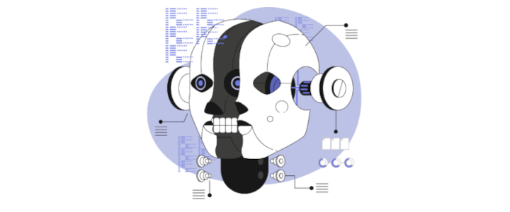
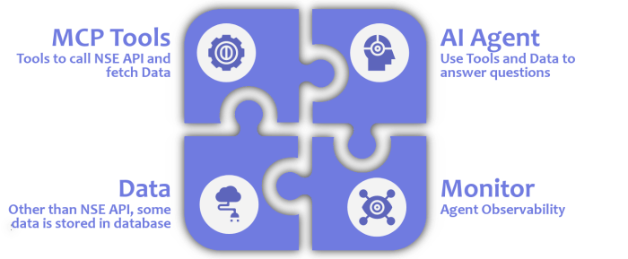
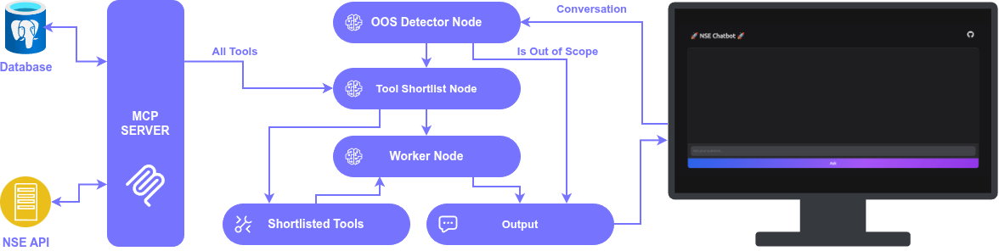

  

## Hey there, fellow AI enthusiast!

So, I recently conducted a session named "Anatomy of an AI Application" where we took a deep dive into the guts of a live AI project. When we think about building AI applications, it is incredibly easy to get overwhelmed by the sheer number of buzzwords flying around. To keep things grounded and practical, I walked through the architecture of a live NSE Chatbot project. We looked at how it handles data, routes tools, makes agentic decisions, and monitors every single move without spending a single dollar.

## Live Demo

Before we get into the "how," let’s look at the "what." To see the application in action, you can check out the live demo here at the [NSE Chatbot Website](https://nse-chatbot.azurewebsites.net). The codebase is completely public, so I highly recommend following along by exploring the [NSE Chatbot GitHub Repository](https://github.com/shakeelansari63/NSE-Chatbot/tree/main).

When you use the app, it smoothly handles financial queries that require multi-step reasoning. For instance, I ran two specific queries during the session:

* **"Give me current price of Infosys"**: Here, the agent first realizes it doesn't have the stock symbol. It translates "Infosys" to `INFY` and then calls the NSE API to get the latest price.

* **"Give me list of 3 pharmaceutical stocks"**: The agent queries the database where industry information is stored and filters the results by market capitalization to give the top three.

## Major parts of AI an Application
  

Now let's break down exactly how these components work internally.

## 1. The Core Data Layers

Our application relies on two distinct data sources to ensure the agent gives accurate, up-to-date answers.

* **Static and Structured Data**: We store company names, symbols, industries, and sectors inside our primary database. This isn't just a one-time upload; a background script refreshes this data every single morning with the latest information from the National Stock Exchange (NSE).

* **Dynamic Data**: Real-time information, like the fluctuating price of a stock, cannot be stored in a static database. For this, the agent pulls dynamic data at runtime directly via live NSE APIs.

The reasoning here is simple: you want your "lookup" data to be fast and local (database), while your "volatile" data must be fetched fresh from the source (API).

## 2. Decoupling Actions with MCP Tools

An agent is only as good as the tools it can use. To perform actions like searching for a company symbol or getting a stock price, I used the Model Context Protocol (MCP).

I chose MCP specifically because it is agent-framework agnostic. This means the tools we build are not locked into one specific library. If we decided to move away from our current setup in the future, these tools would remain completely reusable. This modularity is a massive win for long-term maintenance.

## 3. Orchestrating the Agent with LangGraph

  

The "brain" of the application is built using LangGraph. Instead of a single complex prompt trying to do everything, the architecture is split into specific nodes that handle different parts of the logic. In this application we have 3 Nodes: `OutOfScopeDetector`, `ToolShortlister`, and `Worker`. 

### Guarding the Graph with the OutOfScopeDetector Node

The conversation first goes to the `OutOfScopeDetector` node, which acts as the absolute first line of defense in our agent workflow. Before we spend any computational resources trying to fetch data or shortlist tools, we need to make sure the user is actually asking about something relevant. 

This node identifies if the user's question is related to the NSE and should be answered. If the query is irrelevant or completely out of scope, the graph immediately terminates right then and there. The application simply informs the user that it cannot answer that specific question, protecting our downstream resources from processing garbage inputs.

### What is a ToolShortlister Node and why is it Needed

If the question passes our initial scope detector, it moves along to the `ToolShortlister` node. In a large MCP environment, you might have 20 to 30 different tools. If you give all of them to an agent at once, you hit a few walls. First, it increases the token count, which costs more and slows down the response. Second, and more importantly, it raises the risk of hallucination. When an LLM has too many options, it can get confused and pick the wrong tool for the job. 

### How the Tool Shortlister Works

I didn't want the shortlister itself to hallucinate, so I kept its diet very lean. I didn't give it the full JSON schemas or deep descriptions of every tool. Instead, I gave my MCP tools very descriptive, human-readable names like `search_company_symbol_from_name` instead of just `search_company`.

The shortlister node receives only the list of these tool names and the user's question. Based on the clarity of the names, it identifies the small subset of tools actually needed and passes only those to the worker node. This "less is more" approach significantly improves accuracy.

### The Worker Node and LLM Choice

The worker node is a classic ReAct agent. It takes the user's question and the filtered tool list, decides which tool to call, processes the result, and finally answers the user. For the LLM, I utilized Groq's free tier running the `gpt-oss-20b` model. Groq provides incredible inference speeds, and their free-tier rate limits are surprisingly generous for a project of this scale.

## 4. Monitoring with LangSmith

You cannot run an agent reliably in production if you are flying blind. Monitoring helps us see the exact decisions the agent made, which tools were called, and where things might have gone sideways.

I used LangSmith for all agent monitoring and tracing. It is free and integrates perfectly with the LangChain/LangGraph ecosystem. By looking at the traces, we can see exactly which tools the `ToolShortlister` picked and track exactly when the `OutOfScopeDetector` triggered a termination. If the agent starts making weird choices, we can tweak the tool names or the node logic to get it back on track.

## 5. The User Interface and Hosting

For the UI, I wrote a simple, functional chat interface using Gradio. Gradio is a fantastic FOSS (Free and Open Source Software) tool developed by the HuggingFace team that lets you build machine learning interfaces in pure Python.

## How much did it cost me to build this app?

Finally, the part everyone asks about: **The Cost**. Here is the breakdown of how much I paid for building this entire production-grade stack:

| Component | Details | Cost |
| --- | --- | --- |
| **Source Control** | GitHub | $0.0 |
| **Hosting** | Azure App Service (F1 Instance) | $0.0 |
| **Backend Database** | Supabase (Nano Instance) | $0.0 |
| **NSE API** | Publicly available free endpoints | $0.0 |
| **LLM Compute** | Groq Free Tier | $0.0 |
| **Monitoring** | LangSmith Free Tier | $0.0 |
| | **_Total Cost_** | **_$0.0_** |
  
So, I did not pay a single penny for this entire project. It is a testament to how far the free-tier ecosystem has come for AI engineers.

## Acknowledging the Road Ahead

While this project covers the "anatomy" of a functional app, there are a few limitations to keep in mind. The Azure free tier does have a "cold start" issue where the app takes a moment to wake up. Additionally, the Groq free tier has rate limits that wouldn't support a massive viral user base.

There are also several advanced components I didn't cover in the session that every AI engineer should have on their radar:
  
* **Memory**: How do we keep context across days or weeks of conversation?  
* **HITL (Human in the Loop)**: How do we insert a human approval step before the agent performs a sensitive action?  
* **Agent-to-Agent Communication**: How do multiple specialized agents collaborate on a single complex goal?
  
Hopefully, this breakdown gives you a clear blueprint for your next AI project. Go ahead, check out the code, and start building!  
  
***Happy building***
