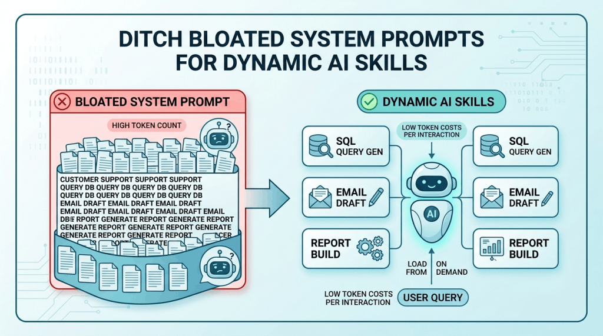
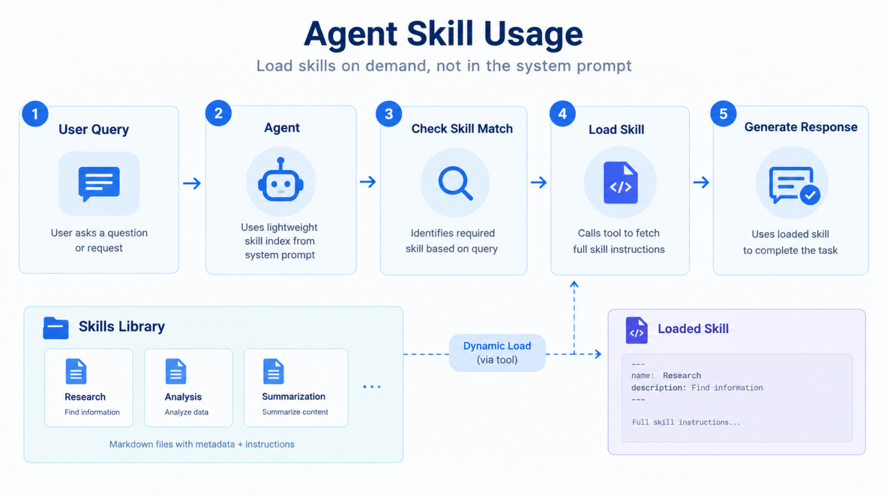
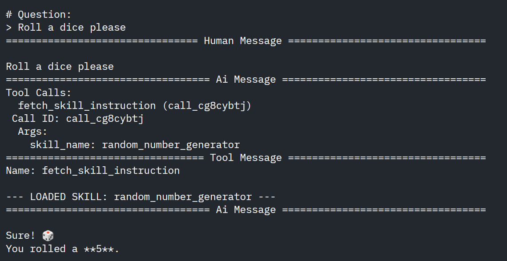
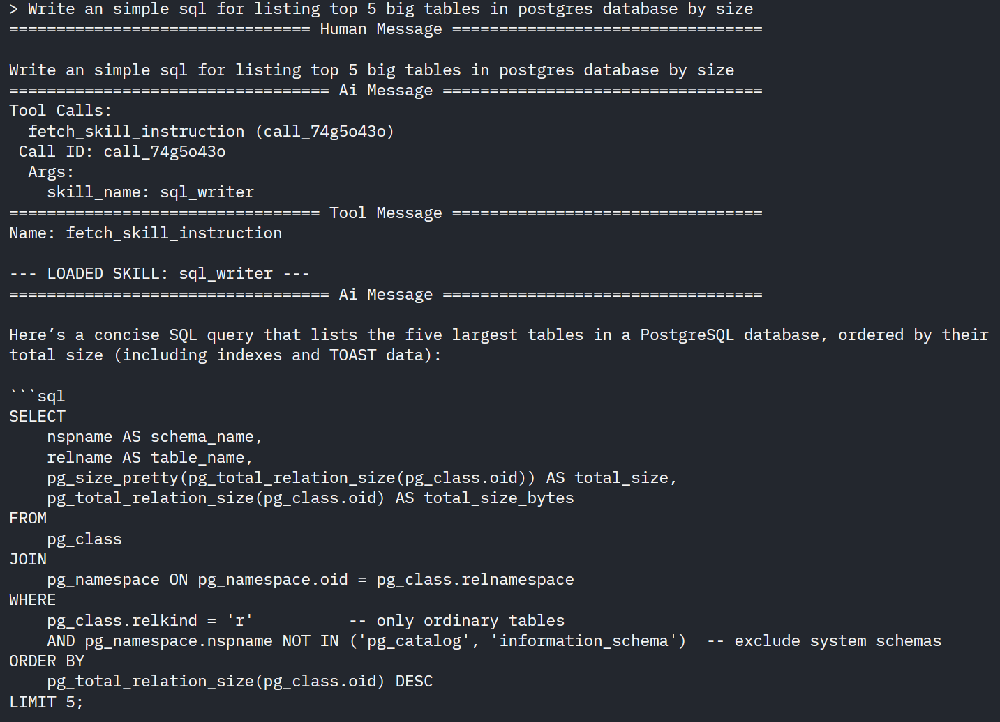

## Hey there, fellow AI builder! 🚀

Have you ever watched your AI agent slowly descend into chaos as you added more and more responsibilities to it? You start with a simple system prompt, but as your agent learns to handle more tasks and starts taking more responsibilities, that single system prompt turns into a massive wall of text. 🤯

And soon your agent is confused, ignores key instructions, and starts hallucinating. Recently, while building multi-task agents, I hit this exact wall and that's when I realized we need a much better way to manage instructions.

Today, lets explore how shifting from bloated system prompts to dynamically loaded Skills keeps your agent sharp, lowers your API bill, and makes your workflows hot-swappable. Let's dive in! 🎉

---

## The Bloated Prompt Problem

Traditionally, if you wanted an agent to handle multiple specialized tasks, you wrote all the instructions directly inside a single **System Prompt**.

A System prompt would looks something like this:

```text
You are a customer support agent.
- If the user asks about billing, follow these steps
    ... [100 lines]
- If the user asks for SQL queries, follow these rules
    ... [150 lines]
- If the user needs code reviews, apply this standard
    ... [200 lines]
...
```

As your agent takes on more responsibilities, every single request gets bloated with instructions for **every task**. This leads to two major issues:

1. **Context Distraction & Hallucination:** The model struggles to prioritize relevant instructions when surrounded by irrelevant clutter.
2. **High Token Costs:** You pay for thousands of static instruction tokens on every single turn of the conversation, even for simple greetings!

And **Skills** are designed to solve these exact problems.

---

## So, What Are Skills?

**Skills** represent a architectural paradigm shift where rather than baking every instruction into a static system prompt, you make instructions **modular**, **externalized**, and **dynamically loadable**.

Think of an Agent as an Engineer:
- **In Traditional Approach** we are forcing the engineer to memorize every company handbook, coding standard, and database schema before answering a single slack message.
- **In Skill Approach** we give the engineer an indexed bookshelf. When asked a specific question, they grab *only* the single handbook relevant to the task, read it, and answer.

With Skills, the agent receives only a lightweight index containing each skill's **Name** and **Description**. When a user request comes in, the agent looks at its index, decides which specialized skill it needs, and pulls only that skill's instructions into context on demand! 💡

### Core Structure of Skills

A skill typically consists of three simple parts:

* **Name:** A unique identifier for the skill (e.g., `sql_query_generator`).
* **Description:** A short summary telling the agent *when* and *why* to use it.
* **Instruction:** The actual, detailed prompt/rules required to execute the task.

Markdown files are the standard way to store skills, but they aren't mandatory! Whether you use local files or a remote database, all your agent needs is a tool that can retrieve those instructions when needed.

#### Sample Skill File

```markdown
---
name: sql_writer
description: Use this skill when the user asks to write, optimize SQL queries.
---
# SQL Generation Rules
- Default to PostgreSQL syntax unless another dialect is explicitly requested.
- Always use UPPERCASE for keywords (e.g., SELECT, FROM, WHERE).
- Wrap output in clean ```sql code blocks.
- Provide only SQL if SQL is asked. Do not try to explain the SQL unless asked for.
```

#### Dynamic Skill Approach:

```text
1. System Prompt  ->  Contains ONLY Skill Names + Short Descriptions
2. User Query     ->  Agent checks index for avaiable skills
3. Agent Tool     ->  Pulls full Skill Instructions into context on demand
```



---

## Implementing Skill based Agent in LangChain

Let's try to implement dynamic skill based agent step-by-step using Python and LangChain.

> 📁 **Full Code & Skill Files:** You can find the complete working repository, including example Markdown skill files, on GitHub: [Agent Skills Repository](https://github.com/shakeelansari63/random_programs/tree/master/Agent%20Skills).

### 1. Parsing Skill Files & Building the Index

First, we need a helper function to read our Markdown skill files from a directory (here `./skills` directory). As we saw in sample skill file above, each skill file uses YAML frontmatter (`---`) to define its `name` and `description`, while the rest of the file contains the detailed `instructions`.

```python
def parse_skill_file(filepath: str) -> dict[str, str]:
    """Extracts metadata and body instructions from a Markdown skill file."""
    with open(filepath, "r", encoding="utf-8") as f:
        content = f.read()

    if content.startswith("---"):
        parts = content.split("---", 2)
        if len(parts) >= 3:
            metadata = yaml.safe_load(parts[1])
            return {
                "name": metadata.get("name", os.path.basename(filepath)),
                "description": metadata.get("description", ""),
                "instructions": parts[2].strip()
            }

    return {
        "name": os.path.splitext(os.path.basename(filepath))[0],
        "description": "No description provided.",
        "instructions": content.strip()
    }

```

Next, we build a lightweight registration index that extracts *only* the names and short descriptions of all skills. This will be injected into Agent's system prompts to make them aware of the available skills.

```python
def build_skill_index() -> list[dict[str, str]]:
    """Builds the lightweight registration index for the system prompt."""
    index = []
    for filepath in glob.glob(os.path.join(SKILLS_DIR, "*.md")):
        skill = parse_skill_file(filepath)
        index.append({
            "name": skill["name"],
            "description": skill["description"]
        })
    return index
```

### 2. The Fetch Skill Tool

To allow the agent to pull full instructions on demand, we give it a dedicated tool: `fetch_skill_instruction`. When called with a skill name, it searches the disk and returns the full instruction text.

```python
@tool
def fetch_skill_instruction(skill_name: str) -> str:
    """Tool that retrieves the complete instruction set for a specific skill by name."""
    for filepath in glob.glob(os.path.join(SKILLS_DIR, "*.md")):
        skill = parse_skill_file(filepath)
        if skill["name"].lower() == skill_name.lower():
            return f"--- LOADED SKILL: {skill['name']} ---"
    return f"Error: Skill '{skill_name}' was not found."

```

### 3. Injecting the Index into System Prompt

Now, we build the core system prompt. Notice how lightweight it remains! It instructs the agent to inspect the index and call `fetch_skill_instruction(skill_name)` *before* answering whenever a task matches a skill's description.

```python
def build_system_prompt() -> str:
    """Injects only skill names and descriptions into the agent's core prompt."""
    skills = build_skill_index()
    skills_list_str = "\n".join([f"- **{s['name']}**: {s['description']}" for s in skills])

    return (
        "You are an adaptable AI Assistant capable of executing specialized tasks.\n"
        "You have access to a library of Skills. When a user query matches a skill's description, "
        "you MUST call `fetch_skill_instruction(skill_name)` BEFORE providing your answer.\n\n"
        f"AVAILABLE SKILLS INDEX:\n{skills_list_str}"
    )

```

### 4. Running the Agent Loop

Finally, we initialize our model (here using `ChatOpenAI` connected to a local Ollama endpoint), attach our tool, inject the lightweight system prompt, and kick off an interactive execution loop:

```python
def main():
    llm = ChatOpenAI(
        base_url="http://localhost:11434/v1",
        api_key=SecretStr("ollama"),
        model="gpt-oss:20b-cloud",
        temperature=0,
    )

    tools = [fetch_skill_instruction]

    system_prompt = build_system_prompt()
    agent = create_agent(model=llm, system_prompt=system_prompt, tools=tools)

    print("Enter 'stop' / 'bye' / 'quit' / 'exit' to stop execution...")

    # Run Loop
    while True:
        print("\n# Question: ")
        user_query = input("> ")

        if user_query.lower() in ("bye", "stop", "quit", "exit"):
            print("Bye 👋")
            break

        query = InputAgentState(messages=[HumanMessage(user_query)])
        events = agent.stream(query, stream_mode="values")
        for event in events:
            event["messages"][-1].pretty_print()

if __name__ == "__main__":
    main()

```

## Sample Output

I ran the Agent with some skills and you can see the output below. 

#### Here is simple question to roll a dice

In order to roll a dice, the agent used random number generator skill.



#### Here is another question to generate an SQL

In order to generate SQL, agent used sql generator skill.



---

## Why Should You Use Skills

Adopting an Agent Skills architecture yields immediate benefits for real-world AI applications:

* **Zero Context Cross-Contamination:** The agent operates with pure focus, drastically reducing hallucinations caused by contradictory or irrelevant rules from other tasks.
* **Drastic Cost & Latency Reduction:** You stop sending thousands of unnecessary static instruction tokens on every API call.
* **Hot-Swappable Workflows:** You can add, edit, or remove skills in a folder or database table without re-deploying your application code or resetting conversational state.

---

## The Road Ahead

While Agent Skills make your system prompt lean and efficient, keep these practical considerations in mind as you scale:

* **Tool Call Overhead:** Pulling a skill requires an extra tool-use hop before generating the final answer, which adds a slight round-trip delay on the first turn.
* **Index Management:** If you end up with hundreds of skills, even the index (names + descriptions) can grow large. In those cases, you may need a vector database to search skills semantically rather than listing all of them in the prompt.
* **Skill Formatting Consistency:** Your skill instructions need consistent formatting so the agent knows how to interpret and execute them once loaded.

---

## Wrap-Up

Moving from bloated system prompts to dynamic Agent Skills is one of the easiest ways to level up your AI applications. By giving your agent a lightweight skill index and the ability to fetch detailed instructions on demand, you gain a cleaner context window, eliminate instruction crosstalk, and keep token costs low! 📊

Head over to the [GitHub repository](https://github.com/shakeelansari63/random_programs/tree/master/Agent%20Skills) to grab the code and start modularizing your agent workflows today.

Catch you in the next one! Till then, *Happy Building!* 🛠️
