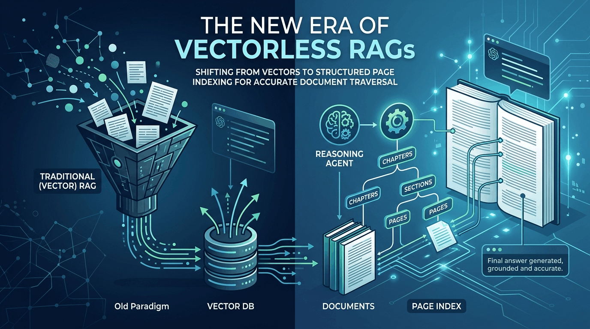
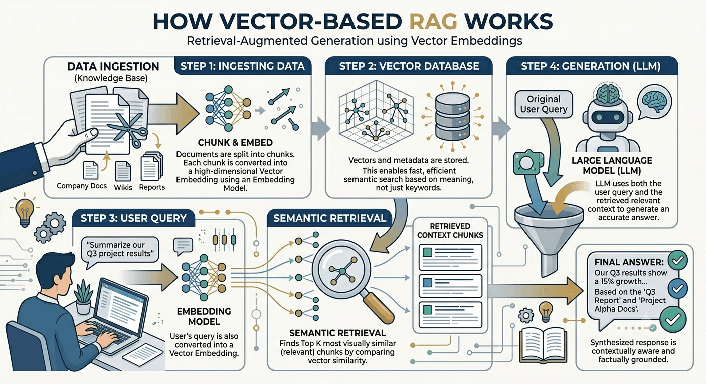
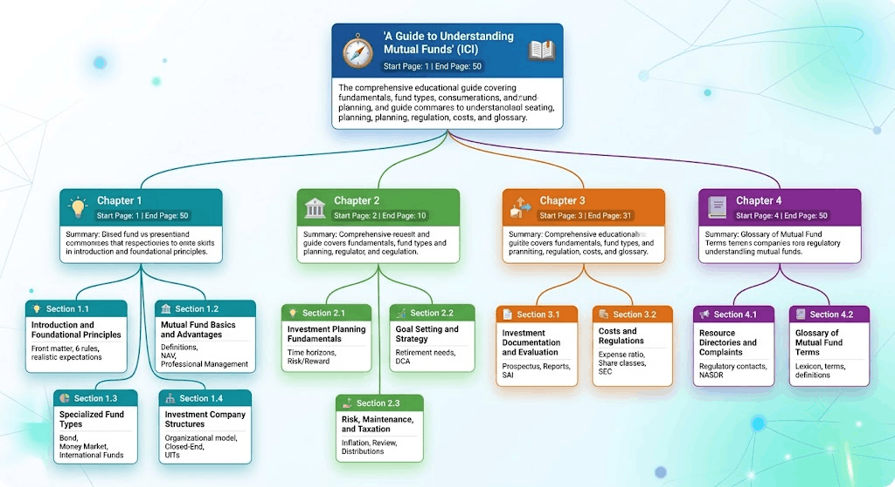
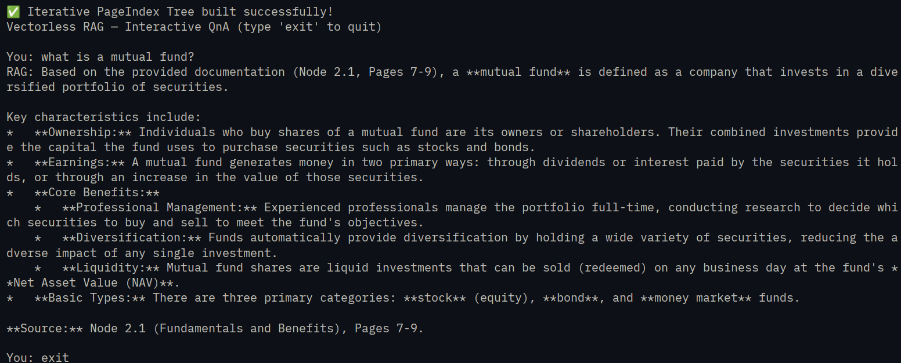

## Hello, tech enthusiasts and AI builders!

If you have built any application using Large Language Models (LLMs) over the past couple of years, you have almost certainly crossed paths with Retrieval-Augmented Generation (RAG). It has practically become the default architecture for grounded AI applications. But the industry is shifting, and a new paradigm is gaining traction: Vectorless RAG. Today, we are diving deep into why this shift is happening and how you can implement a vectorless RAG setup yourself using a structured page-index strategy.

## So, What Exactly is a RAG?

Before we look at what is changing, let us establish what we are building on. RAG is a technique used to improve the accuracy of Large Language Models (LLMs). Instead of relying solely on the information the AI was originally trained on, a RAG system fetches up-to-date or specific facts from external sources (like your private documents or the live internet) and feeds them to the AI to generate a highly accurate, fact-based response.

## Why did RAG become the Industry Standard

It did not take long for the tech world to adopt RAG as a foundational pattern. The architecture achieved industry-standard status quickly because it solved three massive problems:

* **Improved Accuracy:** It anchors model responses to verified reference material.
* **Works with Changing Data:** You do not need to retrain a massive model every time a document updates; you just update the connected data source.
* **Reduces Hallucination:** By providing strict context boundaries, the LLM is far less likely to invent fictitious details.

## The Traditional Approach: Vector-Based RAG

To understand the vectorless evolution, we should first inspect how the traditional approach handles data. Traditionally, we chunk a document, run those text pieces through an embedding model, and store the resulting math vectors into a specialized database.



Here is a high-level Python script using LangChain and Chroma to show how this traditional workflow is typically put together:

```python
from pathlib import Path

from langchain_chroma import Chroma
from langchain_community.document_loaders import PyPDFLoader
from langchain_core.output_parsers import StrOutputParser
from langchain_core.prompts import ChatPromptTemplate
from langchain_core.runnables import RunnablePassthrough
from langchain_openai import ChatOpenAI, OpenAIEmbeddings
from langchain_text_splitters import RecursiveCharacterTextSplitter
from pydantic import SecretStr

# Using Ollama with OpenAI API Spec
LLM_BASE_URL = "http://localhost:11434/v1"
LLM_API_KEY = SecretStr("ollama")
LLM_MODEL = "gemma4:31b-cloud"
EMBEDDING_MODEL = "embeddinggemma:latest"

# Local Files
KNOWLEDGE_FILE = Path(__file__).parent / "understanding-mutual-funds.pdf"
CHROME_STORE = Path(__file__).parent / "chroma_db"

# LLM and Embedding Models
llm = ChatOpenAI(
    base_url=LLM_BASE_URL,
    api_key=LLM_API_KEY,
    model=LLM_MODEL,
    temperature=0,
)

embeddings = OpenAIEmbeddings(
    base_url=LLM_BASE_URL,
    api_key=LLM_API_KEY,
    model=EMBEDDING_MODEL,
    check_embedding_ctx_length=False,
)

# Read PDF Files
loader = PyPDFLoader(KNOWLEDGE_FILE)
documents = loader.load()

# Split Documents into Chunks
text_splitter = RecursiveCharacterTextSplitter(
    chunk_size=1000,
    chunk_overlap=200,
)
chunks = text_splitter.split_documents(documents)

# Create Chroma DB Vector Store
vector_store = Chroma.from_documents(
    documents=chunks,
    embedding=embeddings,
    persist_directory=str(CHROME_STORE),
)

# Create Retriever for vector search
retriever = vector_store.as_retriever(search_kwargs={"k": 3})

# Create Prompt Template
prompt = ChatPromptTemplate.from_template("""
Answer the question based on the context below.
Note: Provide a definitive answer quoting the precise page numbers utilized to answer question.
Context: {context}
Question: {input}
Answer:
""")


# Join function to combine retrieved documents
def join_docs(docs):
    return "\n\n".join(doc.page_content for doc in docs)


rag_chain = (
    {"context": retriever | join_docs, "input": RunnablePassthrough()}
    | prompt
    | llm
    | StrOutputParser()
)

# Run the RAG
if __name__ == "__main__":
    print("Traditional Vector RAG — Interactive QnA (type 'exit' to quit)\n")
    while True:
        query = input("You: ")
        if query.lower() in ("exit", "quit"):
            break
        result = rag_chain.invoke(query)
        print(f"RAG: {result}\n")

```

At a high level, this script ingests a PDF file, slices its content into chunks of 1000 characters, embeds them into a numerical vector space using an embedding model, and saves them in a Chroma vector store. When a user queries the application, the system converts the query into an embedding, performs a mathematical similarity match against the database to fetch the top 3 closest matching chunks, and forwards those chunks to the LLM context to compile the final answer.

### Here is Output from this RAG


## Crucial Limitations of Traditional RAG

While vector-based RAG works well for straightforward phrase matches, it hits severe operational walls when processing complex, highly structured business or engineering documents:

* **Loss of Semantic Relation:** Forcing text into arbitrary character chunks shears structural flow, separating headings from their descriptive bodies.
* **The Nearest-Neighbor Fallacy:** Vector search assumes that the closest semantic match in mathematical space is the correct answer. Often, the real answer requires aggregating contextual summaries across separate areas rather than pulling isolated snippets.
* **Broken In-Document References:** Internal pointers, cross-references, or sequential transitions are lost entirely during the chunking phase.
* **Infrastructure Overhead:** Teams must deploy, scale, and maintain an entirely separate specialized vector database asset alongside their standard production databases.

## Enter Vectorless RAG with Page Index

To address these flaws, the industry is experimenting with structured layouts that mimic how humans actually read books. Instead of breaking texts into disjointed vectors, we build a conscious hierarchical map of the document pages. This is the core logic driving the PageIndex strategy, where an engine leverages LLM intelligence to build and read a dynamic, structured representation of the text instead of relying on raw math similarity distances.

Let us look at a deep implementation of a vectorless RAG setup utilizing a recursive page-index structure:

```python
import json
from pathlib import Path
from typing import Dict, List

from langchain.agents import create_agent
from langchain_community.document_loaders import PyPDFLoader
from langchain_core.prompts import ChatPromptTemplate
from langchain_core.tools import tool
from langchain_openai import ChatOpenAI
from pydantic import BaseModel, Field, SecretStr

# Using Ollama with OpenAI API Spec
LLM_BASE_URL = "http://localhost:11434/v1"
LLM_API_KEY = SecretStr("ollama")
LLM_MODEL = "gemma4:31b-cloud"  # "gpt-oss:20b-cloud"

# Local Files
KNOWLEDGE_FILE = Path(__file__).parent / "understanding-mutual-funds.pdf"

# LLM and Embedding Models
llm = ChatOpenAI(
    base_url=LLM_BASE_URL,
    api_key=LLM_API_KEY,
    model=LLM_MODEL,
    temperature=0,
)

# Read PDF Files
loader = PyPDFLoader(KNOWLEDGE_FILE)
documents = loader.load()
page_db: Dict[int, str] = {i + 1: page.page_content for i, page in enumerate(documents)}


# Define Schema for PageIndex Node
class PageIndexNode(BaseModel):
    node_id: str = Field(
        description="Unique identifier for the node, e.g., '0001', '0002'"
    )
    title: str = Field(
        description="Human-readable title or label of the section/chapter"
    )
    start_page: int = Field(description="The starting page number of this section")
    end_page: int = Field(description="The ending page number of this section")
    summary: str = Field(
        description="A detailed summary of what is discussed in this segment."
    )
    sub_nodes: List["PageIndexNode"] = Field(
        default=[], description="Nested child sub-nodes"
    )


# This is needed as we have PageIndexNode references within PageIndexNode
PageIndexNode.model_rebuild()


# Method to Build leaf nodes of page index
def build_leaf_nodes(pages_data: Dict[int, str], chunk_size: int = 5) -> List[dict]:
    """
    Step 1: Loop through the document sequentially in small page blocks.
    This protects the context window from blowing up.
    """
    leaf_nodes = []
    total_pages = len(pages_data)

    leaf_prompt = ChatPromptTemplate.from_template("""
    You are a document analyzer. Summarize the structural and informational content of pages {start_page} to {end_page}.
    Identify the main chapter names, sections, or topics covered here.

    Raw Content:
    {text_content}

    Return a comprehensive summary of this specific page range. Include key headings or tables found.
    """)

    leaf_chain = leaf_prompt | llm

    # Process pages in blocks of `chunk_size`
    for start in range(1, total_pages + 1, chunk_size):
        end = min(start + chunk_size - 1, total_pages)

        # Combine text for the current chunk
        chunk_text = ""
        for p in range(start, end + start_page * 0):  # Fix scoping access to global keys
            if p in pages_data:
                chunk_text += f"--- PAGE {p} ---\n{pages_data[p]}\n\n"

        print(f"   ↳ Summarizing pages {start} to {end}...")
        summary_response = leaf_chain.invoke(
            {"start_page": start, "end_page": end, "text_content": chunk_text}
        )

        # Append as a basic primitive node
        leaf_nodes.append(
            {"start_page": start, "end_page": end, "summary": summary_response.content}
        )

    return leaf_nodes


# Build a PageIndex Tree from leaf nodes
def merge_leaves_into_tree(leaf_nodes: List[dict]) -> str:
    """
    Step 2: Take the compiled micro-summaries and recursively merge them
    into a structured hierarchical JSON tree.
    """
    merge_prompt = ChatPromptTemplate.from_template("""
    You are an expert document architect. Your task is to take a flat list of localized page range summaries and organize them into a clean, hierarchical, recursive PageIndex Tree.

    Combine adjacent ranges that belong to the same logical topics/chapters into parent nodes, and nest individual sections inside them as sub_nodes.
    When Generating the PageIndexNode Parent by combining 2 or more adjacent leaf nodes, make sure to appropriately update summary, title, start page and end page range values on parent node.

    Flat List of Page Summaries:
    {leaf_nodes_json}

    Produce a complete root-level PageIndexNode JSON object mapping to the requested schema layout.
    Respond with only the JSON object, no additional text.
    No explanation, no additional commentary, no extra words.
    Do not surround the JSON object in markdown code blocks or quotes.

    Sample Output:
    {{
        "node_id": "001",
        "title": "...",
        "start_page": xx,
        "end_page": yy,
        "summary": "...",
        "sub_nodes": [
            {{
                "node_id": "002",
                "title": "...",
                "start_page": xxx,
                "end_page": yyy,
                "summary": "... ...",
                "sub_nodes": [ ... ]
            }},
            ...
        ]
    }}
    """)

    structured_llm = llm.with_structured_output(PageIndexNode)
    merge_chain = merge_prompt | structured_llm

    # Convert our list of leaves to JSON strings for the LLM to process
    result = merge_chain.invoke({"leaf_nodes_json": json.dumps(leaf_nodes, indent=2)})

    final_pageindex_tree = json.dumps(result.model_dump(), indent=2)
    print(f"PageIndex Tree: {final_pageindex_tree}\n")
    return final_pageindex_tree


# Build the PageIndex Tree
flat_leaf_data = build_leaf_nodes(page_db, chunk_size=5)
dynamic_tree_context = merge_leaves_into_tree(flat_leaf_data)
print("✅ Iterative PageIndex Tree built successfully!")


# Now Create a tool for fetching pages content by starting and ending page numbers
@tool
def fetch_pages_content(start_page: int, end_page: int) -> str:
    """
    Use this tool to pull the raw text of specific pages after evaluating summaries in the PageIndex tree structure.
    """
    output = []
    start = max(1, start_page)
    end = min(len(page_db), end_page)

    for page_num in range(start, end + 1):
        content = page_db.get(page_num, "Page not found.")
        output.append(f"--- CONTENT OF PAGE {page_num} ---\n{content}\n")
    return "\n".join(output)


# Setup Agent system prompt embedding the dynamically built index tree
system_prompt = f"""You are an advanced reasoning-based RAG assistant operating on a PageIndex platform.
You do not use vector embeddings or semantic similarity matching. Instead, you dynamically evaluate a hierarchical document structure.

Below is the dynamically generated, JSON-based Table of Contents (PageIndex tree) for this document. It contains node IDs, hierarchical child sub-nodes, page boundaries, and recursive summaries.

{dynamic_tree_context}

Your Workflow Strategy:
1. Examine the user's question and map it conceptually against the 'summary' properties within the hierarchical nodes and sub_nodes above.
2. Trace the index tree to isolate which node or child sub_node is uniquely positioned to hold the ground truth.
3. Call the `fetch_pages_content` tool for the specific `start_page` and `end_page` coordinates assigned to that node.
4. If the raw content you read instructs you to seek context elsewhere (e.g., 'see statistical breakdowns on page 24'), cross-reference it back to your PageIndex tree to locate that page range, and fetch those pages recursively.
5. Provide a definitive answer quoting the precise node paths and page numbers utilized.
"""

# Initialize the Agent Executor loop
tools = [fetch_pages_content]
agent = create_agent(
    model=llm,
    tools=tools,
    system_prompt=system_prompt,
)

# Run the RAG
if __name__ == "__main__":
    print("Vectorless RAG — Interactive QnA (type 'exit' to quit)\n")
    while True:
        query = input("You: ")
        if query.lower() in ("exit", "quit"):
            break
        result = agent.invoke({"messages": [{"role": "user", "content": query}]})
        print(f"RAG: {result['messages'][-1].content}\n")

```

Let us look closely at how this page index system is actually implemented. First, we load our text and structure it as a clean dictionary map sorted by physical page numbers. Next, the `build_leaf_nodes` function runs sequentially through small page blocks (e.g., blocks of 5 pages) to generate foundational micro-summaries without risk of overflowing the model context window.

Once these leaf-level records are generated, they are fed into `merge_leaves_into_tree`. This function uses LangChain structured output capability to synthesize a nested, hierarchical `PageIndexNode` tree layout complete with unique IDs, parent titles, consolidated summary mappings, and dynamic page range boundaries. Finally, we stand up an interactive reasoning agent. The system injects the full tree structure into the agent system prompt and provides an executable custom tool (`fetch_pages_content`) that extracts localized, full-page content whenever the agent navigates to a designated node branch.

### Sample Page index for PDF Ingestion



### And here is output of Page Index based vectorless RAG



## How Vectorless Indexing Fixes Traditional Bottlenecks

By shifting the system from numerical calculation toward reasoning navigation, we effectively bypass the structural bugs of basic text chunking:

* **Context Preservation:** The framework explicitly maintains logical connections by analyzing consecutive blocks of text and building parent summaries over them instead of dividing text pieces randomly.
* **Exact Multi-Page Tracing:** The agent evaluates parent summaries and child routes intentionally, enabling it to pinpoint complex cross-referenced components spread over widely separated sections.
* **Structural Context Survival:** Headings, logical page flows, and structural indices stay unified because the system operates over native structural pages rather than sliced token boundaries.

## The Trade-offs of Going Vectorless

While this architecture avoids vector database complexities, it does come with specific operational costs that you must evaluate before implementing it in production:

* **High Query-Time Costs:** Because retrieval relies on a language model iteratively traversing, reasoning, and selecting nodes in a tree, it calls the model repeatedly during the search path.
* **Increased Latency:** The requirement for multiple LLM calls to process summaries and traverse the index inherently introduces response delays compared to sub-millisecond database vector matching.
* **Over-Reliance on LLM Reasoning:** If the LLM mischaracterizes a section summary during the initial indexing phase, or if the reasoning agent chooses the wrong branch of the tree, it will completely miss the factual section.
* **Compounding API Token Expenses:** Running active reasoning iterations over a JSON tree layout consumes significantly higher token counts than simple k-nearest neighbor retrieval setups.

## Where to Look Next

If you want to read deeper on how this paradigm operates in production, check out the core concepts on the [PageIndex Blog](https://pageindex.ai/blog/pageindex-intro). I have also uploaded complete working scripts for both the vector-based model and this vectorless system in this [GitHub Repository](https://github.com/shakeelansari63/random_programs/tree/master/RAG) so you can pull down the files and benchmark them side by side on your local environments.

Let me know what you think about ditching embeddings for explicit document indices. Catch you in the next post!

***Happy indexing***
