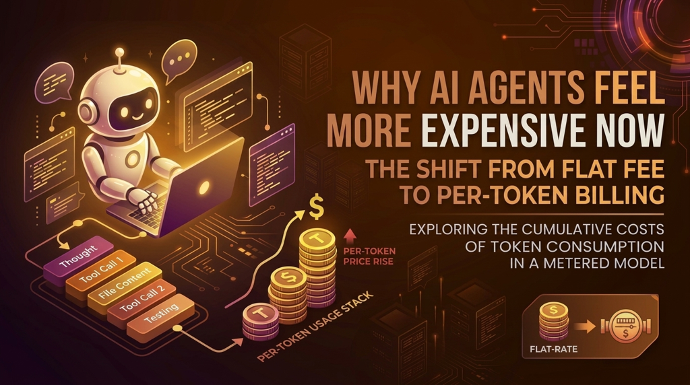
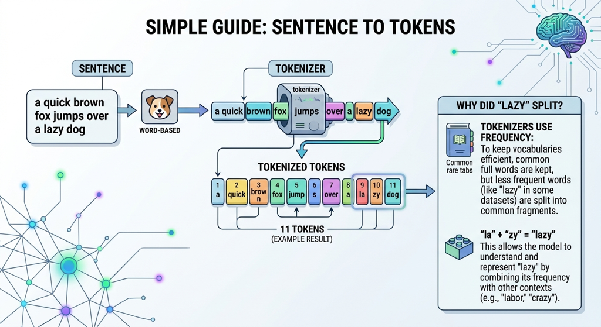
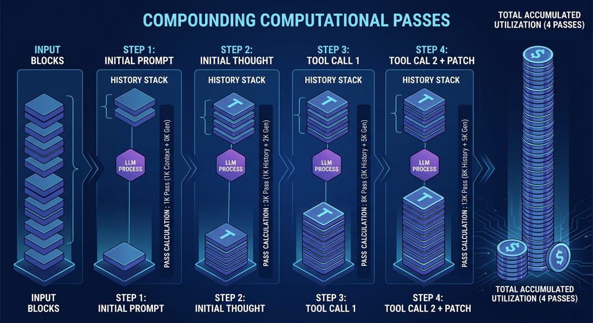

  
  
## Hey there, fellow developer!

If you’ve experimented with the latest AI coding agents, you've probably been amazed by how they navigate complex codebases and fix bugs on their own. However, if your tools have recently switched from a flat monthly fee to per-token API billing, you are likely feeling a major financial pinch.  

#####  
The question isn't just "Why is AI expensive?" but rather: **Why do AI agents *feel* so much more expensive right now?**  

The answer comes down to a major shift in how these tools are priced. Flat-rate subscriptions used to act as a buffer, hiding the massive volume of data processing that autonomous agents do under the hood. Now that the industry is moving to usage-based billing, developers are facing the raw math that powers AI agents. 

Let's look at how Large Language Models (LLMs) process data and why autonomous loops are so resource-intensive.

## What is a Token?

Before looking at how AI agents work, we need to understand what they are actually processing. LLMs don’t read text character-by-character or word-by-word. Instead, they break text down into smaller units called **tokens**.

* **The Anatomy of a Token:** Tokens are pieces of words, which include punctuation and spaces. On average, 100 words equal about 130 to 140 tokens.
* **The Selection Mechanism:** LLMs break text into these units based on how often they appear in their training data. This helps them predict the next likely token in a sentence.

  
  
Tokens are the basic currency of an LLM. To understand why our bills are climbing, we need to look at how agents interact with these tokens continuously during a session.

## The Auto-regressive Inefficiency
The biggest bottleneck stems from how modern LLMs operate. They are *auto-regressive*, meaning they generate text one single token at a time. To generate each new token, the model must re-process the entire conversation history from the very beginning.

While advanced techniques like KV caching help speed this up by storing calculations in memory, the process is still incredibly resource-intensive. When you put an autonomous agent into this loop, the math gets expensive very quickly.

---

## The Agentic Cost Problem

Unlike a standard chatbot that replies to your prompt and stops, an AI coding agent works on its own. To solve a single bug, an agent loops through multiple steps, creating tens of thousands of tokens along the way:

1. **Internal Monologues:** It "thinks" by writing out its own reasoning steps.
2. **Executing Actions:** It uses tools to read files, run terminal commands, or check directories.
3. **Context Re-injection:** It feeds the entire history and tool outputs back into its memory for the next step.

### Making the Invisible, Visible
This internal complexity has always been there. When you paid a flat $20 a month, the provider absorbed the cost of this massive processing. Now that providers are moving to metered billing, you are billed directly for every single "thought," "tool call," and "file read." 

---

## Step-by-Step Breakdown of a Bug Fix

Let's say you ask an agent to fix a bug with a simple request: *"Fix this bug in my login code."*

Here is how that short request turns into a compounding mountain of tokens behind the scenes.

  

### 1. The Initial Prompt
The process starts with a heavy system prompt containing rules on how the agent must behave, combined with your query.
* **Cost:** **1,000 to 2,000 tokens** immediately.

### 2. The Initial Thought
The agent evaluates your request and writes out its internal reasoning to plan its next move. This text is added to the hidden conversation history.
* **Cost:** Adds another **2,000 tokens**.

### 3. First Tool Call & Data Injection
The agent decides to look at your code. It makes a tool call (100 tokens) to read your login file. The system runs the tool and pastes the raw file content (5,000 tokens) back into the conversation history.
* **The Growing History:** To take the next step, the model must now re-read: *System Prompt + User Query + Initial Thought + Tool Call + File Content*. This single step adds **5,000 to 6,000 tokens** to the queue.

### 4. Second Tool Call & Cumulative Growth
The agent reviews the file, thinks again (**2,000 tokens**), and realizes it needs a configuration file. It triggers a second tool call (**100 tokens**) and pulls in the second file (**4,000 tokens**).
* **The Compounding Problem:** Every new step must include *all* previous context. This step adds another **5,000 to 6,000 tokens** of history.

### 5. Final Solution & Response
After another round of internal thinking, the agent generates a code patch (**2,000 tokens**) and sends a brief success message (**50 tokens**) to your screen.

While you only see a neat, 50-token success message, the engine had to process an immense amount of data to get there.

---

## The Compounding Effect: Calculating the Math

By the end of this process, you aren't just paying for the final code. You are paying the provider to re-read the entire accumulated history every single time the agent takes a step. 

Here is the math for our simple 2-tool-call example:

| Pass Step | Components Processed in the Forward Pass | Pass Token Cost |
| :--- | :--- | ---: |
| **1. First Step** | Initial System Prompt & User Query | 1,000 tokens |
| **2. Initial Thought** | Step 1 Context + Internal Reasoning Generation | 3,000 tokens |
| **3. Tool Call 1** | Step 1 & 2 Context + First File Output Injection | 8,000 tokens |
| **4. Tool Call 2** | Step 1, 2, & 3 Context + Second File Output Injection | 13,000 tokens |
| **5. Code Patch** | Step 1, 2, 3, & 4 Context + Final Response Generation | 15,000 tokens |
| | **Total Combined Token Utilization** | **40,000 tokens** |

> **Keep in Mind:** A total of **40,000 tokens** is a very conservative estimate. In a real-world project, an agent might easily make **10 to 15 tool calls** to explore folders, run tests, fix failing test logs, and deliver a final fix.

This repetition explains why a minor code change can burn through **50,000 to 60,000 tokens** in seconds. Providers can mask this behind a flat subscription, but it becomes incredibly expensive on a usage-based plan.

---

## The Road Ahead

As pricing models shift to usage-based billing, development teams are running into two major roadblocks: 
  
* **Unpredictable Budgets:** Measuring engineering tools by token consumption makes costs highly volatile. Stable monthly software budgets are being replaced by unpredictable bills.
* **Context Overload:** Long agent sessions can run out of memory or hit maximum token limits, forcing developers to manually clean up the conversation history.
  
## Future Outlook
AI agents are incredibly powerful, but they aren't always the right tool for the job. For simple tasks, shorter prompts or traditional code completion tools (like LSPs) are much cheaper and faster. 

As the flat-rate subscription era ends, developers will need to learn when a problem genuinely justifies the expensive math of an autonomous agent, and when to stick to simpler tools.
  
If you want to dive deeper into how this math works, check out this excellent video by **Computerphile** on YouTube:  
↳ **[Why AI Tokens are so Expensive - Computerphile](https://www.youtube.com/watch?v=-0HRzXk8vlk)**  
  
Hopefully, this breakdown gives you a clearer window into how your AI tools process data behind the scenes. 

###  
See you in the next post. *Happy Coding!* 💻
