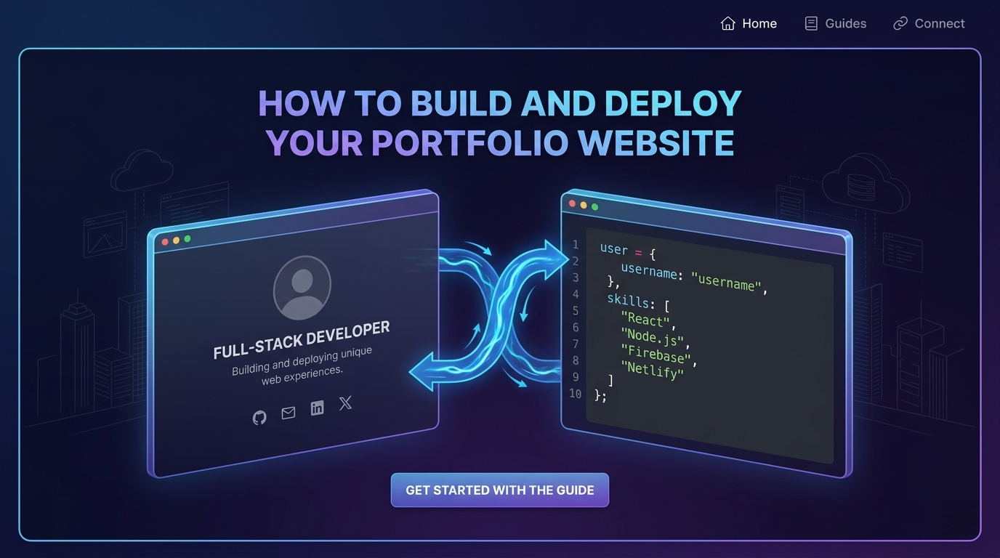
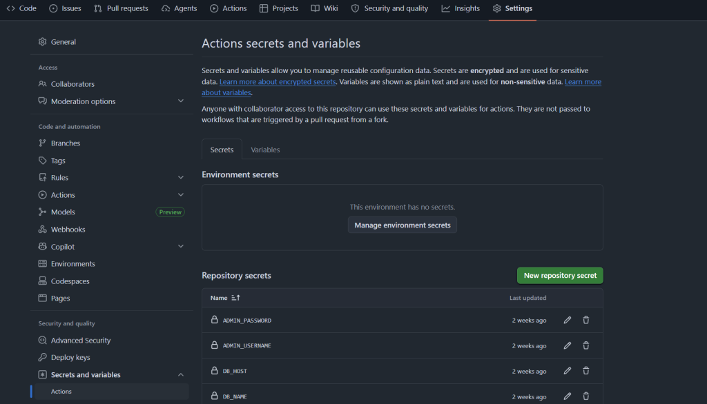
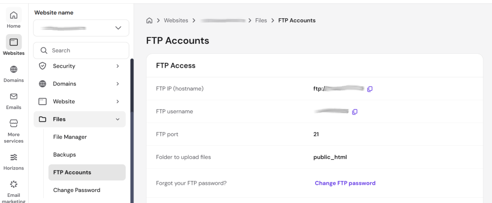
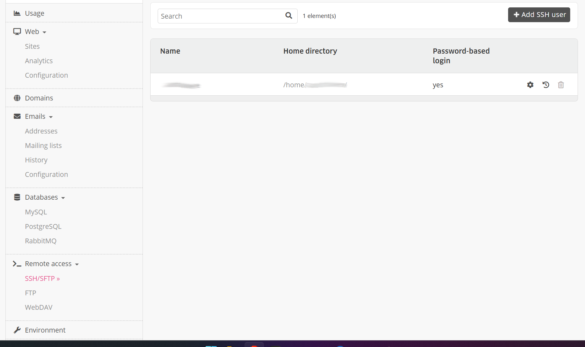
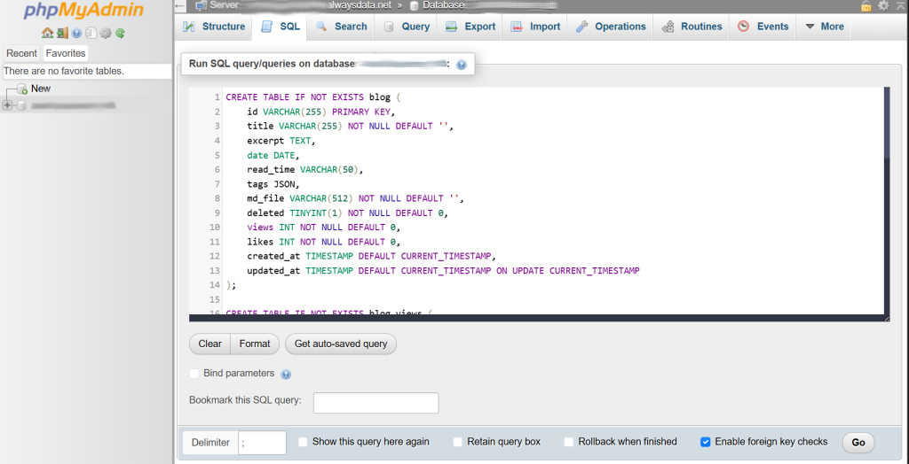

## Hey there, digital creators!

When I posted my first blog on my [personal website](https://shakeelansari.me/blog), a lot of readers reached out to ask how I built it.   
  
Managing your online presence is crucial today, and having a central hub you fully control makes a massive difference.  
  
Today, I am sharing the exact blueprint of how my portfolio website works. I will walk you through the architecture, explain why I chose this specific technology stack, and show you how to fork, configure, and automate the deployment of your own version using GitHub Actions.

## TL;DR: Quick Summary of the Deployment Process

Here is a high-level view before we dive deep into the technical details:

* **Choose Your Hosting Platform:** Select a web host that fits your budget. I chose Hostinger for my domain and web hosting, but you can use any provider or explore free hosting options like AlwaysData.
* **Fork the Repository:** Create your own copy of the codebase from my [GitHub repository](https://github.com/shakeelansari63/ShakeelAnsari.Me) to start customizing it.
* **Update Your Variables:** Modify the deployment configuration details in your `.github/workflows/deploy.yml` pipeline file and insert your personal professional history into the `ui/src/data/` data scripts.
* **Configure Repository Secrets:** Add your secure access keys, database passwords, and FTP connection details to your GitHub project settings.
* **Commit and Push:** Save your changes and push them to your main branch. The automated automation pipeline will instantly compile, build, and deploy your site to production.

Now that you see how streamlined the workflow is, let us break down each section in full detail.

## The Architecture and Tech Stack

To keep things efficient and highly performant, the project is structured as a decoupled application combining a modern frontend with a lightweight backend.

```txt
├── ui/          – React frontend (Vite)
├── api/         – PHP API backend (Slim Framework)
├── blogs/       – Markdown blog posts and images
├── products/    – Markdown product pages
├── prompts/     – Reusable AI system prompts
├── tutorial/    – Multi-subject tutorial content
└── .github/     – CI/CD workflow
```

For the core layers, the technologies are distributed as follows:

* **Frontend:** Built with React 18, TypeScript, Vite, PrimeReact, and PrimeFlex.
* **Backend:** Powered by PHP 8.1+ using the Slim Framework 4, PDO, and JWT Authentication.
* **Database:** Powered by MySQL to handle dynamic view tracking, likes, and tutorial structures.
* **Automation:** Orchestrated via GitHub Actions sending builds directly over FTP.

I chose this specific stack because it balances dynamic features with incredibly affordable hosting constraints.

## Understanding the Hosting Choices

When picking a home for your website, your budget dictates your infrastructure. For my personal setup, I purchased a domain and a Single Website Plan from [Hostinger](https://www.hostinger.com/). This cost me approximately ₹4000 for a 2-year plan.

Hostinger's single website plan limits you to PHP, MySQL, and static assets generated by JavaScript frameworks like React. Because of these constraints, a Node.js backend was out of the question, making the PHP Slim Framework the perfect lightweight alternative.

If you are not looking to spend money right now, you can explore alternative services like [AlwaysData](https://www.alwaysdata.com/). They offer a free tier that includes PHP and MySQL support alongside free hosting space, which perfectly fits this codebase.

## Step-by-Step Setup and Configuration

If you want to spin up your own instance of this platform, the process is straightforward. Follow these steps to get your local environment running.

### 1. Repository Preparation

First, fork my repository to your own GitHub account. You can find the complete source code and structure at [https://github.com/shakeelansari63/ShakeelAnsari.Me](https://github.com/shakeelansari63/ShakeelAnsari.Me).

### 2. Local Dependencies

Make sure you have Node.js 20+, PHP 8.1+, Composer, and a MySQL server installed on your system. Run the setup command to pull down all necessary packages:

```bash
cd ui && npm install
cd api && composer install

```

### 3. Environment Settings

Copy the template environment file by executing `cp api/.env.template api/.env`. Open the new `.env` file and fill in your admin credentials and JWT secret. 

### 4. Database Initialization

If you are utilizing MySQL, create a database and import the schema file:

```bash
mysql -u root -p your_database_name < api/db/schema.sql

```

This sets up five critical tables: `blog`, `blog_views`, `blog_likes`, `learn_subjects`, and `learn_chapters`.

### 5. Launching the App

Run your local servers separately to verify everything compiles cleanly:

```bash
make start # Starts both UI and API projects together
```

or  

```bash
make ui     # Launches React on http://localhost:3000
make api    # Launches PHP on http://localhost:8080
```

The UI automatically proxies your backend requests via configuration inside `ui/vite.config.js`.

## Personalizing Your Metadata

The project uses special `[{#SEO-KEY#}]` placeholders within `ui/index.html` and server scripts to prevent you from hardcoding personal information into the template.

Before deploying, open `.github/workflows/deploy.yml` and modify the environment variables block with your personal details:

```yaml
SEO_NAME: "Your Name"
SEO_TITLE: "Your Title"
SEO_DOMAIN: "yourdomain.com"
SEO_DESC: "Your meta description"
SEO_DESC_SHORT: "Your short description"
SEO_GITHUB_URL: "https://github.com/your-username"
SEO_LINKEDIN_URL: "https://linkedin.com/in/your-profile"
SEO_TWITTER_USER: "your-handle"
SEO_AVATAR_URL: "https://avatars.githubusercontent.com/your-username"

```

### Modifying the Static Data Files

Aside from global SEO variables, your core professional data—like your work history, feature choices, and portfolio pieces—lives inside TypeScript files within the `ui/src/data/` folder. You will need to edit these files directly to accurately reflect your profile.
  
#### **`settings.ts`:**
This script manages feature toggles across your app. If you want to hide specific sections from the toolbar and routing system entirely while building out your site, simply flip the boolean switches to `false`.

```typescript
export const settings = {
    showExpo: true,
    showTutorial: true,
    showBlogs: true,
};

```

#### **`skills.ts`:**
An array of strings holding your technical competencies. Update this list to showcase the technologies you use.

```typescript
export const skills: string[] = [
    "Cloud Architecture",
    "Go",
    "Rust",
    "PostgreSQL",
    "GraphQL",
    "AWS",
    "Linux Systems",
    "DevOps",
];

```

#### **`work.ts`:** 
Stores your structural career chronology. It maps out your previous or current jobs using defined data schemas, where assigning `null` to `endDate` marks a role as your active current position.

```typescript
export const work: WorkExperience[] = [
    {
        company: "Apex Tech Solutions",
        roles: [
            {
                title: "Lead Cloud Infrastructure Engineer",
                startDate: "2024-01",
                endDate: null,
                description: "Designing resilient backend architectures and migrating systems to AWS.",
            },
        ],
    },
    {
        company: "Quantum Software Inc",
        roles: [
            {
                title: "Systems Programmer",
                startDate: "2021-06",
                endDate: "2023-12",
                description: "Maintained core data pipelines and optimized legacy infrastructure modules.",
            },
        ],
    },
];

```

#### **`expo.ts`:** 
This tracks your software products and showcases items. You can map out direct deployment links via `appUrl`, code repositories via `codeUrl`, and custom long-form breakdown pages through `productPageUrl`.

```typescript
export const expo: ExpoProject[] = [
    {
        name: "Cloud-Monitor",
        description: "Real-time metrics dashboard for multi-cloud setups.",
        appUrl: "https://cloud-monitor.demo.net/",
        codeUrl: "https://github.com/johndoe/cloud-monitor",
        productPageUrl: "/product/cloud-monitor",
        thumbnail: "",
    },
    {
        name: "Log-Parser-CLI",
        description: "Blazing fast log analytics built in Rust.",
        appUrl: "",
        codeUrl: "https://github.com/johndoe/log-parser-cli",
        productPageUrl: "/product/log-parser",
        thumbnail: "",
    },
];

```

#### **`profile.ts`:** 
The root data orchestrator that binds your app together. It imports the modules above and defines your primary networking endpoints like social profiles, main email address, and home timezone.

```typescript
export const userData = {
  githubUser: "johndoe",
  alias: "sysops_engineer",
  devUsername: "johndoe_dev",
  github: "https://github.com/johndoe",
  linkedIn: "https://www.linkedin.com/in/johndoe/",
  twitter: "https://twitter.com/johndoe",
  email: "mailto:johndoe@example.com",
  badges: "https://credly.com/users/johndoe",
  skills,
  timezone: "-5.0",
  work,
  expo,
};

```

## Automating Deployments with GitHub Actions

You do not need to manually transfer files over FTP every time you fix a typo. The repository includes an automated pipeline in `.github/workflows/deploy.yml` that triggers on every push to the `main` branch.

To make this workflow function correctly, navigate to your forked GitHub repository settings, look for Secrets and Variables, and create a **production** environment containing the specific credentials needed for compilation and transmission.

  
### How to Gather Your Secret Credentials

Depending on the hosting provider you choose, here is how you can find or generate the values required for your environment secrets.

#### Finding Credentials on Hostinger

* **FTP Details:** Log into your hPanel, navigate to **Websites**, select **Manage** for your domain, and look for **Files -> FTP Accounts**. Here, you will find your FTP Hostname (`DEPLOY_HOST`) and FTP Username (`DEPLOY_USER`). You can also reset your FTP Password (`DEPLOY_PASSWORD`) here. Set your `DEPLOY_PATH` to `/public_html`.
* **Database Credentials:** In hPanel, go to **Databases -> Management**. Create a new MySQL database and user. Note down the MySQL Server host IP or string (`DB_HOST`), the exact Database Name (`DB_NAME`), Database Username (`DB_USER`), and the user password you assigned (`DB_PASS`).

  

#### Finding Credentials on AlwaysData

* **FTP Details:** Open your AlwaysData administration panel, go to **Remote Access -> FTP**. The host name is generally `ftp.alwaysdata.net` (`DEPLOY_HOST`). Your FTP user (`DEPLOY_USER`) and its password (`DEPLOY_PASSWORD`) are configured on this page. Your `DEPLOY_PATH` will typically point to your application's public root subfolder.
* **Database Credentials:** Navigate to **Databases -> MySQL** in your panel. Create a new database and a user database profile. AlwaysData hosts its databases on a unified cluster string which will be shown on screen (e.g., `mysql-yourname.alwaysdata.net` as `DB_HOST`). Note down your target database string (`DB_NAME`), username (`DB_USER`), and password (`DB_PASS`).

  

#### Generating Security and Admin Credentials

* **`ADMIN_USERNAME` and `ADMIN_PASSWORD`:** These are completely customized values that you invent to secure your `/admin` web dashboard. You do not fetch these from your hosting provider. Simply create a strong username and a complex password string to secure your portal from public modifications.
* **`JWT_SECRET`:** The backend uses this secret string to sign and validate admin tokens. You need to create a randomized, cryptographically strong string. You can quickly generate a secure key locally by running this command in your terminal:

```bash
node -e "console.log(require('crypto').randomBytes(32).toString('hex'))"

```

### Initializing the Remote Database via phpMyAdmin

Before launching the pipeline, your online database needs its structural tables set up. Since you cannot run standard terminal commands on shared web host tiers, you will execute the provided schema script through phpMyAdmin.

1. Locate the core relational file in your local workspace or GitHub directory at `api/db/schema.sql` and copy its entire textual SQL content.
2. Open your hosting control panel (Hostinger hPanel or AlwaysData Admin) and navigate to your database section. Click the **phpMyAdmin** access link next to your newly created production database.
3. Once phpMyAdmin loads your workspace interface, look at the left sidebar menu and select your target database name to enter its scope.
4. Click on the **SQL** tab located in the top navigation toolbar area.
5. Paste the entire script block you copied from `schema.sql` into the large main query text box editor area.
6. Click the **Go** button on the bottom right side to run the script. The platform will build the tables required to process telemetry items, system syncs, and client metrics.



### Organizing Your Repository Secrets

Once you have gathered all these items, map them directly into your GitHub Environment variables under these matching keys:

| Secret | Description |
| --- | --- |
| `DEPLOY_HOST` | Your FTP server hostname |
| `DEPLOY_USER` | Your FTP username |
| `DEPLOY_PASSWORD` | Your FTP password |
| `DEPLOY_PATH` | Remote directory path |
| `ADMIN_USERNAME` | Custom admin dashboard username |
| `ADMIN_PASSWORD` | Custom admin dashboard password |
| `JWT_SECRET` | Cryptographic key string for signing tokens |
| `DB_HOST` | Production MySQL host address |
| `DB_NAME` | Production MySQL database name |
| `DB_USER` | Production MySQL database user |
| `DB_PASS` | Production MySQL database password |

Once these secrets are saved, pushing code to your repository automatically triggers a build. The runner compiles your React frontend, prepares the PHP production files, replaces your SEO placeholders, and moves everything to your hosting provider seamlessly. After deployment, navigate to your custom domain admin panel at `https://yourdomain.com/admin` to trigger your first manual content synchronization.

## Wrapping Up

Setting up a dedicated portal gives you complete ownership over your digital footprint. Whether you choose an affordable premium tier or a free environment alternative, this codebase scales perfectly to showcase your engineering journey.

Let me know if you run into any setup snags. 

**_Happy hosting!_**
