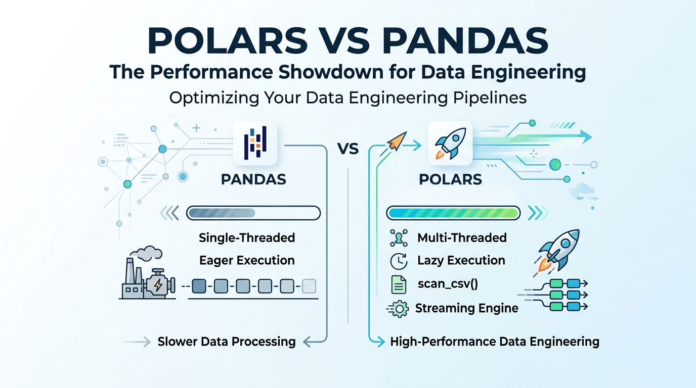

## Hey there, fellow data enthusiasts!👋

If you have ever stared at a spinning notebook cell while Pandas chews through a multi-gigabyte CSV—or worse, watched your kernel crash with an `Out Of Memory` error—I feel your pain. We have all been there! Pandas has been our trusty sidekick for years, but as our datasets keep growing bigger and bigger, traditional tools start to feel like they are moving through molasses.

I recently spent time digging into a deep-dive session on modern data engineering tools, and one library completely blew me away: **Polars**.

Today, let's grab a hot cup of coffee and walk step-by-step through why Polars is such a game-changer, how its engine actually works under the hood, and how you can use it to make your data cleaning lightning fast! 🚀

Before we jump into the mechanics, let's make sure we are on the same page about what makes Polars tick.

## So What Exactly is Polars?

At its core, Polars is a modern, high-performance data manipulation library for Python. But here is the magic trick: **it is built completely from scratch in Rust**.

Why does that matter to us as Python developers? Well, Pandas was designed back when datasets were much smaller and CPU architecture was a bit different. It operates mostly on a single CPU core and likes to pull everything straight into RAM.

Polars, on the other hand, was written specifically for modern multi-core computers. It brings multi-threading, memory efficiency, and rock-solid type safety right out of the box, all while letting us write clean Python code!

Let's look at a quick head-to-head comparison to see what changing from Pandas to Polars actually buys us.

## Why Choose Polars over Pandas?

Here is a breakdown of how Polars tackles the big headaches we encounter with traditional tools:

| Feature | Polars Approach | Value Proposition |
| --- | --- | --- |
| **Performance** | Vectorized engine in Rust | Automatically spreads work across all your CPU cores |
| **Memory Efficiency** | Dedicated streaming & Lazy execution | Processes massive files that are much larger than your RAM |
| **Developer Experience** | Expression-based syntax | Keeps your pipeline logic readable, clean, and type-safe |

Now, let's roll up our sleeves and look at how we actually write Polars code in practice.

## Core Concepts & Implementation Deep-Dive

Just like in Pandas, we work with two primary building blocks in Polars:

* **Series:** A single, one-dimensional column of data.
* **DataFrames:** A two-dimensional table made up of multiple Series stacked side-by-side.

### 1. Creating Your First DataFrame

Setting up a table in Polars feels super natural if you already know Python dictionaries:

```python
import polars as pl

# Creating a simple DataFrame
df = pl.DataFrame({
    "name": ["Alice", "Bob", "Charlie"],
    "height": [184, 192, 165],
    "weight": [80, 95, None]
})

```

### 2. Demystifying Expressions: `select` vs. `with_columns`

Here is where Polars gets really fun! In Polars, we use **Expressions** (like `pl.col("name")`). Think of an expression as a recipe or a set of instructions. It describes *what* transformation you want to do without tying it to a specific dataset right away. Because these expressions are context-free, Polars can run dozens of them in parallel behind the scenes!

When applying expressions, you will use two main workhorse methods:

* **`select`:** Extracts specific columns or builds brand-new ones. It returns a new DataFrame containing **only** the columns you explicitly ask for in your expressions.
* **`with_columns`:** Keeps all your existing columns intact and appends your new calculated columns right next to them. This is your best friend when engineering new features!

> 💡 **Pro-Tip on Naming:** When you do math inside an expression, remember to attach `.alias("new_name")`. Otherwise, Polars might keep the original column's name and accidentally overwrite your source data!

Let's see them in action:

```python
# Calculating BMI using with_columns and aliasing the result
df = df.with_columns(
    (pl.col("weight") / ((pl.col("height") / 100) ** 2)).alias("BMI")
)

# Using select and filter to return a new DataFrame with high-BMI records
filtered_df = df.select(pl.col("name"), pl.col("BMI")).filter(pl.col("BMI") > 22)

```

Notice how readable that chain is? It reads almost like plain English!

## Working with SQL in Polars

If you have an existing SQL codebase or simply prefer SQL syntax, Polars has you covered. While it's recommended to get comfortable with the expression API (since new features usually land there first), Polars offers a robust way to bridge the gap.

### How it works

There is no separate SQL engine. Instead, Polars translates your SQL queries directly into its native expressions, which are then executed by its optimized engine. This ensures you keep all the performance and scalability advantages of a native DataFrame library.

You'll use the `SQLContext` object to manage this:

```python
ctx = pl.SQLContext()

```

### Registering DataFrames

Before you can query your data, you need to register your DataFrames as tables in the SQL context. You have a few options:

* **Global Namespace:** Registers everything automatically.
* **Dictionary Mapping:** Explicitly maps names to frames.
* **Kwargs:** A concise way to register frames as specific identifiers.

```python
df1 = pl.DataFrame({"a": [1, 2, 3]})
df2 = pl.DataFrame({"b": [4, 5, 6]})

# Register all dataframes in the global namespace
ctx = pl.SQLContext(register_globals=True)

# Register an explicit mapping
ctx = pl.SQLContext(frames={"table_one": df1, "table_two": df2})

# Register frames using kwargs
ctx = pl.SQLContext(df1=df1, df2=df2)

```

### Executing Queries

Since queries are executed in lazy mode to enable planning optimizations, you can either set `eager_execution=True` in your `SQLContext` or call `.collect()` on the result.

```python
user_data = pl.DataFrame({
    "name": ["Alice", "Bob", "Charlie"],
    "height": [184, 192, 165],
    "weight": [80, 95, None]
})

with pl.SQLContext(register_globals=True, eager=True) as ctx:
    df_small = ctx.execute("SELECT * from user_data LIMIT 2")
    print(df_small)

```

### Compatibility Constraints

Polars supports a subset of common SQL statement types.

* **Supported:** `SELECT` (WHERE, ORDER, LIMIT, GROUP BY, UNION, JOIN), `CREATE TABLE AS`, `WITH` (CTEs), `EXPLAIN`, `SHOW TABLES`, `DROP TABLE`, `TRUNCATE`.
* **Not Yet Supported:** `INSERT`, `UPDATE`, `DELETE`, and meta-queries like `ANALYZE`.

## Eager vs. Lazy Execution: `read_csv` vs. `scan_csv` 🤯

If there is one concept you take away today, make it this one! This is where Polars leaves traditional tools in the dust.

In Pandas, when you run `pd.read_csv()`, it immediately reads every single row and column into your RAM. This is called **Eager Execution**. It is simple, but it is wildly inefficient if you only end up needing 2 out of 50 columns!

Polars gives us a superpower called the **Lazy API** via `scan_csv()`:

```text
               [scan_csv]
                   ↓
             [Build Query Plan]
                   ↓
 [Filter Pushdown & Column Selection]
                   ↓
             [.collect()]
                   ↓
            [Optimized Result]

```

### How the Lazy API Saves Your Computer's RAM

When you use `scan_csv()`, Polars doesn't load the file right away. Instead, it creates a logical blueprint of your query. It waits until you explicitly call `.collect()` to start the real engine.

While it waits, it performs smart optimizations behind your back:

1. **Predicate Pushdown:** If you put a `.filter(pl.col("age") > 30)` at the end of your script, Polars moves that filter all the way to the beginning. It only reads the rows from disk that pass your filter!
2. **Projected Column Selection:** Polars scans your script to see which columns you actually use. If your CSV has 100 columns but you only use 3, it completely ignores the other 97 columns during load.
3. **Unified Execution:** By delaying execution until `.collect()`, the entire pipeline runs as one smooth, optimized pass rather than creating temporary, memory-hogging intermediate tables.

```python
# Create a lazy plan (Nothing is loaded into RAM yet!)
lazy_plan = (
    pl.scan_csv("giant_dataset.csv")
    .filter(pl.col("height") > 170)
    .select(pl.col("name"), pl.col("height"))
)

# Execute the optimized query plan
df_result = lazy_plan.collect()

```

## Real-World Data Operations: Cleaning, Missing Data, and Joins

Let's walk through how Polars handles messy real-world data issues cleanly and predictably.

### 1. Handling Missing Data (Nulls and NaNs)

One thing I love about Polars is that it treats **`null`** (missing value) and **`NaN`** (Not-a-Number from math errors) as distinct concepts. In Pandas, these can sometimes get blurred together, but Polars stays strict.

Plus, when you run statistical functions like `.mean()`, Polars automatically ignores `null` values by default so your numbers stay accurate!

* **Find missing data:** Use `.is_null()` or `.is_nan()`.
* **Drop missing data:** Use `df.drop_nulls()` or `df.drop_nans()`.
* **Fill with a constant:** Use `.fill_null(-1)`.
* **Fill with the column average:** You can compute the mean on the fly right inside your expression:

```python
# Replace missing weight values with the average weight of non-null entries
df = df.with_columns(
    pl.col("weight").fill_null(pl.col("weight").mean())
)

```

### 2. Safely Taming Infinity Values

Have you ever divided by zero during a calculation and had your whole script crash down the line? Polars actually treats positive and negative infinity as valid numeric states rather than throwing a panic!

You can easily check for them and filter them out using the negation operator (`~`):

```python
# Filter out any rows where BMI turned into infinity
clean_df = df.filter(~pl.col("BMI").is_infinite())

```

### 3. Fast Joins and Strict Concatenation

Combining tables in Polars is blazingly fast because the join engine runs fully multi-threaded in Rust:

```python
# Performing a clean left join on a key
joined_df = df1.join(df2, on="user_id", how="left")

```

When stacking tables vertically using `pl.concat([df1, df2], how="vertical")`, Polars enforces **Type Safety**. If `df1` has integers in a column and `df2` has floats, Polars won't silently guess or break your data—it will require you to explicitly cast them first. This extra strictness saves you hours of debugging hidden bugs later on!

### 4. Custom Functions & User-Defined Functions (UDFs)

What if you have custom Python logic that Polars doesn't natively support? You can use `.map_elements()` (which feels similar to `.apply()` in Pandas):

```python
# Running custom Python logic across a column
df.with_columns(
    pl.col("name").map_elements(lambda text: text.upper(), return_dtype=pl.String)
)

```

> ⚠️ **A Friendly Warning:** Native Polars expressions run vectorized at blazing speeds in Rust. Dropping back into custom Python lambdas via `.map_elements()` slows things down and can prevent Polars from using its streaming engine. Use native expressions whenever you can!

## Handling Massive Datasets: Streaming API & GPU Acceleration ⚡

What if your dataset is 50 GB, but your laptop only has 16 GB of RAM? No problem!

By combining the Lazy API with **Streaming Mode**, Polars can read and process your data in small, manageable batches:

```python
# Process a multi-gigabyte file seamlessly in chunks
result = (
    pl.scan_csv("massive_dataset.csv")
    .filter(pl.col("height") > 170)
    .collect(engine="streaming") # Enables streaming engine!
)

```

And if you happen to have a compatible NVIDIA graphics card, Polars even supports **GPU acceleration via `cudf**` (by passing `engine="gpu"`) for insane speedups on massive enterprise pipelines!

## Migrating from Pandas to Polars 🔄

Worried about having to rewrite your entire codebase at once? Don't be! You can easily convert an existing Pandas DataFrame into Polars on the fly using `pl.from_pandas()`:

```python
import pandas as pd
import polars as pl

# Convert an existing Pandas DataFrame to Polars
pandas_df = pd.DataFrame({"a": [1, 2, 3]})
polars_df = pl.from_pandas(pandas_df)

```

*(Just make sure you have `pyarrow` installed in your environment for the fastest memory transfer!)*

## When Should You Stick with Pandas?

As much as I adore Polars, I always want to be completely honest about trade-offs. Pandas is still the better choice if:

* **You rely on specific ecosystem integrations:** Tools like `geopandas` or certain niche machine learning wrappers are built directly around Pandas objects.
* **You are working in large legacy codebases:** If you have tens of thousands of lines of working Pandas code, refactoring everything might not be worth the immediate engineering time.
* **You just need quick interactive plots:** Pandas still has super quick built-in `.plot()` functions for instant exploratory charts in Jupyter.

Credit for these core concepts goes to the technical session breakdown, which you can watch on [YouTube](https://www.youtube.com/watch?v=OlsRyy-au0E).

Want to learn more? Check out the [official Polars documentation](https://docs.pola.rs/) for more details.

## The Wrap-Up

Polars brings a truly refreshing, high-performance approach to Python data processing. By combining the safety of Rust, multi-core parallelism, and smart lazy query planning, it solves so many of the memory headaches we have dealt with for years.

Give `scan_csv()` and `engine="streaming"` a spin on your next dataset—your CPU and your patience will thank you!

See you in the next post. *Happy Coding!* 💻
