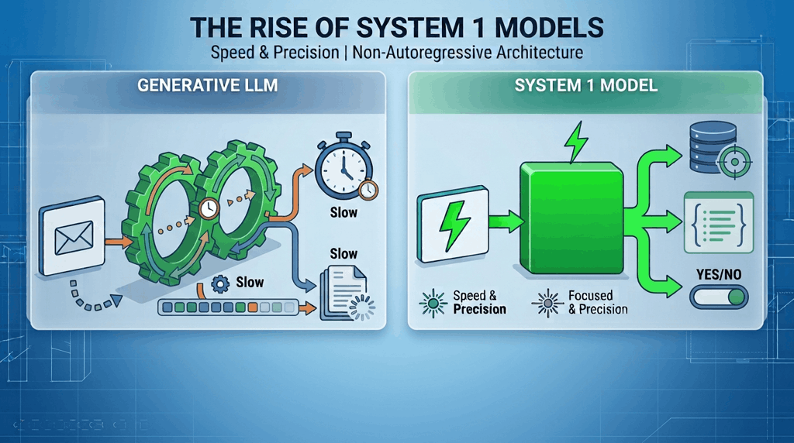
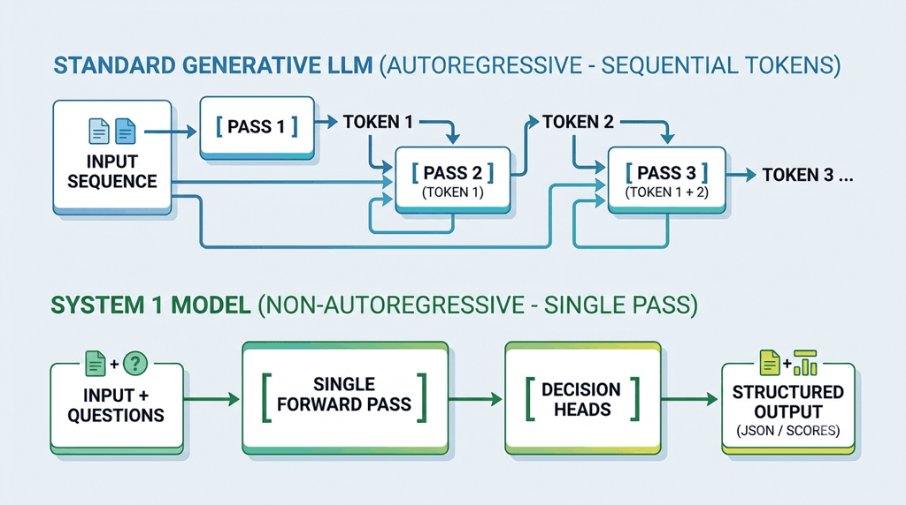
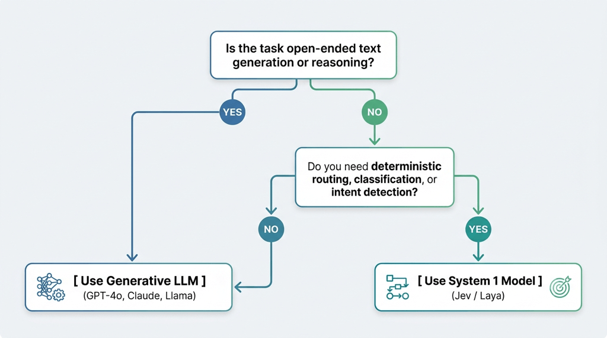

## Hey there, fellow AI enthusiast! 👋

If you've been keeping an eye on the tech landscape lately, you've probably noticed a massive wave of excitement surrounding a brand new class of AI models. Systems like [**Jev**](https://typesafe.ai/blog/introducing-system-one-models-and-jev) (by TypeSafe AI) and [**Laya**](https://laya.convaiinnovations.com/) (by Convai Innovations) are taking over developer feeds, and for good reason! They are insanely fast, remarkably cheap, and offer a completely fresh perspective on how we build automated software.

I recently dived deep into these architectures, and I realized just how fundamentally different they are from the everyday text-generating LLMs we're all used to.

Let's embark on this journey together and uncover the performance secrets behind these incredible models! 🚀

---

## The Core Split: Autoregressive vs. Non-Autoregressive

The modern AI ecosystem is splitting into two main execution paths: **Generative Autoregressive LLMs** (such as GPT, Claude, and Llama) and **Non-Autoregressive "System 1" Decision Models** (like Jev and Laya).

While traditional generative models spend massive amounts of computing power writing sentences one single word at a time, System 1 decision models are engineered strictly to make structured, typed choices in the blink of an eye.

Here is how I visually map out their internal mechanics processing data:

* **Standard Generative LLM (Autoregressive):** Generates output sequentially, token by token. Each newly generated token is fed right back into the model to predict the next one, requiring multiple looping forward passes (`Pass 1`, `Pass 2`, `Pass 3`, etc.).
* **System 1 Model (Non-Autoregressive):** Processes the entire input sequence and your targeted questions simultaneously in a **single forward pass**. The data flows straight into specialized decision heads to produce structured output (like JSON or scores) in one execution step.

Seems interesting! isn't it? Let's now look at why this fundamental difference changes everything for developers! 💡

---

## 1. Architectural Differences

When I looked at internal architecture of these systems, it immediately hit me why performance varies so dramatically between them.

### Regular LLMs (Autoregressive & Recursive)

* **Decoder-Only Backbone:** Models like GPT-4, Claude, and Llama are hardcoded at an architectural level to output content token-by-token.
* **The Sequential Bottleneck:** If you need a 50-token response, the engine has no choice but to execute **50 sequential forward passes**. Each new token relies directly on the previous ones, creating an unavoidable time bottleneck.

### System 1 Models (Non-Autoregressive Single-Pass)

* **Encoder-Based Backbone:** Models like **Laya** build on bidirectional encoder backbones (such as *ModernBERT-large*, ~421M parameters) combined with specialized multi-head decision layers.
* **Single Forward Pass:** Instead of writing text out loud, the model evaluates the context alongside your specific questions (choice, score, or yes/no probability) all at once. It processes the whole context in a single pass without calling a text generator at all.

> 🧠 **The Intuition Advantage:** I like to think of System 1 models as human intuition. They give you an instant, gut-reaction judgment rather than sitting down to write a long, deliberate essay!

---

## 2. Why Jev and Laya Are Exponentially Faster ⚡

By completely stepping away from natural language generation, System 1 decision models achieve performance gains that honestly blew me away. Here is how the two architectures stack up side by side in practice:

| Performance Metric | Regular Generative LLMs (GPT, Claude) | System 1 Models (Jev / Laya) |
| --- | --- | --- |
| **Execution Steps** | N forward passes (N = token count) | **1 single forward pass** |
| **Typical Latency** | 500ms – 3,000ms+ | **15ms – 35ms** |
| **Output Type** | Freeform text or JSON strings | Calibrated typed probabilities/logits |
| **Compute Complexity** | High O(N) sequential steps | Low O(1) constant execution |
| **Hallucination Risk** | High (syntax errors, invented facts) | **Zero** (bound strict to predefined schema) |

### The Secret Sauce Behind Their Speed

1. **Zero Text Generation:** They completely bypass predicting individual syntax tokens like quotes, brackets, or formatting characters (`{`, `"`, `:`).
2. **No Syntax Parsing Needed:** Outputs stream directly as structured probability arrays. You never have to deal with broken JSON or run post-processing schema validators like Pydantic or Zod to fix formatting errors!
3. **Compact Footprint:** Instead of burning GPU memory on massive multi-billion parameter foundation models, lightweight setups like Laya (~421M parameters) run comfortably on compact networks.

---

## 3. When to Use Which Architecture

When I am deciding which path to take for a feature, it always comes down to a simple question: do I need creative text, or do I need instant, bulletproof routing?

### Reach for Regular LLMs When You Need:

* **Generative Content:** Writing natural emails, summarizing lengthy articles, drafting code snippets, or generating creative prose.
* **Complex Multi-Step Reasoning:** Solving math problems, executing step-by-step chain-of-thought analysis, or navigating open-ended logic.
* **Conversational Interfaces:** Powering interactive chatbots, open dialogue, and live brainstorming sessions.

### Reach for System 1 Models When You Need:

* **High-Throughput Routing:** Categorizing incoming support tickets, filtering out spam, or scoring real-time sentiment under a strict deadline.
* **Agent Tool Selection:** Helping your AI agents instantly decide which API endpoint or function to execute based on their current state.
* **Microservices at Scale:** Handling high QPS (queries per second) production workloads where calling a massive LLM for simple classification just burns through your budget.
* **Strict Type Safety:** Building downstream software pipelines that demand guaranteed, error-free data formats without syntax parsing failures.

---

## Jev vs. Laya at a Glance

While both of these projects share the exact same System 1 philosophy, they fit into slightly different toolkits depending on how you build:

* [**Jev (by TypeSafe AI):**](https://typesafe.ai/blog/introducing-system-one-models-and-jev) A managed, ultra-fast cloud API optimized for seamless production workflows, complex state management, and massive context windows.
* [**Laya (by Convai Innovations):**](https://laya.convaiinnovations.com/) An open-weights, 421M-parameter model that you can fine-tune yourself and run locally on edge devices or private GPUs.

---

## The Road Ahead

While System 1 decision models bring unbelievable speed to our development workflow, it is always important to keep their trade-offs in mind:

* **No Freeform Output:** They cannot write code, generate long-form answers, or engage in open-ended conversations.
* **Schema-Bound Execution:** You have to declare all potential choices or decision rubrics up front before firing off a query.
* **Not for Heavy Reasoning:** They are designed to complement generative LLMs, not replace them when deep logical synthesis is required.

In my own architecture designs, pairing a lightning-fast System 1 model for routing with a generative LLM for output gives me the absolute best of both worlds: unmatched execution speed and deep intelligence! 🚀
  
Go ahead and experiment with these models, and let me know what you think.
  
Catch you in the next one! Till then, *Happy Building!* 🛠️
