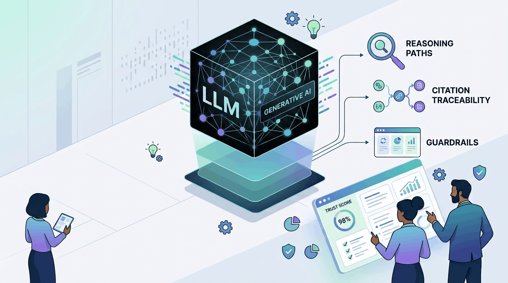
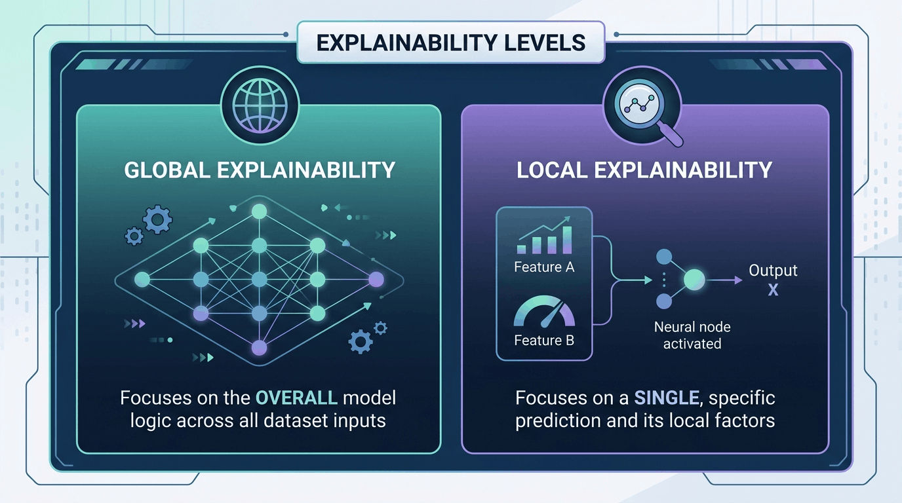
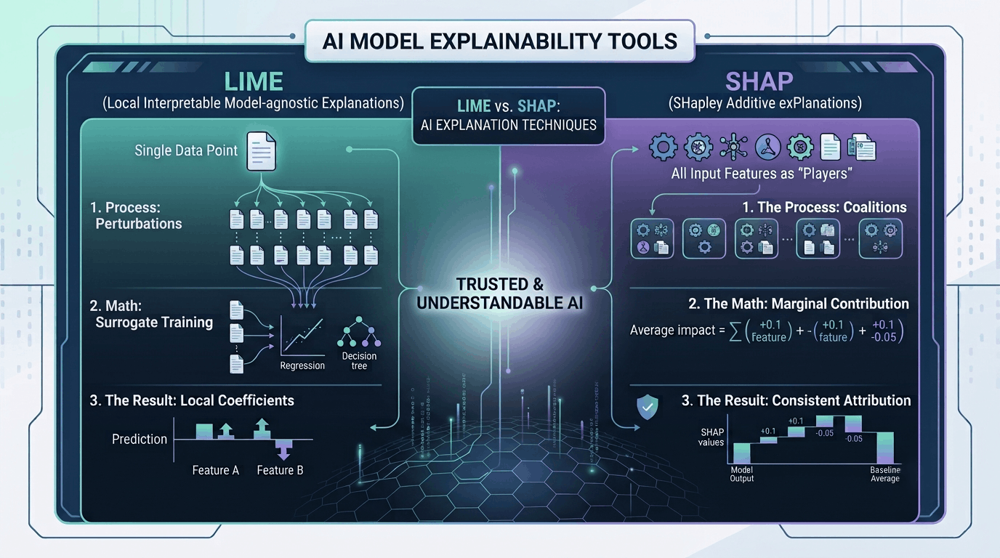
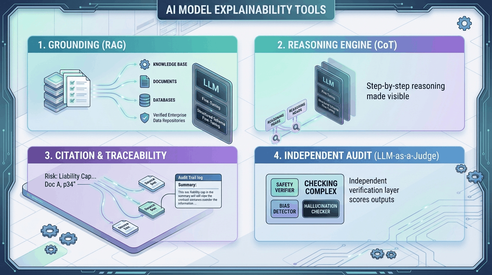

## Hey there, fellow AI enthusiast! 👋

I was recently moderating a panel discussion where panelists tackled various topics across the artificial intelligence landscape. Out of all the great conversations, one specific topic caught my attention and stayed with me: **"Explainability in GenAI Models"** 💡

If you have worked with traditional Machine Learning models like Logistic Regression or Random Forests, you are probably familiar with explainability. 
But in the Generative AI world? Not so much. 
Nowadays, many enterprises treat Large Language Models (LLMs) like mysterious black boxes and move right along. While LLMs are certainly complex, we cannot leave enterprise decisions entirely to chance. 
  
Let's dive into what explainability looks like today and how we can demystify Generative AI! 🚀

Before we look at the "how," let's look at the "what."

---

## What is Explainability?

**Explainability in Machine Learning (ML)** refers to the processes and methods designed to make the internal mechanics and outputs of a model understandable to human beings. Often used interchangeably with interpretability, it focuses on describing *why* a model arrived at a specific decision, prediction, or recommendation.

Explainability is generally split into two distinct levels:

* **Global Explainability:** Understanding the overall logic of the model and which features matter most across all predictions.
* **Local Explainability:** Unpacking a single, specific prediction to see exactly what triggered that exact outcome.

### Why Does It Matter?

In my early days learning ML, I always wondered **why we needed this additional step to explain the model** when we were already getting good results.  
I later realized, that high accuracy alone does not guarantee a model is making decisions safely or fairly. Explainability matters because it enables:

- **Trust Building:** Stakeholders, doctors, or loan officers need to know the reasoning behind an output before acting on *high-stakes* predictions.
- **Detecting Bias and Fairness:** Transparency ensures models are not making choices based on biased criteria like race, gender, or age.
- **Regulatory Compliance:** Global laws (like Europe's GDPR) grant individuals a "right to an explanation" for automated choices impacting their lives.

---

## Quick Flashback: How Explainability Worked for Traditional ML

Before we dive into the wild world of Generative AI, it helps to take a quick step back and look at where we started. 

Back in the traditional machine learning days, models like random forests or XGBoost were essentially treated as "black boxes." You fed data in, got a prediction out, and had very little visibility into what happened in between. To solve this, researchers came up with two heavy-hitting techniques to peek under the hood: **LIME** and **SHAP**. 

Instead of opening up the model directly, both tools figure out what’s going on by "poking" the model with modified inputs and watching how the output changes. Here is how they get the job done:

### The Local Approach: LIME
Imagine you want to know why a model denied a specific loan application. **LIME** (Local Interpretable Model-agnostic Explanations) zeroes in on that single data point and creates hundreds of tiny variations of it—slightly changing the income, credit score, or age. 

It feeds all these tweak variations back through the complex model, sees what changed, and trains a super simple, easy-to-read model (like a basic line graph) on those local results. The final coefficients tell you exactly which factors pushed *that specific* decision over the line.

### The Game Theory Approach: SHAP
While LIME looks at things locally, **SHAP** (SHapley Additive exPlanations) takes a more holistic, mathematically rigorous path borrowing heavily from cooperative game theory. 

Think of the model’s final prediction as the payout of a game, and every input feature as a "player" on the team. SHAP calculates Shapley values by testing the model across every possible combination of features to see how much value each feature brings to the table. The result? A perfectly balanced breakdown where the contribution of every single feature adds up to explain the final prediction compared to the baseline average.

> We won't discuss LIME and SHAP in detail today, but if you're curious to learn more about how they work, feel free to check out [this article on DataCamp](https://www.datacamp.com/tutorial/explainable-ai-understanding-and-trusting-machine-learning-models).

---

## Why Old-School Tools Fail on LLMs

While SHAP and LIME worked wonders for tabular classifiers, applying them to modern Large Language Models breaks down fast:

* **Extreme Computational Expense:** Calculating SHAP values requires running the model across countless feature combinations. Doing this for an LLM with hundreds of billions of parameters across thousands of tokens requires an impossible amount of computing time and money 💸.
* **High-Dimensional Complexity:** LLMs rely on complex attention heads and non-linear interactions across millions of parameters simultaneously. A simple local linear model cannot faithfully capture deep, context-dependent language nuances.
* **The "Token" Problem:** Swapping or masking random words (perturbations) destroys grammatical context. The LLM encounters nonsensical text it was never trained to read, leading to erratic outputs that distort the explanation's validity.

So how do we solve this for Generative AI? Lets look at that next.

---

## What Options Are There for Explaining LLM Models?

So, if traditional tools like LIME and SHAP hit a wall when dealing with trillions of parameters and creative text generation, what *do* we actually use for Large Language Models? 

Instead of relying on a single silver bullet, the industry has rallied around three primary paradigms. You can think of them as three distinct vantage points: asking the model to speak its mind, dissecting its brain, or hiring an outside auditor. 

Let's walk through how each approach works in practice:

### 1. Self-Generated Explanations (Built-In Reasoning)

*Instead of trying to reverse-engineer complex math, why not just ask the model to talk through its thought process?*

The simplest way to understand an LLM is to leverage its greatest strength: language. By tweaking how we prompt or fine-tune these models, we can encourage them to explain their own decisions in real time.

* **Chain-of-Thought (CoT) Prompting:** By asking the model to *"think step-by-step"* before giving a final answer, you force it to write out its intermediate logic first.
  * **The Good:** Auditors get a clear, readable trail showing how the model connected point A to point B.
  * **The Catch:** Just because an explanation sounds logical to us doesn't mean it accurately reflects the exact mathematical path the transformer took behind the scenes.
* **Self-Rationalization:** Rather than thinking out loud during the answer, the model generates a separate paragraph after the fact justifying why it made a specific choice.
  * **The Good:** It neatly splits the "decision" from the "justification," making compliance logging and audit reports a breeze.

### 2. Mechanistic Interpretability (Peeking Inside)

*When listening to what the model says isn't enough, we open up the neural network to see what its internal neurons are actually up to.*

While self-generated explanations rely on the model's output text, mechanistic interpretability goes a level deeper. It ignores what the model *claims* and looks directly at its internal parameters, weights, and layers.

* **Attention Map Visualizations:** Transformers run on attention matrices—mathematical weights assigned between different words. By rendering these matrices into visual heatmaps, you can trace exactly which input words the model fixated on when generating its response.
  * **The Good:** If a legal AI flags the wrong contract clause, an attention map shows you instantly if it got distracted by an irrelevant sentence.
  * **The Catch:** High attention doesn't always mean direct cause-and-effect, and tracking dozens of layer heads simultaneously gets messy fast.
* **Activation Probing:** Researchers attach tiny, lightweight ML classifiers ("probes") directly to internal layer activations to monitor whether specific concepts (like truthfulness or sentiment) are present.
  * **The Good:** Probes can catch a model "knowing" a fact is false internally, even if it spews out a convincing hallucination in the final output.

### 3. Post-Hoc LLM Evaluators (Surrogate Checkers) 🛡️

*When you can't peek under the hood of a closed-source API, you bring in a secondary AI system to act as an independent auditor.*

What happens when you are using a proprietary model like GPT-4 or Claude where you don't have access to internal weights, and built-in explanations aren't trustworthy enough for compliance? That's where external surrogate evaluators come in.

* **LLM-as-a-Judge:** You feed the primary model's prompt, retrieved context, and generated answer into a separate, highly capable evaluator model that grades the response against strict rubrics (like factual accuracy, tone, or safety policies).
  * **The Good:** It prevents models from grading their own homework, giving you a scalable, automated way to run continuous quality assurance across thousands of production logs.

### Quick Comparison Summary

| Approach | Primary Mechanism | Transparency Level | Major Advantage |
| --- | --- | --- | --- |
| **Self-Generated** | Prompting for step-by-step text output | Behavioral / Human-Readable | Easy to implement with zero structural changes |
| **Mechanistic** | Inspecting weights, attention maps, & layers | Deep Structural / Mathematical | Shows what the model is *actually* doing inside |
| **Post-Hoc Evaluator** | Secondary model auditing the primary output | External / System-Level | Works on closed-source APIs & automates compliance |

---

## So, What Should An Enterprise Use For Gaining Higher Trust in Modern AI?

To secure organizational and user trust, an enterprise cannot treat an LLM as an unmonitored text generator. Building systemic trust requires a multi-layered operational framework:

1. **Ground the Model via RAG Architecture:** Instead of relying on the LLM's internal, opaque weights to remember information, force the model to look up relevant context from verified enterprise data repositories.
2. **Enforce Strict Output Citation and Traceability:** Never present raw text to an enterprise user without structural proof linking back to source documents.
3. **Implement Multi-Step Structural Prompting:** Force the model to think out loud in a predictable format (like JSON schema with explicit reasoning fields) that compliance teams can audit.
4. **Deploy Independent LLM Guardrails ("LLM-as-a-Judge"):** Never let the primary text generator evaluate its own performance. Introduce an independent verification layer to catch hallucinations and non-compliance.

## Enterprise Explainability Framework Summary

| Framework Layer | Mechanism | Primary Value Proposition |
| --- | --- | --- |
| **Grounding Layer** | Retrieval-Augmented Generation (RAG) | Replaces guesswork with verified company data |
| **Reasoning Layer** | Chain-of-Thought (CoT) Prompting | Exposes step-by-step logic for audit trails |
| **Validation Layer** | Independent Guardrails / LLM-as-a-Judge | Flags errors, bias, and hallucinations automatically |
| **Traceability Layer** | Direct Citation Mapping | Provides clear proof of origin for end users |

---

## Acknowledging Constraints & The Road Ahead 🚧

While these new methods offer significant visibility, adopting LLM explainability in production comes with key trade-offs. And it wouldn't be fair to close this blog without discussing those. 

* **Latency Overhead:** Forcing an LLM to generate Chain-of-Thought reasoning or passing outputs through an LLM-as-a-Judge increases total response times.
* **Increased Token Costs:** Self-generated explanations mean processing and outputting significantly more tokens per request.
* **Faithfulness vs. Plausibility:** A model's self-generated "explanation" might sound persuasive to human auditors even if it doesn't strictly reflect the internal mathematical path the model took to reach its conclusion.
* **Interpretability Scale Limitations:** Mechanistic approaches like attention maps and activation probing require deep internal access to model weights, making them difficult or impossible to run on proprietary closed-source APIs.

---

## Let's Wrap-Up

Explainability has evolved from the mathematical feature-attribution world of SHAP and LIME into a multi-layered architectural practice for Generative AI. By combining Retrieval-Augmented Generation (RAG), structured Chain-of-Thought prompting, and independent evaluator guardrails, enterprises can move beyond viewing LLMs as untraceable black boxes. 

Building trust in GenAI isn't about opening every single parameter under the hood—it's about designing verifiable, auditable systems around your models! 

Until next time, *happy building!* 🚀
