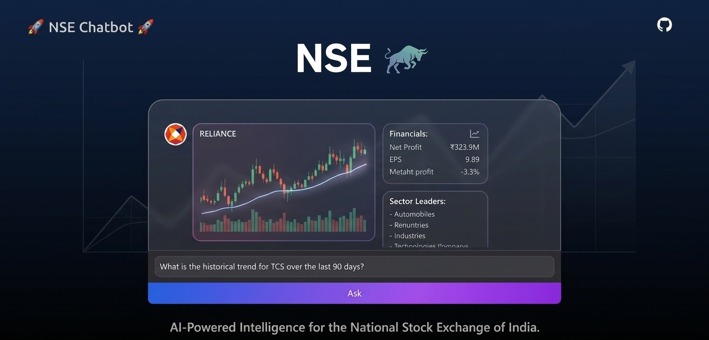

## 🌟 Overview
The **NSE Chatbot** is an AI-powered conversational agent engineered to provide you with rapid, accurate, and actionable information concerning the National Stock Exchange of India (NSE). 

At its core, the application transforms complex financial data into natural, human-like conversations.  

---

## ✨ Core Features & Capabilities

The NSE Chatbot offers a comprehensive suite of tools designed to streamline stock market research and data retrieval:

| Feature | Description | Key Capabilities | Example Query |
| :--- | :--- | :--- | :--- |
| **📈 Query Stock Prices** | Provides real-time stock quotes and key trading metrics for NSE-listed companies. | Retrieve latest stock prices, current trading price, day high/low, and trading volume. | *"What is the current price of Reliance Industries?"* |
| **📊 Query Stock History & Trends** | Accesses historical price data and performs automated trend analysis over specified timeframes. | Access historical closing prices, analyze market trends (upward, downward, volatile), and calculate moving averages. | *"Show me the price history and trend for TCS over the last 30 days."* |
| **🔍 Search Companies by Sector** | Allows users to filter and list companies based on their business classification. | Categorized Search by Industry (e.g., IT, Banking) or broader Sectors (e.g., Energy, Automobile). | *"List top 10 companies in the Automobile sector."* |
| **💰 Analyze Company Financials** | Extracts and summarizes critical financial performance metrics from official corporate filings. | Structured Financial Data Extraction of Revenue, Net Profit, EPS (Earnings Per Share), and P/E ratios from recent quarterly/annual reports. | *"Summarize the Net Profit for Maruti Suzuki."* |

---

## ⚙️ System Architecture & Deep Dive

The application is split into two layers to cater to both non-technical users and developers:

### 1. The Conversational Interface (The App)
* **Natural Language Processing (NLP):** Leverages advanced Large Language Models (LLMs) to understand contextual financial queries, colloquial market terms, and multi-turn conversations.
* **Intent Recognition:** Automatically determines whether a user wants a live quote, a historical trend chart, a sector breakdown, or a fundamental financial summary.
* **Responsive Visuals:** Rich text outputs are complemented by clear markdown tables, bulleted summaries, and clean trend analysis breakdowns.

### 2. The MCP Server Engine (The Core)
* **Model Context Protocol (MCP) Compliance:** Operates as an open architecture server that acts as a secure gateway between the LLM and the real-time financial market data layers.
* **Developer Access:** Advanced users can bypass the chat UI entirely and prompt the MCP server via programmatic tools to pull structured JSON data directly into algorithmic trading scripts, or local analytical tools.

---

## 🚀 Key Benefits

* **No Financial Jargon Obstacles:** Ideal for beginners who want to ask simple questions without navigating complex financial terminals.
* **Time-Saving Data Aggregation:** Eliminates the need to manually download and scroll through hundreds of pages of corporate PDF filings to find basic metrics like Net Profit or EPS.
* **Developer-Friendly:** Standardized MCP backend ensures the tool grows with your workflow, making custom automation simple.
