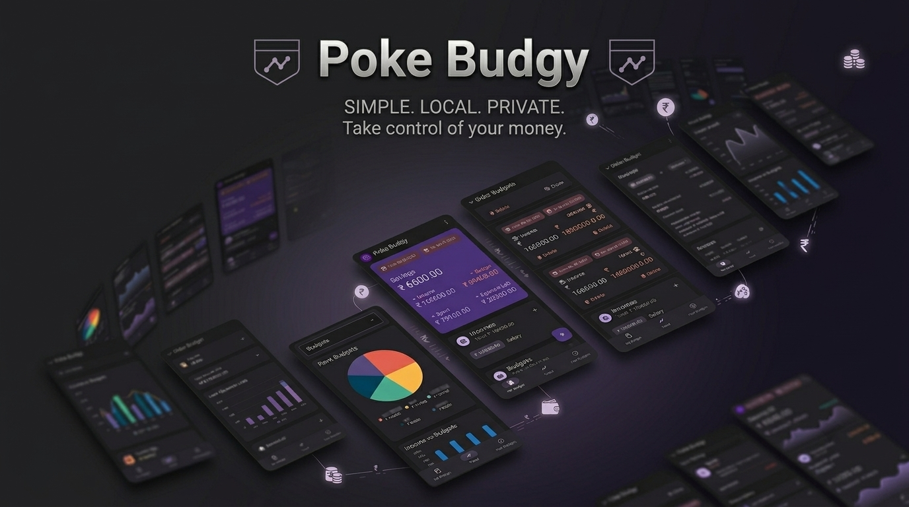

## 🌟 Overview
**Poké Budgy** is a minimalist, 100% offline budget manager designed for individuals who value absolute privacy, simplicity, and blazing-fast execution. 

Managing your money shouldn't feel like an administrative chore or an invitation for third-party trackers to inspect your financial life. Poké Budgy strips away the modern app bloat—no endless loading indicators, no mandatory cloud syncs, and no tedious sign-up flows. The moment you open the app, you are ready to budget. Your financial data stays exactly where it belongs: local, encrypted, and completely under your control on your Android device.

---

## 🔒 Your Data, Your Privacy First

In an era dominated by mandatory cloud connectivity, Poké Budgy intentionally goes against the grain to guarantee absolute data sovereignty.

* **100% Native Offline Operation:** The app requires zero internet permissions. Your account numbers, income records, and expense entries never touch an external server or cross the web.
* **Zero Registration & Frictionless Start:** Skip the onboarding forms. There are no email addresses to verify, no passwords to manage, and no personal profile creations required.
* **Absolute Non-Tracking Commitment:** There are no analytics frameworks, no telemetry tracking, and no data broker pipelines. Your habits remain entirely your own secret.

---

## ⚡ Simple & Powerful Features

Poké Budgy delivers a streamlined experience focusing deeply on your raw cash flow, wrapped in a beautiful, dark-themed material UI optimized for low cognitive load:

| Feature Component | Technical & Visual Capability | App Interface Highlight |
| :--- | :--- | :--- |
| **👛 Quick Cash Flow Entry** | Log multi-source incomes, set absolute budget caps, and record everyday expenses within two taps. | Distinct visual fields for *Savings*, *Income*, *Budget*, *Spent*, and *Expense Left* calculations. |
| **📊 Clean Visual Insights** | Make immediate decisions with high-contrast, multi-segmented pie charts mapping your top categories. | Dedicated "Trend" tab tracking continuous performance and cyclical macro distributions (e.g., Last 6 Months). |
| **🗄️ Cyclical History Logs** | Maintain clean separation of historical budgets to compare over-spending or under-spending cycles. | Complete "Past Budgets" repository featuring instantaneous, single-tap *Clone* or *Delete* automation routines. |
| **💾 Ultra-Light Local Storage** | Ultra-efficient SQLite/Room local storage ensures instantaneous read/write operations without lag. | Negligible battery drain, zero network data consumption, and instant access even in airplane mode. |

---

## 🌟 Why Choose Poké Budgy?

Most modern budgeting applications are engineered to trap your financial profile in the cloud to feed advertising algorithms. Poké Budgy is built for users seeking a highly practical tool for a clean, localized lifestyle. It is the perfect daily companion for:

* **The Privacy Minimalist:** Users who refuse to link live bank feeds, corporate credentials, or credit profiles to third-party digital servers.
* **The Off-Grid Explorer:** Digital nomads and frequent travelers who must reliably record real-time expenditures across remote regions with spotty cellular networks.
* **The Functional Purist:** Anyone tired of constant interface changes, upsells for premium subscriptions, and artificial cloud synchronization screens.

---

## 📱 App Experience & Interface Preview

Based on the official Android design patterns, Poké Budgy breaks down your financial management into three clear, accessible screens:

1. **My Budget (Home Screen):** Displays your dynamic financial health gauge clearly. View your primary *Savings* pool along with immediate updates on *Income vs. Allocated Budget*, paired with quick-add utility triggers.
2. **Trend Analytics:** View historical distributions across your **Top 5 Budgets**. Deep-dive into interactive metrics comparing target budgets against actual monthly spend ratios.
3. **Past Budgets Management:** Access your archived billing periods cleanly sorted under chronological logs, letting you clone past configurations to spin up new budget periods instantly.

---

## 🚀 Get Started Instantly

Stop overcomplicating your wallet. Reclaim total ownership over your personal balance sheets with a clean, zero-compromise security environment. 

* **Platform:** Android 
* **Official Google Play Store Link:** [Download Poké Budgy on Google Play](https://play.google.com/store/apps/details?id=com.shakeelansari63.pokebudgy)
