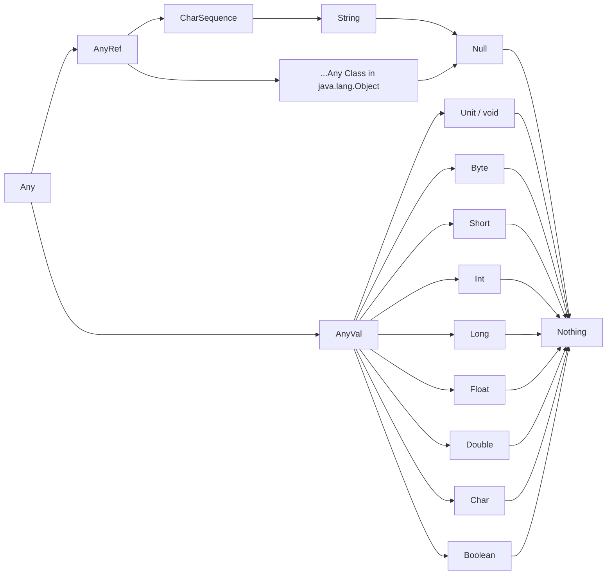

# Data Types & Type Inference

Scala does an excellent job of inferring types from values. In most cases, you don't need to explicitly declare the type — the compiler figures it out from the assigned value.

## Type Inference

```scala
val a = 10                // inferred as Int
println(a.getClass.getSimpleName)

val b = "Hello"           // inferred as String
println(b.getClass.getSimpleName)
```

When inference doesn't work or you want to be explicit, you can declare the type after a colon `:`:

```scala
val c: Double = 10
println(c.getClass.getSimpleName)  // Double
```

## Primitive Data Types

Scala has the following pre-existing numeric data types:

```scala
// Byte: 8 bit (-128 to 127)
val byteVal: Byte = 124

// Short: 16 bit (-32768 to 32767)
val shortVal: Short = 300

// Int: 32 bit
val intVal: Int = 123667

// Long: 64 bit
val longVal: Long = 32L

// Float: 32 bit — requires an f suffix, otherwise it's considered Double
val floatVal: Float = 32.8f

// Double: 64 bit — the d suffix is optional
val doubleVal: Double = 36.98
```

If you omit the `f` suffix for a Float, the literal `32.8` is treated as a Double and you'll see a type mismatch error. The `D` suffix for Double is optional — any floating-point number without a suffix is assumed to be Double.

## Type Hierarchy



- `Any` is the root of the entire Scala type hierarchy.
- `AnyVal` includes all primitive value types (Int, Double, Float, Long, Short, Byte, Char, Boolean, and Unit).
- `AnyRef` corresponds to `java.lang.Object` — all reference types inherit from it.
- `Null` is a subtype of all `AnyRef` types. Its only instance is `null`.
- `Nothing` is a subtype of every type. It has no instances and is used for expressions that never return normally (e.g., throwing exceptions or infinite loops).
