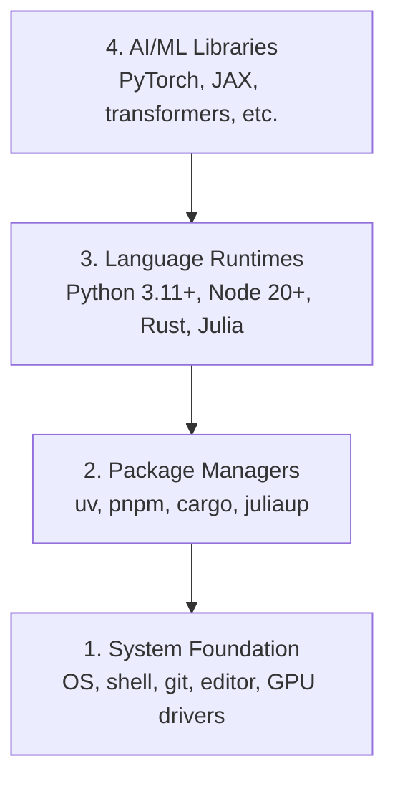
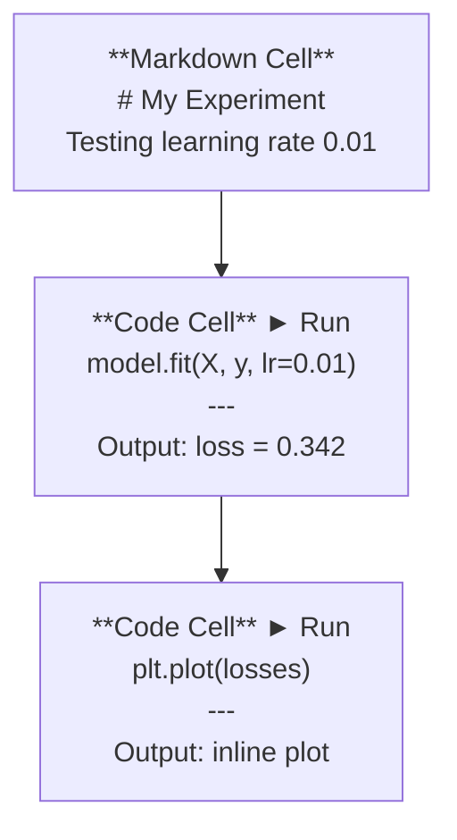
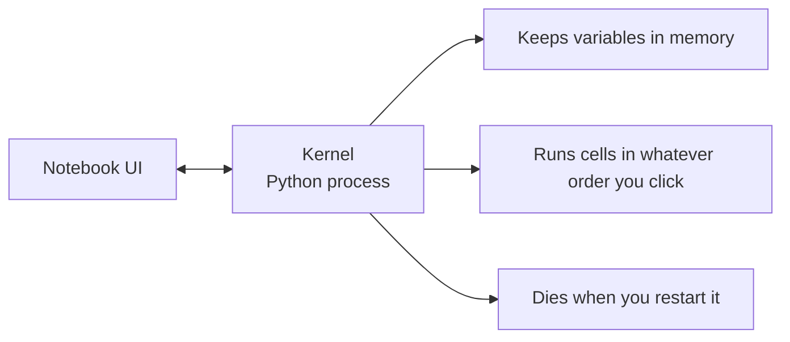
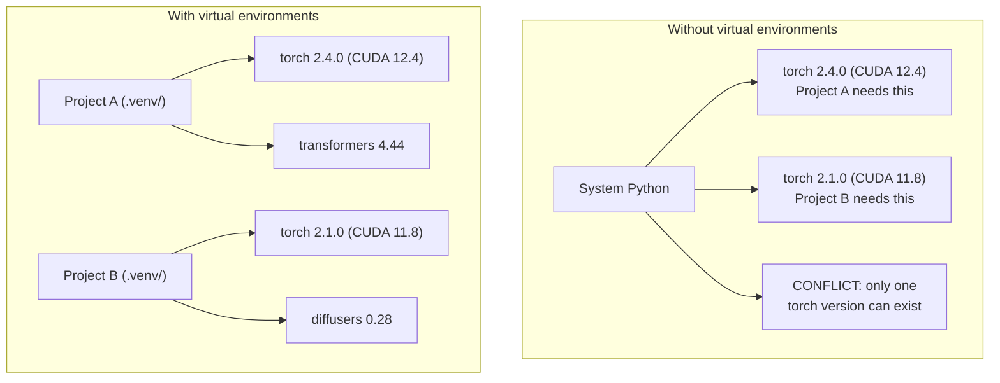
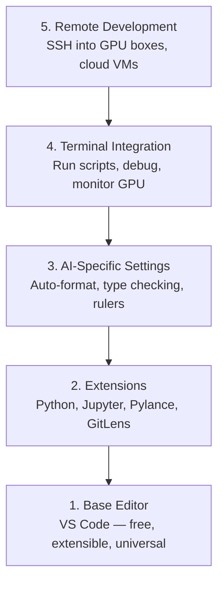

# Dev Environment Setup

> Combined lessons (4 parts), merged verbatim — no content removed.

**Type:** Combined

---

## Part 1 (ch001): Dev Environment

> Your tools shape your thinking. Set them up once, set them up right.

**Type:** Build
**Languages:** Python, Node.js, Rust
**Prerequisites:** None
**Time:** ~45 minutes

## Learning Objectives

- Set up Python 3.11+, Node.js 20+, and Rust toolchains from scratch
- Configure virtual environments and package managers for reproducible builds
- Verify GPU access with CUDA/MPS and run a test tensor operation
- Understand the four-layer stack: system, packages, runtimes, AI libraries

## The Problem

You're about to learn AI engineering across 200+ lessons using Python, TypeScript, Rust, and Julia. If your environment is broken, every single lesson becomes a fight against tooling instead of learning.

Most people skip environment setup. Then they spend hours debugging import errors, version conflicts, and missing CUDA drivers. We're going to do this once, properly.

## The Concept

An AI engineering environment has four layers:



We install bottom-up. Each layer depends on the one below it.

## Build It

### Step 1: System Foundation

Check your system and install the basics.

```bash
# macOS
xcode-select --install
brew install git curl wget

# Ubuntu/Debian
sudo apt update && sudo apt install -y build-essential git curl wget

# Windows (use WSL2)
wsl --install -d Ubuntu-24.04
```

### Step 2: Python with uv

We use `uv` — it's 10-100x faster than pip and handles virtual environments automatically.

```bash
curl -LsSf https://astral.sh/uv/install.sh | sh

uv python install 3.12

uv venv
source .venv/bin/activate  # or .venv\Scripts\activate on Windows

uv pip install numpy matplotlib jupyter
```

Verify:

```python
import sys
print(f"Python {sys.version}")

import numpy as np
print(f"NumPy {np.__version__}")
a = np.array([1, 2, 3])
print(f"Vector: {a}, dot product with itself: {np.dot(a, a)}")
```

### Step 3: Node.js with pnpm

For TypeScript lessons (agents, MCP servers, web apps).

```bash
curl -fsSL https://fnm.vercel.app/install | bash
fnm install 22
fnm use 22

npm install -g pnpm

node -e "console.log('Node', process.version)"
```

### Step 4: Rust

For performance-critical lessons (inference, systems).

```bash
curl --proto '=https' --tlsv1.2 -sSf https://sh.rustup.rs | sh

rustc --version
cargo --version
```

### Step 5: Julia (Optional)

For math-heavy lessons where Julia shines.

```bash
curl -fsSL https://install.julialang.org | sh

julia -e 'println("Julia ", VERSION)'
```

### Step 6: GPU Setup (If You Have One)

```bash
# NVIDIA
nvidia-smi

# Install PyTorch with CUDA
uv pip install torch torchvision torchaudio --index-url https://download.pytorch.org/whl/cu124
```

```python
import torch
print(f"CUDA available: {torch.cuda.is_available()}")
if torch.cuda.is_available():
    print(f"GPU: {torch.cuda.get_device_name(0)}")
```

No GPU? No problem. Most lessons work on CPU. For training-heavy lessons, use Google Colab or cloud GPUs.

### Step 7: Verify Everything

Run the verification script:

```bash
python phases/00-setup-and-tooling/01-dev-environment/code/verify.py
```

## Use It

Your environment is now ready for every lesson in this course. Here's what you'll use where:

| Language | Used In | Package Manager |
|----------|---------|-----------------|
| Python | Phases 1-12 (ML, DL, NLP, Vision, Audio, LLMs) | uv |
| TypeScript | Phases 13-17 (Tools, Agents, Swarms, Infra) | pnpm |
| Rust | Phases 12, 15-17 (Performance-critical systems) | cargo |
| Julia | Phase 1 (Math foundations) | Pkg |

## Ship It

This lesson produces a verification script that anyone can run to check their setup.

See `outputs/prompt-env-check.md` for a prompt that helps AI assistants diagnose environment issues.

## Exercises

1. Run the verification script and fix any failures
2. Create a Python virtual environment for this course and install PyTorch
3. Write a "hello world" in all four languages and run each one

[Reference](https://github.com/rohitg00/ai-engineering-from-scratch/tree/main/phases/00-setup-and-tooling/01-dev-environment)

---

## Part 2 (ch005): Jupyter Notebooks

> Notebooks are the lab bench of AI engineering. You prototype here, then move what works into production.

**Type:** Build
**Languages:** Python
**Prerequisites:** Phase 0, Lesson 01
**Time:** ~30 minutes

## Learning Objectives

- Install and launch JupyterLab, Jupyter Notebook, or VS Code with the Jupyter extension
- Use magic commands (`%timeit`, `%%time`, `%matplotlib inline`) to benchmark and visualize inline
- Distinguish when to use notebooks vs scripts and apply the "explore in notebooks, ship in scripts" workflow
- Identify and avoid common notebook traps: out-of-order execution, hidden state, and memory leaks

## The Problem

Every AI paper, tutorial, and Kaggle competition uses Jupyter notebooks. They let you run code in pieces, see outputs inline, mix code with explanations, and iterate fast. If you try to learn AI without notebooks, you're doing math homework without scratch paper.

But notebooks have real traps. People use them for everything, including things they're terrible at. Knowing when to use a notebook and when to use a script will save you from debugging nightmares later.

## The Concept

A notebook is a list of cells. Each cell is either code or text.



The kernel is a Python process running in the background. When you run a cell, it sends the code to the kernel, which executes it and sends back the result. All cells share the same kernel, so variables persist between cells.



That "whatever order you click" part is both the superpower and the foot-gun.

## Build It

### Step 1: Pick your interface

Three options, one format:

| Interface | Install | Best for |
|-----------|---------|----------|
| JupyterLab | `pip install jupyterlab` then `jupyter lab` | Full IDE experience, multiple tabs, file browser, terminal |
| Jupyter Notebook | `pip install notebook` then `jupyter notebook` | Simple, lightweight, one notebook at a time |
| VS Code | Install "Jupyter" extension | Already in your editor, git integration, debugging |

All three read and write the same `.ipynb` file. Pick whatever you like. JupyterLab is the most common in AI work.

```bash
pip install jupyterlab
jupyter lab
```

### Step 2: Keyboard shortcuts that matter

You operate in two modes. Press `Escape` for command mode (blue bar on the left), `Enter` for edit mode (green bar).

**Command mode (most used):**

| Key | Action |
|-----|--------|
| `Shift+Enter` | Run cell, move to next |
| `A` | Insert cell above |
| `B` | Insert cell below |
| `DD` | Delete cell |
| `M` | Convert to markdown |
| `Y` | Convert to code |
| `Z` | Undo cell operation |
| `Ctrl+Shift+H` | Show all shortcuts |

**Edit mode:**

| Key | Action |
|-----|--------|
| `Tab` | Autocomplete |
| `Shift+Tab` | Show function signature |
| `Ctrl+/` | Toggle comment |

`Shift+Enter` is the one you'll use a thousand times a day. Learn it first.

### Step 3: Cell types

**Code cells** run Python and show the output:

```python
import numpy as np
data = np.random.randn(1000)
data.mean(), data.std()
```

Output: `(0.0032, 0.9987)`

**Markdown cells** render formatted text. Use them to document what you're doing and why. Supports headers, bold, italic, LaTeX math (`$E = mc^2$`), tables, and images.

### Step 4: Magic commands

These aren't Python. They're Jupyter-specific commands that start with `%` (line magic) or `%%` (cell magic).

**Time your code:**

```python
%timeit np.random.randn(10000)
```

Output: `45.2 us +/- 1.3 us per loop`

```python
%%time
model.fit(X_train, y_train, epochs=10)
```

Output: `Wall time: 2.34 s`

`%timeit` runs the code many times and averages. `%%time` runs it once. Use `%timeit` for microbenchmarks, `%%time` for training runs.

**Enable inline plots:**

```python
%matplotlib inline
```

Every `plt.plot()` or `plt.show()` now renders directly in the notebook.

**Install packages without leaving the notebook:**

```python
!pip install scikit-learn
```

The `!` prefix runs any shell command.

**Check environment variables:**

```python
%env CUDA_VISIBLE_DEVICES
```

### Step 5: Display rich output inline

Notebooks auto-display the last expression in a cell. But you can control it:

```python
import pandas as pd

df = pd.DataFrame({
    "model": ["Linear", "Random Forest", "Neural Net"],
    "accuracy": [0.72, 0.89, 0.94],
    "training_time": [0.1, 2.3, 45.6]
})
df
```

This renders a formatted HTML table, not a text dump. Same with plots:

```python
import matplotlib.pyplot as plt

plt.figure(figsize=(8, 4))
plt.plot([1, 2, 3, 4], [1, 4, 2, 3])
plt.title("Inline Plot")
plt.show()
```

The plot appears right below the cell. This is why notebooks dominate AI work. You see the data, the plot, and the code together.

For images:

```python
from IPython.display import Image, display
display(Image(filename="architecture.png"))
```

### Step 6: Google Colab

Colab is a free Jupyter notebook in the cloud. It gives you a GPU, pre-installed libraries, and Google Drive integration. No setup required.

1. Go to [colab.research.google.com](https://colab.research.google.com)
2. Upload any `.ipynb` file from this course
3. Runtime > Change runtime type > T4 GPU (free)

Colab differences from local Jupyter:
- Files don't persist between sessions (save to Drive or download)
- Pre-installed: numpy, pandas, matplotlib, torch, tensorflow, sklearn
- `from google.colab import files` to upload/download files
- `from google.colab import drive; drive.mount('/content/drive')` for persistent storage
- Sessions time out after 90 minutes of inactivity (free tier)

## Use It

### Notebooks vs Scripts: When to use which

| Use notebooks for | Use scripts for |
|-------------------|-----------------|
| Exploring a dataset | Training pipelines |
| Prototyping a model | Reusable utilities |
| Visualizing results | Anything with `if __name__` |
| Explaining your work | Code that runs on a schedule |
| Quick experiments | Production code |
| Course exercises | Packages and libraries |

The rule: **explore in notebooks, ship in scripts**.

A common workflow in AI:
1. Explore data in a notebook
2. Prototype your model in the notebook
3. Once it works, move the code to `.py` files
4. Import those `.py` files back into the notebook for further experiments

### Common traps

**Out-of-order execution.** You run cell 5, then cell 2, then cell 7. The notebook works on your machine but breaks when someone runs it top to bottom. Fix: Kernel > Restart & Run All before sharing.

**Hidden state.** You delete a cell but the variable it created is still in memory. The notebook looks clean but depends on a ghost cell. Fix: Restart the kernel regularly.

**Memory leaks.** Loading a 4GB dataset, training a model, loading another dataset. Nothing gets freed. Fix: `del variable_name` and `gc.collect()`, or restart the kernel.

## Ship It

This lesson produces:
- `outputs/prompt-notebook-helper.md` for debugging notebook issues

## Exercises

1. Open JupyterLab, create a notebook, and use `%timeit` to compare list comprehension vs numpy for creating an array of 100,000 random numbers
2. Create a notebook with both markdown and code cells that loads a CSV, displays a dataframe, and plots a chart. Then run Kernel > Restart & Run All to verify it works top to bottom
3. Take the code from `code/notebook_tips.py`, paste it into a Colab notebook, and run it with a free GPU

## Key Terms

| Term | What people say | What it actually means |
|------|----------------|----------------------|
| Kernel | "The thing running my code" | A separate Python process that executes cells and keeps variables in memory |
| Cell | "A code block" | An independently runnable unit in a notebook, either code or markdown |
| Magic command | "Jupyter tricks" | Special commands prefixed with `%` or `%%` that control the notebook environment |
| `.ipynb` | "Notebook file" | A JSON file containing cells, outputs, and metadata. Stands for IPython Notebook |

## Further Reading

- [JupyterLab Docs](https://jupyterlab.readthedocs.io/) for the full feature set
- [Google Colab FAQ](https://research.google.com/colaboratory/faq.html) for Colab-specific limits and features
- [28 Jupyter Notebook Tips](https://www.dataquest.io/blog/jupyter-notebook-tips-tricks-shortcuts/) for power-user shortcuts

[Reference](https://github.com/rohitg00/ai-engineering-from-scratch/tree/main/phases/00-setup-and-tooling/05-jupyter-notebooks)

---

## Part 3 (ch006): Python Environments

> Dependency hell is real. Virtual environments are the cure.

**Type:** Build
**Languages:** Shell
**Prerequisites:** Phase 0, Lesson 01
**Time:** ~30 minutes

## Learning Objectives

- Create isolated virtual environments using `uv`, `venv`, or `conda`
- Write a `pyproject.toml` with optional dependency groups and generate lockfiles for reproducibility
- Diagnose and fix common pitfalls: global installs, pip/conda mixing, CUDA version mismatches
- Implement a per-phase environment strategy for projects with conflicting dependencies

## The Problem

You install PyTorch 2.4 for a fine-tuning project. Next week, a different project needs PyTorch 2.1 because its CUDA build is pinned. You upgrade globally, and the first project breaks. You downgrade, and the second one breaks.

This is dependency hell. It happens constantly in AI/ML work because:

- PyTorch, JAX, and TensorFlow each ship their own CUDA bindings
- Model libraries pin specific framework versions
- A global `pip install` overwrites whatever was there before
- CUDA 11.8 builds don't work with CUDA 12.x drivers (and vice versa)

The fix: every project gets its own isolated environment with its own packages.

## The Concept



## Build It

### Option 1: uv venv (Recommended)

`uv` is the fastest Python package manager (10-100x faster than pip). It handles virtual environments, Python versions, and dependency resolution in one tool.

```bash
curl -LsSf https://astral.sh/uv/install.sh | sh

uv python install 3.12

cd your-project
uv venv
source .venv/bin/activate
```

Install packages:

```bash
uv pip install torch numpy
```

Create a project with `pyproject.toml` in one step:

```bash
uv init my-ai-project
cd my-ai-project
uv add torch numpy matplotlib
```

### Option 2: venv (Built-in)

If you can't install `uv`, Python ships with `venv`:

```bash
python3 -m venv .venv
source .venv/bin/activate  # Linux/macOS
.venv\Scripts\activate     # Windows

pip install torch numpy
```

Slower than `uv`, but works everywhere Python is installed.

### Option 3: conda (When You Need It)

Conda manages non-Python dependencies like CUDA toolkits, cuDNN, and C libraries. Use it when:

- You need a specific CUDA toolkit version without installing it system-wide
- You're on a shared cluster where you can't install system packages
- A library's install instructions say "use conda"

```bash
# Install miniconda (not the full Anaconda)
curl -LsSf https://repo.anaconda.com/miniconda/Miniconda3-latest-Linux-x86_64.sh -o miniconda.sh
bash miniconda.sh -b

conda create -n myproject python=3.12
conda activate myproject

conda install pytorch torchvision torchaudio pytorch-cuda=12.4 -c pytorch -c nvidia
```

One rule: if you use conda for an environment, use conda for all packages in that environment. Mixing `pip install` into a conda env causes dependency conflicts that are painful to debug.

### For This Course: Per-Phase Strategy

You could create one environment for the whole course. Don't. Different phases need different (sometimes conflicting) dependencies.

Strategy:

```
ai-engineering-from-scratch/
├── .venv/                    <-- shared lightweight env for phases 0-3
├── phases/
│   ├── 04-neural-networks/
│   │   └── .venv/            <-- PyTorch env
│   ├── 05-cnns/
│   │   └── .venv/            <-- same PyTorch env (symlink or shared)
│   ├── 08-transformers/
│   │   └── .venv/            <-- might need different transformer versions
│   └── 11-llm-apis/
│       └── .venv/            <-- API SDKs, no torch needed
```

The script in `code/env_setup.sh` creates the base environment for this course.

## pyproject.toml Basics

Every Python project should have a `pyproject.toml`. It replaces `setup.py`, `setup.cfg`, and `requirements.txt` in one file.

```toml
[project]
name = "ai-engineering-from-scratch"
version = "0.1.0"
requires-python = ">=3.11"
dependencies = [
    "numpy>=1.26",
    "matplotlib>=3.8",
    "jupyter>=1.0",
    "scikit-learn>=1.4",
]

[project.optional-dependencies]
torch = ["torch>=2.3", "torchvision>=0.18"]
llm = ["anthropic>=0.39", "openai>=1.50"]
```

Then install:

```bash
uv pip install -e ".[torch]"    # base + PyTorch
uv pip install -e ".[llm]"     # base + LLM SDKs
uv pip install -e ".[torch,llm]" # everything
```

## Lockfiles

A lockfile pins every dependency (including transitive ones) to exact versions. This guarantees reproducibility: anyone who installs from the lockfile gets exactly the same packages.

```bash
# uv generates uv.lock automatically when using uv add
uv add numpy

# pip-tools approach
uv pip compile pyproject.toml -o requirements.lock
uv pip install -r requirements.lock
```

Commit your lockfile to git. When someone clones the repo, they install from the lockfile and get identical versions.

## Common Mistakes

### 1. Installing globally

```bash
pip install torch  # BAD: installs to system Python

source .venv/bin/activate
pip install torch  # GOOD: installs to virtual environment
```

Check where your packages go:

```bash
which python       # should show .venv/bin/python, not /usr/bin/python
which pip           # should show .venv/bin/pip
```

### 2. Mixing pip and conda

```bash
conda create -n myenv python=3.12
conda activate myenv
conda install pytorch -c pytorch
pip install some-other-package   # BAD: can break conda's dependency tracking
conda install some-other-package # GOOD: let conda manage everything
```

If you must use pip inside conda (some packages are pip-only), install all conda packages first, then pip packages last.

### 3. Forgetting to activate

```bash
python train.py           # uses system Python, missing packages
source .venv/bin/activate
python train.py           # uses project Python, packages found
```

Your shell prompt should show the environment name:

```
(.venv) $ python train.py
```

### 4. Committing .venv to git

```bash
echo ".venv/" >> .gitignore
```

Virtual environments are 200MB-2GB. They're local, not portable between machines. Commit `pyproject.toml` and the lockfile instead.

### 5. CUDA version mismatch

```bash
nvidia-smi                # shows driver CUDA version (e.g., 12.4)
python -c "import torch; print(torch.version.cuda)"  # shows PyTorch CUDA version

# These must be compatible.
# PyTorch CUDA version must be <= driver CUDA version.
```

## Use It

Run the setup script to create your course environment:

```bash
bash phases/00-setup-and-tooling/06-python-environments/code/env_setup.sh
```

This creates a `.venv` at the repo root with core dependencies installed and verified.

## Exercises

1. Run `env_setup.sh` and verify all checks pass
2. Create a second virtual environment, install a different version of numpy in it, and confirm the two environments are isolated
3. Write a `pyproject.toml` for a project that needs both PyTorch and the Anthropic SDK
4. Deliberately install a package globally (without activating a venv), notice where it goes, then uninstall it

## Key Terms

| Term | What people say | What it actually means |
|------|----------------|----------------------|
| Virtual environment | "A venv" | An isolated directory containing a Python interpreter and packages, separate from the system Python |
| Lockfile | "Pinned dependencies" | A file listing every package and its exact version, guaranteeing identical installs across machines |
| pyproject.toml | "The new setup.py" | The standard Python project configuration file, replacing setup.py/setup.cfg/requirements.txt |
| Transitive dependency | "A dependency of a dependency" | Package B depends on C; if you install A which depends on B, C is a transitive dependency of A |
| CUDA mismatch | "My GPU isn't working" | PyTorch was compiled for a different CUDA version than what your GPU driver supports |

[Reference](https://github.com/rohitg00/ai-engineering-from-scratch/tree/main/phases/00-setup-and-tooling/06-python-environments)

---

## Part 4 (ch008): Editor Setup

> Your editor is your co-pilot. Configure it once so it stays out of your way and starts pulling its weight.

**Type:** Build
**Languages:** --
**Prerequisites:** Phase 0, Lesson 01
**Time:** ~20 minutes

## Learning Objectives

- Install VS Code with essential extensions for Python, Jupyter, linting, and remote SSH
- Configure format-on-save, type checking, and notebook output scrolling for AI workflows
- Set up Remote SSH to edit and debug code on remote GPU machines as if they were local
- Evaluate editor alternatives (Cursor, Windsurf, Neovim) and their tradeoffs for AI work

## The Problem

You'll spend thousands of hours inside your editor writing Python, running notebooks, debugging training loops, and SSH-ing into GPU boxes. A misconfigured editor turns every session into friction: no autocomplete, no type hints, no inline errors, manual formatting, and a clunky terminal workflow.

The right setup takes 20 minutes. Skipping it costs you 20 minutes every day.

## The Concept

An AI engineering editor setup needs five things:



## Build It

### Step 1: Install VS Code

VS Code is the recommended editor. It is free, runs on every OS, has first-class Jupyter notebook support, and the extension ecosystem covers everything you need for AI work.

Download it from [code.visualstudio.com](https://code.visualstudio.com/).

Verify from the terminal:

```bash
code --version
```

If `code` is not found on macOS, open VS Code, press `Cmd+Shift+P`, type "Shell Command", and select "Install 'code' command in PATH".

### Step 2: Install Essential Extensions

Open the integrated terminal in VS Code (`Ctrl+`` ` or `Cmd+`` `) and install the extensions that matter for AI work:

```bash
code --install-extension ms-python.python
code --install-extension ms-python.vscode-pylance
code --install-extension ms-toolsai.jupyter
code --install-extension eamodio.gitlens
code --install-extension ms-vscode-remote.remote-ssh
code --install-extension ms-python.debugpy
code --install-extension ms-python.black-formatter
code --install-extension charliermarsh.ruff
```

What each one does:

| Extension | Why |
|-----------|-----|
| Python | Language support, virtual env detection, run/debug |
| Pylance | Fast type checking, autocomplete, import resolution |
| Jupyter | Run notebooks inside VS Code, variable explorer |
| GitLens | See who changed what, inline git blame |
| Remote SSH | Open a folder on a remote GPU box as if it were local |
| Debugpy | Step-through debugging for Python |
| Black Formatter | Auto-format on save, consistent style |
| Ruff | Fast linting, catches common mistakes |

The file `code/.vscode/extensions.json` in this lesson contains the full recommendations list. When you open the project folder, VS Code will prompt you to install them.

### Step 3: Configure Settings

Copy the settings from `code/.vscode/settings.json` in this lesson, or apply them manually through `Settings > Open Settings (JSON)`.

The key settings for AI work:

```jsonc
{
    "python.analysis.typeCheckingMode": "basic",
    "editor.formatOnSave": true,
    "editor.rulers": [88, 120],
    "notebook.output.scrolling": true,
    "files.autoSave": "afterDelay"
}
```

Why these matter:

- **Type checking on basic**: Catches wrong argument types before you run. Saves debugging time on tensor shape mismatches and wrong API parameters.
- **Format on save**: Never think about formatting again. Black handles it.
- **Rulers at 88 and 120**: Black wraps at 88. The 120 marker shows when docstrings and comments are getting too long.
- **Notebook output scrolling**: Training loops print thousands of lines. Without scrolling, the output panel explodes.
- **Auto-save**: You will forget to save. Your training script will run stale code. Auto-save prevents that.

### Step 4: Terminal Integration

VS Code's integrated terminal is where you run training scripts, monitor GPUs, and manage environments.

Set it up properly:

```jsonc
{
    "terminal.integrated.defaultProfile.osx": "zsh",
    "terminal.integrated.defaultProfile.linux": "bash",
    "terminal.integrated.fontSize": 13,
    "terminal.integrated.scrollback": 10000
}
```

Useful shortcuts:

| Action | macOS | Linux/Windows |
|--------|-------|---------------|
| Toggle terminal | `` Ctrl+` `` | `` Ctrl+` `` |
| New terminal | `Ctrl+Shift+`` ` | `Ctrl+Shift+`` ` |
| Split terminal | `Cmd+\` | `Ctrl+\` |

Split terminals are useful: one for running your script, one for monitoring GPU with `nvidia-smi -l 1` or `watch -n 1 nvidia-smi`.

### Step 5: Remote Development (SSH into GPU Boxes)

This is the most important extension for AI work. You will run training on remote machines (cloud VMs, lab servers, Lambda, Vast.ai). Remote SSH lets you open the remote filesystem, edit files, run terminals, and debug as if everything were local.

Setup:

1. Install the Remote SSH extension (done in Step 2).
2. Press `Ctrl+Shift+P` (or `Cmd+Shift+P`), type "Remote-SSH: Connect to Host".
3. Enter `user@your-gpu-box-ip`.
4. VS Code installs its server component on the remote machine automatically.

For passwordless access, set up SSH keys:

```bash
ssh-keygen -t ed25519 -C "your-email@example.com"
ssh-copy-id user@your-gpu-box-ip
```

Add the host to `~/.ssh/config` for convenience:

```
Host gpu-box
    HostName 203.0.113.50
    User ubuntu
    IdentityFile ~/.ssh/id_ed25519
    ForwardAgent yes
```

Now `Remote-SSH: Connect to Host > gpu-box` connects instantly.

## Alternatives

### Cursor

[cursor.com](https://cursor.com) is a VS Code fork with built-in AI code generation. It uses the same extension ecosystem and settings format. If you use Cursor, everything in this lesson still applies. Import the same `settings.json` and `extensions.json`.

### Windsurf

[windsurf.com](https://windsurf.com) is another AI-first VS Code fork. Same story: same extensions, same settings format, same Remote SSH support.

### Vim/Neovim

If you already use Vim or Neovim and are productive in it, stay there. The minimum setup for AI Python work:

- **pyright** or **pylsp** for type checking (via Mason or manual install)
- **nvim-lspconfig** for language server integration
- **jupyter-vim** or **molten-nvim** for notebook-like execution
- **telescope.nvim** for file/symbol search
- **none-ls.nvim** with black and ruff for formatting/linting

If you do not already use Vim, do not start now. The learning curve will compete with learning AI engineering. Use VS Code.

## Use It

With this setup, your daily workflow looks like:

1. Open the project folder in VS Code (or connect via Remote SSH to a GPU box).
2. Write Python in the editor with autocomplete, type hints, and inline errors.
3. Run Jupyter notebooks inline with the Jupyter extension.
4. Use the integrated terminal for training scripts, `uv pip install`, and GPU monitoring.
5. Review changes with GitLens before committing.

## Exercises

1. Install VS Code and all extensions listed in Step 2
2. Copy the `settings.json` from this lesson into your VS Code config
3. Open a Python file and verify that Pylance shows type hints and Black formats on save
4. If you have access to a remote machine, set up Remote SSH and open a folder on it

## Key Terms

| Term | What people say | What it actually means |
|------|----------------|----------------------|
| LSP | "Autocomplete engine" | Language Server Protocol: a standard for editors to get type info, completions, and diagnostics from a language-specific server |
| Pylance | "The Python plugin" | Microsoft's Python language server using Pyright for type checking and IntelliSense |
| Remote SSH | "Working on the server" | VS Code extension that runs a lightweight server on a remote machine and streams the UI to your local editor |
| Format on save | "Auto-prettier" | The editor runs a formatter (Black, Ruff) every time you save, so code style is always consistent |

[Reference](https://github.com/rohitg00/ai-engineering-from-scratch/tree/main/phases/00-setup-and-tooling/08-editor-setup)
