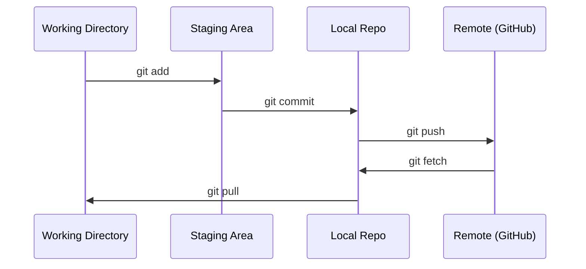
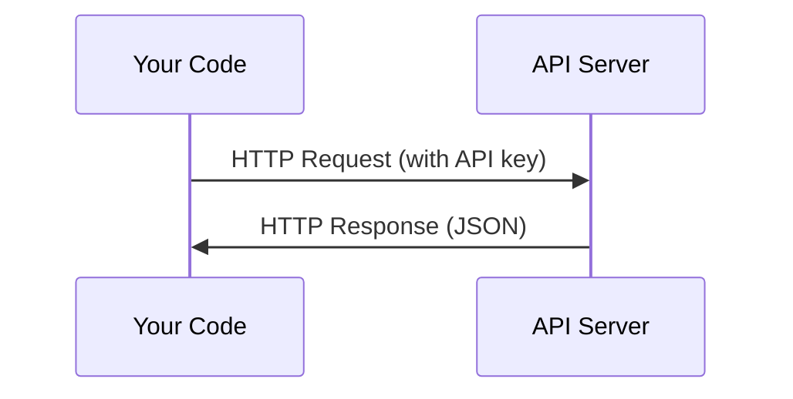
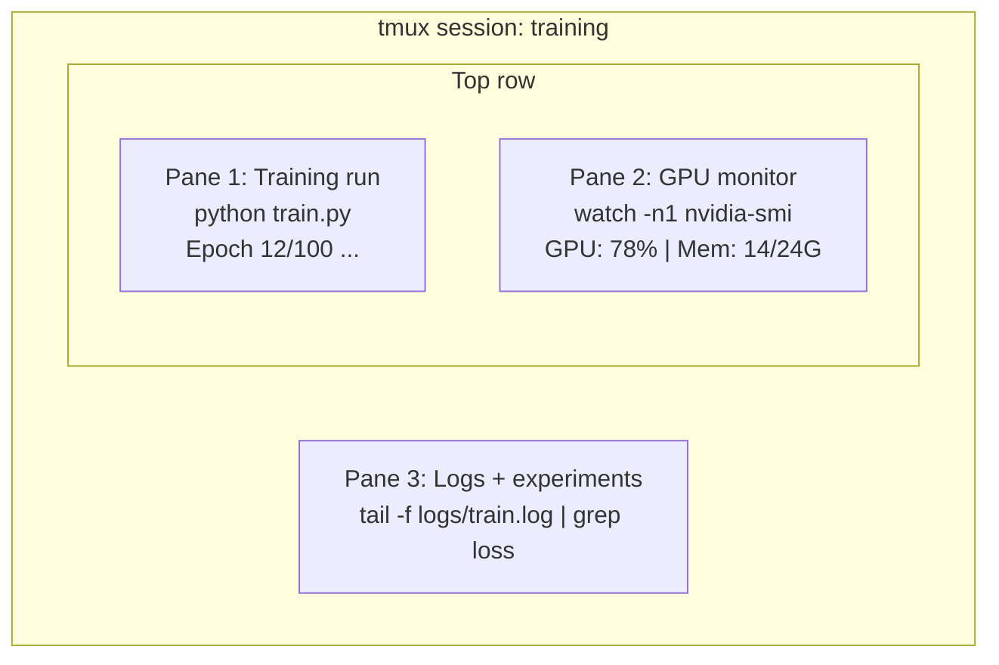
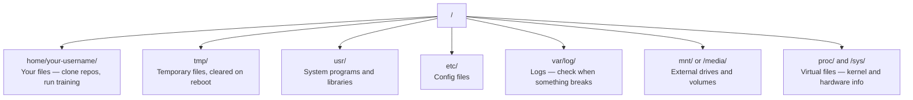

# Git, Terminal & Linux

> Combined lessons (4 parts), merged verbatim — no content removed.

**Type:** Combined

---

## Part 1 (ch002): Git & Collaboration

> Version control is not optional. Every experiment, every model, every lesson you build here gets tracked.

**Type:** Learn
**Languages:** --
**Prerequisites:** Phase 0, Lesson 01
**Time:** ~30 minutes

## Learning Objectives

- Configure git identity and use the daily workflow of add, commit, and push
- Create and merge branches for isolated experiments without breaking main
- Write a `.gitignore` that excludes model checkpoints and large binary files
- Navigate the commit history with `git log` to understand project evolution

## The Problem

You're about to write hundreds of code files across 20 phases. Without version control you will lose work, break things you can't undo, and have no way to collaborate with others.

Git is the tool. GitHub is where the code lives. This lesson covers what you need for this course and nothing more.

## The Concept



Three things to remember:
1. Save often (`git commit`)
2. Push to remote (`git push`)
3. Branch for experiments (`git checkout -b experiment`)

## Build It

### Step 1: Configure git

```bash
git config --global user.name "Your Name"
git config --global user.email "you@example.com"
```

### Step 2: The daily workflow

```bash
git status
git add file.py
git commit -m "Add perceptron implementation"
git push origin main
```

### Step 3: Branching for experiments

```bash
git checkout -b experiment/new-optimizer

# ... make changes, commit ...

git checkout main
git merge experiment/new-optimizer
```

### Step 4: Working with this course repo

```bash
git clone https://github.com/rohitg00/ai-engineering-from-scratch.git
cd ai-engineering-from-scratch

git checkout -b my-progress
# work through lessons, commit your code
git push origin my-progress
```

## Use It

For this course, you need exactly these commands:

| Command | When |
|---------|------|
| `git clone` | Get the course repo |
| `git add` + `git commit` | Save your work |
| `git push` | Back it up to GitHub |
| `git checkout -b` | Try something without breaking main |
| `git log --oneline` | See what you've done |

That's it. You don't need rebase, cherry-pick, or submodules for this course.

## Exercises

1. Clone this repo, create a branch called `my-progress`, make a file, commit it, push it
2. Create a `.gitignore` that excludes model checkpoint files (`.pt`, `.pth`, `.safetensors`)
3. Look at the commit history of this repo with `git log --oneline` and read how lessons were added

## Key Terms

| Term | What people say | What it actually means |
|------|----------------|----------------------|
| Commit | "Saving" | A snapshot of your entire project at a point in time |
| Branch | "A copy" | A pointer to a commit that moves forward as you work |
| Merge | "Combining code" | Taking changes from one branch and applying them to another |
| Remote | "The cloud" | A copy of your repo hosted somewhere else (GitHub, GitLab) |

[Reference](https://github.com/rohitg00/ai-engineering-from-scratch/tree/main/phases/00-setup-and-tooling/02-git-and-collaboration)

---

## Part 2 (ch004): APIs & Keys

> Every AI API works the same way: send a request, get a response. The details change, the pattern doesn't.

**Type:** Build
**Languages:** Python, TypeScript
**Prerequisites:** Phase 0, Lesson 01
**Time:** ~30 minutes

## Learning Objectives

- Store API keys securely using environment variables and `.env` files
- Make an LLM API call using both the Anthropic Python SDK and raw HTTP
- Compare SDK-based and raw HTTP request/response formats for debugging
- Identify and handle common API errors including authentication and rate limits

## The Problem

Starting from Phase 11, you'll call LLM APIs (Anthropic, OpenAI, Google). In Phase 13-16 you'll build agents that use these APIs in loops. You need to know how API keys work, how to store them safely, and how to make your first API call.

## The Concept



Every API call has:
1. An endpoint (URL)
2. An API key (authentication)
3. A request body (what you want)
4. A response body (what you get back)

## Build It

### Step 1: Store API keys safely

Never put API keys in code. Use environment variables.

```bash
export ANTHROPIC_API_KEY="sk-ant-..."
export OPENAI_API_KEY="sk-..."
```

Or use a `.env` file (add it to `.gitignore`):

```
ANTHROPIC_API_KEY=sk-ant-...
OPENAI_API_KEY=sk-...
```

### Step 2: First API call (Python)

```python
import anthropic

client = anthropic.Anthropic()

response = client.messages.create(
    model="claude-sonnet-4-20250514",
    max_tokens=256,
    messages=[{"role": "user", "content": "What is a neural network in one sentence?"}]
)

print(response.content[0].text)
```

### Step 3: First API call (TypeScript)

```typescript
import Anthropic from "@anthropic-ai/sdk";

const client = new Anthropic();

const response = await client.messages.create({
  model: "claude-sonnet-4-20250514",
  max_tokens: 256,
  messages: [{ role: "user", content: "What is a neural network in one sentence?" }],
});

console.log(response.content[0].text);
```

### Step 4: Raw HTTP (no SDK)

```python
import os
import urllib.request
import json

url = "https://api.anthropic.com/v1/messages"
headers = {
    "Content-Type": "application/json",
    "x-api-key": os.environ["ANTHROPIC_API_KEY"],
    "anthropic-version": "2023-06-01",
}
body = json.dumps({
    "model": "claude-sonnet-4-20250514",
    "max_tokens": 256,
    "messages": [{"role": "user", "content": "What is a neural network in one sentence?"}],
}).encode()

req = urllib.request.Request(url, data=body, headers=headers, method="POST")
with urllib.request.urlopen(req) as resp:
    result = json.loads(resp.read())
    print(result["content"][0]["text"])
```

This is what the SDKs do under the hood. Understanding the raw HTTP call helps when debugging.

## Use It

For this course:

| API | When you need it | Free tier |
|-----|-----------------|-----------|
| Anthropic (Claude) | Phases 11-16 (agents, tools) | $5 credit on signup |
| OpenAI | Phase 11 (comparison) | $5 credit on signup |
| Hugging Face | Phases 4-10 (models, datasets) | Free |

You don't need all of them right now. Set them up when the lesson requires it.

## Ship It

This lesson produces:
- `outputs/prompt-api-troubleshooter.md` - diagnose common API errors

## Exercises

1. Get an Anthropic API key and make your first API call
2. Try the raw HTTP version and compare the response format to the SDK version
3. Intentionally use a wrong API key and read the error message

## Key Terms

| Term | What people say | What it actually means |
|------|----------------|----------------------|
| API key | "Password for the API" | A unique string that identifies your account and authorizes requests |
| Rate limit | "They're throttling me" | Maximum requests per minute/hour to prevent abuse and ensure fair usage |
| Token | "A word" (in API context) | A billing unit: input and output tokens are counted and charged separately |
| Streaming | "Real-time responses" | Getting the response word by word instead of waiting for the full response |

[Reference](https://github.com/rohitg00/ai-engineering-from-scratch/tree/main/phases/00-setup-and-tooling/04-apis-and-keys)

---

## Part 3 (ch010): Terminal & Shell

> The terminal is where AI engineers live. Get comfortable here.

**Type:** Learn
**Languages:** --
**Prerequisites:** Phase 0, Lesson 01
**Time:** ~35 minutes

## Learning Objectives

- Use piping, redirects, and `grep` to filter and process training logs from the command line
- Create persistent tmux sessions with multiple panes for concurrent training and GPU monitoring
- Monitor system and GPU resources with `htop`, `nvtop`, and `nvidia-smi`
- Transfer files between local and remote machines using SSH, `scp`, and `rsync`

## The Problem

You will spend more time in the terminal than in any editor. Training runs, GPU monitoring, log tailing, remote SSH sessions, environment management. Every AI workflow touches the shell. If you're slow here, you're slow everywhere.

This lesson covers the terminal skills that matter for AI work. No history of Unix. No deep-dive into Bash scripting. Just what you need.

## The Concept



Three things running at once. One terminal. You can detach, go home, SSH back in, and reattach. The training keeps running.

## Build It

### Step 1: Know your shell

Check which shell you're running:

```bash
echo $SHELL
```

Most systems use `bash` or `zsh`. Both work fine. The commands in this course work in either.

Key things to know:

```bash
# Move around
cd ~/projects/ai-engineering-from-scratch
pwd
ls -la

# History search (most useful shortcut you'll learn)
# Ctrl+R then type part of a previous command
# Press Ctrl+R again to cycle through matches

# Clear terminal
clear   # or Ctrl+L

# Cancel a running command
# Ctrl+C

# Suspend a running command (resume with fg)
# Ctrl+Z
```

### Step 2: Piping and redirects

Piping connects commands together. This is how you process logs, filter output, and chain tools. You will use this constantly.

```bash
# Count how many times "loss" appears in a log
cat train.log | grep "loss" | wc -l

# Extract just the loss values from training output
grep "loss:" train.log | awk '{print $NF}' > losses.txt

# Watch a log file update in real time, filtering for errors
tail -f train.log | grep --line-buffered "ERROR"

# Sort experiments by final accuracy
grep "final_accuracy" results/*.log | sort -t= -k2 -n -r

# Redirect stdout and stderr to separate files
python train.py > output.log 2> errors.log

# Redirect both to the same file
python train.py > train_full.log 2>&1
```

The three redirects you need:

| Symbol | What it does |
|--------|-------------|
| `>` | Write stdout to file (overwrite) |
| `>>` | Append stdout to file |
| `2>` | Write stderr to file |
| `2>&1` | Send stderr to same place as stdout |
| `\|` | Send stdout of one command as stdin to the next |

### Step 3: Background processes

Training runs take hours. You don't want to keep your terminal open the whole time.

```bash
# Run in background (output still goes to terminal)
python train.py &

# Run in background, immune to hangup (closing terminal won't kill it)
nohup python train.py > train.log 2>&1 &

# Check what's running in background
jobs
ps aux | grep train.py

# Bring a background job to foreground
fg %1

# Kill a background process
kill %1
# or find its PID and kill that
kill $(pgrep -f "train.py")
```

The difference between `&`, `nohup`, and `screen`/`tmux`:

| Method | Survives terminal close? | Can reattach? |
|--------|-------------------------|---------------|
| `command &` | No | No |
| `nohup command &` | Yes | No (check log file) |
| `screen` / `tmux` | Yes | Yes |

For anything longer than a few minutes, use tmux.

### Step 4: tmux

tmux lets you create persistent terminal sessions with multiple panes. This is the single most useful tool for managing training runs.

```bash
# Install
# macOS
brew install tmux
# Ubuntu
sudo apt install tmux

# Start a named session
tmux new -s training

# Split horizontally
# Ctrl+B then "

# Split vertically
# Ctrl+B then %

# Navigate between panes
# Ctrl+B then arrow keys

# Detach (session keeps running)
# Ctrl+B then d

# Reattach
tmux attach -t training

# List sessions
tmux ls

# Kill a session
tmux kill-session -t training
```

A typical AI workflow session:

```bash
tmux new -s train

# Pane 1: start training
python train.py --epochs 100 --lr 1e-4

# Ctrl+B, " to split, then run GPU monitor
watch -n1 nvidia-smi

# Ctrl+B, % to split vertically, tail the logs
tail -f logs/experiment.log

# Now detach with Ctrl+B, d
# SSH out, go get coffee, come back
# tmux attach -t train
```

### Step 5: Monitoring with htop and nvtop

```bash
# System processes (better than top)
htop

# GPU processes (if you have NVIDIA GPU)
# Install: sudo apt install nvtop (Ubuntu) or brew install nvtop (macOS)
nvtop

# Quick GPU check without nvtop
nvidia-smi

# Watch GPU usage update every second
watch -n1 nvidia-smi

# See which processes are using the GPU
nvidia-smi --query-compute-apps=pid,name,used_memory --format=csv
```

`htop` keybindings you'll use:
- `F6` or `>` to sort by column (sort by memory to find memory leaks)
- `F5` to toggle tree view (see child processes)
- `F9` to kill a process
- `/` to search for a process name

### Step 6: SSH for remote GPU boxes

When you rent a cloud GPU (Lambda, RunPod, Vast.ai), you connect via SSH.

```bash
# Basic connection
ssh user@gpu-box-ip

# With a specific key
ssh -i ~/.ssh/my_gpu_key user@gpu-box-ip

# Copy files to remote
scp model.pt user@gpu-box-ip:~/models/

# Copy files from remote
scp user@gpu-box-ip:~/results/metrics.json ./

# Sync a whole directory (faster for many files)
rsync -avz ./data/ user@gpu-box-ip:~/data/

# Port forward (access remote Jupyter/TensorBoard locally)
ssh -L 8888:localhost:8888 user@gpu-box-ip
# Now open localhost:8888 in your browser

# SSH config for convenience
# Add to ~/.ssh/config:
# Host gpu
#     HostName 192.168.1.100
#     User ubuntu
#     IdentityFile ~/.ssh/gpu_key
#
# Then just:
# ssh gpu
```

### Step 7: Useful aliases for AI work

Add these to your `~/.bashrc` or `~/.zshrc`:

```bash
source phases/00-setup-and-tooling/10-terminal-and-shell/code/shell_aliases.sh
```

Or copy the ones you want. The key aliases:

```bash
# GPU status at a glance
alias gpu='nvidia-smi --query-gpu=index,name,utilization.gpu,memory.used,memory.total,temperature.gpu --format=csv,noheader'

# Kill all Python training processes
alias killtraining='pkill -f "python.*train"'

# Quick virtual environment activate
alias ae='source .venv/bin/activate'

# Watch training loss
alias watchloss='tail -f logs/*.log | grep --line-buffered "loss"'
```

See `code/shell_aliases.sh` for the full set.

### Step 8: Common AI terminal patterns

These come up repeatedly in practice:

```bash
# Run training, log everything, notify when done
python train.py 2>&1 | tee train.log; echo "DONE" | mail -s "Training complete" you@email.com

# Compare two experiment logs side by side
diff <(grep "accuracy" exp1.log) <(grep "accuracy" exp2.log)

# Find the largest model files (clean up disk space)
find . -name "*.pt" -o -name "*.safetensors" | xargs du -h | sort -rh | head -20

# Download a model from Hugging Face
wget https://huggingface.co/model/resolve/main/model.safetensors

# Untar a dataset
tar xzf dataset.tar.gz -C ./data/

# Count lines in all Python files (see how big your project is)
find . -name "*.py" | xargs wc -l | tail -1

# Check disk space (training data fills disks fast)
df -h
du -sh ./data/*

# Environment variable check before training
env | grep -i cuda
env | grep -i torch
```

## Use It

Here's when each tool comes into play during this course:

| Tool | When you use it |
|------|----------------|
| tmux | Every training run (Phases 3+) |
| `tail -f` + `grep` | Monitoring training logs |
| `nohup` / `&` | Quick background tasks |
| `htop` / `nvtop` | Debugging slow training, OOM errors |
| SSH + `rsync` | Working on cloud GPUs |
| Piping + redirects | Processing experiment results |
| Aliases | Saving time on repetitive commands |

## Exercises

1. Install tmux, create a session with three panes, and run `htop` in one, `watch -n1 date` in another, and a Python script in the third. Detach and reattach.
2. Add the aliases from `code/shell_aliases.sh` to your shell config and reload with `source ~/.zshrc` (or `~/.bashrc`).
3. Create a fake training log with `for i in $(seq 1 100); do echo "epoch $i loss: $(echo "scale=4; 1/$i" | bc)"; sleep 0.1; done > fake_train.log` and then use `grep`, `tail`, and `awk` to extract just the loss values.
4. Set up an SSH config entry for a server you have access to (or use `localhost` to practice the syntax).

## Key Terms

| Term | What people say | What it actually means |
|------|----------------|----------------------|
| Shell | "The terminal" | The program that interprets your commands (bash, zsh, fish) |
| tmux | "Terminal multiplexer" | A program that lets you run multiple terminal sessions inside one window, and detach/reattach |
| Pipe | "The bar thing" | The `\|` operator that sends one command's output as input to another |
| PID | "Process ID" | A unique number assigned to every running process, used to monitor or kill it |
| nohup | "No hangup" | Runs a command immune to the hangup signal, so closing the terminal won't kill it |
| SSH | "Connecting to the server" | Secure Shell, an encrypted protocol for running commands on a remote machine |

[Reference](https://github.com/rohitg00/ai-engineering-from-scratch/tree/main/phases/00-setup-and-tooling/10-terminal-and-shell)

---

## Part 4 (ch011): Linux for AI

> Most AI runs on Linux. You need to know enough to not be stuck.

**Type:** Learn
**Languages:** --
**Prerequisites:** Phase 0, Lesson 01
**Time:** ~30 minutes

## Learning Objectives

- Navigate the Linux file system and perform essential file operations from the command line
- Manage file permissions with `chmod` and `chown` to resolve "Permission denied" errors
- Install system packages with `apt` and set up a fresh GPU box for AI work
- Identify macOS-to-Linux differences that commonly trip up developers working on remote machines

## The Problem

You develop on macOS or Windows. But the moment you SSH into a cloud GPU box, rent a Lambda instance, or spin up an EC2 machine, you land in Ubuntu. The terminal is your only interface. There is no Finder, no Explorer, no GUI. If you can't navigate the file system, install packages, and manage processes from the command line, you're stuck paying for idle GPU hours while googling "how to unzip a file in Linux."

This is a survival guide. It covers exactly what you need to operate on a remote Linux machine for AI work. Nothing more.

## File System Layout

Linux organizes everything under a single root `/`. There is no `C:\` or `/Volumes`. The directories you'll actually touch:



Your home directory is `~` or `/home/your-username`. Almost everything you do happens here.

## Essential Commands

These are the 15 commands that cover 95% of what you'll do on a remote GPU box.

### Moving Around

```bash
pwd                         # Where am I?
ls                          # What's here?
ls -la                      # What's here, including hidden files with details?
cd /path/to/dir             # Go there
cd ~                        # Go home
cd ..                       # Go up one level
```

### Files and Directories

```bash
mkdir my-project            # Create a directory
mkdir -p a/b/c              # Create nested directories in one shot

cp file.txt backup.txt      # Copy a file
cp -r src/ src-backup/      # Copy a directory (recursive)

mv old.txt new.txt          # Rename a file
mv file.txt /tmp/           # Move a file

rm file.txt                 # Delete a file (no trash, it's gone)
rm -rf my-dir/              # Delete a directory and everything inside
```

`rm -rf` is permanent. There is no undo. Double-check the path before hitting enter.

### Reading Files

```bash
cat file.txt                # Print entire file
head -20 file.txt           # First 20 lines
tail -20 file.txt           # Last 20 lines
tail -f log.txt             # Follow a log file in real time (Ctrl+C to stop)
less file.txt               # Scroll through a file (q to quit)
```

### Searching

```bash
grep "error" training.log           # Find lines containing "error"
grep -r "learning_rate" .           # Search all files in current directory
grep -i "cuda" config.yaml          # Case-insensitive search

find . -name "*.py"                 # Find all Python files under current dir
find . -name "*.ckpt" -size +1G     # Find checkpoint files larger than 1GB
```

## Permissions

Every file in Linux has an owner and permission bits. You'll run into this when scripts won't execute or you can't write to a directory.

```bash
ls -l train.py
# -rwxr-xr-- 1 user group 2048 Mar 19 10:00 train.py
#  ^^^             owner permissions: read, write, execute
#     ^^^          group permissions: read, execute
#        ^^        everyone else: read only
```

Common fixes:

```bash
chmod +x train.sh           # Make a script executable
chmod 755 deploy.sh         # Owner: full, others: read+execute
chmod 644 config.yaml       # Owner: read+write, others: read only

chown user:group file.txt   # Change who owns a file (needs sudo)
```

When something says "Permission denied," it's almost always a permissions issue. `chmod +x` or `sudo` will fix most cases.

## Package Management (apt)

Ubuntu uses `apt`. This is how you install system-level software.

```bash
sudo apt update             # Refresh the package list (always do this first)
sudo apt install -y htop    # Install a package (-y skips confirmation)
sudo apt install -y build-essential  # C compiler, make, etc. Needed by many Python packages
sudo apt install -y tmux    # Terminal multiplexer (keep sessions alive after disconnect)

apt list --installed        # What's installed?
sudo apt remove htop        # Uninstall
```

Common packages you'll install on a fresh GPU box:

```bash
sudo apt update && sudo apt install -y \
    build-essential \
    git \
    curl \
    wget \
    tmux \
    htop \
    unzip \
    python3-venv
```

## Users and sudo

You're usually logged in as a regular user. Some operations need root (admin) access.

```bash
whoami                      # What user am I?
sudo command                # Run a single command as root
sudo su                     # Become root (exit to go back, use sparingly)
```

On cloud GPU instances, you're typically the only user and already have sudo access. Don't run everything as root. Use sudo only when needed.

## Processes and systemd

When your training hangs, or you need to check what's running:

```bash
htop                        # Interactive process viewer (q to quit)
ps aux | grep python        # Find running Python processes
kill 12345                  # Gracefully stop process with PID 12345
kill -9 12345               # Force kill (use when graceful doesn't work)
nvidia-smi                  # GPU processes and memory usage
```

systemd manages services (background daemons). You'll use it if you run inference servers:

```bash
sudo systemctl start nginx          # Start a service
sudo systemctl stop nginx           # Stop it
sudo systemctl restart nginx        # Restart it
sudo systemctl status nginx         # Check if it's running
sudo systemctl enable nginx         # Start automatically on boot
```

## Disk Space

GPU boxes often have limited disk space. Models and datasets fill it fast.

```bash
df -h                       # Disk usage for all mounted drives
df -h /home                 # Disk usage for /home specifically

du -sh *                    # Size of each item in current directory
du -sh ~/.cache             # Size of your cache (pip, huggingface models land here)
du -sh /data/checkpoints/   # Check how big your checkpoints are

# Find the biggest space hogs
du -h --max-depth=1 / 2>/dev/null | sort -hr | head -20
```

Common space savers:

```bash
# Clear pip cache
pip cache purge

# Clear apt cache
sudo apt clean

# Remove old checkpoints you don't need
rm -rf checkpoints/epoch_01/ checkpoints/epoch_02/
```

## Networking

You'll download models, transfer files, and hit APIs from the command line.

```bash
# Download files
wget https://example.com/model.bin                   # Download a file
curl -O https://example.com/data.tar.gz              # Same thing with curl
curl -s https://api.example.com/health | python3 -m json.tool  # Hit an API, pretty-print JSON

# Transfer files between machines
scp model.bin user@remote:/data/                     # Copy file to remote machine
scp user@remote:/data/results.csv .                  # Copy file from remote to local
scp -r user@remote:/data/checkpoints/ ./local-dir/   # Copy directory

# Sync directories (faster than scp for large transfers, resumes on failure)
rsync -avz --progress ./data/ user@remote:/data/
rsync -avz --progress user@remote:/results/ ./results/
```

Use `rsync` over `scp` for anything large. It only transfers changed bytes and handles interrupted connections.

## tmux: Keep Sessions Alive

When you SSH into a remote box, closing your laptop kills your training run. tmux prevents this.

```bash
tmux new -s train           # Start a new session named "train"
# ... start your training, then:
# Ctrl+B, then D            # Detach (training keeps running)

tmux ls                     # List sessions
tmux attach -t train        # Reattach to session

# Inside tmux:
# Ctrl+B, then %            # Split pane vertically
# Ctrl+B, then "            # Split pane horizontally
# Ctrl+B, then arrow keys   # Switch between panes
```

Always run long training jobs inside tmux. Always.

## WSL2 for Windows Users

If you're on Windows, WSL2 gives you a real Linux environment without dual-booting.

```bash
# In PowerShell (admin)
wsl --install -d Ubuntu-24.04

# After restart, open Ubuntu from Start menu
sudo apt update && sudo apt upgrade -y
```

WSL2 runs a real Linux kernel. Everything in this lesson works inside it. Your Windows files are at `/mnt/c/Users/YourName/` from inside WSL.

GPU passthrough works with NVIDIA drivers installed on the Windows side. Install the Windows NVIDIA driver (not the Linux one), and CUDA will be available inside WSL2.

## Gotchas: macOS to Linux

Things that will trip you up if you're coming from macOS:

| macOS | Linux | Notes |
|-------|-------|-------|
| `brew install` | `sudo apt install` | Different package names sometimes. `brew install htop` vs `sudo apt install htop` works the same, but `brew install readline` vs `sudo apt install libreadline-dev` does not. |
| `open file.txt` | `xdg-open file.txt` | But you won't have a GUI on a remote box. Use `cat` or `less`. |
| `pbcopy` / `pbpaste` | Not available | Pipe to/from clipboard doesn't exist over SSH. |
| `~/.zshrc` | `~/.bashrc` | macOS defaults to zsh. Most Linux servers use bash. |
| `/opt/homebrew/` | `/usr/bin/`, `/usr/local/bin/` | Binaries live in different places. |
| `sed -i '' 's/a/b/' file` | `sed -i 's/a/b/' file` | macOS sed needs an empty string after `-i`. Linux does not. |
| Case-insensitive filesystem | Case-sensitive filesystem | `Model.py` and `model.py` are two different files on Linux. |
| Line endings `\n` | Line endings `\n` | Same. But Windows uses `\r\n`, which breaks bash scripts. Run `dos2unix` to fix. |

## Quick Reference Card

```
Navigation:     pwd, ls, cd, find
Files:          cp, mv, rm, mkdir, cat, head, tail, less
Search:         grep, find
Permissions:    chmod, chown, sudo
Packages:       apt update, apt install
Processes:      htop, ps, kill, nvidia-smi
Services:       systemctl start/stop/restart/status
Disk:           df -h, du -sh
Network:        curl, wget, scp, rsync
Sessions:       tmux new/attach/detach
```

## Exercises

1. SSH into any Linux machine (or open WSL2) and navigate to your home directory. Create a project folder, create three empty files inside it with `touch`, then list them with `ls -la`.
2. Install `htop` with apt, run it, and identify which process is using the most memory.
3. Start a tmux session, run `sleep 300` inside it, detach, list sessions, and reattach.
4. Use `df -h` to check available disk space, then use `du -sh ~/.cache/*` to find what's taking up space in your cache.
5. Transfer a file from your local machine to a remote one using `scp`, then do the same transfer with `rsync` and compare the experience.

[Reference](https://github.com/rohitg00/ai-engineering-from-scratch/tree/main/phases/00-setup-and-tooling/11-linux-for-ai)
