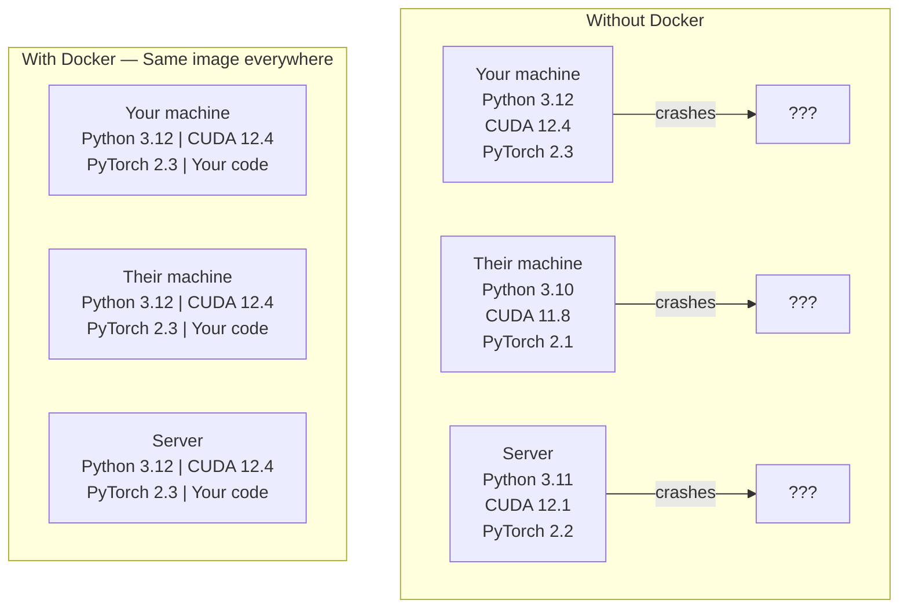
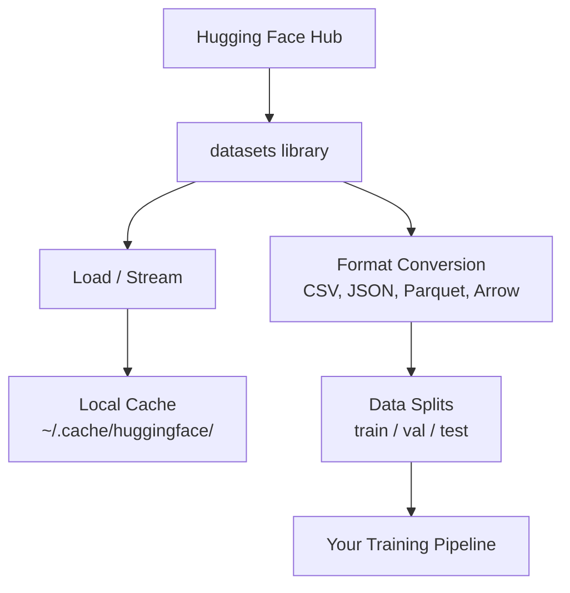
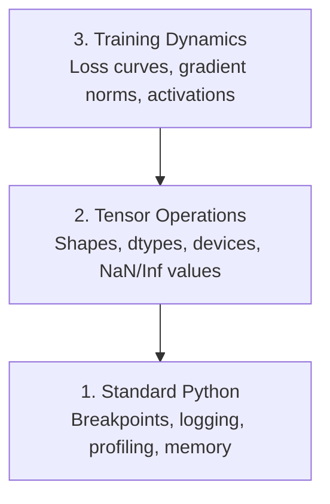

# GPU, Docker, Data & Debugging

> Combined lessons (4 parts), merged verbatim — no content removed.

**Type:** Combined

---

## Part 1 (ch003): GPU Setup & Cloud

> Training on CPU is fine for learning. Training for real needs a GPU.

**Type:** Build
**Languages:** Python
**Prerequisites:** Phase 0, Lesson 01
**Time:** ~45 minutes

## Learning Objectives

- Verify local GPU availability using `nvidia-smi` and PyTorch's CUDA API
- Configure Google Colab with a T4 GPU for free cloud-based experiments
- Benchmark matrix multiplication on CPU vs GPU and measure the speedup
- Estimate the largest model that fits in your VRAM using the fp16 rule of thumb

## The Problem

Most lessons in phases 1-3 run fine on CPU. But once you start training CNNs, transformers, or LLMs (phases 4+), you need GPU acceleration. A training run that takes 8 hours on CPU takes 10 minutes on GPU.

You have three options: local GPU, cloud GPU, or Google Colab (free).

## The Concept

```
Your options:

1. Local NVIDIA GPU
   Cost: $0 (you already have it)
   Setup: Install CUDA + cuDNN
   Best for: Regular use, large datasets

2. Google Colab (free tier)
   Cost: $0
   Setup: None
   Best for: Quick experiments, no GPU at home

3. Cloud GPU (Lambda, RunPod, Vast.ai)
   Cost: $0.20-2.00/hr
   Setup: SSH + install
   Best for: Serious training, large models
```

## Build It

### Option 1: Local NVIDIA GPU

Check if you have one:

```bash
nvidia-smi
```

Install PyTorch with CUDA:

```python
import torch

print(f"CUDA available: {torch.cuda.is_available()}")
print(f"CUDA version: {torch.version.cuda}")
if torch.cuda.is_available():
    print(f"GPU: {torch.cuda.get_device_name(0)}")
    print(f"Memory: {torch.cuda.get_device_properties(0).total_memory / 1e9:.1f} GB")
```

### Option 2: Google Colab

1. Go to [colab.research.google.com](https://colab.research.google.com)
2. Runtime > Change runtime type > T4 GPU
3. Run `!nvidia-smi` to verify

Upload notebooks from this course directly to Colab.

### Option 3: Cloud GPU

For Lambda Labs, RunPod, or Vast.ai:

```bash
ssh user@your-gpu-instance

pip install torch torchvision torchaudio
python -c "import torch; print(torch.cuda.get_device_name(0))"
```

### No GPU? No problem.

Most lessons work on CPU. The ones that need GPU will say so and include Colab links.

```python
device = torch.device("cuda" if torch.cuda.is_available() else "cpu")
print(f"Using: {device}")
```

## Build It: GPU vs CPU benchmark

```python
import torch
import time

size = 5000

a_cpu = torch.randn(size, size)
b_cpu = torch.randn(size, size)

start = time.time()
c_cpu = a_cpu @ b_cpu
cpu_time = time.time() - start
print(f"CPU: {cpu_time:.3f}s")

if torch.cuda.is_available():
    a_gpu = a_cpu.to("cuda")
    b_gpu = b_cpu.to("cuda")

    torch.cuda.synchronize()
    start = time.time()
    c_gpu = a_gpu @ b_gpu
    torch.cuda.synchronize()
    gpu_time = time.time() - start
    print(f"GPU: {gpu_time:.3f}s")
    print(f"Speedup: {cpu_time / gpu_time:.0f}x")
```

## Exercises

1. Run the benchmark above and compare CPU vs GPU times
2. If you don't have a GPU, run it on Google Colab and compare
3. Check how much GPU memory you have and estimate the largest model you can fit (rule of thumb: 2 bytes per parameter for fp16)

## Key Terms

| Term | What people say | What it actually means |
|------|----------------|----------------------|
| CUDA | "GPU programming" | NVIDIA's parallel computing platform that lets you run code on the GPU |
| VRAM | "GPU memory" | Video RAM on the GPU, separate from system RAM. Limits model size. |
| fp16 | "Half precision" | 16-bit floating point, uses half the memory of fp32 with minimal accuracy loss |
| Tensor Core | "Fast matrix hardware" | Specialized GPU cores for matrix multiplication, 4-8x faster than regular cores |

[Reference](https://github.com/rohitg00/ai-engineering-from-scratch/tree/main/phases/00-setup-and-tooling/03-gpu-setup-and-cloud)

---

## Part 2 (ch007): Docker for AI

> Containers make "works on my machine" a thing of the past.

**Type:** Build
**Languages:** Docker
**Prerequisites:** Phase 0, Lessons 01 and 03
**Time:** ~60 minutes

## Learning Objectives

- Build a GPU-enabled Docker image with CUDA, PyTorch, and AI libraries from a Dockerfile
- Mount host directories as volumes to persist models, datasets, and code across container rebuilds
- Configure the NVIDIA Container Toolkit to expose GPUs inside containers
- Orchestrate multi-service AI applications (inference server + vector database) using Docker Compose

## The Problem

You trained a model on your laptop with PyTorch 2.3, CUDA 12.4, and Python 3.12. Your colleague has PyTorch 2.1, CUDA 11.8, and Python 3.10. Your model crashes on their machine. Your Dockerfile works on both.

AI projects are dependency nightmares. A typical stack includes Python, PyTorch, CUDA drivers, cuDNN, system-level C libraries, and specialized packages like flash-attn that need exact compiler versions. Docker packages all of this into a single image that runs identically everywhere.

## The Concept

Docker wraps your code, runtime, libraries, and system tools into an isolated unit called a container. Think of it as a lightweight virtual machine, except it shares the host OS kernel instead of running its own, so it starts in seconds instead of minutes.



### Why AI projects need Docker more than most

1. **GPU drivers are fragile.** CUDA 12.4 code does not run on CUDA 11.8. Docker isolates the CUDA toolkit inside the container while sharing the host GPU driver through the NVIDIA Container Toolkit.

2. **Model weights are large.** A 7B parameter model is 14 GB in fp16. You do not want to re-download it every time you rebuild. Docker volumes let you mount a models directory from the host.

3. **Multi-service architectures are common.** A real AI application is not just a Python script. It is an inference server, a vector database for RAG, maybe a web frontend. Docker Compose orchestrates all of these with one command.

### Key vocabulary

| Term | What it means |
|------|---------------|
| Image | A read-only template. Your recipe. Built from a Dockerfile. |
| Container | A running instance of an image. Your kitchen. |
| Dockerfile | Instructions to build an image. Layer by layer. |
| Volume | Persistent storage that survives container restarts. |
| docker-compose | A tool for defining multi-container applications in YAML. |

### Common container patterns in AI

```
Dev Container
  Full toolkit. Editor support. Jupyter. Debugging tools.
  Used during development and experimentation.

Training Container
  Minimal. Just the training script and dependencies.
  Runs on GPU clusters. No editor, no Jupyter.

Inference Container
  Optimized for serving. Small image. Fast cold start.
  Runs behind a load balancer in production.
```

## Build It

### Step 1: Install Docker

```bash
# macOS
brew install --cask docker
open /Applications/Docker.app

# Ubuntu
curl -fsSL https://get.docker.com | sh
sudo usermod -aG docker $USER
# Log out and back in for group change to take effect
```

Verify:

```bash
docker --version
docker run hello-world
```

### Step 2: Install NVIDIA Container Toolkit (Linux with NVIDIA GPU)

This lets Docker containers access your GPU. macOS and Windows (WSL2) users can skip this; Docker Desktop handles GPU passthrough differently on those platforms.

```bash
distribution=$(. /etc/os-release;echo $ID$VERSION_ID)
curl -fsSL https://nvidia.github.io/libnvidia-container/gpgkey | sudo gpg --dearmor -o /usr/share/keyrings/nvidia-container-toolkit-keyring.gpg
curl -s -L https://nvidia.github.io/libnvidia-container/$distribution/libnvidia-container.list | \
    sed 's#deb https://#deb [signed-by=/usr/share/keyrings/nvidia-container-toolkit-keyring.gpg] https://#g' | \
    sudo tee /etc/apt/sources.list.d/nvidia-container-toolkit.list

sudo apt-get update
sudo apt-get install -y nvidia-container-toolkit
sudo nvidia-ctk runtime configure --runtime=docker
sudo systemctl restart docker
```

Test GPU access inside a container:

```bash
docker run --rm --gpus all nvidia/cuda:12.4.1-base-ubuntu22.04 nvidia-smi
```

If you see your GPU info, the toolkit is working.

### Step 3: Understand base images

Choosing the right base image saves hours of debugging.

```
nvidia/cuda:12.4.1-devel-ubuntu22.04
  Full CUDA toolkit. Compilers included.
  Use for: building packages that need nvcc (flash-attn, bitsandbytes)
  Size: ~4 GB

nvidia/cuda:12.4.1-runtime-ubuntu22.04
  CUDA runtime only. No compilers.
  Use for: running pre-built code
  Size: ~1.5 GB

pytorch/pytorch:2.3.1-cuda12.4-cudnn9-runtime
  PyTorch pre-installed on top of CUDA.
  Use for: skipping the PyTorch install step
  Size: ~6 GB

python:3.12-slim
  No CUDA. CPU only.
  Use for: inference on CPU, lightweight tools
  Size: ~150 MB
```

### Step 4: Write a Dockerfile for AI development

Here is the Dockerfile in `code/Dockerfile`. Walk through it:

```dockerfile
FROM nvidia/cuda:12.4.1-devel-ubuntu22.04

ENV DEBIAN_FRONTEND=noninteractive
ENV PYTHONUNBUFFERED=1

RUN apt-get update && apt-get install -y --no-install-recommends \
    python3.12 \
    python3.12-venv \
    python3.12-dev \
    python3-pip \
    git \
    curl \
    build-essential \
    && rm -rf /var/lib/apt/lists/*

RUN update-alternatives --install /usr/bin/python python /usr/bin/python3.12 1

RUN python -m pip install --no-cache-dir --upgrade pip setuptools wheel

RUN python -m pip install --no-cache-dir \
    torch==2.3.1 \
    torchvision==0.18.1 \
    torchaudio==2.3.1 \
    --index-url https://download.pytorch.org/whl/cu124

RUN python -m pip install --no-cache-dir \
    numpy \
    pandas \
    scikit-learn \
    matplotlib \
    jupyter \
    transformers \
    datasets \
    accelerate \
    safetensors

WORKDIR /workspace

VOLUME ["/workspace", "/models"]

EXPOSE 8888

CMD ["python"]
```

Build it:

```bash
docker build -t ai-dev -f phases/00-setup-and-tooling/07-docker-for-ai/code/Dockerfile .
```

This takes a while the first time (downloading CUDA base image + PyTorch). Subsequent builds use cached layers.

Run it:

```bash
docker run --rm -it --gpus all \
    -v $(pwd):/workspace \
    -v ~/models:/models \
    ai-dev python -c "import torch; print(f'PyTorch {torch.__version__}, CUDA: {torch.cuda.is_available()}')"
```

Run Jupyter inside the container:

```bash
docker run --rm -it --gpus all \
    -v $(pwd):/workspace \
    -v ~/models:/models \
    -p 8888:8888 \
    ai-dev jupyter notebook --ip=0.0.0.0 --port=8888 --no-browser --allow-root
```

### Step 5: Volume mounts for data and models

Volume mounts are critical for AI work. Without them, your 14 GB model downloads vanish when the container stops.

```bash
# Mount your code
-v $(pwd):/workspace

# Mount a shared models directory
-v ~/models:/models

# Mount datasets
-v ~/datasets:/data
```

Inside your training script, load from the mounted path:

```python
from transformers import AutoModel

model = AutoModel.from_pretrained("/models/llama-7b")
```

The model lives on your host filesystem. Rebuild the container as often as you want without re-downloading.

### Step 6: Docker Compose for multi-service AI apps

A real RAG application needs an inference server and a vector database. Docker Compose runs both with one command.

See `code/docker-compose.yml`:

```yaml
services:
  ai-dev:
    build:
      context: .
      dockerfile: Dockerfile
    deploy:
      resources:
        reservations:
          devices:
            - driver: nvidia
              count: all
              capabilities: [gpu]
    volumes:
      - ../../../:/workspace
      - ~/models:/models
      - ~/datasets:/data
    ports:
      - "8888:8888"
    stdin_open: true
    tty: true
    command: jupyter notebook --ip=0.0.0.0 --port=8888 --no-browser --allow-root

  qdrant:
    image: qdrant/qdrant:v1.12.5
    ports:
      - "6333:6333"
      - "6334:6334"
    volumes:
      - qdrant_data:/qdrant/storage

volumes:
  qdrant_data:
```

Start everything:

```bash
cd phases/00-setup-and-tooling/07-docker-for-ai/code
docker compose up -d
```

Now your AI dev container can reach the vector database at `http://qdrant:6333` by service name. Docker Compose creates a shared network automatically.

Test the connection from inside the AI container:

```python
from qdrant_client import QdrantClient

client = QdrantClient(host="qdrant", port=6333)
print(client.get_collections())
```

Stop everything:

```bash
docker compose down
```

Add `-v` to also delete the qdrant volume:

```bash
docker compose down -v
```

### Step 7: Useful Docker commands for AI work

```bash
# List running containers
docker ps

# List all images and their sizes
docker images

# Remove unused images (reclaim disk space)
docker system prune -a

# Check GPU usage inside a running container
docker exec -it <container_id> nvidia-smi

# Copy a file from container to host
docker cp <container_id>:/workspace/results.csv ./results.csv

# View container logs
docker logs -f <container_id>
```

## Use It

You now have a reproducible AI development environment. For the rest of this course:

- Use `docker compose up` to start your dev environment and vector database together
- Mount your code, models, and data as volumes so nothing is lost between rebuilds
- When a lesson requires a new Python package, add it to the Dockerfile and rebuild
- Share your Dockerfile with teammates. They get the exact same environment.

### No GPU?

Remove the `--gpus all` flag and the NVIDIA deploy block. The container still works for CPU-based lessons. PyTorch detects the absence of CUDA and falls back to CPU automatically.

## Exercises

1. Build the Dockerfile and run `python -c "import torch; print(torch.__version__)"` inside the container
2. Start the docker-compose stack and verify Qdrant is accessible from the AI container at `http://qdrant:6333/collections`
3. Add `flask` to the Dockerfile, rebuild, and run a simple API server on port 5000. Map the port with `-p 5000:5000`
4. Measure the image size with `docker images`. Try switching the base image from `devel` to `runtime` and compare sizes

## Key Terms

| Term | What people say | What it actually means |
|------|----------------|----------------------|
| Container | "Lightweight VM" | An isolated process using the host kernel, with its own filesystem and network |
| Image layer | "Cached step" | Each Dockerfile instruction creates a layer. Unchanged layers are cached, so rebuilds are fast. |
| NVIDIA Container Toolkit | "GPU in Docker" | A runtime hook that exposes host GPUs to containers via `--gpus` flag |
| Volume mount | "Shared folder" | A directory on the host mapped into the container. Changes persist after the container stops. |
| Base image | "Starting point" | The `FROM` image your Dockerfile builds on top of. Determines what is pre-installed. |

[Reference](https://github.com/rohitg00/ai-engineering-from-scratch/tree/main/phases/00-setup-and-tooling/07-docker-for-ai)

---

## Part 3 (ch009): Data Management

> Data is the fuel. How you manage it determines how fast you go.

**Type:** Build
**Language:** Python
**Prerequisites:** Phase 0, Lesson 01
**Time:** ~45 minutes

## Learning Objectives

- Load, stream, and cache datasets using the Hugging Face `datasets` library
- Convert between CSV, JSON, Parquet, and Arrow formats and explain their tradeoffs
- Create reproducible train/validation/test splits with fixed random seeds
- Manage large model and dataset files using `.gitignore`, Git LFS, or DVC

## The Problem

Every AI project starts with data. You need to find datasets, download them, convert between formats, split them for training and evaluation, and version them so experiments are reproducible. Doing this manually every time is slow and error-prone. You need a repeatable workflow.

## The Concept



The Hugging Face `datasets` library is the standard way to load data for AI work. It handles downloading, caching, format conversion, and streaming out of the box.

## Build It

### Step 1: Install the datasets library

```bash
pip install datasets huggingface_hub
```

### Step 2: Load a dataset

```python
from datasets import load_dataset

dataset = load_dataset("imdb")
print(dataset)
print(dataset["train"][0])
```

This downloads the IMDB movie review dataset. After the first download, it loads from cache at `~/.cache/huggingface/datasets/`.

### Step 3: Stream large datasets

Some datasets are too large to fit on disk. Streaming loads them row by row without downloading the full thing.

```python
dataset = load_dataset("wikimedia/wikipedia", "20220301.en", split="train", streaming=True)

for i, example in enumerate(dataset):
    print(example["title"])
    if i >= 4:
        break
```

Streaming gives you an `IterableDataset`. You process rows as they arrive. Memory usage stays constant regardless of dataset size.

### Step 4: Dataset formats

The `datasets` library uses Apache Arrow under the hood. You can convert to other formats depending on what your pipeline needs.

```python
dataset = load_dataset("imdb", split="train")

dataset.to_csv("imdb_train.csv")
dataset.to_json("imdb_train.json")
dataset.to_parquet("imdb_train.parquet")
```

Format comparison:

| Format | Size | Read Speed | Best For |
|--------|------|-----------|----------|
| CSV | Large | Slow | Human readability, spreadsheets |
| JSON | Large | Slow | APIs, nested data |
| Parquet | Small | Fast | Analytics, columnar queries |
| Arrow | Small | Fastest | In-memory processing (what `datasets` uses internally) |

For AI work, Parquet is the best storage format. Arrow is what you work with in memory. CSV and JSON are for interchange.

### Step 5: Data splits

Every ML project needs three splits:

- **Train**: The model learns from this (typically 80%)
- **Validation**: You check progress during training (typically 10%)
- **Test**: Final evaluation after training is done (typically 10%)

Some datasets come pre-split. When they don't, split them yourself:

```python
dataset = load_dataset("imdb", split="train")

split = dataset.train_test_split(test_size=0.2, seed=42)
train_val = split["train"].train_test_split(test_size=0.125, seed=42)

train_ds = train_val["train"]
val_ds = train_val["test"]
test_ds = split["test"]

print(f"Train: {len(train_ds)}, Val: {len(val_ds)}, Test: {len(test_ds)}")
```

Always set a seed for reproducibility. The same seed produces the same split every time.

### Step 6: Download and cache models

Models are large files. The `huggingface_hub` library handles downloading and caching.

```python
from huggingface_hub import hf_hub_download, snapshot_download

model_path = hf_hub_download(
    repo_id="sentence-transformers/all-MiniLM-L6-v2",
    filename="config.json"
)
print(f"Cached at: {model_path}")

model_dir = snapshot_download("sentence-transformers/all-MiniLM-L6-v2")
print(f"Full model at: {model_dir}")
```

Models cache to `~/.cache/huggingface/hub/`. Once downloaded, they load instantly on subsequent runs.

### Step 7: Handle large files

Model weights and large datasets should not go into git. Three options:

**Option A: .gitignore (simplest)**

```
*.bin
*.safetensors
*.pt
*.onnx
data/*.parquet
data/*.csv
models/
```

**Option B: Git LFS (track large files in git)**

```bash
git lfs install
git lfs track "*.bin"
git lfs track "*.safetensors"
git add .gitattributes
```

Git LFS stores pointers in your repo and the actual files on a separate server. GitHub gives you 1 GB free.

**Option C: DVC (data version control)**

```bash
pip install dvc
dvc init
dvc add data/training_set.parquet
git add data/training_set.parquet.dvc data/.gitignore
git commit -m "Track training data with DVC"
```

DVC creates small `.dvc` files that point to your data. The data itself lives in S3, GCS, or another remote storage backend.

| Approach | Complexity | Best For |
|----------|-----------|----------|
| .gitignore | Low | Personal projects, downloaded data you can re-fetch |
| Git LFS | Medium | Teams sharing model weights via git |
| DVC | High | Reproducible experiments, large datasets, teams |

For this course, `.gitignore` is enough. Use DVC when you need to reproduce exact experiments across machines.

### Step 8: Storage patterns

**Local storage** works for datasets under ~10 GB. The HF cache handles this automatically.

**Cloud storage** is for anything larger or shared across machines:

```python
import os

local_path = os.path.expanduser("~/.cache/huggingface/datasets/")

# s3_path = "s3://my-bucket/datasets/"
# gcs_path = "gs://my-bucket/datasets/"
```

DVC integrates with S3 and GCS directly:

```bash
dvc remote add -d myremote s3://my-bucket/dvc-store
dvc push
```

For this course, local storage is sufficient. Cloud storage becomes relevant when you fine-tune on remote GPU instances.

## Datasets Used in This Course

| Dataset | Lessons | Size | What It Teaches |
|---------|---------|------|----------------|
| IMDB | Tokenization, classification | 84 MB | Text classification basics |
| WikiText | Language modeling | 181 MB | Next-token prediction |
| SQuAD | QA systems | 35 MB | Question answering, spans |
| Common Crawl (subset) | Embeddings | Varies | Large-scale text processing |
| MNIST | Vision basics | 21 MB | Image classification fundamentals |
| COCO (subset) | Multimodal | Varies | Image-text pairs |

You do not need to download all of these now. Each lesson specifies what it needs.

## Use It

Run the utility script to verify everything works:

```bash
python code/data_utils.py
```

This downloads a small dataset, converts it, splits it, and prints a summary.

## Ship It

This lesson produces:
- `code/data_utils.py` - reusable data loading and caching utility
- `outputs/prompt-data-helper.md` - prompt for finding the right dataset for a task

## Exercises

1. Load the `glue` dataset with the `mrpc` config and inspect the first 5 examples
2. Stream the `c4` dataset and count how many examples you can process in 10 seconds
3. Convert a dataset to Parquet and compare the file size to CSV
4. Create a 70/15/15 train/val/test split with a fixed seed and verify the sizes

## Key Terms

| Term | What people say | What it actually means |
|------|----------------|----------------------|
| Dataset split | "Training data" | A named subset (train/val/test) used at different stages of the ML lifecycle |
| Streaming | "Load it lazily" | Processing data row by row from a remote source without downloading the full dataset |
| Parquet | "Compressed CSV" | A columnar file format optimized for analytical queries and storage efficiency |
| Arrow | "Fast dataframe" | An in-memory columnar format used internally by the datasets library for zero-copy reads |
| Git LFS | "Git for big files" | An extension that stores large files outside the git repo while keeping pointers in version control |
| DVC | "Git for data" | A version control system for datasets and models that integrates with cloud storage |
| Cache | "Already downloaded" | A local copy of previously fetched data, stored at ~/.cache/huggingface/ by default |

[Reference](https://github.com/rohitg00/ai-engineering-from-scratch/tree/main/phases/00-setup-and-tooling/09-data-management)

---

## Part 4 (ch012): Debugging and Profiling

> The worst AI bugs don't crash. They train silently on garbage and report a beautiful loss curve.

**Type:** Build
**Language:** Python
**Prerequisites:** Lesson 1 (Dev Environment), basic PyTorch familiarity
**Time:** ~60 minutes

## Learning Objectives

- Use conditional `breakpoint()` and `debug_print` to inspect tensor shapes, dtypes, and NaN values mid-training
- Profile training loops with `cProfile`, `line_profiler`, and `tracemalloc` to find bottlenecks
- Detect common AI bugs: shape mismatches, NaN loss, data leakage, and wrong-device tensors
- Set up TensorBoard to visualize loss curves, weight histograms, and gradient distributions

## The Problem

AI code fails differently than regular code. A web app crashes with a stack trace. A misconfigured training loop runs for 8 hours, burns $200 in GPU time, and produces a model that predicts the mean of every input. The code never errored. The bug was a tensor on the wrong device, a forgotten `.detach()`, or labels leaking into features.

You need debugging tools that catch these silent failures before they waste your time and compute.

## The Concept

AI debugging operates at three levels:



Most people jump straight to level 3 (staring at TensorBoard). But 80% of AI bugs live at levels 1 and 2.

## Build It

### Part 1: Print Debugging (Yes, It Works)

Print debugging gets dismissed. It shouldn't. For tensor code, a targeted print statement beats stepping through a debugger because you need to see shapes, dtypes, and value ranges all at once.

```python
def debug_print(name, tensor):
    print(f"{name}: shape={tensor.shape}, dtype={tensor.dtype}, "
          f"device={tensor.device}, "
          f"min={tensor.min().item():.4f}, max={tensor.max().item():.4f}, "
          f"mean={tensor.mean().item():.4f}, "
          f"has_nan={tensor.isnan().any().item()}")
```

Call this after every suspicious operation. When the bug is found, remove the prints. Simple.

### Part 2: Python Debugger (pdb and breakpoint)

The built-in debugger is underrated for AI work. Drop `breakpoint()` into your training loop and inspect tensors interactively.

```python
def training_step(model, batch, criterion, optimizer):
    inputs, labels = batch
    outputs = model(inputs)
    loss = criterion(outputs, labels)

    if loss.item() > 100 or torch.isnan(loss):
        breakpoint()

    loss.backward()
    optimizer.step()
```

When the debugger drops you in, useful commands:

- `p outputs.shape` to check shapes
- `p loss.item()` to see the loss value
- `p torch.isnan(outputs).sum()` to count NaNs
- `p model.fc1.weight.grad` to check gradients
- `c` to continue, `q` to quit

This is conditional debugging. You only stop when something looks wrong. For a 10,000-step training run, that matters.

### Part 3: Python Logging

Replace print statements with logging when your debugging goes beyond a quick check.

```python
import logging

logging.basicConfig(
    level=logging.INFO,
    format="%(asctime)s [%(levelname)s] %(message)s",
    handlers=[
        logging.FileHandler("training.log"),
        logging.StreamHandler()
    ]
)
logger = logging.getLogger(__name__)

logger.info("Starting training: lr=%.4f, batch_size=%d", lr, batch_size)
logger.warning("Loss spike detected: %.4f at step %d", loss.item(), step)
logger.error("NaN loss at step %d, stopping", step)
```

Logging gives you timestamps, severity levels, and file output. When a training run fails at 3 AM, you want a log file, not terminal output that scrolled off screen.

### Part 4: Timing Code Sections

Knowing where time goes is the first step to optimization.

```python
import time

class Timer:
    def __init__(self, name=""):
        self.name = name

    def __enter__(self):
        self.start = time.perf_counter()
        return self

    def __exit__(self, *args):
        elapsed = time.perf_counter() - self.start
        print(f"[{self.name}] {elapsed:.4f}s")

with Timer("data loading"):
    batch = next(dataloader_iter)

with Timer("forward pass"):
    outputs = model(batch)

with Timer("backward pass"):
    loss.backward()
```

Common finding: data loading takes 60% of training time. The fix is `num_workers > 0` in your DataLoader, not a faster GPU.

### Part 5: cProfile and line_profiler

When you need more than manual timers:

```bash
python -m cProfile -s cumtime train.py
```

This shows every function call sorted by cumulative time. For line-by-line profiling:

```bash
pip install line_profiler
```

```python
@profile
def train_step(model, data, target):
    output = model(data)
    loss = F.cross_entropy(output, target)
    loss.backward()
    return loss

# Run with: kernprof -l -v train.py
```

### Part 6: Memory Profiling

#### CPU Memory with tracemalloc

```python
import tracemalloc

tracemalloc.start()

# your code here
model = build_model()
data = load_dataset()

snapshot = tracemalloc.take_snapshot()
top_stats = snapshot.statistics("lineno")
for stat in top_stats[:10]:
    print(stat)
```

#### CPU Memory with memory_profiler

```bash
pip install memory_profiler
```

```python
from memory_profiler import profile

@profile
def load_data():
    raw = read_csv("data.csv")       # watch memory jump here
    processed = preprocess(raw)       # and here
    return processed
```

Run with `python -m memory_profiler your_script.py` to see line-by-line memory usage.

#### GPU Memory with PyTorch

```python
import torch

if torch.cuda.is_available():
    print(torch.cuda.memory_summary())

    print(f"Allocated: {torch.cuda.memory_allocated() / 1e9:.2f} GB")
    print(f"Cached: {torch.cuda.memory_reserved() / 1e9:.2f} GB")
```

When you hit OOM (Out of Memory):

1. Reduce batch size (first thing to try, always)
2. Use `torch.cuda.empty_cache()` to free cached memory
3. Use `del tensor` followed by `torch.cuda.empty_cache()` for large intermediates
4. Use mixed precision (`torch.cuda.amp`) to halve memory usage
5. Use gradient checkpointing for very deep models

### Part 7: Common AI Bugs and How to Catch Them

#### Shape Mismatch

The most frequent bug. A tensor has shape `[batch, features]` when the model expects `[batch, channels, height, width]`.

```python
def check_shapes(model, sample_input):
    print(f"Input: {sample_input.shape}")
    hooks = []

    def make_hook(name):
        def hook(module, inp, out):
            in_shape = inp[0].shape if isinstance(inp, tuple) else inp.shape
            out_shape = out.shape if hasattr(out, "shape") else type(out)
            print(f"  {name}: {in_shape} -> {out_shape}")
        return hook

    for name, module in model.named_modules():
        hooks.append(module.register_forward_hook(make_hook(name)))

    with torch.no_grad():
        model(sample_input)

    for h in hooks:
        h.remove()
```

Run this once with a sample batch. It maps every shape transformation in your model.

#### NaN Loss

NaN loss means something exploded. Common causes:

- Learning rate too high
- Division by zero in custom loss
- Log of zero or negative number
- Exploding gradients in RNNs

```python
def detect_nan(model, loss, step):
    if torch.isnan(loss):
        print(f"NaN loss at step {step}")
        for name, param in model.named_parameters():
            if param.grad is not None:
                if torch.isnan(param.grad).any():
                    print(f"  NaN gradient in {name}")
                if torch.isinf(param.grad).any():
                    print(f"  Inf gradient in {name}")
        return True
    return False
```

#### Data Leakage

Your model gets 99% accuracy on the test set. Sounds great. It's a bug.

```python
def check_data_leakage(train_set, test_set, id_column="id"):
    train_ids = set(train_set[id_column].tolist())
    test_ids = set(test_set[id_column].tolist())
    overlap = train_ids & test_ids
    if overlap:
        print(f"DATA LEAKAGE: {len(overlap)} samples in both train and test")
        return True
    return False
```

Also check for temporal leakage: using future data to predict the past. Sort by timestamp before splitting.

#### Wrong Device

Tensors on different devices (CPU vs GPU) cause runtime errors. But sometimes a tensor silently stays on CPU while everything else is on GPU, and training just runs slowly.

```python
def check_devices(model, *tensors):
    model_device = next(model.parameters()).device
    print(f"Model device: {model_device}")
    for i, t in enumerate(tensors):
        if t.device != model_device:
            print(f"  WARNING: tensor {i} on {t.device}, model on {model_device}")
```

### Part 8: TensorBoard Basics

TensorBoard shows you what's happening inside training over time.

```bash
pip install tensorboard
```

```python
from torch.utils.tensorboard import SummaryWriter

writer = SummaryWriter("runs/experiment_1")

for step in range(num_steps):
    loss = train_step(model, batch)

    writer.add_scalar("loss/train", loss.item(), step)
    writer.add_scalar("lr", optimizer.param_groups[0]["lr"], step)

    if step % 100 == 0:
        for name, param in model.named_parameters():
            writer.add_histogram(f"weights/{name}", param, step)
            if param.grad is not None:
                writer.add_histogram(f"grads/{name}", param.grad, step)

writer.close()
```

Launch it:

```bash
tensorboard --logdir=runs
```

What to look for:

- **Loss not decreasing**: Learning rate too low, or model architecture issue
- **Loss oscillating wildly**: Learning rate too high
- **Loss goes to NaN**: Numerical instability (see NaN section above)
- **Train loss decreasing, val loss increasing**: Overfitting
- **Weight histograms collapsing to zero**: Vanishing gradients
- **Gradient histograms exploding**: Need gradient clipping

### Part 9: VS Code Debugger

For interactive debugging, configure VS Code with a `launch.json`:

```json
{
    "version": "0.2.0",
    "configurations": [
        {
            "name": "Debug Training",
            "type": "debugpy",
            "request": "launch",
            "program": "${file}",
            "console": "integratedTerminal",
            "justMyCode": false
        }
    ]
}
```

Set breakpoints by clicking the gutter. Use the Variables pane to inspect tensor properties. The Debug Console lets you run arbitrary Python expressions mid-execution.

Useful for stepping through data preprocessing pipelines where you want to see each transformation.

## Use It

Here's the debugging workflow that catches most AI bugs:

1. **Before training**: Run `check_shapes` with a sample batch. Verify input and output dimensions match expectations.
2. **First 10 steps**: Use `debug_print` on loss, outputs, and gradients. Confirm nothing is NaN and values are in reasonable ranges.
3. **During training**: Log loss, learning rate, and gradient norms. Use TensorBoard for visualization.
4. **When something breaks**: Drop `breakpoint()` at the failure point. Inspect tensors interactively.
5. **For performance**: Time your data loading vs forward vs backward pass. Profile memory if you're near OOM.

## Ship It

Run the debugging toolkit script:

```bash
python phases/00-setup-and-tooling/12-debugging-and-profiling/code/debug_tools.py
```

See `outputs/prompt-debug-ai-code.md` for a prompt that helps diagnose AI-specific bugs.

## Exercises

1. Run `debug_tools.py` and read through each section's output. Modify the dummy model to introduce a NaN (hint: divide by zero in the forward pass) and watch the detector catch it.
2. Profile a training loop with `cProfile` and identify the slowest function.
3. Use `tracemalloc` to find which line in your data loading pipeline allocates the most memory.
4. Set up TensorBoard for a simple training run and identify whether the model is overfitting.
5. Use `breakpoint()` inside a training loop. Practice inspecting tensor shapes, devices, and gradient values from the debugger prompt.

[Reference](https://github.com/rohitg00/ai-engineering-from-scratch/tree/main/phases/00-setup-and-tooling/12-debugging-and-profiling)
