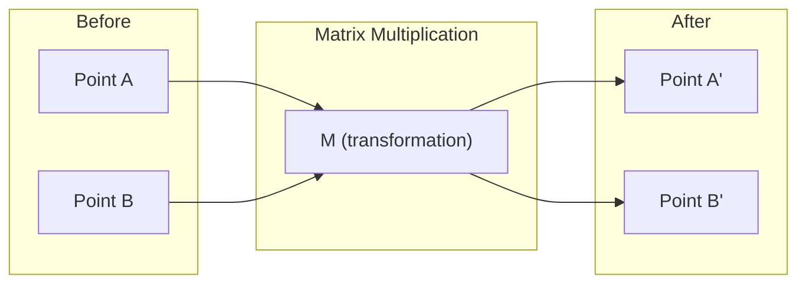
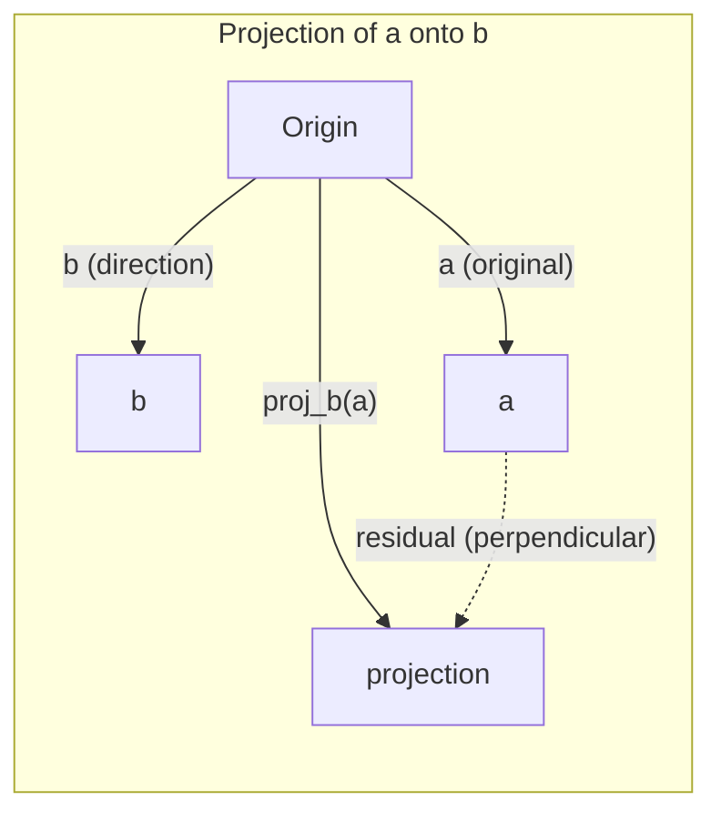
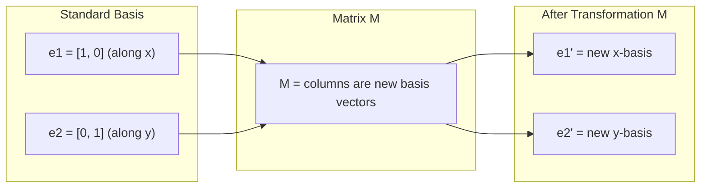
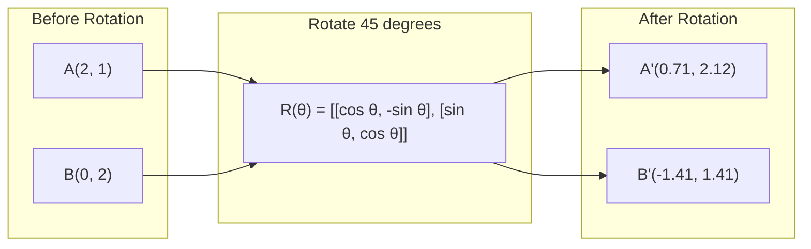
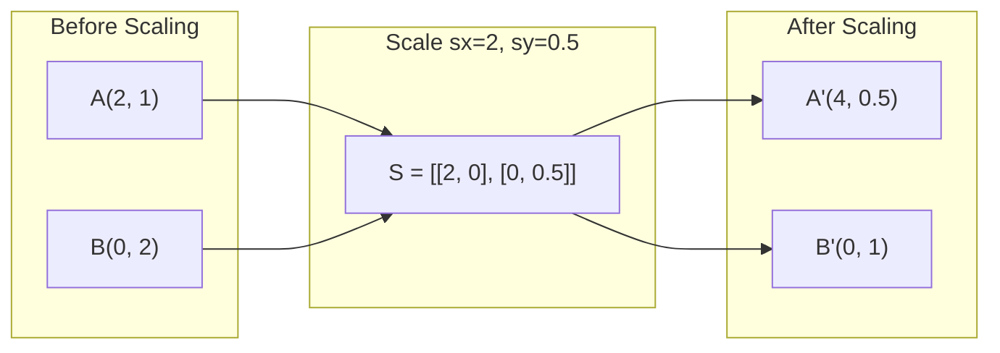
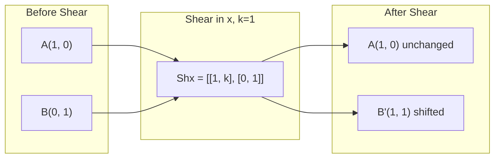
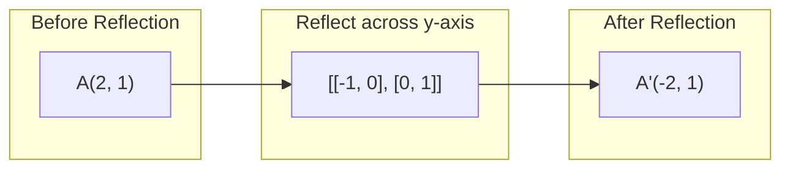
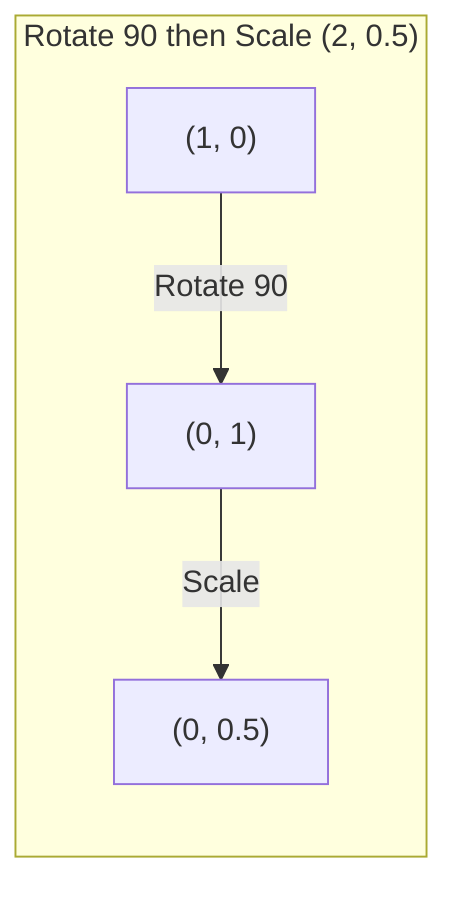
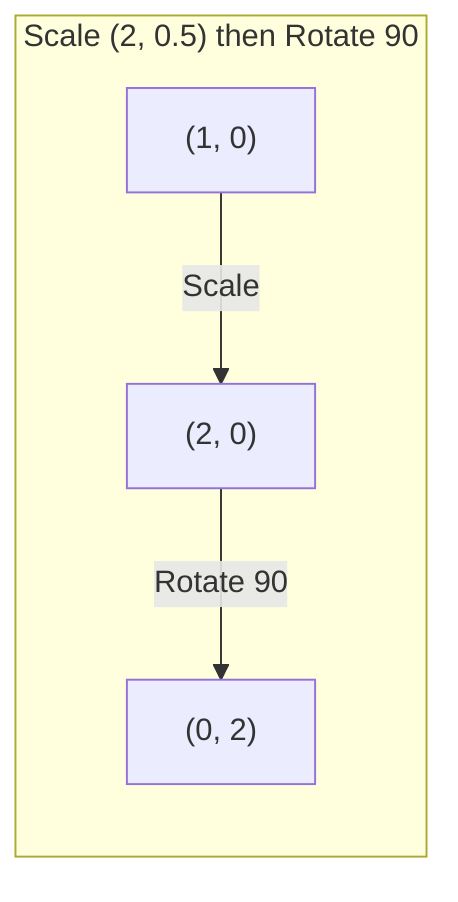

# Linear Algebra

> Combined lessons (3 parts), merged verbatim — no content removed.

**Type:** Combined

---

## Part 1 (ch013): Linear Algebra Intuition

> Every AI model is just matrix math wearing a fancy hat.

**Type:** Learn
**Languages:** Python, Julia
**Prerequisites:** Phase 0
**Time:** ~60 minutes

## Learning Objectives

- Implement vector and matrix operations (addition, dot product, matrix multiply) from scratch in Python
- Explain geometrically what the dot product, projection, and Gram-Schmidt process do
- Determine linear independence, rank, and basis of a set of vectors using row reduction
- Connect linear algebra concepts to their AI applications: embeddings, attention scores, and LoRA

## The Problem

Open any ML paper. Within the first page, you'll see vectors, matrices, dot products, and transformations. Without linear algebra intuition, these are just symbols. With it, you can see what a neural network is actually doing -- moving points around in space.

You don't need to be a mathematician. You need to see what these operations mean geometrically, then code them yourself.

## The Concept

### Vectors Are Points (and Directions)

A vector is just a list of numbers. But those numbers mean something -- they're coordinates in space.

**2D vector [3, 2]:**

| x | y | Point |
|---|---|---|
| 3 | 2 | The vector points from origin (0,0) to (3, 2) on the plane |

The vector has magnitude sqrt(3^2 + 2^2) = sqrt(13) and points up and to the right.

In AI, vectors represent everything:
- A word → a vector of 768 numbers (its "meaning" in embedding space)
- An image → a vector of millions of pixel values
- A user → a vector of preferences

### Matrices Are Transformations

A matrix transforms one vector into another. It can rotate, scale, stretch, or project.



In AI, matrices ARE the model:
- Neural network weights → matrices that transform input into output
- Attention scores → matrices that decide what to focus on
- Embeddings → matrices that map words to vectors

### The Dot Product Measures Similarity

The dot product of two vectors tells you how similar they are.

```
a · b = a₁×b₁ + a₂×b₂ + ... + aₙ×bₙ

Same direction:      a · b > 0  (similar)
Perpendicular:       a · b = 0  (unrelated)
Opposite direction:  a · b < 0  (dissimilar)
```

This is literally how search engines, recommendation systems, and RAG work -- find vectors with high dot products.

### Linear Independence

Vectors are linearly independent if no vector in the set can be written as a combination of the others. If v1, v2, v3 are independent, they span a 3D space. If one is a combination of the others, they only span a plane.

Why it matters for AI: your feature matrix should have linearly independent columns. If two features are perfectly correlated (linearly dependent), the model cannot distinguish their effects. This causes multicollinearity in regression -- the weight matrix becomes unstable, and small input changes produce wild output swings.

**Concrete example:**

```
v1 = [1, 0, 0]
v2 = [0, 1, 0]
v3 = [2, 1, 0]   # v3 = 2*v1 + v2
```

v1 and v2 are independent -- neither is a scalar multiple or combination of the other. But v3 = 2*v1 + v2, so {v1, v2, v3} is a dependent set. These three vectors all lie in the xy-plane. No matter how you combine them, you cannot reach [0, 0, 1]. You have three vectors but only two dimensions of freedom.

In a dataset: if feature_3 = 2*feature_1 + feature_2, adding feature_3 gives the model zero new information. Worse, it makes the normal equations singular -- there is no unique solution for the weights.

### Basis and Rank

A basis is a minimal set of linearly independent vectors that span the entire space. The number of basis vectors is the dimension of the space.

The standard basis for 3D space is {[1,0,0], [0,1,0], [0,0,1]}. But any three independent vectors in 3D form a valid basis. The choice of basis is a choice of coordinate system.

Rank of a matrix = number of linearly independent columns = number of linearly independent rows. If rank < min(rows, cols), the matrix is rank-deficient. This means:
- The system has infinitely many solutions (or none)
- Information is lost in the transformation
- The matrix cannot be inverted

| Situation | Rank | What it means for ML |
|-----------|------|---------------------|
| Full rank (rank = min(m, n)) | Maximum possible | Unique least-squares solution exists. Model is well-conditioned. |
| Rank deficient (rank < min(m, n)) | Below maximum | Features are redundant. Infinitely many weight solutions. Regularization needed. |
| Rank 1 | 1 | Every column is a scaled copy of one vector. All data lies on a line. |
| Near rank-deficient (small singular values) | Numerically low | Matrix is ill-conditioned. Tiny input noise causes large output changes. Use SVD truncation or ridge regression. |

### Projection

Projecting vector **a** onto vector **b** gives the component of **a** in the direction of **b**:

```
proj_b(a) = (a dot b / b dot b) * b
```

The residual (a - proj_b(a)) is perpendicular to b. This orthogonal decomposition is the foundation of least-squares fitting.

Projection is everywhere in ML:
- Linear regression minimizes the distance from observations to the column space -- the solution IS a projection
- PCA projects data onto the directions of maximum variance
- Attention in transformers computes projections of queries onto keys



**Example:** a = [3, 4], b = [1, 0]

proj_b(a) = (3*1 + 4*0) / (1*1 + 0*0) * [1, 0] = 3 * [1, 0] = [3, 0]

The projection drops the y-component. This is dimensionality reduction in its simplest form -- throw away the directions you don't care about.

### Gram-Schmidt Process

Converting any set of independent vectors into an orthonormal basis. Orthonormal means every vector has length 1 and every pair is perpendicular.

The algorithm:
1. Take the first vector, normalize it
2. Take the second vector, subtract its projection onto the first, normalize
3. Take the third vector, subtract its projections onto all previous vectors, normalize
4. Repeat for remaining vectors

```
Input:  v1, v2, v3, ... (linearly independent)

u1 = v1 / |v1|

w2 = v2 - (v2 dot u1) * u1
u2 = w2 / |w2|

w3 = v3 - (v3 dot u1) * u1 - (v3 dot u2) * u2
u3 = w3 / |w3|

Output: u1, u2, u3, ... (orthonormal basis)
```

This is how QR decomposition works internally. Q is the orthonormal basis, R captures the projection coefficients. QR decomposition is used in:
- Solving linear systems (more stable than Gaussian elimination)
- Computing eigenvalues (QR algorithm)
- Least-squares regression (the standard numerical method)

```figure
eigen-directions
```

## Build It

### Step 1: Vectors from scratch (Python)

```python
class Vector:
    def __init__(self, components):
        self.components = list(components)
        self.dim = len(self.components)

    def __add__(self, other):
        return Vector([a + b for a, b in zip(self.components, other.components)])

    def __sub__(self, other):
        return Vector([a - b for a, b in zip(self.components, other.components)])

    def dot(self, other):
        return sum(a * b for a, b in zip(self.components, other.components))

    def magnitude(self):
        return sum(x**2 for x in self.components) ** 0.5

    def normalize(self):
        mag = self.magnitude()
        return Vector([x / mag for x in self.components])

    def cosine_similarity(self, other):
        return self.dot(other) / (self.magnitude() * other.magnitude())

    def __repr__(self):
        return f"Vector({self.components})"


a = Vector([1, 2, 3])
b = Vector([4, 5, 6])

print(f"a + b = {a + b}")
print(f"a · b = {a.dot(b)}")
print(f"|a| = {a.magnitude():.4f}")
print(f"cosine similarity = {a.cosine_similarity(b):.4f}")
```

### Step 2: Matrices from scratch (Python)

```python
class Matrix:
    def __init__(self, rows):
        self.rows = [list(row) for row in rows]
        self.shape = (len(self.rows), len(self.rows[0]))

    def __matmul__(self, other):
        if isinstance(other, Vector):
            return Vector([
                sum(self.rows[i][j] * other.components[j] for j in range(self.shape[1]))
                for i in range(self.shape[0])
            ])
        rows = []
        for i in range(self.shape[0]):
            row = []
            for j in range(other.shape[1]):
                row.append(sum(
                    self.rows[i][k] * other.rows[k][j]
                    for k in range(self.shape[1])
                ))
            rows.append(row)
        return Matrix(rows)

    def transpose(self):
        return Matrix([
            [self.rows[j][i] for j in range(self.shape[0])]
            for i in range(self.shape[1])
        ])

    def __repr__(self):
        return f"Matrix({self.rows})"


rotation_90 = Matrix([[0, -1], [1, 0]])
point = Vector([3, 1])

rotated = rotation_90 @ point
print(f"Original: {point}")
print(f"Rotated 90°: {rotated}")
```

### Step 3: Why this matters for AI

```python
import random

random.seed(42)
weights = Matrix([[random.gauss(0, 0.1) for _ in range(3)] for _ in range(2)])
input_vector = Vector([1.0, 0.5, -0.3])

output = weights @ input_vector
print(f"Input (3D): {input_vector}")
print(f"Output (2D): {output}")
print("This is what a neural network layer does -- matrix multiplication.")
```

### Step 4: Julia version

```julia
a = [1.0, 2.0, 3.0]
b = [4.0, 5.0, 6.0]

println("a + b = ", a + b)
println("a · b = ", a ⋅ b)       # Julia supports unicode operators
println("|a| = ", √(a ⋅ a))
println("cosine = ", (a ⋅ b) / (√(a ⋅ a) * √(b ⋅ b)))

# Matrix-vector multiplication
W = [0.1 -0.2 0.3; 0.4 0.5 -0.1]
x = [1.0, 0.5, -0.3]
println("Wx = ", W * x)
println("This is a neural network layer.")
```

### Step 5: Linear independence and projection from scratch (Python)

```python
def is_linearly_independent(vectors):
    n = len(vectors)
    dim = len(vectors[0].components)
    mat = Matrix([v.components[:] for v in vectors])
    rows = [row[:] for row in mat.rows]
    rank = 0
    for col in range(dim):
        pivot = None
        for row in range(rank, len(rows)):
            if abs(rows[row][col]) > 1e-10:
                pivot = row
                break
        if pivot is None:
            continue
        rows[rank], rows[pivot] = rows[pivot], rows[rank]
        scale = rows[rank][col]
        rows[rank] = [x / scale for x in rows[rank]]
        for row in range(len(rows)):
            if row != rank and abs(rows[row][col]) > 1e-10:
                factor = rows[row][col]
                rows[row] = [rows[row][j] - factor * rows[rank][j] for j in range(dim)]
        rank += 1
    return rank == n


def project(a, b):
    scalar = a.dot(b) / b.dot(b)
    return Vector([scalar * x for x in b.components])


def gram_schmidt(vectors):
    orthonormal = []
    for v in vectors:
        w = v
        for u in orthonormal:
            proj = project(w, u)
            w = w - proj
        if w.magnitude() < 1e-10:
            continue
        orthonormal.append(w.normalize())
    return orthonormal


v1 = Vector([1, 0, 0])
v2 = Vector([1, 1, 0])
v3 = Vector([1, 1, 1])
basis = gram_schmidt([v1, v2, v3])
for i, u in enumerate(basis):
    print(f"u{i+1} = {u}")
    print(f"  |u{i+1}| = {u.magnitude():.6f}")

print(f"u1 · u2 = {basis[0].dot(basis[1]):.6f}")
print(f"u1 · u3 = {basis[0].dot(basis[2]):.6f}")
print(f"u2 · u3 = {basis[1].dot(basis[2]):.6f}")
```

## Use It

Now the same thing with NumPy -- what you'll actually use in practice:

```python
import numpy as np

a = np.array([1, 2, 3], dtype=float)
b = np.array([4, 5, 6], dtype=float)

print(f"a + b = {a + b}")
print(f"a · b = {np.dot(a, b)}")
print(f"|a| = {np.linalg.norm(a):.4f}")
print(f"cosine = {np.dot(a, b) / (np.linalg.norm(a) * np.linalg.norm(b)):.4f}")

W = np.random.randn(2, 3) * 0.1
x = np.array([1.0, 0.5, -0.3])
print(f"Wx = {W @ x}")
```

### Rank, Projection, and QR with NumPy

```python
import numpy as np

A = np.array([[1, 2], [2, 4]])
print(f"Rank: {np.linalg.matrix_rank(A)}")

a = np.array([3, 4])
b = np.array([1, 0])
proj = (np.dot(a, b) / np.dot(b, b)) * b
print(f"Projection of {a} onto {b}: {proj}")

Q, R = np.linalg.qr(np.random.randn(3, 3))
print(f"Q is orthogonal: {np.allclose(Q @ Q.T, np.eye(3))}")
print(f"R is upper triangular: {np.allclose(R, np.triu(R))}")
```

### PyTorch -- Tensors Are Vectors with Autodiff

```python
import torch

x = torch.randn(3, requires_grad=True)
y = torch.tensor([1.0, 0.0, 0.0])

similarity = torch.dot(x, y)
similarity.backward()

print(f"x = {x.data}")
print(f"y = {y.data}")
print(f"dot product = {similarity.item():.4f}")
print(f"d(dot)/dx = {x.grad}")
```

The gradient of the dot product with respect to x is just y. PyTorch computed this automatically. Every operation in a neural network is built from operations like this -- matrix multiplies, dot products, projections -- and autodiff tracks gradients through all of them.

You just built from scratch what NumPy does in one line. Now you know what's happening under the hood.

## Ship It

This lesson produces:
- `outputs/prompt-linear-algebra-tutor.md` -- a prompt for AI assistants to teach linear algebra through geometric intuition

## Connections

Everything in this lesson connects to specific parts of modern AI:

| Concept | Where it shows up |
|---------|------------------|
| Dot product | Attention scores in transformers, cosine similarity in RAG |
| Matrix multiply | Every neural network layer, every linear transformation |
| Linear independence | Feature selection, avoiding multicollinearity |
| Rank | Determining if a system is solvable, LoRA (low-rank adaptation) |
| Projection | Linear regression (projecting onto column space), PCA |
| Gram-Schmidt / QR | Numerical solvers, eigenvalue computation |
| Orthonormal basis | Stable numerical computation, whitening transforms |

LoRA deserves special mention. It fine-tunes large language models by decomposing weight updates into low-rank matrices. Instead of updating a 4096x4096 weight matrix (16M parameters), LoRA updates two matrices of size 4096x16 and 16x4096 (131K parameters). The rank-16 constraint means LoRA assumes the weight update lives in a 16-dimensional subspace of the full 4096-dimensional space. That is linear algebra doing real work.

## Exercises

1. Implement `Vector.angle_between(other)` that returns the angle in degrees between two vectors
2. Create a 2D scaling matrix that doubles the x-coordinate and triples the y-coordinate, then apply it to the vector [1, 1]
3. Given 5 random word-like vectors (dimension 50), find the two most similar using cosine similarity
4. Verify that the Gram-Schmidt output is truly orthonormal: check that every pair has dot product 0 and every vector has magnitude 1
5. Create a 3x3 matrix with rank 2. Verify using the `rank()` method. Then explain what geometric object the columns span.
6. Project the vector [1, 2, 3] onto [1, 1, 1]. What does the result represent geometrically?

## Key Terms

| Term | What people say | What it actually means |
|------|----------------|----------------------|
| Vector | "An arrow" | A list of numbers representing a point or direction in n-dimensional space |
| Matrix | "A table of numbers" | A transformation that maps vectors from one space to another |
| Dot product | "Multiply and sum" | A measure of how aligned two vectors are -- the core of similarity search |
| Embedding | "Some AI magic" | A vector that represents the meaning of something (word, image, user) |
| Linear independence | "They don't overlap" | No vector in the set can be written as a combination of the others |
| Rank | "How many dimensions" | The number of linearly independent columns (or rows) in a matrix |
| Projection | "The shadow" | The component of one vector in the direction of another |
| Basis | "The coordinate axes" | A minimal set of independent vectors that span the space |
| Orthonormal | "Perpendicular unit vectors" | Vectors that are mutually perpendicular and each have length 1 |

[Reference](https://github.com/rohitg00/ai-engineering-from-scratch/tree/main/phases/01-math-foundations/01-linear-algebra-intuition)

---

## Part 2 (ch014): Vectors, Matrices & Operations

> Every neural network is just matrix multiplication with extra steps.

**Type:** Build
**Languages:** Python, Julia
**Prerequisites:** Phase 1, Lesson 01 (Linear Algebra Intuition)
**Time:** ~60 minutes

## Learning Objectives

- Build a Matrix class with element-wise operations, matrix multiplication, transpose, determinant, and inverse
- Distinguish element-wise multiplication from matrix multiplication and explain when each applies
- Implement a single dense neural network layer (`relu(W @ x + b)`) using only the from-scratch Matrix class
- Explain broadcasting rules and how bias addition works in neural network frameworks

## The Problem

You want to build a neural network. You read the code and see this:

```
output = activation(weights @ input + bias)
```

That `@` is matrix multiplication. The `weights` are a matrix. The `input` is a vector. If you do not know what those operations do, this line is magic. If you do know, it is the entire forward pass of a layer in three operations.

Every image your model processes is a matrix of pixel values. Every word embedding is a vector. Every layer of every neural network is a matrix transformation. You cannot build AI systems without being fluent in matrix operations the same way you cannot write code without understanding variables.

This lesson builds that fluency from scratch.

## The Concept

### Vectors: ordered lists of numbers

A vector is a list of numbers with a direction and magnitude. In AI, vectors represent data points, features, or parameters.

```
v = [3, 4]        -- a 2D vector
w = [1, 0, -2]    -- a 3D vector
```

A 2D vector `[3, 4]` points to coordinates (3, 4) on a plane. Its length (magnitude) is 5 (the 3-4-5 triangle).

### Matrices: grids of numbers

A matrix is a 2D grid. Rows and columns. An m x n matrix has m rows and n columns.

```
A = | 1  2  3 |     -- 2x3 matrix (2 rows, 3 columns)
    | 4  5  6 |
```

In neural networks, weight matrices transform input vectors into output vectors. A layer with 784 inputs and 128 outputs uses a 128x784 weight matrix.

### Why shapes matter

Matrix multiplication has a strict rule: `(m x n) @ (n x p) = (m x p)`. The inner dimensions must match.

```
(128 x 784) @ (784 x 1) = (128 x 1)
  weights       input       output

Inner dimensions: 784 = 784  -- valid
```

If you get a shape mismatch error in PyTorch, this is why.

### The operations map

| Operation | What it does | Neural network use |
|-----------|-------------|-------------------|
| Addition | Element-wise combine | Adding bias to output |
| Scalar multiply | Scale every element | Learning rate * gradients |
| Matrix multiply | Transform vectors | Layer forward pass |
| Transpose | Flip rows and columns | Backpropagation |
| Determinant | Single number summary | Checking invertibility |
| Inverse | Undo a transformation | Solving linear systems |
| Identity | Do-nothing matrix | Initialization, residual connections |

### Element-wise vs matrix multiplication

This distinction trips up beginners constantly.

Element-wise: multiply matching positions. Both matrices must be the same shape.

```
| 1  2 |   | 5  6 |   | 5  12 |
| 3  4 | * | 7  8 | = | 21 32 |
```

Matrix multiplication: dot products of rows and columns. Inner dimensions must match.

```
| 1  2 |   | 5  6 |   | 1*5+2*7  1*6+2*8 |   | 19  22 |
| 3  4 | @ | 7  8 | = | 3*5+4*7  3*6+4*8 | = | 43  50 |
```

Different operations, different results, different rules.

### Broadcasting

When you add a bias vector to a matrix of outputs, the shapes do not match. Broadcasting stretches the smaller array to fit.

```
| 1  2  3 |   +   [10, 20, 30]
| 4  5  6 |

Broadcasting stretches the vector across rows:

| 1  2  3 |   | 10  20  30 |   | 11  22  33 |
| 4  5  6 | + | 10  20  30 | = | 14  25  36 |
```

Every modern framework does this automatically. Understanding it prevents confusion when shapes seem wrong but the code runs.

```figure
vector-projection
```

## Build It

### Step 1: Vector class

```python
class Vector:
    def __init__(self, data):
        self.data = list(data)
        self.size = len(self.data)

    def __repr__(self):
        return f"Vector({self.data})"

    def __add__(self, other):
        return Vector([a + b for a, b in zip(self.data, other.data)])

    def __sub__(self, other):
        return Vector([a - b for a, b in zip(self.data, other.data)])

    def __mul__(self, scalar):
        return Vector([x * scalar for x in self.data])

    def dot(self, other):
        return sum(a * b for a, b in zip(self.data, other.data))

    def magnitude(self):
        return sum(x ** 2 for x in self.data) ** 0.5
```

### Step 2: Matrix class with core operations

```python
class Matrix:
    def __init__(self, data):
        self.data = [list(row) for row in data]
        self.rows = len(self.data)
        self.cols = len(self.data[0])
        self.shape = (self.rows, self.cols)

    def __repr__(self):
        rows_str = "\n  ".join(str(row) for row in self.data)
        return f"Matrix({self.shape}):\n  {rows_str}"

    def __add__(self, other):
        return Matrix([
            [self.data[i][j] + other.data[i][j] for j in range(self.cols)]
            for i in range(self.rows)
        ])

    def __sub__(self, other):
        return Matrix([
            [self.data[i][j] - other.data[i][j] for j in range(self.cols)]
            for i in range(self.rows)
        ])

    def scalar_multiply(self, scalar):
        return Matrix([
            [self.data[i][j] * scalar for j in range(self.cols)]
            for i in range(self.rows)
        ])

    def element_wise_multiply(self, other):
        return Matrix([
            [self.data[i][j] * other.data[i][j] for j in range(self.cols)]
            for i in range(self.rows)
        ])

    def matmul(self, other):
        return Matrix([
            [
                sum(self.data[i][k] * other.data[k][j] for k in range(self.cols))
                for j in range(other.cols)
            ]
            for i in range(self.rows)
        ])

    def transpose(self):
        return Matrix([
            [self.data[j][i] for j in range(self.rows)]
            for i in range(self.cols)
        ])

    def determinant(self):
        if self.shape == (1, 1):
            return self.data[0][0]
        if self.shape == (2, 2):
            return self.data[0][0] * self.data[1][1] - self.data[0][1] * self.data[1][0]
        det = 0
        for j in range(self.cols):
            minor = Matrix([
                [self.data[i][k] for k in range(self.cols) if k != j]
                for i in range(1, self.rows)
            ])
            det += ((-1) ** j) * self.data[0][j] * minor.determinant()
        return det

    def inverse_2x2(self):
        det = self.determinant()
        if det == 0:
            raise ValueError("Matrix is singular, no inverse exists")
        return Matrix([
            [self.data[1][1] / det, -self.data[0][1] / det],
            [-self.data[1][0] / det, self.data[0][0] / det]
        ])

    @staticmethod
    def identity(n):
        return Matrix([
            [1 if i == j else 0 for j in range(n)]
            for i in range(n)
        ])
```

### Step 3: See it work

```python
A = Matrix([[1, 2], [3, 4]])
B = Matrix([[5, 6], [7, 8]])

print("A + B =", (A + B).data)
print("A @ B =", A.matmul(B).data)
print("A^T =", A.transpose().data)
print("det(A) =", A.determinant())
print("A^-1 =", A.inverse_2x2().data)

I = Matrix.identity(2)
print("A @ A^-1 =", A.matmul(A.inverse_2x2()).data)
```

### Step 4: Connect to neural networks

```python
import random

inputs = Matrix([[0.5], [0.8], [0.2]])
weights = Matrix([
    [random.uniform(-1, 1) for _ in range(3)]
    for _ in range(2)
])
bias = Matrix([[0.1], [0.1]])

def relu_matrix(m):
    return Matrix([[max(0, val) for val in row] for row in m.data])

pre_activation = weights.matmul(inputs) + bias
output = relu_matrix(pre_activation)

print(f"Input shape: {inputs.shape}")
print(f"Weight shape: {weights.shape}")
print(f"Output shape: {output.shape}")
print(f"Output: {output.data}")
```

This is a single dense layer: `output = relu(W @ x + b)`. Every dense layer in every neural network does exactly this.

## Use It

NumPy does everything above in fewer lines and orders of magnitude faster.

```python
import numpy as np

A = np.array([[1, 2], [3, 4]])
B = np.array([[5, 6], [7, 8]])

print("A + B =\n", A + B)
print("A * B (element-wise) =\n", A * B)
print("A @ B (matrix multiply) =\n", A @ B)
print("A^T =\n", A.T)
print("det(A) =", np.linalg.det(A))
print("A^-1 =\n", np.linalg.inv(A))
print("I =\n", np.eye(2))

inputs = np.random.randn(3, 1)
weights = np.random.randn(2, 3)
bias = np.array([[0.1], [0.1]])
output = np.maximum(0, weights @ inputs + bias)

print(f"\nNeural network layer: {weights.shape} @ {inputs.shape} = {output.shape}")
print(f"Output:\n{output}")
```

The `@` operator in Python calls `__matmul__`. NumPy implements it with optimized BLAS routines written in C and Fortran. Same math, 100x faster.

Broadcasting in NumPy:

```python
matrix = np.array([[1, 2, 3], [4, 5, 6]])
bias = np.array([10, 20, 30])
print(matrix + bias)
```

NumPy automatically broadcasts the 1D bias across both rows. This is how bias addition works in every neural network framework.

## Ship It

This lesson produces a prompt for teaching matrix operations through geometric intuition. See `outputs/prompt-matrix-operations.md`.

The Matrix class built here is the foundation for the mini neural network framework we build in Phase 3, Lesson 10.

## Exercises

1. **Verify the inverse.** Multiply `A @ A.inverse_2x2()` and confirm you get the identity matrix. Try it with three different 2x2 matrices. What happens when the determinant is zero?

2. **Implement 3x3 inverse.** Extend the Matrix class to compute inverses for 3x3 matrices using the adjugate method. Test it against NumPy's `np.linalg.inv`.

3. **Build a two-layer network.** Using only your Matrix class (no NumPy), create a two-layer neural network: input (3) -> hidden (4) -> output (2). Initialize random weights, run a forward pass, and verify all shapes are correct.

## Key Terms

| Term | What people say | What it actually means |
|------|----------------|----------------------|
| Vector | "An arrow" | An ordered list of numbers. In AI: a point in high-dimensional space. |
| Matrix | "A table of numbers" | A linear transformation. It maps vectors from one space to another. |
| Matrix multiply | "Just multiply the numbers" | Dot products between every row of the first matrix and every column of the second. Order matters. |
| Transpose | "Flip it" | Swap rows and columns. Turns an m x n matrix into n x m. Critical in backpropagation. |
| Determinant | "Some number from the matrix" | Measures how much the matrix scales area (2D) or volume (3D). Zero means the transformation crushes a dimension. |
| Inverse | "Undo the matrix" | The matrix that reverses the transformation. Only exists when the determinant is not zero. |
| Identity matrix | "The boring matrix" | The matrix equivalent of multiplying by 1. Used in residual connections (ResNets). |
| Broadcasting | "Magic shape fixing" | Stretching a smaller array to match a larger one by repeating along missing dimensions. |
| Element-wise | "Regular multiplication" | Multiply matching positions. Both arrays must have the same shape (or be broadcastable). |

## Further Reading

- [3Blue1Brown: Essence of Linear Algebra](https://www.3blue1brown.com/topics/linear-algebra) - visual intuition for every operation covered here
- [NumPy documentation on broadcasting](https://numpy.org/doc/stable/user/basics.broadcasting.html) - the exact rules NumPy follows
- [Stanford CS229 Linear Algebra Review](http://cs229.stanford.edu/section/cs229-linalg.pdf) - concise reference for ML-specific linear algebra

[Reference](https://github.com/rohitg00/ai-engineering-from-scratch/tree/main/phases/01-math-foundations/02-vectors-matrices-operations)

---

## Part 3 (ch015): Matrix Transformations

> A matrix is a machine that reshapes space. Learn what it does to every point, and you understand the whole transformation.

**Type:** Build
**Languages:** Python, Julia
**Prerequisites:** Phase 1, Lessons 01-02 (Linear Algebra Intuition, Vectors & Matrices Operations)
**Time:** ~75 minutes

## Learning Objectives

- Construct rotation, scaling, shearing, and reflection matrices and apply them to 2D and 3D points
- Compose multiple transformations by matrix multiplication and verify that order matters
- Compute eigenvalues and eigenvectors of 2x2 matrices from the characteristic equation
- Explain why eigenvalues determine PCA directions, RNN stability, and spectral clustering behavior

## The Problem

You read about PCA and see "find the eigenvectors of the covariance matrix." You read about model stability and see "check if all eigenvalues have magnitude less than 1." You read about data augmentation and see "apply a random rotation." None of this makes sense until you understand what matrices do to space geometrically.

Matrices are not just grids of numbers. They are spatial machines. A rotation matrix spins points. A scaling matrix stretches them. A shearing matrix tilts them. Every transformation a neural network applies to data is one of these operations or a composition of them. This lesson makes those operations concrete.

## The Concept

### Transformations as matrices

Every linear transformation in 2D can be written as a 2x2 matrix. The matrix tells you exactly where the basis vectors [1, 0] and [0, 1] end up. Everything else follows.



### Rotation

A 2D rotation by angle theta keeps distances and angles intact. It moves every point along a circular arc.



In 3D, you rotate around an axis. Each axis has its own rotation matrix:

```
Rz(theta) = | cos  -sin  0 |     Rotate around z-axis
            | sin   cos  0 |     (x-y plane spins, z stays)
            |  0     0   1 |

Rx(theta) = | 1   0     0    |   Rotate around x-axis
            | 0  cos  -sin   |   (y-z plane spins, x stays)
            | 0  sin   cos   |

Ry(theta) = |  cos  0  sin |     Rotate around y-axis
            |   0   1   0  |     (x-z plane spins, y stays)
            | -sin  0  cos |
```

### Scaling

Scaling stretches or compresses along each axis independently.



### Shearing

Shearing tilts one axis while keeping the other fixed. It turns rectangles into parallelograms.



Shear matrices:
- `Shx = [[1, k], [0, 1]]` shifts x by k * y
- `Shy = [[1, 0], [k, 1]]` shifts y by k * x

### Reflection

Reflection mirrors points across an axis or line.



Reflection matrices:
- Reflect across y-axis: `[[-1, 0], [0, 1]]`
- Reflect across x-axis: `[[1, 0], [0, -1]]`

### Composition: chaining transformations

Applying transformation A then B is the same as multiplying their matrices: `result = B @ A @ point`. Order matters. Rotate then scale gives different results than scale then rotate.



Composed: `S @ R = [[0, -2], [0.5, 0]]`



Composed: `R @ S = [[0, -0.5], [2, 0]]`

Different results. Matrix multiplication is not commutative.

### Eigenvalues and eigenvectors

Most vectors change direction when a matrix hits them. Eigenvectors are special: the matrix only scales them, never rotates them. The scaling factor is the eigenvalue.

```
A @ v = lambda * v

v is the eigenvector (direction that survives)
lambda is the eigenvalue (how much it stretches)

Example: A = | 2  1 |
             | 1  2 |

Eigenvector [1, 1] with eigenvalue 3:
  A @ [1,1] = [3, 3] = 3 * [1, 1]     (same direction, scaled by 3)

Eigenvector [1, -1] with eigenvalue 1:
  A @ [1,-1] = [1, -1] = 1 * [1, -1]  (same direction, unchanged)
```

The matrix stretches space by 3x along [1, 1] and keeps [1, -1] unchanged. Every other direction is a mix of these two.

### Eigendecomposition

If a matrix has n linearly independent eigenvectors, it can be decomposed:

```
A = V @ D @ V^(-1)

V = matrix whose columns are eigenvectors
D = diagonal matrix of eigenvalues
V^(-1) = inverse of V

This says: rotate into eigenvector coordinates, scale along each axis, rotate back.
```

### Why eigenvalues matter

**PCA.** The eigenvectors of the covariance matrix are the principal components. The eigenvalues tell you how much variance each component captures. Sort by eigenvalue, keep the top k, and you have dimensionality reduction.

**Stability.** In recurrent networks and dynamical systems, eigenvalues with magnitude > 1 cause outputs to explode. Magnitude < 1 causes them to vanish. This is the vanishing/exploding gradient problem stated in one sentence.

**Spectral methods.** Graph neural networks use eigenvalues of the adjacency matrix. Spectral clustering uses eigenvalues of the Laplacian. The eigenvectors reveal the structure of the graph.

### Determinant as volume scaling factor

The determinant of a transformation matrix tells you how much it scales area (2D) or volume (3D).

```
det = 1:   area preserved (rotation)
det = 2:   area doubled
det = 0:   space crushed to lower dimension (singular)
det = -1:  area preserved but orientation flipped (reflection)

| det(Rotation) | = 1        (always)
| det(Scale sx, sy) | = sx * sy
| det(Shear) | = 1           (area preserved)
| det(Reflection) | = -1     (orientation flipped)
```

```figure
matrix-transform
```

## Build It

### Step 1: Transformation matrices from scratch (Python)

```python
import math

def rotation_2d(theta):
    c, s = math.cos(theta), math.sin(theta)
    return [[c, -s], [s, c]]

def scaling_2d(sx, sy):
    return [[sx, 0], [0, sy]]

def shearing_2d(kx, ky):
    return [[1, kx], [ky, 1]]

def reflection_x():
    return [[1, 0], [0, -1]]

def reflection_y():
    return [[-1, 0], [0, 1]]

def mat_vec_mul(matrix, vector):
    return [
        sum(matrix[i][j] * vector[j] for j in range(len(vector)))
        for i in range(len(matrix))
    ]

def mat_mul(a, b):
    rows_a, cols_b = len(a), len(b[0])
    cols_a = len(a[0])
    return [
        [sum(a[i][k] * b[k][j] for k in range(cols_a)) for j in range(cols_b)]
        for i in range(rows_a)
    ]

point = [1.0, 0.0]
angle = math.pi / 4

rotated = mat_vec_mul(rotation_2d(angle), point)
print(f"Rotate (1,0) by 45 deg: ({rotated[0]:.4f}, {rotated[1]:.4f})")

scaled = mat_vec_mul(scaling_2d(2, 3), [1.0, 1.0])
print(f"Scale (1,1) by (2,3): ({scaled[0]:.1f}, {scaled[1]:.1f})")

sheared = mat_vec_mul(shearing_2d(1, 0), [1.0, 1.0])
print(f"Shear (1,1) kx=1: ({sheared[0]:.1f}, {sheared[1]:.1f})")

reflected = mat_vec_mul(reflection_y(), [2.0, 1.0])
print(f"Reflect (2,1) across y: ({reflected[0]:.1f}, {reflected[1]:.1f})")
```

### Step 2: Composition of transformations

```python
R = rotation_2d(math.pi / 2)
S = scaling_2d(2, 0.5)

rotate_then_scale = mat_mul(S, R)
scale_then_rotate = mat_mul(R, S)

point = [1.0, 0.0]
result1 = mat_vec_mul(rotate_then_scale, point)
result2 = mat_vec_mul(scale_then_rotate, point)

print(f"Rotate 90 then scale: ({result1[0]:.2f}, {result1[1]:.2f})")
print(f"Scale then rotate 90: ({result2[0]:.2f}, {result2[1]:.2f})")
print(f"Same? {result1 == result2}")
```

### Step 3: Eigenvalues from scratch (2x2)

For a 2x2 matrix `[[a, b], [c, d]]`, eigenvalues solve the characteristic equation: `lambda^2 - (a+d)*lambda + (ad - bc) = 0`.

```python
def eigenvalues_2x2(matrix):
    a, b = matrix[0]
    c, d = matrix[1]
    trace = a + d
    det = a * d - b * c
    discriminant = trace ** 2 - 4 * det
    if discriminant < 0:
        real = trace / 2
        imag = (-discriminant) ** 0.5 / 2
        return (complex(real, imag), complex(real, -imag))
    sqrt_disc = discriminant ** 0.5
    return ((trace + sqrt_disc) / 2, (trace - sqrt_disc) / 2)

def eigenvector_2x2(matrix, eigenvalue):
    a, b = matrix[0]
    c, d = matrix[1]
    if abs(b) > 1e-10:
        v = [b, eigenvalue - a]
    elif abs(c) > 1e-10:
        v = [eigenvalue - d, c]
    else:
        if abs(a - eigenvalue) < 1e-10:
            v = [1, 0]
        else:
            v = [0, 1]
    mag = (v[0] ** 2 + v[1] ** 2) ** 0.5
    return [v[0] / mag, v[1] / mag]

A = [[2, 1], [1, 2]]
vals = eigenvalues_2x2(A)
print(f"Matrix: {A}")
print(f"Eigenvalues: {vals[0]:.4f}, {vals[1]:.4f}")

for val in vals:
    vec = eigenvector_2x2(A, val)
    result = mat_vec_mul(A, vec)
    scaled = [val * vec[0], val * vec[1]]
    print(f"  lambda={val:.1f}, v={[round(x,4) for x in vec]}")
    print(f"    A@v = {[round(x,4) for x in result]}")
    print(f"    l*v = {[round(x,4) for x in scaled]}")
```

### Step 4: Determinant as volume scaling factor

```python
def det_2x2(matrix):
    return matrix[0][0] * matrix[1][1] - matrix[0][1] * matrix[1][0]

print(f"det(rotation 45) = {det_2x2(rotation_2d(math.pi/4)):.4f}")
print(f"det(scale 2,3)   = {det_2x2(scaling_2d(2, 3)):.1f}")
print(f"det(shear kx=1)  = {det_2x2(shearing_2d(1, 0)):.1f}")
print(f"det(reflect y)   = {det_2x2(reflection_y()):.1f}")

singular = [[1, 2], [2, 4]]
print(f"det(singular)     = {det_2x2(singular):.1f}")
print("Singular: columns are proportional, space collapses to a line.")
```

## Use It

NumPy handles all of this with optimized routines.

```python
import numpy as np

theta = np.pi / 4
R = np.array([[np.cos(theta), -np.sin(theta)],
              [np.sin(theta),  np.cos(theta)]])

point = np.array([1.0, 0.0])
print(f"Rotate (1,0) by 45 deg: {R @ point}")

S = np.diag([2.0, 3.0])
composed = S @ R
print(f"Scale(2,3) after Rotate(45): {composed @ point}")

A = np.array([[2, 1], [1, 2]], dtype=float)
eigenvalues, eigenvectors = np.linalg.eig(A)
print(f"\nEigenvalues: {eigenvalues}")
print(f"Eigenvectors (columns):\n{eigenvectors}")

for i in range(len(eigenvalues)):
    v = eigenvectors[:, i]
    lam = eigenvalues[i]
    print(f"  A @ v{i} = {A @ v}, lambda * v{i} = {lam * v}")

print(f"\ndet(R) = {np.linalg.det(R):.4f}")
print(f"det(S) = {np.linalg.det(S):.1f}")

B = np.array([[3, 1], [0, 2]], dtype=float)
vals, vecs = np.linalg.eig(B)
D = np.diag(vals)
V = vecs
reconstructed = V @ D @ np.linalg.inv(V)
print(f"\nEigendecomposition A = V @ D @ V^-1:")
print(f"Original:\n{B}")
print(f"Reconstructed:\n{reconstructed}")
```

### 3D rotations with NumPy

```python
def rotation_3d_z(theta):
    c, s = np.cos(theta), np.sin(theta)
    return np.array([[c, -s, 0], [s, c, 0], [0, 0, 1]])

def rotation_3d_x(theta):
    c, s = np.cos(theta), np.sin(theta)
    return np.array([[1, 0, 0], [0, c, -s], [0, s, c]])

point_3d = np.array([1.0, 0.0, 0.0])
rotated_z = rotation_3d_z(np.pi / 2) @ point_3d
rotated_x = rotation_3d_x(np.pi / 2) @ point_3d

print(f"\n3D point: {point_3d}")
print(f"Rotate 90 around z: {np.round(rotated_z, 4)}")
print(f"Rotate 90 around x: {np.round(rotated_x, 4)}")
```

## Ship It

This lesson builds the geometric foundation for PCA (Phase 2) and neural network weight analysis. The eigenvalue/eigenvector code built here is the same algorithm that powers dimensionality reduction, spectral clustering, and stability analysis in production ML systems.

## Exercises

1. Apply rotation, scaling, and shearing to a unit square (corners at [0,0], [1,0], [1,1], [0,1]). Print the transformed corners for each. Verify that rotation preserves distances between corners.

2. Find the eigenvalues of the matrix [[4, 2], [1, 3]] by hand using the characteristic equation. Then verify with your from-scratch function and with NumPy.

3. Create a composition of three transformations (rotate 30 degrees, scale by [1.5, 0.8], shear with kx=0.3) and apply it to 8 points arranged in a circle. Print before and after coordinates. Compute the determinant of the composed matrix and verify it equals the product of the individual determinants.

## Key Terms

| Term | What people say | What it actually means |
|------|----------------|----------------------|
| Rotation matrix | "Spins things" | An orthogonal matrix that moves points along circular arcs while preserving distances and angles. Determinant is always 1. |
| Scaling matrix | "Makes things bigger" | A diagonal matrix that stretches or compresses independently along each axis. Determinant is the product of scale factors. |
| Shearing matrix | "Slants things" | A matrix that shifts one coordinate proportionally to another, turning rectangles into parallelograms. Determinant is 1. |
| Reflection | "Mirrors things" | A matrix that flips space across an axis or plane. Determinant is -1. |
| Composition | "Do two things" | Multiplying transformation matrices to chain operations. Order matters: B @ A means apply A first, then B. |
| Eigenvector | "Special direction" | A direction that the matrix only scales, never rotates. The transformation's fingerprint. |
| Eigenvalue | "How much it stretches" | The scalar factor by which the matrix scales its eigenvector. Can be negative (flip) or complex (rotation). |
| Eigendecomposition | "Break the matrix apart" | Writing a matrix as V @ D @ V^(-1), separating it into its fundamental scaling directions and magnitudes. |
| Determinant | "A single number from a matrix" | The factor by which the transformation scales area (2D) or volume (3D). Zero means the transformation is irreversible. |
| Characteristic equation | "Where eigenvalues come from" | det(A - lambda * I) = 0. The polynomial whose roots are the eigenvalues. |

## Further Reading

- [3Blue1Brown: Linear Transformations](https://www.3blue1brown.com/lessons/linear-transformations) -- visual intuition for how matrices reshape space
- [3Blue1Brown: Eigenvectors and Eigenvalues](https://www.3blue1brown.com/lessons/eigenvalues) -- the best visual explanation of what eigenvectors mean geometrically
- [MIT 18.06 Lecture 21: Eigenvalues and Eigenvectors](https://ocw.mit.edu/courses/18-06-linear-algebra-spring-2010/) -- Gilbert Strang's classic treatment

[Reference](https://github.com/rohitg00/ai-engineering-from-scratch/tree/main/phases/01-math-foundations/03-matrix-transformations)
