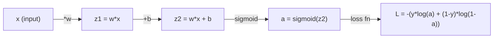
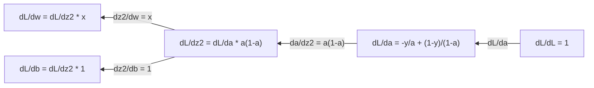
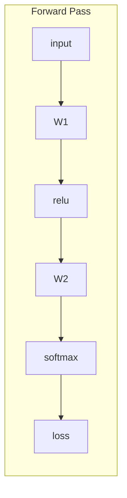
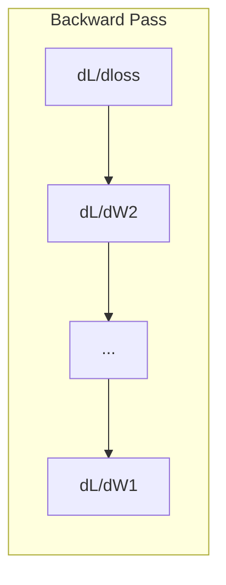
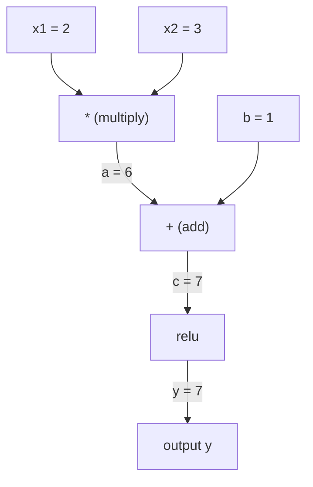
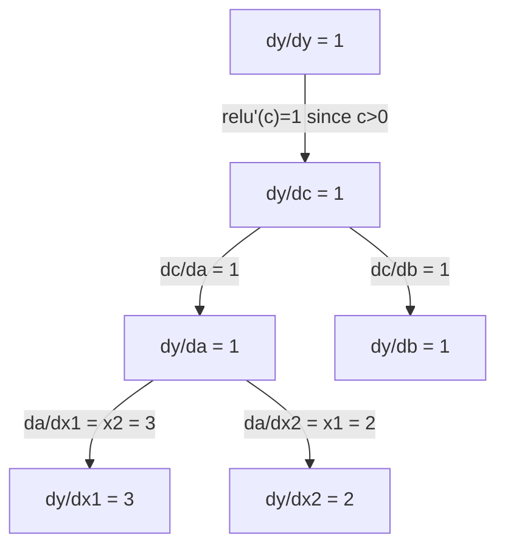
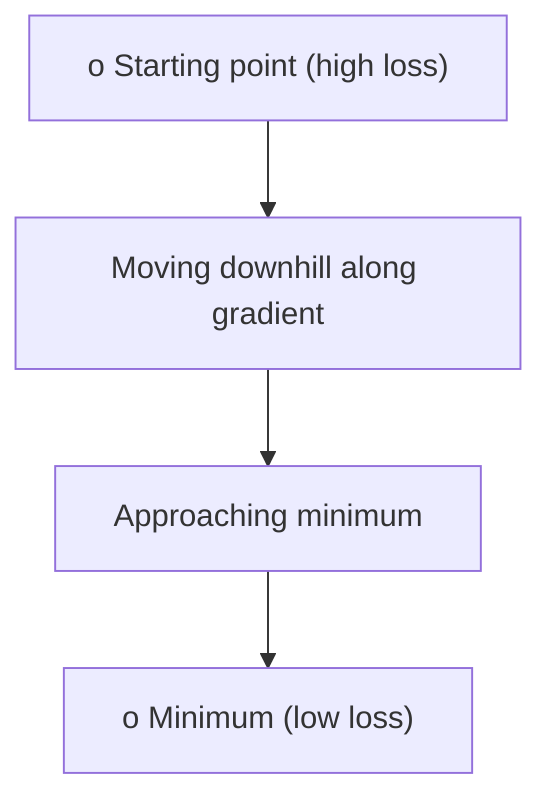
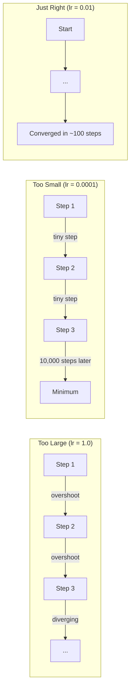
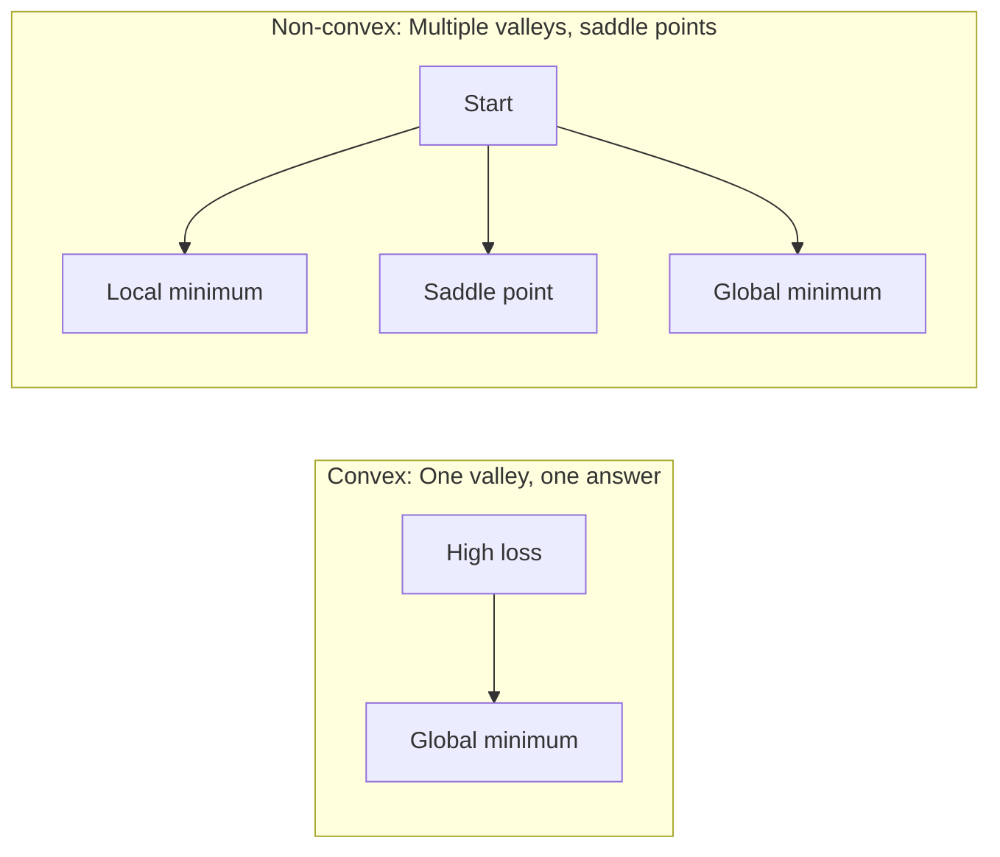

# Calculus & Optimization

> Combined lessons (4 parts), merged verbatim — no content removed.

**Type:** Combined

---

## Part 1 (ch016): Calculus for Machine Learning

> Derivatives tell you which way is downhill. That is all a neural network needs to learn.

**Type:** Learn
**Language:** Python
**Prerequisites:** Phase 1, Lessons 01-03
**Time:** ~60 minutes

## Learning Objectives

- Compute numerical and analytical derivatives for common ML functions (x^2, sigmoid, cross-entropy)
- Implement gradient descent from scratch to minimize a loss function in 1D and 2D
- Derive the gradient of a linear regression model and train it via manual weight updates
- Explain the Hessian matrix, Taylor series approximations, and their connection to optimization methods

## The Problem

You have a neural network with millions of weights. Each weight is a knob. You need to figure out which direction to turn every single knob to make the model slightly less wrong. Calculus gives you that direction.

Without calculus, training a neural network would mean trying random changes and hoping for the best. With derivatives, you know exactly how each weight affects the error. You turn every knob the right way, every time.

## The Concept

### What is a derivative?

A derivative measures the rate of change. For a function y = f(x), the derivative f'(x) tells you: if you nudge x by a tiny amount, how much does y change?

Geometrically, the derivative is the slope of the tangent line at a point.

**f(x) = x^2:**

| x | f(x) | f'(x) (slope) |
|---|------|---------------|
| 0 | 0    | 0 (flat, at the bottom) |
| 1 | 1    | 2 |
| 2 | 4    | 4 (tangent line slope at this point) |
| 3 | 9    | 6 |

At x=2, the slope is 4. If you move x a tiny bit to the right, y increases by about 4 times that amount. At x=0, the slope is 0. You are at the bottom of the bowl.

The formal definition:

```
f'(x) = lim   f(x + h) - f(x)
        h->0  -----------------
                     h
```

In code, you skip the limit and just use a very small h. That is the numerical derivative.

### Partial derivatives: one variable at a time

Real functions have many inputs. A neural network loss depends on thousands of weights. A partial derivative holds all variables constant except one, then takes the derivative with respect to that one.

```
f(x, y) = x^2 + 3xy + y^2

df/dx = 2x + 3y     (treat y as a constant)
df/dy = 3x + 2y     (treat x as a constant)
```

Each partial derivative answers: if I nudge just this one weight, how does the loss change?

### The gradient: vector of all partial derivatives

The gradient collects every partial derivative into one vector. For a function f(x, y, z), the gradient is:

```
grad f = [ df/dx, df/dy, df/dz ]
```

The gradient points in the direction of steepest ascent. To minimize a function, go in the opposite direction.

**Contour plot of f(x,y) = x^2 + y^2:**

The function forms a bowl shape with concentric circles as contour lines. The minimum is at (0, 0).

| Point | grad f | -grad f (descent direction) |
|-------|--------|----------------------------|
| (1, 1) | [2, 2] (points uphill, away from minimum) | [-2, -2] (points downhill, toward minimum) |
| (0, 0) | [0, 0] (flat, at the minimum) | [0, 0] |

This is gradient descent in a picture. Compute the gradient, negate it, take a step.

### The connection to optimization

Training a neural network is optimization. You have a loss function L(w1, w2, ..., wn) that measures how wrong the model is. You want to minimize it.

```
Gradient descent update rule:

  w_new = w_old - learning_rate * dL/dw

For every weight:
  1. Compute the partial derivative of loss with respect to that weight
  2. Subtract a small multiple of it from the weight
  3. Repeat
```

The learning rate controls step size. Too big and you overshoot. Too small and you crawl.

**Loss landscape (1D slice):**

The loss function L(w) forms a curve with peaks and valleys as the weight w varies.

| Feature | Description |
|---------|-------------|
| Global minimum | The lowest point on the entire curve -- the best solution |
| Local minimum | A valley that is lower than its neighbors but not the lowest overall |
| Slope | Gradient descent follows the slope downhill from any starting point |

Gradient descent follows the slope downhill. It can get stuck in local minima, but in high-dimensional spaces (millions of weights) this is rarely a practical problem.

### Numerical vs analytical derivatives

There are two ways to compute a derivative.

Analytical: apply calculus rules by hand. For f(x) = x^2, the derivative is f'(x) = 2x. Exact. Fast.

Numerical: approximate using the definition. Compute f(x+h) and f(x-h) for a tiny h, then use the difference.

```
Numerical (central difference):

f'(x) ~= f(x + h) - f(x - h)
          -----------------------
                  2h

h = 0.0001 works well in practice
```

Numerical derivatives are slower but work for any function. Analytical derivatives are fast but require you to derive the formula. Neural network frameworks use a third approach: automatic differentiation, which computes exact derivatives mechanically. You will see that in Phase 3.

### Derivatives by hand for simple functions

These are the derivatives you will see over and over in ML.

```
Function        Derivative       Used in
--------        ----------       -------
f(x) = x^2     f'(x) = 2x      Loss functions (MSE)
f(x) = wx + b  f'(w) = x        Linear layer (gradient w.r.t. weight)
                f'(b) = 1        Linear layer (gradient w.r.t. bias)
                f'(x) = w        Linear layer (gradient w.r.t. input)
f(x) = e^x     f'(x) = e^x     Softmax, attention
f(x) = ln(x)   f'(x) = 1/x     Cross-entropy loss
f(x) = 1/(1+e^-x)  f'(x) = f(x)(1-f(x))   Sigmoid activation
```

For f(x) = x^2:

```
f(x) = x^2    f'(x) = 2x

  x    f(x)   f'(x)   meaning
  -2    4      -4      slope tilts left (decreasing)
  -1    1      -2      slope tilts left (decreasing)
   0    0       0      flat (minimum!)
   1    1       2      slope tilts right (increasing)
   2    4       4      slope tilts right (increasing)
```

For f(w) = wx + b with x=3, b=1:

```
f(w) = 3w + 1    f'(w) = 3

The derivative with respect to w is just x.
If x is big, a small change in w causes a big change in output.
```

### The chain rule

When functions are composed, the chain rule tells you how to differentiate.

```
If y = f(g(x)), then dy/dx = f'(g(x)) * g'(x)

Example: y = (3x + 1)^2
  outer: f(u) = u^2       f'(u) = 2u
  inner: g(x) = 3x + 1    g'(x) = 3
  dy/dx = 2(3x + 1) * 3 = 6(3x + 1)
```

Neural networks are chains of functions: input -> linear -> activation -> linear -> activation -> loss. Backpropagation is the chain rule applied repeatedly from output to input. That is the entire algorithm.

### The Hessian Matrix

The gradient tells you the slope. The Hessian tells you the curvature.

The Hessian is the matrix of second-order partial derivatives. For a function f(x1, x2, ..., xn), entry (i, j) of the Hessian is:

```
H[i][j] = d^2f / (dx_i * dx_j)
```

For a 2-variable function f(x, y):

```
H = | d^2f/dx^2    d^2f/dxdy |
    | d^2f/dydx    d^2f/dy^2 |
```

**What the Hessian tells you at a critical point (where gradient = 0):**

| Hessian property | Meaning | Example surface |
|-----------------|---------|-----------------|
| Positive definite (all eigenvalues > 0) | Local minimum | Bowl pointing up |
| Negative definite (all eigenvalues < 0) | Local maximum | Bowl pointing down |
| Indefinite (mixed eigenvalues) | Saddle point | Horse saddle shape |

**Example:** f(x, y) = x^2 - y^2 (a saddle function)

```
df/dx = 2x       df/dy = -2y
d^2f/dx^2 = 2    d^2f/dy^2 = -2    d^2f/dxdy = 0

H = | 2   0 |
    | 0  -2 |

Eigenvalues: 2 and -2 (one positive, one negative)
--> Saddle point at (0, 0)
```

Compare with f(x, y) = x^2 + y^2 (a bowl):

```
H = | 2  0 |
    | 0  2 |

Eigenvalues: 2 and 2 (both positive)
--> Local minimum at (0, 0)
```

**Why the Hessian matters in ML:**

Newton's method uses the Hessian to take better optimization steps than gradient descent. Instead of just following the slope, it accounts for curvature:

```
Newton's update:    w_new = w_old - H^(-1) * gradient
Gradient descent:   w_new = w_old - lr * gradient
```

Newton's method converges faster because the Hessian "rescales" the gradient -- steep directions get smaller steps, flat directions get larger steps.

The catch: for a neural network with N parameters, the Hessian is N x N. A model with 1 million parameters would need a 1 trillion-entry matrix. That is why we use approximations.

| Method | What it uses | Cost | Convergence |
|--------|-------------|------|-------------|
| Gradient descent | First derivatives only | O(N) per step | Slow (linear) |
| Newton's method | Full Hessian | O(N^3) per step | Fast (quadratic) |
| L-BFGS | Approximate Hessian from gradient history | O(N) per step | Medium (superlinear) |
| Adam | Per-parameter adaptive rates (diagonal Hessian approx) | O(N) per step | Medium |
| Natural gradient | Fisher information matrix (statistical Hessian) | O(N^2) per step | Fast |

In practice, Adam is the default optimizer for deep learning. It approximates second-order information cheaply by tracking the running mean and variance of gradients per parameter.

### Taylor Series Approximation

Any smooth function can be approximated locally by a polynomial:

```
f(x + h) = f(x) + f'(x)*h + (1/2)*f''(x)*h^2 + (1/6)*f'''(x)*h^3 + ...
```

The more terms you include, the better the approximation -- but only near the point x.

**Why Taylor series matter for ML:**

- **First-order Taylor = gradient descent.** When you use f(x + h) ~ f(x) + f'(x)*h, you are making a linear approximation. Gradient descent minimizes this linear model to choose h = -lr * f'(x).

- **Second-order Taylor = Newton's method.** Using f(x + h) ~ f(x) + f'(x)*h + (1/2)*f''(x)*h^2, you get a quadratic model. Minimizing it gives h = -f'(x)/f''(x) -- Newton's step.

- **Loss function design.** MSE and cross-entropy are smooth, which means their Taylor expansions are well-behaved. This is not an accident. Smooth losses make optimization predictable.

```
Approximation order    What it captures    Optimization method
-------------------    -----------------   -------------------
0th order (constant)   Just the value      Random search
1st order (linear)     Slope               Gradient descent
2nd order (quadratic)  Curvature           Newton's method
Higher orders          Finer structure     Rarely used in ML
```

The key insight: all gradient-based optimization is really about approximating the loss function locally and stepping to the minimum of that approximation.

### Integrals in ML

Derivatives tell you rates of change. Integrals compute accumulations -- area under a curve.

In ML, you rarely compute integrals by hand, but the concept is everywhere:

**Probability.** For a continuous random variable with density p(x):
```
P(a < X < b) = integral from a to b of p(x) dx
```
The area under the probability density curve between a and b is the probability of landing in that range.

**Expected value.** The average outcome weighted by probability:
```
E[f(X)] = integral of f(x) * p(x) dx
```
The expected loss over a data distribution is an integral. Training minimizes an empirical approximation of this.

**KL divergence.** Measures how different two distributions are:
```
KL(p || q) = integral of p(x) * log(p(x) / q(x)) dx
```
Used in VAEs, knowledge distillation, and Bayesian inference.

**Normalization constants.** In Bayesian inference:
```
p(w | data) = p(data | w) * p(w) / integral of p(data | w) * p(w) dw
```
The denominator is an integral over all possible parameter values. It is often intractable, which is why we use approximations like MCMC and variational inference.

| Integral concept | Where it appears in ML |
|-----------------|----------------------|
| Area under curve | Probability from density functions |
| Expected value | Loss functions, risk minimization |
| KL divergence | VAEs, policy optimization, distillation |
| Normalization | Bayesian posteriors, softmax denominator |
| Marginal likelihood | Model comparison, evidence lower bound (ELBO) |

### Multivariable Chain Rule in a Computation Graph

The chain rule does not just apply to scalar functions in a line. In a neural network, variables fan out and merge. Here is how derivatives flow through a simple forward pass:



The backward pass computes gradients right to left:



Each arrow multiplies by the local derivative. The gradient for any parameter is the product of all local derivatives along the path from loss to that parameter. When paths branch and merge, you sum the contributions (multivariate chain rule).

This is all backpropagation is: the chain rule applied systematically through a computation graph, from output to inputs.

### The Jacobian matrix

When a function maps a vector to a vector (like a neural network layer), its derivative is a matrix. The Jacobian contains every partial derivative of every output with respect to every input.

For f: R^n -> R^m, the Jacobian J is an m x n matrix:

| | x1 | x2 | ... | xn |
|---|---|---|---|---|
| f1 | df1/dx1 | df1/dx2 | ... | df1/dxn |
| f2 | df2/dx1 | df2/dx2 | ... | df2/dxn |
| ... | ... | ... | ... | ... |
| fm | dfm/dx1 | dfm/dx2 | ... | dfm/dxn |

You will not compute Jacobians by hand for neural networks. PyTorch handles it. But knowing it exists helps you understand shapes in backpropagation: if a layer maps R^n to R^m, its Jacobian is m x n. The gradient flows backward through the transpose of this matrix.

### Why this matters for neural networks

Every weight in a neural network gets a gradient. The gradient tells you how to adjust that weight to reduce the loss.





Each weight update:
- `W1 = W1 - lr * dL/dW1`
- `W2 = W2 - lr * dL/dW2`

The forward pass computes the prediction and loss. The backward pass computes the gradient of the loss with respect to every weight. Then every weight takes a small step downhill. Repeat for millions of steps. That is deep learning.

```figure
derivative-tangent
```

## Build It

### Step 1: Numerical derivative from scratch

```python
def numerical_derivative(f, x, h=1e-7):
    return (f(x + h) - f(x - h)) / (2 * h)

def f(x):
    return x ** 2

for x in [-2, -1, 0, 1, 2]:
    numerical = numerical_derivative(f, x)
    analytical = 2 * x
    print(f"x={x:2d}  f'(x) numerical={numerical:.6f}  analytical={analytical:.1f}")
```

The numerical derivative matches the analytical one to many decimal places.

### Step 2: Partial derivatives and gradients

```python
def numerical_gradient(f, point, h=1e-7):
    gradient = []
    for i in range(len(point)):
        point_plus = list(point)
        point_minus = list(point)
        point_plus[i] += h
        point_minus[i] -= h
        partial = (f(point_plus) - f(point_minus)) / (2 * h)
        gradient.append(partial)
    return gradient

def f_multi(point):
    x, y = point
    return x**2 + 3*x*y + y**2

grad = numerical_gradient(f_multi, [1.0, 2.0])
print(f"Numerical gradient at (1,2): {[f'{g:.4f}' for g in grad]}")
print(f"Analytical gradient at (1,2): [2*1+3*2, 3*1+2*2] = [{2*1+3*2}, {3*1+2*2}]")
```

### Step 3: Gradient descent to find the minimum of f(x) = x^2

```python
x = 5.0
lr = 0.1
for step in range(20):
    grad = 2 * x
    x = x - lr * grad
    print(f"step {step:2d}  x={x:8.4f}  f(x)={x**2:10.6f}")
```

Starting at x=5, each step moves closer to x=0 (the minimum).

### Step 4: Gradient descent on a 2D function

```python
def f_2d(point):
    x, y = point
    return x**2 + y**2

point = [4.0, 3.0]
lr = 0.1
for step in range(30):
    grad = numerical_gradient(f_2d, point)
    point = [p - lr * g for p, g in zip(point, grad)]
    loss = f_2d(point)
    if step % 5 == 0 or step == 29:
        print(f"step {step:2d}  point=({point[0]:7.4f}, {point[1]:7.4f})  f={loss:.6f}")
```

### Step 5: Comparing numerical and analytical derivatives

```python
import math

test_functions = [
    ("x^2",      lambda x: x**2,          lambda x: 2*x),
    ("x^3",      lambda x: x**3,          lambda x: 3*x**2),
    ("sin(x)",   lambda x: math.sin(x),   lambda x: math.cos(x)),
    ("e^x",      lambda x: math.exp(x),   lambda x: math.exp(x)),
    ("1/x",      lambda x: 1/x,           lambda x: -1/x**2),
]

x = 2.0
print(f"{'Function':<12} {'Numerical':>12} {'Analytical':>12} {'Error':>12}")
print("-" * 50)
for name, f, df in test_functions:
    num = numerical_derivative(f, x)
    ana = df(x)
    err = abs(num - ana)
    print(f"{name:<12} {num:12.6f} {ana:12.6f} {err:12.2e}")
```

### Step 6: Computing the Hessian numerically

```python
def hessian_2d(f, x, y, h=1e-5):
    fxx = (f(x + h, y) - 2 * f(x, y) + f(x - h, y)) / (h ** 2)
    fyy = (f(x, y + h) - 2 * f(x, y) + f(x, y - h)) / (h ** 2)
    fxy = (f(x + h, y + h) - f(x + h, y - h) - f(x - h, y + h) + f(x - h, y - h)) / (4 * h ** 2)
    return [[fxx, fxy], [fxy, fyy]]

def saddle(x, y):
    return x ** 2 - y ** 2

def bowl(x, y):
    return x ** 2 + y ** 2

H_saddle = hessian_2d(saddle, 0.0, 0.0)
H_bowl = hessian_2d(bowl, 0.0, 0.0)
print(f"Saddle Hessian: {H_saddle}")  # [[2, 0], [0, -2]] -- mixed signs
print(f"Bowl Hessian:   {H_bowl}")    # [[2, 0], [0, 2]]  -- both positive
```

The Hessian of the saddle function has eigenvalues 2 and -2 (mixed signs, confirming a saddle point). The bowl has eigenvalues 2 and 2 (both positive, confirming a minimum).

### Step 7: Taylor approximation in action

```python
import math

def taylor_approx(f, f_prime, f_double_prime, x0, h, order=2):
    result = f(x0)
    if order >= 1:
        result += f_prime(x0) * h
    if order >= 2:
        result += 0.5 * f_double_prime(x0) * h ** 2
    return result

x0 = 0.0
for h in [0.1, 0.5, 1.0, 2.0]:
    true_val = math.sin(h)
    t1 = taylor_approx(math.sin, math.cos, lambda x: -math.sin(x), x0, h, order=1)
    t2 = taylor_approx(math.sin, math.cos, lambda x: -math.sin(x), x0, h, order=2)
    print(f"h={h:.1f}  sin(h)={true_val:.4f}  order1={t1:.4f}  order2={t2:.4f}")
```

Near x0=0, sin(x) ~ x (first-order Taylor). The approximation is excellent for small h but breaks down for large h. This is why gradient descent works best with small learning rates -- each step assumes the linear approximation is accurate.

### Step 8: Why this matters for a neural network

```python
import random

random.seed(42)

w = random.gauss(0, 1)
b = random.gauss(0, 1)
lr = 0.01

xs = [1.0, 2.0, 3.0, 4.0, 5.0]
ys = [3.0, 5.0, 7.0, 9.0, 11.0]

for epoch in range(200):
    total_loss = 0
    dw = 0
    db = 0
    for x, y in zip(xs, ys):
        pred = w * x + b
        error = pred - y
        total_loss += error ** 2
        dw += 2 * error * x
        db += 2 * error
    dw /= len(xs)
    db /= len(xs)
    total_loss /= len(xs)
    w -= lr * dw
    b -= lr * db
    if epoch % 40 == 0 or epoch == 199:
        print(f"epoch {epoch:3d}  w={w:.4f}  b={b:.4f}  loss={total_loss:.6f}")

print(f"\nLearned: y = {w:.2f}x + {b:.2f}")
print(f"Actual:  y = 2x + 1")
```

Every gradient-based training loop follows this pattern: predict, compute loss, compute gradients, update weights.

## Use It

With NumPy, the same operations are faster and more concise:

```python
import numpy as np

x = np.array([1, 2, 3, 4, 5], dtype=float)
y = np.array([3, 5, 7, 9, 11], dtype=float)

w, b = np.random.randn(), np.random.randn()
lr = 0.01

for epoch in range(200):
    pred = w * x + b
    error = pred - y
    loss = np.mean(error ** 2)
    dw = np.mean(2 * error * x)
    db = np.mean(2 * error)
    w -= lr * dw
    b -= lr * db

print(f"Learned: y = {w:.2f}x + {b:.2f}")
```

You just built gradient descent from scratch. PyTorch automates the gradient computation, but the update loop is identical.

## Exercises

1. Implement `numerical_second_derivative(f, x)` using `numerical_derivative` called twice. Verify that the second derivative of x^3 at x=2 is 12.
2. Use gradient descent to find the minimum of f(x, y) = (x - 3)^2 + (y + 1)^2. Start from (0, 0). The answer should converge to (3, -1).
3. Add momentum to the gradient descent loop: maintain a velocity vector that accumulates past gradients. Compare convergence speed with and without momentum on f(x) = x^4 - 3x^2.

## Key Terms

| Term | What people say | What it actually means |
|------|----------------|----------------------|
| Derivative | "The slope" | The rate of change of a function at a point. Tells you how much the output changes per unit change in input. |
| Partial derivative | "Derivative of one variable" | The derivative with respect to one variable while all others are held constant. |
| Gradient | "Direction of steepest ascent" | A vector of all partial derivatives. Points in the direction that increases the function fastest. |
| Gradient descent | "Go downhill" | Subtract the gradient (times a learning rate) from the parameters to reduce the loss. The core of neural network training. |
| Learning rate | "Step size" | A scalar that controls how big each gradient descent step is. Too large: diverge. Too small: converge slowly. |
| Chain rule | "Multiply the derivatives" | The rule for differentiating composed functions: df/dx = df/dg * dg/dx. The mathematical basis of backpropagation. |
| Jacobian | "Matrix of derivatives" | When a function maps vectors to vectors, the Jacobian is the matrix of all partial derivatives of outputs with respect to inputs. |
| Numerical derivative | "Finite differences" | Approximating a derivative by evaluating the function at two nearby points and computing the slope between them. |
| Backpropagation | "Reverse-mode autodiff" | Computing gradients layer by layer from output to input using the chain rule. How neural networks learn. |
| Hessian | "Matrix of second derivatives" | The matrix of all second-order partial derivatives. Describes the curvature of a function. Positive definite Hessian at a critical point means local minimum. |
| Taylor series | "Polynomial approximation" | Approximating a function near a point using its derivatives: f(x+h) ~ f(x) + f'(x)h + (1/2)f''(x)h^2 + ... The basis for understanding why gradient descent and Newton's method work. |
| Integral | "Area under the curve" | The accumulation of a quantity over a range. In ML, integrals define probabilities, expected values, and KL divergence. |

## Further Reading

- [3Blue1Brown: Essence of Calculus](https://www.3blue1brown.com/topics/calculus) - visual intuition for derivatives, integrals, and the chain rule
- [Stanford CS231n: Backpropagation](https://cs231n.github.io/optimization-2/) - how gradients flow through neural network layers

[Reference](https://github.com/rohitg00/ai-engineering-from-scratch/tree/main/phases/01-math-foundations/04-calculus-for-ml)

---

## Part 2 (ch017): Chain Rule & Automatic Differentiation

> The chain rule is the engine behind every neural network that learns.

**Type:** Build
**Language:** Python
**Prerequisites:** Phase 1, Lesson 04 (Derivatives & Gradients)
**Time:** ~90 minutes

## Learning Objectives

- Build a minimal autograd engine (Value class) that records operations and computes gradients via reverse-mode autodiff
- Implement forward and backward passes through a computation graph using topological sort
- Construct and train a multi-layer perceptron on XOR using only the from-scratch autograd engine
- Verify autodiff correctness using gradient checking against numerical finite differences

## The Problem

You can compute derivatives of simple functions. But a neural network is not a simple function. It is hundreds of functions composed together: matrix multiply, add bias, apply activation, matrix multiply again, softmax, cross-entropy loss. The output is a function of a function of a function.

To train the network, you need the gradient of the loss with respect to every single weight. Doing this by hand is impossible for millions of parameters. Doing it numerically (finite differences) is too slow.

The chain rule gives you the math. Automatic differentiation gives you the algorithm. Together they let you compute exact gradients through arbitrary compositions of functions in time proportional to a single forward pass.

This is how PyTorch, TensorFlow, and JAX work. You will build a miniature version from scratch.

## The Concept

### The Chain Rule

If `y = f(g(x))`, the derivative of `y` with respect to `x` is:

```
dy/dx = dy/dg * dg/dx = f'(g(x)) * g'(x)
```

Multiply the derivatives along the chain. Each link contributes its local derivative.

Example: `y = sin(x^2)`

```
g(x) = x^2       g'(x) = 2x
f(g) = sin(g)     f'(g) = cos(g)

dy/dx = cos(x^2) * 2x
```

For deeper compositions, the chain extends:

```
y = f(g(h(x)))

dy/dx = f'(g(h(x))) * g'(h(x)) * h'(x)
```

Every layer in a neural network is one link in this chain.

### Computational Graphs

A computational graph makes the chain rule visual. Every operation becomes a node. Data flows forward through the graph. Gradients flow backward.

**Forward pass (compute values):**



**Backward pass (compute gradients):**



The backward pass applies the chain rule at every node, propagating gradients from output to inputs.

### Forward Mode vs Reverse Mode

There are two ways to apply the chain rule through a graph.

**Forward mode** starts at the inputs and pushes derivatives forward. It computes `dx/dx = 1` and propagates through each operation. Good when you have few inputs and many outputs.

```
Forward mode: seed dx/dx = 1, propagate forward

  x = 2       (dx/dx = 1)
  a = x^2     (da/dx = 2x = 4)
  y = sin(a)  (dy/dx = cos(a) * da/dx = cos(4) * 4 = -2.615)
```

**Reverse mode** starts at the output and pulls gradients backward. It computes `dy/dy = 1` and propagates through each operation in reverse. Good when you have many inputs and few outputs.

```
Reverse mode: seed dy/dy = 1, propagate backward

  y = sin(a)  (dy/dy = 1)
  a = x^2     (dy/da = cos(a) = cos(4) = -0.654)
  x = 2       (dy/dx = dy/da * da/dx = -0.654 * 4 = -2.615)
```

Neural networks have millions of inputs (weights) and one output (loss). Reverse mode computes all gradients in one backward pass. This is why backpropagation uses reverse mode.

| Mode | Seed | Direction | Best when |
|------|------|-----------|-----------|
| Forward | `dx_i/dx_i = 1` | Input to output | Few inputs, many outputs |
| Reverse | `dy/dy = 1` | Output to input | Many inputs, few outputs (neural nets) |

### Dual Numbers for Forward Mode

Forward mode can be implemented elegantly with dual numbers. A dual number has the form `a + b*epsilon` where `epsilon^2 = 0`.

```
Dual number: (value, derivative)

(2, 1) means: value is 2, derivative w.r.t. x is 1

Arithmetic rules:
  (a, a') + (b, b') = (a+b, a'+b')
  (a, a') * (b, b') = (a*b, a'*b + a*b')
  sin(a, a')         = (sin(a), cos(a)*a')
```

Seed the input variable with derivative 1. The derivative propagates automatically through every operation.

### Building an Autograd Engine

An autograd engine needs three things:

1. **Value wrapping.** Wrap every number in an object that stores its value and gradient.
2. **Graph recording.** Every operation records its inputs and the local gradient function.
3. **Backward pass.** Topological sort the graph, then walk it in reverse, applying the chain rule at each node.

This is exactly what PyTorch's `autograd` does. The `torch.Tensor` class wraps values, records operations when `requires_grad=True`, and computes gradients when you call `.backward()`.

### How PyTorch Autograd Works Under the Hood

When you write PyTorch code:

```python
x = torch.tensor(2.0, requires_grad=True)
y = x ** 2 + 3 * x + 1
y.backward()
print(x.grad)  # 7.0 = 2*x + 3 = 2*2 + 3
```

PyTorch internally:

1. Creates a `Tensor` node for `x` with `requires_grad=True`
2. Every operation (`**`, `*`, `+`) creates a new node and records the backward function
3. `y.backward()` triggers reverse-mode autodiff through the recorded graph
4. Each node's `grad_fn` computes local gradients and passes them to parent nodes
5. Gradients accumulate in `.grad` attributes via addition (not replacement)

The graph is dynamic (define-by-run). A new graph is built on every forward pass. This is why PyTorch supports control flow (if/else, loops) inside models.

```figure
chain-rule
```

## Build It

### Step 1: The Value class

```python
class Value:
    def __init__(self, data, children=(), op=''):
        self.data = data
        self.grad = 0.0
        self._backward = lambda: None
        self._prev = set(children)
        self._op = op

    def __repr__(self):
        return f"Value(data={self.data:.4f}, grad={self.grad:.4f})"
```

Every `Value` stores its numeric data, its gradient (initially zero), a backward function, and pointers to child nodes that produced it.

### Step 2: Arithmetic operations with gradient tracking

```python
    def __add__(self, other):
        other = other if isinstance(other, Value) else Value(other)
        out = Value(self.data + other.data, (self, other), '+')
        def _backward():
            self.grad += out.grad
            other.grad += out.grad
        out._backward = _backward
        return out

    def __mul__(self, other):
        other = other if isinstance(other, Value) else Value(other)
        out = Value(self.data * other.data, (self, other), '*')
        def _backward():
            self.grad += other.data * out.grad
            other.grad += self.data * out.grad
        out._backward = _backward
        return out

    def relu(self):
        out = Value(max(0, self.data), (self,), 'relu')
        def _backward():
            self.grad += (1.0 if out.data > 0 else 0.0) * out.grad
        out._backward = _backward
        return out
```

Each operation creates a closure that knows how to compute local gradients and multiply by the upstream gradient (`out.grad`). The `+=` handles the case where a value is used in multiple operations.

### Step 3: The backward pass

```python
    def backward(self):
        topo = []
        visited = set()
        def build_topo(v):
            if v not in visited:
                visited.add(v)
                for child in v._prev:
                    build_topo(child)
                topo.append(v)
        build_topo(self)

        self.grad = 1.0
        for v in reversed(topo):
            v._backward()
```

Topological sort ensures every node's gradient is fully computed before it propagates to its children. The seed gradient is 1.0 (dy/dy = 1).

### Step 4: More operations for a complete engine

The basic Value class handles addition, multiplication, and relu. A real autograd engine needs more. Here are the operations you need to build neural networks:

```python
    def __neg__(self):
        return self * -1

    def __sub__(self, other):
        return self + (-other)

    def __radd__(self, other):
        return self + other

    def __rmul__(self, other):
        return self * other

    def __rsub__(self, other):
        return other + (-self)

    def __pow__(self, n):
        out = Value(self.data ** n, (self,), f'**{n}')
        def _backward():
            self.grad += n * (self.data ** (n - 1)) * out.grad
        out._backward = _backward
        return out

    def __truediv__(self, other):
        return self * (other ** -1) if isinstance(other, Value) else self * (Value(other) ** -1)

    def exp(self):
        import math
        e = math.exp(self.data)
        out = Value(e, (self,), 'exp')
        def _backward():
            self.grad += e * out.grad
        out._backward = _backward
        return out

    def log(self):
        import math
        out = Value(math.log(self.data), (self,), 'log')
        def _backward():
            self.grad += (1.0 / self.data) * out.grad
        out._backward = _backward
        return out

    def tanh(self):
        import math
        t = math.tanh(self.data)
        out = Value(t, (self,), 'tanh')
        def _backward():
            self.grad += (1 - t ** 2) * out.grad
        out._backward = _backward
        return out
```

**Why each operation matters:**

| Operation | Backward rule | Used in |
|-----------|--------------|---------|
| `__sub__` | Reuses add + neg | Loss computation (pred - target) |
| `__pow__` | n * x^(n-1) | Polynomial activations, MSE (error^2) |
| `__truediv__` | Reuses mul + pow(-1) | Normalization, learning rate scaling |
| `exp` | exp(x) * upstream | Softmax, log-likelihood |
| `log` | (1/x) * upstream | Cross-entropy loss, log probabilities |
| `tanh` | (1 - tanh^2) * upstream | Classic activation function |

The clever part: `__sub__` and `__truediv__` are defined in terms of existing operations. They get correct gradients for free because the chain rule composes through the underlying add/mul/pow operations.

### Step 5: Mini MLP from scratch

With a complete Value class, you can build a neural network. No PyTorch. No NumPy. Just Values and the chain rule.

```python
import random

class Neuron:
    def __init__(self, n_inputs):
        self.w = [Value(random.uniform(-1, 1)) for _ in range(n_inputs)]
        self.b = Value(0.0)

    def __call__(self, x):
        act = sum((wi * xi for wi, xi in zip(self.w, x)), self.b)
        return act.tanh()

    def parameters(self):
        return self.w + [self.b]

class Layer:
    def __init__(self, n_inputs, n_outputs):
        self.neurons = [Neuron(n_inputs) for _ in range(n_outputs)]

    def __call__(self, x):
        return [n(x) for n in self.neurons]

    def parameters(self):
        return [p for n in self.neurons for p in n.parameters()]

class MLP:
    def __init__(self, sizes):
        self.layers = [Layer(sizes[i], sizes[i+1]) for i in range(len(sizes)-1)]

    def __call__(self, x):
        for layer in self.layers:
            x = layer(x)
        return x[0] if len(x) == 1 else x

    def parameters(self):
        return [p for layer in self.layers for p in layer.parameters()]
```

A `Neuron` computes `tanh(w1*x1 + w2*x2 + ... + b)`. A `Layer` is a list of neurons. An `MLP` stacks layers. Every weight is a `Value`, so calling `loss.backward()` propagates gradients to every parameter.

**Training on XOR:**

```python
random.seed(42)
model = MLP([2, 4, 1])  # 2 inputs, 4 hidden neurons, 1 output

xs = [[0, 0], [0, 1], [1, 0], [1, 1]]
ys = [-1, 1, 1, -1]  # XOR pattern (using -1/1 for tanh)

for step in range(100):
    preds = [model(x) for x in xs]
    loss = sum((p - y) ** 2 for p, y in zip(preds, ys))

    for p in model.parameters():
        p.grad = 0.0
    loss.backward()

    lr = 0.05
    for p in model.parameters():
        p.data -= lr * p.grad

    if step % 20 == 0:
        print(f"step {step:3d}  loss = {loss.data:.4f}")

print("\nPredictions after training:")
for x, y in zip(xs, ys):
    print(f"  input={x}  target={y:2d}  pred={model(x).data:6.3f}")
```

This is micrograd. A complete neural network training loop in pure Python with automatic differentiation. Every commercial deep learning framework does the same thing at massive scale.

### Step 6: Gradient checking

How do you know your autodiff is correct? Compare it against numerical derivatives. This is gradient checking.

```python
def gradient_check(build_expr, x_val, h=1e-7):
    x = Value(x_val)
    y = build_expr(x)
    y.backward()
    autodiff_grad = x.grad

    y_plus = build_expr(Value(x_val + h)).data
    y_minus = build_expr(Value(x_val - h)).data
    numerical_grad = (y_plus - y_minus) / (2 * h)

    diff = abs(autodiff_grad - numerical_grad)
    return autodiff_grad, numerical_grad, diff
```

Test it on a complex expression:

```python
def expr(x):
    return (x ** 3 + x * 2 + 1).tanh()

ad, num, diff = gradient_check(expr, 0.5)
print(f"Autodiff:  {ad:.8f}")
print(f"Numerical: {num:.8f}")
print(f"Difference: {diff:.2e}")
# Difference should be < 1e-5
```

Gradient checking is essential when implementing new operations. If your backward pass has a bug, the numerical check catches it. Every serious deep learning implementation runs gradient checks during development.

**When to use gradient checking:**

| Situation | Do gradient check? |
|-----------|-------------------|
| Adding a new operation to your autograd | Yes, always |
| Debugging a training loop that won't converge | Yes, check gradients first |
| Production training | No, too slow (2x forward passes per parameter) |
| Unit tests for autograd code | Yes, automate it |

### Step 7: Verify against manual calculation

```python
x1 = Value(2.0)
x2 = Value(3.0)
a = x1 * x2          # a = 6.0
b = a + Value(1.0)    # b = 7.0
y = b.relu()          # y = 7.0

y.backward()

print(f"y = {y.data}")          # 7.0
print(f"dy/dx1 = {x1.grad}")   # 3.0 (= x2)
print(f"dy/dx2 = {x2.grad}")   # 2.0 (= x1)
```

Manual check: `y = relu(x1*x2 + 1)`. Since `x1*x2 + 1 = 7 > 0`, relu is identity.
`dy/dx1 = x2 = 3`. `dy/dx2 = x1 = 2`. The engine matches.

## Use It

### Verify against PyTorch

```python
import torch

x1 = torch.tensor(2.0, requires_grad=True)
x2 = torch.tensor(3.0, requires_grad=True)
a = x1 * x2
b = a + 1.0
y = torch.relu(b)
y.backward()

print(f"PyTorch dy/dx1 = {x1.grad.item()}")  # 3.0
print(f"PyTorch dy/dx2 = {x2.grad.item()}")  # 2.0
```

Same gradients. Your engine computes the same result as PyTorch because the math is the same: reverse-mode autodiff via the chain rule.

### A more complex expression

```python
a = Value(2.0)
b = Value(-3.0)
c = Value(10.0)
f = (a * b + c).relu()  # relu(2*(-3) + 10) = relu(4) = 4

f.backward()
print(f"df/da = {a.grad}")  # -3.0 (= b)
print(f"df/db = {b.grad}")  #  2.0 (= a)
print(f"df/dc = {c.grad}")  #  1.0
```

## Ship It

This lesson produces:
- `outputs/skill-autodiff.md` -- a skill for building and debugging autograd systems
- `code/autodiff.py` -- a minimal autograd engine you can extend

The Value class built here is the foundation for the neural network training loop in Phase 3.

## Exercises

1. Add `__pow__` to the Value class so you can compute `x ** n`. Verify that `d/dx(x^3)` at `x=2` equals `12.0`.

2. Add `tanh` as an activation function. Verify that `tanh'(0) = 1` and `tanh'(2) = 0.0707` (approx).

3. Build a computation graph for a single neuron: `y = relu(w1*x1 + w2*x2 + b)`. Compute all five gradients and verify against PyTorch.

4. Implement forward-mode autodiff using dual numbers. Create a `Dual` class and verify it gives the same derivatives as your reverse-mode engine.

## Key Terms

| Term | What people say | What it actually means |
|------|----------------|----------------------|
| Chain rule | "Multiply the derivatives" | The derivative of composed functions equals the product of each function's local derivative, evaluated at the right point |
| Computational graph | "The network diagram" | A directed acyclic graph where nodes are operations and edges carry values (forward) or gradients (backward) |
| Forward mode | "Push derivatives forward" | Autodiff that propagates derivatives from inputs to outputs. One pass per input variable. |
| Reverse mode | "Backpropagation" | Autodiff that propagates gradients from outputs to inputs. One pass per output variable. |
| Autograd | "Automatic gradients" | A system that records operations on values, builds a graph, and computes exact gradients via the chain rule |
| Dual numbers | "Value plus derivative" | Numbers of the form a + b*epsilon (epsilon^2 = 0) that carry derivative information through arithmetic |
| Topological sort | "Dependency order" | Ordering graph nodes so every node comes after all its dependencies. Required for correct gradient propagation. |
| Gradient accumulation | "Add, don't replace" | When a value feeds into multiple operations, its gradient is the sum of all incoming gradient contributions |
| Dynamic graph | "Define by run" | A computation graph rebuilt on every forward pass, allowing Python control flow inside models (PyTorch style) |
| Gradient checking | "Numerical verification" | Comparing autodiff gradients against numerical finite-difference gradients to verify correctness. Essential for debugging. |
| MLP | "Multi-layer perceptron" | A neural network with one or more hidden layers of neurons. Each neuron computes a weighted sum plus bias, then applies an activation function. |
| Neuron | "Weighted sum + activation" | The basic unit: output = activation(w1*x1 + w2*x2 + ... + b). The weights and bias are learnable parameters. |

## Further Reading

- [3Blue1Brown: Backpropagation calculus](https://www.youtube.com/watch?v=tIeHLnjs5U8) -- visual explanation of the chain rule in neural networks
- [PyTorch Autograd mechanics](https://pytorch.org/docs/stable/notes/autograd.html) -- how the real system works
- [Baydin et al., Automatic Differentiation in Machine Learning: a Survey](https://arxiv.org/abs/1502.05767) -- comprehensive reference

[Reference](https://github.com/rohitg00/ai-engineering-from-scratch/tree/main/phases/01-math-foundations/05-chain-rule-and-autodiff)

---

## Part 3 (ch020): Optimization

> Training a neural network is nothing more than finding the bottom of a valley.

**Type:** Build
**Language:** Python
**Prerequisites:** Phase 1, Lessons 04-05 (Derivatives, Gradients)
**Time:** ~75 minutes

## Learning Objectives

- Implement vanilla gradient descent, SGD with momentum, and Adam from scratch
- Compare optimizer convergence on the Rosenbrock function and explain why Adam adapts per-weight learning rates
- Distinguish convex from non-convex loss landscapes and explain the role of saddle points in high dimensions
- Configure learning rate schedules (step decay, cosine annealing, warmup) for training stability

## The Problem

You have a loss function. It tells you how wrong your model is. You have gradients. They tell you which direction makes the loss worse. Now you need a strategy for walking downhill.

The naive approach is simple: move opposite the gradient. Scale the step by some number called the learning rate. Repeat. This is gradient descent, and it works. But "works" has caveats. Too large a learning rate and you overshoot the valley entirely, bouncing between walls. Too small and you crawl toward the answer over thousands of unnecessary steps. Hit a saddle point and you stop moving even though you have not found a minimum.

Every optimizer in deep learning is an answer to the same question: how do you get to the bottom of the valley faster and more reliably?

## The Concept

### What optimization means

Optimization is finding the input values that minimize (or maximize) a function. In machine learning, the function is the loss. The inputs are the model's weights. Training is optimization.

```
minimize L(w) where:
  L = loss function
  w = model weights (could be millions of parameters)
```

### Gradient descent (vanilla)

The simplest optimizer. Compute the gradient of the loss with respect to every weight. Move each weight in the opposite direction of its gradient. Scale the step by the learning rate.

```
w = w - lr * gradient
```

That is the entire algorithm. One line.



### Learning rate: the most important hyperparameter

The learning rate controls step size. It determines everything about convergence.



There is no formula for the right learning rate. You find it by experiment. Common starting points: 0.001 for Adam, 0.01 for SGD with momentum.

### SGD vs batch vs mini-batch

Vanilla gradient descent computes the gradient over the entire dataset before taking one step. This is called batch gradient descent. It is stable but slow.

Stochastic gradient descent (SGD) computes the gradient on a single random sample and steps immediately. It is noisy but fast.

Mini-batch gradient descent splits the difference. Compute the gradient over a small batch (32, 64, 128, 256 samples), then step. This is what everyone actually uses.

| Variant | Batch size | Gradient quality | Speed per step | Noise |
|---------|-----------|-----------------|---------------|-------|
| Batch GD | Entire dataset | Exact | Slow | None |
| SGD | 1 sample | Very noisy | Fast | High |
| Mini-batch | 32-256 | Good estimate | Balanced | Moderate |

The noise in SGD and mini-batch is not a bug. It helps escape shallow local minima and saddle points.

### Momentum: the ball rolling downhill

Vanilla gradient descent only looks at the current gradient. If the gradient zigzags (common in narrow valleys), progress is slow. Momentum fixes this by accumulating past gradients into a velocity term.

```
v = beta * v + gradient
w = w - lr * v
```

The analogy: a ball rolling downhill. It does not stop and restart at every bump. It builds speed in consistent directions and dampens oscillations.

`beta` (typically 0.9) controls how much history to keep. Higher beta means more momentum, smoother paths, but slower response to direction changes.

### Adam: adaptive learning rates

Different weights need different learning rates. A weight that rarely gets large gradients should take bigger steps when it finally does. A weight that gets huge gradients constantly should take smaller steps.

Adam (Adaptive Moment Estimation) tracks two things per weight:

1. First moment (m): running average of gradients (like momentum)
2. Second moment (v): running average of squared gradients (gradient magnitude)

```
m = beta1 * m + (1 - beta1) * gradient
v = beta2 * v + (1 - beta2) * gradient^2

m_hat = m / (1 - beta1^t)    bias correction
v_hat = v / (1 - beta2^t)    bias correction

w = w - lr * m_hat / (sqrt(v_hat) + epsilon)
```

The division by `sqrt(v_hat)` is the key insight. Weights with large gradients get divided by a large number (small effective step). Weights with small gradients get divided by a small number (large effective step). Each weight gets its own adaptive learning rate.

Default hyperparameters: `lr=0.001, beta1=0.9, beta2=0.999, epsilon=1e-8`. These defaults work well for most problems.

### Learning rate schedules

A fixed learning rate is a compromise. Early in training, you want large steps to make fast progress. Late in training, you want small steps to fine-tune near the minimum.

Common schedules:

| Schedule | Formula | Use case |
|----------|---------|----------|
| Step decay | lr = lr * factor every N epochs | Simple, manual control |
| Exponential decay | lr = lr_0 * decay^t | Smooth reduction |
| Cosine annealing | lr = lr_min + 0.5 * (lr_max - lr_min) * (1 + cos(pi * t / T)) | Transformers, modern training |
| Warmup + decay | Linear ramp up, then decay | Large models, prevents early instability |

### Convex vs non-convex

A convex function has one minimum. Gradient descent always finds it. A quadratic like `f(x) = x^2` is convex.

Neural network loss functions are non-convex. They have many local minima, saddle points, and flat regions.



In practice, local minima in high-dimensional neural networks are rarely a problem. Most local minima have loss values close to the global minimum. Saddle points (flat in some directions, curved in others) are the real obstacle. Momentum and noise from mini-batches help escape them.

### Loss landscape visualization

The loss is a function of all weights. For a model with 1 million weights, the loss landscape lives in 1,000,001-dimensional space. We visualize it by picking two random directions in weight space and plotting the loss along those directions, producing a 2D surface.

Sharp minima generalize poorly. Flat minima generalize well. This is one reason SGD with momentum often outperforms Adam on final test accuracy: its noise prevents settling into sharp minima.

## Build It

### Step 1: Define a test function

The Rosenbrock function is a classic optimization benchmark. Its minimum is at (1, 1) inside a narrow curved valley that is easy to find but hard to follow.

```
f(x, y) = (1 - x)^2 + 100 * (y - x^2)^2
```

```python
def rosenbrock(params):
    x, y = params
    return (1 - x) ** 2 + 100 * (y - x ** 2) ** 2

def rosenbrock_gradient(params):
    x, y = params
    df_dx = -2 * (1 - x) + 200 * (y - x ** 2) * (-2 * x)
    df_dy = 200 * (y - x ** 2)
    return [df_dx, df_dy]
```

### Step 2: Vanilla gradient descent

```python
class GradientDescent:
    def __init__(self, lr=0.001):
        self.lr = lr

    def step(self, params, grads):
        return [p - self.lr * g for p, g in zip(params, grads)]
```

### Step 3: SGD with momentum

```python
class SGDMomentum:
    def __init__(self, lr=0.001, momentum=0.9):
        self.lr = lr
        self.momentum = momentum
        self.velocity = None

    def step(self, params, grads):
        if self.velocity is None:
            self.velocity = [0.0] * len(params)
        self.velocity = [
            self.momentum * v + g
            for v, g in zip(self.velocity, grads)
        ]
        return [p - self.lr * v for p, v in zip(params, self.velocity)]
```

### Step 4: Adam

```python
class Adam:
    def __init__(self, lr=0.001, beta1=0.9, beta2=0.999, epsilon=1e-8):
        self.lr = lr
        self.beta1 = beta1
        self.beta2 = beta2
        self.epsilon = epsilon
        self.m = None
        self.v = None
        self.t = 0

    def step(self, params, grads):
        if self.m is None:
            self.m = [0.0] * len(params)
            self.v = [0.0] * len(params)

        self.t += 1

        self.m = [
            self.beta1 * m + (1 - self.beta1) * g
            for m, g in zip(self.m, grads)
        ]
        self.v = [
            self.beta2 * v + (1 - self.beta2) * g ** 2
            for v, g in zip(self.v, grads)
        ]

        m_hat = [m / (1 - self.beta1 ** self.t) for m in self.m]
        v_hat = [v / (1 - self.beta2 ** self.t) for v in self.v]

        return [
            p - self.lr * mh / (vh ** 0.5 + self.epsilon)
            for p, mh, vh in zip(params, m_hat, v_hat)
        ]
```

### Step 5: Run and compare

```python
def optimize(optimizer, func, grad_func, start, steps=5000):
    params = list(start)
    history = [params[:]]
    for _ in range(steps):
        grads = grad_func(params)
        params = optimizer.step(params, grads)
        history.append(params[:])
    return history

start = [-1.0, 1.0]

gd_history = optimize(GradientDescent(lr=0.0005), rosenbrock, rosenbrock_gradient, start)
sgd_history = optimize(SGDMomentum(lr=0.0001, momentum=0.9), rosenbrock, rosenbrock_gradient, start)
adam_history = optimize(Adam(lr=0.01), rosenbrock, rosenbrock_gradient, start)

for name, history in [("GD", gd_history), ("SGD+M", sgd_history), ("Adam", adam_history)]:
    final = history[-1]
    loss = rosenbrock(final)
    print(f"{name:6s} -> x={final[0]:.6f}, y={final[1]:.6f}, loss={loss:.8f}")
```

Expected output: Adam converges fastest. SGD with momentum follows a smoother path. Vanilla GD makes slow progress along the narrow valley.

## Use It

In practice, use PyTorch or JAX optimizers. They handle parameter groups, weight decay, gradient clipping, and GPU acceleration.

```python
import torch

model = torch.nn.Linear(784, 10)

sgd = torch.optim.SGD(model.parameters(), lr=0.01, momentum=0.9)
adam = torch.optim.Adam(model.parameters(), lr=0.001)
adamw = torch.optim.AdamW(model.parameters(), lr=0.001, weight_decay=0.01)

scheduler = torch.optim.lr_scheduler.CosineAnnealingLR(adam, T_max=100)
```

Rules of thumb:

- Start with Adam (lr=0.001). It works for most problems without tuning.
- Switch to SGD with momentum (lr=0.01, momentum=0.9) when you need the best final accuracy and can afford more tuning.
- Use AdamW (Adam with decoupled weight decay) for transformers.
- Always use a learning rate schedule for training runs longer than a few epochs.
- If training is unstable, reduce the learning rate. If training is too slow, increase it.

## Ship It

This lesson produces a prompt for choosing the right optimizer. See `outputs/prompt-optimizer-guide.md`.

The optimizer classes built here reappear in Phase 3 when we train a neural network from scratch.

## Exercises

1. **Learning rate sweep.** Run vanilla gradient descent on the Rosenbrock function with learning rates [0.0001, 0.0005, 0.001, 0.005, 0.01]. Plot or print the final loss after 5000 steps for each. Find the largest learning rate that still converges.

2. **Momentum comparison.** Run SGD with momentum values [0.0, 0.5, 0.9, 0.99] on the Rosenbrock function. Track the loss at every step. Which momentum value converges fastest? Which overshoots?

3. **Saddle point escape.** Define the function `f(x, y) = x^2 - y^2` (a saddle point at the origin). Start at (0.01, 0.01). Compare how vanilla GD, SGD with momentum, and Adam behave. Which escapes the saddle point?

4. **Implement learning rate decay.** Add an exponential decay schedule to the GradientDescent class: `lr = lr_0 * 0.999^step`. Compare convergence with and without decay on the Rosenbrock function.

## Key Terms

| Term | What people say | What it actually means |
|------|----------------|----------------------|
| Gradient descent | "Go downhill" | Update weights by subtracting the gradient scaled by the learning rate. The most basic optimizer. |
| Learning rate | "Step size" | A scalar that controls how far each update moves the weights. Too large causes divergence. Too small wastes compute. |
| Momentum | "Keep rolling" | Accumulate past gradients into a velocity vector. Dampens oscillations and accelerates movement through consistent directions. |
| SGD | "Random sampling" | Stochastic gradient descent. Compute gradient on a random subset instead of the full dataset. Almost always means mini-batch SGD in practice. |
| Mini-batch | "A chunk of data" | A small subset of training data (32-256 samples) used to estimate the gradient. Balances speed and gradient accuracy. |
| Adam | "The default optimizer" | Adaptive Moment Estimation. Tracks per-weight running averages of gradients and squared gradients to give each weight its own learning rate. |
| Bias correction | "Fix the cold start" | Adam's first and second moments are initialized to zero. Bias correction divides by (1 - beta^t) to compensate during early steps. |
| Learning rate schedule | "Change lr over time" | A function that adjusts the learning rate during training. Large steps early, small steps late. |
| Convex function | "One valley" | A function where any local minimum is the global minimum. Gradient descent always finds it. Neural network losses are not convex. |
| Saddle point | "Flat but not a minimum" | A point where the gradient is zero but it is a minimum in some directions and a maximum in others. Common in high dimensions. |
| Loss landscape | "The terrain" | The loss function plotted over weight space. Visualized by slicing along two random directions. |
| Convergence | "Getting there" | The optimizer has reached a point where further steps do not meaningfully reduce the loss. |

## Further Reading

- [Sebastian Ruder: An overview of gradient descent optimization algorithms](https://ruder.io/optimizing-gradient-descent/) - comprehensive survey of all major optimizers
- [Why Momentum Really Works (Distill)](https://distill.pub/2017/momentum/) - interactive visualization of momentum dynamics
- [Adam: A Method for Stochastic Optimization (Kingma & Ba, 2014)](https://arxiv.org/abs/1412.6980) - the original Adam paper, readable and short
- [Visualizing the Loss Landscape of Neural Nets (Li et al., 2018)](https://arxiv.org/abs/1712.09913) - the paper that showed sharp vs flat minima

[Reference](https://github.com/rohitg00/ai-engineering-from-scratch/tree/main/phases/01-math-foundations/08-optimization)

---

## Part 4 (ch030): Convex Optimization

> If you can make your problem convex, you have solved it. If you cannot, you are doing approximate inference.

**Type:** Build  
**Languages:** Python  
**Prerequisites:** Phase 1, Lessons 01-08, 17  
**Time:** ~120 minutes  

## Learning Objectives

- Verify convexity of functions and sets using definitions and epigraphs
- Derive and implement gradient descent, Newton's method, and coordinate descent
- Derive the KKT conditions for constrained optimization
- Apply Lagrangian duality to derive the dual form of SVM and lasso

## The Concept

### Why Convexity Matters

A convex optimization problem has two properties:

1. The objective function `f(x)` is convex
2. The feasible set (all constraint-satisfying points) is convex

When both hold, the problem is tractable:
- Every local minimum is a global minimum
- There is a complete duality theory
- Polynomial-time algorithms exist
- You can certify optimality

When either property fails (non-convex objective or non-convex constraints), you get:
- Multiple local minima
- No guarantee your optimizer found the best one
- NP-hardness in the worst case

Deep learning is entirely non-convex. Every loss landscape is riddled with saddle points and local minima. The fact that SGD works at all is a deep empirical mystery.

### Convex Sets

A set `C` is convex if for any `x, y` in `C` and any `theta in [0, 1]`:

```
theta * x + (1 - theta) * y ∈ C
```

The line segment between any two points in the set lies entirely in the set.

Examples of convex sets:
- Affine subspaces: `{x: Ax = b}`
- Halfspaces: `{x: a^T x <= b}`
- Polyhedra: intersection of finitely many halfspaces
- Norm balls: `{x: ||x|| <= r}`
- Positive semidefinite cone: `{X: X >= 0}` (symmetric positive semidefinite matrices)
- The empty set and singleton sets

Examples of non-convex sets:
- The set of integers
- A sphere surface (not filled ball)
- `{x: ||x|| = 1}` (the boundary, not the interior)
- The set of rank-1 matrices

### Convex Functions

A function `f` is convex if its domain is convex and for any `x, y` in the domain and `theta in [0, 1]`:

```
f(theta * x + (1 - theta) * y) <= theta * f(x) + (1 - theta) * f(y)
```

The function at any interpolated point is at most the interpolation of the function values. The line segment lies above the function.

**First-order condition (for differentiable f):**

```
f(y) >= f(x) + gradient_f(x)^T (y - x)
```

The function lies above its tangent plane at every point. This is the defining property used in optimization algorithms.

**Second-order condition (for twice differentiable f):**

```
Hessian_f(x) >= 0  (positive semidefinite)
```

The curvature is non-negative everywhere. This is how you check convexity in practice.

Examples of convex functions:
- Linear: `a^T x + b`
- Quadratic: `x^T Q x + b^T x` when `Q >= 0`
- Exponential: `exp(ax)` for any `a`
- Log-sum-exp: `log(sum(exp(x_i)))`
- Norms: `||x||` for any norm
- Max of convex functions

Examples of non-convex functions:
- `sin(x)`
- `x^3`
- `x^4 - x^2` (the double-well potential)
- Neural network loss landscapes

### The Epigraph

The epigraph of a function `f` is the set of points above its graph:

```
epi(f) = {(x, t): f(x) <= t}
```

A function is convex if and only if its epigraph is a convex set. This connects the set definition of convexity to the function definition.

The epigraph view is useful for:
- Proving convexity: show the epigraph is a convex set
- Converting optimization problems: minimizing `f` over `x` is equivalent to finding the lowest point of the epigraph
- Duality: the supporting hyperplane of the epigraph gives dual variables

### Gradient Descent

The simplest and most widely used optimization algorithm:

```
x_{k+1} = x_k - alpha_k * gradient_f(x_k)
```

**Step size choices:**
- Fixed: `alpha_k = alpha`. Simple, but may diverge or converge slowly.
- Diminishing: `alpha_k = 1/k`. Guaranteed convergence for convex functions if sum(alpha_k) = inf and sum(alpha_k^2) < inf.
- Exact line search: `alpha_k = argmin f(x_k - alpha * gradient)`. Theoretically nice, expensive in practice.
- Backtracking (Armijo): Start with `alpha = 1`, halve until `f(x_k - alpha * gradient) <= f(x_k) - c * alpha * ||gradient||^2`. Simple and effective.

**Convergence rate for convex functions:**
- Strongly convex: linear convergence (error shrinks geometrically)
- General convex: sublinear convergence (error shrinks as O(1/k))
- Non-convex: no guarantee of finding global minimum

The convergence rate depends on the condition number of the Hessian (ratio of largest to smallest eigenvalue). Poor conditioning creates narrow valleys where gradient descent zigzags.

### Gradient Descent with Momentum

Standard gradient descent can oscillate in narrow valleys. Momentum smooths the path:

```
v_{k+1} = beta * v_k + gradient_f(x_k)
x_{k+1} = x_k - alpha * v_{k+1}
```

`beta` is typically 0.9. The velocity `v` accumulates gradients over time, smoothing oscillations and accelerating convergence. This is the basis of SGD with momentum (SGDM), Adam, and most deep learning optimizers.

**Nesterov accelerated gradient:** Look ahead before computing the gradient.

```
v_{k+1} = beta * v_k + gradient_f(x_k - alpha * beta * v_k)
x_{k+1} = x_k - alpha * v_{k+1}
```

Nesterov achieves the optimal convergence rate O(1/k^2) for smooth convex optimization, versus O(1/k) for standard gradient descent.

### Newton's Method

Newton's method uses second-order information (the Hessian) for faster convergence:

```
x_{k+1} = x_k - Hessian_f(x_k)^(-1) * gradient_f(x_k)
```

**Properties:**
- Quadratic convergence near the optimum (error squaring at each step)
- Affine invariant (scaling variables does not change the iteration)
- Requires O(n^3) per step to factor the Hessian
- Works well when the Hessian is available and n is moderate (n < 10,000)

**When Newton excels:**
- The objective is smooth and strongly convex
- High precision is required (machine epsilon)
- n is small enough to compute Hessian (n < 10,000)

**When Newton fails:**
- n is large (O(n^3) per step is prohibitive)
- Hessian is not available (automatic differentiation can help)
- Hessian is not positive definite (Newton goes uphill)
- The starting point is far from the optimum (Newton can diverge)

**Quasi-Newton methods (BFGS, L-BFGS):** Approximate the Hessian using gradient differences. L-BFGS stores only the last m gradient differences (typically m=10-100), giving O(n) memory and O(n^2) per step. This is the default for deterministic optimization in ML.

### Coordinate Descent

Update one variable at a time while holding all others fixed:

```
For k = 1, 2, ...:
  Pick coordinate i
  x_i = argmin f(x_1, ..., x_i, ..., x_n)
```

**Properties:**
- O(n) per full cycle (update each coordinate once)
- Often faster than gradient descent when coordinates are cheap to update
- Can handle non-differentiable objectives (e.g., L1 regularization)
- May converge slowly if variables are strongly correlated

Coordinate descent is the workhorse for Lasso regression (L1-regularized linear models). The update for each coefficient has a closed form involving soft-thresholding.

### Constrained Optimization and KKT

The general constrained optimization problem:

```
minimize f(x)
subject to g_i(x) <= 0, i = 1, ..., m
         h_j(x) = 0,  j = 1, ..., p
```

The Lagrangian:

```
L(x, lambda, nu) = f(x) + sum(lambda_i * g_i(x)) + sum(nu_j * h_j(x))
```

where `lambda_i >= 0` are the KKT multipliers for inequality constraints and `nu_j` are multipliers for equality constraints.

The KKT conditions (necessary for optimality under constraint qualifications):

1. **Stationarity:** `0 in ∂L(x*, lambda*, nu*)` (gradient of Lagrangian = 0)
2. **Primal feasibility:** `g_i(x*) <= 0`, `h_j(x*) = 0`
3. **Dual feasibility:** `lambda_i* >= 0`
4. **Complementary slackness:** `lambda_i* * g_i(x*) = 0`

The last condition is the most informative: either the constraint is active (g_i = 0) or its multiplier is zero. If a constraint is not binding, it does not affect the solution.

### Lagrangian Duality

The Lagrangian dual function:

```
g(lambda, nu) = inf_x L(x, lambda, nu)
```

The dual problem:

```
maximize g(lambda, nu)
subject to lambda >= 0
```

**Weak duality:** `g(lambda, nu) <= f(x*)` for any feasible `(lambda, nu)` and `x*`. The dual gives a lower bound on the primal optimum.

**Strong duality:** `g(lambda*, nu*) = f(x*)`. The dual optimum equals the primal optimum. Holds for convex problems under Slater's condition (there exists a strictly feasible point).

Strong duality is the foundation of:
- SVM dual formulation (kernel trick)
- Support vector regression
- Lasso dual derivation
- Optimal transport (Wasserstein distance)
- Robust optimization

### The Dual of SVM

Primal SVM (hard margin):

```
minimize (1/2) * ||w||^2
subject to y_i * (w^T x_i + b) >= 1, for all i
```

Lagrangian:

```
L = (1/2)*||w||^2 - sum(alpha_i * (y_i * (w^T x_i + b) - 1))
```

where `alpha_i >= 0`. Setting gradients to zero gives KKT stationarity:

```
w = sum(alpha_i * y_i * x_i)
0 = sum(alpha_i * y_i)
```

Substituting back gives the dual:

```
maximize sum(alpha_i) - (1/2) * sum(sum(alpha_i * alpha_j * y_i * y_j * x_i^T x_j))
subject to alpha_i >= 0, sum(alpha_i * y_i) = 0
```

The primal solution is `w = sum(alpha_i * y_i * x_i)`. Only support vectors (points on the margin boundary) have `alpha_i > 0`.

The dual is a quadratic program and is independent of the dimension of `x`. This enables the kernel trick: replace `x_i^T x_j` with `K(x_i, x_j)` to get non-linear SVMs.

### The Dual of Lasso

Primal Lasso:

```
minimize (1/2) * ||y - X * beta||^2 + lambda * ||beta||_1
```

The L1 norm makes this non-differentiable. The dual is a box-constrained quadratic program:

```
maximize (1/2) * ||y - X * beta||^2 + (1/2) * ||y||^2 - (lambda^2/2) * ||theta||^2
subject to ||X^T theta||_inf <= lambda
```

Where `theta` are the dual variables. The dual is smooth (quadratic) with simple box constraints. This is why dual methods (like coordinate descent) work well for Lasso.

### Subgradients

For non-differentiable convex functions (like `|x|` or `||beta||_1`), the gradient does not exist everywhere. The subgradient generalizes the gradient:

A vector `g` is a subgradient of `f` at `x` if for all `y`:

```
f(y) >= f(x) + g^T (y - x)
```

The set of all subgradients at `x` is the subdifferential `∂f(x)`.

Examples:
- `f(x) = |x|`: `∂f(0) = [-1, 1]`
- `f(x) = max(0, x)` (ReLU): `∂f(0) = [0, 1]`
- `f(x) = ||x||_1`: `∂f(0) = {g: ||g||_inf <= 1}`

**Subgradient method:** `x_{k+1} = x_k - alpha_k * g_k` where `g_k` is any subgradient. Converges at rate O(1/sqrt(k)) for convex functions. This is what SGD does for non-differentiable objectives.

### Proximal Operators

For composite objectives `f(x) + g(x)` where `f` is smooth and `g` is non-smooth but simple, proximal methods are the standard approach.

The proximal operator of `g`:

```
prox_g(x) = argmin_u (g(u) + (1/2) * ||u - x||^2)
```

For many important `g`, the proximal operator has a closed form:
- `g(x) = lambda * ||x||_1`: prox is soft-thresholding: `S_lambda(x) = sign(x) * max(|x| - lambda, 0)`
- `g(x) = I_C(x)` (indicator of convex set C): prox is projection onto C

**ISTA (Iterative Shrinkage-Thresholding Algorithm):** For Lasso regression:

```
x_{k+1} = S_{lambda * alpha}(x_k - alpha * gradient_f(x_k))
```

where `S` is the soft-thresholding operator. This alternates between a gradient step on the smooth part and a proximal step on the L1 part.

**FISTA:** The accelerated version of ISTA with convergence rate O(1/k^2) instead of O(1/k). This is the default method for L1-regularized problems.

## Build It

### Step 1: Gradient descent

```python
def gradient_descent(f, grad_f, x0, alpha=0.01, max_iter=1000, tol=1e-6):
    x = x0
    for _ in range(max_iter):
        g = grad_f(x)
        x_new = [x[i] - alpha * g[i] for i in range(len(x))]
        if math.sqrt(sum((x_new[i] - x[i]) ** 2 for i in range(len(x)))) < tol:
            break
        x = x_new
    return x

def backtracking_line_search(f, grad_f, x, direction, alpha=1.0, c=0.5, rho=0.5):
    while f([x[i] + alpha * direction[i] for i in range(len(x))]) > \
          f(x) + c * alpha * sum(grad_f(x)[i] * direction[i] for i in range(len(x))):
        alpha *= rho
    return alpha
```

### Step 2: Newton's method

```python
def newton_method(f, grad_f, hess_f, x0, max_iter=100, tol=1e-6):
    x = x0
    for _ in range(max_iter):
        g = grad_f(x)
        H = hess_f(x)
        delta = solve_linear_system(H, [-gi for gi in g])
        x_new = [x[i] + delta[i] for i in range(len(x))]
        if math.sqrt(sum(d ** 2 for d in delta)) < tol:
            break
        x = x_new
    return x
```

### Step 3: Coordinate descent for Lasso

```python
def soft_threshold(z, gamma):
    if z > gamma:
        return z - gamma
    if z < -gamma:
        return z + gamma
    return 0.0

def coordinate_descent_lasso(X, y, lam, max_iter=10000, tol=1e-6):
    n, p = len(X), len(X[0])
    beta = [0.0] * p
    for _ in range(max_iter):
        beta_old = beta[:]
        for j in range(p):
            r_j = sum((y[i] - sum(X[i][k] * beta[k] for k in range(p))) for i in range(n))
            r_j += sum(X[i][j] * beta[j] for i in range(n))
            rho_j = sum(X[i][j] * r_j for i in range(n))
            z_j = sum(X[i][j] ** 2 for i in range(n))
            if z_j == 0:
                continue
            beta[j] = soft_threshold(rho_j / z_j, lam / z_j)
        if math.sqrt(sum((beta[i] - beta_old[i]) ** 2 for i in range(p))) < tol:
            break
    return beta
```

## Use It

The all implementations from `code/convex.py` include complete functions:

```python
import math

def is_convex_set(points):
    for x in points:
        for y in points:
            for t in [i / 10.0 for i in range(11)]:
                z = [t * x[i] + (1 - t) * y[i] for i in range(len(x))]
                if not any(all(abs(z[j] - q[j]) < 1e-10 for j in range(len(z))) for q in points):
                    return False
    return True

def is_convex_function(f, domain, n_checks=100):
    import random
    for _ in range(n_checks):
        x = [random.uniform(domain[0], domain[1]) for _ in range(2)]
        y = [random.uniform(domain[0], domain[1]) for _ in range(2)]
        t = random.random()
        lhs = f([t * x[i] + (1 - t) * y[i] for i in range(2)])
        rhs = t * f(x) + (1 - t) * f(y)
        if lhs > rhs + 1e-10:
            return False
    return True

def gradient_descent(f, grad_f, x0, learning_rate=0.01, max_iter=1000, tol=1e-6):
    x = list(x0)
    for i in range(max_iter):
        grad = grad_f(x)
        x_new = [x[j] - learning_rate * grad[j] for j in range(len(x))]
        diff = math.sqrt(sum((x_new[j] - x[j]) ** 2 for j in range(len(x))))
        if diff < tol:
            break
        x = x_new
    return x

def gradient_descent_momentum(f, grad_f, x0, learning_rate=0.01, beta=0.9, max_iter=1000, tol=1e-6):
    x = list(x0)
    v = [0.0] * len(x)
    for i in range(max_iter):
        grad = grad_f(x)
        v = [beta * v[j] + learning_rate * grad[j] for j in range(len(x))]
        x_new = [x[j] - v[j] for j in range(len(x))]
        diff = math.sqrt(sum((x_new[j] - x[j]) ** 2 for j in range(len(x))))
        if diff < tol:
            break
        x = x_new
    return x

def nesterov_gradient_descent(f, grad_f, x0, learning_rate=0.01, beta=0.9, max_iter=1000, tol=1e-6):
    x = list(x0)
    v = [0.0] * len(x)
    for i in range(max_iter):
        lookahead = [x[j] - beta * v[j] for j in range(len(x))]
        grad = grad_f(lookahead)
        v = [beta * v[j] + learning_rate * grad[j] for j in range(len(x))]
        x_new = [x[j] - v[j] for j in range(len(x))]
        diff = math.sqrt(sum((x_new[j] - x[j]) ** 2 for j in range(len(x))))
        if diff < tol:
            break
        x = x_new
    return x

def backtracking_line_search(f, grad_f, x, direction, alpha=1.0, c=0.5, rho=0.5):
    n = len(x)
    f_x = f(x)
    grad_dot_dir = sum(grad_f(x)[i] * direction[i] for i in range(n))
    while f([x[i] + alpha * direction[i] for i in range(n)]) > f_x + c * alpha * grad_dot_dir:
        alpha *= rho
    return alpha

def newton_method(f, grad_f, hess_f, solve_system, x0, max_iter=100, tol=1e-6):
    x = list(x0)
    for i in range(max_iter):
        grad = grad_f(x)
        hess = hess_f(x)
        delta = solve_system(hess, [-g for g in grad])
        x_new = [x[j] + delta[j] for j in range(len(x))]
        diff = math.sqrt(sum((x_new[j] - x[j]) ** 2 for j in range(len(x))))
        if diff < tol:
            break
        x = x_new
    return x

def coordinate_descent(f, grad_f_i, x0, max_iter=1000, tol=1e-6):
    n = len(x0)
    x = list(x0)
    for i in range(max_iter):
        x_old = list(x)
        for j in range(n):
            x[j] = grad_f_i(f, x, j)
        diff = math.sqrt(sum((x[j] - x_old[j]) ** 2 for j in range(n)))
        if diff < tol:
            break
    return x

def soft_threshold(z, gamma):
    if z > gamma:
        return z - gamma
    if z < -gamma:
        return z + gamma
    return 0.0

def proximal_operator_l1(x, lam):
    return [soft_threshold(v, lam) for v in x]

def ista(A, b, lam, x0, alpha=0.01, max_iter=1000, tol=1e-6):
    n = len(A[0])
    AtA = [[sum(A[k][i] * A[k][j] for k in range(len(A))) for j in range(n)] for i in range(n)]
    Atb = [sum(A[k][i] * b[k] for k in range(len(A))) for i in range(n)]
    x = list(x0)
    for i in range(max_iter):
        grad = [sum(AtA[i][j] * x[j] for j in range(n)) - Atb[i] for i in range(n)]
        x_new = proximal_operator_l1([x[j] - alpha * grad[j] for j in range(n)], lam * alpha)
        diff = math.sqrt(sum((x_new[j] - x[j]) ** 2 for j in range(n)))
        if diff < tol:
            break
        x = x_new
    return x

def fista(A, b, lam, x0, alpha=0.01, max_iter=1000, tol=1e-6):
    n = len(A[0])
    m = len(A)
    AtA = [[sum(A[k][i] * A[k][j] for k in range(m)) for j in range(n)] for i in range(n)]
    Atb = [sum(A[k][i] * b[k] for k in range(m)) for i in range(n)]
    x = list(x0)
    y = list(x0)
    t = 1.0
    for i in range(max_iter):
        grad = [sum(AtA[i][j] * y[j] for j in range(n)) - Atb[i] for i in range(n)]
        x_new = proximal_operator_l1([y[j] - alpha * grad[j] for j in range(n)], lam * alpha)
        t_new = (1 + math.sqrt(1 + 4 * t * t)) / 2
        y = [x_new[j] + ((t - 1) / t_new) * (x_new[j] - x[j]) for j in range(n)]
        diff = math.sqrt(sum((x_new[j] - x[j]) ** 2 for j in range(n)))
        if diff < tol:
            break
        x = x_new
        t = t_new
    return x
```

## Ship It

This lesson produces `code/convex.py` with gradient descent, Newton, coordinate descent, ISTA, and FISTA implementations. These reappear in Phase 2 for linear regression fitting, Phase 3 for SVMs, and Phase 4 for training neural networks.

## Exercises

1. **Convexity checker.** Write a function that numerically checks whether a function of one variable is convex over an interval. Test it on `x^2` (convex), `|x|` (convex), `sin(x)` (not convex), and `x^3` (not convex).

2. **Gradient descent comparison.** Minimize `f(x, y) = 100*(y - x^2)^2 + (1 - x)^2` (Rosenbrock function) using: (a) gradient descent with fixed step size, (b) gradient descent with backtracking line search, (c) Newton's method. Compare the number of iterations and path taken.

3. **Coordinate descent for Lasso.** Generate synthetic data with n=100, p=20 where only 5 features are relevant. Fit a Lasso model using coordinate descent. Compare the estimated coefficients with the true coefficients. How does the regularization parameter lambda affect sparsity?

4. **ISTA vs FISTA.** For the same Lasso problem, run ISTA and FISTA. Plot the objective value vs iteration number for both. How many iterations does each need to reach the same accuracy?

## Key Terms

| Term | What people say | What it actually means |
|------|----------------|----------------------|
| Convex set | "No dents" | Line segment between any two points stays in the set. |
| Convex function | "Bowl-shaped" | Function lies below its chords. Every local minimum is global. |
| Epigraph | "Above the graph" | Set of points (x, t) where f(x) <= t. Function is convex iff epigraph is convex. |
| Gradient descent | "Follow the slope" | x = x - alpha * gradient. The simplest optimization algorithm. O(1/k) rate. |
| Newton's method | "Second-order optimizer" | x = x - H^(-1)*gradient. Quadratic convergence, but O(n^3) per step. |
| Momentum | "Smooth the gradient path" | Accumulate gradient over time to smooth oscillations. Beta = 0.9 is standard. |
| KKT conditions | "Optimality conditions" | Stationarity, primal/dual feasibility, complementary slackness. Necessary for constrained optima. |
| Lagrangian | "Augmented objective" | L(x, lambda) = f(x) + sum(lambda_i * g_i(x)). Encodes constraints into objective. |
| Dual problem | "The other problem" | Maximize inf_x L(x, lambda). Gives lower bound on primal. Strong duality = equal. |
| Subgradient | "Gradient for non-smooth functions" | Generalization of gradient for functions like |x|. ∂f(0) = [-1, 1]. |
| Proximal operator | "Regularized projection" | prox_g(x) = argmin_u g(u) + (1/2)||u - x||^2. Closed form for L1 (soft thresholding). |
| ISTA | "Iterative Shrinkage" | Proximal gradient for L1 problems. Alternates gradient step + soft thresholding. |
| FISTA | "Fast ISTA" | Accelerated ISTA with momentum. O(1/k^2) convergence instead of O(1/k). |

[Reference](https://github.com/rohitg00/ai-engineering-from-scratch/tree/main/phases/01-math-foundations/18-convex-optimization)
