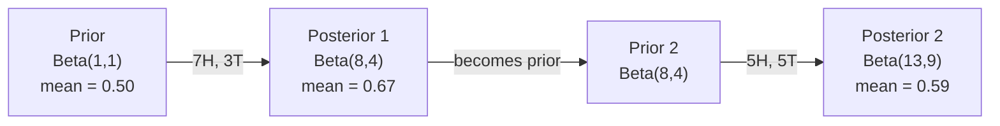

# Probability & Statistics

> Combined lessons (4 parts), merged verbatim — no content removed.

**Type:** Combined

---

## Part 1 (ch018): Probability and Distributions

> Probability is the language AI uses to express uncertainty.

**Type:** Learn
**Language:** Python
**Prerequisites:** Phase 1, Lessons 01-04
**Time:** ~75 minutes

## Learning Objectives

- Implement PMFs and PDFs from scratch for Bernoulli, categorical, Poisson, uniform, and normal distributions
- Compute expected value, variance, and use the Central Limit Theorem to explain why Gaussians dominate
- Build softmax and log-softmax functions with the numerical stability trick (subtract max logit)
- Calculate cross-entropy loss from logits and connect it to negative log-likelihood

## The Problem

A classifier outputs `[0.03, 0.91, 0.06]`. A language model picks the next word from 50,000 candidates. A diffusion model generates images by sampling from learned distributions. All of these are probability in action.

Every prediction a model makes is a probability distribution. Every loss function measures how far the predicted distribution is from the true one. Every training step adjusts parameters to make one distribution look more like another. Without probability, you cannot read a single ML paper, debug a single model, or understand why your training loss is NaN.

## The Concept

### Events, Sample Spaces, and Probability

The sample space S is the set of all possible outcomes. An event is a subset of the sample space. Probability maps events to numbers between 0 and 1.

```
Coin flip:
  S = {H, T}
  P(H) = 0.5,  P(T) = 0.5

Single die roll:
  S = {1, 2, 3, 4, 5, 6}
  P(even) = P({2, 4, 6}) = 3/6 = 0.5
```

Three axioms define all of probability:
1. P(A) >= 0 for any event A
2. P(S) = 1 (something always happens)
3. P(A or B) = P(A) + P(B) when A and B cannot both occur

Everything else (Bayes' theorem, expectations, distributions) follows from these three rules.

### Conditional Probability and Independence

P(A|B) is the probability of A given that B happened.

```
P(A|B) = P(A and B) / P(B)

Example: deck of cards
  P(King | Face card) = P(King and Face card) / P(Face card)
                      = (4/52) / (12/52)
                      = 4/12 = 1/3
```

Two events are independent when knowing one tells you nothing about the other:

```
Independent:   P(A|B) = P(A)
Equivalent to: P(A and B) = P(A) * P(B)
```

Coin flips are independent. Drawing cards without replacement is not.

### Probability Mass Functions vs Probability Density Functions

Discrete random variables have a probability mass function (PMF). Each outcome has a specific probability that you can read off directly.

```
PMF: P(X = k)

Fair die:
  P(X = 1) = 1/6
  P(X = 2) = 1/6
  ...
  P(X = 6) = 1/6

  Sum of all probabilities = 1
```

Continuous random variables have a probability density function (PDF). The density at a single point is not a probability. Probability comes from integrating the density over an interval.

```
PDF: f(x)

P(a <= X <= b) = integral of f(x) from a to b

f(x) can be greater than 1 (density, not probability)
integral from -inf to +inf of f(x) dx = 1
```

This distinction matters in ML. Classification outputs are PMFs (discrete choices). VAE latent spaces use PDFs (continuous).

### Common Distributions

**Bernoulli:** one trial, two outcomes. Models binary classification.

```
P(X = 1) = p
P(X = 0) = 1 - p
Mean = p,  Variance = p(1-p)
```

**Categorical:** one trial, k outcomes. Models multi-class classification (softmax output).

```
P(X = i) = p_i,  where sum of p_i = 1
Example: P(cat) = 0.7,  P(dog) = 0.2,  P(bird) = 0.1
```

**Uniform:** all outcomes equally likely. Used for random initialization.

```
Discrete: P(X = k) = 1/n for k in {1, ..., n}
Continuous: f(x) = 1/(b-a) for x in [a, b]
```

**Normal (Gaussian):** the bell curve. Parameterized by mean (mu) and variance (sigma^2).

```
f(x) = (1 / sqrt(2*pi*sigma^2)) * exp(-(x - mu)^2 / (2*sigma^2))

Standard normal: mu = 0, sigma = 1
  68% of data within 1 sigma
  95% within 2 sigma
  99.7% within 3 sigma
```

**Poisson:** counts of rare events in a fixed interval. Models event rates.

```
P(X = k) = (lambda^k * e^(-lambda)) / k!
Mean = lambda,  Variance = lambda
```

### Expected Value and Variance

Expected value is the weighted average outcome.

```
Discrete:   E[X] = sum of x_i * P(X = x_i)
Continuous: E[X] = integral of x * f(x) dx
```

Variance measures spread around the mean.

```
Var(X) = E[(X - E[X])^2] = E[X^2] - (E[X])^2
Standard deviation = sqrt(Var(X))
```

In ML, expected value appears as the loss function (average loss over the data distribution). Variance tells you about model stability. High variance in gradients means noisy training.

### Joint and Marginal Distributions

A joint distribution P(X, Y) describes two random variables together.

Joint PMF example (X = weather, Y = umbrella):

| | Y=0 (no umbrella) | Y=1 (umbrella) | Marginal P(X) |
|---|---|---|---|
| X=0 (sun) | 0.40 | 0.10 | P(X=0) = 0.50 |
| X=1 (rain) | 0.05 | 0.45 | P(X=1) = 0.50 |
| **Marginal P(Y)** | P(Y=0) = 0.45 | P(Y=1) = 0.55 | 1.00 |

The marginal distribution sums out the other variable:

```
P(X = x) = sum over all y of P(X = x, Y = y)
```

The row and column totals in the table above are the marginals.

### Why the Normal Distribution Shows Up Everywhere

The Central Limit Theorem: the sum (or average) of many independent random variables converges to a normal distribution, regardless of the original distribution.

```
Roll 1 die:  uniform distribution (flat)
Average of 2 dice:  triangular (peaked)
Average of 30 dice: nearly perfect bell curve

This works for ANY starting distribution.
```

This is why:
- Measurement errors are approximately normal (many small independent sources)
- Weight initializations in neural networks use normal distributions
- Gradient noise in SGD is approximately normal (sum of many sample gradients)
- The normal distribution is the maximum entropy distribution for a given mean and variance

### Log Probabilities

Raw probabilities cause numerical problems. Multiplying many small probabilities together quickly underflows to zero.

```
P(sentence) = P(word1) * P(word2) * ... * P(word_n)
            = 0.01 * 0.003 * 0.02 * ...
            -> 0.0 (underflow after ~30 terms)
```

Log probabilities fix this. Multiplications become additions.

```
log P(sentence) = log P(word1) + log P(word2) + ... + log P(word_n)
                = -4.6 + -5.8 + -3.9 + ...
                -> finite number (no underflow)
```

Rules:
- log(a * b) = log(a) + log(b)
- log probabilities are always <= 0 (since 0 < P <= 1)
- More negative = less likely
- Cross-entropy loss is the negative log probability of the correct class

### Softmax as a Probability Distribution

Neural networks output raw scores (logits). Softmax converts them into a valid probability distribution.

```
softmax(z_i) = exp(z_i) / sum(exp(z_j) for all j)

Properties:
  - All outputs are in (0, 1)
  - All outputs sum to 1
  - Preserves relative ordering of inputs
  - exp() amplifies differences between logits
```

The softmax trick: subtract the max logit before exponentiating to prevent overflow.

```
z = [100, 101, 102]
exp(102) = overflow

z_shifted = z - max(z) = [-2, -1, 0]
exp(0) = 1  (safe)

Same result, no overflow.
```

Log-softmax combines softmax and log for numerical stability. PyTorch uses this internally for cross-entropy loss.

### Sampling

Sampling means drawing random values from a distribution. In ML:
- Dropout randomly samples which neurons to zero out
- Data augmentation samples random transformations
- Language models sample the next token from the predicted distribution
- Diffusion models sample noise and progressively denoise

Sampling from arbitrary distributions requires techniques like inverse transform sampling, rejection sampling, or the reparameterization trick (used in VAEs).

## Build It

### Step 1: Probability basics

```python
import math
import random

def factorial(n):
    result = 1
    for i in range(2, n + 1):
        result *= i
    return result

def combinations(n, k):
    return factorial(n) // (factorial(k) * factorial(n - k))

def conditional_probability(p_a_and_b, p_b):
    return p_a_and_b / p_b

p_king_given_face = conditional_probability(4/52, 12/52)
print(f"P(King | Face card) = {p_king_given_face:.4f}")
```

### Step 2: PMF and PDF from scratch

```python
def bernoulli_pmf(k, p):
    return p if k == 1 else (1 - p)

def categorical_pmf(k, probs):
    return probs[k]

def poisson_pmf(k, lam):
    return (lam ** k) * math.exp(-lam) / factorial(k)

def uniform_pdf(x, a, b):
    if a <= x <= b:
        return 1.0 / (b - a)
    return 0.0

def normal_pdf(x, mu, sigma):
    coeff = 1.0 / (sigma * math.sqrt(2 * math.pi))
    exponent = -0.5 * ((x - mu) / sigma) ** 2
    return coeff * math.exp(exponent)
```

### Step 3: Expected value and variance

```python
def expected_value(values, probabilities):
    return sum(v * p for v, p in zip(values, probabilities))

def variance(values, probabilities):
    mu = expected_value(values, probabilities)
    return sum(p * (v - mu) ** 2 for v, p in zip(values, probabilities))

die_values = [1, 2, 3, 4, 5, 6]
die_probs = [1/6] * 6
mu = expected_value(die_values, die_probs)
var = variance(die_values, die_probs)
print(f"Die: E[X] = {mu:.4f}, Var(X) = {var:.4f}, SD = {var**0.5:.4f}")
```

### Step 4: Sampling from distributions

```python
def sample_bernoulli(p, n=1):
    return [1 if random.random() < p else 0 for _ in range(n)]

def sample_categorical(probs, n=1):
    cumulative = []
    total = 0
    for p in probs:
        total += p
        cumulative.append(total)
    samples = []
    for _ in range(n):
        r = random.random()
        for i, c in enumerate(cumulative):
            if r <= c:
                samples.append(i)
                break
    return samples

def sample_normal_box_muller(mu, sigma, n=1):
    samples = []
    for _ in range(n):
        u1 = random.random()
        u2 = random.random()
        z = math.sqrt(-2 * math.log(u1)) * math.cos(2 * math.pi * u2)
        samples.append(mu + sigma * z)
    return samples
```

### Step 5: Softmax and log probabilities

```python
def softmax(logits):
    max_logit = max(logits)
    shifted = [z - max_logit for z in logits]
    exps = [math.exp(z) for z in shifted]
    total = sum(exps)
    return [e / total for e in exps]

def log_softmax(logits):
    max_logit = max(logits)
    shifted = [z - max_logit for z in logits]
    log_sum_exp = max_logit + math.log(sum(math.exp(z) for z in shifted))
    return [z - log_sum_exp for z in logits]

def cross_entropy_loss(logits, target_index):
    log_probs = log_softmax(logits)
    return -log_probs[target_index]
```

### Step 6: Central Limit Theorem demonstration

```python
def demonstrate_clt(dist_fn, n_samples, n_averages):
    averages = []
    for _ in range(n_averages):
        samples = [dist_fn() for _ in range(n_samples)]
        averages.append(sum(samples) / len(samples))
    return averages
```

### Step 7: Visualization

```python
import matplotlib.pyplot as plt

xs = [mu + sigma * (i - 500) / 100 for i in range(1001)]
ys = [normal_pdf(x, mu, sigma) for x, mu, sigma in ...]
plt.plot(xs, ys)
```

Full implementations with all visualizations are in `code/probability.py`.

## Use It

With NumPy and SciPy, everything above is one-liners:

```python
import numpy as np
from scipy import stats

normal = stats.norm(loc=0, scale=1)
samples = normal.rvs(size=10000)
print(f"Mean: {np.mean(samples):.4f}, Std: {np.std(samples):.4f}")
print(f"P(X < 1.96) = {normal.cdf(1.96):.4f}")

logits = np.array([2.0, 1.0, 0.1])
from scipy.special import softmax, log_softmax
probs = softmax(logits)
log_probs = log_softmax(logits)
print(f"Softmax: {probs}")
print(f"Log-softmax: {log_probs}")
```

You built these from scratch. Now you know what the library calls are doing.

## Exercises

1. Implement inverse transform sampling for the exponential distribution. Verify by sampling 10,000 values and comparing the histogram to the true PDF.

2. Build a joint distribution table for two loaded dice. Compute the marginal distributions and check whether the dice are independent.

3. Compute the cross-entropy loss for a 5-class classifier that outputs logits `[2.0, 0.5, -1.0, 3.0, 0.1]` when the correct class is index 3. Then verify your answer with PyTorch's `nn.CrossEntropyLoss`.

4. Write a function that takes a list of log probabilities and returns the most likely sequence, the total log probability, and the equivalent raw probability. Test it with a sentence of 50 words where each word has probability 0.01.

## Key Terms

| Term | What people say | What it actually means |
|------|----------------|----------------------|
| Sample space | "All the possibilities" | The set S of every possible outcome of an experiment |
| PMF | "The probability function" | A function that gives the exact probability of each discrete outcome, summing to 1 |
| PDF | "The probability curve" | A density function for continuous variables. Integrate it over an interval to get probability |
| Conditional probability | "Probability given something" | P(A\|B) = P(A and B) / P(B). The foundation of Bayesian thinking and Bayes' theorem |
| Independence | "They don't affect each other" | P(A and B) = P(A) * P(B). Knowing one event tells you nothing about the other |
| Expected value | "The average" | The probability-weighted sum of all outcomes. The loss function is an expected value |
| Variance | "How spread out" | The expected squared deviation from the mean. High variance = noisy, unstable estimates |
| Normal distribution | "The bell curve" | f(x) = (1/sqrt(2*pi*sigma^2)) * exp(-(x-mu)^2/(2*sigma^2)). Appears everywhere due to the CLT |
| Central Limit Theorem | "Averages become normal" | The mean of many independent samples converges to a normal distribution regardless of the source |
| Joint distribution | "Two variables together" | P(X, Y) describes the probability of every combination of X and Y outcomes |
| Marginal distribution | "Sum out the other variable" | P(X) = sum_y P(X, Y). Recovers one variable's distribution from the joint |
| Log probability | "Log of the probability" | log P(x). Turns products into sums, preventing numerical underflow in long sequences |
| Softmax | "Turn scores into probabilities" | softmax(z_i) = exp(z_i) / sum(exp(z_j)). Maps real-valued logits to a valid probability distribution |
| Cross-entropy | "The loss function" | -sum(p_true * log(p_predicted)). Measures how different two distributions are. Lower is better |
| Logits | "Raw model outputs" | Unnormalized scores before softmax. Named after the logistic function |
| Sampling | "Drawing random values" | Generating values according to a probability distribution. How models generate output |

## Further Reading

- [3Blue1Brown: But what is the Central Limit Theorem?](https://www.youtube.com/watch?v=zeJD6dqJ5lo) - visual proof of why averages become normal
- [Stanford CS229 Probability Review](https://cs229.stanford.edu/section/cs229-prob.pdf) - concise reference covering everything here and more
- [The Log-Sum-Exp Trick](https://gregorygundersen.com/blog/2020/02/09/log-sum-exp/) - why numerical stability matters and how to achieve it

[Reference](https://github.com/rohitg00/ai-engineering-from-scratch/tree/main/phases/01-math-foundations/06-probability-and-distributions)

---

## Part 2 (ch019): Bayes' Theorem

> Probability is about what you expect. Bayes' theorem is about what you learn.

**Type:** Build
**Language:** Python
**Prerequisites:** Phase 1, Lesson 06 (Probability Fundamentals)
**Time:** ~75 minutes

## Learning Objectives

- Apply Bayes' theorem to compute posterior probabilities from priors, likelihoods, and evidence
- Build a Naive Bayes text classifier from scratch with Laplace smoothing and log-space computation
- Compare MLE and MAP estimation and explain how MAP corresponds to L2 regularization
- Implement sequential Bayesian updating using Beta-Binomial conjugate priors for A/B testing

## The Problem

A medical test is 99% accurate. You test positive. What are the chances you actually have the disease?

Most people say 99%. The real answer depends on how rare the disease is. If 1 in 10,000 people have it, a positive result only gives you about a 1% chance of being sick. The other 99% of positive results are false alarms from healthy people.

This is not a trick question. It is Bayes' theorem. Every spam filter, every medical diagnostic, every machine learning model that quantifies uncertainty uses this exact reasoning. You start with a belief. You see evidence. You update.

If you build ML systems without understanding this, you will misinterpret model outputs, set bad thresholds, and ship overconfident predictions.

## The Concept

### From joint probability to Bayes

You already know from Lesson 06 that conditional probability is:

```
P(A|B) = P(A and B) / P(B)
```

And symmetrically:

```
P(B|A) = P(A and B) / P(A)
```

Both expressions share the same numerator: P(A and B). Set them equal and rearrange:

```
P(A and B) = P(A|B) * P(B) = P(B|A) * P(A)

Therefore:

P(A|B) = P(B|A) * P(A) / P(B)
```

That is Bayes' theorem. Four quantities, one equation.

### The four parts

| Part | Name | What it means |
|------|------|---------------|
| P(A\|B) | Posterior | Your updated belief about A after seeing evidence B |
| P(B\|A) | Likelihood | How probable the evidence B is if A is true |
| P(A) | Prior | Your belief about A before seeing any evidence |
| P(B) | Evidence | Total probability of seeing B under all possibilities |

The evidence term P(B) acts as a normalizer. You can expand it using the law of total probability:

```
P(B) = P(B|A) * P(A) + P(B|not A) * P(not A)
```

### Medical test example

A disease affects 1 in 10,000 people. The test is 99% accurate (catches 99% of sick people, gives false positives 1% of the time).

```
P(sick)          = 0.0001     (prior: disease is rare)
P(positive|sick) = 0.99       (likelihood: test catches it)
P(positive|healthy) = 0.01    (false positive rate)

P(positive) = P(positive|sick) * P(sick) + P(positive|healthy) * P(healthy)
            = 0.99 * 0.0001 + 0.01 * 0.9999
            = 0.000099 + 0.009999
            = 0.010098

P(sick|positive) = P(positive|sick) * P(sick) / P(positive)
                 = 0.99 * 0.0001 / 0.010098
                 = 0.0098
                 = 0.98%
```

Less than 1%. The prior dominates. When a condition is rare, even accurate tests produce mostly false positives. This is why doctors order confirmation tests.

### Spam filter example

You receive an email containing the word "lottery". Is it spam?

```
P(spam)                = 0.3      (30% of email is spam)
P("lottery"|spam)      = 0.05     (5% of spam emails contain "lottery")
P("lottery"|not spam)  = 0.001    (0.1% of legitimate emails contain "lottery")

P("lottery") = 0.05 * 0.3 + 0.001 * 0.7
             = 0.015 + 0.0007
             = 0.0157

P(spam|"lottery") = 0.05 * 0.3 / 0.0157
                  = 0.955
                  = 95.5%
```

One word shifts the probability from 30% to 95.5%. A real spam filter applies Bayes across hundreds of words simultaneously.

### Naive Bayes: independence assumption

Naive Bayes extends this to multiple features by assuming all features are conditionally independent given the class:

```
P(class | feature_1, feature_2, ..., feature_n)
  = P(class) * P(feature_1|class) * P(feature_2|class) * ... * P(feature_n|class)
    / P(feature_1, feature_2, ..., feature_n)
```

The "naive" part is the independence assumption. In text, word occurrences are not independent ("New" and "York" are correlated). But the assumption works surprisingly well in practice because the classifier only needs to rank classes, not produce calibrated probabilities.

Since the denominator is the same for all classes, you can skip it and just compare numerators:

```
score(class) = P(class) * product of P(feature_i | class)
```

Pick the class with the highest score.

### Maximum likelihood estimation (MLE)

How do you get P(feature|class) from training data? Count.

```
P("free"|spam) = (number of spam emails containing "free") / (total spam emails)
```

This is MLE: choose the parameter values that make the observed data most likely. You are maximizing the likelihood function, which for discrete counts reduces to relative frequency.

Problem: if a word never appears in spam during training, MLE gives it probability zero. One unseen word kills the entire product. Fix this with Laplace smoothing:

```
P(word|class) = (count(word, class) + 1) / (total_words_in_class + vocabulary_size)
```

Adding 1 to every count ensures no probability is ever zero.

### Maximum a posteriori (MAP)

MLE asks: what parameters maximize P(data|parameters)?

MAP asks: what parameters maximize P(parameters|data)?

By Bayes' theorem:

```
P(parameters|data) proportional to P(data|parameters) * P(parameters)
```

MAP adds a prior over the parameters themselves. If you believe parameters should be small, you encode that as a prior that penalizes large values. This is identical to L2 regularization in ML. The "ridge" penalty in ridge regression is literally a Gaussian prior on the weights.

| Estimation | Optimizes | ML equivalent |
|------------|-----------|---------------|
| MLE | P(data\|params) | Unregularized training |
| MAP | P(data\|params) * P(params) | L2 / L1 regularization |

### Bayesian vs frequentist: the practical difference

Frequentists treat parameters as fixed unknowns. They ask: "If I repeated this experiment many times, what would happen?"

Bayesians treat parameters as distributions. They ask: "Given what I have observed, what do I believe about the parameters?"

For building ML systems, the practical difference:

| Aspect | Frequentist | Bayesian |
|--------|-------------|----------|
| Output | Point estimate | Distribution over values |
| Uncertainty | Confidence intervals (about procedure) | Credible intervals (about parameter) |
| Small data | Can overfit | Prior acts as regularization |
| Computation | Usually faster | Often requires sampling (MCMC) |

Most production ML is frequentist (SGD, point estimates). Bayesian methods shine when you need calibrated uncertainty (medical decisions, safety-critical systems) or when data is scarce (few-shot learning, cold start).

### Why Bayesian thinking matters for ML

The connection is deeper than analogy:

**Priors are regularization.** A Gaussian prior on weights is L2 regularization. A Laplace prior is L1. Every time you add a regularization term, you are making a Bayesian statement about what parameter values you expect.

**Posteriors are uncertainty.** A single predicted probability tells you nothing about how confident the model is in that estimate. Bayesian methods give you a distribution: "I think P(spam) is between 0.8 and 0.95."

**Bayes updates are online learning.** Today's posterior becomes tomorrow's prior. When your model sees new data, it updates its beliefs incrementally instead of retraining from scratch.

**Model comparison is Bayesian.** Bayesian information criterion (BIC), marginal likelihood, and Bayes factors all use Bayesian reasoning to choose between models without overfitting.

## Build It

### Step 1: Bayes theorem function

```python
def bayes(prior, likelihood, false_positive_rate):
    evidence = likelihood * prior + false_positive_rate * (1 - prior)
    posterior = likelihood * prior / evidence
    return posterior

result = bayes(prior=0.0001, likelihood=0.99, false_positive_rate=0.01)
print(f"P(sick|positive) = {result:.4f}")
```

### Step 2: Naive Bayes classifier

```python
import math
from collections import defaultdict

class NaiveBayes:
    def __init__(self, smoothing=1.0):
        self.smoothing = smoothing
        self.class_counts = defaultdict(int)
        self.word_counts = defaultdict(lambda: defaultdict(int))
        self.class_word_totals = defaultdict(int)
        self.vocab = set()

    def train(self, documents, labels):
        for doc, label in zip(documents, labels):
            self.class_counts[label] += 1
            words = doc.lower().split()
            for word in words:
                self.word_counts[label][word] += 1
                self.class_word_totals[label] += 1
                self.vocab.add(word)

    def predict(self, document):
        words = document.lower().split()
        total_docs = sum(self.class_counts.values())
        vocab_size = len(self.vocab)
        best_class = None
        best_score = float("-inf")
        for cls in self.class_counts:
            score = math.log(self.class_counts[cls] / total_docs)
            for word in words:
                count = self.word_counts[cls].get(word, 0)
                total = self.class_word_totals[cls]
                score += math.log((count + self.smoothing) / (total + self.smoothing * vocab_size))
            if score > best_score:
                best_score = score
                best_class = cls
        return best_class
```

Log probabilities prevent underflow. Multiplying many small probabilities produces numbers too tiny for floating point. Summing log-probabilities is numerically stable and mathematically equivalent.

### Step 3: Train on spam data

```python
train_docs = [
    "win free money now",
    "free lottery ticket winner",
    "claim your prize today free",
    "urgent offer free cash",
    "congratulations you won free",
    "meeting tomorrow at noon",
    "project update attached",
    "can we schedule a call",
    "quarterly report review",
    "lunch on thursday sounds good",
    "team standup notes attached",
    "please review the pull request",
]

train_labels = [
    "spam", "spam", "spam", "spam", "spam",
    "ham", "ham", "ham", "ham", "ham", "ham", "ham",
]

classifier = NaiveBayes()
classifier.train(train_docs, train_labels)

test_messages = [
    "free money waiting for you",
    "meeting rescheduled to friday",
    "you won a free prize",
    "please review the attached report",
]

for msg in test_messages:
    print(f"  '{msg}' -> {classifier.predict(msg)}")
```

### Step 4: Inspect the learned probabilities

```python
def show_top_words(classifier, cls, n=5):
    vocab_size = len(classifier.vocab)
    total = classifier.class_word_totals[cls]
    probs = {}
    for word in classifier.vocab:
        count = classifier.word_counts[cls].get(word, 0)
        probs[word] = (count + classifier.smoothing) / (total + classifier.smoothing * vocab_size)
    sorted_words = sorted(probs.items(), key=lambda x: x[1], reverse=True)
    for word, prob in sorted_words[:n]:
        print(f"    {word}: {prob:.4f}")

print("\nTop spam words:")
show_top_words(classifier, "spam")
print("\nTop ham words:")
show_top_words(classifier, "ham")
```

## Use It

Scikit-learn ships production-ready naive Bayes implementations:

```python
from sklearn.feature_extraction.text import CountVectorizer
from sklearn.naive_bayes import MultinomialNB
from sklearn.metrics import classification_report

vectorizer = CountVectorizer()
X_train = vectorizer.fit_transform(train_docs)
clf = MultinomialNB()
clf.fit(X_train, train_labels)

X_test = vectorizer.transform(test_messages)
predictions = clf.predict(X_test)
for msg, pred in zip(test_messages, predictions):
    print(f"  '{msg}' -> {pred}")
```

Same algorithm. CountVectorizer handles tokenization and vocabulary building. MultinomialNB handles smoothing and log-probabilities internally. Your from-scratch version does the same thing in 40 lines.

## Ship It

The NaiveBayes class built here demonstrates the full pipeline: tokenization, probability estimation with Laplace smoothing, log-space prediction. The code in `code/bayes.py` runs end-to-end with no dependencies beyond Python's standard library.

### Conjugate Priors

When the prior and posterior belong to the same family of distributions, the prior is called "conjugate." This makes Bayesian updating algebraically clean -- you get a closed-form posterior without numerical integration.

| Likelihood | Conjugate Prior | Posterior | Example |
|-----------|----------------|-----------|---------|
| Bernoulli | Beta(a, b) | Beta(a + successes, b + failures) | Coin flip bias estimation |
| Normal (known variance) | Normal(mu_0, sigma_0) | Normal(weighted mean, smaller variance) | Sensor calibration |
| Poisson | Gamma(a, b) | Gamma(a + sum of counts, b + n) | Modeling arrival rates |
| Multinomial | Dirichlet(alpha) | Dirichlet(alpha + counts) | Topic modeling, language models |

Why this matters: without conjugate priors, you need Monte Carlo sampling or variational inference to approximate the posterior. With conjugate priors, you just update two numbers.

The Beta distribution is the most common conjugate prior in practice. Beta(a, b) represents your belief about a probability parameter. The mean is a/(a+b). The larger a+b, the more concentrated (confident) the distribution.

Special cases of the Beta prior:
- Beta(1, 1) = uniform. You have no opinion about the parameter.
- Beta(10, 10) = peaked at 0.5. You strongly believe the parameter is near 0.5.
- Beta(1, 10) = skewed toward 0. You believe the parameter is small.

The update rule is dead simple:

```
Prior:     Beta(a, b)
Data:      s successes, f failures
Posterior: Beta(a + s, b + f)
```

No integrals. No sampling. Just addition.

### Sequential Bayesian Updating

Bayesian inference is naturally sequential. Today's posterior becomes tomorrow's prior. This is how real systems learn incrementally without reprocessing all historical data.

Concrete example: estimating whether a coin is fair.

**Day 1: No data yet.**
Start with Beta(1, 1) -- a uniform prior. You have no opinion.
- Prior mean: 0.5
- Prior is flat across [0, 1]

**Day 2: Observe 7 heads, 3 tails.**
Posterior = Beta(1 + 7, 1 + 3) = Beta(8, 4)
- Posterior mean: 8/12 = 0.667
- Evidence suggests the coin is biased toward heads

**Day 3: Observe 5 more heads, 5 more tails.**
Use yesterday's posterior as today's prior.
Posterior = Beta(8 + 5, 4 + 5) = Beta(13, 9)
- Posterior mean: 13/22 = 0.591
- The balanced new data pulled the estimate back toward 0.5



The order of observations does not matter. Beta(1,1) updated with all 12 heads and 8 tails at once gives Beta(13, 9) -- the same result. Sequential updating and batch updating are mathematically equivalent. But sequential updating lets you make decisions at each step without storing raw data.

This is the foundation of online learning in production ML systems. Thompson sampling for bandits, incremental recommendation systems, and streaming anomaly detectors all use this pattern.

### Connection to A/B Testing

A/B testing is Bayesian inference in disguise.

Setup: you are testing two button colors. Variant A (blue) and variant B (green). You want to know which one gets more clicks.

The Bayesian A/B test:

1. **Prior.** Start with Beta(1, 1) for both variants. No prior preference.
2. **Data.** Variant A: 50 clicks out of 1000 views. Variant B: 65 clicks out of 1000 views.
3. **Posteriors.**
   - A: Beta(1 + 50, 1 + 950) = Beta(51, 951). Mean = 0.051
   - B: Beta(1 + 65, 1 + 935) = Beta(66, 936). Mean = 0.066
4. **Decision.** Compute P(B > A) -- the probability that B's true conversion rate is higher than A's.

Computing P(B > A) analytically is hard. But Monte Carlo makes it trivial:

```
1. Draw 100,000 samples from Beta(51, 951)  -> samples_A
2. Draw 100,000 samples from Beta(66, 936)  -> samples_B
3. P(B > A) = fraction of samples where B > A
```

If P(B > A) > 0.95, you ship variant B. If it is between 0.05 and 0.95, you keep collecting data. If P(B > A) < 0.05, you ship variant A.

Advantages over frequentist A/B testing:
- You get a direct probability statement: "there is a 97% chance B is better"
- No p-value confusion. No "fail to reject the null hypothesis" hedging.
- You can check results at any time without inflating false positive rates (no "peeking problem")
- You can incorporate prior knowledge (e.g., previous tests suggest conversion rates are usually 3-8%)

| Aspect | Frequentist A/B | Bayesian A/B |
|--------|----------------|--------------|
| Output | p-value | P(B > A) |
| Interpretation | "How surprising is this data if A=B?" | "How likely is B better than A?" |
| Early stopping | Inflates false positives | Safe at any point (given a well-chosen prior and correctly specified model) |
| Prior knowledge | Not used | Encoded as Beta prior |
| Decision rule | p < 0.05 | P(B > A) > threshold |

## Exercises

1. **Multiple tests.** A patient tests positive twice on independent tests (both 99% accurate, disease prevalence 1 in 10,000). What is P(sick) after both tests? Use the posterior from the first test as the prior for the second.

2. **Smoothing impact.** Run the spam classifier with smoothing values of 0.01, 0.1, 1.0, and 10.0. How do the top word probabilities change? What happens with smoothing=0 and a word that appears only in ham?

3. **Add features.** Extend the NaiveBayes class to also use message length (short/long) as a feature alongside word counts. Estimate P(short|spam) and P(short|ham) from the training data and fold it into the prediction score.

4. **MAP by hand.** Given observed data (7 heads in 10 coin flips), compute the MAP estimate of the bias using a Beta(2,2) prior. Compare it to the MLE estimate (7/10).

## Key Terms

| Term | What people say | What it actually means |
|------|----------------|----------------------|
| Prior | "My initial guess" | P(hypothesis) before observing evidence. In ML: the regularization term. |
| Likelihood | "How well the data fits" | P(evidence\|hypothesis). How probable the observed data is under a specific hypothesis. |
| Posterior | "My updated belief" | P(hypothesis\|evidence). The prior multiplied by the likelihood, then normalized. |
| Evidence | "The normalizing constant" | P(data) across all hypotheses. Ensures the posterior sums to 1. |
| Naive Bayes | "That simple text classifier" | A classifier that assumes features are independent given the class. Works well despite the false assumption. |
| Laplace smoothing | "Add-one smoothing" | Adding a small count to every feature to prevent zero probabilities from unseen data. |
| MLE | "Just use the frequencies" | Choose parameters that maximize P(data\|parameters). No prior. Can overfit with small data. |
| MAP | "MLE with a prior" | Choose parameters that maximize P(data\|parameters) * P(parameters). Equivalent to regularized MLE. |
| Log-probability | "Work in log space" | Using log(P) instead of P to avoid floating-point underflow when multiplying many small numbers. |
| False positive | "A wrong alarm" | The test says positive, but the true state is negative. Drives the base rate fallacy. |

## Further Reading

- [3Blue1Brown: Bayes' theorem](https://www.youtube.com/watch?v=HZGCoVF3YvM) - visual explanation with the medical test example
- [Stanford CS229: Generative Learning Algorithms](https://cs229.stanford.edu/notes2022fall/cs229-notes2.pdf) - naive Bayes and its connection to discriminative models
- [Think Bayes](https://greenteapress.com/wp/think-bayes/) - free book, Bayesian statistics with Python code
- [scikit-learn Naive Bayes](https://scikit-learn.org/stable/modules/naive_bayes.html) - production implementations and when to use each variant

[Reference](https://github.com/rohitg00/ai-engineering-from-scratch/tree/main/phases/01-math-foundations/07-bayes-theorem)

---

## Part 3 (ch027): Statistics for Machine Learning

> Probability is the logic of uncertainty. Statistics is the science of learning from data.

**Type:** Build  
**Languages:** Python  
**Prerequisites:** Phase 1, Lessons 01-04  
**Time:** ~120 minutes  

## Learning Objectives

- Compute mean, variance, standard deviation, covariance, and correlation from scratch
- Implement Bayes' theorem and interpret it as updating beliefs with evidence
- Apply maximum likelihood estimation (MLE) to estimate distribution parameters
- Describe the bias-variance tradeoff in intuitive and formal terms

## The Concept

### Random Variables: The Basic Setup

A random variable is a function that maps outcomes of a random process to numbers. `X: Omega -> R`.

- **Discrete random variable:** Takes values from a countable set (e.g., number of heads in 10 coin flips: 0, 1, 2, ..., 10)
- **Continuous random variable:** Takes values from an interval or continuum (e.g., height of a randomly selected person)

A random variable is described by its **probability distribution**, which tells you what values it can take and how likely each value is.

### Probability Distributions

**Probability Mass Function (PMF)** for discrete variables:

```
P(X = x) = probability that X equals x
```

Properties: `0 <= P(X = x) <= 1` for all x, and `sum over all x of P(X = x) = 1`.

**Probability Density Function (PDF)** for continuous variables:

```
f(x) = density at point x
P(a <= X <= b) = integral from a to b of f(x) dx
```

Properties: `f(x) >= 0`, and the total area under the curve is 1.

The PDF does not give probabilities directly (a continuous distribution assigns zero probability to any specific point). Only integrals over intervals give probabilities.

### Summary Statistics

**Mean (Expected Value):** The center of mass of the distribution.

```
Discrete: E[X] = sum(x * P(X = x))
Continuous: E[X] = integral(x * f(x) dx)
```

The mean minimizes the sum of squared deviations. It is the value that minimizes `E[(X - c)^2]` over all c.

**Variance:** Average squared deviation from the mean. Measures spread.

```
Var(X) = E[(X - mu)^2] = E[X^2] - E[X]^2
```

There are two formulas. The first is the definition. The second is computationally convenient but numerically unstable (see Lesson 13).

**Standard Deviation:** `sigma = sqrt(Var(X))`. Variance in the original units (dollars squared -> dollars).

**Covariance:** Measures how two variables vary together.

```
Cov(X, Y) = E[(X - mu_X)(Y - mu_Y)] = E[XY] - E[X]E[Y]
```

- Covariance positive: when X is above its mean, Y tends to be above its mean
- Covariance negative: when X is above its mean, Y tends to be below its mean
- Covariance zero: no linear relationship (but could have nonlinear relationship)

**Correlation (Pearson's r):** Normalized covariance, always between -1 and 1.

```
Corr(X, Y) = Cov(X, Y) / (sigma_X * sigma_Y)
```

- `r = 1`: perfect positive linear relationship
- `r = -1`: perfect negative linear relationship
- `r = 0`: no linear relationship

Correlation is scale-invariant. Multiply X by 1000 and correlation does not change. Covariance would change by a factor of 1000.

### The Normal (Gaussian) Distribution

The most important distribution in statistics and ML.

```
PDF: f(x | mu, sigma^2) = (1 / sqrt(2 * pi * sigma^2)) * exp(-(x - mu)^2 / (2 * sigma^2))
```

Parameters:
- `mu` (mean): center of the bell curve
- `sigma^2` (variance): width of the bell curve

The normal distribution emerges from the Central Limit Theorem: the sum of many independent random variables (with finite variance) is approximately normal, regardless of their individual distributions.

68-95-99.7 rule:
| Interval | Contains |
|-----------|----------|
| mu +/- 1 sigma | ~68% of data |
| mu +/- 2 sigma | ~95% of data |
| mu +/- 3 sigma | ~99.7% of data |

### Bayes' Theorem

The foundation of Bayesian reasoning and Bayesian ML:

```
P(A | B) = P(B | A) * P(A) / P(B)
```

- `P(A)`: prior probability (what you believe before seeing evidence)
- `P(B | A)`: likelihood (probability of seeing evidence if A is true)
- `P(A | B)`: posterior probability (updated belief after seeing evidence)
- `P(B)`: evidence (normalizing constant, total probability of B)

Bayes' theorem tells you how to update beliefs in light of new data. It is the mathematical formalization of learning.

Example: Medical test.

```
Disease prevalence: 1% (prior)
Test sensitivity: 99% (true positive rate)
Test false positive: 5%
If you test positive, what is the probability you have the disease?
```

```
P(D | T+) = P(T+ | D) * P(D) / P(T+)
= 0.99 * 0.01 / (0.99 * 0.01 + 0.05 * 0.99)
= 0.0099 / 0.0594
= 0.1667
```

A 99% accurate test gives only 16.7% posterior probability because the disease is rare. This is why Bayes' theorem is essential: it corrects for base rates.

### Maximum Likelihood Estimation (MLE)

MLE finds the parameter values that make the observed data most probable.

Given data `x_1, x_2, ..., x_n` assumed to come from a distribution with parameters `theta`, the likelihood is:

```
L(theta) = product from i=1 to n of f(x_i | theta)
```

MLE finds `theta` that maximizes `L(theta)`. Equivalently (and more practically), maximizes the log-likelihood:

```
LL(theta) = sum from i=1 to n of log(f(x_i | theta))
```

The log transforms the product into a sum, making optimization easier and more numerically stable.

**MLE for Gaussian mean:**

```
mu_hat = (1/n) * sum(x_i)  (the sample mean)
```

**MLE for Gaussian variance (biased):**

```
sigma_hat^2 = (1/n) * sum((x_i - mu_hat)^2)
```

This is the biased variance estimator (divides by n, not n-1). Unbiased uses n-1. For large n, the difference is negligible.

**MLE for Bernoulli:**

```
p_hat = (number of successes) / (total trials)
```

**MLE for Poisson:**

```
lambda_hat = (1/n) * sum(x_i)  (the sample mean)
```

### Sampling Distributions

A statistic (like the sample mean) is itself a random variable. Its distribution is called the sampling distribution.

**Standard error:** Standard deviation of the sampling distribution of a statistic.

```
SE(x_bar) = sigma / sqrt(n)
```

The standard error tells you how precisely you have estimated the mean. Double the sample size -> standard error drops by sqrt(2).

**Confidence interval:** Range within which the true parameter is likely to fall.

95% CI for the mean: `x_bar +/- 1.96 * SE(x_bar)`

Interpretation: if you repeated the experiment many times, 95% of the confidence intervals would contain the true mean.

### Hypothesis Testing

The null hypothesis significance testing framework:

1. State the null hypothesis H0 (typically "no effect" or "no difference")
2. Compute a test statistic from the data
3. Calculate the p-value: probability of observing data as extreme as what you saw, assuming H0 is true
4. If p-value < threshold (typically 0.05), reject H0

**p-value misinterpretation warning:** The p-value is NOT the probability that H0 is true. It is the probability of the data given H0, not the probability of H0 given the data. Bayesian statistics fixes this, but frequentist methods dominate in practice.

### Bias-Variance Tradeoff

The fundamental tension in supervised learning.

For an estimator `theta_hat` of a true parameter `theta`:

```
MSE(theta_hat) = E[(theta_hat - theta)^2]
= Var(theta_hat) + (Bias(theta_hat))^2
```

- **Bias:** `E[theta_hat] - theta`. How far off the estimate is on average.
- **Variance:** `Var(theta_hat)`. How much the estimate varies across different data samples.
- **MSE:** Mean squared error, the sum of bias squared and variance.

In machine learning:
- High bias = underfitting (model is too simple)
- High variance = overfitting (model is too complex)
- The optimal model balances bias and variance to minimize test error

Simple models (linear regression) have high bias but low variance. Complex models (deep neural networks with sufficient data) have low bias but high variance. Regularization increases bias to reduce variance, lowering overall test error.

## Build It

### Step 1: Summary statistics from scratch

```python
import math

def mean(values):
    return sum(values) / len(values)

def variance(values, ddof=0):
    mu = mean(values)
    return sum((v - mu) ** 2 for v in values) / (len(values) - ddof)

def std(values, ddof=0):
    return math.sqrt(variance(values, ddof))

def covariance(x, y, ddof=0):
    mx, my = mean(x), mean(y)
    N = len(x)
    return sum((a - mx) * (b - my) for a, b in zip(x, y)) / (N - ddof)

def correlation(x, y):
    return covariance(x, y) / (std(x) * std(y))
```

### Step 2: Gaussian PDF

```python
def gaussian_pdf(x, mu=0, sigma=1):
    return (1 / math.sqrt(2 * math.pi * sigma ** 2)) * \
           math.exp(-(x - mu) ** 2 / (2 * sigma ** 2))
```

### Step 3: MLE for Gaussian

```python
def mle_gaussian(data):
    return mean(data), variance(data, ddof=0)

def log_likelihood_gaussian(data, mu, sigma):
    n = len(data)
    return (-n / 2) * math.log(2 * math.pi * sigma ** 2) - \
           (1 / (2 * sigma ** 2)) * sum((x - mu) ** 2 for x in data)
```

## Use It

The all implementations from `code/statistics.py` include complete functions:

```python
import math
import random

def mean(values):
    return sum(values) / len(values)

def median(values):
    s = sorted(values)
    n = len(s)
    mid = n // 2
    if n % 2 == 0:
        return (s[mid - 1] + s[mid]) / 2
    return s[mid]

def mode(values):
    return max(set(values), key=values.count)

def variance(values, ddof=0):
    mu = mean(values)
    return sum((v - mu) ** 2 for v in values) / (len(values) - ddof)

def std(values, ddof=0):
    return math.sqrt(variance(values, ddof))

def covariance(x, y, ddof=0):
    mx, my = mean(x), mean(y)
    N = len(x)
    return sum((a - mx) * (b - my) for a, b in zip(x, y)) / (N - ddof)

def correlation(x, y):
    return covariance(x, y) / (std(x) * std(y))

def zscore(value, mu, sigma):
    return (value - mu) / sigma

def normalize(values):
    mu = mean(values)
    s = std(values)
    return [(v - mu) / s for v in values]

def gaussian_pdf(x, mu=0, sigma=1):
    return (1 / math.sqrt(2 * math.pi * sigma ** 2)) * \
           math.exp(-(x - mu) ** 2 / (2 * sigma ** 2))

def gaussian_log_pdf(x, mu=0, sigma=1):
    return -0.5 * math.log(2 * math.pi * sigma ** 2) - \
           (x - mu) ** 2 / (2 * sigma ** 2)

def mle_gaussian(data):
    return mean(data), variance(data, ddof=0)

def log_likelihood_gaussian(data, mu, sigma):
    n = len(data)
    return (-n / 2) * math.log(2 * math.pi * sigma ** 2) - \
           (1 / (2 * sigma ** 2)) * sum((x - mu) ** 2 for x in data)

def mle_bernoulli(trials):
    successes = sum(trials)
    total = len(trials)
    return successes / total

def likelihood_bernoulli(trials, p):
    successes = sum(trials)
    failures = len(trials) - successes
    return (p ** successes) * ((1 - p) ** failures)

def log_likelihood_bernoulli(trials, p):
    successes = sum(trials)
    failures = len(trials) - successes
    return successes * math.log(p) + failures * math.log(1 - p)

def bayes_posterior(prior, likelihood, evidence):
    return (likelihood * prior) / evidence

def standard_error(sigma, n):
    return sigma / math.sqrt(n)

def confidence_interval_mean(mu, se, z=1.96):
    return (mu - z * se, mu + z * se)

def empirical_rule(mu, sigma):
    return {
        '1sigma': (mu - sigma, mu + sigma),
        '2sigma': (mu - 2 * sigma, mu + 2 * sigma),
        '3sigma': (mu - 3 * sigma, mu + 3 * sigma),
    }

def bias(estimates, true_value):
    return mean(estimates) - true_value

def variance_of_estimator(estimates):
    return variance(estimates, ddof=0)

def mse(estimates, true_value):
    return sum((e - true_value) ** 2 for e in estimates) / len(estimates)
```

## Ship It

This lesson produces `code/statistics.py` with all summary statistics, distribution functions, MLE estimators, and Bayesian update utilities. These are used in Phase 3 for evaluating model performance, Phase 4 for attention variance analysis, and throughout the curriculum for data analysis.

## Exercises

1. **MLE comparison.** Generate 1000 samples from a Gaussian with mu=5, sigma=2. Estimate mu and sigma using MLE. Repeat 1000 times to get the sampling distribution of the MLE estimates. Does the MLE for sigma systematically underestimate the true sigma (bias)?

2. **Bayesian updating.** You have a coin with unknown bias p. Start with a uniform prior (Beta(1,1)). Flip the coin 10 times and get 7 heads. Use Bayes' theorem to compute the posterior distribution of p. How does the posterior change if you use a Beta(2,5) prior instead?

3. **Confidence interval coverage.** Generate 1000 datasets of size n=30 from N(0,1). For each dataset, compute the 95% confidence interval for the mean. What fraction of intervals contains the true mean (0)? How does this change if the data comes from a uniform instead of a normal distribution?

4. **Bias-variance decomposition.** For an estimator of the variance: compute the true variance from data generated with known sigma. Then compute the average bias of the MLE variance estimator (divides by n) and the unbiased estimator (divides by n-1) over 10000 trials. Which has lower MSE?

## Key Terms

| Term | What people say | What it actually means |
|------|----------------|----------------------|
| Expected value | "Average" | Weighted average of all possible values, weighted by their probabilities. The center of mass of the distribution. |
| Variance | "Spread" | Average squared deviation from the mean. Measures how spread out the distribution is. |
| Standard deviation | "Spread in original units" | Square root of variance. Same units as the original data. |
| Covariance | "How two variables co-vary" | Average product of deviations from means. Positive: move together. Negative: move oppositely. |
| Correlation | "Normalized covariance" | Covariance divided by product of standard deviations. Always between -1 and 1. |
| Normal distribution | "Bell curve" | The limiting distribution of sums of independent random variables. Defined by mean and variance. |
| MLE | "Maximum likelihood" | Find the parameter values that make the observed data most probable. |
| Bayes' theorem | "Update beliefs with data" | P(A|B) = P(B|A)*P(A)/P(B). The mathematical foundation of learning from evidence. |
| Posterior | "Updated belief" | Probability distribution over parameters after seeing data. |
| Prior | "Initial belief" | Probability distribution over parameters before seeing data. |
| Likelihood | "Probability of data" | Probability of observing the data given specific parameter values. |
| p-value | "Significance" | Probability of seeing data as extreme as observed, assuming null is true. NOT the probability the null is true. |
| Bias | "Systematic error" | Difference between average estimate and true value. High bias = underfitting. |
| Variance (of estimator) | "Estimate instability" | How much the estimate varies across different datasets. High variance = overfitting. |
| Bias-variance tradeoff | "Underfitting vs overfitting" | The decomposition of MSE into bias^2 + variance. Optimal model balances both. |

[Reference](https://github.com/rohitg00/ai-engineering-from-scratch/tree/main/phases/01-math-foundations/15-statistics-for-ml)

---

## Part 4 (ch028): Sampling Methods

> If you cannot compute the integral, sample from it.

**Type:** Build  
**Languages:** Python  
**Prerequisites:** Phase 1, Lessons 01-04, 07, 15  
**Time:** ~120 minutes  

## Learning Objectives

- Implement inverse transform sampling, rejection sampling, and importance sampling
- Compare sampling efficiency (acceptance rate, effective sample size) across methods
- Compute Monte Carlo estimates and confidence intervals for integrals
- Use sampling to estimate expectations when direct computation is intractable

## The Concept

### Why Sample?

Many quantities in ML are expectations over high-dimensional distributions that cannot be computed analytically:

```
E[f(x)] = integral of f(x) * p(x) dx
```

When p(x) is a neural network's posterior, a latent variable model's prior, or a Bayesian model, this integral is intractable. Sampling provides a way to approximate it.

The core idea: instead of computing the integral analytically, draw samples `x_1, x_2, ..., x_N` from `p(x)` and approximate:

```
E[f(x)] ≈ (1/N) * sum from i=1 to N of f(x_i)
```

This is the Monte Carlo estimate. It is unbiased (the estimate equals the true expectation on average) and its variance decreases as `1/N`. To halve the error, quadruple the number of samples.

### The Law of Large Numbers

The Monte Carlo estimate works because of the Law of Large Numbers: as the number of samples increases, the sample average converges to the true expectation.

`(1/N) * sum(f(x_i)) -> E[f(x)]` as `N -> inf`

This is why you need many samples. With too few, the estimate can be far off. The convergence rate is `O(1/sqrt(N))`, which is slow. Getting one more decimal of accuracy requires 100x more samples.

### The Central Limit Theorem and Monte Carlo Error

The CLT tells us the distribution of the Monte Carlo estimate:

```
sqrt(N) * (estimate - true_value) -> N(0, Var[f(x)])
```

This allows us to compute confidence intervals:

```
True value ≈ estimate +/- 1.96 * sqrt(Var[f(x)] / N)
```

The standard error of the estimate is `sigma_f / sqrt(N)`, where `sigma_f` is the standard deviation of `f(x)`. To compute a valid confidence interval, you need to know (or estimate) `sigma_f`.

### Inverse Transform Sampling

The simplest method: if you can compute the inverse of the CDF, you can sample from any distribution.

```
1. Sample u from Uniform(0, 1)
2. Return x = CDF^(-1)(u)
```

Why it works: if `U` is Uniform(0,1) and `F` is a CDF, then `F^(-1)(U)` has CDF `F`.

This requires:
1. The CDF `F(x)` can be computed (integral of PDF)
2. The inverse CDF `F^(-1)(u)` can be computed analytically or numerically

Examples:
- Exponential: `CDF(x) = 1 - exp(-lambda*x)`, `CDF^(-1)(u) = -log(1-u) / lambda`
- Cauchy: `CDF^(-1)(u) = tan(pi*(u-0.5))`
- Normal: No closed form inverse CDF, but `scipy.stats.norm.ppf` implements it numerically

**Limitation:** For most distributions in ML, the CDF and its inverse are intractable (high-dimensional, complex posterior distributions).

### Rejection Sampling

When you cannot sample directly from `p(x)` (the target distribution), but you can evaluate `p(x)` (up to a normalizing constant), and there is a proposal distribution `q(x)` from which you can sample.

```
1. Sample x from q(x)
2. Sample u from Uniform(0, M * q(x))
3. If u < p(x), accept x. Otherwise, reject and go to step 1.
```

Here `M` is a constant such that `p(x) <= M * q(x)` for all `x`. The envelope `M*q(x)` must dominate the target `p(x)` everywhere.

The acceptance rate is `1/M`. If `M` is large, most samples are rejected and the method is inefficient. The key is finding a good proposal `q` with a tight envelope.

**Why it works:** The algorithm accepts points uniformly under the envelope. The accepted points have distribution proportional to the target density. The rejected points fall in the gap between the target and the envelope.

**The kiss of death:** In high dimensions, the acceptance rate drops exponentially. For a 100-dimensional target, rejection sampling is essentially unusable. This is why MCMC exists.

### Importance Sampling

Rejection sampling gives you exact samples from `p(x)`, but many may be rejected. Importance sampling does not sample from `p(x)` directly. Instead, it corrects samples from `q(x)` by reweighting them.

```
E[f(x)] = integral of f(x) * p(x) dx
= integral of f(x) * (p(x) / q(x)) * q(x) dx
= integral of f(x) * w(x) * q(x) dx
≈ (1/N) * sum from i=1 to N of f(x_i) * w(x_i)
```

where `w(x) = p(x) / q(x)` is the importance weight, and `x_i` are samples from `q(x)`.

The estimate is unbiased if `q(x) > 0` wherever `p(x) > 0` (the support condition). The variance depends on how well `q` matches `p`, weighted by `f`.

**Self-normalized importance sampling:** If `p(x)` is only known up to a normalizing constant (very common in Bayesian ML), use:

```
E[f(x)] ≈ sum(w_i * f(x_i)) / sum(w_i)
```

where `w_i = p_unnormalized(x_i) / q(x_i)`. This introduces some bias but converges to the correct value as N increases.

**Effective Sample Size (ESS):** Measures how many independent samples from `p(x)` the weighted importance sample is equivalent to.

```
ESS = (sum(w_i))^2 / sum(w_i^2)
```

If all weights are equal, `ESS = N`. If one weight dominates, `ESS ≈ 1`. Low ESS means high variance in the estimate.

**The variance problem:** Importance sampling can have infinite variance if `p/q` has heavy tails. If the proposal has thinner tails than the target, a single sample with a huge weight can dominate the estimate. Always verify that the importance weights have finite variance.

### Markov Chain Monte Carlo (MCMC)

When every other method fails (which is most of the time in high dimensions), use MCMC. MCMC constructs a Markov chain whose stationary distribution is the target `p(x)`. After a "burn-in" period, the chain's samples come from approximately `p(x)`.

**Metropolis-Hastings:**

```
1. Start at x_0
2. For t = 1, ..., T:
   a. Propose x' from q(x' | x_t)
   b. Compute acceptance ratio:
      alpha = min(1, p(x') * q(x_t | x') / (p(x_t) * q(x' | x_t)))
   c. With probability alpha, accept: x_{t+1} = x'
      Otherwise, reject: x_{t+1} = x_t
```

The proposal distribution `q` can be anything (a Gaussian centered at current point is a common choice). The chain is guaranteed to converge to `p(x)` as `t -> inf`, regardless of `q`.

**Properties:**
- Samples are correlated (neighbors in the chain are nearby in space). This reduces effective sample size below N.
- There is burn-in: initial samples are biased because the chain has not converged. Discard them.
- The acceptance rate should be ~23% for optimal mixing in high dimensions (theoretical result).
- **Thinning:** keeping only every k-th sample reduces correlation at the cost of discarding information.

**Gibbs sampling:** A special case of Metropolis-Hastings where you sample each variable conditioned on all others. The acceptance ratio is always 1, so every proposal is accepted. This is much more efficient but requires being able to sample from conditional distributions.

### Hamiltonian Monte Carlo (HMC)

Standard Metropolis-Hastings with a Gaussian proposal is essentially a random walk. It explores slowly in high dimensions because the number of steps to reach an independent sample grows with dimension.

HMC uses gradient information to propose distant points with high acceptance probability. It augments the parameter space with momentum variables and simulates Hamiltonian dynamics:

```
1. Sample momentum p ~ N(0, M)
2. Simulate (position, momentum) = (x, p) for L steps using leapfrog integration
3. Accept/reject the final state using Metropolis-Hastings
```

The leapfrog steps:

```
p(t + epsilon/2) = p(t) - epsilon/2 * grad_U(x(t))
x(t + epsilon) = x(t) + epsilon * p(t + epsilon/2) / M
p(t + epsilon) = p(t + epsilon/2) - epsilon/2 * grad_U(x(t + epsilon))
```

where `U(x) = -log p(x)` is the potential energy.

**Why HMC wins:** In high dimensions, the proposal moves along energy contours instead of randomly walking. The effective sample size per gradient evaluation is much higher than random-walk Metropolis. HMC (and its variant, the No-U-Turn Sampler) is the default inference method in probabilistic programming languages like Stan and Pyro.

### Bootstrapping

A non-parametric resampling method: given data `x_1, ..., x_n`, repeatedly sample WITH replacement from the data, compute the statistic of interest on each resample, and use the distribution of these bootstrap statistics to infer uncertainty.

```
1. For b = 1, ..., B:
   a. Draw n samples with replacement from the data (bootstrap sample)
   b. Compute the statistic on this bootstrap sample
2. Use the B bootstrap statistics to estimate:
   - Standard error (standard deviation of bootstrap statistics)
   - Confidence intervals (percentiles of bootstrap statistics)
```

Bootstrap confidence intervals (percentile method):

```
95% CI: [2.5th percentile, 97.5th percentile] of bootstrap statistics
```

The bootstrap requires no parametric assumptions. It works for any statistic (mean, median, correlation, even neural network weights). The number of bootstrap replicates B = 1000-10000 is typical.

**Limitation:** The bootstrap fails for statistics where the bootstrap distribution does not consistently estimate the true sampling distribution (e.g., the maximum of a distribution, extrema).

### Sampling vs Optimization in ML

There is a deep duality between sampling and optimization:

| Sampling | Optimization |
|----------|-------------|
| MCMC | SGD |
| Target: p(x) | Objective: L(x) |
| High probability regions | Low loss regions |
| Temperature = 1 | Temperature -> 0 |
| Gibbs sampling | Coordinate descent |
| Langevin dynamics | Gradient descent with noise |
| Evidence (marginal likelihood) | Maximum likelihood |

The "temperature" parameter connects them: sampling from `p(x) = exp(-L(x)/T)` at T=1 gives Bayesian inference. As T -> 0, sampling concentrates on the mode, becoming optimization.

This duality is used in simulated annealing (start hot for exploration, cool down for convergence) and in Bayesian deep learning (SGD with noise approximates Bayesian inference).

## Build It

### Step 1: Inverse transform sampling

```python
import math
import random

def sample_exponential(lambda_param, n=1):
    samples = []
    for _ in range(n):
        u = random.random()
        x = -math.log(1 - u) / lambda_param
        samples.append(x)
    return samples
```

### Step 2: Rejection sampling

```python
def rejection_sample(target_pdf, proposal_sample, proposal_pdf,
                     M, n_samples=1000):
    samples = []
    while len(samples) < n_samples:
        x = proposal_sample()
        u = random.random() * M * proposal_pdf(x)
        if u < target_pdf(x):
            samples.append(x)
    return samples
```

### Step 3: Importance sampling

```python
def importance_sampling(f, target_pdf, proposal_sample, proposal_pdf, n=10000):
    samples = [proposal_sample() for _ in range(n)]
    weights = [target_pdf(x) / proposal_pdf(x) for x in samples]
    estimate = sum(w * f(x) for x, w in zip(samples, weights)) / sum(weights)
    return estimate, samples, weights
```

## Use It

The all implementations from `code/sampling.py` include complete functions:

```python
import math
import random

def sample_uniform(n=1):
    return [random.random() for _ in range(n)]

def sample_bernoulli(p, n=1):
    return [1 if random.random() < p else 0 for _ in range(n)]

def sample_binomial(n_trials, p, n_samples=1):
    return [sum(sample_bernoulli(p, n_trials)) for _ in range(n_samples)]

def sample_exponential(lambda_param, n=1):
    return [-math.log(1 - random.random()) / lambda_param for _ in range(n)]

def sample_normal_box_muller(n=1):
    samples = []
    while len(samples) < n:
        u1 = random.random()
        u2 = random.random()
        z1 = math.sqrt(-2 * math.log(u1)) * math.cos(2 * math.pi * u2)
        z2 = math.sqrt(-2 * math.log(u1)) * math.sin(2 * math.pi * u2)
        samples.append(z1)
        if len(samples) < n:
            samples.append(z2)
    return samples[:n]

def inverse_cdf_exponential(u, lambda_param):
    return -math.log(1 - u) / lambda_param

def rejection_sample(target_pdf, proposal_sample, proposal_pdf,
                     M, n_samples=1000):
    accepted = []
    total_attempts = 0
    while len(accepted) < n_samples:
        total_attempts += 1
        x = proposal_sample()
        u = random.random() * M * proposal_pdf(x)
        if u < target_pdf(x):
            accepted.append(x)
    acceptance_rate = n_samples / total_attempts
    return accepted, acceptance_rate

def importance_sampling(f, target_pdf, proposal_sample, proposal_pdf, n=10000):
    samples = [proposal_sample() for _ in range(n)]
    log_weights = [math.log(target_pdf(x)) - math.log(proposal_pdf(x)) for x in samples]
    max_weight = max(log_weights)
    weights = [math.exp(w - max_weight) for w in log_weights]
    total_weight = sum(weights)
    estimate = sum(w * f(x) for x, w in zip(samples, weights)) / total_weight
    return estimate, samples, weights, total_weight

def effective_sample_size(weights):
    w_sum = sum(weights)
    return w_sum ** 2 / sum(w ** 2 for w in weights)

def bootstrap(data, statistic, n_bootstrap=1000):
    n = len(data)
    estimates = []
    for _ in range(n_bootstrap):
        resample = [random.choice(data) for _ in range(n)]
        estimates.append(statistic(resample))
    return estimates

def bootstrap_ci(data, statistic, alpha=0.05, n_bootstrap=1000):
    estimates = bootstrap(data, statistic, n_bootstrap)
    estimates.sort()
    lower_idx = int(n_bootstrap * alpha / 2)
    upper_idx = int(n_bootstrap * (1 - alpha / 2))
    return estimates[lower_idx], estimates[upper_idx]

def monte_carlo_integral(f, lower, upper, n=10000):
    width = upper - lower
    samples = [lower + random.random() * width for _ in range(n)]
    estimate = width * sum(f(x) for x in samples) / n
    variance = width ** 2 * (sum(f(x) ** 2 for x in samples) / n -
                             (sum(f(x) for x in samples) / n) ** 2) / n
    return estimate, math.sqrt(variance)

def metropolis_hastings(log_target, proposal_sample, x0, n_iter=1000):
    chain = [x0]
    n_accepted = 0
    for _ in range(n_iter - 1):
        current = chain[-1]
        proposal = proposal_sample(current)
        log_alpha = log_target(proposal) - log_target(current)
        if log_alpha >= 0 or random.random() < math.exp(log_alpha):
            chain.append(proposal)
            n_accepted += 1
        else:
            chain.append(current)
    return chain, n_accepted / n_iter

def metropolis(log_target, step_size, x0, n_iter=1000):
    def proposal(x):
        return x + random.gauss(0, step_size)
    return metropolis_hastings(log_target, proposal, x0, n_iter)
```

## Ship It

This lesson produces `code/sampling.py` with all sampling methods, Monte Carlo estimation, and MCMC. These reappear in Phase 3 for Bayesian linear regression, Phase 4 for variational autoencoders, and Phase 5 for Bayesian deep learning.

## Exercises

1. **Compare sampling methods.** Estimate E[x^2] for a standard normal distribution using (a) inverse transform, (b) Box-Muller, (c) rejection sampling from a Cauchy proposal, (d) importance sampling from a Cauchy proposal. Compare accuracy vs number of target-distribution samples.

2. **Rejection sampling efficiency.** Implement rejection sampling for a Beta(2,5) target using a Uniform(0,1) proposal. Compute the acceptance rate for different M values. What is the theoretical minimum M that makes the envelope dominate everywhere?

3. **MCMC vs importance sampling.** For a bimodal target distribution (mixture of two Gaussians), estimate the mean using importance sampling (Gaussian proposal centered between modes) and Metropolis-Hastings. Which gives a better estimate with 1000 samples?

4. **Bootstrap confidence intervals.** Generate 100 data points from a Gamma(shape=3, rate=1) distribution. Compute the 95% bootstrap confidence interval for the mean. Compare with the theoretical confidence interval using the CLT.

## Key Terms

| Term | What people say | What it actually means |
|------|----------------|----------------------|
| Monte Carlo | "Random sampling" | Approximating integrals by averaging over random samples. Convergence rate O(1/sqrt(N)). |
| Inverse transform | "CDF inversion" | Sample from a distribution by inverting its CDF. Simple but requires known inverse CDF. |
| Rejection sampling | "Accept/reject" | Sample from a proposal, accept with probability proportional to target/proposal ratio. Exact but can be very inefficient in high dimensions. |
| Importance sampling | "Reweighted samples" | Compute expectations under p using samples from q, reweighted by p/q ratio. Unbiased, but can have high variance if p/q is mismatched. |
| MCMC | "Markov chain Monte Carlo" | Build a Markov chain with target distribution as stationary distribution. Most general sampling method, works in high dimensions. |
| Metropolis-Hastings | "Accept/reject MCMC" | Propose new state, accept with probability min(1, ratio). Guaranteed to converge to target. |
| Burn-in | "Warmup period" | Initial samples of MCMC chain before it converges to the target distribution. Always discard these. |
| Effective sample size | "How many independent samples" | Equivalent number of independent samples from the target distribution. Always less than N for MCMC and importance sampling. |
| Hamiltonian Monte Carlo | "Gradient-guided MCMC" | MCMC that uses gradient of log-target to propose distant states with high acceptance. Much more efficient in high dimensions than random-walk MCMC. |
| Bootstrap | "Resample the data" | Non-parametric uncertainty estimation by sampling with replacement from observed data. Works for any statistic. |

[Reference](https://github.com/rohitg00/ai-engineering-from-scratch/tree/main/phases/01-math-foundations/16-sampling-methods)
