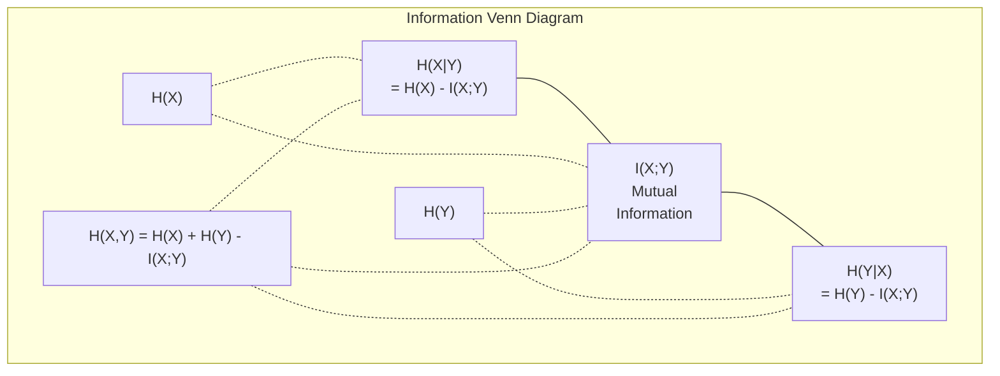
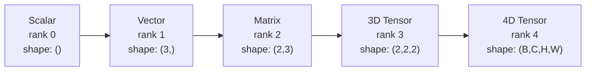
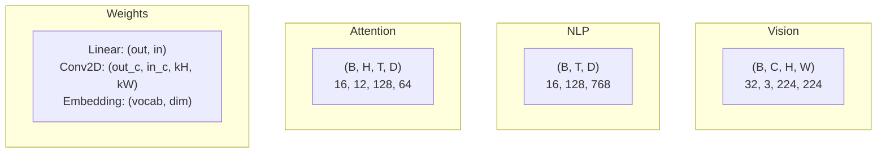
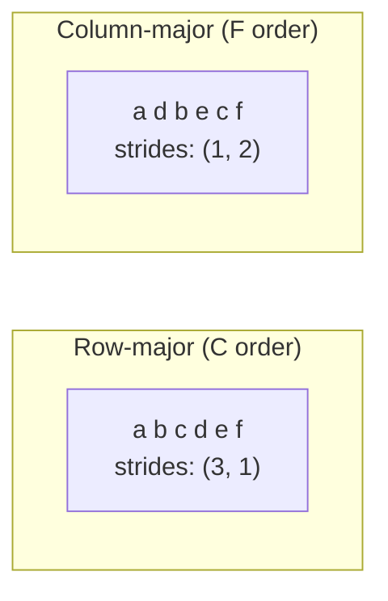
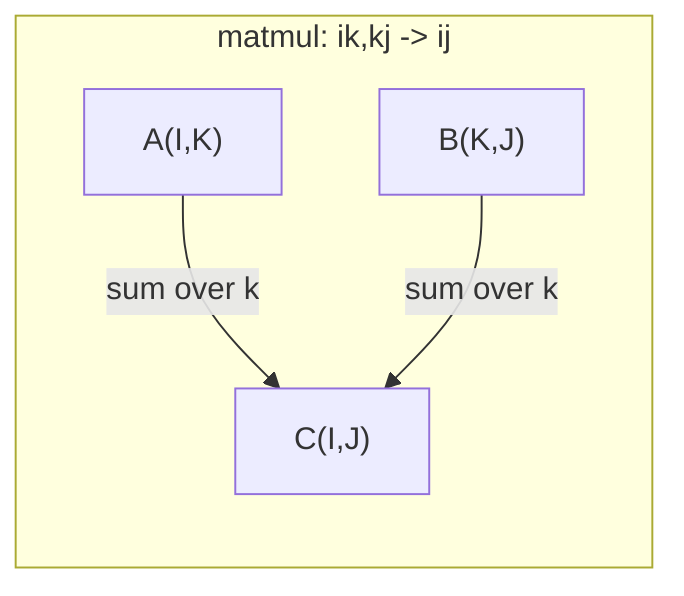

# Tensors, Information Theory & Stability

> Combined lessons (4 parts), merged verbatim — no content removed.

**Type:** Combined

---

## Part 1 (ch021): Information Theory

> Information theory measures surprise. Loss functions are built on it.

**Type:** Learn
**Language:** Python
**Prerequisites:** Phase 1, Lesson 06 (Probability)
**Time:** ~60 minutes

## Learning Objectives

- Compute entropy, cross-entropy, and KL divergence from scratch and explain their relationship
- Derive why minimizing cross-entropy loss is equivalent to maximizing log-likelihood
- Calculate mutual information between features and a target to rank feature importance
- Explain perplexity as the effective vocabulary size a language model chooses from

## The Problem

You call `CrossEntropyLoss()` in every classification model you train. You see "perplexity" in every language model paper. You read about KL divergence in VAEs, distillation, and RLHF. These are not disconnected concepts. They are all the same idea wearing different hats.

Information theory gives you the language to reason about uncertainty, compression, and prediction. Claude Shannon invented it in 1948 to solve communication problems. Turns out, training a neural network is a communication problem: the model is trying to transmit the correct label through a noisy channel of learned weights.

This lesson builds every formula from scratch so you see where they come from and why they work.

## The Concept

### Information Content (Surprise)

When something unlikely happens, it carries more information. A coin landing heads? Not surprising. A lottery win? Very surprising.

The information content of an event with probability p is:

```
I(x) = -log(p(x))
```

Using log base 2 gives you bits. Using natural log gives you nats. Same idea, different units.

```
Event              Probability    Surprise (bits)
Fair coin heads    0.5            1.0
Rolling a 6        0.167          2.58
1-in-1000 event    0.001          9.97
Certain event      1.0            0.0
```

Certain events carry zero information. You already knew they would happen.

### Entropy (Average Surprise)

Entropy is the expected surprise across all possible outcomes of a distribution.

```
H(P) = -sum( p(x) * log(p(x)) )  for all x
```

A fair coin has maximum entropy for a binary variable: 1 bit. A biased coin (99% heads) has low entropy: 0.08 bits. You already know what will happen, so each flip tells you almost nothing.

```
Fair coin:    H = -(0.5 * log2(0.5) + 0.5 * log2(0.5)) = 1.0 bit
Biased coin:  H = -(0.99 * log2(0.99) + 0.01 * log2(0.01)) = 0.08 bits
```

Entropy measures the irreducible uncertainty in a distribution. You cannot compress below it.

### Cross-Entropy (The Loss Function You Use Every Day)

Cross-entropy measures the average surprise when you use distribution Q to encode events that actually come from distribution P.

```
H(P, Q) = -sum( p(x) * log(q(x)) )  for all x
```

P is the true distribution (the labels). Q is your model's predictions. If Q matches P perfectly, cross-entropy equals entropy. Any mismatch makes it larger.

In classification, P is a one-hot vector (the true class has probability 1, everything else 0). This simplifies cross-entropy to:

```
H(P, Q) = -log(q(true_class))
```

That is the entire cross-entropy loss formula for classification. Maximize the predicted probability of the correct class.

### KL Divergence (Distance Between Distributions)

KL divergence measures how much extra surprise you get from using Q instead of P.

```
D_KL(P || Q) = sum( p(x) * log(p(x) / q(x)) )  for all x
             = H(P, Q) - H(P)
```

Cross-entropy is entropy plus KL divergence. Since entropy of the true distribution is constant during training, minimizing cross-entropy is the same as minimizing KL divergence. You are pushing your model's distribution toward the true distribution.

KL divergence is not symmetric: D_KL(P || Q) != D_KL(Q || P). It is not a true distance metric.

### Mutual Information

Mutual information measures how much knowing one variable tells you about another.

```
I(X; Y) = H(X) - H(X|Y)
        = H(X) + H(Y) - H(X, Y)
```

If X and Y are independent, mutual information is zero. Knowing one tells you nothing about the other. If they are perfectly correlated, mutual information equals the entropy of either variable.

In feature selection, high mutual information between a feature and the target means the feature is useful. Low mutual information means it is noise.

### Conditional Entropy

H(Y|X) measures how much uncertainty remains about Y after you observe X.

```
H(Y|X) = H(X,Y) - H(X)
```

Two extremes:
- If X completely determines Y, then H(Y|X) = 0. Knowing X eliminates all uncertainty about Y. Example: X = temperature in Celsius, Y = temperature in Fahrenheit.
- If X tells you nothing about Y, then H(Y|X) = H(Y). Knowing X does not reduce your uncertainty at all. Example: X = coin flip, Y = tomorrow's weather.

Conditional entropy is always non-negative and never exceeds H(Y):

```
0 <= H(Y|X) <= H(Y)
```

In machine learning, conditional entropy appears in decision trees. At each split, the algorithm picks the feature X that minimizes H(Y|X) -- the feature that removes the most uncertainty about the label Y.

### Joint Entropy

H(X,Y) is the entropy of the joint distribution of X and Y together.

```
H(X,Y) = -sum sum p(x,y) * log(p(x,y))   for all x, y
```

Key property:

```
H(X,Y) <= H(X) + H(Y)
```

Equality holds when X and Y are independent. If they share information, the joint entropy is less than the sum of individual entropies. The "missing" entropy is exactly the mutual information.



The relationships:
- H(X,Y) = H(X) + H(Y|X) = H(Y) + H(X|Y)
- I(X;Y) = H(X) - H(X|Y) = H(Y) - H(Y|X)
- H(X,Y) = H(X) + H(Y) - I(X;Y)

### Mutual Information (Deep Dive)

Mutual information I(X;Y) quantifies how much knowing one variable reduces uncertainty about the other.

```
I(X;Y) = H(X) - H(X|Y)
       = H(Y) - H(Y|X)
       = H(X) + H(Y) - H(X,Y)
       = sum sum p(x,y) * log(p(x,y) / (p(x) * p(y)))
```

Properties:
- I(X;Y) >= 0 always. You never lose information by observing something.
- I(X;Y) = 0 if and only if X and Y are independent.
- I(X;Y) = I(Y;X). It is symmetric, unlike KL divergence.
- I(X;X) = H(X). A variable shares all its information with itself.

**Mutual information for feature selection.** In ML, you want features that are informative about the target. Mutual information gives you a principled way to rank features:

1. For each feature X_i, compute I(X_i; Y) where Y is the target variable.
2. Rank features by MI score.
3. Keep the top k features.

This works for any relationship between feature and target -- linear, nonlinear, monotonic, or not. Correlation only catches linear relationships. MI catches everything.

| Method | Detects | Computational cost | Handles categorical? |
|--------|---------|-------------------|---------------------|
| Pearson correlation | Linear relationships | O(n) | No |
| Spearman correlation | Monotonic relationships | O(n log n) | No |
| Mutual information | Any statistical dependency | O(n log n) with binning | Yes |

### Label Smoothing and Cross-Entropy

Standard classification uses hard targets: [0, 0, 1, 0]. The true class gets probability 1, everything else gets 0. Label smoothing replaces these with soft targets:

```
soft_target = (1 - epsilon) * hard_target + epsilon / num_classes
```

With epsilon = 0.1 and 4 classes:
- Hard target:  [0, 0, 1, 0]
- Soft target:  [0.025, 0.025, 0.925, 0.025]

From an information theory perspective, label smoothing increases the entropy of the target distribution. Hard one-hot targets have entropy 0 -- there is no uncertainty. Soft targets have positive entropy.

Why this helps:
- Prevents the model from driving logits to extreme values (infinite logits would be needed to perfectly match a one-hot target under cross-entropy)
- Acts as regularization: the model cannot be 100% confident
- Improves calibration: predicted probabilities better reflect true uncertainty
- Reduces the gap between training and inference behavior

The cross-entropy loss with label smoothing becomes:

```
L = (1 - epsilon) * CE(hard_target, prediction) + epsilon * H_uniform(prediction)
```

The second term penalizes predictions that are far from uniform -- a direct regularization on confidence.

### Why Cross-Entropy Is THE Classification Loss

Three perspectives, same conclusion.

**Information theory view.** Cross-entropy measures how many bits you waste by using your model's distribution instead of the true distribution. Minimizing it makes your model the most efficient encoder of reality.

**Maximum likelihood view.** For N training samples with true classes y_i:

```
Likelihood     = product( q(y_i) )
Log-likelihood = sum( log(q(y_i)) )
Negative log-likelihood = -sum( log(q(y_i)) )
```

That last line is cross-entropy loss. Minimizing cross-entropy = maximizing the likelihood of the training data under your model.

**Gradient view.** The gradient of cross-entropy with respect to the logits is simply (predicted - true). Clean, stable, and fast to compute. This is why it pairs perfectly with softmax.

### Bits vs Nats

The only difference is the log base.

```
log base 2   -> bits      (information theory tradition)
log base e   -> nats      (machine learning convention)
log base 10  -> hartleys  (rarely used)
```

1 nat = 1/ln(2) bits = 1.4427 bits. PyTorch and TensorFlow use natural log (nats) by default.

### Perplexity

Perplexity is the exponential of cross-entropy. It tells you the effective number of equally likely choices the model is uncertain between.

```
Perplexity = 2^H(P,Q)   (if using bits)
Perplexity = e^H(P,Q)   (if using nats)
```

A language model with perplexity 50 is, on average, as confused as if it had to pick uniformly from 50 possible next tokens. Lower is better.

GPT-2 achieved perplexity ~30 on common benchmarks. Modern models are in the single digits for well-represented domains.

## Build It

### Step 1: Information content and entropy

```python
import math

def information_content(p, base=2):
    if p <= 0 or p > 1:
        return float('inf') if p <= 0 else 0.0
    return -math.log(p) / math.log(base)

def entropy(probs, base=2):
    return sum(
        p * information_content(p, base)
        for p in probs if p > 0
    )

fair_coin = [0.5, 0.5]
biased_coin = [0.99, 0.01]
fair_die = [1/6] * 6

print(f"Fair coin entropy:   {entropy(fair_coin):.4f} bits")
print(f"Biased coin entropy: {entropy(biased_coin):.4f} bits")
print(f"Fair die entropy:    {entropy(fair_die):.4f} bits")
```

### Step 2: Cross-entropy and KL divergence

```python
def cross_entropy(p, q, base=2):
    total = 0.0
    for pi, qi in zip(p, q):
        if pi > 0:
            if qi <= 0:
                return float('inf')
            total += pi * (-math.log(qi) / math.log(base))
    return total

def kl_divergence(p, q, base=2):
    return cross_entropy(p, q, base) - entropy(p, base)

true_dist = [0.7, 0.2, 0.1]
good_model = [0.6, 0.25, 0.15]
bad_model = [0.1, 0.1, 0.8]

print(f"Entropy of true dist:     {entropy(true_dist):.4f} bits")
print(f"CE (good model):          {cross_entropy(true_dist, good_model):.4f} bits")
print(f"CE (bad model):           {cross_entropy(true_dist, bad_model):.4f} bits")
print(f"KL divergence (good):     {kl_divergence(true_dist, good_model):.4f} bits")
print(f"KL divergence (bad):      {kl_divergence(true_dist, bad_model):.4f} bits")
```

### Step 3: Cross-entropy as classification loss

```python
def softmax(logits):
    max_logit = max(logits)
    exps = [math.exp(z - max_logit) for z in logits]
    total = sum(exps)
    return [e / total for e in exps]

def cross_entropy_loss(true_class, logits):
    probs = softmax(logits)
    return -math.log(probs[true_class])

logits = [2.0, 1.0, 0.1]
true_class = 0

probs = softmax(logits)
loss = cross_entropy_loss(true_class, logits)

print(f"Logits:      {logits}")
print(f"Softmax:     {[f'{p:.4f}' for p in probs]}")
print(f"True class:  {true_class}")
print(f"Loss:        {loss:.4f} nats")
print(f"Perplexity:  {math.exp(loss):.2f}")
```

### Step 4: Cross-entropy equals negative log-likelihood

```python
import random

random.seed(42)

n_samples = 1000
n_classes = 3
true_labels = [random.randint(0, n_classes - 1) for _ in range(n_samples)]
model_logits = [[random.gauss(0, 1) for _ in range(n_classes)] for _ in range(n_samples)]

ce_loss = sum(
    cross_entropy_loss(label, logits)
    for label, logits in zip(true_labels, model_logits)
) / n_samples

nll = -sum(
    math.log(softmax(logits)[label])
    for label, logits in zip(true_labels, model_logits)
) / n_samples

print(f"Cross-entropy loss:      {ce_loss:.6f}")
print(f"Negative log-likelihood: {nll:.6f}")
print(f"Difference:              {abs(ce_loss - nll):.2e}")
```

### Step 5: Mutual information

```python
def mutual_information(joint_probs, base=2):
    rows = len(joint_probs)
    cols = len(joint_probs[0])

    margin_x = [sum(joint_probs[i][j] for j in range(cols)) for i in range(rows)]
    margin_y = [sum(joint_probs[i][j] for i in range(rows)) for j in range(cols)]

    mi = 0.0
    for i in range(rows):
        for j in range(cols):
            pxy = joint_probs[i][j]
            if pxy > 0:
                mi += pxy * math.log(pxy / (margin_x[i] * margin_y[j])) / math.log(base)
    return mi

independent = [[0.25, 0.25], [0.25, 0.25]]
dependent = [[0.45, 0.05], [0.05, 0.45]]

print(f"MI (independent): {mutual_information(independent):.4f} bits")
print(f"MI (dependent):   {mutual_information(dependent):.4f} bits")
```

## Use It

The same concepts using NumPy, the way you will use them in practice:

```python
import numpy as np

def np_entropy(p):
    p = np.asarray(p, dtype=float)
    mask = p > 0
    result = np.zeros_like(p)
    result[mask] = p[mask] * np.log(p[mask])
    return -result.sum()

def np_cross_entropy(p, q):
    p, q = np.asarray(p, dtype=float), np.asarray(q, dtype=float)
    mask = p > 0
    return -(p[mask] * np.log(q[mask])).sum()

def np_kl_divergence(p, q):
    return np_cross_entropy(p, q) - np_entropy(p)

true = np.array([0.7, 0.2, 0.1])
pred = np.array([0.6, 0.25, 0.15])
print(f"Entropy:    {np_entropy(true):.4f} nats")
print(f"Cross-ent:  {np_cross_entropy(true, pred):.4f} nats")
print(f"KL div:     {np_kl_divergence(true, pred):.4f} nats")
```

You built from scratch what `torch.nn.CrossEntropyLoss()` does internally. Now you know why the loss goes down during training: your model's predicted distribution is getting closer to the true distribution, measured in nats of wasted information.

## Exercises

1. Compute the entropy of the English alphabet assuming uniform distribution (26 letters). Then estimate it using actual letter frequencies. Which is higher and why?

2. A model outputs logits [5.0, 2.0, 0.5] for a sample with true class 1. Compute the cross-entropy loss by hand, then verify with your `cross_entropy_loss` function. What logits would give zero loss?

3. Show that KL divergence is not symmetric. Pick two distributions P and Q and compute D_KL(P || Q) and D_KL(Q || P). Explain why they differ.

4. Build a function that computes perplexity for a sequence of token predictions. Given a list of (true_token_index, predicted_logits) pairs, return the perplexity of the sequence.

## Key Terms

| Term | What people say | What it actually means |
|------|----------------|----------------------|
| Information content | "Surprise" | The number of bits (or nats) needed to encode an event: -log(p) |
| Entropy | "Randomness" | The average surprise across all outcomes of a distribution. Measures irreducible uncertainty. |
| Cross-entropy | "The loss function" | Average surprise when using model distribution Q to encode events from true distribution P. |
| KL divergence | "Distance between distributions" | Extra bits wasted by using Q instead of P. Equals cross-entropy minus entropy. Not symmetric. |
| Mutual information | "How related are X and Y" | Reduction in uncertainty about X from knowing Y. Zero means independent. |
| Softmax | "Turn logits into probabilities" | Exponentiate and normalize. Maps any real-valued vector to a valid probability distribution. |
| Perplexity | "How confused the model is" | Exponential of cross-entropy. The effective vocabulary size the model is choosing from at each step. |
| Bits | "Shannon's unit" | Information measured with log base 2. One bit resolves one fair coin flip. |
| Nats | "ML's unit" | Information measured with natural log. Used by PyTorch and TensorFlow by default. |
| Negative log-likelihood | "NLL loss" | Identical to cross-entropy loss for one-hot labels. Minimizing it maximizes the probability of correct predictions. |

## Further Reading

- [Shannon 1948: A Mathematical Theory of Communication](https://people.math.harvard.edu/~ctm/home/text/others/shannon/entropy/entropy.pdf) - the original paper, still readable
- [Visual Information Theory (Chris Olah)](https://colah.github.io/posts/2015-09-Visual-Information/) - best visual explanation of entropy and KL divergence
- [PyTorch CrossEntropyLoss docs](https://pytorch.org/docs/stable/generated/torch.nn.CrossEntropyLoss.html) - how the framework implements what you just built

[Reference](https://github.com/rohitg00/ai-engineering-from-scratch/tree/main/phases/01-math-foundations/09-information-theory)

---

## Part 2 (ch024): Tensor Operations

> Tensors are the common language between data and deep learning. Every image, every sentence, every gradient flows through them.

**Type:** Build
**Language:** Python
**Prerequisites:** Phase 1, Lessons 01 (Linear Algebra Intuition), 02 (Vectors, Matrices & Operations)
**Time:** ~90 minutes

## Learning Objectives

- Implement a tensor class with shape, strides, reshape, transpose, and element-wise operations from scratch
- Apply broadcasting rules to operate on tensors of different shapes without copying data
- Write einsum expressions for dot products, matrix multiplications, outer products, and batched operations
- Trace the exact tensor shapes through every step of multi-head attention

## The Problem

You build a transformer. The forward pass looks clean. You run it and get: `RuntimeError: mat1 and mat2 shapes cannot be multiplied (32x768 and 512x768)`. You stare at the shapes. You try a transpose. Now it says `Expected 4D input (got 3D input)`. You add an unsqueeze. Something else breaks.

Shape errors are the most common bug in deep learning code. Each operation has a shape contract, but they multiply fast. A transformer has dozens of reshapes, transposes, and broadcasts chained together. One wrong axis and the error cascades. Worse, some shape mistakes do not throw errors at all. They silently produce garbage by broadcasting along the wrong dimension or summing over the wrong axis.

Matrices handle pairwise relationships between two sets of things. Real data does not fit into two dimensions. A batch of 32 RGB images at 224x224 is a 4D tensor: `(32, 3, 224, 224)`. Self-attention with 12 heads is also 4D: `(batch, heads, seq_len, head_dim)`. You need a data structure that generalizes to any number of dimensions, with operations that compose cleanly across all of them. That structure is the tensor. Master its operations and shape errors become trivially debuggable.

## The Concept

### What a tensor is

A tensor is a multi-dimensional array of numbers with a uniform data type. The number of dimensions is the **rank** (or **order**). Each dimension is an **axis**. The **shape** is a tuple listing the size along each axis.



Total elements = product of all sizes. A shape `(2, 3, 4)` holds `2 * 3 * 4 = 24` elements.

### Tensor shapes in deep learning

Different data types map to specific tensor shapes by convention.



PyTorch uses NCHW (channels-first). TensorFlow defaults to NHWC (channels-last). Mismatched layouts cause silent slowdowns or errors.

### How memory layout works

A 2D array in memory is a 1D sequence of bytes. **Strides** tell you how many elements to skip to move one step along each axis.



Transpose does not move data. It swaps the strides, making the tensor **non-contiguous** -- the elements for a row are no longer adjacent in memory.

### Broadcasting rules

Broadcasting lets you operate on tensors of different shapes without copying data. Align shapes from the right. Two dimensions are compatible when they are equal or one is 1. Fewer dimensions get padded with 1s on the left.

```
Tensor A:     (8, 1, 6, 1)
Tensor B:        (7, 1, 5)
Padded B:     (1, 7, 1, 5)
Result:       (8, 7, 6, 5)
```

### Einsum: the universal tensor operation

Einstein summation labels each axis with a letter. Axes in the input but not the output get summed. Axes in both are kept.



Key patterns: `i,i->` (dot product), `i,j->ij` (outer product), `ii->` (trace), `ij->ji` (transpose), `bij,bjk->bik` (batch matmul), `bhtd,bhsd->bhts` (attention scores).

## Build It

The code lives in `code/tensors.py`. Each step references the implementation there.

### Step 1: Tensor storage and strides

A tensor stores a flat list of numbers plus shape metadata. Strides tell the indexing logic how to map multi-dimensional indices to flat positions.

```python
class Tensor:
    def __init__(self, data, shape=None):
        if isinstance(data, (list, tuple)):
            self._data, self._shape = self._flatten_nested(data)
        elif isinstance(data, np.ndarray):
            self._data = data.flatten().tolist()
            self._shape = tuple(data.shape)
        else:
            self._data = [data]
            self._shape = ()

        if shape is not None:
            total = reduce(lambda a, b: a * b, shape, 1)
            if total != len(self._data):
                raise ValueError(
                    f"Cannot reshape {len(self._data)} elements into shape {shape}"
                )
            self._shape = tuple(shape)

        self._strides = self._compute_strides(self._shape)

    @staticmethod
    def _compute_strides(shape):
        if len(shape) == 0:
            return ()
        strides = [1] * len(shape)
        for i in range(len(shape) - 2, -1, -1):
            strides[i] = strides[i + 1] * shape[i + 1]
        return tuple(strides)
```

For shape `(3, 4)`, strides are `(4, 1)` -- skip 4 elements to advance one row, skip 1 element to advance one column.

### Step 2: Reshape, squeeze, unsqueeze

Reshape changes the shape without changing element order. The total number of elements must stay the same. Use `-1` for one dimension to infer its size.

```python
t = Tensor(list(range(12)), shape=(2, 6))
r = t.reshape((3, 4))
r = t.reshape((-1, 3))
```

Squeeze removes axes of size 1. Unsqueeze inserts one. Unsqueezing is critical for broadcasting -- a bias vector `(D,)` added to a batch `(B, T, D)` needs unsqueezing to `(1, 1, D)`.

```python
t = Tensor(list(range(6)), shape=(1, 3, 1, 2))
s = t.squeeze()
v = Tensor([1, 2, 3])
u = v.unsqueeze(0)
```

### Step 3: Transpose and permute

Transpose swaps two axes. Permute reorders all axes. This is how you convert between NCHW and NHWC.

```python
mat = Tensor(list(range(6)), shape=(2, 3))
tr = mat.transpose(0, 1)

t4d = Tensor(list(range(24)), shape=(1, 2, 3, 4))
perm = t4d.permute((0, 2, 3, 1))
```

After transpose or permute, the tensor is non-contiguous in memory. In PyTorch, `view` fails on non-contiguous tensors -- use `reshape` or call `.contiguous()` first.

### Step 4: Element-wise operations and reductions

Element-wise ops (add, multiply, subtract) apply independently to each element and preserve shape. Reductions (sum, mean, max) collapse one or more axes.

```python
a = Tensor([[1, 2], [3, 4]])
b = Tensor([[10, 20], [30, 40]])
c = a + b
d = a * 2
s = a.sum(axis=0)
```

Global average pooling in a CNN: `(B, C, H, W).mean(axis=[2, 3])` produces `(B, C)`. Sequence mean pooling in NLP: `(B, T, D).mean(axis=1)` produces `(B, D)`.

### Step 5: Broadcasting with NumPy

The `demo_broadcasting_numpy()` function in `tensors.py` shows the core patterns.

```python
activations = np.random.randn(4, 3)
bias = np.array([0.1, 0.2, 0.3])
result = activations + bias

images = np.random.randn(2, 3, 4, 4)
scale = np.array([0.5, 1.0, 1.5]).reshape(1, 3, 1, 1)
result = images * scale

a = np.array([1, 2, 3]).reshape(-1, 1)
b = np.array([10, 20, 30, 40]).reshape(1, -1)
outer = a * b
```

Pairwise distance via broadcasting: reshape `(M, 2)` to `(M, 1, 2)` and `(N, 2)` to `(1, N, 2)`, subtract, square, sum along last axis, take square root. Result: `(M, N)`.

### Step 6: Einsum operations

The `demo_einsum()` and `demo_einsum_gallery()` functions walk through every common pattern.

```python
a = np.array([1.0, 2.0, 3.0])
b = np.array([4.0, 5.0, 6.0])
dot = np.einsum("i,i->", a, b)

A = np.array([[1, 2], [3, 4], [5, 6]], dtype=float)
B = np.array([[7, 8, 9], [10, 11, 12]], dtype=float)
matmul = np.einsum("ik,kj->ij", A, B)

batch_A = np.random.randn(4, 3, 5)
batch_B = np.random.randn(4, 5, 2)
batch_mm = np.einsum("bij,bjk->bik", batch_A, batch_B)
```

The computational cost of a contraction is the product of all index sizes (kept and summed). For `bij,bjk->bik` with B=32, I=128, J=64, K=128: `32 * 128 * 64 * 128 = 33,554,432` multiply-adds.

### Step 7: Attention mechanism via einsum

The `demo_attention_einsum()` function implements multi-head attention end to end.

```python
B, H, T, D = 2, 4, 8, 16
E = H * D

X = np.random.randn(B, T, E)
W_q = np.random.randn(E, E) * 0.02

Q = np.einsum("bte,ek->btk", X, W_q)
Q = Q.reshape(B, T, H, D).transpose(0, 2, 1, 3)

scores = np.einsum("bhtd,bhsd->bhts", Q, K) / np.sqrt(D)
weights = softmax(scores, axis=-1)
attn_output = np.einsum("bhts,bhsd->bhtd", weights, V)

concat = attn_output.transpose(0, 2, 1, 3).reshape(B, T, E)
output = np.einsum("bte,ek->btk", concat, W_o)
```

Every step is a tensor operation: projection (matmul via einsum), head splitting (reshape + transpose), attention scores (batch matmul via einsum), weighted sum (batch matmul via einsum), head merging (transpose + reshape), output projection (matmul via einsum).

## Use It

### Scratch vs NumPy

| Operation | Scratch (Tensor class) | NumPy |
|---|---|---|
| Create | `Tensor([[1,2],[3,4]])` | `np.array([[1,2],[3,4]])` |
| Reshape | `t.reshape((3,4))` | `a.reshape(3,4)` |
| Transpose | `t.transpose(0,1)` | `a.T` or `a.transpose(0,1)` |
| Squeeze | `t.squeeze(0)` | `np.squeeze(a, 0)` |
| Sum | `t.sum(axis=0)` | `a.sum(axis=0)` |
| Einsum | N/A | `np.einsum("ij,jk->ik", a, b)` |

### Scratch vs PyTorch

```python
import torch

t = torch.tensor([[1, 2, 3], [4, 5, 6]], dtype=torch.float32)
t.shape
t.stride()
t.is_contiguous()

t.reshape(3, 2)
t.unsqueeze(0)
t.transpose(0, 1)
t.transpose(0, 1).contiguous()

torch.einsum("ik,kj->ij", A, B)
```

PyTorch adds autograd, GPU support, and optimized BLAS kernels. The shape semantics are identical. If you understand the scratch version, PyTorch shape errors become readable.

### Every neural network layer as a tensor operation

| Operation | Tensor Form | Einsum |
|---|---|---|
| Linear layer | `Y = X @ W.T + b` | `"bd,od->bo"` + bias |
| Attention QKV | `Q = X @ W_q` | `"btd,dh->bth"` |
| Attention scores | `Q @ K.T / sqrt(d)` | `"bhtd,bhsd->bhts"` |
| Attention output | `softmax(scores) @ V` | `"bhts,bhsd->bhtd"` |
| Batch norm | `(X - mu) / sigma * gamma` | element-wise + broadcast |
| Softmax | `exp(x) / sum(exp(x))` | element-wise + reduction |

## Ship It

This lesson produces two reusable prompts:

1. **`outputs/prompt-tensor-shapes.md`** -- A systematic prompt for debugging tensor shape mismatches. Includes decision tables for every common operation (matmul, broadcast, cat, Linear, Conv2d, BatchNorm, softmax) and a fix lookup table.

2. **`outputs/prompt-tensor-debugger.md`** -- A step-by-step debugging prompt you paste into any AI assistant when a shape error is blocking you. Feed it the error message and your tensor shapes, get back the exact fix.

## Exercises

1. **Easy -- Reshape round-trip.** Take a tensor of shape `(2, 3, 4)`. Reshape it to `(6, 4)`, then to `(24,)`, then back to `(2, 3, 4)`. Verify element order is preserved at each step by printing the flat data.

2. **Medium -- Implement broadcasting.** Extend the `Tensor` class with a `broadcast_to(shape)` method that expands dimensions of size 1 to match a target shape. Then modify `_elementwise_op` to automatically broadcast before operating. Test with shapes `(3, 1)` and `(1, 4)` producing `(3, 4)`.

3. **Hard -- Build einsum from scratch.** Implement a basic `einsum(subscripts, *tensors)` function that handles at least: dot product (`i,i->`), matrix multiply (`ij,jk->ik`), outer product (`i,j->ij`), and transpose (`ij->ji`). Parse the subscript string, identify contracted indices, and loop over all index combinations. Compare your results against `np.einsum`.

4. **Hard -- Attention shape tracker.** Write a function that takes `batch_size`, `seq_len`, `embed_dim`, and `num_heads` as inputs and prints the exact shape at every step of multi-head attention: input, Q/K/V projection, head split, attention scores, softmax weights, weighted sum, head merge, output projection. Verify against the `demo_attention_einsum()` output.

## Key Terms

| Term | What people say | What it actually means |
|---|---|---|
| Tensor | "A matrix but more dimensions" | A multi-dimensional array with uniform type and defined shape, strides, and operations |
| Rank | "The number of dimensions" | The number of axes. A matrix has rank 2, not rank equal to its matrix rank |
| Shape | "The size of the tensor" | A tuple listing the size along each axis. `(2, 3)` means 2 rows, 3 columns |
| Stride | "How memory is laid out" | The number of elements to skip to advance one position along each axis |
| Broadcasting | "It just works when shapes differ" | A strict set of rules: align from right, dimensions must be equal or one must be 1 |
| Contiguous | "The tensor is normal" | Elements stored sequentially in memory with no gaps or reordering from the logical layout |
| Einsum | "A fancy way to write matmul" | A general notation that expresses any tensor contraction, outer product, trace, or transpose in one line |
| View | "Same as reshape" | A tensor sharing the same memory buffer but with different shape/stride metadata. Fails on non-contiguous data |
| Contraction | "Summing over an index" | The general operation where a shared index between tensors is multiplied and summed, producing a lower-rank result |
| NCHW / NHWC | "PyTorch vs TensorFlow format" | Memory layout conventions for image tensors. NCHW puts channels before spatial dims, NHWC puts them after |

## Further Reading

- [NumPy Broadcasting](https://numpy.org/doc/stable/user/basics.broadcasting.html) -- The canonical rules with visual examples
- [PyTorch Tensor Views](https://pytorch.org/docs/stable/tensor_view.html) -- When views work and when they copy
- [einops](https://github.com/arogozhnikov/einops) -- A library that makes tensor reshaping readable and safe
- [The Illustrated Transformer](https://jalammar.github.io/illustrated-transformer/) -- Visualizes the tensor shapes flowing through attention
- [Einstein Summation in NumPy](https://numpy.org/doc/stable/reference/generated/numpy.einsum.html) -- Full einsum documentation with examples

[Reference](https://github.com/rohitg00/ai-engineering-from-scratch/tree/main/phases/01-math-foundations/12-tensor-operations)

---

## Part 3 (ch025): Numerical Stability

> Floating point is a leaky abstraction. It will bite you during training, and you will not see it coming.

**Type:** Build
**Languages:** Python
**Prerequisites:** Phase 1, Lessons 01-04
**Time:** ~120 minutes

## Learning Objectives

- Implement numerically stable softmax and log-sum-exp using the max-subtraction trick
- Identify overflow, underflow, and catastrophic cancellation in floating-point computations
- Verify analytical gradients against numerical gradients using centered finite differences
- Explain why bfloat16 is preferred over float16 for training and how loss scaling prevents gradient underflow

## The Problem

Your model trains for three hours, then the loss becomes NaN. You add a print statement. The logits are fine at step 9,000. At step 9,001 they are `inf`. By step 9,002 every gradient is `nan` and training is dead.

Or: your model trains to completion but accuracy is 2% worse than the paper claims. You check everything. Architecture matches. Hyperparameters match. Data matches. The problem is that the paper used float32 and you used float16 without the right scaling. Thirty-two bits of accumulated rounding error quietly ate your accuracy.

Or: you implement cross-entropy loss from scratch. It works on small logits. When logits exceed 100, it returns `inf`. The softmax overflowed because `exp(100)` is larger than float32 can represent. Every ML framework handles this with a two-line trick. You did not know the trick existed.

Numerical stability is not a theoretical concern. It is the difference between a training run that succeeds and one that silently fails. Every serious ML bug you will debug eventually comes down to floating point.

## The Concept

### IEEE 754: How Computers Store Real Numbers

Computers store real numbers as floating point values following the IEEE 754 standard. A float has three parts: a sign bit, an exponent, and a mantissa (significand).

```
Float32 layout (32 bits total):
[1 sign] [8 exponent] [23 mantissa]

Value = (-1)^sign * 2^(exponent - 127) * 1.mantissa
```

The mantissa determines precision (how many significant digits). The exponent determines range (how large or small a number can be).

| Format | Bits | Exponent | Mantissa | Decimal digits | Range (approx) |
|--------|------|----------|----------|----------------|----------------|
| float64 | 64 | 11 | 52 | ~15-16 | +/- 1.8e308 |
| float32 | 32 | 8 | 23 | ~7-8 | +/- 3.4e38 |
| float16 | 16 | 5 | 10 | ~3-4 | +/- 65,504 |
| bfloat16 | 16 | 8 | 7 | ~2-3 | +/- 3.4e38 |

float32 gives you about 7 decimal digits of precision. That means it can tell apart 1.0000001 and 1.0000002, but not 1.00000001 and 1.00000002. After 7 digits, everything is rounding noise.

float16 gives you about 3 digits. The largest number it can represent is 65,504. That is disturbingly small for ML where logits, gradients, and activations routinely exceed this.

bfloat16 is Google's answer to float16's range problem. It has the same 8-bit exponent as float32 (same range, up to 3.4e38) but only 7 mantissa bits (less precision than float16). For training neural networks, range matters more than precision, so bfloat16 usually wins.

### Why 0.1 + 0.2 != 0.3

The number 0.1 cannot be represented exactly in binary floating point. In base 2, it is a repeating fraction:

```
0.1 in binary = 0.0001100110011001100110011... (repeating forever)
```

Float32 truncates this to 23 bits of mantissa. The stored value is approximately 0.100000001490116. Similarly, 0.2 is stored as approximately 0.200000002980232. Their sum is 0.300000004470348, not 0.3.

```
In Python:
>>> 0.1 + 0.2
0.30000000000000004

>>> 0.1 + 0.2 == 0.3
False
```

This matters for ML because:
1. Loss comparisons like `if loss < threshold` can give wrong answers
2. Accumulating many small values (gradient updates over thousands of steps) drifts from the true sum
3. Checksums and reproducibility tests fail if you compare floats with `==`

The fix: never compare floats with `==`. Use `abs(a - b) < epsilon` or `math.isclose()`.

### Catastrophic Cancellation

When you subtract two nearly equal floating point numbers, the significant digits cancel and you are left with rounding noise promoted to leading digits.

```
a = 1.0000001    (stored as 1.00000011920929 in float32)
b = 1.0000000    (stored as 1.00000000000000 in float32)

True difference:  0.0000001
Computed:         0.00000011920929

Relative error: 19.2%
```

That is a 19% relative error from a single subtraction. In ML, this happens whenever you:

- Compute variance of data with a large mean: `E[x^2] - E[x]^2` when E[x] is large
- Subtract nearly equal log-probabilities
- Compute finite-difference gradients with too-small epsilon

The fix: rearrange formulas to avoid subtracting large, nearly equal numbers. For variance, use the Welford algorithm or center the data first. For log-probabilities, work in log-space throughout.

### Overflow and Underflow

Overflow happens when a result is too large to represent. Underflow happens when it is too small (closer to zero than the smallest representable positive number).

```
Float32 boundaries:
  Maximum:  3.4028235e+38
  Minimum positive (normal): 1.175e-38
  Minimum positive (denorm): 1.401e-45
  Overflow:  anything > 3.4e38 becomes inf
  Underflow: anything < 1.4e-45 becomes 0.0
```

The `exp()` function is the primary source of overflow in ML:

```
exp(88.7)  = 3.40e+38   (barely fits in float32)
exp(89.0)  = inf         (overflow)
exp(-87.3) = 1.18e-38   (barely above underflow)
exp(-104)  = 0.0         (underflow to zero)
```

The `log()` function hits the other direction:

```
log(0.0)   = -inf
log(-1.0)  = nan
log(1e-45) = -103.3      (fine)
log(1e-46) = -inf        (input underflowed to 0, then log(0) = -inf)
```

In ML, `exp()` appears in softmax, sigmoid, and probability computations. `log()` appears in cross-entropy, log-likelihoods, and KL divergence. The combination `log(exp(x))` is a minefield without the right tricks.

### The Log-Sum-Exp Trick

Computing `log(sum(exp(x_i)))` directly is numerically dangerous. If any `x_i` is large, `exp(x_i)` overflows. If all `x_i` are very negative, every `exp(x_i)` underflows to zero and `log(0)` is `-inf`.

The trick: subtract the maximum value before exponentiating.

```
log(sum(exp(x_i))) = max(x) + log(sum(exp(x_i - max(x))))
```

Why this works: after subtracting `max(x)`, the largest exponent is `exp(0) = 1`. No overflow is possible. At least one term in the sum is 1, so the sum is at least 1, and `log(1) = 0`. No underflow to `-inf` is possible.

Proof:

```
log(sum(exp(x_i)))
= log(sum(exp(x_i - c + c)))                    (add and subtract c)
= log(sum(exp(x_i - c) * exp(c)))               (exp(a+b) = exp(a)*exp(b))
= log(exp(c) * sum(exp(x_i - c)))               (factor out exp(c))
= c + log(sum(exp(x_i - c)))                    (log(a*b) = log(a) + log(b))
```

Set `c = max(x)` and overflow is eliminated.

This trick appears everywhere in ML:
- Softmax normalization
- Cross-entropy loss computation
- Log-probability summation in sequence models
- Mixture of Gaussians
- Variational inference

### Why Softmax Needs the Max-Subtraction Trick

Softmax converts logits to probabilities:

```
softmax(x_i) = exp(x_i) / sum(exp(x_j))
```

Without the trick, logits of [100, 101, 102] cause overflow:

With the trick, subtract max(x) = 102:

```
exp(100 - 102) = exp(-2) = 0.135
exp(101 - 102) = exp(-1) = 0.368
exp(102 - 102) = exp(0)  = 1.000
sum = 1.503

softmax = [0.090, 0.245, 0.665]
```

The probabilities are identical. The computation is safe. This is not an optimization. It is a requirement for correctness.

### NaN and Inf: Detection and Prevention

`nan` (Not a Number) and `inf` (infinity) propagate virally through computation. One `nan` in a gradient update makes the weight `nan`, which makes every subsequent output `nan`. Training is dead within one step.

How `inf` appears:
- `exp()` of a large positive number
- Division by zero: `1.0 / 0.0`
- `float32` overflow in accumulations

How `nan` appears:
- `0.0 / 0.0`
- `inf - inf`
- `inf * 0`
- `sqrt()` of a negative number
- `log()` of a negative number
- Any arithmetic involving an existing `nan`

Detection:

```python
import math

math.isnan(x)       # True if x is nan
math.isinf(x)       # True if x is +inf or -inf
math.isfinite(x)    # True if x is neither nan nor inf
```

Prevention strategies:
1. Clamp inputs to `exp()`: `exp(clamp(x, -80, 80))`
2. Add epsilon to denominators: `x / (y + 1e-8)`
3. Add epsilon inside `log()`: `log(x + 1e-8)`
4. Use stable implementations (log-sum-exp, stable softmax)
5. Gradient clipping to prevent weight explosion
6. Check for `nan`/`inf` after every forward pass during debugging

### Numerical Gradient Checking

Analytical gradients (from backpropagation) can have bugs. Numerical gradient checking verifies them by computing gradients with finite differences.

The centered difference formula:

```
df/dx ~= (f(x + h) - f(x - h)) / (2h)
```

This is O(h^2) accurate, much better than the forward difference `(f(x+h) - f(x)) / h` which is only O(h).

Choosing h: too large and the approximation is wrong. Too small and catastrophic cancellation destroys the answer. `h = 1e-5` to `1e-7` is typical.

The check: compute the relative difference between analytical and numerical gradients.

```
relative_error = |grad_analytical - grad_numerical| / max(|grad_analytical|, |grad_numerical|, 1e-8)
```

Rules of thumb:
- relative_error < 1e-7: perfect, gradient is correct
- relative_error < 1e-5: acceptable, probably correct
- relative_error > 1e-3: something is wrong
- relative_error > 1: gradient is completely wrong

Always check gradients when implementing a new layer or loss function. PyTorch provides `torch.autograd.gradcheck()` for this.

### Mixed Precision Training

Modern GPUs have specialized hardware (Tensor Cores) that compute float16 matrix multiplications 2-8x faster than float32. Mixed precision training exploits this:

```
1. Maintain float32 master copy of weights
2. Forward pass in float16 (fast)
3. Compute loss in float32 (prevents overflow)
4. Backward pass in float16 (fast)
5. Scale gradients to float32
6. Update float32 master weights
```

The problem with pure float16 training: gradients are often very small (1e-8 or smaller). Float16 underflows anything below ~6e-8 to zero. Your model stops learning because all gradient updates are zero.

The fix is loss scaling:

```
1. Multiply loss by a large scale factor (e.g., 1024)
2. Backward pass computes gradients of (loss * 1024)
3. All gradients are 1024x larger (pushed above float16 underflow)
4. Divide gradients by 1024 before updating weights
5. Net effect: same update, but no underflow
```

Dynamic loss scaling adjusts the scale factor automatically. Start with a large value (65536). If gradients overflow to `inf`, halve it. If N steps pass without overflow, double it.

### bfloat16 vs float16: Why bfloat16 Wins for Training

```
float16:   [1 sign] [5 exponent]  [10 mantissa]
bfloat16:  [1 sign] [8 exponent]  [7 mantissa]
```

float16 has more precision (10 mantissa bits vs 7) but limited range (max ~65,504). bfloat16 has less precision but the same range as float32 (max ~3.4e38).

For training neural networks:
- Activations and logits regularly exceed 65,504 during training spikes. float16 overflows; bfloat16 handles it.
- Loss scaling is required with float16 but usually unnecessary with bfloat16 because its range covers the gradient magnitude spectrum.
- bfloat16 is a simple truncation of float32: drop the bottom 16 bits of the mantissa. Conversion is trivial and lossless in the exponent.

float16 is preferred for inference where values are bounded and precision matters more. bfloat16 is preferred for training where range matters more. This is why TPUs and modern NVIDIA GPUs (A100, H100) have native bfloat16 support.

### Gradient Clipping

Exploding gradients happen when gradients grow exponentially through many layers (common in RNNs, deep networks, and transformers). A single large gradient can corrupt all weights in one step.

Two types of clipping:

**Clip by value:** clamp each gradient element independently.
```
grad = clamp(grad, -max_val, max_val)
```
Simple but can change the direction of the gradient vector.

**Clip by norm:** scale the entire gradient vector so its norm does not exceed a threshold.
```
if ||grad|| > max_norm:
    grad = grad * (max_norm / ||grad||)
```
Preserves the direction of the gradient. This is what `torch.nn.utils.clip_grad_norm_()` does. It is the standard choice.

Typical values: `max_norm=1.0` for transformers, `max_norm=0.5` for RL, `max_norm=5.0` for simpler networks.

### Normalization Layers as Numerical Stabilizers

Batch normalization, layer normalization, and RMS normalization are usually presented as regularizers that help training converge. They are also numerical stabilizers.

Without normalization, activations can grow or shrink exponentially through layers:

```
Layer 1: values in [0, 1]
Layer 5: values in [0, 100]
Layer 10: values in [0, 10,000]
Layer 50: values in [0, inf]
```

Normalization recenters and rescales activations at every layer:

```
LayerNorm(x) = (x - mean(x)) / (std(x) + epsilon) * gamma + beta
```

The `epsilon` (typically 1e-5) prevents division by zero when all activations are identical. The learned parameters `gamma` and `beta` let the network restore any scale it needs.

This keeps values in a numerically safe range throughout the network, preventing both overflow in the forward pass and gradient explosion in the backward pass.

### Common ML Numerical Bugs

**Bug: Loss is NaN after a few epochs.**
Cause: logits grew too large, softmax overflowed. Or learning rate is too high and weights diverged.
Fix: use stable softmax (max subtraction), reduce learning rate, add gradient clipping.

**Bug: Loss is stuck at log(num_classes).**
Cause: model outputs are near-uniform probabilities. Often means gradients are vanishing or the model is not learning at all.
Fix: check that data labels are correct, verify the loss function, check for dead ReLUs.

**Bug: Validation accuracy is lower than expected by 1-3%.**
Cause: mixed precision without proper loss scaling. Gradient underflow silently zeroes out small updates.
Fix: enable dynamic loss scaling, or switch to bfloat16.

**Bug: Gradient norms are 0.0 for some layers.**
Cause: dead ReLU neurons (all inputs negative), or float16 underflow.
Fix: use LeakyReLU or GELU, use gradient scaling, check weight initialization.

**Bug: Model works on one GPU but gives different results on another.**
Cause: non-deterministic floating point accumulation order. GPU parallel reductions sum in different orders on different hardware, and floating point addition is not associative.
Fix: accept small differences (1e-6), or set `torch.use_deterministic_algorithms(True)` and accept the speed penalty.

**Bug: `exp()` returns `inf` in loss computation.**
Cause: raw logits passed to `exp()` without the max-subtraction trick.
Fix: use `torch.nn.functional.log_softmax()` which implements log-sum-exp internally.

**Bug: Training diverges after switching from float32 to float16.**
Cause: float16 cannot represent gradient magnitudes below 6e-8 or activations above 65,504.
Fix: use mixed precision with loss scaling (AMP), or use bfloat16 instead.

## Build It

### Step 1: Demonstrate floating point precision limits

```python
print("=== Floating Point Precision ===")
print(f"0.1 + 0.2 = {0.1 + 0.2}")
print(f"0.1 + 0.2 == 0.3? {0.1 + 0.2 == 0.3}")
print(f"Difference: {(0.1 + 0.2) - 0.3:.2e}")
```

### Step 2: Implement naive vs stable softmax

```python
import math

def softmax_naive(logits):
    exps = [math.exp(z) for z in logits]
    total = sum(exps)
    return [e / total for e in exps]

def softmax_stable(logits):
    max_logit = max(logits)
    exps = [math.exp(z - max_logit) for z in logits]
    total = sum(exps)
    return [e / total for e in exps]

safe_logits = [2.0, 1.0, 0.1]
print(f"Naive:  {softmax_naive(safe_logits)}")
print(f"Stable: {softmax_stable(safe_logits)}")

dangerous_logits = [100.0, 101.0, 102.0]
print(f"Stable: {softmax_stable(dangerous_logits)}")
# softmax_naive(dangerous_logits) would return [nan, nan, nan]
```

### Step 3: Implement stable log-sum-exp

```python
def logsumexp_naive(values):
    return math.log(sum(math.exp(v) for v in values))

def logsumexp_stable(values):
    c = max(values)
    return c + math.log(sum(math.exp(v - c) for v in values))

safe = [1.0, 2.0, 3.0]
print(f"Naive:  {logsumexp_naive(safe):.6f}")
print(f"Stable: {logsumexp_stable(safe):.6f}")

large = [500.0, 501.0, 502.0]
print(f"Stable: {logsumexp_stable(large):.6f}")
# logsumexp_naive(large) returns inf
```

### Step 4: Implement stable cross-entropy

```python
def cross_entropy_naive(true_class, logits):
    probs = softmax_naive(logits)
    return -math.log(probs[true_class])

def cross_entropy_stable(true_class, logits):
    max_logit = max(logits)
    shifted = [z - max_logit for z in logits]
    log_sum_exp = math.log(sum(math.exp(s) for s in shifted))
    log_prob = shifted[true_class] - log_sum_exp
    return -log_prob

logits = [2.0, 5.0, 1.0]
true_class = 1
print(f"Naive:  {cross_entropy_naive(true_class, logits):.6f}")
print(f"Stable: {cross_entropy_stable(true_class, logits):.6f}")
```

### Step 5: Gradient checking

```python
def numerical_gradient(f, x, h=1e-5):
    grad = []
    for i in range(len(x)):
        x_plus = x[:]
        x_minus = x[:]
        x_plus[i] += h
        x_minus[i] -= h
        grad.append((f(x_plus) - f(x_minus)) / (2 * h))
    return grad

def check_gradient(analytical, numerical, tolerance=1e-5):
    for i, (a, n) in enumerate(zip(analytical, numerical)):
        denom = max(abs(a), abs(n), 1e-8)
        rel_error = abs(a - n) / denom
        status = "OK" if rel_error < tolerance else "FAIL"
        print(f"  param {i}: analytical={a:.8f} numerical={n:.8f} "
              f"rel_error={rel_error:.2e} [{status}]")

def f(params):
    x, y = params
    return x**2 + 3*x*y + y**3

def f_grad(params):
    x, y = params
    return [2*x + 3*y, 3*x + 3*y**2]

point = [2.0, 1.0]
analytical = f_grad(point)
numerical = numerical_gradient(f, point)
check_gradient(analytical, numerical)
```

### Step 6: All implementations from code/numerical.py

The full `code/numerical.py` includes complete implementations with edge case handling:

```python
import math
import struct
import random

def softmax_naive(logits):
    exps = [math.exp(z) for z in logits]
    total = sum(exps)
    return [e / total for e in exps]

def softmax_stable(logits):
    max_logit = max(logits)
    exps = [math.exp(z - max_logit) for z in logits]
    total = sum(exps)
    return [e / total for e in exps]

def logsumexp_naive(values):
    return math.log(sum(math.exp(v) for v in values))

def logsumexp_stable(values):
    c = max(values)
    return c + math.log(sum(math.exp(v - c) for v in values))

def log_softmax_stable(logits):
    c = max(logits)
    lse = c + math.log(sum(math.exp(z - c) for z in logits))
    return [z - lse for z in logits]

def cross_entropy_naive(true_class, logits):
    probs = softmax_naive(logits)
    return -math.log(probs[true_class])

def cross_entropy_stable(true_class, logits):
    log_probs = log_softmax_stable(logits)
    return -log_probs[true_class]

def sigmoid_naive(x):
    return 1.0 / (1.0 + math.exp(-x))

def sigmoid_stable(x):
    if x >= 0:
        z = math.exp(-x)
        return 1.0 / (1.0 + z)
    else:
        z = math.exp(x)
        return z / (1.0 + z)

def numerical_gradient(f, x, h=1e-5):
    grad = []
    for i in range(len(x)):
        x_plus = x[:]
        x_minus = x[:]
        x_plus[i] += h
        x_minus[i] -= h
        grad.append((f(x_plus) - f(x_minus)) / (2 * h))
    return grad

def clip_by_norm(gradients, max_norm):
    total_norm = math.sqrt(sum(g ** 2 for g in gradients))
    if total_norm > max_norm:
        scale = max_norm / total_norm
        return [g * scale for g in gradients]
    return list(gradients)

def check_tensor(name, values):
    has_nan = any(math.isnan(v) for v in values)
    has_inf = any(math.isinf(v) for v in values)
    if has_nan or has_inf:
        print(f"  WARNING {name}: nan={has_nan} inf={has_inf}")
        return False
    print(f"  OK {name}: all {len(values)} values finite")
    return True

def simulate_bfloat16(x):
    packed = struct.pack('f', x)
    as_int = int.from_bytes(packed, 'little')
    truncated = as_int & 0xFFFF0000
    repacked = truncated.to_bytes(4, 'little')
    return struct.unpack('f', repacked)[0]

def simulate_float16(x):
    try:
        packed = struct.pack('e', x)
        return struct.unpack('e', packed)[0]
    except (OverflowError, struct.error):
        return float('inf') if x > 0 else float('-inf')

def kahan_sum(values):
    total = 0.0
    compensation = 0.0
    for v in values:
        y = v - compensation
        t = total + y
        compensation = (t - total) - y
        total = t
    return total

def welford_variance(values):
    n = 0
    mean = 0.0
    m2 = 0.0
    for x in values:
        n += 1
        delta = x - mean
        mean += delta / n
        delta2 = x - mean
        m2 += delta * delta2
    if n < 2:
        return 0.0
    return m2 / n

def variance_naive(values):
    n = len(values)
    mean_x = sum(values) / n
    mean_x2 = sum(v ** 2 for v in values) / n
    return mean_x2 - mean_x ** 2

def layer_norm(values, epsilon=1e-5, gamma=1.0, beta=0.0):
    n = len(values)
    mean = sum(values) / n
    var = sum((v - mean) ** 2 for v in values) / n
    std = math.sqrt(var + epsilon)
    return [(v - mean) / std * gamma + beta for v in values]
```

## Use It

### Mixed precision simulation

```python
import struct

def float32_to_float16_round(x):
    packed = struct.pack('f', x)
    f32 = struct.unpack('f', packed)[0]
    packed16 = struct.pack('e', f32)
    return struct.unpack('e', packed16)[0]

def simulate_bfloat16(x):
    packed = struct.pack('f', x)
    as_int = int.from_bytes(packed, 'little')
    truncated = as_int & 0xFFFF0000
    repacked = truncated.to_bytes(4, 'little')
    return struct.unpack('f', repacked)[0]
```

### Gradient clipping

```python
import math

def clip_by_norm(gradients, max_norm):
    total_norm = math.sqrt(sum(g**2 for g in gradients))
    if total_norm > max_norm:
        scale = max_norm / total_norm
        return [g * scale for g in gradients]
    return gradients

grads = [10.0, 20.0, 30.0]
clipped = clip_by_norm(grads, max_norm=5.0)
print(f"Original norm: {math.sqrt(sum(g**2 for g in grads)):.2f}")
print(f"Clipped norm:  {math.sqrt(sum(g**2 for g in clipped)):.2f}")
```

### NaN/Inf detection

```python
import math

def check_tensor(name, values):
    has_nan = any(math.isnan(v) for v in values)
    has_inf = any(math.isinf(v) for v in values)
    if has_nan or has_inf:
        print(f"WARNING {name}: nan={has_nan} inf={has_inf}")
        return False
    return True

check_tensor("good", [1.0, 2.0, 3.0])
check_tensor("bad",  [1.0, float('nan'), 3.0])
check_tensor("ugly", [1.0, float('inf'), 3.0])
```

### Kahan summation for reducing rounding error

```python
def kahan_sum(values):
    total = 0.0
    compensation = 0.0
    for v in values:
        y = v - compensation
        t = total + y
        compensation = (t - total) - y
        total = t
    return total
```

## Ship It

This lesson produces:
- `code/numerical.py` with stable softmax, log-sum-exp, cross-entropy, gradient checking, and mixed precision simulation
- `outputs/prompt-numerical-debugger.md` for diagnosing NaN/Inf and numerical issues in training

These stable implementations reappear in Phase 3 when building the training loop and in Phase 4 when implementing attention mechanisms.

## Exercises

1. **Catastrophic cancellation.** Compute the variance of [1000000.0, 1000001.0, 1000002.0] using the naive formula `E[x^2] - E[x]^2` in float32. Then compute it using Welford's online algorithm. Compare the errors against the true variance (0.6667).

2. **Precision hunt.** Find the smallest positive float32 value `x` such that `1.0 + x == 1.0` in Python. This is the machine epsilon. Verify it matches `numpy.finfo(numpy.float32).eps`.

3. **Log-sum-exp edge cases.** Test your `logsumexp_stable` function with: (a) all values equal, (b) one value much larger than the rest, (c) all values very negative (-1000). Verify it gives correct results where the naive version fails.

4. **Gradient checking a neural network layer.** Implement a single linear layer `y = Wx + b` and its analytical backward pass. Use `numerical_gradient` to verify correctness for a 3x2 weight matrix.

5. **Loss scaling experiment.** Simulate training with float16: create random gradients in the range [1e-9, 1e-3], convert to float16, and measure what fraction become zero. Then apply loss scaling (multiply by 1024), convert to float16, scale back, and measure the zero fraction again.

## Key Terms

| Term | What people say | What it actually means |
|------|----------------|----------------------|
| IEEE 754 | "The float standard" | International standard defining binary floating point formats, rounding rules, and special values (inf, nan). Every modern CPU and GPU implements it. |
| Machine epsilon | "The precision limit" | The smallest value e such that 1.0 + e != 1.0 in a given float format. For float32, it is about 1.19e-7. |
| Catastrophic cancellation | "Precision loss from subtraction" | When subtracting nearly equal floating point numbers, significant digits cancel and rounding noise dominates the result. |
| Overflow | "Number too big" | A result exceeds the maximum representable value and becomes inf. exp(89) overflows float32. |
| Underflow | "Number too small" | A result is closer to zero than the smallest representable positive number and becomes 0.0. exp(-104) underflows float32. |
| Log-sum-exp trick | "Subtract the max first" | Computing log(sum(exp(x))) by factoring out exp(max(x)) to prevent overflow and underflow. Used in softmax, cross-entropy, and log-probability math. |
| Stable softmax | "Softmax that does not explode" | Subtracting max(logits) before exponentiating. Numerically identical result, no overflow possible. |
| Gradient checking | "Verify your backprop" | Comparing analytical gradients from backpropagation against numerical gradients from finite differences to catch implementation bugs. |
| Mixed precision | "Float16 forward, float32 backward" | Using lower-precision floats for speed-critical operations and higher-precision floats for numerically sensitive operations. Typical speedup is 2-3x. |
| Loss scaling | "Prevent gradient underflow" | Multiplying the loss by a large constant before backprop so gradients stay in float16's representable range, then dividing by the same constant before weight updates. |
| bfloat16 | "Brain floating point" | Google's 16-bit format with 8 exponent bits (same range as float32) and 7 mantissa bits (less precision than float16). Preferred for training. |
| Gradient clipping | "Cap the gradient norm" | Scaling the gradient vector so its norm does not exceed a threshold. Prevents exploding gradients from ruining weights. |
| NaN | "Not a Number" | Special float value from undefined operations (0/0, inf-inf, sqrt(-1)). Propagates through all subsequent arithmetic. |
| Inf | "Infinity" | Special float value from overflow or division by zero. Can combine to produce NaN (inf - inf, inf * 0). |
| Numerical gradient | "Brute force derivative" | Approximating a derivative by evaluating f(x+h) and f(x-h) and dividing by 2h. Slow but reliable for verification. |

[Reference](https://github.com/rohitg00/ai-engineering-from-scratch/tree/main/phases/01-math-foundations/13-numerical-stability)

---

## Part 4 (ch026): Norms and Distances

> The geometry of data is defined by how we measure distance.

**Type:** Build  
**Languages:** Python  
**Prerequisites:** Phase 1, Lessons 01-04  
**Time:** ~120 minutes  

## Learning Objectives

- Implement L1, L2, L-infinity norms from scratch and explain their geometric behavior
- Prove and verify the triangle inequality, Cauchy-Schwarz, and Hölder's inequalities numerically
- Implement cosine similarity, Euclidean distance, Manhattan distance, and Hamming distance
- Use distance computations to find nearest neighbors in synthetic data

## The Concept

### What Is a Norm?

A norm is a function that assigns a non-negative length or magnitude to a vector. It measures how "large" a vector is.

A function `f: R^n -> R` is a norm if it satisfies three properties:

1. **Positive definiteness:** `f(x) >= 0` and `f(x) = 0` if and only if `x = 0`
2. **Absolute homogeneity:** `f(alpha * x) = |alpha| * f(x)` for any scalar alpha
3. **Triangle inequality:** `f(x + y) <= f(x) + f(y)`

The triangle inequality is the most important. It says that going directly from point A to point C is never longer than going from A to B and then B to C. This property is what makes a norm a norm, and it is the reason norms define a consistent geometry.

### The Vector p-Norms

The L-p norm generalizes almost all common norms into a single formula:

```
||x||_p = (|x_1|^p + |x_2|^p + ... + |x_n|^p)^(1/p)
```

For different values of p, you get fundamentally different geometries:

**L1 norm (p=1):** `||x||_1 = |x_1| + |x_2| + ... + |x_n|`

The sum of absolute values. Also called Manhattan distance, taxicab norm, or grid distance. It measures distance along axes, like a city grid. Unit circle: a diamond shape.

**L2 norm (p=2):** `||x||_2 = sqrt(x_1^2 + x_2^2 + ... + x_n^2)`

The Euclidean norm. This is what most people mean by "distance." It is the straight-line distance. Unit circle: a circle.

**L-infinity norm (p -> inf):** `||x||_inf = max(|x_1|, |x_2|, ..., |x_n|)`

The maximum absolute value among all components. Also called the Chebyshev distance or sup norm. It measures how far apart the most different component is. Unit circle: a square.

**L0 "norm" (p -> 0):** `||x||_0 = number of non-zero components`

Not a true norm (violates absolute homogeneity), but heavily used in sparsity and compression. The L0 "norm" counts non-zero entries, used in the Lasso regularization (approximated by L1, since L0 optimization is NP-hard).

### The Unit Circle Geometry

The unit circle `{x: ||x||_p = 1}` visualizes the geometry each norm defines:

```
p=1:   A diamond centered at origin, corners at (1,0), (0,1), (-1,0), (0,-1)
p=1.5: A rounded diamond, slightly bulging toward a circle
p=2:   A perfect circle, radius 1
p=4:   Nearly a rounded square, more bulging than L2
p=inf: A perfect square with sides parallel to axes, corners at (+-1, +-1)
```

As p increases, the unit circle morphs from a spiky diamond (p=1) through a circle (p=2) to a square (p=inf). This tells you how each norm treats vectors with mixed vs concentrated magnitudes.

Example: compare `x = (1, 0)` and `y = (0.707, 0.707)`.

```
||x||_2 = 1.000, ||y||_2 = 1.000
||x||_1 = 1.000, ||y||_1 = 1.414
||x||_inf = 1.000, ||y||_inf = 0.707
```

Under L2, they are the same length. Under L1, x is shorter (its mass is concentrated on one axis). Under L-infinity, y is shorter (its spread keeps each component lower).

### How Norms Show Up in Machine Learning

**L2 regularization (weight decay):** Adds `lambda * ||W||_2^2` to the loss. Encourages weights to be small. The squared L2 norm is differentiable everywhere (unlike L1, which has a kink at zero).

**L1 regularization (Lasso):** Adds `lambda * ||W||_1` to the loss. Encourages sparsity in weights. The kink at zero means weights are pushed exactly to zero, not just made small.

**L2 distance as loss:** Mean squared error `(1/n) * sum((y_pred - y_true)^2)` is the squared L2 norm of the error vector.

**L1 distance as loss:** Mean absolute error `(1/n) * sum(|y_pred - y_true|)` is the L1 norm of the error vector, averaged.

**Gradient clipping by norm:** If `||gradient||_2 > threshold`, scale the gradient to `threshold / ||gradient||_2`. Ensures the update step is never larger than `threshold` in L2 distance.

### Distances Derived from Norms

Every norm induces a distance metric:

```
d(x, y) = ||x - y||_p
```

**Euclidean distance (L2):** `d(x, y) = sqrt(sum((x_i - y_i)^2))`

Straight-line distance. The default choice for continuous data. Sensitive to outliers (squaring amplifies large differences).

**Manhattan distance (L1):** `d(x, y) = sum(|x_i - y_i|)`

Distance along axis-aligned paths. Less sensitive to outliers than L2. Used in high-dimensional problems where L2 distances concentrate (the "curse of dimensionality").

**Chebyshev distance (L-inf):** `d(x, y) = max(|x_i - y_i|)`

Worst-case component difference. Used in game board distance metrics.

**Hamming distance:** Number of positions where two binary vectors differ.

```
d(1011, 1001) = 1 (only the third position differs)
```

Used in error correction, feature hashing, and binary embedding spaces.

**Cosine distance:** `1 - cos_similarity(x, y)`, where `cos_similarity = dot(x, y) / (||x|| * ||y||)`

Measures directional similarity, ignoring magnitude. Not a true metric (violates the triangle inequality). Standard for text embeddings where direction matters more than magnitude.

### The Inequality Trio

Three inequalities are the foundation of norm-based reasoning:

**Cauchy-Schwarz inequality:**

```
|dot(x, y)| <= ||x||_2 * ||y||_2
```

The absolute value of the dot product never exceeds the product of the L2 norms. Equality holds when x and y are linearly dependent (parallel). This inequality is the basis of cosine similarity (-1 to 1), the angle between vectors, and the correlation coefficient.

**Triangle inequality:**

```
||x + y||_p <= ||x||_p + ||y||_p
```

The direct path is never longer than the sum of two legs. This is the defining property of a norm. Everything that follows in geometry depends on it.

**Hölder's inequality:**

```
sum(|x_i * y_i|) <= ||x||_p * ||y||_q    where 1/p + 1/q = 1
```

Generalizes Cauchy-Schwarz (which is the special case p=q=2). Connects different norms. For p=1, q=inf: `sum(|x_i * y_i|) <= ||x||_1 * ||y||_inf`.

### Norm Equivalence

In finite dimensions, all norms are equivalent. This is a theorem: for any two norms ||.||_a and ||.||_b, there exist positive constants c and C such that:

```
c * ||x||_a <= ||x||_b <= C * ||x||_a
```

This means that convergence in one norm implies convergence in all norms. But the constants matter:

```
||x||_2 <= ||x||_1 <= sqrt(n) * ||x||_2
||x||_inf <= ||x||_2 <= ||x||_inf
||x||_inf <= ||x||_1 <= n * ||x||_inf
```

In high dimensions, the ratio between norms can be large. `||x||_1` can be up to `sqrt(n)` times larger than `||x||_2`. This matters for optimization: L1 regularization has very different effects than L2.

### Norms of Matrices

The matrix norm induced by a vector norm is:

```
||A||_p = max_{||x||_p = 1} ||Ax||_p
```

**Spectral norm (p=2):** The largest singular value of A. Measures how much the matrix can stretch a vector in the L2 sense. This is the most important matrix norm for ML.

**Frobenius norm:** `sqrt(sum(A_ij^2))`. Like the L2 norm of the matrix treated as a vector. Not induced by a vector norm, but used extensively in regularization and matrix completion.

The spectral norm appears in:
- Lipschitz constants of neural network layers
- Stability of GAN training (spectral normalization)
- Condition number of linear systems `Ax = b`

### Why Distance Metrics Matter

The choice of distance metric determines:
1. **Who is a neighbor.** Different metrics give different nearest neighbors.
2. **What is clustered together.** K-means with L1 distance gives different clusters than with L2.
3. **How gradients flow.** L2 loss (MSE) is smooth; L1 loss (MAE) has a non-differentiable point at zero.
4. **What sparsity structure emerges.** L1 induces sparsity; L2 does not.

The rule of thumb:
- Use L2 for smooth, continuous data where magnitude matters
- Use L1 for high-dimensional data or when robustness to outliers is needed
- Use cosine for data where direction matters more than magnitude (text, embeddings, normalized features)
- Use Hamming for binary or discrete features

## Build It

### Step 1: Vector norms from scratch

```python
import math

def norm_l1(x):
    return sum(abs(v) for v in x)

def norm_l2(x):
    return math.sqrt(sum(v ** 2 for v in x))

def norm_linf(x):
    return max(abs(v) for v in x)

def norm_p(x, p):
    return sum(abs(v) ** p for v in x) ** (1 / p)
```

### Step 2: Distance metrics

```python
def euclidean_distance(x, y):
    return math.sqrt(sum((a - b) ** 2 for a, b in zip(x, y)))

def manhattan_distance(x, y):
    return sum(abs(a - b) for a, b in zip(x, y))

def chebyshev_distance(x, y):
    return max(abs(a - b) for a, b in zip(x, y))

def hamming_distance(x, y):
    if len(x) != len(y):
        raise ValueError("Vectors must be same length")
    return sum(a != b for a, b in zip(x, y))

def cosine_similarity(x, y):
    dot = sum(a * b for a, b in zip(x, y))
    nx = math.sqrt(sum(a ** 2 for a in x))
    ny = math.sqrt(sum(b ** 2 for b in y))
    if nx == 0 or ny == 0:
        return 0.0
    return dot / (nx * ny)
```

### Step 3: Verify inequalities

```python
import random

def verify_cauchy_schwarz(x, y):
    dot = sum(a * b for a, b in zip(x, y))
    nx = math.sqrt(sum(a ** 2 for a in x))
    ny = math.sqrt(sum(b ** 2 for b in y))
    return abs(dot) <= nx * ny + 1e-10

def verify_triangle_inequality(x, y, p=2):
    sum_norm = norm_p([a + b for a, b in zip(x, y)], p)
    x_norm = norm_p(x, p)
    y_norm = norm_p(y, p)
    return sum_norm <= x_norm + y_norm + 1e-10
```

### Step 4: Nearest neighbor search

```python
def nearest_neighbor(query, points, metric='euclidean'):
    best_idx = -1
    best_dist = float('inf')
    for i, p in enumerate(points):
        if metric == 'euclidean':
            d = euclidean_distance(query, p)
        elif metric == 'manhattan':
            d = manhattan_distance(query, p)
        elif metric == 'cosine':
            d = 1 - cosine_similarity(query, p)
        else:
            raise ValueError(f"Unknown metric: {metric}")
        if d < best_dist:
            best_dist = d
            best_idx = i
    return best_idx, best_dist
```

## Use It

The all implementations from `code/distances.py` include complete vectorized versions:

```python
import math
import random

def dot_product(x, y):
    return sum(a * b for a, b in zip(x, y))

def norm_l1(x):
    return sum(abs(v) for v in x)

def norm_l2(x):
    return math.sqrt(sum(v ** 2 for v in x))

def norm_linf(x):
    return max(abs(v) for v in x)

def norm_p(x, p):
    return sum(abs(v) ** p for v in x) ** (1.0 / p)

def euclidean_distance(x, y):
    return math.sqrt(sum((a - b) ** 2 for a, b in zip(x, y)))

def manhattan_distance(x, y):
    return sum(abs(a - b) for a, b in zip(x, y))

def chebyshev_distance(x, y):
    return max(abs(a - b) for a, b in zip(x, y))

def hamming_distance(x, y):
    if len(x) != len(y):
        raise ValueError("Vectors must be same length")
    return sum(a != b for a, b in zip(x, y))

def cosine_similarity(x, y):
    dot = sum(a * b for a, b in zip(x, y))
    nx = math.sqrt(sum(a ** 2 for a in x))
    ny = math.sqrt(sum(b ** 2 for b in y))
    if nx == 0 or ny == 0:
        return 0.0
    return dot / (nx * ny)

def minkowski_distance(x, y, p):
    return sum(abs(a - b) ** p for a, b in zip(x, y)) ** (1.0 / p)

def normalized_correlation(x, y):
    n = len(x)
    mx = sum(x) / n
    my = sum(y) / n
    dx = [a - mx for a in x]
    dy = [b - my for b in y]
    return cosine_similarity(dx, dy)

def nearest_neighbor(query, points, metric='euclidean'):
    best_idx = -1
    best_dist = float('inf')
    for i, p in enumerate(points):
        if metric == 'euclidean':
            d = euclidean_distance(query, p)
        elif metric == 'manhattan':
            d = manhattan_distance(query, p)
        elif metric == 'chebyshev':
            d = chebyshev_distance(query, p)
        elif metric == 'cosine':
            d = 1 - cosine_similarity(query, p)
        else:
            raise ValueError(f"Unknown metric: {metric}")
        if d < best_dist:
            best_dist = d
            best_idx = i
    return best_idx, best_dist

def verify_cauchy_schwarz(x, y):
    dot = sum(a * b for a, b in zip(x, y))
    nx = math.sqrt(sum(a ** 2 for a in x))
    ny = math.sqrt(sum(b ** 2 for b in y))
    return abs(dot) <= nx * ny + 1e-10

def verify_triangle_inequality(x, y, p=2):
    z = [a + b for a, b in zip(x, y)]
    return norm_p(z, p) <= norm_p(x, p) + norm_p(y, p) + 1e-10

def verify_holder(x, y, p, q):
    sum_abs = sum(abs(a * b) for a, b in zip(x, y))
    combo = norm_p(x, p) * norm_p(y, q)
    return sum_abs <= combo + 1e-10
```

## Ship It

This lesson produces `code/distances.py` with all norm, distance, and inequality verification functions. These are used directly in Phase 3 for k-NN classification, Phase 4 for attention mechanisms (dot product as similarity), and throughout the ML curriculum whenever distance or similarity is needed.

## Exercises

1. **Inequality verifier.** Generate 100 random 5-dimensional vectors. Count how many satisfy Cauchy-Schwarz, the triangle inequality for L1 and L-infinity, and Hölder's inequality with p=3, q=1.5.

2. **Nearest neighbor comparison.** Generate synthetic data with 3 clusters. For each point, find the nearest neighbor using L1, L2, and cosine distance. Count how often each metric gives a different neighbor.

3. **Norm ratio in high dimensions.** Generate random vectors of dimension n = 10, 100, 1000, 10000. Compute `||x||_1 / ||x||_2` and `||x||_inf / ||x||_2` and verify they match the theoretical bounds: `1 <= ||x||_1 / ||x||_2 <= sqrt(n)` and `1/sqrt(n) <= ||x||_inf / ||x||_2 <= 1`.

4. **Cosine vs Euclidean for normalized vectors.** Show that for unit vectors (`||x||_2 = ||y||_2 = 1`), the relationship `||x - y||_2^2 = 2 - 2*cos_similarity(x, y)` holds. This means ordering by Euclidean distance is the same as ordering by cosine distance when vectors are normalized.

## Key Terms

| Term | What people say | What it actually means |
|------|----------------|----------------------|
| L1 norm | "Absolute value sum" | Sum of absolute values of vector components. Unit circle is a diamond. Robust to outliers. |
| L2 norm | "Euclidean length" | Square root of sum of squares. Unit circle is a circle. The standard distance metric. |
| L-infinity norm | "Maximum component" | The largest absolute value among components. Unit circle is a square. |
| Frobenius norm | "Matrix L2" | Square root of sum of squared matrix entries. Like L2 norm on the flattened matrix. |
| Spectral norm | "Largest singular value" | Maximum stretching factor of a matrix in the L2 sense. Controls Lipschitz constants. |
| Cauchy-Schwarz | "Dot product bound" | |dot(x,y)| <= ||x||_2 * ||y||_2. Equality when vectors are parallel. |
| Triangle inequality | "Direct path is shortest" | ||x+y|| <= ||x|| + ||y||. The defining property of a norm. |
| Hölder's inequality | "Generalized dot bound" | sum(|x_i*y_i|) <= ||x||_p * ||y||_q where 1/p+1/q=1. |
| Cosine similarity | "Direction match" | dot(x,y) / (||x||_2 * ||y||_2). Ranges from -1 (opposite) to 1 (same direction). |
| Minkowski distance | "Generalized p-distance" | (sum(|x_i - y_i|^p))^(1/p). Unifies L1, L2, L-inf into one formula. |
| Hamming distance | "Bit difference count" | Number of positions where two binary vectors differ. Used for binary codes. |
| Norm equivalence | "All norms are similar" | In finite dimensions, c*||x||_a <= ||x||_b <= C*||x||_a. Convergence in one implies convergence in all. |

[Reference](https://github.com/rohitg00/ai-engineering-from-scratch/tree/main/phases/01-math-foundations/14-norms-and-distances)
