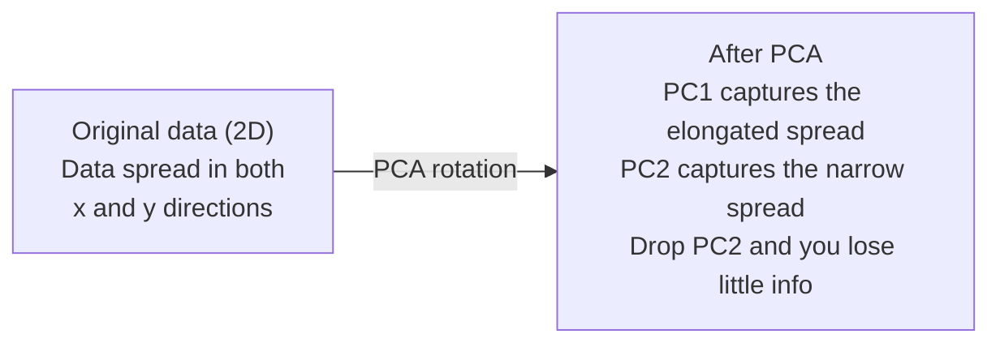
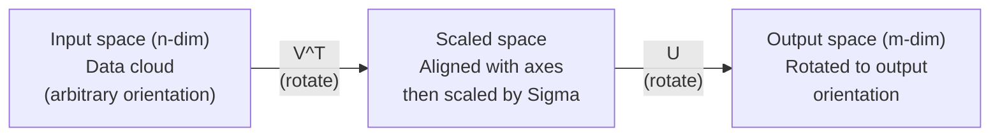
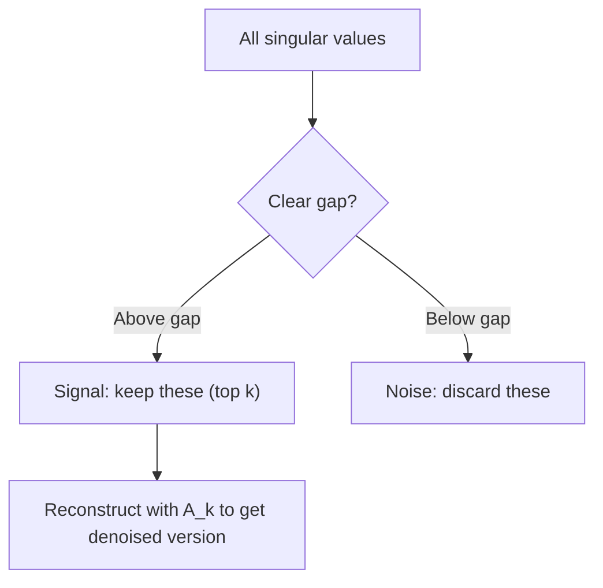

# Dimensionality Reduction, SVD & Linear Systems

> Combined lessons (3 parts), merged verbatim — no content removed.

**Type:** Combined

---

## Part 1 (ch022): Dimensionality Reduction

> High-dimensional data has structure. You find it by looking from the right angle.

**Type:** Build
**Language:** Python
**Prerequisites:** Phase 1, Lessons 01 (Linear Algebra Intuition), 02 (Vectors, Matrices & Operations), 03 (Eigenvalues & Eigenvectors), 06 (Probability & Distributions)
**Time:** ~90 minutes

## Learning Objectives

- Implement PCA from scratch: center data, compute the covariance matrix, eigendecompose, and project
- Use explained variance ratio and the elbow method to choose the number of principal components
- Compare PCA, t-SNE, and UMAP for visualizing MNIST digits in 2D and explain their tradeoffs
- Apply kernel PCA with an RBF kernel to separate nonlinear data structures that standard PCA cannot handle

## The Problem

You have a dataset with 784 features per sample. Maybe it is pixel values of handwritten digits. Maybe it is gene expression levels. Maybe it is user behavior signals. You cannot visualize 784 dimensions. You cannot plot them. You cannot even think about them.

But most of those 784 features are redundant. The actual information lives on a much smaller surface. A handwritten "7" does not need 784 independent numbers to describe it. It needs a few: the angle of the stroke, the length of the crossbar, how much it leans. The rest is noise.

Dimensionality reduction finds that smaller surface. It takes your 784-dimensional data and compresses it to 2, 10, or 50 dimensions while keeping the structure that matters.

## The Concept

### The curse of dimensionality

High-dimensional spaces are unintuitive. Three things break as dimensions grow.

**Distance becomes meaningless.** In high dimensions, the distance between any two random points converges to the same value. If every point is roughly the same distance from every other point, nearest-neighbor search stops working.

```
Dimension    Avg distance ratio (max/min between random points)
2            ~5.0
10           ~1.8
100          ~1.2
1000         ~1.02
```

**Volume concentrates in corners.** A unit hypercube in d dimensions has 2^d corners. In 100 dimensions, nearly all the volume is in the corners, far from the center. Data points spread to the edges and your models starve for data in the interior.

**You need exponentially more data.** To maintain the same density of samples in a space, going from 2D to 20D means you need 10^18 times more data. You never have enough. Reducing dimensions brings the data density back to something workable.

### PCA: find the directions that matter

Principal Component Analysis (PCA) finds the axes along which your data varies the most. It rotates your coordinate system so the first axis captures the most variance, the second captures the next most, and so on.

The algorithm:

```
1. Center the data        (subtract the mean from each feature)
2. Compute covariance     (how features move together)
3. Eigendecomposition     (find the principal directions)
4. Sort by eigenvalue     (biggest variance first)
5. Project               (keep top k eigenvectors, drop the rest)
```

Why eigendecomposition? The covariance matrix is symmetric and positive semi-definite. Its eigenvectors are orthogonal directions in feature space. The eigenvalues tell you how much variance each direction captures. The eigenvector with the largest eigenvalue points along the direction of maximum variance.



- **Before PCA:** Data cloud is spread diagonally across both x and y axes
- **After PCA:** Coordinate system is rotated so PC1 aligns with the direction of maximum variance (elongated spread) and PC2 aligns with the direction of minimum variance (narrow spread)
- **Dimensionality reduction:** Dropping PC2 projects the data onto PC1, losing very little information

### Explained variance ratio

Each principal component captures a fraction of the total variance. The explained variance ratio tells you how much.

```
Component    Eigenvalue    Explained ratio    Cumulative
PC1          4.73          0.473              0.473
PC2          2.51          0.251              0.724
PC3          1.12          0.112              0.836
PC4          0.89          0.089              0.925
...
```

When the cumulative explained variance reaches 0.95, you know that many components capture 95% of the information. Everything after that is mostly noise.

### Choosing the number of components

Three strategies:

1. **Threshold.** Keep enough components to explain 90-95% of the variance.
2. **Elbow method.** Plot explained variance per component. Look for a sharp drop-off.
3. **Downstream performance.** Use PCA as preprocessing. Sweep k and measure your model's accuracy. The best k is wherever accuracy plateaus.

### t-SNE: preserve neighborhoods

t-Distributed Stochastic Neighbor Embedding (t-SNE) is designed for visualization. It maps high-dimensional data to 2D (or 3D) while preserving which points are near each other.

The intuition: in the original space, compute a probability distribution over pairs of points based on their distances. Near points get high probability. Far points get low probability. Then find a 2D arrangement where the same probability distribution holds. Points that were neighbors in 784 dimensions stay neighbors in 2D.

Key properties of t-SNE:
- Non-linear. It can unfold complex manifolds that PCA cannot.
- Stochastic. Different runs produce different layouts.
- Perplexity parameter controls how many neighbors to consider (typical range: 5-50).
- Distances between clusters in the output are not meaningful. Only the clusters themselves are.
- Slow on large datasets. O(n^2) by default.

### UMAP: faster, better global structure

Uniform Manifold Approximation and Projection (UMAP) works similarly to t-SNE but with two advantages:
- Faster. It uses approximate nearest-neighbor graphs instead of computing all pairwise distances.
- Better global structure. The relative positions of clusters in the output tend to be more meaningful than in t-SNE.

UMAP builds a weighted graph in high-dimensional space (the "fuzzy topological representation") and then finds a low-dimensional layout that preserves this graph as well as possible.

Key parameters:
- `n_neighbors`: how many neighbors define local structure (similar to perplexity). Higher values preserve more global structure.
- `min_dist`: how tightly points pack together in the output. Lower values create denser clusters.

### When to use which

| Method | Use case | Preserves | Speed |
|--------|----------|-----------|-------|
| PCA | Preprocessing before training | Global variance | Fast (exact), works on millions of samples |
| PCA | Quick exploratory visualization | Linear structure | Fast |
| t-SNE | Publication-quality 2D plots | Local neighborhoods | Slow (< 10k samples ideal) |
| UMAP | 2D visualization at scale | Local + some global structure | Medium (handles millions) |
| PCA | Feature reduction for models | Variance-ranked features | Fast |
| t-SNE / UMAP | Understanding cluster structure | Cluster separation | Medium to slow |

Rule of thumb: use PCA for preprocessing and data compression. Use t-SNE or UMAP when you need to visualize structure in 2D.

### Kernel PCA

Standard PCA finds linear subspaces. It rotates your coordinate system and drops axes. But what if the data lies on a nonlinear manifold? A circle in 2D cannot be separated by any line. Standard PCA will not help.

Kernel PCA applies PCA in a high-dimensional feature space induced by a kernel function, without explicitly computing the coordinates in that space. This is the kernel trick -- the same idea behind SVMs.

The algorithm:
1. Compute the kernel matrix K where K_ij = k(x_i, x_j)
2. Center the kernel matrix in feature space
3. Eigendecompose the centered kernel matrix
4. The top eigenvectors (scaled by 1/sqrt(eigenvalue)) are the projections

Common kernel functions:

| Kernel | Formula | Good for |
|--------|---------|----------|
| RBF (Gaussian) | exp(-gamma * \|\|x - y\|\|^2) | Most nonlinear data, smooth manifolds |
| Polynomial | (x . y + c)^d | Polynomial relationships |
| Sigmoid | tanh(alpha * x . y + c) | Neural network-like mappings |

When to use kernel PCA vs standard PCA:

| Criterion | Standard PCA | Kernel PCA |
|-----------|-------------|------------|
| Data structure | Linear subspace | Nonlinear manifold |
| Speed | O(min(n^2 d, d^2 n)) | O(n^2 d + n^3) |
| Interpretability | Components are linear combinations of features | Components lack direct feature interpretation |
| Scalability | Works on millions of samples | Kernel matrix is n x n, memory-limited |
| Reconstruction | Direct inverse transform | Requires pre-image approximation |

The classic example: concentric circles in 2D. Two rings of points, one inside the other. Standard PCA projects both onto the same line -- useless for classification. Kernel PCA with an RBF kernel maps the inner circle and outer circle to different regions, making them linearly separable.

### Reconstruction Error

How good is your dimensionality reduction? You compressed 784 dimensions to 50. What did you lose?

Measure reconstruction error:
1. Project data to k dimensions: X_reduced = X @ W_k
2. Reconstruct: X_hat = X_reduced @ W_k^T
3. Compute MSE: mean((X - X_hat)^2)

For PCA, reconstruction error has a clean relationship to explained variance:

```
Reconstruction error = sum of eigenvalues NOT included
Total variance = sum of ALL eigenvalues
Fraction lost = (sum of dropped eigenvalues) / (sum of all eigenvalues)
```

The explained variance ratio for each component is:

```
explained_ratio_k = eigenvalue_k / sum(all eigenvalues)
```

Plotting cumulative explained variance against number of components gives you the "elbow" curve. The right number of components is where:
- The curve flattens out (diminishing returns)
- Cumulative variance crosses your threshold (usually 0.90 or 0.95)
- Downstream task performance plateaus

Reconstruction error is useful beyond choosing k. You can use it for anomaly detection: samples with high reconstruction error are outliers that do not fit the learned subspace. This is the basis of PCA-based anomaly detection in production systems.

## Build It

### Step 1: PCA from scratch

```python
import numpy as np

class PCA:
    def __init__(self, n_components):
        self.n_components = n_components
        self.components = None
        self.mean = None
        self.eigenvalues = None
        self.explained_variance_ratio_ = None

    def fit(self, X):
        self.mean = np.mean(X, axis=0)
        X_centered = X - self.mean

        cov_matrix = np.cov(X_centered, rowvar=False)

        eigenvalues, eigenvectors = np.linalg.eigh(cov_matrix)

        sorted_idx = np.argsort(eigenvalues)[::-1]
        eigenvalues = eigenvalues[sorted_idx]
        eigenvectors = eigenvectors[:, sorted_idx]

        self.components = eigenvectors[:, :self.n_components].T
        self.eigenvalues = eigenvalues[:self.n_components]
        total_var = np.sum(eigenvalues)
        self.explained_variance_ratio_ = self.eigenvalues / total_var

        return self

    def transform(self, X):
        X_centered = X - self.mean
        return X_centered @ self.components.T

    def fit_transform(self, X):
        self.fit(X)
        return self.transform(X)
```

### Step 2: Test on synthetic data

```python
np.random.seed(42)
n_samples = 500

t = np.random.uniform(0, 2 * np.pi, n_samples)
x1 = 3 * np.cos(t) + np.random.normal(0, 0.2, n_samples)
x2 = 3 * np.sin(t) + np.random.normal(0, 0.2, n_samples)
x3 = 0.5 * x1 + 0.3 * x2 + np.random.normal(0, 0.1, n_samples)

X_synthetic = np.column_stack([x1, x2, x3])

pca = PCA(n_components=2)
X_reduced = pca.fit_transform(X_synthetic)

print(f"Original shape: {X_synthetic.shape}")
print(f"Reduced shape:  {X_reduced.shape}")
print(f"Explained variance ratios: {pca.explained_variance_ratio_}")
print(f"Total variance captured: {sum(pca.explained_variance_ratio_):.4f}")
```

### Step 3: MNIST digits in 2D

```python
from sklearn.datasets import fetch_openml

mnist = fetch_openml("mnist_784", version=1, as_frame=False, parser="auto")
X_mnist = mnist.data[:5000].astype(float)
y_mnist = mnist.target[:5000].astype(int)

pca_mnist = PCA(n_components=50)
X_pca50 = pca_mnist.fit_transform(X_mnist)
print(f"50 components capture {sum(pca_mnist.explained_variance_ratio_):.2%} of variance")

pca_2d = PCA(n_components=2)
X_pca2d = pca_2d.fit_transform(X_mnist)
print(f"2 components capture {sum(pca_2d.explained_variance_ratio_):.2%} of variance")
```

### Step 4: Compare with sklearn

```python
from sklearn.decomposition import PCA as SklearnPCA
from sklearn.manifold import TSNE

sklearn_pca = SklearnPCA(n_components=2)
X_sklearn_pca = sklearn_pca.fit_transform(X_mnist)

print(f"\nOur PCA explained variance:     {pca_2d.explained_variance_ratio_}")
print(f"Sklearn PCA explained variance: {sklearn_pca.explained_variance_ratio_}")

diff = np.abs(np.abs(X_pca2d) - np.abs(X_sklearn_pca))
print(f"Max absolute difference: {diff.max():.10f}")

tsne = TSNE(n_components=2, perplexity=30, random_state=42)
X_tsne = tsne.fit_transform(X_mnist)
print(f"\nt-SNE output shape: {X_tsne.shape}")
```

### Step 5: UMAP comparison

```python
try:
    from umap import UMAP

    reducer = UMAP(n_components=2, n_neighbors=15, min_dist=0.1, random_state=42)
    X_umap = reducer.fit_transform(X_mnist)
    print(f"UMAP output shape: {X_umap.shape}")
except ImportError:
    print("Install umap-learn: pip install umap-learn")
```

## Use It

PCA as preprocessing before a classifier:

```python
from sklearn.decomposition import PCA as SklearnPCA
from sklearn.linear_model import LogisticRegression
from sklearn.model_selection import train_test_split
from sklearn.metrics import accuracy_score

X_train, X_test, y_train, y_test = train_test_split(
    X_mnist, y_mnist, test_size=0.2, random_state=42
)

results = {}
for k in [10, 30, 50, 100, 200]:
    pca_k = SklearnPCA(n_components=k)
    X_tr = pca_k.fit_transform(X_train)
    X_te = pca_k.transform(X_test)

    clf = LogisticRegression(max_iter=1000, random_state=42)
    clf.fit(X_tr, y_train)
    acc = accuracy_score(y_test, clf.predict(X_te))
    var_captured = sum(pca_k.explained_variance_ratio_)
    results[k] = (acc, var_captured)
    print(f"k={k:>3d}  accuracy={acc:.4f}  variance={var_captured:.4f}")
```

Performance plateaus well before 784 dimensions. That plateau is your operating point.

## Ship It

This lesson produces:
- `outputs/skill-dimensionality-reduction.md` - a skill for choosing the right dimensionality reduction technique for a given task

## Exercises

1. Modify the PCA class to support `inverse_transform`. Reconstruct MNIST digits from 10, 50, and 200 components. Print the reconstruction error (mean squared difference from the original) for each.

2. Run t-SNE on the same MNIST subset with perplexity values of 5, 30, and 100. Describe how the output changes. Why does perplexity affect cluster tightness?

3. Take a dataset with 50 features where only 5 are informative (generate one with `sklearn.datasets.make_classification`). Apply PCA and check whether the explained variance curve correctly identifies that the data is effectively 5-dimensional.

## Key Terms

| Term | What people say | What it actually means |
|------|----------------|----------------------|
| Curse of dimensionality | "Too many features" | Distances, volumes, and data density all behave counterintuitively as dimensions grow. Models need exponentially more data to compensate. |
| PCA | "Reduce dimensions" | Rotate your coordinate system so the axes align with the directions of maximum variance, then drop the low-variance axes. |
| Principal component | "An important direction" | An eigenvector of the covariance matrix. The direction in feature space along which the data varies most. |
| Explained variance ratio | "How much info this component has" | The fraction of total variance captured by one principal component. Sum the top k ratios to see how much k components preserve. |
| Covariance matrix | "How features correlate" | A symmetric matrix where entry (i,j) measures how feature i and feature j move together. Diagonal entries are individual variances. |
| t-SNE | "That cluster plot" | A nonlinear method that maps high-dimensional data to 2D by preserving pairwise neighborhood probabilities. Good for visualization, not for preprocessing. |
| UMAP | "Faster t-SNE" | A nonlinear method based on topological data analysis. Preserves both local and some global structure. Scales better than t-SNE. |
| Perplexity | "A t-SNE knob" | Controls the effective number of neighbors each point considers. Low perplexity focuses on very local structure. High perplexity captures broader patterns. |
| Manifold | "The surface the data lives on" | A lower-dimensional surface embedded in a higher-dimensional space. A sheet of paper crumpled in 3D is a 2D manifold. |

## Further Reading

- [A Tutorial on Principal Component Analysis](https://arxiv.org/abs/1404.1100) (Shlens) - clear derivation of PCA from the ground up
- [How to Use t-SNE Effectively](https://distill.pub/2016/misread-tsne/) (Wattenberg et al.) - interactive guide to t-SNE pitfalls and parameter choices
- [UMAP documentation](https://umap-learn.readthedocs.io/) - theory and practical guidance from the UMAP authors

[Reference](https://github.com/rohitg00/ai-engineering-from-scratch/tree/main/phases/01-math-foundations/10-dimensionality-reduction)

---

## Part 2 (ch023): Singular Value Decomposition

> SVD is the Swiss Army knife of linear algebra. Every matrix has one. Every data scientist needs one.

**Type:** Build
**Languages:** Python, Julia
**Prerequisites:** Phase 1, Lessons 01 (Linear Algebra Intuition), 02 (Vectors & Matrices Operations), 03 (Matrix Transformations)
**Time:** ~120 minutes

## Learning Objectives

- Implement SVD via power iteration and explain the geometric meaning of U, Sigma, and V^T
- Apply truncated SVD for image compression and measure the compression ratio vs reconstruction error
- Compute the Moore-Penrose pseudoinverse via SVD to solve overdetermined least-squares systems
- Connect SVD to PCA, recommendation systems (latent factors), and Latent Semantic Analysis in NLP

## The Problem

You have a 1000x2000 matrix. Maybe it is user-movie ratings. Maybe it is a document-term frequency table. Maybe it is the pixel values of an image. You need to compress it, denoise it, find hidden structure in it, or solve a least-squares system with it. Eigendecomposition only works on square matrices. Even then, it requires the matrix to have a full set of linearly independent eigenvectors.

SVD works on any matrix. Any shape. Any rank. No conditions. It decomposes the matrix into three factors that reveal the geometry of what the matrix does to space. It is the most general and most useful factorization in all of linear algebra.

## The Concept

### What SVD does geometrically

Every matrix, regardless of shape, performs three operations in sequence: rotate, scale, rotate. SVD makes this decomposition explicit.

```
A = U * Sigma * V^T

      m x n     m x m    m x n    n x n
     (any)    (rotate)  (scale)  (rotate)
```

Given any matrix A, SVD factors it into:
- V^T rotates vectors in the input space (n-dimensional)
- Sigma scales along each axis (stretches or compresses)
- U rotates the result into the output space (m-dimensional)



Think of it this way. You hand SVD a matrix. It tells you: "This matrix takes a sphere of inputs, first rotates it by V^T, then stretches it into an ellipsoid by Sigma, then rotates the ellipsoid by U." The singular values are the lengths of the ellipsoid's axes.

### The full decomposition

For a matrix A with shape m x n:

```
A = U * Sigma * V^T

where:
  U     is m x m, orthogonal (U^T U = I)
  Sigma is m x n, diagonal (singular values on the diagonal)
  V     is n x n, orthogonal (V^T V = I)

The singular values sigma_1 >= sigma_2 >= ... >= sigma_r > 0
where r = rank(A)
```

The columns of U are called left singular vectors. The columns of V are called right singular vectors. The diagonal entries of Sigma are called singular values. They are always non-negative and conventionally sorted in decreasing order.

### Left singular vectors, singular values, right singular vectors

Each component of the SVD has a distinct geometric meaning.

**Right singular vectors (columns of V):** These form an orthonormal basis for the input space (R^n). They are the directions in input space that the matrix maps to orthogonal directions in output space. Think of them as the natural coordinate system for the domain.

**Singular values (diagonal of Sigma):** These are the scaling factors. The i-th singular value tells you how much the matrix stretches vectors along the i-th right singular vector. A singular value of zero means the matrix crushes that direction entirely.

**Left singular vectors (columns of U):** These form an orthonormal basis for the output space (R^m). The i-th left singular vector is the direction in output space where the i-th right singular vector lands (after scaling).

The relationship between them:

```
A * v_i = sigma_i * u_i

The matrix A takes the i-th right singular vector v_i,
scales it by sigma_i, and maps it to the i-th left singular vector u_i.
```

This gives you a coordinate-by-coordinate picture of what any matrix does.

### Outer product form

The SVD can be written as a sum of rank-1 matrices:

```
A = sigma_1 * u_1 * v_1^T + sigma_2 * u_2 * v_2^T + ... + sigma_r * u_r * v_r^T

Each term sigma_i * u_i * v_i^T is a rank-1 matrix (an outer product).
The full matrix is the sum of r such matrices, where r is the rank.
```

This form is the foundation of low-rank approximation. Each term adds one layer of structure. The first term captures the single most important pattern. The second captures the next most important. And so on. Truncating this sum gives you the best possible approximation at any given rank.

```
Rank-1 approx:    A_1 = sigma_1 * u_1 * v_1^T
                  (captures the dominant pattern)

Rank-2 approx:    A_2 = sigma_1 * u_1 * v_1^T + sigma_2 * u_2 * v_2^T
                  (captures the two most important patterns)

Rank-k approx:    A_k = sum of top k terms
                  (optimal by the Eckart-Young theorem)
```

### Relationship to eigendecomposition

SVD and eigendecomposition are deeply connected. The singular values and vectors of A come directly from the eigenvalues and eigenvectors of A^T A and A A^T.

```
A^T A = V * Sigma^T * U^T * U * Sigma * V^T
      = V * Sigma^T * Sigma * V^T
      = V * D * V^T

where D = Sigma^T * Sigma is a diagonal matrix with sigma_i^2 on the diagonal.

So:
- The right singular vectors (V) are eigenvectors of A^T A
- The singular values squared (sigma_i^2) are eigenvalues of A^T A

Similarly:
A A^T = U * Sigma * V^T * V * Sigma^T * U^T
      = U * Sigma * Sigma^T * U^T

So:
- The left singular vectors (U) are eigenvectors of A A^T
- The eigenvalues of A A^T are also sigma_i^2
```

This connection tells you three things:
1. Singular values are always real and non-negative (they are square roots of eigenvalues of a positive semi-definite matrix).
2. You could compute SVD via eigendecomposition of A^T A, but this squares the condition number and loses numerical precision. Dedicated SVD algorithms avoid this.
3. When A is square and symmetric positive semi-definite, SVD and eigendecomposition are the same thing.

### Truncated SVD: low-rank approximation

The Eckart-Young-Mirsky theorem states that the best rank-k approximation to A (in both Frobenius and spectral norm) is obtained by keeping only the top k singular values and their corresponding vectors:

```
A_k = U_k * Sigma_k * V_k^T

where:
  U_k     is m x k  (first k columns of U)
  Sigma_k is k x k  (top-left k x k block of Sigma)
  V_k     is n x k  (first k columns of V)

Approximation error = sigma_{k+1}  (in spectral norm)
                    = sqrt(sigma_{k+1}^2 + ... + sigma_r^2)  (in Frobenius norm)
```

This is not just "a good" approximation. It is provably the best possible approximation of rank k. No other rank-k matrix is closer to A.

| Component | Relative magnitude | Kept in rank-3 approx? |
|-----------|-------------------|------------------------|
| sigma_1 | Largest | Yes |
| sigma_2 | Large | Yes |
| sigma_3 | Medium-large | Yes |
| sigma_4 | Medium | No (error) |
| sigma_5 | Medium-small | No (error) |
| sigma_6 | Small | No (error) |
| sigma_7 | Very small | No (error) |
| sigma_8 | Tiny | No (error) |

Keep top 3: A_3 captures the three largest singular values. Error = remaining values (sigma_4 through sigma_8).

If singular values decay fast, a small k captures most of the matrix. If they decay slowly, the matrix has no low-rank structure.

### Image compression with SVD

A grayscale image is a matrix of pixel intensities. An 800x600 image has 480,000 values. SVD lets you approximate it with far fewer.

```
Original image: 800 x 600 = 480,000 values

SVD with rank k:
  U_k:      800 x k values
  Sigma_k:  k values
  V_k:      600 x k values
  Total:    k * (800 + 600 + 1) = k * 1401 values

  k=10:   14,010 values   (2.9% of original)
  k=50:   70,050 values  (14.6% of original)
  k=100: 140,100 values  (29.2% of original)

  The compression ratio improves as k gets smaller,
  but visual quality degrades.
```

The key insight: natural images have rapidly decaying singular values. The first few singular values capture the broad structure (shapes, gradients). The later ones capture fine detail and noise. Truncating at rank 50 often produces an image that looks nearly identical to the original while using 85% less storage.

### SVD for recommendation systems

The Netflix Prize made this famous. You have a user-movie ratings matrix where most entries are missing.

```
             Movie1  Movie2  Movie3  Movie4  Movie5
  User1      [  5      ?       3       ?       1  ]
  User2      [  ?      4       ?       2       ?  ]
  User3      [  3      ?       5       ?       ?  ]
  User4      [  ?      ?       ?       4       3  ]

  ? = unknown rating
```

The idea: this ratings matrix has low rank. Users do not have completely independent tastes. There are a handful of latent factors (action vs. drama, old vs. new, cerebral vs. visceral) that explain most preferences.

SVD on the (filled-in) ratings matrix decomposes it into:
- U: user profiles in latent factor space
- Sigma: importance of each latent factor
- V^T: movie profiles in latent factor space

A user's predicted rating for a movie is the dot product of their user profile with the movie's profile (weighted by singular values). The low-rank approximation fills in the missing entries.

In practice, you use variants like Simon Funk's incremental SVD or ALS (alternating least squares) that handle missing data directly. But the core idea is the same: latent factor decomposition via SVD.

### SVD in NLP: Latent Semantic Analysis

Latent Semantic Analysis (LSA), also called Latent Semantic Indexing (LSI), applies SVD to a term-document matrix.

```
             Doc1   Doc2   Doc3   Doc4
  "cat"      [  3      0      1      0  ]
  "dog"      [  2      0      0      1  ]
  "fish"     [  0      4      1      0  ]
  "pet"      [  1      1      1      1  ]
  "ocean"    [  0      3      0      0  ]

After SVD with rank k=2:

  Each document becomes a point in 2D "concept space."
  Each term becomes a point in the same 2D space.
  Documents about similar topics cluster together.
  Terms with similar meanings cluster together.

  "cat" and "dog" end up near each other (land pets).
  "fish" and "ocean" end up near each other (water concepts).
  Doc1 and Doc3 cluster if they share similar topics.
```

LSA was one of the first successful methods for capturing semantic similarity from raw text. It works because synonymous terms tend to appear in similar documents, so SVD groups them into the same latent dimensions. Modern word embeddings (Word2Vec, GloVe) can be seen as descendants of this idea.

### SVD for noise reduction

Noisy data has signal concentrated in the top singular values and noise spread across all singular values. Truncating removes the noise floor.

**Clean signal singular values:**

| Component | Magnitude | Type |
|-----------|-----------|------|
| sigma_1 | Very large | Signal |
| sigma_2 | Large | Signal |
| sigma_3 | Medium | Signal |
| sigma_4 | Near zero | Negligible |
| sigma_5 | Near zero | Negligible |

**Noisy signal singular values (noise adds to all):**

| Component | Magnitude | Type |
|-----------|-----------|------|
| sigma_1 | Very large | Signal |
| sigma_2 | Large | Signal |
| sigma_3 | Medium | Signal |
| sigma_4 | Small | Noise |
| sigma_5 | Small | Noise |
| sigma_6 | Small | Noise |
| sigma_7 | Small | Noise |



This is used in signal processing, scientific measurement, and data cleaning. Any time you have a matrix corrupted by additive noise, truncated SVD is a principled way to separate signal from noise.

### Pseudoinverse via SVD

The Moore-Penrose pseudoinverse A+ generalizes matrix inversion to non-square and singular matrices. SVD makes computing it trivial.

```
If A = U * Sigma * V^T, then:

A+ = V * Sigma+ * U^T

where Sigma+ is formed by:
  1. Transpose Sigma (swap rows and columns)
  2. Replace each non-zero diagonal entry sigma_i with 1/sigma_i
  3. Leave zeros as zeros

For A (m x n):      A+ is (n x m)
For Sigma (m x n):  Sigma+ is (n x m)
```

The pseudoinverse solves least-squares problems. If Ax = b has no exact solution (overdetermined system), then x = A+ b is the least-squares solution (minimizes ||Ax - b||).

### Numerical stability advantages

Computing eigendecomposition of A^T A squares the singular values (eigenvalues of A^T A are sigma_i^2). This squares the condition number, amplifying numerical errors.

```
Example:
  A has singular values [1000, 1, 0.001]
  Condition number of A: 1000 / 0.001 = 10^6

  A^T A has eigenvalues [10^6, 1, 10^{-6}]
  Condition number of A^T A: 10^6 / 10^{-6} = 10^{12}

  Computing SVD directly: works with condition number 10^6
  Computing via A^T A:     works with condition number 10^{12}
                           (6 extra digits of precision lost)
```

Modern SVD algorithms (Golub-Kahan bidiagonalization) work directly on A, never forming A^T A. This is why you should always prefer `np.linalg.svd(A)` over `np.linalg.eig(A.T @ A)`.

### Connection to PCA

PCA IS SVD on centered data. This is not an analogy. It is literally the same computation.

```
Given data matrix X (n_samples x n_features), centered (mean subtracted):

Covariance matrix: C = (1/(n-1)) * X^T X

PCA finds eigenvectors of C. But:

  X = U * Sigma * V^T    (SVD of X)

  X^T X = V * Sigma^2 * V^T

  C = (1/(n-1)) * V * Sigma^2 * V^T

So the principal components are exactly the right singular vectors V.
The explained variance for each component is sigma_i^2 / (n-1).

In sklearn, PCA is implemented using SVD, not eigendecomposition.
It is faster and more numerically stable.
```

This means everything you learned about dimensionality reduction in Lesson 10 is SVD under the hood. PCA is the most common application of SVD in machine learning.

## Build It

### Step 1: SVD from scratch using power iteration

The idea: to find the largest singular value and its vectors, use power iteration on A^T A (or A A^T). Then deflate the matrix and repeat for the next singular value.

```python
import numpy as np

def power_iteration(M, num_iters=100):
    n = M.shape[1]
    v = np.random.randn(n)
    v = v / np.linalg.norm(v)

    for _ in range(num_iters):
        Mv = M @ v
        v = Mv / np.linalg.norm(Mv)

    eigenvalue = v @ M @ v
    return eigenvalue, v

def svd_from_scratch(A, k=None):
    m, n = A.shape
    if k is None:
        k = min(m, n)

    sigmas = []
    us = []
    vs = []

    A_residual = A.copy().astype(float)

    for _ in range(k):
        AtA = A_residual.T @ A_residual
        eigenvalue, v = power_iteration(AtA, num_iters=200)

        if eigenvalue < 1e-10:
            break

        sigma = np.sqrt(eigenvalue)
        u = A_residual @ v / sigma

        sigmas.append(sigma)
        us.append(u)
        vs.append(v)

        A_residual = A_residual - sigma * np.outer(u, v)

    U = np.column_stack(us) if us else np.empty((m, 0))
    S = np.array(sigmas)
    V = np.column_stack(vs) if vs else np.empty((n, 0))

    return U, S, V
```

### Step 2: Test and compare with NumPy

```python
np.random.seed(42)
A = np.random.randn(5, 4)

U_ours, S_ours, V_ours = svd_from_scratch(A)
U_np, S_np, Vt_np = np.linalg.svd(A, full_matrices=False)

print("Our singular values:", np.round(S_ours, 4))
print("NumPy singular values:", np.round(S_np, 4))

A_reconstructed = U_ours @ np.diag(S_ours) @ V_ours.T
print(f"Reconstruction error: {np.linalg.norm(A - A_reconstructed):.8f}")
```

### Step 3: Image compression demo

```python
def compress_image_svd(image_matrix, k):
    U, S, Vt = np.linalg.svd(image_matrix, full_matrices=False)
    compressed = U[:, :k] @ np.diag(S[:k]) @ Vt[:k, :]
    return compressed

image = np.random.seed(42)
rows, cols = 200, 300
image = np.random.randn(rows, cols)

for k in [1, 5, 10, 20, 50]:
    compressed = compress_image_svd(image, k)
    error = np.linalg.norm(image - compressed) / np.linalg.norm(image)
    original_size = rows * cols
    compressed_size = k * (rows + cols + 1)
    ratio = compressed_size / original_size
    print(f"k={k:>3d}  error={error:.4f}  storage={ratio:.1%}")
```

### Step 4: Noise reduction

```python
np.random.seed(42)
clean = np.outer(np.sin(np.linspace(0, 4*np.pi, 100)),
                 np.cos(np.linspace(0, 2*np.pi, 80)))
noise = 0.3 * np.random.randn(100, 80)
noisy = clean + noise

U, S, Vt = np.linalg.svd(noisy, full_matrices=False)
denoised = U[:, :5] @ np.diag(S[:5]) @ Vt[:5, :]

print(f"Noisy error:    {np.linalg.norm(noisy - clean):.4f}")
print(f"Denoised error: {np.linalg.norm(denoised - clean):.4f}")
print(f"Improvement:    {(1 - np.linalg.norm(denoised - clean) / np.linalg.norm(noisy - clean)):.1%}")
```

### Step 5: Pseudoinverse

```python
A = np.array([[1, 1], [2, 1], [3, 1]], dtype=float)
b = np.array([3, 5, 6], dtype=float)

U, S, Vt = np.linalg.svd(A, full_matrices=False)
S_inv = np.diag(1.0 / S)
A_pinv = Vt.T @ S_inv @ U.T

x_svd = A_pinv @ b
x_lstsq = np.linalg.lstsq(A, b, rcond=None)[0]
x_pinv = np.linalg.pinv(A) @ b

print(f"SVD pseudoinverse solution:  {x_svd}")
print(f"np.linalg.lstsq solution:   {x_lstsq}")
print(f"np.linalg.pinv solution:    {x_pinv}")
```

## Use It

Full working demos are in `code/svd.py`. Run it to see SVD applied to image compression, recommendation systems, latent semantic analysis, and noise reduction.

```bash
python svd.py
```

The Julia version in `code/svd.jl` demonstrates the same concepts using Julia's native `svd()` function and `LinearAlgebra` package.

```bash
julia svd.jl
```

## Ship It

This lesson produces:
- `outputs/skill-svd.md` - a skill for knowing when and how to apply SVD in real projects

## Exercises

1. Implement the full SVD from scratch without using power iteration. Instead, compute the eigendecomposition of A^T A to get V and the singular values, then compute U = A V Sigma^{-1}. Compare numerical accuracy with your power iteration version and with NumPy.

2. Load a real grayscale image (or convert one to grayscale). Compress it at ranks 1, 5, 10, 25, 50, 100. For each rank, compute the compression ratio and the relative error. Find the rank where the image becomes visually acceptable.

3. Build a tiny recommendation system. Create a 10x8 user-movie ratings matrix with some known entries. Fill missing entries with row means. Compute SVD and reconstruct a rank-3 approximation. Use the reconstructed matrix to predict the missing ratings. Verify that the predictions are reasonable.

4. Create a 100x50 document-term matrix with 3 synthetic topics. Each topic has 5 associated terms. Add noise. Apply SVD and verify that the top 3 singular values are much larger than the rest. Project documents into the 3D latent space and check that documents from the same topic cluster together.

5. Generate a clean low-rank matrix (rank 3, size 50x40) and add Gaussian noise at different levels (sigma = 0.1, 0.5, 1.0, 2.0). For each noise level, find the optimal truncation rank by sweeping k from 1 to 40 and measuring reconstruction error against the clean matrix. Plot how the optimal k changes with noise level.

## Key Terms

| Term | What people say | What it actually means |
|------|----------------|----------------------|
| SVD | "Factor any matrix" | Decompose A into U Sigma V^T where U and V are orthogonal and Sigma is diagonal with non-negative entries. Works for any matrix of any shape. |
| Singular value | "How important this component is" | The i-th diagonal entry of Sigma. Measures how much the matrix stretches along the i-th principal direction. Always non-negative, sorted in decreasing order. |
| Left singular vector | "Output direction" | A column of U. The direction in output space that the i-th right singular vector maps to (after scaling by sigma_i). |
| Right singular vector | "Input direction" | A column of V. The direction in input space that the matrix maps to the i-th left singular vector (after scaling by sigma_i). |
| Truncated SVD | "Low-rank approximation" | Keep only the top k singular values and their vectors. Produces the provably best rank-k approximation to the original matrix (Eckart-Young theorem). |
| Rank | "True dimensionality" | The number of non-zero singular values. Tells you how many independent directions the matrix actually uses. |
| Pseudoinverse | "Generalized inverse" | V Sigma+ U^T. Inverts non-zero singular values, leaves zeros as zeros. Solves least-squares problems for non-square or singular matrices. |
| Condition number | "How sensitive to errors" | sigma_max / sigma_min. A large condition number means small input changes cause large output changes. SVD reveals this directly. |
| Latent factor | "Hidden variable" | A dimension in the low-rank space discovered by SVD. In recommendations, a latent factor might correspond to genre preference. In NLP, it might correspond to a topic. |
| Frobenius norm | "Total matrix size" | Square root of the sum of squared entries. Equals the square root of the sum of squared singular values. Used to measure approximation error. |
| Eckart-Young theorem | "SVD gives the best compression" | For any target rank k, the truncated SVD minimizes the approximation error over all possible rank-k matrices. |
| Power iteration | "Find the biggest eigenvector" | Repeatedly multiply a random vector by the matrix and normalize. Converges to the eigenvector with the largest eigenvalue. The building block of many SVD algorithms. |

## Further Reading

- [Gilbert Strang: Linear Algebra and Its Applications, Chapter 7](https://math.mit.edu/~gs/linearalgebra/) - thorough treatment of SVD with applications
- [3Blue1Brown: But what is the SVD?](https://www.youtube.com/watch?v=vSczTbgc8Rc) - geometric intuition for SVD
- [We Recommend a Singular Value Decomposition](https://www.ams.org/publicoutreach/feature-column/fcarc-svd) - accessible overview from the American Mathematical Society
- [Netflix Prize and Matrix Factorization](https://sifter.org/~simon/journal/20061211.html) - Simon Funk's original blog post on SVD for recommendations
- [Latent Semantic Analysis](https://en.wikipedia.org/wiki/Latent_semantic_analysis) - the original NLP application of SVD
- [Numerical Linear Algebra by Trefethen and Bau](https://people.maths.ox.ac.uk/trefethen/text.html) - the gold standard for understanding SVD algorithms and their numerical properties

[Reference](https://github.com/rohitg00/ai-engineering-from-scratch/tree/main/phases/01-math-foundations/11-singular-value-decomposition)

---

## Part 3 (ch029): Linear Systems

> Most of machine learning is solving linear systems you cannot directly solve, and pretending nonlinear systems are linear.

**Type:** Build  
**Languages:** Python  
**Prerequisites:** Phase 1, Lessons 01-04, 06  
**Time:** ~120 minutes  

## Learning Objectives

- Implement Gaussian elimination, LU decomposition, and Cholesky decomposition from scratch
- Solve linear systems using forward and backward substitution
- Compute and interpret matrix condition numbers
- Distinguish the tradeoffs between direct and iterative solvers

## The Concept

### The Problem

A linear system is a set of equations:

```
a_11 * x_1 + a_12 * x_2 + ... + a_1n * x_n = b_1
a_21 * x_1 + a_22 * x_2 + ... + a_2n * x_n = b_2
...
a_n1 * x_1 + a_n2 * x_2 + ... + a_nn * x_n = b_n
```

In matrix form: `Ax = b`, where `A` is an n x n matrix, `x` is an n x 1 unknown vector, and `b` is an n x 1 right-hand side.

Solving `Ax = b` means finding `x` such that the matrix equation holds. This is the most fundamental computation in numerical linear algebra. It appears in:

- Linear regression: solving `(X^T X) beta = X^T y`
- Newton's method: solving `H * delta = -gradient`
- Differential equations: solving `A * u = f` for discretized PDEs
- Graph algorithms: solving Laplacian systems for spectral clustering
- Reinforcement learning: solving `(I - gamma * P) * V = R` for value functions

### When Does a Solution Exist?

A solution exists and is unique if and only if `A` is invertible (non-singular). Equivalent conditions:

- `det(A) != 0`
- `A` has full rank (rank = n)
- All columns/rows of `A` are linearly independent
- `A` has no zero eigenvalues
- The linear transformation represented by `A` is bijective

If `A` is singular, either no solution exists or infinitely many solutions exist (if `b` is in the column space of `A`).

For rectangular systems (more equations than unknowns, or vice versa), we solve in the least-squares sense: minimize `||Ax - b||_2^2`. The normal equations `(A^T A) x = A^T b` convert this to a square system.

### Gaussian Elimination

The workhorse algorithm for solving `Ax = b`. It transforms `A` into an upper triangular matrix (row echelon form) using three row operations:

1. **Swap** two rows
2. **Multiply** a row by a non-zero scalar
3. **Add** a multiple of one row to another row

These operations do not change the solution `x`. The algorithm:

```
1. Forward elimination:
   For column k = 1 to n-1:
     Find pivot: largest absolute value in column k from rows k to n
     If pivot is zero, the matrix is singular
     Swap pivot row to row k
     For row i = k+1 to n:
       factor = A[i][k] / A[k][k]
       For col j = k to n:
         A[i][j] -= factor * A[k][j]
       b[i] -= factor * b[k]

2. Back substitution:
   For row i = n down to 1:
     x[i] = (b[i] - sum from j=i+1 to n of A[i][j] * x[j]) / A[i][i]
```

The computational cost is `O(n^3)` for the forward elimination, `O(n^2)` for the back substitution. For n=1000, that is about 1 billion operations.

**Partial pivoting** (swapping rows to put the largest available element on the diagonal) is essential for numerical stability. Without pivoting, dividing by a small pivot amplifies rounding errors catastrophically.

**Full pivoting** (swapping both rows and columns) is more stable but rarely used. Partial pivoting is sufficient in practice.

### LU Decomposition

Gaussian elimination computes the LU decomposition as a byproduct: factor `A` into a lower triangular matrix `L` and an upper triangular matrix `U` such that `A = P * L * U`, where `P` is a permutation matrix recording row swaps.

Once you have `LU = P*A`, solving `Ax = b` is two steps:

```
1. Solve L * y = P * b    (forward substitution, O(n^2))
2. Solve U * x = y        (back substitution, O(n^2))
```

The cost of the LU decomposition is `O(n^3)`, same as Gaussian elimination. But once computed, you can solve for many different `b` vectors at only `O(n^2)` per solve. This is the key advantage of LU: factor once, solve many times.

**When to use LU:**
- Multiple right-hand sides `b`
- `A` is not symmetric or positive definite
- `A` is a general square matrix (no special structure)

### Cholesky Decomposition

For symmetric positive definite (SPD) matrices, Cholesky is twice as fast as LU:

```
A = L * L^T
```

where `L` is lower triangular with positive diagonal entries. No pivoting is needed (SPD matrices are well-behaved).

The algorithm:

```
For j = 1 to n:
  L[j][j] = sqrt(A[j][j] - sum from k=1 to j-1 of L[j][k]^2)
  For i = j+1 to n:
    L[i][j] = (A[i][j] - sum from k=1 to j-1 of L[i][k] * L[j][k]) / L[j][j]
```

The cost is `(1/3)n^3` operations, half of LU's `(2/3)n^3`. It is also more numerically stable because SPD matrices have positive eigenvalues.

**When to use Cholesky:**
- `A` is symmetric positive definite (check: all eigenvalues > 0, or all leading principal minors > 0)
- Linear regression: `(X^T X)` is SPD
- Gaussian process regression
- Kalman filters

### Condition Number

The condition number `kappa(A)` measures how sensitive the solution `x` is to changes in `b` or `A`.

```
kappa(A) = ||A|| * ||A^(-1)||
```

For the L2 norm: `kappa(A) = sigma_max / sigma_min`, the ratio of largest to smallest singular value.

Interpretation:
- `kappa ≈ 1`: well-conditioned. Small changes in `b` cause proportionally small changes in `x`.
- `kappa >> 1`: ill-conditioned. Small changes in `b` (or small rounding errors) cause large changes in `x`.
- `kappa > 10^8`: nearly singular. The computed solution may be meaningless due to floating point errors.

Loss of precision: for `kappa(A) ≈ 10^k`, you lose approximately k digits of accuracy. In float64 (15-16 digits), `kappa = 10^8` means you trust about 7-8 digits.

**Rule of thumb:** if `log10(kappa(A))` is close to the number of mantissa digits in your float format (7 for float32, 15 for float64), your solution has no reliable digits.

### Direct vs Iterative Solvers

| Method | Cost | Memory | Best for |
|--------|------|--------|----------|
| Gaussian elimination | O(n^3) | O(n^2) | n < 10,000, dense matrices |
| LU decomposition | O(n^3) + O(n^2) per solve | O(n^2) | Multiple RHS, dense |
| Cholesky | (1/3)n^3 | O(n^2) | SPD dense |
| Conjugate Gradient | O(n * k) per iteration | O(n) | SPD sparse |
| GMRES | O(n * k^2) per iteration | O(n * k) | Non-symmetric sparse |

where `k` is the number of iterations (related to the condition number).

**When to use direct methods:**
- Matrix is small to moderate (n < 10,000)
- Matrix is dense (few zeros)
- You need a direct, reliable solution
- You are solving for many RHS vectors

**When to use iterative methods:**
- Matrix is large and sparse (n > 100,000)
- You only need an approximate solution
- The matrix is too large to factor (memory constraints)
- The matrix-vector product is cheap to compute

### Sparse Direct Methods

For sparse matrices (most entries are zero), fill-in during factorization destroys the sparsity. A matrix with 1 million nonzeros can generate 1 billion nonzeros in its LU factors.

Sparse direct methods:
- **Reordering:** Permute rows and columns to minimize fill-in (AMD, METIS, nested dissection)
- **Symbolic factorization:** Determine the nonzero pattern of the factors without computing numbers
- **Numerical factorization:** Compute L and U entries only where they are non-zero

These methods are highly engineered (UMFPACK, SuperLU, CHOLMOD, MUMPS) and are the standard for moderate-sized sparse systems.

For very large sparse systems (millions of unknowns), you typically switch to iterative methods that use matrix-vector products without forming the factor matrices.

### Iterative Methods: Conjugate Gradient

For SPD matrices, the Conjugate Gradient method solves `Ax = b` by minimizing the quadratic form `(1/2)x^T A x - b^T x`.

```
x_0 = initial guess
r_0 = b - A * x_0
p_0 = r_0

For k = 0, 1, ..., until convergence:
  alpha_k = (r_k^T r_k) / (p_k^T A p_k)
  x_{k+1} = x_k + alpha_k * p_k
  r_{k+1} = r_k - alpha_k * A * p_k
  beta_{k+1} = (r_{k+1}^T r_{k+1}) / (r_k^T r_k)
  p_{k+1} = r_{k+1} + beta_{k+1} * p_k
```

Key properties:
- Converges in at most n iterations in exact arithmetic (theoretically)
- In practice, converges in `O(sqrt(kappa))` iterations with good preconditioning
- Each iteration requires one matrix-vector product and a few vector operations
- The residuals are orthogonal (conjugate directions)

**Preconditioning:** Transform the system to improve the condition number.

```
M^(-1) * A * x = M^(-1) * b
```

where `M` is the preconditioner. Good preconditioners are cheap to apply and make `M^(-1) * A` have a lower condition number than `A`.

Common preconditioners:
- Jacobi (diagonal): `M = diag(A)` — cheap but weak
- Incomplete Cholesky: approximate Cholesky that drops small entries
- SSOR: symmetric successive over-relaxation
- Multigrid: for PDE-based problems

### GMRES (Generalized Minimal Residual)

For non-symmetric matrices, the Conjugate Gradient method does not work (the residuals cannot be made orthogonal with a short recurrence). GMRES is the standard iterative method for non-symmetric systems.

GMRES builds an orthogonal basis for the Krylov subspace `K_k = {r_0, A*r_0, A^2*r_0, ..., A^(k-1)*r_0}` and finds the best approximation in that subspace.

The cost per iteration grows linearly (`O(n * k)`) because of the growing orthogonal basis. For long runs, restart GMRES (e.g., GMRES(30) restarts after 30 iterations). This limits memory but can slow convergence.

### Matrix Inversion

**Never explicitly invert a matrix unless you absolutely need the inverse itself.**

Solving `Ax = b` via `x = A^(-1) * b` is:
- 3x more expensive (O(n^3) to invert, plus O(n^2) to multiply)
- Less numerically stable
- Computes n^2 numbers you do not need

Always solve the linear system directly instead of inverting.

When you need the inverse (e.g., for computing covariance matrices in statistics), use `solve(A, I)` — solve for each column of the identity matrix — rather than computing the inverse formula.

## Build It

### Step 1: Gaussian elimination with partial pivoting

```python
def gaussian_elimination(A, b):
    n = len(A)
    aug = [A[i][:] + [b[i]] for i in range(n)]
    for col in range(n):
        pivot = max(range(col, n), key=lambda r: abs(aug[r][col]))
        if abs(aug[pivot][col]) < 1e-12:
            raise ValueError("Matrix is singular")
        aug[col], aug[pivot] = aug[pivot], aug[col]
        for row in range(col + 1, n):
            factor = aug[row][col] / aug[col][col]
            for j in range(col, n + 1):
                aug[row][j] -= factor * aug[col][j]
    x = [0.0] * n
    for i in range(n - 1, -1, -1):
        total = sum(aug[i][j] * x[j] for j in range(i + 1, n))
        x[i] = (aug[i][n] - total) / aug[i][i]
    return x
```

### Step 2: LU decomposition

```python
def lu_decomposition(A):
    n = len(A)
    L = [[0.0] * n for _ in range(n)]
    U = [[0.0] * n for _ in range(n)]
    for i in range(n):
        L[i][i] = 1.0
    for k in range(n):
        U[k][k] = A[k][k] - sum(L[k][s] * U[s][k] for s in range(k))
        for i in range(k + 1, n):
            L[i][k] = (A[i][k] - sum(L[i][s] * U[s][k] for s in range(k))) / U[k][k]
        for j in range(k + 1, n):
            U[k][j] = (A[k][j] - sum(L[k][s] * U[s][j] for s in range(k)))
    return L, U
```

### Step 3: Forward and backward substitution

```python
def forward_substitution(L, b):
    n = len(L)
    y = [0.0] * n
    for i in range(n):
        y[i] = b[i] - sum(L[i][j] * y[j] for j in range(i))
    return y

def back_substitution(U, y):
    n = len(U)
    x = [0.0] * n
    for i in range(n - 1, -1, -1):
        x[i] = (y[i] - sum(U[i][j] * x[j] for j in range(i + 1, n))) / U[i][i]
    return x
```

## Use It

The all implementations from `code/linear_systems.py` include complete functions:

```python
import math

def gaussian_elimination(A, b):
    n = len(A)
    aug = [A[i][:] + [b[i]] for i in range(n)]
    for col in range(n):
        pivot = max(range(col, n), key=lambda r: abs(aug[r][col]))
        if abs(aug[pivot][col]) < 1e-12:
            raise ValueError("Matrix is singular or nearly singular")
        aug[col], aug[pivot] = aug[pivot], aug[col]
        for row in range(col + 1, n):
            factor = aug[row][col] / aug[col][col]
            for j in range(col, n + 1):
                aug[row][j] -= factor * aug[col][j]
    x = [0.0] * n
    for i in range(n - 1, -1, -1):
        total = 0.0
        for j in range(i + 1, n):
            total += aug[i][j] * x[j]
        x[i] = (aug[i][n] - total) / aug[i][i]
    return x

def solve_pentadiagonal(A, b):
    n = len(A)
    alpha = [0.0] * n
    beta = [0.0] * n
    gamma = [0.0] * (n - 1)
    for i in range(n):
        alpha[i] = A[i][i]
        if i < n - 1:
            gamma[i] = A[i][i + 1]
        if i > 0:
            beta[i] = A[i][i - 1]
    c_prime = [0.0] * (n - 1)
    d_prime = [0.0] * n
    c_prime[0] = gamma[0] / alpha[0]
    d_prime[0] = b[0] / alpha[0]
    for i in range(1, n):
        denom = alpha[i] - beta[i] * c_prime[i - 1]
        if abs(denom) < 1e-12:
            raise ValueError("Matrix is singular")
        if i < n - 1:
            c_prime[i] = gamma[i] / denom
        d_prime[i] = (b[i] - beta[i] * d_prime[i - 1]) / denom
    x = [0.0] * n
    x[n - 1] = d_prime[n - 1]
    for i in range(n - 2, -1, -1):
        x[i] = d_prime[i] - c_prime[i] * x[i + 1]
    return x

def residual(A, x, b):
    n = len(A)
    r = [0.0] * n
    for i in range(n):
        s = 0.0
        for j in range(n):
            s += A[i][j] * x[j]
        r[i] = b[i] - s
    return r

def residual_norm(A, x, b):
    r = residual(A, x, b)
    return math.sqrt(sum(v ** 2 for v in r))

def matrix_vector_mult(A, v):
    n = len(A)
    return [sum(A[i][j] * v[j] for j in range(n)) for i in range(n)]

def conjugate_gradient(A, b, max_iter=1000, tol=1e-10):
    n = len(b)
    x = [0.0] * n
    r = [b[i] - sum(A[i][j] * x[j] for j in range(n)) for i in range(n)]
    p = r[:]
    rs_old = sum(ri ** 2 for ri in r)
    for _ in range(max_iter):
        Ap = matrix_vector_mult(A, p)
        alpha = rs_old / sum(p[i] * Ap[i] for i in range(n))
        for i in range(n):
            x[i] += alpha * p[i]
            r[i] -= alpha * Ap[i]
        rs_new = sum(ri ** 2 for ri in r)
        if math.sqrt(rs_new) < tol:
            break
        for i in range(n):
            p[i] = r[i] + (rs_new / rs_old) * p[i]
        rs_old = rs_new
    return x

def condition_number_estimate(A):
    n = len(A)
    x = [1.0] * n
    A_norm = max(sum(abs(A[i][j]) for j in range(n)) for i in range(n))
    for _ in range(20):
        Ax = matrix_vector_mult(A, x)
        x_norm = math.sqrt(sum(v ** 2 for v in Ax))
        x = [v / x_norm for v in Ax]
    A_inv_norm = math.sqrt(sum(v ** 2 for v in x))
    return A_norm * A_inv_norm
```

## Ship It

This lesson produces `code/linear_systems.py` with Gaussian elimination, LU decomposition, forward/backward substitution, tridiagonal/pentadiagonal solvers, and iterative methods. These reappear in Phase 2 for linear regression, Phase 3 for optimization, and Phase 4 for spectral methods.

## Exercises

1. **Gaussian elimination stability.** Solve the system `A*x = b` where `A[i][j] = 1/(i+j+1)` (Hilbert matrix, known to be extremely ill-conditioned). For n = 5, 10, 15, compute the solution using Gaussian elimination with and without partial pivoting. Measure the residual norm `||Ax - b||`. At what n does the solution become useless?

2. **LU for multiple RHS.** Generate a random 100x100 matrix A and 10 random right-hand sides b_1, ..., b_10. Compare the time to solve all 10 systems using: (a) Gaussian elimination from scratch for each, (b) LU decomposition once + forward/back substitution for each.

3. **Cholesky verification.** Generate a random 50x50 SPD matrix (use A = M^T * M for random M). Solve a linear system using Cholesky decomposition and verify `L*L^T - A` is close to zero.

4. **Conjugate Gradient vs Direct.** For a 1000x1000 SPD tridiagonal matrix (diagonal = 4, off-diagonal = -1), solve using Cholesky and Conjugate Gradient. Compare the solution time and residual. How does the CG iteration count relate to the condition number?

## Key Terms

| Term | What people say | What it actually means |
|------|----------------|----------------------|
| Gaussian elimination | "Row reduction" | Transforming A into upper triangular form using row operations. The standard direct solver. O(n^3). |
| Pivot | "The dividing element" | The diagonal element used for elimination. A small pivot amplifies rounding errors. Partial pivoting selects the largest available element. |
| LU decomposition | "A = PLU" | Factor A into lower triangular L, upper triangular U, and permutation P. Solve Ax=b in O(n^2) after O(n^3) factorization. |
| Cholesky decomposition | "A = LL^T" | For symmetric positive definite matrices only. Twice as fast as LU. No pivoting needed. |
| Forward substitution | "Solve Ly = b" | Solving a lower triangular system from top to bottom. O(n^2). |
| Back substitution | "Solve Ux = y" | Solving an upper triangular system from bottom to top. O(n^2). |
| Condition number | "Sensitivity measure" | Ratio of largest to smallest singular value. kappa ≈ 10^k means you lose k digits of precision in the solution. |
| Ill-conditioned | "Sensitive to errors" | Small changes in input cause large changes in solution. Condition number is large. |
| Conjugate Gradient | "Iterative SPD solver" | Iterative method for SPD matrices. Converges in O(sqrt(kappa)) iterations. Each iteration is O(n^2). |
| GMRES | "Iterative general solver" | Iterative method for non-symmetric matrices. Cost per iteration grows. Usually restarted. |
| Preconditioner | "Conditioning improvement" | A matrix M such that M^(-1)A has lower condition number than A. The key to fast iterative solvers. |
| Sparse matrix | "Mostly zeros" | Matrix where most entries are zero. Stored in special formats (CSR, CSC, COO). Requires specialized solvers. |

[Reference](https://github.com/rohitg00/ai-engineering-from-scratch/tree/main/phases/01-math-foundations/17-linear-systems)
