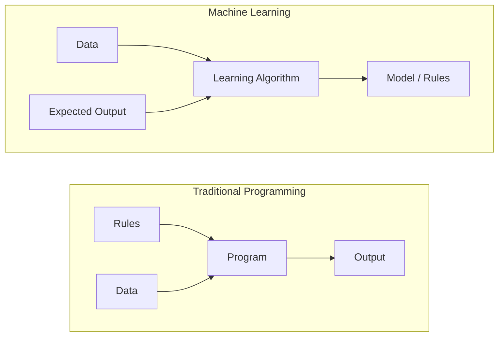
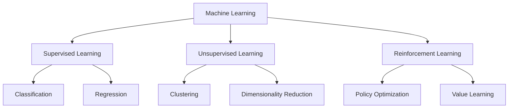
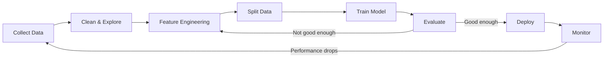
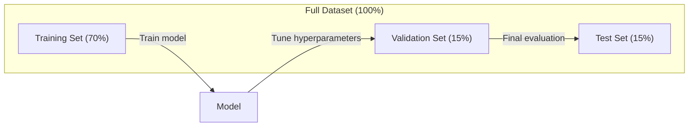
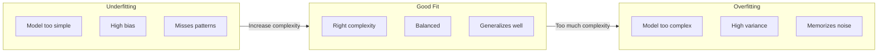
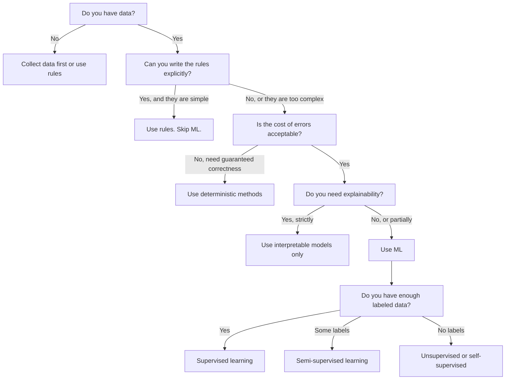
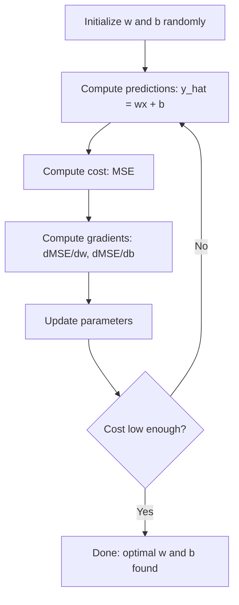
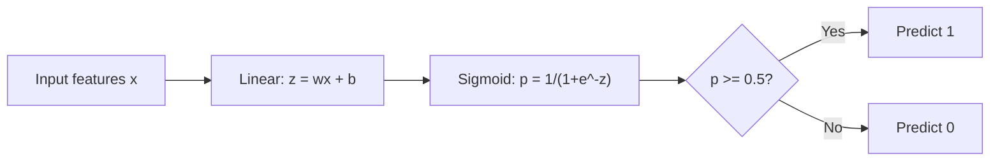
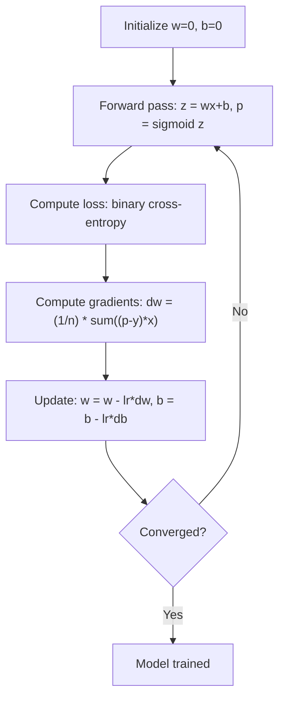

# ML Intro & Regression

> Combined lessons (3 parts), merged verbatim — no content removed.

**Type:** Combined

---

## Part 1 (ch035): What Is Machine Learning

> Machine learning is teaching computers to find patterns in data instead of writing rules by hand.

**Type:** Learn
**Languages:** Python
**Prerequisites:** Phase 1 (Math Foundations)
**Time:** ~45 minutes

## Learning Objectives

- Explain the difference between supervised, unsupervised, and reinforcement learning and identify which type applies to a given problem
- Implement a nearest centroid classifier from scratch and evaluate it against a random baseline
- Distinguish between classification and regression tasks and select the appropriate loss function for each
- Evaluate whether a given business problem is suitable for ML or better solved with deterministic rules

## The Problem

You want to build a spam filter. The traditional approach: sit down and write hundreds of rules. "If the email contains 'FREE MONEY', mark it spam. If it has more than 3 exclamation marks, mark it spam." You spend weeks writing rules. Then spammers change their wording. Your rules break. You write more rules. The cycle never ends.

Machine learning flips this. Instead of writing rules, you give the computer thousands of labeled emails ("spam" or "not spam") and let it figure out the rules on its own. The computer finds patterns you never would have thought of. When spammers change tactics, you retrain on new data instead of rewriting code.

This shift from "programming rules" to "learning from data" is the core of machine learning. Every recommendation engine, voice assistant, self-driving car, and language model works this way.

## The Concept

### Learning From Data, Not Rules

Traditional programming and machine learning solve problems in opposite directions.



Traditional programming: you write the rules. The program applies them to data to produce output.

Machine learning: you provide data and expected outputs. The algorithm discovers the rules.

The "model" that comes out of training IS the rules, encoded as numbers (weights, parameters). It generalizes from examples it has seen to make predictions on data it has never seen.

### The Three Types of Machine Learning



**Supervised Learning**: You have input-output pairs. The model learns to map inputs to outputs.
- "Here are 10,000 photos labeled cat or dog. Learn to tell them apart."
- "Here are house features and prices. Learn to predict the price."

**Unsupervised Learning**: You have inputs only. No labels. The model finds structure on its own.
- "Here are 10,000 customer purchase histories. Find natural groupings."
- "Here are 1,000 dimensional data points. Reduce to 2 dimensions while keeping structure."

**Reinforcement Learning**: An agent takes actions in an environment and receives rewards or penalties. It learns a strategy (policy) to maximize total reward.
- "Play this game. +1 for winning, -1 for losing. Figure out a strategy."
- "Control this robot arm. +1 for picking up the object, -0.01 for each second wasted."

Most of what you will build in practice uses supervised learning. Unsupervised learning is common for preprocessing and exploration. Reinforcement learning powers game AI, robotics, and RLHF for language models.

### Beyond the Big Three

The three categories above are clean, but real-world ML often blurs the lines.

**Semi-supervised learning** uses a small set of labeled data and a large set of unlabeled data. You might have 100 labeled medical images and 100,000 unlabeled ones. Techniques include:

- **Label propagation:** Build a graph connecting similar data points. Labels spread from labeled nodes to unlabeled neighbors through the graph.
- **Pseudo-labeling:** Train a model on the labeled data, use it to predict labels for unlabeled data, then retrain on everything. The model bootstraps its own training set.
- **Consistency regularization:** The model should give the same prediction for an input and a slightly perturbed version of that input. This works even without labels.

**Self-supervised learning** creates supervision from the data itself. No human labels needed at all. The model creates its own prediction task from the structure of the data.

- **Masked language modeling (BERT):** Hide 15% of words in a sentence, train the model to predict the missing words. The "labels" come from the original text.
- **Contrastive learning (SimCLR):** Take an image, create two augmented versions. Train the model to recognize they came from the same image while distinguishing them from augmented versions of other images.
- **Next-token prediction (GPT):** Predict the next word given all previous words. Every text document becomes a training example.

These are not separate categories from the big three. They are strategies that combine supervised and unsupervised ideas. Self-supervised learning is technically supervised (the model predicts something), but the labels are generated automatically, not by humans.

### Classification vs Regression

These are the two main supervised learning tasks.

| Aspect | Classification | Regression |
|--------|---------------|------------|
| Output | Discrete categories | Continuous numbers |
| Example | "Is this email spam?" | "What will the house price be?" |
| Output space | {cat, dog, bird} | Any real number |
| Loss function | Cross-entropy, accuracy | Mean squared error, MAE |
| Decision | Boundaries between classes | A curve that fits the data |

Classification answers "which category?" Regression answers "how much?"

Some problems can be framed either way. Predicting if a stock goes up or down is classification. Predicting the exact price is regression.

### The ML Workflow

Every machine learning project follows the same pipeline, regardless of the algorithm.



**Collect Data**: Gather raw data. More data is almost always better, but quality matters more than quantity.

**Clean & Explore**: Handle missing values, remove duplicates, visualize distributions, spot anomalies. This step often takes 60-80% of total project time.

**Feature Engineering**: Transform raw data into features the model can use. Turn dates into day-of-week. Normalize numerical columns. Encode categorical variables. Good features matter more than fancy algorithms.

**Split Data**: Divide into training, validation, and test sets. The model trains on training data, you tune hyperparameters on validation data, and you report final performance on test data.

**Train Model**: Feed training data into an algorithm. The algorithm adjusts internal parameters to minimize a loss function.

**Evaluate**: Measure performance on validation/test data. If performance is not acceptable, go back and try different features, algorithms, or hyperparameters.

**Deploy**: Put the model into production where it makes predictions on new data.

**Monitor**: Track performance over time. Data distributions change (data drift), and models degrade. When performance drops, retrain.

### Training, Validation, and Test Splits

This is the most important concept beginners get wrong. You must evaluate your model on data it has never seen during training. Otherwise you are measuring memorization, not learning.



| Split | Purpose | When used | Typical size |
|-------|---------|-----------|-------------|
| Training | Model learns from this data | During training | 60-80% |
| Validation | Tune hyperparameters, compare models | After each training run | 10-20% |
| Test | Final unbiased performance estimate | Once, at the very end | 10-20% |

The test set is sacred. You look at it exactly once. If you keep adjusting your model based on test performance, you are effectively training on the test set and your reported numbers are meaningless.

For small datasets, use k-fold cross-validation: split data into k parts, train on k-1 parts, validate on the remaining part, rotate, and average results.

### Overfitting vs Underfitting



**Underfitting**: The model is too simple to capture the patterns in the data. A straight line trying to fit a curved relationship. Training error is high. Test error is high.

**Overfitting**: The model is too complex and memorizes the training data, including its noise. A wiggly curve that passes through every training point but fails on new data. Training error is low. Test error is high.

**Good fit**: The model captures real patterns without memorizing noise. Training error and test error are both reasonably low.

Signs of overfitting:
- Training accuracy is much higher than validation accuracy
- The model performs well on training data but poorly on new data
- Adding more training data improves performance (the model was memorizing, not learning)

Fixes for overfitting:
- Get more training data
- Reduce model complexity (fewer parameters, simpler architecture)
- Regularization (add a penalty for large weights)
- Dropout (randomly zero out neurons during training)
- Early stopping (stop training when validation error starts increasing)

Fixes for underfitting:
- Use a more complex model
- Add more features
- Reduce regularization
- Train longer

### The Bias-Variance Tradeoff

This is the mathematical framework behind overfitting and underfitting.

**Bias**: Error from wrong assumptions in the model. A linear model has high bias when the true relationship is nonlinear. High bias leads to underfitting.

**Variance**: Error from sensitivity to small fluctuations in the training data. A model with high variance gives very different predictions when trained on different subsets of data. High variance leads to overfitting.

| Model complexity | Bias | Variance | Result |
|-----------------|------|----------|--------|
| Too low (linear model for curved data) | High | Low | Underfitting |
| Just right | Medium | Medium | Good generalization |
| Too high (degree-20 polynomial for 10 points) | Low | High | Overfitting |

Total error = Bias^2 + Variance + Irreducible noise

You cannot reduce irreducible noise (it is randomness in the data itself). You want to find the sweet spot where bias^2 + variance is minimized.

### No Free Lunch Theorem

There is no single algorithm that works best for every problem. An algorithm that performs well on one class of problems will perform poorly on another. This is why data scientists try multiple algorithms and compare results.

In practice, the choice depends on:
- How much data you have
- How many features there are
- Whether the relationship is linear or nonlinear
- Whether you need interpretability
- How much compute you can afford

### When NOT to Use Machine Learning

ML is powerful but not always the right tool. Before reaching for a model, ask whether you actually need one.

**Do not use ML when:**

- **Rules are simple and well-defined.** Tax calculation, sorting algorithms, unit conversions. If you can write the logic in a few if-statements, a model adds complexity for no benefit.
- **You have no data or very little data.** ML needs examples to learn from. With 10 data points, you cannot train anything meaningful. Collect data first.
- **The cost of being wrong is catastrophic and you need guaranteed correctness.** Medical dosage calculation, nuclear reactor control, cryptographic verification. ML models are probabilistic. They will sometimes be wrong. If "sometimes wrong" is unacceptable, use deterministic methods.
- **A lookup table or heuristic solves the problem.** If a simple threshold or table covers 99% of cases, adding ML increases maintenance cost without meaningful improvement.
- **You cannot explain the decision and explainability is required.** Regulated industries (lending, insurance, criminal justice) sometimes require that every decision be fully explainable. Some ML models are interpretable (linear regression, small decision trees). Most are not.
- **The problem changes faster than you can retrain.** If the rules change daily and retraining takes a week, the model is always stale.

Use this decision flowchart:



## Build It

The code in `code/ml_intro.py` implements a nearest centroid classifier from scratch, the simplest possible ML algorithm. It demonstrates the core idea: learn from data, then predict on new data.

### Step 1: Nearest Centroid Classifier from Scratch

The nearest centroid classifier computes the center (mean) of each class in the training data. To predict, it assigns each new point to the class whose center is closest.

```python
class NearestCentroid:
    def fit(self, X, y):
        self.classes = np.unique(y)
        self.centroids = np.array([
            X[y == c].mean(axis=0) for c in self.classes
        ])

    def predict(self, X):
        distances = np.array([
            np.sqrt(((X - c) ** 2).sum(axis=1))
            for c in self.centroids
        ])
        return self.classes[distances.argmin(axis=0)]
```

That is the entire algorithm. Fit computes two means. Predict computes distances. No gradient descent, no iteration, no hyperparameters.

### Step 2: Train on Synthetic Data

We generate a 2D classification dataset with two classes that overlap slightly. The centroid classifier draws a linear decision boundary between the class centers.

```python
rng = np.random.RandomState(42)
X_class0 = rng.randn(100, 2) + np.array([1.0, 1.0])
X_class1 = rng.randn(100, 2) + np.array([-1.0, -1.0])
X = np.vstack([X_class0, X_class1])
y = np.array([0] * 100 + [1] * 100)
```

### Step 3: Compare Against a Baseline

Every ML model should be compared against a trivial baseline. Here, the baseline predicts a random class. If your ML model does not beat random guessing, something is wrong.

```python
baseline_preds = rng.choice([0, 1], size=len(y_test))
baseline_acc = np.mean(baseline_preds == y_test)
```

The centroid classifier should get around 90%+ accuracy on this clean dataset. Random baseline gets around 50%.

### Why This Matters

The nearest centroid classifier is trivially simple. It has no hyperparameters, no iteration, no gradient descent. Yet it captures the fundamental ML pattern:

1. **Learn** a representation from training data (the centroids)
2. **Predict** on new data using that representation (nearest distance)
3. **Evaluate** against a baseline (random guessing)

Every ML algorithm, from logistic regression to transformers, follows this same three-step pattern. The representation gets more complex, but the workflow stays the same.

### Step 4: What the Centroid Classifier Cannot Do

The nearest centroid classifier assumes each class forms a single blob. It draws linear decision boundaries. It fails when:

- Classes have multiple clusters (e.g., the digit "1" can be written in several different ways)
- The decision boundary is nonlinear (e.g., one class wraps around another)
- Features have very different scales (distance is dominated by the largest-scale feature)

These limitations motivate every other algorithm you will learn. K-nearest neighbors handles multiple clusters. Decision trees handle nonlinear boundaries. Feature scaling fixes the scale problem. Each lesson builds on the limitations of the previous one.

## Use It

sklearn provides `NearestCentroid` and synthetic data generators:

```python
from sklearn.neighbors import NearestCentroid
from sklearn.datasets import make_classification
from sklearn.model_selection import train_test_split

X, y = make_classification(
    n_samples=500, n_features=2, n_redundant=0,
    n_clusters_per_class=1, random_state=42
)
X_train, X_test, y_train, y_test = train_test_split(X, y, test_size=0.3)

clf = NearestCentroid()
clf.fit(X_train, y_train)
print(f"Accuracy: {clf.score(X_test, y_test):.3f}")
```

## Ship It

This lesson produces `outputs/prompt-ml-problem-framer.md` -- a prompt that turns vague business problems into concrete ML tasks. Give it a problem description ("we want to reduce churn" or "predict demand for next quarter") and it identifies the learning type, defines the prediction target, lists candidate features, picks a success metric, establishes a baseline, and flags pitfalls like data leakage or class imbalance. Use it at the start of any ML project to avoid building the wrong thing.

## Key Terms

| Term | What people say | What it actually means |
|------|----------------|----------------------|
| Model | "The AI" | A mathematical function with learnable parameters that maps inputs to outputs |
| Training | "Teaching the AI" | Running an optimization algorithm to adjust model parameters so predictions match known outputs |
| Feature | "An input column" | A measurable property of the data that the model uses to make predictions |
| Label | "The answer" | The known output for a training example, used to compute the error signal |
| Hyperparameter | "A setting you tweak" | A parameter set before training that controls the learning process (learning rate, number of layers) |
| Loss function | "How wrong the model is" | A function that measures the gap between predicted and actual outputs, which training tries to minimize |
| Overfitting | "It memorized the test" | The model learned training-specific noise instead of general patterns, so it fails on new data |
| Underfitting | "It didn't learn anything" | The model is too simple to capture the real patterns in the data |
| Generalization | "It works on new data" | The model's ability to make accurate predictions on data it was not trained on |
| Cross-validation | "Testing on different chunks" | Repeatedly splitting data into train/test folds and averaging results, giving a more robust performance estimate |
| Regularization | "Keeping weights small" | Adding a penalty term to the loss function that discourages overly complex models |
| Data drift | "The world changed" | The statistical distribution of incoming data shifts over time, degrading model performance |

## Exercises

1. Take any dataset (e.g., Iris, Titanic). Split it 70/15/15 into train/validation/test. Explain why you should not tune hyperparameters on the test set.
2. List three real-world problems. For each one, identify whether it is classification, regression, or clustering, and whether it is supervised or unsupervised.
3. A model gets 99% accuracy on training data but 60% on test data. Diagnose the problem and list three things you would try to fix it.

## Further Reading

- [An Introduction to Statistical Learning](https://www.statlearning.com/) - free textbook covering all classical ML methods with practical examples
- [Google's Machine Learning Crash Course](https://developers.google.com/machine-learning/crash-course) - concise visual introduction to ML concepts
- [Scikit-learn User Guide](https://scikit-learn.org/stable/user_guide.html) - the practical reference for implementing ML in Python

[Reference](https://github.com/rohitg00/ai-engineering-from-scratch/tree/main/phases/02-ml-fundamentals/01-what-is-machine-learning)

---

## Part 2 (ch036): Linear Regression

> Linear regression draws the best straight line through your data. It is the "hello world" of machine learning.

**Type:** Build
**Languages:** Python
**Prerequisites:** Phase 1 (Linear Algebra, Calculus, Optimization), Phase 2 Lesson 1
**Time:** ~90 minutes

## Learning Objectives

- Derive the gradient descent update rules for mean squared error and implement linear regression from scratch
- Compare gradient descent and the normal equation in terms of computational complexity and when to use each
- Build a multiple linear regression model with feature standardization and interpret the learned weights
- Explain how Ridge regression (L2 regularization) prevents overfitting by penalizing large weights

## The Problem

You have data: house sizes and their sale prices. You want to predict the price of a new house given its size. You could eyeball it on a scatter plot, but you need a formula. You need a line that best fits the data so you can plug in any size and get a price prediction.

Linear regression gives you that line. More importantly, it introduces the entire ML training loop: define a model, define a cost function, optimize the parameters. Every ML algorithm follows this same pattern. Master it here with the simplest case, and you will recognize it everywhere.

This is not just for simple problems. Linear regression is used in production systems for demand forecasting, A/B test analysis, financial modeling, and as a baseline for every regression task.

## The Concept

### The Model

Linear regression assumes a linear relationship between input (x) and output (y):

```
y = wx + b
```

- `w` (weight/slope): how much y changes when x increases by 1
- `b` (bias/intercept): the value of y when x = 0

For multiple inputs (features), this extends to:

```
y = w1*x1 + w2*x2 + ... + wn*xn + b
```

Or in vector form: `y = w^T * x + b`

The goal: find the values of w and b that make the predicted y as close as possible to the actual y across all training examples.

### The Cost Function (Mean Squared Error)

How do you measure "as close as possible"? You need a single number that captures how wrong your predictions are. The most common choice is Mean Squared Error (MSE):

```
MSE = (1/n) * sum((y_predicted - y_actual)^2)
```

Why squared? Two reasons. First, it penalizes large errors more than small errors (an error of 10 is 100x worse than an error of 1, not 10x). Second, the squared function is smooth and differentiable everywhere, which makes optimization straightforward.

The cost function creates a surface. For a single weight w and bias b, the MSE surface looks like a bowl (a convex paraboloid). The bottom of the bowl is where MSE is minimized. Training means finding that bottom.

### Gradient Descent

Gradient descent finds the bottom of the bowl by taking steps downhill.



The gradients tell you two things: which direction to move each parameter, and how much to move.

For MSE with y_hat = wx + b:

```
dMSE/dw = (2/n) * sum((y_hat - y) * x)
dMSE/db = (2/n) * sum(y_hat - y)
```

The update rule:

```
w = w - learning_rate * dMSE/dw
b = b - learning_rate * dMSE/db
```

The learning rate controls step size. Too large: you overshoot the minimum and diverge. Too small: training takes forever. Typical starting values: 0.01, 0.001, or 0.0001.

### The Normal Equation (Closed-Form Solution)

For linear regression specifically, there is a direct formula that gives the optimal weights without any iteration:

```
w = (X^T * X)^(-1) * X^T * y
```

This inverts a matrix to solve for w in one step. It works perfectly for small datasets. For large datasets (millions of rows or thousands of features), gradient descent is preferred because matrix inversion is O(n^3) in the number of features.

### Multiple Linear Regression

With multiple features, the model becomes:

```
y = w1*x1 + w2*x2 + ... + wn*xn + b
```

Everything works the same: MSE is the cost function, gradient descent updates all weights simultaneously. The only difference is that you are fitting a hyperplane instead of a line.

Feature scaling matters here. If one feature ranges from 0 to 1 and another ranges from 0 to 1,000,000, gradient descent will struggle because the cost surface becomes elongated. Standardize features (subtract mean, divide by standard deviation) before training.

### Polynomial Regression

What if the relationship is not linear? You can still use linear regression by creating polynomial features:

```
y = w1*x + w2*x^2 + w3*x^3 + b
```

This is still "linear" regression because the model is linear in the weights (w1, w2, w3). You are just using nonlinear features of x.

Higher-degree polynomials can fit more complex curves but risk overfitting. A degree-10 polynomial will pass through every point in a 10-point dataset but predict poorly on new data.

### R-Squared Score

MSE tells you how wrong you are, but the number depends on the scale of y. R-squared (R^2) gives a scale-independent measure:

```
R^2 = 1 - (sum of squared residuals) / (sum of squared deviations from mean)
    = 1 - SS_res / SS_tot
```

- R^2 = 1.0: perfect predictions
- R^2 = 0.0: the model is no better than predicting the mean every time
- R^2 < 0.0: the model is worse than predicting the mean

### Regularization Preview (Ridge Regression)

When you have many features, the model can overfit by assigning large weights. Ridge regression (L2 regularization) adds a penalty:

```
Cost = MSE + lambda * sum(w_i^2)
```

The penalty term discourages large weights. The hyperparameter lambda controls the tradeoff: higher lambda means smaller weights and more regularization. This is covered in depth in a later lesson. For now, know that it exists and why it helps.

```figure
linear-regression-fit
```

## Build It

### Step 1: Generate sample data

```python
import random
import math

random.seed(42)

TRUE_W = 3.0
TRUE_B = 7.0
N_SAMPLES = 100

X = [random.uniform(0, 10) for _ in range(N_SAMPLES)]
y = [TRUE_W * x + TRUE_B + random.gauss(0, 2.0) for x in X]

print(f"Generated {N_SAMPLES} samples")
print(f"True relationship: y = {TRUE_W}x + {TRUE_B} (+ noise)")
print(f"First 5 points: {[(round(X[i], 2), round(y[i], 2)) for i in range(5)]}")
```

### Step 2: Linear regression from scratch with gradient descent

```python
class LinearRegression:
    def __init__(self, learning_rate=0.01):
        self.w = 0.0
        self.b = 0.0
        self.lr = learning_rate
        self.cost_history = []

    def predict(self, X):
        return [self.w * x + self.b for x in X]

    def compute_cost(self, X, y):
        predictions = self.predict(X)
        n = len(y)
        cost = sum((pred - actual) ** 2 for pred, actual in zip(predictions, y)) / n
        return cost

    def compute_gradients(self, X, y):
        predictions = self.predict(X)
        n = len(y)
        dw = (2 / n) * sum((pred - actual) * x for pred, actual, x in zip(predictions, y, X))
        db = (2 / n) * sum(pred - actual for pred, actual in zip(predictions, y))
        return dw, db

    def fit(self, X, y, epochs=1000, print_every=200):
        for epoch in range(epochs):
            dw, db = self.compute_gradients(X, y)
            self.w -= self.lr * dw
            self.b -= self.lr * db
            cost = self.compute_cost(X, y)
            self.cost_history.append(cost)
            if epoch % print_every == 0:
                print(f"  Epoch {epoch:4d} | Cost: {cost:.4f} | w: {self.w:.4f} | b: {self.b:.4f}")
        return self

    def r_squared(self, X, y):
        predictions = self.predict(X)
        y_mean = sum(y) / len(y)
        ss_res = sum((actual - pred) ** 2 for actual, pred in zip(y, predictions))
        ss_tot = sum((actual - y_mean) ** 2 for actual in y)
        return 1 - (ss_res / ss_tot)


print("=== Training Linear Regression (Gradient Descent) ===")
model = LinearRegression(learning_rate=0.005)
model.fit(X, y, epochs=1000, print_every=200)
print(f"\nLearned: y = {model.w:.4f}x + {model.b:.4f}")
print(f"True:    y = {TRUE_W}x + {TRUE_B}")
print(f"R-squared: {model.r_squared(X, y):.4f}")
```

### Step 3: Normal equation (closed-form solution)

```python
class LinearRegressionNormal:
    def __init__(self):
        self.w = 0.0
        self.b = 0.0

    def fit(self, X, y):
        n = len(X)
        x_mean = sum(X) / n
        y_mean = sum(y) / n
        numerator = sum((X[i] - x_mean) * (y[i] - y_mean) for i in range(n))
        denominator = sum((X[i] - x_mean) ** 2 for i in range(n))
        self.w = numerator / denominator
        self.b = y_mean - self.w * x_mean
        return self

    def predict(self, X):
        return [self.w * x + self.b for x in X]

    def r_squared(self, X, y):
        predictions = self.predict(X)
        y_mean = sum(y) / len(y)
        ss_res = sum((actual - pred) ** 2 for actual, pred in zip(y, predictions))
        ss_tot = sum((actual - y_mean) ** 2 for actual in y)
        return 1 - (ss_res / ss_tot)


print("\n=== Normal Equation (Closed-Form) ===")
model_normal = LinearRegressionNormal()
model_normal.fit(X, y)
print(f"Learned: y = {model_normal.w:.4f}x + {model_normal.b:.4f}")
print(f"R-squared: {model_normal.r_squared(X, y):.4f}")
```

### Step 4: Multiple linear regression

```python
class MultipleLinearRegression:
    def __init__(self, n_features, learning_rate=0.01):
        self.weights = [0.0] * n_features
        self.bias = 0.0
        self.lr = learning_rate
        self.cost_history = []

    def predict_single(self, x):
        return sum(w * xi for w, xi in zip(self.weights, x)) + self.bias

    def predict(self, X):
        return [self.predict_single(x) for x in X]

    def compute_cost(self, X, y):
        predictions = self.predict(X)
        n = len(y)
        return sum((pred - actual) ** 2 for pred, actual in zip(predictions, y)) / n

    def fit(self, X, y, epochs=1000, print_every=200):
        n = len(y)
        n_features = len(X[0])
        for epoch in range(epochs):
            predictions = self.predict(X)
            errors = [pred - actual for pred, actual in zip(predictions, y)]
            for j in range(n_features):
                grad = (2 / n) * sum(errors[i] * X[i][j] for i in range(n))
                self.weights[j] -= self.lr * grad
            grad_b = (2 / n) * sum(errors)
            self.bias -= self.lr * grad_b
            cost = self.compute_cost(X, y)
            self.cost_history.append(cost)
            if epoch % print_every == 0:
                print(f"  Epoch {epoch:4d} | Cost: {cost:.4f}")
        return self

    def r_squared(self, X, y):
        predictions = self.predict(X)
        y_mean = sum(y) / len(y)
        ss_res = sum((actual - pred) ** 2 for actual, pred in zip(y, predictions))
        ss_tot = sum((actual - y_mean) ** 2 for actual in y)
        return 1 - (ss_res / ss_tot)


random.seed(42)
N = 100
X_multi = []
y_multi = []
for _ in range(N):
    size = random.uniform(500, 3000)
    bedrooms = random.randint(1, 5)
    age = random.uniform(0, 50)
    price = 50 * size + 10000 * bedrooms - 1000 * age + 50000 + random.gauss(0, 20000)
    X_multi.append([size, bedrooms, age])
    y_multi.append(price)


def standardize(X):
    n_features = len(X[0])
    means = [sum(X[i][j] for i in range(len(X))) / len(X) for j in range(n_features)]
    stds = []
    for j in range(n_features):
        variance = sum((X[i][j] - means[j]) ** 2 for i in range(len(X))) / len(X)
        stds.append(variance ** 0.5)
    X_scaled = []
    for i in range(len(X)):
        row = [(X[i][j] - means[j]) / stds[j] if stds[j] > 0 else 0 for j in range(n_features)]
        X_scaled.append(row)
    return X_scaled, means, stds


y_mean_val = sum(y_multi) / len(y_multi)
y_std_val = (sum((yi - y_mean_val) ** 2 for yi in y_multi) / len(y_multi)) ** 0.5
y_scaled = [(yi - y_mean_val) / y_std_val for yi in y_multi]

X_scaled, x_means, x_stds = standardize(X_multi)

print("\n=== Multiple Linear Regression (3 features) ===")
print("Features: house size, bedrooms, age")
multi_model = MultipleLinearRegression(n_features=3, learning_rate=0.01)
multi_model.fit(X_scaled, y_scaled, epochs=1000, print_every=200)

print(f"\nWeights (standardized): {[round(w, 4) for w in multi_model.weights]}")
print(f"Bias (standardized): {multi_model.bias:.4f}")
print(f"R-squared: {multi_model.r_squared(X_scaled, y_scaled):.4f}")
```

### Step 5: Polynomial regression

```python
class PolynomialRegression:
    def __init__(self, degree, learning_rate=0.01):
        self.degree = degree
        self.weights = [0.0] * degree
        self.bias = 0.0
        self.lr = learning_rate

    def make_features(self, X):
        return [[x ** (d + 1) for d in range(self.degree)] for x in X]

    def predict(self, X):
        features = self.make_features(X)
        return [sum(w * f for w, f in zip(self.weights, row)) + self.bias for row in features]

    def fit(self, X, y, epochs=1000, print_every=200):
        features = self.make_features(X)
        n = len(y)
        for epoch in range(epochs):
            predictions = [sum(w * f for w, f in zip(self.weights, row)) + self.bias for row in features]
            errors = [pred - actual for pred, actual in zip(predictions, y)]
            for j in range(self.degree):
                grad = (2 / n) * sum(errors[i] * features[i][j] for i in range(n))
                self.weights[j] -= self.lr * grad
            grad_b = (2 / n) * sum(errors)
            self.bias -= self.lr * grad_b
            if epoch % print_every == 0:
                cost = sum(e ** 2 for e in errors) / n
                print(f"  Epoch {epoch:4d} | Cost: {cost:.6f}")
        return self

    def r_squared(self, X, y):
        predictions = self.predict(X)
        y_mean = sum(y) / len(y)
        ss_res = sum((actual - pred) ** 2 for actual, pred in zip(y, predictions))
        ss_tot = sum((actual - y_mean) ** 2 for actual in y)
        return 1 - (ss_res / ss_tot)


random.seed(42)
X_poly = [x / 10.0 for x in range(0, 50)]
y_poly = [0.5 * x ** 2 - 2 * x + 3 + random.gauss(0, 1.0) for x in X_poly]

x_max = max(abs(x) for x in X_poly)
X_poly_norm = [x / x_max for x in X_poly]
y_poly_mean = sum(y_poly) / len(y_poly)
y_poly_std = (sum((yi - y_poly_mean) ** 2 for yi in y_poly) / len(y_poly)) ** 0.5
y_poly_norm = [(yi - y_poly_mean) / y_poly_std for yi in y_poly]

print("\n=== Polynomial Regression (degree 2 vs degree 5) ===")
print("True relationship: y = 0.5x^2 - 2x + 3")

print("\nDegree 2:")
poly2 = PolynomialRegression(degree=2, learning_rate=0.1)
poly2.fit(X_poly_norm, y_poly_norm, epochs=2000, print_every=500)
print(f"  R-squared: {poly2.r_squared(X_poly_norm, y_poly_norm):.4f}")

print("\nDegree 5:")
poly5 = PolynomialRegression(degree=5, learning_rate=0.1)
poly5.fit(X_poly_norm, y_poly_norm, epochs=2000, print_every=500)
print(f"  R-squared: {poly5.r_squared(X_poly_norm, y_poly_norm):.4f}")

print("\nDegree 2 fits the true curve well. Degree 5 fits training data slightly better")
print("but risks overfitting on new data.")
```

### Step 6: Ridge regression (L2 regularization)

```python
class RidgeRegression:
    def __init__(self, n_features, learning_rate=0.01, alpha=1.0):
        self.weights = [0.0] * n_features
        self.bias = 0.0
        self.lr = learning_rate
        self.alpha = alpha

    def predict_single(self, x):
        return sum(w * xi for w, xi in zip(self.weights, x)) + self.bias

    def predict(self, X):
        return [self.predict_single(x) for x in X]

    def fit(self, X, y, epochs=1000, print_every=200):
        n = len(y)
        n_features = len(X[0])
        for epoch in range(epochs):
            predictions = self.predict(X)
            errors = [pred - actual for pred, actual in zip(predictions, y)]
            mse = sum(e ** 2 for e in errors) / n
            reg_term = self.alpha * sum(w ** 2 for w in self.weights)
            cost = mse + reg_term
            for j in range(n_features):
                grad = (2 / n) * sum(errors[i] * X[i][j] for i in range(n))
                grad += 2 * self.alpha * self.weights[j]
                self.weights[j] -= self.lr * grad
            grad_b = (2 / n) * sum(errors)
            self.bias -= self.lr * grad_b
            if epoch % print_every == 0:
                print(f"  Epoch {epoch:4d} | Cost: {cost:.4f} | L2 penalty: {reg_term:.4f}")
        return self


print("\n=== Ridge Regression (L2 Regularization) ===")
print("Same data as multiple regression, with alpha=0.1")
ridge = RidgeRegression(n_features=3, learning_rate=0.01, alpha=0.1)
ridge.fit(X_scaled, y_scaled, epochs=1000, print_every=200)
print(f"\nRidge weights: {[round(w, 4) for w in ridge.weights]}")
print(f"Plain weights: {[round(w, 4) for w in multi_model.weights]}")
print("Ridge weights are smaller (shrunk toward zero) due to the L2 penalty.")
```

## Use It

Now the same thing with scikit-learn, which is what you will actually use in production.

```python
from sklearn.linear_model import LinearRegression as SklearnLR
from sklearn.linear_model import Ridge
from sklearn.preprocessing import PolynomialFeatures, StandardScaler
from sklearn.model_selection import train_test_split
from sklearn.metrics import mean_squared_error, r2_score
import numpy as np

np.random.seed(42)
X_sk = np.random.uniform(0, 10, (100, 1))
y_sk = 3.0 * X_sk.squeeze() + 7.0 + np.random.normal(0, 2.0, 100)

X_train, X_test, y_train, y_test = train_test_split(X_sk, y_sk, test_size=0.2, random_state=42)

lr = SklearnLR()
lr.fit(X_train, y_train)
y_pred = lr.predict(X_test)

print("=== Scikit-learn Linear Regression ===")
print(f"Coefficient (w): {lr.coef_[0]:.4f}")
print(f"Intercept (b): {lr.intercept_:.4f}")
print(f"R-squared (test): {r2_score(y_test, y_pred):.4f}")
print(f"MSE (test): {mean_squared_error(y_test, y_pred):.4f}")

poly = PolynomialFeatures(degree=2, include_bias=False)
X_poly_sk = poly.fit_transform(X_train)
X_poly_test = poly.transform(X_test)

lr_poly = SklearnLR()
lr_poly.fit(X_poly_sk, y_train)
print(f"\nPolynomial degree 2 R-squared: {r2_score(y_test, lr_poly.predict(X_poly_test)):.4f}")

scaler = StandardScaler()
X_train_scaled = scaler.fit_transform(X_train)
X_test_scaled = scaler.transform(X_test)

ridge = Ridge(alpha=1.0)
ridge.fit(X_train_scaled, y_train)
print(f"Ridge R-squared: {r2_score(y_test, ridge.predict(X_test_scaled)):.4f}")
print(f"Ridge coefficient: {ridge.coef_[0]:.4f}")
```

Your from-scratch implementation and scikit-learn produce the same results. The difference: scikit-learn handles edge cases, numerical stability, and performance optimizations. Use the library for production. Use the from-scratch version to understand what is happening.

## Ship It

This lesson produces:
- `outputs/skill-regression.md` - a skill for choosing the right regression approach based on the problem

## Exercises

1. Implement batch gradient descent, stochastic gradient descent (SGD), and mini-batch gradient descent. Compare convergence speed on the same dataset. Which converges fastest? Which has the smoothest cost curve?
2. Generate data from a cubic function (y = ax^3 + bx^2 + cx + d + noise). Fit polynomials of degree 1, 3, and 10. Compare training R^2 and test R^2. At what degree does overfitting become obvious?
3. Implement Lasso regression (L1 regularization: penalty = alpha * sum(|w_i|)). Train on the multi-feature housing data. Compare which weights go to zero vs Ridge. Why does L1 produce sparse solutions while L2 does not?

## Key Terms

| Term | What people say | What it actually means |
|------|----------------|----------------------|
| Linear regression | "Draw a line through data" | Find weight w and bias b that minimize the sum of squared differences between wx+b and actual y values |
| Cost function | "How bad the model is" | A function that maps model parameters to a single number measuring prediction error, which optimization minimizes |
| Mean squared error | "Average of squared errors" | (1/n) * sum of (predicted - actual)^2, penalizing large errors disproportionately |
| Gradient descent | "Walk downhill" | Iteratively adjust parameters in the direction that reduces the cost function, using partial derivatives |
| Learning rate | "Step size" | A scalar that controls how much parameters change per gradient descent step |
| Normal equation | "Solve it directly" | The closed-form solution w = (X^T X)^-1 X^T y that gives optimal weights without iteration |
| R-squared | "How good the fit is" | The fraction of variance in y explained by the model, ranging from negative infinity to 1.0 |
| Feature scaling | "Make features comparable" | Transforming features to similar ranges (e.g., zero mean, unit variance) so gradient descent converges faster |
| Regularization | "Penalize complexity" | Adding a term to the cost function that shrinks weights, preventing overfitting |
| Ridge regression | "L2 regularization" | Linear regression with a penalty of lambda * sum(w_i^2) added to MSE |
| Polynomial regression | "Fitting curves with linear math" | Linear regression on polynomial features (x, x^2, x^3, ...), still linear in the weights |
| Overfitting | "Memorizing training data" | Using a model so complex that it fits noise in training data and fails on new data |

## Further Reading

- [An Introduction to Statistical Learning (ISLR)](https://www.statlearning.com/) -- free PDF, chapters 3 and 6 cover linear regression and regularization with practical R examples
- [The Elements of Statistical Learning (ESL)](https://hastie.su.domains/ElemStatLearn/) -- free PDF, the more mathematical companion to ISLR with deeper treatment of ridge and lasso
- [Stanford CS229 Lecture Notes on Linear Regression](https://cs229.stanford.edu/main_notes.pdf) -- Andrew Ng's notes deriving the normal equation and gradient descent from first principles
- [scikit-learn LinearRegression documentation](https://scikit-learn.org/stable/modules/linear_model.html) -- practical reference for LinearRegression, Ridge, Lasso, and ElasticNet with code examples

[Reference](https://github.com/rohitg00/ai-engineering-from-scratch/tree/main/phases/02-ml-fundamentals/02-linear-regression)

---

## Part 3 (ch037): Logistic Regression

> Logistic regression bends a straight line into an S-curve to answer yes-or-no questions with probabilities.

**Type:** Build
**Languages:** Python
**Prerequisites:** Phase 2 Lesson 1-2 (What Is ML, Linear Regression)
**Time:** ~90 minutes

## Learning Objectives

- Implement logistic regression from scratch using the sigmoid function and binary cross-entropy loss
- Compute and interpret precision, recall, F1 score, and the confusion matrix for binary classification
- Explain why MSE fails for classification and why binary cross-entropy produces a convex cost surface
- Build a softmax regression model for multi-class classification and evaluate threshold tuning tradeoffs

## The Problem

You want to predict whether a tumor is malignant or benign given its size. You try linear regression. It outputs numbers like 0.3 or 1.7 or -0.5. What do those mean? Is 1.7 "very malignant"? Is -0.5 "very benign"? Linear regression outputs unbounded numbers. Classification needs bounded probabilities between 0 and 1, and a clear decision: yes or no.

Logistic regression solves this. It takes the same linear combination (wx + b) and passes it through the sigmoid function, which squashes any number into the range (0, 1). The output is a probability. You set a threshold (usually 0.5) and make a decision.

This is one of the most widely used algorithms in practice. Despite its name, logistic regression is a classification algorithm, not a regression algorithm. The name comes from the logistic (sigmoid) function it uses.

## The Concept

### Why Linear Regression Fails for Classification

Imagine predicting pass/fail (1/0) based on study hours. Linear regression fits a line through the data:

```
hours:  1   2   3   4   5   6   7   8   9   10
actual: 0   0   0   0   1   1   1   1   1   1
```

A linear fit might produce predictions like -0.2 at hour 1 and 1.3 at hour 10. These values are not probabilities. They go below 0 and above 1. Worse, a single outlier (someone who studied 50 hours) would drag the entire line, changing predictions for everyone.

Classification needs a function that:
- Outputs values between 0 and 1 (probabilities)
- Creates a sharp transition (a decision boundary)
- Is not distorted by outliers far from the boundary

### The Sigmoid Function

The sigmoid function does exactly this:

```
sigmoid(z) = 1 / (1 + e^(-z))
```

Properties:
- When z is large and positive, sigmoid(z) approaches 1
- When z is large and negative, sigmoid(z) approaches 0
- When z = 0, sigmoid(z) = 0.5
- The output is always between 0 and 1
- The function is smooth and differentiable everywhere

The derivative has a convenient form: sigmoid'(z) = sigmoid(z) * (1 - sigmoid(z)). This makes gradient computation efficient.

### Logistic Regression = Linear Model + Sigmoid

The model computes z = wx + b (same as linear regression), then applies sigmoid:



The output p is interpreted as P(y=1 | x), the probability that the input belongs to class 1. The decision boundary is where wx + b = 0, which makes sigmoid output exactly 0.5.

### Binary Cross-Entropy Loss

You cannot use MSE for logistic regression. MSE with a sigmoid creates a non-convex cost surface with many local minima. Instead, use binary cross-entropy (log loss):

```
Loss = -(1/n) * sum(y * log(p) + (1-y) * log(1-p))
```

Why this works:
- When y=1 and p is close to 1: log(1) = 0, so loss is near 0 (correct, low cost)
- When y=1 and p is close to 0: log(0) approaches negative infinity, so loss is huge (wrong, high cost)
- When y=0 and p is close to 0: log(1) = 0, so loss is near 0 (correct, low cost)
- When y=0 and p is close to 1: log(0) approaches negative infinity, so loss is huge (wrong, high cost)

This loss function is convex for logistic regression, guaranteeing a single global minimum.

### Gradient Descent for Logistic Regression

The gradients for binary cross-entropy with sigmoid have a clean form:

```
dL/dw = (1/n) * sum((p - y) * x)
dL/db = (1/n) * sum(p - y)
```

These look identical to the linear regression gradients. The difference is that p = sigmoid(wx + b) instead of p = wx + b. The sigmoid introduces the nonlinearity, but the gradient update rule stays the same.



### The Decision Boundary

For a 2D input (two features), the decision boundary is the line where:

```
w1*x1 + w2*x2 + b = 0
```

Points on one side get classified as 1, points on the other side as 0. Logistic regression always produces a linear decision boundary. If you need a curved boundary, you either add polynomial features or use a nonlinear model.

### Multi-Class Classification with Softmax

Binary logistic regression handles two classes. For k classes, use the softmax function:

```
softmax(z_i) = e^(z_i) / sum(e^(z_j) for all j)
```

Each class has its own weight vector. The model computes a score z_i for each class, then softmax converts scores to probabilities that sum to 1. The predicted class is the one with the highest probability.

The loss function becomes categorical cross-entropy:

```
Loss = -(1/n) * sum(sum(y_k * log(p_k)))
```

where y_k is 1 for the true class and 0 for all others (one-hot encoding).

### Evaluation Metrics

Accuracy alone is not enough. For a dataset with 95% negative and 5% positive, a model that always predicts negative gets 95% accuracy but is useless.

**Confusion Matrix**:

| | Predicted Positive | Predicted Negative |
|---|---|---|
| Actually Positive | True Positive (TP) | False Negative (FN) |
| Actually Negative | False Positive (FP) | True Negative (TN) |

**Precision**: Of all predicted positives, how many are actually positive?
```
Precision = TP / (TP + FP)
```

**Recall** (Sensitivity): Of all actual positives, how many did we catch?
```
Recall = TP / (TP + FN)
```

**F1 Score**: Harmonic mean of precision and recall. Balances both metrics.
```
F1 = 2 * (Precision * Recall) / (Precision + Recall)
```

When to prioritize:
- **Precision**: when false positives are costly (spam filter, you do not want to block legitimate email)
- **Recall**: when false negatives are costly (cancer screening, you do not want to miss a tumor)
- **F1**: when you need a single balanced metric

```figure
logistic-sigmoid
```

## Build It

### Step 1: Sigmoid function and data generation

```python
import random
import math

def sigmoid(z):
    z = max(-500, min(500, z))
    return 1.0 / (1.0 + math.exp(-z))


random.seed(42)
N = 200
X = []
y = []

for _ in range(N // 2):
    X.append([random.gauss(2, 1), random.gauss(2, 1)])
    y.append(0)

for _ in range(N // 2):
    X.append([random.gauss(5, 1), random.gauss(5, 1)])
    y.append(1)

combined = list(zip(X, y))
random.shuffle(combined)
X, y = zip(*combined)
X = list(X)
y = list(y)

print(f"Generated {N} samples (2 classes, 2 features)")
print(f"Class 0 center: (2, 2), Class 1 center: (5, 5)")
print(f"First 5 samples:")
for i in range(5):
    print(f"  Features: [{X[i][0]:.2f}, {X[i][1]:.2f}], Label: {y[i]}")
```

### Step 2: Logistic regression from scratch

```python
class LogisticRegression:
    def __init__(self, n_features, learning_rate=0.01):
        self.weights = [0.0] * n_features
        self.bias = 0.0
        self.lr = learning_rate
        self.loss_history = []

    def predict_proba(self, x):
        z = sum(w * xi for w, xi in zip(self.weights, x)) + self.bias
        return sigmoid(z)

    def predict(self, x, threshold=0.5):
        return 1 if self.predict_proba(x) >= threshold else 0

    def compute_loss(self, X, y):
        n = len(y)
        total = 0.0
        for i in range(n):
            p = self.predict_proba(X[i])
            p = max(1e-15, min(1 - 1e-15, p))
            total += y[i] * math.log(p) + (1 - y[i]) * math.log(1 - p)
        return -total / n

    def fit(self, X, y, epochs=1000, print_every=200):
        n = len(y)
        n_features = len(X[0])
        for epoch in range(epochs):
            dw = [0.0] * n_features
            db = 0.0
            for i in range(n):
                p = self.predict_proba(X[i])
                error = p - y[i]
                for j in range(n_features):
                    dw[j] += error * X[i][j]
                db += error
            for j in range(n_features):
                self.weights[j] -= self.lr * (dw[j] / n)
            self.bias -= self.lr * (db / n)
            loss = self.compute_loss(X, y)
            self.loss_history.append(loss)
            if epoch % print_every == 0:
                print(f"  Epoch {epoch:4d} | Loss: {loss:.4f} | w: [{self.weights[0]:.3f}, {self.weights[1]:.3f}] | b: {self.bias:.3f}")
        return self

    def accuracy(self, X, y):
        correct = sum(1 for i in range(len(y)) if self.predict(X[i]) == y[i])
        return correct / len(y)


split = int(0.8 * N)
X_train, X_test = X[:split], X[split:]
y_train, y_test = y[:split], y[split:]

print("\n=== Training Logistic Regression ===")
model = LogisticRegression(n_features=2, learning_rate=0.1)
model.fit(X_train, y_train, epochs=1000, print_every=200)

print(f"\nTrain accuracy: {model.accuracy(X_train, y_train):.4f}")
print(f"Test accuracy:  {model.accuracy(X_test, y_test):.4f}")
print(f"Weights: [{model.weights[0]:.4f}, {model.weights[1]:.4f}]")
print(f"Bias: {model.bias:.4f}")
```

### Step 3: Confusion matrix and metrics from scratch

```python
class ClassificationMetrics:
    def __init__(self, y_true, y_pred):
        self.tp = sum(1 for t, p in zip(y_true, y_pred) if t == 1 and p == 1)
        self.tn = sum(1 for t, p in zip(y_true, y_pred) if t == 0 and p == 0)
        self.fp = sum(1 for t, p in zip(y_true, y_pred) if t == 0 and p == 1)
        self.fn = sum(1 for t, p in zip(y_true, y_pred) if t == 1 and p == 0)

    def accuracy(self):
        total = self.tp + self.tn + self.fp + self.fn
        return (self.tp + self.tn) / total if total > 0 else 0

    def precision(self):
        denom = self.tp + self.fp
        return self.tp / denom if denom > 0 else 0

    def recall(self):
        denom = self.tp + self.fn
        return self.tp / denom if denom > 0 else 0

    def f1(self):
        p = self.precision()
        r = self.recall()
        return 2 * p * r / (p + r) if (p + r) > 0 else 0

    def print_confusion_matrix(self):
        print(f"\n  Confusion Matrix:")
        print(f"                  Predicted")
        print(f"                  Pos   Neg")
        print(f"  Actual Pos     {self.tp:4d}  {self.fn:4d}")
        print(f"  Actual Neg     {self.fp:4d}  {self.tn:4d}")

    def print_report(self):
        self.print_confusion_matrix()
        print(f"\n  Accuracy:  {self.accuracy():.4f}")
        print(f"  Precision: {self.precision():.4f}")
        print(f"  Recall:    {self.recall():.4f}")
        print(f"  F1 Score:  {self.f1():.4f}")


y_pred_test = [model.predict(x) for x in X_test]
print("\n=== Classification Report (Test Set) ===")
metrics = ClassificationMetrics(y_test, y_pred_test)
metrics.print_report()
```

### Step 4: Decision boundary analysis

```python
print("\n=== Decision Boundary ===")
w1, w2 = model.weights
b = model.bias
print(f"Decision boundary: {w1:.4f}*x1 + {w2:.4f}*x2 + {b:.4f} = 0")
if abs(w2) > 1e-10:
    print(f"Solved for x2:     x2 = {-w1/w2:.4f}*x1 + {-b/w2:.4f}")

print("\nSample predictions near the boundary:")
test_points = [
    [3.0, 3.0],
    [3.5, 3.5],
    [4.0, 4.0],
    [2.5, 2.5],
    [5.0, 5.0],
]
for point in test_points:
    prob = model.predict_proba(point)
    pred = model.predict(point)
    print(f"  [{point[0]}, {point[1]}] -> prob={prob:.4f}, class={pred}")
```

### Step 5: Multi-class with softmax

```python
class SoftmaxRegression:
    def __init__(self, n_features, n_classes, learning_rate=0.01):
        self.n_features = n_features
        self.n_classes = n_classes
        self.lr = learning_rate
        self.weights = [[0.0] * n_features for _ in range(n_classes)]
        self.biases = [0.0] * n_classes

    def softmax(self, scores):
        max_score = max(scores)
        exp_scores = [math.exp(s - max_score) for s in scores]
        total = sum(exp_scores)
        return [e / total for e in exp_scores]

    def predict_proba(self, x):
        scores = [
            sum(self.weights[k][j] * x[j] for j in range(self.n_features)) + self.biases[k]
            for k in range(self.n_classes)
        ]
        return self.softmax(scores)

    def predict(self, x):
        probs = self.predict_proba(x)
        return probs.index(max(probs))

    def fit(self, X, y, epochs=1000, print_every=200):
        n = len(y)
        for epoch in range(epochs):
            grad_w = [[0.0] * self.n_features for _ in range(self.n_classes)]
            grad_b = [0.0] * self.n_classes
            total_loss = 0.0
            for i in range(n):
                probs = self.predict_proba(X[i])
                for k in range(self.n_classes):
                    target = 1.0 if y[i] == k else 0.0
                    error = probs[k] - target
                    for j in range(self.n_features):
                        grad_w[k][j] += error * X[i][j]
                    grad_b[k] += error
                true_prob = max(probs[y[i]], 1e-15)
                total_loss -= math.log(true_prob)
            for k in range(self.n_classes):
                for j in range(self.n_features):
                    self.weights[k][j] -= self.lr * (grad_w[k][j] / n)
                self.biases[k] -= self.lr * (grad_b[k] / n)
            if epoch % print_every == 0:
                print(f"  Epoch {epoch:4d} | Loss: {total_loss / n:.4f}")
        return self

    def accuracy(self, X, y):
        correct = sum(1 for i in range(len(y)) if self.predict(X[i]) == y[i])
        return correct / len(y)


random.seed(42)
X_3class = []
y_3class = []

centers = [(1, 1), (5, 1), (3, 5)]
for label, (cx, cy) in enumerate(centers):
    for _ in range(50):
        X_3class.append([random.gauss(cx, 0.8), random.gauss(cy, 0.8)])
        y_3class.append(label)

combined = list(zip(X_3class, y_3class))
random.shuffle(combined)
X_3class, y_3class = zip(*combined)
X_3class = list(X_3class)
y_3class = list(y_3class)

split_3 = int(0.8 * len(X_3class))
X_train_3 = X_3class[:split_3]
y_train_3 = y_3class[:split_3]
X_test_3 = X_3class[split_3:]
y_test_3 = y_3class[split_3:]

print("\n=== Multi-class Softmax Regression (3 classes) ===")
softmax_model = SoftmaxRegression(n_features=2, n_classes=3, learning_rate=0.1)
softmax_model.fit(X_train_3, y_train_3, epochs=1000, print_every=200)
print(f"\nTrain accuracy: {softmax_model.accuracy(X_train_3, y_train_3):.4f}")
print(f"Test accuracy:  {softmax_model.accuracy(X_test_3, y_test_3):.4f}")

print("\nSample predictions:")
for i in range(5):
    probs = softmax_model.predict_proba(X_test_3[i])
    pred = softmax_model.predict(X_test_3[i])
    print(f"  True: {y_test_3[i]}, Predicted: {pred}, Probs: [{', '.join(f'{p:.3f}' for p in probs)}]")
```

### Step 6: Threshold tuning

```python
print("\n=== Threshold Tuning ===")
print("Default threshold: 0.5. Adjusting the threshold trades precision for recall.\n")

thresholds = [0.3, 0.4, 0.5, 0.6, 0.7]
print(f"{'Threshold':>10} {'Accuracy':>10} {'Precision':>10} {'Recall':>10} {'F1':>10}")
print("-" * 52)

for t in thresholds:
    y_pred_t = [1 if model.predict_proba(x) >= t else 0 for x in X_test]
    m = ClassificationMetrics(y_test, y_pred_t)
    print(f"{t:>10.1f} {m.accuracy():>10.4f} {m.precision():>10.4f} {m.recall():>10.4f} {m.f1():>10.4f}")
```

## Use It

Now the same thing with scikit-learn.

```python
from sklearn.linear_model import LogisticRegression as SklearnLR
from sklearn.metrics import accuracy_score, precision_score, recall_score, f1_score
from sklearn.metrics import confusion_matrix, classification_report
from sklearn.model_selection import train_test_split
from sklearn.preprocessing import StandardScaler
import numpy as np

np.random.seed(42)
X_0 = np.random.randn(100, 2) + [2, 2]
X_1 = np.random.randn(100, 2) + [5, 5]
X_sk = np.vstack([X_0, X_1])
y_sk = np.array([0] * 100 + [1] * 100)

X_tr, X_te, y_tr, y_te = train_test_split(X_sk, y_sk, test_size=0.2, random_state=42)

scaler = StandardScaler()
X_tr_sc = scaler.fit_transform(X_tr)
X_te_sc = scaler.transform(X_te)

lr = SklearnLR()
lr.fit(X_tr_sc, y_tr)
y_pred = lr.predict(X_te_sc)

print("=== Scikit-learn Logistic Regression ===")
print(f"Accuracy:  {accuracy_score(y_te, y_pred):.4f}")
print(f"Precision: {precision_score(y_te, y_pred):.4f}")
print(f"Recall:    {recall_score(y_te, y_pred):.4f}")
print(f"F1:        {f1_score(y_te, y_pred):.4f}")
print(f"\nConfusion Matrix:\n{confusion_matrix(y_te, y_pred)}")
print(f"\nClassification Report:\n{classification_report(y_te, y_pred)}")
```

Your from-scratch implementation produces the same decision boundary and metrics. Scikit-learn adds solver options (liblinear, lbfgs, saga), automatic regularization, multi-class strategies (one-vs-rest, multinomial), and numerical stability optimizations.

## Ship It

This lesson produces:
- `code/logistic_regression.py` - logistic regression from scratch with metrics

## Exercises

1. Generate a dataset that is NOT linearly separable (e.g., two concentric circles). Train logistic regression and observe its failure. Then add polynomial features (x1^2, x2^2, x1*x2) and train again. Show that the accuracy improves.
2. Implement a multi-class confusion matrix for the 3-class softmax model. Compute per-class precision and recall. Which class is hardest to classify?
3. Build an ROC curve from scratch. For 100 threshold values from 0 to 1, compute the true positive rate and false positive rate. Calculate the AUC (area under the curve) using the trapezoidal rule.

## Key Terms

| Term | What people say | What it actually means |
|------|----------------|----------------------|
| Logistic regression | "Regression for classification" | A linear model followed by a sigmoid function that outputs class probabilities |
| Sigmoid function | "The S-curve" | The function 1/(1+e^(-z)) that maps any real number to the range (0, 1) |
| Binary cross-entropy | "Log loss" | The loss function -[y*log(p) + (1-y)*log(1-p)] that penalizes confident wrong predictions severely |
| Decision boundary | "The dividing line" | The surface where the model's output probability equals 0.5, separating predicted classes |
| Softmax | "Multi-class sigmoid" | A function that converts a vector of scores into probabilities that sum to 1 |
| Precision | "How many selected are relevant" | TP / (TP + FP), the fraction of positive predictions that are actually positive |
| Recall | "How many relevant are selected" | TP / (TP + FN), the fraction of actual positives that the model correctly identifies |
| F1 score | "Balanced accuracy" | The harmonic mean of precision and recall: 2*P*R / (P+R) |
| Confusion matrix | "The error breakdown" | A table showing TP, TN, FP, FN counts for each class pair |
| Threshold | "The cutoff" | The probability value above which the model predicts class 1 (default 0.5, tunable) |
| One-hot encoding | "Binary columns for categories" | Representing class k as a vector of zeros with a 1 at position k |
| Categorical cross-entropy | "Multi-class log loss" | The extension of binary cross-entropy to k classes using one-hot encoded labels |

[Reference](https://github.com/rohitg00/ai-engineering-from-scratch/tree/main/phases/02-ml-fundamentals/03-logistic-regression)
