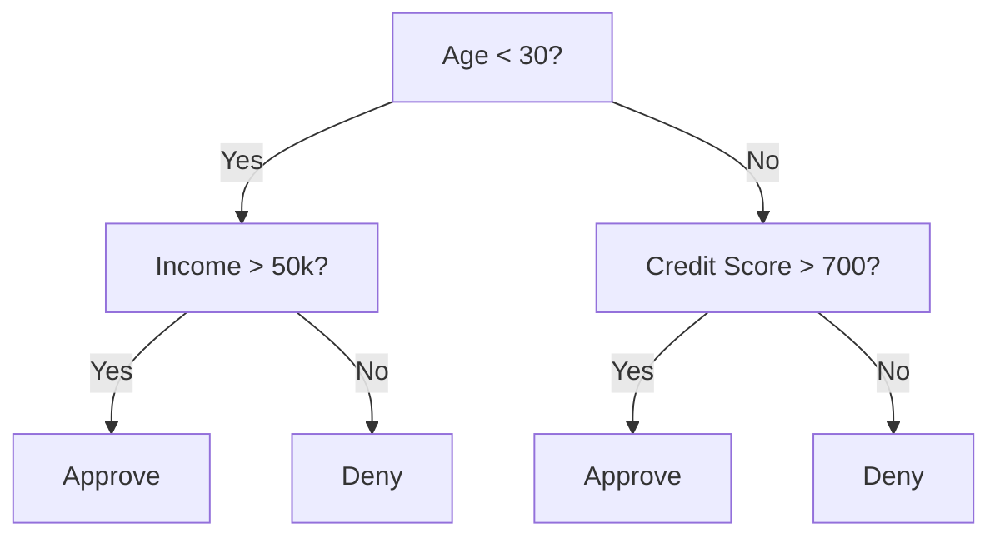
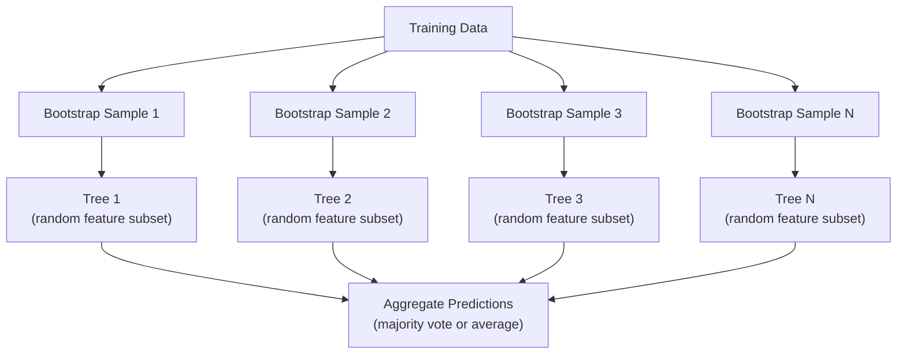
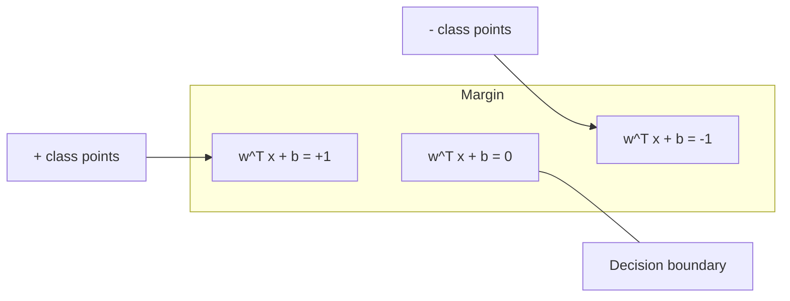
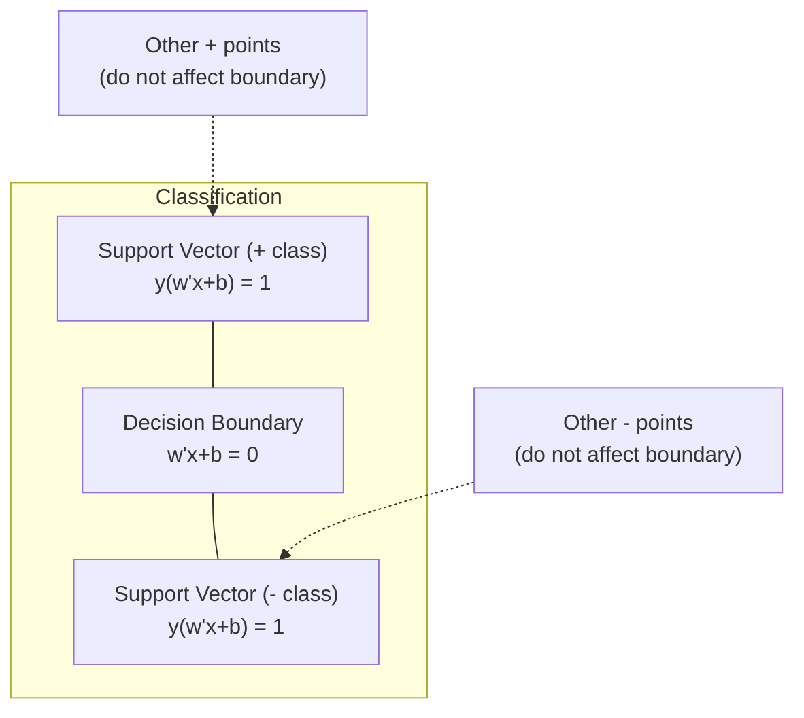
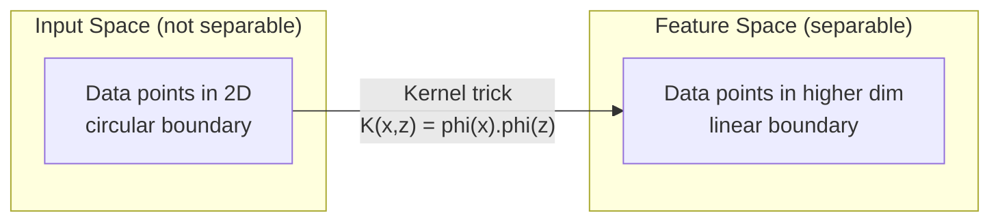
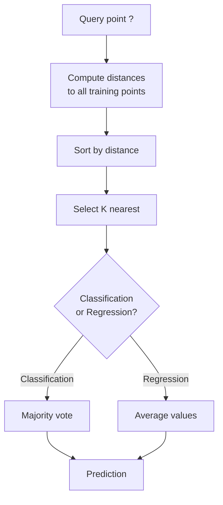
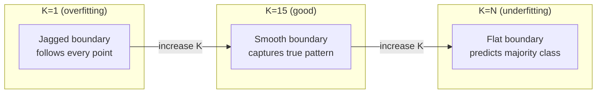
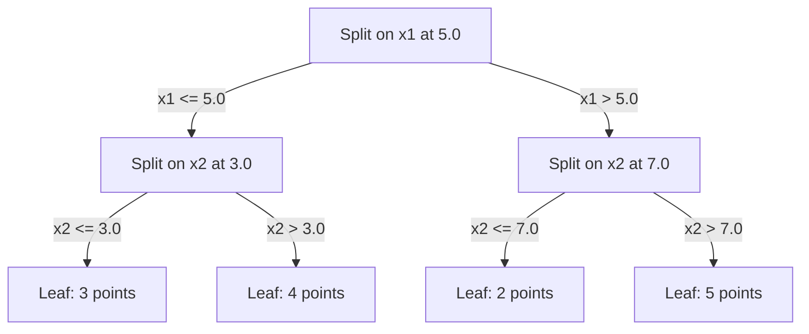

# Trees, SVMs, KNN & Naive Bayes

> Combined lessons (4 parts), merged verbatim — no content removed.

**Type:** Combined

---

## Part 1 (ch038): Decision Trees and Random Forests

> A decision tree is just a flowchart. But a forest of them is one of the most powerful tools in ML.

**Type:** Build
**Language:** Python
**Prerequisites:** Phase 1 (Lessons 09 Information Theory, 06 Probability)
**Time:** ~90 minutes

## Learning Objectives

- Implement Gini impurity, entropy, and information gain calculations to find optimal decision tree splits
- Build a decision tree classifier from scratch with pre-pruning controls (max depth, min samples)
- Construct a random forest using bootstrap sampling and feature randomization, and explain why it reduces variance
- Compare MDI feature importance with permutation importance and identify when MDI is biased

## The Problem

You have tabular data. Rows are samples, columns are features, and there is a target column you want to predict. You could throw a neural network at it. But for tabular data, tree-based models (decision trees, random forests, gradient boosted trees) consistently outperform deep learning. Kaggle competitions on structured data are dominated by XGBoost and LightGBM, not transformers.

Why? Trees handle mixed feature types (numeric and categorical) without preprocessing. They handle nonlinear relationships without feature engineering. They are interpretable: you can look at the tree and see exactly why a prediction was made. And random forests, which average many trees, are highly resistant to overfitting on moderate-sized datasets.

This lesson builds decision trees from scratch using recursive splitting, then builds a random forest on top. You will implement the math behind split criteria (Gini impurity, entropy, information gain) and understand why an ensemble of weak learners becomes a strong one.

## The Concept

### What a decision tree does

A decision tree partitions the feature space into rectangular regions by asking a sequence of yes/no questions.



Each internal node tests a feature against a threshold. Each leaf node makes a prediction. To classify a new data point, you start at the root and follow the branches until you reach a leaf.

The tree is built top-down by choosing, at each node, the feature and threshold that best separate the data. "Best" is defined by a split criterion.

### Split criteria: measuring impurity

At each node, we have a set of samples. We want to split them so that the resulting child nodes are as "pure" as possible, meaning each child contains mostly one class.

**Gini impurity** measures the probability that a randomly chosen sample would be misclassified if it were labeled according to the class distribution at that node.

```
Gini(S) = 1 - sum(p_k^2)

where p_k is the proportion of class k in set S.
```

For a pure node (all one class), Gini = 0. For a binary split with 50/50 classes, Gini = 0.5. Lower is better.

```
Example: 6 cats, 4 dogs

Gini = 1 - (0.6^2 + 0.4^2) = 1 - (0.36 + 0.16) = 0.48
```

**Entropy** measures the information content (disorder) in a node. Covered in Phase 1 Lesson 09.

```
Entropy(S) = -sum(p_k * log2(p_k))
```

For a pure node, entropy = 0. For a 50/50 binary split, entropy = 1.0. Lower is better.

```
Example: 6 cats, 4 dogs

Entropy = -(0.6 * log2(0.6) + 0.4 * log2(0.4))
        = -(0.6 * -0.737 + 0.4 * -1.322)
        = 0.442 + 0.529
        = 0.971 bits
```

**Information gain** is the reduction in impurity (entropy or Gini) after a split.

```
IG(S, feature, threshold) = Impurity(S) - weighted_avg(Impurity(S_left), Impurity(S_right))

where the weights are the proportions of samples in each child.
```

The greedy algorithm at each node: try every feature and every possible threshold. Pick the (feature, threshold) pair that maximizes information gain.

### How splitting works

For a dataset with n features and m samples at the current node:

1. For each feature j (j = 1 to n):
   - Sort the samples by feature j
   - Try every midpoint between consecutive distinct values as a threshold
   - Compute the information gain for each threshold
2. Select the feature and threshold with the highest information gain
3. Split the data into left (feature <= threshold) and right (feature > threshold)
4. Recurse on each child

This greedy approach does not guarantee the globally optimal tree. Finding the optimal tree is NP-hard. But greedy splitting works well in practice.

### Stopping conditions

Without stopping conditions, the tree grows until every leaf is pure (one sample per leaf). This perfectly memorizes the training data and generalizes terribly.

**Pre-pruning** stops the tree before it fully grows:
- Maximum depth: stop splitting when the tree reaches a set depth
- Minimum samples per leaf: stop if a node has fewer than k samples
- Minimum information gain: stop if the best split improves impurity by less than a threshold
- Maximum leaf nodes: limit the total number of leaves

**Post-pruning** grows the full tree, then trims it back:
- Cost-complexity pruning (used by scikit-learn): adds a penalty proportional to the number of leaves. Increase the penalty to get smaller trees
- Reduced error pruning: remove a subtree if the validation error does not increase

Pre-pruning is simpler and faster. Post-pruning often produces better trees because it does not prematurely stop splits that might lead to useful further splits.

### Decision trees for regression

For regression, the leaf prediction is the mean of the target values in that leaf. The split criterion changes too:

**Variance reduction** replaces information gain:

```
VR(S, feature, threshold) = Var(S) - weighted_avg(Var(S_left), Var(S_right))
```

Pick the split that reduces variance the most. The tree partitions the input space into regions, and predicts a constant (the mean) in each region.

### Random forests: the power of ensembles

A single decision tree is high variance. Small changes in the data can produce completely different trees. Random forests fix this by averaging many trees.



Two sources of randomness make the trees diverse:

**Bagging (bootstrap aggregating):** Each tree is trained on a bootstrap sample, a random sample with replacement from the training data. About 63% of the original samples appear in each bootstrap (the rest are out-of-bag samples that can be used for validation).

**Feature randomization:** At each split, only a random subset of features is considered. For classification, the default is sqrt(n_features). For regression, n_features/3. This prevents all trees from splitting on the same dominant feature.

The key insight: averaging many decorrelated trees reduces variance without increasing bias. Each individual tree may be mediocre. The ensemble is strong.

### Feature importance

Random forests naturally provide feature importance scores. The most common method:

**Mean Decrease in Impurity (MDI):** For each feature, sum the total reduction in impurity across all trees and all nodes where that feature is used. Features that produce bigger impurity reductions at earlier splits are more important.

```
importance(feature_j) = sum over all nodes where feature_j is used:
    (n_samples_at_node / n_total_samples) * impurity_decrease
```

This is fast (computed during training) but biased toward high-cardinality features and features with many possible split points.

**Permutation importance** is the alternative: shuffle one feature's values and measure how much the model's accuracy drops. More reliable but slower.

### When trees beat neural networks

Trees and forests dominate neural networks on tabular data. Several reasons:

| Factor | Trees | Neural networks |
|--------|-------|----------------|
| Mixed types (numeric + categorical) | Native support | Need encoding |
| Small datasets (< 10k rows) | Work well | Overfit |
| Feature interactions | Found by splitting | Need architecture design |
| Interpretability | Full transparency | Black box |
| Training time | Minutes | Hours |
| Hyperparameter sensitivity | Low | High |

Neural networks win when the data has spatial or sequential structure (images, text, audio). For flat tables of features, trees are the default.

```figure
decision-tree-depth
```

## Build It

### Step 1: Gini impurity and entropy

Build both split criteria from scratch and verify they agree on which splits are good.

```python
import math

def gini_impurity(labels):
    n = len(labels)
    if n == 0:
        return 0.0
    counts = {}
    for label in labels:
        counts[label] = counts.get(label, 0) + 1
    return 1.0 - sum((c / n) ** 2 for c in counts.values())

def entropy(labels):
    n = len(labels)
    if n == 0:
        return 0.0
    counts = {}
    for label in labels:
        counts[label] = counts.get(label, 0) + 1
    return -sum(
        (c / n) * math.log2(c / n) for c in counts.values() if c > 0
    )
```

### Step 2: Find the best split

Try every feature and every threshold. Return the one with the highest information gain.

```python
def information_gain(parent_labels, left_labels, right_labels, criterion="gini"):
    measure = gini_impurity if criterion == "gini" else entropy
    n = len(parent_labels)
    n_left = len(left_labels)
    n_right = len(right_labels)
    if n_left == 0 or n_right == 0:
        return 0.0
    parent_impurity = measure(parent_labels)
    child_impurity = (
        (n_left / n) * measure(left_labels) +
        (n_right / n) * measure(right_labels)
    )
    return parent_impurity - child_impurity
```

### Step 3: Build the DecisionTree class

Recursive splitting, prediction, and feature importance tracking.

```python
class DecisionTree:
    def __init__(self, max_depth=None, min_samples_split=2,
                 min_samples_leaf=1, criterion="gini",
                 max_features=None):
        self.max_depth = max_depth
        self.min_samples_split = min_samples_split
        self.min_samples_leaf = min_samples_leaf
        self.criterion = criterion
        self.max_features = max_features
        self.tree = None
        self.feature_importances_ = None

    def fit(self, X, y):
        self.n_features = len(X[0])
        self.feature_importances_ = [0.0] * self.n_features
        self.n_samples = len(X)
        self.tree = self._build(X, y, depth=0)
        total = sum(self.feature_importances_)
        if total > 0:
            self.feature_importances_ = [
                fi / total for fi in self.feature_importances_
            ]

    def predict(self, X):
        return [self._predict_one(x, self.tree) for x in X]
```

### Step 4: Build the RandomForest class

Bootstrap sampling, feature randomization, and majority voting.

```python
class RandomForest:
    def __init__(self, n_trees=100, max_depth=None,
                 min_samples_split=2, max_features="sqrt",
                 criterion="gini"):
        self.n_trees = n_trees
        self.max_depth = max_depth
        self.min_samples_split = min_samples_split
        self.max_features = max_features
        self.criterion = criterion
        self.trees = []

    def fit(self, X, y):
        n = len(X)
        for _ in range(self.n_trees):
            indices = [random.randint(0, n - 1) for _ in range(n)]
            X_boot = [X[i] for i in indices]
            y_boot = [y[i] for i in indices]
            tree = DecisionTree(
                max_depth=self.max_depth,
                min_samples_split=self.min_samples_split,
                max_features=self.max_features,
                criterion=self.criterion,
            )
            tree.fit(X_boot, y_boot)
            self.trees.append(tree)

    def predict(self, X):
        all_preds = [tree.predict(X) for tree in self.trees]
        predictions = []
        for i in range(len(X)):
            votes = {}
            for preds in all_preds:
                v = preds[i]
                votes[v] = votes.get(v, 0) + 1
            predictions.append(max(votes, key=votes.get))
        return predictions
```

See `code/trees.py` for the complete implementation with all helper methods.

## Use It

With scikit-learn, training a random forest is three lines:

```python
from sklearn.ensemble import RandomForestClassifier
from sklearn.datasets import load_iris
from sklearn.model_selection import train_test_split

X, y = load_iris(return_X_y=True)
X_train, X_test, y_train, y_test = train_test_split(X, y, random_state=42)

rf = RandomForestClassifier(n_estimators=100, random_state=42)
rf.fit(X_train, y_train)
print(f"Accuracy: {rf.score(X_test, y_test):.4f}")
print(f"Feature importances: {rf.feature_importances_}")
```

In practice, gradient boosted trees (XGBoost, LightGBM, CatBoost) are often stronger than random forests because they build trees sequentially, with each tree correcting the errors of the previous ones. But random forests are harder to misconfigure and require almost no hyperparameter tuning.

## Ship It

This lesson produces `outputs/prompt-tree-interpreter.md` -- a prompt that interprets decision tree splits for business stakeholders. Feed it a trained tree's structure (depth, features, split thresholds, accuracy) and it translates the model into plain-language rules, ranks feature importance, flags overfitting or leakage, and recommends next steps. Use it any time you need to explain a tree-based model to someone who does not read code.

## Exercises

1. Train a single decision tree on a 2D dataset with 3 classes. Manually trace the splits and draw the rectangular decision boundaries. Compare the boundaries at max_depth=2 vs max_depth=10.

2. Implement variance reduction splitting for regression trees. Generate y = sin(x) + noise for 200 points and fit your regression tree. Plot the tree's piecewise-constant predictions against the true curve.

3. Build a random forest with 1, 5, 10, 50, and 200 trees. Plot training accuracy and test accuracy vs number of trees. Observe that test accuracy plateaus but does not decrease (forests resist overfitting).

4. Compare Gini impurity vs entropy as split criteria on 5 different datasets. Measure accuracy and tree depth. In most cases, they produce nearly identical results. Explain why.

5. Implement permutation importance. Compare it with MDI importance on a dataset where one feature is random noise but has high cardinality. MDI will rank the noise feature highly. Permutation importance will not.

## Key Terms

| Term | What people say | What it actually means |
|------|----------------|----------------------|
| Decision tree | "A flowchart for predictions" | A model that partitions feature space into rectangular regions by learning a sequence of if/else splits |
| Gini impurity | "How mixed the node is" | Probability of misclassifying a random sample at a node. 0 = pure, 0.5 = maximum impurity for binary |
| Entropy | "The disorder in a node" | Information content at a node. 0 = pure, 1.0 = maximum uncertainty for binary. From information theory |
| Information gain | "How good a split is" | Reduction in impurity after a split. The greedy criterion for choosing splits |
| Pre-pruning | "Stop the tree early" | Stopping tree growth early by setting max depth, min samples, or min gain thresholds |
| Post-pruning | "Trim the tree after" | Growing the full tree, then removing subtrees that do not improve validation performance |
| Bagging | "Train on random subsets" | Bootstrap aggregating. Train each model on a different random sample with replacement |
| Random forest | "A bunch of trees" | Ensemble of decision trees, each trained on a bootstrap sample with random feature subsets at each split |
| Feature importance (MDI) | "Which features matter" | Total impurity decrease contributed by each feature, summed across all trees and nodes |
| Permutation importance | "Shuffle and check" | Accuracy drop when a feature's values are randomly shuffled. More reliable than MDI for noisy features |
| Variance reduction | "The regression version of info gain" | The regression tree analogue of information gain. Picks the split that reduces target variance the most |
| Bootstrap sample | "Random sample with repeats" | A random sample drawn with replacement from the original dataset. Same size, but with duplicates |

## Further Reading

- [Breiman: Random Forests (2001)](https://link.springer.com/article/10.1023/A:1010933404324) - the original random forest paper
- [Grinsztajn et al.: Why do tree-based models still outperform deep learning on tabular data? (2022)](https://arxiv.org/abs/2207.08815) - rigorous comparison of trees vs neural networks on tabular tasks
- [scikit-learn Decision Trees documentation](https://scikit-learn.org/stable/modules/tree.html) - practical guide with visualization tools
- [XGBoost: A Scalable Tree Boosting System (Chen & Guestrin, 2016)](https://arxiv.org/abs/1603.02754) - the gradient boosting paper that dominates Kaggle

[Reference](https://github.com/rohitg00/ai-engineering-from-scratch/tree/main/phases/02-ml-fundamentals/04-decision-trees)

---

## Part 2 (ch039): Support Vector Machines

> Find the widest street between two classes. That is the entire idea.

**Type:** Build
**Language:** Python
**Prerequisites:** Phase 1 (Lessons 08 Optimization, 14 Norms and Distances, 18 Convex Optimization)
**Time:** ~90 minutes

## Learning Objectives

- Implement a linear SVM from scratch using hinge loss and gradient descent on the primal formulation
- Explain the maximum margin principle and identify support vectors from a trained model
- Compare linear, polynomial, and RBF kernels and explain how the kernel trick avoids explicit high-dimensional mapping
- Evaluate the tradeoff controlled by the C parameter between margin width and classification errors

## The Problem

You have two classes of data points and need to draw a line (or hyperplane) separating them. Infinitely many lines could work. Which one should you pick?

The one with the biggest margin. The margin is the distance between the decision boundary and the nearest data points on each side. A wider margin means the classifier is more confident and generalizes better to unseen data.

This intuition leads to Support Vector Machines, one of the most mathematically elegant algorithms in ML. SVMs were the dominant classification method before deep learning and remain the best choice for small datasets, high-dimensional data, and problems where you need a principled, well-understood model with theoretical guarantees.

SVMs connect directly to Phase 1: the optimization is convex (Lesson 18), the margin is measured with norms (Lesson 14), and the kernel trick exploits dot products to handle nonlinear boundaries without ever computing in the high-dimensional space.

## The Concept

### The maximum margin classifier

Given linearly separable data with labels y_i in {-1, +1} and feature vectors x_i, we want a hyperplane w^T x + b = 0 that separates the classes.

The distance from a point x_i to the hyperplane is:

```
distance = |w^T x_i + b| / ||w||
```

For a correctly classified point: y_i * (w^T x_i + b) > 0. The margin is twice the distance from the hyperplane to the nearest point on either side.



The optimization problem:

```
maximize    2 / ||w||     (the margin width)
subject to  y_i * (w^T x_i + b) >= 1  for all i
```

Equivalently (minimizing ||w||^2 is easier to optimize):

```
minimize    (1/2) ||w||^2
subject to  y_i * (w^T x_i + b) >= 1  for all i
```

This is a convex quadratic program. It has a unique global solution. The data points that sit exactly on the margin boundaries (where y_i * (w^T x_i + b) = 1) are the support vectors. They are the only points that determine the decision boundary. Move or remove any non-support-vector point, and the boundary does not change.

### Support vectors: the critical few



Most training points are irrelevant. Only the support vectors matter. This is why SVMs are memory-efficient at prediction time: you only need to store the support vectors, not the entire training set.

The number of support vectors also gives a bound on generalization error. Fewer support vectors relative to the dataset size means better generalization.

### Soft margin: handling noise with the C parameter

Real data is rarely perfectly separable. Some points may be on the wrong side of the boundary, or inside the margin. The soft margin formulation allows violations by introducing slack variables.

```
minimize    (1/2) ||w||^2 + C * sum(xi_i)
subject to  y_i * (w^T x_i + b) >= 1 - xi_i
            xi_i >= 0  for all i
```

The slack variable xi_i measures how much point i violates the margin. C controls the trade-off:

| C value | Behavior |
|---------|----------|
| Large C | Penalizes violations heavily. Narrow margin, fewer misclassifications. Overfits |
| Small C | Allows more violations. Wide margin, more misclassifications. Underfits |

C is the regularization strength, inverted. Large C = less regularization. Small C = more regularization.

### Hinge loss: the SVM loss function

The soft margin SVM can be rewritten as an unconstrained optimization:

```
minimize    (1/2) ||w||^2 + C * sum(max(0, 1 - y_i * (w^T x_i + b)))
```

The term max(0, 1 - y_i * f(x_i)) is the hinge loss. It is zero when the point is correctly classified and beyond the margin. It is linear when the point is inside the margin or misclassified.

```
Hinge loss for a single point:

loss
  |
  | \
  |  \
  |   \
  |    \
  |     \_______________
  |
  +-----|-----|-------->  y * f(x)
       0     1

Zero loss when y*f(x) >= 1 (correctly classified, outside margin).
Linear penalty when y*f(x) < 1.
```

Compare with logistic loss (logistic regression):

```
Hinge:     max(0, 1 - y*f(x))          Hard cutoff at margin
Logistic:  log(1 + exp(-y*f(x)))        Smooth, never exactly zero
```

Hinge loss produces sparse solutions (only support vectors have nonzero contribution). Logistic loss uses all data points. This makes SVMs more memory-efficient at prediction time.

### Training a linear SVM with gradient descent

You can train a linear SVM using gradient descent on the hinge loss plus L2 regularization, without solving the constrained QP:

```
L(w, b) = (lambda/2) * ||w||^2 + (1/n) * sum(max(0, 1 - y_i * (w^T x_i + b)))

Gradient with respect to w:
  If y_i * (w^T x_i + b) >= 1:  dL/dw = lambda * w
  If y_i * (w^T x_i + b) < 1:   dL/dw = lambda * w - y_i * x_i

Gradient with respect to b:
  If y_i * (w^T x_i + b) >= 1:  dL/db = 0
  If y_i * (w^T x_i + b) < 1:   dL/db = -y_i
```

This is called the primal formulation. It runs in O(n * d) per epoch, where n is the number of samples and d is the number of features. For large, sparse, high-dimensional data (text classification), this is fast.

### The dual formulation and the kernel trick

The Lagrangian dual of the SVM problem (from Phase 1 Lesson 18, KKT conditions) is:

```
maximize    sum(alpha_i) - (1/2) * sum_ij(alpha_i * alpha_j * y_i * y_j * (x_i . x_j))
subject to  0 <= alpha_i <= C
            sum(alpha_i * y_i) = 0
```

The dual only involves dot products x_i . x_j between data points. This is the key insight. Replace every dot product with a kernel function K(x_i, x_j) and the SVM can learn nonlinear boundaries without ever computing the transformation explicitly.

```
Linear kernel:      K(x, z) = x . z
Polynomial kernel:  K(x, z) = (x . z + c)^d
RBF (Gaussian):     K(x, z) = exp(-gamma * ||x - z||^2)
```

The RBF kernel maps data into an infinite-dimensional space. Points that are close in input space have kernel value near 1. Points that are far apart have kernel value near 0. It can learn any smooth decision boundary.



The kernel trick computes the dot product in the high-dimensional space without ever going there. For the polynomial kernel of degree d in D dimensions, the explicit feature space has O(D^d) dimensions. But K(x, z) is computed in O(D) time.

### SVM for regression (SVR)

Support Vector Regression fits a tube of width epsilon around the data. Points inside the tube have zero loss. Points outside the tube are penalized linearly.

```
minimize    (1/2) ||w||^2 + C * sum(xi_i + xi_i*)
subject to  y_i - (w^T x_i + b) <= epsilon + xi_i
            (w^T x_i + b) - y_i <= epsilon + xi_i*
            xi_i, xi_i* >= 0
```

The epsilon parameter controls the tube width. Wider tube = fewer support vectors = smoother fit. Narrower tube = more support vectors = tighter fit.

### Why SVMs lost to deep learning (and when they still win)

SVMs dominated ML from the late 1990s through the early 2010s. Deep learning surpassed them for several reasons:

| Factor | SVMs | Deep learning |
|--------|------|---------------|
| Feature engineering | Requires it | Learns features |
| Scalability | O(n^2) to O(n^3) for kernel | O(n) per epoch with SGD |
| Image/text/audio | Needs handcrafted features | Learns from raw data |
| Large datasets (>100k) | Slow | Scales well |
| GPU acceleration | Limited benefit | Massive speedup |

SVMs still win in these situations:
- Small datasets (hundreds to low thousands of samples)
- High-dimensional sparse data (text with TF-IDF features)
- When you need mathematical guarantees (margin bounds)
- When training time must be minimal (linear SVM is very fast)
- Binary classification with clear margin structure
- Anomaly detection (one-class SVM)

```figure
svm-margin
```

## Build It

### Step 1: Hinge loss and gradient

The foundation. Compute hinge loss for a batch and its gradient.

```python
def hinge_loss(X, y, w, b):
    n = len(X)
    total_loss = 0.0
    for i in range(n):
        margin = y[i] * (dot(w, X[i]) + b)
        total_loss += max(0.0, 1.0 - margin)
    return total_loss / n
```

### Step 2: Linear SVM via gradient descent

Train by minimizing regularized hinge loss. No QP solver needed.

```python
class LinearSVM:
    def __init__(self, lr=0.001, lambda_param=0.01, n_epochs=1000):
        self.lr = lr
        self.lambda_param = lambda_param
        self.n_epochs = n_epochs
        self.w = None
        self.b = 0.0

    def fit(self, X, y):
        n_features = len(X[0])
        self.w = [0.0] * n_features
        self.b = 0.0

        for epoch in range(self.n_epochs):
            for i in range(len(X)):
                margin = y[i] * (dot(self.w, X[i]) + self.b)
                if margin >= 1:
                    self.w = [wj - self.lr * self.lambda_param * wj
                              for wj in self.w]
                else:
                    self.w = [wj - self.lr * (self.lambda_param * wj - y[i] * X[i][j])
                              for j, wj in enumerate(self.w)]
                    self.b -= self.lr * (-y[i])

    def predict(self, X):
        return [1 if dot(self.w, x) + self.b >= 0 else -1 for x in X]
```

### Step 3: Kernel functions

Implement linear, polynomial, and RBF kernels.

```python
def linear_kernel(x, z):
    return dot(x, z)

def polynomial_kernel(x, z, degree=3, c=1.0):
    return (dot(x, z) + c) ** degree

def rbf_kernel(x, z, gamma=0.5):
    diff = [xi - zi for xi, zi in zip(x, z)]
    return math.exp(-gamma * dot(diff, diff))
```

### Step 4: Margin and support vector identification

After training, identify which points are support vectors and compute the margin width.

```python
def find_support_vectors(X, y, w, b, tol=1e-3):
    support_vectors = []
    for i in range(len(X)):
        margin = y[i] * (dot(w, X[i]) + b)
        if abs(margin - 1.0) < tol:
            support_vectors.append(i)
    return support_vectors
```

See `code/svm.py` for the complete implementation with all demos.

## Use It

With scikit-learn:

```python
from sklearn.svm import SVC, LinearSVC, SVR
from sklearn.preprocessing import StandardScaler
from sklearn.pipeline import Pipeline

clf = Pipeline([
    ("scaler", StandardScaler()),
    ("svm", SVC(kernel="rbf", C=1.0, gamma="scale")),
])
clf.fit(X_train, y_train)
print(f"Accuracy: {clf.score(X_test, y_test):.4f}")
print(f"Support vectors: {clf['svm'].n_support_}")
```

Important: always scale your features before training an SVM. SVMs are sensitive to feature magnitudes because the margin depends on ||w||, and unscaled features distort the geometry.

For large datasets, use `LinearSVC` (primal formulation, O(n) per epoch) instead of `SVC` (dual formulation, O(n^2) to O(n^3)):

```python
from sklearn.svm import LinearSVC

clf = Pipeline([
    ("scaler", StandardScaler()),
    ("svm", LinearSVC(C=1.0, max_iter=10000)),
])
```

## Exercises

1. Generate a 2D linearly separable dataset. Train your LinearSVM and identify the support vectors. Verify that the support vectors are the points closest to the decision boundary.

2. Vary C from 0.001 to 1000 on a noisy dataset. Plot the decision boundary for each C value. Observe the transition from wide margin (underfitting) to narrow margin (overfitting).

3. Create a dataset where class boundaries are circular (not linear). Show that a linear SVM fails. Compute the RBF kernel matrix and show that the classes become separable in the kernel-induced feature space.

4. Compare hinge loss vs logistic loss on the same dataset. Train a linear SVM and logistic regression. Count how many training points contribute to each model's decision boundary (support vectors vs all points).

5. Implement SVR (epsilon-insensitive loss). Fit it to y = sin(x) + noise. Plot the epsilon tube around the predictions and highlight the support vectors (points outside the tube).

## Key Terms

| Term | What it actually means |
|------|----------------------|
| Support vectors | The training points closest to the decision boundary. The only points that determine the hyperplane |
| Margin | The distance between the decision boundary and the nearest support vectors. SVMs maximize this |
| Hinge loss | max(0, 1 - y*f(x)). Zero when correctly classified and outside the margin. Linear penalty otherwise |
| C parameter | Trade-off between margin width and classification errors. Large C = narrow margin, small C = wide margin |
| Soft margin | SVM formulation that allows margin violations via slack variables. Handles non-separable data |
| Kernel trick | Computing dot products in a high-dimensional feature space without explicitly mapping to that space |
| Linear kernel | K(x, z) = x . z. Equivalent to standard dot product. For linearly separable data |
| RBF kernel | K(x, z) = exp(-gamma * \|\|x-z\|\|^2). Maps to infinite dimensions. Learns any smooth boundary |
| Polynomial kernel | K(x, z) = (x . z + c)^d. Maps to a feature space of polynomial combinations |
| Dual formulation | Reformulation of the SVM problem that depends only on dot products between data points. Enables kernels |
| SVR | Support Vector Regression. Fits an epsilon-tube around the data. Points inside the tube have zero loss |
| Slack variables | xi_i: measures how much a point violates the margin. Zero for correctly classified points outside margin |
| Maximum margin | The principle of choosing the hyperplane that maximizes the distance to the nearest points of each class |

## Further Reading

- [Vapnik: The Nature of Statistical Learning Theory (1995)](https://link.springer.com/book/10.1007/978-1-4757-3264-1) - the foundational text on SVMs and statistical learning
- [Cortes & Vapnik: Support-vector networks (1995)](https://link.springer.com/article/10.1007/BF00994018) - the original SVM paper
- [Platt: Sequential Minimal Optimization (1998)](https://www.microsoft.com/en-us/research/publication/sequential-minimal-optimization-a-fast-algorithm-for-training-support-vector-machines/) - the SMO algorithm that made SVM training practical
- [scikit-learn SVM documentation](https://scikit-learn.org/stable/modules/svm.html) - practical guide with implementation details
- [LIBSVM: A Library for Support Vector Machines](https://www.csie.ntu.edu.tw/~cjlin/libsvm/) - the C++ library behind most SVM implementations

[Reference](https://github.com/rohitg00/ai-engineering-from-scratch/tree/main/phases/02-ml-fundamentals/05-support-vector-machines)

---

## Part 3 (ch040): K-Nearest Neighbors and Distances

> Store everything. Predict by looking at your neighbors. The simplest algorithm that actually works.

**Type:** Build
**Language:** Python
**Prerequisites:** Phase 1 (Lesson 14 Norms and Distances)
**Time:** ~90 minutes

## Learning Objectives

- Implement KNN classification and regression from scratch with configurable K and distance-weighted voting
- Compare L1, L2, cosine, and Minkowski distance metrics and select the appropriate one for a given data type
- Explain the curse of dimensionality and demonstrate why KNN degrades in high-dimensional spaces
- Build a KD-tree for efficient nearest neighbor search and analyze when it outperforms brute-force

## The Problem

You have a dataset. A new data point arrives. You need to classify it or predict its value. Instead of learning parameters from the data (like linear regression or SVMs), you just find the K training points closest to the new point and let them vote.

This is K-nearest neighbors. There is no training phase. No parameters to learn. No loss function to minimize. You store the entire training set and compute distances at prediction time.

It sounds too simple to work. But KNN is surprisingly competitive for many problems, especially with small to medium datasets, and understanding it deeply reveals fundamental concepts: the choice of distance metric (connecting to Phase 1 Lesson 14), the curse of dimensionality, and the difference between lazy and eager learning.

KNN also shows up everywhere in modern AI, just under different names. Vector databases do KNN search over embeddings. Retrieval-augmented generation (RAG) finds the K nearest document chunks. Recommendation systems find similar users or items. The algorithm is the same. The scale and the data structures are different.

## The Concept

### How KNN works

Given a dataset of labeled points and a new query point:

1. Compute the distance from the query to every point in the dataset
2. Sort by distance
3. Take the K closest points
4. For classification: majority vote among the K neighbors
5. For regression: average (or weighted average) of the K neighbors' values



That is the entire algorithm. No fitting. No gradient descent. No epochs.

### Choosing K

K is the single hyperparameter. It controls the bias-variance trade-off:

| K | Behavior |
|---|----------|
| K = 1 | Decision boundary follows every point. Zero training error. High variance. Overfits |
| Small K (3-5) | Sensitive to local structure. Can capture complex boundaries |
| Large K | Smoother boundaries. More robust to noise. May underfit |
| K = N | Predicts the majority class for every point. Maximum bias |

A common starting point is K = sqrt(N) for a dataset of N points. Use odd K for binary classification to avoid ties.



### Distance metrics

The distance function defines what "near" means. Different metrics produce different neighbors, different predictions.

**L2 (Euclidean)** is the default. Straight-line distance.

```
d(a, b) = sqrt(sum((a_i - b_i)^2))
```

Sensitive to feature scale. Always standardize features before using L2 with KNN.

**L1 (Manhattan)** sums absolute differences. More robust to outliers than L2 because it does not square the differences.

```
d(a, b) = sum(|a_i - b_i|)
```

**Cosine distance** measures the angle between vectors, ignoring magnitude. Essential for text and embedding data.

```
d(a, b) = 1 - (a . b) / (||a|| * ||b||)
```

**Minkowski** generalizes L1 and L2 with parameter p.

```
d(a, b) = (sum(|a_i - b_i|^p))^(1/p)

p=1: Manhattan
p=2: Euclidean
p->inf: Chebyshev (max absolute difference)
```

Which metric to use depends on the data:

| Data type | Best metric | Why |
|-----------|------------|-----|
| Numeric features, similar scale | L2 (Euclidean) | Default, works for spatial data |
| Numeric features, outliers | L1 (Manhattan) | Robust, does not amplify large differences |
| Text embeddings | Cosine | Magnitude is noise, direction is meaning |
| High-dimensional sparse | Cosine or L1 | L2 suffers from curse of dimensionality |
| Mixed types | Custom distance | Combine metrics per feature type |

### Weighted KNN

Standard KNN gives equal weight to all K neighbors. But a neighbor at distance 0.1 should matter more than one at distance 5.0.

**Distance-weighted KNN** weights each neighbor inversely by distance:

```
weight_i = 1 / (distance_i + epsilon)

For classification: weighted vote
For regression:     weighted average = sum(w_i * y_i) / sum(w_i)
```

The epsilon prevents division by zero when a query point exactly matches a training point.

Weighted KNN is less sensitive to the choice of K because distant neighbors contribute very little regardless.

### The curse of dimensionality

KNN performance degrades in high dimensions. This is not a vague concern. It is a mathematical fact.

**Problem 1: distances converge.** As dimensionality increases, the ratio of the maximum distance to the minimum distance approaches 1. All points become equally "far" from the query.

```
In d dimensions, for random uniform points:

d=2:    max_dist / min_dist = varies widely
d=100:  max_dist / min_dist ~ 1.01
d=1000: max_dist / min_dist ~ 1.001

When all distances are nearly equal, "nearest" is meaningless.
```

**Problem 2: volume explodes.** To capture K neighbors within a fixed fraction of the data, you need to extend your search radius to cover a much larger fraction of the feature space. The "neighborhood" in high dimensions encompasses most of the space.

**Problem 3: corners dominate.** In a unit hypercube in d dimensions, most of the volume is concentrated near the corners, not the center. A sphere inscribed in the cube contains a vanishing fraction of the volume as d grows.

Practical consequence: KNN works well up to about 20-50 features. Beyond that, you need dimensionality reduction (PCA, UMAP, t-SNE) before applying KNN, or you need to use tree-based search structures that exploit the data's intrinsic lower dimensionality.

### KD-trees: fast nearest neighbor search

Brute-force KNN computes the distance from the query to every training point. That is O(n * d) per query. For large datasets, this is too slow.

A KD-tree recursively partitions the space along feature axes. At each level, it splits along one dimension at the median value.



To find the nearest neighbor, traverse the tree to the leaf containing the query, then backtrack and check neighboring partitions only if they could contain closer points.

Average query time: O(log n) for low dimensions. But KD-trees degrade to O(n) in high dimensions (d > 20) because the backtracking eliminates fewer and fewer branches.

### Ball trees: better for moderate dimensions

Ball trees partition data into nested hyperspheres instead of axis-aligned boxes. Each node defines a ball (center + radius) that contains all points in that subtree.

Advantages over KD-trees:
- Work better in moderate dimensions (up to ~50)
- Handle non-axis-aligned structure
- Tighter bounding volumes mean more branches are pruned during search

Both KD-trees and ball trees are exact algorithms. For truly large-scale search (millions of points, hundreds of dimensions), approximate nearest neighbor methods (HNSW, IVF, product quantization) are used instead. These are covered in Phase 1 Lesson 14.

### Lazy learning vs eager learning

KNN is a lazy learner: it does no work at training time and all work at prediction time. Most other algorithms (linear regression, SVMs, neural networks) are eager learners: they do heavy computation at training time to build a compact model, then predictions are fast.

| Aspect | Lazy (KNN) | Eager (SVM, neural net) |
|--------|------------|------------------------|
| Training time | O(1) just store data | O(n * epochs) |
| Prediction time | O(n * d) per query | O(d) or O(parameters) |
| Memory at prediction | Store entire training set | Store model parameters only |
| Adapts to new data | Add points instantly | Retrain the model |
| Decision boundary | Implicit, computed on the fly | Explicit, fixed after training |

Lazy learning is ideal when:
- The dataset changes frequently (add/remove points without retraining)
- You need predictions for very few queries
- You want zero training time
- The dataset is small enough that brute-force search is fast

### KNN for regression

Instead of majority voting, KNN for regression averages the target values of the K neighbors.

```
prediction = (1/K) * sum(y_i for i in K nearest neighbors)

Or with distance weighting:
prediction = sum(w_i * y_i) / sum(w_i)
where w_i = 1 / distance_i
```

KNN regression produces piecewise-constant (or piecewise-smooth with weighting) predictions. It cannot extrapolate beyond the range of the training data. If the training targets are all between 0 and 100, KNN will never predict 200.

```figure
knn-smoothness
```

## Build It

### Step 1: Distance functions

Implement L1, L2, cosine, and Minkowski distances. These connect directly to Phase 1 Lesson 14.

```python
import math

def l2_distance(a, b):
    return math.sqrt(sum((ai - bi) ** 2 for ai, bi in zip(a, b)))

def l1_distance(a, b):
    return sum(abs(ai - bi) for ai, bi in zip(a, b))

def cosine_distance(a, b):
    dot_val = sum(ai * bi for ai, bi in zip(a, b))
    norm_a = math.sqrt(sum(ai ** 2 for ai in a))
    norm_b = math.sqrt(sum(bi ** 2 for bi in b))
    if norm_a == 0 or norm_b == 0:
        return 1.0
    return 1.0 - dot_val / (norm_a * norm_b)

def minkowski_distance(a, b, p=2):
    if p == float('inf'):
        return max(abs(ai - bi) for ai, bi in zip(a, b))
    return sum(abs(ai - bi) ** p for ai, bi in zip(a, b)) ** (1 / p)
```

### Step 2: KNN classifier and regressor

Build the full KNN with configurable K, distance metric, and optional distance weighting.

```python
class KNN:
    def __init__(self, k=5, distance_fn=l2_distance, weighted=False,
                 task="classification"):
        self.k = k
        self.distance_fn = distance_fn
        self.weighted = weighted
        self.task = task
        self.X_train = None
        self.y_train = None

    def fit(self, X, y):
        self.X_train = X
        self.y_train = y

    def predict(self, X):
        return [self._predict_one(x) for x in X]
```

### Step 3: KD-tree for efficient search

Build a KD-tree from scratch that recursively splits on the median of each dimension.

```python
class KDTree:
    def __init__(self, X, indices=None, depth=0):
        # Recursively partition the data
        self.axis = depth % len(X[0])
        # Split on median of the current axis
        ...

    def query(self, point, k=1):
        # Traverse to leaf, then backtrack
        ...
```

See `code/knn.py` for the complete implementation with all helper methods and demos.

### Step 4: Feature scaling

KNN requires feature scaling because distances are sensitive to feature magnitudes. A feature ranging from 0 to 1000 will dominate a feature ranging from 0 to 1.

```python
def standardize(X):
    n = len(X)
    d = len(X[0])
    means = [sum(X[i][j] for i in range(n)) / n for j in range(d)]
    stds = [
        max(1e-10, (sum((X[i][j] - means[j]) ** 2 for i in range(n)) / n) ** 0.5)
        for j in range(d)
    ]
    return [[((X[i][j] - means[j]) / stds[j]) for j in range(d)] for i in range(n)], means, stds
```

## Use It

With scikit-learn:

```python
from sklearn.neighbors import KNeighborsClassifier
from sklearn.preprocessing import StandardScaler
from sklearn.pipeline import Pipeline

clf = Pipeline([
    ("scaler", StandardScaler()),
    ("knn", KNeighborsClassifier(n_neighbors=5, metric="euclidean")),
])
clf.fit(X_train, y_train)
print(f"Accuracy: {clf.score(X_test, y_test):.4f}")
```

Scikit-learn automatically uses KD-trees or ball trees when the dataset is large enough and the dimensionality is low enough. For high-dimensional data, it falls back to brute force. You can control this with the `algorithm` parameter.

For large-scale nearest neighbor search (millions of vectors), use FAISS, Annoy, or a vector database:

```python
import faiss

index = faiss.IndexFlatL2(dimension)
index.add(embeddings)
distances, indices = index.search(query_vectors, k=5)
```

## Exercises

1. Implement KNN classification on a 2D dataset with 3 classes. Plot the decision boundary for K=1, K=5, K=15, and K=N. Observe the transition from overfitting to underfitting.

2. Generate 1000 random points in 2, 5, 10, 50, 100, and 500 dimensions. For each dimensionality, compute the ratio of the maximum pairwise distance to the minimum pairwise distance. Plot the ratio vs dimensionality to visualize the curse of dimensionality.

3. Compare L1, L2, and cosine distance for KNN on a text classification problem (use TF-IDF vectors). Which metric gives the best accuracy? Why does cosine tend to win for text?

4. Implement a KD-tree and measure query time vs brute force for datasets of 1k, 10k, and 100k points in 2D, 10D, and 50D. At what dimensionality does the KD-tree stop being faster than brute force?

5. Build a weighted KNN regressor for y = sin(x) + noise. Compare it with unweighted KNN for K=3, 10, 30. Show that weighting produces smoother predictions, especially for large K.

## Key Terms

| Term | What it actually means |
|------|----------------------|
| K-nearest neighbors | Non-parametric algorithm that predicts by finding the K closest training points to a query |
| Lazy learning | No computation at training time. All work happens at prediction time. KNN is the canonical example |
| Eager learning | Heavy computation at training time to build a compact model. Most ML algorithms are eager |
| Curse of dimensionality | In high dimensions, distances converge and neighborhoods expand to cover most of the space, making KNN ineffective |
| KD-tree | Binary tree that recursively partitions space along feature axes. O(log n) queries in low dimensions |
| Ball tree | Tree of nested hyperspheres. Works better than KD-trees in moderate dimensions (up to ~50) |
| Weighted KNN | Neighbors weighted inversely by distance. Closer neighbors have more influence on the prediction |
| Feature scaling | Normalizing features to comparable ranges. Required for distance-based methods like KNN |
| Majority vote | Classification by counting which class is most common among K neighbors |
| Brute force search | Computing distance to every training point. O(n*d) per query. Exact but slow for large n |
| Approximate nearest neighbor | Algorithms (HNSW, LSH, IVF) that find approximately nearest points much faster than exact search |
| Voronoi diagram | The partition of space where each region contains all points closer to one training point than any other. K=1 KNN produces Voronoi boundaries |

## Further Reading

- [Cover & Hart: Nearest Neighbor Pattern Classification (1967)](https://ieeexplore.ieee.org/document/1053964) - the foundational KNN paper proving it has error rate at most twice the Bayes optimal
- [Friedman, Bentley, Finkel: An Algorithm for Finding Best Matches in Logarithmic Expected Time (1977)](https://dl.acm.org/doi/10.1145/355744.355745) - the original KD-tree paper
- [Beyer et al.: When Is "Nearest Neighbor" Meaningful? (1999)](https://link.springer.com/chapter/10.1007/3-540-49257-7_15) - formal analysis of the curse of dimensionality for nearest neighbor
- [scikit-learn Nearest Neighbors documentation](https://scikit-learn.org/stable/modules/neighbors.html) - practical guide with algorithm selection
- [FAISS: A Library for Efficient Similarity Search](https://github.com/facebookresearch/faiss) - Meta's library for billion-scale approximate nearest neighbor search

[Reference](https://github.com/rohitg00/ai-engineering-from-scratch/tree/main/phases/02-ml-fundamentals/06-knn-and-distances)

---

## Part 4 (ch048): Naive Bayes

> The "naive" assumption is wrong, and it works anyway. That's the beauty of it.

**Type:** Build
**Language:** Python
**Prerequisites:** Phase 2, Lessons 01-07 (classification, Bayes' theorem)
**Time:** ~75 minutes

## Learning Objectives

- Implement Multinomial Naive Bayes from scratch with Laplace smoothing for text classification
- Explain why the naive independence assumption is mathematically wrong but produces correct class rankings in practice
- Compare Multinomial, Bernoulli, and Gaussian Naive Bayes variants and select the right one for a given feature type
- Evaluate Naive Bayes against logistic regression on high-dimensional sparse data and explain the bias-variance tradeoff at work

## The Problem

You need to classify text. Emails into spam or not-spam. Customer reviews into positive or negative. Support tickets into categories. You have thousands of features (one per word) and limited training data.

Most classifiers choke here. Logistic regression needs enough samples to estimate thousands of weights reliably. Decision trees split on one word at a time and overfit wildly. KNN in 10,000 dimensions is meaningless.

Naive Bayes handles this. It makes a mathematically wrong assumption (that every feature is independent of every other feature given the class), and it still outperforms "smarter" models on text classification, especially with small training sets.

## The Concept

### Bayes' Theorem (Quick Review)

Bayes' theorem flips conditional probabilities:

```
P(class | features) = P(features | class) * P(class) / P(features)
```

We want `P(class | features)` -- the probability that a document belongs to a class given the words in it.

### The Naive Independence Assumption

The naive assumption: every feature is conditionally independent given the class.

```
P(w1, w2, ..., wn | class) = P(w1 | class) * P(w2 | class) * ... * P(wn | class)
```

Instead of one impossible joint distribution, you estimate n simple per-feature distributions. This assumption is obviously wrong, but the classifier does not need correct probability estimates. It needs correct rankings.

### Why It Still Works

1. **Ranking over calibration.** Classification only needs the top-ranked class to be correct.
2. **High bias, low variance.** The independence assumption constrains the model heavily, preventing overfitting.
3. **Feature redundancy cancels out.** Correlated features provide redundant evidence, and NB double-counts it for the correct class.

### Three Variants

| Variant | Feature Type | Best For |
|---------|-------------|----------|
| Multinomial | Counts or frequencies | Text classification, bag-of-words |
| Gaussian | Continuous values | Tabular data with normal-ish features |
| Bernoulli | Binary (0/1) | Short text, binary feature vectors |

### Laplace Smoothing

What happens when a word appears in the test data but never appeared in the training data? Without smoothing, `P(word | class) = 0/N = 0`, and one zero destroys the entire prediction.

Laplace smoothing adds a small count `alpha` (usually 1) to every feature count:

```
P(word_i | class) = (count(word_i, class) + alpha) / (total_words_in_class + alpha * vocab_size)
```

### Log-Space Computation

Multiplying hundreds of probabilities causes floating-point underflow. Work in log space:

```
log P(class | x1, x2, ..., xn) = log P(class) + sum_i log P(xi | class)
```

### Naive Bayes vs Logistic Regression

| Aspect | Naive Bayes | Logistic Regression |
|--------|------------|-------------------|
| Type | Generative (models P(X|Y)) | Discriminative (models P(Y|X)) |
| Small data | Better (strong prior helps) | Worse |
| Large data | Worse (wrong assumption hurts) | Better (flexible boundary) |
| Speed | Single pass, very fast | Iterative optimization |

## Build It

### MultinomialNB

```python
class MultinomialNB:
    def __init__(self, alpha=1.0):
        self.alpha = alpha

    def fit(self, X, y):
        classes = np.unique(y)
        n_classes = len(classes)
        n_features = X.shape[1]
        self.classes_ = classes
        self.class_log_prior_ = np.zeros(n_classes)
        self.feature_log_prob_ = np.zeros((n_classes, n_features))
        for i, c in enumerate(classes):
            X_c = X[y == c]
            self.class_log_prior_[i] = np.log(X_c.shape[0] / X.shape[0])
            counts = X_c.sum(axis=0) + self.alpha
            self.feature_log_prob_[i] = np.log(counts / counts.sum())
        return self
```

After fitting, prediction is just matrix multiplication plus a bias. This is why Naive Bayes is so fast.

### GaussianNB

For continuous features, estimate mean and variance per class per feature:

```python
class GaussianNB:
    def __init__(self):
        pass

    def fit(self, X, y):
        classes = np.unique(y)
        self.classes_ = classes
        self.means_ = np.zeros((len(classes), X.shape[1]))
        self.vars_ = np.zeros((len(classes), X.shape[1]))
        self.priors_ = np.zeros(len(classes))
        for i, c in enumerate(classes):
            X_c = X[y == c]
            self.means_[i] = X_c.mean(axis=0)
            self.vars_[i] = X_c.var(axis=0) + 1e-9
            self.priors_[i] = X_c.shape[0] / X.shape[0]
        return self
```

## Use It

With sklearn:

```python
from sklearn.naive_bayes import GaussianNB, MultinomialNB

gnb = GaussianNB()
gnb.fit(X_train, y_train)
print(f"GaussianNB accuracy: {gnb.score(X_test, y_test):.3f}")

mnb = MultinomialNB(alpha=1.0)
mnb.fit(X_train_counts, y_train)
```

For text classification:

```python
from sklearn.feature_extraction.text import CountVectorizer
from sklearn.naive_bayes import MultinomialNB
from sklearn.pipeline import Pipeline

text_clf = Pipeline([
    ("vectorizer", CountVectorizer()),
    ("classifier", MultinomialNB(alpha=1.0)),
])
text_clf.fit(train_texts, train_labels)
```

### TF-IDF with Naive Bayes

```python
from sklearn.feature_extraction.text import TfidfVectorizer

text_clf = Pipeline([
    ("tfidf", TfidfVectorizer()),
    ("classifier", MultinomialNB(alpha=0.1)),
])
```

### BernoulliNB for Short Text

```python
from sklearn.naive_bayes import BernoulliNB

text_clf = Pipeline([
    ("vectorizer", CountVectorizer(binary=True)),
    ("classifier", BernoulliNB(alpha=1.0)),
])
```

## Ship It

This lesson produces `outputs/skill-naive-bayes-chooser.md`.

## Exercises

1. **Smoothing experiment.** Train MultinomialNB on text data with alpha values of 0.01, 0.1, 1.0, 10.0, and 100.0. Plot accuracy vs alpha. Where does performance peak?
2. **Feature independence test.** Take a real text dataset. Pick two correlated words and compute P(word1|class) * P(word2|class) vs P(word1 AND word2|class). How wrong is the independence assumption?
3. **Bernoulli implementation.** Extend the code with a BernoulliNB class. Compare against MultinomialNB. When does Bernoulli win?
4. **NB vs Logistic Regression.** Train both on text data. Start with 100 training samples and increase to 10,000. At what point does Logistic Regression overtake Naive Bayes?
5. **Spam filter.** Build a complete spam classifier: tokenize, build vocabulary, bag-of-words, MultinomialNB, evaluate with precision and recall.

## Key Terms

| Term | What people say | What it actually means |
|------|----------------|----------------------|
| Naive Bayes | "Simple probabilistic classifier" | A classifier that applies Bayes' theorem with the assumption that features are conditionally independent given the class |
| Conditional independence | "Features don't affect each other" | P(A, B | C) = P(A | C) * P(B | C) |
| Laplace smoothing | "Add-one smoothing" | Adding a small count to every feature to prevent zero probabilities |
| Prior | "What you believed before seeing data" | P(class) -- the probability of each class before observing any features |
| Likelihood | "How well the data fits" | P(features | class) -- the probability of observing these features if the class is known |
| Posterior | "What you believe after seeing data" | P(class | features) -- the updated probability after observing the features |
| Generative model | "Models how data is generated" | A model that learns P(X|Y) and P(Y), then uses Bayes' theorem |
| Discriminative model | "Models the decision boundary" | A model that directly learns P(Y|X) |
| Log probability | "Avoid underflow" | Working with log P to prevent product of many small numbers from becoming zero |

## Further Reading

- [scikit-learn Naive Bayes docs](https://scikit-learn.org/stable/modules/naive_bayes.html)
- [McCallum and Nigam, A Comparison of Event Models for Naive Bayes Text Classification (1998)](https://www.cs.cmu.edu/~knigam/papers/multinomial-aaaiws98.pdf)
- [Rennie et al., Tackling the Poor Assumptions of Naive Bayes Text Classifiers (2003)](https://people.csail.mit.edu/jrennie/papers/icml03-nb.pdf)
- [Ng and Jordan, On Discriminative vs. Generative Classifiers (2001)](https://ai.stanford.edu/~ang/papers/nips01-discriminativegenerative.pdf)

[Reference](https://github.com/rohitg00/ai-engineering-from-scratch/tree/main/phases/02-ml-fundamentals/14-naive-bayes)
