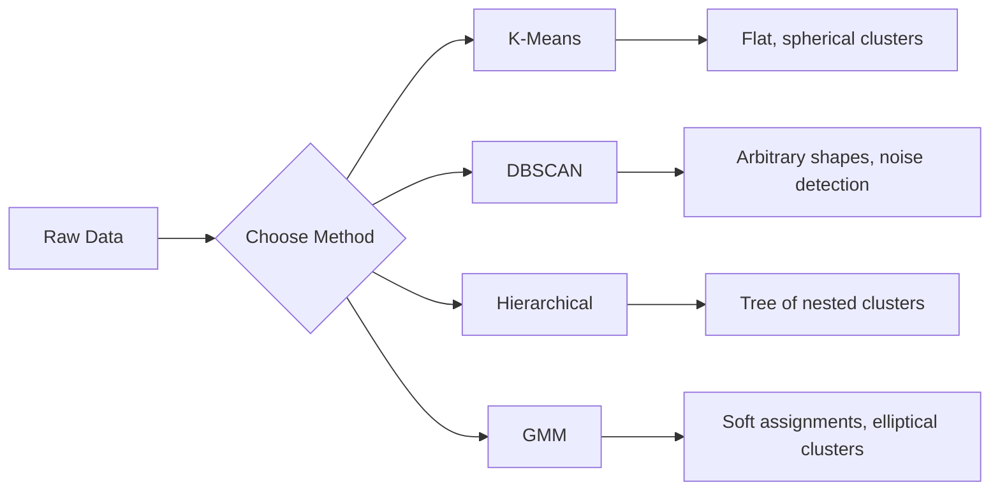
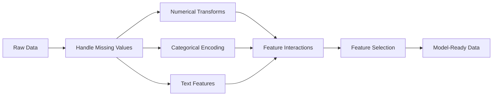

# Unsupervised Learning & Features

> Combined lessons (3 parts), merged verbatim — no content removed.

**Type:** Combined

---

## Part 1 (ch041): Unsupervised Learning

> No labels, no teacher. The algorithm finds structure on its own.

**Type:** Build
**Languages:** Python
**Prerequisites:** Phase 1 (Norms & Distances, Probability & Distributions), Phase 2 Lessons 1-6
**Time:** ~90 minutes

## Learning Objectives

- Implement K-Means, DBSCAN, and Gaussian Mixture Models from scratch and compare their clustering behavior
- Evaluate cluster quality using the silhouette score and the elbow method to select the optimal K
- Explain when DBSCAN outperforms K-Means and identify which algorithm handles non-spherical clusters and outliers
- Build an anomaly detection pipeline using clustering methods to flag points that deviate from normal patterns

## The Problem

Every ML lesson so far has assumed labeled data: "here is an input, here is the correct output." In the real world, labels are expensive. A hospital has millions of patient records but no one has manually tagged each one with a disease category. An e-commerce site has millions of user sessions but no one has hand-labeled customer segments. A security team has network logs but nobody has flagged every anomaly.

Unsupervised learning finds patterns without being told what to look for. It groups similar data points, discovers hidden structures, and surfaces anomalies. If supervised learning is learning from a textbook with an answer key, unsupervised learning is staring at raw data until the patterns reveal themselves.

The catch: without labels, you cannot directly measure "right" or "wrong." You need different tools to evaluate whether the structure your algorithm found is meaningful.

## The Concept

### Clustering: Grouping Similar Things Together

Clustering assigns each data point to a group (cluster) so that points within the same group are more similar to each other than to points in other groups. The question is always: what does "similar" mean?



### K-Means: The Workhorse

K-Means partitions data into exactly K clusters. Each cluster has a centroid (its center of mass), and every point belongs to the nearest centroid.

Lloyd's algorithm:

1. Pick K random points as initial centroids
2. Assign each data point to the nearest centroid
3. Recompute each centroid as the mean of its assigned points
4. Repeat steps 2-3 until assignments stop changing

The objective function (inertia) measures the total squared distance from each point to its assigned centroid. K-Means minimizes this, but only finds a local minimum. Different initializations can give different results.

### Choosing K

Two standard methods:

**Elbow method:** Run K-Means for K = 1, 2, 3, ..., n. Plot inertia vs K. Look for the "elbow" where adding more clusters stops reducing inertia significantly.

**Silhouette score:** For each point, measure how similar it is to its own cluster (a) versus the nearest other cluster (b). The silhouette coefficient is (b - a) / max(a, b), ranging from -1 (wrong cluster) to +1 (well-clustered). Average across all points for a global score.

### DBSCAN: Density-Based Clustering

K-Means assumes clusters are spherical and requires you to pick K upfront. DBSCAN makes neither assumption. It finds clusters as dense regions separated by sparse regions.

Two parameters:
- **eps**: the radius of a neighborhood
- **min_samples**: the minimum number of points needed to form a dense region

Three types of points:
- **Core point**: has at least min_samples points within eps distance
- **Border point**: within eps of a core point but not itself a core point
- **Noise point**: neither core nor border. These are outliers.

DBSCAN connects core points that are within eps of each other into the same cluster. Border points join the cluster of a nearby core point. Noise points belong to no cluster.

Strengths: finds clusters of any shape, automatically determines the number of clusters, identifies outliers. Weakness: struggles with clusters of varying densities.

### Hierarchical Clustering

Builds a tree (dendrogram) of nested clusters.

Agglomerative (bottom-up):
1. Start with each point as its own cluster
2. Merge the two closest clusters
3. Repeat until only one cluster remains
4. Cut the dendrogram at the desired level to get K clusters

The "closeness" between clusters can be measured as:
- **Single linkage**: minimum distance between any two points in the two clusters
- **Complete linkage**: maximum distance between any two points
- **Average linkage**: average distance between all pairs
- **Ward's method**: the merge that causes the smallest increase in total within-cluster variance

### Gaussian Mixture Models (GMM)

K-Means gives hard assignments: each point belongs to exactly one cluster. GMM gives soft assignments: each point has a probability of belonging to each cluster.

GMM assumes the data is generated from a mixture of K Gaussian distributions, each with its own mean and covariance. The Expectation-Maximization (EM) algorithm alternates between:

- **E-step**: compute the probability that each point belongs to each Gaussian
- **M-step**: update the mean, covariance, and mixing weight of each Gaussian to maximize the likelihood of the data

GMM can model elliptical clusters (not just spherical like K-Means) and naturally handles overlapping clusters.

### When to Use Which

| Method | Best for | Avoid when |
|--------|----------|------------|
| K-Means | Large datasets, spherical clusters, known K | Irregular shapes, outliers present |
| DBSCAN | Unknown K, arbitrary shapes, outlier detection | Varying densities, very high dimensions |
| Hierarchical | Small datasets, need dendrogram, unknown K | Large datasets (O(n^2) memory) |
| GMM | Overlapping clusters, soft assignments needed | Very large datasets, too many dimensions |

### Anomaly Detection with Clustering

Clustering naturally supports anomaly detection:
- **K-Means**: points far from any centroid are anomalies
- **DBSCAN**: noise points are anomalies by definition
- **GMM**: points with low probability under all Gaussians are anomalies

```figure
kmeans-step
```

## Build It

### Step 1: K-Means from scratch

```python
import math
import random


def euclidean_distance(a, b):
    return math.sqrt(sum((ai - bi) ** 2 for ai, bi in zip(a, b)))


def kmeans(data, k, max_iterations=100, seed=42):
    random.seed(seed)
    n_features = len(data[0])

    centroids = random.sample(data, k)

    for iteration in range(max_iterations):
        clusters = [[] for _ in range(k)]
        assignments = []

        for point in data:
            distances = [euclidean_distance(point, c) for c in centroids]
            nearest = distances.index(min(distances))
            clusters[nearest].append(point)
            assignments.append(nearest)

        new_centroids = []
        for cluster in clusters:
            if len(cluster) == 0:
                new_centroids.append(random.choice(data))
                continue
            centroid = [
                sum(point[j] for point in cluster) / len(cluster)
                for j in range(n_features)
            ]
            new_centroids.append(centroid)

        if all(
            euclidean_distance(old, new) < 1e-6
            for old, new in zip(centroids, new_centroids)
        ):
            print(f"  Converged at iteration {iteration + 1}")
            break

        centroids = new_centroids

    return assignments, centroids
```

### Step 2: Elbow method and silhouette score

```python
def compute_inertia(data, assignments, centroids):
    total = 0.0
    for point, cluster_id in zip(data, assignments):
        total += euclidean_distance(point, centroids[cluster_id]) ** 2
    return total


def silhouette_score(data, assignments):
    n = len(data)
    if n < 2:
        return 0.0

    clusters = {}
    for i, c in enumerate(assignments):
        clusters.setdefault(c, []).append(i)

    if len(clusters) < 2:
        return 0.0

    scores = []
    for i in range(n):
        own_cluster = assignments[i]
        own_members = [j for j in clusters[own_cluster] if j != i]

        if len(own_members) == 0:
            scores.append(0.0)
            continue

        a = sum(euclidean_distance(data[i], data[j]) for j in own_members) / len(own_members)

        b = float("inf")
        for cluster_id, members in clusters.items():
            if cluster_id == own_cluster:
                continue
            avg_dist = sum(euclidean_distance(data[i], data[j]) for j in members) / len(members)
            b = min(b, avg_dist)

        if max(a, b) == 0:
            scores.append(0.0)
        else:
            scores.append((b - a) / max(a, b))

    return sum(scores) / len(scores)


def find_best_k(data, max_k=10):
    print("Elbow method:")
    inertias = []
    for k in range(1, max_k + 1):
        assignments, centroids = kmeans(data, k)
        inertia = compute_inertia(data, assignments, centroids)
        inertias.append(inertia)
        print(f"  K={k}: inertia={inertia:.2f}")

    print("\nSilhouette scores:")
    for k in range(2, max_k + 1):
        assignments, centroids = kmeans(data, k)
        score = silhouette_score(data, assignments)
        print(f"  K={k}: silhouette={score:.4f}")

    return inertias
```

### Step 3: DBSCAN from scratch

```python
def dbscan(data, eps, min_samples):
    n = len(data)
    labels = [-1] * n
    cluster_id = 0

    def region_query(point_idx):
        neighbors = []
        for i in range(n):
            if euclidean_distance(data[point_idx], data[i]) <= eps:
                neighbors.append(i)
        return neighbors

    visited = [False] * n

    for i in range(n):
        if visited[i]:
            continue
        visited[i] = True

        neighbors = region_query(i)

        if len(neighbors) < min_samples:
            labels[i] = -1
            continue

        labels[i] = cluster_id
        seed_set = list(neighbors)
        seed_set.remove(i)

        j = 0
        while j < len(seed_set):
            q = seed_set[j]

            if not visited[q]:
                visited[q] = True
                q_neighbors = region_query(q)
                if len(q_neighbors) >= min_samples:
                    for nb in q_neighbors:
                        if nb not in seed_set:
                            seed_set.append(nb)

            if labels[q] == -1:
                labels[q] = cluster_id

            j += 1

        cluster_id += 1

    return labels
```

### Step 4: Gaussian Mixture Model (EM algorithm)

```python
def gmm(data, k, max_iterations=100, seed=42):
    random.seed(seed)
    n = len(data)
    d = len(data[0])

    indices = random.sample(range(n), k)
    means = [list(data[i]) for i in indices]
    variances = [1.0] * k
    weights = [1.0 / k] * k

    def gaussian_pdf(x, mean, variance):
        d = len(x)
        coeff = 1.0 / ((2 * math.pi * variance) ** (d / 2))
        exponent = -sum((xi - mi) ** 2 for xi, mi in zip(x, mean)) / (2 * variance)
        return coeff * math.exp(max(exponent, -500))

    for iteration in range(max_iterations):
        responsibilities = []
        for i in range(n):
            probs = []
            for j in range(k):
                probs.append(weights[j] * gaussian_pdf(data[i], means[j], variances[j]))
            total = sum(probs)
            if total == 0:
                total = 1e-300
            responsibilities.append([p / total for p in probs])

        old_means = [list(m) for m in means]

        for j in range(k):
            r_sum = sum(responsibilities[i][j] for i in range(n))
            if r_sum < 1e-10:
                continue

            weights[j] = r_sum / n

            for dim in range(d):
                means[j][dim] = sum(
                    responsibilities[i][j] * data[i][dim] for i in range(n)
                ) / r_sum

            variances[j] = sum(
                responsibilities[i][j]
                * sum((data[i][dim] - means[j][dim]) ** 2 for dim in range(d))
                for i in range(n)
            ) / (r_sum * d)
            variances[j] = max(variances[j], 1e-6)

        shift = sum(
            euclidean_distance(old_means[j], means[j]) for j in range(k)
        )
        if shift < 1e-6:
            print(f"  GMM converged at iteration {iteration + 1}")
            break

    assignments = []
    for i in range(n):
        assignments.append(responsibilities[i].index(max(responsibilities[i])))

    return assignments, means, weights, responsibilities
```

### Step 5: Generate test data and run everything

```python
def make_blobs(centers, n_per_cluster=50, spread=0.5, seed=42):
    random.seed(seed)
    data = []
    true_labels = []
    for label, (cx, cy) in enumerate(centers):
        for _ in range(n_per_cluster):
            x = cx + random.gauss(0, spread)
            y = cy + random.gauss(0, spread)
            data.append([x, y])
            true_labels.append(label)
    return data, true_labels


def make_moons(n_samples=200, noise=0.1, seed=42):
    random.seed(seed)
    data = []
    labels = []
    n_half = n_samples // 2
    for i in range(n_half):
        angle = math.pi * i / n_half
        x = math.cos(angle) + random.gauss(0, noise)
        y = math.sin(angle) + random.gauss(0, noise)
        data.append([x, y])
        labels.append(0)
    for i in range(n_half):
        angle = math.pi * i / n_half
        x = 1 - math.cos(angle) + random.gauss(0, noise)
        y = 1 - math.sin(angle) - 0.5 + random.gauss(0, noise)
        data.append([x, y])
        labels.append(1)
    return data, labels


if __name__ == "__main__":
    centers = [[2, 2], [8, 3], [5, 8]]
    data, true_labels = make_blobs(centers, n_per_cluster=50, spread=0.8)

    print("=== K-Means on 3 blobs ===")
    assignments, centroids = kmeans(data, k=3)
    print(f"  Centroids: {[[round(c, 2) for c in cent] for cent in centroids]}")
    sil = silhouette_score(data, assignments)
    print(f"  Silhouette score: {sil:.4f}")

    print("\n=== Elbow Method ===")
    find_best_k(data, max_k=6)

    print("\n=== DBSCAN on 3 blobs ===")
    db_labels = dbscan(data, eps=1.5, min_samples=5)
    n_clusters = len(set(db_labels) - {-1})
    n_noise = db_labels.count(-1)
    print(f"  Found {n_clusters} clusters, {n_noise} noise points")

    print("\n=== GMM on 3 blobs ===")
    gmm_assignments, gmm_means, gmm_weights, _ = gmm(data, k=3)
    print(f"  Means: {[[round(m, 2) for m in mean] for mean in gmm_means]}")
    print(f"  Weights: {[round(w, 3) for w in gmm_weights]}")
    gmm_sil = silhouette_score(data, gmm_assignments)
    print(f"  Silhouette score: {gmm_sil:.4f}")

    print("\n=== DBSCAN on moons (non-spherical clusters) ===")
    moon_data, moon_labels = make_moons(n_samples=200, noise=0.1)
    moon_db = dbscan(moon_data, eps=0.3, min_samples=5)
    n_moon_clusters = len(set(moon_db) - {-1})
    n_moon_noise = moon_db.count(-1)
    print(f"  Found {n_moon_clusters} clusters, {n_moon_noise} noise points")

    print("\n=== K-Means on moons (will fail to separate) ===")
    moon_km, moon_centroids = kmeans(moon_data, k=2)
    moon_sil = silhouette_score(moon_data, moon_km)
    print(f"  Silhouette score: {moon_sil:.4f}")
    print("  K-Means splits moons poorly because they are not spherical")

    print("\n=== Anomaly detection with DBSCAN ===")
    anomaly_data = list(data)
    anomaly_data.append([20.0, 20.0])
    anomaly_data.append([-5.0, -5.0])
    anomaly_data.append([15.0, 0.0])
    anomaly_labels = dbscan(anomaly_data, eps=1.5, min_samples=5)
    anomalies = [
        anomaly_data[i]
        for i in range(len(anomaly_labels))
        if anomaly_labels[i] == -1
    ]
    print(f"  Detected {len(anomalies)} anomalies")
    for a in anomalies[-3:]:
        print(f"    Point {[round(v, 2) for v in a]}")
```

## Use It

With scikit-learn, the same algorithms are one-liners:

```python
from sklearn.cluster import KMeans, DBSCAN, AgglomerativeClustering
from sklearn.mixture import GaussianMixture
from sklearn.metrics import silhouette_score as sklearn_silhouette

km = KMeans(n_clusters=3, random_state=42).fit(data)
db = DBSCAN(eps=1.5, min_samples=5).fit(data)
agg = AgglomerativeClustering(n_clusters=3).fit(data)
gmm_model = GaussianMixture(n_components=3, random_state=42).fit(data)
```

The from-scratch versions show you exactly what these libraries compute. K-Means iterates between assigning and recomputing. DBSCAN grows clusters from dense seeds. GMM alternates between expectation and maximization. The library versions add numerical stability, smarter initialization (K-Means++), and GPU acceleration, but the core logic is the same.

## Ship It

This lesson produces working implementations of K-Means, DBSCAN, and GMM from scratch. The clustering code can be reused as a foundation for more advanced unsupervised methods.

## Exercises

1. Implement K-Means++ initialization: instead of picking random centroids, pick the first randomly and each subsequent centroid with probability proportional to its squared distance from the nearest existing centroid. Compare convergence speed to random initialization.
2. Add hierarchical agglomerative clustering to the code. Implement Ward's linkage and produce a dendrogram (as a nested list of merges). Cut it at different levels and compare to K-Means results.
3. Build a simple anomaly detection pipeline: run DBSCAN and GMM on the same data, flag points that both methods agree are outliers (noise in DBSCAN, low probability in GMM). Measure the overlap and discuss when the methods disagree.

## Key Terms

| Term | What people say | What it actually means |
|------|----------------|----------------------|
| Clustering | "Grouping similar things" | Partitioning data into subsets where within-group similarity exceeds between-group similarity, measured by a specific distance metric |
| Centroid | "The center of a cluster" | The mean of all points assigned to a cluster; used by K-Means as the cluster representative |
| Inertia | "How tight the clusters are" | Sum of squared distances from each point to its assigned centroid; lower is tighter |
| Silhouette score | "How well-separated clusters are" | For each point, (b - a) / max(a, b) where a is mean intra-cluster distance and b is mean nearest-cluster distance |
| Core point | "A point in a dense region" | A point with at least min_samples neighbors within eps distance, in DBSCAN |
| EM algorithm | "Soft K-Means" | Expectation-Maximization: iteratively compute membership probabilities (E-step) and update distribution parameters (M-step) |
| Dendrogram | "A tree of clusters" | A tree diagram showing the order and distance at which clusters were merged in hierarchical clustering |
| Anomaly | "An outlier" | A data point that does not conform to the expected pattern, identified as noise by DBSCAN or low-probability by GMM |

## Further Reading

- [Stanford CS229 - Unsupervised Learning](https://cs229.stanford.edu/notes2022fall/main_notes.pdf) - Andrew Ng's lecture notes on clustering and EM
- [scikit-learn Clustering Guide](https://scikit-learn.org/stable/modules/clustering.html) - practical comparison of all clustering algorithms with visual examples
- [DBSCAN original paper (Ester et al., 1996)](https://www.aaai.org/Papers/KDD/1996/KDD96-037.pdf) - the paper that introduced density-based clustering

[Reference](https://github.com/rohitg00/ai-engineering-from-scratch/tree/main/phases/02-ml-fundamentals/07-unsupervised-learning)

---

## Part 2 (ch042): Feature Engineering & Selection

> A good feature is worth a thousand data points.

**Type:** Build
**Languages:** Python
**Prerequisites:** Phase 1 (Statistics for ML, Linear Algebra), Phase 2 Lessons 1-7
**Time:** ~90 minutes

## Learning Objectives

- Implement numerical transforms (standardization, min-max scaling, log transform, binning) and explain when each is appropriate
- Build one-hot, label, and target encoding for categorical features and identify the data leakage risk in target encoding
- Construct a TF-IDF vectorizer from scratch and explain why it outperforms raw word counts for text classification
- Apply filter-based feature selection (variance threshold, correlation, mutual information) to reduce dimensionality

## The Problem

You have a dataset. You pick an algorithm. You train it. The results are mediocre. You try a fancier algorithm. Still mediocre. You spend a week tuning hyperparameters. Marginal improvement.

Then someone transforms the raw data into better features and a simple logistic regression beats your tuned gradient-boosted ensemble.

This happens constantly. In classical ML, the representation of the data matters more than the choice of algorithm. A house price model with "square footage" and "number of bedrooms" will beat a model with "address as a raw string" no matter how sophisticated the learner is. The algorithm can only work with what you give it.

Feature engineering is the process of transforming raw data into representations that make patterns easier for models to find. Feature selection is the process of throwing away features that add noise without adding signal. Together, they are the highest-leverage activity in classical ML.

## The Concept

### The Feature Pipeline



### Numerical Features

Raw numbers are rarely model-ready. Common transforms:

**Scaling:** Put features on the same range so distance-based algorithms (K-Means, KNN, SVM) treat all features equally. Min-max scaling maps to [0, 1]. Standardization (z-score) maps to mean=0, std=1.

**Log transform:** Compresses right-skewed distributions (income, population, word counts). Turns multiplicative relationships into additive ones.

**Binning:** Converts continuous values into categories. Useful when the relationship between feature and target is non-linear but step-wise (e.g., age groups).

**Polynomial features:** Creates x^2, x^3, x1*x2 terms. Lets linear models capture non-linear relationships at the cost of more features.

### Categorical Features

Models need numbers. Categories need encoding.

**One-hot encoding:** Creates a binary column for each category. "color = red/blue/green" becomes three columns: is_red, is_blue, is_green. Works well for low-cardinality features but explodes with many categories.

**Label encoding:** Maps each category to an integer: red=0, blue=1, green=2. Introduces false ordering (the model might think green > blue > red). Only appropriate for tree-based models that split on individual values.

**Target encoding:** Replaces each category with the mean of the target variable for that category. Powerful but dangerous: high risk of data leakage. Must be computed only on training data and applied to test data.

### Text Features

**Count vectorizer:** Counts how many times each word appears in a document. "the cat sat on the mat" becomes {the: 2, cat: 1, sat: 1, on: 1, mat: 1}.

**TF-IDF:** Term Frequency-Inverse Document Frequency. Weighs words by how unique they are across documents. Common words like "the" get low weight. Rare, distinctive words get high weight.

```
TF(word, doc) = count(word in doc) / total words in doc
IDF(word) = log(total docs / docs containing word)
TF-IDF = TF * IDF
```

### Missing Values

Real data has holes. Strategies:

- **Drop rows:** Only when missing data is rare and random
- **Mean/median imputation:** Simple, preserves distribution shape (median is more robust to outliers)
- **Mode imputation:** For categorical features
- **Indicator column:** Add a binary column "was_this_missing" before imputing. The fact that data is missing can itself be informative
- **Forward/backward fill:** For time series data

### Feature Interaction

Sometimes the relationship is in the combination. "Height" and "weight" alone are less predictive than "BMI = weight / height^2". Feature interactions multiply the feature space, so use domain knowledge to pick the right ones.

### Feature Selection

More features is not always better. Irrelevant features add noise, increase training time, and can cause overfitting.

**Filter methods (pre-model):**
- Correlation: remove features highly correlated with each other (redundant)
- Mutual information: measures how much knowing a feature reduces uncertainty about the target
- Variance threshold: remove features that barely vary

**Wrapper methods (model-based):**
- L1 regularization (Lasso): drives irrelevant feature weights to exactly zero
- Recursive feature elimination: train, remove least important feature, repeat

**Why selection matters:** A model with 10 good features will usually outperform a model with 10 good features and 90 noisy ones. The noisy features give the model opportunities to overfit on training data patterns that do not generalize.

```figure
feature-scaling
```

## Build It

### Step 1: Numerical transforms from scratch

```python
import math


def min_max_scale(values):
    min_val = min(values)
    max_val = max(values)
    if max_val == min_val:
        return [0.0] * len(values)
    return [(v - min_val) / (max_val - min_val) for v in values]


def standardize(values):
    n = len(values)
    mean = sum(values) / n
    variance = sum((v - mean) ** 2 for v in values) / n
    std = math.sqrt(variance) if variance > 0 else 1.0
    return [(v - mean) / std for v in values]


def log_transform(values):
    return [math.log(v + 1) for v in values]


def bin_values(values, n_bins=5):
    min_val = min(values)
    max_val = max(values)
    bin_width = (max_val - min_val) / n_bins
    if bin_width == 0:
        return [0] * len(values)
    result = []
    for v in values:
        bin_idx = int((v - min_val) / bin_width)
        bin_idx = min(bin_idx, n_bins - 1)
        result.append(bin_idx)
    return result


def polynomial_features(row, degree=2):
    n = len(row)
    result = list(row)
    if degree >= 2:
        for i in range(n):
            result.append(row[i] ** 2)
        for i in range(n):
            for j in range(i + 1, n):
                result.append(row[i] * row[j])
    return result
```

### Step 2: Categorical encoding from scratch

```python
def one_hot_encode(values):
    categories = sorted(set(values))
    cat_to_idx = {cat: i for i, cat in enumerate(categories)}
    n_cats = len(categories)

    encoded = []
    for v in values:
        row = [0] * n_cats
        row[cat_to_idx[v]] = 1
        encoded.append(row)

    return encoded, categories


def label_encode(values):
    categories = sorted(set(values))
    cat_to_int = {cat: i for i, cat in enumerate(categories)}
    return [cat_to_int[v] for v in values], cat_to_int


def target_encode(feature_values, target_values, smoothing=10):
    global_mean = sum(target_values) / len(target_values)

    category_stats = {}
    for feat, target in zip(feature_values, target_values):
        if feat not in category_stats:
            category_stats[feat] = {"sum": 0.0, "count": 0}
        category_stats[feat]["sum"] += target
        category_stats[feat]["count"] += 1

    encoding = {}
    for cat, stats in category_stats.items():
        cat_mean = stats["sum"] / stats["count"]
        weight = stats["count"] / (stats["count"] + smoothing)
        encoding[cat] = weight * cat_mean + (1 - weight) * global_mean

    return [encoding[v] for v in feature_values], encoding
```

### Step 3: Text features from scratch

```python
def count_vectorize(documents):
    vocab = {}
    idx = 0
    for doc in documents:
        for word in doc.lower().split():
            if word not in vocab:
                vocab[word] = idx
                idx += 1

    vectors = []
    for doc in documents:
        vec = [0] * len(vocab)
        for word in doc.lower().split():
            vec[vocab[word]] += 1
        vectors.append(vec)

    return vectors, vocab


def tfidf(documents):
    n_docs = len(documents)

    vocab = {}
    idx = 0
    for doc in documents:
        for word in doc.lower().split():
            if word not in vocab:
                vocab[word] = idx
                idx += 1

    doc_freq = {}
    for doc in documents:
        seen = set()
        for word in doc.lower().split():
            if word not in seen:
                doc_freq[word] = doc_freq.get(word, 0) + 1
                seen.add(word)

    vectors = []
    for doc in documents:
        words = doc.lower().split()
        word_count = len(words)
        tf_map = {}
        for word in words:
            tf_map[word] = tf_map.get(word, 0) + 1

        vec = [0.0] * len(vocab)
        for word, count in tf_map.items():
            tf = count / word_count
            idf = math.log(n_docs / doc_freq[word])
            vec[vocab[word]] = tf * idf
        vectors.append(vec)

    return vectors, vocab
```

### Step 4: Missing value imputation from scratch

```python
def impute_mean(values):
    present = [v for v in values if v is not None]
    if not present:
        return [0.0] * len(values), 0.0
    mean = sum(present) / len(present)
    return [v if v is not None else mean for v in values], mean


def impute_median(values):
    present = sorted(v for v in values if v is not None)
    if not present:
        return [0.0] * len(values), 0.0
    n = len(present)
    if n % 2 == 0:
        median = (present[n // 2 - 1] + present[n // 2]) / 2
    else:
        median = present[n // 2]
    return [v if v is not None else median for v in values], median


def impute_mode(values):
    present = [v for v in values if v is not None]
    if not present:
        return values, None
    counts = {}
    for v in present:
        counts[v] = counts.get(v, 0) + 1
    mode = max(counts, key=counts.get)
    return [v if v is not None else mode for v in values], mode


def add_missing_indicator(values):
    return [0 if v is not None else 1 for v in values]
```

### Step 5: Feature selection from scratch

```python
def correlation(x, y):
    n = len(x)
    mean_x = sum(x) / n
    mean_y = sum(y) / n
    cov = sum((xi - mean_x) * (yi - mean_y) for xi, yi in zip(x, y)) / n
    std_x = math.sqrt(sum((xi - mean_x) ** 2 for xi in x) / n)
    std_y = math.sqrt(sum((yi - mean_y) ** 2 for yi in y) / n)
    if std_x == 0 or std_y == 0:
        return 0.0
    return cov / (std_x * std_y)


def mutual_information(feature, target, n_bins=10):
    feat_min = min(feature)
    feat_max = max(feature)
    bin_width = (feat_max - feat_min) / n_bins if feat_max != feat_min else 1.0
    feat_binned = [
        min(int((f - feat_min) / bin_width), n_bins - 1) for f in feature
    ]

    n = len(feature)
    target_classes = sorted(set(target))

    feat_bins = sorted(set(feat_binned))
    p_feat = {}
    for b in feat_bins:
        p_feat[b] = feat_binned.count(b) / n

    p_target = {}
    for t in target_classes:
        p_target[t] = target.count(t) / n

    mi = 0.0
    for b in feat_bins:
        for t in target_classes:
            joint_count = sum(
                1 for fb, tv in zip(feat_binned, target) if fb == b and tv == t
            )
            p_joint = joint_count / n
            if p_joint > 0:
                mi += p_joint * math.log(p_joint / (p_feat[b] * p_target[t]))

    return mi


def variance_threshold(features, threshold=0.01):
    n_features = len(features[0])
    n_samples = len(features)
    selected = []

    for j in range(n_features):
        col = [features[i][j] for i in range(n_samples)]
        mean = sum(col) / n_samples
        var = sum((v - mean) ** 2 for v in col) / n_samples
        if var >= threshold:
            selected.append(j)

    return selected


def remove_correlated(features, threshold=0.9):
    n_features = len(features[0])
    n_samples = len(features)

    to_remove = set()
    for i in range(n_features):
        if i in to_remove:
            continue
        col_i = [features[r][i] for r in range(n_samples)]
        for j in range(i + 1, n_features):
            if j in to_remove:
                continue
            col_j = [features[r][j] for r in range(n_samples)]
            corr = abs(correlation(col_i, col_j))
            if corr >= threshold:
                to_remove.add(j)

    return [i for i in range(n_features) if i not in to_remove]
```

### Step 6: Full pipeline and demo

```python
import random


def make_housing_data(n=200, seed=42):
    random.seed(seed)
    data = []
    for _ in range(n):
        sqft = random.uniform(500, 5000)
        bedrooms = random.choice([1, 2, 3, 4, 5])
        age = random.uniform(0, 50)
        neighborhood = random.choice(["downtown", "suburbs", "rural"])
        has_pool = random.choice([True, False])

        sqft_with_missing = sqft if random.random() > 0.05 else None
        age_with_missing = age if random.random() > 0.08 else None

        price = (
            50 * sqft
            + 20000 * bedrooms
            - 1000 * age
            + (50000 if neighborhood == "downtown" else 10000 if neighborhood == "suburbs" else 0)
            + (15000 if has_pool else 0)
            + random.gauss(0, 20000)
        )

        data.append({
            "sqft": sqft_with_missing,
            "bedrooms": bedrooms,
            "age": age_with_missing,
            "neighborhood": neighborhood,
            "has_pool": has_pool,
            "price": price,
        })
    return data


if __name__ == "__main__":
    data = make_housing_data(200)

    print("=== Raw Data Sample ===")
    for row in data[:3]:
        print(f"  {row}")

    sqft_raw = [d["sqft"] for d in data]
    age_raw = [d["age"] for d in data]
    prices = [d["price"] for d in data]

    print("\n=== Missing Value Handling ===")
    sqft_missing = sum(1 for v in sqft_raw if v is None)
    age_missing = sum(1 for v in age_raw if v is None)
    print(f"  sqft missing: {sqft_missing}/{len(sqft_raw)}")
    print(f"  age missing: {age_missing}/{len(age_raw)}")

    sqft_indicator = add_missing_indicator(sqft_raw)
    age_indicator = add_missing_indicator(age_raw)
    sqft_imputed, sqft_fill = impute_median(sqft_raw)
    age_imputed, age_fill = impute_mean(age_raw)
    print(f"  sqft filled with median: {sqft_fill:.0f}")
    print(f"  age filled with mean: {age_fill:.1f}")

    print("\n=== Numerical Transforms ===")
    sqft_scaled = standardize(sqft_imputed)
    age_scaled = min_max_scale(age_imputed)
    sqft_log = log_transform(sqft_imputed)
    age_binned = bin_values(age_imputed, n_bins=5)
    print(f"  sqft standardized: mean={sum(sqft_scaled)/len(sqft_scaled):.4f}, std={math.sqrt(sum(v**2 for v in sqft_scaled)/len(sqft_scaled)):.4f}")
    print(f"  age min-max: [{min(age_scaled):.2f}, {max(age_scaled):.2f}]")
    print(f"  age bins: {sorted(set(age_binned))}")

    print("\n=== Categorical Encoding ===")
    neighborhoods = [d["neighborhood"] for d in data]

    ohe, ohe_cats = one_hot_encode(neighborhoods)
    print(f"  One-hot categories: {ohe_cats}")
    print(f"  Sample encoding: {neighborhoods[0]} -> {ohe[0]}")

    le, le_map = label_encode(neighborhoods)
    print(f"  Label encoding map: {le_map}")

    te, te_map = target_encode(neighborhoods, prices, smoothing=10)
    print(f"  Target encoding: {({k: round(v) for k, v in te_map.items()})}")

    print("\n=== Text Features ===")
    descriptions = [
        "large modern house with pool",
        "small cozy cottage near downtown",
        "spacious family home with large yard",
        "modern apartment downtown with view",
        "rustic cabin in rural area",
    ]
    cv, cv_vocab = count_vectorize(descriptions)
    print(f"  Vocabulary size: {len(cv_vocab)}")
    print(f"  Doc 0 non-zero features: {sum(1 for v in cv[0] if v > 0)}")

    tf, tf_vocab = tfidf(descriptions)
    print(f"  TF-IDF vocabulary size: {len(tf_vocab)}")
    top_words = sorted(tf_vocab.keys(), key=lambda w: tf[0][tf_vocab[w]], reverse=True)[:3]
    print(f"  Doc 0 top TF-IDF words: {top_words}")

    print("\n=== Polynomial Features ===")
    sample_row = [sqft_scaled[0], age_scaled[0]]
    poly = polynomial_features(sample_row, degree=2)
    print(f"  Input: {[round(v, 4) for v in sample_row]}")
    print(f"  Polynomial: {[round(v, 4) for v in poly]}")
    print(f"  Features: [x1, x2, x1^2, x2^2, x1*x2]")

    print("\n=== Feature Selection ===")
    feature_matrix = [
        [sqft_scaled[i], age_scaled[i], float(sqft_indicator[i]), float(age_indicator[i])]
        + ohe[i]
        for i in range(len(data))
    ]

    print(f"  Total features: {len(feature_matrix[0])}")

    surviving_var = variance_threshold(feature_matrix, threshold=0.01)
    print(f"  After variance threshold (0.01): {len(surviving_var)} features kept")

    surviving_corr = remove_correlated(feature_matrix, threshold=0.9)
    print(f"  After correlation filter (0.9): {len(surviving_corr)} features kept")

    binary_prices = [1 if p > sum(prices) / len(prices) else 0 for p in prices]
    print("\n  Mutual information with target:")
    feature_names = ["sqft", "age", "sqft_missing", "age_missing"] + [f"neigh_{c}" for c in ohe_cats]
    for j in range(len(feature_matrix[0])):
        col = [feature_matrix[i][j] for i in range(len(feature_matrix))]
        mi = mutual_information(col, binary_prices, n_bins=10)
        print(f"    {feature_names[j]}: MI={mi:.4f}")

    print("\n  Correlation with price:")
    for j in range(len(feature_matrix[0])):
        col = [feature_matrix[i][j] for i in range(len(feature_matrix))]
        corr = correlation(col, prices)
        print(f"    {feature_names[j]}: r={corr:.4f}")
```

## Use It

With scikit-learn, these transforms are composable pipelines:

```python
from sklearn.preprocessing import StandardScaler, OneHotEncoder, PolynomialFeatures
from sklearn.impute import SimpleImputer
from sklearn.feature_extraction.text import TfidfVectorizer
from sklearn.feature_selection import mutual_info_classif, VarianceThreshold
from sklearn.compose import ColumnTransformer
from sklearn.pipeline import Pipeline

numeric_pipe = Pipeline([
    ("imputer", SimpleImputer(strategy="median")),
    ("scaler", StandardScaler()),
])

categorical_pipe = Pipeline([
    ("encoder", OneHotEncoder(sparse_output=False)),
])

preprocessor = ColumnTransformer([
    ("num", numeric_pipe, ["sqft", "age"]),
    ("cat", categorical_pipe, ["neighborhood"]),
])
```

The from-scratch versions show exactly what happens inside each transform. The library versions add edge-case handling, sparse matrix support, and pipeline composition, but the math is the same.

## Ship It

This lesson produces:
- `outputs/prompt-feature-engineer.md` - a prompt for systematically engineering features from raw data

## Exercises

1. Add robust scaling (using median and interquartile range instead of mean and standard deviation) to the numerical transforms. Compare it to standard scaling on data with extreme outliers.
2. Implement leave-one-out target encoding: for each row, compute the target mean excluding that row's own target value. Show how this reduces overfitting compared to naive target encoding.
3. Build an automated feature selection pipeline that combines variance threshold, correlation filtering, and mutual information ranking. Apply it to the housing dataset and compare model performance (use a simple linear regression) with all features vs selected features.

## Key Terms

| Term | What people say | What it actually means |
|------|----------------|----------------------|
| Feature engineering | "Making new columns" | Transforming raw data into representations that expose patterns to the model |
| Standardization | "Making it normal" | Subtracting the mean and dividing by standard deviation so the feature has mean=0 and std=1 |
| One-hot encoding | "Making dummy variables" | Creating one binary column per category, where exactly one column is 1 for each row |
| Target encoding | "Using the answer to encode" | Replacing each category with the average target value for that category, with smoothing to prevent overfitting |
| TF-IDF | "Fancy word counts" | Term Frequency times Inverse Document Frequency: words weighted by how distinctive they are across the corpus |
| Imputation | "Filling in blanks" | Replacing missing values with estimated values (mean, median, mode, or model-predicted) |
| Feature selection | "Throwing out bad columns" | Removing features that add noise or redundancy, keeping only those with signal about the target |
| Mutual information | "How much one thing tells you about another" | A measure of the reduction in uncertainty about variable Y gained by observing variable X |
| Data leakage | "Accidentally cheating" | Using information during training that would not be available at prediction time, giving falsely optimistic results |

## Further Reading

- [Feature Engineering and Selection (Max Kuhn & Kjell Johnson)](http://www.feat.engineering/) - free online book covering the full landscape of feature engineering
- [scikit-learn Preprocessing Guide](https://scikit-learn.org/stable/modules/preprocessing.html) - practical reference for all standard transforms
- [Target Encoding Done Right (Micci-Barreca, 2001)](https://dl.acm.org/doi/10.1145/507533.507538) - the original paper on target encoding with smoothing

[Reference](https://github.com/rohitg00/ai-engineering-from-scratch/tree/main/phases/02-ml-fundamentals/08-feature-engineering)

---

## Part 3 (ch052): Feature Selection

> More features is not better. The right features is better.

**Type:** Build
**Language:** Python
**Prerequisites:** Phase 2, Lessons 01-09, 08 (feature engineering)
**Time:** ~75 minutes

## Learning Objectives

- Implement filter methods (variance threshold, mutual information, chi-squared) and wrapper methods (RFE, forward selection) from scratch
- Explain why mutual information captures nonlinear feature-target relationships that correlation misses
- Compare L1 regularization (embedded selection) with RFE (wrapper selection) and evaluate their computational tradeoffs
- Build a feature selection pipeline that combines multiple methods and demonstrate improved generalization on held-out data

## The Problem

You have 500 features. Your model trains slowly, overfits constantly, and nobody can explain what it learned. This is the curse of dimensionality -- as features grow, the feature space volume explodes, data becomes sparse, and noise drowns out signal.

Feature selection is the antidote. Strip away the noise. Remove the redundancy. Keep the features that carry actual information about the target.

## The Concept

### Three Categories of Feature Selection

| Method | Type | Speed | Nonlinear | Feature Interactions |
|--------|------|-------|-----------|---------------------|
| Variance threshold | Filter | Very fast | No | No |
| Mutual information | Filter | Fast | Yes | No |
| Correlation filter | Filter | Fast | No | No |
| RFE | Wrapper | Slow | Depends on model | Yes |
| L1 / Lasso | Embedded | Fast | No (linear) | No |
| Tree importance | Embedded | Medium | Yes | Yes |
| Permutation importance | Model-agnostic | Slow | Yes | Yes |

### Variance Threshold

The simplest filter. If a feature barely varies across samples, it carries almost no information.

```
variance(x) = mean((x - mean(x))^2)
```

Drop every feature with variance below a threshold (e.g., 0.01).

### Mutual Information

Mutual information measures how much knowing the value of feature X reduces uncertainty about target Y.

```
I(X; Y) = sum_x sum_y p(x, y) * log(p(x, y) / (p(x) * p(y)))
```

Key advantage over correlation: mutual information captures nonlinear relationships. A feature might have zero correlation with the target but high mutual information because the relationship is quadratic or periodic.

### Recursive Feature Elimination (RFE)

RFE is a wrapper method that uses a model's own feature importance to iteratively prune:

1. Train the model with all features
2. Rank features by importance
3. Remove the least important feature(s)
4. Repeat until the desired number of features remains

RFE considers feature interactions because the model sees all remaining features together.

### L1 (Lasso) Regularization

L1 regularization adds the absolute value of weights to the loss function:

```
loss = prediction_error + alpha * sum(|w_i|)
```

Higher alpha means more weights go to exactly zero. This is embedded feature selection -- the model learns during training which features to ignore.

### Tree-Based Feature Importance

Decision trees and their ensembles naturally rank features by impurity reduction. Features that produce larger impurity reductions are more important.

Caution: tree-based importance is biased toward features with many unique values.

### Decision Flowchart

| Feature Count | Recommended Approach |
|---------------|---------------------|
| < 50 | Variance threshold + mutual information |
| 50-500 | Variance threshold, then L1 or tree importance |
| > 500 | Variance threshold, then mutual info filter, then RFE on survivors |

## Build It

### Step 1: Variance threshold

```python
def variance_threshold(X, threshold=0.01):
    variances = np.var(X, axis=0)
    mask = variances > threshold
    return mask, variances
```

### Step 2: Mutual information (discrete)

```python
def discretize(x, n_bins=10):
    min_val, max_val = x.min(), x.max()
    if max_val == min_val:
        return np.zeros_like(x, dtype=int)
    bin_edges = np.linspace(min_val, max_val, n_bins + 1)
    binned = np.digitize(x, bin_edges[1:-1])
    return binned

def mutual_information(X, y, n_bins=10):
    n_samples, n_features = X.shape
    mi_scores = np.zeros(n_features)
    y_vals, y_counts = np.unique(y, return_counts=True)
    p_y = y_counts / n_samples
    for f in range(n_features):
        x_binned = discretize(X[:, f], n_bins)
        x_vals, x_counts = np.unique(x_binned, return_counts=True)
        p_x = dict(zip(x_vals, x_counts / n_samples))
        mi = 0.0
        for xv in x_vals:
            for yi, yv in enumerate(y_vals):
                joint_mask = (x_binned == xv) & (y == yv)
                p_xy = np.sum(joint_mask) / n_samples
                if p_xy > 0:
                    mi += p_xy * np.log(p_xy / (p_x[xv] * p_y[yi]))
        mi_scores[f] = mi
    return mi_scores
```

### Step 3: Recursive Feature Elimination

```python
def rfe(X, y, n_features_to_select=5, lr=0.1, epochs=100):
    n_total = X.shape[1]
    remaining = list(range(n_total))
    rankings = np.ones(n_total, dtype=int)
    rank = n_total
    while len(remaining) > n_features_to_select:
        X_subset = X[:, remaining]
        w, _ = simple_logistic_importance(X_subset, y, lr, epochs)
        importances = np.abs(w)
        least_idx = np.argmin(importances)
        original_idx = remaining[least_idx]
        rankings[original_idx] = rank
        rank -= 1
        remaining.pop(least_idx)
    for idx in remaining:
        rankings[idx] = 1
    selected_mask = rankings == 1
    return selected_mask, rankings
```

### Step 4: L1 feature selection

```python
def soft_threshold(w, alpha):
    return np.sign(w) * np.maximum(np.abs(w) - alpha, 0)

def l1_feature_selection(X, y, alpha=0.1, lr=0.01, epochs=500):
    n_samples, n_features = X.shape
    w = np.zeros(n_features)
    b = 0.0
    for _ in range(epochs):
        z = X @ w + b
        pred = 1.0 / (1.0 + np.exp(-np.clip(z, -500, 500)))
        error = pred - y
        gradient_w = (X.T @ error) / n_samples
        gradient_b = np.mean(error)
        w -= lr * gradient_w
        w = soft_threshold(w, lr * alpha)
        b -= lr * gradient_b
    selected_mask = np.abs(w) > 1e-6
    return selected_mask, w
```

### Step 5: Tree-based importance

```python
def gini_impurity(y):
    if len(y) == 0:
        return 0.0
    classes, counts = np.unique(y, return_counts=True)
    probs = counts / len(y)
    return 1.0 - np.sum(probs ** 2)

def best_split(X, y, feature_idx):
    values = np.unique(X[:, feature_idx])
    if len(values) <= 1:
        return None, -1.0
    best_threshold = None
    best_gain = -1.0
    parent_gini = gini_impurity(y)
    n = len(y)
    for i in range(len(values) - 1):
        threshold = (values[i] + values[i + 1]) / 2.0
        left_mask = X[:, feature_idx] <= threshold
        right_mask = ~left_mask
        n_left = np.sum(left_mask)
        n_right = np.sum(right_mask)
        if n_left == 0 or n_right == 0:
            continue
        gain = parent_gini - (n_left / n) * gini_impurity(y[left_mask]) - (n_right / n) * gini_impurity(y[right_mask])
        if gain > best_gain:
            best_gain = gain
            best_threshold = threshold
    return best_threshold, best_gain
```

## Use It

With scikit-learn:

```python
from sklearn.feature_selection import (
    VarianceThreshold, mutual_info_classif, RFE, SelectFromModel,
)
from sklearn.linear_model import Lasso, LogisticRegression
from sklearn.ensemble import RandomForestClassifier

vt = VarianceThreshold(threshold=0.01)
X_filtered = vt.fit_transform(X)

mi_scores = mutual_info_classif(X, y)
top_k = np.argsort(mi_scores)[-10:]

rfe_selector = RFE(LogisticRegression(), n_features_to_select=10)
rfe_selector.fit(X, y)

lasso_selector = SelectFromModel(Lasso(alpha=0.01))
lasso_selector.fit(X, y)

rf = RandomForestClassifier(n_estimators=100)
rf.fit(X, y)
importances = rf.feature_importances_
```

## Ship It

This lesson produces `outputs/skill-feature-selector.md`.

## Exercises

1. **Forward selection**: implement the opposite of RFE. Start with zero features. At each step, add the feature that improves performance the most.
2. **Stability selection**: run L1 feature selection 50 times, each on a random 80% subsample. Count how often each feature is selected.
3. **Multicollinearity detection**: compute the correlation matrix. Remove one feature from each highly-correlated pair (keeping the one with higher mutual information).
4. **Feature selection pipeline**: chain variance threshold, mutual information filter, and RFE into a single pipeline.
5. **Permutation importance from scratch**: for each feature, shuffle its values 10 times, measure the average drop in F1 score.

## Key Terms

| Term | What people say | What it actually means |
|------|----------------|----------------------|
| Filter method | "Score features independently" | A feature selection approach that ranks features using a statistical measure without training a model |
| Wrapper method | "Use the model to pick features" | A feature selection approach that evaluates feature subsets by training a model |
| Embedded method | "The model selects features during training" | Feature selection that happens as part of model fitting, such as L1 regularization |
| Mutual information | "How much one variable tells you about another" | A measure of the reduction in uncertainty about Y given knowledge of X |
| Recursive Feature Elimination | "Train, rank, prune, repeat" | An iterative wrapper method that removes the least important feature(s) until a target count is reached |
| L1 / Lasso regularization | "Penalty that kills features" | Adding the sum of absolute weight values to the loss function, driving unimportant weights to zero |
| Variance threshold | "Remove constant features" | Dropping features whose variance falls below a specified threshold |
| Feature importance | "Which features matter most" | A score indicating how much each feature contributes to model predictions |
| Permutation importance | "Shuffle and measure the damage" | Evaluating feature importance by randomly shuffling each feature's values and measuring the performance drop |
| Curse of dimensionality | "Too many features, not enough data" | The phenomenon where adding features increases the volume of feature space exponentially |

## Further Reading

- [An Introduction to Variable and Feature Selection (Guyon & Elisseeff, 2003)](https://jmlr.org/papers/v3/guyon03a.html)
- [scikit-learn Feature Selection Guide](https://scikit-learn.org/stable/modules/feature_selection.html)
- [Stability Selection (Meinshausen & Buhlmann, 2010)](https://arxiv.org/abs/0809.2932)
- [Beware Default Random Forest Importances (Strobl et al., 2007)](https://bmcbioinformatics.biomedcentral.com/articles/10.1186/1471-2105-8-25)

[Reference](https://github.com/rohitg00/ai-engineering-from-scratch/tree/main/phases/02-ml-fundamentals/18-feature-selection)
