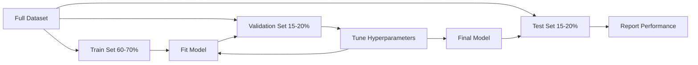
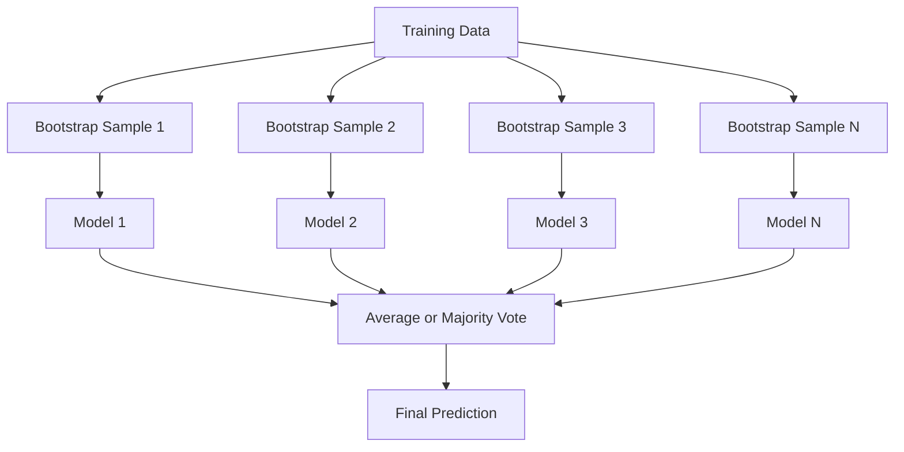
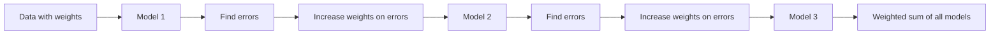
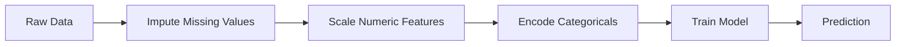
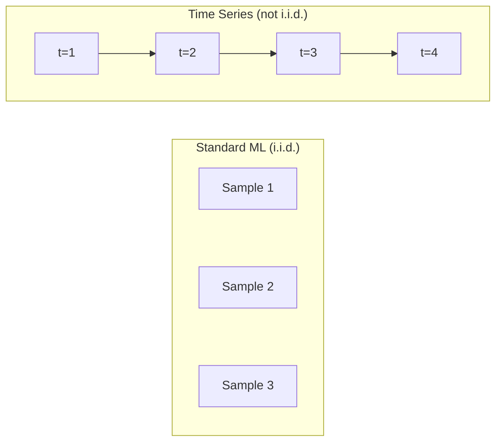
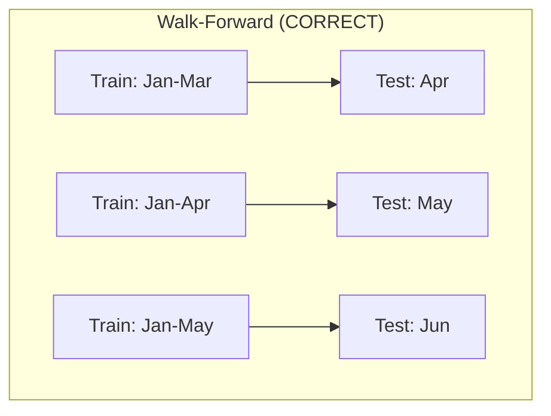
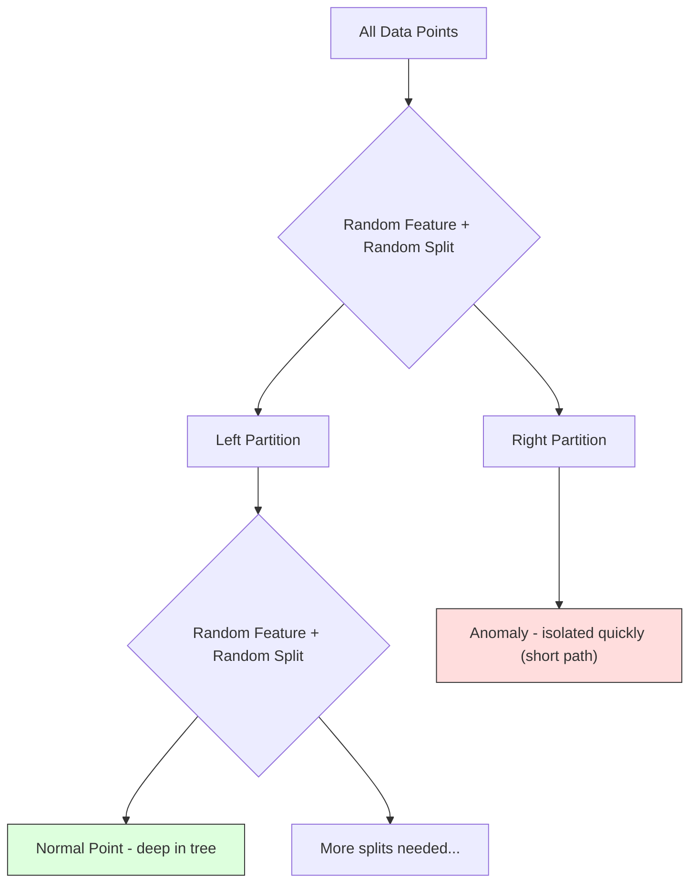
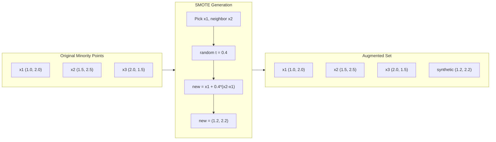

# Evaluation, Tuning, Ensembles & Special Data

> Combined lessons (8 parts), merged verbatim — no content removed.

**Type:** Combined

---

## Part 1 (ch043): Model Evaluation

> A model is only as good as the way you measure it.

**Type:** Build
**Languages:** Python
**Prerequisites:** Phase 1 (Probability & Distributions, Statistics for ML), Phase 2 Lessons 1-8
**Time:** ~90 minutes

## Learning Objectives

- Implement K-fold and stratified K-fold cross-validation from scratch and explain why stratification matters for imbalanced data
- Compute precision, recall, F1, AUC-ROC, and regression metrics (MSE, RMSE, MAE, R-squared) from scratch
- Interpret learning curves to diagnose whether a model suffers from high bias or high variance
- Identify common evaluation mistakes including data leakage, wrong metric selection, and test set contamination

## The Problem

You trained a model. It gets 95% accuracy on your data. Is it good?

Maybe. Maybe not. If 95% of your data belongs to one class, a model that always predicts that class gets 95% accuracy while being completely useless. If you evaluated on the same data you trained on, the 95% number is meaningless because the model just memorized the answers. If your dataset has a time component and you randomly shuffled before splitting, your model might be using future data to predict the past.

Model evaluation is where most ML projects go wrong. The wrong metric makes a bad model look good. The wrong split lets a model cheat. The wrong comparison makes you pick the worse model. Getting evaluation right is not optional. It is the difference between a model that works in production and one that fails the moment it sees real data.

## The Concept

### Train, Validation, Test



Three splits, three purposes:

- **Training set**: the model learns from this data. It sees these examples during training.
- **Validation set**: used to tune hyperparameters and select between models. The model never trains on this data, but your decisions are influenced by it.
- **Test set**: touched exactly once, at the very end, to report final performance. If you look at test performance and then go back to change your model, it is no longer a test set. It has become a second validation set.

The test set is your hold-out guarantee that the reported performance reflects how the model will do on truly unseen data.

### K-Fold Cross-Validation

With small datasets, a single train/validation split wastes data and gives noisy estimates. K-fold cross-validation uses all the data for both training and validation:

```mermaid
flowchart TB
    subgraph Fold1["Fold 1"]
        direction LR
        V1["Val"] --- T1a["Train"] --- T1b["Train"] --- T1c["Train"] --- T1d["Train"]
    end
    subgraph Fold2["Fold 2"]
        direction LR
        T2a["Train"] --- V2["Val"] --- T2b["Train"] --- T2c["Train"] --- T2d["Train"]
    end
    subgraph Fold3["Fold 3"]
        direction LR
        T3a["Train"] --- T3b["Train"] --- V3["Val"] --- T3c["Train"] --- T3d["Train"]
    end
    subgraph Fold4["Fold 4"]
        direction LR
        T4a["Train"] --- T4b["Train"] --- T4c["Train"] --- V4["Val"] --- T4d["Train"]
    end
    subgraph Fold5["Fold 5"]
        direction LR
        T5a["Train"] --- T5b["Train"] --- T5c["Train"] --- T5d["Train"] --- V5["Val"]
    end
    Fold1 --> R["Average scores"]
    Fold2 --> R
    Fold3 --> R
    Fold4 --> R
    Fold5 --> R
```



1. Split data into K equal-sized folds
2. For each fold, train on K-1 folds and validate on the remaining fold
3. Average the K validation scores

K=5 or K=10 are standard choices. Every data point gets used for validation exactly once.

**Stratified K-fold**: preserves the class distribution in each fold. If your dataset is 70% class A and 30% class B, each fold will have roughly the same ratio. This is important for imbalanced datasets where a random split might put all minority samples in one fold.

### Classification Metrics

**Confusion matrix**: the foundation. For binary classification:

|  | Predicted Positive | Predicted Negative |
|--|---|---|
| Actually Positive | True Positive (TP) | False Negative (FN) |
| Actually Negative | False Positive (FP) | True Negative (TN) |

From this matrix, all other metrics follow:

- **Accuracy** = (TP + TN) / (TP + TN + FP + FN). Fraction of correct predictions. Misleading when classes are imbalanced.
- **Precision** = TP / (TP + FP). Of all things predicted positive, how many actually were? Use when false positives are costly.
- **Recall** (sensitivity) = TP / (TP + FN). Of all actual positives, how many did we catch? Use when false negatives are costly.
- **F1 score** = 2 * precision * recall / (precision + recall). Harmonic mean of precision and recall.
- **AUC-ROC**: Area Under the Receiver Operating Characteristic curve. Plots true positive rate vs false positive rate at various classification thresholds. AUC = 0.5 means random guessing, AUC = 1.0 means perfect separation.

### Regression Metrics

- **MSE** (Mean Squared Error) = mean((y_true - y_pred)^2). Penalizes large errors quadratically. Sensitive to outliers.
- **RMSE** (Root Mean Squared Error) = sqrt(MSE). Same units as the target variable.
- **MAE** (Mean Absolute Error) = mean(|y_true - y_pred|). More robust to outliers than MSE.
- **R-squared** = 1 - SS_res / SS_tot. Fraction of variance explained by the model. R^2 = 1.0 is perfect. R^2 = 0.0 means the model is no better than always predicting the mean.

### Learning Curves

Plot training and validation scores as a function of training set size:

- **High bias (underfitting)**: both curves converge to a low score. Adding more data will not help. You need a more complex model.
- **High variance (overfitting)**: training score is high but validation score is much lower. Adding more data should help.

### Common Evaluation Mistakes

**Data leakage**: information from the test set leaks into training. Examples: fitting a scaler on the full dataset before splitting, including future data in time series prediction. Always split first, then preprocess.

**Class imbalance**: 99% of transactions are legitimate, 1% are fraud. A model that always predicts "legitimate" gets 99% accuracy. Use precision, recall, F1, or AUC-ROC instead.

**Wrong metric**: optimizing accuracy when you should optimize recall (medical diagnosis), or optimizing RMSE when your data has heavy outliers (use MAE instead).

**Not using stratified splits**: with imbalanced data, a random split might put very few minority samples in the validation fold.

**Testing too often**: every time you look at test performance and adjust, you overfit to the test set. The test set is single-use.

## Build It

### Step 1: Train/validation/test split

```python
import random
import math

def train_val_test_split(X, y, train_ratio=0.6, val_ratio=0.2, seed=42):
    random.seed(seed)
    n = len(X)
    indices = list(range(n))
    random.shuffle(indices)
    train_end = int(n * train_ratio)
    val_end = int(n * (train_ratio + val_ratio))
    train_idx = indices[:train_end]
    val_idx = indices[train_end:val_end]
    test_idx = indices[val_end:]
    X_train = [X[i] for i in train_idx]
    y_train = [y[i] for i in train_idx]
    X_val = [X[i] for i in val_idx]
    y_val = [y[i] for i in val_idx]
    X_test = [X[i] for i in test_idx]
    y_test = [y[i] for i in test_idx]
    return X_train, y_train, X_val, y_val, X_test, y_test
```

### Step 2: K-fold and stratified K-fold cross-validation

```python
def kfold_split(n, k=5, seed=42):
    random.seed(seed)
    indices = list(range(n))
    random.shuffle(indices)
    fold_size = n // k
    folds = []
    for i in range(k):
        start = i * fold_size
        end = start + fold_size if i < k - 1 else n
        val_idx = indices[start:end]
        train_idx = indices[:start] + indices[end:]
        folds.append((train_idx, val_idx))
    return folds

def stratified_kfold_split(y, k=5, seed=42):
    random.seed(seed)
    class_indices = {}
    for i, label in enumerate(y):
        class_indices.setdefault(label, []).append(i)
    for label in class_indices:
        random.shuffle(class_indices[label])
    folds = [{"train": [], "val": []} for _ in range(k)]
    for label, indices in class_indices.items():
        fold_size = len(indices) // k
        for i in range(k):
            start = i * fold_size
            end = start + fold_size if i < k - 1 else len(indices)
            val_part = indices[start:end]
            train_part = indices[:start] + indices[end:]
            folds[i]["val"].extend(val_part)
            folds[i]["train"].extend(train_part)
    return [(f["train"], f["val"]) for f in folds]

def cross_validate(X, y, model_fn, k=5, metric_fn=None, stratified=False):
    n = len(X)
    if stratified:
        folds = stratified_kfold_split(y, k)
    else:
        folds = kfold_split(n, k)
    scores = []
    for train_idx, val_idx in folds:
        X_train = [X[i] for i in train_idx]
        y_train = [y[i] for i in train_idx]
        X_val = [X[i] for i in val_idx]
        y_val = [y[i] for i in val_idx]
        model = model_fn()
        model.fit(X_train, y_train)
        predictions = [model.predict(x) for x in X_val]
        if metric_fn:
            score = metric_fn(y_val, predictions)
        else:
            score = sum(1 for yt, yp in zip(y_val, predictions) if yt == yp) / len(y_val)
        scores.append(score)
    return scores
```

### Step 3: Confusion matrix and classification metrics

```python
def confusion_matrix(y_true, y_pred):
    tp = sum(1 for yt, yp in zip(y_true, y_pred) if yt == 1 and yp == 1)
    tn = sum(1 for yt, yp in zip(y_true, y_pred) if yt == 0 and yp == 0)
    fp = sum(1 for yt, yp in zip(y_true, y_pred) if yt == 0 and yp == 1)
    fn = sum(1 for yt, yp in zip(y_true, y_pred) if yt == 1 and yp == 0)
    return tp, tn, fp, fn

def accuracy(y_true, y_pred):
    tp, tn, fp, fn = confusion_matrix(y_true, y_pred)
    total = tp + tn + fp + fn
    return (tp + tn) / total if total > 0 else 0.0

def precision(y_true, y_pred):
    tp, tn, fp, fn = confusion_matrix(y_true, y_pred)
    return tp / (tp + fp) if (tp + fp) > 0 else 0.0

def recall(y_true, y_pred):
    tp, tn, fp, fn = confusion_matrix(y_true, y_pred)
    return tp / (tp + fn) if (tp + fn) > 0 else 0.0

def f1_score(y_true, y_pred):
    p = precision(y_true, y_pred)
    r = recall(y_true, y_pred)
    return 2 * p * r / (p + r) if (p + r) > 0 else 0.0

def roc_curve(y_true, y_scores):
    thresholds = sorted(set(y_scores), reverse=True)
    tpr_list = []
    fpr_list = []
    total_positives = sum(y_true)
    total_negatives = len(y_true) - total_positives
    for threshold in thresholds:
        y_pred = [1 if s >= threshold else 0 for s in y_scores]
        tp = sum(1 for yt, yp in zip(y_true, y_pred) if yt == 1 and yp == 1)
        fp = sum(1 for yt, yp in zip(y_true, y_pred) if yt == 0 and yp == 1)
        tpr = tp / total_positives if total_positives > 0 else 0.0
        fpr = fp / total_negatives if total_negatives > 0 else 0.0
        tpr_list.append(tpr)
        fpr_list.append(fpr)
    return fpr_list, tpr_list, thresholds

def auc_roc(y_true, y_scores):
    fpr_list, tpr_list, _ = roc_curve(y_true, y_scores)
    pairs = sorted(zip(fpr_list, tpr_list))
    fpr_sorted = [p[0] for p in pairs]
    tpr_sorted = [p[1] for p in pairs]
    area = 0.0
    for i in range(1, len(fpr_sorted)):
        width = fpr_sorted[i] - fpr_sorted[i - 1]
        height = (tpr_sorted[i] + tpr_sorted[i - 1]) / 2
        area += width * height
    return area
```

### Step 4: Regression metrics

```python
def mse(y_true, y_pred):
    n = len(y_true)
    return sum((yt - yp) ** 2 for yt, yp in zip(y_true, y_pred)) / n

def rmse(y_true, y_pred):
    return math.sqrt(mse(y_true, y_pred))

def mae(y_true, y_pred):
    n = len(y_true)
    return sum(abs(yt - yp) for yt, yp in zip(y_true, y_pred)) / n

def r_squared(y_true, y_pred):
    mean_y = sum(y_true) / len(y_true)
    ss_res = sum((yt - yp) ** 2 for yt, yp in zip(y_true, y_pred))
    ss_tot = sum((yt - mean_y) ** 2 for yt in y_true)
    if ss_tot == 0:
        return 0.0
    return 1.0 - ss_res / ss_tot
```

### Step 5: Learning curves

```python
def learning_curve(X, y, model_fn, metric_fn, train_sizes=None, val_ratio=0.2, seed=42):
    random.seed(seed)
    n = len(X)
    indices = list(range(n))
    random.shuffle(indices)
    val_size = int(n * val_ratio)
    val_idx = indices[:val_size]
    pool_idx = indices[val_size:]
    X_val = [X[i] for i in val_idx]
    y_val = [y[i] for i in val_idx]
    if train_sizes is None:
        train_sizes = [int(len(pool_idx) * r) for r in [0.1, 0.2, 0.4, 0.6, 0.8, 1.0]]
    train_scores = []
    val_scores = []
    for size in train_sizes:
        subset = pool_idx[:size]
        X_train = [X[i] for i in subset]
        y_train = [y[i] for i in subset]
        model = model_fn()
        model.fit(X_train, y_train)
        train_pred = [model.predict(x) for x in X_train]
        val_pred = [model.predict(x) for x in X_val]
        train_scores.append(metric_fn(y_train, train_pred))
        val_scores.append(metric_fn(y_val, val_pred))
    return train_sizes, train_scores, val_scores
```

## Use It

With scikit-learn, evaluation is built into the workflow:

```python
from sklearn.model_selection import cross_val_score, StratifiedKFold, learning_curve
from sklearn.metrics import (
    accuracy_score, precision_score, recall_score, f1_score,
    roc_auc_score, confusion_matrix, mean_squared_error, r2_score,
)
from sklearn.linear_model import LogisticRegression

model = LogisticRegression()
scores = cross_val_score(model, X, y, cv=StratifiedKFold(5), scoring="f1")
```

## Ship It

This lesson produces `outputs/skill-evaluation.md` -- a skill covering evaluation strategy for classification and regression models.

## Exercises

1. Implement precision-recall curves: plot precision vs recall at different thresholds. Compute the average precision (area under the PR curve). Compare the PR curve to the ROC curve on an imbalanced dataset and explain when each is more informative.
2. Build a nested cross-validation loop: the outer loop evaluates model performance, the inner loop tunes hyperparameters. Use it to compare two models fairly without leaking validation data into the evaluation.
3. Implement a permutation test for model comparison: shuffle the labels, retrain, and measure performance. Repeat 100 times to build a null distribution. Compute the p-value for the observed model performance against this distribution.

## Key Terms

| Term | What people say | What it actually means |
|------|----------------|----------------------|
| Overfitting | "Memorizing the training data" | The model captures noise in the training data, performing well on training but poorly on unseen data |
| Cross-validation | "Testing on different subsets" | Systematically rotating which portion of data is used for validation, averaging results across all rotations |
| Precision | "How many predicted positives are correct" | TP / (TP + FP): the fraction of positive predictions that are actually positive |
| Recall | "How many actual positives we found" | TP / (TP + FN): the fraction of actual positives that were correctly identified |
| AUC-ROC | "How well the model separates classes" | The area under the curve of true positive rate vs false positive rate across all thresholds |
| R-squared | "How much variance is explained" | 1 - (sum of squared residuals / total sum of squares) |
| Data leakage | "The model cheated" | Using information during training that would not be available at prediction time |
| Learning curve | "How performance changes with more data" | A plot of training and validation scores vs training set size |
| Stratified split | "Keeping class ratios balanced" | Splitting data so each subset has the same proportion of each class as the full dataset |

## Further Reading

- [scikit-learn Model Selection Guide](https://scikit-learn.org/stable/model_selection.html)
- [Beyond Accuracy: Precision and Recall (Google ML Crash Course)](https://developers.google.com/machine-learning/crash-course/classification/precision-and-recall)
- [A Survey of Cross-Validation Procedures (Arlot & Celisse, 2010)](https://projecteuclid.org/journals/statistics-surveys/volume-4/issue-none/A-survey-of-cross-validation-procedures-for-model-selection/10.1214/09-SS054.full)

[Reference](https://github.com/rohitg00/ai-engineering-from-scratch/tree/main/phases/02-ml-fundamentals/09-model-evaluation)

---

## Part 2 (ch044): Bias-Variance Tradeoff

> Every model error comes from one of three sources: bias, variance, or noise. You can only control the first two.

**Type:** Learn
**Language:** Python
**Prerequisites:** Phase 2, Lessons 01-09 (ML basics, regression, classification, evaluation)
**Time:** ~75 minutes

## Learning Objectives

- Derive the bias-variance decomposition of expected prediction error and explain the role of irreducible noise
- Diagnose whether a model suffers from high bias or high variance using training and test error patterns
- Explain how regularization techniques (L1, L2, dropout, early stopping) trade bias for variance
- Implement experiments that visualize the bias-variance tradeoff across models of increasing complexity

## The Problem

You trained a model. It has some error on test data. Where does that error come from?

If your model is too simple (linear regression on a curved dataset), it will consistently miss the true pattern. That is bias. If your model is too complex (degree-20 polynomial on 15 data points), it will fit the training data perfectly but give wildly different predictions on new data. That is variance.

You cannot minimize both at the same time for a fixed model capacity. Push bias down and variance goes up. Push variance down and bias goes up. Understanding this tradeoff is the single most useful diagnostic skill in machine learning.

## The Concept

### Bias: Systematic Error

Bias measures how far off your model's average prediction is from the true value. High bias means the model is too rigid to capture the real pattern. A straight line fit to a parabola will always miss the curve, no matter how much data you give it. This is underfitting.

### Variance: Sensitivity to Training Data

Variance measures how much your predictions change when you train on different subsets of data. High variance means the model is fitting noise in the training data, not the underlying signal. A degree-20 polynomial will thread through every training point but oscillate wildly between them. This is overfitting.

### The Decomposition

For any point x, the expected prediction error under squared loss decomposes exactly:

```
Expected Error = Bias^2 + Variance + Irreducible Noise

where:
  Bias^2   = (E[f_hat(x)] - f(x))^2
  Variance = E[(f_hat(x) - E[f_hat(x)])^2]
  Noise    = E[(y - f(x))^2]             (sigma^2)
```

- `f(x)` is the true function
- `f_hat(x)` is your model's prediction
- `E[...]` is the expectation over different training sets
- `y` is the observed label (true function plus noise)

The noise term is irreducible. No model can do better than sigma^2 on noisy data.

### Model Complexity vs Error

The classic U-shaped curve:

| Complexity | Bias | Variance | Total Error |
|-----------|------|----------|-------------|
| Too low | HIGH | LOW | HIGH (underfitting) |
| Just right | MODERATE | MODERATE | LOWEST |
| Too high | LOW | HIGH | HIGH (overfitting) |

### Regularization as Bias-Variance Control

Regularization deliberately increases bias to reduce variance:

- **L2 (Ridge):** Shrinks all weights toward zero. Keeps all features but reduces their influence.
- **L1 (Lasso):** Pushes some weights exactly to zero. Performs feature selection.
- **Dropout:** Randomly disables neurons during training. Forces redundant representations.
- **Early stopping:** Stops training before the model fully fits the training data.

### Double Descent: The Modern Perspective

Research since 2019 has shown that if you keep increasing model capacity far past the interpolation threshold, test error can decrease again. This "double descent" phenomenon explains why massively overparameterized neural networks (with far more parameters than training examples) still generalize well.

| Regime | Parameters vs Samples | Behavior |
|--------|----------------------|----------|
| Underparameterized | p << n | Classical tradeoff applies |
| Interpolation threshold | p ~ n | Variance peaks, test error spikes |
| Overparameterized | p >> n | Implicit regularization kicks in, test error drops |

### Diagnosing Your Model

| Symptom | Diagnosis | Fix |
|---------|-----------|-----|
| High train error, high test error | Bias | More features, complex model, less regularization |
| Low train error, high test error | Variance | More data, regularization, simpler model, dropout |
| Low train error, low test error | Good fit | Ship it |
| Train error decreasing, test error increasing | Overfitting in progress | Early stopping |

### Ensemble Methods and Variance Reduction

| Method | Primary Effect | Bias Change | Variance Change |
|--------|---------------|-------------|-----------------|
| Bagging | Reduces variance | No change | Decreases |
| Boosting | Reduces bias | Decreases | Can increase |
| Stacking | Reduces both | Depends on meta-learner | Depends on base models |

## Build It

### Step 1: Generate Synthetic Data from a Known Function

```python
def true_function(x):
    return np.sin(1.5 * x) + 0.5 * x

def generate_data(n_samples=30, noise_std=0.5, x_range=(-3, 3), seed=None):
    rng = np.random.RandomState(seed)
    x = rng.uniform(x_range[0], x_range[1], n_samples)
    y = true_function(x) + rng.normal(0, noise_std, n_samples)
    return x, y
```

### Step 2: Bootstrap Sampling and Polynomial Fitting

```python
def fit_polynomial(x_train, y_train, degree, lam=0.0):
    X = np.column_stack([x_train ** d for d in range(degree + 1)])
    if lam > 0:
        penalty = lam * np.eye(X.shape[1])
        penalty[0, 0] = 0
        w = np.linalg.solve(X.T @ X + penalty, X.T @ y_train)
    else:
        w = np.linalg.lstsq(X, y_train, rcond=None)[0]
    return w
```

### Step 3: Computing Bias^2, Variance Decomposition

```python
mean_pred = predictions.mean(axis=0)
bias_sq = np.mean((mean_pred - y_true) ** 2)
variance = np.mean(predictions.var(axis=0))
total_error = np.mean(np.mean((predictions - y_true) ** 2, axis=1))
```

### Step 4: Learning Curves

```python
def demo_learning_curves():
    sizes = [10, 15, 20, 30, 50, 75, 100, 150, 200, 300]
    degree = 5
    for n in sizes:
        train_errors = []
        test_errors = []
        for seed in range(50):
            x_train, y_train = generate_data(n_samples=n, seed=seed * 100)
            w = fit_polynomial(x_train, y_train, degree)
            train_pred = predict_polynomial(x_train, w)
            train_mse = np.mean((train_pred - y_train) ** 2)
            test_pred = predict_polynomial(x_test, w)
            test_mse = np.mean((test_pred - y_test) ** 2)
            train_errors.append(train_mse)
            test_errors.append(test_mse)
```

### Step 5: Regularization Sweep

```python
def demo_regularization_sweep():
    alphas = [0.001, 0.005, 0.01, 0.05, 0.1, 0.5, 1.0, 5.0, 10.0, 50.0, 100.0]
    for alpha in alphas:
        results = bias_variance_decomposition([15], lam=alpha)
        r = results[15]
        print(f"alpha={alpha:.3f}  bias={r['bias_sq']:.4f}  var={r['variance']:.4f}")
```

## Use It

### Validation Curve: Sweep Model Complexity

```python
from sklearn.model_selection import validation_curve
from sklearn.pipeline import make_pipeline
from sklearn.preprocessing import PolynomialFeatures
from sklearn.linear_model import Ridge

degrees = list(range(1, 16))
train_scores_all = []
val_scores_all = []
for d in degrees:
    pipe = make_pipeline(PolynomialFeatures(d), Ridge(alpha=0.01))
    train_scores, val_scores = validation_curve(
        pipe, X, y, param_name="polynomialfeatures__degree",
        param_range=[d], cv=5, scoring="neg_mean_squared_error"
    )
    train_scores_all.append(-train_scores.mean())
    val_scores_all.append(-val_scores.mean())
```

### Learning Curve: Sweep Training Set Size

```python
from sklearn.model_selection import learning_curve

pipe = make_pipeline(PolynomialFeatures(5), Ridge(alpha=0.01))
train_sizes, train_scores, val_scores = learning_curve(
    pipe, X, y, train_sizes=np.linspace(0.1, 1.0, 10),
    cv=5, scoring="neg_mean_squared_error"
)
train_mse = -train_scores.mean(axis=1)
val_mse = -val_scores.mean(axis=1)
```

## Ship It

This lesson produces `outputs/prompt-model-diagnostics.md`.

## Exercises

1. Run the decomposition with `noise_std=0` (no noise). What happens to the irreducible error term? Does the optimal complexity change?
2. Increase the training set size from 30 to 300. How does this affect the variance component? Does the optimal polynomial degree shift?
3. Add L2 regularization (Ridge regression) to the experiment. For a fixed high-degree polynomial (degree 15), sweep lambda from 0 to 100. Plot bias^2 and variance as functions of lambda.
4. Modify the true function from a polynomial to `sin(x)`. How does the bias-variance decomposition change?
5. Implement a simple bootstrap aggregating (bagging) wrapper: train 10 models on bootstrap samples and average predictions. Show that this reduces variance without increasing bias much.

## Key Terms

| Term | What people say | What it actually means |
|------|----------------|----------------------|
| Bias | "The model is too simple" | Systematic error from wrong assumptions. The gap between the average model prediction and truth. |
| Variance | "The model is overfitting" | Error from sensitivity to training data. How much predictions change across different training sets. |
| Irreducible error | "Noise in the data" | Error from randomness in the true data-generating process. No model can eliminate it. |
| Underfitting | "Not learning enough" | Model has high bias. It misses the real pattern even on training data. |
| Overfitting | "Memorizing the data" | Model has high variance. It fits noise in training data that does not generalize. |
| Regularization | "Constraining the model" | Adding a penalty to reduce model complexity, trading bias for lower variance. |
| Double descent | "More parameters can help" | Test error decreases again when model capacity far exceeds the interpolation threshold. |
| Model complexity | "How flexible the model is" | The capacity of a model to fit arbitrary patterns. |

## Further Reading

- [Hastie, Tibshirani, Friedman: Elements of Statistical Learning, Ch. 7](https://hastie.su.domains/ElemStatLearn/)
- [Belkin et al., Reconciling modern machine learning practice and the bias-variance trade-off (2019)](https://arxiv.org/abs/1812.11118)
- [Nakkiran et al., Deep Double Descent (2019)](https://arxiv.org/abs/1912.02292)
- [Scott Fortmann-Roe: Understanding the Bias-Variance Tradeoff](http://scott.fortmann-roe.com/docs/BiasVariance.html)

[Reference](https://github.com/rohitg00/ai-engineering-from-scratch/tree/main/phases/02-ml-fundamentals/10-bias-variance)

---

## Part 3 (ch045): Ensemble Methods

> A group of weak learners, combined correctly, becomes a strong learner. This is not a metaphor. It is a theorem.

**Type:** Build
**Language:** Python
**Prerequisites:** Phase 2, Lesson 10 (Bias-Variance Tradeoff)
**Time:** ~120 minutes

## Learning Objectives

- Implement AdaBoost and gradient boosting from scratch and explain how boosting sequentially reduces bias
- Build a bagging ensemble and demonstrate how averaging decorrelated models reduces variance without increasing bias
- Compare bagging, boosting, and stacking in terms of what error component each method targets
- Evaluate ensemble diversity and explain why majority voting accuracy improves with more independent weak learners

## The Problem

A single decision tree is fast to train and easy to interpret, but it overfits. A single linear model underfits on complex boundaries. You could spend days engineering the perfect model architecture. Or you could combine a bunch of imperfect models and get something better than any of them individually.

Ensemble methods do exactly this. They are the most reliable technique for winning Kaggle competitions on tabular data, they power most production ML systems, and they illustrate the bias-variance tradeoff in action.

## The Concept

### Why Ensembles Work

Suppose you have N independent classifiers, each with accuracy p > 0.5. The majority vote has accuracy:

```
P(majority correct) = sum over k > N/2 of C(N,k) * p^k * (1-p)^(N-k)
```

For 21 classifiers each with 60% accuracy, majority vote accuracy is about 74%. With 101 classifiers, it rises to 84%.

The key requirement is **diversity**. If all models make the same errors, combining them helps nothing.

### Bagging (Bootstrap Aggregating)

Bagging creates diversity by training each model on a different bootstrap sample of the training data.



A bootstrap sample is drawn with replacement from the original data. About 63.2% of unique samples appear in each bootstrap. The remaining 36.8% (out-of-bag samples) provide a free validation set.

**Random Forests** are bagging with an extra twist: at each split, only a random subset of features is considered.

### Boosting (Sequential Error Correction)

Boosting trains models sequentially. Each new model focuses on the examples that previous models got wrong.



### AdaBoost

AdaBoost (Adaptive Boosting) was the first practical boosting algorithm. It works with any base learner, typically decision stumps (depth-1 trees).

The algorithm:

```
1. Initialize sample weights: w_i = 1/N for all i
2. For t = 1 to T:
   a. Train weak learner h_t on weighted data
   b. Compute weighted error: err_t = sum(w_i * I(h_t(x_i) != y_i)) / sum(w_i)
   c. Compute model weight: alpha_t = 0.5 * ln((1 - err_t) / err_t)
   d. Update sample weights: w_i = w_i * exp(-alpha_t * y_i * h_t(x_i))
   e. Normalize weights to sum to 1
3. Final prediction: H(x) = sign(sum(alpha_t * h_t(x)))
```

### Gradient Boosting

Gradient boosting generalizes boosting to arbitrary loss functions. Instead of reweighting samples, it fits each new model to the residuals (negative gradient of the loss) of the current ensemble.

```
1. Initialize: F_0(x) = argmin_c sum(L(y_i, c))
2. For t = 1 to T:
   a. Compute pseudo-residuals: r_i = -dL(y_i, F_{t-1}(x_i)) / dF_{t-1}(x_i)
   b. Fit a tree h_t to the residuals r_i
   c. Find optimal step size: gamma_t = argmin_gamma sum(L(y_i, F_{t-1}(x_i) + gamma * h_t(x_i)))
   d. Update: F_t(x) = F_{t-1}(x) + learning_rate * gamma_t * h_t(x)
3. Final prediction: F_T(x)
```

### Stacking (Meta-Learning)

Stacking uses the predictions of multiple base models as features for a meta-learner. The meta-learner learns which base model to trust for which inputs.

## Build It

### Step 1: Decision Stump (Base Learner)

```python
class DecisionStump:
    def __init__(self):
        self.feature_idx = None
        self.threshold = None
        self.polarity = 1
        self.alpha = None

    def fit(self, X, y, weights):
        n_samples, n_features = X.shape
        best_error = float("inf")
        for f in range(n_features):
            thresholds = np.unique(X[:, f])
            for thresh in thresholds:
                for polarity in [1, -1]:
                    pred = np.ones(n_samples)
                    pred[polarity * X[:, f] < polarity * thresh] = -1
                    error = np.sum(weights[pred != y])
                    if error < best_error:
                        best_error = error
                        self.feature_idx = f
                        self.threshold = thresh
                        self.polarity = polarity

    def predict(self, X):
        n = X.shape[0]
        pred = np.ones(n)
        idx = self.polarity * X[:, self.feature_idx] < self.polarity * self.threshold
        pred[idx] = -1
        return pred
```

### Step 2: AdaBoost from Scratch

```python
class AdaBoostScratch:
    def __init__(self, n_estimators=50):
        self.n_estimators = n_estimators
        self.stumps = []
        self.alphas = []

    def fit(self, X, y):
        n = X.shape[0]
        weights = np.full(n, 1 / n)
        for _ in range(self.n_estimators):
            stump = DecisionStump()
            stump.fit(X, y, weights)
            pred = stump.predict(X)
            err = np.sum(weights[pred != y])
            err = np.clip(err, 1e-10, 1 - 1e-10)
            alpha = 0.5 * np.log((1 - err) / err)
            weights *= np.exp(-alpha * y * pred)
            weights /= weights.sum()
            stump.alpha = alpha
            self.stumps.append(stump)
            self.alphas.append(alpha)

    def predict(self, X):
        total = sum(a * s.predict(X) for a, s in zip(self.alphas, self.stumps))
        return np.sign(total)
```

### Step 3: Gradient Boosting from Scratch

```python
class GradientBoostingScratch:
    def __init__(self, n_estimators=100, learning_rate=0.1, max_depth=3):
        self.n_estimators = n_estimators
        self.lr = learning_rate
        self.max_depth = max_depth
        self.trees = []
        self.initial_pred = None

    def fit(self, X, y):
        self.initial_pred = np.mean(y)
        current_pred = np.full(len(y), self.initial_pred)
        for _ in range(self.n_estimators):
            residuals = y - current_pred
            tree = SimpleRegressionTree(max_depth=self.max_depth)
            tree.fit(X, residuals)
            update = tree.predict(X)
            current_pred += self.lr * update
            self.trees.append(tree)

    def predict(self, X):
        pred = np.full(X.shape[0], self.initial_pred)
        for tree in self.trees:
            pred += self.lr * tree.predict(X)
        return pred
```

## Use It

### When to Use Each Method

| Method | Reduces | Best for | Watch out for |
|--------|---------|----------|---------------|
| Bagging / Random Forest | Variance | Noisy data, many features | Does not help with bias |
| AdaBoost | Bias | Clean data, simple base learners | Sensitive to outliers and noise |
| Gradient Boosting | Bias | Tabular data, competitions | Slow to train, easy to overfit |
| XGBoost / LightGBM | Both | Production tabular ML | Many hyperparameters |
| Stacking | Both | Getting last 1-2% accuracy | Complex, risk of overfitting |
| Voting | Variance | Quick combination of diverse models | Only helps if models are diverse |

## Ship It

This lesson produces `outputs/prompt-ensemble-selector.md` and `outputs/skill-ensemble-builder.md`.

## Exercises

1. Modify the AdaBoost implementation to track training accuracy after each round. Plot accuracy vs. number of estimators. When does it converge?
2. Implement a random forest from scratch by adding random feature subsampling to the regression tree. Compare variance reduction to a single tree.
3. In the gradient boosting implementation, add early stopping: track validation loss after each round and stop when it has not improved for 10 consecutive rounds.
4. Build a stacking ensemble with three base models (logistic regression, decision tree, k-nearest neighbors) and a logistic regression meta-learner.
5. Run XGBoost on the same dataset with default parameters. Compare its accuracy to your from-scratch gradient boosting. Time both.

## Key Terms

| Term | What people say | What it actually means |
|------|----------------|----------------------|
| Bagging | "Train on random subsets" | Bootstrap aggregating: train models on bootstrap samples, average predictions to reduce variance |
| Boosting | "Focus on hard examples" | Train models sequentially, each correcting errors of the ensemble so far, to reduce bias |
| AdaBoost | "Reweight the data" | Boosting via sample weight updates; misclassified points get higher weight for the next learner |
| Gradient boosting | "Fit the residuals" | Boosting via fitting each new model to the negative gradient of the loss function |
| XGBoost | "The Kaggle weapon" | Gradient boosting with regularization, second-order optimization, and systems-level speed tricks |
| Stacking | "Models on top of models" | Use predictions of base models as input features for a meta-learner |
| Random forest | "Many randomized trees" | Bagging with decision trees, adding random feature subsampling |
| Ensemble diversity | "Make different mistakes" | Models must be uncorrelated in their errors for the ensemble to improve |
| Out-of-bag error | "Free validation" | Samples not in a bootstrap draw (~36.8%) serve as a validation set |

## Further Reading

- [Schapire & Freund: Boosting: Foundations and Algorithms](https://mitpress.mit.edu/9780262526036/)
- [Friedman: Greedy Function Approximation: A Gradient Boosting Machine (2001)](https://statweb.stanford.edu/~jhf/ftp/trebst.pdf)
- [Chen & Guestrin: XGBoost (2016)](https://arxiv.org/abs/1603.02754)
- [Wolpert: Stacked Generalization (1992)](https://www.sciencedirect.com/science/article/abs/pii/S0893608005800231)
- [scikit-learn Ensemble Methods](https://scikit-learn.org/stable/modules/ensemble.html)

[Reference](https://github.com/rohitg00/ai-engineering-from-scratch/tree/main/phases/02-ml-fundamentals/11-ensemble-methods)

---

## Part 4 (ch046): Hyperparameter Tuning

> Hyperparameters are the knobs you turn before training starts. Turning them well is the difference between a mediocre model and a great one.

**Type:** Build
**Language:** Python
**Prerequisites:** Phase 2, Lesson 11 (Ensemble Methods)
**Time:** ~90 minutes

## Learning Objectives

- Implement grid search, random search, and Bayesian optimization from scratch and compare their sample efficiency
- Explain why random search outperforms grid search when most hyperparameters have low effective dimensionality
- Build a Bayesian optimization loop using a surrogate model and acquisition function to guide the search
- Design a hyperparameter tuning strategy that avoids overfitting the validation set through proper cross-validation

## The Problem

Your gradient boosting model has a learning rate, number of trees, max depth, min samples per leaf, subsample ratio, and column sample ratio. That is six hyperparameters. If each has 5 reasonable values, the grid has 5^6 = 15,625 combinations. Training each takes 10 seconds. That is 43 hours of compute to try them all.

Grid search is the obvious approach and the worst one at scale. Random search does better with less compute. Bayesian optimization does even better by learning from past evaluations.

## The Concept

### Parameters vs Hyperparameters

| Hyperparameter | What it controls | Typical range |
|---------------|-----------------|---------------|
| Learning rate | Step size per update | 0.001 to 1.0 |
| Number of trees/epochs | How long to train | 10 to 10,000 |
| Max depth | Model complexity | 1 to 30 |
| Regularization (lambda) | Overfitting prevention | 0.0001 to 100 |
| Batch size | Gradient estimation noise | 16 to 512 |
| Dropout rate | Fraction of neurons dropped | 0.0 to 0.5 |

### Grid Search

Grid search evaluates every combination of specified values. It scales exponentially with the number of hyperparameters.

```
Grid for 2 hyperparameters:
  learning_rate: [0.01, 0.1, 1.0]
  max_depth:     [3, 5, 7]
  Evaluations: 3 x 3 = 9 combinations
```

Grid search has a fundamental flaw: if one hyperparameter matters and the other does not, most evaluations are wasted.

### Random Search

Random search samples hyperparameters from distributions instead of a grid. With the same budget of 9 evaluations, you get 9 unique values of each hyperparameter.

Why random beats grid (Bergstra & Bengio, 2012):
- Most hyperparameters have low effective dimensionality
- Grid search wastes evaluations on unimportant dimensions
- Random search covers the important dimensions more densely

### Bayesian Optimization

Bayesian optimization uses past evaluations to decide where to search next. It has two key components:

**Surrogate model:** A cheap-to-evaluate model (usually a Gaussian process) that approximates the expensive objective function.

**Acquisition function:** Decides where to evaluate next by balancing exploitation and exploration. Common choices: Expected Improvement (EI), Upper Confidence Bound (UCB), Probability of Improvement (PI).

Bayesian optimization typically finds better hyperparameters than random search with 2-5x fewer evaluations.

### Early Stopping

Not every training run needs to finish. If a configuration is clearly bad after 10 epochs, stop it. Strategies include patience-based, median pruning, and Hyperband.

### Learning Rate Schedulers

| Scheduler | Formula | When to use |
|-----------|---------|-------------|
| Step decay | Multiply by 0.1 every N epochs | Classic CNN training |
| Cosine annealing | lr * 0.5 * (1 + cos(pi * t / T)) | Modern default |
| Warmup + decay | Linear increase then cosine decay | Transformers |
| Reduce on plateau | Reduce by factor when metric stalls | Safe default |

### Practical Strategy

1. **Start with library defaults.** They are often 80% of the way there.
2. **Coarse random search.** Wide ranges, 20-50 trials.
3. **Analyze results.** Narrow the search space.
4. **Fine search.** Bayesian optimization or focused random search. 50-100 trials.
5. **Retrain on all training data** with the best hyperparameters found.

## Build It

### Step 1: Grid Search from Scratch

```python
def grid_search(model_fn, param_grid, X_train, y_train, X_val, y_val):
    keys = list(param_grid.keys())
    values = list(param_grid.values())
    best_score = -float("inf")
    best_params = None
    n_evals = 0
    for combo in itertools.product(*values):
        params = dict(zip(keys, combo))
        model = model_fn(**params)
        model.fit(X_train, y_train)
        score = evaluate(model, X_val, y_val)
        n_evals += 1
        if score > best_score:
            best_score = score
            best_params = params
    return best_params, best_score, n_evals
```

### Step 2: Random Search from Scratch

```python
def random_search(model_fn, param_distributions, X_train, y_train,
                  X_val, y_val, n_iter=50, seed=42):
    rng = np.random.RandomState(seed)
    best_score = -float("inf")
    best_params = None
    for _ in range(n_iter):
        params = {k: sample(v, rng) for k, v in param_distributions.items()}
        model = model_fn(**params)
        model.fit(X_train, y_train)
        score = evaluate(model, X_val, y_val)
        if score > best_score:
            best_score = score
            best_params = params
    return best_params, best_score, n_iter
```

### Step 3: Bayesian Optimization (Simplified)

```python
class SimpleBayesianOptimizer:
    def __init__(self, search_space, n_initial=5):
        self.search_space = search_space
        self.n_initial = n_initial
        self.X_observed = []
        self.y_observed = []

    def _kernel(self, x1, x2, length_scale=1.0):
        dists = np.sum((x1[:, None, :] - x2[None, :, :]) ** 2, axis=2)
        return np.exp(-0.5 * dists / length_scale ** 2)

    def _fit_gp(self, X_new):
        X_obs = np.array(self.X_observed)
        y_obs = np.array(self.y_observed)
        y_mean = y_obs.mean()
        y_centered = y_obs - y_mean
        K = self._kernel(X_obs, X_obs) + 1e-4 * np.eye(len(X_obs))
        K_star = self._kernel(X_new, X_obs)
        L = np.linalg.cholesky(K)
        alpha = np.linalg.solve(L.T, np.linalg.solve(L, y_centered))
        mu = K_star @ alpha + y_mean
        v = np.linalg.solve(L, K_star.T)
        var = 1.0 - np.sum(v ** 2, axis=0)
        var = np.maximum(var, 1e-6)
        return mu, var

    def _expected_improvement(self, mu, var, best_y):
        sigma = np.sqrt(var)
        z = (mu - best_y) / (sigma + 1e-10)
        ei = sigma * (z * norm_cdf(z) + norm_pdf(z))
        return ei

    def suggest(self):
        if len(self.X_observed) < self.n_initial:
            return sample_random(self.search_space)
        candidates = [sample_random(self.search_space) for _ in range(500)]
        X_cand = np.array([to_vector(c) for c in candidates])
        mu, var = self._fit_gp(X_cand)
        ei = self._expected_improvement(mu, var, max(self.y_observed))
        return candidates[np.argmax(ei)]

    def observe(self, params, score):
        self.X_observed.append(to_vector(params))
        self.y_observed.append(score)
```

## Use It

### Optuna in Practice

```python
import optuna

def objective(trial):
    lr = trial.suggest_float("learning_rate", 1e-4, 1e-1, log=True)
    n_est = trial.suggest_int("n_estimators", 50, 500)
    max_depth = trial.suggest_int("max_depth", 2, 10)
    model = GradientBoostingRegressor(
        learning_rate=lr, n_estimators=n_est, max_depth=max_depth,
    )
    model.fit(X_train, y_train)
    return mean_squared_error(y_val, model.predict(X_val))

study = optuna.create_study(direction="minimize")
study.optimize(objective, n_trials=100)
print(f"Best params: {study.best_params}")
```

### sklearn's Built-in Tuners

```python
from sklearn.model_selection import RandomizedSearchCV
from scipy.stats import loguniform, randint

param_dist = {
    "learning_rate": loguniform(1e-4, 0.5),
    "max_depth": randint(2, 10),
    "n_estimators": randint(50, 500),
}
search = RandomizedSearchCV(
    GradientBoostingRegressor(), param_dist, n_iter=100,
    cv=5, scoring="neg_mean_squared_error", random_state=42, n_jobs=-1,
)
search.fit(X_train, y_train)
```

## Ship It

This lesson produces `outputs/skill-hyperparameter-tuner.md`.

## Exercises

1. Run grid search and random search with the same total budget (e.g., 50 evaluations). Compare the best scores found. How often does random search win?
2. Implement Hyperband from scratch. Start with 81 configurations, each trained for 1 epoch. Keep the top 1/3 at each round and triple their budget.
3. Add a learning rate scheduler (cosine annealing) to the gradient boosting implementation from Lesson 11. Does it help compared to a fixed learning rate?
4. Use Optuna to tune a RandomForestClassifier on a real dataset. Use `optuna.visualization.plot_param_importances(study)` to see which hyperparameters matter most.
5. Implement a simple acquisition function (Expected Improvement) and demonstrate exploration vs exploitation.

## Key Terms

| Term | What people say | What it actually means |
|------|----------------|----------------------|
| Hyperparameter | "A setting you choose" | A value set before training that controls the learning process, not learned from data |
| Grid search | "Try every combination" | Exhaustive search over a specified parameter grid. Exponential cost. |
| Random search | "Just sample randomly" | Sample hyperparameters from distributions. Covers important dimensions better than grid search. |
| Bayesian optimization | "Smart search" | Uses a surrogate model of the objective to decide where to evaluate next |
| Surrogate model | "A cheap approximation" | A model (usually Gaussian process) that approximates the expensive objective function |
| Acquisition function | "Where to look next" | Scores candidate points by balancing expected improvement with uncertainty |
| Early stopping | "Stop wasting time" | Terminate training early when validation performance stops improving |
| Hyperband | "Tournament bracket for configs" | Adaptive resource allocation: start many configs with small budgets, keep the best and increase their budgets |

## Further Reading

- [Bergstra & Bengio: Random Search for Hyper-Parameter Optimization (2012)](https://jmlr.org/papers/v13/bergstra12a.html)
- [Snoek et al., Practical Bayesian Optimization of Machine Learning Algorithms (2012)](https://arxiv.org/abs/1206.2944)
- [Li et al., Hyperband: A Novel Bandit-Based Approach (2018)](https://jmlr.org/papers/v18/16-558.html)
- [Optuna: A Next-generation Hyperparameter Optimization Framework](https://arxiv.org/abs/1907.10902)

[Reference](https://github.com/rohitg00/ai-engineering-from-scratch/tree/main/phases/02-ml-fundamentals/12-hyperparameter-tuning)

---

## Part 5 (ch047): ML Pipelines

> A model is not a product. A pipeline is. The pipeline is everything from raw data to deployed prediction, and every step must be reproducible.

**Type:** Build
**Language:** Python
**Prerequisites:** Phase 2, Lesson 12 (Hyperparameter Tuning)
**Time:** ~120 minutes

## Learning Objectives

- Build an ML pipeline from scratch that chains imputation, scaling, encoding, and model training into a single reproducible object
- Identify data leakage scenarios and explain how pipelines prevent them by fitting transformers only on training data
- Construct a ColumnTransformer that applies different preprocessing to numeric and categorical features
- Implement pipeline serialization and demonstrate that the same fitted pipeline produces identical results in training and production

## The Problem

You have a notebook that loads data, fills missing values with the median, scales features, trains a model, and prints accuracy. It works. You ship it.

A month later, someone retrains the model and gets different results. The median was computed on the full dataset including test data (data leakage). The scaling parameters were not saved, so inference uses different statistics. The feature engineering code was copy-pasted between training and serving, and the copies diverged. A categorical column gained a new value in production that the encoder has never seen.

Pipelines solve all of these by packaging every transformation step into a single, ordered, reproducible object.

## The Concept

### What a Pipeline Is

A pipeline is an ordered sequence of data transformations followed by a model. The entire pipeline is fitted once on training data. At inference time, the same fitted pipeline transforms new data and produces predictions.



The pipeline guarantees:
- Transformations are fitted only on training data (no leakage)
- The same transformations are applied at inference time
- The entire object can be serialized and deployed as one artifact
- Cross-validation applies the pipeline per fold, preventing subtle leakage

### Data Leakage: The Silent Killer

**Leaky (wrong):**
```python
scaler = StandardScaler()
X_scaled = scaler.fit_transform(X)  # Scaler saw test data!
X_train, X_test = X_scaled[:800], X_scaled[800:]
```

**Correct:**
```python
X_train, X_test = X[:800], X[800:]
scaler = StandardScaler()
X_train_scaled = scaler.fit_transform(X_train)
X_test_scaled = scaler.transform(X_test)
```

With a pipeline, you do not need to think about this.

### sklearn Pipeline

```python
from sklearn.pipeline import Pipeline
from sklearn.preprocessing import StandardScaler
from sklearn.linear_model import LogisticRegression

pipe = Pipeline([
    ("scaler", StandardScaler()),
    ("model", LogisticRegression()),
])

pipe.fit(X_train, y_train)
predictions = pipe.predict(X_test)
```

When you call `pipe.fit()`, the scaler calls `fit_transform` on training data only. When you call `pipe.predict()`, the scaler calls `transform` (not fit_transform).

### ColumnTransformer: Different Pipelines for Different Columns

```python
from sklearn.compose import ColumnTransformer
from sklearn.preprocessing import StandardScaler, OneHotEncoder
from sklearn.impute import SimpleImputer

numeric_pipe = Pipeline([
    ("impute", SimpleImputer(strategy="median")),
    ("scale", StandardScaler()),
])

categorical_pipe = Pipeline([
    ("impute", SimpleImputer(strategy="most_frequent")),
    ("encode", OneHotEncoder(handle_unknown="ignore")),
])

preprocessor = ColumnTransformer([
    ("num", numeric_pipe, ["age", "income", "score"]),
    ("cat", categorical_pipe, ["city", "gender", "plan"]),
])

full_pipeline = Pipeline([
    ("preprocess", preprocessor),
    ("model", GradientBoostingClassifier()),
])
```

The `handle_unknown="ignore"` is critical for production -- when a new category appears, it produces a zero vector instead of crashing.

### Experiment Tracking

**MLflow:**
```python
import mlflow

with mlflow.start_run():
    mlflow.log_param("max_depth", 5)
    mlflow.log_param("n_estimators", 100)
    pipe.fit(X_train, y_train)
    accuracy = pipe.score(X_test, y_test)
    mlflow.log_metric("accuracy", accuracy)
    mlflow.sklearn.log_model(pipe, "model")
```

**Weights & Biases:**
```python
import wandb
wandb.init(project="my-pipeline")
wandb.config.update({"max_depth": 5, "n_estimators": 100})
pipe.fit(X_train, y_train)
wandb.log({"accuracy": pipe.score(X_test, y_test)})
```

### Data Versioning with DVC

```
dvc init
dvc add data/training.csv
git add data/training.csv.dvc data/.gitignore
git commit -m "Track training data"
dvc push
```

DVC stores the actual data in remote storage and keeps a small `.dvc` file in git that records the hash.

### From Notebook to Production Pipeline

1. **Notebook exploration:** Quick experiments, visualizations, feature ideas
2. **Extract functions:** Move preprocessing, feature engineering, evaluation into modules
3. **Build Pipeline:** Chain transformations into a sklearn Pipeline or custom class
4. **Config management:** Move all hyperparameters into a YAML/JSON config
5. **Experiment tracking:** Add MLflow or wandb logging
6. **Data validation:** Check schema, distributions, and missing value patterns
7. **Tests:** Unit tests for transformers, integration tests for the full pipeline
8. **Deployment:** Serialize the pipeline, wrap in an API (FastAPI, Flask), containerize

### Common Pipeline Mistakes

| Mistake | Why it is bad | Fix |
|---------|-------------|-----|
| Fitting on full data before splitting | Data leakage | Use Pipeline with cross_val_score |
| Feature engineering outside pipeline | Different transforms at train vs serve | Put all transforms in the Pipeline |
| Not handling unknown categories | Production crash on new values | OneHotEncoder(handle_unknown="ignore") |
| Hardcoded column names | Breaks when schema changes | Use column name lists from config |

## Build It

### Step 1: Custom Transformer

```python
class CustomTransformer:
    def __init__(self):
        self.means = None
        self.stds = None

    def fit(self, X):
        self.means = np.mean(X, axis=0)
        self.stds = np.std(X, axis=0)
        self.stds[self.stds == 0] = 1.0
        return self

    def transform(self, X):
        return (X - self.means) / self.stds

    def fit_transform(self, X):
        return self.fit(X).transform(X)
```

### Step 2: Pipeline from Scratch

```python
class PipelineFromScratch:
    def __init__(self, steps):
        self.steps = steps

    def fit(self, X, y=None):
        X_current = X.copy()
        for name, step in self.steps[:-1]:
            X_current = step.fit_transform(X_current)
        name, model = self.steps[-1]
        model.fit(X_current, y)
        return self

    def predict(self, X):
        X_current = X.copy()
        for name, step in self.steps[:-1]:
            X_current = step.transform(X_current)
        name, model = self.steps[-1]
        return model.predict(X_current)
```

## Ship It

This lesson produces `outputs/prompt-ml-pipeline.md`.

## Exercises

1. Build a pipeline that handles a dataset with 3 numeric columns and 2 categorical columns. Use ColumnTransformer to apply median imputation + scaling to numerics and most-frequent imputation + one-hot encoding to categoricals.
2. Deliberately introduce data leakage: fit the scaler on the full dataset before splitting. Compare the cross-validation score (leaky) to the pipeline cross-validation score (clean).
3. Serialize your pipeline with `joblib.dump`. Load it in a separate script and verify the predictions are identical.
4. Add a custom transformer to the pipeline that creates polynomial features (degree 2) for the two most important numeric columns.
5. Set up MLflow tracking for the pipeline. Run 5 experiments with different hyperparameters.

## Key Terms

| Term | What people say | What it actually means |
|------|----------------|----------------------|
| Pipeline | "Chain of transforms + model" | An ordered sequence of fitted transformers and a model, applied as one unit to prevent leakage |
| Data leakage | "Test info leaked into training" | Using information from outside the training set to build the model, inflating performance estimates |
| ColumnTransformer | "Different preprocessing per column" | Applies different pipelines to different subsets of columns, combining results |
| Experiment tracking | "Logging your runs" | Recording parameters, metrics, artifacts, and code versions for every training run |
| MLflow | "Track and deploy models" | Open-source platform for experiment tracking, model registry, and deployment |
| DVC | "Git for data" | Version control system for large data files |
| Model registry | "Model version catalog" | A system that tracks model versions with stage labels |
| Training/serving skew | "It worked in the notebook" | Differences between how data is processed during training versus inference |
| Reproducibility | "Same code, same result" | The ability to get identical results from the same code, data, and configuration |

## Further Reading

- [scikit-learn Pipeline docs](https://scikit-learn.org/stable/modules/compose.html)
- [MLflow documentation](https://mlflow.org/docs/latest/index.html)
- [DVC documentation](https://dvc.org/doc)
- [Sculley et al., Hidden Technical Debt in Machine Learning Systems (2015)](https://papers.nips.cc/paper/2015/hash/86df7dcfd896fcaf2674f757a2463eba-Abstract.html)
- [Google ML Best Practices: Rules of ML](https://developers.google.com/machine-learning/guides/rules-of-ml)

[Reference](https://github.com/rohitg00/ai-engineering-from-scratch/tree/main/phases/02-ml-fundamentals/13-ml-pipelines)

---

## Part 6 (ch049): Time Series Fundamentals

> Past performance does predict future results -- if you check for stationarity first.

**Type:** Build
**Language:** Python
**Prerequisites:** Phase 2, Lessons 01-09
**Time:** ~90 minutes

## Learning Objectives

- Decompose a time series into trend, seasonality, and residual components and test for stationarity
- Implement lag features and rolling statistics to convert a time series into a supervised learning problem
- Build a walk-forward validation framework that prevents future data from leaking into training
- Explain why random train/test splits are invalid for time series and demonstrate the performance gap versus proper temporal splits

## The Problem

You have data ordered by time. Daily sales, hourly temperature, per-minute CPU usage, weekly stock prices. You want to predict the next value, the next week, the next quarter.

You reach for your standard ML toolkit: random train/test split, cross-validation, feature matrix in, prediction out. Every step is wrong.

Time series breaks the assumptions that standard ML relies on. Samples are not independent -- today's temperature depends on yesterday's. Random splits leak future information into the past. A model that gets 95% accuracy with random cross-validation might get 55% with proper time-based evaluation.

## The Concept

### What Makes Time Series Different

Standard ML assumes i.i.d. -- independent and identically distributed. Time series violates both:

- **Not independent.** Today's stock price depends on yesterday's.
- **Not identically distributed.** The distribution shifts over time.



### Components of a Time Series

- **Trend**: The long-term direction. Revenue growing 10% per year.
- **Seasonality**: Repeating patterns at fixed intervals. Retail sales spike in December.
- **Residual**: Whatever is left after removing trend and seasonality.

### Stationarity

A time series is stationary if its statistical properties (mean, variance, autocorrelation) do not change over time. Most forecasting methods assume stationarity.

**How to fix:** Differencing. Instead of modeling the raw values, model the change between consecutive values:

```
diff[t] = value[t] - value[t-1]
```

**Example:**
Original series: [100, 102, 106, 112, 120]
First difference:  [2, 4, 6, 8] (still trending upward)
Second difference:  [2, 2, 2] (constant -- stationary)

### Lag Features: Turning Time Series into Supervised Learning

Take the series [10, 12, 14, 13, 15] and create lag-1 and lag-2 features:

| lag_2 | lag_1 | target |
|-------|-------|--------|
| 10    | 12    | 14     |
| 12    | 14    | 13     |
| 14    | 13    | 15     |

Additional features: rolling statistics, calendar features, differenced values, expanding statistics.

### Walk-Forward Validation



**Expanding window** uses all historical data for training (window grows). **Sliding window** uses a fixed-size training window (window slides).

### When to Use What

| Approach | Best For |
|----------|---------|
| Lag features + ML | Tabular with many external features |
| ARIMA | Single univariate series, short-term |
| Exponential smoothing | Simple trend + seasonality |
| Prophet | Business forecasting, holidays |
| Neural networks | Long sequences, many series |

### Common Mistakes

| Mistake | Fix |
|---------|-----|
| Random train/test split | Use walk-forward or temporal split |
| Using future features | Audit every feature for temporal alignment |
| Overfitting to seasonality | Hold out a full seasonal cycle in the test set |
| Too many lag features | Use ACF to determine relevant lags |

## Build It

### Lag Feature Creator

```python
def make_lag_features(series, n_lags):
    n = len(series)
    X = np.full((n, n_lags), np.nan)
    for lag in range(1, n_lags + 1):
        X[lag:, lag - 1] = series[:-lag]
    valid = ~np.isnan(X).any(axis=1)
    return X[valid], series[valid]
```

### Walk-Forward Cross-Validation

```python
def walk_forward_split(n_samples, n_splits=5, min_train=50):
    assert min_train < n_samples, "min_train must be less than n_samples"
    step = max(1, (n_samples - min_train) // n_splits)
    for i in range(n_splits):
        train_end = min_train + i * step
        test_end = min(train_end + step, n_samples)
        if train_end >= n_samples:
            break
        yield slice(0, train_end), slice(train_end, test_end)
```

### Simple Autoregressive Model

```python
class SimpleAR:
    def __init__(self, n_lags=5):
        self.n_lags = n_lags
        self.weights = None
        self.bias = None

    def fit(self, series):
        X, y = make_lag_features(series, self.n_lags)
        X_b = np.column_stack([np.ones(len(X)), X])
        theta = np.linalg.lstsq(X_b, y, rcond=None)[0]
        self.bias = theta[0]
        self.weights = theta[1:]
        return self
```

### Stationarity Check

```python
def check_stationarity(series, window=50):
    rolling_mean = np.array([
        series[max(0, i - window):i].mean()
        for i in range(1, len(series) + 1)
    ])
    rolling_std = np.array([
        series[max(0, i - window):i].std()
        for i in range(1, len(series) + 1)
    ])
    return rolling_mean, rolling_std
```

### Autocorrelation

```python
def autocorrelation(series, max_lag=20):
    n = len(series)
    mean = series.mean()
    var = series.var()
    acf = np.zeros(max_lag + 1)
    for k in range(max_lag + 1):
        cov = np.mean((series[:n-k] - mean) * (series[k:] - mean))
        acf[k] = cov / var if var > 0 else 0
    return acf
```

## Use It

With sklearn:

```python
from sklearn.linear_model import Ridge
from sklearn.ensemble import GradientBoostingRegressor

X, y = make_lag_features(series, n_lags=10)
for train_idx, test_idx in walk_forward_split(len(X)):
    model = Ridge(alpha=1.0)
    model.fit(X[train_idx], y[train_idx])
    predictions = model.predict(X[test_idx])
```

sklearn's TimeSeriesSplit:

```python
from sklearn.model_selection import TimeSeriesSplit

tscv = TimeSeriesSplit(n_splits=5)
for train_index, test_index in tscv.split(X):
    X_train, X_test = X[train_index], X[test_index]
    y_train, y_test = y[train_index], y[test_index]
    model.fit(X_train, y_train)
```

## Ship It

This lesson produces `outputs/prompt-time-series-advisor.md`.

### Baselines You Must Beat

1. **Last value (persistence).** Predict that tomorrow will be the same as today.
2. **Seasonal naive.** Predict that today will be the same as the same day last week.
3. **Moving average.** Predict the average of the last k values.

## Exercises

1. **Stationarity experiment.** Generate a series with a linear trend. Check stationarity with rolling statistics. Apply first differencing. How many rounds for a quadratic trend?
2. **Lag selection.** Compute ACF on a seasonal series (period=7). Which lags have the highest autocorrelation?
3. **Walk-forward vs random split.** Train a Ridge regression on lag features. Evaluate with random 80/20 split and walk-forward. How much does the random split overestimate performance?
4. **Feature engineering.** Add rolling mean (window=7), rolling std (window=7), and day-of-week features. Compare accuracy with and without these extras.
5. **Multi-step forecasting.** Modify the AR model to predict 5 steps ahead. Compare recursive vs direct strategies.

## Key Terms

| Term | What people say | What it actually means |
|------|----------------|----------------------|
| Stationarity | "The stats don't change over time" | A series whose mean, variance, and autocorrelation are constant over time |
| Differencing | "Subtract consecutive values" | Computing y[t] - y[t-1] to remove trends and achieve stationarity |
| Autocorrelation (ACF) | "How a series correlates with itself" | The correlation between a time series and a lagged copy of itself |
| Lag features | "Past values as inputs" | Using y[t-1], y[t-2], ..., y[t-k] as features to predict y[t] |
| Walk-forward validation | "Time-respecting cross-validation" | Evaluation where training data always precedes test data chronologically |
| ARIMA | "The classic time series model" | AutoRegressive Integrated Moving Average |
| Seasonality | "Repeating calendar patterns" | Regular, predictable cycles tied to calendar periods |
| Trend | "The long-term direction" | A persistent increase or decrease in the series level over time |

## Further Reading

- [Hyndman and Athanasopoulos, Forecasting: Principles and Practice (3rd ed.)](https://otexts.com/fpp3/)
- [scikit-learn Time Series Split](https://scikit-learn.org/stable/modules/generated/sklearn.model_selection.TimeSeriesSplit.html)
- [statsmodels ARIMA docs](https://www.statsmodels.org/stable/generated/statsmodels.tsa.arima.model.ARIMA.html)
- [Makridakis et al., The M5 Competition (2022)](https://www.sciencedirect.com/science/article/pii/S0169207021001874)

[Reference](https://github.com/rohitg00/ai-engineering-from-scratch/tree/main/phases/02-ml-fundamentals/15-time-series)

---

## Part 7 (ch050): Anomaly Detection

> Normal is easy to define. Abnormal is whatever doesn't fit.

**Type:** Build
**Language:** Python
**Prerequisites:** Phase 2, Lessons 01-09
**Time:** ~75 minutes

## Learning Objectives

- Implement Z-score, IQR, and Isolation Forest anomaly detection methods from scratch
- Distinguish between point, contextual, and collective anomalies and select the appropriate detection method for each
- Explain why anomaly detection is framed as modeling normal data rather than classifying anomalies
- Compare unsupervised anomaly detection with supervised classification and evaluate the tradeoff between novel anomaly coverage and precision

## The Problem

A credit card is used in New York at 2pm, then in Tokyo at 2:05pm. A factory sensor reads 150 degrees when the normal range is 80-120. A server sends 50,000 requests per second when the daily average is 200.

These are anomalies. Finding them matters. The challenge: you rarely have labeled examples of anomalies. Fraud makes up 0.1% of transactions. Anomaly detection flips the problem. Instead of learning what is abnormal, learn what is normal. Anything that deviates from normal is suspicious.

## The Concept

### Types of Anomalies

- **Point anomalies.** A single data point that is unusual regardless of context. A temperature reading of 500 degrees.
- **Contextual anomalies.** A data point that is unusual given its context. 90 degrees is normal in summer, anomalous in winter.
- **Collective anomalies.** A sequence of data points that is unusual as a group. 50 failed logins in a row is a brute-force attack.

### Comparison of Methods

| Method | Assumptions | Speed | Handles High Dims | Detects Local Anomalies |
|--------|------------|-------|-------------------|------------------------|
| Z-score | Normal distribution | Very fast | Yes (per feature) | No |
| IQR | None (per feature) | Very fast | Yes (per feature) | No |
| Isolation Forest | None | Fast | Yes | Partially |
| LOF | Distance is meaningful | Slow | Poorly | Yes |

### Z-Score Method

```
z_score = (x - mean) / std
anomaly if |z_score| > threshold
```

Default threshold is 3.0 (99.7% of normal data for a Gaussian).

**Strengths:** Simple, fast, interpretable.
**Weaknesses:** Assumes normal distribution, sensitive to outliers in training data.

### IQR Method

```
Q1 = 25th percentile
Q3 = 75th percentile
IQR = Q3 - Q1
lower_bound = Q1 - factor * IQR
upper_bound = Q3 + factor * IQR
anomaly if x < lower_bound or x > upper_bound
```

Default factor is 1.5.

**Strengths:** Robust to outliers, works on skewed distributions.
**Weaknesses:** Univariate only.

### Isolation Forest

The key insight: anomalies are few and different. In a random partitioning of the data, anomalies need fewer random splits to be isolated.



Anomaly score: `score(x) = 2^(-average_path_length(x) / c(n))`. Score near 1 means anomaly. Score near 0.5 means normal.

**Key hyperparameters:** `n_estimators` (100 is usually enough), `max_samples` (256 is default), `contamination` (expected fraction of anomalies).

### Evaluation Challenges

- **Extreme class imbalance.** With 0.1% anomalies, accuracy is useless.
- **Better metrics:** Precision@k, AUPRC, recall at a fixed false positive rate.

## Build It

### Z-Score Detector

```python
def zscore_detect(X, threshold=3.0):
    mean = X.mean(axis=0)
    std = X.std(axis=0)
    std[std == 0] = 1.0
    z = np.abs((X - mean) / std)
    return z.max(axis=1) > threshold
```

### IQR Detector

```python
def iqr_detect(X, factor=1.5):
    q1 = np.percentile(X, 25, axis=0)
    q3 = np.percentile(X, 75, axis=0)
    iqr = q3 - q1
    iqr[iqr == 0] = 1.0
    lower = q1 - factor * iqr
    upper = q3 + factor * iqr
    outside = (X < lower) | (X > upper)
    return outside.any(axis=1)
```

### Isolation Forest from Scratch

```python
class IsolationTree:
    def __init__(self, max_depth):
        self.max_depth = max_depth

    def fit(self, X, depth=0):
        n, p = X.shape
        if depth >= self.max_depth or n <= 1:
            self.is_leaf = True
            self.size = n
            return self
        self.is_leaf = False
        self.feature = np.random.randint(p)
        x_min = X[:, self.feature].min()
        x_max = X[:, self.feature].max()
        if x_min == x_max:
            self.is_leaf = True
            self.size = n
            return self
        self.threshold = np.random.uniform(x_min, x_max)
        left_mask = X[:, self.feature] < self.threshold
        self.left = IsolationTree(self.max_depth).fit(X[left_mask], depth + 1)
        self.right = IsolationTree(self.max_depth).fit(X[~left_mask], depth + 1)
        return self

class IsolationForest:
    def __init__(self, n_estimators=100, max_samples=256, seed=42):
        self.n_estimators = n_estimators
        self.max_samples = max_samples

    def fit(self, X):
        sample_size = min(self.max_samples, X.shape[0])
        max_depth = int(np.ceil(np.log2(sample_size)))
        for _ in range(self.n_estimators):
            idx = rng.choice(X.shape[0], size=sample_size, replace=False)
            tree = IsolationTree(max_depth=max_depth)
            tree.fit(X[idx])
            self.trees.append(tree)

    def anomaly_score(self, X):
        avg_path = average path length across all trees
        scores = 2.0 ** (-avg_path / c(max_samples))
        return scores
```

## Use It

With sklearn:

```python
from sklearn.ensemble import IsolationForest
from sklearn.neighbors import LocalOutlierFactor

iso = IsolationForest(n_estimators=100, contamination=0.05, random_state=42)
iso.fit(X_train)
predictions = iso.predict(X_test)

lof = LocalOutlierFactor(n_neighbors=20, contamination=0.05, novelty=True)
lof.fit(X_train)
predictions = lof.predict(X_test)
```

### One-Class SVM

```python
from sklearn.svm import OneClassSVM

oc_svm = OneClassSVM(kernel="rbf", gamma="auto", nu=0.05)
oc_svm.fit(X_train)
predictions = oc_svm.predict(X_test)
```

### Ensemble Anomaly Detection

Run multiple detectors, normalize each detector's scores to [0, 1], average the normalized scores, flag points above the threshold.

## Ship It

This lesson produces `outputs/skill-anomaly-detector.md`.

## Exercises

1. **Threshold tuning.** Run the Z-score detector with thresholds from 1.0 to 5.0. Plot precision and recall at each threshold.
2. **Multivariate anomalies.** Create 2D data where each feature individually looks normal, but the combination is anomalous. Show that Z-score misses these but Isolation Forest catches them.
3. **LOF from scratch.** Implement Local Outlier Factor using k-nearest neighbors. Compare against sklearn's LocalOutlierFactor.
4. **Streaming anomaly detection.** Modify the Z-score detector to work in a streaming setting using Welford's online algorithm.
5. **Real-world evaluation.** Take a dataset with known anomalies (credit card fraud from Kaggle). Evaluate all four methods using precision@100 and AUPRC.

## Key Terms

| Term | What people say | What it actually means |
|------|----------------|----------------------|
| Anomaly | "Outlier, unusual point" | A data point that deviates significantly from the expected pattern of normal data |
| Point anomaly | "A single weird value" | An individual observation that is unusual regardless of context |
| Contextual anomaly | "Normal value, wrong context" | An observation that is unusual given its context but might be normal in another context |
| Isolation Forest | "Random splits to find outliers" | An ensemble of random trees that isolates anomalies with fewer splits than normal points |
| Local Outlier Factor | "Compare density to neighbors" | A method that flags points whose local density is much lower than their neighbors' density |
| Z-score | "Standard deviations from mean" | (x - mean) / std, measuring how far a point is from the center |
| IQR | "Interquartile range" | Q3 - Q1, measuring the spread of the middle 50% of data |
| Contamination | "Expected fraction of anomalies" | Expected proportion of data that should be flagged as anomalous |
| Precision@k | "Of the top k flags, how many are real" | Precision computed on only the k most suspicious points |
| AUPRC | "Area under precision-recall curve" | A metric that summarizes precision-recall performance across all thresholds |

## Further Reading

- [Liu et al., Isolation Forest (2008)](https://cs.nju.edu.cn/zhouzh/zhouzh.files/publication/icdm08b.pdf)
- [Breunig et al., LOF: Identifying Density-Based Local Outliers (2000)](https://dl.acm.org/doi/10.1145/342009.335388)
- [scikit-learn Outlier Detection docs](https://scikit-learn.org/stable/modules/outlier_detection.html)
- [Chandola et al., Anomaly Detection: A Survey (2009)](https://dl.acm.org/doi/10.1145/1541880.1541882)
- [Goldstein and Uchida, A Comparative Evaluation of Unsupervised Anomaly Detection Algorithms (2016)](https://journals.plos.org/plosone/article?id=10.1371/journal.pone.0152173)

[Reference](https://github.com/rohitg00/ai-engineering-from-scratch/tree/main/phases/02-ml-fundamentals/16-anomaly-detection)

---

## Part 8 (ch051): Handling Imbalanced Data

> When 99% of your data is "normal," accuracy is a lie.

**Type:** Build
**Language:** Python
**Prerequisites:** Phase 2, Lessons 01-09 (especially evaluation metrics)
**Time:** ~90 minutes

## Learning Objectives

- Implement SMOTE from scratch and explain how synthetic oversampling differs from random duplication
- Evaluate imbalanced classifiers using F1, AUPRC, and Matthews Correlation Coefficient instead of accuracy
- Compare class weighting, threshold tuning, and resampling strategies and select the right approach for a given imbalance ratio
- Build a complete imbalanced data pipeline that combines SMOTE, class weights, and threshold optimization

## The Problem

You build a fraud detection model. It gets 99.9% accuracy. Then you realize it predicts "not fraud" for every single transaction.

Accuracy fails because it treats all correct predictions equally. Correctly labeling a legitimate transaction and correctly catching fraud both count as one point of accuracy. But catching fraud is the entire reason the model exists.

## The Concept

### Why Accuracy Fails

Consider a dataset with 1000 samples: 990 negative, 10 positive. A model that always predicts negative gets 99% accuracy but catches zero fraud.

### Better Metrics

**Precision** = TP / (TP + FP). Of everything flagged as positive, how many actually are?

**Recall** = TP / (TP + FN). Of everything actually positive, how many did we catch?

**F1 Score** = 2 * precision * recall / (precision + recall). The harmonic mean.

**Matthews Correlation Coefficient** = (TP * TN - FP * FN) / sqrt((TP+FP)(TP+FN)(TN+FP)(TN+FN)). Balanced even when classes are very different sizes.

### SMOTE: Synthetic Minority Oversampling Technique

SMOTE creates new synthetic minority samples by interpolation:

1. For each minority sample x, find its k nearest neighbors among other minority samples
2. Pick one neighbor at random
3. Create a new sample on the line segment between x and that neighbor

Formula: `new_sample = x + random(0, 1) * (neighbor - x)`



### Sampling Strategies Compared

| Strategy | Data Changed | Risk | When to Use |
|----------|-------------|------|-------------|
| Oversample | Minority duplicated | Overfitting | Small datasets, moderate imbalance |
| Undersample | Majority removed | Information loss | Large datasets, want fast training |
| SMOTE | Synthetic minority added | Boundary noise | Moderate imbalance, enough minority samples |

### Class Weights

Instead of changing the data, change how the model treats errors. Assign higher weight to misclassifying the minority class.

```
weighted_loss = -sum(w_i * [y_i * log(p_i) + (1-y_i) * log(1-p_i)])
```

### Threshold Tuning

The default threshold of 0.5 is arbitrary. When classes are imbalanced, the optimal threshold is usually much lower. Sweep thresholds from 0.0 to 1.0 and pick the one that maximizes F1.

### Decision Flowchart

| Imbalance | Strategy |
|-----------|----------|
| < 70/30 | Mild: try class weights first |
| 70/30 to 95/5 | Moderate: SMOTE + class weights |
| > 95/5 | Severe: combine multiple strategies |

## Build It

### Step 1: SMOTE from scratch

```python
def euclidean_distance(a, b):
    return np.sqrt(np.sum((a - b) ** 2))

def find_k_neighbors(X, idx, k):
    distances = []
    for i in range(len(X)):
        if i == idx:
            continue
        d = euclidean_distance(X[idx], X[i])
        distances.append((i, d))
    distances.sort(key=lambda x: x[1])
    return [d[0] for d in distances[:k]]

def smote(X_minority, k=5, n_synthetic=100, seed=42):
    rng = np.random.RandomState(seed)
    n_samples = len(X_minority)
    k = min(k, n_samples - 1)
    synthetic = []
    for _ in range(n_synthetic):
        idx = rng.randint(0, n_samples)
        neighbors = find_k_neighbors(X_minority, idx, k)
        neighbor_idx = neighbors[rng.randint(0, len(neighbors))]
        t = rng.random()
        new_point = X_minority[idx] + t * (X_minority[neighbor_idx] - X_minority[idx])
        synthetic.append(new_point)
    return np.array(synthetic)
```

### Step 2: Logistic regression with class weights

```python
def logistic_regression_weighted(X, y, weights, lr=0.01, epochs=200):
    n_samples, n_features = X.shape
    w = np.zeros(n_features)
    b = 0.0
    for _ in range(epochs):
        z = X @ w + b
        pred = sigmoid(z)
        error = pred - y
        weighted_error = error * weights
        gradient_w = (X.T @ weighted_error) / n_samples
        gradient_b = np.mean(weighted_error)
        w -= lr * gradient_w
        b -= lr * gradient_b
    return w, b

def compute_class_weights(y):
    classes, counts = np.unique(y, return_counts=True)
    n_samples = len(y)
    n_classes = len(classes)
    weight_map = {}
    for cls, count in zip(classes, counts):
        weight_map[cls] = n_samples / (n_classes * count)
    return np.array([weight_map[yi] for yi in y])
```

### Step 3: Threshold tuning

```python
def find_optimal_threshold(y_true, y_probs, metric="f1"):
    best_threshold = 0.5
    best_score = -1.0
    for threshold in np.arange(0.05, 0.96, 0.01):
        y_pred = (y_probs >= threshold).astype(int)
        tp = np.sum((y_pred == 1) & (y_true == 1))
        fp = np.sum((y_pred == 1) & (y_true == 0))
        fn = np.sum((y_pred == 0) & (y_true == 1))
        if metric == "f1":
            precision = tp / (tp + fp) if (tp + fp) > 0 else 0.0
            recall = tp / (tp + fn) if (tp + fn) > 0 else 0.0
            score = 2 * precision * recall / (precision + recall) if (precision + recall) > 0 else 0.0
        elif metric == "recall":
            score = tp / (tp + fn) if (tp + fn) > 0 else 0.0
        elif metric == "precision":
            score = tp / (tp + fp) if (tp + fp) > 0 else 0.0
        if score > best_score:
            best_score = score
            best_threshold = threshold
    return best_threshold, best_score
```

## Use It

With scikit-learn and imbalanced-learn:

```python
from sklearn.linear_model import LogisticRegression
from sklearn.metrics import classification_report, f1_score
from imblearn.over_sampling import SMOTE
from imblearn.pipeline import Pipeline

model_weighted = LogisticRegression(class_weight="balanced")
model_weighted.fit(X_train, y_train)

smote = SMOTE(random_state=42)
X_resampled, y_resampled = smote.fit_resample(X_train, y_train)

pipeline = Pipeline([
    ("smote", SMOTE()),
    ("model", LogisticRegression(class_weight="balanced")),
])
pipeline.fit(X_train, y_train)
```

## Ship It

This lesson produces `outputs/skill-imbalanced-data.md`.

## Exercises

1. **Borderline-SMOTE**: modify SMOTE to only generate synthetic samples for minority points near the decision boundary. Compare with standard SMOTE.
2. **Cost matrix optimization**: implement cost-sensitive learning where the cost matrix is a parameter. Test with different cost ratios (1:10, 1:100, 1:1000).
3. **Threshold calibration**: implement Platt scaling. Compare the precision-recall curve before and after calibration.
4. **Ensemble with balanced bagging**: train multiple models, each on a balanced bootstrap sample. Average their predictions.
5. **Imbalance ratio experiment**: take a balanced dataset and progressively increase the imbalance ratio. Plot F1 vs imbalance ratio for both approaches.

## Key Terms

| Term | What people say | What it actually means |
|------|----------------|----------------------|
| Class imbalance | "One class has way more samples" | The distribution of classes is significantly skewed, causing models to favor the majority class |
| SMOTE | "Synthetic oversampling" | Creates new minority samples by interpolating between existing minority samples and their k-nearest minority neighbors |
| Class weights | "Making errors on rare classes more expensive" | Multiplying the loss function by class-specific weights so the model penalizes minority misclassification more heavily |
| Threshold tuning | "Moving the decision boundary" | Changing the probability cutoff from the default 0.5 to a value that optimizes the desired metric |
| Precision-recall tradeoff | "You cannot have both" | Lowering the threshold catches more positives but also flags more false positives |
| AUPRC | "Area under the PR curve" | Summarizes the precision-recall curve; more informative than AUC-ROC for imbalanced data |
| Matthews Correlation Coefficient | "The balanced metric" | A correlation between predicted and actual labels that produces a high score only when the model performs well on both classes |
| Cost-sensitive learning | "Different mistakes cost different amounts" | Incorporating real-world misclassification costs into the training objective |
| Random oversampling | "Duplicate the minority" | Repeating minority class samples to balance class counts |

## Further Reading

- [SMOTE: Synthetic Minority Over-sampling Technique (Chawla et al., 2002)](https://arxiv.org/abs/1106.1813)
- [Learning from Imbalanced Data (He & Garcia, 2009)](https://ieeexplore.ieee.org/document/5128907)
- [imbalanced-learn documentation](https://imbalanced-learn.org/stable/)
- [The Precision-Recall Plot Is More Informative than the ROC Plot (Saito & Rehmsmeier, 2015)](https://journals.plos.org/plosone/article?id=10.1371/journal.pone.0118432)

[Reference](https://github.com/rohitg00/ai-engineering-from-scratch/tree/main/phases/02-ml-fundamentals/17-imbalanced-data)
