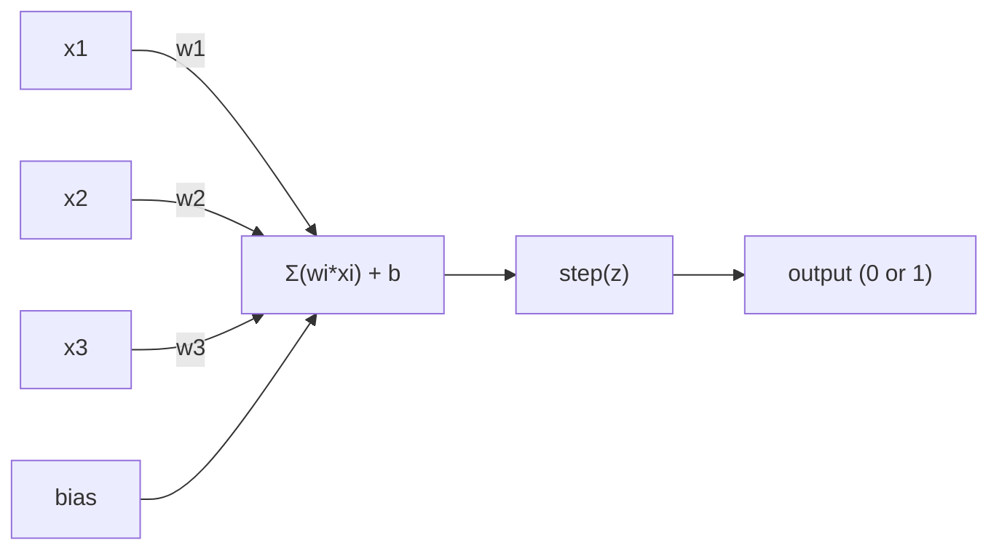
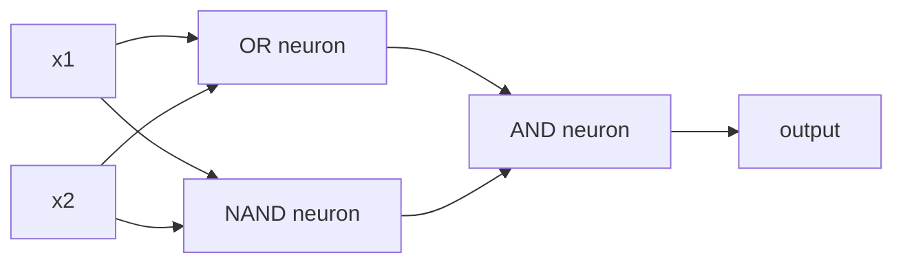
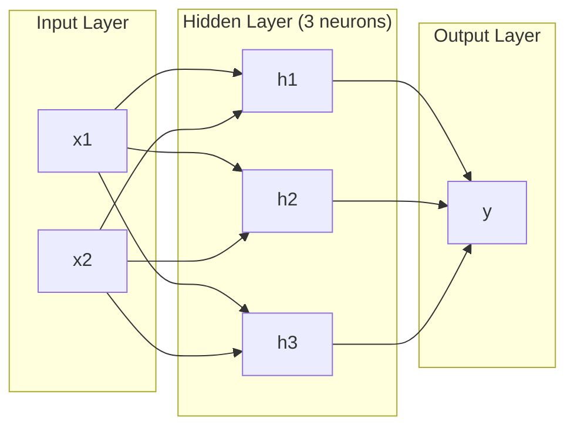
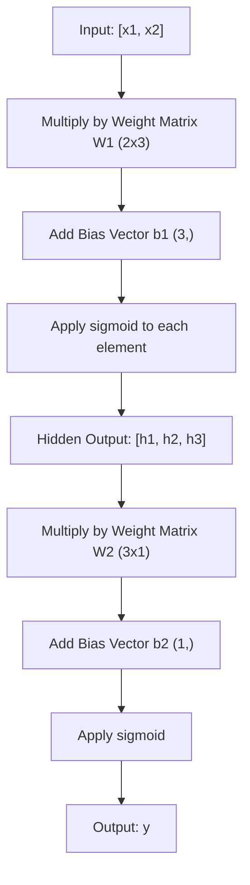
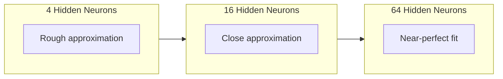
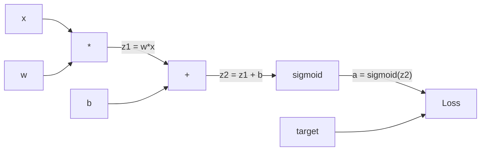
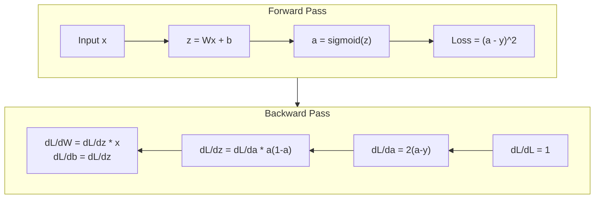

# Perceptron & Backpropagation

> Combined lessons (3 parts), merged verbatim — no content removed.

**Type:** Combined

---

## Part 1 (ch053): The Perceptron

> The perceptron is the atom of neural networks. Split it open and you find weights, a bias, and a decision.

**Type:** Build
**Languages:** Python
**Prerequisites:** Phase 1 (Linear Algebra Intuition)
**Time:** ~60 minutes

## Learning Objectives

- Implement a perceptron from scratch in Python, including the weight update rule and step activation function
- Explain why a single perceptron can only solve linearly separable problems and demonstrate the XOR failure case
- Construct a multi-layer perceptron by composing OR, NAND, and AND gates to solve XOR
- Train a two-layer network with sigmoid activation and backpropagation to learn XOR automatically

## The Problem

You know vectors and dot products. You know that a matrix transforms inputs into outputs. But how does a machine *learn* which transformation to use?

The perceptron answers this. It's the simplest possible learning machine: take some inputs, multiply by weights, add a bias, and make a binary decision. Then adjust. That's it. Every neural network ever built is layers of this idea stacked together.

## The Concept

### One Neuron, One Decision

A perceptron takes n inputs, multiplies each by a weight, sums them up, adds a bias, and passes the result through an activation function.



The step function is brutal: if the weighted sum plus bias is >= 0, output 1. Otherwise, output 0.

```
step(z) = 1  if z >= 0
           0  if z < 0
```

This is a linear classifier. The weights and bias define a line (or hyperplane in higher dimensions) that splits the input space into two regions.

### The Decision Boundary

For two inputs, the perceptron draws a line through 2D space. Everything on one side of the line outputs 0. Everything on the other side outputs 1. Training moves this line until it correctly separates the classes.

### The Learning Rule

The perceptron learning rule is simple:

```
For each training example (x, y_true):
    y_pred = predict(x)
    error = y_true - y_pred
    For each weight:
        w_i = w_i + learning_rate * error * x_i
    bias = bias + learning_rate * error
```

If the prediction is correct, error = 0, nothing changes. If it predicts 0 but should be 1, weights increase. If it predicts 1 but should be 0, weights decrease. The learning rate controls how big each adjustment is.

### The XOR Problem

Here's where it breaks. Look at these logic gates:

```
AND gate:           OR gate:            XOR gate:
x1  x2  out         x1  x2  out         x1  x2  out
0   0   0           0   0   0           0   0   0
0   1   0           0   1   1           0   1   1
1   0   0           1   0   1           1   0   1
1   1   1           1   1   1           1   1   0
```

AND and OR are linearly separable: you can draw a single line to separate the 0s from the 1s. XOR is not. No single line can separate [0,1] and [1,0] from [0,0] and [1,1].

This is a fundamental limit. A single perceptron can only solve linearly separable problems. Minsky and Papert proved this in 1969 and it nearly killed neural network research for a decade.

The fix: stack perceptrons into layers. A multi-layer perceptron can solve XOR by combining two linear decisions into a nonlinear one.

## Build It

### Step 1: The Perceptron Class

```python
class Perceptron:
    def __init__(self, n_inputs, learning_rate=0.1):
        self.weights = [0.0] * n_inputs
        self.bias = 0.0
        self.lr = learning_rate

    def predict(self, inputs):
        total = sum(w * x for w, x in zip(self.weights, inputs))
        total += self.bias
        return 1 if total >= 0 else 0

    def train(self, training_data, epochs=100):
        for epoch in range(epochs):
            errors = 0
            for inputs, target in training_data:
                prediction = self.predict(inputs)
                error = target - prediction
                if error != 0:
                    errors += 1
                    for i in range(len(self.weights)):
                        self.weights[i] += self.lr * error * inputs[i]
                    self.bias += self.lr * error
            if errors == 0:
                print(f"Converged at epoch {epoch + 1}")
                return
```

### Step 2: Train on Logic Gates

```python
and_data = [([0, 0], 0), ([0, 1], 0), ([1, 0], 0), ([1, 1], 1)]
or_data  = [([0, 0], 0), ([0, 1], 1), ([1, 0], 1), ([1, 1], 1)]
not_data = [([0], 1), ([1], 0)]

p_and = Perceptron(2)
p_and.train(and_data)
for inputs, _ in and_data:
    print(f"  {inputs} -> {p_and.predict(inputs)}")
```

### Step 3: Watch XOR Fail

```python
xor_data = [([0, 0], 0), ([0, 1], 1), ([1, 0], 1), ([1, 1], 0)]

p_xor = Perceptron(2)
p_xor.train(xor_data, epochs=1000)
```

It will never converge. This is the hard proof that a single perceptron cannot learn XOR.

### Step 4: Solve XOR with Two Layers

The trick: XOR = (x1 OR x2) AND NOT (x1 AND x2). Combine three perceptrons:



```python
def xor_network(x1, x2):
    or_neuron = Perceptron(2)
    or_neuron.weights = [1.0, 1.0]; or_neuron.bias = -0.5
    nand_neuron = Perceptron(2)
    nand_neuron.weights = [-1.0, -1.0]; nand_neuron.bias = 1.5
    and_neuron = Perceptron(2)
    and_neuron.weights = [1.0, 1.0]; and_neuron.bias = -1.5
    hidden1 = or_neuron.predict([x1, x2])
    hidden2 = nand_neuron.predict([x1, x2])
    return and_neuron.predict([hidden1, hidden2])
```

All four cases correct. Stacking perceptrons into layers creates decision boundaries that no single perceptron can produce.

### Step 5: Train a Two-Layer Network

Replace the step function with sigmoid and learn the weights automatically through backpropagation:

```python
class TwoLayerNetwork:
    def __init__(self, learning_rate=0.5):
        import random
        random.seed(0)
        self.w_hidden = [[random.uniform(-1, 1) for _ in range(2)] for _ in range(2)]
        self.b_hidden = [random.uniform(-1, 1), random.uniform(-1, 1)]
        self.w_output = [random.uniform(-1, 1), random.uniform(-1, 1)]
        self.b_output = random.uniform(-1, 1)
        self.lr = learning_rate

    def sigmoid(self, x):
        import math
        x = max(-500, min(500, x))
        return 1.0 / (1.0 + math.exp(-x))

    def forward(self, inputs):
        self.inputs = inputs
        self.hidden_outputs = []
        for i in range(2):
            z = sum(w * x for w, x in zip(self.w_hidden[i], inputs)) + self.b_hidden[i]
            self.hidden_outputs.append(self.sigmoid(z))
        z_out = sum(w * h for w, h in zip(self.w_output, self.hidden_outputs)) + self.b_output
        self.output = self.sigmoid(z_out)
        return self.output

    def train(self, training_data, epochs=10000):
        for epoch in range(epochs):
            total_error = 0
            for inputs, target in training_data:
                output = self.forward(inputs)
                error = target - output
                d_output = error * output * (1 - output)
                saved_w_output = self.w_output[:]
                hidden_deltas = []
                for i in range(2):
                    h = self.hidden_outputs[i]
                    hd = d_output * saved_w_output[i] * h * (1 - h)
                    hidden_deltas.append(hd)
                for i in range(2):
                    self.w_output[i] += self.lr * d_output * self.hidden_outputs[i]
                self.b_output += self.lr * d_output
                for i in range(2):
                    for j in range(len(inputs)):
                        self.w_hidden[i][j] += self.lr * hidden_deltas[i] * inputs[j]
                    self.b_hidden[i] += self.lr * hidden_deltas[i]

net = TwoLayerNetwork(learning_rate=2.0)
net.train(xor_data, epochs=10000)
```

Two key differences: sigmoid replaces the step function (it's smooth, so gradients exist), and the train method propagates error backward from output to hidden layer.

## Use It

Everything you just built from scratch exists in sklearn:

```python
from sklearn.linear_model import Perceptron as SkPerceptron
import numpy as np

X = np.array([[0,0],[0,1],[1,0],[1,1]])
y = np.array([0, 0, 0, 1])

clf = SkPerceptron(max_iter=100, tol=1e-3)
clf.fit(X, y)
```

What changes in production networks: the step function becomes sigmoid, ReLU, or other smooth activations; weights are learned automatically via backpropagation; layers get deeper.

## Key Terms

| Term | What people say | What it actually means |
|------|----------------|----------------------|
| Perceptron | "A fake neuron" | A linear classifier: dot product of inputs and weights, plus bias, through a step function |
| Weight | "How important an input is" | A multiplier that scales each input's contribution to the decision |
| Bias | "The threshold" | A constant that shifts the decision boundary |
| Activation function | "The thing that squishes values" | A function applied after the weighted sum |
| Linearly separable | "You can draw a line between them" | A dataset where a single hyperplane can perfectly separate the classes |
| XOR problem | "The thing perceptrons can't do" | Proof that single-layer networks cannot learn non-linearly-separable functions |
| Decision boundary | "Where the classifier switches" | The hyperplane w*x + b = 0 that divides input space |
| Multi-layer perceptron | "A real neural network" | Perceptrons stacked in layers, where each layer's output feeds the next |

## Exercises

1. Train a perceptron on a NAND gate. Verify its weights and bias form a valid decision boundary.
2. Modify the Perceptron class to track the decision boundary at each epoch. Print how the line shifts during training on the AND gate.
3. Build a 3-input perceptron that outputs 1 only when at least 2 of the 3 inputs are 1 (majority vote). Is this linearly separable?

## Further Reading

- Frank Rosenblatt, "The Perceptron: A Probabilistic Model for Information Storage and Organization in the Brain" (1958)
- Minsky & Papert, "Perceptrons" (1969) -- the book that proved XOR was unsolvable by single-layer networks
- Michael Nielsen, "Neural Networks and Deep Learning", Chapter 1 (http://neuralnetworksanddeeplearning.com/)

[Reference](https://github.com/rohitg00/ai-engineering-from-scratch/tree/main/phases/03-deep-learning-core/01-the-perceptron)

---

## Part 2 (ch054): Multi-Layer Networks and Forward Pass

> One neuron draws a line. Stack them, and you can draw anything.

**Type:** Build
**Languages:** Python
**Prerequisites:** Phase 01 (Math Foundations), Lesson 03.01 (The Perceptron)
**Time:** ~90 minutes

## Learning Objectives

- Build a multi-layer network from scratch with Layer and Network classes that perform a complete forward pass
- Trace matrix dimensions through each layer of a network and identify shape mismatches
- Explain how stacking nonlinear activations enables a network to learn curved decision boundaries
- Solve the XOR problem using a 2-2-1 architecture with hand-tuned sigmoid weights

## The Problem

A single neuron is a line drawer. Every real problem in AI requires curves. Stacking neurons into layers is how you get curves.

In 1969, Minsky and Papert proved this limitation was fatal: a single-layer network cannot learn XOR. This killed neural network funding for over a decade. The fix was obvious in hindsight: stop using one layer. Stack neurons into layers. Let the first layer carve the input space into new features, and let the second layer combine those features into decisions no single line could make.

## The Concept

### Layers: Input, Hidden, Output

A multi-layer network has three types of layers:

**Input layer** -- holds your raw data. No computation happens here.

**Hidden layers** -- where the work happens. Each neuron takes every output from the previous layer, applies weights and a bias, then passes through an activation function.

**Output layer** -- the final answer. For binary classification, one neuron with sigmoid.



This is a 2-3-1 network. Two inputs, three hidden neurons, one output. Every connection carries a weight. Every neuron (except input) carries a bias.

### Neurons and Activations

Each neuron does three things:
1. Multiply every input by its corresponding weight
2. Sum all the products and add a bias
3. Pass the sum through an activation function

For now, the activation is sigmoid: `sigmoid(z) = 1 / (1 + e^(-z))`. Sigmoid squashes any number into the range (0, 1). This smooth curve is what makes learning possible -- unlike the perceptron's hard step, sigmoid has a gradient everywhere.

### Forward Pass: How Data Flows

The forward pass pushes input data through the network, layer by layer, until it reaches the output. No learning happens during the forward pass. It is pure computation: multiply, add, activate, repeat.



At each layer: `z = W * input + b` (linear transformation), then `a = sigmoid(z)` (activation).

### Matrix Dimensions

Tracking dimensions is the single most important debugging skill in deep learning:

| Step | Operation | Dimensions | Result Shape |
|------|-----------|------------|-------------|
| Input | x | -- | (2,) |
| Hidden linear | W1 * x + b1 | W1: (3, 2), b1: (3,) | (3,) |
| Hidden activation | sigmoid(z1) | -- | (3,) |
| Output linear | W2 * h + b2 | W2: (1, 3), b2: (1,) | (1,) |
| Output activation | sigmoid(z2) | -- | (1,) |

The rule: weight matrix W at layer k has shape (neurons_in_layer_k, neurons_in_layer_k_minus_1).

### Universal Approximation Theorem

In 1989, George Cybenko proved: a neural network with a single hidden layer and enough neurons can approximate any continuous function to any desired accuracy. Deeper networks (more layers, fewer neurons per layer) learn the same functions with far fewer total parameters.



## Build It

Pure Python. No numpy. Every matrix operation written from scratch.

### Step 1: Sigmoid Activation

```python
import math

def sigmoid(x):
    x = max(-500.0, min(500.0, x))
    return 1.0 / (1.0 + math.exp(-x))
```

The clamp to [-500, 500] prevents overflow.

### Step 2: Layer Class

A layer holds a weight matrix and a bias vector. Its forward method takes an input vector and returns the activated output.

```python
class Layer:
    def __init__(self, n_inputs, n_neurons, weights=None, biases=None):
        if weights is not None:
            self.weights = weights
        else:
            import random
            self.weights = [
                [random.uniform(-1, 1) for _ in range(n_inputs)]
                for _ in range(n_neurons)
            ]
        if biases is not None:
            self.biases = biases
        else:
            self.biases = [0.0] * n_neurons

    def forward(self, inputs):
        self.last_input = inputs
        self.last_output = []
        for neuron_idx in range(len(self.weights)):
            z = sum(w * x for w, x in zip(self.weights[neuron_idx], inputs))
            z += self.biases[neuron_idx]
            self.last_output.append(sigmoid(z))
        return self.last_output
```

### Step 3: Network Class

A network is a list of layers. The forward pass chains them.

```python
class Network:
    def __init__(self, layers):
        self.layers = layers

    def forward(self, inputs):
        current = inputs
        for layer in self.layers:
            current = layer.forward(current)
        return current
```

That is the entire forward pass. Four lines of logic.

### Step 4: XOR with Hand-Tuned Weights

2-2-1 architecture: two inputs, two hidden neurons, one output.

```python
hidden = Layer(
    n_inputs=2, n_neurons=2,
    weights=[[20.0, 20.0], [-20.0, -20.0]],
    biases=[-10.0, 30.0],
)

output = Layer(
    n_inputs=2, n_neurons=1,
    weights=[[20.0, 20.0]],
    biases=[-30.0],
)

xor_net = Network([hidden, output])
```

The large weights (20, -20) make sigmoid act like a step function. The first hidden neuron approximates OR. The second approximates NAND. The output neuron combines them into AND, which is XOR.

### Step 5: Circle Classification

A harder problem: classify 2D points as inside or outside a circle. This requires a curved decision boundary -- impossible for a single perceptron.

```python
import random
random.seed(42)

data = []
for _ in range(200):
    x = random.uniform(-1, 1)
    y = random.uniform(-1, 1)
    label = 1 if (x * x + y * y) < 0.25 else 0
    data.append(([x, y], label))

circle_net = Network([
    Layer(n_inputs=2, n_neurons=8),
    Layer(n_inputs=8, n_neurons=1),
])
```

With random weights, accuracy will be poor. After training via backpropagation (Lesson 03), this same architecture will draw a curved boundary that separates inside from outside.

## Use It

PyTorch does everything above in four lines:

```python
import torch
import torch.nn as nn

model = nn.Sequential(
    nn.Linear(2, 8),
    nn.Sigmoid(),
    nn.Linear(8, 1),
    nn.Sigmoid(),
)

x = torch.tensor([[0.0, 0.0], [0.0, 1.0], [1.0, 0.0], [1.0, 1.0]])
output = model(x)
```

`nn.Linear(2, 8)` is your Layer class. `nn.Sequential` is your Network class. The forward pass logic is identical to what you just built.

## Key Terms

| Term | What people say | What it actually means |
|------|----------------|----------------------|
| Forward pass | "Running the model" | Pushing input through every layer to produce an output |
| Hidden layer | "The middle part" | Any layer between input and output whose values are not directly observed |
| Multi-layer network | "A deep neural network" | Layers of neurons stacked sequentially |
| Activation function | "The nonlinearity" | A function applied after the linear transformation that introduces curves |
| Sigmoid | "The S-curve" | sigma(z) = 1/(1+e^(-z)), squashes any real number to (0,1) |
| Weight matrix | "The parameters" | A matrix W of learnable connection strengths |
| Bias vector | "The offset" | A vector added after the matrix multiply |
| Universal approximation | "Neural nets can learn anything" | A single hidden layer with enough neurons can approximate any continuous function |
| Linear transformation | "The matrix multiply step" | z = W * x + b before activation |
| Decision boundary | "Where the classifier switches" | The surface where network output crosses the classification threshold |

## Exercises

1. Build a 2-4-2-1 network (two hidden layers) and run the forward pass on XOR data with random weights.
2. Change the hidden layer size in the circle classifier from 8 to 2, then to 32. Run the forward pass with random weights each time.
3. Implement a `count_parameters` method on Network that returns total trainable weights and biases.
4. Build a forward pass for a 3-4-4-2 network. Feed it RGB color values and observe the two outputs.
5. Replace sigmoid with a "leaky step" function. Run the forward pass on XOR with the same hand-tuned weights. Does it still work?

## Further Reading

- Michael Nielsen, "Neural Networks and Deep Learning", Chapter 1-2 (http://neuralnetworksanddeeplearning.com/)
- Cybenko, "Approximation by Superpositions of a Sigmoidal Function" (1989)
- 3Blue1Brown, "But what is a neural network?" (https://www.youtube.com/watch?v=aircAruvnKk)
- Goodfellow, Bengio, Courville, "Deep Learning", Chapter 6 (https://www.deeplearningbook.org/)

[Reference](https://github.com/rohitg00/ai-engineering-from-scratch/tree/main/phases/03-deep-learning-core/02-multi-layer-networks)

---

## Part 3 (ch055): Backpropagation from Scratch

> Backpropagation is the algorithm that makes learning possible. Without it, neural networks are just expensive random number generators.

**Type:** Build
**Languages:** Python
**Prerequisites:** Lesson 03.02 (Multi-Layer Networks)
**Time:** ~120 minutes

## Learning Objectives

- Implement a Value-based autograd engine that builds a computational graph and computes gradients via topological sort
- Derive the backward pass for addition, multiplication, and sigmoid using the chain rule
- Train a multi-layer network on XOR and circle classification using only your from-scratch backpropagation engine
- Identify the vanishing gradient problem in deep sigmoid networks and explain why gradients shrink exponentially

## The Problem

Your network has a single hidden layer with 768 inputs and 3072 outputs. That's 2,359,296 weights. It made a wrong prediction. Which weights caused the error? Testing each weight individually means 2.3 million forward passes. Backpropagation computes all 2.3 million gradients in a single backward pass.

The naive approach takes geological time. Backpropagation solves this with one forward pass, one backward pass, all gradients computed. The trick is the chain rule from calculus, applied systematically to a computational graph.

## The Concept

### The Chain Rule, Applied to Networks

If y = f(g(x)), then dy/dx = f'(g(x)) * g'(x). You multiply derivatives along the chain. In a neural network, the "chain" is the sequence of operations from input to loss.

### Computational Graphs

Every forward pass builds a graph. Each node is an operation. Each edge carries a value forward and a gradient backward.



Forward pass: values flow left to right. Backward pass: gradients flow right to left. Every node in the graph has one job during the backward pass: take the gradient coming from above, multiply by its local derivative, and pass it down.

### Forward vs Backward



### Vanishing Gradients

Sigmoid derivative maxes out at 0.25. Three layers deep, the gradient has been multiplied by at most 0.25^3 = 0.0156. Ten layers deep: 0.25^10 = 0.000001.

```
sigmoid(z):     Output range [0, 1]
sigmoid'(z):    Max value 0.25 (at z = 0)

After 5 layers:   gradient * 0.25^5 = 0.001x original
After 10 layers:  gradient * 0.25^10 = 0.000001x original
```

This is why deep sigmoid networks are nearly impossible to train. The fix -- ReLU and its variants -- is in Lesson 04.

### Deriving Gradients for a 2-Layer Network

Forward pass:
```
z1 = W1 * x + b1
a1 = sigmoid(z1)
z2 = W2 * a1 + b2
a2 = sigmoid(z2)
L = (a2 - y)^2
```

Backward pass (chain rule step by step):
```
dL/da2 = 2(a2 - y)
da2/dz2 = a2 * (1 - a2)
dL/dz2 = dL/da2 * da2/dz2
dL/dW2 = dL/dz2 * a1
dL/db2 = dL/dz2
dL/da1 = dL/dz2 * W2
da1/dz1 = a1 * (1 - a1)
dL/dz1 = dL/da1 * da1/dz1
dL/dW1 = dL/dz1 * x
dL/db1 = dL/dz1
```

## Build It

### Step 1: The Value Node

Every number in our computation becomes a Value. It stores its data, its gradient, and how it was created.

```python
class Value:
    def __init__(self, data, children=(), op=''):
        self.data = data
        self.grad = 0.0
        self._backward = lambda: None
        self._children = set(children)
        self._op = op

    def __repr__(self):
        return f"Value(data={self.data:.4f}, grad={self.grad:.4f})"
```

### Step 2: Operations with Backward Functions

```python
def __add__(self, other):
    other = other if isinstance(other, Value) else Value(other)
    out = Value(self.data + other.data, (self, other), '+')
    def _backward():
        self.grad += out.grad
        other.grad += out.grad
    out._backward = _backward
    return out

def __mul__(self, other):
    other = other if isinstance(other, Value) else Value(other)
    out = Value(self.data * other.data, (self, other), '*')
    def _backward():
        self.grad += other.data * out.grad
        other.grad += self.data * out.grad
    out._backward = _backward
    return out
```

For addition: d(a+b)/da = 1, d(a+b)/db = 1. For multiplication: d(a*b)/da = b, d(a*b)/db = a.

### Step 3: Sigmoid and Loss

```python
import math

def sigmoid(self):
    x = self.data
    x = max(-500, min(500, x))
    s = 1.0 / (1.0 + math.exp(-x))
    out = Value(s, (self,), 'sigmoid')
    def _backward():
        self.grad += (s * (1 - s)) * out.grad
    out._backward = _backward
    return out

def mse_loss(predicted, target):
    diff = predicted + Value(-target)
    return diff * diff
```

### Step 4: Backward Pass (Topological Sort)

```python
def backward(self):
    topo = []
    visited = set()
    def build_topo(v):
        if v not in visited:
            visited.add(v)
            for child in v._children:
                build_topo(child)
            topo.append(v)
    build_topo(self)
    self.grad = 1.0
    for v in reversed(topo):
        v._backward()
```

### Step 5: Layer and Network

```python
import random

class Neuron:
    def __init__(self, n_inputs):
        scale = (2.0 / n_inputs) ** 0.5
        self.weights = [Value(random.uniform(-scale, scale)) for _ in range(n_inputs)]
        self.bias = Value(0.0)
    def __call__(self, x):
        act = sum((wi * xi for wi, xi in zip(self.weights, x)), self.bias)
        return act.sigmoid()
    def parameters(self):
        return self.weights + [self.bias]

class Layer:
    def __init__(self, n_inputs, n_outputs):
        self.neurons = [Neuron(n_inputs) for _ in range(n_outputs)]
    def __call__(self, x):
        out = [n(x) for n in self.neurons]
        return out[0] if len(out) == 1 else out
    def parameters(self):
        return [p for n in self.neurons for p in n.parameters()]

class Network:
    def __init__(self, sizes):
        self.layers = [Layer(sizes[i], sizes[i+1]) for i in range(len(sizes)-1)]
    def __call__(self, x):
        for layer in self.layers:
            x = layer(x)
            if not isinstance(x, list): x = [x]
        return x[0] if len(x) == 1 else x
    def parameters(self):
        return [p for l in self.layers for p in l.parameters()]
    def zero_grad(self):
        for p in self.parameters(): p.grad = 0.0
```

### Step 6: Train on XOR

```python
random.seed(42)
net = Network([2, 4, 1])

xor_data = [
    ([0.0, 0.0], 0.0), ([0.0, 1.0], 1.0),
    ([1.0, 0.0], 1.0), ([1.0, 1.0], 0.0),
]

learning_rate = 1.0
for epoch in range(1000):
    total_loss = Value(0.0)
    for inputs, target in xor_data:
        x = [Value(i) for i in inputs]
        pred = net(x)
        loss = mse_loss(pred, target)
        total_loss = total_loss + loss
    net.zero_grad()
    total_loss.backward()
    for p in net.parameters():
        p.data -= learning_rate * p.grad
```

Watch the loss decrease. From random predictions to correct XOR outputs, driven entirely by backpropagation.

### Step 7: Circle Classification

```python
random.seed(7)

def generate_circle_data(n=100):
    data = []
    for _ in range(n):
        x1 = random.uniform(-1.5, 1.5)
        x2 = random.uniform(-1.5, 1.5)
        label = 1.0 if x1 * x1 + x2 * x2 < 1.0 else 0.0
        data.append(([x1, x2], label))
    return data

circle_data = generate_circle_data(80)
circle_net = Network([2, 8, 1])

for epoch in range(2000):
    random.shuffle(circle_data)
    for inputs, target in circle_data:
        x = [Value(i) for i in inputs]
        pred = circle_net(x)
        loss = mse_loss(pred, target)
        circle_net.zero_grad()
        loss.backward()
        for p in circle_net.parameters():
            p.data -= 0.5 * p.grad
```

The network discovers the circular decision boundary on its own. No hand-tuning.

## Use It

PyTorch does everything above in a few lines:

```python
import torch
import torch.nn as nn

model = nn.Sequential(
    nn.Linear(2, 4), nn.Sigmoid(),
    nn.Linear(4, 1), nn.Sigmoid(),
)
optimizer = torch.optim.SGD(model.parameters(), lr=1.0)
criterion = nn.MSELoss()

for epoch in range(1000):
    pred = model(X)
    loss = criterion(pred, y)
    optimizer.zero_grad()
    loss.backward()
    optimizer.step()
```

`loss.backward()` is your `total_loss.backward()`. `optimizer.step()` is your manual `p.data -= lr * p.grad`. Same algorithm, industrial-strength implementation.

## Key Terms

| Term | What people say | What it actually means |
|------|----------------|----------------------|
| Backpropagation | "The network learns" | Algorithm that computes dL/dw for every weight using the chain rule backward through the graph |
| Computational graph | "The network structure" | A DAG where nodes are operations and edges carry values (forward) and gradients (backward) |
| Chain rule | "Multiply the derivatives" | The mathematical foundation of backpropagation |
| Gradient | "Direction of steepest ascent" | Partial derivative of loss with respect to a parameter |
| Vanishing gradient | "Deep networks don't learn" | Gradients shrink exponentially through saturating activations like sigmoid |
| Forward pass | "Running the network" | Computing output from inputs and storing intermediate values |
| Backward pass | "Computing gradients" | Traversing the graph in reverse, accumulating gradients |
| Learning rate | "How fast it learns" | Step size when updating weights |
| Topological sort | "The right order" | Ordering graph nodes so gradients are fully accumulated before propagation |
| Autograd | "Automatic differentiation" | System that builds computational graphs and automatically computes gradients |

## Exercises

1. Add `__sub__` and `__neg__` to Value. Verify gradients with a manual calculation for `(a - b)^2`.
2. Add a `relu` method to Value. Replace sigmoid with relu in hidden layers and compare convergence speed.
3. Implement `__pow__` on Value. Use it to replace `mse_loss` with `(predicted - target) ** 2`.
4. Add gradient clipping to the training loop. Train a deeper network (4+ layers) with and without clipping.
5. After training on XOR, print the gradient of every parameter. Identify which layer has the smallest gradients.

## Further Reading

- Rumelhart, Hinton & Williams, "Learning representations by back-propagating errors" (1986)
- 3Blue1Brown, "Neural Networks" series (https://www.youtube.com/playlist?list=PLZHQObOWTQDNU6R1_67000Dx_ZCJB-3pi)

[Reference](https://github.com/rohitg00/ai-engineering-from-scratch/tree/main/phases/03-deep-learning-core/03-backpropagation)
