# Activations, Losses, Optimizers & Regularization

> Combined lessons (5 parts), merged verbatim — no content removed.

**Type:** Combined

---

## Part 1 (ch056): Activation Functions

> Without nonlinearity, your 100-layer network is a fancy matrix multiply. Activations are the gates that let neural networks think in curves.

**Type:** Build
**Languages:** Python
**Prerequisites:** Lesson 03.03 (Backpropagation)
**Time:** ~75 minutes

## Learning Objectives

- Implement sigmoid, tanh, ReLU, Leaky ReLU, GELU, Swish, and softmax with their derivatives from scratch
- Diagnose the vanishing gradient problem by measuring activation magnitudes through 10+ layers with different activations
- Detect dead neurons in a ReLU network and explain why GELU avoids this failure mode
- Select the correct activation function for a given architecture (transformer, CNN, RNN, output layer)

## The Problem

Stack two linear transformations: y = W2(W1x + b1) + b2 = (W2W1)x + (W2b1 + b2). That's just y = Ax + c -- a single linear transformation. No matter how many linear layers you stack, the result collapses to one matrix multiply.

Without activation functions, depth is an illusion. Activation functions break the linearity, giving the network the ability to bend decision boundaries and approximate arbitrary functions.

## The Concept

### Why Nonlinearity Is Necessary

A linear layer computes f(x) = Wx + b. Stack two: y = W2(W1x + b1) + b2 = (W2W1)x + (W2b1 + b2) = Ax + c. One layer. Insert a nonlinear activation g() between layers and now the substitution breaks: W2 * g(W1x + b1) + b2 cannot be reduced to a single linear transformation.

### Sigmoid

```
sigmoid(x) = 1 / (1 + e^(-x))
sigmoid'(x) = sigmoid(x) * (1 - sigmoid(x))
```

Output range: (0, 1). Maximum derivative is 0.25. After 10 layers: 0.25^10 = 0.000001. The vanishing gradient problem. Additionally, outputs are always positive, causing zig-zagging during gradient descent.

### Tanh

```
tanh(x) = (e^x - e^(-x)) / (e^x + e^(-x))
tanh'(x) = 1 - tanh(x)^2
```

Output range: (-1, 1). Zero-centered, eliminates the zig-zag problem. Maximum derivative is 1.0, but still saturates at extremes.

### ReLU: The Breakthrough

```
relu(x) = max(0, x)
relu'(x) = 1 if x > 0, 0 if x <= 0
```

No vanishing gradient for positive inputs -- gradient is exactly 1. But there is the dead neuron problem: if a neuron's input is always negative, it outputs zero, gradient is zero, and it never updates.

### Leaky ReLU

```
leaky_relu(x) = x if x > 0, alpha * x if x <= 0
```

Where alpha is typically 0.01. The negative side has a small slope, so dead neurons can recover.

### GELU: The Modern Default

Default activation in BERT, GPT, and most modern transformers.

```
gelu(x) = x * Phi(x)
gelu(x) ~= 0.5 * x * (1 + tanh(sqrt(2/pi) * (x + 0.044715 * x^3)))
```

GELU is smooth everywhere, allows small negative values, and has a probabilistic interpretation. It avoids the dead neuron problem entirely.

### Swish / SiLU

```
swish(x) = x * sigmoid(x)
```

Discovered through automated search. Similar to GELU in practice. Used in EfficientNet and some vision models.

### Softmax: The Output Activation

```
softmax(x_i) = e^(x_i) / sum(e^(x_j) for all j)
```

Converts raw scores into a probability distribution. Every output is between 0 and 1, all sum to 1. Standard for multi-class classification.

### Comparison of Shapes

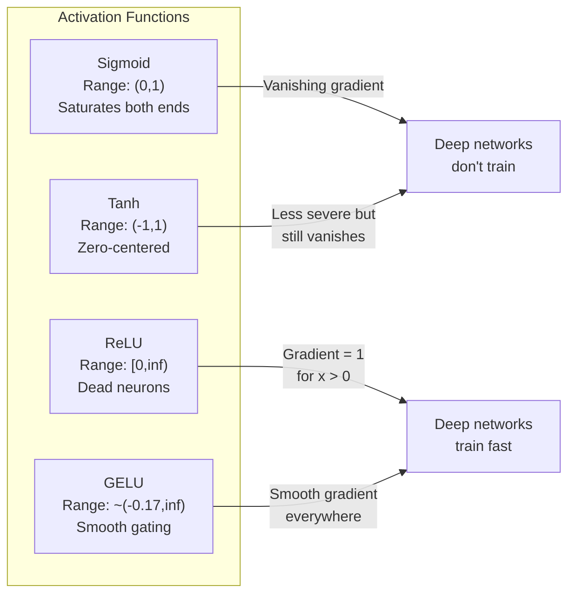

### Which Activation When

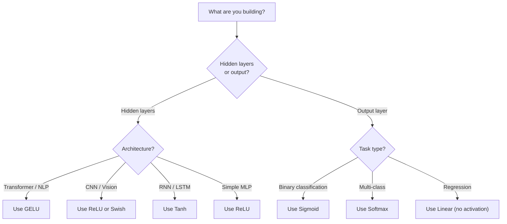

## Build It

### Step 1: Implement All Activation Functions with Derivatives

```python
import math

def sigmoid(x):
    x = max(-500, min(500, x))
    return 1.0 / (1.0 + math.exp(-x))

def sigmoid_derivative(x):
    s = sigmoid(x)
    return s * (1 - s)

def tanh_act(x):
    return math.tanh(x)

def tanh_derivative(x):
    t = math.tanh(x)
    return 1 - t * t

def relu(x):
    return max(0.0, x)

def relu_derivative(x):
    return 1.0 if x > 0 else 0.0

def leaky_relu(x, alpha=0.01):
    return x if x > 0 else alpha * x

def leaky_relu_derivative(x, alpha=0.01):
    return 1.0 if x > 0 else alpha

def gelu(x):
    return 0.5 * x * (1 + math.tanh(math.sqrt(2 / math.pi) * (x + 0.044715 * x ** 3)))

def gelu_derivative(x):
    phi = 0.5 * (1 + math.erf(x / math.sqrt(2)))
    pdf = math.exp(-0.5 * x * x) / math.sqrt(2 * math.pi)
    return phi + x * pdf

def swish(x):
    return x * sigmoid(x)

def swish_derivative(x):
    s = sigmoid(x)
    return s + x * s * (1 - s)

def softmax(xs):
    max_x = max(xs)
    exps = [math.exp(x - max_x) for x in xs]
    total = sum(exps)
    return [e / total for e in exps]
```

### Step 2: Vanishing Gradient Experiment

```python
def vanishing_gradient_experiment(activation_fn, name, n_layers=10, n_inputs=5):
    random.seed(42)
    values = [random.gauss(0, 1) for _ in range(n_inputs)]
    print(f"\n{name} through {n_layers} layers:")
    for layer in range(n_layers):
        weights = [random.gauss(0, 1) for _ in range(n_inputs)]
        z = sum(w * v for w, v in zip(weights, values))
        activated = activation_fn(z)
        magnitude = abs(activated)
        print(f"  Layer {layer+1:2d}: magnitude = {magnitude:.6f}")
        values = [activated] * n_inputs

vanishing_gradient_experiment(sigmoid, "Sigmoid")
vanishing_gradient_experiment(relu, "ReLU")
```

### Step 3: Dead Neuron Detector

```python
def dead_neuron_detector(n_inputs=5, hidden_size=20, n_samples=1000):
    random.seed(0)
    weights = [[random.gauss(0, 1) for _ in range(n_inputs)] for _ in range(hidden_size)]
    biases = [random.gauss(0, 1) for _ in range(hidden_size)]
    fire_counts = [0] * hidden_size
    for _ in range(n_samples):
        inputs = [random.gauss(0, 1) for _ in range(n_inputs)]
        for neuron_idx in range(hidden_size):
            z = sum(w * x for w, x in zip(weights[neuron_idx], inputs)) + biases[neuron_idx]
            if relu(z) > 0: fire_counts[neuron_idx] += 1
    dead = sum(1 for c in fire_counts if c == 0)
    print(f"Dead (never fired): {dead}, Healthy: {hidden_size - dead}")
```

## Use It

PyTorch provides all of these as both functional and module forms:

```python
import torch
import torch.nn as nn
import torch.nn.functional as F

x = torch.randn(4, 10)
relu_out = F.relu(x)
gelu_out = F.gelu(x)
sigmoid_out = torch.sigmoid(x)
probs = F.softmax(logits, dim=1)

model = nn.Sequential(
    nn.Linear(10, 64), nn.GELU(),
    nn.Linear(64, 32), nn.GELU(),
    nn.Linear(32, 5),
)
```

Hidden layers in a transformer: GELU. Hidden layers in a CNN: ReLU. Output layer for classification: softmax. Output layer for probabilities: sigmoid.

## Key Terms

| Term | What people say | What it actually means |
|------|----------------|----------------------|
| Activation function | "The nonlinear part" | A function applied after each neuron that breaks linearity |
| Vanishing gradient | "Gradients disappear" | Gradients shrink exponentially through layers with saturating activations |
| Exploding gradient | "Gradients blow up" | Gradients grow exponentially, causing unstable training |
| Dead neuron | "A neuron that stopped learning" | A ReLU neuron whose input is permanently negative, producing zero gradient |
| Sigmoid | "Squishes values to 0-1" | 1/(1+e^-x), historically important but causes vanishing gradients |
| ReLU | "Clips negatives to zero" | max(0, x), the activation that made deep learning practical |
| GELU | "The transformer activation" | Gaussian Error Linear Unit, smooth activation used in BERT/GPT |
| Swish/SiLU | "Self-gated ReLU" | x * sigmoid(x), discovered through automated search |
| Softmax | "Turns scores into probabilities" | Normalizes logits into a probability distribution |
| Leaky ReLU | "ReLU that doesn't die" | max(alpha*x, x) where alpha is small, preventing dead neurons |

## Exercises

1. Implement Parametric ReLU (PReLU) where alpha is a learnable parameter. Train it on the circle dataset.
2. Run the vanishing gradient experiment with 50 layers for sigmoid, tanh, ReLU, and GELU.
3. Implement ELU. Compare its dead neuron rate to ReLU.
4. Build a "gradient health monitor" that warns when any layer's gradient drops below 0.001.
5. Modify the training comparison to use XOR instead of circles. Which activation converges fastest?

## Further Reading

- Nair & Hinton, "Rectified Linear Units Improve Restricted Boltzmann Machines" (2010)
- Hendrycks & Gimpel, "Gaussian Error Linear Units (GELUs)" (2016)
- Ramachandran et al., "Searching for Activation Functions" (2017)
- Glorot & Bengio, "Understanding the difficulty of training deep feedforward neural networks" (2010)

[Reference](https://github.com/rohitg00/ai-engineering-from-scratch/tree/main/phases/03-deep-learning-core/04-activation-functions)

---

## Part 2 (ch057): Loss Functions

> Your network makes a prediction. The ground truth says otherwise. How wrong is it? That number is the loss. Pick the wrong loss function and your model optimizes for the wrong thing entirely.

**Type:** Build
**Languages:** Python
**Prerequisites:** Lesson 03.04 (Activation Functions)
**Time:** ~75 minutes

## Learning Objectives

- Implement MSE, binary cross-entropy, categorical cross-entropy, and contrastive loss (InfoNCE) from scratch with their gradients
- Explain why MSE fails for classification by demonstrating the "predict 0.5 for everything" failure mode
- Apply label smoothing to cross-entropy and describe how it prevents overconfident predictions
- Choose the correct loss function for regression, binary classification, multi-class classification, and embedding learning tasks

## The Problem

A model minimizing MSE on a classification problem will confidently predict 0.5 for everything. It's minimizing loss. It's also useless.

The loss function is the only thing your model actually optimizes. Not accuracy. Not F1 score. If the loss function doesn't capture what you care about, the model will find the mathematically cheapest way to satisfy it, and that way is almost never what you wanted.

## The Concept

### Mean Squared Error (MSE)

```
MSE = (1/n) * sum((y_pred - y_true)^2)
```

The default for regression. Penalizes large errors quadratically. An error of 2 costs 4x as much as an error of 1. This makes MSE sensitive to outliers.

Gradient: `dMSE/dy_pred = (2/n) * (y_pred - y_true)`. Linear in the error.

### Cross-Entropy Loss

**Binary Cross-Entropy (BCE):**
```
BCE = -(y * log(p) + (1 - y) * log(1 - p))
```

When y=1 and you predict p=0.99, loss = -log(0.99) = 0.01. When you predict p=0.01, loss = -log(0.01) = 4.6. That 460x difference is why cross-entropy works.

**Categorical Cross-Entropy:**
```
CCE = -sum(y_i * log(p_i))
```

Only the true class contributes. If the correct class gets probability 0.1 (random), loss = 2.3. If it gets 0.9, loss = 0.105.

### Why MSE Fails for Classification

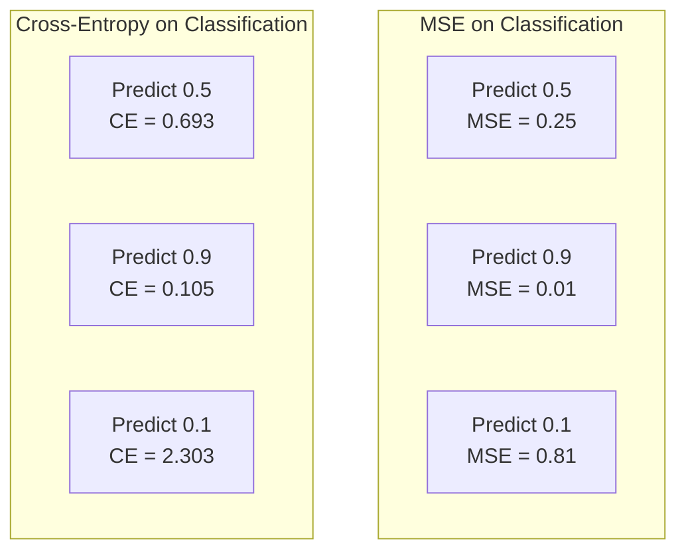

MSE gradients flatten when predictions are near 0 or 1. Cross-entropy gradients compensate -- the -log cancels the sigmoid's flat regions.

### Label Smoothing

```
smooth_label = (1 - alpha) * one_hot + alpha / num_classes
```

With alpha=0.1 and 10 classes: target becomes [0.01, 0.01, 0.91, 0.01, ...] instead of [0, 0, 1, 0, ...]. Prevents overconfidence, improves generalization.

### Contrastive Loss (InfoNCE)

```
L = -log(exp(sim(z_i, z_j) / tau) / sum(exp(sim(z_i, z_k) / tau)))
```

No labels. Just pairs of inputs and the question: are these similar or different? Used in SimCLR, CLIP, and self-supervised learning.

### Focal Loss

For imbalanced datasets:
```
FL = -alpha * (1 - p_t)^gamma * log(p_t)
```

Easy example (p_t=0.9): weight = 0.01. Hard example (p_t=0.1): weight = 0.81. Down-weights easy examples to focus on hard ones.

### Loss Function Decision Tree

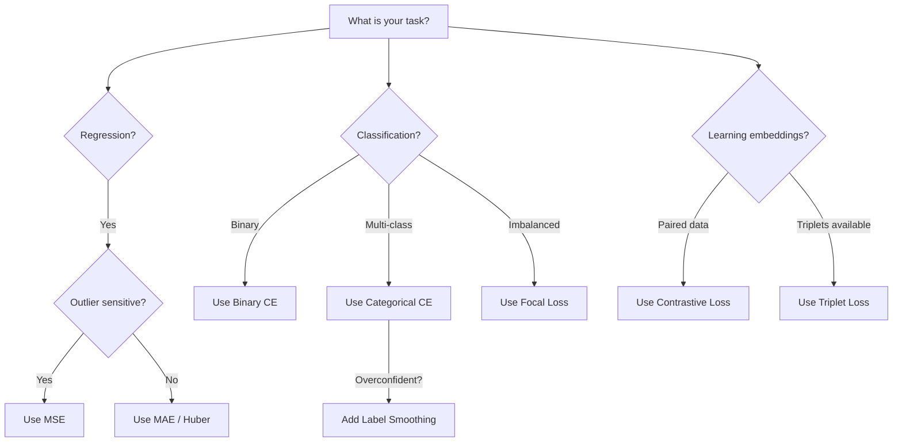

## Build It

### Step 1: MSE and Its Gradient

```python
def mse(predictions, targets):
    n = len(predictions)
    total = sum((p - t) ** 2 for p, t in zip(predictions, targets))
    return total / n

def mse_gradient(predictions, targets):
    n = len(predictions)
    return [2.0 * (p - t) / n for p, t in zip(predictions, targets)]
```

### Step 2: Binary Cross-Entropy

```python
import math

def binary_cross_entropy(predictions, targets, eps=1e-15):
    n = len(predictions)
    total = 0.0
    for p, t in zip(predictions, targets):
        p_clipped = max(eps, min(1 - eps, p))
        total += -(t * math.log(p_clipped) + (1 - t) * math.log(1 - p_clipped))
    return total / n

def bce_gradient(predictions, targets, eps=1e-15):
    grads = []
    for p, t in zip(predictions, targets):
        p_clipped = max(eps, min(1 - eps, p))
        grads.append(-(t / p_clipped) + (1 - t) / (1 - p_clipped))
    return grads
```

### Step 3: Categorical Cross-Entropy with Softmax

```python
def softmax(logits):
    max_val = max(logits)
    exps = [math.exp(x - max_val) for x in logits]
    total = sum(exps)
    return [e / total for e in exps]

def categorical_cross_entropy(logits, target_index, eps=1e-15):
    probs = softmax(logits)
    p = max(eps, probs[target_index])
    return -math.log(p)

def cce_gradient(logits, target_index):
    probs = softmax(logits)
    grads = list(probs)
    grads[target_index] -= 1.0
    return grads
```

The gradient of softmax + cross-entropy simplifies to (predicted probability - 1) for the true class, and (predicted probability) for all other classes.

### Step 4: Label Smoothing

```python
def label_smoothed_cce(logits, target_index, num_classes, alpha=0.1, eps=1e-15):
    probs = softmax(logits)
    loss = 0.0
    for i in range(num_classes):
        smooth_target = (1.0 - alpha + alpha / num_classes) if i == target_index else alpha / num_classes
        p = max(eps, probs[i])
        loss += -smooth_target * math.log(p)
    return loss
```

### Step 5: Contrastive Loss

```python
def cosine_similarity(a, b):
    dot = sum(x * y for x, y in zip(a, b))
    norm_a = math.sqrt(sum(x * x for x in a))
    norm_b = math.sqrt(sum(x * x for x in b))
    if norm_a < 1e-10 or norm_b < 1e-10: return 0.0
    return dot / (norm_a * norm_b)

def contrastive_loss(anchor, positive, negatives, temperature=0.07):
    sim_pos = cosine_similarity(anchor, positive) / temperature
    sim_negs = [cosine_similarity(anchor, neg) / temperature for neg in negatives]
    max_sim = max(sim_pos, max(sim_negs)) if sim_negs else sim_pos
    exp_pos = math.exp(sim_pos - max_sim)
    total_exp = exp_pos + sum(math.exp(s - max_sim) for s in sim_negs)
    return -math.log(max(1e-15, exp_pos / total_exp))
```

## Use It

PyTorch provides all standard loss functions with numerical stability built in:

```python
import torch
import torch.nn as nn
import torch.nn.functional as F

mse_loss = F.mse_loss(predictions, targets)
bce_loss = F.binary_cross_entropy(predictions, targets)
ce_loss = F.cross_entropy(logits, labels)  # combines log-softmax and NLL
ce_smooth = F.cross_entropy(logits, labels, label_smoothing=0.1)
```

Use `F.cross_entropy` (not `F.nll_loss` plus manual softmax). It combines log-softmax and negative log-likelihood in one numerically stable operation.

## Key Terms

| Term | What people say | What it actually means |
|------|----------------|----------------------|
| Loss function | "How wrong the model is" | A differentiable function the optimizer minimizes |
| MSE | "Average squared error" | Mean of squared differences; penalizes large errors quadratically |
| Cross-entropy | "The classification loss" | Measures divergence between predicted and true probability distributions |
| Binary cross-entropy | "BCE" | Cross-entropy for two classes |
| Label smoothing | "Softening the targets" | Replacing hard 0/1 targets with soft values |
| Contrastive loss | "Pull together, push apart" | Makes similar pairs close and dissimilar pairs far in embedding space |
| InfoNCE | "The CLIP/SimCLR loss" | Temperature-scaled cross-entropy over similarity scores |
| Focal loss | "The imbalanced data fix" | Cross-entropy weighted to down-weight easy examples |
| Triplet loss | "Anchor-positive-negative" | Pushes anchor closer to positive than negative by a margin |
| Temperature | "Sharpness knob" | A scalar divisor on logits controlling distribution peakedness |

## Exercises

1. Implement Huber loss. Train a regression network with MSE vs Huber when 5% of targets have outlier noise.
2. Add focal loss to the binary classification loop. Compare standard BCE vs focal loss on an imbalanced dataset.
3. Implement triplet loss with semi-hard negative mining.
4. Run MSE vs cross-entropy comparison tracking gradient magnitudes at each layer.
5. Implement KL divergence loss and verify it gives the same gradients as cross-entropy for one-hot targets.

## Further Reading

- Lin et al., "Focal Loss for Dense Object Detection" (2017)
- Chen et al., "A Simple Framework for Contrastive Learning of Visual Representations" (SimCLR, 2020)
- Szegedy et al., "Rethinking the Inception Architecture" (2016) -- introduced label smoothing
- Hinton et al., "Distilling the Knowledge in a Neural Network" (2015)

[Reference](https://github.com/rohitg00/ai-engineering-from-scratch/tree/main/phases/03-deep-learning-core/05-loss-functions)

---

## Part 3 (ch058): Optimizers

> Gradient descent tells you which direction to move. It says nothing about how far or how fast. SGD is a compass. Adam is GPS with traffic data.

**Type:** Build
**Languages:** Python
**Prerequisites:** Lesson 03.05 (Loss Functions)
**Time:** ~75 minutes

## Learning Objectives

- Implement SGD, SGD with momentum, Adam, and AdamW optimizers from scratch in Python
- Explain how Adam's bias correction compensates for zero-initialized moment estimates in early training steps
- Demonstrate why AdamW produces better generalization than Adam with L2 regularization on the same task
- Select the appropriate optimizer and default hyperparameters for transformers, CNNs, GANs, and fine-tuning

## The Problem

Vanilla gradient descent applies the same learning rate to every parameter on every step: w = w - lr * gradient. This creates three problems:

1. **Oscillation**: The loss landscape is rarely smooth. Gradients bounce across narrow valleys making tiny progress.
2. **One learning rate for all parameters is wrong**: Some weights need large updates, others tiny.
3. **Saddle points**: Vast flat regions where gradient is near zero. SGD crawls through these.

Adam solves all three. It maintains two running averages per parameter -- mean gradient (momentum) and mean squared gradient (adaptive rate) -- with bias correction.

## The Concept

### Stochastic Gradient Descent (SGD)

```
w = w - lr * gradient
```

The simplest optimizer. The "stochastic" means you use a random mini-batch to estimate the gradient.

### Momentum

```
m_t = beta * m_{t-1} + gradient
w = w - lr * m_t
```

Beta (0.9) controls how much history to keep. Gradients that point in the same direction accumulate. Gradients that flip direction cancel out. This smooths oscillation.

### RMSProp

```
s_t = beta * s_{t-1} + (1 - beta) * gradient^2
w = w - lr * gradient / (sqrt(s_t) + epsilon)
```

First per-parameter adaptive learning rate method. Parameters with large gradients get a smaller effective learning rate.

### Adam: Momentum + RMSProp

```
m_t = beta1 * m_{t-1} + (1 - beta1) * gradient
v_t = beta2 * v_{t-1} + (1 - beta2) * gradient^2
```

**Bias correction** is the key detail. At step 1, m_1 is ten times too small because the moving average hasn't warmed up:

```
m_hat = m_t / (1 - beta1^t)
v_hat = v_t / (1 - beta2^t)

w = w - lr * m_hat / (sqrt(v_hat) + epsilon)
```

Adam defaults: lr=0.001, beta1=0.9, beta2=0.999, epsilon=1e-8.

### AdamW: Weight Decay Done Right

L2 regularization adds lambda * w^2 to the loss. In Adam, the adaptive learning rate scales the regularization term non-uniformly. AdamW applies weight decay directly:

```
w = w - lr * m_hat / (sqrt(v_hat) + epsilon) - lr * lambda * w
```

Every parameter gets the same proportional shrinkage. Used by BERT, GPT, LLaMA, Stable Diffusion.

### Learning Rate: The Most Important Hyperparameter

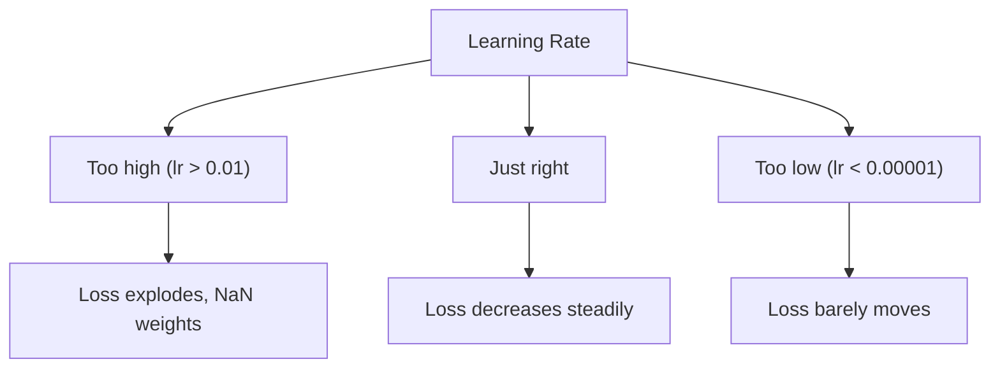

Common defaults: SGD lr=0.01-0.1, Adam/AdamW lr=1e-4 to 3e-4, Fine-tuning lr=1e-5 to 5e-5.

### When Each Optimizer Wins

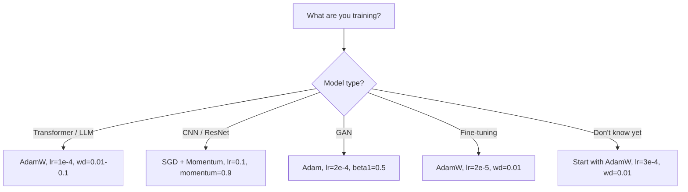

## Build It

### Step 1: Vanilla SGD

```python
class SGD:
    def __init__(self, lr=0.01):
        self.lr = lr
    def step(self, params, grads):
        for i in range(len(params)):
            params[i] -= self.lr * grads[i]
```

### Step 2: SGD with Momentum

```python
class SGDMomentum:
    def __init__(self, lr=0.01, beta=0.9):
        self.lr = lr
        self.beta = beta
        self.velocities = None
    def step(self, params, grads):
        if self.velocities is None:
            self.velocities = [0.0] * len(params)
        for i in range(len(params)):
            self.velocities[i] = self.beta * self.velocities[i] + grads[i]
            params[i] -= self.lr * self.velocities[i]
```

### Step 3: Adam

```python
import math

class Adam:
    def __init__(self, lr=0.001, beta1=0.9, beta2=0.999, epsilon=1e-8):
        self.lr = lr
        self.beta1 = beta1
        self.beta2 = beta2
        self.epsilon = epsilon
        self.m = None
        self.v = None
        self.t = 0
    def step(self, params, grads):
        if self.m is None:
            self.m = [0.0] * len(params)
            self.v = [0.0] * len(params)
        self.t += 1
        for i in range(len(params)):
            self.m[i] = self.beta1 * self.m[i] + (1 - self.beta1) * grads[i]
            self.v[i] = self.beta2 * self.v[i] + (1 - self.beta2) * grads[i] ** 2
            m_hat = self.m[i] / (1 - self.beta1 ** self.t)
            v_hat = self.v[i] / (1 - self.beta2 ** self.t)
            params[i] -= self.lr * m_hat / (math.sqrt(v_hat) + self.epsilon)
```

### Step 4: AdamW

```python
class AdamW:
    def __init__(self, lr=0.001, beta1=0.9, beta2=0.999, epsilon=1e-8, weight_decay=0.01):
        self.lr = lr
        self.beta1 = beta1
        self.beta2 = beta2
        self.epsilon = epsilon
        self.weight_decay = weight_decay
        self.m = None
        self.v = None
        self.t = 0
    def step(self, params, grads):
        if self.m is None:
            self.m = [0.0] * len(params)
            self.v = [0.0] * len(params)
        self.t += 1
        for i in range(len(params)):
            self.m[i] = self.beta1 * self.m[i] + (1 - self.beta1) * grads[i]
            self.v[i] = self.beta2 * self.v[i] + (1 - self.beta2) * grads[i] ** 2
            m_hat = self.m[i] / (1 - self.beta1 ** self.t)
            v_hat = self.v[i] / (1 - self.beta2 ** self.t)
            params[i] -= self.lr * m_hat / (math.sqrt(v_hat) + self.epsilon)
            params[i] -= self.lr * self.weight_decay * params[i]
```

## Use It

```python
import torch
import torch.optim as optim

model = torch.nn.Sequential(
    torch.nn.Linear(784, 256), torch.nn.ReLU(),
    torch.nn.Linear(256, 10),
)

optimizer = optim.AdamW(model.parameters(), lr=3e-4, weight_decay=0.01)
scheduler = optim.lr_scheduler.CosineAnnealingLR(optimizer, T_max=100)

for epoch in range(100):
    output = model(torch.randn(32, 784))
    loss = torch.nn.functional.cross_entropy(output, torch.randint(0, 10, (32,)))
    optimizer.zero_grad()
    loss.backward()
    torch.nn.utils.clip_grad_norm_(model.parameters(), max_norm=1.0)
    optimizer.step()
    scheduler.step()
```

The pattern is always: zero_grad, forward, loss, backward, (clip), step, (schedule).

## Key Terms

| Term | What people say | What it actually means |
|------|----------------|----------------------|
| Learning rate | "Step size" | The scalar multiplier on the gradient update |
| SGD | "Basic gradient descent" | Stochastic gradient descent on mini-batches |
| Momentum | "Rolling ball analogy" | Exponential moving average of past gradients |
| RMSProp | "Adaptive learning rate" | Divides gradient by running RMS of recent gradients |
| Adam | "The default optimizer" | Combines momentum and RMSProp with bias correction |
| AdamW | "Adam done right" | Adam with decoupled weight decay |
| Bias correction | "Warmup for running averages" | Compensates for zero initialization of moment estimates |
| Weight decay | "Shrink the weights" | Subtracting a fraction of weight value at each step |
| Gradient clipping | "Capping the gradient norm" | Scaling gradients when norm exceeds a threshold |

## Exercises

1. Implement Nesterov momentum. Compare convergence to standard momentum.
2. Implement learning rate warmup: linear ramp from 0 to max_lr, then cosine decay.
3. Track the effective learning rate for each parameter during Adam training.
4. Implement gradient clipping. Count how many runs diverge with and without clipping.
5. Compare Adam vs AdamW on a network with large weights. Plot L2 norm over training.

## Further Reading

- Kingma & Ba, "Adam: A Method for Stochastic Optimization" (2014)
- Loshchilov & Hutter, "Decoupled Weight Decay Regularization" (2017)
- Smith, "Cyclical Learning Rates for Training Neural Networks" (2017)
- Ruder, "An Overview of Gradient Descent Optimization Algorithms" (2016)

[Reference](https://github.com/rohitg00/ai-engineering-from-scratch/tree/main/phases/03-deep-learning-core/06-optimizers)

---

## Part 4 (ch059): Regularization

> Your model gets 99% on training data and 60% on test data. It memorized instead of learning. Regularization is the tax you impose on complexity to force generalization.

**Type:** Build
**Languages:** Python
**Prerequisites:** Lesson 03.06 (Optimizers)
**Time:** ~75 minutes

## Learning Objectives

- Implement dropout with inverted scaling, L2 weight decay, batch normalization, layer normalization, and RMSNorm from scratch
- Measure the train-test accuracy gap and diagnose overfitting using regularization experiments
- Explain why transformers use LayerNorm instead of BatchNorm and why modern LLMs prefer RMSNorm
- Apply the correct combination of regularization techniques based on the severity of overfitting

## The Problem

A neural network with enough parameters can memorize any dataset. Zhang et al. (2017) proved this by training standard networks on ImageNet with random labels -- near-zero training loss on completely random labels, but zero test accuracy.

The gap between training performance and test performance is the overfitting gap. Every technique in this lesson attacks that gap from a different angle.

## The Concept

### The Overfitting Spectrum

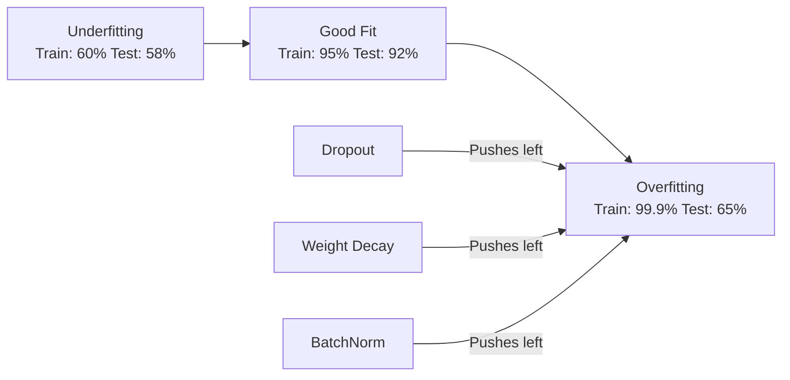

### Dropout

During training, randomly set each neuron's output to zero with probability p. With p=0.5, half the neurons are zeroed on every forward pass. The network must learn redundant representations.

At test time, use all neurons. With inverted dropout, scaling is applied during training instead:

```
During training:  output = activation(z) * mask / (1 - p)
During testing:   output = activation(z)
```

Default rates: p=0.1 for transformers, p=0.5 for MLPs, p=0.2-0.3 for CNNs.

### Weight Decay (L2 Regularization)

```
total_loss = task_loss + (lambda / 2) * sum(w_i^2)
```

The gradient of the regularization term is lambda * w. At every step, each weight is shrunk toward zero. Large weights get penalized more.

Typical values: 0.01 for AdamW on transformers, 1e-4 for SGD on CNNs.

### Batch Normalization

Normalize the output of each layer across the mini-batch:

```
mu = (1/B) * sum(x_i)
sigma^2 = (1/B) * sum((x_i - mu)^2)
x_hat = (x_i - mu) / sqrt(sigma^2 + eps)
y = gamma * x_hat + beta
```

During training, mu and sigma come from the current mini-batch. During inference, use running averages.

BatchNorm makes the loss landscape smoother, enabling higher learning rates and faster convergence. But it depends on batch statistics -- with batch size < 32, statistics are noisy.

### Layer Normalization

Normalize across features instead of across the batch. Each sample is normalized independently:

```
mu = (1/D) * sum(x_j)
sigma^2 = (1/D) * sum((x_j - mu)^2)
x_hat = (x_j - mu) / sqrt(sigma^2 + eps)
y = gamma * x_hat + beta
```

No dependence on batch size. Transformers use LayerNorm because sequences have variable lengths and batch sizes are often small.

### RMSNorm

LayerNorm without the mean subtraction. Proposed by Zhang & Sennrich (2019):

```
rms = sqrt((1/D) * sum(x_j^2))
y = gamma * x / rms
```

The mean subtraction contributes little to performance but costs computation. LLaMA, Mistral, and most modern LLMs use RMSNorm.

### Normalization Comparison

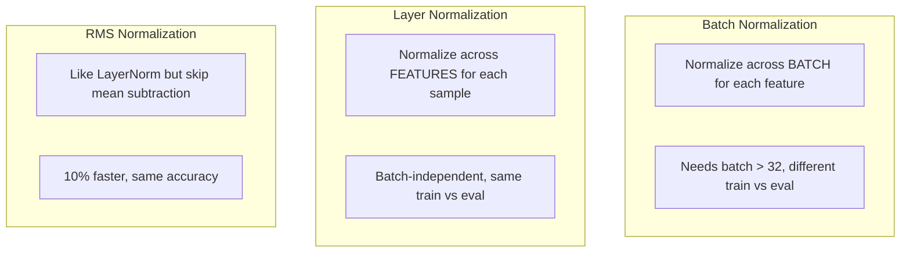

### When to Apply What

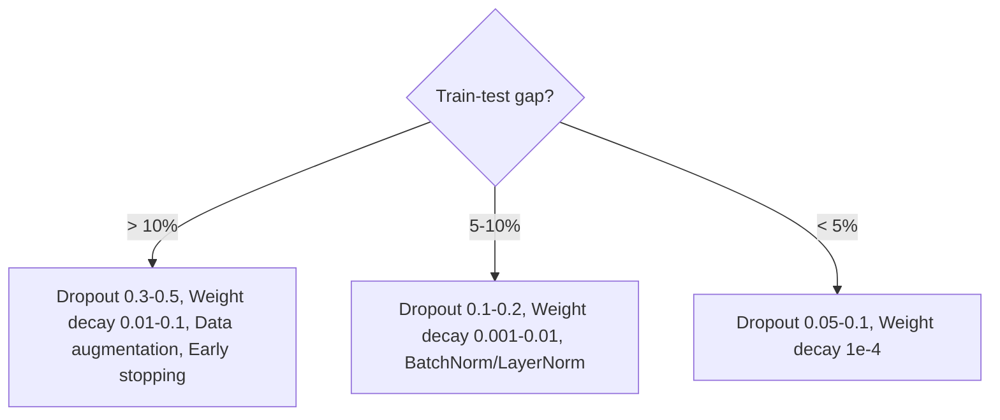

## Build It

### Step 1: Dropout

```python
import random

class Dropout:
    def __init__(self, p=0.5):
        self.p = p
        self.training = True
        self.mask = None
    def forward(self, x):
        if not self.training:
            return list(x)
        self.mask = []
        output = []
        for val in x:
            if random.random() < self.p:
                self.mask.append(0)
                output.append(0.0)
            else:
                self.mask.append(1)
                output.append(val / (1 - self.p))
        return output
```

### Step 2: L2 Weight Decay

```python
def l2_regularization(weights, lambda_reg):
    penalty = sum(w * w for w in weights)
    return lambda_reg * 0.5 * penalty

def l2_gradient(weights, lambda_reg):
    return [lambda_reg * w for w in weights]
```

### Step 3: Batch Normalization

```python
import math

class BatchNorm:
    def __init__(self, num_features, momentum=0.1, eps=1e-5):
        self.gamma = [1.0] * num_features
        self.beta = [0.0] * num_features
        self.eps = eps
        self.momentum = momentum
        self.running_mean = [0.0] * num_features
        self.running_var = [1.0] * num_features
        self.training = True

    def forward(self, batch):
        batch_size = len(batch)
        if self.training:
            mean = [sum(sample[j] for sample in batch) / batch_size for j in range(len(batch[0]))]
            var = [sum((sample[j] - mean[j]) ** 2 for sample in batch) / batch_size for j in range(len(batch[0]))]
            for j in range(len(mean)):
                self.running_mean[j] = (1 - self.momentum) * self.running_mean[j] + self.momentum * mean[j]
                self.running_var[j] = (1 - self.momentum) * self.running_var[j] + self.momentum * var[j]
        else:
            mean = list(self.running_mean)
            var = list(self.running_var)
        output = []
        for sample in batch:
            out_sample = []
            for j in range(len(mean)):
                x_h = (sample[j] - mean[j]) / math.sqrt(var[j] + self.eps)
                out_sample.append(self.gamma[j] * x_h + self.beta[j])
            output.append(out_sample)
        return output
```

### Step 4: Layer Normalization

```python
class LayerNorm:
    def __init__(self, num_features, eps=1e-5):
        self.gamma = [1.0] * num_features
        self.beta = [0.0] * num_features
        self.eps = eps

    def forward(self, x):
        mean = sum(x) / len(x)
        var = sum((xi - mean) ** 2 for xi in x) / len(x)
        output = []
        for j in range(len(x)):
            x_h = (x[j] - mean) / math.sqrt(var + self.eps)
            output.append(self.gamma[j] * x_h + self.beta[j])
        return output
```

### Step 5: RMSNorm

```python
class RMSNorm:
    def __init__(self, num_features, eps=1e-6):
        self.gamma = [1.0] * num_features
        self.eps = eps

    def forward(self, x):
        rms = math.sqrt(sum(xi * xi for xi in x) / len(x) + self.eps)
        return [self.gamma[j] * x[j] / rms for j in range(len(x))]
```

## Use It

```python
import torch
import torch.nn as nn

model = nn.Sequential(
    nn.Linear(784, 256), nn.BatchNorm1d(256), nn.ReLU(), nn.Dropout(0.3),
    nn.Linear(256, 128), nn.BatchNorm1d(128), nn.ReLU(), nn.Dropout(0.3),
    nn.Linear(128, 10),
)

model.train()   # dropout active, BN uses batch stats
out_train = model(torch.randn(32, 784))
model.eval()    # dropout off, BN uses running stats
out_test = model(torch.randn(1, 784))
```

For transformers: LayerNorm, dropout p=0.1.

## Key Terms

| Term | What people say | What it actually means |
|------|----------------|----------------------|
| Overfitting | "Model memorized the data" | Training performance significantly exceeds test performance |
| Regularization | "Preventing overfitting" | Any technique constraining model complexity to improve generalization |
| Dropout | "Random neuron deletion" | Zeroing random neurons during training, forcing redundant representations |
| Weight decay | "L2 penalty" | Shrinking weights toward zero at each step |
| Batch normalization | "Normalize per batch" | Normalizing layer outputs across the batch dimension |
| Layer normalization | "Normalize per sample" | Normalizing across features within each sample |
| RMSNorm | "LayerNorm without the mean" | Root mean square normalization, 10% faster |
| Early stopping | "Stop before overfit" | Halting training when validation loss stops improving |

## Exercises

1. Implement spatial dropout. Compare train-test gap to standard dropout.
2. Combine label smoothing with dropout. Which combination gives the smallest gap?
3. Add BatchNorm between hidden layer and activation. Train with and without BatchNorm at different learning rates.
4. Implement early stopping. Report which epoch had the best test accuracy.
5. Compare LayerNorm vs RMSNorm on a 4-layer network. Verify RMSNorm is faster with the same accuracy.

## Further Reading

- Srivastava et al., "Dropout: A Simple Way to Prevent Neural Networks from Overfitting" (2014)
- Ioffe & Szegedy, "Batch Normalization: Accelerating Deep Network Training by Reducing Internal Covariate Shift" (2015)
- Zhang & Sennrich, "Root Mean Square Layer Normalization" (2019)
- Zhang et al., "Understanding Deep Learning Requires Rethinking Generalization" (2017)

[Reference](https://github.com/rohitg00/ai-engineering-from-scratch/tree/main/phases/03-deep-learning-core/07-regularization)

---

## Part 5 (ch060): Weight Initialization and Training Stability

> Initialize wrong and training never starts. Initialize right and 50 layers train as smoothly as 3.

**Type:** Build
**Languages:** Python
**Prerequisites:** Lesson 03.04 (Activation Functions), Lesson 03.07 (Regularization)
**Time:** ~90 minutes

## Learning Objectives

- Implement zero, random, Xavier/Glorot, and Kaiming/He initialization strategies and measure their effect on activation magnitudes through 50 layers
- Derive why Xavier init uses Var(w) = 2/(fan_in + fan_out) and Kaiming uses Var(w) = 2/fan_in
- Demonstrate the symmetry problem with zero initialization and explain why random scale alone is insufficient
- Match the correct initialization strategy to the activation function: Xavier for sigmoid/tanh, Kaiming for ReLU/GELU

## The Problem

Initialize all weights to zero: nothing learns. Every neuron computes the same function, receives the same gradient, and updates identically. Your 512-neuron hidden layer is 512 copies of one neuron.

Initialize too large: activations explode. By layer 10, values hit 1e15. By layer 20, infinity.

Initialize randomly from standard normal: works for 3 layers. At 50 layers, the signal collapses or detonates depending on whether the scale was slightly too small or slightly too large.

## The Concept

### The Symmetry Problem

If all weights start at the same value, every neuron computes the same output, receives the same gradient, and changes by the same amount. Random initialization breaks this symmetry.

### Variance Propagation

Consider a single layer with fan_in inputs: z = w1*x1 + w2*x2 + ... + w_n*x_n. If each weight has variance Var(w) and each input has variance Var(x), the output variance is:

```
Var(z) = fan_in * Var(w) * Var(x)
```

If Var(w) = 1 and fan_in = 512, output variance is 512x input variance. After 10 layers: 512^10 = 1.2e27. Exploded.

If Var(w) = 0.001, output variance shrinks by 0.512 per layer. After 10 layers: 0.00013. Vanished.

The goal: choose Var(w) so signal magnitude stays constant across layers.

### Xavier/Glorot Initialization

For sigmoid and tanh activations:
```
Var(w) = 2 / (fan_in + fan_out)
```

Weights drawn from Uniform(-limit, limit) where limit = sqrt(6 / (fan_in + fan_out)), or Normal(0, sqrt(2 / (fan_in + fan_out))).

### Kaiming/He Initialization

For ReLU activations (ReLU kills half the outputs, effective fan_in is halved):
```
Var(w) = 2 / fan_in
```

Weights drawn from Normal(0, sqrt(2 / fan_in)). The factor of 2 compensates for ReLU zeroing half the activations.

### Transformer Initialization

Residual connections add the output of each sub-layer to its input. Each addition increases variance. GPT-2 scales residual weights by 1/sqrt(2N) where N is the number of layers.

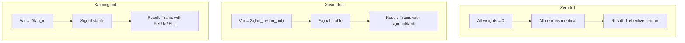

### Choosing the Right Init

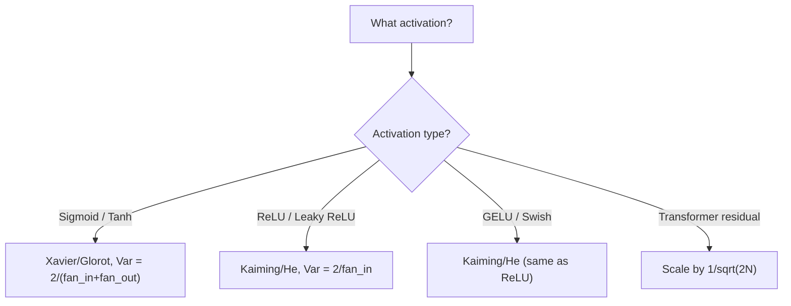

## Build It

### Step 1: Initialization Strategies

```python
import math
import random

def zero_init(fan_in, fan_out):
    return [[0.0 for _ in range(fan_in)] for _ in range(fan_out)]

def random_init(fan_in, fan_out, scale=1.0):
    return [[random.gauss(0, scale) for _ in range(fan_in)] for _ in range(fan_out)]

def xavier_init(fan_in, fan_out):
    std = math.sqrt(2.0 / (fan_in + fan_out))
    return [[random.gauss(0, std) for _ in range(fan_in)] for _ in range(fan_out)]

def kaiming_init(fan_in, fan_out):
    std = math.sqrt(2.0 / fan_in)
    return [[random.gauss(0, std) for _ in range(fan_in)] for _ in range(fan_out)]
```

### Step 2: Forward Pass Through 50 Layers

```python
def forward_deep(init_fn, activation_fn, n_layers=50, width=64, n_samples=100):
    random.seed(42)
    layer_magnitudes = []
    inputs = [[random.gauss(0, 1) for _ in range(width)] for _ in range(n_samples)]
    for layer_idx in range(n_layers):
        weights = init_fn(width, width)
        biases = [0.0] * width
        new_inputs = []
        for sample in inputs:
            output = []
            for neuron_idx in range(width):
                z = sum(weights[neuron_idx][j] * sample[j] for j in range(width)) + biases[neuron_idx]
                output.append(activation_fn(z))
            new_inputs.append(output)
        inputs = new_inputs
        magnitudes = []
        for sample in inputs:
            magnitudes.append(sum(abs(v) for v in sample) / width)
        layer_magnitudes.append(sum(magnitudes) / len(magnitudes))
    return layer_magnitudes
```

### Step 3: The Experiment

```python
def run_experiment():
    configs = [
        ("Zero init + Sigmoid", lambda fi, fo: zero_init(fi, fo), sigmoid),
        ("Random N(0,1) + ReLU", lambda fi, fo: random_init(fi, fo, 1.0), relu),
        ("Random N(0,0.01) + ReLU", lambda fi, fo: random_init(fi, fo, 0.01), relu),
        ("Xavier + Sigmoid", xavier_init, sigmoid),
        ("Xavier + Tanh", xavier_init, tanh_act),
        ("Kaiming + ReLU", kaiming_init, relu),
    ]
    for name, init_fn, act_fn in configs:
        mags = forward_deep(init_fn, act_fn)
        print(f"{name}: L1={mags[0]:.4f}, L10={mags[9]:.4f}, L50={mags[49]:.4f}")
```

### Step 4: Symmetry Demonstration

```python
def symmetry_demo():
    weights = zero_init(2, 4)
    biases = [0.0] * 4
    inputs = [0.5, -0.3]
    outputs = [sigmoid(sum(w * x for w, x in zip(w_row, inputs)) + b)
               for w_row, b in zip(weights, biases)]
    all_same = all(abs(o - outputs[0]) < 1e-10 for o in outputs)
    print(f"All identical: {all_same}")  # True
    print(f"Effective parameters: 1 (not {len(weights) * len(weights[0])})")
```

## Use It

PyTorch provides these as built-in functions:

```python
import torch.nn as nn

layer = nn.Linear(512, 256)
nn.init.xavier_uniform_(layer.weight)
nn.init.kaiming_normal_(layer.weight, nonlinearity='relu')
nn.init.zeros_(layer.bias)
```

PyTorch defaults to Kaiming uniform initialization, which is why most simple networks "just work."

## Key Terms

| Term | What people say | What it actually means |
|------|----------------|----------------------|
| Weight initialization | "Set starting weights randomly" | Strategy for initial weight values that determines if a network can train |
| Symmetry breaking | "Make neurons different" | Using random initialization so neurons learn distinct features |
| Fan-in | "Number of inputs" | Incoming connections affecting variance in weighted sum |
| Fan-out | "Number of outputs" | Outgoing connections relevant for gradient variance |
| Xavier/Glorot init | "The sigmoid initialization" | Var(w) = 2/(fan_in + fan_out) for sigmoid/tanh |
| Kaiming/He init | "The ReLU initialization" | Var(w) = 2/fan_in for ReLU networks |
| Variance propagation | "How signals grow through layers" | Analysis of activation variance through layers |
| Exploding activations | "Values go to infinity" | Weight variance too high, activations grow exponentially |

## Exercises

1. Add LeCun initialization (Var = 1/fan_in for SELU). Run the 50-layer experiment and compare.
2. Implement GPT-2 residual scaling. Run 50 layers with and without scaling.
3. Create an "init health check" function that recommends the correct initialization.
4. Run the experiment with fan_in=16 vs fan_in=1024. Show how the gap widens with larger layers.
5. Implement orthogonal initialization. Compare to Kaiming for ReLU networks at 50 layers.

## Further Reading

- Glorot & Bengio, "Understanding the difficulty of training deep feedforward neural networks" (2010)
- He et al., "Delving Deep into Rectifiers" (2015) -- Kaiming initialization
- Radford et al., "Language Models are Unsupervised Multitask Learners" (2019) -- GPT-2
- Mishkin & Matas, "All You Need is a Good Init" (2016)

[Reference](https://github.com/rohitg00/ai-engineering-from-scratch/tree/main/phases/03-deep-learning-core/08-weight-initialization)
