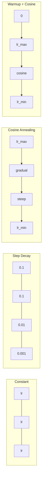
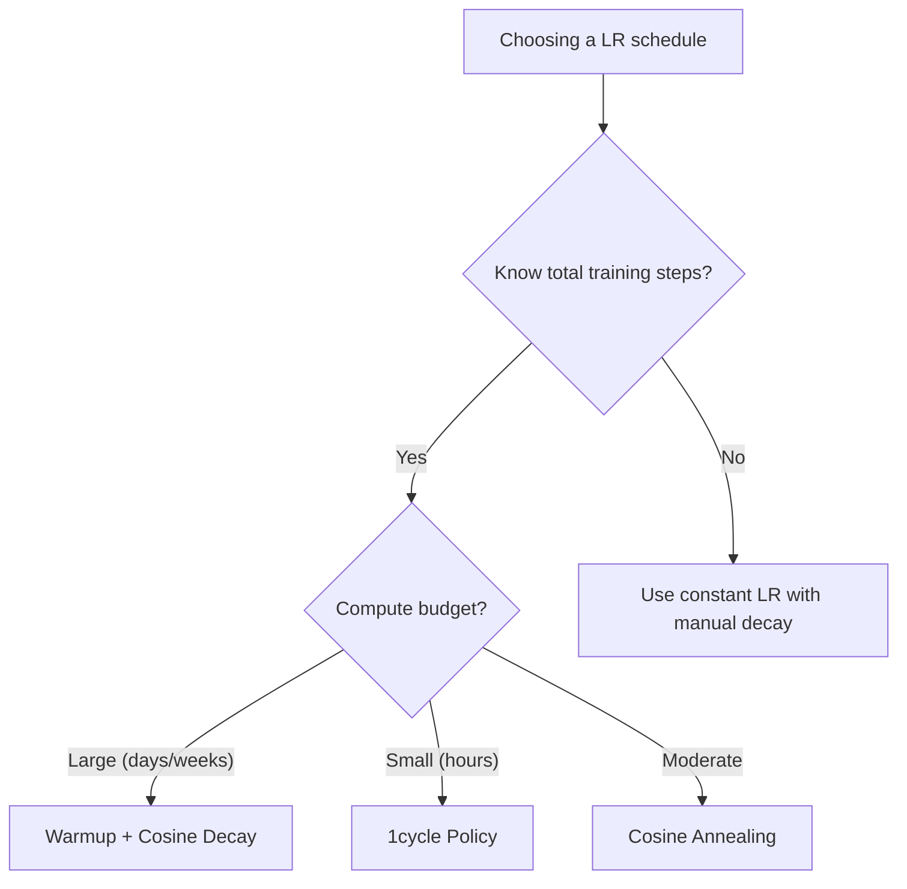
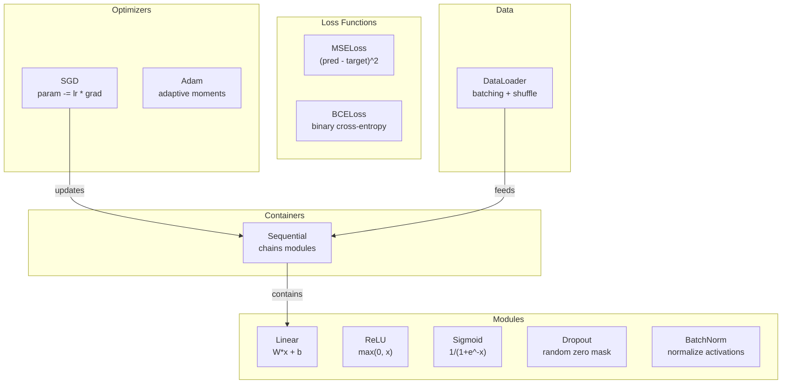
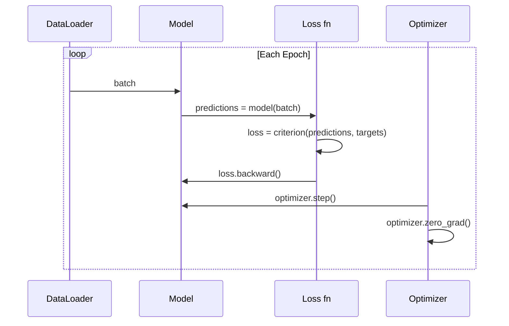
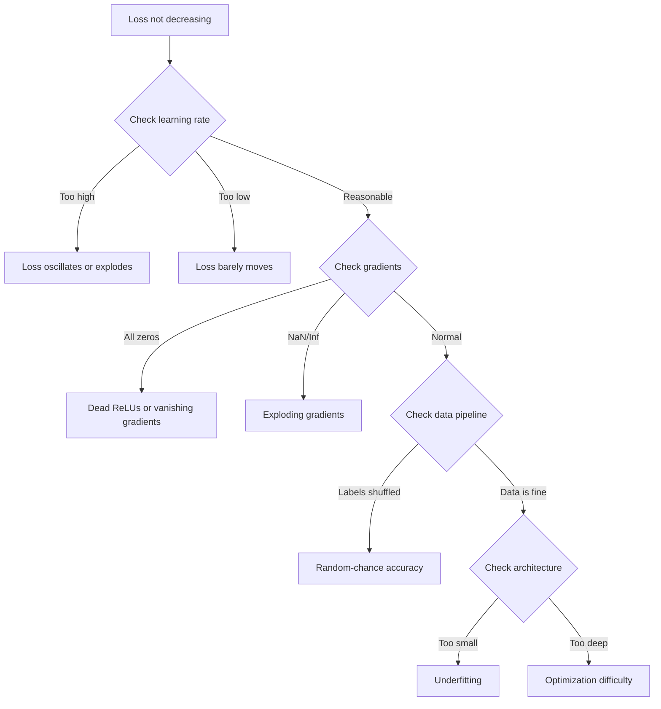

# Training Practice: Schedules, PyTorch, JAX & Debugging

> Combined lessons (5 parts), merged verbatim — no content removed.

**Type:** Combined

---

## Part 1 (ch061): Learning Rate Schedules and Warmup

> The learning rate is the single most important hyperparameter. Not the architecture. Not the dataset size. Not the activation function. The learning rate. If you tune nothing else, tune this.

**Type:** Build
**Languages:** Python
**Prerequisites:** Lesson 03.06 (Optimizers), Lesson 03.08 (Weight Initialization)
**Time:** ~90 minutes

## Learning Objectives

- Implement constant, step decay, cosine annealing, warmup + cosine, and 1cycle learning rate schedules from scratch
- Demonstrate the three failure modes of learning rate selection: divergence (too high), stalling (too low), and oscillation (no decay)
- Explain why warmup is necessary for Adam-based optimizers and how it stabilizes early training
- Compare convergence speed across all five schedules on the same task and select the appropriate one for a given training budget

## The Problem

The optimal learning rate is not a constant. It changes during training. Early on, you want large steps to cover ground quickly. Late in training, you want tiny steps to settle into a sharp minimum. The difference between a 90% accurate model and a 95% accurate model is often just the schedule.

Every major model uses a learning rate schedule. Llama 3 used peak lr=3e-4 with 2000 warmup steps and cosine decay to 3e-5. GPT-3 used lr=6e-4 with warmup over 375 million tokens. These result from multi-million-dollar hyperparameter sweeps.

## The Concept

### Constant Learning Rate

```
lr(t) = lr_0
```

Rarely optimal. Either too high for the end (oscillation) or too low for the beginning (wasted compute).

### Step Decay

```
lr(t) = lr_0 * gamma^(floor(epoch / step_size))
```

Old-school approach from the ResNet era. ResNet-50 used lr=0.1, drop by 10x at epochs 30, 60, and 90.

### Cosine Annealing

```
lr(t) = lr_min + 0.5 * (lr_max - lr_min) * (1 + cos(pi * t / T))
```

Smooth decay from lr_max to lr_min. No hyperparameters to tune beyond lr_max and lr_min. Default for most modern training runs.

### Warmup: Why You Start Small

Adam initializes running estimates of gradient mean and variance to zero. The first few gradient updates are based on garbage statistics. Warmup fixes this by starting with a tiny learning rate and linearly ramping up:

```
lr(t) = lr_max * (t / warmup_steps)  for t < warmup_steps
```

Typical warmup: 1-5% of total training steps.

### Linear Warmup + Cosine Decay

The modern default. Ramp up linearly, then decay with cosine:

```
if t < warmup_steps:
    lr(t) = lr_max * (t / warmup_steps)
else:
    progress = (t - warmup_steps) / (total_steps - warmup_steps)
    lr(t) = lr_min + 0.5 * (lr_max - lr_min) * (1 + cos(pi * progress))
```

Used by Llama, GPT, PaLM, and most modern transformers.

### 1cycle Policy

Ramp the learning rate up from a low value to a high value in the first half, then ramp it back down. A high learning rate acts as regularization. 1cycle often trains faster than cosine annealing.

### Schedule Shapes



### Decision Flowchart



### Published LR Configs

| Model | Peak LR | Warmup | Schedule |
|-------|---------|--------|----------|
| Llama 3 (405B) | 3e-4 | 2000 steps | Cosine to 3e-5 |
| GPT-3 (175B) | 6e-4 | 375M tokens | Cosine to 0 |
| ResNet-50 | 0.1 | none | Step decay x0.1 at 30,60,90 |
| BERT (340M) | 1e-4 | 10K steps | Linear decay |

## Build It

### Step 1: Schedule Functions

```python
import math

def constant_schedule(step, lr=0.01, **kwargs):
    return lr

def step_decay_schedule(step, lr=0.1, step_size=100, gamma=0.1, **kwargs):
    return lr * (gamma ** (step // step_size))

def cosine_schedule(step, lr=0.01, total_steps=1000, lr_min=1e-5, **kwargs):
    if step >= total_steps: return lr_min
    return lr_min + 0.5 * (lr - lr_min) * (1 + math.cos(math.pi * step / total_steps))

def warmup_cosine_schedule(step, lr=0.01, total_steps=1000, warmup_steps=100, lr_min=1e-5, **kwargs):
    if step < warmup_steps:
        return lr * step / warmup_steps
    progress = (step - warmup_steps) / (total_steps - warmup_steps)
    return lr_min + 0.5 * (lr - lr_min) * (1 + math.cos(math.pi * progress))

def one_cycle_schedule(step, lr=0.01, total_steps=1000, **kwargs):
    mid = max(total_steps // 2, 1)
    if step < mid:
        return (lr / 25) + (lr - lr / 25) * step / mid
    else:
        progress = (step - mid) / max(total_steps - mid, 1)
        return lr * (1 - progress) + (lr / 10000) * progress
```

### Step 2: LR Sensitivity

```python
def lr_sensitivity(data):
    learning_rates = [1.0, 0.1, 0.01, 0.001, 0.0001]
    for lr in learning_rates:
        losses = train_with_schedule(constant_schedule, f"lr={lr}", data, epochs=100, base_lr=lr)
        start, end = losses[0], losses[-1]
        if end > start or math.isnan(end) or end > 1.0:
            status = "DIVERGED"
        elif end > start * 0.9:
            status = "BARELY MOVED"
        elif end < 0.15:
            status = "CONVERGED"
        else:
            status = "LEARNING"
        print(f"  lr={lr:>8.4f}: start={start:.4f}, end={end:.4f}, {status}")
```

## Use It

```python
import torch.optim as optim
from torch.optim.lr_scheduler import CosineAnnealingLR, OneCycleLR, StepLR

optimizer = optim.Adam(model.parameters(), lr=3e-4)
scheduler = CosineAnnealingLR(optimizer, T_max=1000, eta_min=1e-5)

for step in range(1000):
    loss = train_step(model, optimizer)
    scheduler.step()
```

For warmup + cosine with HuggingFace:

```python
from transformers import get_cosine_schedule_with_warmup

scheduler = get_cosine_schedule_with_warmup(
    optimizer, num_warmup_steps=2000, num_training_steps=100000,
)
```

When in doubt, use warmup + cosine with warmup = 3-5% of total steps.

## Key Terms

| Term | What people say | What it actually means |
|------|----------------|----------------------|
| Learning rate | "How fast the model learns" | The scalar multiplying the gradient for parameter updates |
| Schedule | "Change the LR over time" | A function mapping training step to learning rate |
| Warmup | "Start with a small LR" | Linearly ramp LR from zero to target to stabilize optimizer stats |
| Cosine annealing | "Smooth LR decay" | Decreasing LR following a cosine curve |
| Step decay | "Drop LR at milestones" | Multiplying LR by a factor at fixed intervals |
| 1cycle policy | "Up then down" | Ramping LR up then down in a single cycle |
| LR range test | "Find the best learning rate" | Sweep LR to find where loss starts diverging |
| Peak learning rate | "The maximum LR" | Highest LR reached during training, typically after warmup |

## Exercises

1. Implement exponential decay: lr(t) = lr_0 * gamma^t. Compare to cosine annealing.
2. Implement the learning rate range test: train while exponentially increasing LR from 1e-7 to 1.
3. Train with warmup + cosine, vary warmup length: 0%, 1%, 5%, 10%, 20% of total steps.
4. Implement cosine annealing with warm restarts (SGDR).
5. Build a "schedule surgeon" that monitors loss and adjusts LR automatically.

## Further Reading

- Loshchilov & Hutter, "SGDR: Stochastic Gradient Descent with Warm Restarts" (2017)
- Smith, "Super-Convergence: Very Fast Training of Neural Networks Using Large Learning Rates" (2018)
- Touvron et al., "Llama 2: Open Foundation and Fine-Tuned Chat Models" (2023)
- Goyal et al., "Accurate, Large Minibatch SGD: Training ImageNet in 1 Hour" (2017)

[Reference](https://github.com/rohitg00/ai-engineering-from-scratch/tree/main/phases/03-deep-learning-core/09-learning-rate-schedules)

---

## Part 2 (ch062): Build Your Own Mini Framework

> You have built neurons, layers, networks, backprop, activations, loss functions, optimizers, regularization, initialization, and LR schedules. All as separate pieces. Now wire them together into a framework. Not PyTorch. Not TensorFlow. Yours.

**Type:** Build
**Languages:** Python
**Prerequisites:** All of Phase 03 (Lessons 01-09)
**Time:** ~120 minutes

## Learning Objectives

- Build a complete deep learning framework (~500 lines) with Module, Linear, ReLU, Sigmoid, Dropout, BatchNorm, Sequential, loss functions, optimizers, and DataLoader
- Explain the Module abstraction (forward, backward, parameters) and why train/eval mode toggling is necessary
- Wire all components into a working training loop that trains a 4-layer network on circle classification
- Map each component of your framework to its PyTorch equivalent (nn.Module, nn.Sequential, optim.Adam, DataLoader)

## The Problem

You have ten lessons of building blocks scattered across separate files. To train a network, you copy-paste from five different lessons. That is what frameworks solve.

You are going to build the same thing in ~500 lines of Python. No numpy. No external dependencies. When you finish, you will understand exactly what happens when you write `model = nn.Sequential(...)` in PyTorch.

## The Concept

### The Module Abstraction

Every layer in PyTorch inherits from `nn.Module`. A Module has three responsibilities:
1. **forward()** -- compute the output given inputs
2. **parameters()** -- return all trainable weights
3. **backward()** -- compute gradients

### Sequential Container

`nn.Sequential` chains Modules. The container itself is a Module -- it has forward(), parameters(), and backward(). This is the composite pattern.

### Training vs Evaluation Mode

Dropout randomly zeroes neurons during training but passes everything through during evaluation. Batch normalization uses batch statistics during training but running averages during evaluation. The `train()` and `eval()` methods toggle this.

### Framework Architecture



## Build It

### Step 1: Module Base Class

```python
class Module:
    def __init__(self):
        self.training = True
    def forward(self, x): raise NotImplementedError
    def backward(self, grad): raise NotImplementedError
    def parameters(self): return []
    def train(self): self.training = True
    def eval(self): self.training = False
```

### Step 2: Linear Layer

```python
import math, random

class Linear(Module):
    def __init__(self, fan_in, fan_out):
        super().__init__()
        std = math.sqrt(2.0 / fan_in)
        self.weights = [[random.gauss(0, std) for _ in range(fan_in)] for _ in range(fan_out)]
        self.biases = [0.0] * fan_out
        self.weight_grads = [[0.0] * fan_in for _ in range(fan_out)]
        self.bias_grads = [0.0] * fan_out
        self.fan_in = fan_in
        self.fan_out = fan_out
        self.input = None

    def forward(self, x):
        self.input = x
        output = []
        for i in range(self.fan_out):
            val = self.biases[i]
            for j in range(self.fan_in):
                val += self.weights[i][j] * x[j]
            output.append(val)
        return output

    def backward(self, grad):
        input_grad = [0.0] * self.fan_in
        for i in range(self.fan_out):
            self.bias_grads[i] += grad[i]
            for j in range(self.fan_in):
                self.weight_grads[i][j] += grad[i] * self.input[j]
                input_grad[j] += grad[i] * self.weights[i][j]
        return input_grad

    def parameters(self):
        params = []
        for i in range(self.fan_out):
            for j in range(self.fan_in):
                params.append((self.weights, i, j, self.weight_grads))
            params.append((self.biases, i, None, self.bias_grads))
        return params
```

### Step 3: Activation Modules

```python
class ReLU(Module):
    def __init__(self):
        super().__init__()
        self.mask = None
    def forward(self, x):
        self.mask = [1.0 if v > 0 else 0.0 for v in x]
        return [max(0.0, v) for v in x]
    def backward(self, grad):
        return [g * m for g, m in zip(grad, self.mask)]

class Sigmoid(Module):
    def __init__(self):
        super().__init__()
        self.output = None
    def forward(self, x):
        self.output = []
        for v in x:
            v = max(-500, min(500, v))
            self.output.append(1.0 / (1.0 + math.exp(-v)))
        return self.output
    def backward(self, grad):
        return [g * o * (1 - o) for g, o in zip(grad, self.output)]
```

### Step 4: Dropout Module

```python
class Dropout(Module):
    def __init__(self, p=0.5):
        super().__init__()
        self.p = p
        self.mask = None
    def forward(self, x):
        if not self.training:
            return x
        self.mask = [0.0 if random.random() < self.p else 1.0 / (1 - self.p) for _ in x]
        return [v * m for v, m in zip(x, self.mask)]
    def backward(self, grad):
        if self.mask is None: return grad
        return [g * m for g, m in zip(grad, self.mask)]
```

### Step 5: Sequential Container

```python
class Sequential(Module):
    def __init__(self, *modules):
        super().__init__()
        self.modules = list(modules)
    def forward(self, x):
        for module in self.modules:
            x = module.forward(x)
        return x
    def backward(self, grad):
        for module in reversed(self.modules):
            grad = module.backward(grad)
        return grad
    def parameters(self):
        params = []
        for module in self.modules:
            params.extend(module.parameters())
        return params
    def train(self):
        self.training = True
        for module in self.modules:
            module.train()
    def eval(self):
        self.training = False
        for module in self.modules:
            module.eval()
```

### Step 6: Loss Functions

```python
class MSELoss:
    def __call__(self, predicted, target):
        self.predicted = predicted
        self.target = target
        n = len(predicted)
        self.loss = sum((p - t) ** 2 for p, t in zip(predicted, target)) / n
        return self.loss
    def backward(self):
        n = len(self.predicted)
        return [2 * (p - t) / n for p, t in zip(self.predicted, self.target)]

class BCELoss:
    def __call__(self, predicted, target):
        self.predicted = predicted
        self.target = target
        eps = 1e-7
        n = len(predicted)
        self.loss = 0
        for p, t in zip(predicted, target):
            p = max(eps, min(1 - eps, p))
            self.loss += -(t * math.log(p) + (1 - t) * math.log(1 - p))
        self.loss /= n
        return self.loss
    def backward(self):
        eps = 1e-7
        n = len(self.predicted)
        grads = []
        for p, t in zip(self.predicted, self.target):
            p = max(eps, min(1 - eps, p))
            grads.append((-t / p + (1 - t) / (1 - p)) / n)
        return grads
```

### Step 7: Optimizers

```python
class SGD:
    def __init__(self, parameters, lr=0.01):
        self.params = parameters
        self.lr = lr
    def step(self):
        for container, i, j, grad_container in self.params:
            if j is not None:
                container[i][j] -= self.lr * grad_container[i][j]
            else:
                container[i] -= self.lr * grad_container[i]
    def zero_grad(self):
        for container, i, j, grad_container in self.params:
            if j is not None:
                grad_container[i][j] = 0.0
            else:
                grad_container[i] = 0.0

class Adam:
    def __init__(self, parameters, lr=0.001, beta1=0.9, beta2=0.999, eps=1e-8):
        self.params = parameters
        self.lr = lr
        self.beta1 = beta1
        self.beta2 = beta2
        self.eps = eps
        self.t = 0
        self.m = [0.0] * len(parameters)
        self.v = [0.0] * len(parameters)
    def step(self):
        self.t += 1
        for idx, (container, i, j, grad_container) in enumerate(self.params):
            g = grad_container[i][j] if j is not None else grad_container[i]
            self.m[idx] = self.beta1 * self.m[idx] + (1 - self.beta1) * g
            self.v[idx] = self.beta2 * self.v[idx] + (1 - self.beta2) * g * g
            m_hat = self.m[idx] / (1 - self.beta1 ** self.t)
            v_hat = self.v[idx] / (1 - self.beta2 ** self.t)
            update = self.lr * m_hat / (math.sqrt(v_hat) + self.eps)
            if j is not None:
                container[i][j] -= update
            else:
                container[i] -= update
    def zero_grad(self):
        for container, i, j, grad_container in self.params:
            if j is not None:
                grad_container[i][j] = 0.0
            else:
                grad_container[i] = 0.0
```

### Step 8: DataLoader

```python
class DataLoader:
    def __init__(self, data, batch_size=32, shuffle=True):
        self.data = data
        self.batch_size = batch_size
        self.shuffle = shuffle
    def __iter__(self):
        indices = list(range(len(self.data)))
        if self.shuffle:
            random.shuffle(indices)
        for start in range(0, len(indices), self.batch_size):
            batch_indices = indices[start:start + self.batch_size]
            batch = [self.data[i] for i in batch_indices]
            yield [item[0] for item in batch], [item[1] for item in batch]
```

### Step 9: Training Loop

```python
def make_circle_data(n=500, seed=42):
    random.seed(seed)
    data = []
    for _ in range(n):
        x = random.uniform(-2, 2)
        y = random.uniform(-2, 2)
        label = 1.0 if x * x + y * y < 1.5 else 0.0
        data.append(([x, y], [label]))
    return data

def train():
    random.seed(42)
    model = Sequential(
        Linear(2, 16), ReLU(),
        Linear(16, 16), ReLU(),
        Linear(16, 8), ReLU(),
        Linear(8, 1), Sigmoid(),
    )
    criterion = BCELoss()
    optimizer = Adam(model.parameters(), lr=0.01)
    data = make_circle_data(500)
    split = int(len(data) * 0.8)
    train_data, test_data = data[:split], data[split:]
    loader = DataLoader(train_data, batch_size=16, shuffle=True)
    model.train()

    for epoch in range(100):
        total_loss = 0
        total_correct = 0
        total_samples = 0
        for batch_inputs, batch_targets in loader:
            for x, t in zip(batch_inputs, batch_targets):
                pred = model.forward(x)
                loss = criterion(pred, t)
                optimizer.zero_grad()
                grad = criterion.backward()
                model.backward(grad)
                optimizer.step()
                if (pred[0] >= 0.5) == (t[0] >= 0.5):
                    total_correct += 1
                total_samples += 1
            total_loss += loss
        if epoch % 10 == 0 or epoch == 99:
            print(f"Epoch {epoch:3d} | Accuracy: {total_correct/total_samples*100:.1f}%")
```

## Use It

Here is the PyTorch equivalent of what you just built:

```python
import torch.nn as nn

model = nn.Sequential(
    nn.Linear(2, 16), nn.ReLU(),
    nn.Linear(16, 16), nn.ReLU(),
    nn.Linear(16, 8), nn.ReLU(),
    nn.Linear(8, 1), nn.Sigmoid(),
)
criterion = nn.BCELoss()
optimizer = torch.optim.Adam(model.parameters(), lr=0.01)
```

The structure is identical. `Sequential`, `Linear`, `ReLU`, `BCELoss`, `Adam`, `zero_grad`, `backward`, `step`, `train`, `eval`. Every concept maps one-to-one.

## Key Terms

| Term | What people say | What it actually means |
|------|----------------|----------------------|
| Module | "A layer" | Base abstraction with forward(), backward(), parameters() |
| Sequential | "Stack layers in order" | A container that chains modules |
| Forward pass | "Run the network" | Passing input through each module in order |
| Backward pass | "Compute gradients" | Propagating loss gradient through each module in reverse |
| Parameters | "The trainable weights" | All values the optimizer can update |
| Optimizer | "The thing that updates weights" | Algorithm using gradients to update parameters |
| DataLoader | "The thing that feeds data" | Iterator batching and shuffling a dataset |
| Training mode | "model.train()" | Enables dropout, BN uses batch stats |
| Evaluation mode | "model.eval()" | Disables dropout, BN uses running stats |
| Zero grad | "Clear the gradients" | Reset parameter gradients before computing new ones |

## Exercises

1. Add a `SoftmaxCrossEntropyLoss` class. Test on a 3-class spiral dataset.
2. Implement learning rate scheduling. Add `set_lr()` and wire in the cosine schedule.
3. Add `save()` and `load()` to Sequential that serializes weights to JSON.
4. Implement weight decay in the Adam optimizer.
5. Replace the per-sample loop with proper mini-batch gradient accumulation.

## Further Reading

- Paszke et al., "PyTorch: An Imperative Style, High-Performance Deep Learning Library" (2019)
- Chollet, "Deep Learning with Python, Second Edition" (2021)
- Johnson, "Tiny-DNN" (https://github.com/tiny-dnn/tiny-dnn)

[Reference](https://github.com/rohitg00/ai-engineering-from-scratch/tree/main/phases/03-deep-learning-core/10-mini-framework)

---

## Part 3 (ch063): Introduction to PyTorch

> You built the engine from pistons and crankshafts. Now learn the one everyone actually drives.

**Type:** Build
**Languages:** Python
**Prerequisites:** Lesson 03.10 (Build Your Own Mini Framework)
**Time:** ~75 minutes

## Learning Objectives

- Build and train neural networks using PyTorch's nn.Module, nn.Sequential, and autograd
- Use PyTorch tensors, GPU acceleration, and the standard training loop (zero_grad, forward, loss, backward, step)
- Convert your from-scratch mini framework components to their PyTorch equivalents
- Profile and compare training speed between your pure-Python framework and PyTorch on the same task

## The Problem

Your mini framework trains a 4-layer network on circle classification in pure Python. It is also 500x slower than PyTorch on the same problem. PyTorch dispatches operations to optimized C++/CUDA kernels that run on GPU.

Speed is not the only gap. Your framework has no GPU support, no automatic differentiation, no serialization, no mixed precision. PyTorch fills every gap while keeping the exact same mental model.

## The Concept

### Why PyTorch Won

TensorFlow required defining static computation graphs before running anything. PyTorch launched with eager execution -- you write Python, it runs immediately. This meant standard debugging tools worked. By 2022, PyTorch had over 75% of ML research papers.

### Tensors

A tensor is a multi-dimensional array with three properties: shape, dtype, and device.

```python
import torch
x = torch.zeros(3, 4)           # shape: (3, 4), device: cpu
x = torch.randn(2, 3, 224, 224) # batch of 2 RGB images
x = torch.tensor([1, 2, 3])     # from a Python list
```

**Dtype** controls precision: float32 (default training), float16 (mixed precision), bfloat16 (LLM training), int8 (quantized inference).

**Device** determines where computation happens:
```python
device = torch.device("cuda" if torch.cuda.is_available() else "cpu")
x = torch.randn(3, 4, device=device)
x = x.to("cuda")
x = x.cpu()
```

### Autograd

PyTorch records every operation on tensors into a directed acyclic graph. Calling `.backward()` traverses the graph in reverse to compute gradients automatically.

```python
x = torch.randn(3, requires_grad=True)
y = x ** 2 + 3 * x
z = y.sum()
z.backward()
print(x.grad)  # dz/dx = 2x + 3
```

Three rules:
1. Only leaf tensors with `requires_grad=True` accumulate gradients
2. Call `optimizer.zero_grad()` before each backward pass (gradients accumulate)
3. Use `torch.no_grad()` during evaluation

### nn.Module

```python
import torch.nn as nn

class MLP(nn.Module):
    def __init__(self, input_dim, hidden_dim, output_dim):
        super().__init__()
        self.layer1 = nn.Linear(input_dim, hidden_dim)
        self.relu = nn.ReLU()
        self.layer2 = nn.Linear(hidden_dim, output_dim)
    def forward(self, x):
        x = self.layer1(x)
        x = self.relu(x)
        x = self.layer2(x)
        return x
```

Key building blocks:

| Module | What it does | Parameters |
|--------|-------------|------------|
| nn.Linear(in, out) | Wx + b | in*out + out |
| nn.Conv2d(in_ch, out_ch, k) | 2D convolution | in_ch*out_ch*k*k + out_ch |
| nn.BatchNorm1d(features) | Normalize activations | 2 * features |
| nn.Dropout(p) | Random zeroing | 0 |
| nn.ReLU() | max(0, x) | 0 |
| nn.GELU() | Gaussian error linear | 0 |
| nn.Embedding(vocab, dim) | Lookup table | vocab * dim |

### The Training Loop

Every PyTorch training loop follows the same 5-step pattern:



```python
for epoch in range(num_epochs):
    model.train()
    for inputs, targets in train_loader:
        inputs, targets = inputs.to(device), targets.to(device)
        optimizer.zero_grad()
        outputs = model(inputs)
        loss = criterion(outputs, targets)
        loss.backward()
        optimizer.step()
```

Five lines that trained GPT-4, Stable Diffusion, and LLaMA.

### GPU and Mixed Precision

```python
device = torch.device("cuda" if torch.cuda.is_available() else "cpu")
model = model.to(device)

# Mixed precision
from torch.amp import autocast, GradScaler
scaler = GradScaler()
for inputs, targets in loader:
    with autocast(device_type="cuda"):
        outputs = model(inputs)
        loss = criterion(outputs, targets)
    scaler.scale(loss).backward()
    scaler.step(optimizer)
    scaler.update()
    optimizer.zero_grad()
```

### Comparison: Mini Framework vs PyTorch

| Mini Framework (Lesson 10) | PyTorch |
|---------------------------|---------|
| `model = Sequential(Linear(784, 256), ReLU(), ...)` | `model = nn.Sequential(nn.Linear(784, 256), nn.ReLU(), ...)` |
| `pred = model.forward(x)` | `pred = model(x)` |
| `optimizer.zero_grad()` | `optimizer.zero_grad()` |
| `grad = criterion.backward()` then `model.backward(grad)` | `loss.backward()` |
| `optimizer.step()` | `optimizer.step()` |
| No GPU | `model.to("cuda")` |
| Manual backward for every module | Autograd handles everything |

## Build It

### Step 1: MNIST Data Loading

```python
import torch
import torch.nn as nn
import struct, gzip, urllib.request, os

def download_mnist(path="./mnist_data"):
    base_url = "https://storage.googleapis.com/cvdf-datasets/mnist/"
    files = ["train-images-idx3-ubyte.gz", "train-labels-idx1-ubyte.gz",
             "t10k-images-idx3-ubyte.gz", "t10k-labels-idx1-ubyte.gz"]
    os.makedirs(path, exist_ok=True)
    for f in files:
        filepath = os.path.join(path, f)
        if not os.path.exists(filepath):
            urllib.request.urlretrieve(base_url + f, filepath)

def load_images(filepath):
    with gzip.open(filepath, "rb") as f:
        magic, num, rows, cols = struct.unpack(">IIII", f.read(16))
        data = f.read()
        images = torch.frombuffer(bytearray(data), dtype=torch.uint8)
        return images.reshape(num, rows * cols).float() / 255.0

def load_labels(filepath):
    with gzip.open(filepath, "rb") as f:
        magic, num = struct.unpack(">II", f.read(8))
        data = f.read()
        return torch.frombuffer(bytearray(data), dtype=torch.uint8).long()
```

### Step 2: Define the Model

```python
class MNISTModel(nn.Module):
    def __init__(self):
        super().__init__()
        self.net = nn.Sequential(
            nn.Linear(784, 256), nn.ReLU(), nn.Dropout(0.2),
            nn.Linear(256, 128), nn.ReLU(), nn.Dropout(0.2),
            nn.Linear(128, 10),
        )
    def forward(self, x):
        return self.net(x)
```

235,146 parameters. Tiny by modern standards.

### Step 3: Training Loop

```python
def train_one_epoch(model, loader, criterion, optimizer, device):
    model.train()
    total_loss, correct, total = 0, 0, 0
    for images, labels in loader:
        images, labels = images.to(device), labels.to(device)
        optimizer.zero_grad()
        outputs = model(images)
        loss = criterion(outputs, labels)
        loss.backward()
        optimizer.step()
        total_loss += loss.item() * images.size(0)
        _, predicted = outputs.max(1)
        correct += predicted.eq(labels).sum().item()
        total += labels.size(0)
    return total_loss / total, correct / total

def evaluate(model, loader, criterion, device):
    model.eval()
    total_loss, correct, total = 0, 0, 0
    with torch.no_grad():
        for images, labels in loader:
            images, labels = images.to(device), labels.to(device)
            outputs = model(images)
            loss = criterion(outputs, labels)
            total_loss += loss.item() * images.size(0)
            _, predicted = outputs.max(1)
            correct += predicted.eq(labels).sum().item()
            total += labels.size(0)
    return total_loss / total, correct / total
```

### Step 4: Main

```python
def main():
    device = torch.device("cuda" if torch.cuda.is_available() else "cpu")
    download_mnist()
    train_images = load_images("./mnist_data/train-images-idx3-ubyte.gz")
    train_labels = load_labels("./mnist_data/train-labels-idx1-ubyte.gz")
    test_images = load_images("./mnist_data/t10k-images-idx3-ubyte.gz")
    test_labels = load_labels("./mnist_data/t10k-labels-idx1-ubyte.gz")

    train_dataset = torch.utils.data.TensorDataset(train_images, train_labels)
    test_dataset = torch.utils.data.TensorDataset(test_images, test_labels)
    train_loader = torch.utils.data.DataLoader(train_dataset, batch_size=64, shuffle=True)
    test_loader = torch.utils.data.DataLoader(test_dataset, batch_size=256)

    model = MNISTModel().to(device)
    criterion = nn.CrossEntropyLoss()
    optimizer = torch.optim.Adam(model.parameters(), lr=1e-3)

    for epoch in range(10):
        train_loss, train_acc = train_one_epoch(model, train_loader, criterion, optimizer, device)
        test_loss, test_acc = evaluate(model, test_loader, criterion, device)
        print(f"Epoch {epoch+1:2d} | Train Acc: {train_acc:.4f} | Test Acc: {test_acc:.4f}")

    torch.save(model.state_dict(), "mnist_mlp.pt")
```

Expected: ~97.8% test accuracy after 10 epochs.

## Use It

### Saving and Loading

```python
torch.save(model.state_dict(), "model.pt")
model = MNISTModel()
model.load_state_dict(torch.load("model.pt", weights_only=True))
model.eval()
```

Always save `state_dict()`, not the model object.

### Learning Rate Scheduling

```python
scheduler = torch.optim.lr_scheduler.CosineAnnealingLR(optimizer, T_max=10)
for epoch in range(10):
    train_one_epoch(model, train_loader, criterion, optimizer, device)
    scheduler.step()
```

## Key Terms

| Term | What people say | What it actually means |
|------|----------------|----------------------|
| Tensor | "A multi-dimensional array" | A typed, device-aware array with autograd support |
| Autograd | "Automatic backprop" | Tape-based system recording operations for reverse replay |
| nn.Module | "A layer" | Base class for differentiable computation blocks |
| state_dict | "The model weights" | OrderedDict mapping parameter names to tensors |
| .backward() | "Compute gradients" | Traverse computational graph in reverse |
| .to(device) | "Move to GPU" | Transfer parameters to specified device |
| DataLoader | "The data pipeline" | Iterator for batching, shuffling, parallel data loading |
| Mixed precision | "Use float16" | Train with float16 for speed, float32 for stability |
| Eager execution | "Run it now" | Operations execute immediately when called |
| zero_grad | "Reset gradients" | Clear parameter gradients before next backward pass |

## Exercises

1. Add batch normalization. Insert nn.BatchNorm1d after each linear layer. Compare accuracy.
2. Implement a learning rate finder. Train for one epoch with exponentially increasing LR.
3. Port to GPU with mixed precision. Measure throughput with and without.
4. Build a custom Dataset for Fashion-MNIST. Train the same MLP and compare accuracy.
5. Replace Adam with SGD + momentum. Add CosineAnnealingLR. Compare convergence.

## Further Reading

- Paszke et al., "PyTorch: An Imperative Style, High-Performance Deep Learning Library" (2019)
- PyTorch Tutorials: "Learning PyTorch with Examples" (https://pytorch.org/tutorials/beginner/pytorch_with_examples.html)
- PyTorch Performance Tuning Guide (https://pytorch.org/tutorials/recipes/recipes/tuning_guide.html)
- Horace He, "Making Deep Learning Go Brrrr" (https://horace.io/brrr_intro.html)

[Reference](https://github.com/rohitg00/ai-engineering-from-scratch/tree/main/phases/03-deep-learning-core/11-intro-to-pytorch)

---

## Part 4 (ch064): Introduction to JAX

> PyTorch mutates tensors. TensorFlow builds graphs. JAX compiles pure functions. That last one changes how you think about deep learning.

**Type:** Build
**Languages:** Python
**Prerequisites:** Phase 03 Lessons 01-10, basic NumPy
**Time:** ~90 minutes

## Learning Objectives

- Write pure-function neural network code using JAX's functional API (jax.numpy, jax.grad, jax.jit, jax.vmap)
- Explain the key design difference between PyTorch's eager mutation and JAX's functional compilation model
- Apply jit compilation and vmap vectorization to accelerate training loops compared to naive Python
- Train a simple network in JAX and contrast the explicit state management with PyTorch's object-oriented approach

## The Problem

PyTorch traces operations eagerly, one at a time. Every `tensor + tensor` is a separate kernel launch. This works until you need to train a 540-billion-parameter model across 2,048 TPUs.

Google DeepMind trains Gemini on JAX. Anthropic trained Claude on JAX. JAX treats your training loop as a compilable program, not a sequence of Python calls.

JAX is NumPy with three superpowers: automatic differentiation, JIT compilation to XLA, and automatic vectorization. You write a function that processes one example. JAX gives you a function that processes a batch, computes gradients, compiles to machine code, and runs across multiple devices.

## The Concept

### The JAX Philosophy

JAX is a functional framework. No classes, no mutable state, no `.backward()` method:

| PyTorch | JAX |
|---------|-----|
| `nn.Module` class with state | Pure function: `f(params, x) -> y` |
| `loss.backward()` | `jax.grad(loss_fn)(params, x, y)` |
| Eager execution | JIT compilation via XLA |
| `for x in batch:` manual loop | `jax.vmap(f)` auto-vectorization |
| Mutable `model.parameters()` | Immutable pytree of arrays |

### jax.numpy

JAX reimplements the NumPy API on accelerators. Same function names, same broadcasting rules. But arrays live on GPU/TPU, and every operation is traceable by the compiler.

One critical difference: JAX arrays are immutable. `a = a.at[0].set(5)` instead of `a[0] = 5`.

### jax.grad: Functional Autodiff

PyTorch attaches gradients to tensors. JAX attaches gradients to functions.

```python
import jax

def f(x):
    return x ** 2

df = jax.grad(f)
df(3.0)  # 6.0

d2f = jax.grad(jax.grad(f))
d2f(3.0)  # 2.0
```

The constraint: `grad` only works on pure functions. No print statements, no mutation, no randomness without explicit keys.

### jit: Compile to XLA

```python
@jax.jit
def train_step(params, x, y):
    loss = loss_fn(params, x, y)
    return loss
```

On the first call, JAX traces the function and compiles to XLA. Subsequent calls skip Python entirely.

When JIT helps: training steps (same computation repeated thousands of times), inference.
When JIT hurts: functions with Python control flow, one-shot computations, debugging.

### vmap: Automatic Vectorization

```python
def predict(params, x):
    return jnp.dot(params['w'], x) + params['b']

batch_predict = jax.vmap(predict, in_axes=(None, 0))
```

`vmap` generates fused vectorized code. Composes with `jit` and `grad`:

```python
per_example_grads = jax.vmap(jax.grad(loss_fn), in_axes=(None, 0, 0))
```

### pmap: Data Parallelism

```python
parallel_step = jax.pmap(train_step, axis_name='devices')
```

Replicates the function across all available devices and splits the batch.

### Pytrees: The Universal Data Structure

JAX operates on "pytrees" -- nested combinations of lists, tuples, dicts, and arrays:

```python
params = {
    'layer1': {'w': jnp.zeros((784, 256)), 'b': jnp.zeros(256)},
    'layer2': {'w': jnp.zeros((256, 128)), 'b': jnp.zeros(128)},
    'layer3': {'w': jnp.zeros((128, 10)),  'b': jnp.zeros(10)},
}
```

Every JAX transformation knows how to traverse pytrees.

### The JAX Ecosystem

| Library | Role |
|---------|------|
| Flax (Google) | Neural network layers |
| Equinox (Kidger) | Pytree-based neural networks |
| Optax (DeepMind) | Optimizers + LR schedules |
| Orbax (Google) | Checkpointing |

### When to Use JAX vs PyTorch

| Factor | JAX | PyTorch |
|--------|-----|---------|
| TPU support | First-class | Community-maintained |
| GPU support | Good (XLA) | Best-in-class |
| Debugging | Hard (tracing) | Easy (eager) |
| Ecosystem | Research-focused | Massive |
| Large-scale training | Superior (XLA, pmap) | Good (FSDP) |

Use PyTorch unless you have a specific reason for JAX -- TPU access, per-example gradients, massive multi-device training.

### Random Numbers in JAX

No global random state. Every random operation requires an explicit PRNG key:

```python
key = jax.random.PRNGKey(42)
key1, key2 = jax.random.split(key)
w = jax.random.normal(key1, shape=(784, 256))
```

## Build It

### Step 1: Setup and Data

```python
import jax
import jax.numpy as jnp
from jax import random
import optax

def get_mnist_data():
    from sklearn.datasets import fetch_openml
    mnist = fetch_openml('mnist_784', version=1, as_frame=False, parser='auto')
    X = mnist.data.astype('float32') / 255.0
    y = mnist.target.astype('int')
    return X[:60000], y[:60000], X[60000:], y[60000:]
```

### Step 2: Initialize Parameters

```python
def init_params(key):
    k1, k2, k3 = random.split(key, 3)
    params = {
        'layer1': {
            'w': jnp.sqrt(2.0/784) * random.normal(k1, (784, 256)),
            'b': jnp.zeros(256),
        },
        'layer2': {
            'w': jnp.sqrt(2.0/256) * random.normal(k2, (256, 128)),
            'b': jnp.zeros(128),
        },
        'layer3': {
            'w': jnp.sqrt(2.0/128) * random.normal(k3, (128, 10)),
            'b': jnp.zeros(10),
        },
    }
    return params
```

### Step 3: Forward Pass

```python
def forward(params, x):
    x = jnp.dot(x, params['layer1']['w']) + params['layer1']['b']
    x = jax.nn.relu(x)
    x = jnp.dot(x, params['layer2']['w']) + params['layer2']['b']
    x = jax.nn.relu(x)
    x = jnp.dot(x, params['layer3']['w']) + params['layer3']['b']
    return x

def loss_fn(params, x, y):
    logits = forward(params, x)
    one_hot = jax.nn.one_hot(y, 10)
    return -jnp.mean(jnp.sum(jax.nn.log_softmax(logits) * one_hot, axis=-1))
```

### Step 4: JIT-Compiled Training Step

```python
@jax.jit
def train_step(params, opt_state, x, y):
    loss, grads = jax.value_and_grad(loss_fn)(params, x, y)
    updates, opt_state = optimizer.update(grads, opt_state, params)
    params = optax.apply_updates(params, updates)
    return params, opt_state, loss

@jax.jit
def accuracy(params, x, y):
    logits = forward(params, x)
    preds = jnp.argmax(logits, axis=-1)
    return jnp.mean(preds == y)
```

### Step 5: Training Loop

```python
optimizer = optax.adam(learning_rate=1e-3)
X_train, y_train, X_test, y_test = get_mnist_data()
X_train, X_test = jnp.array(X_train), jnp.array(X_test)
y_train, y_test = jnp.array(y_train), jnp.array(y_test)

key = random.PRNGKey(0)
params = init_params(key)
opt_state = optimizer.init(params)
batch_size = 128

for epoch in range(10):
    key, subkey = random.split(key)
    perm = random.permutation(subkey, len(X_train))
    X_shuffled = X_train[perm]
    y_shuffled = y_train[perm]
    epoch_loss = 0.0
    n_batches = len(X_train) // batch_size
    for i in range(n_batches):
        start = i * batch_size
        params, opt_state, loss = train_step(params, opt_state,
            X_shuffled[start:start+batch_size], y_shuffled[start:start+batch_size])
        epoch_loss += loss

    test_acc = accuracy(params, X_test, y_test)
    print(f"Epoch {epoch+1:2d} | Test Acc: {test_acc:.4f}")
```

Notice what is missing: no `.zero_grad()`, no `.backward()`, no `.step()`. The entire update is one composed function call.

## Use It

### Flax

```python
import flax.linen as nn

class MLP(nn.Module):
    @nn.compact
    def __call__(self, x):
        x = nn.Dense(256)(x); x = nn.relu(x)
        x = nn.Dense(128)(x); x = nn.relu(x)
        x = nn.Dense(10)(x)
        return x

model = MLP()
params = model.init(jax.random.PRNGKey(0), jnp.ones((1, 784)))
logits = model.apply(params, x_batch)
```

### Optax

```python
schedule = optax.warmup_cosine_decay_schedule(
    init_value=0.0, peak_value=1e-3, warmup_steps=1000, decay_steps=50000
)
optimizer = optax.chain(
    optax.clip_by_global_norm(1.0),
    optax.adamw(learning_rate=schedule, weight_decay=0.01),
)
```

## Key Terms

| Term | What people say | What it actually means |
|------|----------------|----------------------|
| XLA | "The thing that makes JAX fast" | Compiler that fuses operations and generates optimized GPU/TPU kernels |
| JIT | "Just-in-time compilation" | Traces function on first call, compiles to XLA |
| Pure function | "No side effects" | Output depends only on inputs |
| vmap | "Auto-batching" | Transforms per-example function to batch function |
| pmap | "Auto-parallelism" | Replicates function across multiple devices |
| Pytree | "Nested dict of arrays" | Any nested structure JAX can traverse |
| Tracing | "Recording the computation" | Executes with abstract values to build a computation graph |
| Functional autodiff | "grad of a function" | Computing derivatives by transforming functions |
| Optax | "JAX's optimizer library" | Composable gradient transformations |
| Flax | "JAX's nn.Module" | Google's neural network library for JAX |

## Exercises

1. Add dropout to the MLP. Thread a PRNG key through the forward pass.
2. Use `jax.vmap` to compute per-example gradients. Find which examples have the largest gradients.
3. Replace the manual forward function with a generic `mlp_forward` for any number of layers.
4. Benchmark training step with and without `@jax.jit`. Time 100 steps of each.
5. Implement gradient clipping using `optax.chain`. Plot gradient norm over training.

## Further Reading

- JAX documentation: https://jax.readthedocs.io/
- "JAX: composable transformations of Python+NumPy programs" (Bradbury et al., 2018)
- Flax documentation: https://flax.readthedocs.io/
- Patrick Kidger, "Equinox: neural networks in JAX via callable PyTrees" (2021)
- "You Don't Know JAX" (Colin Raffel, 2020)

[Reference](https://github.com/rohitg00/ai-engineering-from-scratch/tree/main/phases/03-deep-learning-core/12-intro-to-jax)

---

## Part 5 (ch065): Debugging Neural Networks

> Your network compiled. It ran. It produced a number. The number is wrong and nothing crashed. Welcome to the hardest kind of debugging -- the kind where there is no error message.

**Type:** Build
**Languages:** Python, PyTorch
**Prerequisites:** Phase 03 Lessons 01-10 (especially backpropagation, loss functions, optimizers)
**Time:** ~90 minutes

## Learning Objectives

- Diagnose common neural network failures (NaN loss, flat loss curve, overfitting, oscillation) using systematic debugging strategies
- Apply the "overfit one batch" technique to verify that your model architecture and training loop are correct
- Inspect gradient magnitudes, activation distributions, and weight norms to identify vanishing/exploding gradient problems
- Build a debugging checklist that covers data pipeline, model architecture, loss function, optimizer, and learning rate issues

## The Problem

Traditional software crashes when broken. Neural networks run to completion, print a loss value, and output predictions -- but are silently wrong. Google researchers estimate 60-70% of ML debugging time is spent on "silent" bugs that produce no errors but degrade model quality.

The difference between a working model and a broken one is often a single misplaced line: a missing `zero_grad()`, a transposed dimension, a learning rate off by 10x.

## The Concept

### The Debugging Mindset

The golden rule: **start simple, add complexity one piece at a time, and verify each piece independently.**



### Symptom 1: Loss Not Decreasing

**Wrong learning rate.** For Adam, start at 1e-3. For SGD, start at 1e-1 or 1e-2. Always try 3 learning rates spanning 10x each.

**Dead ReLUs.** If a neuron's input is always negative, it outputs 0 with 0 gradient. Check: print the fraction of activations that are exactly 0. If >50%, switch to LeakyReLU.

**Vanishing gradients.** In deep networks with sigmoid/tanh, gradients shrink exponentially. Fix: use ReLU/GELU, add residual connections, batch normalization.

**Exploding gradients.** Gradients grow exponentially. Loss jumps to NaN. Fix: gradient clipping, lower learning rate, add normalization.

### Symptom 2: Loss Decreasing But Model is Bad

**Overfitting.** Train-test gap grows over time. Fix: dropout, weight decay, early stopping, data augmentation.

**Data leakage.** Test data leaked into training. Fix: split first, preprocess second, check for duplicates.

**Label errors.** 5-10% of labels in most real datasets are wrong (Northcutt et al., 2021). Fix: use confident learning to find mislabeled examples.

### Symptom 3: NaN or Inf in Loss

**Learning rate too high.** Reduce by 10x.

**log(0) or log(negative).** Clamp predictions to [eps, 1-eps].

**Division by zero.** Add epsilon to denominator.

**Numerical overflow.** Subtract max before exponential (log-sum-exp trick).

### Technique 1: Gradient Checking

Compare analytical gradients (backprop) to numerical gradients (finite differences):

```
grad_numerical = (loss(w + eps) - loss(w - eps)) / (2 * eps)
rel_diff = |grad_analytical - grad_numerical| / max(|grad_analytical|, |grad_numerical|, 1e-8)
```

If `rel_diff < 1e-5`: correct. If `rel_diff > 1e-3`: bug.

### Technique 2: Activation Statistics

| Health indicator | Mean | Std | Diagnosis |
|-----------------|------|-----|-----------|
| Healthy | ~0 | ~1 | Normal |
| Saturated | >>0 or <<0 | ~0 | Stuck at extremes |
| Dead | 0 | 0 | All zeros |
| Exploding | >>10 | >>10 | Growing without bound |

### Technique 3: Gradient Flow Visualization

In a healthy network, gradient magnitudes are roughly similar across layers. If early layers have gradients 1000x smaller than later layers, you have vanishing gradients.

### Technique 4: The Overfit-One-Batch Test

The single most important debugging technique in deep learning. Take one small batch (8-32 samples). Train on it for 100+ iterations. The loss should go to nearly zero and accuracy should hit 100%.

This catches: broken loss functions, broken backward passes, architecture too small, optimizer not connected, data and labels misaligned.

### Technique 5: Learning Rate Finder

Sweep the learning rate from 1e-7 to 10 over one epoch while recording loss. The optimal LR is roughly 10x smaller than the rate where loss starts decreasing fastest.

### Common PyTorch Bugs

| Bug | Symptom | Fix |
|-----|---------|-----|
| Missing `optimizer.zero_grad()` | Loss oscillates | Add before `loss.backward()` |
| Missing `model.eval()` at test | Test accuracy varies | Add `model.eval()` and `torch.no_grad()` |
| Wrong tensor shapes | Silent broadcasting | Print shapes |
| CPU/GPU mismatch | CUDA error | Use `.to(device)` on model AND data |
| Data not normalized | Loss stuck | Normalize inputs to mean=0, std=1 |
| Labels wrong dtype | Cross-entropy error | Cast to `labels.long()` |

### The Master Debugging Table

| Symptom | Likely cause | First to try |
|---------|-------------|-------------|
| Loss stuck at -log(1/num_classes) | Model predicting uniform | Check data pipeline |
| Loss NaN after few steps | LR too high | Reduce LR 10x |
| Loss NaN immediately | log(0) or div by zero | Add epsilon |
| Loss oscillating wildly | LR too high or batch too small | Reduce LR, increase batch |
| Loss decreasing then plateaus | LR too high for fine-tuning | Add LR schedule |
| Training acc high, test acc low | Overfitting | Add dropout, weight decay |
| Both acc = chance | Not learning | Run overfit-one-batch test |
| Both acc low | Underfitting | Bigger model |
| Gradients all zero | Dead ReLUs | Switch to LeakyReLU |
| OOM during training | Batch too large | Reduce batch size |

## Build It

### Step 1: The NetworkDebugger Class

```python
import torch
import torch.nn as nn
import math

class NetworkDebugger:
    def __init__(self, model):
        self.model = model
        self.activation_stats = {}
        self.gradient_stats = {}
        self.loss_history = []
        self.lr_losses = []
        self.hooks = []
        self._register_hooks()

    def _register_hooks(self):
        for name, module in self.model.named_modules():
            if isinstance(module, (nn.Linear, nn.Conv2d, nn.ReLU, nn.LeakyReLU)):
                hook = module.register_forward_hook(self._make_activation_hook(name))
                self.hooks.append(hook)
                hook = module.register_full_backward_hook(self._make_gradient_hook(name))
                self.hooks.append(hook)

    def _make_activation_hook(self, name):
        def hook(module, input, output):
            with torch.no_grad():
                out = output.detach().float()
                self.activation_stats[name] = {
                    "mean": out.mean().item(),
                    "std": out.std().item(),
                    "fraction_zero": (out == 0).float().mean().item(),
                    "min": out.min().item(),
                    "max": out.max().item(),
                }
        return hook

    def _make_gradient_hook(self, name):
        def hook(module, grad_input, grad_output):
            if grad_output[0] is not None:
                with torch.no_grad():
                    grad = grad_output[0].detach().float()
                    self.gradient_stats[name] = {
                        "mean": grad.mean().item(),
                        "std": grad.std().item(),
                        "abs_mean": grad.abs().mean().item(),
                        "max": grad.abs().max().item(),
                    }
        return hook

    def record_loss(self, loss_value):
        self.loss_history.append(loss_value)

    def check_loss_health(self):
        if len(self.loss_history) < 2: return "NOT_ENOUGH_DATA"
        recent = self.loss_history[-10:]
        if any(math.isnan(v) or math.isinf(v) for v in recent): return "NAN_OR_INF"
        if len(self.loss_history) >= 20:
            first_half = sum(self.loss_history[:10]) / 10
            second_half = sum(self.loss_history[-10:]) / 10
            if second_half >= first_half * 0.99: return "NOT_DECREASING"
        return "HEALTHY"

    def check_activations(self):
        issues = []
        for name, stats in self.activation_stats.items():
            if stats["fraction_zero"] > 0.5:
                issues.append(f"DEAD_NEURONS: {name} {stats['fraction_zero']:.0%} zero")
            if abs(stats["mean"]) > 10:
                issues.append(f"EXPLODING: {name} mean={stats['mean']:.2f}")
            if stats["std"] < 1e-6:
                issues.append(f"COLLAPSED: {name} std={stats['std']:.2e}")
        return issues if issues else ["HEALTHY"]

    def check_gradients(self):
        issues = []
        grad_mags = []
        for name, stats in self.gradient_stats.items():
            grad_mags.append((name, stats["abs_mean"]))
            if stats["abs_mean"] < 1e-7:
                issues.append(f"VANISHING: {name} abs_mean={stats['abs_mean']:.2e}")
            if stats["abs_mean"] > 100:
                issues.append(f"EXPLODING: {name} abs_mean={stats['abs_mean']:.2e}")
        if len(grad_mags) >= 2 and grad_mags[0][1] / grad_mags[-1][1] > 100:
            issues.append(f"GRADIENT_RATIO: {grad_mags[0][1]/grad_mags[-1][1]:.0f}x")
        return issues if issues else ["HEALTHY"]

    def print_report(self):
        print(f"\nLoss health: {self.check_loss_health()}")
        print(f"Activations: {self.check_activations()}")
        print(f"Gradients: {self.check_gradients()}")

    def remove_hooks(self):
        for hook in self.hooks:
            hook.remove()
        self.hooks.clear()
```

### Step 2: Overfit-One-Batch Test

```python
def overfit_one_batch(model, x_batch, y_batch, criterion, lr=0.01, steps=200):
    optimizer = torch.optim.Adam(model.parameters(), lr=lr)
    model.train()
    print(f"\nOverfit One Batch | Batch: {x_batch.shape[0]}, Steps: {steps}")
    for step in range(steps):
        optimizer.zero_grad()
        output = model(x_batch)
        loss = criterion(output, y_batch)
        loss.backward()
        optimizer.step()
        if step % 50 == 0 or step == steps - 1:
            preds = output.argmax(dim=1) if output.shape[-1] > 1 else (output > 0).float()
            acc = (preds.squeeze() == y_batch.squeeze()).float().mean().item()
            print(f"  Step {step:3d} | Loss: {loss.item():.6f} | Acc: {acc:.1%}")
    if loss.item() > 0.1:
        print(f"\n  FAIL: Loss did not converge. Model or training loop is broken.")
    else:
        print(f"\n  PASS: Loss converged to {loss.item():.6f}")
```

### Step 3: Learning Rate Finder

```python
def find_learning_rate(model, x_data, y_data, criterion, start_lr=1e-7, end_lr=10, steps=100):
    import copy
    original_state = copy.deepcopy(model.state_dict())
    optimizer = torch.optim.SGD(model.parameters(), lr=start_lr)
    lr_mult = (end_lr / start_lr) ** (1 / steps)
    model.train()
    results = []
    best_loss = float("inf")
    current_lr = start_lr
    for step in range(steps):
        optimizer.zero_grad()
        output = model(x_data)
        loss = criterion(output, y_data)
        if math.isnan(loss.item()) or loss.item() > best_loss * 10:
            break
        best_loss = min(best_loss, loss.item())
        results.append((current_lr, loss.item()))
        loss.backward()
        optimizer.step()
        current_lr *= lr_mult
        for pg in optimizer.param_groups:
            pg["lr"] = current_lr
    model.load_state_dict(original_state)
    if results:
        min_idx = min(range(len(results)), key=lambda i: results[i][1])
        suggested_lr = results[max(0, min_idx - 10)][0]
        print(f"Suggested LR: {suggested_lr:.2e}")
    return results
```

### Step 4: Deliberately Broken Networks

```python
def demo_broken_networks():
    torch.manual_seed(42)
    x = torch.randn(64, 10)
    y = (x[:, 0] > 0).long()
    criterion = nn.CrossEntropyLoss()

    # Bug 1: LR too high (lr=10)
    model1 = nn.Sequential(nn.Linear(10, 32), nn.ReLU(), nn.Linear(32, 2))
    debugger1 = NetworkDebugger(model1)
    opt1 = torch.optim.SGD(model1.parameters(), lr=10.0)
    for step in range(20):
        opt1.zero_grad(); out = model1(x); loss = criterion(out, y)
        debugger1.record_loss(loss.item()); loss.backward(); opt1.step()
    debugger1.print_report()
    debugger1.remove_hooks()

    # Bug 2: Dead ReLUs from bad initialization
    model2 = nn.Sequential(nn.Linear(10, 32), nn.ReLU(), nn.Linear(32, 32), nn.ReLU(), nn.Linear(32, 2))
    with torch.no_grad():
        for m in model2.modules():
            if isinstance(m, nn.Linear): m.weight.fill_(-1.0); m.bias.fill_(-5.0)
    debugger2 = NetworkDebugger(model2)
    opt2 = torch.optim.Adam(model2.parameters(), lr=1e-3)
    for step in range(50):
        opt2.zero_grad(); out = model2(x); loss = criterion(out, y)
        debugger2.record_loss(loss.item()); loss.backward(); opt2.step()
    debugger2.print_report()
    debugger2.remove_hooks()

    # Healthy network
    model_good = nn.Sequential(nn.Linear(10, 32), nn.ReLU(), nn.Linear(32, 2))
    debugger_good = NetworkDebugger(model_good)
    opt_good = torch.optim.Adam(model_good.parameters(), lr=1e-3)
    for step in range(50):
        opt_good.zero_grad(); out = model_good(x); loss = criterion(out, y)
        debugger_good.record_loss(loss.item()); loss.backward(); opt_good.step()
    debugger_good.print_report()
    debugger_good.remove_hooks()
```

## Use It

### PyTorch Built-in Tools

```python
with torch.autograd.detect_anomaly():
    output = model(input_tensor)
    loss = criterion(output, target)
    loss.backward()
```

### Weights & Biases

```python
import wandb
wandb.init(project="debug-training")
for epoch in range(100):
    loss = train_one_epoch()
    wandb.log({"loss": loss, "grad_norm": torch.nn.utils.clip_grad_norm_(model.parameters(), float("inf"))})
```

### The Debug Checklist (Before Full Training)

1. Run overfit-one-batch test. If it fails, stop.
2. Print model summary -- verify parameter count is reasonable.
3. Run a single forward pass with random data -- check output shape.
4. Train for 5 epochs -- verify loss decreases.
5. Check activation statistics -- no dead layers, no explosions.
6. Check gradient flow -- no vanishing, no exploding.
7. Verify data pipeline -- print 5 random samples with labels.

## Key Terms

| Term | What people say | What it actually means |
|------|----------------|----------------------|
| Silent bug | "It runs but gives bad results" | A bug that produces no error but degrades model quality |
| Dead ReLU | "The neurons died" | A ReLU neuron with permanently negative input |
| Vanishing gradients | "Early layers stop learning" | Gradients shrink exponentially through layers |
| Exploding gradients | "Loss went to NaN" | Gradients grow exponentially, overflow |
| Gradient checking | "Verify backprop" | Compare analytical to numerical gradients |
| Overfit-one-batch | "Most important debug test" | Train on one batch to verify model CAN learn |
| LR finder | "Sweep to find the right LR" | Exponentially increase LR, pick before divergence |
| Data leakage | "Test data in training" | Test set information contaminates training |
| Activation statistics | "Monitor layer health" | Mean, std, zero-fraction of layer outputs |
| Gradient clipping | "Cap gradient magnitude" | Scale gradients when norm exceeds threshold |

## Exercises

1. Add an exploding gradient detector. Test on a 20-layer network with no normalization.
2. Build a dead neuron resurrector. Reinitialize dead ReLU weights with Kaiming init.
3. Implement the LR finder with plotting. Find the optimal LR for ResNet-18 on CIFAR-10.
4. Create a data pipeline validator. Check for duplicates, imbalance, normalization, and NaN values.
5. Debug a real failure: introduce a subtle bug in your mini-framework's backward pass, use gradient checking to locate it.

## Further Reading

- Smith, "Cyclical Learning Rates for Training Neural Networks" (2017) -- introduced the LR range test
- Northcutt et al., "Pervasive Label Errors in Test Sets Destabilize Machine Learning Benchmarks" (2021)
- Zhang et al., "Understanding Deep Learning Requires Rethinking Generalization" (2017)
- PyTorch docs on `torch.autograd.detect_anomaly`

[Reference](https://github.com/rohitg00/ai-engineering-from-scratch/tree/main/phases/03-deep-learning-core/13-debugging-neural-networks)
