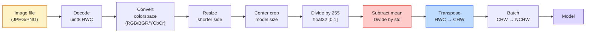
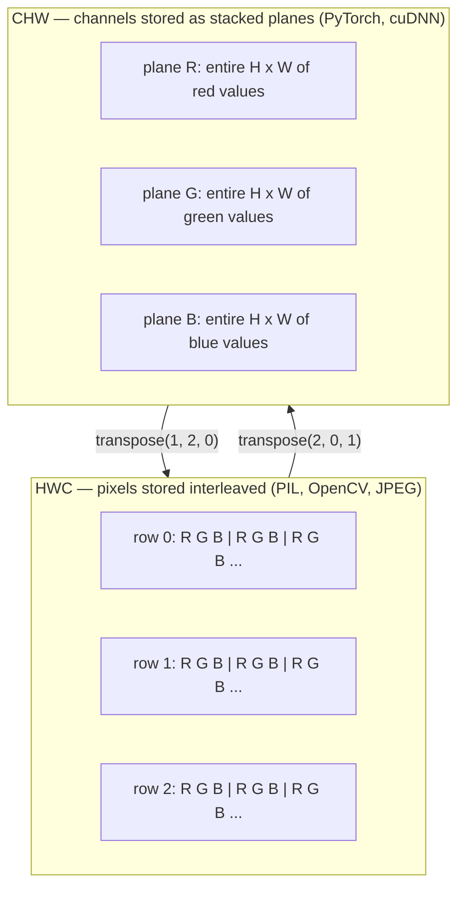
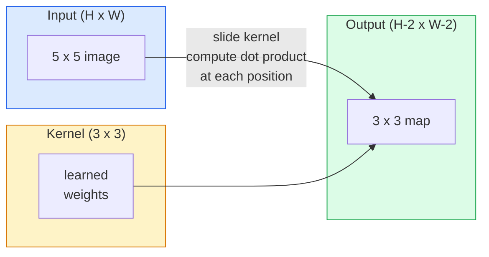
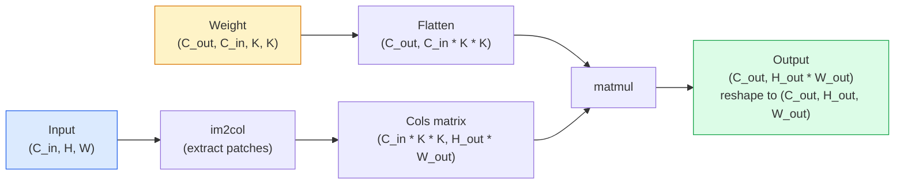
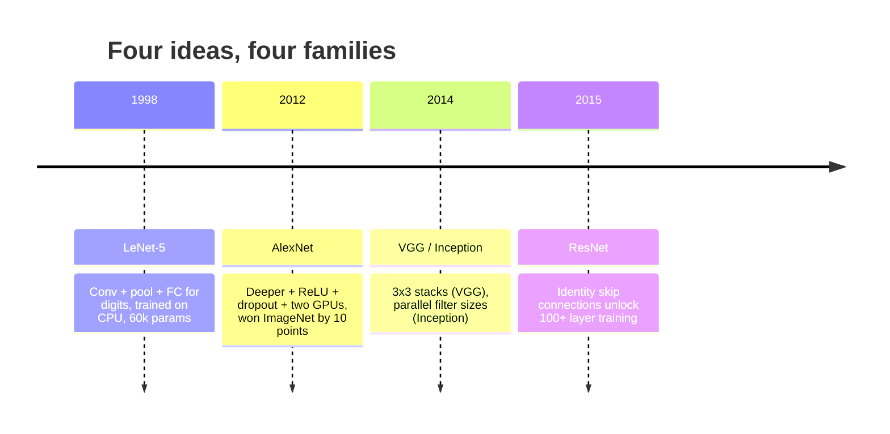
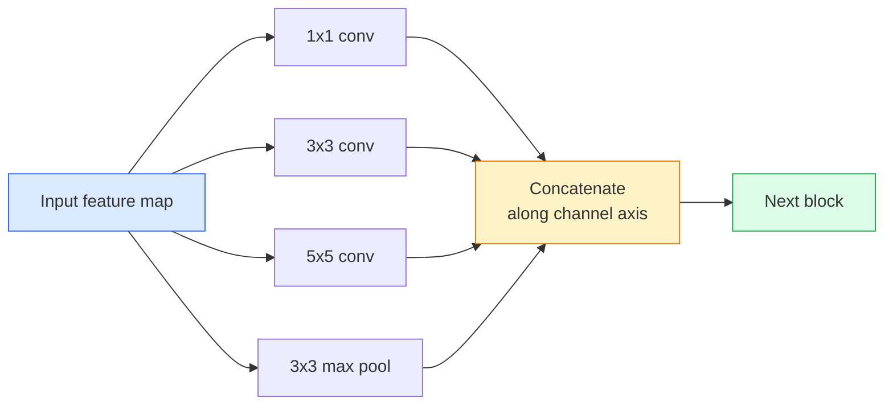
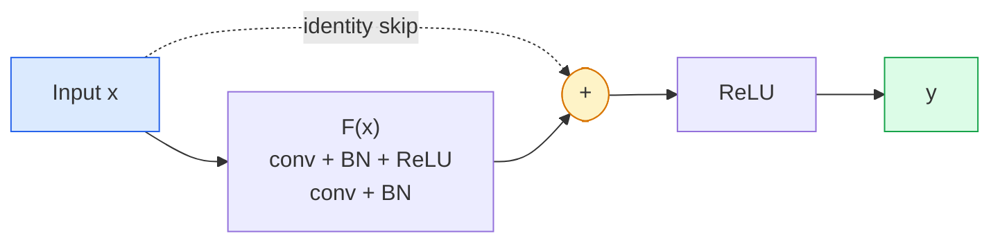
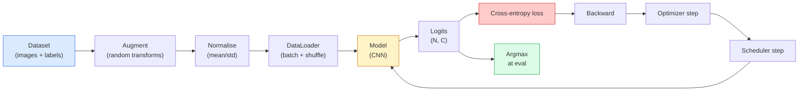
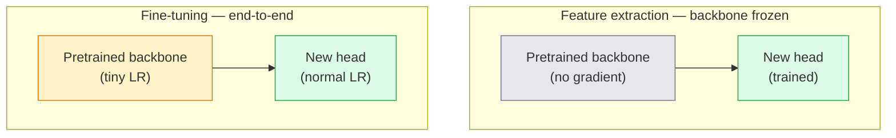
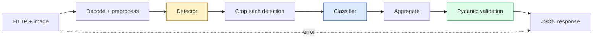

# CNNs, Classification, Transfer & Edge Vision

> Combined lessons (7 parts), merged verbatim — no content removed.

**Type:** Combined

---

## Part 1 (ch066): Image Fundamentals — Pixels, Channels, Color Spaces

> An image is a tensor of light samples. Every vision model you will ever use starts from this one fact.

**Type:** Build
**Languages:** Python
**Prerequisites:** Phase 1 Lesson 12 (Tensor Operations), Phase 3 Lesson 11 (Intro to PyTorch)
**Time:** ~45 minutes

## Learning Objectives

- Explain how a continuous scene gets discretized into pixels and why sampling/quantization decisions set the ceiling on every downstream model
- Read, slice, and inspect images as NumPy arrays and switch fluently between HWC and CHW layouts
- Convert between RGB, grayscale, HSV, and YCbCr and justify why each color space exists
- Apply pixel-level preprocessing (normalize, standardize, resize, channel-first) exactly as torchvision expects it

## The Problem

Every paper you will read, every pretrained weight you will download, every vision API you will call assumes a specific encoding of the input. Pass a `uint8` image where the model wants `float32` and it will still run — and silently produce garbage. Feed BGR to a network trained on RGB and accuracy collapses by ten points. Hand a model channels-last input when it expects channels-first and the first conv layer treats height as a feature channel. None of this throws an error. It just ruins your metrics and you spend a week hunting for a bug that lives in how you loaded the file.

A convolution is not complicated once you know what it is sliding over. The hard part is that "an image" means different things to a camera, a JPEG decoder, PIL, OpenCV, torchvision, and a CUDA kernel. Each stack has its own axis order, byte range, and channel convention. A vision engineer who cannot keep these straight ships broken pipelines.

This lesson fixes the foundation so the rest of the phase can build on it.

## The Concept

### The full preprocessing pipeline at a glance

Every production vision system is the same sequence of reversible transforms. Get one step wrong and the model sees a different input than it was trained on.



The two red and blue boxes are where 80% of silent failures live: missing standardization and wrong layout.

### A pixel is a sample, not a square

A camera sensor counts photons that land on a grid of tiny detectors. Each detector integrates light for a fraction of a second and emits a voltage proportional to how many photons hit it. The sensor then discretizes that voltage into an integer. One detector becomes one pixel.

```
Continuous scene                 Sensor grid                     Digital image
(infinite detail)                (H x W detectors)               (H x W integers)

    ~~~~~                        +--+--+--+--+--+                 210 198 180 155 120
   ~   ~   ~                     |  |  |  |  |  |                 205 195 178 152 118
  ~ light ~      ---->           +--+--+--+--+--+     ---->       200 190 175 150 115
   ~~~~~                         |  |  |  |  |  |                 195 185 170 148 112
                                 +--+--+--+--+--+                 188 180 165 145 108
```

Two choices happen at this step and they fix the ceiling on everything downstream:

- **Spatial sampling** decides how many detectors per degree of the scene. Too few, and edges become jagged (aliasing). Too many, and storage and compute explode.
- **Intensity quantization** decides how finely the voltage is bucketed. 8 bits gives 256 levels and is standard for display. 10, 12, 16 bits give smoother gradients and matter for medical imaging, HDR, and raw sensor pipelines.

A pixel is not a coloured square with area. It is a single measurement. When you resize or rotate, you are resampling that measurement grid.

### Why three channels

One detector counts photons across the whole visible spectrum — that is grayscale. To get colour, the sensor covers the grid with a mosaic of red, green, and blue filters. After demosaicing, every spatial location has three integers: the response of the red-filtered detector, green-filtered, and blue-filtered nearby. Those three integers are a pixel's RGB triplet.

```
One pixel in memory:

    (R, G, B) = (210, 140, 30)   <- reddish-orange

An H x W RGB image:

    shape (H, W, 3)     stored as   H rows of W pixels of 3 values
                                    each in [0, 255] for uint8
```

Three is not magic. Depth cameras add a Z channel. Satellites add infrared and ultraviolet bands. Medical scans often have one channel (X-ray, CT) or many (hyperspectral). The number of channels is the last axis; conv layers learn to mix across it.

### Two layout conventions: HWC and CHW

Same tensor, two orderings. Every library picks one.

```
HWC (height, width, channels)           CHW (channels, height, width)

   W ->                                    H ->
  +-----+-----+-----+                     +-----+-----+
H |R G B|R G B|R G B|                   C |R R R R R R|
| +-----+-----+-----+                   | +-----+-----+
v |R G B|R G B|R G B|                   v |G G G G G G|
  +-----+-----+-----+                     +-----+-----+
                                          |B B B B B B|
                                          +-----+-----+

   PIL, OpenCV, matplotlib,              PyTorch, most deep learning
   almost every image file on disk       frameworks, cuDNN kernels
```

CHW exists because convolution kernels slide across H and W. Keeping the channel axis first means each kernel sees a contiguous 2D plane per channel, which vectorizes cleanly. Disk formats keep HWC because that matches how scanlines come out of a sensor.

The one-line conversion you will type a thousand times:

```
img_chw = img_hwc.transpose(2, 0, 1)      # NumPy
img_chw = img_hwc.permute(2, 0, 1)        # PyTorch tensor
```

Memory layout, visualised:



### Byte ranges and dtype

Three conventions dominate:

| Convention | dtype | Range | Where you see it |
|------------|-------|-------|------------------|
| Raw | `uint8` | [0, 255] | Files on disk, PIL, OpenCV output |
| Normalized | `float32` | [0.0, 1.0] | After `img.astype('float32') / 255` |
| Standardized | `float32` | roughly [-2, +2] | After subtracting mean and dividing by std |

Convolutional networks were trained on standardized inputs. ImageNet stats `mean=[0.485, 0.456, 0.406]`, `std=[0.229, 0.224, 0.225]` are the arithmetic mean and standard deviation of the three channels over the full ImageNet training set, computed on [0, 1] normalized pixels. Feeding raw `uint8` into a model that expects standardized float is the single most common silent failure in applied vision.

### Color spaces and why they exist

RGB is the capture format but it is not always the most useful representation for a model.

```
 RGB               HSV                       YCbCr / YUV

 R red             H hue (angle 0-360)       Y luminance (brightness)
 G green           S saturation (0-1)        Cb chroma blue-yellow
 B blue            V value/brightness (0-1)  Cr chroma red-green

 Linear to         Separates color from      Separates brightness from
 sensor output     brightness. Useful for    color. JPEG and most video
                   color thresholding, UI    codecs compress the chroma
                   sliders, simple filters   channels harder because the
                                             human eye is less sensitive
                                             to chroma detail than to Y.
```

For most modern CNNs you feed RGB. You meet other spaces when:

- **HSV** — classical CV code, color-based segmentation, white-balancing.
- **YCbCr** — reading JPEG internals, video pipelines, super-resolution models that operate on Y only.
- **Grayscale** — OCR, document models, any case where color is nuisance variable rather than signal.

Grayscale from RGB is a weighted sum, not an average, because the human eye is more sensitive to green than to red or blue:

```
Y = 0.299 R + 0.587 G + 0.114 B       (ITU-R BT.601, the classic weights)
```

### Aspect ratio, resizing, and interpolation

Every model has a fixed input size (224x224 for most ImageNet classifiers, 384x384 or 512x512 for modern detectors). Your images rarely match. The three resize choices that matter:

- **Resize shorter side, then center crop** — the standard ImageNet recipe. Preserves aspect ratio, throws away a strip of edge pixels.
- **Resize and pad** — preserves aspect ratio and every pixel, adds black bars. Standard for detection and OCR.
- **Resize directly to target** — stretches the image. Cheap, distorts geometry, fine for many classification tasks.

The interpolation method decides how intermediate pixels are computed when the new grid does not align with the old one:

| Method | Characteristics |
|--------|----------------|
| Nearest neighbour | fastest, blocky, only choice for masks/labels |
| Bilinear | fast, smooth, default for most image resizing |
| Bicubic | slower, sharper on upscaling |
| Lanczos | slowest, best quality, used for final display |

Rule of thumb: bilinear for training, bicubic or lanczos for assets you will look at, nearest for anything containing integer class IDs.

## Build It

### Step 1: Load an image and inspect its shape

Use Pillow to load any JPEG or PNG, convert to NumPy, and print what you got. For a deterministic example that runs offline, synthesize one.

```python
import numpy as np
from PIL import Image

def synthetic_rgb(h=128, w=192, seed=0):
    rng = np.random.default_rng(seed)
    yy, xx = np.meshgrid(np.linspace(0, 1, h), np.linspace(0, 1, w), indexing="ij")
    r = (np.sin(xx * 6) * 0.5 + 0.5) * 255
    g = yy * 255
    b = (1 - yy) * xx * 255
    rgb = np.stack([r, g, b], axis=-1) + rng.normal(0, 6, (h, w, 3))
    return np.clip(rgb, 0, 255).astype(np.uint8)

arr = synthetic_rgb()
# Or load from disk:
# arr = np.asarray(Image.open("your_image.jpg").convert("RGB"))

print(f"type:   {type(arr).__name__}")
print(f"dtype:  {arr.dtype}")
print(f"shape:  {arr.shape}     # (H, W, C)")
print(f"min:    {arr.min()}")
print(f"max:    {arr.max()}")
print(f"pixel at (0, 0): {arr[0, 0]}")
```

Expected output: `shape: (H, W, 3)`, `dtype: uint8`, range `[0, 255]`.

### Step 2: Split channels and re-order layout

Pull out R, G, B separately, then convert from HWC to CHW for PyTorch.

```python
R = arr[:, :, 0]
G = arr[:, :, 1]
B = arr[:, :, 2]
print(f"R shape: {R.shape}, mean: {R.mean():.1f}")
print(f"G shape: {G.shape}, mean: {G.mean():.1f}")
print(f"B shape: {B.shape}, mean: {B.mean():.1f}")

arr_chw = arr.transpose(2, 0, 1)
print(f"\nHWC shape: {arr.shape}")
print(f"CHW shape: {arr_chw.shape}")
```

### Step 3: Grayscale and HSV conversions

```python
def rgb_to_grayscale(rgb):
    weights = np.array([0.299, 0.587, 0.114], dtype=np.float32)
    return (rgb.astype(np.float32) @ weights).astype(np.uint8)

def rgb_to_hsv(rgb):
    rgb_f = rgb.astype(np.float32) / 255.0
    r, g, b = rgb_f[..., 0], rgb_f[..., 1], rgb_f[..., 2]
    cmax = np.max(rgb_f, axis=-1)
    cmin = np.min(rgb_f, axis=-1)
    delta = cmax - cmin

    h = np.zeros_like(cmax)
    mask = delta > 0
    rmax = mask & (cmax == r)
    gmax = mask & (cmax == g)
    bmax = mask & (cmax == b)
    h[rmax] = ((g[rmax] - b[rmax]) / delta[rmax]) % 6
    h[gmax] = ((b[gmax] - r[gmax]) / delta[gmax]) + 2
    h[bmax] = ((r[bmax] - g[bmax]) / delta[bmax]) + 4
    h = h * 60.0

    s = np.where(cmax > 0, delta / cmax, 0)
    v = cmax
    return np.stack([h, s, v], axis=-1)

gray = rgb_to_grayscale(arr)
hsv = rgb_to_hsv(arr)
print(f"gray shape: {gray.shape}, range: [{gray.min()}, {gray.max()}]")
print(f"hsv   shape: {hsv.shape}")
print(f"hue range: [{hsv[..., 0].min():.1f}, {hsv[..., 0].max():.1f}] degrees")
print(f"sat range: [{hsv[..., 1].min():.2f}, {hsv[..., 1].max():.2f}]")
print(f"val range: [{hsv[..., 2].min():.2f}, {hsv[..., 2].max():.2f}]")
```

### Step 4: Normalize, standardize, and reverse it

```python
mean = np.array([0.485, 0.456, 0.406], dtype=np.float32)
std = np.array([0.229, 0.224, 0.225], dtype=np.float32)

def preprocess_imagenet(rgb_uint8):
    x = rgb_uint8.astype(np.float32) / 255.0
    x = (x - mean) / std
    x = x.transpose(2, 0, 1)
    return x

def deprocess_imagenet(chw_float32):
    x = chw_float32.transpose(1, 2, 0)
    x = x * std + mean
    x = np.clip(x * 255.0, 0, 255).astype(np.uint8)
    return x

x = preprocess_imagenet(arr)
print(f"preprocessed shape: {x.shape}     # (C, H, W)")
print(f"preprocessed dtype: {x.dtype}")
print(f"preprocessed mean per channel:  {x.mean(axis=(1, 2)).round(3)}")
print(f"preprocessed std  per channel:  {x.std(axis=(1, 2)).round(3)}")

roundtrip = deprocess_imagenet(x)
max_diff = np.abs(roundtrip.astype(int) - arr.astype(int)).max()
print(f"roundtrip max pixel diff: {max_diff}    # should be 0 or 1")
```

### Step 5: Resize with three interpolation methods

```python
target = (arr.shape[0] * 3, arr.shape[1] * 3)

nearest = np.asarray(Image.fromarray(arr).resize(target[::-1], Image.NEAREST))
bilinear = np.asarray(Image.fromarray(arr).resize(target[::-1], Image.BILINEAR))
bicubic = np.asarray(Image.fromarray(arr).resize(target[::-1], Image.BICUBIC))

def local_roughness(x):
    gy = np.diff(x.astype(float), axis=0)
    gx = np.diff(x.astype(float), axis=1)
    return float(np.abs(gy).mean() + np.abs(gx).mean())

for name, out in [("nearest", nearest), ("bilinear", bilinear), ("bicubic", bicubic)]:
    print(f"{name:>8}  shape={out.shape}  roughness={local_roughness(out):6.2f}")
```

## Use It

`torchvision.transforms` bundles everything above into a single composable pipeline.

```python
import torch
from torchvision import transforms
from PIL import Image

img = Image.fromarray(synthetic_rgb(256, 256))

pipeline = transforms.Compose([
    transforms.Resize(256),
    transforms.CenterCrop(224),
    transforms.ToTensor(),
    transforms.Normalize(mean=[0.485, 0.456, 0.406], std=[0.229, 0.224, 0.225]),
])

x = pipeline(img)
print(f"tensor type:  {type(x).__name__}")
print(f"tensor dtype: {x.dtype}")
print(f"tensor shape: {tuple(x.shape)}      # (C, H, W)")
print(f"per-channel mean: {x.mean(dim=(1, 2)).tolist()}")
print(f"per-channel std:  {x.std(dim=(1, 2)).tolist()}")

batch = x.unsqueeze(0)
print(f"\nbatched shape: {tuple(batch.shape)}   # (N, C, H, W) — ready for a model")
```

Four steps, in this exact order: `Resize(256)` scales the shorter side to 256; `CenterCrop(224)` takes a 224x224 patch from the middle; `ToTensor()` divides by 255 and swaps HWC to CHW; `Normalize` subtracts the ImageNet mean and divides by std. Reversing that order silently changes what reaches the model.

## Ship It

This lesson produces:

- `outputs/prompt-vision-preprocessing-audit.md` — a prompt that turns any model card or dataset card into a checklist of the exact preprocessing invariants a team must honour.
- `outputs/skill-image-tensor-inspector.md` — a skill that, given any image-shaped tensor or array, reports dtype, layout, range, and whether it looks raw, normalized, or standardized.

## Exercises

1. **(Easy)** Load a JPEG with OpenCV (`cv2.imread`) and with Pillow. Print both shapes and the pixel at `(0, 0)`. Explain the channel-order difference, then write a one-line conversion that makes the OpenCV array identical to the Pillow one.
2. **(Medium)** Write `standardize(img, mean, std)` and its inverse that together pass a `roundtrip_max_diff <= 1` test on any uint8 image. Your functions must work on a single image in HWC and on a batch in NCHW with the same call.
3. **(Hard)** Take a 3-channel ImageNet-standardized tensor and run it through a 1x1 conv that learns a weighted mixture of RGB into a single grayscale channel. Initialize the weights to `[0.299, 0.587, 0.114]`, freeze them, and verify the output matches your manual `rgb_to_grayscale` to within floating-point error.

## Key Terms

| Term | What people say | What it actually means |
|------|----------------|----------------------|
| Pixel | "A coloured square" | One sample of light intensity at one grid location — three numbers for colour, one for grayscale |
| Channel | "The colour" | One of the parallel spatial grids stacked into an image tensor; last axis in HWC, first in CHW |
| HWC / CHW | "The shape" | Axis orderings for an image tensor; disk and PIL use HWC, PyTorch and cuDNN use CHW |
| Normalize | "Scale the image" | Divide by 255 so pixels live in [0, 1] |
| Standardize | "Zero-center" | Subtract mean and divide by std per channel so the input distribution matches what the model was trained on |
| Grayscale conversion | "Average the channels" | A weighted sum with coefficients 0.299/0.587/0.114 that matches human luminance perception |
| Interpolation | "How resize picks pixels" | The rule that decides output values when the new grid does not align with the old one |
| Aspect ratio | "Width over height" | The ratio that distinguishes "resize and pad" from "resize and stretch" |

## Further Reading

- [Charles Poynton — A Guided Tour of Color Space](https://poynton.ca/PDFs/Guided_tour.pdf)
- [PyTorch Vision Transforms Docs](https://pytorch.org/vision/stable/transforms.html)
- [How JPEG Works (Colt McAnlis)](https://www.youtube.com/watch?v=F1kYBnY6mwg)
- [ImageNet Preprocessing Conventions (torchvision models)](https://pytorch.org/vision/stable/models.html)

[Reference](https://github.com/rohitg00/ai-engineering-from-scratch/tree/main/phases/04-computer-vision/01-image-fundamentals)

---

## Part 2 (ch067): Convolutions from Scratch

> A convolution is a tiny dense layer you slide across an image, sharing the same weights at every location.

**Type:** Build
**Languages:** Python
**Prerequisites:** Phase 3 (Deep Learning Core), Phase 4 Lesson 01 (Image Fundamentals)
**Time:** ~75 minutes

## Learning Objectives

- Implement 2D convolution from scratch using only NumPy, including the nested-loop version and a vectorised `im2col` version
- Compute output spatial size for any combination of input size, kernel size, padding, and stride, and justify the `(H - K + 2P) / S + 1` formula
- Hand-design kernels (edge, blur, sharpen, Sobel) and explain why each one produces the pattern of activations it does
- Stack convolutions into a feature extractor and connect the depth-of-the-stack to the size of the receptive field

## The Problem

A fully connected layer on a 224x224 RGB image would need 224 * 224 * 3 = 150,528 input weights per neuron. A single hidden layer with 1,000 units is already 150 million parameters. Worse, that layer has no notion that a dog in the top-left and a dog in the bottom-right are the same pattern. It treats every pixel position as independent, which is exactly wrong for images: translating a cat by three pixels should not force the network to relearn the concept.

The two properties an image model needs are **translation equivariance** (the output shifts when the input shifts) and **parameter sharing** (the same feature detector runs everywhere). Dense layers give you neither. Convolution gives you both for free.

Convolution was not invented for deep learning. It is the same operation that powers JPEG compression, Gaussian blur in Photoshop, edge detection in industrial vision, and every audio filter ever shipped. The reason CNNs dominated ImageNet from 2012 to 2020 is that convolution is the correct prior for data where nearby values are related and the same pattern can appear anywhere.

## The Concept

### One kernel, sliding

A 2D convolution takes a small weight matrix called the kernel (or filter), slides it across the input, and at each location computes the sum of element-wise products. That sum becomes one output pixel.



A concrete 3x3 example on a 5x5 input (no padding, stride 1):

```
Input X (5 x 5):                Kernel W (3 x 3):

  1  2  0  1  2                   1  0 -1
  0  1  3  1  0                   2  0 -2
  2  1  0  2  1                   1  0 -1
  1  0  2  1  3
  2  1  1  0  1

The kernel slides across every valid 3 x 3 window. Output Y is 3 x 3:

 Y[0,0] = sum( W * X[0:3, 0:3] )
 Y[0,1] = sum( W * X[0:3, 1:4] )
 Y[0,2] = sum( W * X[0:3, 2:5] )
 Y[1,0] = sum( W * X[1:4, 0:3] )
 ... and so on
```

That one formula — **shared weights, locality, sliding window** — is the entire idea.

### Output size formula

Given input spatial size `H`, kernel size `K`, padding `P`, stride `S`:

```
H_out = floor( (H - K + 2P) / S ) + 1
```

| Scenario | H | K | P | S | H_out |
|----------|---|---|---|---|-------|
| Valid conv, no padding | 32 | 3 | 0 | 1 | 30 |
| Same conv (preserves size) | 32 | 3 | 1 | 1 | 32 |
| Downsample by 2 | 32 | 3 | 1 | 2 | 16 |
| Pool 2x2 | 32 | 2 | 0 | 2 | 16 |
| Large receptive field | 32 | 7 | 3 | 2 | 16 |

"Same padding" means pick P so that H_out == H when S == 1. For odd K, that is P = (K - 1) / 2.

### Padding

Without padding, every convolution shrinks the feature map. Stack 20 of them and your 224x224 image becomes 184x184.

```
Zero padding (P = 1) on a 5 x 5 input:

  0  0  0  0  0  0  0
  0  1  2  0  1  2  0
  0  0  1  3  1  0  0
  0  2  1  0  2  1  0       Now the kernel can centre on pixel
  0  1  0  2  1  3  0       (0, 0) and still have three rows and
  0  2  1  1  0  1  0       three columns of values to multiply.
  0  0  0  0  0  0  0
```

Modes you meet in practice: `zero` (most common), `reflect` (mirror the edge, avoids hard borders in generative models), `replicate` (copy the edge), `circular` (wrap around).

### Stride

Stride is the step size of the slide. `stride=1` is the default. `stride=2` halves the spatial dimensions and is the classic way to downsample inside a CNN without a separate pooling layer.

```
Stride 1 on a 5 x 5 input, 3 x 3 kernel:

  starts: (0,0) (0,1) (0,2)        -> output row 0
          (1,0) (1,1) (1,2)        -> output row 1
          (2,0) (2,1) (2,2)        -> output row 2

  Output: 3 x 3

Stride 2 on the same input:

  starts: (0,0) (0,2)              -> output row 0
          (2,0) (2,2)              -> output row 1

  Output: 2 x 2
```

### Multiple input channels

Real images have three channels. A 3x3 convolution on an RGB input is actually a 3x3x3 volume: one 3x3 slice per input channel.

```
Input:   (C_in,  H,  W)        3 x 5 x 5
Kernel:  (C_in,  K,  K)        3 x 3 x 3 (one kernel)
Output:  (1,     H', W')       2D map

For a layer that produces C_out output channels, you stack C_out kernels:

Weight:  (C_out, C_in, K, K)   e.g. 64 x 3 x 3 x 3
Output:  (C_out, H', W')       64 x 3 x 3

Parameter count: C_out * C_in * K * K + C_out
```

### The im2col trick

Nested loops are easy to read but slow. GPUs want big matrix multiplies. The trick: flatten every receptive-field window of the input into one column of a big matrix, flatten the kernel into a row, and the whole convolution becomes a single matmul.



Every production conv implementation is some variant of this plus cache-tiling tricks.

### Receptive field

A single 3x3 conv looks at 9 input pixels. Stack two 3x3 convs and a neuron in the second layer looks at 5x5 input pixels. Three 3x3 convs give 7x7. In general:

```
RF after L stacked K x K convs (stride 1) = 1 + L * (K - 1)

With strides:   RF grows multiplicatively with stride along each layer.
```

The entire reason "3x3 all the way down" works (VGG, ResNet, ConvNeXt) is that two 3x3 convs see the same input area as one 5x5 conv but with fewer parameters and an extra non-linearity in between.

## Build It

### Step 1: Pad an array

```python
import numpy as np

def pad2d(x, p):
    if p == 0:
        return x
    h, w = x.shape[-2:]
    out = np.zeros(x.shape[:-2] + (h + 2 * p, w + 2 * p), dtype=x.dtype)
    out[..., p:p + h, p:p + w] = x
    return out

x = np.arange(9).reshape(3, 3)
print(x)
print()
print(pad2d(x, 1))
```

### Step 2: 2D convolution with nested loops

```python
def conv2d_naive(x, w, b=None, stride=1, padding=0):
    c_in, h, w_in = x.shape
    c_out, c_in_w, kh, kw = w.shape
    assert c_in == c_in_w

    x_pad = pad2d(x, padding)
    h_out = (h + 2 * padding - kh) // stride + 1
    w_out = (w_in + 2 * padding - kw) // stride + 1

    out = np.zeros((c_out, h_out, w_out), dtype=np.float32)
    for oc in range(c_out):
        for i in range(h_out):
            for j in range(w_out):
                hs = i * stride
                ws = j * stride
                patch = x_pad[:, hs:hs + kh, ws:ws + kw]
                out[oc, i, j] = np.sum(patch * w[oc])
        if b is not None:
            out[oc] += b[oc]
    return out
```

### Step 3: Verify with a hand-designed kernel

```python
def synthetic_step_image():
    img = np.zeros((1, 16, 16), dtype=np.float32)
    img[:, :, 8:] = 1.0
    return img

sobel_x = np.array([
    [[-1, 0, 1],
     [-2, 0, 2],
     [-1, 0, 1]]
], dtype=np.float32)[None]

x = synthetic_step_image()
y = conv2d_naive(x, sobel_x, padding=1)
print(y[0].round(1))
```

### Step 4: im2col

```python
def im2col(x, kh, kw, stride=1, padding=0):
    c_in, h, w = x.shape
    x_pad = pad2d(x, padding)
    h_out = (h + 2 * padding - kh) // stride + 1
    w_out = (w + 2 * padding - kw) // stride + 1

    cols = np.zeros((c_in * kh * kw, h_out * w_out), dtype=x.dtype)
    col = 0
    for i in range(h_out):
        for j in range(w_out):
            hs = i * stride
            ws = j * stride
            patch = x_pad[:, hs:hs + kh, ws:ws + kw]
            cols[:, col] = patch.reshape(-1)
            col += 1
    return cols, h_out, w_out
```

### Step 5: Fast conv via im2col + matmul

```python
def conv2d_im2col(x, w, b=None, stride=1, padding=0):
    c_out, c_in, kh, kw = w.shape
    cols, h_out, w_out = im2col(x, kh, kw, stride, padding)
    w_flat = w.reshape(c_out, -1)
    out = w_flat @ cols
    if b is not None:
        out += b[:, None]
    return out.reshape(c_out, h_out, w_out)

rng = np.random.default_rng(0)
x = rng.normal(0, 1, (3, 16, 16)).astype(np.float32)
w = rng.normal(0, 1, (8, 3, 3, 3)).astype(np.float32)
b = rng.normal(0, 1, (8,)).astype(np.float32)

y_naive = conv2d_naive(x, w, b, padding=1)
y_im2col = conv2d_im2col(x, w, b, padding=1)

print(f"max abs diff: {np.max(np.abs(y_naive - y_im2col)):.2e}")
```

### Step 6: A bank of hand-designed kernels

```python
KERNELS = {
    "identity": np.array([[0, 0, 0], [0, 1, 0], [0, 0, 0]], dtype=np.float32),
    "blur_3x3": np.ones((3, 3), dtype=np.float32) / 9.0,
    "sharpen": np.array([[0, -1, 0], [-1, 5, -1], [0, -1, 0]], dtype=np.float32),
    "sobel_x": np.array([[-1, 0, 1], [-2, 0, 2], [-1, 0, 1]], dtype=np.float32),
    "sobel_y": np.array([[-1, -2, -1], [0, 0, 0], [1, 2, 1]], dtype=np.float32),
}

def apply_kernel(img2d, kernel):
    x = img2d[None].astype(np.float32)
    w = kernel[None, None]
    return conv2d_im2col(x, w, padding=1)[0]
```

## Use It

PyTorch's `nn.Conv2d` wraps the same operation with autograd, CUDA kernels, and cuDNN optimisation.

```python
import torch
import torch.nn as nn

conv = nn.Conv2d(in_channels=3, out_channels=64, kernel_size=3, stride=1, padding=1)
print(f"weight shape: {tuple(conv.weight.shape)}")
print(f"bias shape:   {tuple(conv.bias.shape)}")
print(f"param count:  {sum(p.numel() for p in conv.parameters())}")

x = torch.randn(8, 3, 224, 224)
y = conv(x)
print(f"input  shape: {tuple(x.shape)}")
print(f"output shape: {tuple(y.shape)}")
```

## Ship It

This lesson produces:

- `outputs/prompt-cnn-architect.md` — a prompt that, given input size, parameter budget, and target receptive field, designs a stack of `Conv2d` layers.
- `outputs/skill-conv-shape-calculator.md` — a skill that walks a network spec layer by layer and returns the output shape, receptive field, and parameter count.

## Exercises

1. **(Easy)** Given a 128x128 grayscale input and a stack of `[Conv3x3(s=1,p=1), Conv3x3(s=2,p=1), Conv3x3(s=1,p=1), Conv3x3(s=2,p=1)]`, compute the output spatial size and the receptive field at each layer by hand. Verify with a PyTorch `nn.Sequential`.
2. **(Medium)** Extend `conv2d_naive` and `conv2d_im2col` to accept a `groups` argument. Show that `groups=C_in=C_out` reproduces a depthwise convolution.
3. **(Hard)** Implement the backward pass of `conv2d_im2col` by hand: given the gradient of the output, compute the gradient of `x` and `w`. Verify against `torch.autograd.grad`.

## Key Terms

| Term | What people say | What it actually means |
|------|----------------|----------------------|
| Convolution | "Sliding a filter" | A learnable dot product applied at every spatial location with shared weights |
| Kernel / filter | "The feature detector" | A small weight tensor of shape (C_in, K, K) |
| Stride | "How far you jump" | The step size between consecutive kernel placements |
| Padding | "Zeros on the edges" | Extra values added around the input so the kernel can centre on border pixels |
| Receptive field | "How much the neuron sees" | The patch of original input that a given output activation depends on |
| im2col | "The GEMM trick" | Rearranging every receptive window into columns so convolution becomes one big matrix multiply |
| Depthwise conv | "One kernel per channel" | A conv with `groups == C_in` |
| Translation equivariance | "Shift in, shift out" | Property that shifting the input shifts the output by the same amount |

## Further Reading

- [A guide to convolution arithmetic for deep learning (Dumoulin & Visin, 2016)](https://arxiv.org/abs/1603.07285)
- [CS231n: Convolutional Neural Networks for Visual Recognition](https://cs231n.github.io/convolutional-networks/)
- [The Annotated ConvNet (fast.ai)](https://nbviewer.org/github/fastai/fastbook/blob/master/13_convolutions.ipynb)
- [Receptive Field Arithmetic for CNNs (Dang Ha The Hien)](https://distill.pub/2019/computing-receptive-fields/)

[Reference](https://github.com/rohitg00/ai-engineering-from-scratch/tree/main/phases/04-computer-vision/02-convolutions-from-scratch)

---

## Part 3 (ch068): CNNs — LeNet to ResNet

> Every major CNN of the last thirty years is the same conv–nonlinearity–downsample recipe with one new idea bolted on. Learn the ideas in order.

**Type:** Learn + Build
**Languages:** Python
**Prerequisites:** Phase 3 Lesson 11 (PyTorch), Phase 4 Lesson 01 (Image Fundamentals), Phase 4 Lesson 02 (Convolutions from Scratch)
**Time:** ~75 minutes

## Learning Objectives

- Trace the architectural lineage LeNet-5 -> AlexNet -> VGG -> Inception -> ResNet and state the single new idea each family contributed
- Implement LeNet-5, a VGG-style block, and a ResNet BasicBlock in PyTorch, each under 40 lines
- Explain why residual connections turn a 1,000-layer network from untrainable into state-of-the-art
- Read a modern backbone (ResNet-18, ResNet-50) and predict its output shape, receptive field, and parameter count before looking at the source

## The Problem

In 2011, the best ImageNet classifier scored around 74% top-5 accuracy. In 2012 AlexNet scored 85%. In 2015 ResNet scored 96%. No new data. No new GPU generation. The gains came from architecture ideas. A working vision engineer has to know which idea came from which paper because every production backbone you ship in 2026 is a recombination of those same pieces.

## The Concept

### The four ideas that changed vision



### LeNet-5 (1998)

Yann LeCun's digit recogniser. 60,000 parameters. Two conv-pool blocks, two fully connected layers, tanh activations.

```
input (1, 32, 32)
  conv 5x5 -> (6, 28, 28)
  avg pool 2x2 -> (6, 14, 14)
  conv 5x5 -> (16, 10, 10)
  avg pool 2x2 -> (16, 5, 5)
  flatten -> 400
  dense -> 120
  dense -> 84
  dense -> 10
```

### AlexNet (2012)

Three changes that together broke ImageNet:
1. **ReLU** instead of tanh — gradients stop vanishing, training speeds up 6x.
2. **Dropout** in the fully connected head.
3. **Depth and width** — five conv layers, three dense layers, 60M parameters, trained on two GPUs.

### VGG (2014)

VGG asked: what happens if you only use 3x3 convolutions and you go deep?

```
stack:   conv 3x3 -> conv 3x3 -> pool 2x2
repeat:  16 or 19 conv layers
```

Two 3x3 convs see the same 5x5 input area as one 5x5 conv but with fewer parameters and an extra ReLU. Cost: 138M parameters.

### Inception (2014)

Google's answer to "what kernel size should I use?" was: all of them, in parallel.



### The degradation problem

By 2015, VGG-19 worked and VGG-32 did not. Depth was supposed to help, but past ~20 layers both training and test loss got worse. That is not overfitting — it is the optimiser failing because gradients shrink multiplicatively through every layer.

```
Plain deep network:
  y = f_L( f_{L-1}( ... f_1(x) ... ) )

Gradient wrt early layer:
  dL/dW_1 = dL/dy * df_L/df_{L-1} * ... * df_2/df_1 * df_1/dW_1
```

### ResNet (2015)

He, Zhang, Ren, Sun proposed one change that fixed everything:

```
standard block:   y = F(x)
residual block:   y = F(x) + x
```

The `+ x` means the layer can always choose to do nothing by driving `F(x)` to zero.



Two variants:
- **BasicBlock** (ResNet-18, ResNet-34): two 3x3 convs, skip around both.
- **Bottleneck** (ResNet-50, -101, -152): 1x1 down, 3x3 middle, 1x1 up, skip around the trio.

### Why residuals matter beyond vision

The idea was about turning deep networks from "cross-your-fingers and hope gradients survive" into a reliable, scalable engineering tool. Every transformer you will read about next phase has the exact same skip connection in every block. Without ResNet, there is no GPT.

## Build It

### Step 1: LeNet-5

```python
import torch
import torch.nn as nn
import torch.nn.functional as F

class LeNet5(nn.Module):
    def __init__(self, num_classes=10):
        super().__init__()
        self.conv1 = nn.Conv2d(1, 6, kernel_size=5)
        self.conv2 = nn.Conv2d(6, 16, kernel_size=5)
        self.pool = nn.AvgPool2d(2)
        self.fc1 = nn.Linear(16 * 5 * 5, 120)
        self.fc2 = nn.Linear(120, 84)
        self.fc3 = nn.Linear(84, num_classes)

    def forward(self, x):
        x = self.pool(torch.tanh(self.conv1(x)))
        x = self.pool(torch.tanh(self.conv2(x)))
        x = torch.flatten(x, 1)
        x = torch.tanh(self.fc1(x))
        x = torch.tanh(self.fc2(x))
        return self.fc3(x)

net = LeNet5()
x = torch.randn(1, 1, 32, 32)
print(f"output: {net(x).shape}")
print(f"params: {sum(p.numel() for p in net.parameters()):,}")
```

### Step 2: A VGG block

```python
class VGGBlock(nn.Module):
    def __init__(self, in_c, out_c):
        super().__init__()
        self.conv1 = nn.Conv2d(in_c, out_c, kernel_size=3, padding=1)
        self.bn1 = nn.BatchNorm2d(out_c)
        self.conv2 = nn.Conv2d(out_c, out_c, kernel_size=3, padding=1)
        self.bn2 = nn.BatchNorm2d(out_c)
        self.pool = nn.MaxPool2d(2)

    def forward(self, x):
        x = F.relu(self.bn1(self.conv1(x)))
        x = F.relu(self.bn2(self.conv2(x)))
        return self.pool(x)

class MiniVGG(nn.Module):
    def __init__(self, num_classes=10):
        super().__init__()
        self.stack = nn.Sequential(
            VGGBlock(3, 32),
            VGGBlock(32, 64),
            VGGBlock(64, 128),
        )
        self.head = nn.Sequential(
            nn.AdaptiveAvgPool2d(1),
            nn.Flatten(),
            nn.Linear(128, num_classes),
        )

    def forward(self, x):
        return self.head(self.stack(x))

net = MiniVGG()
x = torch.randn(1, 3, 32, 32)
print(f"output: {net(x).shape}")
print(f"params: {sum(p.numel() for p in net.parameters()):,}")
```

### Step 3: A ResNet BasicBlock

```python
class BasicBlock(nn.Module):
    def __init__(self, in_c, out_c, stride=1):
        super().__init__()
        self.conv1 = nn.Conv2d(in_c, out_c, kernel_size=3, stride=stride, padding=1, bias=False)
        self.bn1 = nn.BatchNorm2d(out_c)
        self.conv2 = nn.Conv2d(out_c, out_c, kernel_size=3, stride=1, padding=1, bias=False)
        self.bn2 = nn.BatchNorm2d(out_c)
        if stride != 1 or in_c != out_c:
            self.shortcut = nn.Sequential(
                nn.Conv2d(in_c, out_c, kernel_size=1, stride=stride, bias=False),
                nn.BatchNorm2d(out_c),
            )
        else:
            self.shortcut = nn.Identity()

    def forward(self, x):
        out = F.relu(self.bn1(self.conv1(x)))
        out = self.bn2(self.conv2(out))
        out = out + self.shortcut(x)
        return F.relu(out)
```

### Step 4: A tiny ResNet

```python
class TinyResNet(nn.Module):
    def __init__(self, num_classes=10):
        super().__init__()
        self.stem = nn.Sequential(
            nn.Conv2d(3, 32, kernel_size=3, stride=1, padding=1, bias=False),
            nn.BatchNorm2d(32),
            nn.ReLU(inplace=True),
        )
        self.layer1 = self._make_group(32, 32, num_blocks=2, stride=1)
        self.layer2 = self._make_group(32, 64, num_blocks=2, stride=2)
        self.layer3 = self._make_group(64, 128, num_blocks=2, stride=2)
        self.layer4 = self._make_group(128, 256, num_blocks=2, stride=2)
        self.head = nn.Sequential(
            nn.AdaptiveAvgPool2d(1),
            nn.Flatten(),
            nn.Linear(256, num_classes),
        )

    def _make_group(self, in_c, out_c, num_blocks, stride):
        blocks = [BasicBlock(in_c, out_c, stride=stride)]
        for _ in range(num_blocks - 1):
            blocks.append(BasicBlock(out_c, out_c, stride=1))
        return nn.Sequential(*blocks)

    def forward(self, x):
        x = self.stem(x)
        x = self.layer1(x)
        x = self.layer2(x)
        x = self.layer3(x)
        x = self.layer4(x)
        return self.head(x)

net = TinyResNet()
x = torch.randn(1, 3, 32, 32)
print(f"output: {net(x).shape}")
print(f"params: {sum(p.numel() for p in net.parameters()):,}")
```

### Step 5: Compare parameter-to-feature efficiency

```python
def summary(name, net, x):
    y = net(x)
    params = sum(p.numel() for p in net.parameters())
    print(f"{name:12s}  input {tuple(x.shape)} -> output {tuple(y.shape)}  params {params:>10,}")

x = torch.randn(1, 3, 32, 32)
summary("LeNet5",     LeNet5(),       torch.randn(1, 1, 32, 32))
summary("MiniVGG",    MiniVGG(),      x)
summary("TinyResNet", TinyResNet(),   x)
```

## Use It

`torchvision.models` gives you pretrained versions of all of the above.

```python
from torchvision.models import resnet18, ResNet18_Weights, vgg16, VGG16_Weights

r18 = resnet18(weights=ResNet18_Weights.IMAGENET1K_V1)
r18.eval()
print(f"ResNet-18 params: {sum(p.numel() for p in r18.parameters()):,}")

v16 = vgg16(weights=VGG16_Weights.IMAGENET1K_V1)
v16.eval()
print(f"VGG-16   params: {sum(p.numel() for p in v16.parameters()):,}")
```

For transfer learning:

```python
for p in r18.parameters():
    p.requires_grad = False
r18.fc = nn.Linear(r18.fc.in_features, 10)
```

## Ship It

This lesson produces:

- `outputs/prompt-backbone-selector.md` — a prompt that picks the right CNN family given task, dataset size, and compute budget.
- `outputs/skill-residual-block-reviewer.md` — a skill that reads a PyTorch module and flags skip-connection mistakes.

## Exercises

1. **(Easy)** Count parameters by hand for `TinyResNet` layer by layer.
2. **(Medium)** Implement the Bottleneck block and build a ResNet-50-style network for CIFAR.
3. **(Hard)** Remove the skip connection from `BasicBlock`, train a 34-block "plain" network and a 34-block ResNet on CIFAR-10 for 10 epochs each. Reproduce the He et al. Figure 1 result.

## Key Terms

| Term | What people say | What it actually means |
|------|----------------|----------------------|
| Backbone | "The model" | The stack of convolutional blocks producing the feature map |
| Residual connection | "Skip connection" | `y = F(x) + x`; makes arbitrary depth trainable |
| BasicBlock | "Two 3x3 convs with a skip" | The ResNet-18/34 building block |
| Bottleneck | "1x1 down, 3x3, 1x1 up" | The ResNet-50/101/152 block |
| Degradation problem | "Deeper is worse" | Past ~20 plain conv layers, both training and test error increase |
| Stem | "The first layer" | Initial conv that converts 3-channel input into the base feature width |
| Head | "The classifier" | Adaptive pool, flatten, linear(s) after the backbone |
| Transfer learning | "Pretrained weights" | Loading a backbone trained on ImageNet and fine-tuning only the head |

## Further Reading

- [Deep Residual Learning for Image Recognition (He et al., 2015)](https://arxiv.org/abs/1512.03385)
- [Very Deep Convolutional Networks (Simonyan & Zisserman, 2014)](https://arxiv.org/abs/1409.1556)
- [ImageNet Classification with Deep CNNs (Krizhevsky et al., 2012)](https://papers.nips.cc/paper_files/paper/2012/hash/c399862d3b9d6b76c8436e924a68c45b-Abstract.html)
- [Going Deeper with Convolutions (Szegedy et al., 2014)](https://arxiv.org/abs/1409.4842)

[Reference](https://github.com/rohitg00/ai-engineering-from-scratch/tree/main/phases/04-computer-vision/03-cnns-lenet-to-resnet)

---

## Part 4 (ch069): Image Classification

> A classifier is a function from pixels to a probability distribution over classes. Everything else is plumbing.

**Type:** Build
**Languages:** Python
**Prerequisites:** Phase 2 Lesson 09 (Model Evaluation), Phase 3 Lesson 10 (Mini Framework), Phase 4 Lesson 03 (CNNs)
**Time:** ~75 minutes

## Learning Objectives

- Build an end-to-end image classification pipeline on CIFAR-10: dataset, augmentation, model, training loop, evaluation
- Explain the role of each component and predict how breaking any one of them manifests in the loss curve
- Implement mixup, cutout, and label smoothing from scratch and justify when each is worth adding
- Read a confusion matrix and a per-class precision/recall table to diagnose dataset and model failures beyond aggregate accuracy

## The Problem

Every vision task that ships reduces to image classification at some level. Detection classifies regions. Segmentation classifies pixels. Retrieval ranks by similarity to class centroids. Getting classification right is the skill that transfers to every other task.

Most classification bugs are not in the model. They live in the pipeline: a broken normalisation, an unshuffled training set, augmentation that distorts labels, a validation split contaminated by training data, a learning rate that silently diverges after epoch 30.

## The Concept

### The classification pipeline



### Cross-entropy, logits, and softmax

A classifier produces `C` numbers per image called logits. Applying softmax converts them into a probability distribution:

```
softmax(z)_i = exp(z_i) / sum_j exp(z_j)
```

Cross-entropy measures the negative log probability of the correct class:

```
CE(z, y) = -log( softmax(z)_y )
         = -z_y + log( sum_j exp(z_j) )
```

PyTorch's `nn.CrossEntropyLoss` fuses softmax + NLL in one op and takes raw logits directly.

### Why augmentation works

A CNN has inductive bias for translation but no built-in invariance to crops, flips, colour jitter, or occlusion. The only way to teach it those invariances is to show it pixels that exercise them.

```
Original crop:  "dog facing left"
Flip:           "dog facing right"
Rotate(+15):    "dog, slight tilt"
Colour jitter:  "dog in warmer light"
RandomErasing:  "dog with patch missing"
```

### Mixup and cutmix

```
Mixup:
  lambda ~ Beta(a, a)
  x = lambda * x_i + (1 - lambda) * x_j
  y = lambda * y_i + (1 - lambda) * y_j

Cutmix:
  paste a random rectangle of x_j into x_i
  y = area-weighted mix of y_i and y_j
```

### Label smoothing

Instead of training against `[0, 0, 1, 0, 0]`, train against `[eps/C, eps/C, 1-eps, eps/C, eps/C]` for a small `eps` like 0.1. Built into `nn.CrossEntropyLoss(label_smoothing=0.1)` since PyTorch 1.10.

### Evaluation beyond accuracy

- **Per-class accuracy** — one number per class; surfaces underperforming categories.
- **Confusion matrix** — C x C grid; diagonal is correct, off-diagonals tell you what to fix.
- **Top-1 / Top-5** — whether the correct class is in the top 1 or top 5 predictions.
- **Calibration (ECE)** — does a 0.8 confidence prediction get it right 80% of the time?

## Build It

### Step 1: A deterministic synthetic dataset

```python
import numpy as np
import torch
from torch.utils.data import Dataset

def synthetic_cifar(num_per_class=1000, num_classes=10, seed=0):
    rng = np.random.default_rng(seed)
    X = []
    Y = []
    for c in range(num_classes):
        centre = rng.uniform(0, 1, (3,))
        freq = 2 + c
        for _ in range(num_per_class):
            yy, xx = np.meshgrid(np.linspace(0, 1, 32), np.linspace(0, 1, 32), indexing="ij")
            r = np.sin(xx * freq) * 0.5 + centre[0]
            g = np.cos(yy * freq) * 0.5 + centre[1]
            b = (xx + yy) * 0.5 * centre[2]
            img = np.stack([r, g, b], axis=-1)
            img += rng.normal(0, 0.08, img.shape)
            img = np.clip(img, 0, 1)
            X.append(img.astype(np.float32))
            Y.append(c)
    X = np.stack(X)
    Y = np.array(Y)
    idx = rng.permutation(len(X))
    return X[idx], Y[idx]

class ArrayDataset(Dataset):
    def __init__(self, X, Y, transform=None):
        self.X = X
        self.Y = Y
        self.transform = transform

    def __len__(self):
        return len(self.X)

    def __getitem__(self, i):
        img = self.X[i]
        if self.transform is not None:
            img = self.transform(img)
        img = torch.from_numpy(img).permute(2, 0, 1)
        return img, int(self.Y[i])
```

### Step 2: Normalisation and augmentation

```python
def standardize(mean, std):
    mean = np.array(mean, dtype=np.float32)
    std = np.array(std, dtype=np.float32)
    def _fn(img):
        return (img - mean) / std
    return _fn

def random_hflip(p=0.5):
    def _fn(img):
        if np.random.random() < p:
            return img[:, ::-1, :].copy()
        return img
    return _fn

def random_crop(pad=4):
    def _fn(img):
        h, w = img.shape[:2]
        padded = np.pad(img, ((pad, pad), (pad, pad), (0, 0)), mode="reflect")
        y = np.random.randint(0, 2 * pad)
        x = np.random.randint(0, 2 * pad)
        return padded[y:y + h, x:x + w, :]
    return _fn

def compose(*fns):
    def _fn(img):
        for fn in fns:
            img = fn(img)
        return img
    return _fn
```

### Step 3: Mixup

```python
def mixup_batch(x, y, num_classes, alpha=0.2):
    if alpha <= 0:
        return x, torch.nn.functional.one_hot(y, num_classes).float()
    lam = float(np.random.beta(alpha, alpha))
    idx = torch.randperm(x.size(0), device=x.device)
    x_mixed = lam * x + (1 - lam) * x[idx]
    y_onehot = torch.nn.functional.one_hot(y, num_classes).float()
    y_mixed = lam * y_onehot + (1 - lam) * y_onehot[idx]
    return x_mixed, y_mixed

def soft_cross_entropy(logits, soft_targets):
    log_probs = torch.log_softmax(logits, dim=-1)
    return -(soft_targets * log_probs).sum(dim=-1).mean()
```

### Step 4: The training loop

```python
import torch.nn as nn
from torch.utils.data import DataLoader
from torch.optim import SGD
from torch.optim.lr_scheduler import CosineAnnealingLR

def train_one_epoch(model, loader, optimizer, device, num_classes, use_mixup=True):
    model.train()
    total, correct, loss_sum = 0, 0, 0.0
    for x, y in loader:
        x, y = x.to(device), y.to(device)
        if use_mixup:
            x_m, y_soft = mixup_batch(x, y, num_classes)
            logits = model(x_m)
            loss = soft_cross_entropy(logits, y_soft)
        else:
            logits = model(x)
            loss = nn.functional.cross_entropy(logits, y, label_smoothing=0.1)
        optimizer.zero_grad()
        loss.backward()
        optimizer.step()
        loss_sum += loss.item() * x.size(0)
        total += x.size(0)
        with torch.no_grad():
            pred = logits.argmax(dim=-1)
            correct += (pred == y).sum().item()
    return loss_sum / total, correct / total

@torch.no_grad()
def evaluate(model, loader, device, num_classes):
    model.eval()
    total, correct = 0, 0
    loss_sum = 0.0
    cm = torch.zeros(num_classes, num_classes, dtype=torch.long)
    for x, y in loader:
        x, y = x.to(device), y.to(device)
        logits = model(x)
        loss = nn.functional.cross_entropy(logits, y)
        pred = logits.argmax(dim=-1)
        for t, p in zip(y.cpu(), pred.cpu()):
            cm[t, p] += 1
        loss_sum += loss.item() * x.size(0)
        total += x.size(0)
        correct += (pred == y).sum().item()
    return loss_sum / total, correct / total, cm
```

### Step 5: Put it together

```python
from main import synthetic_cifar, ArrayDataset
from main import standardize, random_hflip, random_crop, compose
from main import mixup_batch, soft_cross_entropy
from main import train_one_epoch, evaluate
from cnns_lenet_to_resnet import TinyResNet

X, Y = synthetic_cifar(num_per_class=500)
split = int(0.9 * len(X))
X_train, Y_train = X[:split], Y[:split]
X_val, Y_val = X[split:], Y[split:]

mean = [0.5, 0.5, 0.5]
std = [0.25, 0.25, 0.25]
train_tf = compose(random_hflip(), random_crop(pad=4), standardize(mean, std))
eval_tf = standardize(mean, std)

train_ds = ArrayDataset(X_train, Y_train, transform=train_tf)
val_ds = ArrayDataset(X_val, Y_val, transform=eval_tf)

train_loader = DataLoader(train_ds, batch_size=128, shuffle=True, num_workers=0)
val_loader = DataLoader(val_ds, batch_size=256, shuffle=False, num_workers=0)

device = "cuda" if torch.cuda.is_available() else "cpu"
model = TinyResNet(num_classes=10).to(device)
optimizer = SGD(model.parameters(), lr=0.1, momentum=0.9, weight_decay=5e-4, nesterov=True)
scheduler = CosineAnnealingLR(optimizer, T_max=10)

for epoch in range(10):
    tr_loss, tr_acc = train_one_epoch(model, train_loader, optimizer, device, 10, use_mixup=True)
    va_loss, va_acc, _ = evaluate(model, val_loader, device, 10)
    scheduler.step()
    print(f"epoch {epoch:2d}  lr {scheduler.get_last_lr()[0]:.4f}  "
          f"train {tr_loss:.3f}/{tr_acc:.3f}  val {va_loss:.3f}/{va_acc:.3f}")
```

### Step 6: Read the confusion matrix

```python
def print_confusion(cm, labels=None):
    c = cm.shape[0]
    labels = labels or [str(i) for i in range(c)]
    print(f"{'':>6}" + "".join(f"{l:>5}" for l in labels))
    for i in range(c):
        row = cm[i].tolist()
        print(f"{labels[i]:>6}" + "".join(f"{v:>5}" for v in row))
    print()
    tp = cm.diag().float()
    fp = cm.sum(dim=0).float() - tp
    fn = cm.sum(dim=1).float() - tp
    prec = tp / (tp + fp).clamp_min(1)
    rec = tp / (tp + fn).clamp_min(1)
    f1 = 2 * prec * rec / (prec + rec).clamp_min(1e-9)
    for i in range(c):
        print(f"{labels[i]:>6}  prec {prec[i]:.3f}  rec {rec[i]:.3f}  f1 {f1[i]:.3f}")

_, _, cm = evaluate(model, val_loader, device, 10)
print_confusion(cm)
```

## Use It

`torchvision` wraps everything above into idiomatic components.

```python
from torchvision.datasets import CIFAR10
from torchvision.transforms import Compose, RandomCrop, RandomHorizontalFlip, ToTensor, Normalize

mean = (0.4914, 0.4822, 0.4465)
std = (0.2470, 0.2435, 0.2616)
train_tf = Compose([
    RandomCrop(32, padding=4, padding_mode="reflect"),
    RandomHorizontalFlip(),
    ToTensor(),
    Normalize(mean, std),
])
eval_tf = Compose([ToTensor(), Normalize(mean, std)])

train_ds = CIFAR10(root="./data", train=True,  download=True, transform=train_tf)
val_ds   = CIFAR10(root="./data", train=False, download=True, transform=eval_tf)
```

## Ship It

This lesson produces:

- `outputs/prompt-classifier-pipeline-auditor.md` — a prompt that audits a training script for the five invariants.
- `outputs/skill-classification-diagnostics.md` — a skill that, given a confusion matrix, summarises per-class failures.

## Exercises

1. **(Easy)** Train the same model with and without mixup for five epochs. Plot train and val loss for both.
2. **(Medium)** Implement Cutout and run an ablation vs no augmentation, hflip+crop, hflip+crop+cutout, hflip+crop+mixup.
3. **(Hard)** Build a CIFAR-100 pipeline and reproduce a ResNet-34 training run to within 1% of published accuracy.

## Key Terms

| Term | What people say | What it actually means |
|------|----------------|----------------------|
| Logits | "Raw outputs" | Pre-softmax vector of C numbers per image |
| Cross-entropy | "The loss" | Negative log-probability of the correct class |
| DataLoader | "The batcher" | Wraps a dataset with shuffling, batching, and multi-worker loading |
| Augmentation | "Random transforms" | Pixel-level transforms that preserve the label |
| Mixup / Cutmix | "Mix two images" | Blend both inputs and labels for smooth interpolation |
| Label smoothing | "Softer targets" | Replace one-hot with (1-eps, eps/(C-1)) |
| Top-k accuracy | "Top-5" | Correct class in the k highest-probability predictions |
| Confusion matrix | "Where errors live" | C x C table of true vs predicted classes |

## Further Reading

- [CS231n: Training Neural Networks](https://cs231n.github.io/neural-networks-3/)
- [Bag of Tricks for Image Classification (He et al., 2019)](https://arxiv.org/abs/1812.01187)
- [mixup: Beyond Empirical Risk Minimization (Zhang et al., 2017)](https://arxiv.org/abs/1710.09412)
- [Why temperature scaling matters (Guo et al., 2017)](https://arxiv.org/abs/1706.04599)

[Reference](https://github.com/rohitg00/ai-engineering-from-scratch/tree/main/phases/04-computer-vision/04-image-classification)

---

## Part 5 (ch070): Transfer Learning & Fine-Tuning

> Somebody else spent a million GPU hours teaching a network what edges, textures, and object parts look like. You should borrow those features before training your own.

**Type:** Build
**Languages:** Python
**Prerequisites:** Phase 4 Lesson 03 (CNNs), Phase 4 Lesson 04 (Image Classification)
**Time:** ~75 minutes

## Learning Objectives

- Distinguish feature extraction from fine-tuning and pick the right one based on dataset size, domain distance, and compute budget
- Load a pretrained backbone, replace its classifier head, and train only the head to a working baseline in under 20 lines
- Progressively unfreeze layers with discriminative learning rates so early generic features get smaller updates than late task-specific ones
- Diagnose the three common failures: feature drift from too-high LR on unfrozen blocks, BN statistics collapse on tiny datasets, and catastrophic forgetting

## The Problem

Training a ResNet-50 on ImageNet costs around 2,000 GPU-hours. Very few teams have that budget for every task they ship. What almost every team actually ships is a pretrained backbone with a new head trained on a few hundred or few thousand task-specific images.

This is not a shortcut. The first conv block of any ImageNet-trained CNN learns edges and Gabor-like filters. The next few blocks learn textures and simple motifs. The middle blocks learn object parts. The final blocks learn combinations that start to look like the 1,000 ImageNet categories. The first 90% of that hierarchy transfers almost unchanged to medical imaging, industrial inspection, satellite data, and every other vision task — because nature has a limited vocabulary of edges and textures. The last 10% is what you actually train.

Getting transfer right has three bugs waiting for you: destroying pretrained features with a too-high learning rate, starving the model of information by freezing too much, and letting BatchNorm's running statistics drift toward a tiny dataset that the rest of the network never learnt from. This lesson walks each of them on purpose.

## The Concept

### Feature extraction vs fine-tuning



| Dataset size | Domain distance | Recipe |
|--------------|-----------------|--------|
| < 1k images | close to ImageNet | Freeze backbone, train head only |
| 1k-10k | close | Freeze first 2-3 stages, fine-tune the rest |
| 10k-100k | any | Fine-tune end-to-end with discriminative LR |
| 100k+ | far | Fine-tune everything; consider training from scratch if domain is far enough |

### Why freezing works at all

The ImageNet features a CNN learns are not specialised to the 1,000 categories. They are specialised to the statistics of natural images: edges at specific orientations, textures, contrast patterns, shape primitives. Those statistics are stable across almost every visual domain a human can name.

### Discriminative learning rates

When you do unfreeze, early layers should train slower than late layers.

```
Typical recipe:

  stage 0 (stem + first group): lr = base_lr / 100    (mostly fixed)
  stage 1:                       lr = base_lr / 10
  stage 2:                       lr = base_lr / 3
  stage 3 (last backbone group): lr = base_lr
  head:                          lr = base_lr  (or slightly higher)
```

### The BatchNorm problem

BN layers hold `running_mean` and `running_var` buffers computed on ImageNet. Options:
1. Fine-tune with BN in train mode.
2. Freeze BN in eval mode.
3. Replace BN with GroupNorm.

### Head design

```
backbone.fc = nn.Linear(backbone.fc.in_features, num_classes)          # ResNet
backbone.classifier[1] = nn.Linear(..., num_classes)                    # EfficientNet, MobileNet
backbone.heads.head = nn.Linear(..., num_classes)                       # torchvision ViT
```

### Layer-wise LR decay

```
lr_layer_k = base_lr * decay^(L - k)
```

### What to evaluate

- **Pretrained-only accuracy** — head accuracy with frozen backbone.
- **Fine-tuned accuracy** — same model after end-to-end training.

## Build It

### Step 1: Load a pretrained backbone

```python
import torch
import torch.nn as nn
from torchvision.models import resnet18, ResNet18_Weights

backbone = resnet18(weights=ResNet18_Weights.IMAGENET1K_V1)
print(backbone)
print("classifier head:", backbone.fc)
print("feature dim:", backbone.fc.in_features)
```

### Step 2: Feature extraction

```python
def make_feature_extractor(num_classes=10):
    model = resnet18(weights=ResNet18_Weights.IMAGENET1K_V1)
    for p in model.parameters():
        p.requires_grad = False
    model.fc = nn.Linear(model.fc.in_features, num_classes)
    return model

model = make_feature_extractor(num_classes=10)
trainable = sum(p.numel() for p in model.parameters() if p.requires_grad)
frozen = sum(p.numel() for p in model.parameters() if not p.requires_grad)
print(f"trainable: {trainable:>10,}")
print(f"frozen:    {frozen:>10,}")
```

### Step 3: Discriminative fine-tuning

```python
def discriminative_param_groups(model, base_lr=1e-3, decay=0.3):
    stages = [
        ["conv1", "bn1"],
        ["layer1"],
        ["layer2"],
        ["layer3"],
        ["layer4"],
        ["fc"],
    ]
    groups = []
    for i, names in enumerate(stages):
        lr = base_lr * (decay ** (len(stages) - 1 - i))
        params = [p for n, p in model.named_parameters()
                  if any(n.startswith(k) for k in names)]
        if params:
            groups.append({"params": params, "lr": lr, "name": "_".join(names)})
    return groups

model = resnet18(weights=ResNet18_Weights.IMAGENET1K_V1)
model.fc = nn.Linear(model.fc.in_features, 10)
for p in model.parameters():
    p.requires_grad = True

groups = discriminative_param_groups(model)
for g in groups:
    print(f"{g['name']:>10s}  lr={g['lr']:.2e}  params={sum(p.numel() for p in g['params']):>8,}")
```

### Step 4: BatchNorm handling

```python
def freeze_bn_stats(model):
    for m in model.modules():
        if isinstance(m, (nn.BatchNorm1d, nn.BatchNorm2d, nn.BatchNorm3d)):
            m.eval()
            for p in m.parameters():
                p.requires_grad = False
    return model
```

### Step 5: Minimal end-to-end fine-tuning loop

```python
from torch.optim import SGD
from torch.utils.data import DataLoader
from torch.optim.lr_scheduler import CosineAnnealingLR
import torch.nn.functional as F

def fine_tune(model, train_loader, val_loader, device, epochs=5, base_lr=1e-3, freeze_bn=False):
    model = model.to(device)
    groups = discriminative_param_groups(model, base_lr=base_lr)
    optimizer = SGD(groups, momentum=0.9, weight_decay=1e-4, nesterov=True)
    scheduler = CosineAnnealingLR(optimizer, T_max=epochs)

    for epoch in range(epochs):
        model.train()
        if freeze_bn:
            freeze_bn_stats(model)
        tr_loss, tr_correct, tr_total = 0.0, 0, 0
        for x, y in train_loader:
            x, y = x.to(device), y.to(device)
            logits = model(x)
            loss = F.cross_entropy(logits, y, label_smoothing=0.1)
            optimizer.zero_grad()
            loss.backward()
            optimizer.step()
            tr_loss += loss.item() * x.size(0)
            tr_total += x.size(0)
            tr_correct += (logits.argmax(-1) == y).sum().item()
        scheduler.step()

        model.eval()
        va_total, va_correct = 0, 0
        with torch.no_grad():
            for x, y in val_loader:
                x, y = x.to(device), y.to(device)
                pred = model(x).argmax(-1)
                va_total += x.size(0)
                va_correct += (pred == y).sum().item()
        print(f"epoch {epoch}  train {tr_loss/tr_total:.3f}/{tr_correct/tr_total:.3f}  "
              f"val {va_correct/va_total:.3f}")
    return model
```

### Step 6: Progressive unfreezing

```python
def progressive_unfreeze_schedule(model):
    stages = ["layer4", "layer3", "layer2", "layer1"]
    yielded = set()

    def start():
        for p in model.parameters():
            p.requires_grad = False
        for p in model.fc.parameters():
            p.requires_grad = True

    def unfreeze(epoch):
        if epoch < len(stages):
            name = stages[epoch]
            yielded.add(name)
            for n, p in model.named_parameters():
                if n.startswith(name):
                    p.requires_grad = True
            return name
        return None

    return start, unfreeze
```

## Use It

```python
from torchvision.models import resnet50, ResNet50_Weights

model = resnet50(weights=ResNet50_Weights.IMAGENET1K_V2)
model.fc = nn.Linear(model.fc.in_features, num_classes)
optimizer = torch.optim.AdamW(model.parameters(), lr=1e-4, weight_decay=1e-4)
```

Two production-grade defaults:
- `timm` ships ~800 pretrained backbones: `timm.create_model("resnet50", pretrained=True, num_classes=10)`
- For transformers: `transformers.AutoModelForImageClassification.from_pretrained(name, num_labels=N)`

## Ship It

- `outputs/prompt-fine-tune-planner.md` — picks strategy based on dataset and budget
- `outputs/skill-freeze-inspector.md` — audits trainable params, BN mode, optimizer state

## Exercises

1. **(Easy)** Train a ResNet18 as linear probe and full fine-tune on synthetic-CIFAR.
2. **(Medium)** Introduce a too-high LR bug on purpose; show divergence then fix with discriminative groups.
3. **(Hard)** Compare three regimes on a medical imaging dataset: frozen, fine-tuned, scratch.

## Key Terms

| Term | What people say | What it actually means |
|------|----------------|----------------------|
| Feature extraction | "Freeze and train head" | Backbone frozen, only new classifier learns |
| Fine-tuning | "Retrain end-to-end" | All parameters trainable, small LR |
| Discriminative LR | "Smaller LR for early layers" | Per-stage LR decay |
| Catastrophic forgetting | "Model lost ImageNet" | Too-high LR overwrites pretrained features |
| Linear probe | "Frozen backbone + linear head" | Evaluation of pretrained feature quality |

## Further Reading

- [How transferable are features in deep neural networks? (Yosinski et al., 2014)](https://arxiv.org/abs/1411.1792)
- [ULMFiT (Howard & Ruder, 2018)](https://arxiv.org/abs/1801.06146)
- [timm documentation](https://huggingface.co/docs/timm)

[Reference](https://github.com/rohitg00/ai-engineering-from-scratch/tree/main/phases/04-computer-vision/05-transfer-learning)

---

## Part 6 (ch080): Real-Time Vision — Edge Deployment

> Edge inference is the discipline of getting a 90-accuracy model to run at 30 fps on a device with 2 GB of RAM. Every percentage point of accuracy is traded against milliseconds of latency.

**Type:** Learn + Build
**Languages:** Python
**Prerequisites:** Phase 4 Lesson 04 (Image Classification), Phase 10 Lesson 11 (Quantization)
**Time:** ~75 minutes

## Learning Objectives

- Measure latency, peak memory, and throughput correctly
- Quantise to INT8 with PyTorch PTQ and verify accuracy loss < 1%
- Export to ONNX and compile with ONNX Runtime or TensorRT
- Pick the right edge architecture for a budget

## The Problem

A training model is 100M params, 10 GFLOPs, 2 GB VRAM. Edge devices have 100x less.

## The Concept

### Three budgets

- Latency: p50, p95, p99
- Peak memory: max, not average
- Power: mJ per inference

### Measurement rules

1. Warm up 5-10 passes
2. Synchronise CUDA
3. Fix input size to production resolution

### FLOPs as proxy

Use FLOPs for architecture search, on-device latency for deployment decisions.

### Quantisation

```
Types: dynamic (easiest), static PTQ (95% benefit), QAT (best accuracy)
```

### Edge architecture picker

| Budget | Model |
|--------|-------|
| < 3M params | MobileNetV3-Small |
| 3-10M | EfficientNet-Lite-B0 |
| 10-20M | ConvNeXt-Tiny |
| 20-30M | MobileViT-S |

## Build It

### Step 1: Measure latency

```python
import time
import torch

def measure_latency(model, input_shape, device="cpu", warmup=10, iters=50):
    model = model.to(device).eval()
    x = torch.randn(input_shape, device=device)
    with torch.no_grad():
        for _ in range(warmup):
            model(x)
        if device == "cuda":
            torch.cuda.synchronize()
        times = []
        for _ in range(iters):
            if device == "cuda":
                torch.cuda.synchronize()
            t0 = time.perf_counter()
            model(x)
            if device == "cuda":
                torch.cuda.synchronize()
            times.append((time.perf_counter() - t0) * 1000)
    times.sort()
    return {
        "p50_ms": times[len(times) // 2],
        "p95_ms": times[int(len(times) * 0.95)],
        "p99_ms": times[int(len(times) * 0.99)],
        "mean_ms": sum(times) / len(times),
    }
```

### Step 2: Parameter and FLOP counts

```python
def parameter_count(model):
    return sum(p.numel() for p in model.parameters())

def flops_estimate(model, input_shape):
    total = 0
    def conv_hook(m, inp, out):
        nonlocal total
        c_out, c_in, kh, kw = m.weight.shape
        h, w = out.shape[-2:]
        total += 2 * c_in * c_out * kh * kw * h * w
    def linear_hook(m, inp, out):
        nonlocal total
        total += 2 * m.in_features * m.out_features
    hooks = []
    for m in model.modules():
        if isinstance(m, torch.nn.Conv2d):
            hooks.append(m.register_forward_hook(conv_hook))
        elif isinstance(m, torch.nn.Linear):
            hooks.append(m.register_forward_hook(linear_hook))
    model.eval()
    with torch.no_grad():
        model(torch.randn(input_shape))
    for h in hooks:
        h.remove()
    return total
```

### Step 3: Post-training static quantisation

```python
def quantise_ptq(model, calibration_loader, backend="x86"):
    import torch.ao.quantization as tq
    model = model.eval().cpu()
    model.qconfig = tq.get_default_qconfig(backend)
    tq.prepare(model, inplace=True)
    with torch.no_grad():
        for x, _ in calibration_loader:
            model(x)
    tq.convert(model, inplace=True)
    return model
```

### Step 4: Export to ONNX

```python
def export_onnx(model, sample_input, path="model.onnx"):
    model = model.eval()
    torch.onnx.export(
        model, sample_input, path,
        input_names=["input"], output_names=["output"],
        dynamic_axes={"input": {0: "batch"}, "output": {0: "batch"}},
        opset_version=17,
    )
    return path
```

### Step 5: Benchmark regimes

```python
from torchvision.models import mobilenet_v3_small

def compare_regimes():
    model = mobilenet_v3_small(weights=None, num_classes=10)
    params = parameter_count(model)
    flops = flops_estimate(model, (1, 3, 224, 224))
    lat_fp32 = measure_latency(model, (1, 3, 224, 224), device="cpu")
    print(f"FP32 MobileNetV3-Small: {params:,} params  {flops/1e9:.2f} GFLOPs  "
          f"p50={lat_fp32['p50_ms']:.2f}ms")
```

## Use It

Production paths:
- Web/serverless: PyTorch -> ONNX -> ONNX Runtime
- NVIDIA edge: PyTorch -> ONNX -> TensorRT
- Mobile: PyTorch -> ONNX -> Core ML (iOS) or TFLite (Android)

## Ship It

- `outputs/prompt-edge-deployment-planner.md`
- `outputs/skill-latency-profiler.md`

## Exercises

1. **(Easy)** Measure p50 for resnet18, mobilenet_v3_small, efficientnet_v2_s, convnext_tiny.
2. **(Medium)** Apply PTQ to mobilenet_v3_small; report FP32 vs INT8 latency and accuracy.
3. **(Hard)** Export convnext_tiny to ONNX; compare vs PyTorch eager.

## Key Terms

## Further Reading

- [EfficientNet (Tan & Le, 2019)](https://arxiv.org/abs/1905.11946)
- [MobileNetV3 (Howard et al., 2019)](https://arxiv.org/abs/1905.02244)
- [TensorRT Optimization Guide](https://developer.nvidia.com/blog/accelerating-model-inference-with-tensorrt-tips-and-best-practices-for-pytorch-users/)
- [ONNX Runtime docs](https://onnxruntime.ai/docs/)

[Reference](https://github.com/rohitg00/ai-engineering-from-scratch/tree/main/phases/04-computer-vision/15-real-time-edge)

---

## Part 7 (ch081): Build a Complete Vision Pipeline — Capstone

> A production vision system is a chain of models and rules stitched with data contracts. The pieces are already in this phase; the capstone wires them together end-to-end.

**Type:** Build
**Languages:** Python
**Prerequisites:** Phase 4 Lessons 01-15
**Time:** ~120 minutes

## Learning Objectives

- Design a production vision pipeline with detection, classification, and structured JSON output
- Plug a detector (Mask R-CNN/YOLO), a classifier (ConvNeXt-Tiny), and Pydantic contracts together
- Benchmark the end-to-end pipeline and identify bottlenecks
- Ship a minimal FastAPI service

## The Problem

Individual vision models are useful; products are chains of them. Every interface between models is a new place for bugs.

## The Concept

### The pipeline



### Where latency goes

1. Preprocessing is often biggest CPU block
2. Detector dominates GPU time (70-90%)
3. Postprocessing cheap on GPU, expensive on CPU

### Failure modes

- Empty detections -> return empty list
- Out-of-bounds boxes -> clamp
- Tiny crops -> skip classification
- Corrupt upload -> 400, not 500
- Model load failure -> fail at startup

## Build It

### Step 1: Data contracts

```python
from pydantic import BaseModel, Field
from typing import List, Optional, Tuple

class Detection(BaseModel):
    box: Tuple[float, float, float, float]
    score: float = Field(ge=0, le=1)
    class_id: int = Field(ge=0)
    mask_rle: Optional[str] = None

class Classification(BaseModel):
    detection_index: int
    class_id: int
    class_name: str
    score: float = Field(ge=0, le=1)

class PipelineResult(BaseModel):
    image_id: str
    detections: List[Detection]
    classifications: List[Classification]
    inference_ms: float
```

### Step 2: Pipeline class

```python
import time
import numpy as np
import torch
from PIL import Image

class VisionPipeline:
    def __init__(self, detector, classifier, class_names, device="cpu", min_crop=32):
        self.detector = detector.to(device).eval()
        self.classifier = classifier.to(device).eval()
        self.class_names = class_names
        self.device = device
        self.min_crop = min_crop

    def preprocess(self, image):
        if isinstance(image, Image.Image):
            image = np.asarray(image.convert("RGB"))
        tensor = torch.from_numpy(image).permute(2, 0, 1).float() / 255.0
        return tensor.to(self.device)

    @torch.no_grad()
    def detect(self, image_tensor):
        return self.detector([image_tensor])[0]

    @torch.no_grad()
    def classify(self, crops):
        if len(crops) == 0:
            return []
        batch = torch.stack(crops).to(self.device)
        logits = self.classifier(batch)
        probs = logits.softmax(-1)
        scores, cls = probs.max(-1)
        return list(zip(cls.tolist(), scores.tolist()))

    def run(self, image, image_id="anonymous"):
        t0 = time.perf_counter()
        tensor = self.preprocess(image)
        det = self.detect(tensor)

        crops = []
        detections = []
        valid_indices = []
        for i, (box, score, cls) in enumerate(zip(det["boxes"], det["scores"], det["labels"])):
            x1, y1, x2, y2 = [max(0, int(b)) for b in box.tolist()]
            x2 = min(x2, tensor.shape[-1])
            y2 = min(y2, tensor.shape[-2])
            detections.append(Detection(box=(x1, y1, x2, y2), score=float(score), class_id=int(cls)))
            if (x2 - x1) < self.min_crop or (y2 - y1) < self.min_crop:
                continue
            crop = tensor[:, y1:y2, x1:x2]
            crop = torch.nn.functional.interpolate(
                crop.unsqueeze(0), size=(224, 224), mode="bilinear", align_corners=False
            )[0]
            crops.append(crop)
            valid_indices.append(i)

        class_preds = self.classify(crops)
        classifications = []
        for valid_idx, (cls_id, cls_score) in zip(valid_indices, class_preds):
            classifications.append(Classification(
                detection_index=valid_idx, class_id=int(cls_id),
                class_name=self.class_names[cls_id], score=float(cls_score),
            ))

        return PipelineResult(
            image_id=image_id, detections=detections,
            classifications=classifications,
            inference_ms=(time.perf_counter() - t0) * 1000,
        )
```

### Step 3: Wire detector and classifier

```python
from torchvision.models.detection import maskrcnn_resnet50_fpn_v2
from torchvision.models import convnext_tiny

detector = maskrcnn_resnet50_fpn_v2(weights="DEFAULT")
classifier = convnext_tiny(weights="DEFAULT")
class_names = [f"imagenet_class_{i}" for i in range(1000)]

pipe = VisionPipeline(detector, classifier, class_names)
test_image = (np.random.rand(400, 600, 3) * 255).astype(np.uint8)
result = pipe.run(test_image, image_id="demo")
print(result.model_dump_json(indent=2)[:500])
```

### Step 4: FastAPI service

```python
from fastapi import FastAPI, UploadFile, HTTPException
from io import BytesIO

app = FastAPI()
pipe = None

@app.on_event("startup")
def load():
    global pipe
    detector = maskrcnn_resnet50_fpn_v2(weights="DEFAULT").eval()
    classifier = convnext_tiny(weights="DEFAULT").eval()
    pipe = VisionPipeline(detector, classifier, class_names=[f"c{i}" for i in range(1000)])

@app.post("/detect")
async def detect_endpoint(file: UploadFile):
    if file.content_type not in {"image/jpeg", "image/png", "image/webp"}:
        raise HTTPException(status_code=400, detail="unsupported image type")
    data = await file.read()
    try:
        img = Image.open(BytesIO(data)).convert("RGB")
    except Exception:
        raise HTTPException(status_code=400, detail="cannot decode image")
    result = pipe.run(img, image_id=file.filename or "upload")
    return result.model_dump()
```

### Step 5: Benchmark

```python
def benchmark(pipe, num_runs=20, image_size=(400, 600)):
    img = (np.random.rand(*image_size, 3) * 255).astype(np.uint8)
    pipe.run(img)
    stages = {"preprocess": [], "detect": [], "classify": [], "total": []}
    for _ in range(num_runs):
        t0 = time.perf_counter()
        tensor = pipe.preprocess(img)
        t1 = time.perf_counter()
        det = pipe.detect(tensor)
        t2 = time.perf_counter()
        crops = []
        for box in det["boxes"]:
            x1, y1, x2, y2 = [max(0, int(b)) for b in box.tolist()]
            x2 = min(x2, tensor.shape[-1]); y2 = min(y2, tensor.shape[-2])
            if (x2 - x1) >= pipe.min_crop and (y2 - y1) >= pipe.min_crop:
                crop = tensor[:, y1:y2, x1:x2]
                crop = torch.nn.functional.interpolate(
                    crop.unsqueeze(0), size=(224, 224), mode="bilinear", align_corners=False
                )[0]
                crops.append(crop)
        pipe.classify(crops)
        t3 = time.perf_counter()
        stages["preprocess"].append((t1 - t0) * 1000)
        stages["detect"].append((t2 - t1) * 1000)
        stages["classify"].append((t3 - t2) * 1000)
        stages["total"].append((t3 - t0) * 1000)
    for stage, times in stages.items():
        times.sort()
        print(f"{stage:12s}  p50={times[len(times)//2]:7.1f} ms  p95={times[int(len(times)*0.95)]:7.1f} ms")
```

## Use It

Production additions: model versioning, trace IDs, fallback path, safety filters, batch endpoint. For production: torchserve, Triton, or BentoML.

## Ship It

- `outputs/prompt-vision-service-shape-reviewer.md`
- `outputs/skill-pipeline-budget-planner.md`

## Exercises

1. **(Easy)** Run pipeline on 10 images; report stage timing.
2. **(Medium)** Add RLE mask output; verify JSON stays under 1MB.
3. **(Hard)** Add micro-batcher for classifier; measure throughput gain.

## Key Terms

## Further Reading

- [Full Stack Deep Learning — Deploying Models](https://fullstackdeeplearning.com/course/2022/lecture-5-deployment/)
- [BentoML docs](https://docs.bentoml.com)
- [torchserve docs](https://pytorch.org/serve/)
- [NVIDIA Triton Inference Server](https://developer.nvidia.com/triton-inference-server)

[Reference](https://github.com/rohitg00/ai-engineering-from-scratch/tree/main/phases/04-computer-vision/16-vision-pipeline-capstone)
