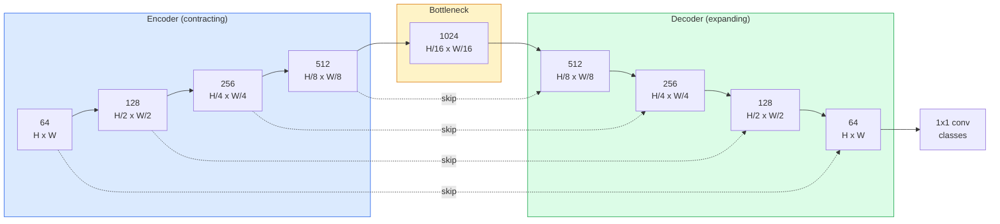
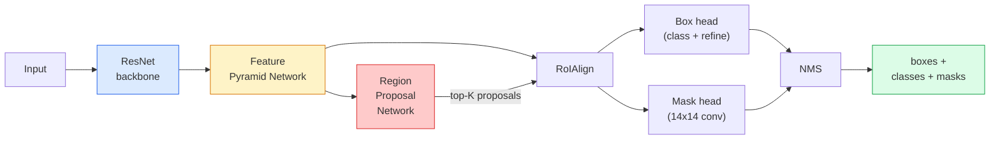
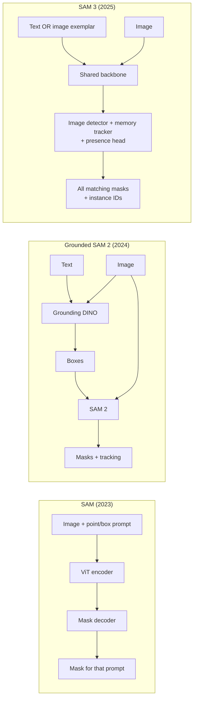

# Detection & Segmentation (YOLO, U-Net, SAM)

> Combined lessons (4 parts), merged verbatim — no content removed.

**Type:** Combined

---

## Part 1 (ch071): Object Detection — YOLO from Scratch

> Detection is classification plus regression, run at every position in a feature map, then cleaned up with non-maximum suppression.

**Type:** Build
**Languages:** Python
**Prerequisites:** Phase 4 Lesson 03 (CNNs), Phase 4 Lesson 04 (Image Classification), Phase 4 Lesson 05 (Transfer Learning)
**Time:** ~75 minutes

## Learning Objectives

- Explain the grid-and-anchor design that turns detection into a dense prediction problem
- Compute IoU and implement non-maximum suppression from scratch
- Build a minimal YOLO-style head on a pretrained backbone
- Read detection metrics and diagnose failures

## The Problem

Classification says "this image is a dog." Detection says "there is a dog at pixels (112, 40, 280, 210), there is a cat at (400, 180, 560, 310), and nothing else in the frame." That structural change — predicting variable-number of labelled boxes — is what every autonomous system, surveillance product, and factory vision line depends on.

## The Concept

### Detection as dense prediction


Each cell predicts B boxes with: 4 geometry + 1 objectness + C class probabilities.

### Anchor boxes

```
Anchor box priors (example for 416x416 input):
  small:   (30,  60)
  medium:  (75,  170)
  large:   (200, 380)
```

### Decoding predictions

```
centre x  = (sigmoid(tx) + cell_x) * stride
centre y  = (sigmoid(ty) + cell_y) * stride
width     = anchor_w * exp(tw)
height    = anchor_h * exp(th)
```

### IoU and NMS

IoU = area(intersect) / area(union). NMS keeps highest-scoring box and deletes overlapping ones.

### The loss

```
L = lambda_coord * L_box + lambda_obj * L_obj_pos + lambda_noobj * L_obj_neg + lambda_cls * L_cls
```

### Detection metrics

- Precision@0.5, Recall@0.5, AP@0.5, mAP@0.5:0.95

## Build It

### Step 1: IoU

```python
import numpy as np

def box_iou(boxes_a, boxes_b):
    ax1, ay1, ax2, ay2 = boxes_a[:, 0], boxes_a[:, 1], boxes_a[:, 2], boxes_a[:, 3]
    bx1, by1, bx2, by2 = boxes_b[:, 0], boxes_b[:, 1], boxes_b[:, 2], boxes_b[:, 3]

    inter_x1 = np.maximum(ax1[:, None], bx1[None, :])
    inter_y1 = np.maximum(ay1[:, None], by1[None, :])
    inter_x2 = np.minimum(ax2[:, None], bx2[None, :])
    inter_y2 = np.minimum(ay2[:, None], by2[None, :])

    inter_w = np.clip(inter_x2 - inter_x1, 0, None)
    inter_h = np.clip(inter_y2 - inter_y1, 0, None)
    inter = inter_w * inter_h

    area_a = (ax2 - ax1) * (ay2 - ay1)
    area_b = (bx2 - bx1) * (by2 - by1)
    union = area_a[:, None] + area_b[None, :] - inter
    return inter / np.clip(union, 1e-8, None)
```

### Step 2: NMS

```python
def nms(boxes, scores, iou_threshold=0.45):
    order = np.argsort(-scores)
    keep = []
    while len(order) > 0:
        i = order[0]
        keep.append(i)
        if len(order) == 1:
            break
        rest = order[1:]
        ious = box_iou(boxes[[i]], boxes[rest])[0]
        order = rest[ious <= iou_threshold]
    return np.array(keep, dtype=np.int64)
```

### Step 3: Box encoding and decoding

```python
def encode(box_xyxy, cell_x, cell_y, stride, anchor_wh):
    x1, y1, x2, y2 = box_xyxy
    cx = 0.5 * (x1 + x2)
    cy = 0.5 * (y1 + y2)
    w = x2 - x1
    h = y2 - y1
    tx = cx / stride - cell_x
    ty = cy / stride - cell_y
    tw = np.log(w / anchor_wh[0] + 1e-8)
    th = np.log(h / anchor_wh[1] + 1e-8)
    return np.array([tx, ty, tw, th])

def decode(tx_ty_tw_th, cell_x, cell_y, stride, anchor_wh):
    tx, ty, tw, th = tx_ty_tw_th
    cx = (sigmoid(tx) + cell_x) * stride
    cy = (sigmoid(ty) + cell_y) * stride
    w = anchor_wh[0] * np.exp(tw)
    h = anchor_wh[1] * np.exp(th)
    return np.array([cx - w / 2, cy - h / 2, cx + w / 2, cy + h / 2])

def sigmoid(x):
    return 1.0 / (1.0 + np.exp(-x))
```

### Step 4: Minimal YOLO head

```python
import torch
import torch.nn as nn

class YOLOHead(nn.Module):
    def __init__(self, in_c, num_anchors, num_classes):
        super().__init__()
        self.num_anchors = num_anchors
        self.num_classes = num_classes
        self.conv = nn.Conv2d(in_c, num_anchors * (5 + num_classes), kernel_size=1)

    def forward(self, x):
        n, _, h, w = x.shape
        y = self.conv(x)
        y = y.view(n, self.num_anchors, 5 + self.num_classes, h, w)
        y = y.permute(0, 3, 4, 1, 2).contiguous()
        return y
```

Output shape: `(N, H, W, num_anchors, 5 + C)`.

### Step 5: Ground-truth assignment

```python
def assign_targets(boxes_xyxy, classes, anchors, stride, grid_size, num_classes):
    num_anchors = len(anchors)
    target = np.zeros((grid_size, grid_size, num_anchors, 5 + num_classes), dtype=np.float32)
    has_obj = np.zeros((grid_size, grid_size, num_anchors), dtype=bool)

    for box, cls in zip(boxes_xyxy, classes):
        x1, y1, x2, y2 = box
        cx, cy = 0.5 * (x1 + x2), 0.5 * (y1 + y2)
        gx, gy = int(cx / stride), int(cy / stride)
        bw, bh = x2 - x1, y2 - y1

        ious = np.array([
            (min(bw, aw) * min(bh, ah)) / (bw * bh + aw * ah - min(bw, aw) * min(bh, ah))
            for aw, ah in anchors
        ])
        best = int(np.argmax(ious))
        aw, ah = anchors[best]

        target[gy, gx, best, 0] = cx / stride - gx
        target[gy, gx, best, 1] = cy / stride - gy
        target[gy, gx, best, 2] = np.log(bw / aw + 1e-8)
        target[gy, gx, best, 3] = np.log(bh / ah + 1e-8)
        target[gy, gx, best, 4] = 1.0
        target[gy, gx, best, 5 + cls] = 1.0
        has_obj[gy, gx, best] = True
    return target, has_obj
```

### Step 6: The three losses

```python
def yolo_loss(pred, target, has_obj, lambda_coord=5.0, lambda_obj=1.0, lambda_noobj=0.5, lambda_cls=1.0):
    has_obj_t = torch.from_numpy(has_obj).bool()
    target_t = torch.from_numpy(target).float()

    box_pred = pred[..., :4][has_obj_t]
    box_true = target_t[..., :4][has_obj_t]
    loss_box = torch.nn.functional.mse_loss(box_pred, box_true, reduction="sum")

    obj_pred = pred[..., 4]
    obj_true = target_t[..., 4]
    loss_obj_pos = torch.nn.functional.binary_cross_entropy_with_logits(
        obj_pred[has_obj_t], obj_true[has_obj_t], reduction="sum")
    loss_obj_neg = torch.nn.functional.binary_cross_entropy_with_logits(
        obj_pred[~has_obj_t], obj_true[~has_obj_t], reduction="sum")

    cls_pred = pred[..., 5:][has_obj_t]
    cls_true = target_t[..., 5:][has_obj_t]
    loss_cls = torch.nn.functional.binary_cross_entropy_with_logits(
        cls_pred, cls_true, reduction="sum")

    total = (lambda_coord * loss_box
             + lambda_obj * loss_obj_pos
             + lambda_noobj * loss_obj_neg
             + lambda_cls * loss_cls)
    return total, {"box": loss_box.item(), "obj_pos": loss_obj_pos.item(),
                   "obj_neg": loss_obj_neg.item(), "cls": loss_cls.item()}
```

### Step 7: Inference pipeline

```python
def postprocess(pred_tensor, anchors, stride, img_size, conf_threshold=0.25, iou_threshold=0.45):
    pred = pred_tensor.detach().cpu().numpy()
    grid_h, grid_w = pred.shape[1], pred.shape[2]
    num_anchors = len(anchors)

    boxes, scores, classes = [], [], []
    for gy in range(grid_h):
        for gx in range(grid_w):
            for a in range(num_anchors):
                tx, ty, tw, th, obj, *cls = pred[0, gy, gx, a]
                score = sigmoid(obj) * sigmoid(np.array(cls)).max()
                if score < conf_threshold:
                    continue
                cls_idx = int(np.argmax(cls))
                cx = (sigmoid(tx) + gx) * stride
                cy = (sigmoid(ty) + gy) * stride
                w = anchors[a][0] * np.exp(tw)
                h = anchors[a][1] * np.exp(th)
                boxes.append([cx - w / 2, cy - h / 2, cx + w / 2, cy + h / 2])
                scores.append(float(score))
                classes.append(cls_idx)

    if not boxes:
        return np.zeros((0, 4)), np.zeros((0,)), np.zeros((0,), dtype=int)
    boxes = np.array(boxes)
    scores = np.array(scores)
    classes = np.array(classes)
    keep = nms(boxes, scores, iou_threshold)
    return boxes[keep], scores[keep], classes[keep]
```

## Use It

```python
from torchvision.models.detection import fasterrcnn_resnet50_fpn_v2

model = fasterrcnn_resnet50_fpn_v2(weights="DEFAULT")
model.eval()
with torch.no_grad():
    predictions = model([torch.randn(3, 400, 600)])
```

For real-time inference: `from ultralytics import YOLO; model = YOLO('yolov8n.pt'); model(img)`.

## Ship It

- `outputs/prompt-detection-metric-reader.md` — diagnoses metrics
- `outputs/skill-anchor-designer.md` — runs k-means on ground-truth boxes

## Exercises

1. **(Easy)** Implement `box_iou` and verify against `torchvision.ops.box_iou`.
2. **(Medium)** Use CIoU instead of MSE for box loss; show mAP improvement.
3. **(Hard)** Implement multi-scale inference with union-NMS.

## Key Terms

## Further Reading

- [YOLOv1 (Redmon et al., 2016)](https://arxiv.org/abs/1506.02640)
- [YOLOv3 (Redmon & Farhadi, 2018)](https://arxiv.org/abs/1804.02767)
- [Ultralytics YOLOv8 docs](https://docs.ultralytics.com)

[Reference](https://github.com/rohitg00/ai-engineering-from-scratch/tree/main/phases/04-computer-vision/06-object-detection-yolo)

---

## Part 2 (ch072): Semantic Segmentation — U-Net

> Segmentation is classification at every pixel. U-Net makes it work by pairing a downsampling encoder with an upsampling decoder and wiring skip connections between them.

**Type:** Build
**Languages:** Python
**Prerequisites:** Phase 4 Lesson 03 (CNNs), Phase 4 Lesson 04 (Image Classification)
**Time:** ~75 minutes

## Learning Objectives

- Distinguish semantic, instance, and panoptic segmentation
- Build a U-Net from scratch with transposed convolutions and skip connections
- Implement pixel-wise cross-entropy, Dice loss, and the combined loss
- Read IoU and Dice metrics per class

## The Problem

Classification outputs one label. Detection outputs few boxes. Segmentation outputs one label per pixel. For H x W input, output is H x W x C — millions of predictions.

## The Concept

### Semantic vs instance vs panoptic

- **Semantic**: pixel -> class. Two cars merge into one blob.
- **Instance**: pixel -> object id. Only foreground.
- **Panoptic**: every pixel gets class + id.

### The U-Net shape



### Transposed vs bilinear upsample

- Transposed conv: learnable, can produce checkerboard artifacts.
- Bilinear + 3x3 conv: fewer artifacts, fewer parameters.

### Dice loss

```
Dice(p, y) = 2 * sum(p * y) / (sum(p) + sum(y) + eps)
Dice_loss = 1 - Dice
```

Combined loss: `L = L_ce + lambda * L_dice`.

## Build It

### Step 1: Encoder block

```python
import torch
import torch.nn as nn
import torch.nn.functional as F

class DoubleConv(nn.Module):
    def __init__(self, in_c, out_c):
        super().__init__()
        self.net = nn.Sequential(
            nn.Conv2d(in_c, out_c, kernel_size=3, padding=1, bias=False),
            nn.BatchNorm2d(out_c),
            nn.ReLU(inplace=True),
            nn.Conv2d(out_c, out_c, kernel_size=3, padding=1, bias=False),
            nn.BatchNorm2d(out_c),
            nn.ReLU(inplace=True),
        )

    def forward(self, x):
        return self.net(x)
```

### Step 2: Down and up blocks

```python
class Down(nn.Module):
    def __init__(self, in_c, out_c):
        super().__init__()
        self.net = nn.Sequential(
            nn.MaxPool2d(2),
            DoubleConv(in_c, out_c),
        )

    def forward(self, x):
        return self.net(x)

class Up(nn.Module):
    def __init__(self, in_c, out_c):
        super().__init__()
        self.up = nn.Upsample(scale_factor=2, mode="bilinear", align_corners=False)
        self.conv = DoubleConv(in_c, out_c)

    def forward(self, x, skip):
        x = self.up(x)
        if x.shape[-2:] != skip.shape[-2:]:
            x = F.interpolate(x, size=skip.shape[-2:], mode="bilinear", align_corners=False)
        x = torch.cat([skip, x], dim=1)
        return self.conv(x)
```

### Step 3: The U-Net

```python
class UNet(nn.Module):
    def __init__(self, in_channels=3, num_classes=2, base=64):
        super().__init__()
        self.inc = DoubleConv(in_channels, base)
        self.d1 = Down(base, base * 2)
        self.d2 = Down(base * 2, base * 4)
        self.d3 = Down(base * 4, base * 8)
        self.d4 = Down(base * 8, base * 16)
        self.u1 = Up(base * 16 + base * 8, base * 8)
        self.u2 = Up(base * 8 + base * 4, base * 4)
        self.u3 = Up(base * 4 + base * 2, base * 2)
        self.u4 = Up(base * 2 + base, base)
        self.outc = nn.Conv2d(base, num_classes, kernel_size=1)

    def forward(self, x):
        x1 = self.inc(x)
        x2 = self.d1(x1)
        x3 = self.d2(x2)
        x4 = self.d3(x3)
        x5 = self.d4(x4)
        x = self.u1(x5, x4)
        x = self.u2(x, x3)
        x = self.u3(x, x2)
        x = self.u4(x, x1)
        return self.outc(x)

net = UNet(in_channels=3, num_classes=2, base=32)
x = torch.randn(1, 3, 256, 256)
print(f"output: {net(x).shape}")
print(f"params: {sum(p.numel() for p in net.parameters()):,}")
```

### Step 4: Losses

```python
def dice_loss(logits, targets, num_classes, eps=1e-6):
    probs = F.softmax(logits, dim=1)
    targets_one_hot = F.one_hot(targets, num_classes).permute(0, 3, 1, 2).float()
    dims = (0, 2, 3)
    intersection = (probs * targets_one_hot).sum(dim=dims)
    denom = probs.sum(dim=dims) + targets_one_hot.sum(dim=dims)
    dice = (2 * intersection + eps) / (denom + eps)
    return 1 - dice.mean()

def combined_loss(logits, targets, num_classes, lam=1.0):
    ce = F.cross_entropy(logits, targets)
    dc = dice_loss(logits, targets, num_classes)
    return ce + lam * dc, {"ce": ce.item(), "dice": dc.item()}
```

### Step 5: IoU metric

```python
@torch.no_grad()
def iou_per_class(logits, targets, num_classes):
    preds = logits.argmax(dim=1)
    ious = torch.zeros(num_classes)
    for c in range(num_classes):
        pred_c = (preds == c)
        true_c = (targets == c)
        inter = (pred_c & true_c).sum().float()
        union = (pred_c | true_c).sum().float()
        ious[c] = (inter / union) if union > 0 else torch.tensor(float("nan"))
    return ious
```

## Use It

```python
import segmentation_models_pytorch as smp

model = smp.Unet(
    encoder_name="resnet34",
    encoder_weights="imagenet",
    in_channels=3,
    classes=3,
)
```

## Ship It

- `outputs/prompt-segmentation-task-picker.md` — picks semantic/instance/panoptic
- `outputs/skill-segmentation-mask-inspector.md` — reports class distribution

## Exercises

1. **(Easy)** Implement bce_dice_loss for binary segmentation.
2. **(Medium)** Replace bilinear upsample with ConvTranspose2d; compare mIoU.
3. **(Hard)** Train U-Net on a real dataset to within 2 IoU points of smp reference.

## Key Terms

## Further Reading

- [U-Net (Ronneberger et al., 2015)](https://arxiv.org/abs/1505.04597)
- [Fully Convolutional Networks (Long et al., 2015)](https://arxiv.org/abs/1411.4038)
- [segmentation_models_pytorch](https://github.com/qubvel/segmentation_models.pytorch)

[Reference](https://github.com/rohitg00/ai-engineering-from-scratch/tree/main/phases/04-computer-vision/07-semantic-segmentation-unet)

---

## Part 3 (ch073): Instance Segmentation — Mask R-CNN

> Add a tiny mask branch to a Faster R-CNN detector and you have instance segmentation. The hard part is RoIAlign, and it is harder than it looks.

**Type:** Build + Learn
**Languages:** Python
**Prerequisites:** Phase 4 Lesson 06 (YOLO), Phase 4 Lesson 07 (U-Net)
**Time:** ~75 minutes

## Learning Objectives

- Trace the Mask R-CNN architecture: backbone, FPN, RPN, RoIAlign, heads
- Implement RoIAlign from scratch and explain why RoIPool is no longer used
- Use torchvision's pretrained Mask R-CNN for production masks
- Fine-tune Mask R-CNN on a small custom dataset

## The Problem

Semantic segmentation gives one mask per class. Instance segmentation gives one mask per object, even when objects share a class. Counting individuals, tracking, and measuring things all demand instance segmentation.

## The Concept

### The architecture



### Why RoIAlign, not RoIPool

RoIPool rounds box coordinates to integers, misaligning features by up to a full feature-map pixel. RoIAlign samples at exact float coordinates using bilinear interpolation — no rounding anywhere. Lifts mask AP by 3-4 points.

### Output format

```python
{
    "boxes":  (N, 4) in (x1, y1, x2, y2),
    "labels": (N,) class IDs (1-based, 0 = background),
    "scores": (N,) confidence,
    "masks":  (N, 1, H, W) float [0, 1] — threshold at 0.5,
}
```

## Build It

### Step 1: RoIAlign from scratch

```python
import torch
import torch.nn.functional as F

def roi_align_single(feature, box, output_size=7, spatial_scale=1 / 16.0):
    C, H, W = feature.shape
    x1, y1, x2, y2 = [c * spatial_scale - 0.5 for c in box]
    bin_w = (x2 - x1) / output_size
    bin_h = (y2 - y1) / output_size

    grid_y = torch.linspace(y1 + bin_h / 2, y2 - bin_h / 2, output_size)
    grid_x = torch.linspace(x1 + bin_w / 2, x2 - bin_w / 2, output_size)
    yy, xx = torch.meshgrid(grid_y, grid_x, indexing="ij")

    gx = 2 * (xx + 0.5) / W - 1
    gy = 2 * (yy + 0.5) / H - 1
    grid = torch.stack([gx, gy], dim=-1).unsqueeze(0)
    sampled = F.grid_sample(feature.unsqueeze(0), grid, mode="bilinear", align_corners=False)
    return sampled.squeeze(0)
```

### Step 2: Compare to torchvision

```python
from torchvision.ops import roi_align

feature = torch.randn(1, 16, 50, 50)
boxes = torch.tensor([[0, 10, 20, 100, 90]], dtype=torch.float32)

ours = roi_align_single(feature[0], boxes[0, 1:].tolist(), output_size=7, spatial_scale=1/4)
theirs = roi_align(feature, boxes, output_size=(7, 7), spatial_scale=1/4, sampling_ratio=1, aligned=True)[0]

print(f"max|diff|: {(ours - theirs).abs().max().item():.3e}")
```

### Step 3: Load pretrained Mask R-CNN

```python
from torchvision.models.detection import maskrcnn_resnet50_fpn_v2, MaskRCNN_ResNet50_FPN_V2_Weights

model = maskrcnn_resnet50_fpn_v2(weights=MaskRCNN_ResNet50_FPN_V2_Weights.DEFAULT)
model.eval()
```

### Step 4: Run inference

```python
with torch.no_grad():
    x = torch.randn(3, 400, 600)
    predictions = model([x])
p = predictions[0]
print(f"boxes: {tuple(p['boxes'].shape)}, labels: {tuple(p['labels'].shape)}, "
      f"scores: {tuple(p['scores'].shape)}, masks: {tuple(p['masks'].shape)}")

binary_masks = (p['masks'] > 0.5).squeeze(1)
```

### Step 5: Swap heads for custom classes

```python
from torchvision.models.detection.faster_rcnn import FastRCNNPredictor
from torchvision.models.detection.mask_rcnn import MaskRCNNPredictor

def build_custom_maskrcnn(num_classes):
    model = maskrcnn_resnet50_fpn_v2(weights=MaskRCNN_ResNet50_FPN_V2_Weights.DEFAULT)
    in_features = model.roi_heads.box_predictor.cls_score.in_features
    model.roi_heads.box_predictor = FastRCNNPredictor(in_features, num_classes)
    in_features_mask = model.roi_heads.mask_predictor.conv5_mask.in_channels
    hidden_layer = 256
    model.roi_heads.mask_predictor = MaskRCNNPredictor(in_features_mask, hidden_layer, num_classes)
    return model
```

### Step 6: Freeze backbone

```python
def freeze_backbone_and_fpn(model):
    for p in model.backbone.parameters():
        p.requires_grad = False
    return model
```

## Use It

```python
def train_step(model, images, targets, optimizer):
    model.train()
    loss_dict = model(images, targets)
    losses = sum(loss for loss in loss_dict.values())
    optimizer.zero_grad()
    losses.backward()
    optimizer.step()
    return {k: v.item() for k, v in loss_dict.items()}
```

## Ship It

- `outputs/prompt-instance-vs-semantic-router.md`
- `outputs/skill-mask-rcnn-head-swapper.md`

## Exercises

1. **(Easy)** Verify RoIAlign against torchvision on 100 random boxes.
2. **(Medium)** Fine-tune on a 50-image custom dataset; report mask AP@0.5.
3. **(Hard)** Replace mask head with 56x56 output; measure mAP change.

## Key Terms

## Further Reading

- [Mask R-CNN (He et al., 2017)](https://arxiv.org/abs/1703.06870)
- [FPN (Lin et al., 2017)](https://arxiv.org/abs/1612.03144)
- [torchvision Mask R-CNN tutorial](https://pytorch.org/tutorials/intermediate/torchvision_tutorial.html)

[Reference](https://github.com/rohitg00/ai-engineering-from-scratch/tree/main/phases/04-computer-vision/08-instance-segmentation-mask-rcnn)

---

## Part 4 (ch089): SAM 3 & Open-Vocabulary Segmentation

> Give a model a text prompt and an image and get masks for every matching object. SAM 3 made that a single forward pass.

**Type:** Use + Build
**Languages:** Python
**Prerequisites:** Phase 4 Lesson 07 (U-Net), Phase 4 Lesson 08 (Mask R-CNN), Phase 4 Lesson 18 (CLIP)
**Time:** ~60 minutes

## Learning Objectives

- Distinguish SAM (visual prompts only), Grounded SAM / SAM 2 (detector + SAM), and SAM 3 (native text prompts via Promptable Concept Segmentation)
- Explain the SAM 3 architecture: shared backbone + image detector + memory-based video tracker + presence head + decoupled detector-tracker design
- Use Hugging Face `transformers` SAM 3 integration for text-prompted detection, segmentation, and video tracking
- Pick between SAM 3, Grounded SAM 2, YOLO-World, and SAM-MI based on latency, concept complexity, and deployment target

## The Problem

The 2023 SAM was a visual-prompt-only model: you click a point or draw a box and it returns a mask. For "give me all the oranges in this photo" you needed a detector (Grounding DINO) to produce boxes, then SAM to segment each. Grounded SAM turned this into a pipeline, but it was a cascade of two frozen models with inevitable error accumulation.

SAM 3 (Meta, Nov 2025, ICLR 2026) collapsed the cascade. It accepts a short noun phrase or an image exemplar as prompt and returns all matching masks and instance IDs in a single forward pass. That is **Promptable Concept Segmentation (PCS)**. Combined with the March 2026 Object Multiplex update (SAM 3.1), it tracks multiple instances of the same concept through video efficiently.

This lesson is about the structural shift this represents. 2D seg, detection, and text-image grounding have merged into one model. The production question is no longer "which pipeline do I chain together" but "which promptable model handles my use case end-to-end."

## The Concept

### The three generations



### Promptable Concept Segmentation

A "concept prompt" is a short noun phrase (`"yellow school bus"`, `"striped red umbrella"`, `"hand holding a mug"`) or an image exemplar. The model returns segmentation masks for every instance in the image that matches the concept, plus a unique instance ID per match.

This differs from classic visual-prompt SAM in three ways:

1. No per-instance prompting required — one text prompt returns all matches.
2. Open-vocabulary — the concept can be anything describable in natural language.
3. Returns multiple instances at once rather than one mask per prompt.

### Key architectural pieces

- **Shared backbone** — a single ViT processes the image. Both the detector head and the memory-based tracker read from it.
- **Presence head** — predicts whether the concept is present in the image at all. Decouples "is this here?" from "where is it?". Reduces false positives on absent concepts.
- **Decoupled detector-tracker** — image-level detection and video-level tracking have separate heads so they do not interfere.
- **Memory bank** — stores per-instance features across frames for video tracking (same mechanism SAM 2 used).

### Training at scale

SAM 3 was trained on **4 million unique concepts** generated by a data engine that iteratively annotates and corrects using AI + human review. The new **SA-CO benchmark** contains 270K unique concepts, 50x larger than prior benchmarks. SAM 3 reaches 75-80% of human performance on SA-CO and doubles existing systems on image + video PCS.

### SAM 3.1 Object Multiplex

March 2026 update: **Object Multiplex** introduces a shared-memory mechanism for joint tracking of many instances of the same concept at once. Previously, tracking N instances meant N separate memory banks. Multiplex collapses that into one shared memory with per-instance queries. Result: substantially faster multi-object tracking without sacrificing accuracy.

### Where Grounded SAM still matters in 2026

- When you need a specific open-vocabulary detector swapped in (DINO-X, Florence-2).
- When the SAM 3 license (gated on HF) is a blocker.
- When you need more control over the detector threshold than SAM 3 exposes.
- For research / ablation work on the detector component.

### YOLO-World vs SAM 3

- **YOLO-World** — open-vocabulary detector only (no masks). Real-time. Best when you need boxes at high fps.
- **SAM 3** — full segmentation + tracking. Slower but richer output.

### SAM-MI efficiency

SAM-MI (2025-2026) addresses SAM's decoder bottleneck. Key ideas:

- **Sparse point prompting** — uses a few well-chosen points instead of dense prompts; reduces decoder calls by 96%.
- **Shallow mask aggregation** — merges rough mask predictions into one sharper mask.
- **Decoupled mask injection** — decoder receives pre-computed mask features instead of re-running.

Result: ~1.6× speedup over Grounded-SAM on open-vocabulary benchmarks.

## Build It

### Step 1: Prompt construction

```python
def split_concepts(sentence):
    """
    Heuristic splitter for multi-concept prompts.
    Returns list of short noun phrases.
    """
    for sep in [",", ";", "and", "or", "&"]:
        if sep in sentence:
            parts = [p.strip() for p in sentence.replace("and ", ",").split(",")]
            return [p for p in parts if p]
    return [sentence.strip()]

print(split_concepts("cats, dogs and balloons"))
```

### Step 2: Post-processing helpers

```python
from dataclasses import dataclass
from typing import List

@dataclass
class ConceptDetection:
    concept: str
    instance_id: int
    box: tuple
    score: float
    mask_rle: str

def rle_encode(binary_mask):
    flat = binary_mask.flatten().astype("uint8")
    runs = []
    prev, count = flat[0], 0
    for v in flat:
        if v == prev:
            count += 1
        else:
            runs.append((int(prev), count))
            prev, count = v, 1
    runs.append((int(prev), count))
    return ";".join(f"{v}x{c}" for v, c in runs)
```

### Step 3: A unified open-vocab segmentation interface

```python
from abc import ABC, abstractmethod
import numpy as np

class OpenVocabSeg(ABC):
    @abstractmethod
    def detect(self, image: np.ndarray, concept: str) -> List[ConceptDetection]:
        ...

class StubOpenVocabSeg(OpenVocabSeg):
    def detect(self, image, concept):
        h, w = image.shape[:2]
        return [
            ConceptDetection(concept=concept, instance_id=0, box=(w * 0.2, h * 0.3, w * 0.5, h * 0.8), score=0.89, mask_rle="0x100;1x50;0x200"),
            ConceptDetection(concept=concept, instance_id=1, box=(w * 0.55, h * 0.25, w * 0.85, h * 0.75), score=0.74, mask_rle="0x80;1x40;0x220"),
        ]
```

### Step 4: Hugging Face SAM 3 usage (reference)

```python
from transformers import Sam3Processor, Sam3Model
import torch

processor = Sam3Processor.from_pretrained("facebook/sam3")
model = Sam3Model.from_pretrained("facebook/sam3").eval()

inputs = processor(images=pil_image, return_tensors="pt")
inputs = processor.set_text_prompt(inputs, "yellow school bus")

with torch.no_grad():
    outputs = model(**inputs)

masks = processor.post_process_masks(outputs.masks, inputs.original_sizes, inputs.reshaped_input_sizes)
boxes = outputs.boxes
scores = outputs.scores
```

### Step 5: Measure what Grounded SAM 2 gave you for free

- Latency: SAM 3 saves one forward pass (no separate detector) but the model itself is heavier; usually net-neutral or a slight speedup.
- Accuracy: SAM 3 substantially better on rare or compositional concepts ("striped red umbrella"). Similar on common single-word concepts.
- Flexibility: Grounded SAM 2 lets you swap detectors (DINO-X, Florence-2, Grounding DINO 1.5); SAM 3 is monolithic.

## Use It

Production deployment patterns:

- **Real-time annotation** — SAM 3 + CVAT's label-as-text-prompt feature.
- **Video analytics** — SAM 3.1 Object Multiplex for multi-object tracking.
- **Robotics** — SAM 3 for open-vocab manipulation ("pick up the red cup").
- **Medical imaging** — SAM 3 fine-tuned on medical concepts.

Ultralytics wraps SAM 3 in its Python package:

```python
from ultralytics import SAM

model = SAM("sam3.pt")
results = model(image_path, prompts="yellow school bus")
```

## Ship It

This lesson produces:

- `outputs/prompt-open-vocab-stack-picker.md` — a prompt that picks SAM 3 / Grounded SAM 2 / YOLO-World / SAM-MI based on latency, concept complexity, and licensing.
- `outputs/skill-concept-prompt-designer.md` — a skill that turns user utterances into well-formed SAM 3 concept prompts (splitting, disambiguation, fallbacks).

## Exercises

1. **(Easy)** Run SAM 3 on 10 images with concept prompts you choose. Compare against SAM 2 + Grounding DINO 1.5 on the same images. Report which concepts each model missed.
2. **(Medium)** Build a "click-to-include / click-to-exclude" UI on top of SAM 3: a text prompt returns candidate instances; user clicks keep which ones count as positive.
3. **(Hard)** Fine-tune SAM 3 on a custom concept set (e.g. 5 types of electronic components) with 20 labelled images each. Compare to zero-shot SAM 3 on the same test set.

## Key Terms

| Term | What people say | What it actually means |
|------|----------------|----------------------|
| Open-vocabulary segmentation | "Segment by text" | Produce masks for objects described in natural language, not a fixed label set |
| PCS | "Promptable Concept Segmentation" | SAM 3's core task — given a noun-phrase or image exemplar, segment all matching instances |
| Concept prompt | "The text input" | Short noun phrase or image exemplar; not a full sentence |
| Presence head | "Is it here?" | SAM 3 module that decides whether the concept exists in the image before localisation |
| SA-CO | "SAM 3 benchmark" | 270K-concept open-vocabulary segmentation benchmark |
| Object Multiplex | "SAM 3.1 update" | Shared-memory multi-object tracking; fast joint tracking of many instances |
| Grounded SAM 2 | "Modular pipeline" | Detector + SAM 2 cascade; still relevant when detector swap matters |
| SAM-MI | "Efficient SAM variant" | Mask Injection for 1.6x speedup over Grounded-SAM |

## Further Reading

- [SAM 3: Segment Anything with Concepts (arXiv 2511.16719)](https://arxiv.org/abs/2511.16719)
- [SAM 3.1 Object Multiplex (Meta AI, March 2026)](https://ai.meta.com/blog/segment-anything-model-3/)
- [SAM 3 model page on Hugging Face](https://huggingface.co/facebook/sam3)
- [Grounded SAM 2 tutorial (PyImageSearch)](https://pyimagesearch.com/2026/01/19/grounded-sam-2-from-open-set-detection-to-segmentation-and-tracking/)
- [Ultralytics SAM 3 docs](https://docs.ultralytics.com/models/sam-3/)
- [SAM3-I: Instruction-aware SAM (arXiv 2512.04585)](https://arxiv.org/abs/2512.04585)

> Reference: [ai-engineering/phases/04-computer-vision/24-sam3-open-vocab-segmentation/docs/en.md](https://github.com/anomalyco/ai-engineering/blob/main/phases/04-computer-vision/24-sam3-open-vocab-segmentation/docs/en.md)
