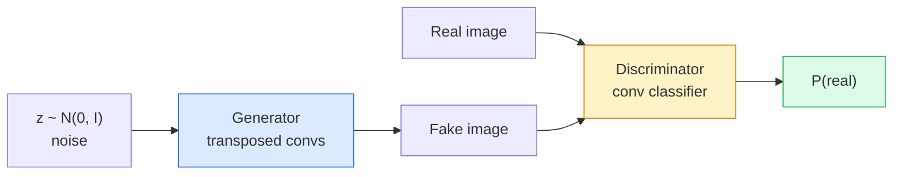
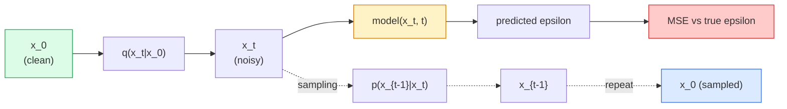
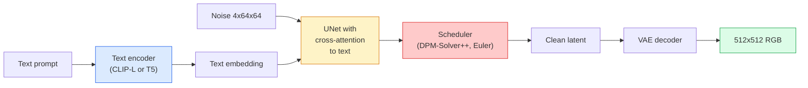
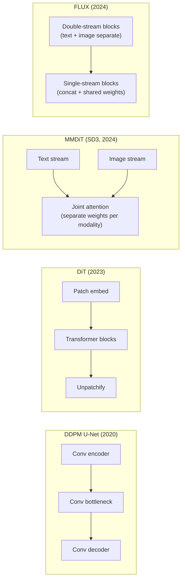

# Image Generation: GANs to Diffusion

> Combined lessons (4 parts), merged verbatim — no content removed.

**Type:** Combined

---

## Part 1 (ch074): Image Generation — GANs

> A GAN is two neural networks in a fixed game. One draws, one critiques. They get better together until the drawings fool the critic.

**Type:** Build
**Languages:** Python
**Prerequisites:** Phase 4 Lesson 03 (CNNs), Phase 3 Lesson 06 (Optimizers), Phase 3 Lesson 07 (Regularization)
**Time:** ~75 minutes

## Learning Objectives

- Explain the minimax game between generator and discriminator
- Implement a DCGAN in PyTorch for 32x32 images
- Stabilise training with non-saturating loss, spectral norm, TTUR
- Diagnose mode collapse, oscillation, and discriminator-wins

## The Problem

No "correct" output to diff against — only a distribution to mimic. GANs learn the loss function itself by training a second network whose job is to tell real from fake.

## The Concept

### The two networks



### The minimax game

```
min_G max_D  E_x[log D(x)] + E_z[log(1 - D(G(z)))]
```

### Non-saturating loss

```
L_D = -E_x[log D(x)] - E_z[log(1 - D(G(z)))]
L_G = -E_z[log D(G(z))]                          # non-saturating
```

### DCGAN rules

1. Strided convs instead of pooling
2. BN in both nets (but not output of G / input of D)
3. No FC layers
4. G: ReLU except output (tanh)
5. D: LeakyReLU(0.2)

### Failure modes

- **Mode collapse**: G produces one output. Fix: spectral norm.
- **D wins**: G gradients vanish. Fix: lower D LR, label smoothing.
- **Oscillation**: never converging. Fix: TTUR.

### Evaluation

- Sample inspection (look at 64 samples)
- FID (Fréchet Inception Distance)

## Build It

### Step 1: Generator

```python
import torch
import torch.nn as nn

class Generator(nn.Module):
    def __init__(self, z_dim=64, img_channels=3, feat=64):
        super().__init__()
        self.net = nn.Sequential(
            nn.ConvTranspose2d(z_dim, feat * 4, kernel_size=4, stride=1, padding=0, bias=False),
            nn.BatchNorm2d(feat * 4),
            nn.ReLU(inplace=True),
            nn.ConvTranspose2d(feat * 4, feat * 2, kernel_size=4, stride=2, padding=1, bias=False),
            nn.BatchNorm2d(feat * 2),
            nn.ReLU(inplace=True),
            nn.ConvTranspose2d(feat * 2, feat, kernel_size=4, stride=2, padding=1, bias=False),
            nn.BatchNorm2d(feat),
            nn.ReLU(inplace=True),
            nn.ConvTranspose2d(feat, img_channels, kernel_size=4, stride=2, padding=1, bias=False),
            nn.Tanh(),
        )

    def forward(self, z):
        return self.net(z.view(z.size(0), -1, 1, 1))
```

### Step 2: Discriminator

```python
class Discriminator(nn.Module):
    def __init__(self, img_channels=3, feat=64):
        super().__init__()
        self.net = nn.Sequential(
            nn.Conv2d(img_channels, feat, kernel_size=4, stride=2, padding=1),
            nn.LeakyReLU(0.2, inplace=True),
            nn.Conv2d(feat, feat * 2, kernel_size=4, stride=2, padding=1, bias=False),
            nn.BatchNorm2d(feat * 2),
            nn.LeakyReLU(0.2, inplace=True),
            nn.Conv2d(feat * 2, feat * 4, kernel_size=4, stride=2, padding=1, bias=False),
            nn.BatchNorm2d(feat * 4),
            nn.LeakyReLU(0.2, inplace=True),
            nn.Conv2d(feat * 4, 1, kernel_size=4, stride=1, padding=0),
        )

    def forward(self, x):
        return self.net(x).view(-1)
```

### Step 3: Training step

```python
import torch.nn.functional as F

def train_step(G, D, real, z, opt_g, opt_d, device):
    real = real.to(device)
    bs = real.size(0)

    opt_d.zero_grad()
    d_real = D(real)
    d_fake = D(G(z).detach())
    loss_d = (F.binary_cross_entropy_with_logits(d_real, torch.ones_like(d_real))
              + F.binary_cross_entropy_with_logits(d_fake, torch.zeros_like(d_fake)))
    loss_d.backward()
    opt_d.step()

    opt_g.zero_grad()
    d_fake = D(G(z))
    loss_g = F.binary_cross_entropy_with_logits(d_fake, torch.ones_like(d_fake))
    loss_g.backward()
    opt_g.step()

    return loss_d.item(), loss_g.item()
```

### Step 4: Full training loop

```python
from torch.utils.data import DataLoader, TensorDataset
import numpy as np

def synthetic_images(num=2000, size=32, seed=0):
    rng = np.random.default_rng(seed)
    imgs = np.zeros((num, 3, size, size), dtype=np.float32) - 1.0
    for i in range(num):
        r = rng.uniform(6, 12)
        cx, cy = rng.uniform(r, size - r, size=2)
        yy, xx = np.meshgrid(np.arange(size), np.arange(size), indexing="ij")
        mask = (xx - cx) ** 2 + (yy - cy) ** 2 < r ** 2
        color = rng.uniform(-0.5, 1.0, size=3)
        for c in range(3):
            imgs[i, c][mask] = color[c]
    return torch.from_numpy(imgs)

device = "cuda" if torch.cuda.is_available() else "cpu"
data = synthetic_images()
loader = DataLoader(TensorDataset(data), batch_size=64, shuffle=True)

G = Generator(z_dim=64, img_channels=3, feat=32).to(device)
D = Discriminator(img_channels=3, feat=32).to(device)
opt_g = torch.optim.Adam(G.parameters(), lr=2e-4, betas=(0.5, 0.999))
opt_d = torch.optim.Adam(D.parameters(), lr=2e-4, betas=(0.5, 0.999))

for epoch in range(10):
    for (batch,) in loader:
        z = torch.randn(batch.size(0), 64, device=device)
        ld, lg = train_step(G, D, batch, z, opt_g, opt_d, device)
    print(f"epoch {epoch}  D {ld:.3f}  G {lg:.3f}")
```

### Step 5: Spectral normalisation

```python
from torch.nn.utils import spectral_norm

def build_sn_discriminator(img_channels=3, feat=64):
    return nn.Sequential(
        spectral_norm(nn.Conv2d(img_channels, feat, 4, 2, 1)),
        nn.LeakyReLU(0.2, inplace=True),
        spectral_norm(nn.Conv2d(feat, feat * 2, 4, 2, 1)),
        nn.LeakyReLU(0.2, inplace=True),
        spectral_norm(nn.Conv2d(feat * 2, feat * 4, 4, 2, 1)),
        nn.LeakyReLU(0.2, inplace=True),
        spectral_norm(nn.Conv2d(feat * 4, 1, 4, 1, 0)),
    )
```

## Use It

- `torch_fidelity` computes FID/IS
- GANs best for: real-time generation (<10ms), style transfer, Pix2Pix

## Ship It

- `outputs/prompt-gan-training-triage.md`
- `outputs/skill-dcgan-scaffold.md`

## Exercises

1. **(Easy)** Train DCGAN on synthetic circles; inspect samples per epoch.
2. **(Medium)** Replace BN with spectral norm in D; compare convergence.
3. **(Hard)** Implement conditional DCGAN with label conditioning.

## Key Terms

## Further Reading

- [GANs (Goodfellow et al., 2014)](https://arxiv.org/abs/1406.2661)
- [DCGAN (Radford et al., 2015)](https://arxiv.org/abs/1511.06434)
- [Spectral Normalization (Miyato et al., 2018)](https://arxiv.org/abs/1802.05957)

[Reference](https://github.com/rohitg00/ai-engineering-from-scratch/tree/main/phases/04-computer-vision/09-image-generation-gans)

---

## Part 2 (ch075): Image Generation — Diffusion Models

> A diffusion model learns to denoise. Train it to remove a tiny bit of noise from a noisy image, repeat that backwards a thousand times, and you have an image generator.

**Type:** Build
**Languages:** Python
**Prerequisites:** Phase 4 Lesson 07 (U-Net), Phase 1 Lesson 06 (Probability), Phase 3 Lesson 06 (Optimizers)
**Time:** ~75 minutes

## Learning Objectives

- Derive the forward noising process and the closed-form q(x_t | x_0)
- Implement DDPM training (predict the noise) and DDPM/DDIM sampling
- Build a time-conditioned U-Net for any timestep
- Explain when DDPM vs DDIM is appropriate

## The Problem

GANs: fast inference, hard training. Diffusion: slow inference, easy training. The latter has dominated because any team can train a diffusion model; GAN training is a craft.

## The Concept

### Forward process

```
q(x_t | x_{t-1}) = N(x_t; sqrt(1 - beta_t) * x_{t-1},  beta_t * I)
```

### Closed-form jump

```
x_t = sqrt(alpha_bar_t) * x_0 + sqrt(1 - alpha_bar_t) * epsilon
```

### Reverse process



### Training loss

Minimise `|| epsilon - epsilon_theta(x_t, t) ||^2`. No adversarial game.

### DDPM sampler

```
for t = T, T-1, ..., 1:
    eps = model(x_t, t)
    x_{t-1} = (1 / sqrt(alpha_t)) * (x_t - (beta_t / sqrt(1 - alpha_bar_t)) * eps) + sqrt(beta_t) * z
```

### DDIM: 20x faster

Deterministic, skips timesteps without retraining.

## Build It

### Step 1: Noise schedule

```python
import torch

def linear_beta_schedule(T=1000, beta_start=1e-4, beta_end=2e-2):
    return torch.linspace(beta_start, beta_end, T)

def precompute_schedule(betas):
    alphas = 1.0 - betas
    alphas_cumprod = torch.cumprod(alphas, dim=0)
    return {
        "betas": betas,
        "alphas": alphas,
        "alphas_cumprod": alphas_cumprod,
        "sqrt_alphas_cumprod": torch.sqrt(alphas_cumprod),
        "sqrt_one_minus_alphas_cumprod": torch.sqrt(1.0 - alphas_cumprod),
        "sqrt_recip_alphas": torch.sqrt(1.0 / alphas),
    }

schedule = precompute_schedule(linear_beta_schedule(T=1000))
```

### Step 2: Forward diffusion

```python
def q_sample(x0, t, noise, schedule):
    sqrt_a = schedule["sqrt_alphas_cumprod"][t].view(-1, 1, 1, 1)
    sqrt_one_minus_a = schedule["sqrt_one_minus_alphas_cumprod"][t].view(-1, 1, 1, 1)
    return sqrt_a * x0 + sqrt_one_minus_a * noise
```

### Step 3: Tiny time-conditioned U-Net

```python
import torch.nn as nn
import torch.nn.functional as F
import math

def timestep_embedding(t, dim=64):
    half = dim // 2
    freqs = torch.exp(-math.log(10000) * torch.arange(half, device=t.device) / half)
    args = t[:, None].float() * freqs[None]
    emb = torch.cat([args.sin(), args.cos()], dim=-1)
    return emb

class TinyUNet(nn.Module):
    def __init__(self, img_channels=3, base=32, t_dim=64):
        super().__init__()
        self.t_mlp = nn.Sequential(
            nn.Linear(t_dim, base * 4),
            nn.SiLU(),
            nn.Linear(base * 4, base * 4),
        )
        self.t_dim = t_dim
        self.enc1 = nn.Conv2d(img_channels, base, 3, padding=1)
        self.enc2 = nn.Conv2d(base, base * 2, 4, stride=2, padding=1)
        self.mid = nn.Conv2d(base * 2, base * 2, 3, padding=1)
        self.dec1 = nn.ConvTranspose2d(base * 2, base, 4, stride=2, padding=1)
        self.dec2 = nn.Conv2d(base * 2, img_channels, 3, padding=1)
        self.time_proj = nn.Linear(base * 4, base * 2)

    def forward(self, x, t):
        t_emb = timestep_embedding(t, self.t_dim)
        t_emb = self.t_mlp(t_emb)
        t_proj = self.time_proj(t_emb)[:, :, None, None]

        h1 = F.silu(self.enc1(x))
        h2 = F.silu(self.enc2(h1)) + t_proj
        h3 = F.silu(self.mid(h2))
        d1 = F.silu(self.dec1(h3))
        d2 = torch.cat([d1, h1], dim=1)
        return self.dec2(d2)
```

### Step 4: Training loop

```python
def train_step(model, x0, schedule, optimizer, device, T=1000):
    model.train()
    x0 = x0.to(device)
    bs = x0.size(0)
    t = torch.randint(0, T, (bs,), device=device)
    noise = torch.randn_like(x0)
    x_t = q_sample(x0, t, noise, schedule)
    pred = model(x_t, t)
    loss = F.mse_loss(pred, noise)
    optimizer.zero_grad()
    loss.backward()
    optimizer.step()
    return loss.item()
```

### Step 5: DDPM sampler

```python
@torch.no_grad()
def sample(model, schedule, shape, T=1000, device="cpu"):
    model.eval()
    x = torch.randn(shape, device=device)
    betas = schedule["betas"].to(device)
    sqrt_one_minus_a = schedule["sqrt_one_minus_alphas_cumprod"].to(device)
    sqrt_recip_alphas = schedule["sqrt_recip_alphas"].to(device)

    for t in reversed(range(T)):
        t_batch = torch.full((shape[0],), t, dtype=torch.long, device=device)
        eps = model(x, t_batch)
        coef = betas[t] / sqrt_one_minus_a[t]
        mean = sqrt_recip_alphas[t] * (x - coef * eps)
        if t > 0:
            x = mean + torch.sqrt(betas[t]) * torch.randn_like(x)
        else:
            x = mean
    return x
```

### Step 6: DDIM sampler

```python
@torch.no_grad()
def sample_ddim(model, schedule, shape, steps=50, T=1000, device="cpu", eta=0.0):
    model.eval()
    x = torch.randn(shape, device=device)
    alphas_cumprod = schedule["alphas_cumprod"].to(device)

    ts = torch.linspace(T - 1, 0, steps + 1).long()
    for i in range(steps):
        t = ts[i]
        t_prev = ts[i + 1]
        t_batch = torch.full((shape[0],), t, dtype=torch.long, device=device)
        eps = model(x, t_batch)
        a_t = alphas_cumprod[t]
        a_prev = alphas_cumprod[t_prev] if t_prev >= 0 else torch.tensor(1.0, device=device)
        x0_pred = (x - torch.sqrt(1 - a_t) * eps) / torch.sqrt(a_t)
        sigma = eta * torch.sqrt((1 - a_prev) / (1 - a_t) * (1 - a_t / a_prev))
        dir_xt = torch.sqrt(1 - a_prev - sigma ** 2) * eps
        noise = sigma * torch.randn_like(x) if eta > 0 else 0
        x = torch.sqrt(a_prev) * x0_pred + dir_xt + noise
    return x
```

## Use It

```python
from diffusers import DDPMScheduler, UNet2DModel

unet = UNet2DModel(sample_size=32, in_channels=3, out_channels=3, layers_per_block=2)
scheduler = DDPMScheduler(num_train_timesteps=1000)
```

## Ship It

- `outputs/prompt-diffusion-sampler-picker.md`
- `outputs/skill-noise-schedule-designer.md`

## Exercises

1. **(Easy)** Visualise forward process at t in [0, 100, 250, 500, 750, 1000].
2. **(Medium)** Compare DDPM (1000 steps) vs DDIM (50 steps) quality.
3. **(Hard)** Implement cosine noise schedule; compare vs linear.

## Key Terms

## Further Reading

- [DDPM (Ho et al., 2020)](https://arxiv.org/abs/2006.11239)
- [Improved DDPM (Nichol & Dhariwal, 2021)](https://arxiv.org/abs/2102.09672)
- [DDIM (Song et al., 2020)](https://arxiv.org/abs/2010.02502)
- [Karras et al., 2022](https://arxiv.org/abs/2206.00364)

[Reference](https://github.com/rohitg00/ai-engineering-from-scratch/tree/main/phases/04-computer-vision/10-image-generation-diffusion)

---

## Part 3 (ch076): Stable Diffusion — Architecture & Fine-Tuning

> Stable Diffusion is a DDPM that runs in the latent space of a pretrained VAE, conditioned on text via cross-attention, sampled with a fast deterministic ODE solver, and steered by classifier-free guidance.

**Type:** Learn + Use
**Languages:** Python
**Prerequisites:** Phase 4 Lesson 10 (Diffusion), Phase 7 Lesson 02 (Self-Attention)
**Time:** ~75 minutes

## Learning Objectives

- Trace the five pieces of a Stable Diffusion pipeline: VAE, text encoder, U-Net, scheduler, safety checker
- Explain latent diffusion and why 4x64x64 latents save 48x compute over 3x512x512 pixels
- Use `diffusers` for text-to-image, img2img, inpainting, and ControlNet
- Fine-tune with LoRA on a small custom dataset

## The Problem

Pixel-space DDPM at 512x512 costs 256 GPU-months. Latent diffusion (Rombach et al., CVPR 2022) runs DDPM in a VAE latent space (4x64x64), dropping compute by 48x.

## The Concept

### The pipeline



### Classifier-free guidance (CFG)

```
eps = eps_uncond + w * (eps_cond - eps_uncond)
```

w=7.5 is SD default.

### Latent space geometry

Img2img: encode -> add noise -> denoise -> decode. Inpainting: same but masked.

### LoRA fine-tuning

```
Original: W_q : (d_in, d_out)   frozen
LoRA:     W_q + alpha * (A @ B)   where A : (d_in, r), B : (r, d_out)
```

r is typically 4-32.

## Build It

### Step 1: Text-to-image

```python
import torch
from diffusers import StableDiffusionPipeline

pipe = StableDiffusionPipeline.from_pretrained(
    "runwayml/stable-diffusion-v1-5",
    torch_dtype=torch.float16,
).to("cuda")

image = pipe(
    prompt="a dog riding a skateboard in tokyo, studio ghibli style",
    guidance_scale=7.5,
    num_inference_steps=25,
    generator=torch.Generator("cuda").manual_seed(42),
).images[0]
image.save("dog.png")
```

### Step 2: Swap scheduler

```python
from diffusers import DPMSolverMultistepScheduler, EulerAncestralDiscreteScheduler

pipe.scheduler = DPMSolverMultistepScheduler.from_config(pipe.scheduler.config)
pipe.scheduler = EulerAncestralDiscreteScheduler.from_config(pipe.scheduler.config)
```

### Step 3: Image-to-image

```python
from diffusers import StableDiffusionImg2ImgPipeline
from PIL import Image

img2img = StableDiffusionImg2ImgPipeline.from_pretrained(
    "runwayml/stable-diffusion-v1-5",
    torch_dtype=torch.float16,
).to("cuda")

init_image = Image.open("dog.png").convert("RGB").resize((512, 512))
out = img2img(
    prompt="a dog riding a skateboard, oil painting",
    image=init_image,
    strength=0.6,
    guidance_scale=7.5,
).images[0]
```

### Step 4: Inpainting

```python
from diffusers import StableDiffusionInpaintPipeline

inpaint = StableDiffusionInpaintPipeline.from_pretrained(
    "runwayml/stable-diffusion-inpainting",
    torch_dtype=torch.float16,
).to("cuda")

out = inpaint(
    prompt="a cat",
    image=Image.open("dog.png").convert("RGB").resize((512, 512)),
    mask_image=Image.open("dog_mask.png").convert("L").resize((512, 512)),
    guidance_scale=7.5,
).images[0]
```

### Step 5: LoRA loading

```python
pipe.load_lora_weights("sayakpaul/sd-lora-ghibli")
pipe.fuse_lora(lora_scale=0.8)
image = pipe(prompt="a village square in ghibli style").images[0]
```

### Step 6: LoRA training sketch

```python
# Pseudocode
for step, batch in enumerate(dataloader):
    images, prompts = batch
    latents = vae.encode(images).latent_dist.sample() * 0.18215
    t = torch.randint(0, num_train_timesteps, (batch_size,))
    noise = torch.randn_like(latents)
    noisy_latents = scheduler.add_noise(latents, noise, t)
    text_emb = text_encoder(tokenizer(prompts))
    pred_noise = unet(noisy_latents, t, text_emb)  # LoRA weights injected here
    loss = F.mse_loss(pred_noise, noise)
    loss.backward()
    optimizer.step()
```

## Use It

Production decisions: SD 1.5 (community fine-tunes), SDXL (higher fidelity), SD3/FLUX (SOTA). Scheduler: DPM-Solver++ for 20-30 steps, LCM-LoRA for <1s latency.

## Ship It

- `outputs/prompt-sd-pipeline-planner.md`
- `outputs/skill-lora-training-setup.md`

## Exercises

1. **(Easy)** Generate with guidance_scale in [1, 3, 5, 7.5, 10, 15]; note artifacts.
2. **(Medium)** Run img2img at strength [0.2, 0.4, 0.6, 0.8, 1.0]; describe results.
3. **(Hard)** Train LoRA on 10-20 images of a subject; generate novel scenes.

## Key Terms

## Further Reading

- [Latent Diffusion (Rombach et al., 2022)](https://arxiv.org/abs/2112.10752)
- [CFG (Ho & Salimans, 2022)](https://arxiv.org/abs/2207.12598)
- [LoRA (Hu et al., 2021)](https://arxiv.org/abs/2106.09685)
- [diffusers documentation](https://huggingface.co/docs/diffusers)

[Reference](https://github.com/rohitg00/ai-engineering-from-scratch/tree/main/phases/04-computer-vision/11-stable-diffusion)

---

## Part 4 (ch088): Diffusion Transformers & Rectified Flow

> The U-Net is not the secret of diffusion. Replace it with a transformer, swap the noise schedule for a straight-line flow, and suddenly you have SD3, FLUX, and every 2026 text-to-image model.

**Type:** Learn + Build
**Languages:** Python
**Prerequisites:** Phase 4 Lesson 10 (Diffusion DDPM), Phase 4 Lesson 14 (ViT), Phase 7 Lesson 02 (Self-Attention)
**Time:** ~75 minutes

## Learning Objectives

- Trace the evolution from U-Net DDPM (Lesson 10) to Diffusion Transformer (DiT), MMDiT (SD3), and single+double-stream DiT (FLUX)
- Explain rectified flow: why a straight-line trajectory between noise and data lets models sample in 20 steps instead of 1000
- Implement a tiny DiT block and a rectified-flow training loop, both under 100 lines
- Distinguish model variants (SD3, FLUX.1-dev, FLUX.1-schnell, Z-Image, Qwen-Image) by architecture, parameter count, and licensing

## The Problem

Lesson 10 built a DDPM with a U-Net denoiser. That recipe dominated 2020-2023: U-Net + beta schedule + noise-prediction loss. It produced Stable Diffusion 1.5 and 2.1 and DALL-E 2.

Every 2026 state-of-the-art text-to-image model has moved past it. Stable Diffusion 3, FLUX, SD4, Z-Image, Qwen-Image, Hunyuan-Image — none use a U-Net. They use Diffusion Transformers (DiT). SD3 and FLUX also swap the DDPM noise schedule for rectified flow, which straightens the path from noise to data and enables 1-4 step inference with consistency or distilled variants.

The shift matters because it is the reason diffusion-based image generation became controllable, prompt-accurate (SD3/SD4 solved text rendering), and production-fast. Understanding DiT + rectified flow is understanding the 2026 generative-image stack.

## The Concept

### From U-Net to transformer



- **DiT** (Peebles & Xie, 2023) — replace the U-Net with a ViT-like transformer on latent patches. Conditioning via adaptive layer norm (AdaLN).
- **MMDiT** (SD3, Esser et al., 2024) — two streams with separate weights for text and image tokens that share a joint attention.
- **FLUX** (Black Forest Labs, 2024) — first N blocks double-stream like SD3, later blocks concatenate and share weights (single-stream) for efficiency at higher depth.
- **Z-Image** (2025) — an efficient single-stream DiT at 6B parameters that challenges "scale at all costs".

### Rectified flow in one paragraph

DDPM defines the forward process as a noisy SDE where `x_t` is increasingly corrupted. The learned reverse is a second SDE, solved by 1000 small steps.

Rectified flow defines a **straight-line** interpolation between clean data and pure noise:

```
x_t = (1 - t) * x_0 + t * epsilon,     t in [0, 1]
```

Train a network to predict the velocity `v_theta(x_t, t) = epsilon - x_0` — the forward direction along the straight-line path from clean data to noise (`dx_t/dt`). During sampling, you integrate this velocity backward to step from noise toward data. The resulting ODE is much closer to a straight line, so far fewer integration steps are needed to sample.

SD3 calls this **Rectified Flow Matching**. FLUX, Z-Image, and most 2026 models use the same objective. Typical inference: 20-30 Euler steps (deterministic) vs 50+ DDIM steps in the old DDPM regime. Distilled / turbo / schnell / LCM variants take it down to 1-4 steps.

### AdaLN conditioning

DiTs condition on timestep and class/text via **adaptive layer norm**: predict `scale` and `shift` from the conditioning vector and apply them after LayerNorm. Much cleaner than FiLM-style modulation in U-Nets and the default in every modern DiT.

```
cond -> MLP -> (scale, shift, gate)
norm(x) * (1 + scale) + shift, then residual add * gate
```

### Text encoders in SD3 and FLUX

- **SD3** uses three text encoders: two CLIP models + T5-XXL. Embeddings concatenated and fed to the image stream as text conditioning.
- **FLUX** uses one CLIP-L + T5-XXL.
- **Qwen-Image / Z-Image** variants use their own in-house text encoders aligned with their base LLMs.

The text encoder is a big part of why SD3/FLUX reason about prompts so much better than SD1.5. T5-XXL alone is 4.7B params.

### Classifier-free guidance still holds

Rectified flow changes the sampler, not the conditioning. Classifier-free guidance (drop text with 10% probability during training, mix conditional and unconditional predictions at inference) works identically with rectified flow. Most 2026 models use guidance scale 3.5-5 — lower than SD1.5's 7.5 because rectified-flow models follow prompts more tightly by default.

### Consistency, Turbo, Schnell, LCM

Four names for the same idea: distil a slow many-step model into a fast few-step model.

- **LCM (Latent Consistency Model)** — train a student that predicts the final `x_0` from any intermediate `x_t` in one step.
- **SDXL Turbo / FLUX schnell** — 1-4 step models trained with adversarial diffusion distillation.
- **SD Turbo** — OpenAI-style Consistency Models adapted to latent diffusion.

Production serving of any new model ships both a "full quality" checkpoint and a "turbo / schnell" variant. Schnell ("fast" in German, Black Forest Labs' convention) runs in 1-4 steps and fits real-time pipelines.

### Model landscape in 2026

| Model | Size | Architecture | License |
|-------|------|--------------|---------|
| Stable Diffusion 3 Medium | 2B | MMDiT | SAI Community |
| Stable Diffusion 3.5 Large | 8B | MMDiT | SAI Community |
| FLUX.1-dev | 12B | Double + Single Stream DiT | non-commercial |
| FLUX.1-schnell | 12B | same, distilled | Apache 2.0 |
| FLUX.2 | — | iterated FLUX.1 | mixed |
| Z-Image | 6B | S3-DiT (Scalable Single-Stream) | permissive |
| Qwen-Image | ~20B | DiT + Qwen text tower | Apache 2.0 |
| Hunyuan-Image-3.0 | ~80B | DiT | research |
| SD4 Turbo | 3B | DiT + distillation | SAI Commercial |

FLUX.1-schnell is the 2026 open-source default. Z-Image is the efficiency leader. FLUX.2 and SD4 are the current quality tips.

### Why this phase shift matters

DDPM + U-Net worked. DiT + rectified flow works **better, faster, and scales more cleanly**. The transition parallels the one from RNNs to transformers in NLP: both architectures solved the same problem, but transformers scaled and now dominate. Every 2026 paper on image, video, or 3D generation uses a DiT-shaped denoiser and usually a rectified flow objective. U-Net DDPM is now primarily pedagogical (Lesson 10).

## Build It

### Step 1: A DiT block with AdaLN

```python
import torch
import torch.nn as nn


class AdaLNZero(nn.Module):
    """
    Adaptive LayerNorm with a gate. Predicts (scale, shift, gate) from the conditioning.
    Init such that the whole block starts as identity ("zero init").
    """

    def __init__(self, dim, cond_dim):
        super().__init__()
        self.norm = nn.LayerNorm(dim, elementwise_affine=False)
        self.mlp = nn.Linear(cond_dim, dim * 3)
        nn.init.zeros_(self.mlp.weight)
        nn.init.zeros_(self.mlp.bias)

    def forward(self, x, cond):
        scale, shift, gate = self.mlp(cond).chunk(3, dim=-1)
        h = self.norm(x) * (1 + scale.unsqueeze(1)) + shift.unsqueeze(1)
        return h, gate.unsqueeze(1)


class DiTBlock(nn.Module):
    def __init__(self, dim=192, heads=3, mlp_ratio=4, cond_dim=192):
        super().__init__()
        self.adaln1 = AdaLNZero(dim, cond_dim)
        self.attn = nn.MultiheadAttention(dim, heads, batch_first=True)
        self.adaln2 = AdaLNZero(dim, cond_dim)
        self.mlp = nn.Sequential(
            nn.Linear(dim, dim * mlp_ratio),
            nn.GELU(),
            nn.Linear(dim * mlp_ratio, dim),
        )

    def forward(self, x, cond):
        h, gate1 = self.adaln1(x, cond)
        a, _ = self.attn(h, h, h, need_weights=False)
        x = x + gate1 * a
        h, gate2 = self.adaln2(x, cond)
        x = x + gate2 * self.mlp(h)
        return x
```

`AdaLNZero` starts as an identity mapping because its MLP weights are initialised to zero. Training nudges the block away from identity; this stabilises deep transformer diffusion models dramatically.

### Step 2: A tiny DiT

```python
def timestep_embedding(t, dim):
    import math
    half = dim // 2
    freqs = torch.exp(-math.log(10000) * torch.arange(half, device=t.device) / half)
    args = t[:, None].float() * freqs[None]
    return torch.cat([args.sin(), args.cos()], dim=-1)


class TinyDiT(nn.Module):
    def __init__(self, image_size=16, patch_size=2, in_channels=3, dim=96, depth=4, heads=3):
        super().__init__()
        self.patch_size = patch_size
        self.num_patches = (image_size // patch_size) ** 2
        self.patch = nn.Conv2d(in_channels, dim, kernel_size=patch_size, stride=patch_size)
        self.pos = nn.Parameter(torch.zeros(1, self.num_patches, dim))
        self.time_mlp = nn.Sequential(
            nn.Linear(dim, dim * 2),
            nn.SiLU(),
            nn.Linear(dim * 2, dim),
        )
        self.blocks = nn.ModuleList([DiTBlock(dim, heads, cond_dim=dim) for _ in range(depth)])
        self.norm_out = nn.LayerNorm(dim, elementwise_affine=False)
        self.head = nn.Linear(dim, patch_size * patch_size * in_channels)

    def forward(self, x, t):
        n = x.size(0)
        x = self.patch(x)
        x = x.flatten(2).transpose(1, 2) + self.pos
        t_emb = self.time_mlp(timestep_embedding(t, self.pos.size(-1)))
        for blk in self.blocks:
            x = blk(x, t_emb)
        x = self.norm_out(x)
        x = self.head(x)
        return self._unpatchify(x, n)

    def _unpatchify(self, x, n):
        p = self.patch_size
        h = w = int(self.num_patches ** 0.5)
        x = x.view(n, h, w, p, p, -1).permute(0, 5, 1, 3, 2, 4).reshape(n, -1, h * p, w * p)
        return x
```

### Step 3: Rectified flow training

```python
import torch.nn.functional as F

def rectified_flow_train_step(model, x0, optimizer, device):
    model.train()
    x0 = x0.to(device)
    n = x0.size(0)
    t = torch.rand(n, device=device)
    epsilon = torch.randn_like(x0)
    x_t = (1 - t[:, None, None, None]) * x0 + t[:, None, None, None] * epsilon

    target_velocity = epsilon - x0
    pred_velocity = model(x_t, t)

    loss = F.mse_loss(pred_velocity, target_velocity)
    optimizer.zero_grad()
    loss.backward()
    optimizer.step()
    return loss.item()
```

Compare with DDPM's noise-prediction loss (Lesson 10): same structure, different target. Instead of predicting the noise `epsilon`, we predict the **velocity** `epsilon - x_0`, which points from data to noise along the straight-line interpolation.

### Step 4: Euler sampler

Rectified flow is an ODE. Euler's method is the simplest and, for a well-trained rectified-flow model, nearly as accurate as higher-order solvers at 20+ steps.

```python
@torch.no_grad()
def rectified_flow_sample(model, shape, steps=20, device="cpu"):
    model.eval()
    x = torch.randn(shape, device=device)
    dt = 1.0 / steps
    t = torch.ones(shape[0], device=device)
    for _ in range(steps):
        v = model(x, t)
        x = x - dt * v
        t = t - dt
    return x
```

20 steps. On a trained model this produces samples comparable to 1000-step DDPM.

### Step 5: End-to-end smoke test

```python
import numpy as np

def synthetic_blobs(num=200, size=16, seed=0):
    rng = np.random.default_rng(seed)
    out = np.zeros((num, 3, size, size), dtype=np.float32)
    yy, xx = np.meshgrid(np.arange(size), np.arange(size), indexing="ij")
    for i in range(num):
        cx, cy = rng.uniform(4, size - 4, size=2)
        r = rng.uniform(2, 4)
        mask = (xx - cx) ** 2 + (yy - cy) ** 2 < r ** 2
        colour = rng.uniform(-1, 1, size=3)
        for c in range(3):
            out[i, c][mask] = colour[c]
    return torch.from_numpy(out)
```

Train a `TinyDiT` on this with rectified flow. After 500 steps, sampled outputs should look like faint blobs of colour.

## Use It

For real image generation with FLUX / SD3 / Z-Image, `diffusers` ships every one with a unified API:

```python
from diffusers import FluxPipeline, StableDiffusion3Pipeline
import torch

pipe = FluxPipeline.from_pretrained(
    "black-forest-labs/FLUX.1-schnell",
    torch_dtype=torch.bfloat16,
).to("cuda")

out = pipe(
    prompt="a golden retriever surfing a tsunami, hyperrealistic, studio lighting",
    guidance_scale=0.0,
    num_inference_steps=4,
    max_sequence_length=256,
).images[0]
out.save("surf.png")
```

Three lines. `FLUX.1-schnell` in four steps. Swap the model id for `black-forest-labs/FLUX.1-dev` for higher quality at 20-30 steps with CFG.

For SD3:

```python
pipe = StableDiffusion3Pipeline.from_pretrained(
    "stabilityai/stable-diffusion-3.5-large",
    torch_dtype=torch.bfloat16,
).to("cuda")
out = pipe(prompt, guidance_scale=3.5, num_inference_steps=28).images[0]
```

## Ship It

This lesson produces:

- `outputs/prompt-dit-model-picker.md` — picks between SD3, FLUX.1-dev, FLUX.1-schnell, Z-Image, SD4 Turbo given quality, latency, and license constraints.
- `outputs/skill-rectified-flow-trainer.md` — writes a complete training loop for rectified flow with AdaLN DiT and Euler sampling.

## Exercises

1. **(Easy)** Train the TinyDiT above on the synthetic blob dataset for 500 steps. Compare samples produced with 10, 20, and 50 Euler steps.
2. **(Medium)** Add text conditioning by concatenating a learned class embedding to the time embedding (10 blob "classes" by colour). Sample with class 0, 5, and 9 and verify colours match.
3. **(Hard)** Compute the Fréchet distance (FID proxy) between generated samples from rectified-flow and DDPM versions of the same-size network trained on the same data for the same number of steps. Report which converges faster.

## Key Terms

| Term | What people say | What it actually means |
|------|----------------|----------------------|
| DiT | "Diffusion transformer" | Transformer that replaces the U-Net as the diffusion denoiser; operates on patchified latents |
| AdaLN | "Adaptive layer norm" | Timestep/text conditioning via learned scale, shift, gate applied after LayerNorm; standard in every modern DiT |
| MMDiT | "Multi-modal DiT (SD3)" | Separate weight streams for text and image tokens that share a joint self-attention |
| Single-stream / double-stream | "FLUX trick" | First N blocks double-stream (separate weights per modality), later blocks single-stream (concat + shared weights) for efficiency |
| Rectified flow | "Straight-line noise-to-data" | Linear interpolation between data and noise; network predicts velocity; fewer ODE steps needed at inference |
| Velocity target | "epsilon - x_0" | The regression target in rectified flow; points from clean data to noise |
| CFG guidance | "classifier-free guidance" | Mix conditional and unconditional predictions; still used in rectified-flow models |
| Schnell / turbo / LCM | "1-4 step distillation" | Small-step variants distilled from full-quality models; production real-time |

## Further Reading

- [Scalable Diffusion Models with Transformers (Peebles & Xie, 2023)](https://arxiv.org/abs/2212.09748)
- [Scaling Rectified Flow Transformers (Esser et al., SD3 paper)](https://arxiv.org/abs/2403.03206)
- [FLUX.1 model card and technical report (Black Forest Labs)](https://huggingface.co/black-forest-labs/FLUX.1-dev)
- [Z-Image: Efficient Image Generation Foundation Model (2025)](https://arxiv.org/html/2511.22699v1)
- [Elucidating the Design Space of Diffusion (Karras et al., 2022)](https://arxiv.org/abs/2206.00364)
- [Latent Consistency Models (Luo et al., 2023)](https://arxiv.org/abs/2310.04378)

> Reference: [ai-engineering/phases/04-computer-vision/23-diffusion-transformers-rectified-flow/docs/en.md](https://github.com/anomalyco/ai-engineering/blob/main/phases/04-computer-vision/23-diffusion-transformers-rectified-flow/docs/en.md)
