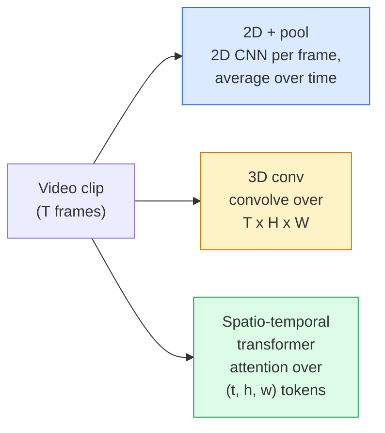
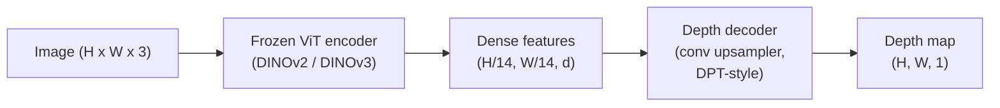
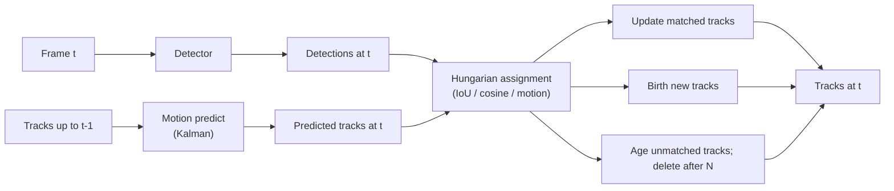
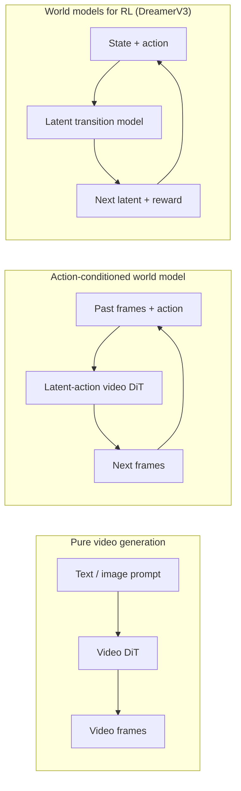

# Video, Tracking, 3D & Depth Vision

> Combined lessons (6 parts), merged verbatim — no content removed.

**Type:** Combined

---

## Part 1 (ch077): Video Understanding — Temporal Modeling

> A video is a sequence of images plus the physics that connects them. Every video model either treats time as an extra axis (3D conv), a sequence to attend over (transformer), or a feature to extract once and pool (2D+pool).

**Type:** Learn + Build
**Languages:** Python
**Prerequisites:** Phase 4 Lesson 03 (CNNs), Phase 4 Lesson 04 (Image Classification)
**Time:** ~45 minutes

## Learning Objectives

- Distinguish 2D+pool, 3D conv, and spatio-temporal transformer approaches
- Implement frame sampling and a 2D+pool baseline classifier
- Explain I3D inflation and (2+1)D factorised convs
- Read Kinetics, UCF101, Something-Something metrics

## The Problem

A 30-second video at 30 fps is 900 images. When action is defined by motion itself ("pushing left to right"), looking at single frames fails.

## The Concept

### Three architectural families



### Frame sampling

- Uniform: pick T evenly across clip.
- Dense: random contiguous T-frame window.
- Multi-clip: sample multiple windows, average predictions.

## Build It

### Step 1: Frame sampler

```python
import numpy as np

def sample_uniform(num_frames_total, T):
    if num_frames_total <= T:
        return list(range(num_frames_total)) + [num_frames_total - 1] * (T - num_frames_total)
    step = num_frames_total / T
    return [int(i * step) for i in range(T)]

def sample_dense(num_frames_total, T, rng=None):
    rng = rng or np.random.default_rng()
    if num_frames_total <= T:
        return list(range(num_frames_total)) + [num_frames_total - 1] * (T - num_frames_total)
    start = int(rng.integers(0, num_frames_total - T + 1))
    return list(range(start, start + T))
```

### Step 2: 2D+pool baseline

```python
import torch
import torch.nn as nn
from torchvision.models import resnet18, ResNet18_Weights

class FramePool(nn.Module):
    def __init__(self, num_classes=400, pretrained=True):
        super().__init__()
        weights = ResNet18_Weights.IMAGENET1K_V1 if pretrained else None
        backbone = resnet18(weights=weights)
        self.features = nn.Sequential(*(list(backbone.children())[:-1]))
        self.head = nn.Linear(512, num_classes)

    def forward(self, x):
        N, T = x.shape[:2]
        x = x.view(N * T, *x.shape[2:])
        feats = self.features(x).view(N, T, -1)
        pooled = feats.mean(dim=1)
        return self.head(pooled)

model = FramePool(num_classes=10)
x = torch.randn(2, 8, 3, 224, 224)
print(f"output: {model(x).shape}")
```

### Step 3: I3D-style inflated 3D conv

```python
def inflate_2d_to_3d(conv2d, time_kernel=3):
    out_c, in_c, kh, kw = conv2d.weight.shape
    weight_3d = conv2d.weight.data.unsqueeze(2)
    weight_3d = weight_3d.repeat(1, 1, time_kernel, 1, 1) / time_kernel
    conv3d = nn.Conv3d(in_c, out_c, kernel_size=(time_kernel, kh, kw),
                        padding=(time_kernel // 2, conv2d.padding[0], conv2d.padding[1]),
                        stride=(1, conv2d.stride[0], conv2d.stride[1]),
                        bias=False)
    conv3d.weight.data = weight_3d
    return conv3d
```

### Step 4: Factorised (2+1)D conv

```python
class Conv2Plus1D(nn.Module):
    def __init__(self, in_c, out_c, kernel_size=3):
        super().__init__()
        mid_c = (in_c * out_c * kernel_size * kernel_size * kernel_size) \
                // (in_c * kernel_size * kernel_size + out_c * kernel_size)
        self.spatial = nn.Conv3d(in_c, mid_c, kernel_size=(1, kernel_size, kernel_size),
                                 padding=(0, kernel_size // 2, kernel_size // 2), bias=False)
        self.bn = nn.BatchNorm3d(mid_c)
        self.act = nn.ReLU(inplace=True)
        self.temporal = nn.Conv3d(mid_c, out_c, kernel_size=(kernel_size, 1, 1),
                                  padding=(kernel_size // 2, 0, 0), bias=False)

    def forward(self, x):
        return self.temporal(self.act(self.bn(self.spatial(x))))
```

## Use It

- `torchvision.models.video` — R(2+1)D, MViT, Swin3D
- `pytorchvideo` — model zoo, data loaders for Kinetics/SSv2/AVA

## Ship It

- `outputs/prompt-video-architecture-picker.md`
- `outputs/skill-frame-sampler-auditor.md`

## Exercises

1. **(Easy)** Compute FLOPs for FramePool vs 3D ResNet.
2. **(Medium)** Generate synthetic motion dataset; show FramePool fails.
3. **(Hard)** Build R(2+1)D-18; train on motion dataset to beat FramePool.

## Key Terms

## Further Reading

- [I3D (Carreira & Zisserman, 2017)](https://arxiv.org/abs/1705.07750)
- [R(2+1)D (Tran et al., 2018)](https://arxiv.org/abs/1711.11248)
- [TimeSformer (Bertasius et al., 2021)](https://arxiv.org/abs/2102.05095)

[Reference](https://github.com/rohitg00/ai-engineering-from-scratch/tree/main/phases/04-computer-vision/12-video-understanding)

---

## Part 2 (ch078): 3D Vision — Point Clouds & NeRFs

> 3D vision comes in two flavours. Point clouds are the sensor's raw output. NeRFs are the learned volumetric field. Both answer "what is where in space."

**Type:** Learn + Build
**Languages:** Python
**Prerequisites:** Phase 4 Lesson 03 (CNNs), Phase 1 Lesson 12 (Tensor Operations)
**Time:** ~45 minutes

## Learning Objectives

- Distinguish explicit (point cloud, mesh, voxel) and implicit (SDF, NeRF) 3D representations
- Understand PointNet's symmetric-function trick for permutation invariance
- Trace a NeRF forward pass: ray casting, volumetric rendering, positional encoding
- Use `nerfstudio` or `instant-ngp` for 3D reconstruction from photos

## The Problem

A camera produces 2D images. A LIDAR produces unordered 3D points. Both are "vision" but neither looks like a dense CNN tensor. 3D understanding is required for grasping, navigation, AR, and 3D content capture.

## The Concept

### PointNet

```
f(P) = max_{p in P} MLP(p)
```

Shared MLP + max pool = permutation-invariant global feature.


### NeRF

Network maps `(x, y, z, viewing_direction)` to `(density, colour)`. Rendered by casting rays, sampling points, compositing.

### Positional encoding

```
gamma(p) = (sin(2^0 pi p), cos(2^0 pi p), sin(2^1 pi p), cos(2^1 pi p), ...)
```

### Volumetric rendering

```
C(r) = sum_i T_i * (1 - exp(-sigma_i * delta_i)) * c_i
T_i  = exp(- sum_{j<i} sigma_j * delta_j)
```

## Build It

### Step 1: PointNet classifier

```python
import torch
import torch.nn as nn

class PointNet(nn.Module):
    def __init__(self, num_classes=10):
        super().__init__()
        self.mlp1 = nn.Sequential(
            nn.Conv1d(3, 64, 1),    nn.BatchNorm1d(64),   nn.ReLU(inplace=True),
            nn.Conv1d(64, 64, 1),   nn.BatchNorm1d(64),   nn.ReLU(inplace=True),
        )
        self.mlp2 = nn.Sequential(
            nn.Conv1d(64, 128, 1),  nn.BatchNorm1d(128),  nn.ReLU(inplace=True),
            nn.Conv1d(128, 1024, 1), nn.BatchNorm1d(1024), nn.ReLU(inplace=True),
        )
        self.head = nn.Sequential(
            nn.Linear(1024, 512),   nn.BatchNorm1d(512),  nn.ReLU(inplace=True),
            nn.Dropout(0.3),
            nn.Linear(512, 256),    nn.BatchNorm1d(256),  nn.ReLU(inplace=True),
            nn.Dropout(0.3),
            nn.Linear(256, num_classes),
        )

    def forward(self, x):
        x = self.mlp1(x)
        x = self.mlp2(x)
        x = torch.max(x, dim=-1)[0]
        return self.head(x)

pts = torch.randn(4, 3, 1024)
net = PointNet(num_classes=10)
print(f"output: {net(pts).shape}")
```

### Step 2: Positional encoding

```python
def positional_encoding(x, L=10):
    freqs = 2.0 ** torch.arange(L, dtype=x.dtype, device=x.device)
    args = x.unsqueeze(-1) * freqs * 3.141592653589793
    sinc = torch.cat([args.sin(), args.cos()], dim=-1)
    return sinc.reshape(*x.shape[:-1], -1)

x = torch.randn(5, 3)
y = positional_encoding(x, L=10)
print(f"input: {x.shape}  encoded: {y.shape}")
```

### Step 3: Tiny NeRF MLP

```python
class TinyNeRF(nn.Module):
    def __init__(self, L_pos=10, L_dir=4, hidden=128):
        super().__init__()
        self.L_pos = L_pos
        self.L_dir = L_dir
        pos_dim = 3 * 2 * L_pos
        dir_dim = 3 * 2 * L_dir
        self.trunk = nn.Sequential(
            nn.Linear(pos_dim, hidden), nn.ReLU(inplace=True),
            nn.Linear(hidden, hidden),  nn.ReLU(inplace=True),
            nn.Linear(hidden, hidden),  nn.ReLU(inplace=True),
            nn.Linear(hidden, hidden),  nn.ReLU(inplace=True),
        )
        self.sigma = nn.Linear(hidden, 1)
        self.color = nn.Sequential(
            nn.Linear(hidden + dir_dim, hidden // 2), nn.ReLU(inplace=True),
            nn.Linear(hidden // 2, 3), nn.Sigmoid(),
        )

    def forward(self, x, d):
        x_enc = positional_encoding(x, self.L_pos)
        d_enc = positional_encoding(d, self.L_dir)
        h = self.trunk(x_enc)
        sigma = torch.relu(self.sigma(h)).squeeze(-1)
        rgb = self.color(torch.cat([h, d_enc], dim=-1))
        return sigma, rgb

nerf = TinyNeRF()
x = torch.randn(128, 3)
d = torch.randn(128, 3)
s, c = nerf(x, d)
print(f"sigma: {s.shape}   rgb: {c.shape}")
```

### Step 4: Volumetric rendering

```python
def volumetric_render(sigma, rgb, t_vals):
    delta = torch.cat([t_vals[1:] - t_vals[:-1], torch.full_like(t_vals[:1], 1e10)])
    alpha = 1.0 - torch.exp(-sigma * delta)
    trans = torch.cumprod(torch.cat([torch.ones_like(alpha[..., :1]), 1.0 - alpha + 1e-10], dim=-1), dim=-1)[..., :-1]
    weights = alpha * trans
    rendered = (weights.unsqueeze(-1) * rgb).sum(dim=-2)
    depth = (weights * t_vals).sum(dim=-1)
    return rendered, depth, weights

N = 64
t_vals = torch.linspace(2.0, 6.0, N)
sigma = torch.rand(N) * 0.5
rgb = torch.rand(N, 3)
rendered, depth, weights = volumetric_render(sigma, rgb, t_vals)
print(f"rendered colour: {rendered.tolist()}")
```

## Use It

- `nerfstudio` — reference for NeRF/Instant-NGP/Gaussian Splatting
- `pytorch3d` — differentiable rendering, point-cloud ops
- `open3d` — point cloud processing

## Ship It

- `outputs/prompt-3d-task-router.md`
- `outputs/skill-point-cloud-loader.md`

## Exercises

1. **(Easy)** Verify PointNet permutation invariance.
2. **(Medium)** Implement ray generation from camera intrinsics.
3. **(Hard)** Train TinyNeRF on a synthetic coloured cube.

## Key Terms

## Further Reading

- [PointNet (Qi et al., 2017)](https://arxiv.org/abs/1612.00593)
- [NeRF (Mildenhall et al., 2020)](https://arxiv.org/abs/2003.08934)
- [Instant-NGP (Müller et al., 2022)](https://arxiv.org/abs/2201.05989)
- [3D Gaussian Splatting (Kerbl et al., 2023)](https://arxiv.org/abs/2308.04079)

[Reference](https://github.com/rohitg00/ai-engineering-from-scratch/tree/main/phases/04-computer-vision/13-3d-vision-nerf)

---

## Part 3 (ch087): 3D Gaussian Splatting from Scratch

> A scene is a cloud of millions of 3D Gaussians. Each one has a position, orientation, scale, opacity, and a colour that depends on viewing direction. Rasterise them, backprop through the rasterisation, done.

**Type:** Build
**Languages:** Python
**Prerequisites:** Phase 4 Lesson 13 (3D Vision & NeRF), Phase 1 Lesson 12 (Tensor Operations)
**Time:** ~90 minutes

## Learning Objectives

- Explain why 3DGS replaced NeRF as the production default
- State the six per-Gaussian parameters and how many floats each contributes
- Implement a 2D Gaussian splatting rasteriser with alpha compositing
- Use `nerfstudio` or `gsplat` to reconstruct a scene from photos

## The Problem

NeRF stores a scene as MLP weights. Training hours, rendering seconds, cannot edit. 3DGS stores explicit 3D Gaussians — rendering at 100+ fps, training minutes, edit by translating a subset.

## The Concept

### What a Gaussian carries

```
position    mu         (3,)
rotation    q          (4,)   unit quaternion
scale       s          (3,)   log-scales
opacity     alpha      (1,)   [0, 1]
SH coeffs   c_lm       (3 * (L+1)^2,)
```

### Rasterisation, not ray marching


### Projection

```
mu' = project(mu)
Sigma' = J W Sigma W^T J^T
```

### Alpha compositing

```
C_pixel = sum_i alpha_i * T_i * c_i
T_i = prod_{j < i} (1 - alpha_j)
```

### Densification and pruning

Clone where gradient high and scale small. Split large Gaussians. Prune low-opacity ones.

## Build It

### Step 1: 2D Gaussian evaluation

```python
import torch
import torch.nn as nn
import torch.nn.functional as F

def eval_2d_gaussian(means, covs, points):
    G = means.size(0)
    H, W, _ = points.shape
    flat = points.view(-1, 2)
    inv = torch.linalg.inv(covs)
    diff = flat[None, :, :] - means[:, None, :]
    d = torch.einsum("gpi,gij,gpj->gp", diff, inv, diff)
    density = torch.exp(-0.5 * d)
    return density.view(G, H, W)
```

### Step 2: 2D splatting rasteriser

```python
def rasterise_2d(means, covs, colours, opacities, depths, image_size):
    H, W = image_size
    yy, xx = torch.meshgrid(
        torch.arange(H, dtype=torch.float32, device=means.device),
        torch.arange(W, dtype=torch.float32, device=means.device),
        indexing="ij",
    )
    points = torch.stack([xx, yy], dim=-1)

    densities = eval_2d_gaussian(means, covs, points)
    alphas = opacities[:, None, None] * densities
    alphas = alphas.clamp(0.0, 0.99)

    order = torch.argsort(depths)
    alphas = alphas[order]
    colours_sorted = colours[order]

    T = torch.ones(H, W, device=means.device)
    out = torch.zeros(H, W, 3, device=means.device)
    for i in range(means.size(0)):
        a = alphas[i]
        out += (T * a)[..., None] * colours_sorted[i][None, None, :]
        T = T * (1.0 - a)
    return out
```

### Step 3: Trainable 2D splat scene

```python
import math

class Splats2D(nn.Module):
    def __init__(self, num_splats=128, image_size=64, seed=0):
        super().__init__()
        g = torch.Generator().manual_seed(seed)
        H, W = image_size, image_size
        self.means = nn.Parameter(torch.rand(num_splats, 2, generator=g) * torch.tensor([W, H]))
        self.log_scale = nn.Parameter(torch.ones(num_splats, 2) * math.log(2.0))
        self.rot = nn.Parameter(torch.zeros(num_splats))
        self.colour_logits = nn.Parameter(torch.randn(num_splats, 3, generator=g) * 0.5)
        self.opacity_logit = nn.Parameter(torch.zeros(num_splats))
        self.depth = nn.Parameter(torch.rand(num_splats, generator=g))

    def covs(self):
        s = torch.exp(self.log_scale)
        c, si = torch.cos(self.rot), torch.sin(self.rot)
        R = torch.stack([
            torch.stack([c, -si], dim=-1),
            torch.stack([si, c], dim=-1),
        ], dim=-2)
        S = torch.diag_embed(s ** 2)
        return R @ S @ R.transpose(-1, -2)

    def forward(self, image_size):
        covs = self.covs()
        colours = torch.sigmoid(self.colour_logits)
        opacities = torch.sigmoid(self.opacity_logit)
        return rasterise_2d(self.means, covs, colours, opacities, self.depth, image_size)
```

### Step 4: Fit to target image

```python
import numpy as np

def make_target(size=64):
    yy, xx = np.meshgrid(np.arange(size), np.arange(size), indexing="ij")
    img = np.zeros((size, size, 3), dtype=np.float32)
    mask = (xx - 20) ** 2 + (yy - 20) ** 2 < 10 ** 2
    img[mask] = [1.0, 0.2, 0.2]
    mask = (np.abs(xx - 45) < 8) & (np.abs(yy - 40) < 8)
    img[mask] = [0.2, 0.3, 1.0]
    return torch.from_numpy(img)

target = make_target(64)
model = Splats2D(num_splats=64, image_size=64)
opt = torch.optim.Adam(model.parameters(), lr=0.05)

for step in range(200):
    pred = model((64, 64))
    loss = F.mse_loss(pred, target)
    opt.zero_grad(); loss.backward(); opt.step()
    if step % 40 == 0:
        print(f"step {step:3d}  mse {loss.item():.4f}")
```

### Step 5: From 2D to 3D

Additions: quaternion rotation, 3x3 covariance, camera projection, spherical harmonics colour.

### Step 6: SH evaluation (degree 3)

```python
def eval_sh_degree_3(sh_coeffs, dirs):
    C0 = 0.282094791773878
    C1 = 0.488602511902920
    x, y, z = dirs[..., 0], dirs[..., 1], dirs[..., 2]
    result = C0 * sh_coeffs[..., 0, :]
    result = result - C1 * y[..., None] * sh_coeffs[..., 1, :]
    result = result + C1 * z[..., None] * sh_coeffs[..., 2, :]
    result = result - C1 * x[..., None] * sh_coeffs[..., 3, :]
    return result
```

## Use It

```bash
pip install nerfstudio gsplat
ns-train splatfacto --data path/to/data
```

Export: `.ply`, `.splat`, glTF `KHR_gaussian_splatting`, OpenUSD.

## Ship It

- `outputs/prompt-3dgs-capture-planner.md`
- `outputs/skill-3dgs-export-router.md`

## Exercises

1. **(Easy)** Train 2D splats with num_splats in [16, 64, 256]; plot MSE.
2. **(Medium)** Add view-dependent colour with degree-2 harmonics.
3. **(Hard)** Train splatfacto on a 20-photo capture; export to glTF.

## Key Terms

## Further Reading

- [3DGS (Kerbl et al., SIGGRAPH 2023)](https://repo-sam.inria.fr/fungraph/3d-gaussian-splatting/)
- [gsplat](https://github.com/nerfstudio-project/gsplat)
- [nerfstudio Splatfacto](https://docs.nerf.studio/nerfology/methods/splat.html)
- [KHR_gaussian_splatting](https://github.com/KhronosGroup/glTF/blob/main/extensions/2.0/Khronos/KHR_gaussian_splatting/README.md)

[Reference](https://github.com/rohitg00/ai-engineering-from-scratch/tree/main/phases/04-computer-vision/22-3d-gaussian-splatting)

---

## Part 4 (ch091): Monocular Depth & Geometry Estimation

> A depth map is a single-channel image where each pixel is a distance from the camera. Predicting it from one RGB frame used to be impossible without stereo or LiDAR. In 2026 a frozen ViT encoder plus a lightweight head gets within a few percent of ground truth.

**Type:** Build + Use
**Languages:** Python
**Prerequisites:** Phase 4 Lesson 14 (ViT), Phase 4 Lesson 17 (Self-Supervised Vision), Phase 4 Lesson 07 (U-Net)
**Time:** ~60 minutes

## Learning Objectives

- Distinguish relative and metric depth and state which one each production model (MiDaS, Marigold, Depth Anything V3, ZoeDepth) solves
- Use Depth Anything V3 (DINOv2 backbone) to predict depth for arbitrary single images with no calibration
- Explain why monocular depth works at all from a single image (perspective cues, texture gradients, learned priors) and what it cannot recover (absolute scale, occluded geometry)
- Lift 2D detections to 3D points using a depth map and pinhole camera intrinsics

## The Problem

Depth is the missing axis in 2D computer vision. Given RGB, you know where things appear in the image plane; you do not know how far they are. Depth sensors (stereo rigs, LiDAR, time-of-flight) solve this directly but are expensive, fragile, and limited in range.

Monocular depth estimation — predicting depth from a single RGB frame — used to produce blurry, unreliable output. By 2026 large pretrained encoders changed that: Depth Anything V3 uses a frozen DINOv2 backbone and produces depth maps that generalise across indoor, outdoor, medical, and satellite domains. Marigold reframes depth as a conditional diffusion problem. ZoeDepth regresses true metric distances.

Depth is also the bridge between 2D detection and 3D understanding: multiply a detected box's pixels by depth and you lift the 2D object into a 3D point cloud. That is the core of every AR occlusion system, every obstacle-avoidance pipeline, and every "pick up the cup" robot.

## The Concept

### Relative vs metric depth

- **Relative depth** — ordered `z` values without a real-world unit.
- **Metric depth** — absolute distance in metres from the camera.

MiDaS and Depth Anything V3 produce relative depth. Marigold produces relative depth. ZoeDepth, UniDepth, and Metric3D produce metric depth.

### The encoder-decoder pattern



Depth Anything V3 freezes the encoder and trains only the DPT-style decoder.

### Why a single image produces depth at all

- **Perspective** — parallel lines in 3D converge in 2D.
- **Texture gradient** — surfaces far away have smaller, denser texture.
- **Occlusion order** — nearer objects occlude farther ones.
- **Size constancy** — known objects (cars, humans) give approximate scale.
- **Atmospheric perspective** — distant objects appear hazier and bluer in outdoor scenes.

### What monocular depth cannot do

- **Absolute metric scale** without intrinsics or a known object in the scene.
- **Occluded geometry** — the back of a chair is unseen.
- **Truly untextured / reflective surfaces** — mirrors, glass, uniform walls.

### Depth Anything V3 in 2026

- Vanilla DINOv2 ViT-L/14 as encoder (frozen).
- DPT decoder.
- Trained on posed image pairs from diverse sources.
- Predicts spatially consistent geometry from an arbitrary number of visual inputs.

### Marigold — diffusion for depth

Marigold (Ke et al., CVPR 2024) reframes depth estimation as conditional image-to-image diffusion. Output depth maps are exceptionally sharp at object boundaries. Trade-off: slower inference than feed-forward models (10-50 denoising steps).

### Intrinsics and the pinhole camera

```
fx, fy, cx, cy = camera intrinsics
X = (u - cx) * d / fx
Y = (v - cy) * d / fy
Z = d
```

### Evaluation

- **AbsRel** (absolute relative error): `mean(|d_pred - d_gt| / d_gt)`. 0.05-0.1 for production models.
- **delta < 1.25**: fraction of pixels where `max(d_pred/d_gt, d_gt/d_pred) < 1.25`. 0.9+ for SOTA.

## Build It

### Step 1: Depth metrics

```python
import torch

def abs_rel_error(pred, target, mask=None):
    if mask is not None:
        pred = pred[mask]
        target = target[mask]
    return (torch.abs(pred - target) / target.clamp(min=1e-6)).mean().item()

def delta_accuracy(pred, target, threshold=1.25, mask=None):
    if mask is not None:
        pred = pred[mask]
        target = target[mask]
    ratio = torch.maximum(pred / target.clamp(min=1e-6), target / pred.clamp(min=1e-6))
    return (ratio < threshold).float().mean().item()
```

### Step 2: Scale-and-shift alignment

```python
def align_scale_shift(pred, target, mask=None):
    if mask is not None:
        p = pred[mask]
        t = target[mask]
    else:
        p = pred.flatten()
        t = target.flatten()
    A = torch.stack([p, torch.ones_like(p)], dim=1)
    coeffs, *_ = torch.linalg.lstsq(A, t.unsqueeze(-1))
    a, b = coeffs[:2, 0]
    return a * pred + b
```

### Step 3: Lift depth to a point cloud

```python
import numpy as np

def depth_to_point_cloud(depth, intrinsics):
    H, W = depth.shape
    fx, fy, cx, cy = intrinsics
    v, u = np.meshgrid(np.arange(H), np.arange(W), indexing="ij")
    z = depth
    x = (u - cx) * z / fx
    y = (v - cy) * z / fy
    return np.stack([x, y, z], axis=-1)

depth = np.random.uniform(0.5, 4.0, (240, 320))
intr = (320.0, 320.0, 160.0, 120.0)
pc = depth_to_point_cloud(depth, intr)
print(f"point cloud shape: {pc.shape}  (H, W, 3)")
```

### Step 4: Smoke test with a synthetic depth scene

```python
def synthetic_depth(size=96):
    yy, xx = np.meshgrid(np.arange(size), np.arange(size), indexing="ij")
    depth = 1.0 + (yy / size) * 4.0
    mask = (np.abs(xx - size / 2) < size / 6) & (np.abs(yy - size * 0.6) < size / 6)
    depth[mask] = 2.0
    return depth.astype(np.float32)

gt = torch.from_numpy(synthetic_depth(96))
pred = gt + 0.3 * torch.randn_like(gt)
aligned = align_scale_shift(pred, gt)
print(f"before align  absRel = {abs_rel_error(pred, gt):.3f}")
print(f"after align   absRel = {abs_rel_error(aligned, gt):.3f}")
```

### Step 5: Depth Anything V3 usage (reference)

```python
import torch
from transformers import pipeline
from PIL import Image

pipe = pipeline(task="depth-estimation", model="LiheYoung/depth-anything-v2-large")

image = Image.open("street.jpg").convert("RGB")
out = pipe(image)
depth_np = np.array(out["depth"])
```

## Use It

- **Depth Anything V3** — the default for relative depth.
- **Marigold** — highest visual quality, slow inference.
- **UniDepth** — metric depth with camera intrinsics estimation.
- **ZoeDepth** — older, still reliable.
- **MiDaS v3.1** — legacy but stable.

Typical integration: RGB frame → depth model → detector → lift box centroids through depth to 3D → downstream AR occlusion, path planning, object-size estimation.

## Ship It

This lesson produces:

- `outputs/prompt-depth-model-picker.md` — picks between Depth Anything V3, Marigold, UniDepth, MiDaS given latency, metric-vs-relative need, and scene type.
- `outputs/skill-depth-to-pointcloud.md` — a skill that builds point clouds from depth maps with correct intrinsics handling and export to `.ply`.

## Exercises

1. **(Easy)** Run Depth Anything V2 on any 10 images of your desk. Save depth as grayscale PNGs and inspect. Identify one object whose predicted depth looks wrong and explain why the monocular cues failed.
2. **(Medium)** Given RGB + depth from Depth Anything V2, lift to a point cloud and render with `open3d`. Compare two scenes (indoor / outdoor).
3. **(Hard)** Take five pairs of images that differ only by a known object's position (e.g. bottle moved 30 cm closer). Use UniDepth to predict metric depth on both. Report the predicted distance delta vs the true 30 cm.

## Key Terms

| Term | What people say | What it actually means |
|------|----------------|----------------------|
| Monocular depth | "Single-image depth" | Depth estimation from one RGB frame, no stereo or LiDAR |
| Relative depth | "Ordered depth" | Ordered z-values without real-world units |
| Metric depth | "Absolute distance" | Depth in metres; requires calibration or a model trained with metric supervision |
| AbsRel | "Absolute relative error" | Mean of |d_pred - d_gt| / d_gt; standard depth metric |
| Delta accuracy | "delta < 1.25" | Fraction of pixels with prediction within 25% of ground truth |
| Pinhole camera | "fx, fy, cx, cy" | The camera model used to lift (u, v, d) to (X, Y, Z) |
| DPT | "Dense Prediction Transformer" | The conv-based decoder used on top of frozen ViT encoders for depth |
| DINOv2 backbone | "The reason it works" | Self-supervised features that generalise across domains without depth labels |

## Further Reading

- [Depth Anything V3 paper page](https://depth-anything.github.io/)
- [Marigold (Ke et al., CVPR 2024)](https://marigoldmonodepth.github.io/)
- [UniDepth (Piccinelli et al., 2024)](https://arxiv.org/abs/2403.18913)
- [MiDaS v3.1 (Intel ISL)](https://github.com/isl-org/MiDaS)
- [DINOv3 blog post (Meta)](https://ai.meta.com/blog/dinov3-self-supervised-vision-model/)

> Reference: [ai-engineering/phases/04-computer-vision/26-monocular-depth/docs/en.md](https://github.com/anomalyco/ai-engineering/blob/main/phases/04-computer-vision/26-monocular-depth/docs/en.md)

---

## Part 5 (ch092): Multi-Object Tracking & Video Memory

> Tracking is detection plus association. Detect every frame. Match this frame's detections to last frame's tracks by ID.

**Type:** Build
**Languages:** Python
**Prerequisites:** Phase 4 Lesson 06 (YOLO Detection), Phase 4 Lesson 08 (Mask R-CNN), Phase 4 Lesson 24 (SAM 3)
**Time:** ~60 minutes

## Learning Objectives

- Distinguish tracking-by-detection from query-based tracking and name the algorithm families (SORT, DeepSORT, ByteTrack, BoT-SORT, SAM 2 memory tracker, SAM 3.1 Object Multiplex)
- Implement IoU + Hungarian assignment from scratch for classic tracking-by-detection
- Explain SAM 2's memory bank and why it handles occlusion better than IoU-based association
- Read the three tracking metrics (MOTA, IDF1, HOTA) and pick which one matters for a given use case

## The Problem

A detector tells you where the objects are in a single frame. A tracker tells you which detection in frame `t` is the same object as a detection in frame `t-1`. Without that, you cannot count objects crossing a line, follow a ball through an occlusion, or know "car #4 has been in the lane for 8 seconds."

Tracking is essential to every video-facing product: sports analytics, surveillance, autonomous driving, medical video analysis, wildlife monitoring. The core building blocks are shared: a per-frame detector, a motion model (Kalman filter or something richer), an association step (Hungarian algorithm on IoU / cosine / learned features), and a track lifecycle (birth, update, death).

2026 brought two new patterns: **SAM 2 memory-based tracking** (feature-memory instead of motion-model association) and **SAM 3.1 Object Multiplex** (shared memory for many instances of the same concept). This lesson walks the classical stack first, then the memory-based approach.

## The Concept

### Tracking-by-detection



Every tracker you will encounter in 2026 is a variation on this loop:

- **SORT** (2016): Kalman filter + IoU Hungarian. Simple, fast, no appearance model.
- **DeepSORT** (2017): SORT + a CNN-based appearance feature per track (ReID embedding).
- **ByteTrack** (2021): associates low-confidence detections as a second stage.
- **BoT-SORT** (2022): Byte + camera motion compensation + ReID.
- **StrongSORT / OC-SORT** — ByteTrack descendants with better motion and appearance.

### Kalman filter in one paragraph

A Kalman filter maintains a per-track state `(x, y, w, h, dx, dy, dw, dh)` with a covariance. At each frame, **predict** the state using a constant-velocity model, then **update** with the matched detection. This gives smooth trajectories and the ability to continue a track through a short occlusion (1-5 frames).

### The Hungarian algorithm

Given an `M x N` cost matrix (tracks x detections), find the one-to-one assignment that minimises total cost. Cost is usually `1 - IoU(track_bbox, detection_bbox)` or negative cosine similarity.

### ByteTrack's key idea

Standard trackers drop low-confidence detections (< 0.5). ByteTrack keeps them as **second-stage candidates**: after matching tracks to high-confidence detections, unmatched tracks try to match low-confidence detections with a looser IoU threshold.

### SAM 2 memory-based tracking

SAM 2 handles video by keeping a **memory bank** of per-instance spatio-temporal features. On subsequent frames, the memory is cross-attended against the new frame's features, and the decoder produces a mask for the same instance.

No Kalman filter, no Hungarian assignment. The association is implicit in the memory-attention operation.

### SAM 3.1 Object Multiplex

Prior SAM 2 / SAM 3 tracking keeps a separate memory bank per instance. Object Multiplex (March 2026) collapses them into one shared memory with **per-instance query tokens**. Cost scales sub-linearly in number of instances.

### Three metrics to know

- **MOTA** — 1 - (FN + FP + ID switches) / GT. Conflates detection and association failures.
- **IDF1** — harmonic mean of ID precision and recall. For ID-switch-sensitive tasks.
- **HOTA** — decomposes into detection accuracy (DetA) and association accuracy (AssA). Community standard.

## Build It

### Step 1: IoU-based cost matrix

```python
import numpy as np

def bbox_iou(a, b):
    ax1, ay1, ax2, ay2 = a[:, 0], a[:, 1], a[:, 2], a[:, 3]
    bx1, by1, bx2, by2 = b[:, 0], b[:, 1], b[:, 2], b[:, 3]
    inter_x1 = np.maximum(ax1[:, None], bx1[None, :])
    inter_y1 = np.maximum(ay1[:, None], by1[None, :])
    inter_x2 = np.minimum(ax2[:, None], bx2[None, :])
    inter_y2 = np.minimum(ay2[:, None], by2[None, :])
    inter = np.clip(inter_x2 - inter_x1, 0, None) * np.clip(inter_y2 - inter_y1, 0, None)
    area_a = (ax2 - ax1) * (ay2 - ay1)
    area_b = (bx2 - bx1) * (by2 - by1)
    union = area_a[:, None] + area_b[None, :] - inter
    return inter / np.clip(union, 1e-8, None)
```

### Step 2: Minimal SORT-style tracker

```python
from scipy.optimize import linear_sum_assignment

class Track:
    def __init__(self, tid, bbox, frame):
        self.id = tid
        self.bbox = bbox
        self.last_frame = frame
        self.hits = 1

    def update(self, bbox, frame):
        self.bbox = bbox
        self.last_frame = frame
        self.hits += 1


class SimpleTracker:
    def __init__(self, iou_threshold=0.3, max_age=5):
        self.tracks = []
        self.next_id = 1
        self.iou_threshold = iou_threshold
        self.max_age = max_age

    def step(self, detections, frame):
        if not self.tracks:
            for d in detections:
                self.tracks.append(Track(self.next_id, d, frame))
                self.next_id += 1
            return [(t.id, t.bbox) for t in self.tracks]

        track_boxes = np.array([t.bbox for t in self.tracks])
        det_boxes = np.array(detections) if len(detections) else np.empty((0, 4))

        iou = bbox_iou(track_boxes, det_boxes) if len(det_boxes) else np.zeros((len(track_boxes), 0))
        cost = 1 - iou
        cost[iou < self.iou_threshold] = 1e6

        matched_track = set()
        matched_det = set()
        if cost.size > 0:
            row, col = linear_sum_assignment(cost)
            for r, c in zip(row, col):
                if cost[r, c] < 1.0:
                    self.tracks[r].update(det_boxes[c], frame)
                    matched_track.add(r); matched_det.add(c)

        for i, d in enumerate(det_boxes):
            if i not in matched_det:
                self.tracks.append(Track(self.next_id, d, frame))
                self.next_id += 1

        self.tracks = [t for t in self.tracks if frame - t.last_frame <= self.max_age]
        return [(t.id, t.bbox) for t in self.tracks]
```

### Step 3: Synthetic trajectory test

```python
def synthetic_frames(num_frames=20, num_objects=3, H=240, W=320, seed=0):
    rng = np.random.default_rng(seed)
    starts = rng.uniform(20, 200, size=(num_objects, 2))
    velocities = rng.uniform(-5, 5, size=(num_objects, 2))
    frames = []
    for f in range(num_frames):
        dets = []
        for i in range(num_objects):
            cx, cy = starts[i] + f * velocities[i]
            dets.append([cx - 10, cy - 10, cx + 10, cy + 10])
        frames.append(dets)
    return frames

tracker = SimpleTracker()
for f, dets in enumerate(synthetic_frames()):
    tracks = tracker.step(dets, f)
```

### Step 4: ID-switch metric

```python
def count_id_switches(tracks_per_frame, gt_per_frame):
    prev_assignment = {}
    switches = 0
    for tracks, gts in zip(tracks_per_frame, gt_per_frame):
        if not tracks or not gts:
            continue
        t_boxes = np.array([b for _, b in tracks])
        g_boxes = np.array([b for _, b in gts])
        iou = bbox_iou(g_boxes, t_boxes)
        for g_idx, (gt_id, _) in enumerate(gts):
            j = iou[g_idx].argmax()
            if iou[g_idx, j] > 0.5:
                t_id = tracks[j][0]
                if gt_id in prev_assignment and prev_assignment[gt_id] != t_id:
                    switches += 1
                prev_assignment[gt_id] = t_id
    return switches
```

## Use It

Production trackers in 2026:

- `ultralytics` — YOLOv8 + ByteTrack / BoT-SORT built-in.
- `supervision` (Roboflow) — ByteTrack wrappers plus annotation utilities.
- SAM 2 / SAM 3.1 — memory-based tracking via `processor.track()`.
- Custom stack: detector (YOLOv8 / RT-DETR) + `sort-tracker` / `OC-SORT` / `StrongSORT`.

Picking:
- Pedestrians / cars at 30+ fps: **ByteTrack with ultralytics**.
- Many instances of one class in a crowd: **SAM 3.1 Object Multiplex**.
- Heavy occlusions: **DeepSORT / StrongSORT** (ReID features).
- Sports / complex interactions: **BoT-SORT** or learned trackers (MOTRv3).

## Ship It

This lesson produces:

- `outputs/prompt-tracker-picker.md` — picks SORT / ByteTrack / BoT-SORT / SAM 2 / SAM 3.1 given scene type, occlusion patterns, and latency budget.
- `outputs/skill-mot-evaluator.md` — writes a complete evaluation harness for MOTA / IDF1 / HOTA against ground-truth tracks.

## Exercises

1. **(Easy)** Run the synthetic tracker above with 3, 10, and 30 objects. Report ID-switch count in each case.
2. **(Medium)** Add a constant-velocity Kalman predict step before association. Show that short (2-3 frame) occlusions no longer cause ID switches.
3. **(Hard)** Integrate SAM 2's memory-based tracker (via `transformers`) as an alternative tracker backend. Run both SimpleTracker and SAM 2 on a 30-second clip of a crowd and compare ID-switch counts.

## Key Terms

| Term | What people say | What it actually means |
|------|----------------|----------------------|
| Tracking-by-detection | "Detect then associate" | Per-frame detector + Hungarian assignment on IoU / appearance |
| Kalman filter | "Motion predict" | Linear dynamics + covariance for smooth track predictions and occlusion handling |
| Hungarian algorithm | "Optimal assignment" | Solves the minimum-cost bipartite matching problem |
| ByteTrack | "Low-confidence second pass" | Re-match unmatched tracks to low-confidence detections |
| DeepSORT | "SORT + appearance" | Adds a ReID feature for cross-frame matching |
| Memory bank | "SAM 2 trick" | Per-instance spatio-temporal features stored across frames |
| Object Multiplex | "SAM 3.1 shared memory" | Single shared memory with per-instance queries for fast many-object tracking |
| HOTA | "Modern tracking metric" | Decomposes into detection and association accuracy |

## Further Reading

- [SORT (Bewley et al., 2016)](https://arxiv.org/abs/1602.00763)
- [DeepSORT (Wojke et al., 2017)](https://arxiv.org/abs/1703.07402)
- [ByteTrack (Zhang et al., 2022)](https://arxiv.org/abs/2110.06864)
- [BoT-SORT (Aharon et al., 2022)](https://arxiv.org/abs/2206.14651)
- [HOTA (Luiten et al., 2020)](https://arxiv.org/abs/2009.07736)
- [SAM 2 video segmentation (Meta, 2024)](https://ai.meta.com/sam2/)
- [SAM 3.1 Object Multiplex (Meta, March 2026)](https://ai.meta.com/blog/segment-anything-model-3/)

> Reference: [ai-engineering/phases/04-computer-vision/27-multi-object-tracking/docs/en.md](https://github.com/anomalyco/ai-engineering/blob/main/phases/04-computer-vision/27-multi-object-tracking/docs/en.md)

---

## Part 6 (ch093): World Models & Video Diffusion

> A video model that predicts the next seconds of a scene is a world simulator. Condition that prediction on actions and you have a learned game engine.

**Type:** Learn + Build
**Languages:** Python
**Prerequisites:** Phase 4 Lesson 10 (Diffusion), Phase 4 Lesson 12 (Video Understanding), Phase 4 Lesson 23 (DiT + Rectified Flow)
**Time:** ~75 minutes

## Learning Objectives

- Explain the difference between a pure video generation model (Sora 2) and an action-conditioned world model (Genie 3, DreamerV3)
- Describe a video DiT: spatio-temporal patches, 3D position encoding, joint attention across (T, H, W) tokens
- Trace how a world model plugs into robotics: VLM plans → video model simulates → inverse dynamics emits actions
- Pick between Sora 2, Genie 3, Runway GWM-1 Worlds, Wan-Video, and HunyuanVideo for a given use case

## The Problem

Video generation and world modelling converged in 2026. A model that can generate a coherent minute of video has, in some sense, learned how the world moves: object permanence, gravity, causality, style. If you condition that prediction on actions (walk left, open the door), the video model becomes a learnable simulator that can replace a game engine, a driving simulator, or a robotics environment.

The stakes are concrete. Genie 3 generates playable environments from a single image. Runway GWM-1 Worlds synthesises infinite explorable scenes. Sora 2 produces minute-long videos with synchronised audio and modelled physics. NVIDIA Cosmos-Drive, Wayve Gaia-2, and Tesla DrivingWorld generate realistic driving video for autonomous-vehicle training data.

## The Concept

### Three families of world-modelling



- **Sora 2** is pure video generation conditioned on prompts. No action interface.
- **Genie 3**, **GWM-1 Worlds**, **Mirage / Magica** are action-conditioned world models.
- **DreamerV3** and the classic RL world-model family predict in a latent space.

### Video DiT architecture

```
Video latent:          (C, T, H, W)
Patchify (spatial):    grid of P_h x P_w patches per frame
Patchify (temporal):   group P_t frames into a temporal patch
Resulting tokens:      (T / P_t) * (H / P_h) * (W / P_w) tokens
```

Positional encoding is 3D. Attention can be:
- **Full joint** — all tokens attend to all tokens. O(N^2). Prohibitive for long videos.
- **Divided** — alternate temporal attention and spatial attention. Used by TimeSformer and most video DiTs.
- **Window** — local windows in (t, h, w). Used by Video Swin.

### Conditioning on actions: latent action models

Genie learns a **latent action** per frame by discriminatively predicting the action between a pair of consecutive frames. At inference, a user can specify a latent action and the model generates the next frame consistent with that action.

Sora skips the action interface entirely.

### Physical plausibility

Sora 2's 2026 release explicitly advertised **physical plausibility**: weight, balance, object permanence, cause-and-effect. Plausibility remains the dominant failure mode for all video generation models.

### Autonomous driving world models

- **Cosmos-Drive-Dreams** (NVIDIA) — generates minutes of driving video for RL training.
- **Gaia-2** (Wayve) — trajectory-conditioned scene synthesis for policy evaluation.
- **DrivingWorld** (Tesla) — simulates varied weather, time-of-day, traffic conditions.

### Robotics stack: VLM + video model + inverse dynamics

1. **VLM** parses the goal, plans a high-level action sequence.
2. **Video generation model** simulates what executing each action would look like.
3. **Inverse dynamics model** extracts the concrete motor commands.

### Model landscape in 2026

| Model | Use | Parameters | Output | License |
|-------|-----|------------|--------|---------|
| Sora 2 | text-to-video, audio | — | 1-min 1080p + audio | API only |
| Runway Gen-5 | text/image-to-video | — | 10s clips | API |
| Runway GWM-1 Worlds | interactive world | — | infinite 3D rollout | API |
| Genie 3 | interactive world from image | 11B+ | playable frames | research preview |
| Wan-Video 2.1 | open text-to-video | 14B | high-quality clips | non-commercial |
| HunyuanVideo | open text-to-video | 13B | 10s clips | permissive |
| Cosmos / Cosmos-Drive | autonomous driving sim | 7-14B | driving scenes | NVIDIA open |

## Build It

### Step 1: 3D patchify for video

```python
import torch
import torch.nn as nn

class VideoPatch3D(nn.Module):
    def __init__(self, in_channels=4, dim=64, patch_t=2, patch_h=2, patch_w=2):
        super().__init__()
        self.proj = nn.Conv3d(in_channels, dim, kernel_size=(patch_t, patch_h, patch_w), stride=(patch_t, patch_h, patch_w))
        self.patch_t = patch_t
        self.patch_h = patch_h
        self.patch_w = patch_w

    def forward(self, x):
        x = self.proj(x)
        n, c, t, h, w = x.shape
        tokens = x.reshape(n, c, t * h * w).transpose(1, 2)
        return tokens, (t, h, w)
```

### Step 2: 3D rotary position encoding

```python
def rope_3d(tokens, t_dim, h_dim, w_dim, grid):
    T, H, W = grid
    n, seq, d = tokens.shape
    assert seq == T * H * W
    t_idx = torch.arange(T, device=tokens.device).repeat_interleave(H * W)
    h_idx = torch.arange(H, device=tokens.device).repeat_interleave(W).repeat(T)
    w_idx = torch.arange(W, device=tokens.device).repeat(T * H)
    freqs_t = torch.exp(-torch.log(torch.tensor(10000.0)) * torch.arange(t_dim // 2, device=tokens.device) / (t_dim // 2))
    freqs_h = torch.exp(-torch.log(torch.tensor(10000.0)) * torch.arange(h_dim // 2, device=tokens.device) / (h_dim // 2))
    freqs_w = torch.exp(-torch.log(torch.tensor(10000.0)) * torch.arange(w_dim // 2, device=tokens.device) / (w_dim // 2))
    emb_t = torch.cat([torch.sin(t_idx[:, None] * freqs_t), torch.cos(t_idx[:, None] * freqs_t)], dim=-1)
    emb_h = torch.cat([torch.sin(h_idx[:, None] * freqs_h), torch.cos(h_idx[:, None] * freqs_h)], dim=-1)
    emb_w = torch.cat([torch.sin(w_idx[:, None] * freqs_w), torch.cos(w_idx[:, None] * freqs_w)], dim=-1)
    return tokens + torch.cat([emb_t, emb_h, emb_w], dim=-1)
```

### Step 3: Divided attention block

```python
class DividedAttentionBlock(nn.Module):
    def __init__(self, dim=64, heads=2):
        super().__init__()
        self.time_attn = nn.MultiheadAttention(dim, heads, batch_first=True)
        self.space_attn = nn.MultiheadAttention(dim, heads, batch_first=True)
        self.ln1 = nn.LayerNorm(dim)
        self.ln2 = nn.LayerNorm(dim)
        self.ln3 = nn.LayerNorm(dim)
        self.mlp = nn.Sequential(nn.Linear(dim, 4 * dim), nn.GELU(), nn.Linear(4 * dim, dim))

    def forward(self, x, grid):
        T, H, W = grid
        n, seq, d = x.shape
        xt = x.view(n, T, H * W, d).permute(0, 2, 1, 3).reshape(n * H * W, T, d)
        a, _ = self.time_attn(self.ln1(xt), self.ln1(xt), self.ln1(xt), need_weights=False)
        xt = (xt + a).reshape(n, H * W, T, d).permute(0, 2, 1, 3).reshape(n, seq, d)
        xs = xt.view(n, T, H * W, d).reshape(n * T, H * W, d)
        a, _ = self.space_attn(self.ln2(xs), self.ln2(xs), self.ln2(xs), need_weights=False)
        xs = (xs + a).reshape(n, T, H * W, d).reshape(n, seq, d)
        xs = xs + self.mlp(self.ln3(xs))
        return xs
```

### Step 4: Compose a tiny video DiT

```python
class TinyVideoDiT(nn.Module):
    def __init__(self, in_channels=4, dim=64, depth=2, heads=2):
        super().__init__()
        self.patch = VideoPatch3D(in_channels=in_channels, dim=dim, patch_t=2, patch_h=2, patch_w=2)
        self.blocks = nn.ModuleList([DividedAttentionBlock(dim, heads) for _ in range(depth)])
        self.out = nn.Linear(dim, in_channels * 2 * 2 * 2)

    def forward(self, x):
        tokens, grid = self.patch(x)
        for blk in self.blocks:
            tokens = blk(tokens, grid)
        return self.out(tokens), grid
```

### Step 5: Check shapes

```python
vid = torch.randn(1, 4, 8, 16, 16)
model = TinyVideoDiT()
out, grid = model(vid)
print(f"input  {tuple(vid.shape)}")
print(f"tokens grid {grid}")
print(f"output {tuple(out.shape)}")
```

## Use It

Production access patterns for 2026:
- **Sora 2 API** (OpenAI) — text-to-video, synchronised audio.
- **Runway Gen-5 / GWM-1** — image-to-video, interactive worlds.
- **Wan-Video 2.1 / HunyuanVideo** — open-source self-host.
- **Cosmos / Cosmos-Drive** (NVIDIA) — driving simulation open weights.
- **Genie 3** — research preview.

## Ship It

This lesson produces:

- `outputs/prompt-video-model-picker.md` — picks between Sora 2 / Runway / Wan / HunyuanVideo / Cosmos given task, license, and latency.
- `outputs/skill-physical-plausibility-checks.md` — a skill that defines automated checks (object permanence, gravity, continuity) to run on any generated video before shipping.

## Exercises

1. **(Easy)** Compute the token count for a 5-second 360p video at patch-t=2, patch-h=8, patch-w=8. Reason about memory for attention at this size.
2. **(Medium)** Swap the divided attention block for a full joint attention block and measure the shape and parameter count. Explain why divided attention is necessary.
3. **(Hard)** Build a minimal latent-action video model: take a dataset of (frame_t, action_t, frame_{t+1}) triples, train a tiny video DiT conditioned on action embeddings, and show that different actions produce different next frames.

## Key Terms

| Term | What people say | What it actually means |
|------|----------------|----------------------|
| World model | "Learned simulator" | A model that predicts future observations given state and action |
| Video DiT | "Spacetime transformer" | Diffusion transformer with 3D patchification and divided attention |
| Latent action | "Inferred control" | Discrete or continuous action latent inferred from frame pairs |
| Divided attention | "Time then space" | Two attention operations per block — across time then across space |
| Object permanence | "Things stay real" | Scene property that video models must learn |
| FVD | "Fréchet Video Distance" | Video equivalent of FID; primary visual quality metric |
| Inverse dynamics model | "Observations to actions" | Given (state, next state), output the action that connects them |
| Cosmos-Drive | "NVIDIA driving sim" | Open-weights autonomous-driving world model |

## Further Reading

- [Sora technical report (OpenAI)](https://openai.com/index/video-generation-models-as-world-simulators/)
- [Genie: Generative Interactive Environments (Bruce et al., 2024)](https://arxiv.org/abs/2402.15391)
- [TimeSformer (Bertasius et al., 2021)](https://arxiv.org/abs/2102.05095)
- [DreamerV3 (Hafner et al., 2023)](https://arxiv.org/abs/2301.04104)
- [Cosmos-Drive-Dreams (NVIDIA, 2025)](https://research.nvidia.com/labs/toronto-ai/cosmos-drive-dreams/)
- [Top 10 Video Generation Models 2026 (DataCamp)](https://www.datacamp.com/blog/top-video-generation-models)
- [From Video Generation to World Model — survey repo](https://github.com/ziqihuangg/Awesome-From-Video-Generation-to-World-Model/)

> Reference: [ai-engineering/phases/04-computer-vision/28-world-models-video-diffusion/docs/en.md](https://github.com/anomalyco/ai-engineering/blob/main/phases/04-computer-vision/28-world-models-video-diffusion/docs/en.md)
