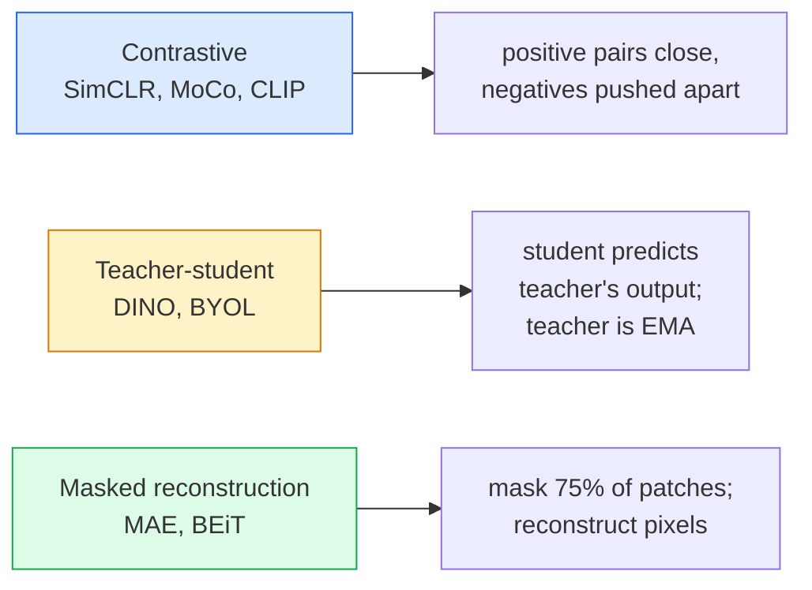
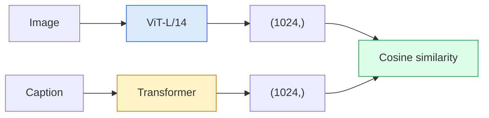
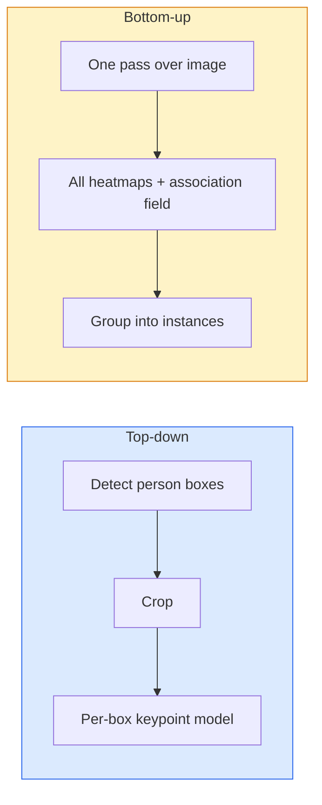

# Self-Supervised, CLIP, OCR & Pose Vision

> Combined lessons (5 parts), merged verbatim — no content removed.

**Type:** Combined

---

## Part 1 (ch082): Self-Supervised Vision — SimCLR, DINO, MAE

> Labels are the bottleneck of supervised vision. Self-supervised pretraining removes them: learn visual features from 100M unlabelled images, fine-tune on 10k labelled ones.

**Type:** Learn + Build
**Languages:** Python
**Prerequisites:** Phase 4 Lesson 04 (Image Classification), Phase 4 Lesson 14 (ViT)
**Time:** ~75 minutes

## Learning Objectives

- Trace the three SSL families: contrastive (SimCLR), teacher-student (DINO), masked reconstruction (MAE)
- Implement InfoNCE loss and explain why batch size matters
- Explain MAE's 75% masking ratio vs BERT's 15%
- Use DINOv2 or MAE checkpoints for linear probing

## The Problem

Supervised ImageNet costs $10M to annotate. SSL pretrains on cheap unlabelled data — YouTube, web crawls — then fine-tunes on a small labelled set.

## The Concept

### Three families



### Why 75% and not 15%

BERT masks 15% of tokens. MAE masks 75%. Image patches have low entropy — neighbouring pixels predict each other. To force semantic understanding, mask aggressively.

### Linear probe evaluation

Freeze encoder, train linear classifier on top. Pure measure of feature quality.

## Build It

### Step 1: Two-view augmentation

```python
import torch
import torchvision.transforms as T

two_view_train = lambda: T.Compose([
    T.RandomResizedCrop(96, scale=(0.2, 1.0)),
    T.RandomHorizontalFlip(),
    T.ColorJitter(0.4, 0.4, 0.4, 0.1),
    T.RandomGrayscale(p=0.2),
    T.ToTensor(),
])

class TwoViewDataset(torch.utils.data.Dataset):
    def __init__(self, base):
        self.base = base
        self.aug = two_view_train()

    def __len__(self):
        return len(self.base)

    def __getitem__(self, i):
        img, _ = self.base[i]
        return self.aug(img), self.aug(img)
```

### Step 2: InfoNCE loss

```python
import torch.nn.functional as F

def info_nce(z1, z2, tau=0.1):
    N, D = z1.shape
    z = torch.cat([z1, z2], dim=0)
    sim = z @ z.T / tau

    mask = torch.eye(2 * N, dtype=torch.bool, device=z.device)
    sim = sim.masked_fill(mask, float("-inf"))

    targets = torch.cat([torch.arange(N, 2 * N), torch.arange(0, N)]).to(z.device)
    return F.cross_entropy(sim, targets)
```

### Step 3: Sanity check

```python
z1 = F.normalize(torch.randn(16, 32), dim=-1)
z2 = z1.clone()
loss_same = info_nce(z1, z2, tau=0.1).item()
z2_random = F.normalize(torch.randn(16, 32), dim=-1)
loss_random = info_nce(z1, z2_random, tau=0.1).item()
print(f"identical pairs: {loss_same:.3f}   random pairs: {loss_random:.3f}")
```

### Step 4: MAE-style masking

```python
def random_mask_indices(num_patches, mask_ratio=0.75, seed=0):
    g = torch.Generator().manual_seed(seed)
    n_keep = int(num_patches * (1 - mask_ratio))
    perm = torch.randperm(num_patches, generator=g)
    visible = perm[:n_keep]
    masked = perm[n_keep:]
    return visible.sort().values, masked.sort().values

num_patches = 196
visible, masked = random_mask_indices(num_patches, mask_ratio=0.75)
print(f"visible: {len(visible)} / {num_patches}")
print(f"masked:  {len(masked)} / {num_patches}")
```

## Use It

```python
import torch
from transformers import AutoImageProcessor, AutoModel

processor = AutoImageProcessor.from_pretrained("facebook/dinov2-base")
model = AutoModel.from_pretrained("facebook/dinov2-base")
model.eval()

with torch.no_grad():
    inputs = processor(images=[pil_image], return_tensors="pt")
    outputs = model(**inputs)
    embedding = outputs.last_hidden_state[:, 0]
```

## Ship It

- `outputs/prompt-ssl-pretraining-picker.md`
- `outputs/skill-linear-probe-runner.md`

## Exercises

1. **(Easy)** Plot tau in [0.05, 0.1, 0.2, 0.5] vs InfoNCE loss.
2. **(Medium)** Implement DINO-style centre buffer; show collapse without it.
3. **(Hard)** Train MAE on CIFAR-100; compare linear-probe vs supervised.

## Key Terms

## Further Reading

- [SimCLR (Chen et al., 2020)](https://arxiv.org/abs/2002.05709)
- [DINO (Caron et al., 2021)](https://arxiv.org/abs/2104.14294)
- [MAE (He et al., 2022)](https://arxiv.org/abs/2111.06377)
- [DINOv2 (Oquab et al., 2023)](https://arxiv.org/abs/2304.07193)

[Reference](https://github.com/rohitg00/ai-engineering-from-scratch/tree/main/phases/04-computer-vision/17-self-supervised-vision)

---

## Part 2 (ch083): Open-Vocabulary Vision — CLIP

> Train an image encoder and a text encoder together so that matching (image, caption) pairs land at the same point in a shared space. That is the whole trick.

**Type:** Build + Use
**Languages:** Python
**Prerequisites:** Phase 4 Lesson 14 (ViT), Phase 4 Lesson 17 (Self-Supervised)
**Time:** ~45 minutes

## Learning Objectives

- Explain CLIP's two-tower architecture and contrastive objective
- Use pretrained CLIP/SigLIP for zero-shot classification
- Implement zero-shot classification from scratch
- Distinguish CLIP, SigLIP, OpenCLIP, LLaVA

## The Problem

Traditional classifiers are closed-vocabulary: 1000 classes only. CLIP trains on 400M (image, caption) pairs and classifies into any set at inference.

## The Concept

### Two towers



### Contrastive objective

```
sim_matrix = image_embeddings @ text_embeddings.T / tau
loss = (cross_entropy(sim_matrix, arange(N)) + cross_entropy(sim_matrix.T, arange(N))) / 2
```

### SigLIP: per-pair sigmoid loss

```
loss = mean of log(1 + exp(-y_ij * sim_ij))
```

Removes batch-level normalisation; trains better at small batches.

### Zero-shot classification

1. Compose prompt per class: "a photo of a {class}"
2. Encode all prompts -> T (C, d)
3. Encode image -> I (1, d)
4. I @ T.T -> (1, C) -> argmax

## Build It

### Step 1: Tiny two-tower model

```python
import torch
import torch.nn as nn
import torch.nn.functional as F

class TwoTower(nn.Module):
    def __init__(self, img_in=128, txt_in=64, emb=64):
        super().__init__()
        self.image_proj = nn.Sequential(nn.Linear(img_in, 128), nn.ReLU(), nn.Linear(128, emb))
        self.text_proj = nn.Sequential(nn.Linear(txt_in, 128), nn.ReLU(), nn.Linear(128, emb))
        self.logit_scale = nn.Parameter(torch.ones([]) * 2.6592)

    def forward(self, img_feats, txt_feats):
        i = F.normalize(self.image_proj(img_feats), dim=-1)
        t = F.normalize(self.text_proj(txt_feats), dim=-1)
        return i, t, self.logit_scale.exp()
```

### Step 2: Contrastive loss

```python
def clip_loss(image_emb, text_emb, logit_scale):
    N = image_emb.size(0)
    sim = logit_scale * image_emb @ text_emb.T
    targets = torch.arange(N, device=sim.device)
    l_i = F.cross_entropy(sim, targets)
    l_t = F.cross_entropy(sim.T, targets)
    return (l_i + l_t) / 2
```

### Step 3: Zero-shot classifier

```python
@torch.no_grad()
def zero_shot_classify(model, image_feats, class_text_feats, class_names):
    i = F.normalize(model.image_proj(image_feats), dim=-1)
    t = F.normalize(model.text_proj(class_text_feats), dim=-1)
    sim = i @ t.T
    pred = sim.argmax(dim=-1)
    return [class_names[p] for p in pred.tolist()]
```

### Step 4: Sanity check

```python
torch.manual_seed(0)
model = TwoTower()

img = torch.randn(8, 128)
txt = torch.randn(8, 64)
i, t, scale = model(img, txt)
loss = clip_loss(i, t, scale)
print(f"loss: {loss.item():.3f} (expected ~log(8) = 2.08)")
```

## Use It

```python
import open_clip

model, _, preprocess = open_clip.create_model_and_transforms("ViT-B-32", pretrained="laion2b_s34b_b79k")
tokenizer = open_clip.get_tokenizer("ViT-B-32")

image = preprocess(Image.open("dog.jpg")).unsqueeze(0)
text = tokenizer(["a photo of a dog", "a photo of a cat", "a photo of a car"])

with torch.no_grad():
    image_features = model.encode_image(image)
    text_features = model.encode_text(text)
    image_features = image_features / image_features.norm(dim=-1, keepdim=True)
    text_features = text_features / text_features.norm(dim=-1, keepdim=True)
    probs = (100.0 * image_features @ text_features.T).softmax(dim=-1)

print(probs)
```

## Ship It

- `outputs/prompt-zero-shot-class-picker.md`
- `outputs/skill-image-text-retriever.md`

## Exercises

1. **(Easy)** Zero-shot CIFAR-10 with 80 templates; report accuracy.
2. **(Medium)** Compare single-template vs 80-template averaged embeddings.
3. **(Hard)** Build zero-shot image retrieval index with FAISS.

## Key Terms

## Further Reading

- [CLIP (Radford et al., 2021)](https://arxiv.org/abs/2103.00020)
- [SigLIP (Zhai et al., 2023)](https://arxiv.org/abs/2303.15343)
- [OpenCLIP](https://github.com/mlfoundations/open_clip)

[Reference](https://github.com/rohitg00/ai-engineering-from-scratch/tree/main/phases/04-computer-vision/18-open-vocab-clip)

---

## Part 3 (ch084): OCR & Document Understanding

> OCR is a three-stage pipeline — detect text boxes, recognise the characters, then lay them out. Every modern OCR system reorders these stages or merges them.

**Type:** Learn + Use
**Languages:** Python
**Prerequisites:** Phase 4 Lesson 06 (Detection), Phase 7 Lesson 02 (Self-Attention)
**Time:** ~45 minutes

## Learning Objectives

- Trace classical OCR pipeline and modern end-to-end alternatives (Donut, Qwen-VL-OCR)
- Implement CTC loss for sequence-to-sequence OCR training
- Use PaddleOCR or EasyOCR for production document parsing
- Distinguish OCR, layout parsing, and document understanding

## The Problem

Images full of text: receipts, invoices, IDs, forms. Extracting structured data from them is one of the highest-value applied-vision problems.

## The Concept

### Classical pipeline


### CTC

CTC marginalises over alignments. Raw output "h h h _ _ e e l l _ l l o _ _" reduces to "hello".

### Modern end-to-end

- Donut: ViT encoder + text decoder, emits JSON directly.
- TrOCR, Qwen-VL-OCR: VLMs fine-tuned for OCR.

## Build It

### Step 1: CTC loss + greedy decoder

```python
import torch
import torch.nn.functional as F

def ctc_loss(log_probs, targets, input_lengths, target_lengths, blank=0):
    return F.ctc_loss(log_probs, targets, input_lengths, target_lengths,
                      blank=blank, reduction="mean", zero_infinity=True)

def greedy_ctc_decode(log_probs, blank=0):
    preds = log_probs.argmax(dim=-1).transpose(0, 1).cpu().tolist()
    out = []
    for seq in preds:
        decoded = []
        prev = None
        for idx in seq:
            if idx != prev and idx != blank:
                decoded.append(idx)
            prev = idx
        out.append(decoded)
    return out
```

### Step 2: Tiny CRNN recogniser

```python
import torch.nn as nn

class TinyCRNN(nn.Module):
    def __init__(self, vocab_size=40, hidden=128, feat=32):
        super().__init__()
        self.cnn = nn.Sequential(
            nn.Conv2d(1, feat, 3, 1, 1), nn.BatchNorm2d(feat), nn.ReLU(inplace=True),
            nn.MaxPool2d(2),
            nn.Conv2d(feat, feat * 2, 3, 1, 1), nn.BatchNorm2d(feat * 2), nn.ReLU(inplace=True),
            nn.MaxPool2d(2),
            nn.Conv2d(feat * 2, feat * 4, 3, 1, 1), nn.BatchNorm2d(feat * 4), nn.ReLU(inplace=True),
            nn.MaxPool2d((2, 1)),
            nn.Conv2d(feat * 4, feat * 4, 3, 1, 1), nn.BatchNorm2d(feat * 4), nn.ReLU(inplace=True),
            nn.MaxPool2d((2, 1)),
        )
        self.rnn = nn.LSTM(feat * 4, hidden, bidirectional=True, batch_first=True)
        self.head = nn.Linear(hidden * 2, vocab_size)

    def forward(self, x):
        f = self.cnn(x)
        f = f.mean(dim=2).transpose(1, 2)
        h, _ = self.rnn(f)
        return F.log_softmax(self.head(h).transpose(0, 1), dim=-1)
```

### Step 3: Synthetic OCR data

```python
import numpy as np

def synthetic_line(text, height=32, char_width=16):
    W = char_width * len(text)
    img = np.ones((height, W), dtype=np.float32)
    for i, c in enumerate(text):
        x = i * char_width
        shade = 0.0 if c.isalnum() else 0.5
        img[6:height - 6, x + 2:x + char_width - 2] = shade
    return img

def build_batch(strings, vocab):
    H = 32
    W = 16 * max(len(s) for s in strings)
    imgs = np.ones((len(strings), 1, H, W), dtype=np.float32)
    target_lengths = []
    targets = []
    for i, s in enumerate(strings):
        imgs[i, 0, :, :16 * len(s)] = synthetic_line(s)
        ids = [vocab.index(c) for c in s]
        targets.extend(ids)
        target_lengths.append(len(ids))
    return torch.from_numpy(imgs), torch.tensor(targets), torch.tensor(target_lengths)

vocab = ["_"] + list("0123456789abcdefghijklmnopqrstuvwxyz")
imgs, targets, lengths = build_batch(["hello", "world"], vocab)
print(f"images: {imgs.shape}")
```

### Step 4: Training sketch

```python
model = TinyCRNN(vocab_size=len(vocab))
opt = torch.optim.Adam(model.parameters(), lr=1e-3)

for step in range(200):
    strings = ["abc" + str(step % 10)] * 4 + ["xyz" + str((step + 1) % 10)] * 4
    imgs, targets, target_lens = build_batch(strings, vocab)
    log_probs = model(imgs)
    input_lens = torch.full((8,), log_probs.size(0), dtype=torch.long)
    loss = ctc_loss(log_probs, targets, input_lens, target_lens, blank=0)
    opt.zero_grad(); loss.backward(); opt.step()
```

## Use It

- PaddleOCR: `paddleocr.PaddleOCR(lang="en").ocr(image_path)`
- EasyOCR: Python-native
- Donut: ViT + text decoder for end-to-end document parsing

```python
from transformers import DonutProcessor, VisionEncoderDecoderModel

processor = DonutProcessor.from_pretrained("naver-clova-ix/donut-base-finetuned-cord-v2")
model = VisionEncoderDecoderModel.from_pretrained("naver-clova-ix/donut-base-finetuned-cord-v2")
```

## Ship It

- `outputs/prompt-ocr-stack-picker.md`
- `outputs/skill-ctc-decoder.md`

## Exercises

1. **(Easy)** Train TinyCRNN on 5-digit numbers; report CER.
2. **(Medium)** Replace greedy with beam search; report CER delta.
3. **(Hard)** Use PaddleOCR on 20 receipts; compute F1 on item_name/price.

## Key Terms

## Further Reading

- [CRNN (Shi et al., 2015)](https://arxiv.org/abs/1507.05717)
- [CTC (Graves et al., 2006)](https://www.cs.toronto.edu/~graves/icml_2006.pdf)
- [Donut (Kim et al., 2022)](https://arxiv.org/abs/2111.15664)
- [PaddleOCR](https://github.com/PaddlePaddle/PaddleOCR)

[Reference](https://github.com/rohitg00/ai-engineering-from-scratch/tree/main/phases/04-computer-vision/19-ocr-document-understanding)

---

## Part 4 (ch085): Image Retrieval & Metric Learning

> A retrieval system ranks candidates by a distance in embedding space. Metric learning is the discipline of shaping that space so the distances mean what you want.

**Type:** Build
**Languages:** Python
**Prerequisites:** Phase 4 Lesson 14 (ViT), Phase 4 Lesson 18 (CLIP)
**Time:** ~45 minutes

## Learning Objectives

- Explain triplet, contrastive, and proxy-based losses; pick the right one
- Implement L2-normalisation and cosine similarity correctly
- Build a FAISS index; query by text and image; report recall@K
- Use DINOv2/CLIP as off-the-shelf embedding backbones

## The Problem

Retrieval is everywhere: duplicate detection, visual search, face re-ID. The hard part is defining what counts as similar.

## The Concept

### The four loss families

| Loss | Pros | Cons |
|------|------|------|
| Contrastive | Simple | Needs many negatives |
| Triplet | Intuitive margin control | Hard mining expensive |
| NT-Xent/InfoNCE | Scales to large batches | Needs big batch |
| Proxy-based (ProxyNCA) | Fast, stable, no mining | Proxy overfitting on small data |

### Triplet loss

```
L = max(0, ||f(a) - f(p)||^2 - ||f(a) - f(n)||^2 + margin)
```

### Cosine similarity vs L2

`||a - b||^2 = 2 - 2 cos(a, b)` when L2-normalised. Pick one convention and stick to it.

### Recall@K

Fraction of queries with at least one correct match in top K.

### FAISS

- IndexFlatIP: brute force, up to ~1M vectors
- IndexIVFFlat: approximate, fast
- IndexHNSW: graph-based, fastest for many queries

## Build It

### Step 1: Triplet loss

```python
import torch
import torch.nn.functional as F

def triplet_loss(anchor, positive, negative, margin=0.2):
    d_ap = F.pairwise_distance(anchor, positive, p=2)
    d_an = F.pairwise_distance(anchor, negative, p=2)
    return F.relu(d_ap - d_an + margin).mean()
```

### Step 2: Semi-hard mining

```python
def semi_hard_negatives(emb, labels, margin=0.2):
    dist = torch.cdist(emb, emb)
    same_class = labels[:, None] == labels[None, :]
    diff_class = ~same_class
    N = emb.size(0)

    positives = dist.clone()
    positives[~same_class] = float("-inf")
    positives.fill_diagonal_(float("-inf"))
    pos_idx = positives.argmax(dim=1)

    semi_hard = dist.clone()
    semi_hard[same_class] = float("inf")
    d_ap = dist[torch.arange(N), pos_idx].unsqueeze(1)
    semi_hard[dist <= d_ap] = float("inf")
    neg_idx = semi_hard.argmin(dim=1)

    fallback_mask = semi_hard[torch.arange(N), neg_idx] == float("inf")
    if fallback_mask.any():
        hardest = dist.clone()
        hardest[same_class] = float("inf")
        neg_idx = torch.where(fallback_mask, hardest.argmin(dim=1), neg_idx)
    return pos_idx, neg_idx
```

### Step 3: Recall@K

```python
def recall_at_k(query_emb, gallery_emb, query_labels, gallery_labels, k=1):
    sim = query_emb @ gallery_emb.T
    _, top_k = sim.topk(k, dim=-1)
    matches = (gallery_labels[top_k] == query_labels[:, None]).any(dim=-1)
    return matches.float().mean().item()
```

### Step 4: Putting it together

```python
import torch.nn as nn
from torch.optim import Adam

class Encoder(nn.Module):
    def __init__(self, in_dim=128, emb_dim=64):
        super().__init__()
        self.net = nn.Sequential(
            nn.Linear(in_dim, 128), nn.ReLU(),
            nn.Linear(128, emb_dim),
        )

    def forward(self, x):
        return F.normalize(self.net(x), dim=-1)

torch.manual_seed(0)
num_classes = 6
protos = F.normalize(torch.randn(num_classes, 128), dim=-1)

def sample_batch(bs=32):
    labels = torch.randint(0, num_classes, (bs,))
    x = protos[labels] + 0.15 * torch.randn(bs, 128)
    return x, labels

enc = Encoder()
opt = Adam(enc.parameters(), lr=3e-3)

for step in range(200):
    x, y = sample_batch(32)
    emb = enc(x)
    pos_idx, neg_idx = semi_hard_negatives(emb, y)
    loss = triplet_loss(emb, emb[pos_idx], emb[neg_idx])
    opt.zero_grad(); loss.backward(); opt.step()
```

## Use It

- DINOv2 + FAISS: general visual retrieval
- CLIP + FAISS: text queries
- Fine-tuned DINOv2 + FAISS: instance-level retrieval
- Managed: Milvus, Weaviate, Qdrant

## Ship It

- `outputs/prompt-retrieval-loss-picker.md`
- `outputs/skill-recall-at-k-runner.md`

## Exercises

1. **(Easy)** Plot PCA of embeddings before/after training for toy data.
2. **(Medium)** Add ProxyNCA loss; compare convergence vs triplet.
3. **(Hard)** Embed 1k ImageNet val with DINOv2, build FAISS index, report recall@{1,5,10}.

## Key Terms

## Further Reading

- [FaceNet (Schroff et al., 2015)](https://arxiv.org/abs/1503.03832)
- [Triplet Loss for Person Re-ID (Hermans et al., 2017)](https://arxiv.org/abs/1703.07737)
- [FAISS documentation](https://github.com/facebookresearch/faiss/wiki)

[Reference](https://github.com/rohitg00/ai-engineering-from-scratch/tree/main/phases/04-computer-vision/20-image-retrieval-metric)

---

## Part 5 (ch086): Keypoint Detection & Pose Estimation

> A pose is a set of ordered keypoints. A keypoint detector is a heatmap regressor. Everything else is bookkeeping.

**Type:** Build
**Languages:** Python
**Prerequisites:** Phase 4 Lesson 06 (Detection), Phase 4 Lesson 07 (U-Net)
**Time:** ~45 minutes

## Learning Objectives

- Distinguish top-down and bottom-up pose estimation
- Regress heatmaps for K keypoints and extract coordinates at inference
- Explain Part Affinity Fields (PAFs) for bottom-up association
- Use MediaPipe Pose or MMPose for production keypoint estimation

## The Problem

Keypoint tasks: human pose, face landmarks, hand pose, animal pose. All share the same structure: detect K discrete points and output (x, y).

## The Concept

### Top-down vs bottom-up



### Heatmap regression

Predict H x W heatmap per keypoint with Gaussian blob at true location.

### Part Affinity Fields (PAFs)

2-channel unit vector field per limb. Integrate along candidate connections; higher integral = stronger match.

## Build It

### Step 1: Gaussian heatmap target

```python
import numpy as np

def gaussian_heatmap(size, cx, cy, sigma=2.0):
    yy, xx = np.meshgrid(np.arange(size), np.arange(size), indexing="ij")
    return np.exp(-((xx - cx) ** 2 + (yy - cy) ** 2) / (2 * sigma ** 2)).astype(np.float32)

hm = gaussian_heatmap(64, 32, 32, sigma=2.0)
print(f"peak: {hm.max():.3f}")
```

### Step 2: Tiny keypoint head

```python
import torch.nn as nn
import torch.nn.functional as F

class TinyKeypointNet(nn.Module):
    def __init__(self, num_keypoints=4, base=16):
        super().__init__()
        self.down1 = nn.Sequential(nn.Conv2d(3, base, 3, 2, 1), nn.ReLU(inplace=True))
        self.down2 = nn.Sequential(nn.Conv2d(base, base * 2, 3, 2, 1), nn.ReLU(inplace=True))
        self.mid = nn.Sequential(nn.Conv2d(base * 2, base * 2, 3, 1, 1), nn.ReLU(inplace=True))
        self.up1 = nn.ConvTranspose2d(base * 2, base, 2, 2)
        self.up2 = nn.ConvTranspose2d(base, num_keypoints, 2, 2)

    def forward(self, x):
        h1 = self.down1(x)
        h2 = self.down2(h1)
        h3 = self.mid(h2)
        u1 = self.up1(h3)
        return self.up2(u1)
```

### Step 3: Extract keypoint coordinates

```python
def heatmap_to_coords(heatmaps):
    N, K, H, W = heatmaps.shape
    hm = heatmaps.reshape(N, K, -1)
    idx = hm.argmax(dim=-1)
    ys = (idx // W).float()
    xs = (idx % W).float()
    return torch.stack([xs, ys], dim=-1)

coords = heatmap_to_coords(torch.randn(2, 4, 32, 32))
print(f"coords: {coords.shape}")
```

### Step 4: Synthetic dataset

```python
def make_synthetic_sample(size=64):
    img = np.ones((3, size, size), dtype=np.float32)
    rng = np.random.default_rng()
    kps = rng.integers(8, size - 8, size=(4, 2))
    for cx, cy in kps:
        img[:, cy - 2:cy + 2, cx - 2:cx + 2] = 0.0
    hms = np.stack([gaussian_heatmap(size, cx, cy) for cx, cy in kps])
    return img, hms, kps
```

### Step 5: Training

```python
model = TinyKeypointNet(num_keypoints=4)
opt = torch.optim.Adam(model.parameters(), lr=3e-3)

for step in range(200):
    batch = [make_synthetic_sample() for _ in range(16)]
    imgs = torch.from_numpy(np.stack([b[0] for b in batch]))
    hms = torch.from_numpy(np.stack([b[1] for b in batch]))
    pred = model(imgs)
    pred = F.interpolate(pred, size=hms.shape[-2:], mode="bilinear", align_corners=False)
    loss = F.mse_loss(pred, hms)
    opt.zero_grad(); loss.backward(); opt.step()
```

## Use It

- MediaPipe Pose: sub-10ms latency, WebGL + mobile
- MMPose: every SOTA architecture with pretrained weights
- YOLOv8-pose: fastest real-time multi-person pose

## Ship It

- `outputs/prompt-pose-stack-picker.md`
- `outputs/skill-heatmap-to-coords.md`

## Exercises

1. **(Easy)** Train on 4-point synthetic; report mean L2 error.
2. **(Medium)** Add sub-pixel refinement; report accuracy gain.
3. **(Hard)** Build 2-person bottom-up pipeline with PAFs.

## Key Terms

## Further Reading

- [OpenPose (Cao et al., 2017)](https://arxiv.org/abs/1812.08008)
- [HRNet (Sun et al., 2019)](https://arxiv.org/abs/1902.09212)
- [ViTPose (Xu et al., 2022)](https://arxiv.org/abs/2204.12484)

[Reference](https://github.com/rohitg00/ai-engineering-from-scratch/tree/main/phases/04-computer-vision/21-keypoint-pose)
