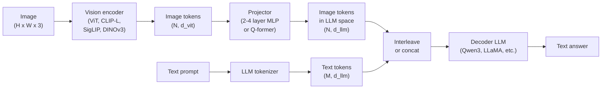

# VLM Foundations: CLIP, BLIP-2 & Flamingo

> Combined lessons (4 parts), merged verbatim — no content removed.

**Type:** Combined

---

## Part 1 (ch090): Vision-Language Models — The ViT-MLP-LLM Pattern

> A vision encoder converts an image into tokens. An MLP projector maps those tokens into the LLM's embedding space. A language model does the rest. That pattern — ViT-MLP-LLM — is every production VLM in 2026.

**Type:** Learn + Use
**Languages:** Python
**Prerequisites:** Phase 4 Lesson 14 (ViT), Phase 4 Lesson 18 (CLIP), Phase 7 Lesson 02 (Self-Attention)
**Time:** ~75 minutes

## Learning Objectives

- State the ViT-MLP-LLM architecture and explain what each of the three components contributes
- Compare Qwen3-VL, InternVL3.5, LLaVA-Next, and GLM-4.6V on parameter count, context length, and benchmark performance
- Explain DeepStack: why multi-level ViT features tighten vision-language alignment better than a single last-layer feature
- Measure VLM hallucination in production with Cross-Modal Error Rate (CMER) and act on the signal

## The Problem

CLIP (Phase 4 Lesson 18) gives you a shared embedding space for images and text, which is enough for zero-shot classification and retrieval. It cannot answer "how many red cars are in this image?" because CLIP does not generate text — it only scores similarities.

Vision-Language Models (VLMs) — Qwen3-VL, InternVL3.5, LLaVA-Next, GLM-4.6V — bolt a CLIP-family image encoder to a full language model. The model sees an image plus a question and generates an answer. In 2026 open-source VLMs rival or beat GPT-5 and Gemini-2.5-Pro on multimodal benchmarks (MMMU, MMBench, DocVQA, ChartQA, MathVista, OSWorld).

The trio of pieces (ViT, projector, LLM) is the standard. The differences between models are in which ViT, which projector, which LLM, the training data, and the alignment recipe. Once you understand the pattern, swapping any component is mechanical.

## The Concept

### The ViT-MLP-LLM architecture



1. **Vision encoder** — a pretrained ViT (CLIP-L/14, SigLIP, DINOv3, or a fine-tuned variant). Produces patch tokens.
2. **Projector** — a small module (2-4 layer MLP, or a Q-former) that maps vision tokens into the LLM's embedding dimension. This is where most of the fine-tuning happens.
3. **LLM** — a decoder-only language model (Qwen3, Llama, Mistral, GLM, InternLM). Reads the vision + text tokens in sequence, generates text.

### DeepStack

Vanilla projection uses only the last ViT layer. DeepStack (Qwen3-VL) samples features from multiple ViT depths and stacks them. Deeper layers carry high-level semantics; shallower layers carry fine-grained spatial and textural information. Feeding both into the LLM closes the gap between "what does the image contain" (semantics) and "where exactly" (spatial grounding).

### Three training stages

1. **Alignment** — freeze ViT and LLM. Train only the projector on image-caption pairs.
2. **Pre-training** — unfreeze everything. Train on large-scale interleaved image-text data (500M+ pairs).
3. **Instruction tuning** — fine-tune on curated (image, question, answer) triples.

### Model family comparison (early 2026)

| Model | Params | Vision encoder | LLM | Context | Strengths |
|-------|--------|----------------|-----|---------|-----------|
| Qwen3-VL-235B-A22B (MoE) | 235B (22B active) | custom ViT + DeepStack | Qwen3 | 256K | General SOTA, GUI agent |
| Qwen3-VL-30B-A3B (MoE) | 30B (3B active) | custom ViT + DeepStack | Qwen3 | 256K | Smaller MoE alternative |
| Qwen3-VL-8B (dense) | 8B | custom ViT | Qwen3 | 128K | Production dense default |
| InternVL3.5-38B | 38B | InternViT-6B | Qwen3 + GPT-OSS | 128K | Strong MMBench / MMVet |
| InternVL3.5-241B-A28B | 241B (28B active) | InternViT-6B | Qwen3 | 128K | Competitive with GPT-4o |
| LLaVA-Next 72B | 72B | SigLIP | Llama-3 | 32K | Open, easy to fine-tune |
| GLM-4.6V | ~70B | custom | GLM | 64K | Open-source, strong OCR |
| MiniCPM-V-2.6 | 8B | SigLIP | MiniCPM | 32K | Edge-friendly |

### Visual agents

Qwen3-VL-235B reaches top global performance on OSWorld — a benchmark for **visual agents** that operate GUIs (desktop, mobile, web). The model sees a screenshot, understands the UI, and emits actions (click, type, scroll). Combined with tools, it closes the loop on common desktop tasks.

### The alignment problem

Skywork.ai introduced the **Cross-Modal Error Rate (CMER)** to track hallucination:

```
CMER = fraction of outputs where the text confidence is high but the image-text similarity (via a CLIP-family checker) is low
```

High CMER means the model is confidently saying things not grounded in the image. Monitoring CMER and treating it as a production KPI cut hallucination rate by ~35% in their deployment.

### Fine-tuning with LoRA / QLoRA

Full fine-tuning of a 70B VLM is out of reach for most teams. LoRA (rank 16-64) on attention + projector layers, or QLoRA with 4-bit base weights, fits on a single A100 / H100. Cost: 5,000-50,000 examples, $100-$5,000 in compute, 2-10 hours of training.

### Spatial reasoning is still weak

Current VLMs score 50-60% on spatial reasoning benchmarks (above-below, left-right, counting, distance). If your use case depends on "which object is on top of which," validate heavily.

## Build It

### Step 1: The projector

```python
import torch
import torch.nn as nn

class Projector(nn.Module):
    def __init__(self, vit_dim=768, llm_dim=4096, hidden=4096):
        super().__init__()
        self.net = nn.Sequential(
            nn.Linear(vit_dim, hidden),
            nn.GELU(),
            nn.Linear(hidden, llm_dim),
        )

    def forward(self, x):
        return self.net(x)
```

### Step 2: Assemble ViT-MLP-LLM end-to-end

```python
class MinimalVLM(nn.Module):
    def __init__(self, vit, projector, llm, image_token_id):
        super().__init__()
        self.vit = vit
        self.projector = projector
        self.llm = llm
        self.image_token_id = image_token_id

    def forward(self, image, input_ids, attention_mask):
        vision_tokens = self.vit(image)
        vision_embeds = self.projector(vision_tokens)
        text_embeds = self.llm.get_input_embeddings()(input_ids)
        merged = self._merge(text_embeds, vision_embeds, input_ids)
        return self.llm(inputs_embeds=merged, attention_mask=attention_mask)

    def _merge(self, text_embeds, vision_embeds, input_ids):
        out = text_embeds.clone()
        expected = vision_embeds.size(1)
        for b in range(input_ids.size(0)):
            positions = (input_ids[b] == self.image_token_id).nonzero(as_tuple=True)[0]
            if len(positions) != expected:
                raise ValueError(...)
            out[b, positions] = vision_embeds[b]
        return out
```

### Step 3: CMER computation

```python
import torch.nn.functional as F

def cross_modal_error_rate(image_emb, text_emb, text_confidence, sim_threshold=0.25, conf_threshold=0.8):
    image_emb = F.normalize(image_emb, dim=-1)
    text_emb = F.normalize(text_emb, dim=-1)
    sim = (image_emb * text_emb).sum(dim=-1)
    high_conf_low_sim = (text_confidence > conf_threshold) & (sim < sim_threshold)
    return high_conf_low_sim.float().mean().item()
```

### Step 4: Toy VLM classifier (runnable)

```python
class ToyVLM(nn.Module):
    def __init__(self, vit_dim=32, llm_dim=64, num_classes=5):
        super().__init__()
        self.projector = Projector(vit_dim, llm_dim, hidden=64)
        self.head = nn.Linear(llm_dim, num_classes)

    def forward(self, vision_tokens):
        projected = self.projector(vision_tokens)
        pooled = projected.mean(dim=1)
        return self.head(pooled)
```

## Use It

```python
from transformers import AutoProcessor, AutoModelForVision2Seq
import torch
from PIL import Image

model_id = "Qwen/Qwen3-VL-8B-Instruct"
processor = AutoProcessor.from_pretrained(model_id)
model = AutoModelForVision2Seq.from_pretrained(model_id, torch_dtype=torch.bfloat16, device_map="auto")

messages = [{
    "role": "user",
    "content": [
        {"type": "image", "image": Image.open("plot.png")},
        {"type": "text", "text": "What does this chart show?"},
    ],
}]
inputs = processor.apply_chat_template(messages, add_generation_prompt=True, tokenize=True, return_dict=True, return_tensors="pt").to("cuda")
generated = model.generate(**inputs, max_new_tokens=256)
answer = processor.decode(generated[0][inputs["input_ids"].shape[1]:], skip_special_tokens=True)
```

## Ship It

This lesson produces:

- `outputs/prompt-vlm-selector.md` — picks Qwen3-VL / InternVL3.5 / LLaVA-Next / API given accuracy, latency, context length, and budget.
- `outputs/skill-cmer-monitor.md` — emits the code to instrument a production VLM endpoint with cross-modal error rate, per-endpoint dashboards, and alerting thresholds.

## Exercises

1. **(Easy)** Run three prompts through any open VLM on five images. Score each answer as correct / partially correct / hallucinated by hand. Compute a first-pass CMER-like rate.
2. **(Medium)** Fine-tune Qwen2.5-VL-3B or LLaVA-1.6-7B with LoRA (rank 16) on 500 images of a target domain with captions.
3. **(Hard)** Replace the VLM's image encoder with DINOv3 instead of its default SigLIP/CLIP. Re-train only the projector. Measure whether dense-prediction tasks improve.

## Key Terms

| Term | What people say | What it actually means |
|------|----------------|----------------------|
| ViT-MLP-LLM | "The VLM pattern" | Vision encoder + projector + language model; every 2026 VLM |
| Projector | "The bridge" | 2-4 layer MLP (or Q-former) that maps vision tokens into LLM embedding space |
| DeepStack | "Qwen3-VL feature trick" | Multi-level ViT features stacked rather than last-layer only |
| Image token | "<image> placeholder" | Special token in the text stream replaced by projected vision embeddings |
| CMER | "Hallucination KPI" | Cross-Modal Error Rate; high when text confidence is high but image-text similarity is low |
| Visual agent | "VLM that clicks" | VLM operating GUIs (OSWorld, mobile, web) with tool calls |
| Q-former | "Fixed-count token bridge" | BLIP-2 style projector producing a fixed number of visual query tokens |
| Alignment / pre-training / instruction tuning | "Three stages" | Standard VLM training pipeline |

## Further Reading

- [Qwen3-VL Technical Report (arXiv 2511.21631)](https://arxiv.org/abs/2511.21631)
- [InternVL3.5 Advancing Open-Source Multimodal Models (arXiv 2508.18265)](https://arxiv.org/html/2508.18265v1)
- [LLaVA-Next series](https://llava-vl.github.io/blog/2024-05-10-llava-next-stronger-llms/)
- [BentoML: Best Open-Source VLMs 2026](https://www.bentoml.com/blog/multimodal-ai-a-guide-to-open-source-vision-language-models)
- [MMMU: Multi-discipline Multimodal Understanding benchmark](https://mmmu-benchmark.github.io/)
- [VLMs in manufacturing (Robotics Tomorrow, March 2026)](https://www.roboticstomorrow.com/story/2026/03/when-machines-learn-to-see-like-experts-the-rise-of-vision-language-models-in-manufacturing/26335/)

> Reference: [ai-engineering/phases/04-computer-vision/25-vision-language-models/docs/en.md](https://github.com/anomalyco/ai-engineering/blob/main/phases/04-computer-vision/25-vision-language-models/docs/en.md)

---

## Part 2 (ch223): CLIP and Contrastive Vision-Language Pretraining

> OpenAI's CLIP (2021) proved a single idea big enough to power the next five years: align an image encoder and a text encoder in the same vector space using only noisy web image-caption pairs and a contrastive loss. Zero supervised labels. 400M pairs. The resulting embedding space does zero-shot classification, image-text retrieval, and plugs into every 2026 VLM as its vision tower. SigLIP 2 (2025) replaced softmax with sigmoid and scaled past CLIP at lower cost. This lesson walks the math from InfoNCE to sigmoid pairwise loss and builds the training step in stdlib Python.

**Type:** Build
**Languages:** Python (stdlib, InfoNCE + sigmoid loss implementations)
**Prerequisites:** Phase 12 · 01 (ViT patches), Phase 7 (Transformers)
**Time:** ~180 minutes

## Learning Objectives

- Derive InfoNCE loss from mutual information and implement a numerically-stable vectorized version.
- Explain why sigmoid pairwise loss (SigLIP) scales to batch 32768+ without the all-gather overhead softmax demands.
- Run zero-shot ImageNet classification by constructing text templates (`a photo of a {class}`) and taking argmax over cosine similarity.
- Name the four levers CLIP / SigLIP pretraining gives you: batch size, temperature, prompt template, data quality.

## The Problem

Pre-CLIP vision was supervised. Collect labeled datasets (ImageNet: 1.2M images, 1000 classes), train a CNN, ship it. Labels are expensive, labels bias to what labelers can agree on, and labels do not transfer to new tasks without finetuning.

The image-caption web has one billion-plus loosely-labeled pairs for free. A picture of a golden retriever with alt text "my dog Max in the park" carries a supervisory signal — the text describes the image. The question: can you turn this into useful training?

CLIP's answer: treat image-caption pairs as a matching task. Given a batch of N images and N captions, learn to match each image to its own caption against N-1 distractors. The supervision is "these two things belong together; these N-1 do not." No class labels. No human annotation. Just a contrastive loss.

The resulting embedding space does more than CLIP was trained for. ImageNet zero-shot works because "a photo of a cat" embeds near pictures of cats that were never explicitly labeled cats. This is the bet that spawned every 2026 VLM.

## The Concept

### The dual encoder

CLIP has two towers:

- Image encoder `f`: ViT or ResNet, outputs a D-dim vector per image.
- Text encoder `g`: small transformer, outputs a D-dim vector per caption.

Both towers normalize their outputs to unit length. Similarity is `cos(f(x), g(y)) = f(x)^T g(y)` since both are unit-norm.

For a batch of N (image, caption) pairs, build the similarity matrix `S` of shape `(N, N)`:

```
S[i, j] = cos(f(x_i), g(y_j)) / tau
```

where `tau` is a learned temperature (CLIP initializes to 0.07; learned in log-space).

### InfoNCE loss

CLIP uses a symmetric cross-entropy over rows and columns:

```
loss_i2t = CE(S, labels=identity)     # each image's positive is its own caption
loss_t2i = CE(S^T, labels=identity)   # each caption's positive is its own image
loss = (loss_i2t + loss_t2i) / 2
```

This is InfoNCE. The softmax in CE forces each image to match its caption more than every other caption in the batch. The "negatives" are all other batch items. Bigger batches = more negatives = stronger signal. CLIP trained at batch 32k; scale matters.

### Temperature

`tau` controls the sharpness of the softmax. Low tau → sharp distribution, hard negative mining effect. High tau → soft, all samples contribute. CLIP learns log(1/tau), clipped to prevent collapse. SigLIP 2 fixes the initial tau and uses a learned bias instead.

### Why sigmoid scales better (SigLIP)

Softmax needs the whole similarity matrix in sync. In distributed training you must all-gather every embedding to every replica, then do the softmax. This is quadratic in world size for communication.

SigLIP replaces softmax with element-wise sigmoid: for each pair `(i, j)`, the loss is a binary classification of "are these the matching pair?" positive class labels are the diagonal, everything else is negative. The loss is:

```
L = -1/N sum over (i, j) [ y_ij log sigmoid(S[i,j]) + (1-y_ij) log sigmoid(-S[i,j]) ]
```

`y_ij = 1` if `i == j`, else 0. Each pair's loss is independent. No all-gather needed. Each GPU computes its local block and sums. SigLIP 2 scales to batch 32k-512k cheaply where CLIP would need proportionally more communication.

### Zero-shot classification

Given N class names, for each class build a text template:

```
"a photo of a {class}"
```

Embed each template with the text encoder. Embed your image with the image encoder. Argmax cosine similarity = predicted class. No training on the target classes.

Prompt templates matter. CLIP's original paper used 80 templates per class (plain, artistic, photo, painting, etc.) and averaged the embeddings. +3 ImageNet points. Modern usage typically picks one or two templates.

### Linear probes and finetuning

Zero-shot is a baseline. A linear probe (train one linear layer on top of frozen CLIP features for your target classes) beats zero-shot on in-domain tasks. Full finetuning beats linear probe on in-domain but can hurt zero-shot transfer. Three regimes with three trade-offs.

### SigLIP 2: NaFlex and dense features

SigLIP 2 (2025) adds:
- NaFlex: single model handles variable aspect ratios and resolutions.
- Better dense features for segmentation and depth estimation, targeting use as a frozen backbone in VLMs.
- Multilingual: trained on 100+ languages where CLIP was English-only.
- 1B param scale where CLIP topped out at 400M.

In 2026 open VLMs, SigLIP 2 SO400m/14 is the default vision tower. CLIP remains the default for pure image-text retrieval where the specific LAION-2B training distribution matches your query pattern.

### ALIGN, BASIC, OpenCLIP, EVA-CLIP

ALIGN (Google, 2021): same idea as CLIP, 1.8B pair scale, 90% noisy. Proved noisy data scales. OpenCLIP (LAION): open reproduction of CLIP on LAION-400M / 2B, multiple scales, the go-to open checkpoint. EVA-CLIP: initializes from masked image modeling; strong backbone for VLMs. BASIC: Google's CLIP+ALIGN hybrid. All the same family, different data and tuning.

### The zero-shot ceiling

CLIP-class models cap around 76% ImageNet zero-shot (CLIP-G, OpenCLIP-G). Beyond requires either much larger data (SigLIP 2 gets 80%+) or architecture changes (supervised heads, more parameters). The benchmark is saturating; the real value is the embedding space that downstream VLMs consume.

```figure
multimodal-fusion
```

## Use It

`code/main.py` implements:

1. A toy dual encoder (hash-based image features, text char features) so you can see the InfoNCE shape without numpy.
2. InfoNCE loss in pure Python (numerical stability via log-sum-exp).
3. Sigmoid pairwise loss for comparison.
4. A zero-shot classification routine: compute cosine similarity against a set of text prompts, argmax for prediction.

Run it and watch the loss curve. The absolute numbers are toy; the shape matches what a real CLIP trainer emits.

## Ship It

This lesson produces `outputs/skill-clip-zero-shot.md`. Given a set of images (via path) and a list of target classes, it builds text prompts with the CLIP template, embeds both sides with a stated checkpoint (e.g., `openai/clip-vit-large-patch14`), and returns top-1 / top-5 predictions with similarity scores. The skill refuses to make claims about classes not in the prompt list.

## Exercises

1. Implement InfoNCE for a batch of 4 pairs by hand. Construct the 4×4 similarity matrix, run softmax, pick out the diagonal, compute cross-entropy. Verify your Python implementation against this hand calculation.

2. SigLIP uses a bias parameter `b` in addition to temperature: `S'[i,j] = S[i,j]/tau + b`. What role does `b` play when the batch has a large class imbalance (many more negatives than positives per row)? Read SigLIP Section 3 (arXiv:2303.15343).

3. Build a zero-shot classifier for cats vs dogs. Try two prompt templates: `a photo of a {class}` and `a picture of a {class}`. Measure accuracy on 100 test images. Does the ensemble of templates beat single?

4. Compute the communication cost of softmax InfoNCE vs sigmoid pairwise for a 512-GPU run at batch 32k. Which scales as O(N), which as O(N²)? Cite SigLIP Section 4.

5. Read the OpenCLIP scaling-laws paper (arXiv:2212.07143, Cherti et al.). Reproduce their conclusion for data scaling from the figures: at fixed model size, what is the log-linear relationship between ImageNet zero-shot accuracy and training data size?

## Key Terms

| Term | What people say | What it actually means |
|------|----------------|------------------------|
| InfoNCE | "Contrastive loss" | Cross-entropy over a batch's similarity matrix; each item's positive is its paired item, negatives are everything else |
| Sigmoid loss | "SigLIP loss" | Per-pair binary cross-entropy; no softmax, no all-gather, scales cheaply in distributed training |
| Temperature | "tau" | Scalar that scales logits before softmax/sigmoid; controls sharpness of the distribution |
| Zero-shot | "no-finetune classification" | Use text prompts to construct class embeddings and classify by cosine similarity; no training on target classes |
| Prompt template | "a photo of a ..." | Text scaffold around a class name; affects zero-shot accuracy by 1-5 points |
| Dual encoder | "Two-tower" | One image encoder + one text encoder, outputs in shared D-dim space |
| Hard negative | "Tough distractor" | A negative similar enough to the positive that the model has to work to separate them |
| Linear probe | "Frozen + one layer" | Train only a linear classifier on top of frozen features; measures feature quality |
| NaFlex | "Native flexible resolution" | SigLIP 2 capability to ingest images at any aspect ratio and resolution without resizing |
| Temperature scaling | "log-parametrized tau" | CLIP parametrizes `log(1/tau)` so gradients behave; clips to prevent collapse to near-zero tau |

## Further Reading

- [Radford et al. — Learning Transferable Visual Models From Natural Language Supervision (arXiv:2103.00020)](https://arxiv.org/abs/2103.00020) — the CLIP paper.
- [Zhai et al. — Sigmoid Loss for Language Image Pre-Training (arXiv:2303.15343)](https://arxiv.org/abs/2303.15343) — SigLIP.
- [Tschannen et al. — SigLIP 2 (arXiv:2502.14786)](https://arxiv.org/abs/2502.14786) — multilingual + NaFlex.
- [Jia et al. — ALIGN (arXiv:2102.05918)](https://arxiv.org/abs/2102.05918) — scale with noisy web data.
- [Cherti et al. — Reproducible scaling laws for contrastive language-image learning (arXiv:2212.07143)](https://arxiv.org/abs/2212.07143) — OpenCLIP scaling laws.

[Reference](https://github.com/rohitg00/ai-engineering-from-scratch/tree/main/phases/12-multimodal-ai/02-clip-contrastive-pretraining)

---

## Part 3 (ch224): From CLIP to BLIP-2 — Q-Former as Modality Bridge

> CLIP aligns image and text but cannot generate captions, answer questions, or hold a conversation. BLIP-2 (Salesforce, 2023) solved that with a small trainable bridge: 32 learnable query vectors attend over a frozen ViT's features via cross-attention, then slot directly into a frozen LLM's input stream. 188M parameters of bridge connected an 11B LLM to a ViT-g/14. Every adapter-based VLM through 2026 — MiniGPT-4, InstructBLIP, LLaVA's cousins — is a descendant. This lesson reads the Q-Former's architecture, explains its two-stage training, and builds a toy version that feeds visual tokens into a frozen text decoder.

**Type:** Build
**Languages:** Python (stdlib, cross-attention + learnable-query demo)
**Prerequisites:** Phase 12 · 02 (CLIP), Phase 7 (Transformers)
**Time:** ~180 minutes

## Learning Objectives

- Explain why a trainable bottleneck between a frozen vision encoder and frozen LLM beats end-to-end finetuning in cost and stability.
- Implement a cross-attention block where a fixed set of learnable queries attend to external image features.
- Walk through BLIP-2's two-stage pretraining: representation (ITC + ITM + ITG) then generative (LM loss with frozen decoder).
- Compare Q-Former to the simpler MLP projector used in LLaVA and argue when each choice wins.

## The Problem

You have a frozen ViT that produces 256 patch tokens of dim 1408 per image. You have a frozen 7B LLM that expects token embeddings of dim 4096. The obvious bridge — a linear layer from 1408 to 4096 — works, but feeding all 256 patch tokens into the LLM's context costs 256 extra tokens per image. Over a batch of 32 images that is 8192 tokens consumed by the visual modality alone.

The BLIP-2 question: can you compress the 256-token image representation into far fewer tokens (say 32) while preserving enough information for the LLM to caption, answer questions, and reason about the image? And can you train this bridge without touching the frozen backbones, keeping the training cost at just the bridge's parameters?

The answer: a Q-Former. 32 learnable "query" vectors that cross-attend to the ViT's patch tokens, producing a 32-token visual summary that the LLM consumes. 188M parameters total. Trained with contrastive, matching, and generative objectives before ever touching the LLM.

## The Concept

### Learnable queries

The Q-Former's core trick: instead of letting the LLM's text tokens attend to image patches, introduce a new set of 32 learnable query vectors `Q` and let *them* attend to image patches. The queries are parameters of the model — they are learned during training and the same 32 queries are used for every image.

After cross-attention, each query holds a compressed summary of the image — "describe the main object", "describe the background", "count the objects", etc. The queries do not literally specialize on semantic labels; they learn whatever encoding makes downstream losses drop.

### Architecture

The Q-Former is a small transformer (12 layers, ~100M params) with two paths:

1. Query path: 32 query vectors flow through self-attention (among themselves), then cross-attention over the frozen ViT's patch tokens, then FFN.
2. Text path: a BERT-like text encoder shares the self-attention and FFN weights with the query path. Cross-attention is disabled for the text path.

At training time both paths run. The queries and text interact through shared self-attention, which means the queries can condition on text for tasks that need it (ITM, ITG). At inference time for VLM handoff, only the queries flow through, yielding 32 visual tokens.

### Two-stage training

BLIP-2 pretrains in two stages:

Stage 1: representation learning (no LLM). Three losses:
- ITC (image-text contrastive): CLIP-style contrastive between pooled query tokens and text CLS token.
- ITM (image-text matching): binary classifier — is this image-text pair a match? Hard-negative-mined.
- ITG (image-grounded text generation): causal LM head on text, conditioned on the queries. Forces queries to encode text-generatable content.

Only the Q-Former trains. The ViT is frozen. No LLM involved.

Stage 2: generative learning. Attach a frozen LLM (OPT-2.7B or Flan-T5-XL, etc.). Project the 32 query outputs to the LLM's embedding dim via a small linear layer. Prepend them to the text prompt. Train only the linear projection and the Q-Former on LM loss over the concatenated prompt + image + caption sequence.

After stage 2, the Q-Former + projection is the full visual adapter. At inference: image → ViT → Q-Former → linear proj → prepended to text → frozen LLM emits output.

### Parameter economics

BLIP-2 with ViT-g/14 (1.1B, frozen) + OPT-6.7B (6.7B, frozen) + Q-Former (188M, trained) = 8B total, 188M trained. The Q-Former alone is ~2.4% of the full stack's parameters. Training cost reflects this: days on a handful of A100s vs weeks for end-to-end.

Quality: BLIP-2 matches or beats Flamingo-80B on zero-shot VQA while being 50× smaller. The bridge works.

### InstructBLIP and the instruction-aware Q-Former

InstructBLIP (2023) extends the Q-Former with an extra input: the instruction text itself. At cross-attention time, the queries now have access to both the image patches and the instruction. The queries can specialize per-instruction ("count the cars", "describe the mood") rather than learning a single fixed summary. Benchmark gains on held-out tasks.

### MiniGPT-4 and the projector-only approach

MiniGPT-4 kept the Q-Former but trained only the output linear projection while freezing everything else. Cheap, but cost is quality — the queries were BLIP-2's, not yours. Good for rapid iteration, not the best architecture.

### Why LLaVA went simpler

LLaVA (2023, Lesson 12.05) replaced the Q-Former with a plain 2-layer MLP that projects every ViT patch token into LLM space — 576 tokens per image for a 24×24 grid, all fed to the LLM. Worse compression but lets the LLM attend over raw patches. At the time this was controversial; by late 2023 it was dominant because visual instruction data (LLaVA-Instruct-150k) proved that the MLP could be trained to preserve enough signal. The tradeoff: LLaVA's context fills faster, but it scales naturally to multi-image and video.

By 2026 the field split: Q-Former survives where token budget matters (long video, many images); MLP projector dominates where raw quality per token is the priority.

### Gated cross-attention: Flamingo, the ancestor

Flamingo (Lesson 12.04) predated BLIP-2 and used the same cross-attention idea but at every frozen LLM layer, not as a single bridge. BLIP-2 showed you can compress to the input layer only and still work. Gemini and Idefics combine both: interleaved input tokens plus optional gated cross-attention for in-context few-shot.

### The 2026 descendants

- Q-Former: BLIP-2, InstructBLIP, MiniGPT-4, and most video-language models for token budget reasons.
- Perceiver resampler: Flamingo's variant (Lesson 12.04); Idefics family, Eagle, OmniMAE.
- MLP projector: LLaVA, LLaVA-NeXT, LLaVA-OneVision, Cambrian-1.
- Attention pool: VILA, PaliGemma.

All four are valid. The deciding question is whether you are constrained on token budget or on quality-per-token.

## Use It

`code/main.py` builds a stdlib Q-Former-style cross-attention:

1. Simulate 256 image patch tokens (dim 128).
2. Instantiate 32 learnable queries (dim 128).
3. Run scaled-dot-product cross-attention (Q from queries, K/V from patches).
4. Project to LLM-dim (512) via a linear layer.
5. Output the 32 LLM-ready visual tokens.

All math in pure Python (nested loops over vectors). Toy but correct shape. The attention-weight matrix is printed so you can see which patches each query pulled from.

## Ship It

This lesson produces `outputs/skill-modality-bridge-picker.md`. Given a target VLM configuration (vision encoder token count, LLM context budget, deployment constraints, quality target), it recommends Q-Former vs MLP vs Perceiver resampler with a short justification and a parameter-count estimate for each bridge.

## Exercises

1. Implement the cross-attention block in PyTorch. Verify that with 32 queries and 256 keys/values, the attention-weight matrix is 32 × 256 and each row sums to 1 after softmax.

2. In BLIP-2 stage 1 the Q-Former runs three losses simultaneously: ITC, ITM, ITG. Write the forward signature for each in pseudo-code. Which one requires the text encoder path to be active?

3. Compare parameter counts: Q-Former (12 layers, 768 hidden) vs a 2-layer MLP projector (1408 → 4096, two layers). At what LLM scale does the 188M Q-Former cost pay back in training efficiency?

4. Read Section 3.2 of the BLIP-2 paper (arXiv:2301.12597) on how the Q-Former is initialized. Explain why initializing from BERT-base (not random) accelerates convergence.

5. For a 10-minute video at 1 FPS sampled to 60 frames, compute the per-frame token cost at (Q-Former → 32 tokens/frame) vs (MLP projector → 576 tokens/frame). Which fits into a 128k-token LLM context window?

## Key Terms

| Term | What people say | What it actually means |
|------|----------------|------------------------|
| Q-Former | "Querying transformer" | Small transformer with 32 learnable query vectors that cross-attend to frozen ViT features |
| Learnable queries | "Soft prompt for vision" | A fixed set of parameters that serve as the query side of cross-attention; learned per model, shared across all inputs |
| Cross-attention | "Q from here, K/V from there" | Attention where query, key, and value come from different sources; how the queries pull from ViT patches |
| ITC | "Image-text contrastive" | CLIP-style loss applied to Q-Former pooled queries vs text CLS |
| ITM | "Image-text matching" | Binary classifier on hard-negative-mined pairs; forces the queries to discriminate fine-grained mismatches |
| ITG | "Image-grounded text generation" | Causal LM loss where text is generated conditioned on queries; forces queries to encode text-decodable content |
| Two-stage pretraining | "Representation then generative" | Stage 1 trains Q-Former alone (ITC/ITM/ITG); Stage 2 attaches frozen LLM and trains only the projection + Q-Former |
| Frozen backbone | "Do not finetune" | The vision encoder and LLM weights are fixed; only the bridge trains |
| Projection head | "Linear to LLM dim" | Final linear layer mapping Q-Former output to the LLM's embedding dimension |
| Perceiver resampler | "Flamingo's version" | Similar learnable-query cross-attention, used by Flamingo at every layer rather than as a single bridge |

## Further Reading

- [Li et al. — BLIP-2 (arXiv:2301.12597)](https://arxiv.org/abs/2301.12597) — the core paper.
- [Li et al. — BLIP (arXiv:2201.12086)](https://arxiv.org/abs/2201.12086) — the predecessor with the ITC/ITM/ITG trio.
- [Li et al. — ALBEF (arXiv:2107.07651)](https://arxiv.org/abs/2107.07651) — "align before fuse" — the conceptual ancestor of stage 1 training.
- [Dai et al. — InstructBLIP (arXiv:2305.06500)](https://arxiv.org/abs/2305.06500) — instruction-aware Q-Former.
- [Zhu et al. — MiniGPT-4 (arXiv:2304.10592)](https://arxiv.org/abs/2304.10592) — projector-only approach.
- [Jaegle et al. — Perceiver IO (arXiv:2107.14795)](https://arxiv.org/abs/2107.14795) — general architecture for learnable-query cross-attention.

[Reference](https://github.com/rohitg00/ai-engineering-from-scratch/tree/main/phases/12-multimodal-ai/03-blip2-qformer-bridge)

---

## Part 4 (ch225): Flamingo and Gated Cross-Attention for Few-Shot VLMs

> DeepMind's Flamingo (2022) did two things before anyone else. It showed a single model could process arbitrarily interleaved sequences of images, videos, and text. And it showed VLMs could learn in-context — give a few-shot prompt with three example (image, caption) pairs and the model captions a new image without any gradient step. The mechanism: gated cross-attention layers, inserted between the frozen LLM's existing layers, with a learned tanh gate that starts at zero so the LLM's text capability is preserved at initialization. This lesson walks Flamingo's Perceiver resampler and gated cross-attention architecture — the ancestor of Gemini's interleaved inputs and Idefics2's visual tokens.

**Type:** Learn
**Languages:** Python (stdlib, gated cross-attention + Perceiver resampler demo)
**Prerequisites:** Phase 12 · 03 (BLIP-2 Q-Former)
**Time:** ~120 minutes

## Learning Objectives

- Explain how gated cross-attention preserves a frozen LLM's text capability at initialization via tanh(gate) = 0.
- Walk through a Perceiver resampler: N image patches → K fixed "latent" queries via cross-attention.
- Describe how Flamingo handles interleaved image-text sequences with causal masking that respects image placement.
- Reproduce a few-shot multimodal prompt structure (3 image-caption examples then a query image).

## The Problem

BLIP-2 feeds 32 visual tokens into a frozen LLM's input layer. Works for one image per prompt. But what if you want to feed *many* images interleaved with text, as in "here is image A, caption it; here is image B, caption it; now here is image C, caption it"? The LLM's self-attention would need to handle image tokens and text tokens in a single stream, and the question of which positions can attend to which images gets fussy.

Flamingo's answer: do not change the LLM's input stream at all. Insert extra cross-attention layers between existing LLM blocks. Text tokens still flow through the LLM's causal self-attention as always. Between every few LLM blocks, text tokens also cross-attend to image features via a new gated layer. The gate (initialized to zero) means at step zero the new layers are no-ops — the model behaves exactly like the pretrained LLM. As training progresses the gate opens and visual information starts flowing.

The second question Flamingo answered: how do you handle a variable number of images (0, 1, or many) per prompt? A Perceiver resampler — a small cross-attention module that takes whatever number of patches you have and produces a fixed number of visual latent tokens. The LLM cross-attention layer sees the same shape regardless of how many images are in the prompt.

## The Concept

### The frozen LLM

Flamingo starts with a frozen Chinchilla 70B LLM. All 70B weights untouched. The existing text self-attention and FFN operate normally.

### Perceiver resampler

For each image in the prompt, the ViT produces N patch tokens. The Perceiver resampler has K fixed learnable latents (Flamingo uses K=64). Each resampler block is two sub-steps:

1. Cross-attention: the K latents attend over the N patch tokens (Q from latents, K/V from patches).
2. Self-attention + FFN within the latents.

After 6 resampler blocks, the output is K=64 visual tokens of dim 1024, regardless of how many patches the ViT produced. A 224×224 image (196 patches) and a 480×480 image (900 patches) both exit as 64 resampler tokens.

For video, the resampler is applied temporally: each frame's patches produce 64 latents, and a temporal positional encoding lets the model distinguish t=0 from t=N. The full video becomes T * 64 visual tokens.

### Gated cross-attention

Between every M layers of the frozen LLM (Flamingo uses M=4), insert a new gated cross-attention block:

```
x_after_llm_block = llm_block(x_before)
cross = cross_attn(x_after, resampler_output)
gated = tanh(alpha) * cross + x_after
x_before_next_block = gated
```

- `alpha` is a learnable scalar initialized to zero.
- `tanh(0) = 0`, so at init the gated branch contributes zero.
- As `alpha` moves away from zero, the cross-attention contribution grows smoothly.
- The residual connection means even a fully-open gate does not overwrite the LLM's text representation; it just adds visual information on top.

This is the single most important design choice in Flamingo: visual conditioning is additive, gated, and zero at initialization. A Flamingo at step 0 is a perfect Chinchilla 70B on text-only inputs.

### Masked cross-attention for interleaved inputs

In a prompt like "<image A> caption A <image B> caption B <image C> ?", each text token should only see images that came before it in the sequence. The cross-attention mask enforces: text token at position `t` attends only to image resampler tokens whose image index `i < i_t` where `i_t` is the most recent image before position `t`. "Sees only the last preceding image" or "sees all preceding images" are both valid choices; Flamingo chose the former.

### In-context few-shot learning

A Flamingo prompt looks like:

```
<image1> A photo of a cat. <image2> A photo of a dog. <image3> A photo of a
```

The model sees the completion pattern and outputs "bird" (or whatever image3 shows). No gradient steps. The frozen LLM's in-context learning capability carries through the gated cross-attention — this is the punchline of the paper and why it matters.

### Training data

Flamingo trained on three datasets:

1. MultiModal MassiveWeb (M3W): 43M web pages with interleaved images and text, reconstructing reading order.
2. Image-Text Pairs (ALIGN + LTIP): 4.4B pairs.
3. Video-Text Pairs (VTP): 27M short video clips.

OBELICS (2023) is an open reproduction of the interleaved web corpus, which Idefics, Idefics2, and most open "Flamingo-like" models train on.

### OpenFlamingo and Otter

OpenFlamingo (2023) is the open reproduction. Architecture identical (Perceiver resampler + gated cross-attention on frozen LLaMA or MPT). Checkpoints at 3B, 4B, 9B. Quality lags Flamingo due to smaller base LLM and less data.

Otter (2023) builds on OpenFlamingo with instruction tuning on MIMIC-IT (a dataset of multimodal instructions), showing gated cross-attention works for instruction following too.

### The descendants

- Idefics / Idefics2 / Idefics3: Hugging Face's gated cross-attention lineage, progressively simpler (Idefics2 dropped the resampler in favor of direct patch tokens with adaptive pooling).
- Flamingo-to-Chameleon transition: by 2024 many teams moved to early-fusion (Lesson 12.11); Flamingo-style gated cross-attention remains in production where backbone freezing is required.
- Gemini's interleaved input: conceptually inherits Flamingo's interleaved-format flexibility, though the exact mechanism is proprietary.

### Comparison to BLIP-2

| | BLIP-2 | Flamingo |
|---|---|---|
| Visual bridge | Q-Former once at input | Gated cross-attention at every M layers |
| Visual tokens | 32 per image | 64 per image per cross-attn layer |
| Frozen LLM | Yes | Yes |
| Few-shot in-context | Weak | Strong — the paper's centerpiece |
| Interleaved inputs | No native support | Yes, the design target |
| Training data | 130M pairs | 1.3B pairs + 43M interleaved pages |
| Parameter count | 188M trained | ~10B trained (cross-attn layers) |
| Compute | Days on 8 A100s | Weeks on thousands of TPUv4 |

Pick BLIP-2 for single-image VQA on a budget. Pick Flamingo/Idefics2 for interleaved, few-shot, or multi-image reasoning.

## Use It

`code/main.py` demonstrates:

1. A Perceiver resampler on 36 fake patch tokens with 8 learnable latents (pure Python cross-attention).
2. A gated cross-attention step with `alpha = 0` → output equals input (LLM unchanged), then `alpha = 2.0` → visual contribution mixed in.
3. An interleaved-mask builder that produces the 2D attention mask for a "(image 1) (text 1) (image 2) (text 2)" sequence.

## Ship It

This lesson produces `outputs/skill-gated-bridge-diagnostic.md`. Given an open VLM's config (resampler Y/N, cross-attn frequency, gate scheme), it identifies the Flamingo lineage elements and explains the freezing strategy. Useful for debugging why a fine-tune degraded text performance (answer: the gate got too wide too fast).

## Exercises

1. Compute Flamingo-9B's visual parameter count: 9B LLM + 1.4B gated cross-attention layers + 64M resampler. What fraction of total params is trained?

2. Implement the gated residual `y = tanh(alpha) * cross + x` in PyTorch. Show experimentally that with `alpha=0`, `y==x` exactly at init.

3. Read OpenFlamingo Section 3.2 (arXiv:2308.01390) on how they handle multiple images in a batch when each prompt has a different image count. Describe the padding strategy.

4. Why does Flamingo's cross-attention mask let a text token attend to *only the most recent* preceding image rather than all preceding images? Read the Flamingo paper Section 2.4 and explain the tradeoff.

5. In-context few-shot: construct a prompt with 4 examples of "image → color of main object" for a new Flamingo variant. Describe the expected accuracy pattern as you vary the number of examples from 0 to 8.

## Key Terms

| Term | What people say | What it actually means |
|------|----------------|------------------------|
| Perceiver resampler | "Fixed-latent cross-attention" | Module that produces K fixed tokens from a variable number of input patches |
| Gated cross-attention | "Tanh-gated bridge" | Residual layer `y = tanh(alpha)*cross + x`, learnable alpha, init 0 |
| Interleaved input | "Mixed sequence" | Prompt format with images and text mixed freely in reading order |
| Frozen LLM | "No LLM gradients" | The text LLM's weights do not update; only resampler + cross-attn layers train |
| Few-shot | "In-context examples" | Give a few (image, answer) pairs in the prompt; model generalizes without finetuning |
| OBELICS | "Interleaved web corpus" | Open dataset of 141M web pages with images and text in reading order |
| Chinchilla | "70B frozen base" | Flamingo's frozen text LLM, from DeepMind's Chinchilla paper |
| Gate schedule | "How alpha moves" | The rate at which the cross-attention gate opens during training |
| Cross-attn frequency | "Every M layers" | How often a gated cross-attention block is inserted; Flamingo uses M=4 |
| OpenFlamingo | "Open reproduction" | MosaicML/LAION open checkpoint at 3-9B; architecture-identical to Flamingo |

## Further Reading

- [Alayrac et al. — Flamingo (arXiv:2204.14198)](https://arxiv.org/abs/2204.14198) — the original paper.
- [Awadalla et al. — OpenFlamingo (arXiv:2308.01390)](https://arxiv.org/abs/2308.01390) — open reproduction.
- [Laurençon et al. — OBELICS (arXiv:2306.16527)](https://arxiv.org/abs/2306.16527) — interleaved web corpus.
- [Jaegle et al. — Perceiver IO (arXiv:2107.14795)](https://arxiv.org/abs/2107.14795) — the general Perceiver architecture.
- [Li et al. — Otter (arXiv:2305.03726)](https://arxiv.org/abs/2305.03726) — instruction-tuned Flamingo descendant.
- [Laurençon et al. — Idefics2 (arXiv:2405.02246)](https://arxiv.org/abs/2405.02246) — modern simplification of the Flamingo approach.

[Reference](https://github.com/rohitg00/ai-engineering-from-scratch/tree/main/phases/12-multimodal-ai/04-flamingo-gated-cross-attention)
