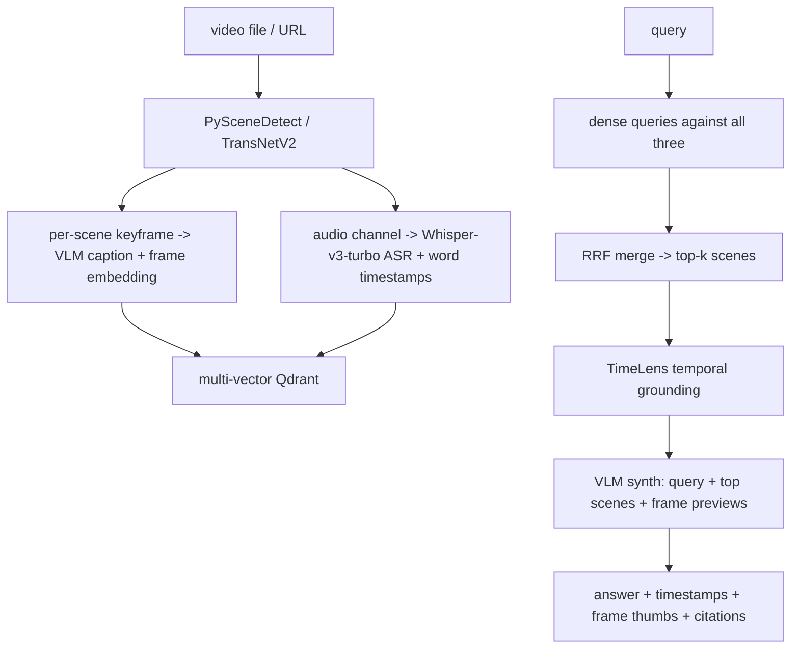

# Video, Audio-Language & Omni Models

> Combined lessons (5 parts), merged verbatim — no content removed.

**Type:** Combined

---

## Part 1 (ch238): Video-Language Models: Temporal Tokens and Grounding

> Video is not a stack of photos. A 5-second clip has causal ordering, action verbs, and event timing that an image model cannot represent. Video-LLaMA (Zhang et al., June 2023) shipped the first open video-LLM with audio-visual grounding. VideoChat and Video-LLaVA scaled the pattern. By 2025 Qwen2.5-VL's TMRoPE closed the gap with frontier proprietary models. Each system solved temporal tokens differently — Q-former per clip, concat-pool per frame, TMRoPE per token. This lesson reads the patterns, builds a uniform-vs-dynamic frame sampler, and evaluates on temporal grounding tasks.

**Type:** Build
**Languages:** Python (stdlib, frame sampler + temporal-grounding evaluator)
**Prerequisites:** Phase 12 · 08 (LLaVA-OneVision)
**Time:** ~180 minutes

## Learning Objectives

- Explain why temporal positional encoding changes video VLM performance independently of the vision encoder.
- Compare uniform, dynamic-FPS, and event-driven frame sampling on tokens-per-second vs grounding accuracy.
- Describe Q-former-per-clip (Video-LLaMA) vs pooled-per-frame (Video-LLaVA) vs M-RoPE-per-token (Qwen2.5-VL) designs.
- Name the four video benchmarks: VideoMME, TempCompass, EgoSchema, Video-MMMU.

## The Problem

A 1-minute video at 30 FPS is 1800 frames. At 196 visual tokens per frame (ViT-B at 224), that is 352k tokens — larger than any 2024-era LLM context.

Three reduction strategies exist:

1. Subsample frames (1-8 FPS depending on content).
2. Pool each frame's patch tokens aggressively (3×3 or 4×4 bilinear pool).
3. Compress via a Q-former that takes a 16-frame clip and outputs 64 tokens.

Each trade-off is different. Subsampling loses temporal detail. Pooling loses spatial detail. Q-former loses both a little but saves tokens.

Temporal position encoding is the other axis: how does the model know frame 5 came before frame 6? Options include simple 1D temporal RoPE (Video-LLaMA), learned temporal embeddings (Video-LLaVA), and TMRoPE (Qwen2.5-VL, full 3D).

## The Concept

### Video-LLaMA: Q-former per clip + audio branch

Video-LLaMA (2023) was the first open video-LLM. Architecture:

- 16-frame clips at 2 FPS (so 8 seconds).
- Per-frame ViT features -> Video Q-former that cross-attends over all 16 frames -> 32 learned queries -> LLM.
- Parallel audio branch: waveform -> ImageBind audio encoder -> Audio Q-former -> 32 queries -> LLM.

Strength: audio-visual joint reasoning. Weakness: fixed clip length, no arbitrary time grounding.

### VideoChat and Video-LLaVA

VideoChat kept the Video-LLaMA idea but dropped audio and simplified. Video-LLaVA (Lin et al., 2023) trained a single visual encoder on both images and video frames ("alignment before projection"), giving a unified representation. Both are frozen-CLIP-encoder + MLP + LLM.

Neither handles long video. Both are 8-16 frame systems.

### Qwen2.5-VL and TMRoPE

Qwen2.5-VL introduced TMRoPE — Temporal-Modality Rotary Position Embedding. Each patch token carries an (t, h, w) position where t is the actual timestamp (not frame index).

Key differences from simple temporal embedding:

- Absolute time, not index. The model sees "at 4.2 seconds" not "at frame 15."
- Per-token rotation, not per-clip. Each visual token rotates independently by its timestamp.
- Compatible with dynamic FPS. If you sample at 2 FPS here and 4 FPS there, TMRoPE handles the uneven spacing natively.

TMRoPE enables "at what second does the cat jump?" queries. The model can output "at 4.2 seconds." Video-LLaMA could only say "early in the clip."

### Frame sampling strategies

Uniform: sample N frames evenly over duration. Simple, loses motion peaks.

Dynamic FPS: sample adaptively based on motion intensity. Optical flow or frame differencing picks high-motion segments for denser sampling. Qwen2.5-VL trains on this.

Event-driven: run a lightweight detector, sample more where action happens. Used by VideoAgent.

Keyframe + context: sample at shot boundaries + a few adjacent frames. Used for cinematic content.

### Pooling per frame

At 1 FPS and 576 tokens per frame, a 5-minute clip is 172,800 tokens. Doable with Qwen2.5-VL-72B's 128k context but expensive.

3×3 bilinear pool reduces to 64 tokens per frame -> 19,200 tokens for 5 minutes. Sweet spot for most tasks.

Pool more aggressively (6×6 -> 16 tokens per frame) for agent workflows where spatial detail matters less.

### The four video benchmarks

- VideoMME: comprehensive video understanding, short + medium + long.
- TempCompass: fine-grained temporal reasoning, "before" / "after" questions.
- EgoSchema: long-horizon first-person video.
- Video-MMMU: multimodal multi-discipline video questions.

A full video-VLM evaluation hits all four. They stress different axes — TempCompass is all about ordering, EgoSchema is about 3+ minute reasoning, VideoMME spans durations.

### Grounding output formats

Output formats for temporal grounding:

- Free text: "The cat jumps around the 4-second mark." Easy to parse but imprecise.
- Structured JSON: `{"event": "jump", "start": 4.1, "end": 4.3}`. Qwen2.5-VL trains this.
- Token-based: special `<time>4.1</time>` tokens interleaved with the answer. Qwen2.5-VL's internal format.

Token-based is most accurate for downstream use. Qwen2.5-VL's JSON output format parses directly.

### 2026 best practice

For video VLMs in 2026:

- Encoder: SigLIP 2 with M-RoPE or TMRoPE (Qwen2.5-VL).
- Frame sampling: dynamic FPS (1-4 depending on motion) with max-frame cap.
- Per-frame pooling: 3×3 bilinear.
- Output: structured JSON with time + event fields.
- Benchmarks: VideoMME + TempCompass for general; EgoSchema for long-horizon.

## Use It

`code/main.py` includes:

- Uniform and dynamic-FPS frame samplers.
- A toy temporal-grounding evaluator: given a "ground truth" event at time T and a model output, score accuracy with tolerance.
- A comparison across Video-LLaMA (16 frames, Q-former), Video-LLaVA (8 frames, MLP), Qwen2.5-VL (dynamic FPS + TMRoPE).

## Ship It

This lesson produces `outputs/skill-video-vlm-frame-planner.md`. Given a video task (monitoring, action recognition, temporal grounding, summarization), it picks the frame sampler, pooling factor, output format, and expected accuracy tier.

## Exercises

1. For a 3-minute cooking demo, pick uniform vs dynamic FPS. Justify with a token count.

2. TMRoPE adds what specifically that a simple temporal embedding table cannot do?

3. Write a JSON schema for temporal grounding that a VLM can learn to emit. Include error cases.

4. Read Video-LLaVA's Section 3 on "Alignment Before Projection." Why is this better than training separate image and video encoders?

5. Given the VideoMME leaderboard, what is the gap between the top open model and the top proprietary model as of 2026? How much of that gap is attributable to temporal encoding vs base LLM scale?

## Key Terms

| Term | What people say | What it actually means |
|------|-----------------|------------------------|
| Temporal grounding | "Time-localized answers" | VLM outputs a specific timestamp range for when an event happens |
| TMRoPE | "Time-Multimodal RoPE" | 3D rotary position with absolute timestamps, used by Qwen2.5-VL |
| Dynamic FPS | "Motion-aware sampling" | Sample more frames in high-motion segments, fewer in static ones |
| Frame pooling | "Spatial compress per frame" | Reduce patches per frame with bilinear interpolation before the LLM |
| Video Q-former | "Clip compressor" | Cross-attention bottleneck mapping N frames to K learned queries |
| VideoMME | "Video bench" | Comprehensive short/medium/long video benchmark, 2500+ samples |

## Further Reading

- [Zhang et al. — Video-LLaMA (arXiv:2306.02858)](https://arxiv.org/abs/2306.02858)
- [Li et al. — VideoChat (arXiv:2305.06355)](https://arxiv.org/abs/2305.06355)
- [Lin et al. — Video-LLaVA (arXiv:2311.10122)](https://arxiv.org/abs/2311.10122)
- [Qwen Team — Qwen2.5-VL (arXiv:2502.13923)](https://arxiv.org/abs/2502.13923)
- [Lin et al. — VILA-1.5 (arXiv:2312.07533)](https://arxiv.org/abs/2312.07533)

[Reference](https://github.com/rohitg00/ai-engineering-from-scratch/tree/main/phases/12-multimodal-ai/17-video-language-temporal-grounding)

---

## Part 2 (ch239): Long-Video Understanding at Million-Token Context

> A 1-hour 4K video at 24 FPS, patched and embedded, produces on the order of 60 million tokens. A 2-hour podcast episode transcribed is 30,000 tokens. A full Blu-ray feature film, even compressed with aggressive pooling, is hundreds of thousands of tokens. Google's Gemini 1.5 (March 2024) opened this era with a 10-million-token context, doing reliable needle-in-a-haystack recall over hour-long videos. LWM (Liu et al., February 2024) showed ring attention's scaling path. LongVILA and Video-XL scaled ingestion further. VideoAgent swapped raw context for agentic retrieval. Each approach is a different trade-off on compute, recall, and engineering complexity. This lesson reads them side by side.

**Type:** Build
**Languages:** Python (stdlib, needle-in-haystack simulator + agentic-retrieval router)
**Prerequisites:** Phase 12 · 17 (video temporal tokens)
**Time:** ~180 minutes

## Learning Objectives

- Compute total visual-token counts for long-form video at varying FPS and pooling.
- Explain the three scaling paths: brute context (Gemini 1.5), ring attention (LWM), token compression (LongVILA / Video-XL).
- Compare raw-context video VLMs vs agentic-retrieval video VLMs (VideoAgent) on accuracy and latency.
- Design a needle-in-a-haystack test for a 30-minute video and measure recall at a specific minute.

## The Problem

A single frame of Qwen2.5-VL-sized patches at 384 native resolution is ~729 tokens. At 3×3 pooling that's 81 tokens per frame. A 30-minute clip at 1 FPS = 1800 frames = 145,800 tokens. Doable by 2025 open VLMs, tight. At 2 FPS, 291,600 tokens — only the biggest contexts fit.

A 2-hour movie at 1 FPS is 583k tokens. Beyond most 2026 open models; requires Gemini 2.5 Pro or pooling more aggressively.

Three scaling paths emerged.

## The Concept

### Path 1: Brute context (Gemini 1.5, Claude Opus)

Throw hardware at the problem. Scale context to millions of tokens, process everything in one forward pass.

Gemini 1.5 Pro launched with 1M tokens; Gemini 1.5 Ultra to 10M; Gemini 2.5 Pro in 2026 does hours of video reliably. The paper (arXiv:2403.05530) documents needle-in-a-haystack recall at 99.7% up to ~9.5M tokens.

Engineering: a custom attention implementation with memory hierarchy (local + global + sparse) plus MoE expert routing for long-context efficiency. Not published in full detail. Not open-source.

### Path 2: Ring attention (LWM, LongVILA)

Ring attention distributes long sequences across devices in a "ring" where each device holds a chunk. Attention across the full sequence happens by each device sending its chunk to the next in a ring pattern, computing partial attention, and aggregating.

LWM (Liu et al., 2024) trained a 1M-token context model this way. Training compute scales linearly with context, not quadratically — the quadratic hit on attention is amortized across the ring's devices.

LongVILA (arXiv:2408.10188) adapted the pattern to VLMs. 1400-frame videos at 192 tokens per frame = 268k context, trained with ring attention across 8-way parallelism.

### Path 3: Token compression (Video-XL, LongVA)

Cheaper than brute context: compress aggressively before the LLM sees the sequence.

Video-XL (arXiv:2409.14485) uses a visual summary token: each clip of N frames produces a single "summary" token that attends over the N. At inference, the LLM sees one summary token per clip, drastically shrinking the context.

LongVA extends LLM context from 200k to 2M with a "long context transfer" technique. Train on long-context text, transfer to long-context video via shared representation.

Token compression trades off recall at specific timestamps for scalability. The model knows generally what happened but sometimes misses exact frames.

### Path 4: Agentic retrieval (VideoAgent)

Do not feed the full video to the LLM. Instead, treat the video as a database and use an LLM to query it.

VideoAgent (arXiv:2403.10517):

1. LLM reads the question.
2. LLM asks a retrieval tool for relevant clips ("show me segments with a cat").
3. Tool returns matching clip timestamps.
4. LLM reads those clips via a VLM.
5. LLM composes the answer or asks follow-up queries.

This is the LLM-as-agent pattern applied to long video. Cheaper inference (only relevant clips encoded), harder engineering (retrieval quality becomes the bottleneck).

### Needle-in-a-haystack benchmarks

The standard long-context test: insert a unique visual or textual marker at a random point in the video, then ask a query that requires recalling it.

Metric: Recall@k across video length and marker position.

Gemini 2.5 Pro scores >99% recall at up to 90-minute videos. Open 72B models (Qwen2.5-VL-72B, InternVL3-78B) score ~85-90% at 30 minutes and degrade past 60.

VideoAgent can match or beat raw-context models at 2+ hours because retrieval hits the needle if the tool is good.

### Which path to pick

For a 15-minute clip at frontier accuracy: open 72B + native context usually works. Pick Qwen2.5-VL-72B.

For 30-minute to 1-hour content: LongVILA or Video-XL for open; Gemini 2.5 Pro for closed. The quality bar matters — frontier goes closed.

For 2+ hour content: VideoAgent or similar retrieval patterns. Alternatively, summarize to smaller chunks and feed hierarchical summaries.

### 2026 production pattern

In practice, production long-video pipelines are hybrid:

1. Run dynamic-FPS sampling + aggressive pooling on the entire video (get a 100k-token global representation).
2. Pass to a 72B VLM for a global summary.
3. If user asks detailed questions, run agentic retrieval using the summary as an index.

This combines brute-context for global understanding and retrieval for local detail.

## Use It

`code/main.py`:

- Computes token budgets for videos from 1 minute to 3 hours at varying FPS + pooling.
- Simulates a needle-in-a-haystack run: inject a marker at a random timestamp, ask a question, score recall.
- Includes an agentic-retrieval router simulator that picks specific clips to feed to a downstream VLM.

Run the budget table and feel the scale gap.

## Ship It

This lesson produces `outputs/skill-long-video-strategy-planner.md`. Given a video duration and query complexity, it picks between brute-context, compression, and agentic retrieval, and computes the latency + quality expectations.

## Exercises

1. A 45-minute lecture at 1 FPS, 81 tokens per frame. Total tokens? Fits in which models' contexts?

2. Design a needle-in-a-haystack test: at what minute do you inject the marker, and what is the exact query format?

3. Compare brute-context Qwen2.5-VL-72B (80k context) to VideoAgent (Claude 3.5 + retrieval) on a 1-hour video. Which wins on recall? Which wins on latency?

4. Ring attention's memory cost scales linearly in sequence length and linearly in device count. Explain why and what fails if you drop the ring-rotation phase.

5. Read Gemini 1.5 Section 5 on needle-in-a-haystack. What did the paper find about recall at the 1M vs 10M token boundary?

## Key Terms

| Term | What people say | What it actually means |
|------|-----------------|------------------------|
| Brute context | "Just more tokens" | Scale LLM context to millions of tokens; process everything in one pass |
| Ring attention | "LWM-style parallel" | Distributed attention pattern where each device holds a chunk and rotates |
| Token compression | "Summary tokens" | Reduce per-clip tokens via a learned compressor before the LLM |
| Needle-in-haystack | "NIH test" | Insert a unique marker at a random point, ask model to recall it at test time |
| Agentic retrieval | "LLM as query planner" | LLM asks a retrieval tool for relevant clips, reads them via a VLM, composes answer |
| VideoAgent | "Retrieval pattern for video" | Canonical agentic-retrieval design: question -> tool -> clip -> answer |

## Further Reading

- [Gemini Team — Gemini 1.5 (arXiv:2403.05530)](https://arxiv.org/abs/2403.05530)
- [Liu et al. — LWM / RingAttention (arXiv:2402.08268)](https://arxiv.org/abs/2402.08268)
- [Xue et al. — LongVILA (arXiv:2408.10188)](https://arxiv.org/abs/2408.10188)
- [Shu et al. — Video-XL (arXiv:2409.14485)](https://arxiv.org/abs/2409.14485)
- [Wang et al. — VideoAgent (arXiv:2403.10517)](https://arxiv.org/abs/2403.10517)

[Reference](https://github.com/rohitg00/ai-engineering-from-scratch/tree/main/phases/12-multimodal-ai/18-long-video-million-token)

---

## Part 3 (ch240): Audio-Language Models: the Whisper to Audio Flamingo 3 Arc

> Whisper (Radford et al., December 2022) settled speech recognition — 680k hours of weakly-supervised multilingual speech, a simple encoder-decoder transformer, a benchmark that made every subsequent ASR release cite it. But recognition is not reasoning. Asking "what instruments are in this recording" or "what emotion is the speaker expressing" or "what happened at minute 3" requires audio understanding, not transcription. Qwen-Audio, SALMONN, LTU, and NVIDIA's Audio Flamingo 3 (AF3, July 2025) progressively built that stack: keep Whisper-class encoders, bolt on Q-formers, train on audio-text instruction data, add chain-of-thought reasoning. This lesson walks the arc.

**Type:** Build
**Languages:** Python (stdlib, log-Mel spectrogram + audio Q-former skeleton)
**Prerequisites:** Phase 6 (Speech and Audio), Phase 12 · 03 (Q-Former)
**Time:** ~180 minutes

## Learning Objectives

- Compute a log-Mel spectrogram from a waveform: windowing, FFT, filter banks, log transform.
- Compare encoder options: Whisper encoder, BEATs, AF-Whisper hybrid. When each wins.
- Build an audio Q-former: N learnable queries cross-attending to spectrogram patches.
- Explain cascaded (Whisper-then-LLM) vs end-to-end audio-LLM training: why end-to-end scales better for reasoning.

## The Problem

Speech recognition was solved by Whisper. OCR-of-audio is a commodity. But "commodity" stops at transcription. If the model cannot reason over what it heard — timing, speakers, emotion, music structure, environmental sounds — transcription alone cannot drive product features.

Three obvious routes:

1. Cascade: Whisper transcribes, LLM reasons over the transcript. Works for pure-speech scenarios. Fails for music, environmental audio, multi-speaker overlap, emotion.

2. End-to-end audio-LLM: an audio encoder feeds audio tokens directly into an LLM, skipping transcription. Preserves acoustic information (emotion, speaker, environment). Needs new training data.

3. Hybrid: audio encoder + text decoder that can both transcribe and reason. Qwen-Audio and Audio Flamingo pick this route.

## The Concept

### Log-Mel spectrogram: the input feature

Every audio encoder starts with the same feature: a log-Mel spectrogram.

1. Resample to 16 kHz.
2. Short-time Fourier transform with 25ms windows, 10ms hop.
3. Take magnitude of the FFT result.
4. Apply Mel filter banks (typically 80 filters log-spaced 0-8000 Hz) to warp to perceptual frequency.
5. Log compress (log(1 + x)) for dynamic range.

Result: a 2D array of shape (T, 80) where T is the number of time frames. For a 30-second clip at 100 Hz frame rate: (3000, 80).

### Whisper's encoder

Whisper's encoder is a 12-layer ViT-style transformer processing the log-Mel spectrogram as a sequence of time frames. Output: one hidden-state vector per time frame.

For ASR, Whisper's decoder is a cross-attention transformer that generates text tokens conditioned on the encoder output. Standard encoder-decoder.

For ALMs (audio-LLMs), you want the encoder output as input to a different LLM. The pattern: Whisper encoder frozen, Q-former trainable, LLM frozen or tuned.

### BEATs and audio-specific encoders

Whisper was trained on speech-dominant data. It is weaker for music and environmental audio.

BEATs (Chen et al., 2022) is a self-supervised transformer trained on AudioSet. Captures music and environmental sounds better than Whisper at the same parameter count.

AF-Whisper (Audio Flamingo 3's hybrid): concat Whisper + BEATs features as the audio input. Whisper carries linguistic signal, BEATs carries acoustic signal.

### Audio Q-former

Same pattern as BLIP-2's visual Q-former. A fixed number of learnable queries (often 32 or 64) cross-attend over the audio encoder's output frames. The queries become audio tokens consumed by the LLM.

Training alignment stage: Q-former alone, contrastive + captioning losses on audio-text pairs (AudioCaps, Clotho). Instruction stage: end-to-end, unfreeze LLM, train on instruction data.

### The arc — SALMONN, Qwen-Audio, AF3

SALMONN (Tang et al., 2023): Whisper + BEATs + Q-former + LLaMA. The first open audio-LLM with serious reasoning ability. Benchmarks on MMAU show ~0.55 composite.

Qwen-Audio (Chu et al., 2023): similar architecture, trained on a richer dataset, tuned for multi-turn dialogue. MMAU ~0.60.

LTU — Listen, Think, Understand (Gong et al., 2023): explicit reasoning data, focus on chain-of-thought over audio clips. Smaller but more focused.

Audio Flamingo 3 (Goel et al., July 2025): the current open SOTA. 8B LLM backbone (Qwen2 7B), Whisper-large encoder concat BEATs, 64-query Q-former, training on 1M+ audio-text instruction pairs. MMAU 0.72, matches proprietary frontier on some sub-tasks.

AF3 also introduces on-demand chain-of-thought for audio: the model can optionally emit thinking tokens ("let me identify the instruments first: ...") before the final answer. Accuracy on complex reasoning tasks lifts 3-5 points when thinking is enabled.

### Cascaded vs end-to-end

Cascaded pipeline:

1. Whisper transcribes audio → text.
2. LLM reasons over text.

Works perfectly for "summarize this podcast." Fails for:
- "What's the mood of this song?" — mood is in the sound, not words.
- "Who is speaking, Alice or Bob?" — requires speaker identification.
- "At what second does the explosion happen?" — temporal grounding lost in text.
- "Is this real or generated audio?" — deepfake detection needs acoustic features.

End-to-end preserves acoustic signal. Qwen-Audio and AF3 handle music, environment, and emotion natively.

### 2026 production recipe

For a new audio-understanding product:

- Cascaded if: transcription is the goal, no music, no emotion inference.
- AF3 / Qwen-Audio-family if: music, emotion, multi-speaker, or complex audio reasoning.

Cascaded is cheaper and simpler. End-to-end is more capable.

### MMAU — the audio reasoning benchmark

MMAU (Massive Multimodal Audio Understanding) is the 2024-2025 audio reasoning benchmark:

- 10,000 audio-text QA pairs across speech, music, environmental sounds.
- Covers classification, temporal reasoning, causal reasoning, open-ended QA.
- Tests what cascaded pipelines systematically miss.

Open SOTA (AF3) at 0.72; proprietary frontier ~0.78 (Gemini 2.5 Pro, Claude Opus 4.7). The gap is smaller than VideoMME's open-vs-closed delta, indicating audio-LLMs are maturing.

## Use It

`code/main.py`:

- Implements log-Mel spectrogram computation in stdlib: windowing, naive DFT, Mel filter-bank.
- Audio Q-former skeleton: given encoder output frames, compute Q, K, V, attention, and emit N tokens.
- Cascaded-vs-end-to-end comparison on a toy task.

## Ship It

This lesson produces `outputs/skill-audio-llm-pipeline-picker.md`. Given an audio task (transcription, music tagging, emotion inference, multi-speaker diarization, environment classification), it picks cascaded, end-to-end AF3, or a hybrid.

## Exercises

1. Compute the log-Mel spectrogram dimension for a 30-second clip at 16kHz, 25ms window, 10ms hop, 80 Mel bins. How does this change at 48kHz?

2. Why does Whisper underperform on music? What audio features does BEATs capture that Whisper does not?

3. Audio Q-former with 64 queries vs 32: at what task complexity does 64 pay off? 32 save compute for what?

4. Read AF3 Section 4 on on-demand thinking. Propose three audio tasks where chain-of-thought helps the most.

5. Implement a minimal diarization pipeline using AF3's output. How do you signal speaker changes?

## Key Terms

| Term | What people say | What it actually means |
|------|-----------------|------------------------|
| Log-Mel spectrogram | "Mel features" | 2D (time, frequency) array of log-magnitude values after Mel filter banks |
| Audio Q-former | "Audio Perceiver" | Cross-attention bottleneck from audio encoder output to fixed-length queries feeding the LLM |
| Cascaded | "ASR-then-LLM" | Pipeline where Whisper transcribes and a text LLM reasons; loses acoustic information |
| End-to-end | "Audio-LLM" | Audio features enter the LLM directly via Q-former; preserves acoustic signal |
| BEATs | "Audio AudioSet encoder" | SSL transformer trained on AudioSet; strong on music + environmental sounds |
| MMAU | "Audio reasoning bench" | 10k QA pairs across speech, music, environment; 2024 eval standard |
| On-demand thinking | "Audio CoT" | Model can optionally emit reasoning tokens before final answer, lifts accuracy 3-5 pts |

## Further Reading

- [Radford et al. — Whisper (arXiv:2212.04356)](https://arxiv.org/abs/2212.04356)
- [Chu et al. — Qwen-Audio (arXiv:2311.07919)](https://arxiv.org/abs/2311.07919)
- [Goel et al. — Audio Flamingo 3 (arXiv:2507.08128)](https://arxiv.org/abs/2507.08128)
- [Tang et al. — SALMONN (arXiv:2310.13289)](https://arxiv.org/abs/2310.13289)
- [Gong et al. — LTU (arXiv:2305.10790)](https://arxiv.org/abs/2305.10790)

[Reference](https://github.com/rohitg00/ai-engineering-from-scratch/tree/main/phases/12-multimodal-ai/19-audio-language-whisper-to-af3)

---

## Part 4 (ch241): Omni Models: Qwen2.5-Omni and the Thinker-Talker Split

> GPT-4o's product demo in May 2024 was disruptive not because of the underlying model but because of the product shape — a voice interface where you talk, the model sees what the camera sees, and it talks back in under 250ms. The open ecosystem spent the rest of 2024 and 2025 racing to reach that product surface. Qwen2.5-Omni (March 2025) is the reference open design: a Thinker (large text-generating transformer) plus a Talker (parallel speech-generating transformer), linked by streaming speech tokens. Mini-Omni simplified it, Moshi matched its latency, GLM-4-Voice extended it to Chinese. This lesson reads the Thinker-Talker architecture and the latency budget that makes streaming real-time dialogue work.

**Type:** Build
**Languages:** Python (stdlib, streaming pipeline latency simulator + VAD loop)
**Prerequisites:** Phase 12 · 19 (audio-LLMs), Phase 12 · 16 (any-to-any)
**Time:** ~180 minutes

## Learning Objectives

- Split the inference pipeline into Thinker (text reasoning) and Talker (speech synthesis) and explain why parallel streaming works.
- Compute the time-to-first-audio-byte (TTFAB) budget for a conversational interaction, component by component.
- Describe TMRoPE's time-aligned position encoding across vision, audio, and text within the Thinker.
- Name the three real-time conversational patterns: half-duplex, turn-taking, full-duplex.

## The Problem

A real-time voice assistant has to do a lot, fast:

1. Hear the user. Real-time speech tokenization, voice activity detection (VAD) to know when they're done speaking.
2. Optionally see. Camera input at 2-4 FPS, streamed into the Thinker alongside audio.
3. Think. Compose a response conditioned on the conversation history.
4. Speak. Synthesize audio tokens, decode to waveform, stream to the user's speakers.

Each step adds latency. Conversational-feel requires total round-trip < 500ms — below that, the user stops noticing the lag. GPT-4o claims ~250ms. Moshi ~160ms. Qwen2.5-Omni ~350-500ms.

Every component needs to stream. Nothing can be "batch everything then decode."

## The Concept

### Thinker and Talker

Qwen2.5-Omni's decomposition:

- Thinker: a 7B-80B text-generating transformer. Consumes interleaved text + image + audio tokens. Outputs text tokens representing what to say.
- Talker: a smaller speech-generating transformer (200M-1B). Consumes Thinker's text output tokens plus recent speech-context tokens. Outputs discrete speech tokens (residual-VQ indices).
- Speech decoder: a streaming waveform decoder (SNAC, MoVQGAN family) that takes speech tokens to audio samples in real time.

The separation matters. Thinker has to be big for good reasoning. Talker can be small because its job is local — convert text to speech tokens. Bigger Talker is not more expressive; it's slower.

Running both in parallel:

1. Thinker emits text token t_i.
2. Talker consumes t_i (via streaming) and emits speech tokens s_i, s_{i+1}, ..., s_{i+k}.
3. Speech decoder consumes speech tokens as they come and emits audio samples.
4. By the time Thinker is at text token t_{i+3}, Talker has already streamed audio for t_0..t_{i+2}.

### TMRoPE — time-aligned multimodal positions

Thinker needs to integrate image frames (arriving at, say, 4 FPS), audio frames (arriving at 50 frames/second), and text from conversation history. A naive sequence order (all images, then all audio, then text) loses temporal alignment.

TMRoPE assigns absolute timestamps to every token. Vision token at t=2.3s. Audio token at t=2.32s. Text token from the user "stop" at t=2.35s. RoPE rotates attention by timestamp; the model sees them as temporally concurrent.

This is the infrastructure for "he waved while saying hello" to work — the model sees the video frame and the audio at the same conceptual moment.

### Streaming speech synthesis

Speech tokens must stream. Mini-Omni (Xie & Wu, 2024) introduced "language models can hear, talk while thinking in streaming": Thinker output tokens and Talker output tokens interleave in the same sequence. Talker fires as soon as Thinker commits the next text token. No batch boundaries.

Moshi (Défossez et al., October 2024) is the fastest open implementation. 160ms TTFAB on a single A100. Architecture: a single 7B transformer that emits text and speech tokens on alternating positions, with an "inner monologue" that separates the thinking stream from the speaking stream. This is effectively Thinker + Talker fused into one model with careful training.

### VAD and turn-taking

Voice activity detection runs on the input side. Two patterns:

- Half-duplex: user speaks, model listens. Model speaks, user listens. Clear handoff via VAD silence detection (~200ms).
- Full-duplex: both can speak simultaneously. Model can backchannel ("uh-huh") or interrupt. Much harder. Moshi supports this.

Qwen2.5-Omni supports half-duplex by default, with turn-taking via silence threshold. Full-duplex requires application-layer handling.

### Qwen3-Omni (November 2025)

The successor. Qwen3-80B Thinker, larger Talker, improved TMRoPE-v2. Latency close to GPT-4o's 250ms. Open weights. Benchmarks on OmniBench competitive with Gemini 2.0 Live.

### Production latency budget

For a typical streaming interaction:

- Mic -> audio tokens: 40-80ms.
- Prefill (prompt + history): 100-200ms at 7B, much more at 70B.
- First Thinker text token: 40ms.
- Talker processes first text token: 20ms.
- First speech tokens commit: 40ms.
- Residual-VQ decode: 30ms.
- Speech waveform decode: 50-80ms.

Total TTFAB: 320-510ms at 7B, 600-900ms at 70B. Frontier quality usually means 70B+; hence the frontier latency gap.

### Token-rate math

At 16kHz speech with 50 Hz base speech tokens, you need 50 speech tokens per second of output. Talker must emit ≥50 tok/s to keep up. At a typical LLM throughput of 30-80 tok/s on an H100, a small (200-300M) Talker is fast enough; a 7B Talker would fall behind.

This is why small dedicated Talker models exist rather than "just use the main model."

## Use It

`code/main.py`:

- Simulates a Thinker-Talker pipeline with mock token-emission rates.
- Computes TTFAB for configurable model sizes and mic sample rates.
- Demonstrates half-duplex turn-taking with VAD silence threshold.

## Ship It

This lesson produces `outputs/skill-omni-streaming-budget.md`. Given a real-time voice product's target TTFAB and feature set (vision-in, bilingual, full-duplex), picks Qwen2.5-Omni, Qwen3-Omni, Moshi, or Mini-Omni and sizes the Thinker/Talker.

## Exercises

1. Your target TTFAB is 300ms. On a 7B Thinker and 300M Talker, write out every component's latency.

2. Qwen2.5-Omni uses TMRoPE. Describe what the model sees for a prompt where the user starts speaking at t=1s and the camera catches a gesture at t=1.2s.

3. Full-duplex support requires the model to emit audio while listening. Propose a training data format that teaches this.

4. Read Moshi's paper Section 4. Describe the "inner monologue" separation and why it avoids the Thinker-Talker split.

5. Compute the throughput budget: how fast must a Talker emit tokens to keep up with 16kHz speech at 50 base-layer tokens/sec?

## Key Terms

| Term | What people say | What it actually means |
|------|-----------------|------------------------|
| Thinker | "Reasoning brain" | Large text-generating transformer producing what to say |
| Talker | "Speech-generating mouth" | Small transformer producing discrete speech tokens from Thinker's text |
| TTFAB | "Latency budget" | Time-to-first-audio-byte: from user speech end to first audio sample out |
| TMRoPE | "Time-aligned RoPE" | Position encoding using absolute timestamps across vision, audio, text |
| Half-duplex | "Turn-taking" | User and model alternate; VAD silence detects user-done |
| Full-duplex | "Simultaneous" | Model can speak and listen at the same time; backchannel capable |
| Inner monologue | "Moshi separation" | Single-model design where thinking-stream and speaking-stream interleave |

## Further Reading

- [Xu et al. — Qwen2.5-Omni (arXiv:2503.20215)](https://arxiv.org/abs/2503.20215)
- [Qwen Team — Qwen3-Omni (arXiv:2509.17765)](https://arxiv.org/html/2509.17765v1)
- [Xie & Wu — Mini-Omni (arXiv:2408.16725)](https://arxiv.org/abs/2408.16725)
- [Défossez et al. — Moshi (arXiv:2410.00037)](https://arxiv.org/abs/2410.00037)
- [Zeng et al. — GLM-4-Voice (arXiv:2412.02612)](https://arxiv.org/abs/2412.02612)

[Reference](https://github.com/rohitg00/ai-engineering-from-scratch/tree/main/phases/12-multimodal-ai/20-omni-models-thinker-talker)

---

## Part 5 (ch428): Video Understanding Pipeline (Scene, QA, Search)

> Twelve Labs productized Marengo + Pegasus. VideoDB shipped the CRUD-for-video API. AI2's Molmo 2 published open VLM checkpoints. Gemini long-context handles hours of video natively. TimeLens-100K defined temporal grounding at scale. The 2026 pipeline is settled: scene segmentation, per-scene caption + embedding, transcript alignment, multi-vector index, and a query that answers with (start, end) timestamps plus frame previews. The capstone is ingesting 100 hours, hitting public benchmarks, and measuring hallucination on counting and action questions.

**Type:** Capstone
**Languages:** Python (pipeline), TypeScript (UI)
**Prerequisites:** Phase 4 (CV), Phase 6 (speech), Phase 7 (transformers), Phase 11 (LLM engineering), Phase 12 (multimodal), Phase 17 (infrastructure)
**Time:** 30 hours

## Problem

Long-form video QA is the most bandwidth-hungry multimodal problem at 2026 scale. Gemini 2.5 Pro can read a 2-hour video natively, but ingesting 100 hours of video into a queryable corpus still requires a scene-level index. The production shape combines scene segmentation (TransNetV2 or PySceneDetect), per-scene captioning with a VLM (Gemini 2.5, Qwen3-VL-Max, or Molmo 2), transcript alignment (Whisper-v3-turbo with word timestamps), and a multi-vector index that stores caption, frame embedding, and transcript side by side. The query pipeline answers with (start, end) timestamps plus frame previews.

Benchmarks are public (ActivityNet-QA, NeXT-GQA) plus your own 100-query custom set. Hallucination on counting and action-type questions is the known-hard failure class; the capstone explicitly measures it.

## Concept

Three pipelines run in parallel at ingest. **Scene segmentation** cuts the video into scenes. **VLM captioning** generates a caption per scene and a frame embedding from a keyframe. **ASR alignment** produces word-level timestamps. The three streams are joined by (scene_id, time range). Each scene gets three vector types in a multi-vector index (Qdrant): caption embedding, keyframe embedding, transcript embedding.

At query time, the natural-language question fires against all three vectors; results merge with RRF; a temporal-grounding adapter (TimeLens-style) refines the (start, end) window within the top scene. The VLM synthesizer (Gemini 2.5 Pro or Qwen3-VL-Max) takes query + top scenes + cropped frames and answers with cited timestamps and a frame preview.

The hallucination measurement matters. Counting ("how many people enter the room?") and action-type ("does the chef pour before stirring?") questions are notoriously unreliable. Report accuracy separately from descriptive questions.

## Architecture



## Stack

- Scene segmentation: TransNetV2 (state-of-the-art 2024-26) or PySceneDetect
- ASR: Whisper-v3-turbo via faster-whisper with word timestamps
- VLM captioner + answerer: Gemini 2.5 Pro or Qwen3-VL-Max or Molmo 2
- Temporal grounding: TimeLens-100K-trained adapter or VideoITG
- Index: Qdrant with multi-vector support (caption / frame / transcript)
- UI: Next.js 15 with HTML5 video player and scene thumbnails
- Eval: ActivityNet-QA, NeXT-GQA, custom 100-question hand-labeled set
- Hallucination benchmark: counting and action-type subsets with hand labels

## Build It

1. **Ingest walker.** Accept YouTube URLs or local MP4s. Downscale to 720p if needed. Persist `{video_id, file_path}`.

2. **Scene segmentation.** Run TransNetV2 or PySceneDetect to produce `[{scene_id, start_ms, end_ms, keyframe_path}]`. Target 100 hours: ~6k-8k scenes.

3. **ASR pass.** Run Whisper-v3-turbo on audio; export word-level timestamps; split into per-scene transcript slices.

4. **VLM captioning.** Per scene, call Gemini 2.5 Pro (or Qwen3-VL-Max) with the keyframe and a short caption template. Produce caption + frame embedding.

5. **Multi-vector index.** Qdrant collection with three named vectors. Payload: `{video_id, scene_id, start_ms, end_ms, keyframe_url}`.

6. **Query.** Natural-language question fires three dense queries; merge with reciprocal rank fusion; top-k=5 scenes.

7. **Temporal grounding.** Run TimeLens-style adapter on the top scene to refine the (start, end) window within the scene.

8. **VLM synth.** Call Gemini 2.5 Pro with query + top-3 scene clips (as images or short clips) + transcripts. Require `(video_id, start_ms, end_ms)` citations.

9. **Eval.** Run ActivityNet-QA and NeXT-GQA. Build a 100-query custom set. Report overall accuracy + per-class breakdown (counting, action, descriptive).

## Use It

```console
$ video-qa ask --url=https://youtube.com/watch?v=X "how many cars pass the intersection in the first minute?"
[scene]    23 scenes detected
[asr]      transcript complete, 4m12s
[index]    69 vectors written (23 scenes x 3)
[query]    top scene: scene 3 [01:32-01:54], confidence 0.84
[ground]   refined window: [00:12-00:58]
[synth]    gemini 2.5 pro, 1.4s
answer:    5 cars pass the intersection between 00:12 and 00:58.
citations: [scene 3: 00:12-00:58]
          [frame preview at 00:14, 00:27, 00:44, 00:51, 00:57]
```

## Ship It

`outputs/skill-video-qa.md` is the deliverable. Given a YouTube URL or uploaded video, the pipeline indexes scenes and answers questions with timestamped citations.

| Weight | Criterion | How it is measured |
|:-:|---|---|
| 25 | Temporal grounding IoU | Intersection-over-union on held-out grounding set |
| 20 | QA accuracy | NeXT-GQA and custom 100-query |
| 20 | Ingest throughput | Hours of video per dollar spent |
| 20 | UI and citation UX | Timestamp links, thumbnail strip, jump-to-frame |
| 15 | Hallucination rate | Counting and action-type accuracy separately |
| **100** | | |

## Exercises

1. Swap Gemini 2.5 Pro for Qwen3-VL-Max on the captioning pass. Report caption quality delta on a human-rated 50-scene sample.

2. Reduce per-scene frame embedding to one pooled vector instead of multi-vector. Measure the retrieval regression.

3. Build a "counting strict" mode: the synthesizer extracts each counted instance with a timestamp and the user clicks to verify. Measure whether user-verification reduces hallucination.

4. Benchmark ingest cost: hours-of-video-per-dollar across three VLM choices. Pick the sweet spot.

5. Add speaker-diarized transcript: run pyannote speaker diarization on the audio and embed per-speaker transcripts. Demonstrate "what did Alice say about X?" queries.

## Key Terms

| Term | What people say | What it actually means |
|------|-----------------|------------------------|
| Scene segmentation | "Shot detection" | Cutting video into scenes at shot boundaries |
| Multi-vector index | "Caption + frame + transcript" | Qdrant collection with named vectors per representation |
| Temporal grounding | "When exactly did it happen" | Refining the (start, end) window for a query answer |
| Frame embedding | "Visual representation" | A vector embedding of a keyframe; used for scene-visual similarity |
| RRF fusion | "Reciprocal rank fusion" | Merge strategy across multiple ranked lists; a classic hybrid-retrieval trick |
| Counting hallucination | "Miscount" | Known failure mode of VLMs on "how many X" questions |
| ActivityNet-QA | "Video-QA benchmark" | Long-form video QA accuracy benchmark |

## Further Reading

- [AI2 Molmo 2](https://allenai.org/blog/molmo2)
- [TimeLens (CVPR 2026)](https://github.com/TencentARC/TimeLens)
- [Gemini Video long-context](https://deepmind.google/technologies/gemini)
- [VideoDB](https://videodb.io)
- [Twelve Labs Marengo + Pegasus](https://www.twelvelabs.io)
- [TransNetV2](https://github.com/soCzech/TransNetV2)
- [PySceneDetect](https://github.com/Breakthrough/PySceneDetect)
- [ActivityNet-QA](https://arxiv.org/abs/1906.02467)

[Reference](https://github.com/rohitg00/ai-engineering-from-scratch/tree/main/phases/19-capstone-projects/12-video-understanding-pipeline)
