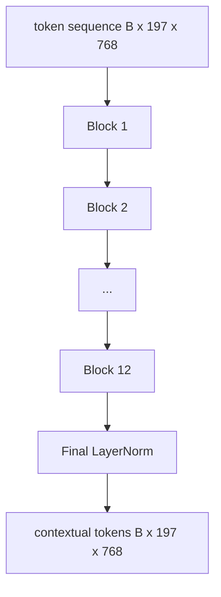
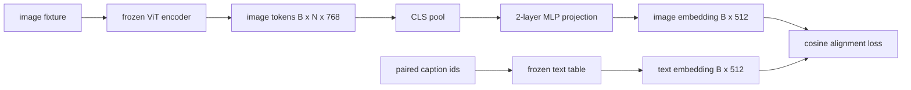
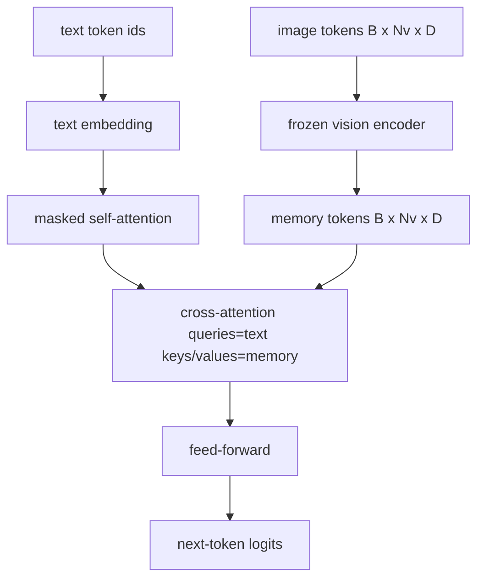
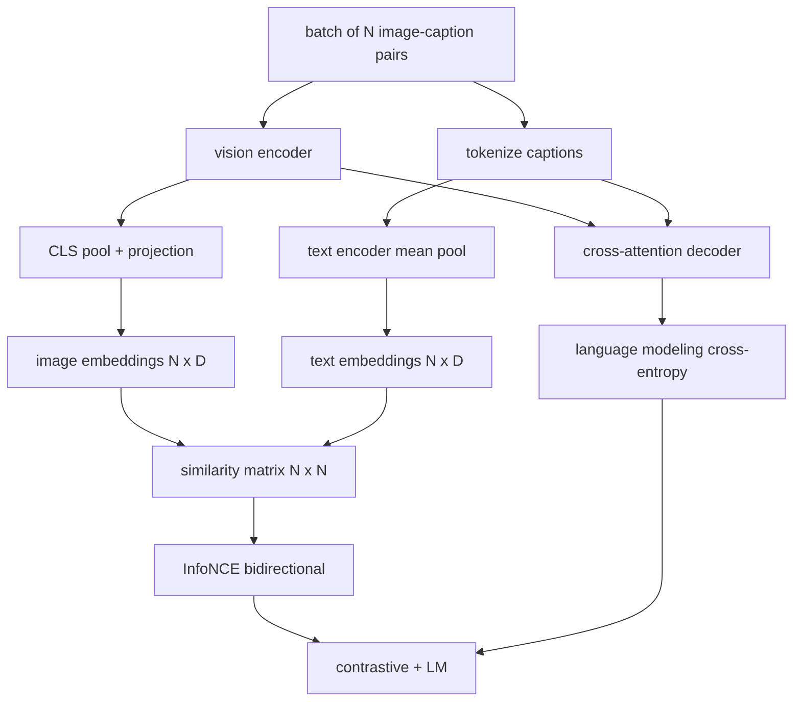
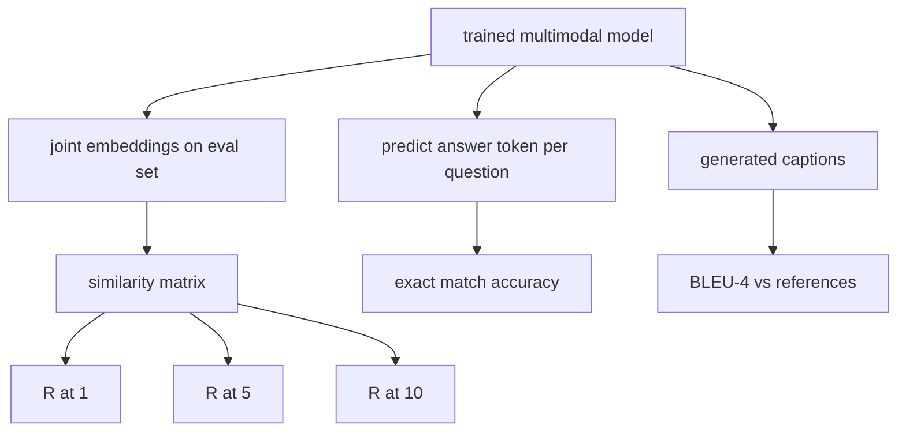

# Building a VLM from Scratch

> Combined lessons (6 parts), merged verbatim — no content removed.

**Type:** Combined

---

## Part 1 (ch472): Vision Encoder Patches

> A vision model that reads pixels needs a tokenizer for pixels. Patch embedding is that tokenizer.

**Type:** Build
**Languages:** Python
**Prerequisites:** Phase 19 lessons 30-37
**Time:** ~90 minutes

## Learning Objectives

- Tokenize an image into a fixed-length sequence of patch embeddings.
- Implement a Conv2d-based patch projection.
- Build a deterministic 2D sinusoidal position embedding.
- Verify patch count, embedding shape, and Conv2d/unfold equivalence.

## The Problem

A 224x224 RGB image is 150,528 tokens if read pixel-by-pixel. Patch embedding with 16x16 patches produces 196 tokens. Each patch is flattened and linearly projected to the model's hidden dimension.

### The Conv2d trick

A `Conv2d(in_channels=3, out_channels=hidden, kernel_size=patch_size, stride=patch_size)` gives the same numerical result as unfold-then-linear.

### Position embeddings

Half the embedding dimension encodes row position with sin/cos; the other half encodes column position. Deterministic and interpolates cleanly to new resolutions.

| Component | Shape | Parameters |
|-----------|-------|------------|
| Patch projection | (hidden, 3, patch, patch) | 3 * P * P * hidden + hidden |
| Position embedding | (num_patches, hidden) | 0 (fixed) |
| CLS token | (1, hidden) | hidden |

## Build It

`code/main.py` implements: `PatchEmbed`, `sinusoidal_2d`, `VisionFrontEnd`, `synthesize_image`.

## Key Terms

| Term | What it means |
|------|---------------|
| Patch | Square sub-region of the image, typically 14x14 or 16x16 |
| Patch embedding | Linear projection of one flattened patch to the hidden dim |
| Sequence length | Number of tokens after patch tokenization, usually plus CLS |
| Sinusoidal position | Fixed sin/cos signal encoding 2D grid coordinates |
| CLS token | Learned vector prepended as the pooling head |

[Reference](https://github.com/rohitg00/ai-engineering-from-scratch/tree/main/phases/19-capstone-projects/58-vision-encoder-patches)

---

## Part 2 (ch473): Vision Transformer Encoder

> Patches alone do not see. A 12-layer pre-LN transformer with 12 attention heads turns patch tokens into contextual tokens.

**Type:** Build
**Languages:** Python
**Prerequisites:** Phase 19 lessons 30-37
**Time:** ~90 minutes

## Learning Objectives

- Implement a pre-LN transformer block with multi-head self-attention and feed-forward sub-layer.
- Stack 12 blocks with 12 heads to form a ViT-Base encoder.
- Wire the patch front end from lesson 58 into the encoder.
- Verify that the CLS token aggregates information from every patch.

## The Concept

### Parameter count at ViT-Base

| Component | Parameters |
|-----------|------------|
| qkv projection per block | 1.77M |
| output projection per block | 590K |
| FFN per block (4x) | 4.72M |
| Total | ~86M |

## Build It

`code/main.py` implements: `MultiHeadSelfAttention`, `FeedForward`, `Block`, `ViT`, `VisionEncoder`.

## Key Terms

| Term | What it means |
|------|---------------|
| Pre-LN | LayerNorm before each sub-layer instead of after |
| Self-attention | Each token attends to every other token |
| Multi-head | Hidden dim split across H independent heads |
| FFN expansion | Feed-forward widens to 4 * hidden before contracting |
| CLS pooling | First token's final state as image summary |

[Reference](https://github.com/rohitg00/ai-engineering-from-scratch/tree/main/phases/19-capstone-projects/59-vit-transformer)

---

## Part 3 (ch474): Projection Layer for Modality Alignment

> A vision encoder produces image tokens. A text decoder consumes text tokens. A small two-layer MLP projects image tokens into the text embedding space.

**Type:** Build
**Languages:** Python
**Prerequisites:** Phase 19 lessons 30-37
**Time:** ~90 minutes

## Learning Objectives

- Build a two-layer MLP projection from image features to text embedding space.
- Construct a mock text embedding table.
- Compute a cosine alignment loss between projected image tokens and paired caption embedding.
- Train the projection alone with frozen vision encoder and text table.

## The Concept

### Why two layers and not one

A single linear layer can rotate and rescale but cannot fix basis curvature mismatches. GELU between two linear layers gives one non-linear bend, empirically enough for alignment.

| Layer | Shape | Parameters |
|-------|-------|------------|
| fc1 | (768, 1024) | 768*1024 + 1024 |
| activation | GELU | 0 |
| fc2 | (1024, 512) | 1024*512 + 512 |

## Build It

`code/main.py` implements: `MLPProjector`, `MockTextEmbedding`, `make_pair`, `cosine_alignment_loss`.

## Key Terms

| Term | What it means |
|------|---------------|
| Modality alignment | Making image and text embeddings comparable in one shared space |
| Projection head | Small module mapping one space to another, usually 2-layer MLP |
| Cosine similarity | Dot product divided by product of L2 norms |
| Frozen encoder | Vision/text model with requires_grad=False |

[Reference](https://github.com/rohitg00/ai-engineering-from-scratch/tree/main/phases/19-capstone-projects/60-projection-layer-modality-align)

---

## Part 4 (ch475): Cross-Attention Fusion

> The projection layer aligns one image vector with one caption vector. Cross-attention lets every text token attend to every patch token.

**Type:** Build
**Languages:** Python
**Prerequisites:** Phase 19 lessons 30-37
**Time:** ~90 minutes

## Learning Objectives

- Implement multi-head cross-attention with query = text, key/value = vision.
- Compose a decoder block: causal self-attention + cross-attention + feed-forward.
- Get the mask shapes right: causal for self, none for cross.
- Run a forward pass with batched text tokens and fixed image tokens.

## The Concept

### Mask shapes

| Attention | Query length | Key length | Mask |
|-----------|--------------|------------|------|
| Self-attention | Nt (text) | Nt (text) | Causal lower-triangular |
| Cross-attention | Nt (text) | Nv (vision) | No mask |

## Build It

`code/main.py` implements: `CrossAttention`, `CausalSelfAttention`, `DecoderBlock`, `VisionLanguageDecoder`, `causal_mask`.

## Key Terms

| Term | What it means |
|------|---------------|
| Late fusion | Text and vision stay separate; cross-attention bridges at every block |
| Cross-attention | Q from one stream, K and V from another |
| Causal mask | Lower-triangular boolean preventing lookahead |
| KV cache | Image keys/values stored once, reused for every decode step |
| Memory tokens | Frozen image tokens the decoder reaches into |

[Reference](https://github.com/rohitg00/ai-engineering-from-scratch/tree/main/phases/19-capstone-projects/61-cross-attention-fusion)

---

## Part 5 (ch476): Vision-Language Pretraining

> The encoder, projection, and decoder are wired. Now train them together: contrastive image-text loss plus language modeling loss.

**Type:** Build
**Languages:** Python
**Prerequisites:** Phase 19 lessons 30-37
**Time:** ~90 minutes

## Learning Objectives

- Implement InfoNCE contrastive loss across a batch of image-caption pairs.
- Compose contrastive loss with autoregressive language modeling loss.
- Synthesize a 200-pair mock corpus.
- Run a 50-step demo and observe both losses decreasing.

## The Concept

### InfoNCE

L2-normalize image and text embeddings. Compute N x N similarity matrix `S = I T^T / tau`. Cross-entropy with diagonal as target, symmetric across rows and columns.

### Combining losses

`total = contrastive + lm_weight * lm`

| Component | Loss surface | Affects |
|-----------|--------------|---------|
| InfoNCE | Pair ranking | Encoder + projection + text head |
| LM | Token prediction | Encoder + projection + decoder |

## Build It

`code/main.py` implements: `MultimodalModel`, `info_nce_loss`, `lm_loss`, `make_mock_corpus`, training loop.

## Key Terms

| Term | What it means |
|------|---------------|
| InfoNCE | Noise contrastive estimation: cross-entropy on similarity matrix |
| Temperature | Scalar controlling softmax peakiness |
| LM loss | Next-token cross-entropy on captioning side |
| Joint embedding space | Shared space for image and text vectors after projection |

[Reference](https://github.com/rohitg00/ai-engineering-from-scratch/tree/main/phases/19-capstone-projects/62-vision-language-pretraining)

---

## Part 6 (ch477): Multimodal Evaluation

> Training is half the loop. The other half is measurement. Build three eval surfaces: retrieval R@K, VQA exact match, and BLEU-4 captioning.

**Type:** Build
**Languages:** Python
**Prerequisites:** Phase 19 lessons 58-62
**Time:** ~90 minutes

## Learning Objectives

- Compute Recall@K from a similarity matrix between image and caption embeddings.
- Compute exact-match VQA accuracy.
- Compute BLEU-4 from scratch.
- Run all three evals against a synthetic suite.

## The Concept

### Metric baselines (N=50)

| Metric | Range | Random baseline |
|--------|-------|----------------|
| R@1 | 0 to 1 | 0.02 |
| R@5 | 0 to 1 | 0.10 |
| R@10 | 0 to 1 | 0.20 |
| VQA EM | 0 to 1 | 1/vocab |
| BLEU-4 | 0 to 1 | small but nonzero |

## Build It

`code/main.py` implements: `recall_at_k`, `vqa_exact_match`, `bleu4`, `build_eval_suite`, `evaluate`.

## Key Terms

| Term | What it means |
|------|---------------|
| R@K | Fraction of queries where correct match lands in top K |
| Exact match | Predicted answer equals reference |
| BLEU-4 | Geometric mean of 1- to 4-gram precisions with brevity penalty |
| Multi-reference | Several reference captions per image |

[Reference](https://github.com/rohitg00/ai-engineering-from-scratch/tree/main/phases/19-capstone-projects/63-multimodal-eval)
