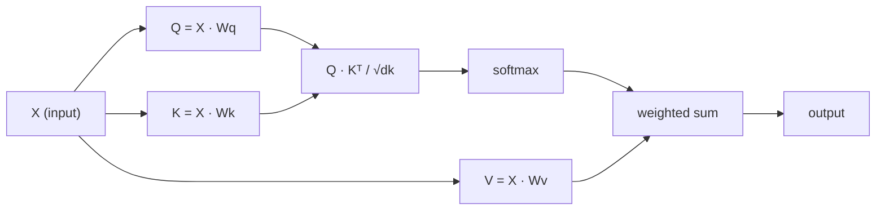

# Self-Attention, MHA, Positions & Variants

> Combined lessons (5 parts), merged verbatim — no content removed.

**Type:** Combined

---

## Part 1 (ch140): Why Transformers — The Problems with RNNs

> RNNs process tokens one at a time. Transformers process all tokens at once. That single architectural bet changed every scaling curve in deep learning after 2017.

**Type:** Learn
**Languages:** Python
**Prerequisites:** Phase 3 (Deep Learning Core), Phase 5 · 09 (Sequence-to-Sequence), Phase 5 · 10 (Attention Mechanism)
**Time:** ~45 minutes

## The Problem

Before 2017, every state-of-the-art sequence model on the planet — language, translation, speech — was a recurrent neural network. LSTMs and GRUs won ImageNet-equivalent translation benchmarks for half a decade. They were the only tool anyone had.

They had three fatal weaknesses. Sequential computation meant you could not parallelize along the time axis: token `t+1` needs the hidden state from token `t`. A 1,024-token sequence meant 1,024 serial steps on a GPU that can do 1,000,000 floating-point ops per cycle. Training wall-clock time scaled linearly with sequence length on hardware designed for parallelism.

Vanishing gradients meant information 50 tokens back was already compressed through 50 non-linearities. Gated recurrent units (LSTM, GRU) softened the crush but never eliminated it. Long-range dependencies routinely failed.

Fixed-width hidden states meant the encoder squeezed the entire source sequence into a single vector before the decoder saw anything. Doesn't matter if the source is 5 tokens or 500; the bottleneck is the same shape.

The 2017 paper "Attention Is All You Need" proposed something radical: drop recurrence entirely. Let every position attend to every other position in parallel. Train in one big matrix multiplication instead of 1,024 sequential ones.

The result dominates every modality by 2026: language (GPT-5, Claude 4, Llama 4), vision (ViT, DINOv2, SAM 3), audio (Whisper), biology (AlphaFold 3), robotics (RT-2). Same block, different inputs.

## The Concept

**Recurrence as a bottleneck.** An RNN computes `h_t = f(h_{t-1}, x_t)`. Each step depends on the previous. You cannot compute `h_5` before `h_4`. On modern GPUs with 10,000+ parallel cores, this wastes 99% of the silicon on a long sequence.

**Attention as a broadcast.** Self-attention computes `output_i = sum_j(a_ij * v_j)` for every pair `(i, j)` simultaneously. The whole N×N attention matrix fills in one batched matmul. No step depends on another. GPUs love it.

**The speedup is not a constant.** It is the difference between `O(N)` serial depth and `O(1)` serial depth. In practice, transformers train 5–10× faster per epoch on matched hardware at N=512, and the gap widens with sequence length until you hit the `O(N²)` memory wall of attention (which Flash Attention later fixed).

**What transformers cost.** Attention memory scales as `O(N²)`. For 2K context, fine. For 128K context, you need sliding windows, RoPE extrapolation, Flash Attention tiling, or linear attention variants. Recurrence was `O(N)` in both time and memory; transformers trade time for memory and then win the time back through parallelism.

**The inductive bias shift.** RNNs assume locality and recency. Transformers assume nothing — every pair is a candidate for attention. That is why transformers need more data to train well but scale further once they have it. Chinchilla (2022) formalized this: given enough tokens, a transformer always beats an RNN of equal parameter count.

## Build It

No neural network here — we simulate the core bottleneck numerically so you feel the gap on your laptop.

### Step 1: measure serial depth

We build two functions. One encodes a sequence as a chain of additions (serial, like an RNN). One encodes it as a parallel reduction (broadcast, like attention). Same math, different dependency graph.

```python
def rnn_style(xs, decay=0.9):
    h = 0.0
    for x in xs:
        h = decay * h + x
    return h

def attention_style(xs):
    return sum(xs) / len(xs)
```

We time both on sequences up to 100,000 elements. The RNN version is O(N) and a single CPU pipeline. Even in pure Python, the attention-style reduction beats it at length ≥ 1,000 because Python's `sum()` is implemented in C and iterates without interpreter overhead per step.

### Step 2: count theoretical operations

Both algorithms do N adds. The difference is *dependency depth*: how many operations must happen sequentially before the next can start. RNN depth = N. Attention depth = log(N) with a tree reduction, or 1 with a parallel scan. Depth, not op count, decides GPU time.

### Step 3: empirical scaling on long sequences

```python
def depth(n):
    rnn_depth = n
    attn_depth = max(1, math.ceil(math.log2(n)))
    return rnn_depth, attn_depth

def benchmark(n, reps=3):
    xs = [0.001 * (i % 17) for i in range(n)]
    best_rnn = min(time.perf_counter() for _ in range(reps))
    best_attn = min(time.perf_counter() for _ in range(reps))
    return best_rnn, best_attn
```

We print a timing table that makes the O(N) gap visible. Scale that to a 16,384-token transformer with a 12-layer LSTM equivalent and you see why training wall-clock was a blocker in 2016.

### Parallel prefix sum (Hillis-Steele scan)

```python
def parallel_scan(xs):
    out = list(xs)
    step = 1
    n = len(out)
    while step < n:
        new = list(out)
        for i in range(step, n):
            new[i] = out[i] + out[i - step]
        out = new
        step *= 2
    return out
```

## Use It

When to still pick an RNN in 2026:

| Situation | Pick |
|-----------|------|
| Streaming inference, one token at a time, constant memory | RNN or state-space model (Mamba, RWKV) |
| Very long sequences (>1M tokens) where attention memory explodes | Linear attention, Mamba 2, Hyena |
| Edge device with no matmul accelerator | Depthwise-separable RNN still wins on FLOPs/watt |
| Anything else (training, batched inference, context up to 128K) | Transformer |

State-space models (SSMs) like Mamba are essentially RNNs with structured parameterization that gives them the best of both: `O(N)` scan memory, parallel training via selective scan. They recover 90% of transformer quality with better long-context scaling.

## Ship It

See `outputs/skill-architecture-picker.md`. The skill picks an architecture for a new sequence problem given length, throughput, and training-budget constraints.

## Exercises

1. **Easy.** Take `rnn_style` and replace the scalar hidden state with a length-64 vector of hidden states. Re-measure. How much does the serial overhead grow with hidden-state dimension?
2. **Medium.** Implement a parallel prefix-sum (Hillis-Steele scan) in pure Python. Verify it produces the same numerical output as a serial scan on length 1024. Count the depth.
3. **Hard.** Port the attention-style reduction to PyTorch on GPU. Time both as you sweep sequence length from 64 to 65,536. Plot and explain the curve shape.

## Key Terms

| Term | What people say | What it actually means |
|------|-----------------|-----------------------|
| Recurrence | "RNNs are sequential" | Computation where step `t` depends on step `t-1`, forcing serial execution |
| Serial depth | "How deep the graph is" | Longest chain of dependent ops; bounds wall-clock even on infinite hardware |
| Attention | "Let tokens look at each other" | Weighted sum `sum_j a_ij v_j` where `a_ij` comes from a similarity score between positions |
| Context window | "How much the model sees" | Number of positions an attention layer can take as input |
| Inductive bias | "Assumptions baked into the architecture" | Prior about what the data looks like; CNNs assume translation invariance, RNNs assume recency |
| State-space model | "RNN with algebra behind it" | Recurrence parameterized for parallel training via structured state-space matrices |
| Quadratic bottleneck | "Why context costs so much" | Attention memory = `O(N²)` in sequence length |

## Further Reading

- [Vaswani et al. (2017). Attention Is All You Need](https://arxiv.org/abs/1706.03762)
- [Bahdanau, Cho, Bengio (2014). Neural MT by Jointly Learning to Align and Translate](https://arxiv.org/abs/1409.0473)
- [Hochreiter, Schmidhuber (1997). Long Short-Term Memory](https://www.bioinf.jku.at/publications/older/2604.pdf)
- [Gu, Dao (2023). Mamba: Linear-Time Sequence Modeling with Selective State Spaces](https://arxiv.org/abs/2312.00752)

---

[Reference](https://github.com/rohitg00/ai-engineering-from-scratch/tree/main/phases/07-transformers-deep-dive/01-why-transformers)

---

## Part 2 (ch141): Self-Attention from Scratch

> Attention is a lookup table where every word asks "who matters to me?" — and learns the answer.

**Type:** Build
**Languages:** Python
**Prerequisites:** Phase 3 (Deep Learning Core), Phase 5 Lesson 10 (Sequence-to-Sequence)
**Time:** ~90 minutes

## Learning Objectives

- Implement scaled dot-product self-attention from scratch using only NumPy, including query/key/value projections and the softmax-weighted sum
- Build a multi-head attention layer that splits heads, computes parallel attention, and concatenates results
- Trace how the attention matrix captures token relationships and explain why scaling by sqrt(d_k) prevents softmax saturation
- Apply causal masking to convert bidirectional attention into autoregressive (decoder-style) attention

## The Problem

RNNs process sequences one token at a time. By the time you reach token 50, the information from token 1 has been squeezed through 50 compression steps. Long-range dependencies get crushed into a fixed-size hidden state — a bottleneck that no amount of LSTM gating fully solves.

The 2014 Bahdanau attention paper showed the fix: let the decoder look back at every encoder position and decide which ones matter for the current step. But it was still bolted onto an RNN. The 2017 "Attention Is All You Need" paper asked a sharper question: what if attention is the *only* mechanism? No recurrence. No convolution. Just attention.

Self-attention lets every position in a sequence attend to every other position in a single parallel step. That is what makes transformers fast, scalable, and dominant.

## The Concept

### The Database Lookup Analogy

Think of attention as a soft database lookup:

```
Traditional database:
  Query: "capital of France"  -->  exact match  -->  "Paris"

Attention:
  Query: "capital of France"  -->  similarity to ALL keys  -->  weighted blend of ALL values
```

Every token generates three vectors:
- **Query (Q)**: "What am I looking for?"
- **Key (K)**: "What do I contain?"
- **Value (V)**: "What information do I provide if selected?"

The dot product between a query and all keys produces attention scores. High score means "this key matches my query." Those scores weight the values. The output is a weighted sum of values.

### Q, K, V Computation

Each token embedding gets projected through three learned weight matrices:

```
Input embeddings (sequence of n tokens, each d-dimensional):
  X = [x1, x2, x3, ..., xn]       shape: (n, d)

Three weight matrices:
  Wq  shape: (d, dk)
  Wk  shape: (d, dk)
  Wv  shape: (d, dv)

Projections:
  Q = X @ Wq    shape: (n, dk)      each token's query
  K = X @ Wk    shape: (n, dk)      each token's key
  V = X @ Wv    shape: (n, dv)      each token's value
```

### The Attention Matrix

Once you have Q, K, V for all tokens, attention scores form a matrix:

```
Scores = Q @ K^T    shape: (n, n)

              k1    k2    k3    k4    k5
        +-----+-----+-----+-----+-----+
   q1   | 2.1 | 0.3 | 0.1 | 0.8 | 0.2 |
        +-----+-----+-----+-----+-----+
   q2   | 0.4 | 1.9 | 0.7 | 0.1 | 0.3 |
        +-----+-----+-----+-----+-----+
   q3   | 0.2 | 0.6 | 2.3 | 0.5 | 0.1 |
        +-----+-----+-----+-----+-----+
   q4   | 0.9 | 0.1 | 0.4 | 1.7 | 0.6 |
        +-----+-----+-----+-----+-----+
   q5   | 0.1 | 0.3 | 0.2 | 0.5 | 2.0 |
        +-----+-----+-----+-----+-----+

Each row: one token's attention over the entire sequence
```

### Why Scale?

The dot products grow with dimension dk. If dk = 64, dot products can be in the range of tens, pushing softmax into regions where gradients vanish. The fix: divide by sqrt(dk).

```
Scaled scores = (Q @ K^T) / sqrt(dk)
```

### Softmax Turns Scores into Weights

```
Raw scores for q1:   [2.1, 0.3, 0.1, 0.8, 0.2]
                            |
                         softmax
                            |
Attention weights:   [0.52, 0.09, 0.07, 0.14, 0.08]   (sums to ~1.0)
```

### Weighted Sum of Values

```
output_i = sum( attention_weight[i][j] * v_j  for all j )

For token 1:
  output_1 = 0.52 * v1 + 0.09 * v2 + 0.07 * v3 + 0.14 * v4 + 0.08 * v5
```

### Full Pipeline



Formula in one line:

```
Attention(Q, K, V) = softmax( Q @ K^T / sqrt(dk) ) @ V
```

## Build It

### Step 1: Softmax from scratch

```python
import numpy as np

def softmax(x):
    shifted = x - np.max(x, axis=-1, keepdims=True)
    exp_x = np.exp(shifted)
    return exp_x / np.sum(exp_x, axis=-1, keepdims=True)
```

### Step 2: Scaled dot-product attention

```python
def scaled_dot_product_attention(Q, K, V):
    dk = Q.shape[-1]
    scores = Q @ K.T / np.sqrt(dk)
    weights = softmax(scores)
    output = weights @ V
    return output, weights
```

### Step 3: Self-attention class with learned projections

```python
class SelfAttention:
    def __init__(self, d_model, dk, dv, seed=42):
        rng = np.random.default_rng(seed)
        scale = np.sqrt(2.0 / (d_model + dk))
        self.Wq = rng.normal(0, scale, (d_model, dk))
        self.Wk = rng.normal(0, scale, (d_model, dk))
        scale_v = np.sqrt(2.0 / (d_model + dv))
        self.Wv = rng.normal(0, scale_v, (d_model, dv))
        self.dk = dk

    def forward(self, X):
        Q = X @ self.Wq
        K = X @ self.Wk
        V = X @ self.Wv
        output, weights = scaled_dot_product_attention(Q, K, V)
        return output, weights
```

### Step 4: Run it on a sentence

```python
sentence = ["The", "cat", "sat", "on", "the", "mat"]
n_tokens = len(sentence)
d_model = 8
dk = 4
dv = 4

rng = np.random.default_rng(42)
X = rng.normal(0, 1, (n_tokens, d_model))

attn = SelfAttention(d_model, dk, dv, seed=42)
output, weights = attn.forward(X)

print("Attention weights (each row: where that token looks):")
for i, token in enumerate(sentence):
    print(f"{token:>6}", end="")
    for j in range(n_tokens):
        print(f"{weights[i][j]:6.3f}", end="")
    print()
```

### Step 5: Visualize attention with ASCII heatmap

```python
def ascii_heatmap(weights, tokens, chars=" ░▒▓█"):
    n = len(tokens)
    print(f"\n{'':>6}", end="")
    for t in tokens:
        print(f"{t:>6}", end="")
    print()
    for i in range(n):
        print(f"{tokens[i]:>6}", end="")
        for j in range(n):
            level = int(weights[i][j] * (len(chars) - 1) / weights.max())
            level = min(level, len(chars) - 1)
            print(f"{'  ' + chars[level] + '   '}", end="")
        print()
```

## Use It

PyTorch's `nn.MultiheadAttention` does exactly what we built:

```python
import torch
import torch.nn as nn

d_model = 8
n_heads = 2
mha = nn.MultiheadAttention(embed_dim=d_model, num_heads=n_heads, batch_first=True)
X_torch = torch.randn(1, 6, d_model)
output, attn_weights = mha(X_torch, X_torch, X_torch)
```

The key difference: multi-head attention runs multiple attention functions in parallel, each with its own Q, K, V projections of size dk = d_model / n_heads.

## Ship It

This lesson produces `outputs/prompt-attention-explainer.md` — a prompt for explaining attention through the database lookup analogy.

## Exercises

1. Modify `scaled_dot_product_attention` to accept an optional mask matrix that sets certain positions to negative infinity before softmax (this is how causal/decoder masking works)
2. Implement multi-head attention from scratch: split Q, K, V into `n_heads` chunks, run attention on each, concatenate, and project through a final weight matrix Wo
3. Take two different sentences of the same length, feed them through the same SelfAttention instance, and compare their attention patterns

## Key Terms

| Term | What people say | What it actually means |
|------|----------------|----------------------|
| Query (Q) | "The question vector" | A learned projection representing what information this token is looking for |
| Key (K) | "The label vector" | A learned projection representing what information this token contains |
| Value (V) | "The content vector" | A learned projection carrying the actual information aggregated by attention scores |
| Scaled dot-product attention | "The attention formula" | softmax(QK^T / sqrt(dk)) @ V — scaling prevents softmax saturation |
| Self-attention | "The token looks at itself and others" | Attention where Q, K, V all come from the same sequence |
| Attention weights | "How much focus" | A probability distribution over positions, produced by softmax over scaled dot products |
| Multi-head attention | "Parallel attention" | Running multiple attention functions with different projections, then concatenating results |

## Further Reading

- [Attention Is All You Need (Vaswani et al., 2017)](https://arxiv.org/abs/1706.03762)
- [The Illustrated Transformer (Jay Alammar)](https://jalammar.github.io/illustrated-transformer/)
- [The Annotated Transformer (Harvard NLP)](https://nlp.seas.harvard.edu/annotated-transformer/)

---

[Reference](https://github.com/rohitg00/ai-engineering-from-scratch/tree/main/phases/07-transformers-deep-dive/02-self-attention-from-scratch)

---

## Part 3 (ch142): Multi-Head Attention

> One attention head learns one relation at a time. Eight heads learn eight. Heads are free. Take more of them.

**Type:** Build
**Languages:** Python
**Prerequisites:** Phase 7 · 02 (Self-Attention from Scratch)
**Time:** ~75 minutes

## The Problem

A single self-attention head computes one attention matrix. That matrix captures one kind of relationship — usually the one that minimizes loss on whatever the training signal is. If your data has subject-verb agreement, co-reference, long-range discourse, and syntactic chunking all tangled together, a single head smears them into a single softmax distribution and loses half the signal.

The fix from the 2017 Vaswani paper: run several attention functions in parallel, each with its own Q, K, V projections, and concatenate the outputs. Each head operates in a smaller subspace of dimension `d_model / n_heads`. Total parameters stay the same. Expressive power goes up.

Multi-head attention is the default every transformer in 2026 ships with. The only argument is about *how many* heads and whether keys and values share projections (Grouped-Query Attention, Multi-Query Attention, Multi-head Latent Attention).

## The Concept

**Split.** Take `X` of shape `(N, d_model)`. Project to Q, K, V each of shape `(N, d_model)`. Reshape to `(N, n_heads, d_head)` where `d_head = d_model / n_heads`. Transpose to `(n_heads, N, d_head)`.

**Attend in parallel.** Run scaled dot-product attention inside each head. Each head produces `(N, d_head)`. The heads operate on different subspaces of the embedding and never talk during the attention computation itself.

**Concatenate and project.** Stack heads back to `(N, d_model)` and multiply by a learned output matrix `W_o` of shape `(d_model, d_model)`. `W_o` is where heads get to mix.

**Why it works.** Each head can specialize without competing with the others for representational budget. Probing studies from 2019–2024 show distinct head roles: positional heads, heads that attend to the previous token, copy heads, named-entity heads, induction heads (which underlie in-context learning).

### The 2026 lineage of variations

| Variant | Q heads | K/V heads | Used by |
|---------|---------|-----------|---------|
| Multi-head (MHA) | N | N | GPT-2, BERT, T5 |
| Multi-query (MQA) | N | 1 | PaLM, Falcon |
| Grouped-query (GQA) | N | G (e.g. N/8) | Llama 2 70B, Llama 3+, Qwen 2+, Mistral |
| Multi-head latent (MLA) | N | compressed to low-rank | DeepSeek-V2, V3 |

GQA is the modern default because it cuts KV-cache memory by a factor of `N/G` while keeping nearly full quality. MLA goes further by compressing K/V into a latent space, then projecting back at compute time.

## Build It

### Step 1: split heads

```python
def split_heads(X, n_heads):
    n, d = X.shape
    d_head = d // n_heads
    return X.reshape(n, n_heads, d_head).transpose(1, 0, 2)  # (heads, n, d_head)

def combine_heads(H):
    h, n, d_head = H.shape
    return H.transpose(1, 0, 2).reshape(n, h * d_head)
```

### Step 2: run scaled-dot-product attention per head

```python
def mha_forward(X, W_q, W_k, W_v, W_o, n_heads):
    Q = X @ W_q
    K = X @ W_k
    V = X @ W_v
    Qh = split_heads(Q, n_heads)
    Kh = split_heads(K, n_heads)
    Vh = split_heads(V, n_heads)
    scores = Qh @ Kh.transpose(0, 2, 1) / np.sqrt(Qh.shape[-1])
    weights = softmax(scores, axis=-1)
    out = weights @ Vh
    concat = combine_heads(out)
    return concat @ W_o, weights
```

On real hardware `Qh @ Kh.transpose(...)` is one `bmm`. The GPU sees a single batched matmul of shape `(heads, N, d_head) × (heads, d_head, N) -> (heads, N, N)`. Adding heads is free.

### Step 3: Grouped-Query Attention variant

```python
def gqa_project(X, W, n_kv_heads, n_heads):
    kv = split_heads(X @ W, n_kv_heads)
    repeat = n_heads // n_kv_heads
    return np.repeat(kv, repeat, axis=0)
```

At inference this saves memory because only `n_kv_heads` copies live in the KV cache. Llama 3 70B uses 64 query heads with 8 KV heads — an 8× cache shrink.

### Step 4: probe what each head learned

Run MHA on a short sentence with 4 heads. For each head, print the attention matrix. You'll see different heads pick out different structure even with random initialization.

## Use It

In PyTorch:

```python
import torch.nn as nn
mha = nn.MultiheadAttention(embed_dim=512, num_heads=8, batch_first=True)
```

GQA as of PyTorch 2.5+:

```python
from torch.nn.functional import scaled_dot_product_attention
# scaled_dot_product_attention auto-dispatches Flash Attention on CUDA.
out = scaled_dot_product_attention(q, k, v, is_causal=True, enable_gqa=True)
```

How many heads? Rules of thumb from production models in 2026:

| Model size | d_model | n_heads | d_head |
|------------|---------|---------|--------|
| Small (~125M) | 768 | 12 | 64 |
| Base (~350M) | 1024 | 16 | 64 |
| Large (~1B) | 2048 | 16 | 128 |
| Frontier (~70B) | 8192 | 64 | 128 |

## Ship It

See `outputs/skill-mha-configurator.md`. The skill recommends head count, kv-head count, and projection strategy for a new transformer.

## Exercises

1. **Easy.** Take the MHA and change `n_heads` from 1 to 16 with `d_model=64` fixed. Plot the loss of a tiny one-layer model on a synthetic copy task.
2. **Medium.** Implement MQA (one KV head shared across all query heads). Measure how much parameter count drops vs full MHA.
3. **Hard.** Implement Multi-head Latent Attention: compress K,V to a rank-`r` latent, store in KV cache, decompress at attention time.

## Key Terms

| Term | What people say | What it actually means |
|------|-----------------|-----------------------|
| Head | "A single attention circuit" | One Q/K/V projection of dimension `d_head = d_model / n_heads` |
| d_head | "Head dimension" | Per-head hidden width; almost always 64 or 128 |
| W_o | "Output projection" | `(d_model, d_model)` matrix applied after concatenating heads |
| MQA | "One KV head" | Multi-Query Attention: single shared K/V projection |
| GQA | "The default since Llama 2" | Grouped-Query Attention with `n_kv_heads < n_heads` |
| MLA | "DeepSeek's trick" | Multi-head Latent Attention: K,V compressed to low-rank latent |
| Induction head | "The circuit behind in-context learning" | A pair of heads that detect previous occurrences and copy what followed |

## Further Reading

- [Vaswani et al. (2017). Attention Is All You Need §3.2.2](https://arxiv.org/abs/1706.03762)
- [Shazeer (2019). Fast Transformer Decoding: One Write-Head is All You Need](https://arxiv.org/abs/1911.02150)
- [Ainslie et al. (2023). GQA: Training Generalized Multi-Query Transformer Models](https://arxiv.org/abs/2305.13245)
- [DeepSeek-AI (2024). DeepSeek-V2 Technical Report](https://arxiv.org/abs/2405.04434)
- [Olsson et al. (2022). In-context Learning and Induction Heads](https://transformer-circuits.pub/2022/in-context-learning-and-induction-heads/index.html)

---

[Reference](https://github.com/rohitg00/ai-engineering-from-scratch/tree/main/phases/07-transformers-deep-dive/03-multi-head-attention)

---

## Part 4 (ch143): Positional Encoding — Sinusoidal, RoPE, ALiBi

> Attention is permutation-invariant. "The cat sat on the mat" and "mat the on sat cat the" produce the same output without positional signal. Three algorithms fix it — each with a different bet on what "position" means.

**Type:** Build
**Languages:** Python
**Prerequisites:** Phase 7 · 02 (Self-Attention), Phase 7 · 03 (Multi-Head Attention)
**Time:** ~45 minutes

## The Problem

Scaled dot-product attention is order-blind. The attention matrix `softmax(Q K^T / √d) V` is computed from pairwise similarities. Shuffle the rows of `X`, get the rows of the output shuffled the same way. Nothing inside attention cares about position.

The fix is to inject position into the embeddings somehow. Three eras of answers:

1. **Absolute sinusoidal** (Vaswani 2017). Add `sin/cos` of position to the embedding. Simple, learnable-free, extrapolates poorly beyond trained lengths.
2. **RoPE — Rotary Position Embeddings** (Su 2021). Rotate Q and K vectors by an angle proportional to position. Encodes *relative* position directly in the dot product. Dominant in 2026.
3. **ALiBi — Attention with Linear Biases** (Press 2022). Skip embeddings entirely; add a per-head linear penalty to attention scores based on distance. Excellent length extrapolation.

As of 2026, essentially every frontier open model uses RoPE: Llama 2/3/4, Qwen 2/3, Mistral, Mixtral, DeepSeek-V3, Kimi.

## The Concept

### Absolute sinusoidal

Pre-compute a fixed matrix `PE` of shape `(max_len, d_model)`:

```
PE[pos, 2i]   = sin(pos / 10000^(2i / d_model))
PE[pos, 2i+1] = cos(pos / 10000^(2i / d_model))
```

Then `X' = X + PE[:N]` before attention. Each dimension is a sinusoid at a different frequency. Fails beyond `max_len`: nothing told the model what happens at position 2048 when it only saw positions 0–2047.

### RoPE

Rotate the Q and K vectors (not embeddings). For a pair of dimensions `(2i, 2i+1)`:

```
[q'_2i    ]   [ cos(pos·θ_i)  -sin(pos·θ_i) ] [q_2i   ]
[q'_2i+1  ] = [ sin(pos·θ_i)   cos(pos·θ_i) ] [q_2i+1 ]

θ_i = base^(-2i / d_head),  base = 10000 by default
```

Apply the same rotation to keys with position `pos_k`. The dot product `q'_m · k'_n` becomes a function of `(m - n)` alone. That is: **the attention score depends only on the relative distance**, even though the rotation was keyed off absolute positions.

Extending RoPE: `base` can be scaled (NTK-aware, YaRN, LongRoPE) to extrapolate to longer contexts without retraining. Llama 3 extended from 8K to 128K context this way.

### ALiBi

Skip the embedding trick. Bias the attention scores directly:

```
attn_score[i, j] = (q_i · k_j) / √d  -  m_h · |i - j|
```

Where `m_h` is a head-specific slope (e.g. `1 / 2^(8·h/H)`). Closer tokens get boosted; far tokens get penalized. No training-time cost.

### What to pick in 2026

| Variant | Extrapolation | Training cost | Used by |
|---------|---------------|---------------|---------|
| Absolute sinusoidal | poor | free | original transformer, early BERT |
| Learned absolute | none | tiny | GPT-2, GPT-3 |
| RoPE | good with scaling | free | Llama 2/3/4, Qwen 2/3, Mistral, DeepSeek-V3 |
| RoPE + YaRN | excellent | fine-tune stage | Qwen2-1M, Llama 3.1 128K |
| ALiBi | excellent | free | BLOOM, MPT, Baichuan |

## Build It

### Step 1: sinusoidal encoding

```python
def sinusoidal_pe(n, d, base=10000.0):
    pe = [[0.0] * d for _ in range(n)]
    for pos in range(n):
        for i in range(d // 2):
            theta = pos / (base ** (2 * i / d))
            pe[pos][2 * i] = math.sin(theta)
            pe[pos][2 * i + 1] = math.cos(theta)
    return pe
```

Add this to the embedding matrix before the first attention layer.

### Step 2: RoPE applied to Q, K

```python
def apply_rope(x, pos, base=10000.0):
    d = len(x)
    out = list(x)
    for i in range(d // 2):
        theta = pos / (base ** (2 * i / d))
        c, s = math.cos(theta), math.sin(theta)
        a, b = x[2 * i], x[2 * i + 1]
        out[2 * i]     = a * c - b * s
        out[2 * i + 1] = a * s + b * c
    return out
```

Crucial: apply the same function to Q at position `m` and K at position `n`. Their dot product picks up a `cos((m-n)·θ_i)` factor on every coordinate pair.

### Step 3: ALiBi slopes and bias

```python
def alibi_slopes(n_heads):
    return [2 ** (-8 * (h + 1) / n_heads) for h in range(n_heads)]

def alibi_bias(n_heads, seq_len, causal=True):
    slopes = alibi_slopes(n_heads)
    out = []
    for m in slopes:
        head_bias = []
        for i in range(seq_len):
            row = []
            for j in range(seq_len):
                if causal and j > i:
                    row.append(float("-inf"))
                else:
                    row.append(-m * abs(i - j))
            head_bias.append(row)
        out.append(head_bias)
    return out
```

Add `bias[h]` to the attention score matrix of head `h`, then softmax.

### Step 4: verify relative-distance property of RoPE

```python
def demo_rope_relative():
    rng = random.Random(0)
    d = 16
    q = [rng.gauss(0, 1) for _ in range(d)]
    k = [rng.gauss(0, 1) for _ in range(d)]
    pairs = [(3, 5), (7, 9), (100, 102), (1024, 1026)]
    for pq, pk in pairs:
        q_rot = apply_rope(q, pq)
        k_rot = apply_rope(k, pk)
        d_prod = sum(qi * ki for qi, ki in zip(q_rot, k_rot))
        print(f"gap={pk - pq:>4}  score={d_prod:>18.6f}")
```

Pick two random vectors `a, b`. Rotate by `(pos_a, pos_b)`. Then by `(pos_a + k, pos_b + k)`. Both dot products must match.

## Use It

PyTorch 2.5+ ships RoPE utilities. Most production code uses `flash_attn` or `xformers`:

```python
from transformers import AutoModel
model = AutoModel.from_pretrained("meta-llama/Llama-3.2-3B")
# model.config.rope_scaling → {"type": "yarn", "factor": 32.0, ...}
```

**Long-context tricks in 2026:**

- **NTK-aware interpolation.** Rescale `base` to `base * (scale_factor)^(d/(d-2))` when extending from 4K to 16K+.
- **YaRN.** Smarter interpolation that preserves attention entropy on long contexts.
- **LongRoPE.** Evolutionary search to pick per-dimension scale factors.
- **Position interpolation + fine-tuning.** Shrink positions by the extension factor and fine-tune.

## Ship It

See `outputs/skill-positional-encoding-picker.md`. The skill picks an encoding strategy for a new model.

## Exercises

1. **Easy.** Plot the sinusoidal PE matrix as a heatmap for `max_len=512, d=128`. Confirm the "stripes get wider as dimension index grows" pattern.
2. **Medium.** Implement NTK-aware RoPE scaling. Train a tiny LM on sequences of length 256, then test on length 1024 with and without scaling.
3. **Hard.** Implement ALiBi and RoPE in the same attention module. Compare degradation on a copy task when extrapolating from 512 to 2048.

## Key Terms

| Term | What people say | What it actually means |
|------|-----------------|-----------------------|
| Positional encoding | "Tells attention about order" | Any signal added to embeddings or attention that encodes position |
| Sinusoidal | "The original one" | sin/cos at geometric frequencies added to embeddings |
| RoPE | "Rotary embeddings" | Rotate Q, K by position-dependent angle; dot product encodes relative distance |
| ALiBi | "Linear bias trick" | Add `-m·\|i-j\|` to attention scores; no embedding needed |
| base | "RoPE's knob" | The frequency scaler in RoPE; increase to extend context |
| NTK-aware | "A RoPE scaling trick" | Rescale `base` so high-frequency dims aren't squeezed |
| YaRN | "The fancy one" | Per-dimension interpolation+extrapolation preserving attention entropy |

## Further Reading

- [Vaswani et al. (2017). Attention Is All You Need §3.5](https://arxiv.org/abs/1706.03762)
- [Su et al. (2021). RoFormer: Enhanced Transformer with Rotary Position Embedding](https://arxiv.org/abs/2104.09864)
- [Press, Smith, Lewis (2021). Train Short, Test Long: Attention with Linear Biases](https://arxiv.org/abs/2108.12409)
- [Peng et al. (2023). YaRN: Efficient Context Window Extension of LLMs](https://arxiv.org/abs/2309.00071)
- [Ding et al. (2024). LongRoPE: Extending LLM Context Window Beyond 2 Million Tokens](https://arxiv.org/abs/2402.13753)

---

[Reference](https://github.com/rohitg00/ai-engineering-from-scratch/tree/main/phases/07-transformers-deep-dive/04-positional-encoding)

---

## Part 5 (ch154): Attention Variants — Sliding Window, Sparse, Differential

> Full attention is a circle. Every token sees every token, and memory pays the price. Four variants bend the shape of the circle and recover half the cost.

**Type:** Build
**Languages:** Python
**Prerequisites:** Phase 7 · 02 (Self-Attention), Phase 7 · 03 (Multi-Head), Phase 7 · 12 (KV Cache / Flash Attention)
**Time:** ~60 minutes

## The Problem

Full attention costs `O(N²)` memory and `O(N²)` compute in sequence length. For a 128K-context Llama 3 70B that is 16 billion attention entries per layer, times 80 layers. Flash Attention hides the `O(N²)` activation memory but does not change the arithmetic cost.

Three classes of variants change the topology of the attention matrix itself:

1. **Sliding window attention (SWA).** Each token attends to a fixed window of neighbors, not the full prefix. Memory and compute drop to `O(N · W)`.
2. **Sparse / block attention.** Only selected pairs `(i, j)` get scored; the rest are forced to zero weight.
3. **Differential attention.** Compute two attention maps with separate Q/K projections, subtract one from the other. Kills the "attention sink."

## The Concept

### Sliding Window Attention (SWA)

Each query at position `i` attends only to positions in `[i - W, i]` (causal SWA). Tokens outside the window get `-inf`.

```
full causal:           sliding window (W=4):
positions 0-7          positions 0-7, W=4
    0 1 2 3 4 5 6 7        0 1 2 3 4 5 6 7
0 | x                0 |  x
1 | x x              1 |  x x
2 | x x x            2 |  x x x
3 | x x x x          3 |  x x x x
4 | x x x x x        4 |    x x x x
5 | x x x x x x      5 |      x x x x
6 | x x x x x x x    6 |        x x x x
7 | x x x x x x x x  7 |          x x x x
```

**KV cache shrinks with SWA.** Only the last `W` tokens of K and V need to be kept per layer.

### Sparse / Block Attention

Three canonical shapes:

- **Local + strided (OpenAI sparse transformer).** Attend to the last `W` tokens plus every `stride`-th token before.
- **Longformer / BigBird.** Local window + global tokens + random-sparse links.
- **Native Sparse Attention (DeepSeek, 2025).** Learn which blocks matter; skip zero blocks at kernel level.

### Differential Attention (DIFF Transformer, 2024)

Regular attention has an "attention sink" problem: softmax forces every row to sum to 1, so uninformative queries dump weight on the first token. Differential attention computes **two** attention maps and subtracts:

```
A1 = softmax(Q1 K1^T / √d)
A2 = softmax(Q2 K2^T / √d)
DiffAttn = (A1 - λ · A2) V
```

### Variant Comparison

| Variant | Compute | KV cache | Quality vs full | Production use |
|---------|---------|----------|-----------------|----------------|
| Full attention | O(N²) | O(N) per layer | baseline | default layer |
| SWA (window 1024) | O(N·W) | O(W) per layer | -0.1 ppl | Gemma 2/3, Phi-3-Long |
| Local + strided | O(N·√N) | mixed | similar to SWA | OpenAI sparse transformer |
| BigBird | O(N) approx | mixed | matches full at 2× context | early long-context BERT |
| Native Sparse | O(N · active) | O(N) | within 0.05 ppl | DeepSeek-V3.2 |
| Differential | O(2·N²) | O(2N) | -5 to -10% ppl | DIFF Transformer |

## Build It

### Step 1: full causal mask (baseline)

```python
NEG_INF = float("-inf")

def causal_mask(n):
    M = [[NEG_INF] * n for _ in range(n)]
    for i in range(n):
        for j in range(i + 1):
            M[i][j] = 0.0
    return M
```

### Step 2: sliding window causal mask

```python
def swa_mask(n, window):
    M = [[NEG_INF] * n for _ in range(n)]
    for i in range(n):
        lo = max(0, i - window + 1)
        for j in range(lo, i + 1):
            M[i][j] = 0.0
    return M
```

For `window >= n`, you recover full causal attention.

### Step 3: local + strided sparse mask

```python
def strided_mask(n, window, stride):
    M = [[NEG_INF] * n for _ in range(n)]
    for i in range(n):
        lo = max(0, i - window + 1)
        for j in range(lo, i + 1):
            M[i][j] = 0.0
        for j in range(0, i + 1, stride):
            M[i][j] = 0.0
    return M
```

### Step 4: differential attention

```python
def diff_attention_row(q1, q2, K1, K2, V, mask_row, lam):
    _, w1 = attention_row(q1, K1, V, mask_row)
    _, w2 = attention_row(q2, K2, V, mask_row)
    diff = [a - lam * b for a, b in zip(w1, w2)]
    d_v = len(V[0])
    out = [0.0] * d_v
    for w, v in zip(diff, V):
        for j in range(d_v):
            out[j] += w * v[j]
    return out, diff
```

Two attention passes, subtract with a learned mixing coefficient.

### Step 5: KV cache sizes

```python
def kv_cache_bytes(n_layers, n_kv_heads, d_head, seq_len, dtype_bytes=2):
    return 2 * n_layers * n_kv_heads * d_head * seq_len * dtype_bytes
```

At 128K context, Llama-3-70B-ish (80 layers, 8 KV heads, d_head=128):

- Full: ~10.5 GB
- SWA window=1024: ~82 MB (128× shrink)
- Gemma-3 5:1 mix: ~1.9 GB (5.6× shrink)
- Differential: ~21 GB (2× cost)

## Use It

```python
from transformers import AutoModelForCausalLM
model = AutoModelForCausalLM.from_pretrained("google/gemma-3-27b-it")
# print(model.config.sliding_window, model.config.layer_types)
```

FlexAttention in PyTorch 2.5+:

```python
from torch.nn.attention.flex_attention import flex_attention, create_block_mask

def swa_pattern(b, h, q_idx, kv_idx):
    return (q_idx - kv_idx < 1024) & (q_idx >= kv_idx)

mask = create_block_mask(swa_pattern, B=batch, H=heads, Q_LEN=n, KV_LEN=n)
out = flex_attention(q, k, v, block_mask=mask)
```

**When to pick each:**
- **Pure full attention** — every layer up to ~16K context, retrieval-critical
- **SWA + global mix** — long context (>32K), memory-bound. 2026 default above 32K
- **Sparse block attention** — custom kernel, specialized workloads
- **Differential attention** — attention-sink contamination hurts (long-context RAG)

## Ship It

See `outputs/skill-attention-variant-picker.md`. The skill picks an attention topology for a new model.

## Exercises

1. **Easy.** Verify SWA at `window=4` zeroes everything outside the last 4 tokens. Verify `window=n` reproduces full causal attention.
2. **Medium.** Implement causal SWA with `window=1024` on the capstone model. Compare val loss and peak memory vs full attention.
3. **Hard.** Implement a Gemma-3-style 5:1 layer mix in the capstone model. Compare loss, memory, and generation quality.
4. **Hard.** Implement differential attention with a learned `λ` per head. Train on a synthetic retrieval task.

## Key Terms

| Term | What people say | What it actually means |
|------|-----------------|-----------------------|
| Sliding window attention (SWA) | "Local attention" | Each query attends to its last `W` tokens |
| Effective receptive field | "How far back the model sees" | In an L-layer SWA stack, up to `L × W` tokens |
| Longformer / BigBird | "Local + global + random" | Sparse patterns with global tokens |
| Native Sparse Attention | "DeepSeek's kernel trick" | Learn block-level sparsity; skip zero blocks |
| Differential attention | "Two maps, one subtracts" | DIFF Transformer: subtract second attention map to cancel sinks |
| Attention sink | "Weight bleeds to token 0" | Softmax normalization forces weight on position 0 |
| FlexAttention | "Mask-as-Python" | PyTorch 2.5+ API that compiles mask functions into kernels |
| Layer type mix | "5:1 SWA-to-global" | Interleave sparse and full attention layers |

## Further Reading

- [Beltagy, Peters, Cohan (2020). Longformer: The Long-Document Transformer](https://arxiv.org/abs/2004.05150)
- [Zaheer et al. (2020). Big Bird: Transformers for Longer Sequences](https://arxiv.org/abs/2007.14062)
- [Child et al. (2019). Generating Long Sequences with Sparse Transformers](https://arxiv.org/abs/1904.10509)
- [Gemma Team (2025). Gemma 3 technical report](https://arxiv.org/abs/2503.19786)
- [Ye et al. (2024). Differential Transformer](https://arxiv.org/abs/2410.05258)
- [Yuan et al. (2025). Native Sparse Attention](https://arxiv.org/abs/2502.11089)

---

[Reference](https://github.com/rohitg00/ai-engineering-from-scratch/tree/main/phases/07-transformers-deep-dive/15-attention-variants)
