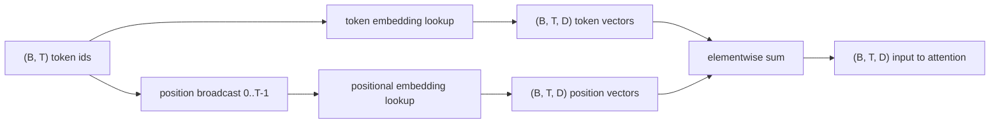
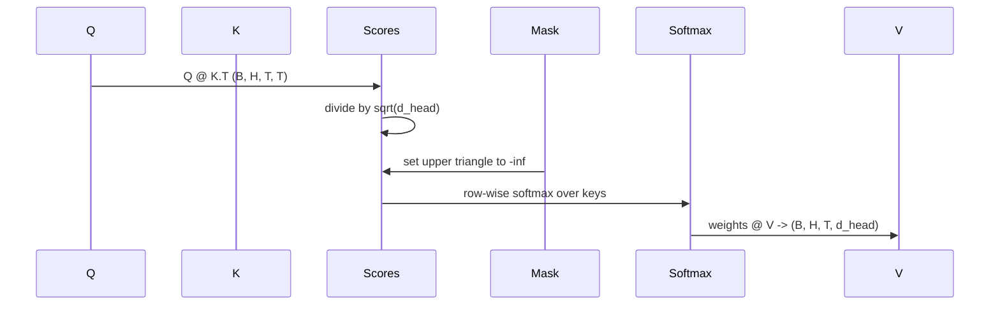
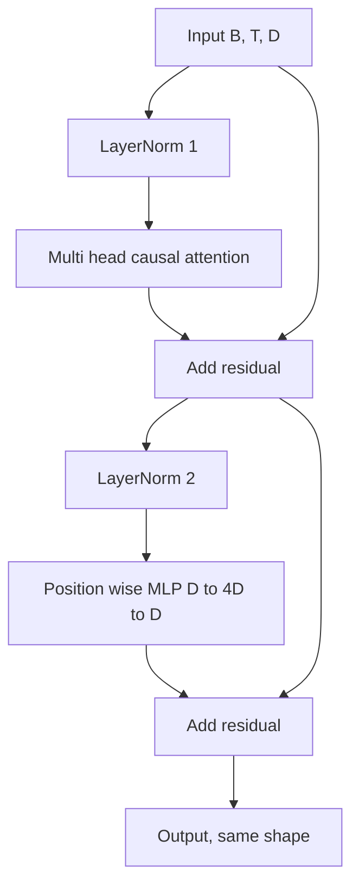
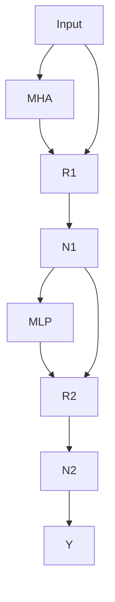
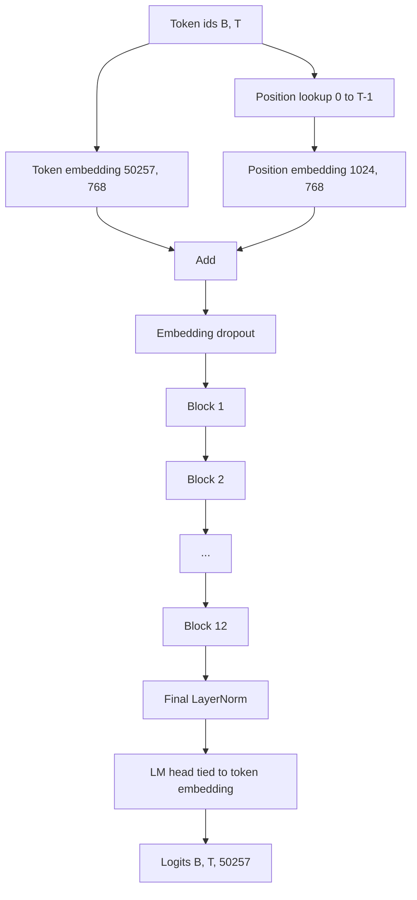
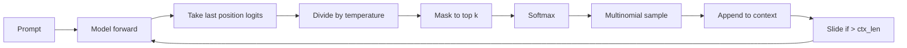

# BERT, GPT, T5 & Building GPT from Scratch

> Combined lessons (8 parts), merged verbatim — no content removed.

**Type:** Combined

---

## Part 1 (ch144): The Full Transformer — Encoder + Decoder

> Attention is the star. Everything else — residuals, normalization, feed-forward, cross-attention — is the scaffolding that lets you stack it deep.

**Type:** Build
**Languages:** Python
**Prerequisites:** Phase 7 · 02 (Self-Attention), Phase 7 · 03 (Multi-Head Attention), Phase 7 · 04 (Positional Encoding)
**Time:** ~75 minutes

## The Problem

A single attention layer is a feature extractor, not a model. One matmul per layer is not enough capacity for language. You need depth — and depth breaks without the right plumbing.

The 2017 Vaswani paper packaged six design decisions that turned one attention layer into a stackable block. Every transformer since — encoder-only (BERT), decoder-only (GPT), encoder-decoder (T5) — inherits the same skeleton. In 2026 the blocks have been refined (RMSNorm, SwiGLU, pre-norm, RoPE) but the skeleton is identical.

## The Concept

### The six pieces

1. **Embedding + positional signal.** Tokens → vectors. Position injected via RoPE (modern) or sinusoidal (classic).
2. **Self-attention.** Every position attends to every other. Masked in decoders.
3. **Feed-forward network (FFN).** Position-wise two-layer MLP: `W_2 · activation(W_1 · x)`. Expansion ratio 4× by default.
4. **Residual connection.** `x + sublayer(x)`. Without this, gradients vanish past ~6 layers.
5. **Layer normalization.** `LayerNorm` or `RMSNorm` (modern). Stabilizes the residual stream.
6. **Cross-attention (decoder only).** Queries come from the decoder, keys and values from the encoder output.

### Encoder block (used by BERT, T5 encoder)

```
x → LN → MHA(self) → + → LN → FFN → + → out
                     ^              ^
                     |              |
                     └── residual ──┘
```

Encoder is bidirectional. No masking. All positions see all positions.

### Decoder block (used by GPT, T5 decoder)

```
x → LN → MHA(masked self) → + → LN → MHA(cross to encoder) → + → LN → FFN → + → out
```

Decoder has three sublayers per block. The middle one — cross-attention — is the only place information flows from encoder to decoder.

### Pre-norm vs post-norm

Original paper: `x + sublayer(LN(x))` vs `LN(x + sublayer(x))`. Post-norm lost favor around 2019 — it is harder to train deeply without careful warmup. Pre-norm (`LN` *before* sublayer) is the 2026 default.

### The 2026 modernized block

| Component | 2017 | 2026 |
|-----------|------|------|
| Normalization | LayerNorm | RMSNorm |
| FFN activation | ReLU | SwiGLU |
| FFN expansion | 4× | 2.6× (SwiGLU uses three matrices) |
| Position | Sinusoidal absolute | RoPE |
| Attention | Full MHA | GQA (or MLA) |
| Bias terms | Yes | No |

RMSNorm drops the mean-centering of LayerNorm. SwiGLU (`Swish(W1 x) ⊙ W3 x`) consistently outperforms ReLU/GELU FFN.

### Parameter count

For one block with `d_model = d` and FFN expansion `r`:

- MHA: `4 · d²` (Q, K, V, O projections)
- FFN (SwiGLU): `3 · d · (r · d)` ≈ `3rd²`
- Norms: negligible

At `d = 4096, r = 2.6, layers = 32` (roughly Llama 3 8B): `32 · (4·4096² + 3·2.6·4096²) ≈ 32 · (16 + 32) M = ~1.5B parameters per layer × 32 ≈ 7B`.

## Build It

### Step 1: the building blocks

Using a tiny `Matrix` class:

- `layer_norm(x, eps=1e-5)` — subtract mean, divide by std
- `rms_norm(x, eps=1e-6)` — divide by RMS, no mean subtraction
- `gelu(x)` and `silu(x) * W3 x` (SwiGLU)
- `ffn_swiglu(x, W1, W2, W3)` and `ffn_relu(x, W1, W2)`

```python
def silu(x):
    return x / (1.0 + math.exp(-x))

def ffn_swiglu(X, W1, W2, W3):
    h1 = matmul(X, W1)
    h3 = matmul(X, W3)
    gated = Matrix(h1.rows, h1.cols)
    for i in range(len(h1.data)):
        gated.data[i] = silu(h1.data[i]) * h3.data[i]
    return matmul(gated, W2)
```

### Step 2: wire a 2-layer encoder and decoder

```python
def encode(tokens, params):
    x = embed(tokens, params.emb) + sinusoidal(len(tokens), params.d)
    for block in params.encoder_blocks:
        x = encoder_block(x, block)
    return x

def decode(target_tokens, encoder_out, params):
    x = embed(target_tokens, params.emb) + sinusoidal(len(target_tokens), params.d)
    for block in params.decoder_blocks:
        x = decoder_block(x, encoder_out, block)
    return x
```

### Step 3: encoder_block and decoder_block

```python
def encoder_block(x, p):
    h = rms_norm(x)
    a = multi_head_attention(h, p.Wq, p.Wk, p.Wv, p.Wo, p.n_heads)
    x = add(x, a)
    h = rms_norm(x)
    f = ffn_swiglu(h, p.W1, p.W2, p.W3)
    return add(x, f)

def decoder_block(x, enc_out, p):
    h = rms_norm(x)
    a = multi_head_attention(h, p.Wq, p.Wk, p.Wv, p.Wo, p.n_heads, causal=True)
    x = add(x, a)
    h = rms_norm(x)
    a = multi_head_attention(h, p.Wq_x, p.Wk_x, p.Wv_x, p.Wo_x, p.n_heads, kv_source=enc_out)
    x = add(x, a)
    h = rms_norm(x)
    f = ffn_swiglu(h, p.W1, p.W2, p.W3)
    return add(x, f)
```

### Step 4: swap in RMSNorm + SwiGLU

Replace LayerNorm and ReLU-FFN with RMSNorm and SwiGLU. Confirm shapes still match.

## Use It

**Encoder vs decoder vs encoder-decoder — when to pick:**

| Need | Pick | Example |
|------|------|---------|
| Classification, embeddings, QA over text | Encoder-only | BERT, DeBERTa, ModernBERT |
| Text generation, chat, code, reasoning | Decoder-only | GPT, Llama, Claude, Qwen |
| Structured input → structured output | Encoder-decoder | T5, BART, Whisper |

Decoder-only won language because it scales cleanest. Encoder-decoder is still best when the input has a clear "source sequence" identity.

## Ship It

See `outputs/skill-transformer-block-reviewer.md`. The skill reviews a transformer block implementation against 2026 defaults.

## Exercises

1. **Easy.** Count the parameters in your encoder_block at `d_model=512, n_heads=8, ffn_expansion=4, swiglu=True`.
2. **Medium.** Switch from post-norm to pre-norm. Initialize both and measure activation norm after 12 stacked layers.
3. **Hard.** Implement a 4-layer encoder-decoder on a toy copy task. Swap in RMSNorm + SwiGLU + RoPE — does loss drop?

## Key Terms

| Term | What people say | What it actually means |
|------|-----------------|-----------------------|
| Block | "One transformer layer" | Stack of norm + attention + norm + FFN, wrapped in residuals |
| Residual | "Skip connection" | `x + f(x)` output; enables gradient flow through deep stacks |
| Pre-norm | "Normalize before, not after" | Modern: `x + sublayer(LN(x))` |
| RMSNorm | "LayerNorm without the mean" | Divide by RMS; one less op, same stability |
| SwiGLU | "The FFN everyone switched to" | `Swish(W1 x) ⊙ W3 x → W2` |
| Cross-attention | "How the decoder sees the encoder" | MHA with Q from decoder, K/V from encoder outputs |
| FFN expansion | "How wide the middle MLP is" | Ratio of hidden-size to d_model |
| Bias-free | "Drop the +b terms" | Modern stacks omit biases in linear layers |

## Further Reading

- [Vaswani et al. (2017). Attention Is All You Need](https://arxiv.org/abs/1706.03762)
- [Xiong et al. (2020). On Layer Normalization in the Transformer Architecture](https://arxiv.org/abs/2002.04745)
- [Zhang, Sennrich (2019). Root Mean Square Layer Normalization](https://arxiv.org/abs/1910.07467)
- [Shazeer (2020). GLU Variants Improve Transformer](https://arxiv.org/abs/2002.05202)

---

[Reference](https://github.com/rohitg00/ai-engineering-from-scratch/tree/main/phases/07-transformers-deep-dive/05-full-transformer)

---

## Part 2 (ch145): BERT — Masked Language Modeling

> GPT predicts the next word. BERT predicts a missing word. One sentence of difference — and half a decade of everything embedding-shaped.

**Type:** Build
**Languages:** Python
**Prerequisites:** Phase 7 · 05 (Full Transformer), Phase 5 · 02 (Text Representation)
**Time:** ~45 minutes

## The Problem

In 2018 every NLP task — sentiment, NER, QA, entailment — trained its own model from scratch on its own labeled data. There was no pre-trained "understand English" checkpoint you could fine-tune. ELMo (2018) showed you could pre-train contextual embeddings with a bidirectional LSTM; it helped but did not generalize.

BERT (Devlin et al. 2018) asked: what if we took a transformer encoder, trained it on every sentence on the internet, and forced it to predict missing words from context on both sides? Then you fine-tune one head on your downstream task. Parameter efficiency was a revelation.

Within 18 months BERT and its variants (RoBERTa, ALBERT, ELECTRA) dominated every NLP leaderboard. In 2026 encoder-only models are still the right tool for classification, retrieval, and structured extraction — they run 5–10× faster per token than decoders. ModernBERT (Dec 2024) pushed the architecture to 8K context with Flash Attention + RoPE + GeGLU.

## The Concept

### The training signal

Take a sentence: `the quick brown fox jumps over the lazy dog`.

Mask 15% of tokens randomly:

```
input:  the [MASK] brown fox jumps [MASK] the lazy dog
target: the  quick brown fox jumps  over  the lazy dog
```

Train the model to predict the original tokens at masked positions. Because the encoder is bidirectional, predicting `[MASK]` at position 1 can use `brown fox jumps` at positions 2+. That is the thing GPT cannot do.

### The BERT mask rules

Of the 15% of tokens selected for prediction:

- 80% are replaced with `[MASK]`.
- 10% are replaced with a random token.
- 10% are left unchanged.

Why not always `[MASK]`? Because `[MASK]` never appears at inference time. The 10% random + 10% unchanged keeps the model honest.

### What changed in 2026: ModernBERT

| Component | Original BERT (2018) | ModernBERT (2024) |
|-----------|----------------------|-------------------|
| Positional | Learned absolute | RoPE |
| Activation | GELU | GeGLU |
| Normalization | LayerNorm | Pre-norm RMSNorm |
| Attention | Full dense | Alternating local (128) + global |
| Context length | 512 | 8192 |
| Tokenizer | WordPiece | BPE |

### Use cases that still pick an encoder in 2026

| Task | Why encoder beats decoder |
|------|---------------------------|
| Retrieval / semantic search embeddings | Bidirectional context = better embedding quality per token |
| Classification (sentiment, intent, toxicity) | One forward pass; no generation overhead |
| NER / token labeling | Per-position output, natively bidirectional |
| Zero-shot entailment (NLI) | Classifier head on top of encoder |
| Reranker for RAG | Cross-encoder scoring, 10x faster than LLM rerankers |

## Build It

### Step 1: masking logic

```python
MASK_ID = 0
IGNORE_INDEX = -100

def create_mlm_batch(tokens, vocab_size, mask_prob=0.15, rng=None):
    input_ids = list(tokens)
    labels = [IGNORE_INDEX] * len(tokens)
    for i, t in enumerate(tokens):
        if rng.random() < mask_prob:
            labels[i] = t
            r = rng.random()
            if r < 0.8:
                input_ids[i] = MASK_ID
            elif r < 0.9:
                rand_id = rng.randrange(vocab_size)
                input_ids[i] = rand_id
    return input_ids, labels
```

### Step 2: distribution check

```python
def distribution_check(n_tokens, vocab_size, mask_prob=0.15, seed=42):
    rng = random.Random(seed)
    tokens = [rng.randrange(3, vocab_size) for _ in range(n_tokens)]
    input_ids, labels = create_mlm_batch(tokens, vocab_size, mask_prob, rng)
    selected = sum(1 for l in labels if l != IGNORE_INDEX)
    masked = sum(1 for t, l in zip(input_ids, labels) if l != IGNORE_INDEX and t == MASK_ID)
    randomized = sum(1 for t, l in zip(input_ids, labels) if l != IGNORE_INDEX and t != MASK_ID and t != l)
    unchanged = sum(1 for t, l in zip(input_ids, labels) if l != IGNORE_INDEX and t == l)
    return selected, masked, randomized, unchanged
```

Training on 100,000 tokens should show ~15% selected, ~80% masked, ~10% random, ~10% unchanged.

### Step 3: compare mask types

Show how the three-way rule keeps the model usable without `[MASK]`. Predict on an unmasked sentence and on a masked sentence.

### Step 4: fine-tune head

Replace the MLM head with a classification head on a toy sentiment dataset. Only the head trains; the encoder is frozen.

## Use It

```python
from transformers import AutoModel, AutoTokenizer

tok = AutoTokenizer.from_pretrained("answerdotai/ModernBERT-base")
model = AutoModel.from_pretrained("answerdotai/ModernBERT-base")

text = "Attention is all you need."
inputs = tok(text, return_tensors="pt")
out = model(**inputs).last_hidden_state   # (1, N, 768)
```

**Embedding models are fine-tuned BERT.** `sentence-transformers` models like `all-MiniLM-L6-v2` are BERTs trained with contrastive loss.

**Cross-encoder rerankers are also fine-tuned BERT.** Pair-classification on `[CLS] query [SEP] doc [SEP]`.

## Ship It

See `outputs/skill-bert-finetuner.md`. The skill scopes a BERT fine-tune for a new classification or extraction task.

## Exercises

1. **Easy.** Run the masking code and print the mask distribution across 10,000 tokens. Confirm ~15% are selected.
2. **Medium.** Implement whole-word masking: if a word is tokenized into subwords, mask all subwords together.
3. **Hard.** Train a tiny (2-layer, d=64) BERT on 10,000 sentences. Fine-tune for SST-2 sentiment. Compare against a decoder-only baseline.

## Key Terms

| Term | What people say | What it actually means |
|------|-----------------|-----------------------|
| MLM | "Masked language modeling" | Randomly replace 15% of tokens with `[MASK]`, predict originals |
| Bidirectional | "Looks both ways" | Encoder attention has no causal mask |
| `[CLS]` | "The pooler token" | Prepended special token; its final embedding is the sentence representation |
| `[SEP]` | "Segment separator" | Separates paired sequences |
| Fine-tuning | "Adapt to a task" | Keep the encoder frozen; train a small head on top |
| Cross-encoder | "A reranker" | BERT that takes both query and doc as input |
| ModernBERT | "2024 refresh" | Encoder rebuilt with RoPE, RMSNorm, GeGLU, alternating attention |

## Further Reading

- [Devlin et al. (2018). BERT: Pre-training of Deep Bidirectional Transformers](https://arxiv.org/abs/1810.04805)
- [Liu et al. (2019). RoBERTa: A Robustly Optimized BERT Pretraining Approach](https://arxiv.org/abs/1907.11692)
- [Clark et al. (2020). ELECTRA: Pre-training Text Encoders as Discriminators](https://arxiv.org/abs/2003.10555)
- [Warner et al. (2024). Smarter, Better, Faster, Longer: A Modern Bidirectional Encoder](https://arxiv.org/abs/2412.13663)

---

[Reference](https://github.com/rohitg00/ai-engineering-from-scratch/tree/main/phases/07-transformers-deep-dive/06-bert-masked-language-modeling)

---

## Part 3 (ch146): GPT — Causal Language Modeling

> BERT sees both sides. GPT sees only the past. The triangle mask is the most consequential single line of code in modern AI.

**Type:** Build
**Languages:** Python
**Prerequisites:** Phase 7 · 02 (Self-Attention), Phase 7 · 05 (Full Transformer), Phase 7 · 06 (BERT)
**Time:** ~75 minutes

## The Problem

A language model answers one question: given the first `t-1` tokens, what is the probability distribution over token `t`? Train on that signal — next-token prediction — and you get a model that can generate arbitrary text one token at a time.

To train it end-to-end on a whole sequence in parallel, you need each position's prediction to depend only on earlier positions. Otherwise the model trivially cheats by looking at the answer.

The causal mask does this. It is a single upper-triangular matrix of `-inf` values added to attention scores before softmax. After softmax, those positions become 0. Each position can attend only to itself and earlier positions. And because you apply it once to the whole sequence, you get N parallel next-token predictions in one forward pass.

GPT-1 (2018) through GPT-5 (2024), Claude, Llama, Qwen, Mistral, DeepSeek, Kimi — they are all decoder-only causal transformers with the same core loop. Just bigger, better data, and better RLHF.

## The Concept

### The mask

Given a sequence of length `N`, build an `N × N` matrix:

```
M[i, j] = 0       if j <= i
M[i, j] = -inf    if j > i
```

Add `M` to the raw attention scores before softmax. `exp(-inf) = 0`, so masked positions contribute zero weight. Each row of the attention matrix is a probability distribution over previous positions only.

### Parallel training, serial inference

Training: forward-pass the whole `(N, d_model)` sequence once, compute N cross-entropy losses (one per position), sum, backprop. Parallel along the sequence.

Inference: you generate token by token. Feed `[t1, t2, t3]`, get `t4`. The KV cache saves the hidden states so you don't recompute them each step. But serial depth at inference = output length. That is the autoregressive tax.

### The loss — shift-by-one

Given tokens `[t1, t2, t3, t4]`:

- Input: `[t1, t2, t3]`
- Targets: `[t2, t3, t4]`

For every position `i`, compute `-log P(target_i | inputs[:i+1])`. Sum. This is the cross-entropy for the whole sequence.

### Decoding strategies

| Method | What it does | When to use |
|--------|--------------|-------------|
| Greedy | Argmax every step | Deterministic tasks, code completion |
| Temperature | Divide logits by T, sample | Creative tasks, higher T = more diversity |
| Top-k | Sample from top-k tokens only | Kills low-probability tails |
| Top-p (nucleus) | Sample from smallest set with cumulative prob ≥ p | 2020+ default |
| Min-p | Keep tokens with `p > min_p * max_p` | 2024+; better at rejecting long tails |
| Speculative decoding | Draft model proposes N tokens, big model verifies | 2–3× latency reduction |

## Build It

### Step 1: the causal mask

```python
def causal_mask(n):
    return [[0.0 if j <= i else float("-inf") for j in range(n)] for i in range(n)]
```

Add it to attention scores before softmax. That's the entire mechanism.

### Step 2: sampling strategies

```python
def sample_greedy(probs):
    return max(range(len(probs)), key=lambda i: probs[i])

def sample_temperature(logits, t, rng):
    probs = softmax(logits, temperature=t)
    return sample_from_distribution(probs, rng)

def sample_top_k(logits, k, rng, temperature=1.0):
    indexed = sorted(enumerate(logits), key=lambda x: -x[1])
    keep = indexed[:k]
    keep_ids = [i for i, _ in keep]
    keep_logits = [v for _, v in keep]
    probs = softmax(keep_logits, temperature=temperature)
    return keep_ids[sample_from_distribution(probs, rng)]

def sample_top_p(logits, p, rng, temperature=1.0):
    probs = softmax(logits, temperature=temperature)
    indexed = sorted(enumerate(probs), key=lambda x: -x[1])
    cum = 0.0
    cutoff = len(indexed)
    for i, (_, pi) in enumerate(indexed):
        cum += pi
        if cum >= p:
            cutoff = i + 1
            break
    kept = indexed[:cutoff]
    total = sum(pi for _, pi in kept)
    renorm = [(idx, pi / total) for idx, pi in kept]
    r = rng.random()
    cum = 0.0
    for idx, pi in renorm:
        cum += pi
        if r <= cum:
            return idx
    return renorm[-1][0]

def sample_min_p(logits, min_p, rng, temperature=1.0):
    probs = softmax(logits, temperature=temperature)
    max_p = max(probs)
    threshold = min_p * max_p
    kept = [(i, pi) for i, pi in enumerate(probs) if pi >= threshold]
    total = sum(pi for _, pi in kept)
    renorm = [(i, pi / total) for i, pi in kept]
    r = rng.random()
    cum = 0.0
    for i, pi in renorm:
        cum += pi
        if r <= cum:
            return i
    return renorm[-1][0]
```

### Step 3: cross-entropy next-token loss

```python
def cross_entropy_shifted(logits_per_pos, target_ids):
    total = 0.0
    count = 0
    for i in range(len(target_ids) - 1):
        probs = softmax(logits_per_pos[i])
        p = probs[target_ids[i + 1]]
        total += -math.log(max(p, 1e-12))
        count += 1
    return total / count
```

## Use It

```python
from transformers import AutoModelForCausalLM, AutoTokenizer
model = AutoModelForCausalLM.from_pretrained("meta-llama/Llama-3.2-3B-Instruct")
tok = AutoTokenizer.from_pretrained("meta-llama/Llama-3.2-3B-Instruct")

prompt = "Attention is all you need because"
inputs = tok(prompt, return_tensors="pt")
out = model.generate(**inputs, max_new_tokens=64, temperature=0.7, top_p=0.9, do_sample=True)
print(tok.decode(out[0]))
```

Under the hood, `generate()` runs the forward pass, pulls the final-position logits, samples the next token, appends it, and repeats.

## Ship It

See `outputs/skill-sampling-tuner.md`. The skill picks sampling parameters for a new generation task.

## Exercises

1. **Easy.** Run the code and verify the causal attention matrix is lower-triangular after softmax.
2. **Medium.** Implement beam search for width 4. Compare perplexity of beam-4 vs greedy on 10 short prompts.
3. **Hard.** Implement speculative decoding: tiny 2-layer model as draft, 6-layer model as verifier. Measure wall-clock speedup.

## Key Terms

| Term | What people say | What it actually means |
|------|-----------------|-----------------------|
| Causal mask | "The triangle" | Upper-triangular `-inf` matrix so position `i` only sees positions `≤ i` |
| Next-token prediction | "The loss" | Cross-entropy of the model's distribution against the true next token |
| Autoregressive | "Generate one at a time" | Feed output back as input |
| Logits | "Pre-softmax scores" | Raw output of the LM head before softmax |
| Temperature | "Creativity knob" | Divide logits by T; T→0 = greedy, T→∞ = uniform |
| Top-p | "Nucleus sampling" | Truncate distribution to smallest set summing to ≥p |
| Min-p | "Better than top-p" | Keep tokens where `p ≥ min_p × max_p` |
| Speculative decoding | "Draft + verify" | Cheap model proposes N tokens; big model verifies in parallel |

## Further Reading

- [Radford et al. (2018). Improving Language Understanding by Generative Pre-Training](https://cdn.openai.com/research-covers/language-unsupervised/language_understanding_paper.pdf)
- [Radford et al. (2019). Language Models are Unsupervised Multitask Learners](https://cdn.openai.com/better-language-models/language_models_are_unsupervised_multitask_learners.pdf)
- [Brown et al. (2020). Language Models are Few-Shot Learners](https://arxiv.org/abs/2005.14165)
- [Leviathan, Kalman, Matias (2023). Fast Inference from Transformers via Speculative Decoding](https://arxiv.org/abs/2211.17192)

---

[Reference](https://github.com/rohitg00/ai-engineering-from-scratch/tree/main/phases/07-transformers-deep-dive/07-gpt-causal-language-modeling)

---

## Part 4 (ch147): T5, BART — Encoder-Decoder Models

> Encoders understand. Decoders generate. Put them back together and you get a model built for input → output tasks: translate, summarize, rewrite, transcribe.

**Type:** Learn
**Languages:** Python
**Prerequisites:** Phase 7 · 05 (Full Transformer), Phase 7 · 06 (BERT), Phase 7 · 07 (GPT)
**Time:** ~45 minutes

## The Problem

Decoder-only GPT and encoder-only BERT each strip down the 2017 architecture for a different goal. But many tasks are naturally input-output:

- Translation: English → French.
- Summarization: 5,000-token article → 200-token summary.
- Speech recognition: audio tokens → text tokens.
- Structured extraction: prose → JSON.

For these, encoder-decoder makes the cleanest fit. The encoder produces a dense representation of the source. The decoder generates the output, cross-attending to that representation at every step. Training is shift-by-one on the output side.

Two papers defined the modern playbook:

1. **T5** (Raffel et al. 2019). "Text-to-Text Transfer Transformer." Every NLP task reframed as text-in, text-out. Pretrained on masked span prediction.
2. **BART** (Lewis et al. 2019). "Bidirectional and Auto-Regressive Transformer." Denoising autoencoder: corrupt input in multiple ways, ask the decoder to reconstruct the original.

## The Concept

### The forward loop

```
source tokens ─▶ encoder ─▶ (N_src, d_model)  ──┐
                                                 │
target tokens ─▶ decoder block                   │
                 ├─▶ masked self-attention       │
                 ├─▶ cross-attention ◀───────────┘
                 └─▶ FFN
                ↓
              next-token logits
```

Crucially, the encoder runs once per input. The decoder runs autoregressively but cross-attends to the *same* encoder output at every step.

### T5 pretraining — span corruption

Pick random spans of the input (average length 3 tokens, 15% total). Replace each span with a unique sentinel: `<extra_id_0>`, `<extra_id_1>`, etc. The decoder outputs only the corrupted spans with their sentinel prefix:

```
source: The quick <extra_id_0> fox jumps <extra_id_1> dog
target: <extra_id_0> brown <extra_id_1> over the lazy
```

### BART pretraining — multi-noise denoising

BART tries five noising functions:

1. Token masking.
2. Token deletion.
3. Text infilling (mask a span, decoder inserts the right length).
4. Sentence permutation.
5. Document rotation.

### When to pick each variant in 2026

| Task | Encoder-decoder? | Why |
|------|------------------|-----|
| Translation | Yes, usually | Clear source sequence; beam search works |
| Speech-to-text | Yes (Whisper) | Input modality differs from output |
| Chat / reasoning | No, decoder-only | No persistent "input" |
| Code completion | Usually no | Decoder-only with long context wins |
| Summarization | Either works | BART beats early decoder-only; modern LLMs match |
| Structured extraction | Either | T5 is clean because "text → text" is general |

## Build It

### Step 1: T5 span corruption

```python
def sentinel(i):
    return f"<extra_id_{i}>"

def corrupt_spans(tokens, mask_rate=0.15, mean_span=3.0, rng=None):
    n = len(tokens)
    n_mask = max(1, int(round(n * mask_rate)))
    n_spans = max(1, int(round(n_mask / mean_span)))
    positions = list(range(n))
    rng.shuffle(positions)
    starts = []
    used = [False] * n
    span_lengths = []
    remaining = n_mask
    for _ in range(n_spans):
        if remaining <= 0:
            break
        random_order = list(range(n))
        rng.shuffle(random_order)
        for start in random_order:
            if used[start]:
                continue
            length = max(1, int(rng.gauss(mean_span, 1.0)))
            length = min(length, remaining, n - start)
            if length < 1:
                continue
            if any(used[i] for i in range(start, start + length)):
                continue
            for i in range(start, start + length):
                used[i] = True
            starts.append(start)
            span_lengths.append(length)
            remaining -= length
            break
    ordered = sorted(zip(starts, span_lengths), key=lambda x: x[0])
    source = []
    target = []
    prev_end = 0
    for idx, (start, length) in enumerate(ordered):
        source.extend(tokens[prev_end:start])
        source.append(sentinel(idx))
        target.append(sentinel(idx))
        target.extend(tokens[start:start + length])
        prev_end = start + length
    source.extend(tokens[prev_end:])
    target.append(sentinel(len(ordered)))
    return source, target
```

### Step 2: verify round-trip

```python
def round_trip(source, target):
    spans = {}
    current_key = None
    current_span = []
    for tok in target:
        if tok.startswith("<extra_id_"):
            if current_key is not None:
                spans[current_key] = current_span
            current_key = tok
            current_span = []
        else:
            current_span.append(tok)
    out = []
    for tok in source:
        if tok.startswith("<extra_id_"):
            out.extend(spans.get(tok, []))
        else:
            out.append(tok)
    return out
```

### Step 3: BART noise functions

```python
def token_mask(tokens, rate=0.15, rng=None, mask_token="<mask>"):
    return [mask_token if rng.random() < rate else t for t in tokens]

def token_delete(tokens, rate=0.15, rng=None):
    return [t for t in tokens if rng.random() >= rate]

def text_infill(tokens, rate=0.15, mean_span=3.0, rng=None, mask_token="<mask>"):
    out = []
    i = 0
    n = len(tokens)
    budget = int(n * rate)
    while i < n:
        if budget > 0 and rng.random() < 0.3:
            span_len = max(1, min(int(rng.gauss(mean_span, 1.0)), budget, n - i))
            out.append(mask_token)
            budget -= span_len
            i += span_len
        else:
            out.append(tokens[i])
            i += 1
    return out

def sentence_permute(sentences, rng=None):
    sents = list(sentences)
    rng.shuffle(sents)
    return sents

def document_rotate(tokens, rng=None):
    if len(tokens) <= 1:
        return tokens
    pivot = rng.randrange(1, len(tokens))
    return tokens[pivot:] + tokens[:pivot]
```

## Use It

```python
from transformers import T5ForConditionalGeneration, T5Tokenizer
tok = T5Tokenizer.from_pretrained("google/flan-t5-base")
model = T5ForConditionalGeneration.from_pretrained("google/flan-t5-base")

inputs = tok("translate English to French: Attention is all you need.", return_tensors="pt")
out = model.generate(**inputs, max_new_tokens=32)
print(tok.decode(out[0], skip_special_tokens=True))
```

The T5 trick: the task name goes into the input text. Same model handles dozens of tasks because each task is text-in, text-out.

## Ship It

See `outputs/skill-seq2seq-picker.md`. The skill picks between encoder-decoder and decoder-only for a new task.

## Exercises

1. **Easy.** Apply span corruption to a 30-token sentence, verify that concatenating the non-sentinel source tokens with the decoded target spans reproduces the original.
2. **Medium.** Implement BART's `text_infill` noise: replace random spans with a single `<mask>` token.
3. **Hard.** Fine-tune `flan-t5-small` on a tiny English → pig-Latin corpus. Compare against fine-tuning `Llama-3.2-1B`.

## Key Terms

| Term | What people say | What it actually means |
|------|-----------------|-----------------------|
| Encoder-decoder | "Seq2seq transformer" | Two stacks: bidirectional encoder for input, causal decoder with cross-attention |
| Cross-attention | "Where source talks to target" | Decoder's Q × encoder's K/V |
| Span corruption | "T5's pretraining trick" | Replace random spans with sentinel tokens; decoder outputs the spans |
| Denoising objective | "BART's game" | Apply noise function to input, train decoder to reconstruct the clean sequence |
| Sentinel token | "The `<extra_id_N>` placeholder" | Special tokens that tag corrupted spans |
| Flan | "Instruction-tuned T5" | T5 fine-tuned on >1,800 tasks |
| Beam search | "Decoding strategy" | Keep top-k partial sequences at each step |

## Further Reading

- [Raffel et al. (2019). Exploring the Limits of Transfer Learning with a Unified Text-to-Text Transformer](https://arxiv.org/abs/1910.10683)
- [Lewis et al. (2019). BART: Denoising Sequence-to-Sequence Pre-training](https://arxiv.org/abs/1910.13461)
- [Chung et al. (2022). Scaling Instruction-Finetuned Language Models](https://arxiv.org/abs/2210.11416)
- [Radford et al. (2022). Robust Speech Recognition via Large-Scale Weak Supervision](https://arxiv.org/abs/2212.04356)

---

[Reference](https://github.com/rohitg00/ai-engineering-from-scratch/tree/main/phases/07-transformers-deep-dive/08-t5-bart-encoder-decoder)

---

## Part 5 (ch446): Token and Positional Embeddings

> Ids are integers. The model wants vectors. Two lookup tables sit between them, and the choice of the positional one shapes what the model can learn.

**Type:** Build
**Languages:** Python
**Prerequisites:** Phase 04 lessons, Phase 07 transformer lessons, Lessons 30 and 31 of this phase
**Time:** ~90 minutes

## Learning Objectives

- Build a token-embedding lookup table that maps vocabulary ids to dense vectors.
- Build a learned positional-embedding lookup table indexed by position.
- Build a fixed sinusoidal positional embedding indexed by position with no parameters.
- Compose token and positional embeddings into a single input for a transformer block.
- Contrast learned and sinusoidal embeddings on length generalization and parameter count.

## The frame

The model's first contact with a token id is a row lookup in the token-embedding matrix. The matrix has one row per vocabulary id and one column per model dimension.

Token ids alone have no order. The two dominant choices for positional signal are a learned positional embedding (a second lookup table) and a fixed sinusoidal positional embedding (a math formula with no parameters).

## The shape contract

Input: `(B, T)` token ids. Output: `(B, T, D)` where `D` is the model dimension.



The composition is a sum, not a concatenation.

## The learned positional embedding

`nn.Embedding(max_context_length, D)`. The downside: it cannot be queried at position `T` if the model was only trained up to position `T-1`.

## The sinusoidal positional embedding

Position `p` and feature `i`:

```python
angle = p / (10000 ** (2 * (i // 2) / D))
emb[p, 2k]     = sin(angle)
emb[p, 2k + 1] = cos(angle)
```

No parameters. The vector at position `p + k` is a linear function of the vector at position `p`, giving the attention layer an easy path to learning relative-position offsets.

## Contrastive analysis

The learned variant adds `max_context_length * D` parameters. The sinusoidal variant adds zero. The sinusoidal variant has smooth and predictable cosine similarity decay.

## How to read the code

`main.py` defines `TokenEmbedding`, `LearnedPositionalEmbedding`, `SinusoidalPositionalEmbedding`, and `EmbeddingComposer`.

[Reference](https://github.com/rohitg00/ai-engineering-from-scratch/tree/main/phases/19-capstone-projects/32-token-positional-embeddings)

---

## Part 6 (ch447): Multi-Head Self-Attention

> One linear projection, three views, H parallel heads, one mask. The attention block as the model actually uses it.

**Type:** Build
**Languages:** Python
**Prerequisites:** Phase 04 lessons, Phase 07 transformer lessons, Lessons 30 through 32 of this phase
**Time:** ~90 minutes

## Learning Objectives

- Implement a batched Query/Key/Value projection as a single linear layer split into H heads.
- Compute scaled dot-product attention with the correct normalization and dtype handling.
- Apply a causal mask that prevents a position from attending to future positions.
- Inspect per-head attention weights for a fixed input and reason about what each head looks at.
- Train a small attention block on a toy task and watch the loss fall as the heads specialize.

## The frame

Attention lets a token's representation pull information from other tokens. Self-attention means Q, K, V are derived from the same input. Multi-head means the projection is split into H parallel attention problems whose outputs are concatenated and projected back.

The efficient implementation: one linear layer projects from `D` to `3 * D`, gets sliced into three views, reshaped into H heads of size `D // H` each.

## The shape contract

Input: `(B, T, D)`. Output: `(B, T, D)`. Mask: `(T, T)`. Intermediate: `(B, H, T, d_head)` where `d_head = D // H`. Constraint: `D % H == 0`.

```mermaid
flowchart LR
    A["(B, T, D) input"] --> B[Linear D -> 3D]
    B --> C["split into Q, K, V"]
    C --> D["reshape to (B, H, T, d_head)"]
    D --> E["scores = Q @ K.T / sqrt(d_head)"]
    E --> F[apply causal mask]
    F --> G[softmax over keys]
    G --> H["context = weights @ V"]
    H --> I["reshape to (B, T, D)"]
    I --> J[output Linear D -> D]
    J --> K["(B, T, D) output"]
```



## The causal mask

A decoder-only language model can only condition on the past. The mask enforces that: every entry above the diagonal of the `(T, T)` score matrix gets negative infinity. After softmax those positions get weight zero.



## Attention weight inspection

The block exposes a `return_weights=True` flag. The demo prints a heatmap of one head's weights to show the causal-triangle structure.

## How to read the code

`main.py` defines `MultiHeadSelfAttention` with two linear layers and a registered mask buffer. The demo builds a small model wrapping the attention with embeddings and an LM head, trains it on a copy task, and prints a loss curve and per-head attention heatmap.

[Reference](https://github.com/rohitg00/ai-engineering-from-scratch/tree/main/phases/19-capstone-projects/33-multihead-self-attention)

---

## Part 7 (ch448): Transformer Block from Scratch

> One block is the unit of every modern decoder LLM. Layer norm, multi head attention, residual, MLP, residual. The pre-LN variant trains stably without warmup. The post-LN variant is what the original paper shipped. This lesson builds both, side by side, and shows which one survives a 12 layer stack at common learning rates.

**Type:** Build
**Languages:** Python
**Prerequisites:** Phase 19 lessons 30 to 33
**Time:** ~90 minutes

## Learning Objectives

- Build a transformer block in PyTorch from the four moving pieces: LayerNorm, multi head causal attention, residual connections, position wise MLP.
- Place the LayerNorms in two configurations (pre-LN and post-LN) and explain why one trains stably without warmup.
- Implement causal masking inside the multi head attention so token `i` cannot see tokens `j > i`.
- Track gradient flow through both variants on a 12 layer stack and read the result.
- Reuse the block as a drop-in unit when the next lesson assembles a 124M GPT.

## The Problem

A transformer is one block repeated. Get the block wrong once, repeat it twelve times, and you ship a model that diverges in the first epoch. Two failure modes: the attention layer attending to the future, and the LayerNorm placed where it cannot tame the residual signal at depth.

## The Concept

Pre-LN variant — LayerNorm inside the residual branch, before each sublayer:



Post-LN variant — LayerNorm after the residual add:



Pre-LN leaves the residual path unnormalized, so gradients propagate cleanly to the embedding layer. Pre-LN is the configuration GPT-2 onward ships with.

## Build It

`code/main.py` implements `LayerNorm`, `MultiHeadAttention`, `FeedForward`, and `TransformerBlock` with a `pre_ln` flag. The demo builds a 6 layer pre-LN stack and a 6 layer post-LN stack with identical inputs and prints output shape and gradient norm at the embedding after one backward pass.

## Key Terms

| Term | What people say | What it actually means |
|------|-----------------|------------------------|
| Pre-LN | "Pre norm" | LayerNorm inside the residual branch, before each sublayer |
| Post-LN | "Post norm" | LayerNorm after the residual add; needs warmup |
| Causal mask | "Triangle mask" | Upper triangle of attention logits set to -inf |
| Fused QKV | "Combined projection" | One linear of width 3D instead of three |
| Residual stream | "Skip connection" | Unnormalized tensor flowing top to bottom |

[Reference](https://github.com/rohitg00/ai-engineering-from-scratch/tree/main/phases/19-capstone-projects/34-transformer-block)

---

## Part 8 (ch449): GPT Model Assembly

> Twelve blocks stacked, a token embedding, a learned position embedding, a final LayerNorm, and a tied language model head. That is the entire 124 million parameter GPT model.

**Type:** Build
**Languages:** Python
**Prerequisites:** Phase 19 lessons 30 to 34
**Time:** ~90 minutes

## Learning Objectives

- Assemble the transformer block into a full GPT model: token embedding, position embedding, N blocks, final LayerNorm, language model head.
- Reproduce the 124 million parameter configuration: vocab 50257, context 1024, embedding 768, twelve heads, twelve layers.
- Tie the language model head weights to the token embedding and explain why that saves ~38M parameters.
- Generate text with multinomial sampling, temperature scaling, and top-k truncation.
- Measure parameter count and forward pass cost against the 124M target.

## The Concept



### Weight tying

The token embedding has shape `(vocab, d_model)`. The LM head projects from `d_model` to `vocab`. Tying means the same parameter tensor is used twice, saving ~38M parameters.

### Generation loop



## Build It

`code/main.py` implements `GPTConfig`, `GPTModel`, `count_parameters`, and `generate`. The demo builds the model, prints the parameter count next to the 124M reference, and generates a short sequence.

## Key Terms

| Term | What people say | What it actually means |
|------|-----------------|------------------------|
| Weight tying | "Tied embeddings" | LM head and token embedding share the same parameter tensor |
| Position embedding | "Learned positions" | Separate table of shape (context length, d_model) |
| Sliding window | "Context cap" | Drop oldest tokens when prompt + generated exceeds context length |
| Top-k sampling | "K truncation" | Keep K highest logits, mask rest to -inf |
| Temperature | "Sampling temperature" | Divide logits by T before softmax |

[Reference](https://github.com/rohitg00/ai-engineering-from-scratch/tree/main/phases/19-capstone-projects/35-gpt-model-assembly)
