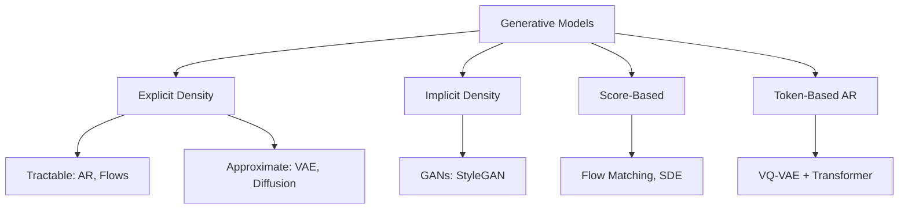
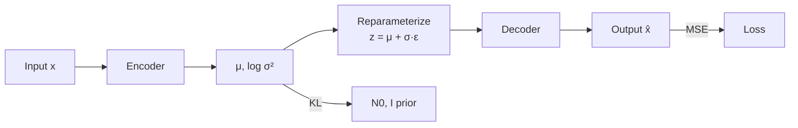
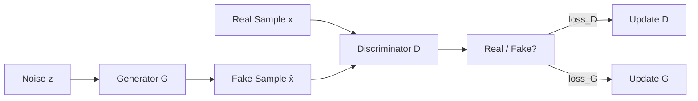
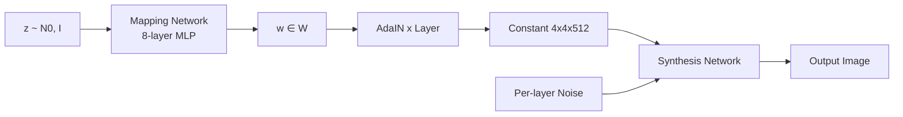
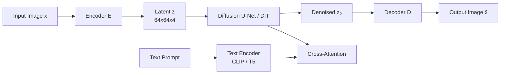
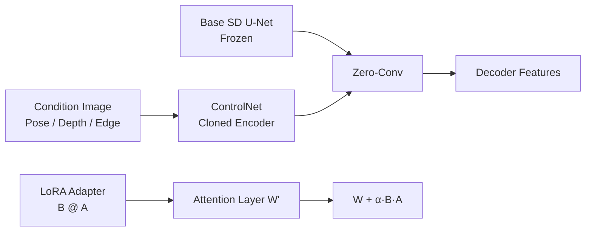
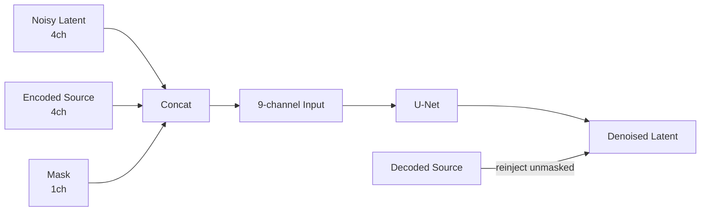

# Autoencoders, GANs & Diffusion Models

> Combined lessons (9 parts), merged verbatim — no content removed.

**Type:** Combined

---

## Part 1 (ch156): Generative Models — Taxonomy & History

> Every image model, text model, video model, and 3D model fits in one of five buckets. Pick the wrong bucket and you will fight the math for weeks. Pick the right one and the field's last twelve years of progress stacks cleanly in your head.

**Type:** Learn
**Languages:** Python
**Prerequisites:** Phase 2 (ML Fundamentals), Phase 3 (Deep Learning Core), Phase 7 · 14 (Transformers)
**Time:** ~45 minutes

## The Problem

A generative model does one job: given training samples drawn from some unknown distribution `p_data(x)`, output new samples that look like they came from the same distribution. Faces, sentences, MIDI files, protein structures — all the same problem if you squint.

The rub is that `p_data` lives in a space with millions of dimensions (a 512x512 RGB image is ~786k dimensions), the samples sit on a thin manifold inside that space, and you only have maybe 10M examples. Brute-forcing the density is hopeless. Every generative model is a compromise that trades one hard problem for a slightly less hard one.

Five families have survived the last twelve years. Knowing which compromise each family makes tells you why it wins on some tasks and collapses on others.

## The Five Families

**1. Explicit density, tractable.** Write `log p(x)` as a sum you can actually evaluate. Autoregressive models (PixelCNN, WaveNet, GPT) factorize `p(x) = ∏ p(x_i | x_<i)`. Normalizing flows (RealNVP, Glow) build `p(x)` as an invertible transform of a simple base. Pro: exact likelihood, clean training loss. Con: autoregressive inference is sequential (slow for long sequences), flows need invertible architectures (architecturally restrictive).

**2. Explicit density, approximate.** Bound `log p(x)` from below (ELBO) and optimize the bound. VAEs (Kingma 2013) use an encoder-decoder with a variational posterior. Diffusion models (DDPM, Ho 2020) train a denoiser that implicitly optimizes a weighted ELBO. Diffusion is the dominant image, video, and 3D backbone in 2026.

**3. Implicit density.** Skip density entirely; learn a generator `G(z)` that produces samples and a discriminator `D(x)` that tells real from fake. GANs (Goodfellow 2014). Fast at inference (one forward pass) but notoriously unstable during training. StyleGAN 1/2/3 remain state of the art for fixed-domain photorealism (faces, bedrooms) even in 2026.

**4. Score-based / continuous-time.** Learn the gradient of the log-density `∇_x log p(x)` (the score) directly. Song & Ermon (2019) showed score matching generalizes diffusion to an SDE. Flow matching (Lipman 2023) is the 2024-2026 hotness: simulate-free training, straighter paths, 4-10x faster sampling than DDPM. Stable Diffusion 3, Flux, AudioCraft 2 all use flow matching.

**5. Token-based autoregressive over discrete codes.** Compress high-dim data with a VQ-VAE or residual quantizer into a short sequence of discrete tokens, then use a Transformer to model the token sequence. Parti, MuseNet, AudioLM, VALL-E, Sora's patch tokenizer all use this. This is bucket 1 plus a learned tokenizer.



## A Brief History

| Year | Model | Why it mattered |
|------|-------|-----------------|
| 2013 | VAE (Kingma) | First deep generative model with a usable training loss. |
| 2014 | GAN (Goodfellow) | Implicit density, no likelihood — shockingly sharp samples. |
| 2015 | DRAW, PixelCNN | Sequential image generation. |
| 2017 | Glow, RealNVP | Invertible flows; exact likelihood with depth. |
| 2017 | Progressive GAN | First megapixel faces. |
| 2019 | StyleGAN / StyleGAN2 | Photorealistic faces still hard to beat for that one domain. |
| 2020 | DDPM (Ho) | Diffusion becomes practical. |
| 2021 | CLIP, DALL-E 1, VQGAN | Text-to-image goes mainstream. |
| 2022 | Imagen, Stable Diffusion 1, DALL-E 2 | Latent diffusion + text conditioning = commodity. |
| 2022 | ControlNet, LoRA | Fine control over pretrained diffusion. |
| 2023 | SDXL, Midjourney v5, Flow matching | Scale + better training dynamics. |
| 2024 | Sora, Stable Diffusion 3, Flux.1 | Video diffusion; flow matching wins. |
| 2025 | Veo 2, Kling 1.5, Runway Gen-3 | Production-grade video. |
| 2026 | Consistency + Rectified Flow | One-step sampling from diffusion backbones. |

## The Five-Question Triage

When a new generative model paper drops, answer these five questions before reading the method section.

1. **What is being modeled?** Pixels, latents, discrete tokens, 3D Gaussians, meshes, waveforms?
2. **Is the density explicit or implicit?** Do they write down `log p(x)`?
3. **Sampling: one-shot or iterative?** Iterative means slower inference; one-shot usually means adversarial or distilled.
4. **Conditioning: unconditional, class, text, image, pose?** This determines the loss and architecture scaffolding.
5. **Evaluation: FID, CLIP score, IS, human preference, task accuracy?** Each has known failure modes.

## Build It

The code for this lesson is a lightweight visualization: fit a 1-D mixture-of-Gaussians from samples using three toy approaches (kernel density, discrete histogram, and a nearest-sample "GAN-ish" generator) so you can see the difference between explicit vs implicit density.

```python
def histogram_density(samples, x, bin_width=0.25):
    """Explicit density via histogram. Returns p(x) as (count in bin) / (n * bin_width)."""
    n = len(samples)
    lo, hi = x - bin_width / 2, x + bin_width / 2
    count = sum(1 for s in samples if lo <= s < hi)
    return count / (n * bin_width)

def kde_density(samples, x, bandwidth=0.3):
    """Approximate density via Gaussian kernel density estimate."""
    n = len(samples)
    total = 0.0
    for s in samples:
        u = (x - s) / bandwidth
        total += math.exp(-0.5 * u * u) / math.sqrt(2 * math.pi)
    return total / (n * bandwidth)

def implicit_generator(samples, k, rng):
    """Implicit generator: sample a training point and add tiny noise. No p(x)."""
    out = []
    for _ in range(k):
        base = rng.choice(samples)
        out.append(base + rng.gauss(0.0, 0.1))
    return out
```

It draws 2000 samples from a two-mode Gaussian mixture, then prints:

```
explicit density (histogram): p(x in [-0.5, 0.5]) ≈ 0.38
approximate density (KDE):     p(x in [-0.5, 0.5]) ≈ 0.41
implicit (nearest-sample gen): 20 new samples printed, no p(x)
```

Notice: the first two let you ask "how likely is this point?" The third cannot. This is the *explicit vs implicit* distinction that will matter for every future lesson.

## Use It — Which Family for Which Task in 2026

| Task | Best family | Why |
|------|-------------|-----|
| Photoreal faces, narrow domain | StyleGAN 2/3 | Still sharpest, fastest inference. |
| General text-to-image | Latent diffusion + flow matching | SD3, Flux.1, DALL-E 3. |
| Fast text-to-image | Rectified flow + distillation | SDXL-Turbo, SD3-Turbo, LCM. |
| Text-to-video | Diffusion Transformer + flow matching | Sora, Veo 2, Kling. |
| Speech + music | Token-based AR (AudioLM, VALL-E, MusicGen) or flow matching (AudioCraft 2) | Discrete tokens scale cheaply. |
| 3D scenes | Gaussian Splatting fit, diffusion prior | 3D-GS for reconstruction, diffusion for novel-view. |
| Density estimation (no sampling) | Flows | Only family with exact `log p(x)`. |
| Simulation / physics | Flow matching, score SDE | Straight-line paths, smooth vector fields. |

## Production Note — Five Families, Five Inference Shapes

- **Autoregressive (bucket 1 and 5).** Sequential decode dominates latency; KV-cache, continuous batching, and speculative decoding all apply directly.
- **VAE / diffusion / flow-matching (buckets 2 and 4).** Cost = `num_steps × step_cost`. The production knobs are step count (DDIM / DPM-Solver / distillation), batch size, and precision (bf16 / fp8 / int4).
- **GAN (bucket 3).** One forward pass. No schedule, no KV-cache. TTFT ≈ total latency.

## Key Terms

| Term | What people say | What it actually means |
|------|-----------------|-----------------------|
| Generative model | "It makes new stuff" | Learns a sampler for `p_data(x)`, optionally exposes `log p(x)`. |
| Explicit density | "You can evaluate it" | Model provides a closed-form or tractable `log p(x)`. |
| Implicit density | "GAN-style" | Only a sampler — no way to evaluate `p(x)` of a given point. |
| ELBO | "Evidence lower bound" | A tractable lower bound on `log p(x)`; VAEs and diffusion optimize it. |
| Score | "Gradient of log-density" | `∇_x log p(x)`; diffusion and SDE models learn this field. |
| Manifold hypothesis | "Data lives on a surface" | High-dim data concentrates on a low-dim manifold. |
| Autoregressive | "Predict the next piece" | Factorize joint as product of conditionals. |
| Latent | "Compressed code" | Low-dim representation from which a decoder can reconstruct the input. |

## Exercises

1. **Easy.** For each of these five products, identify the family and backbone: ChatGPT image, Midjourney v7, Sora, Runway Gen-3, ElevenLabs. Evidence should be from public technical reports.
2. **Medium.** The paper you are about to read tomorrow claims 100x faster sampling than diffusion. Write down three questions to check whether the speedup survives conditioning and high resolution.
3. **Hard.** Take one domain you care about (e.g. protein structure, CAD, molecules, trajectories). Answer the five-question triage for the current SOTA model in that domain and sketch what a better model would change.

## Further Reading

- [Goodfellow et al. (2014). Generative Adversarial Nets](https://arxiv.org/abs/1406.2661)
- [Kingma & Welling (2013). Auto-Encoding Variational Bayes](https://arxiv.org/abs/1312.6114)
- [Ho, Jain, Abbeel (2020). Denoising Diffusion Probabilistic Models](https://arxiv.org/abs/2006.11239)
- [Song et al. (2021). Score-Based Generative Modeling through SDEs](https://arxiv.org/abs/2011.13456)
- [Lipman et al. (2023). Flow Matching for Generative Modeling](https://arxiv.org/abs/2210.02747)
- [Esser et al. (2024). Scaling Rectified Flow Transformers for High-Resolution Image Synthesis](https://arxiv.org/abs/2403.03206)

[Reference](https://github.com/rohitg00/ai-engineering-from-scratch/tree/main/phases/08-generative-ai/01-generative-models-taxonomy-history)

---

## Part 2 (ch157): Autoencoders & Variational Autoencoders (VAE)

> A plain autoencoder compresses then reconstructs. It memorizes. It does not generate. Add one trick — force the code to look Gaussian — and you get a sampler. That single trick, the reparameterization of `z = μ + σ·ε`, is why every latent-diffusion and flow-matching image model you use in 2026 has a VAE at the input.

**Type:** Build
**Languages:** Python
**Prerequisites:** Phase 3 · 02 (Backprop), Phase 3 · 07 (CNNs), Phase 8 · 01 (Taxonomy)
**Time:** ~75 minutes

## The Problem

Compress a 784-pixel MNIST digit to a 16-number code, then reconstruct. A plain autoencoder will ace reconstruction MSE but the code space is a lumpy mess. Pick a random point in the code space, decode it, and you get noise. It has no sampler. It is a compression model dressed up.

What you actually want is: (a) the code space is a clean, smooth distribution you can sample from — say an isotropic Gaussian `N(0, I)`, (b) decoding any sample produces a plausible digit, and (c) the encoder and decoder still compress well.

Kingma's 2013 VAE solves this by training the encoder to output a *distribution* `q(z|x) = N(μ(x), σ(x)²)`, pulling that distribution toward the prior `N(0, I)` via a KL penalty, and then sampling `z` from `q(z|x)` before decoding. At inference time, drop the encoder, sample `z ~ N(0, I)`, decode.

## The Concept



**Autoencoder.** `z = encoder(x)`, `x̂ = decoder(z)`, loss = `||x - x̂||²`. Code space unstructured.

**VAE encoder.** Outputs two vectors: `μ(x)` and `log σ²(x)`. These define `q(z|x) = N(μ, diag(σ²))`.

**Reparameterization trick.** Sampling from `q(z|x)` is not differentiable. Rewrite the sample as `z = μ + σ·ε` where `ε ~ N(0, I)`. Now `z` is a deterministic function of `(μ, σ)` plus a non-parameter noise — gradients flow through `μ` and `σ`.

**Loss.** Evidence Lower BOund (ELBO), two terms:

```
loss = reconstruction + β · KL[q(z|x) || N(0, I)]
     = ||x - x̂||²  + β · Σ_i ( σ_i² + μ_i² - log σ_i² - 1 ) / 2
```

Reconstruction pushes `x̂` toward `x`. KL pushes `q(z|x)` toward the prior. They trade off. Small β (<1) = sharper samples, code space less Gaussian. Large β (>1) = cleaner code space, blurrier samples.

**Sampling.** At inference: draw `z ~ N(0, I)`, forward through decoder. One forward pass — no iterative sampling like diffusion.

## Build It

`code/main.py` implements a tiny VAE without numpy or torch. Input is 8-dimensional synthetic data drawn from a 2-component Gaussian mixture in 8-D. Encoder and decoder are single hidden-layer MLPs.

### Step 1: encoder forward

```python
def encode(x, enc):
    h = tanh(add(matmul(enc["W1"], x), enc["b1"]))
    mu = add(matmul(enc["W_mu"], h), enc["b_mu"])
    log_sigma2 = add(matmul(enc["W_sig"], h), enc["b_sig"])
    return mu, log_sigma2
```

`log σ²` instead of `σ` so the network output is unconstrained.

### Step 2: reparameterize and decode

```python
def reparameterize(mu, log_sigma2, rng):
    eps = [rng.gauss(0, 1) for _ in mu]
    sigma = [math.exp(0.5 * lv) for lv in log_sigma2]
    return [m + s * e for m, s, e in zip(mu, sigma, eps)]

def decode(z, dec):
    h = tanh(add(matmul(dec["W1"], z), dec["b1"]))
    return add(matmul(dec["W_out"], h), dec["b_out"])
```

### Step 3: the ELBO

```python
def elbo(x, x_hat, mu, log_sigma2, beta=1.0):
    recon = sum((a - b) ** 2 for a, b in zip(x, x_hat))
    kl = 0.5 * sum(math.exp(lv) + m * m - lv - 1 for m, lv in zip(mu, log_sigma2))
    return recon + beta * kl, recon, kl
```

Exact closed-form KL because both distributions are Gaussian.

### Step 4: generate

```python
def sample(dec, z_dim, rng):
    z = [rng.gauss(0, 1) for _ in range(z_dim)]
    return decode(z, dec)
```

That is the generative model. Five lines.

## Pitfalls

- **Posterior collapse.** KL term drives `q(z|x) → N(0, I)` so aggressively that `z` carries no info about `x`. Fix: β-annealing (start β=0, ramp to 1), free bits, or skip the KL on inactive dimensions.
- **Blurry samples.** The Gaussian decoder likelihood implies MSE reconstruction, which is Bayes-optimal for L2 (the mean) — the mean of a set of plausible digits is a fuzzy digit. Fix: discrete decoder (VQ-VAE, NVAE), or use the VAE only as an encoder and stack diffusion on the latents.
- **β too large, too early.** See posterior collapse. Start at β≈0.01 and ramp.
- **Latent dim too small.** 16-D works for MNIST, 256-D for ImageNet 256², 2048-D for ImageNet 1024². Stable Diffusion's VAE compresses 512×512×3 → 64×64×4.

## Use It — The 2026 VAE Stack

| Situation | Pick |
|-----------|------|
| Image-latent encoder for diffusion | Stable Diffusion VAE (`sd-vae-ft-ema`) or Flux VAE |
| Audio-latent encoder | Encodec (Meta), SoundStream, or DAC (Descript) |
| Video latents | Sora's spatiotemporal patches, Latte VAE, WAN VAE |
| Disentangled representation learning | β-VAE, FactorVAE, TCVAE |
| Discrete latents (for transformer modelling) | VQ-VAE, RVQ (ResidualVQ) |
| Continuous latents for generation | Plain VAE, then condition a flow/diffusion model in that latent space |

## Production Note

In a Stable Diffusion / Flux / SD3 pipeline the VAE is called twice per request — once to encode (if doing img2img / inpainting) and once to decode. At 1024² the decoder pass is often the single largest activation-memory peak in the whole pipeline because it upsamples `128×128×16` latents back to `1024×1024×3`.

- **Slice or tile the decode.** `diffusers` exposes `pipe.vae.enable_slicing()` and `pipe.vae.enable_tiling()`. Essential for 1024²+ on consumer GPUs.
- **bf16 decoder, fp32 numerics for the final resize.** Always prefer the fp16-fix variant or use bf16.

## Key Terms

| Term | What people say | What it actually means |
|------|-----------------|-----------------------|
| Autoencoder | Encode-decode network | `x → z → x̂`, learn MSE. Not generative. |
| VAE | AE with a sampler | Encoder outputs a distribution, KL penalty shapes code space. |
| ELBO | Evidence lower bound | `log p(x) ≥ recon - KL[q(z\|x) || p(z)]`; tight when `q = p(z\|x)`. |
| Reparameterization | `z = μ + σ·ε` | Rewrites stochastic node as deterministic + pure noise. Enables backprop through sampling. |
| Prior | `p(z)` | Target distribution for the latent, typically `N(0, I)`. |
| Posterior collapse | "KL term wins" | Encoder ignores `x`, outputs the prior; decoder must hallucinate. |
| β-VAE | Tunable KL weight | `loss = recon + β·KL`. Higher β = more disentangled but blurrier. |
| VQ-VAE | Discrete latent | Replace continuous `z` with nearest codebook vector; enables transformer modelling. |

## Exercises

1. **Easy.** Change `β` in `code/main.py` to `0.01`, `0.1`, `1.0`, `5.0`. Record the final reconstruction MSE and KL.
2. **Medium.** Replace the Gaussian decoder likelihood with a Bernoulli likelihood (cross-entropy loss). Compare sample quality.
3. **Hard.** Extend `code/main.py` into a mini VQ-VAE: replace the continuous `z` with a nearest-neighbour lookup in a codebook of K=32 entries. Compare reconstruction MSE.

## Further Reading

- [Kingma & Welling (2013). Auto-Encoding Variational Bayes](https://arxiv.org/abs/1312.6114)
- [Higgins et al. (2017). β-VAE: Learning Basic Visual Concepts with a Constrained Variational Framework](https://openreview.net/forum?id=Sy2fzU9gl)
- [van den Oord et al. (2017). Neural Discrete Representation Learning](https://arxiv.org/abs/1711.00937)
- [Vahdat & Kautz (2021). NVAE: A Deep Hierarchical Variational Autoencoder](https://arxiv.org/abs/2007.03898)
- [Rombach et al. (2022). High-Resolution Image Synthesis with Latent Diffusion Models](https://arxiv.org/abs/2112.10752)
- [Défossez et al. (2022). High Fidelity Neural Audio Compression](https://arxiv.org/abs/2210.13438)

[Reference](https://github.com/rohitg00/ai-engineering-from-scratch/tree/main/phases/08-generative-ai/02-autoencoders-vae)

---

## Part 3 (ch158): GANs — Generator vs Discriminator

> Goodfellow's trick in 2014 was to skip density entirely. Two networks. One makes fakes. One catches them. They fight until the fakes are indistinguishable from real. It shouldn't work. It often doesn't. When it does, the samples are still the sharpest in the literature for narrow domains.

**Type:** Build
**Languages:** Python
**Prerequisites:** Phase 3 · 02 (Backprop), Phase 3 · 08 (Optimizers), Phase 8 · 02 (VAE)
**Time:** ~75 minutes

## The Problem

VAEs produce blurry samples because their MSE decoder loss is Bayes-optimal for the *mean* image — and the mean of many plausible digits is a fuzzy digit. You want a loss that rewards *plausibility*, not pixel-wise proximity to any one target. There is no closed-form for plausibility. You have to learn it.

Goodfellow's idea: train a classifier `D(x)` to distinguish real images from fakes. Train a generator `G(z)` to fool `D`. The loss signal for `G` is whatever `D` currently thinks makes something look real. This signal updates as `G` improves, chasing a moving target. If both networks converge, `G` has learned the data distribution without ever writing down `log p(x)`.

This is adversarial training. The math is a minimax game:

```
min_G max_D  E_real[log D(x)] + E_fake[log(1 - D(G(z)))]
```

## The Concept



**Generator `G(z)`.** Maps a noise vector `z ~ N(0, I)` to a sample `x̂`. A decoder-shaped network (dense or transposed conv).

**Discriminator `D(x)`.** Maps a sample to a scalar probability (or score). Real → 1, fake → 0.

**Loss.** Two alternating updates:

- **Train `D`:** `loss_D = -[ log D(x) + log(1 - D(G(z))) ]`. Binary cross-entropy on real=1, fake=0.
- **Train `G`:** `loss_G = -log D(G(z))`. This is the *non-saturating* form.

**Training loop.** One step of `D`, one step of `G`. Repeat.

## Variants That Made GANs Work

| Year | Innovation | Fix |
|------|------------|-----|
| 2015 | DCGAN | Conv/deconv, batch norm, LeakyReLU — the first stable architecture. |
| 2017 | WGAN, WGAN-GP | Replace BCE with Wasserstein distance + gradient penalty. Fixes vanishing gradient. |
| 2017 | Spectral normalization | Lipschitz-bound the discriminator. Still used in 2026 discriminators. |
| 2018 | Progressive GAN | Train low-res first, add layers. First megapixel results. |
| 2019 | StyleGAN / StyleGAN2 | Mapping network + adaptive instance norm. State of the art for fixed-domain photorealism. |
| 2024 | R3GAN | Rebrands with stronger regularization; works on 1024² without tricks. |

## Build It

`code/main.py` trains a tiny GAN on 1-D data: a mixture of two Gaussians. Generator and discriminator are single-hidden-layer MLPs.

### Step 1: non-saturating loss

```python
def g_loss(d_fake):
    # maximize log D(G(z))  <=>  minimize -log D(G(z))
    return -sum(math.log(max(p, 1e-8)) for p in d_fake) / len(d_fake)
```

### Step 2: one discriminator step per generator step

```python
for step in range(steps):
    # train D
    real_batch = sample_real(batch_size)
    fake_batch = [G(z) for z in sample_noise(batch_size)]
    update_D(real_batch, fake_batch)

    # train G
    fake_batch = [G(z) for z in sample_noise(batch_size)]  # fresh fakes
    update_G(fake_batch)
```

### Step 3: watch for mode collapse

```python
if step % 200 == 0:
    samples = [G(z) for z in sample_noise(500)]
    mode_a = sum(1 for s in samples if s < 0)
    mode_b = 500 - mode_a
    if min(mode_a, mode_b) < 50:
        print("  [!] mode collapse: one mode is starved")
```

## Pitfalls

- **Discriminator too strong.** Cut D's learning rate by 2-5x, or add instance/layer noise. If D reaches >95% accuracy, G is dead.
- **Generator memorizes a mode.** Add noise to D inputs, use a minibatch-discriminator layer, or switch to WGAN-GP.
- **Batch norm leaking statistics.** Use instance norm or spectral norm instead.
- **One-shot sampling is a lie for conditional tasks.** You still need CFG scales, truncation tricks, and re-sampling.

## Use It — The 2026 GAN Stack

| Situation | Pick |
|-----------|------|
| Photoreal human faces, fixed pose | StyleGAN3 (sharpest, smallest) |
| Anime / stylized faces | StyleGAN-XL or Stable Diffusion LoRA |
| Image-to-image translation | Pix2Pix / CycleGAN or ControlNet |
| Fast 1-step text-to-image | Adversarial distillation of diffusion (SDXL-Turbo, SD3-Turbo) |
| Perceptual loss inside a diffusion trainer | Small GAN discriminator on image crops |
| Anything multi-modal, open-ended | Don't — use diffusion or flow matching |

## Production Note

GANs no longer win on sample quality for open-domain generation, but they still win on inference cost.

- **No prefill, no decode stages.** A single `G(z)` forward pass. TTFT ≈ total latency.
- **No KV-cache pressure.** The only state is the weights.
- **Trivial continuous batching.** Since every request takes the same fixed FLOPs, a static batch is usually optimal.

This is why GAN distillation (SDXL-Turbo, SD3-Turbo, ADD, LCM) is the dominant technique for fast text-to-image.

## Key Terms

| Term | What people say | What it actually means |
|------|-----------------|-----------------------|
| Generator | "G" | Noise-to-sample network, `G: z → x̂`. |
| Discriminator | "D" | Classifier `D: x → [0, 1]`, real vs fake. |
| Minimax | "The game" | `min_G max_D` of a joint objective. |
| Non-saturating loss | "The fix" | Use `-log D(G(z))` for G instead of `log(1 - D(G(z)))`. |
| Mode collapse | "G memorized one thing" | Generator produces few distinct outputs despite diverse data. |
| WGAN | "Wasserstein" | Replace BCE with Earth-Mover distance + gradient penalty. |
| Spectral norm | "Lipschitz trick" | Constrain D's weight norms to bound its slope. |
| StyleGAN | "The one that works" | Mapping network + AdaIN; best-in-class for faces. |

## Exercises

1. **Easy.** Run `code/main.py` with the stock settings. Then set `D_LR = 5 * G_LR` and rerun. How fast does G's loss collapse to a constant?
2. **Medium.** Replace the Goodfellow BCE loss with the WGAN loss and clip D's weights to `[-0.01, 0.01]`. Is training more stable?
3. **Hard.** Extend the 1-D example to 2-D data (mixture of 8 Gaussians on a ring). Track how many of the 8 modes the generator captures.

## Further Reading

- [Goodfellow et al. (2014). Generative Adversarial Nets](https://arxiv.org/abs/1406.2661)
- [Radford et al. (2015). Unsupervised Representation Learning with DCGAN](https://arxiv.org/abs/1511.06434)
- [Arjovsky, Chintala, Bottou (2017). Wasserstein GAN](https://arxiv.org/abs/1701.07875)
- [Miyato et al. (2018). Spectral Normalization for GANs](https://arxiv.org/abs/1802.05957)
- [Karras et al. (2020). Analyzing and Improving the Image Quality of StyleGAN](https://arxiv.org/abs/1912.04958)
- [Karras et al. (2021). Alias-Free Generative Adversarial Networks](https://arxiv.org/abs/2106.12423)
- [Sauer et al. (2023). Adversarial Diffusion Distillation](https://arxiv.org/abs/2311.17042)

[Reference](https://github.com/rohitg00/ai-engineering-from-scratch/tree/main/phases/08-generative-ai/03-gans-generator-discriminator)

---

## Part 4 (ch159): Conditional GANs & Pix2Pix

> The first big unlock of 2014-2017 was controlling what a GAN makes. Attach a label, or an image, or a sentence. Pix2Pix did the image version and it still beats every generic text-to-image model on narrow image-to-image tasks.

**Type:** Build
**Languages:** Python
**Prerequisites:** Phase 8 · 03 (GANs), Phase 4 · 06 (U-Net), Phase 3 · 07 (CNNs)
**Time:** ~75 minutes

## The Problem

An unconditional GAN samples arbitrary faces. Useful for a demo, useless in production. You want: *map a sketch to a photo*, *map a map to an aerial photo*, *map a daytime scene to nighttime*, *colorize a grayscale image*. In all of these, you are given an input image `x` and must output `y` with some semantic correspondence. There are many plausible `y`s per `x`. Mean-squared error flattens them into mush. An adversarial loss doesn't, because "looks real" is sharp.

Conditional GAN (Mirza & Osindero, 2014) adds a condition `c` as an input to both `G` and `D`. Pix2Pix (Isola et al., 2017) specialized this: condition is a full input image, generator is a U-Net, discriminator is a *patch-based* classifier (PatchGAN), and loss is adversarial + L1.

## The Concept

```mermaid
graph LR
    A[Condition c] --> B[Generator G<br>U-Net]
    C[Noise z] --> B
    B --> D[Fake Output ŷ]
    E[Real y, Condition c] --> F[Discriminator D<br>PatchGAN]
    D --> F
    A --> F
    F --> G[Patch-wise Real/Fake]
    D -- L1 --> H[||y - ŷ||₁]
```

**Conditional G.** `G(x, z) → y`. In Pix2Pix, `z` is dropout inside G.

**Conditional D.** `D(x, y) → [0, 1]`. Input is the *pair* (condition, output). D must judge whether `y` is consistent with `x`.

**U-Net generator.** Encoder-decoder with skip connections across the bottleneck. Critical for tasks where input and output share low-level structure.

**PatchGAN discriminator.** Instead of outputting a single real/fake score, D outputs an `N×N` grid where each cell judges a receptive field of ~70×70 pixels.

**Loss.**

```
loss_G = -log D(x, G(x)) + λ · ||y - G(x)||_1
loss_D = -log D(x, y) - log (1 - D(x, G(x)))
```

The L1 term stabilizes training and pushes G toward the known target. L1 gives sharper edges than L2 (medians, not means). `λ = 100` was the Pix2Pix default.

## CycleGAN — When You Don't Have Pairs

Pix2Pix needs paired `(x, y)` data. CycleGAN (Zhu et al., 2017) drops this requirement at the cost of an extra loss: the *cycle consistency* loss. Two generators `G: X → Y` and `F: Y → X`. Train them so `F(G(x)) ≈ x` and `G(F(y)) ≈ y`.

## Build It

`code/main.py` implements a tiny conditional GAN on 1-D data. The condition `c` is a class label (0 or 1).

### Step 1: append condition to both G and D inputs

```python
def G(z, c, params):
    return mlp(concat([z, one_hot(c)]), params)

def D(x, c, params):
    return mlp(concat([x, one_hot(c)]), params)
```

### Step 2: train conditional

```python
for step in range(steps):
    x, c = sample_real_conditional()
    noise = sample_noise()
    update_D(x_real=x, x_fake=G(noise, c), c=c)
    update_G(noise, c)
```

### Step 3: verify per-class output

```python
for c in [0, 1]:
    samples = [G(noise, c) for noise in batch]
    mean_c = mean(samples)
    assert_near(mean_c, real_mean_for_class_c)
```

## Pitfalls

- **Condition ignored.** G learns to marginalize, D never penalizes because condition signal is weak. Fix: condition D more aggressively, use projection discriminator.
- **L1 weight too low.** G drifts to arbitrary real-looking outputs, not faithful ones. Start λ≈100.
- **L1 weight too high.** G produces blurry outputs. Anneal down once training stabilizes.
- **Ground-truth leakage in D.** Concatenate `(x, y)` as D input, not just `y`.
- **Mode collapse per class.** Each class can collapse independently.

## Use It — 2026 Image-to-Image Tasks

| Task | Best approach |
|------|---------------|
| Sketch → photo, same domain, paired data | Pix2Pix / Pix2PixHD |
| Sketch → photo, unpaired | ControlNet with a Scribble conditioning model |
| Semantic seg → photo | SPADE / GauGAN2 or SD + ControlNet-Seg |
| Style transfer | Diffusion with IP-Adapter or LoRA |
| Depth → photo | ControlNet-Depth over Stable Diffusion |
| Super-resolution | Real-ESRGAN (GAN), ESRGAN-Plus, or SD-Upscale |
| Colorization | ColTran, diffusion-based colorizers, or Pix2Pix-color |

## Production Note — Pix2Pix as a Latency-Bound Baseline

| Path | Steps | Typical latency at 512² on a single L4 |
|------|-------|----------------------------------------|
| Pix2Pix (U-Net forward) | 1 | ~30 ms |
| SD-Inpaint or SD-Img2Img | 20 | ~1.2 s |
| SDXL-Turbo Img2Img | 1-4 | ~0.15-0.35 s |
| ControlNet + SDXL base | 20-30 | ~3-5 s |

Pix2Pix wins on throughput in static batches. The modern play is often to ship a Pix2Pix-style distilled model for the narrow task and a diffusion fallback for tail inputs.

## Key Terms

| Term | What people say | What it actually means |
|------|-----------------|-----------------------|
| Conditional GAN | "GAN with labels" | G(z, c), D(x, c). Both networks see the condition. |
| Pix2Pix | "Image-to-image GAN" | Paired cGAN with U-Net G and PatchGAN D + L1 loss. |
| U-Net | "Encoder-decoder with skips" | Symmetric conv network; skips preserve high-freq. |
| PatchGAN | "Local-realism classifier" | D outputs per-patch score instead of global score. |
| CycleGAN | "Unpaired image translation" | Two G's + cycle-consistency loss; no paired data. |
| SPADE | "GauGAN" | Normalizes intermediate activations with the semantic map. |
| FiLM | "Feature-wise linear modulation" | Per-feature affine transform from the condition. |

## Exercises

1. **Easy.** Modify `code/main.py` to add a third class. Confirm G still maps each class's noise to the correct mode.
2. **Medium.** Replace L1 with a perceptual-style loss in the 1-D setting. Does it change sharpness of the conditional distribution?
3. **Hard.** Sketch a CycleGAN in the 1-D setting: two distributions, two generators, cycle loss.

## Further Reading

- [Mirza & Osindero (2014). Conditional Generative Adversarial Nets](https://arxiv.org/abs/1411.1784)
- [Isola et al. (2017). Image-to-Image Translation with Conditional Adversarial Networks](https://arxiv.org/abs/1611.07004)
- [Zhu et al. (2017). Unpaired Image-to-Image Translation using Cycle-Consistent Adversarial Networks](https://arxiv.org/abs/1703.10593)
- [Wang et al. (2018). High-Resolution Image Synthesis with Conditional GANs](https://arxiv.org/abs/1711.11585)
- [Park et al. (2019). Semantic Image Synthesis with Spatially-Adaptive Normalization](https://arxiv.org/abs/1903.07291)
- [Miyato & Koyama (2018). cGANs with Projection Discriminator](https://arxiv.org/abs/1802.05637)

[Reference](https://github.com/rohitg00/ai-engineering-from-scratch/tree/main/phases/08-generative-ai/04-conditional-gans-pix2pix)

---

## Part 5 (ch160): StyleGAN

> Most generators stir `z` into every layer at the same time. StyleGAN split it apart: first map `z` to an intermediate `w`, then *inject* `w` at every resolution level through AdaIN. That single change untangled the latent space and made photorealistic faces a solved problem for seven years running.

**Type:** Build
**Languages:** Python
**Prerequisites:** Phase 8 · 03 (GANs), Phase 4 · 08 (Normalization), Phase 3 · 07 (CNNs)
**Time:** ~45 minutes

## The Problem

A DCGAN maps `z` to an image through a stack of transposed convolutions. The problem: `z` controls everything — pose, lighting, identity, background — entangled together. Move along one axis of `z`, all four change. You cannot ask the model "same person, different pose" because the representation does not factor that way.

Karras et al. (2019, NVIDIA) proposed: stop feeding `z` directly into conv layers. Feed a constant `4×4×512` tensor as the network input. Learn an 8-layer MLP that maps `z ∈ Z → w ∈ W`. Inject `w` at every resolution via *adaptive instance normalization* (AdaIN): normalize each conv feature map, then scale and shift by affine projections of `w`. Add per-layer noise for stochastic detail (skin pores, hair strands).

The result: `W` has roughly orthogonal axes for "high-level style" (pose, identity) vs "fine style" (lighting, color).

## The Concept



**Mapping network.** `f: Z → W`, an 8-layer MLP. `Z = N(0, I)^512`. `W` is not forced to be Gaussian — it learns a data-adapted shape.

**Synthesis network.** Starts from a learned constant `4×4×512`. Each resolution block: `upsample → conv → AdaIN(w_i) → noise → conv → AdaIN(w_i) → noise`.

**AdaIN.**

```
AdaIN(x, y) = y_scale · (x - mean(x)) / std(x) + y_bias
```

where `y_scale` and `y_bias` come from affine projections of `w`.

**Per-layer noise.** Single-channel Gaussian noise added to each feature map, scaled by a learned per-channel factor. Controls stochastic detail without affecting global structure.

**Truncation trick.** At inference, sample `z`, compute `w = mapping(z)`, then `w' = ŵ + ψ·(w - ŵ)` where `ŵ` is the mean `w` over many samples. `ψ < 1` trades diversity for quality.

## StyleGAN 1 → 2 → 3

| Version | Year | Innovation |
|---------|------|------------|
| StyleGAN | 2019 | Mapping network + AdaIN + noise + progressive growing. |
| StyleGAN2 | 2020 | Weight demodulation replaces AdaIN (fixes droplet artifacts); skip/residual architecture; path-length regularization. |
| StyleGAN3 | 2021 | Alias-free convolution + equivariant kernels; eliminates texture sticking to pixel grid. |
| StyleGAN-XL | 2022 | Class-conditional, 1024², ImageNet. |

## Build It

`code/main.py` implements a toy "style-GAN lite" in 1-D: a mapping MLP, a synthesis function that takes a learned constant vector and modulates it with `w`-derived scale/bias, and per-layer noise.

### Step 1: mapping network

```python
def mapping(z, M):
    h = z
    for i in range(num_layers):
        h = leaky_relu(add(matmul(M[f"W{i}"], h), M[f"b{i}"]))
    return h
```

### Step 2: adaptive instance normalization

```python
def adain(x, w_scale, w_bias):
    mu = mean(x)
    sd = std(x)
    x_norm = [(xi - mu) / (sd + 1e-8) for xi in x]
    return [w_scale * xi + w_bias for xi in x_norm]
```

### Step 3: per-layer noise

```python
def add_noise(x, sigma, rng):
    return [xi + sigma * rng.gauss(0, 1) for xi in x]
```

## Pitfalls

- **Droplet artifacts.** StyleGAN 1 produced a blobby droplet in the feature maps because AdaIN zeroed out mean. StyleGAN 2's weight demodulation fixes it.
- **Texture sticking.** StyleGAN 3's alias-free convolutions fix this with windowed sinc filters.
- **Mode coverage.** Truncation `ψ < 0.7` looks clean but samples from a narrow cone.
- **Inversion is lossy.** Inverting a real photo into `W` is usually done through optimization or an encoder.

## Use It

| Use case | Approach |
|----------|----------|
| Photoreal human faces (anime, product, narrow) | StyleGAN3 FFHQ / custom fine-tune |
| Face editing from a photo | e4e inversion + StyleSpace / InterFaceGAN directions |
| Face swap / reenactment | StyleGAN + encoder + blending |
| Avatar pipelines | StyleGAN3 w/ ADA for low-data fine-tune |
| Domain adaptation from a few images | Freeze mapping network, fine-tune synthesis |

## Production Note

StyleGAN3 on a 4090 generates a 1024² FFHQ face in under 10 ms — `num_steps = 1`, no VAE decode, no cross-attention pass. A 50-step SDXL + VAE-decode pipeline at the same resolution is ~3 seconds. That is a **300× gap**.

- **No scheduler, no batcher.** Static batch at the target occupancy is optimal.
- **Truncation `ψ` is the safety knob.** Lower `ψ` at peak load, raise it for premium users.

## Key Terms

| Term | What people say | What it actually means |
|------|-----------------|-----------------------|
| Mapping network | "The MLP" | `f: Z → W`, 8 layers, decouples latent geometry from data statistics. |
| W space | "The style space" | Output of the mapping network; roughly disentangled. |
| AdaIN | "Adaptive instance norm" | Normalize feature map, then scale + shift by `w`-projection. |
| Truncation trick | "Psi" | `w = mean + ψ·(w - mean)`, ψ<1 trades diversity for quality. |
| Path-length regularization | "PL reg" | Penalizes large changes in image per unit change in `w`; makes `W` smoother. |
| Weight demodulation | "The StyleGAN2 fix" | Normalize conv weights instead of activations; kills droplet artifacts. |
| Alias-free | "StyleGAN3's trick" | Windowed sinc filters; eliminates texture sticking to the pixel grid. |
| Inversion | "Find w for a real image" | Optimize or encode `x → w` so `G(w) ≈ x`. |

## Exercises

1. **Easy.** Run `code/main.py` with `adain_on=True` and `adain_on=False`. Compare the spread of outputs for a fixed latent vs perturbed latent.
2. **Medium.** Implement mixing regularization: for a training batch, compute `w_a`, `w_b`, and apply `w_a` for the first half of synthesis and `w_b` for the second half.
3. **Hard.** Take a pretrained StyleGAN3 FFHQ model. Find the `w` direction that controls "smile" by training an SVM on labelled samples.

## Further Reading

- [Karras et al. (2019). A Style-Based Generator Architecture for GANs](https://arxiv.org/abs/1812.04948)
- [Karras et al. (2020). Analyzing and Improving the Image Quality of StyleGAN](https://arxiv.org/abs/1912.04958)
- [Karras et al. (2021). Alias-Free Generative Adversarial Networks](https://arxiv.org/abs/2106.12423)
- [Tov et al. (2021). Designing an Encoder for StyleGAN Image Manipulation](https://arxiv.org/abs/2102.02766)
- [Sauer et al. (2022). StyleGAN-XL: Scaling StyleGAN to Large Diverse Datasets](https://arxiv.org/abs/2202.00273)

[Reference](https://github.com/rohitg00/ai-engineering-from-scratch/tree/main/phases/08-generative-ai/05-stylegan)

---

## Part 6 (ch161): Diffusion Models — DDPM from Scratch

> Ho, Jain, Abbeel (2020) gave the field a recipe it could not quit. Destroy the data with noise over a thousand small steps. Train one neural net to predict the noise. Reverse the process at inference. Today every mainstream image, video, 3D, and music model runs on this loop, possibly with flow matching or consistency tricks on top.

**Type:** Build
**Languages:** Python
**Prerequisites:** Phase 3 · 02 (Backprop), Phase 8 · 02 (VAE)
**Time:** ~75 minutes

## The Problem

You want a sampler for `p_data(x)`. GANs play a minimax game that often diverges. VAEs produce blurry samples from a Gaussian decoder. What you really want is a training objective that is (a) a single stable loss (no saddle point, no minimax), (b) a lower bound on `log p(x)` (so you have likelihoods), and (c) samples that match SOTA quality.

Sohl-Dickstein et al. (2015) had a theoretical answer: define a Markov chain `q(x_t | x_{t-1})` that gradually adds Gaussian noise, and train a reverse chain `p_θ(x_{t-1} | x_t)` to denoise. Ho, Jain, Abbeel (2020) showed the loss could be simplified to one line — predict the noise.

## The Concept

```mermaid
graph LR
    A[x₀] --> B[x₁]
    B --> C[...]
    C --> D[x_T]
    D --> E[ε_θ]
    E --> F[x_{T-1}]
    F --> G[...]
    G --> H[x̂₀]
    A -- forward q --> D
    D -- reverse p_θ --> H
```

**Forward process `q`.** Add Gaussian noise in `T` small steps. The closed form:

```
q(x_t | x_0) = N( sqrt(α̅_t) · x_0,  (1 - α̅_t) · I )
```

where `α̅_t = ∏_{s=1..t} (1 - β_s)` for a schedule of `β_t`. Pick `β_t` from 1e-4 to 0.02 linearly over T=1000 steps and `x_T` is approximately `N(0, I)`.

**Reverse process `p_θ`.** Learn a neural net `ε_θ(x_t, t)` that predicts the noise that was added.

```
x_{t-1} = (1 / sqrt(α_t)) · ( x_t - (β_t / sqrt(1 - α̅_t)) · ε_θ(x_t, t) )  +  σ_t · z
```

**Training loss.**

```
L_simple = E_{x_0, t, ε} [ || ε - ε_θ( sqrt(α̅_t) · x_0 + sqrt(1 - α̅_t) · ε,  t ) ||² ]
```

Sample `x_0` from data, pick a random `t`, sample `ε ~ N(0, I)`, compute the noisy `x_t` in one shot via the closed form, and regress on the noise. One loss, no minimax, no KL, no reparameterization tricks.

**Sampling.** Start `x_T ~ N(0, I)`. Iterate the reverse step from `t = T` to `1`. Done.

## Build It

`code/main.py` implements a 1-D DDPM. Data is a two-mode mixture. The "net" is a tiny MLP that takes `(x_t, t)` and outputs predicted noise.

### Step 1: the forward schedule (closed form)

```python
betas = [1e-4 + (0.02 - 1e-4) * t / (T - 1) for t in range(T)]
alphas = [1 - b for b in betas]
alpha_bars = []
cum = 1.0
for a in alphas:
    cum *= a
    alpha_bars.append(cum)
```

### Step 2: sample `x_t` in one shot

```python
def forward_sample(x0, t, alpha_bars, rng):
    a_bar = alpha_bars[t]
    eps = rng.gauss(0, 1)
    x_t = math.sqrt(a_bar) * x0 + math.sqrt(1 - a_bar) * eps
    return x_t, eps
```

### Step 3: one training step

```python
def train_step(x0, model, alpha_bars, rng):
    t = rng.randrange(T)
    x_t, eps = forward_sample(x0, t, alpha_bars, rng)
    eps_hat = model_forward(model, x_t, t)
    loss = (eps - eps_hat) ** 2
    return loss, gradient_step(model, ...)
```

### Step 4: reverse sampling

```python
def sample(model, alpha_bars, T, rng):
    x = rng.gauss(0, 1)
    for t in range(T - 1, -1, -1):
        eps_hat = model_forward(model, x, t)
        beta_t = 1 - alphas[t]
        x = (x - beta_t / math.sqrt(1 - alpha_bars[t]) * eps_hat) / math.sqrt(alphas[t])
        if t > 0:
            x += math.sqrt(beta_t) * rng.gauss(0, 1)
    return x
```

## Time Conditioning

The net needs to know which timestep it is denoising. Two standard options:

- **Sinusoidal embedding.** Like Transformer positional encoding.
- **FiLM / group-norm conditioning.** Project embedding to per-channel scale/bias at each block.

```python
def sin_embed(t, T, dim=8):
    out = []
    half = dim // 2
    for i in range(half):
        freq = 1.0 / (10000 ** (i / max(half - 1, 1)))
        out.append(math.sin(t * freq))
        out.append(math.cos(t * freq))
    return out[:dim]
```

## Pitfalls

- **Schedule matters a lot.** Linear `β` is the DDPM default but cosine schedule gives better FID.
- **Timestep embedding is fragile.** Always use a proper embedding, not raw `t`.
- **V-prediction vs ε-prediction.** V-prediction (`v = α·ε - σ·x`) is more stable; SDXL, SD3, and Flux use it.
- **Classifier-free guidance.** At inference, compute both conditional and unconditional `ε`, then `ε_cfg = (1 + w) · ε_cond - w · ε_uncond` with `w ≈ 3-7`.
- **1000 steps is a lot.** Production uses DDIM (20-50 steps), DPM-Solver (10-20 steps), or distillation (1-4 steps).

## Use It

| Role | Typical stack in 2026 |
|------|-----------------------|
| Image pixel-space diffusion (small, toy) | DDPM + U-Net |
| Image latent diffusion | VAE encoder + U-Net or DiT |
| Video latent diffusion | Spatiotemporal DiT (Sora, Veo, WAN) |
| Audio latent diffusion | Encodec + diffusion transformer |
| Science (molecules, proteins, physics) | Equivariant diffusion (EDM, RFdiffusion) |

## Production Note

The DDPM paper runs T=1000 reverse steps. Nobody ships that in production.

1. **Faster sampler, same model.** DDIM (20-50 steps), DPM-Solver++ (10-20), UniPC (8-16). Cuts latency 20-50×.
2. **Distillation.** Train a student to match the teacher in fewer steps: Progressive Distillation, Consistency Models, LCM, SDXL-Turbo.
3. **Caching and compilation.** `torch.compile(unet, mode="reduce-overhead")`, TensorRT-LLM, `xformers`/SDPA attention, bf16 weights. Cuts per-step latency ~2×.

## Key Terms

| Term | What people say | What it actually means |
|------|-----------------|-----------------------|
| Forward process | "Adding noise" | Fixed Markov chain `q(x_t \| x_{t-1})` that destroys the data. |
| Reverse process | "Denoising" | Learned chain `p_θ(x_{t-1} \| x_t)` that reconstructs the data. |
| β schedule | "The noise ladder" | Per-step variance; linear, cosine, or sigmoid. |
| α̅ | "Alpha bar" | Cumulative product `∏(1 - β)`; gives closed-form `x_t` from `x_0`. |
| Simple loss | "MSE on noise" | `\|\|ε - ε_θ(x_t, t)\|\|²`; all variational derivations collapse to this. |
| ε-prediction | "Predict noise" | Output is the noise added; standard DDPM. |
| V-prediction | "Predict velocity" | Output is `α·ε - σ·x`; better conditioning across t. |
| DDPM | "The paper" | Ho et al. 2020; linear β, 1000 steps, U-Net. |
| DDIM | "Deterministic sampler" | Non-Markov sampler, 20-50 steps, same training objective. |
| Classifier-free guidance | "CFG" | Mix conditional and unconditional noise predictions to amplify conditioning. |

## Exercises

1. **Easy.** Change T from 40 to 10 in `code/main.py`. How does sample quality degrade?
2. **Medium.** Switch from ε-prediction to v-prediction. Re-derive the reverse step. Compare final sample quality.
3. **Hard.** Add classifier-free guidance. Condition on a class label `c ∈ {0, 1}`, drop it 10% of the time during training, and at sampling time use `ε = (1+w)·ε_cond - w·ε_uncond`.

## Further Reading

- [Sohl-Dickstein et al. (2015). Deep Unsupervised Learning using Nonequilibrium Thermodynamics](https://arxiv.org/abs/1503.03585)
- [Ho, Jain, Abbeel (2020). Denoising Diffusion Probabilistic Models](https://arxiv.org/abs/2006.11239)
- [Song, Meng, Ermon (2021). Denoising Diffusion Implicit Models](https://arxiv.org/abs/2010.02502)
- [Nichol & Dhariwal (2021). Improved DDPM](https://arxiv.org/abs/2102.09672)
- [Dhariwal & Nichol (2021). Diffusion Models Beat GANs on Image Synthesis](https://arxiv.org/abs/2105.05233)
- [Ho & Salimans (2022). Classifier-Free Diffusion Guidance](https://arxiv.org/abs/2207.12598)
- [Karras et al. (2022). Elucidating the Design Space of Diffusion-Based Generative Models (EDM)](https://arxiv.org/abs/2206.00364)

[Reference](https://github.com/rohitg00/ai-engineering-from-scratch/tree/main/phases/08-generative-ai/06-diffusion-ddpm-from-scratch)

---

## Part 7 (ch162): Latent Diffusion & Stable Diffusion

> Pixel-space diffusion on 512×512 images is a computational war crime. Rombach et al. (2022) noticed that you do not need all 786k dimensions to generate an image — you need enough to capture semantic structure, and a separate decoder for the rest. Run diffusion inside a VAE's latent space. That one idea is Stable Diffusion.

**Type:** Build
**Languages:** Python
**Prerequisites:** Phase 8 · 02 (VAE), Phase 8 · 06 (DDPM), Phase 7 · 09 (ViT)
**Time:** ~75 minutes

## The Problem

Pixel-space diffusion at 512² means the U-Net runs on tensors of shape `[B, 3, 512, 512]`. Each sampling step is ~100 GFLOPS for a 500M-param U-Net. Fifty steps is 5 TFLOPS per image.

Most of those FLOPs go to pushing perceptually unimportant details through the net — the high-frequency texture that a lossy VAE could compress away. Rombach's idea: train a VAE once (the *first stage*), freeze it, and run diffusion entirely in the 4-channel 64×64 latent space (the *second stage*). Same U-Net. 1/16th the pixels. ~64x fewer FLOPs for comparable quality.

## The Concept



**Two stages, separately trained.**

1. **Stage 1 — VAE.** Encoder `E(x) → z`, decoder `D(z) → x`. Target compression: 8× downsample in each spatial axis. Loss = reconstruction (L1 + LPIPS perceptual) + KL (small weight). Often trained with an adversarial loss so decoded images are sharp.

2. **Stage 2 — diffusion on `z`.** Treat `z = E(x_real)` as the data. Train a U-Net (or DiT) to denoise `z_t`. At inference: sample `z_0` via diffusion, then `x = D(z_0)`.

**Text conditioning.** Two additional components. A frozen text encoder (CLIP-L for SD 1.x, CLIP-L+OpenCLIP-G for SD 2/XL, T5-XXL for SD3 and Flux). A cross-attention injection: every U-Net block takes `[Q = image features, K = V = text tokens]` and mixes them in.

## Architecture Variants

| Model | Year | Backbone | Latent shape | Text encoder | Params |
|-------|------|----------|--------------|--------------|--------|
| SD 1.5 | 2022 | U-Net | 64×64×4 | CLIP-L (77 tokens) | 860M |
| SD 2.1 | 2022 | U-Net | 64×64×4 | OpenCLIP-H | 865M |
| SDXL | 2023 | U-Net + refiner | 128×128×4 | CLIP-L + OpenCLIP-G | 2.6B + 6.6B |
| SDXL-Turbo | 2023 | Distilled | 128×128×4 | same | 1-4 step |
| SD3 | 2024 | MMDiT | 128×128×16 | T5-XXL + CLIP-L + CLIP-G | 2B / 8B |
| Flux.1-dev | 2024 | MMDiT | 128×128×16 | T5-XXL + CLIP-L | 12B |

## Build It

`code/main.py` stacks a toy 1-D "VAE" on top of the DDPM from Lesson 06 and adds class conditioning with classifier-free guidance.

### Step 1: encoder/decoder

```python
def encode(x):    return x * 0.5
def decode(z):    return z * 2.0
```

A real VAE has trained weights. For pedagogy, this linear map is enough to show that diffusion operates on `z` without caring about the original data space.

### Step 2: classifier-free guidance

During training, drop the class label 10% of the time (replace with a null token). At inference, compute both `ε_cond` and `ε_uncond`, then:

```python
eps_cfg = (1 + w) * eps_cond - w * eps_uncond
```

`w = 0` = no guidance (full diversity), `w = 3` = default, `w = 7+` = saturated.

### Step 3: text conditioning (concept)

Replace the class label with a frozen text encoder output. Feed the text embedding to the U-Net via cross-attention:

```python
h = h + CrossAttention(Q=h, K=text_embed, V=text_embed)
```

This is the only substantive difference between a class-conditional diffusion model and Stable Diffusion.

## Pitfalls

- **VAE-scale mismatch.** SD 1.x VAEs have a scaling constant (`scaling_factor ≈ 0.18215`) applied after encoding. Forgetting this makes the U-Net train on latents with wildly wrong variance.
- **Text encoder silently wrong.** SD3 needs T5-XXL with >=128 tokens.
- **Mixing latent spaces.** SDXL, SD3, Flux all use different VAEs. A LoRA trained on SDXL latents will not work on SD3.
- **CFG too high.** `w > 10` produces saturated, oily images. The sweet spot is `w = 3-7`.

## Use It — Production Stacks in 2026

| Target | Recommended backbone |
|--------|----------------------|
| Narrow domain, paired data | SDXL fine-tune (LoRA / full) |
| Open-domain text-to-image, open weights | Flux.1-dev (12B) or SD3.5-Large |
| Fastest inference, open weights | Flux.1-schnell (1-4 step) or SDXL-Lightning |
| Best prompt adherence, hosted | GPT-Image / DALL-E 3, Midjourney v7, Imagen 4 |
| Edit workflows | Flux.1-Kontext |
| Research, baseline | SD 1.5 |

## Production Note — Running Flux-12B on an 8GB Consumer GPU

1. **Staggered loading.** Encode the prompt first, *delete* the encoders, load the DiT, denoise, *delete* the DiT, load the VAE, decode.
2. **4-bit quantization via bitsandbytes.** `BitsAndBytesConfig(load_in_4bit=True, bnb_4bit_compute_dtype=torch.bfloat16)` on both the T5 encoder and the DiT. Cuts memory 8×.
3. **CPU offload.** `pipe.enable_model_cpu_offload()` auto-swaps modules between CPU and GPU as each forward pass advances. Adds 10-20% latency but makes the pipeline run at all.

## Key Terms

| Term | What people say | What it actually means |
|------|-----------------|-----------------------|
| First stage | "The VAE" | Trained encoder/decoder pair; compresses 512² to 64². |
| Second stage | "The U-Net" | Diffusion model over the latent space. |
| CFG | "Guidance scale" | `(1+w)·ε_cond - w·ε_uncond`; tunes conditioning strength. |
| Null token | "Empty prompt embed" | Unconditional embed used for `ε_uncond`. |
| Cross-attention | "How text gets in" | Each U-Net block attends to text tokens as K and V. |
| DiT | "Diffusion Transformer" | Replace U-Net with a transformer over latent patches; scales better. |
| MMDiT | "Multi-modal DiT" | SD3's architecture: text and image streams with joint attention. |
| VAE scaling factor | "Magic number" | Divides latents by ~5.4 so diffusion operates in unit-variance space. |

## Exercises

1. **Easy.** Run `code/main.py` with guidance `w ∈ {0, 1, 3, 7, 15}`. Record mean sample by class. At what `w` do the class means diverge past the real data means?
2. **Medium.** Swap the toy linear encoder for a tanh-MLP encoder/decoder pair with a reconstruction loss. Retrain diffusion on the new latents.
3. **Hard.** Set up a real Stable Diffusion inference with diffusers: load `sdxl-base`, run 30 Euler steps with CFG=7, time it. Now switch to `sdxl-turbo` with 4 steps and CFG=0. Describe what changed and why.

## Further Reading

- [Rombach et al. (2022). High-Resolution Image Synthesis with Latent Diffusion Models](https://arxiv.org/abs/2112.10752)
- [Podell et al. (2023). SDXL: Improving Latent Diffusion Models for High-Resolution Image Synthesis](https://arxiv.org/abs/2307.01952)
- [Peebles & Xie (2023). Scalable Diffusion Models with Transformers (DiT)](https://arxiv.org/abs/2212.09748)
- [Esser et al. (2024). Scaling Rectified Flow Transformers for High-Resolution Image Synthesis](https://arxiv.org/abs/2403.03206)
- [Ho & Salimans (2022). Classifier-Free Diffusion Guidance](https://arxiv.org/abs/2207.12598)

[Reference](https://github.com/rohitg00/ai-engineering-from-scratch/tree/main/phases/08-generative-ai/07-latent-diffusion-stable-diffusion)

---

## Part 8 (ch163): ControlNet, LoRA & Conditioning

> Text alone is a clumsy control signal. ControlNet lets you clone a pretrained diffusion model and steer it with a depth map, pose skeleton, scribble, or edge image. LoRA lets you fine-tune a 2B-parameter model by training 10 million parameters. Together they turned Stable Diffusion from a toy into the 2026 image pipeline that ships at every agency.

**Type:** Build
**Languages:** Python
**Prerequisites:** Phase 8 · 07 (Latent Diffusion), Phase 10 (LLMs from Scratch — for LoRA foundation)
**Time:** ~75 minutes

## The Problem

A prompt like "a woman in a red dress walking a dog on a busy street" gives the model no information about *where* the dog is, *what pose* the woman is in, or *the perspective* of the street. Text pins down about 10% of what you need to specify an image. The rest is visual and cannot be described efficiently in words.

Training a new conditional model from scratch for every signal (pose, depth, canny, segmentation) is prohibitive. You want to keep the 2.6B-param SDXL backbone frozen, attach a small side-network that reads the conditioning, and have it nudge the backbone's intermediate features. That is ControlNet.

You also want to teach the model new concepts (your face, your product, your style) without retraining the full model. You want a 100x smaller delta. That is LoRA — low-rank adapters that plug into existing attention weights.

## The Concept



### ControlNet (Zhang et al., 2023)

Take a pretrained SD. *Clone* the encoder half of the U-Net. Freeze the original. Train the clone to accept an extra conditioning input (edges, depth, pose). Connect the clone back to the decoder half of the original with *zero-convolution* skip connections (1×1 convs initialized to zero — start as a no-op, learn a delta).

```
SD U-Net decoder:   ... ← orig_enc_features + zero_conv(controlnet_enc(condition))
```

Zero-conv init means ControlNet starts as identity — no harm even before training. Train on 1M (prompt, condition, image) triples with the standard diffusion loss.

Per-modality ControlNets ship as small side models (~360M for SDXL, ~70M for SD 1.5). You can compose them at inference:

```
features += weight_a * control_a(depth) + weight_b * control_b(pose)
```

### LoRA (Hu et al., 2021)

For any linear layer `W ∈ R^{d×d}` in the model, freeze `W` and add a low-rank delta:

```
W' = W + ΔW,  ΔW = B @ A,  A ∈ R^{r×d},  B ∈ R^{d×r}
```

with `r << d`. Rank 4-16 is standard for attention, rank 64-128 for heavy fine-tunes. Number of new parameters: `2 · d · r` instead of `d²`. For SDXL attention with `d=640`, `r=16`: 20k params per adapter instead of 410k — a 20x reduction.

At inference you can scale the LoRA: `W' = W + α · B @ A`. `α = 0.5-1.5` is normal. Multiple LoRAs stack additively.

### IP-Adapter (Ye et al., 2023)

A tiny adapter that accepts an *image* as conditioning (alongside text). Uses the CLIP image encoder to produce image tokens, injects them into cross-attention alongside text tokens. ~20MB per base model.

## Composability Matrix

| Tool | What it controls | Size | When to use |
|------|------------------|------|-------------|
| ControlNet | Spatial structure (pose, depth, edges) | 70-360MB | Exact layout, composition |
| LoRA | Style, subject, concept | 20-200MB | Personalization, style |
| IP-Adapter | Style or subject from reference image | 20MB | No text can describe the look |
| Textual Inversion | Single concept as a new token | 10KB | Legacy, mostly replaced by LoRA |
| DreamBooth | Full fine-tune on a subject | 2-5GB | Strong identity, high compute |

## Build It

`code/main.py` simulates the two mechanisms on 1-D.

### Step 1: LoRA math

```python
def lora(W, A, B, x, alpha=1.0):
    # W is frozen; A, B are the trainable low-rank factors.
    return [W[i][j] * x[j] for i, j in ...] + alpha * (B @ (A @ x))
```

### Step 2: zero-init side network

```python
side_out = control_net(x, condition)
gated = gate * side_out  # gate initialized to 0
h = base(x) + gated
```

At step 0 the output is identical to base. Early training updates `gate` slowly — no catastrophic drift.

## Pitfalls

- **Over-scaling LoRAs.** `α = 2` or `α = 3` is a common "make it stronger" hack that produces over-stylized / broken outputs. Keep `α ≤ 1.5`.
- **ControlNet weight conflict.** Using a Pose ControlNet at weight 1.0 and a Depth ControlNet at weight 1.0 usually overshoots. Sum of weights ≈ 1.0 is a safe default.
- **LoRA on the wrong base.** SDXL LoRAs silently no-op on SD 1.5 because the attention dimensions do not match.
- **LoRA weight-merging and storage.** You can bake a LoRA into the base model weights for faster inference, but you lose the ability to scale `α` at runtime.

## Use It — 2026 Pipeline

| Goal | 2026 pipeline |
|------|---------------|
| Reproduce a brand's art style | LoRA trained on ~30 curated images at rank 32 |
| Put my face in a generated image | DreamBooth or LoRA + IP-Adapter-FaceID |
| Specific pose + prompt | ControlNet-Openpose + SDXL + text |
| Depth-aware composition | ControlNet-Depth + SD3 |
| Reference + prompt | IP-Adapter + text |
| Exact layout | ControlNet-Scribble or ControlNet-Canny |
| Background replace | ControlNet-Seg + Inpainting |
| Fast 1-step style | LCM-LoRA on SDXL-Turbo |

## Production Note

A real text-to-image SaaS serves hundreds of LoRAs and a dozen ControlNets over the same base checkpoint.

- **Hot-swap LoRAs, do not merge.** Merging `W' = W + α·B·A` into the base gives ~3-5% faster per-step inference but freezes `α`. Diffusers exposes `pipe.load_lora_weights()` + `pipe.set_adapters([...], adapter_weights=[...])` for per-request activation.
- **ControlNet as a second attention lane.** The cloned encoder runs in parallel with the base. Budget for ~1.5× step cost per active ControlNet.
- **Quantized LoRAs too.** If you quantized the base, the LoRA delta also quantizes cleanly to 8-bit or 4-bit.

## Key Terms

| Term | What people say | What it actually means |
|------|-----------------|-----------------------|
| ControlNet | "Spatial control" | Cloned encoder + zero-conv skips; reads a conditioning image. |
| Zero convolution | "Starts as identity" | 1×1 conv initialized to zero; ControlNet starts as no-op. |
| LoRA | "Low-rank adapter" | `W + B @ A`, `r << d`; 100x fewer params than a full fine-tune. |
| rank r | "The knob" | LoRA compression; 4-16 typical, 64+ for heavy personalization. |
| α | "LoRA strength" | Runtime scaling of the LoRA delta. |
| IP-Adapter | "Reference image" | Small image-conditioning adapter via CLIP-image tokens. |
| DreamBooth | "Full subject fine-tune" | Train the full model on ~30 images of a subject. |

## Exercises

1. **Easy.** In `code/main.py`, vary the LoRA rank `r` from 1 to 4. At what rank does the LoRA exactly match a rank-2 target delta?
2. **Medium.** Train two separate LoRAs on two target transforms. Load them together and show their additive interaction. When does the interaction break linearity?
3. **Hard.** Use diffusers to stack: SDXL-base + Canny-ControlNet (weight 0.8) + a style LoRA (α 0.8) + IP-Adapter (weight 0.6). Measure FID-vs-prompt-adherence trade-off as the stack weights vary.

## Further Reading

- [Zhang, Rao, Agrawala (2023). Adding Conditional Control to Text-to-Image Diffusion Models](https://arxiv.org/abs/2302.05543)
- [Hu et al. (2021). LoRA: Low-Rank Adaptation of Large Language Models](https://arxiv.org/abs/2106.09685)
- [Ye et al. (2023). IP-Adapter: Text Compatible Image Prompt Adapter](https://arxiv.org/abs/2308.06721)
- [Mou et al. (2023). T2I-Adapter: Learning Adapters to Dig Out More Controllable Ability](https://arxiv.org/abs/2302.08453)
- [Ruiz et al. (2023). DreamBooth: Fine Tuning Text-to-Image Diffusion Models for Subject-Driven Generation](https://arxiv.org/abs/2208.12242)

[Reference](https://github.com/rohitg00/ai-engineering-from-scratch/tree/main/phases/08-generative-ai/08-controlnet-lora-conditioning)

---

## Part 9 (ch164): Inpainting, Outpainting & Image Editing

> Text-to-image makes new things. Inpainting fixes old ones. In production, 70% of billable image work is editing — swap a background, remove a logo, extend the canvas, regenerate a hand. Inpainting is where diffusion earns its keep.

**Type:** Build
**Languages:** Python
**Prerequisites:** Phase 8 · 07 (Latent Diffusion), Phase 8 · 08 (ControlNet & LoRA)
**Time:** ~75 minutes

## The Problem

A client sends a perfect product photo with a distracting sign in the background. You want to erase the sign and leave everything else pixel-identical. You cannot run text-to-image from scratch — the result will have a different color, different lighting, different product angle. You want to regenerate *only* the masked region, and you want the regeneration to respect the surrounding context.

That is inpainting. Variants:

- **Inpainting.** Regenerate inside a mask, keep outside pixels.
- **Outpainting.** Regenerate outside a mask (or beyond the canvas), keep inside.
- **Image editing.** Regenerate the whole image but keep semantic or structural fidelity to the original (SDEdit, InstructPix2Pix).

## The Concept



### The Naive Approach (and Why It's Wrong)

Run standard text-to-image with a mask. At each sampling step, replace the unmasked region of the noisy latent with the forward-diffused clean image. It works... badly. Boundary artifacts bleed through because the model has no information about what is in the masked region.

### The Proper Inpainting Model

Train a modified U-Net that takes 9 input channels instead of 4:

```
input = concat([ noisy_latent (4ch), encoded_image (4ch), mask (1ch) ], dim=channel)
```

The extra channels are a copy of the VAE-encoded source image plus a single-channel mask. SD-Inpaint, SDXL-Inpaint, Flux-Fill all use this 9-channel (or analog) input.

### SDEdit (Meng et al., 2022) — Free Editing

Add noise to the source image up to some intermediate `t`, then run the reverse chain from `t` down to 0 with a new prompt. No retraining. The choice of starting `t` trades fidelity for creative freedom:

- `t/T = 0.3` → nearly identical to source, small stylistic changes
- `t/T = 0.6` → moderate edits, preserves coarse structure
- `t/T = 0.9` → generated from near-noise, minimal source preservation

### InstructPix2Pix (Brooks et al., 2023)

Fine-tune a diffusion model on `(input_image, instruction, output_image)` triples. At inference, condition on both the input image and a text instruction ("make it sunset", "add a dragon"). Two CFG scales: image scale and text scale.

### RePaint (Lugmayr et al., 2022)

Keep a standard unconditional diffusion model. At each reverse step, resample — jump back to a noisier state occasionally and regenerate. Avoids boundary artifacts. Used when you don't have a trained inpainting model.

## Build It

`code/main.py` implements a toy 1-D inpainting scheme on 5-dimensional data.

### Step 1: 5-D DDPM data

```python
def sample_data(rng):
    cluster = rng.choice([0, 1])
    center = [-1.0] * 5 if cluster == 0 else [1.0] * 5
    return [c + rng.gauss(0, 0.2) for c in center], cluster
```

### Step 2: train denoiser over all 5 dims

Standard DDPM. Net outputs 5-D noise prediction for 5-D noisy input.

### Step 3: at inference, mask-aware reverse

```python
def inpaint_step(x_t, mask, clean_image, alpha_bars, t, rng):
    # replace unmasked dims with a freshly noised version of the clean source
    a_bar = alpha_bars[t]
    for i in range(len(x_t)):
        if not mask[i]:
            x_t[i] = math.sqrt(a_bar) * clean_image[i] + math.sqrt(1 - a_bar) * rng.gauss(0, 1)
    # ...then run the normal reverse step on x_t
```

### Step 4: outpainting

Outpainting is inpainting with the mask inverted: mask the new canvas, fill the rest with the original. Identical training objective.

## Pitfalls

- **Seams.** The naive approach leaves visible boundaries. Fix: dilate the mask by 8-16 pixels, or use a proper inpainting model.
- **Mask leakage.** If the conditioning image's unmasked region is low-quality, it pollutes the generation inside the mask.
- **CFG interacts with mask size.** High CFG on a small mask = saturated patch. Reduce CFG for small edits.
- **SDEdit fidelity cliff.** Going from `t/T = 0.5` to `t/T = 0.6` can lose the subject's identity.
- **Prompt mismatch.** The prompt should describe the *whole* image, not just the new content.

## Use It

| Task | Pipeline |
|------|----------|
| Remove object, small mask | SD-Inpaint or Flux-Fill, standard prompt |
| Replace sky | SD-Inpaint + "blue sky at sunset" |
| Extend canvas | SDXL outpaint mode (8px feather) or Flux-Fill with outpaint mask |
| Regenerate hand / face | SD-Inpaint + ControlNet-Openpose |
| Change style of one region | SDEdit at `t/T=0.5` on masked region |
| "Make it sunset" | InstructPix2Pix or Flux-Kontext |
| Background replacement | SAM mask → SD-Inpaint |

SAM (Meta's Segment Anything, 2023) + diffusion inpaint is the 2026 background-removal pipeline.

## Production Note

Users editing an image expect sub-5-second round trips. A 30-step SDXL-Inpaint at 1024² is 3-4 s on an L4, plus SAM mask generation (~200 ms) and VAE encode/decode (~500 ms).

- **SAM-H is the slow one.** SAM-H at 1024² is ~200 ms; SAM-ViT-B is ~40 ms with minor quality loss.
- **Skip the encode when possible.** If you have the latents from the previous generation, pass them directly via `latents=...`.
- **Flux-Kontext is the 2025 answer.** Single forward pass over `(source_image, instruction)` — no separate mask, no SDEdit noise sweep.

## Key Terms

| Term | What people say | What it actually means |
|------|-----------------|-----------------------|
| Inpainting | "Fill the hole" | Regenerate inside a mask; keep outside pixels. |
| Outpainting | "Extend the canvas" | Regenerate outside the canvas; keep inside. |
| 9-channel U-Net | "Proper inpainting model" | U-Net with `noisy \| encoded-source \| mask` as input. |
| SDEdit | "Img2img with noise level" | Noise to time `t`, denoise with new prompt. |
| InstructPix2Pix | "Text-only edits" | Fine-tuned diffusion on (image, instruction, output) triples. |
| RePaint | "No retraining" | Re-noise periodically during reverse to reduce seams. |
| SAM | "Segment Anything" | Mask generator by clicks or boxes; pairs with inpaint. |

## Exercises

1. **Easy.** In `code/main.py`, vary the fraction of dimensions masked from 0.2 to 0.8. At what fraction does the inpaint quality equal unconditional generation?
2. **Medium.** Implement RePaint: at every 10th reverse step, jump back 5 steps (add noise) and re-denoise. Measure whether it reduces boundary residual.
3. **Hard.** Use Hugging Face diffusers to compare: SD 1.5 Inpaint + ControlNet-Openpose vs Flux.1-Fill on 20 face-regeneration tasks.

## Further Reading

- [Lugmayr et al. (2022). RePaint: Inpainting using Denoising Diffusion Probabilistic Models](https://arxiv.org/abs/2201.09865)
- [Meng et al. (2022). SDEdit: Guided Image Synthesis and Editing with Stochastic Differential Equations](https://arxiv.org/abs/2108.01073)
- [Brooks, Holynski, Efros (2023). InstructPix2Pix](https://arxiv.org/abs/2211.09800)
- [Kirillov et al. (2023). Segment Anything](https://arxiv.org/abs/2304.02643)
- [Ravi et al. (2024). SAM 2: Segment Anything in Images and Videos](https://arxiv.org/abs/2408.00714)
- [Hertz et al. (2022). Prompt-to-Prompt Image Editing with Cross-Attention Control](https://arxiv.org/abs/2208.01626)

[Reference](https://github.com/rohitg00/ai-engineering-from-scratch/tree/main/phases/08-generative-ai/09-inpainting-outpainting-editing)
