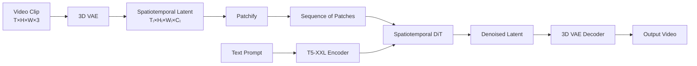
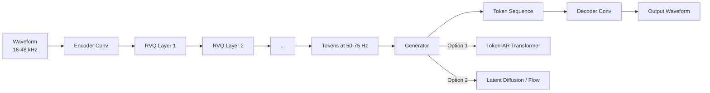
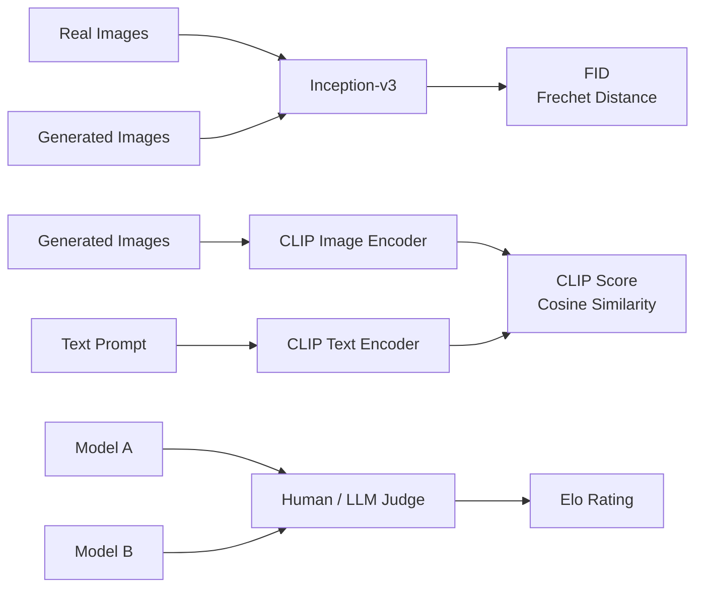
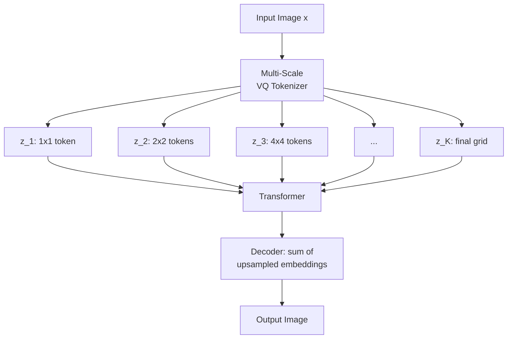

# Video/Audio/3D Generation, Flows & Eval

> Combined lessons (6 parts), merged verbatim — no content removed.

**Type:** Combined

---

## Part 1 (ch165): Video Generation

> An image is a 2-D tensor. A video is a 3-D one. The theory is the same; the compute is 10-100x harder. OpenAI's Sora (Feb 2024) proved it was possible. By 2026 Veo 2, Kling 1.5, Runway Gen-3, Pika 2.0, and WAN 2.2 ship production video from text at 1080p — and the open-weights stack (CogVideoX, HunyuanVideo, Mochi-1, WAN 2.2) is 12 months behind.

**Type:** Build
**Languages:** Python
**Prerequisites:** Phase 8 · 07 (Latent Diffusion), Phase 7 · 09 (ViT), Phase 8 · 06 (DDPM)
**Time:** ~45 minutes

## The Problem

A 10-second 1080p video at 24fps is 240 frames of 1920×1080×3 pixels. That's ~1.5 GB of raw data per clip. Pixel-space diffusion is infeasible. You need:

1. **Spatiotemporal compression.** A VAE that encodes videos, not frames, into a sequence of spatial-temporal patches.
2. **Temporal coherence.** Frames need to share content, lighting, and object identity over seconds.
3. **Compute budget.** Video training is 10-100x more expensive than image for the same model size.
4. **Conditioning.** Text, image (first-frame), audio, or another video.

The architecture that solved this is the **Diffusion Transformer (DiT)** applied to spatiotemporal patches, trained on huge (prompt, caption, video) datasets.

## The Concept



### Patchify

Encode the video with a 3D VAE. The latent is shape `[T_latent, H_latent, W_latent, C_latent]`. Split into patches of size `[t_p, h_p, w_p]`. A 10-second 1080p video compresses to ~20,000-100,000 patches.

### Spatiotemporal DiT

A transformer processes the flat sequence of patches. Each patch has a 3D positional embedding (time + y + x). Attention is usually factorized:

- **Spatial attention** within each frame's patches.
- **Temporal attention** across frames at the same spatial location.
- **Full 3D attention** is 16-100x more expensive; used only at low resolution.

### Text Conditioning

Cross-attention with a large text encoder (T5-XXL for Sora, CogVideoX-5B uses T5-XXL). Long prompts matter — Sora's training set had GPT-generated dense re-captions averaging 200 tokens per clip.

### Training

Standard diffusion loss (ε or v prediction) over spatiotemporal latents. Data: web video + ~100M curated clips + synthetic text captions. Compute: 10,000+ GPU hours for even a small research run; Sora-scale is 100,000+.

## The 2026 Production Landscape

| Model | Date | Max duration | Max res | Open weights? | Notable |
|-------|------|--------------|---------|---------------|---------|
| Sora (OpenAI) | 2024-02 | 60s | 1080p | No | First model to show world simulator properties at scale |
| Sora Turbo | 2024-12 | 20s | 1080p | No | Production Sora at 5x faster inference |
| Veo 2 (Google) | 2024-12 | 8s | 4K | No | Highest quality + physics in 2025 |
| Kling 1.5 / 2.1 | 2024-2025 | 10s | 1080p | No | Best human motion in 2025 Q1 |
| Runway Gen-3 Alpha | 2024-06 | 10s | 768p | No | Professional video tools on top |
| CogVideoX (THUDM) | 2024 | 10s | 720p | Yes (2B, 5B) | First open 5B-scale video |
| HunyuanVideo (Tencent) | 2024-12 | 5s | 720p | Yes (13B) | Open SOTA late 2024 |
| Mochi-1 (Genmo) | 2024-10 | 5.4s | 480p | Yes (10B) | Most permissively licensed |
| WAN 2.2 (Alibaba) | 2025-07 | 5s | 720p | Yes | Strongest open model mid-2025 |

## Build It

`code/main.py` simulates the core spatiotemporal DiT idea: patchify a small synthetic video, add a per-patch position embedding, and denoise the whole sequence with a transformer-style attention over patches.

### Step 1: patchify a synthetic 1-D "video"

```python
def make_video(T_frames=8, rng=None):
    # a "video" is a sequence of 1-D values following a smooth trajectory
    base = rng.gauss(0, 1)
    return [base + 0.3 * t + rng.gauss(0, 0.1) for t in range(T_frames)]
```

### Step 2: position embedding per frame

```python
def pos_embed(t, dim):
    return sinusoidal(t, dim)
```

### Step 3: denoiser sees the whole sequence

Instead of denoising each frame independently, our tiny net concatenates all frame values + their position embeddings and predicts the noise for all frames jointly.

### Step 4: temporal coherence test

```python
def frame_deltas(video):
    return [abs(video[i + 1] - video[i]) for i in range(len(video) - 1)]
```

After training, sample a video. Measure the frame-to-frame delta. If the model has learned temporal structure, the deltas stay smaller than sampling each frame independently.

## Pitfalls

- **Independent per-frame sampling = flicker.** Video diffusion fixes this by coupling the frames through attention or shared noise.
- **Naive 3D attention = OOM.** Factorize into spatial + temporal.
- **Data captioning matters more than size.** Sora's main upgrade was training on ~10x more detailed captions.
- **First-frame conditioning.** Most production models also accept an image as the first frame.
- **Physics drift.** Long clips (>10s) accumulate subtle inconsistencies.

## Use It — 2026 Picks

| Use case | 2026 pick |
|----------|-----------|
| Highest-quality text-to-video, hosted | Veo 3 or Sora |
| Camera-controlled cinematic | Runway Gen-3 with motion brushes |
| Character consistency across clips | Pika 2.0 or Kling 2.1 |
| Open weights, fast fine-tune | WAN 2.2 + LoRA |
| Image-to-video | WAN 2.2-I2V, Kling 2.1 I2V, or Runway |
| Audio-to-video lip sync | Veo 3 (native audio) or a dedicated lip-sync model |

## Production Note

A 10-second 1080p clip at 24 fps is 240 frames × 1920 × 1080 × 3 ≈ 1.5 GB of raw pixels. After a 4× video VAE compression the latent is ~100 MB per request. Run this through a spatiotemporal DiT for 30 steps at batch 1 and you are moving ~3 GB/step through HBM — memory bandwidth, not FLOPs, is the bottleneck.

- **TP across the DiT.** Text-to-video models are routinely ≥10B params. TP=4 across 4 H100s is standard.
- **Frame batching = continuous batching.** At generation time, video is conceptually a batch of frames linked by attention.
- **Clip-level prefill cache.** For image-to-video, the first-frame conditioning is analogous to an LLM's prompt prefill.

## Key Terms

| Term | What people say | What it actually means |
|------|-----------------|-----------------------|
| Video VAE | "3-D VAE" | Encoder that compresses `(T, H, W, C)` → spatiotemporal latent. |
| Patches | "The tokens" | Fixed-size 3-D blocks of the latent; input to the DiT. |
| Factorized attention | "Spatial + temporal" | Run attention over space, then over time; skip full 3-D attention. |
| Image-to-video (I2V) | "Animate this photo" | Model takes an image + text, outputs a video that starts from it. |
| Keyframe conditioning | "Anchor frames" | Pin specific frames to control the video's arc. |
| Motion brush | "Directional hint" | UI input where the user paints motion vectors onto the image. |
| Flicker | "Temporal artifact" | Frame-to-frame inconsistency; fixed with coupled denoising. |

## Exercises

1. **Easy.** In `code/main.py`, compare frame-to-frame delta for (a) independent per-frame sampling, (b) joint sequence sampling.
2. **Medium.** Add a first-frame condition: pin frame 0 to a given value and sample the rest.
3. **Hard.** Use HuggingFace diffusers to run CogVideoX-2B on a local GPU. Time 20 inference steps at 720p for a 6-second clip. Profile the spatiotemporal attention.

## Further Reading

- [Brooks et al. (2024). Video generation models as world simulators](https://openai.com/index/video-generation-models-as-world-simulators/)
- [Yang et al. (2024). CogVideoX: Text-to-Video Diffusion Models with An Expert Transformer](https://arxiv.org/abs/2408.06072)
- [Kong et al. (2024). HunyuanVideo: A Systematic Framework for Large Video Generative Models](https://arxiv.org/abs/2412.03603)
- [Ho, Salimans, Gritsenko et al. (2022). Video Diffusion Models](https://arxiv.org/abs/2204.03458)
- [Blattmann et al. (2023). Align your Latents (Video LDM)](https://arxiv.org/abs/2304.08818)

[Reference](https://github.com/rohitg00/ai-engineering-from-scratch/tree/main/phases/08-generative-ai/10-video-generation)

---

## Part 2 (ch166): Audio Generation

> Audio is a 1-D signal at 16-48 kHz. A five-second clip is 80-240k samples. No transformer attends to that sequence directly. The solution for every production audio model in 2026 is the same: a neural codec (Encodec, SoundStream, DAC) compresses audio to discrete tokens at 50-75 Hz, and a transformer or diffusion model generates tokens.

**Type:** Build
**Languages:** Python
**Prerequisites:** Phase 6 · 02 (Audio Features), Phase 6 · 04 (ASR), Phase 8 · 06 (DDPM)
**Time:** ~45 minutes

## The Problem

Three audio generation tasks:

1. **Text-to-speech.** Given text, produce speech. Clean speech is narrow-band and has strong phonetic structure — solved well by transformer-over-tokens.
2. **Music generation.** Given a prompt (text, melody, chord progression, genre), produce music. Much broader distribution.
3. **Audio effects / sound design.** Given a prompt, produce ambient sound or Foley.

All three run on the same substrate: neural audio codec + token-AR or diffusion generator.

## The Concept



### Neural Audio Codecs

Encodec (Meta, 2022), SoundStream (Google, 2021), Descript Audio Codec (DAC, 2023). A convolutional encoder compresses waveform to a per-timestep vector; residual vector quantization (RVQ) converts each vector to a cascade of K codebook indices.

```
waveform (16000 samples/sec)
    └─ encoder conv ─┐
                     ├─ RVQ layer 1 → indices at 75 Hz
                     ├─ RVQ layer 2 → indices at 75 Hz
                     ├─ ...
                     └─ RVQ layer 8
```

### Two Generative Paradigms on Top

**Token-autoregressive.** Flatten RVQ tokens into a sequence, run a decoder-only transformer. MusicGen uses "delayed parallel" to emit K codebook streams in parallel with per-stream offsets. VALL-E generates speech tokens from a text prompt + 3-second voice sample.

**Latent diffusion.** Pack codec tokens as continuous latents or model them with categorical diffusion. Stable Audio 2.5 uses flow matching on continuous audio latents. AudioLDM 2 uses text-to-mel-to-audio diffusion.

The 2024-2026 trend: flow matching is winning for music (faster inference, cleaner samples) while token-AR still dominates speech because it is naturally causal and streams well.

## Production Landscape

| System | Task | Backbone | Latency |
|--------|------|----------|---------|
| ElevenLabs V3 | TTS | Token-AR + neural vocoder | ~300ms first token |
| OpenAI GPT-4o audio | Full-duplex speech | End-to-end multimodal AR | ~200ms |
| NaturalSpeech 3 | TTS | Latent flow matching | Non-streaming |
| Stable Audio 2.5 | Music / SFX | DiT + flow matching on audio latents | ~10s for 1-minute clip |
| Suno v4 | Full songs | Undisclosed; token-AR suspected | ~30s per song |
| MusicGen 3.3B | Music | Token-AR on Encodec 32kHz | Real-time |
| AudioCraft 2 | Music + SFX | Flow matching | ~5s for 5s clip |

## Build It

`code/main.py` simulates the core idea: train a tiny next-token transformer on synthetic "audio token" sequences generated from two distinct "styles".

### Step 1: synthetic audio tokens

```python
def make_tokens(style, length, vocab_size, rng):
    if style == 0:  # "speech-like": alternating
        return [i % vocab_size for i in range(length)]
    # "music-like": ramp
    return [(i * 3) % vocab_size for i in range(length)]
```

### Step 2: train a tiny token predictor

A bigram-style predictor conditioned on style. The point is the pattern: codec tokens → cross-entropy training → autoregressive sampling.

```python
def init_counts():
    return [[[1.0 for _ in range(VOCAB)] for _ in range(VOCAB)] for _ in range(NUM_STYLES)]

def update_counts(counts, sequence, style):
    for i in range(len(sequence) - 1):
        counts[style][sequence[i]][sequence[i + 1]] += 1.0
```

### Step 3: sample conditionally

Given the style token and a starting token, sample the next token from the predicted distribution.

```python
def generate(counts, style, start, length, rng, temperature=1.0):
    out = [start]
    for _ in range(length - 1):
        p = probs(counts, style, out[-1])
        if temperature != 1.0:
            p = [pi ** (1 / temperature) for pi in p]
            total = sum(p)
            p = [x / total for x in p]
        out.append(sample_from(p, rng))
    return out
```

## Pitfalls

- **Codec quality caps output quality.** If the codec can't represent a sound faithfully, no amount of generator quality helps. DAC is the current open best.
- **RVQ error accumulation.** Each RVQ layer models the residual of the previous. Errors on layer 1 propagate.
- **Musical structure.** 30 seconds of tokens is 20k+ tokens at 75 Hz. Hard for transformers.
- **Clean-data appetite.** Music generators need tens of thousands of hours of licensed music.
- **Voice cloning ethics.** A 3-second sample plus a text prompt is enough for VALL-E / XTTS / ElevenLabs to clone a voice.

## Use It — 2026 Stack

| Task | 2026 stack |
|------|------------|
| Commercial TTS | ElevenLabs, OpenAI TTS, or Azure Neural |
| Voice cloning (consent-verified) | XTTS v2 (open) or ElevenLabs Pro |
| Background music, fast | Stable Audio 2.5 API, Suno, or Udio |
| Music with lyrics | Suno v4 or Udio v1.5 |
| Sound effects / Foley | AudioCraft 2, ElevenLabs SFX, or Stable Audio Open |
| Real-time voice agent | GPT-4o realtime or Gemini Live |
| Open-weights music research | MusicGen 3.3B, Stable Audio Open 1.0, AudioLDM 2 |

## Production Note

Audio is the one output modality users expect to arrive *as it is generated*, not all-at-once. For 16kHz audio tokenized at ~75 tokens/second (Encodec), the server must generate ≥75 tokens/sec per user to keep playback smooth.

- **Flow-matching audio models cannot stream trivially.** Stable Audio 2.5 and AudioCraft 2 render a fixed clip length in one pass. To stream, you chunk the clip and overlap boundaries, adding 100-300ms of latency overhead vs a codec AR model.
- If the product is "live voice chat" or "real-time music continuation", pick the codec AR path. If it is "render a 30-second clip on submit", flow-matching wins on quality and total latency.

## Key Terms

| Term | What people say | What it actually means |
|------|-----------------|-----------------------|
| Codec | "Neural compression" | Encoder / decoder for audio; typical output is 50-75 Hz tokens. |
| RVQ | "Residual VQ" | Cascade of K quantizers; each models the residual of the previous. |
| Token | "One codec symbol" | Discrete index into a codebook; 1024 or 2048 typical. |
| Delayed parallel | "Offset codebooks" | Emit K token streams with staggered offsets to reduce sequence length. |
| Flow matching | "The 2024 win for audio" | Straighter-path alternative to diffusion; faster sampling. |
| Voice prompt | "3-second sample" | Speaker embedding or token prefix that steers the cloned voice. |
| Mel spectrogram | "The visual" | Log-magnitude perceptual spectrogram; used by many TTS systems. |
| Vocoder | "Mel to wave" | Neural component that converts mel spectrograms back to audio. |

## Exercises

1. **Easy.** Run `code/main.py` and set style explicitly. Verify the generated sequences match the style's pattern.
2. **Medium.** Add delayed parallel decoding: simulate 2 streams of tokens that must stay offset by 1 step.
3. **Hard.** Use HuggingFace transformers to run MusicGen-small locally. Generate a 10-second clip with three different prompts; A/B for style adherence.

## Further Reading

- [Défossez et al. (2022). Encodec: High Fidelity Neural Audio Compression](https://arxiv.org/abs/2210.13438)
- [Zeghidour et al. (2021). SoundStream](https://arxiv.org/abs/2107.03312)
- [Kumar et al. (2023). High-Fidelity Audio Compression with Improved RVQGAN (DAC)](https://arxiv.org/abs/2306.06546)
- [Wang et al. (2023). Neural Codec Language Models are Zero-Shot Text to Speech Synthesizers (VALL-E)](https://arxiv.org/abs/2301.02111)
- [Copet et al. (2023). Simple and Controllable Music Generation (MusicGen)](https://arxiv.org/abs/2306.05284)
- [Liu et al. (2023). AudioLDM 2: Learning Holistic Audio Generation with Self-supervised Pretraining](https://arxiv.org/abs/2308.05734)

[Reference](https://github.com/rohitg00/ai-engineering-from-scratch/tree/main/phases/08-generative-ai/11-audio-generation)

---

## Part 3 (ch167): 3D Generation

> 3D is the modality where 2D-to-3D leverage is strongest. The 2023 breakthrough was 3D Gaussian Splatting. The 2024-2026 generative push layers multi-view diffusion + 3D reconstruction on top to produce objects and scenes from a single prompt or photo.

**Type:** Learn
**Languages:** Python
**Prerequisites:** Phase 4 (Vision), Phase 8 · 07 (Latent Diffusion)
**Time:** ~45 minutes

## The Problem

3D content is painful:

- **Representation.** Meshes, point clouds, voxel grids, signed distance fields (SDFs), neural radiance fields (NeRFs), 3D Gaussians. Each has trade-offs.
- **Data scarcity.** ImageNet has 14M images. The largest clean 3D dataset (Objaverse-XL, 2023) has ~10M objects, most low quality.
- **Memory.** A 512³ voxel grid is 128M voxels; a useful scene NeRF needs 1M samples/ray.
- **Supervision.** For a 2D image you have the pixels. For 3D you usually have a handful of 2D views and have to lift to 3D.

The 2026 stack separates the two problems. First, generate *2D multi-view images* with a diffusion model. Second, fit a *3D representation* (usually Gaussian splatting) to those images.

## The Concept


### Representation: 3D Gaussian Splatting (Kerbl et al., 2023)

Represent a scene as a cloud of ~1M 3D Gaussians. Each has 59 parameters: position (3), covariance (6, or quaternion 4 + scale 3), opacity (1), spherical-harmonics color (48 at degree 3, 3 at degree 0).

Rendering = projection + alpha-compositing. Fast (~100 fps at 1080p on a 4090). Differentiable. Fit by gradient descent against ground-truth photos. A scene fits in 5-30 minutes on a consumer GPU.

Two 2023-2024 innovations on top:
- **Generative Gaussian splats.** Models like LGM, LRM, InstantMesh predict a Gaussian cloud directly from one or a few images.
- **4D Gaussian Splatting.** Gaussians with per-frame offsets for dynamic scenes.

### Multi-View Diffusion

Fine-tune a pretrained image diffusion model to generate multiple consistent views of the same object from a text prompt or single image. Zero123 (Liu et al., 2023), MVDream (Shi et al., 2023), SV3D (Stability, 2024), CAT3D (Google, 2024). Usually output 4-16 views around the object, lifted to 3D via Gaussian splatting or NeRF.

### Text-to-3D Pipelines

| Model | Input | Output | Time |
|-------|-------|--------|------|
| DreamFusion (2022) | text | NeRF via SDS | ~1 hour per asset |
| Magic3D | text | mesh + texture | ~40 min |
| Shap-E (OpenAI, 2023) | text | implicit 3D | ~1 min |
| LRM (Meta, 2023) | image | triplane | ~5 s |
| InstantMesh (2024) | image | mesh | ~10 s |
| SV3D (Stability, 2024) | image | novel views | ~2 min |
| CAT3D (Google, 2024) | 1-64 images | 3D NeRF | ~1 min |
| TripoSR (2024) | image | mesh | ~1 s |
| Meshy 4 (2025) | text + image | PBR mesh | ~30 s |
| Tencent Hunyuan3D 2.0 (2025) | image | mesh | ~30 s |

## Build It

`code/main.py` implements a toy 2D "Gaussian splatting" fit: represent a synthetic target image (a smooth gradient) as a sum of 2D Gaussian splats.

### Step 1: 2D Gaussian splat

```python
def gaussian_at(x, y, gaussian):
    px, py = gaussian["pos"]
    sigma = gaussian["sigma"]
    d2 = (x - px) ** 2 + (y - py) ** 2
    return math.exp(-d2 / (2 * sigma * sigma))
```

### Step 2: render by summing splats

```python
def render(image_size, gaussians):
    img = [[0.0] * image_size for _ in range(image_size)]
    for g in gaussians:
        for y in range(image_size):
            for x in range(image_size):
                img[y][x] += g["color"] * gaussian_at(x, y, g)
    return img
```

### Step 3: fit by gradient descent

```python
for step in range(steps):
    pred = render(size, gaussians)
    loss = mse(pred, target)
    gradients = compute_grads(pred, target, gaussians)
    update(gaussians, gradients, lr)
```

## Pitfalls

- **View inconsistency.** If you generate 4 views independently and they disagree about object structure, the 3D fit is blurry. Fix: multi-view diffusion with shared attention.
- **Back-side hallucination.** Single-image → 3D has to invent the unseen side. Quality varies wildly.
- **Gaussian splat explosion.** Unconstrained training grows to 10M splats and overfits. Densification + pruning heuristics are essential.
- **Topology issues.** Meshes from implicit fields often have holes or self-intersections.
- **License of training data.** Objaverse has mixed licenses; commercial use varies per model.

## Use It — 2026 Picks

| Task | 2026 pick |
|------|-----------|
| Scene reconstruction from photos | Gaussian splatting (3DGS, Gsplat, Scaniverse) |
| Text-to-3D object for games | Meshy 4 or Rodin Gen-1.5 (PBR output) |
| Image-to-3D | Hunyuan3D 2.0, TripoSR, InstantMesh |
| Novel-view synthesis from few images | CAT3D, SV3D |
| Dynamic scene reconstruction | 4D Gaussian Splatting |
| Avatar / clothed human | Gaussian Avatar, HUGS |

## Production Note

3D has no single dominant runtime in 2026. The production decision tree forks on the representation:

- **NeRF / triplane.** Inference is ray-marching + an MLP forward per sample. Batch the ray samples aggressively.
- **Multi-view diffusion + LRM reconstruction.** Two-stage pipeline. Stage 1 (multi-view DiT) is a diffusion server. Stage 2 (LRM transformer) is a one-shot forward pass.
- **SDS / DreamFusion.** Per-asset optimization, not inference. Build jobs, not request handlers.

For most 2026 products, the right answer is "run a multi-view diffusion model on request, reconstruct to 3DGS asynchronously, serve the 3DGS for real-time viewing".

## Key Terms

| Term | What people say | What it actually means |
|------|-----------------|-----------------------|
| 3D Gaussian Splatting | "3DGS" | Scene as a cloud of 3D Gaussians; differentiable alpha-composite render. |
| NeRF | "Neural radiance field" | MLP that outputs color + density at a 3D point; render by ray integration. |
| Triplane | "Three 2-D planes" | Factor 3D into three 2-D axis-aligned feature grids. |
| SDS | "Score distillation sampling" | Train 3D model by using 2D-diffusion score as pseudo-gradient. |
| Multi-view diffusion | "Many views at once" | Diffusion model that outputs a batch of consistent camera views. |
| PBR | "Physically-based rendering" | Material with albedo, roughness, metallic, normal channels. |
| Densification | "Grow splats" | 3DGS training heuristic: split / clone splats in high-gradient regions. |

## Exercises

1. **Easy.** Run `code/main.py` with 4, 16, 64 Gaussians. Report final MSE vs target.
2. **Medium.** Extend to color Gaussians (RGB). Confirm reconstruction matches the target color pattern.
3. **Hard.** Using gsplat or Nerfstudio, reconstruct a real object from a 50-photo capture. Report fit time and final SSIM on held-out views.

## Further Reading

- [Mildenhall et al. (2020). NeRF: Representing Scenes as Neural Radiance Fields](https://arxiv.org/abs/2003.08934)
- [Kerbl et al. (2023). 3D Gaussian Splatting for Real-Time Radiance Field Rendering](https://arxiv.org/abs/2308.04079)
- [Poole et al. (2022). DreamFusion: Text-to-3D using 2D Diffusion](https://arxiv.org/abs/2209.14988)
- [Liu et al. (2023). Zero-1-to-3: Zero-shot One Image to 3D Object](https://arxiv.org/abs/2303.11328)
- [Shi et al. (2023). MVDream](https://arxiv.org/abs/2308.16512)
- [Hong et al. (2023). LRM: Large Reconstruction Model for Single Image to 3D](https://arxiv.org/abs/2311.04400)
- [Gao et al. (2024). CAT3D: Create Anything in 3D with Multi-View Diffusion Models](https://arxiv.org/abs/2405.10314)

[Reference](https://github.com/rohitg00/ai-engineering-from-scratch/tree/main/phases/08-generative-ai/12-3d-generation)

---

## Part 4 (ch168): Flow Matching & Rectified Flows

> Diffusion models take 20-50 sampling steps because they walk a curved path from noise to data. Flow matching (Lipman et al., 2023) and rectified flow (Liu et al., 2022) trained straight paths. Straighter paths mean fewer steps mean faster inference. Stable Diffusion 3, Flux.1, and AudioCraft 2 all switched to flow matching in 2024.

**Type:** Build
**Languages:** Python
**Prerequisites:** Phase 8 · 06 (DDPM), Phase 1 · Calculus
**Time:** ~45 minutes

## The Problem

DDPM's reverse process is a 1000-step stochastic walk from `N(0, I)` back to the data distribution. DDIM collapsed it to 20-50 deterministic steps. You want fewer steps — ideally one. The blocker is that the ODE solving the reverse process is stiff; the path is curved.

If you could train the model such that the path from noise to data was a *straight line*, a single Euler step from `t=1` to `t=0` would work. Flow matching builds this directly: define a straight-line interpolation from `x_1 ∼ N(0, I)` to `x_0 ∼ data`, train a vector field `v_θ(x, t)` to match its time derivative, integrate at inference.

Rectified flow (Liu 2022) goes further: iteratively straighten the paths with a reflow procedure that produces a progressively closer-to-linear ODE. After two reflow iterations, a 2-step sampler matches 50-step DDPM quality.

## The Concept

```mermaid
graph LR
    A[x₁ ~ N0, I] -- t=1 --> B[Straight Line<br>x_t = (1-t)·x₀ + t·x₁]
    B -- t=0 --> C[x₀ ~ Data]
    B --> D[v_θ(x_t, t)]
    D --> E[Target: x₁ - x₀]
    A -- ODE solve --> F[Learned Vector Field]
    F -- 1 step --> C
```

### Straight-Line Flow

Define:

```
x_t = t · x_1 + (1 - t) · x_0,   t ∈ [0, 1]
```

where `x_0 ~ data` and `x_1 ~ N(0, I)`. The time derivative along this straight line is constant:

```
dx_t / dt = x_1 - x_0
```

Define a neural vector field `v_θ(x_t, t)` and train it to match this derivative:

```
L = E_{x_0, x_1, t} || v_θ(x_t, t) - (x_1 - x_0) ||²
```

This is the **conditional flow matching** loss (Lipman 2023). Training is simulation-free: you never unroll the ODE. Just sample `(x_0, x_1, t)` and regress.

### Sampling

At inference, integrate the learned vector field *backwards* in time:

```
x_{t-Δt} = x_t - Δt · v_θ(x_t, t)
```

Start at `x_1 ~ N(0, I)`, Euler-step down to `t=0`.

### Rectified Flow (Liu 2022)

1. Train flow model v_1 with random pairings.
2. Sample N pairs `(x_1, x_0)` by integrating v_1 from `x_1` to its landing `x_0`.
3. Train v_2 on those paired examples. Because the pairs are now "ODE-matched", the straight-line interpolant between them is genuinely flatter.
4. Repeat.

In practice 2 reflow iterations get you to near-linear, enabling 2-4 step inference.

### Why This Won for Images in 2024

1. **Simulation-free training** — no ODE unrolling during training, trivial to implement.
2. **Better loss geometry** — straight paths have consistent signal-to-noise.
3. **Faster inference** — 4-8 steps at SDXL-Turbo quality; 1 step with consistency distillation.

## Flow Matching vs DDPM

Flow matching with a Gaussian-conditional path is diffusion *with a specific noise schedule*. Pick the `x_t = α(t) x_0 + σ(t) x_1` schedule and flow matching recovers Stratonovich-reformulated diffusion with `v = α'·x_0 - σ'·x_1`. The two are algebraically equivalent for Gaussian paths.

What flow matching added: the *clarity* of the target (a plain velocity), a cleaner loss, and the license to experiment with non-Gaussian interpolants.

## Build It

`code/main.py` implements 1-D flow matching on a two-mode Gaussian mixture. The vector field `v_θ(x, t)` is a tiny MLP trained with the straight-line target.

### Step 1: training loss

```python
def train_step(x0, net, rng, lr):
    x1 = rng.gauss(0, 1)
    t = rng.random()
    x_t = t * x1 + (1 - t) * x0
    target = x1 - x0
    pred = net_forward(x_t, t)
    loss = (pred - target) ** 2
    # backprop + update
```

### Step 2: multi-step inference

```python
def sample(net, num_steps):
    x = rng.gauss(0, 1)
    for i in range(num_steps):
        t = 1.0 - i / num_steps
        dt = 1.0 / num_steps
        x -= dt * net_forward(x, t)
    return x
```

### Step 3: compare step counts

Expect the 4-step sampler to already match the 20-step quality — a big deal for latency.

## Pitfalls

- **Time parameterization.** Flow matching uses `t ∈ [0, 1]` with `t=0` at data, `t=1` at noise. DDPM uses `t ∈ [0, T]`.
- **Schedule choice.** Rectified flow's straight line is "the" flow-matching schedule, but you can use cosine or logit-normal t-sampling (SD3 does this) for better scale coverage.
- **Reflow cost.** Generating the paired dataset for reflow is a full inference pass per sample.
- **Classifier-free guidance still applies.** Just swap ε for v: `v_cfg = (1+w) v_cond - w v_uncond`.

## Use It — 2026 Stack

| Use case | 2026 stack |
|----------|-----------|
| Text-to-image, best quality | Flow matching: SD3, Flux.1-dev |
| Text-to-image, 1-4 steps | Distilled flow matching: Flux.1-schnell, SD3-Turbo, SDXL-Turbo |
| Real-time inference | Consistency distillation from a flow-matched base (LCM, PCM) |
| Audio generation | Flow matching: Stable Audio 2.5, AudioCraft 2 |
| Video generation | Flow matching mixed with diffusion (Sora, Veo, Stable Video) |
| Science / physics | Flow matching + equivariant vector field |

## Production Note

Flux.1-schnell — a flow-matched DiT distilled to 1-4 inference steps while keeping Flux-dev-grade quality.

| Variant | Steps | Latency at 1024² on L4 | Total FLOPs (relative) |
|---------|-------|------------------------|------------------------|
| Flux.1-dev (raw) | 50 | ~15 s | 1.0× |
| Flux.1-schnell | 4 | ~1.2 s | 0.08× (12× faster) |
| SDXL-base | 30 | ~4 s | 0.25× |
| SDXL-Lightning 2-step | 2 | ~0.3 s | 0.03× |

The production rule: **flow-matched base + distillation = the 2026 default for fast text-to-image.**

## Key Terms

| Term | What people say | What it actually means |
|------|-----------------|-----------------------|
| Flow matching | "Straight-line diffusion" | Train `v_θ(x, t)` to match `x_1 - x_0` along an interpolant. |
| Rectified flow | "Reflow" | Iterative procedure that straightens learned flows. |
| Velocity field | "v_θ" | Output of the model — the direction to move `x_t`. |
| Straight-line interpolant | "The path" | `x_t = (1-t)·x_0 + t·x_1`; trivial target derivative. |
| Euler sampler | "1st order ODE solver" | Simplest integrator; works well when paths are straight. |
| Logit-normal t | "SD3 sampling" | Concentrate `t` sampling toward mid-values where gradients are strongest. |
| Consistency distillation | "1-step sampler" | Train a student to map any `x_t` directly to `x_0`. |
| CFG with velocity | "v-CFG" | `v_cfg = (1+w) v_cond - w v_uncond`; same trick, new variable. |

## Exercises

1. **Easy.** Run `code/main.py` and compare 1-step vs 20-step MSE vs the true data distribution.
2. **Medium.** Switch from uniform `t` sampling to logit-normal (concentrates sampling at mid-t). Does the model quality improve?
3. **Hard.** Implement one reflow iteration: generate paired (x_0, x_1) by integrating the first model, train a second model on the pairs, and compare 1-step sample quality.

## Further Reading

- [Liu, Gong, Liu (2022). Flow Straight and Fast: Learning to Generate and Transfer Data with Rectified Flow](https://arxiv.org/abs/2209.03003)
- [Lipman et al. (2023). Flow Matching for Generative Modeling](https://arxiv.org/abs/2210.02747)
- [Esser et al. (2024). Scaling Rectified Flow Transformers for High-Resolution Image Synthesis](https://arxiv.org/abs/2403.03206)
- [Albergo, Vanden-Eijnden (2023). Stochastic Interpolants](https://arxiv.org/abs/2303.08797)
- [Song et al. (2023). Consistency Models](https://arxiv.org/abs/2303.01469)
- [Sauer et al. (2023). Adversarial Diffusion Distillation (SDXL-Turbo)](https://arxiv.org/abs/2311.17042)

[Reference](https://github.com/rohitg00/ai-engineering-from-scratch/tree/main/phases/08-generative-ai/13-flow-matching-rectified-flows)

---

## Part 5 (ch169): Evaluation — FID, CLIP Score, Human Preference

> Every generative model leaderboard cites FID, CLIP score, and a win rate from a human-preference arena. Each number has a failure mode a determined researcher can game. If you do not know the failure modes, you cannot tell a real improvement from a gaming run.

**Type:** Build
**Languages:** Python
**Prerequisites:** Phase 8 · 01 (Taxonomy), Phase 2 · 04 (Evaluation Metrics)
**Time:** ~45 minutes

## The Problem

A generative model is judged on *sample quality* and *conditioning adherence*. Neither has a closed-form measure. Your model has to render 10,000 images; something has to assign them numbers; you have to trust the numbers across model families, across resolutions, across architectures. Three metrics survived the 2014-2026 gauntlet:

- **FID (Frechet Inception Distance).** A distance between two distributions — real and generated — in an Inception network's feature space. Lower is better.
- **CLIP score.** Cosine similarity between a generated image's CLIP-image embedding and a prompt's CLIP-text embedding. Higher is better.
- **Human preference.** Pit two models head-to-head on the same prompt, have humans (or a GPT-4-class model) pick the better one, aggregate to an Elo score.

## The Concept



### FID — Sample Quality

Heusel et al. (2017). Steps:
1. Extract Inception-v3 features (2048-D) for N real images and N generated.
2. Fit a Gaussian to each pool: compute mean `mu_r, mu_g` and covariance `Sigma_r, Sigma_g`.
3. FID = `||mu_r - mu_g||^2 + Tr(Sigma_r + Sigma_g - 2 * sqrt(Sigma_r * Sigma_g))`.

Failure modes:
- **Biased on small N.** Always use N >= 10,000.
- **Inception-dependent.** Inception-v3 was trained on ImageNet. Domains far from ImageNet produce meaningless FID.
- **Gaming.** Overfitting to the Inception prior gives low FID without visual quality improvement.

### CLIP Score — Prompt Adherence

For a generated image + prompt:

```
clip_score = cos_sim( CLIP_image(x_gen), CLIP_text(prompt) )
```

Failure modes:
- **CLIP's own blind spots.** Weak compositional reasoning.
- **Short prompt bias.** Short prompts have more matches.
- **Prompt gaming.** Including "high quality, 4k, masterpiece" inflates CLIP score.

### Human Preference — The Ground Truth

Pick a pool of prompts. Generate with model A and model B. Show pairs to humans (or a strong LLM judge). Aggregate wins into an Elo or Bradley-Terry score.

Benchmarks: **PartiPrompts** (Google, 1,600 diverse prompts), **HPSv2** (107k human annotations), **ImageReward** (137k preference pairs), **PickScore** (2.6M preferences).

Failure modes:
- **Judge variance.** Non-experts have different preferences than experts.
- **Prompt distribution.** Cherry-picked prompts favor one family.
- **LLM-judge reward hacking.** GPT-4-judge gets fooled by pretty-but-wrong outputs.

## Build It

`code/main.py` implements FID, CLIP-score-like, and Elo aggregation on synthetic "feature vectors".

### Step 1: FID in four lines

```python
def fid(real_features, gen_features):
    mu_r, cov_r = mean_and_cov(real_features)
    mu_g, cov_g = mean_and_cov(gen_features)
    mean_diff = sum((a - b) ** 2 for a, b in zip(mu_r, mu_g))
    trace_term = trace(cov_r) + trace(cov_g) - 2 * sqrt_cov_product(cov_r, cov_g)
    return mean_diff + trace_term
```

### Step 2: CLIP-style cosine-similarity

```python
def clip_like(image_feat, text_feat):
    dot = sum(a * b for a, b in zip(image_feat, text_feat))
    norm = math.sqrt(dot_self(image_feat) * dot_self(text_feat))
    return dot / max(norm, 1e-8)
```

### Step 3: Elo aggregation

```python
def elo_update(r_a, r_b, winner, k=32):
    expected_a = 1 / (1 + 10 ** ((r_b - r_a) / 400))
    actual_a = 1.0 if winner == "a" else 0.0
    r_a_new = r_a + k * (actual_a - expected_a)
    r_b_new = r_b - k * (actual_a - expected_a)
    return r_a_new, r_b_new
```

## Pitfalls

- **FID at N=1000.** Heuristic is unreliable under N=10k. Papers reporting low-N FID are gaming.
- **Comparing FID across resolutions.** Inception's 299x299 resize changes the feature distribution.
- **Reporting one seed.** Run 3 seeds minimum. Report std.
- **CLIP score inflation via negative prompts.** Some pipelines boost CLIP by over-fitting the prompt.
- **Elo bias from prompt overlap.** If both models saw a benchmark prompt during training, Elo is meaningless.
- **Human eval paid-crowd skew.** Prolific, MTurk annotators skew younger / tech-friendly.

## Use It — Production Eval Protocol in 2026

| Pillar | Minimum | Recommended |
|--------|---------|-------------|
| Sample quality | FID on 10k vs held-out real | + CMMD on 5k + FID on subset per category |
| Prompt adherence | CLIP score on 30k | + HPSv2 + ImageReward + VQA-style question answering |
| Preference | 200 blinded pairs vs baseline | + 2000 paired human + LLM-judge + Chatbot Arena |
| Failure analysis | 50 hand-flagged | 500 hand-flagged + automated safety classifier |

All four pillars in one report = claim. Any one alone = marketing.

## Production Note

Running FID on 10k samples means generating 10k images. For a 50-step SDXL base at 1024^2 on a single L4, that is ~11 hours of single-request inference.

- **Batch hard, forget latency.** Offline eval = static batching at the largest size that fits in memory.
- **Cache the real features.** The Inception (FID) or CLIP (CLIP-score, CMMD) feature extraction over the real reference set is run *once*, stored as a `.npz`.

For CI / regression gates: run FID + CLIP score on a 500-sample subset per PR (~30 min); run full 10k FID + HPSv2 + Elo nightly.

## Key Terms

| Term | What people say | What it actually means |
|------|-----------------|-----------------------|
| FID | "Frechet Inception Distance" | Frechet distance of Gaussian fits to real vs gen Inception features. |
| CLIP score | "Text-image similarity" | Cosine similarity between CLIP image and text embeddings. |
| CMMD | "FID's replacement" | CLIP-feature MMD; less biased, no Gaussian assumption. |
| IS | "Inception score" | Exp KL(p(y|x) || p(y)); correlates poorly on modern models, retired. |
| HPSv2 / ImageReward / PickScore | "Learned preference proxies" | Small models trained on human preferences; used as automatic judges. |
| Elo | "Chess rating" | Bradley-Terry aggregation of pairwise wins. |
| PartiPrompts | "The benchmark prompt set" | 1,600 Google-curated prompts across 12 categories. |
| FD-DINO | "Self-sup replacement" | FD using DINOv2 features; better for out-of-ImageNet domains. |

## Exercises

1. **Easy.** Run `code/main.py`. Compare FID at N=100 vs N=1000 on the same synthetic distributions. Report bias magnitude.
2. **Medium.** Implement CMMD from synthetic CLIP-style features. Compare sensitivity to quality differences vs FID.
3. **Hard.** Replicate the HPSv2 setup: take 1000 image-prompt pairs from a subset of Pick-a-Pic, fine-tune a small CLIP-based scorer on the preferences, and measure its agreement with a held-out set.

## Further Reading

- [Heusel et al. (2017). GANs Trained by a Two Time-Scale Update Rule Converge to a Local Nash Equilibrium (FID)](https://arxiv.org/abs/1706.08500)
- [Jayasumana et al. (2024). Rethinking FID: Towards a Better Evaluation Metric for Image Generation (CMMD)](https://arxiv.org/abs/2401.09603)
- [Radford et al. (2021). Learning Transferable Visual Models from Natural Language Supervision (CLIP)](https://arxiv.org/abs/2103.00020)
- [Wu et al. (2023). HPSv2: A Comprehensive Human Preference Score](https://arxiv.org/abs/2306.09341)
- [Xu et al. (2023). ImageReward: Learning and Evaluating Human Preferences for Text-to-Image Generation](https://arxiv.org/abs/2304.05977)
- [Yu et al. (2023). Scaling Autoregressive Models for Content-Rich Text-to-Image Generation (Parti + PartiPrompts)](https://arxiv.org/abs/2206.10789)

[Reference](https://github.com/rohitg00/ai-engineering-from-scratch/tree/main/phases/08-generative-ai/14-evaluation-fid-clip-score)

---

## Part 6 (ch170): Visual Autoregressive Modeling (VAR): Next-Scale Prediction

> Diffusion models sample iteratively in time (denoising steps). VAR samples iteratively in scale — it predicts a 1x1 token, then 2x2, then 4x4, up to the final resolution, each scale conditioning on the previous. The 2024 paper showed VAR matches GPT-style scaling laws for image generation and beats DiT at the same compute budget. This lesson builds the core mechanism.

**Type:** Build
**Languages:** Python (with numpy)
**Prerequisites:** Phase 7 Lesson 03 (Multi-Head Attention), Phase 8 Lesson 06 (DDPM)
**Time:** ~90 minutes

## The Problem

Autoregressive generation dominated language modeling because it scales predictably: more compute, more parameters, lower perplexity, better outputs. Image generation had two main AR attempts before 2024: PixelRNN/PixelCNN (pixel-by-pixel) and DALL-E 1 / Parti / MuseGAN (token-by-token on VQ-VAE codes).

Both suffered from a generation-order problem. Pixels and tokens are arranged in a 2D grid, but the AR model has to visit them in a 1D raster order. An early corner pixel has no idea what the image eventually becomes. Generation quality scaled worse than GPT-on-text and never reached diffusion-model quality at matched compute.

VAR fixes the generation-order problem by changing what is being generated. Instead of predicting image tokens one by one in space, VAR predicts a whole image at increasing resolutions. Step 1: predict a 1x1 token (the overall image "summary"). Step 2: predict a 2x2 grid of tokens (coarser features). Step 3: predict a 4x4 grid. Step K: predict the final (H/8)x(W/8) grid.

Each scale attends to all previous scales (causally in "scale order") and parallel within its own scale. The order problem disappears: the whole image at scale k is produced in one transformer pass.

## The Concept



### VQ-VAE Multi-Scale Tokenizer

VAR needs a **multi-scale discrete tokenizer**. For an image x, it produces a sequence of progressively higher-resolution token grids:

```
x -> encoder -> latent f
f -> tokenize at 1x1: token grid z_1 of shape (1, 1)
f -> tokenize at 2x2: token grid z_2 of shape (2, 2)
...
f -> tokenize at (H/p)x(W/p): token grid z_K of shape (H/p, W/p)
```

Each z_k uses the same codebook (typical size 4096-16384). The tokenization at each scale is not independent — it is trained so that summing the residuals at each scale reconstructs f:

```
f approx = upsample(embed(z_1), target_size) + ... + upsample(embed(z_K), target_size)
```

This is a **residual VQ** variant. Scale k captures what scales 1..k-1 missed. Decoder takes the sum of all scale embeddings and produces the image.

### Next-Scale Prediction

The generative model is a transformer that sees tokens from all previous scales and predicts the tokens at the next scale.

Input sequence structure:
```
[START, z_1 tokens, z_2 tokens, z_3 tokens, ..., z_K tokens]
```

Position embeddings encode both scale index and spatial position within the scale. Attention is causal in scale order: token at scale k, position (i, j) can attend to all tokens at scales 1..k and to tokens at scale k itself.

Training loss: at each scale k, predict the tokens z_k given all prior-scale tokens. Cross-entropy loss on the discrete VQ codes. Same structure as GPT except the "sequence" is now scale-structured.

### Generation

At inference:
```
generate z_1 = sample from p(z_1)                    # 1 token
generate z_2 = sample from p(z_2 | z_1)              # 4 tokens in parallel
generate z_3 = sample from p(z_3 | z_1, z_2)         # 16 tokens in parallel
...
decode: f = sum of embed-and-upsample scales 1..K
image = VAE_decoder(f)
```

For K = 10 scales, generation is 10 transformer forward passes. Each pass produces its entire scale in parallel — no per-token autoregression within a scale.

### Why Next-Scale Wins Over Next-Token

Three structural wins:
1. **Coarse-to-fine aligns with natural image statistics.** Low-frequency structure is stable and predictable; high-frequency detail is conditional on low-frequency content.
2. **Parallel generation within scale.** All tokens at a scale in one step. Effective generation length is log-scale instead of linear.
3. **No generation order bias.** Tokens at scale k see all of scale k-1; there is no "left-of" or "above" bias.

### Scaling Law

Tian et al. demonstrated that VAR follows a power-law scaling curve for FID on ImageNet — just like GPT does for perplexity. Doubling parameters or compute reliably halves error. This was the first image-generative model to exhibit this kind of scaling behavior as cleanly as language models.

### Relationship to Diffusion

VAR and diffusion share the same data-compression story: both break the generation problem into a sequence of easier subproblems.

- Diffusion: gradually add noise, learn to undo one step.
- VAR: gradually add resolution, learn to predict the next scale.

They are different axes through the problem. Both yield tractable conditional distributions. Empirically VAR is faster at inference (fewer passes, all parallel within a scale) and matches or beats DiT on class-conditional ImageNet.

## Build It

In `code/main.py` you will:
1. Build a tiny **multi-scale VQ tokenizer** on synthetic "image" data (2D patterns).
2. Train a **VAR-style next-scale predictor** (conditional histograms as a stand-in for a transformer).
3. Sample by calling the predictor 4 times (4 scales) and decoding.
4. Verify that scale-ordered training makes generation parallel within a scale.

### Step 1: multi-scale residual VQ tokenizer

```python
def downsample(img, target):
    """Average-pool an HxW image down to target x target."""
    h, w = img.shape
    if target == h:
        return img.copy()
    factor = h // target
    return img.reshape(target, factor, target, factor).mean(axis=(1, 3))

def tokenize_multiscale(img, codebooks):
    """Residual VQ: each scale tokenizes what previous scales missed."""
    residual = img.copy()
    tokens = []
    for scale, book in zip(SCALES, codebooks):
        coarse = downsample(residual, scale)
        tok = encode(coarse, book)
        recon = book[tok]
        residual = residual - upsample(recon, IMG)
        tokens.append(tok)
    return tokens
```

### Step 2: next-scale predictor (conditional histogram)

```python
def fit_predictor(token_streams):
    """One conditional histogram per scale, keyed on previous-scale summary."""
    predictors = [{} for _ in SCALES]
    for stream in token_streams:
        for k in range(len(SCALES)):
            ctx = context_key(stream[:k])
            table = predictors[k].setdefault(ctx, np.ones(CODEBOOK))
            for tok in stream[k].reshape(-1):
                table[int(tok)] += 1.0
    for table in predictors:
        for key, counts in table.items():
            table[key] = counts / counts.sum()
    return predictors
```

### Step 3: generation loop

```python
def generate(predictors, codebooks, rng):
    """One VAR sample: K passes, parallel-within-scale, causal across scales."""
    drawn = []
    for k, scale in enumerate(SCALES):
        ctx = context_key(drawn[:k])
        probs = predictors[k].get(ctx)
        if probs is None:
            probs = np.ones(CODEBOOK) / CODEBOOK
        size = scale * scale
        flat = np.array([sample_categorical(probs, rng) for _ in range(size)])
        drawn.append(flat.reshape(scale, scale))
    image = detokenize_multiscale(drawn, codebooks)
    return image, drawn
```

## Key Terms

| Term | What people say | What it actually means |
|------|----------------|----------------------|
| VAR | "Visual AutoRegressive" | Image generation by next-scale prediction over a pyramid of VQ token grids |
| Next-scale prediction | "Predict coarser, then finer" | The model predicts tokens at increasing resolution scales, conditioning on all previous scales |
| Multi-scale VQ tokenizer | "Residual VQ" | VQ-VAE that produces K token grids of increasing resolution, with decoder summing all scales |
| Scale k | "Pyramid level k" | One of K resolution levels, from 1x1 at k=1 up to (H/p)x(W/p) at k=K |
| Parallel-within-scale | "One forward per scale" | All tokens at scale k are predicted in one transformer pass, not autoregressively |
| Causal-across-scales | "Scale-ordered attention" | Token at scale k can attend to all of scales 1..k but not scales k+1..K |
| Residual VQ | "Additive tokenization" | Each scale's tokens encode the residual left by lower scales; decoder sums all scale embeddings |
| VAR scaling law | "Image GPT scaling" | FID follows a predictable power law in compute, like language models' perplexity |
| HART | "Hybrid VAR + text" | Text-conditional VAR variant combining MaskGIT-style iterative decoding with VAR's scale structure |

## Exercises

1. **Scale count ablation.** Train VAR with 4, 6, 8, 10 scales. Measure reconstruction quality vs number of autoregressive passes.
2. **Codebook size.** Train tokenizers with codebook sizes 512, 4096, 16384. Larger codebooks give better reconstruction but harder prediction.
3. **Parallel-within-scale check.** For a trained VAR, measure the attention pattern explicitly. Within scale k, does the model attend to cross-scale positions but not intra-scale?
4. **VAR vs DiT scaling.** For the same ImageNet class-conditional task, train VAR and DiT at matched param budgets (e.g., 33M, 130M, 458M). Plot FID vs compute.
5. **Text conditioning.** Extend VAR to take a text embedding (CLIP pooled) as an extra conditioning input via adaLN. This is the HART recipe.

## Further Reading

- [Tian et al., 2024 - "Visual Autoregressive Modeling: Scalable Image Generation via Next-Scale Prediction"](https://arxiv.org/abs/2404.02905)
- [Peebles and Xie, 2022 - "Scalable Diffusion Models with Transformers"](https://arxiv.org/abs/2212.09748)
- [Esser et al., 2021 - "Taming Transformers for High-Resolution Image Synthesis"](https://arxiv.org/abs/2012.09841)
- [van den Oord et al., 2017 - "Neural Discrete Representation Learning"](https://arxiv.org/abs/1711.00937)
- [Tang et al., 2024 - "HART: Efficient Visual Generation with Hybrid Autoregressive Transformer"](https://arxiv.org/abs/2410.10812)

[Reference](https://github.com/rohitg00/ai-engineering-from-scratch/tree/main/phases/08-generative-ai/19-visual-autoregressive-var)
