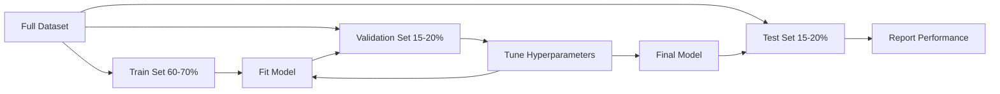

# Model Evaluation

> A model is only as good as the way you measure it.

**Type:** Build
**Languages:** Python
**Prerequisites:** Phase 1 (Probability & Distributions, Statistics for ML), Phase 2 Lessons 1-8
**Time:** ~90 minutes

## Learning Objectives

- Implement K-fold and stratified K-fold cross-validation from scratch and explain why stratification matters for imbalanced data
- Compute precision, recall, F1, AUC-ROC, and regression metrics (MSE, RMSE, MAE, R-squared) from scratch
- Interpret learning curves to diagnose whether a model suffers from high bias or high variance
- Identify common evaluation mistakes including data leakage, wrong metric selection, and test set contamination

## The Problem

You trained a model. It gets 95% accuracy on your data. Is it good?

Maybe. Maybe not. If 95% of your data belongs to one class, a model that always predicts that class gets 95% accuracy while being completely useless. If you evaluated on the same data you trained on, the 95% number is meaningless because the model just memorized the answers. If your dataset has a time component and you randomly shuffled before splitting, your model might be using future data to predict the past.

Model evaluation is where most ML projects go wrong. The wrong metric makes a bad model look good. The wrong split lets a model cheat. The wrong comparison makes you pick the worse model. Getting evaluation right is not optional. It is the difference between a model that works in production and one that fails the moment it sees real data.

## The Concept

### Train, Validation, Test



Three splits, three purposes:

- **Training set**: the model learns from this data. It sees these examples during training.
- **Validation set**: used to tune hyperparameters and select between models. The model never trains on this data, but your decisions are influenced by it.
- **Test set**: touched exactly once, at the very end, to report final performance. If you look at test performance and then go back to change your model, it is no longer a test set. It has become a second validation set.

The test set is your hold-out guarantee that the reported performance reflects how the model will do on truly unseen data.

### K-Fold Cross-Validation

With small datasets, a single train/validation split wastes data and gives noisy estimates. K-fold cross-validation uses all the data for both training and validation:

```mermaid
flowchart TB
    subgraph Fold1["Fold 1"]
        direction LR
        V1["Val"] --- T1a["Train"] --- T1b["Train"] --- T1c["Train"] --- T1d["Train"]
    end
    subgraph Fold2["Fold 2"]
        direction LR
        T2a["Train"] --- V2["Val"] --- T2b["Train"] --- T2c["Train"] --- T2d["Train"]
    end
    subgraph Fold3["Fold 3"]
        direction LR
        T3a["Train"] --- T3b["Train"] --- V3["Val"] --- T3c["Train"] --- T3d["Train"]
    end
    subgraph Fold4["Fold 4"]
        direction LR
        T4a["Train"] --- T4b["Train"] --- T4c["Train"] --- V4["Val"] --- T4d["Train"]
    end
    subgraph Fold5["Fold 5"]
        direction LR
        T5a["Train"] --- T5b["Train"] --- T5c["Train"] --- T5d["Train"] --- V5["Val"]
    end
    Fold1 --> R["Average scores"]
    Fold2 --> R
    Fold3 --> R
    Fold4 --> R
    Fold5 --> R
```



1. Split data into K equal-sized folds
2. For each fold, train on K-1 folds and validate on the remaining fold
3. Average the K validation scores

K=5 or K=10 are standard choices. Every data point gets used for validation exactly once.

**Stratified K-fold**: preserves the class distribution in each fold. If your dataset is 70% class A and 30% class B, each fold will have roughly the same ratio. This is important for imbalanced datasets where a random split might put all minority samples in one fold.

### Classification Metrics

**Confusion matrix**: the foundation. For binary classification:

|  | Predicted Positive | Predicted Negative |
|--|---|---|
| Actually Positive | True Positive (TP) | False Negative (FN) |
| Actually Negative | False Positive (FP) | True Negative (TN) |

From this matrix, all other metrics follow:

- **Accuracy** = (TP + TN) / (TP + TN + FP + FN). Fraction of correct predictions. Misleading when classes are imbalanced.
- **Precision** = TP / (TP + FP). Of all things predicted positive, how many actually were? Use when false positives are costly.
- **Recall** (sensitivity) = TP / (TP + FN). Of all actual positives, how many did we catch? Use when false negatives are costly.
- **F1 score** = 2 * precision * recall / (precision + recall). Harmonic mean of precision and recall.
- **AUC-ROC**: Area Under the Receiver Operating Characteristic curve. Plots true positive rate vs false positive rate at various classification thresholds. AUC = 0.5 means random guessing, AUC = 1.0 means perfect separation.

### Regression Metrics

- **MSE** (Mean Squared Error) = mean((y_true - y_pred)^2). Penalizes large errors quadratically. Sensitive to outliers.
- **RMSE** (Root Mean Squared Error) = sqrt(MSE). Same units as the target variable.
- **MAE** (Mean Absolute Error) = mean(|y_true - y_pred|). More robust to outliers than MSE.
- **R-squared** = 1 - SS_res / SS_tot. Fraction of variance explained by the model. R^2 = 1.0 is perfect. R^2 = 0.0 means the model is no better than always predicting the mean.

### Learning Curves

Plot training and validation scores as a function of training set size:

- **High bias (underfitting)**: both curves converge to a low score. Adding more data will not help. You need a more complex model.
- **High variance (overfitting)**: training score is high but validation score is much lower. Adding more data should help.

### Common Evaluation Mistakes

**Data leakage**: information from the test set leaks into training. Examples: fitting a scaler on the full dataset before splitting, including future data in time series prediction. Always split first, then preprocess.

**Class imbalance**: 99% of transactions are legitimate, 1% are fraud. A model that always predicts "legitimate" gets 99% accuracy. Use precision, recall, F1, or AUC-ROC instead.

**Wrong metric**: optimizing accuracy when you should optimize recall (medical diagnosis), or optimizing RMSE when your data has heavy outliers (use MAE instead).

**Not using stratified splits**: with imbalanced data, a random split might put very few minority samples in the validation fold.

**Testing too often**: every time you look at test performance and adjust, you overfit to the test set. The test set is single-use.

## Build It

### Step 1: Train/validation/test split

```python
import random
import math

def train_val_test_split(X, y, train_ratio=0.6, val_ratio=0.2, seed=42):
    random.seed(seed)
    n = len(X)
    indices = list(range(n))
    random.shuffle(indices)
    train_end = int(n * train_ratio)
    val_end = int(n * (train_ratio + val_ratio))
    train_idx = indices[:train_end]
    val_idx = indices[train_end:val_end]
    test_idx = indices[val_end:]
    X_train = [X[i] for i in train_idx]
    y_train = [y[i] for i in train_idx]
    X_val = [X[i] for i in val_idx]
    y_val = [y[i] for i in val_idx]
    X_test = [X[i] for i in test_idx]
    y_test = [y[i] for i in test_idx]
    return X_train, y_train, X_val, y_val, X_test, y_test
```

### Step 2: K-fold and stratified K-fold cross-validation

```python
def kfold_split(n, k=5, seed=42):
    random.seed(seed)
    indices = list(range(n))
    random.shuffle(indices)
    fold_size = n // k
    folds = []
    for i in range(k):
        start = i * fold_size
        end = start + fold_size if i < k - 1 else n
        val_idx = indices[start:end]
        train_idx = indices[:start] + indices[end:]
        folds.append((train_idx, val_idx))
    return folds

def stratified_kfold_split(y, k=5, seed=42):
    random.seed(seed)
    class_indices = {}
    for i, label in enumerate(y):
        class_indices.setdefault(label, []).append(i)
    for label in class_indices:
        random.shuffle(class_indices[label])
    folds = [{"train": [], "val": []} for _ in range(k)]
    for label, indices in class_indices.items():
        fold_size = len(indices) // k
        for i in range(k):
            start = i * fold_size
            end = start + fold_size if i < k - 1 else len(indices)
            val_part = indices[start:end]
            train_part = indices[:start] + indices[end:]
            folds[i]["val"].extend(val_part)
            folds[i]["train"].extend(train_part)
    return [(f["train"], f["val"]) for f in folds]

def cross_validate(X, y, model_fn, k=5, metric_fn=None, stratified=False):
    n = len(X)
    if stratified:
        folds = stratified_kfold_split(y, k)
    else:
        folds = kfold_split(n, k)
    scores = []
    for train_idx, val_idx in folds:
        X_train = [X[i] for i in train_idx]
        y_train = [y[i] for i in train_idx]
        X_val = [X[i] for i in val_idx]
        y_val = [y[i] for i in val_idx]
        model = model_fn()
        model.fit(X_train, y_train)
        predictions = [model.predict(x) for x in X_val]
        if metric_fn:
            score = metric_fn(y_val, predictions)
        else:
            score = sum(1 for yt, yp in zip(y_val, predictions) if yt == yp) / len(y_val)
        scores.append(score)
    return scores
```

### Step 3: Confusion matrix and classification metrics

```python
def confusion_matrix(y_true, y_pred):
    tp = sum(1 for yt, yp in zip(y_true, y_pred) if yt == 1 and yp == 1)
    tn = sum(1 for yt, yp in zip(y_true, y_pred) if yt == 0 and yp == 0)
    fp = sum(1 for yt, yp in zip(y_true, y_pred) if yt == 0 and yp == 1)
    fn = sum(1 for yt, yp in zip(y_true, y_pred) if yt == 1 and yp == 0)
    return tp, tn, fp, fn

def accuracy(y_true, y_pred):
    tp, tn, fp, fn = confusion_matrix(y_true, y_pred)
    total = tp + tn + fp + fn
    return (tp + tn) / total if total > 0 else 0.0

def precision(y_true, y_pred):
    tp, tn, fp, fn = confusion_matrix(y_true, y_pred)
    return tp / (tp + fp) if (tp + fp) > 0 else 0.0

def recall(y_true, y_pred):
    tp, tn, fp, fn = confusion_matrix(y_true, y_pred)
    return tp / (tp + fn) if (tp + fn) > 0 else 0.0

def f1_score(y_true, y_pred):
    p = precision(y_true, y_pred)
    r = recall(y_true, y_pred)
    return 2 * p * r / (p + r) if (p + r) > 0 else 0.0

def roc_curve(y_true, y_scores):
    thresholds = sorted(set(y_scores), reverse=True)
    tpr_list = []
    fpr_list = []
    total_positives = sum(y_true)
    total_negatives = len(y_true) - total_positives
    for threshold in thresholds:
        y_pred = [1 if s >= threshold else 0 for s in y_scores]
        tp = sum(1 for yt, yp in zip(y_true, y_pred) if yt == 1 and yp == 1)
        fp = sum(1 for yt, yp in zip(y_true, y_pred) if yt == 0 and yp == 1)
        tpr = tp / total_positives if total_positives > 0 else 0.0
        fpr = fp / total_negatives if total_negatives > 0 else 0.0
        tpr_list.append(tpr)
        fpr_list.append(fpr)
    return fpr_list, tpr_list, thresholds

def auc_roc(y_true, y_scores):
    fpr_list, tpr_list, _ = roc_curve(y_true, y_scores)
    pairs = sorted(zip(fpr_list, tpr_list))
    fpr_sorted = [p[0] for p in pairs]
    tpr_sorted = [p[1] for p in pairs]
    area = 0.0
    for i in range(1, len(fpr_sorted)):
        width = fpr_sorted[i] - fpr_sorted[i - 1]
        height = (tpr_sorted[i] + tpr_sorted[i - 1]) / 2
        area += width * height
    return area
```

### Step 4: Regression metrics

```python
def mse(y_true, y_pred):
    n = len(y_true)
    return sum((yt - yp) ** 2 for yt, yp in zip(y_true, y_pred)) / n

def rmse(y_true, y_pred):
    return math.sqrt(mse(y_true, y_pred))

def mae(y_true, y_pred):
    n = len(y_true)
    return sum(abs(yt - yp) for yt, yp in zip(y_true, y_pred)) / n

def r_squared(y_true, y_pred):
    mean_y = sum(y_true) / len(y_true)
    ss_res = sum((yt - yp) ** 2 for yt, yp in zip(y_true, y_pred))
    ss_tot = sum((yt - mean_y) ** 2 for yt in y_true)
    if ss_tot == 0:
        return 0.0
    return 1.0 - ss_res / ss_tot
```

### Step 5: Learning curves

```python
def learning_curve(X, y, model_fn, metric_fn, train_sizes=None, val_ratio=0.2, seed=42):
    random.seed(seed)
    n = len(X)
    indices = list(range(n))
    random.shuffle(indices)
    val_size = int(n * val_ratio)
    val_idx = indices[:val_size]
    pool_idx = indices[val_size:]
    X_val = [X[i] for i in val_idx]
    y_val = [y[i] for i in val_idx]
    if train_sizes is None:
        train_sizes = [int(len(pool_idx) * r) for r in [0.1, 0.2, 0.4, 0.6, 0.8, 1.0]]
    train_scores = []
    val_scores = []
    for size in train_sizes:
        subset = pool_idx[:size]
        X_train = [X[i] for i in subset]
        y_train = [y[i] for i in subset]
        model = model_fn()
        model.fit(X_train, y_train)
        train_pred = [model.predict(x) for x in X_train]
        val_pred = [model.predict(x) for x in X_val]
        train_scores.append(metric_fn(y_train, train_pred))
        val_scores.append(metric_fn(y_val, val_pred))
    return train_sizes, train_scores, val_scores
```

## Use It

With scikit-learn, evaluation is built into the workflow:

```python
from sklearn.model_selection import cross_val_score, StratifiedKFold, learning_curve
from sklearn.metrics import (
    accuracy_score, precision_score, recall_score, f1_score,
    roc_auc_score, confusion_matrix, mean_squared_error, r2_score,
)
from sklearn.linear_model import LogisticRegression

model = LogisticRegression()
scores = cross_val_score(model, X, y, cv=StratifiedKFold(5), scoring="f1")
```

## Ship It

This lesson produces `outputs/skill-evaluation.md` -- a skill covering evaluation strategy for classification and regression models.

## Exercises

1. Implement precision-recall curves: plot precision vs recall at different thresholds. Compute the average precision (area under the PR curve). Compare the PR curve to the ROC curve on an imbalanced dataset and explain when each is more informative.
2. Build a nested cross-validation loop: the outer loop evaluates model performance, the inner loop tunes hyperparameters. Use it to compare two models fairly without leaking validation data into the evaluation.
3. Implement a permutation test for model comparison: shuffle the labels, retrain, and measure performance. Repeat 100 times to build a null distribution. Compute the p-value for the observed model performance against this distribution.

## Key Terms

| Term | What people say | What it actually means |
|------|----------------|----------------------|
| Overfitting | "Memorizing the training data" | The model captures noise in the training data, performing well on training but poorly on unseen data |
| Cross-validation | "Testing on different subsets" | Systematically rotating which portion of data is used for validation, averaging results across all rotations |
| Precision | "How many predicted positives are correct" | TP / (TP + FP): the fraction of positive predictions that are actually positive |
| Recall | "How many actual positives we found" | TP / (TP + FN): the fraction of actual positives that were correctly identified |
| AUC-ROC | "How well the model separates classes" | The area under the curve of true positive rate vs false positive rate across all thresholds |
| R-squared | "How much variance is explained" | 1 - (sum of squared residuals / total sum of squares) |
| Data leakage | "The model cheated" | Using information during training that would not be available at prediction time |
| Learning curve | "How performance changes with more data" | A plot of training and validation scores vs training set size |
| Stratified split | "Keeping class ratios balanced" | Splitting data so each subset has the same proportion of each class as the full dataset |

## Further Reading

- [scikit-learn Model Selection Guide](https://scikit-learn.org/stable/model_selection.html)
- [Beyond Accuracy: Precision and Recall (Google ML Crash Course)](https://developers.google.com/machine-learning/crash-course/classification/precision-and-recall)
- [A Survey of Cross-Validation Procedures (Arlot & Celisse, 2010)](https://projecteuclid.org/journals/statistics-surveys/volume-4/issue-none/A-survey-of-cross-validation-procedures-for-model-selection/10.1214/09-SS054.full)

[Reference](https://github.com/rohitg00/ai-engineering-from-scratch/tree/main/phases/02-ml-fundamentals/09-model-evaluation)
