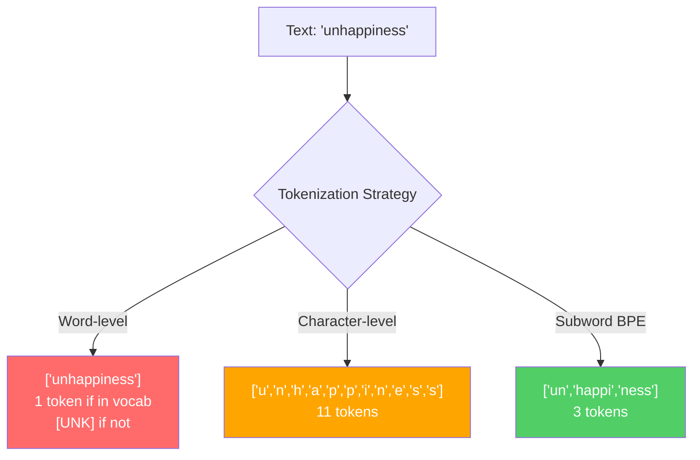
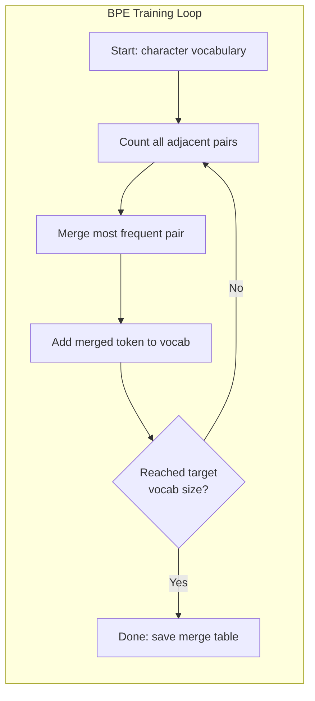
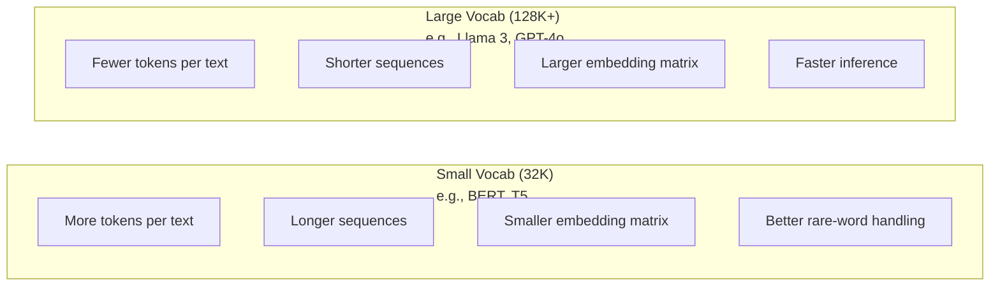
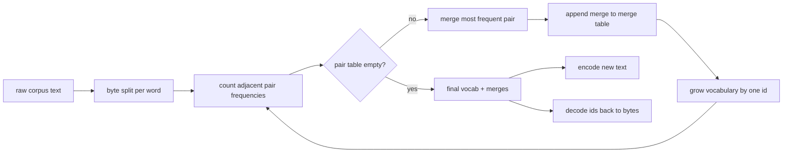
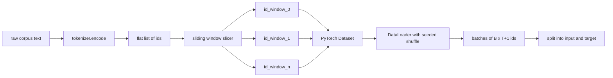
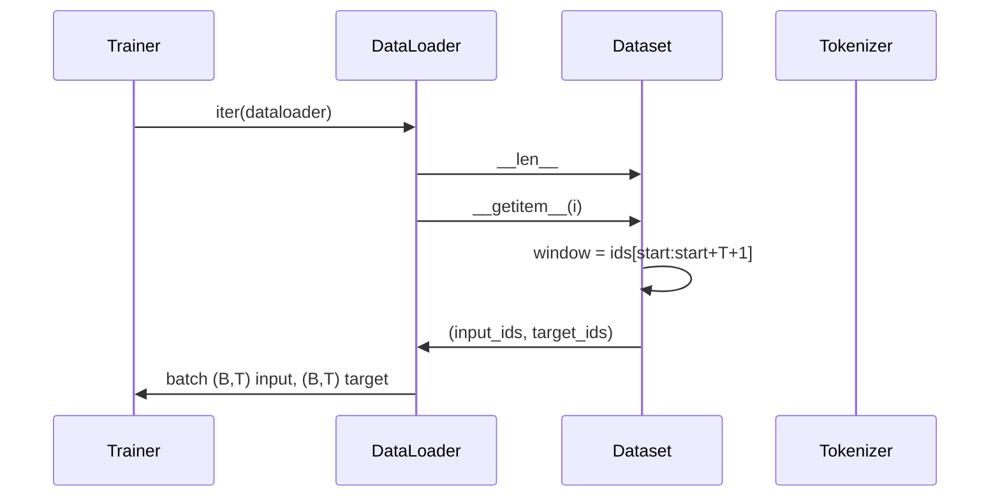

# Tokenizers: Theory & BPE Build

> Combined lessons (4 parts), merged verbatim — no content removed.

**Type:** Combined

---

## Part 1 (ch183): Tokenizers: BPE, WordPiece, SentencePiece

> Your LLM does not read English. It reads integers. The tokenizer decides whether those integers carry meaning or waste it.

**Type:** Build
**Languages:** Python
**Prerequisites:** Phase 05 (NLP Foundations)
**Time:** ~90 minutes

## Learning Objectives

- Implement BPE, WordPiece, and Unigram tokenization algorithms from scratch and compare their merge strategies
- Explain how vocabulary size affects model efficiency: too small creates long sequences, too large wastes embedding parameters
- Analyze tokenization artifacts across languages and code, identifying where specific tokenizers break down
- Use the tiktoken and sentencepiece libraries to tokenize text and inspect the resulting token IDs

## The Problem

Your LLM does not read English. It does not read any language. It reads numbers.

The gap between "Hello, world!" and [15496, 11, 995, 0] is the tokenizer. Every word, every space, every punctuation mark must be converted into an integer before a model can process it. This conversion is not neutral. It bakes assumptions into the model that cannot be undone later.

Get this wrong and your model wastes capacity encoding common words with multiple tokens. "unfortunately" becomes four tokens instead of one. Your 128K context window just shrank by 75% for text heavy in multi-syllable words. Get it right and the same context window holds twice as much meaning. The difference between "this model handles code well" and "this model chokes on Python" often comes down to how the tokenizer was trained.

Every API call you make to GPT-4 or Claude is priced per token. Every token your model generates costs compute. The fewer tokens required to represent an output, the faster the end-to-end inference. Tokenization is not preprocessing. It is architecture.

## The Concept

### Three Approaches That Failed (and One That Won)

There are three obvious ways to convert text to numbers. Two of them do not work at scale.

**Word-level tokenization** splits on spaces and punctuation. "The cat sat" becomes ["The", "cat", "sat"]. Simple. But what about "tokenization"? Or "GPT-4o"? Or a German compound word like "Geschwindigkeitsbegrenzung"? Word-level requires a massive vocabulary to cover every word in every language. Miss a word and you get the dreaded `[UNK]` token -- the model's way of saying "I have no idea what this is." English alone has over a million word forms. Add code, URLs, scientific notation, and 100 other languages and you need an infinite vocabulary.

**Character-level tokenization** goes the other direction. "hello" becomes ["h", "e", "l", "l", "o"]. Vocabulary is tiny (a few hundred characters). No unknown tokens ever. But sequences become extremely long. A sentence that would be 10 word-level tokens becomes 50 character-level tokens. The model must learn that "t", "h", "e" together mean "the" -- burning attention capacity on something a human learns at age three.

**Subword tokenization** finds the sweet spot. Common words stay whole: "the" is one token. Rare words decompose into meaningful pieces: "unhappiness" becomes ["un", "happi", "ness"]. Vocabulary stays manageable (30K to 128K tokens). Sequences stay short. Unknown tokens essentially disappear because any word can be built from subword pieces.

Every modern LLM uses subword tokenization. GPT-2, GPT-4, BERT, Llama 3, Claude -- all of them. The question is which algorithm.



### BPE: Byte Pair Encoding

BPE is a greedy compression algorithm repurposed for tokenization. The idea is simple enough to fit on an index card.

Start with individual characters. Count every adjacent pair in the training corpus. Merge the most frequent pair into a new token. Repeat until you reach your target vocabulary size.

Here is BPE running on a tiny corpus with the words "lower", "lowest", and "newest":

```
Corpus (with word frequencies):
  "lower"  x5
  "lowest" x2
  "newest" x6

Step 0 -- Start with characters:
  l o w e r       (x5)
  l o w e s t     (x2)
  n e w e s t     (x6)

Step 1 -- Count adjacent pairs:
  (e,s): 8    (s,t): 8    (l,o): 7    (o,w): 7
  (w,e): 13   (e,r): 5    (n,e): 6    ...

Step 2 -- Merge most frequent pair (w,e) -> "we":
  l o we r        (x5)
  l o we s t      (x2)
  n e we s t      (x6)

Step 3 -- Recount and merge (e,s) -> "es":
  ...

...continue until target vocab size reached.
```

The merge table is the tokenizer. To encode new text, apply merges in the order they were learned. The training corpus determines which merges exist, and that choice permanently shapes what the model sees.



### Byte-Level BPE (GPT-2, GPT-3, GPT-4)

Standard BPE operates on Unicode characters. Byte-level BPE operates on raw bytes (0-255). This gives you a base vocabulary of exactly 256, handles any language or encoding, and never produces an unknown token.

GPT-2 introduced this approach. The base vocabulary covers every possible byte. BPE merges build on top of that. OpenAI's tiktoken library implements byte-level BPE with these vocabulary sizes:

- GPT-2: 50,257 tokens
- GPT-3.5/GPT-4: ~100,256 tokens (cl100k_base encoding)
- GPT-4o: 200,019 tokens (o200k_base encoding)

### WordPiece (BERT)

WordPiece looks similar to BPE but picks merges differently. Instead of raw frequency, it maximizes the likelihood of the training data:

```
BPE merge criterion:      count(A, B)
WordPiece merge criterion: count(AB) / (count(A) * count(B))
```

BPE asks: "Which pair appears most often?" WordPiece asks: "Which pair appears together more often than you would expect by chance?" This subtle difference produces different vocabularies. WordPiece favors merges where co-occurrence is surprising, not just frequent.

WordPiece also uses a "##" prefix for continuation subwords:

```
"unhappiness" -> ["un", "##happi", "##ness"]
"embedding"   -> ["em", "##bed", "##ding"]
```

The "##" prefix tells you this piece continues a previous token. BERT uses WordPiece with a vocabulary of 30,522 tokens.

### SentencePiece (Llama, T5)

SentencePiece treats the input as a raw stream of Unicode characters, including whitespace. No pre-tokenization step. No language-specific rules about word boundaries. This makes it genuinely language-agnostic -- it works on Chinese, Japanese, Thai, and other languages where spaces do not separate words.

SentencePiece supports two algorithms:
- **BPE mode**: same merge logic as standard BPE, applied to raw character sequences
- **Unigram mode**: starts with a large vocabulary and iteratively removes tokens that least affect the overall likelihood. The reverse of BPE -- prune instead of merge.

Llama 2 uses SentencePiece BPE with a vocabulary of 32,000 tokens. T5 uses SentencePiece Unigram with 32,000 tokens. Note: Llama 3 switched to a tiktoken-based byte-level BPE tokenizer with 128,256 tokens.

### Vocabulary Size Tradeoffs

This is a real engineering decision with measurable consequences.



Concrete numbers. For a 128K vocabulary with 4,096-dimensional embeddings, the embedding matrix alone is 128,000 x 4,096 = 524 million parameters. For a 32K vocabulary, it is 131 million parameters. That is a 400M parameter difference from the tokenizer choice alone.

But larger vocabularies compress text more aggressively. The same English paragraph that takes 100 tokens with a 32K vocabulary might take 70 tokens with a 128K vocabulary. That means 30% fewer forward passes during generation. For a model serving millions of requests, that is a direct reduction in compute cost.

The trend is clear: vocabulary sizes are growing. GPT-2 used 50,257. GPT-4 uses ~100K. Llama 3 uses 128K. GPT-4o uses 200K.

| Model | Vocab Size | Tokenizer Type | Avg Tokens per English Word |
|-------|-----------|----------------|---------------------------|
| BERT | 30,522 | WordPiece | ~1.4 |
| GPT-2 | 50,257 | Byte-level BPE | ~1.3 |
| Llama 2 | 32,000 | SentencePiece BPE | ~1.4 |
| GPT-4 | ~100,256 | Byte-level BPE | ~1.2 |
| Llama 3 | 128,256 | Byte-level BPE (tiktoken) | ~1.1 |
| GPT-4o | 200,019 | Byte-level BPE | ~1.0 |

### The Multilingual Tax

Tokenizers trained primarily on English are brutal to other languages. Korean text in GPT-2's tokenizer averages 2-3 tokens per word. Chinese can be worse. This means a Korean user effectively has a context window that is half the size of an English user's -- paying the same price for less information density.

This is why Llama 3 quadrupled its vocabulary from 32K to 128K. More tokens dedicated to non-English scripts means fairer compression across languages.

## Build It

### Step 1: Character-Level Tokenizer

Start at the foundation. A character-level tokenizer maps each character to its Unicode code point. No training needed. No unknown tokens. Just a direct mapping.

```python
class CharTokenizer:
    def encode(self, text):
        return [ord(c) for c in text]

    def decode(self, tokens):
        return "".join(chr(t) for t in tokens)
```

"hello" becomes [104, 101, 108, 108, 111]. Every character is its own token. This is the baseline we improve on.

### Step 2: BPE Tokenizer from Scratch

The real implementation. We train on raw bytes (like GPT-2), count pairs, merge the most frequent, and record every merge in order. The merge table is the tokenizer.

```python
from collections import Counter

class BPETokenizer:
    def __init__(self):
        self.merges = {}
        self.vocab = {}

    def _get_pairs(self, tokens):
        pairs = Counter()
        for i in range(len(tokens) - 1):
            pairs[(tokens[i], tokens[i + 1])] += 1
        return pairs

    def _merge_pair(self, tokens, pair, new_token):
        merged = []
        i = 0
        while i < len(tokens):
            if i < len(tokens) - 1 and tokens[i] == pair[0] and tokens[i + 1] == pair[1]:
                merged.append(new_token)
                i += 2
            else:
                merged.append(tokens[i])
                i += 1
        return merged

    def train(self, text, num_merges):
        tokens = list(text.encode("utf-8"))
        self.vocab = {i: bytes([i]) for i in range(256)}

        for i in range(num_merges):
            pairs = self._get_pairs(tokens)
            if not pairs:
                break
            best_pair = max(pairs, key=pairs.get)
            new_token = 256 + i
            tokens = self._merge_pair(tokens, best_pair, new_token)
            self.merges[best_pair] = new_token
            self.vocab[new_token] = self.vocab[best_pair[0]] + self.vocab[best_pair[1]]

        return self

    def encode(self, text):
        tokens = list(text.encode("utf-8"))
        for pair, new_token in self.merges.items():
            tokens = self._merge_pair(tokens, pair, new_token)
        return tokens

    def decode(self, tokens):
        byte_sequence = b"".join(self.vocab[t] for t in tokens)
        return byte_sequence.decode("utf-8", errors="replace")
```

The training loop is the core of BPE: count pairs, merge the winner, repeat. Each merge reduces the total token count. After `num_merges` rounds, the vocabulary grows from 256 (base bytes) to 256 + num_merges.

Encoding applies merges in the exact order they were learned. This matters. If merge 1 created "th" and merge 5 created "the", encoding must apply merge 1 first so that "the" can form from "th" + "e" in merge 5.

Decoding is the inverse: look up each token ID in the vocabulary, concatenate the bytes, decode to UTF-8.

### Step 3: Encode and Decode Roundtrip

```python
corpus = (
    "The cat sat on the mat. The cat ate the rat. "
    "The dog sat on the log. The dog ate the frog. "
    "Natural language processing is the study of how computers "
    "understand and generate human language. "
    "Tokenization is the first step in any NLP pipeline."
)

tokenizer = BPETokenizer()
tokenizer.train(corpus, num_merges=40)

test_sentences = [
    "The cat sat on the mat.",
    "Natural language processing",
    "tokenization pipeline",
    "unhappiness",
]

for sentence in test_sentences:
    encoded = tokenizer.encode(sentence)
    decoded = tokenizer.decode(encoded)
    raw_bytes = len(sentence.encode("utf-8"))
    ratio = len(encoded) / raw_bytes
    print(f"'{sentence}'")
    print(f"  Tokens: {len(encoded)} (from {raw_bytes} bytes) -- ratio: {ratio:.2f}")
    print(f"  Roundtrip: {'PASS' if decoded == sentence else 'FAIL'}")
```

The compression ratio tells you how effective the tokenizer is. A ratio of 0.50 means the tokenizer compressed the text to half as many tokens as raw bytes. Lower is better.

### Step 4: Compare with tiktoken

```python
import tiktoken

enc = tiktoken.get_encoding("cl100k_base")

texts = [
    "The cat sat on the mat.",
    "unhappiness",
    "Hello, world!",
    "def fibonacci(n): return n if n < 2 else fibonacci(n-1) + fibonacci(n-2)",
    "Geschwindigkeitsbegrenzung",
]

for text in texts:
    our_tokens = tokenizer.encode(text)
    tiktoken_tokens = enc.encode(text)
    tiktoken_pieces = [enc.decode([t]) for t in tiktoken_tokens]
    print(f"'{text}'")
    print(f"  Our BPE:   {len(our_tokens)} tokens")
    print(f"  tiktoken:  {len(tiktoken_tokens)} tokens -> {tiktoken_pieces}")
```

tiktoken uses the exact same algorithm but trained on hundreds of gigabytes of text with 100,000 merges. The algorithm is identical. The difference is the training data and the number of merges.

### Step 5: Vocabulary Analysis

```python
def analyze_vocabulary(tokenizer, test_texts):
    total_tokens = 0
    total_chars = 0
    token_usage = Counter()

    for text in test_texts:
        encoded = tokenizer.encode(text)
        total_tokens += len(encoded)
        total_chars += len(text)
        for t in encoded:
            token_usage[t] += 1

    print(f"Vocabulary size: {len(tokenizer.vocab)}")
    print(f"Total tokens across all texts: {total_tokens}")
    print(f"Total characters: {total_chars}")
    print(f"Avg tokens per character: {total_tokens / total_chars:.2f}")

    print(f"\nMost used tokens:")
    for token_id, count in token_usage.most_common(10):
        token_bytes = tokenizer.vocab[token_id]
        display = token_bytes.decode("utf-8", errors="replace")
        print(f"  Token {token_id:4d}: '{display}' (used {count} times)")

    unused = [t for t in tokenizer.vocab if t not in token_usage]
    print(f"\nUnused tokens: {len(unused)} out of {len(tokenizer.vocab)}")
```

This reveals the Zipf distribution in your vocabulary. A few tokens dominate (spaces, "the", "e"). Most tokens are rarely used.

## Use It

Your scratch BPE works. Now see what production tools look like.

### tiktoken (OpenAI)

```python
import tiktoken

enc = tiktoken.get_encoding("cl100k_base")

text = "Tokenizers convert text to integers"
tokens = enc.encode(text)
print(f"Tokens: {tokens}")
print(f"Pieces: {[enc.decode([t]) for t in tokens]}")
print(f"Roundtrip: {enc.decode(tokens)}")
```

tiktoken is written in Rust with Python bindings. It encodes millions of tokens per second.

### Hugging Face tokenizers

```python
from tokenizers import Tokenizer
from tokenizers.models import BPE
from tokenizers.trainers import BpeTrainer
from tokenizers.pre_tokenizers import ByteLevel

tokenizer = Tokenizer(BPE())
tokenizer.pre_tokenizer = ByteLevel()

trainer = BpeTrainer(vocab_size=1000, special_tokens=["<pad>", "<eos>", "<unk>"])
tokenizer.train(["corpus.txt"], trainer)

output = tokenizer.encode("The cat sat on the mat.")
print(f"Tokens: {output.tokens}")
print(f"IDs: {output.ids}")
```

### Loading Llama's Tokenizer

```python
from transformers import AutoTokenizer

tokenizer = AutoTokenizer.from_pretrained("meta-llama/Llama-3.1-8B")

text = "Tokenizers are the unsung heroes of LLMs"
tokens = tokenizer.encode(text)
print(f"Token IDs: {tokens}")
print(f"Tokens: {tokenizer.convert_ids_to_tokens(tokens)}")
print(f"Vocab size: {tokenizer.vocab_size}")

multilingual = ["Hello world", "Hola mundo", "Bonjour le monde"]
for text in multilingual:
    ids = tokenizer.encode(text)
    print(f"'{text}' -> {len(ids)} tokens")
```

## Ship It

This lesson produces `outputs/prompt-tokenizer-analyzer.md` -- a reusable prompt that analyzes tokenization efficiency for any text and model combination. Feed it a text sample and it tells you which model's tokenizer handles it best.

## Exercises

1. Modify the BPE tokenizer to print the vocabulary at each merge step. Watch how "t" + "h" becomes "th", then "th" + "e" becomes "the". Track how common English words get assembled piece by piece.

2. Add special tokens (`<pad>`, `<eos>`, `<unk>`) to the BPE tokenizer. Assign them IDs 0, 1, 2 and shift all other tokens accordingly. Implement a pre-tokenization step that splits on whitespace before running BPE.

3. Implement the WordPiece merge criterion (likelihood ratio instead of frequency). Train both BPE and WordPiece on the same corpus with the same number of merges. Compare the resulting vocabularies -- which one produces more linguistically meaningful subwords?

4. Build a multilingual tokenizer efficiency benchmark. Take 10 sentences in English, Spanish, Chinese, Korean, and Arabic. Tokenize each with tiktoken (cl100k_base) and measure the average tokens per character. Quantify the "multilingual tax" for each language.

5. Train your BPE tokenizer on a larger corpus (download a Wikipedia article). Tune the number of merges to achieve a compression ratio within 10% of tiktoken on that same text. This forces you to understand the relationship between corpus size, merge count, and compression quality.

## Key Terms

| Term | What people say | What it actually means |
|------|----------------|----------------------|
| Token | "A word" | A unit in the model's vocabulary -- could be a character, subword, word, or multi-word chunk |
| BPE | "Some compression thing" | Byte Pair Encoding -- iteratively merge the most frequent adjacent pair of tokens until the target vocabulary size is reached |
| WordPiece | "BERT's tokenizer" | Like BPE but merges maximize the likelihood ratio count(AB)/(count(A)*count(B)) instead of raw frequency |
| SentencePiece | "A tokenizer library" | A language-agnostic tokenizer that operates on raw Unicode without pre-tokenization, supporting BPE and Unigram algorithms |
| Vocabulary size | "How many words it knows" | The total number of unique tokens: GPT-2 has 50,257, BERT has 30,522, Llama 3 has 128,256 |
| Fertility | "Not a tokenizer term" | Average number of tokens per word -- measures tokenizer efficiency across languages (1.0 is perfect, 3.0 means the model works three times harder) |
| Byte-level BPE | "GPT's tokenizer" | BPE operating on raw bytes (0-255) instead of Unicode characters, guaranteeing no unknown tokens for any input |
| Merge table | "The tokenizer file" | Ordered list of pair merges learned during training -- this IS the tokenizer, and order matters |
| Pre-tokenization | "Splitting on spaces" | Rules applied before subword tokenization: whitespace splitting, digit separation, punctuation handling |
| Compression ratio | "How efficient the tokenizer is" | Tokens produced divided by input bytes -- lower means better compression and faster inference |

## Further Reading

- [Sennrich et al., 2016 -- "Neural Machine Translation of Rare Words with Subword Units"](https://arxiv.org/abs/1508.07909)
- [Kudo & Richardson, 2018 -- "SentencePiece: A simple and language independent subword tokenizer"](https://arxiv.org/abs/1808.06226)
- [OpenAI tiktoken repository](https://github.com/openai/tiktoken)
- [Hugging Face Tokenizers documentation](https://huggingface.co/docs/tokenizers)

[Reference](https://github.com/rohitg00/ai-engineering-from-scratch/tree/main/phases/10-llms-from-scratch/01-tokenizers)

---

## Part 2 (ch184): Building a Tokenizer from Scratch

> Lesson 01 gave you a toy. This lesson gives you a weapon.

**Type:** Build
**Languages:** Python
**Prerequisites:** Phase 10, Lesson 01 (Tokenizers: BPE, WordPiece, SentencePiece)
**Time:** ~90 minutes

## Learning Objectives

- Build a production-grade BPE tokenizer that handles Unicode, whitespace normalization, and special tokens
- Implement byte-level fallback so the tokenizer can encode any input (including emoji, CJK, and code) without unknown tokens
- Add pre-tokenization regex patterns that split text at word boundaries before applying BPE merges
- Train a custom tokenizer on a corpus and evaluate its compression ratio against tiktoken on multilingual text

## The Problem

Your BPE tokenizer from Lesson 01 works on English text. Now throw Japanese at it. Or emoji. Or Python code with mixed tabs and spaces.

It breaks.

Not because BPE is wrong -- because the implementation is incomplete. A production tokenizer handles raw bytes in any encoding, normalizes Unicode before splitting, manages special tokens that never get merged, chains pre-tokenization with subword splitting, and does all of this fast enough to not bottleneck a training pipeline processing 15 trillion tokens.

GPT-2's tokenizer has 50,257 tokens. Llama 3 has 128,256. GPT-4 has roughly 100,000. These are not toy numbers. The merge tables behind those vocabularies were trained on hundreds of gigabytes of text, and the surrounding machinery -- normalization, pre-tokenization, special token injection, chat template formatting -- is what separates a tokenizer that handles "hello world" from one that handles the entire internet.

You are going to build that machinery.

## The Concept

### The Full Pipeline

A production tokenizer is not one algorithm. It is a pipeline of five stages, each solving a different problem.


Each stage has a specific job:

| Stage | What It Does | Why It Matters |
|-------|-------------|----------------|
| Normalize | NFKC Unicode, lowercase optional, strip accents optional | "fi" ligature (U+FB01) becomes "fi" (two chars). Without this, same word gets different tokens. |
| Pre-Tokenize | Split text into chunks before BPE | Prevents BPE from merging across word boundaries. "the cat" should never produce a token "e c". |
| BPE Merge | Apply learned merge rules to byte sequences | The core compression. Turns raw bytes into subword tokens. |
| Special Tokens | Inject [BOS], [EOS], [PAD], chat template markers | These tokens have fixed IDs. They never participate in BPE merges. The model needs them for structure. |
| ID Mapping | Convert token strings to integer IDs | The model sees integers, not strings. |

### Byte-Level BPE

Lesson 01's tokenizer operated on UTF-8 bytes. That was the right call. But we skipped something important: what happens when those bytes are not valid UTF-8?

Byte-level BPE solves this by treating every possible byte value (0-255) as a valid token. Your base vocabulary is exactly 256 entries. Any file -- text, binary, corrupted -- can be tokenized without producing an unknown token.

GPT-2 added a trick: map each byte to a printable Unicode character so the vocabulary stays human-readable. Byte 0x20 (space) becomes the character "G" in their mapping. This is purely cosmetic. The algorithm does not care.

The real power: byte-level BPE handles every language on earth. Chinese characters are 3 UTF-8 bytes each. Japanese can be 3-4 bytes. Arabic, Devanagari, emoji -- all just byte sequences. The BPE algorithm finds patterns in these byte sequences exactly the same way it finds patterns in English ASCII bytes.

### Pre-Tokenization

Before BPE touches your text, you need to split it into chunks. This prevents the merge algorithm from creating tokens that span word boundaries.

GPT-2 uses a regex pattern to split text:

```
'(?:[sdmt]|ll|ve|re)| ?\p{L}+| ?\p{N}+| ?[^\s\p{L}\p{N}]+|\s+(?!\S)|\s+
```

This pattern splits on contractions ("don't" becomes "don" + "'t"), words with optional leading spaces, numbers, punctuation, and whitespace. The leading space is kept attached to the word -- so "the cat" becomes [" the", " cat"], not ["the", " ", "cat"].

Llama uses SentencePiece, which skips regex entirely. It treats the raw byte stream as one long sequence and lets the BPE algorithm figure out the boundaries.

### Special Tokens

Every production tokenizer reserves token IDs for structural markers:

| Token | Purpose | Used By |
|-------|---------|---------|
| `[BOS]` / `<s>` | Beginning of sequence | Llama 3, GPT |
| `[EOS]` / `</s>` | End of sequence | All models |
| `[PAD]` | Padding for batch alignment | BERT, T5 |
| `[UNK]` | Unknown token (byte-level BPE eliminates this) | BERT, WordPiece |
| `<\|im_start\|>` | Chat message boundary start | ChatGPT, Qwen |
| `<\|im_end\|>` | Chat message boundary end | ChatGPT, Qwen |
| `<\|user\|>` | User turn marker | Llama 3 |
| `<\|assistant\|>` | Assistant turn marker | Llama 3 |

Special tokens are never split by BPE. They are matched exactly before the merge algorithm runs, replaced with their fixed ID, and the surrounding text is tokenized normally.

### Chat Templates

This is where most people get confused and most implementations break.

When you send messages to a chat model, the API accepts a list of messages:

```
[
  {"role": "system", "content": "You are helpful."},
  {"role": "user", "content": "Hello"},
  {"role": "assistant", "content": "Hi there!"}
]
```

The model does not see JSON. It sees a flat token sequence. The chat template converts messages into that flat sequence using special tokens. Every model does this differently:

```
Llama 3:
<|begin_of_text|><|start_header_id|>system<|end_header_id|>

You are helpful.<|eot_id|><|start_header_id|>user<|end_header_id|>

Hello<|eot_id|><|start_header_id|>assistant<|end_header_id|>

Hi there!<|eot_id|>

ChatGPT:
<|im_start|>system
You are helpful.<|im_end|>
<|im_start|>user
Hello<|im_end|>
<|im_start|>assistant
Hi there!<|im_end|>
```

Get the template wrong and the model produces garbage. It was trained on one exact format. Any deviation -- a missing newline, a swapped token, an extra space -- puts the input outside the training distribution.

### Speed

Python is too slow for production tokenization.

tiktoken (OpenAI) is written in Rust with Python bindings. HuggingFace tokenizers is also Rust. SentencePiece is C++. These achieve 10-100x speedups over pure Python.

For perspective: tokenizing 15 trillion tokens for Llama 3 pre-training at 1 million tokens per second (fast Python) would take 174 days. At 100 million tokens per second (Rust), it takes 1.7 days.

You are building in Python to understand the algorithm. In production, you would use a compiled implementation and only touch the Python wrapper.

## Build It

### Step 1: Byte-Level Encoding

The foundation. Convert any string into a sequence of bytes, map each byte to a printable character for display, and reverse the process.

```python
def bytes_to_tokens(text):
    return list(text.encode("utf-8"))

def tokens_to_text(token_bytes):
    return bytes(token_bytes).decode("utf-8", errors="replace")
```

Test on multilingual text to see the byte counts:

```python
texts = [
    ("English", "hello"),
    ("Chinese", "你好"),
    ("Emoji", "🔥"),
    ("Mixed", "hello你好🔥"),
]

for label, text in texts:
    b = bytes_to_tokens(text)
    print(f"{label}: {len(text)} chars -> {len(b)} bytes -> {b}")
```

"hello" is 5 bytes. "你好" is 6 bytes (3 per character). The fire emoji is 4 bytes. The byte-level tokenizer does not care what language it is. Bytes are bytes.

### Step 2: Pre-Tokenizer with Regex

Split text into chunks using the GPT-2 regex pattern. Each chunk gets tokenized independently by BPE.

```python
import re

try:
    import regex
    GPT2_PATTERN = regex.compile(
        r"""'(?:[sdmt]|ll|ve|re)| ?\p{L}+| ?\p{N}+| ?[^\s\p{L}\p{N}]+|\s+(?!\S)|\s+"""
    )
except ImportError:
    GPT2_PATTERN = re.compile(
        r"""'(?:[sdmt]|ll|ve|re)| ?[a-zA-Z]+| ?[0-9]+| ?[^\s\w]+|\s+(?!\S)|\s+"""
    )

def pre_tokenize(text):
    return [match.group() for match in GPT2_PATTERN.finditer(text)]
```

Try it:

```python
print(pre_tokenize("Hello, world! Don't stop."))
# [' Hello', ',', ' world', '!', " Don", "'t", ' stop', '.']
```

### Step 3: BPE on Byte Sequences

The core algorithm from Lesson 01, but now operating on pre-tokenized chunks independently.

```python
from collections import Counter

def get_byte_pairs(chunks):
    pairs = Counter()
    for chunk in chunks:
        byte_seq = list(chunk.encode("utf-8"))
        for i in range(len(byte_seq) - 1):
            pairs[(byte_seq[i], byte_seq[i + 1])] += 1
    return pairs

def apply_merge(byte_seq, pair, new_id):
    merged = []
    i = 0
    while i < len(byte_seq):
        if i < len(byte_seq) - 1 and byte_seq[i] == pair[0] and byte_seq[i + 1] == pair[1]:
            merged.append(new_id)
            i += 2
        else:
            merged.append(byte_seq[i])
            i += 1
    return merged
```

### Step 4: Special Token Handling

Special tokens need exact matching and fixed IDs. They bypass BPE entirely.

```python
class SpecialTokenHandler:
    def __init__(self):
        self.special_tokens = {}
        self.pattern = None

    def add_token(self, token_str, token_id):
        self.special_tokens[token_str] = token_id
        escaped = [re.escape(t) for t in sorted(self.special_tokens.keys(), key=len, reverse=True)]
        self.pattern = re.compile("|".join(escaped))

    def split_with_specials(self, text):
        if not self.pattern:
            return [(text, False)]
        parts = []
        last_end = 0
        for match in self.pattern.finditer(text):
            if match.start() > last_end:
                parts.append((text[last_end:match.start()], False))
            parts.append((match.group(), True))
            last_end = match.end()
        if last_end < len(text):
            parts.append((text[last_end:], False))
        return parts
```

### Step 5: Full Tokenizer Class

Chain everything together: normalize, split on special tokens, pre-tokenize, BPE merge, map to IDs.

```python
import unicodedata

class ProductionTokenizer:
    def __init__(self):
        self.merges = {}
        self.vocab = {i: bytes([i]) for i in range(256)}
        self.special_handler = SpecialTokenHandler()
        self.next_id = 256

    def normalize(self, text):
        return unicodedata.normalize("NFKC", text)

    def train(self, text, num_merges):
        text = self.normalize(text)
        chunks = pre_tokenize(text)
        chunk_bytes = [list(chunk.encode("utf-8")) for chunk in chunks]

        for i in range(num_merges):
            pairs = Counter()
            for seq in chunk_bytes:
                for j in range(len(seq) - 1):
                    pairs[(seq[j], seq[j + 1])] += 1
            if not pairs:
                break
            best = max(pairs, key=pairs.get)
            new_id = self.next_id
            self.next_id += 1
            self.merges[best] = new_id
            self.vocab[new_id] = self.vocab[best[0]] + self.vocab[best[1]]
            chunk_bytes = [apply_merge(seq, best, new_id) for seq in chunk_bytes]

    def add_special_token(self, token_str):
        token_id = self.next_id
        self.next_id += 1
        self.special_handler.add_token(token_str, token_id)
        self.vocab[token_id] = token_str.encode("utf-8")
        return token_id

    def encode(self, text):
        text = self.normalize(text)
        parts = self.special_handler.split_with_specials(text)
        all_ids = []
        for part_text, is_special in parts:
            if is_special:
                all_ids.append(self.special_handler.special_tokens[part_text])
            else:
                for chunk in pre_tokenize(part_text):
                    byte_seq = list(chunk.encode("utf-8"))
                    for pair, new_id in self.merges.items():
                        byte_seq = apply_merge(byte_seq, pair, new_id)
                    all_ids.extend(byte_seq)
        return all_ids

    def decode(self, ids):
        byte_parts = []
        for token_id in ids:
            if token_id in self.vocab:
                byte_parts.append(self.vocab[token_id])
        return b"".join(byte_parts).decode("utf-8", errors="replace")

    def vocab_size(self):
        return len(self.vocab)
```

### Step 6: Multilingual Test

The real test. Throw English, Chinese, emoji, and code at it.

```python
corpus = (
    "The quick brown fox jumps over the lazy dog. "
    "The quick brown fox runs through the forest. "
    "Machine learning models process natural language. "
    "Deep learning transforms how we build software. "
    "def train(model, data): return model.fit(data) "
    "def predict(model, x): return model(x) "
)

tok = ProductionTokenizer()
tok.train(corpus, num_merges=50)

bos = tok.add_special_token("<|begin|>")
eos = tok.add_special_token("<|end|>")

test_texts = [
    "The quick brown fox.",
    "你好世界",
    "Hello 🌍 World",
    "def foo(x): return x + 1",
    f"<|begin|>Hello<|end|>",
]

for text in test_texts:
    ids = tok.encode(text)
    decoded = tok.decode(ids)
    print(f"Input:   {text}")
    print(f"Tokens:  {len(ids)} ids")
    print(f"Decoded: {decoded}")
    print()
```

Chinese characters produce 3 bytes each. The emoji produces 4 bytes. None of these crash the tokenizer. None produce unknown tokens.

## Use It

### Comparing Real Tokenizers

Load the actual tokenizers from Llama 3, GPT-4, and Mistral. See how each handles the same multilingual paragraph.

```python
import tiktoken

gpt4_enc = tiktoken.get_encoding("cl100k_base")

test_paragraph = "Machine learning is powerful. 机器学习很强大。 L'apprentissage automatique est puissant. 🤖💪"

tokens = gpt4_enc.encode(test_paragraph)
pieces = [gpt4_enc.decode([t]) for t in tokens]
print(f"GPT-4 ({len(tokens)} tokens): {pieces}")
```

```python
from transformers import AutoTokenizer

llama_tok = AutoTokenizer.from_pretrained("meta-llama/Meta-Llama-3-8B")
mistral_tok = AutoTokenizer.from_pretrained("mistralai/Mistral-7B-v0.1")

for name, tok in [("Llama 3", llama_tok), ("Mistral", mistral_tok)]:
    tokens = tok.encode(test_paragraph)
    pieces = tok.convert_ids_to_tokens(tokens)
    print(f"{name} ({len(tokens)} tokens): {pieces[:20]}...")
```

You will see different token counts for the same text. Llama 3 with 128K vocabulary is more aggressive at merging common patterns. GPT-4 with 100K sits in the middle. Mistral with 32K produces more tokens but has a smaller embedding layer.

## Ship It

This lesson produces a prompt for building and debugging production tokenizers. See `outputs/prompt-tokenizer-builder.md`.

## Exercises

1. **Easy:** Add a `get_token_bytes(id)` method that shows the raw bytes for any token ID. Use it to inspect what your most common merged tokens actually represent.
2. **Medium:** Implement the Llama-style pre-tokenizer that splits on whitespace and digits but keeps leading spaces. Compare its vocabulary with the GPT-2 regex approach on the same corpus.
3. **Hard:** Add a chat template method that takes a list of `{"role": ..., "content": ...}` messages and produces the correct token sequence for the Llama 3 chat format. Test it against the HuggingFace implementation.

## Key Terms

| Term | What people say | What it actually means |
|------|----------------|----------------------|
| Byte-level BPE | "Tokenizer that works on bytes" | BPE with a base vocabulary of 256 byte values -- handles any input without unknown tokens |
| Pre-tokenization | "Splitting before BPE" | Regex or rule-based splitting that prevents BPE from merging across word boundaries |
| NFKC normalization | "Unicode cleanup" | Canonical decomposition followed by compatibility composition |
| Chat template | "How messages become tokens" | The exact format for converting a list of role/content messages into a flat token sequence |
| Special tokens | "Control tokens" | Reserved token IDs that bypass BPE |
| Fertility | "Tokens per word" | Ratio of output tokens to input words |
| tiktoken | "OpenAI tokenizer" | Rust BPE implementation with Python bindings |
| Merge table | "The vocabulary" | Ordered list of byte-pair merges learned during training |

## Further Reading

- [OpenAI tiktoken source](https://github.com/openai/tiktoken)
- [HuggingFace tokenizers](https://github.com/huggingface/tokenizers)
- [Llama 3 paper (Meta, 2024)](https://arxiv.org/abs/2407.21783)
- [SentencePiece (Kudo & Richardson, 2018)](https://arxiv.org/abs/1808.06226)

[Reference](https://github.com/rohitg00/ai-engineering-from-scratch/tree/main/phases/10-llms-from-scratch/02-building-a-tokenizer)

---

## Part 3 (ch444): BPE Tokenizer From Scratch

> Bytes in, ids out, ids back to the same bytes. Build the tokenizer that every modern text model still starts from.

**Type:** Build
**Languages:** Python
**Prerequisites:** Phase 04 lessons, Phase 07 transformer lessons
**Time:** ~90 minutes

## Learning Objectives

- Train a Byte-Pair Encoding vocabulary from a raw text corpus by repeatedly merging the most frequent adjacent symbol pair.
- Implement a deterministic merge table and apply it to fresh text to produce a stream of subword ids.
- Round-trip arbitrary UTF-8 input to ids and back without information loss.
- Reserve and protect special tokens (`<|endoftext|>`, `<|pad|>`) so they survive training and decoding.
- Reason about why a byte-level alphabet is the right floor for a general-purpose tokenizer.

## The frame

A language model never sees text. It sees integers. The dominant family of subword tokenizers is Byte-Pair Encoding. Start from a known alphabet. Find the adjacent symbol pair that appears most often. Merge it into a new symbol. Repeat until the vocabulary reaches the target size.

We build the byte-level variant. The alphabet is the 256 raw bytes, not Unicode code points.

## The pipeline



## The byte alphabet

The first 256 ids are reserved for raw bytes 0x00 through 0xFF. After the byte block we reserve a small range for special tokens. The pretokenizer splits the corpus on whitespace and punctuation boundaries before training.

## Encoding fresh text

Inference applies the merge table in the same order it was learned. For a fresh word the encoder starts from the byte split, scans for the lowest-ranked merge that applies, performs it, and repeats until no merge applies.

## Round-trip guarantee

Encoding then decoding must return the input bytes exactly. The decoder concatenates the byte expansion of every id in order. Since every id is either a raw byte or the concatenation of two previously known ids, the recursive expansion always terminates in raw bytes.

## How to read the code

`main.py` defines `BPETokenizer` (vocabulary, merge table, special-token table), `train` (training loop), `encode` (inference), and `decode` (byte concatenation).

[Reference](https://github.com/rohitg00/ai-engineering-from-scratch/tree/main/phases/19-capstone-projects/30-bpe-tokenizer-from-scratch)

---

## Part 4 (ch445): Tokenized Dataset with Sliding Window

> A pretraining run is a function from token ids to gradients. This lesson builds the conveyor that feeds the ids in.

**Type:** Build
**Languages:** Python
**Prerequisites:** Phase 04 lessons, Phase 07 transformer lessons, Lesson 30 of this phase
**Time:** ~90 minutes

## Learning Objectives

- Convert a raw corpus into a stream of token ids by calling the tokenizer once.
- Slice the id stream into fixed-length windows with a configurable overlap stride.
- Build a PyTorch Dataset that returns input and target tensors for next-token prediction.
- Wrap the dataset in a DataLoader with a deterministic shuffle seeded per epoch.
- Reason about the trade-off between stride, redundancy, and effective dataset size.

## The frame

A pretraining run reads one batch of token ids at a time and updates the model. For a causal language model, the batch holds `(B, T)` input ids and `(B, T)` target ids where the target is the input shifted left by one.

The tokenizer from the previous lesson turns text into a long flat list of ids. A sliding window slices that list into training examples.

## The shape contract

A causal LM consumes ids of shape `(B, T)`. The target at position `t` is the input at position `t+1`. Every training example covers `T+1` raw ids.



## Why a sliding window

A stride of `T` produces non-overlapping windows. A stride of `T // 2` produces fifty-percent overlap and doubles the effective dataset. A stride of `1` produces maximum overlap.

## The Dataset class



## Counting examples

For an id stream of length `N`, context length `T`, and stride `S`: `max(0, 1 + (N - (T + 1)) // S)`.

## How to read the code

`main.py` defines `SlidingWindowDataset` (PyTorch Dataset), `make_dataloader` (configured DataLoader), and `_encode_corpus_to_ids` (one-shot tokenizer call).

[Reference](https://github.com/rohitg00/ai-engineering-from-scratch/tree/main/phases/19-capstone-projects/31-tokenized-dataset-sliding-window)
