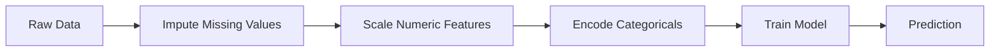

# ML Pipelines

> A model is not a product. A pipeline is. The pipeline is everything from raw data to deployed prediction, and every step must be reproducible.

**Type:** Build
**Language:** Python
**Prerequisites:** Phase 2, Lesson 12 (Hyperparameter Tuning)
**Time:** ~120 minutes

## Learning Objectives

- Build an ML pipeline from scratch that chains imputation, scaling, encoding, and model training into a single reproducible object
- Identify data leakage scenarios and explain how pipelines prevent them by fitting transformers only on training data
- Construct a ColumnTransformer that applies different preprocessing to numeric and categorical features
- Implement pipeline serialization and demonstrate that the same fitted pipeline produces identical results in training and production

## The Problem

You have a notebook that loads data, fills missing values with the median, scales features, trains a model, and prints accuracy. It works. You ship it.

A month later, someone retrains the model and gets different results. The median was computed on the full dataset including test data (data leakage). The scaling parameters were not saved, so inference uses different statistics. The feature engineering code was copy-pasted between training and serving, and the copies diverged. A categorical column gained a new value in production that the encoder has never seen.

Pipelines solve all of these by packaging every transformation step into a single, ordered, reproducible object.

## The Concept

### What a Pipeline Is

A pipeline is an ordered sequence of data transformations followed by a model. The entire pipeline is fitted once on training data. At inference time, the same fitted pipeline transforms new data and produces predictions.



The pipeline guarantees:
- Transformations are fitted only on training data (no leakage)
- The same transformations are applied at inference time
- The entire object can be serialized and deployed as one artifact
- Cross-validation applies the pipeline per fold, preventing subtle leakage

### Data Leakage: The Silent Killer

**Leaky (wrong):**
```python
scaler = StandardScaler()
X_scaled = scaler.fit_transform(X)  # Scaler saw test data!
X_train, X_test = X_scaled[:800], X_scaled[800:]
```

**Correct:**
```python
X_train, X_test = X[:800], X[800:]
scaler = StandardScaler()
X_train_scaled = scaler.fit_transform(X_train)
X_test_scaled = scaler.transform(X_test)
```

With a pipeline, you do not need to think about this.

### sklearn Pipeline

```python
from sklearn.pipeline import Pipeline
from sklearn.preprocessing import StandardScaler
from sklearn.linear_model import LogisticRegression

pipe = Pipeline([
    ("scaler", StandardScaler()),
    ("model", LogisticRegression()),
])

pipe.fit(X_train, y_train)
predictions = pipe.predict(X_test)
```

When you call `pipe.fit()`, the scaler calls `fit_transform` on training data only. When you call `pipe.predict()`, the scaler calls `transform` (not fit_transform).

### ColumnTransformer: Different Pipelines for Different Columns

```python
from sklearn.compose import ColumnTransformer
from sklearn.preprocessing import StandardScaler, OneHotEncoder
from sklearn.impute import SimpleImputer

numeric_pipe = Pipeline([
    ("impute", SimpleImputer(strategy="median")),
    ("scale", StandardScaler()),
])

categorical_pipe = Pipeline([
    ("impute", SimpleImputer(strategy="most_frequent")),
    ("encode", OneHotEncoder(handle_unknown="ignore")),
])

preprocessor = ColumnTransformer([
    ("num", numeric_pipe, ["age", "income", "score"]),
    ("cat", categorical_pipe, ["city", "gender", "plan"]),
])

full_pipeline = Pipeline([
    ("preprocess", preprocessor),
    ("model", GradientBoostingClassifier()),
])
```

The `handle_unknown="ignore"` is critical for production -- when a new category appears, it produces a zero vector instead of crashing.

### Experiment Tracking

**MLflow:**
```python
import mlflow

with mlflow.start_run():
    mlflow.log_param("max_depth", 5)
    mlflow.log_param("n_estimators", 100)
    pipe.fit(X_train, y_train)
    accuracy = pipe.score(X_test, y_test)
    mlflow.log_metric("accuracy", accuracy)
    mlflow.sklearn.log_model(pipe, "model")
```

**Weights & Biases:**
```python
import wandb
wandb.init(project="my-pipeline")
wandb.config.update({"max_depth": 5, "n_estimators": 100})
pipe.fit(X_train, y_train)
wandb.log({"accuracy": pipe.score(X_test, y_test)})
```

### Data Versioning with DVC

```
dvc init
dvc add data/training.csv
git add data/training.csv.dvc data/.gitignore
git commit -m "Track training data"
dvc push
```

DVC stores the actual data in remote storage and keeps a small `.dvc` file in git that records the hash.

### From Notebook to Production Pipeline

1. **Notebook exploration:** Quick experiments, visualizations, feature ideas
2. **Extract functions:** Move preprocessing, feature engineering, evaluation into modules
3. **Build Pipeline:** Chain transformations into a sklearn Pipeline or custom class
4. **Config management:** Move all hyperparameters into a YAML/JSON config
5. **Experiment tracking:** Add MLflow or wandb logging
6. **Data validation:** Check schema, distributions, and missing value patterns
7. **Tests:** Unit tests for transformers, integration tests for the full pipeline
8. **Deployment:** Serialize the pipeline, wrap in an API (FastAPI, Flask), containerize

### Common Pipeline Mistakes

| Mistake | Why it is bad | Fix |
|---------|-------------|-----|
| Fitting on full data before splitting | Data leakage | Use Pipeline with cross_val_score |
| Feature engineering outside pipeline | Different transforms at train vs serve | Put all transforms in the Pipeline |
| Not handling unknown categories | Production crash on new values | OneHotEncoder(handle_unknown="ignore") |
| Hardcoded column names | Breaks when schema changes | Use column name lists from config |

## Build It

### Step 1: Custom Transformer

```python
class CustomTransformer:
    def __init__(self):
        self.means = None
        self.stds = None

    def fit(self, X):
        self.means = np.mean(X, axis=0)
        self.stds = np.std(X, axis=0)
        self.stds[self.stds == 0] = 1.0
        return self

    def transform(self, X):
        return (X - self.means) / self.stds

    def fit_transform(self, X):
        return self.fit(X).transform(X)
```

### Step 2: Pipeline from Scratch

```python
class PipelineFromScratch:
    def __init__(self, steps):
        self.steps = steps

    def fit(self, X, y=None):
        X_current = X.copy()
        for name, step in self.steps[:-1]:
            X_current = step.fit_transform(X_current)
        name, model = self.steps[-1]
        model.fit(X_current, y)
        return self

    def predict(self, X):
        X_current = X.copy()
        for name, step in self.steps[:-1]:
            X_current = step.transform(X_current)
        name, model = self.steps[-1]
        return model.predict(X_current)
```

## Ship It

This lesson produces `outputs/prompt-ml-pipeline.md`.

## Exercises

1. Build a pipeline that handles a dataset with 3 numeric columns and 2 categorical columns. Use ColumnTransformer to apply median imputation + scaling to numerics and most-frequent imputation + one-hot encoding to categoricals.
2. Deliberately introduce data leakage: fit the scaler on the full dataset before splitting. Compare the cross-validation score (leaky) to the pipeline cross-validation score (clean).
3. Serialize your pipeline with `joblib.dump`. Load it in a separate script and verify the predictions are identical.
4. Add a custom transformer to the pipeline that creates polynomial features (degree 2) for the two most important numeric columns.
5. Set up MLflow tracking for the pipeline. Run 5 experiments with different hyperparameters.

## Key Terms

| Term | What people say | What it actually means |
|------|----------------|----------------------|
| Pipeline | "Chain of transforms + model" | An ordered sequence of fitted transformers and a model, applied as one unit to prevent leakage |
| Data leakage | "Test info leaked into training" | Using information from outside the training set to build the model, inflating performance estimates |
| ColumnTransformer | "Different preprocessing per column" | Applies different pipelines to different subsets of columns, combining results |
| Experiment tracking | "Logging your runs" | Recording parameters, metrics, artifacts, and code versions for every training run |
| MLflow | "Track and deploy models" | Open-source platform for experiment tracking, model registry, and deployment |
| DVC | "Git for data" | Version control system for large data files |
| Model registry | "Model version catalog" | A system that tracks model versions with stage labels |
| Training/serving skew | "It worked in the notebook" | Differences between how data is processed during training versus inference |
| Reproducibility | "Same code, same result" | The ability to get identical results from the same code, data, and configuration |

## Further Reading

- [scikit-learn Pipeline docs](https://scikit-learn.org/stable/modules/compose.html)
- [MLflow documentation](https://mlflow.org/docs/latest/index.html)
- [DVC documentation](https://dvc.org/doc)
- [Sculley et al., Hidden Technical Debt in Machine Learning Systems (2015)](https://papers.nips.cc/paper/2015/hash/86df7dcfd896fcaf2674f757a2463eba-Abstract.html)
- [Google ML Best Practices: Rules of ML](https://developers.google.com/machine-learning/guides/rules-of-ml)

[Reference](https://github.com/rohitg00/ai-engineering-from-scratch/tree/main/phases/02-ml-fundamentals/13-ml-pipelines)
