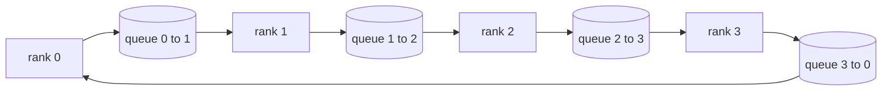
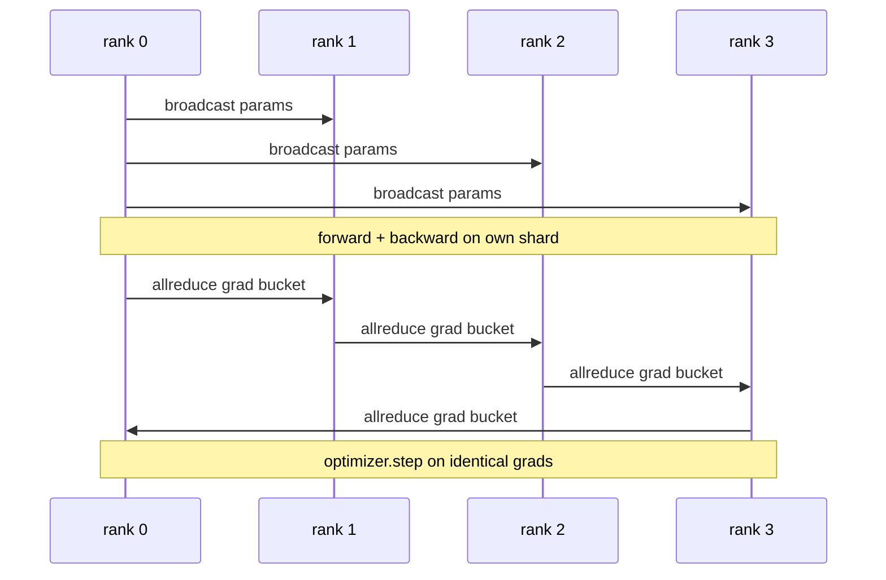
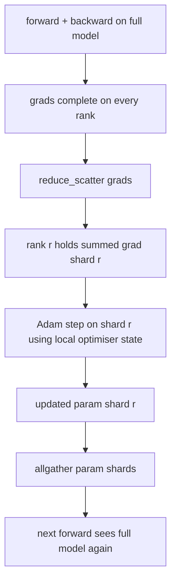
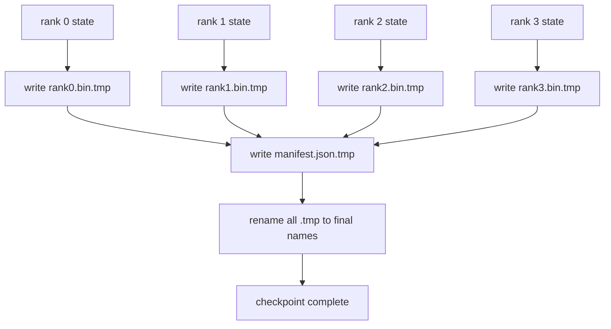
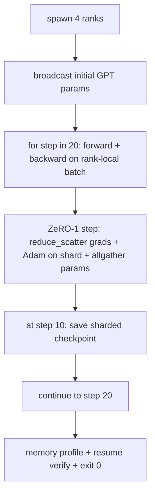

# Data/Zero/Pipeline Parallel from Scratch

> Combined lessons (6 parts), merged verbatim — no content removed.

**Type:** Combined

---

## Part 1 (ch490): Collective Ops From Scratch

> The four collective operations that hold distributed training together: allreduce, broadcast, allgather, reduce_scatter.

**Type:** Build
**Languages:** Python
**Prerequisites:** Phase 19 Track C lessons 42-49
**Time:** ~90 min

## Learning Objectives

- Implement ring allreduce in two passes (reduce-scatter then allgather).
- Build broadcast, allgather, and reduce_scatter over multiprocessing.Queue.
- Verify every primitive against gloo reference.
- Defend ring vs tree on cluster shape and latency.

## The Concept



### Primitive comparison

| Primitive | Per-rank bytes | Steps |
|-----------|---------------|-------|
| Ring allreduce | 2T(N-1)/N | 2(N-1) |
| Tree allreduce | T log2(N) | 2 log2(N) |
| Broadcast | T | log2(N) |
| Allgather | T(N-1)/N | N-1 |
| Reduce_scatter | T(N-1)/N | N-1 |

## Build It

`code/main.py` implements: `Mesh`, `ring_allreduce`, `broadcast`, `allgather`, `reduce_scatter`, `_gloo_reference`.

## Key Terms

| Term | What it actually means |
|------|------------------------|
| Allreduce | Sum across ranks, every rank holds the reduced tensor |
| Ring | N-1 chunks of size T/N flow around the cycle twice |
| Tree | Reduction follows binary tree, depth log2(N) |
| Allgather | Every rank ends with every other rank's shard |
| Reduce_scatter | Each rank ends with sum of one chunk only |
| Bucket | Fuse N small allreduces into one large one |

[Reference](https://github.com/rohitg00/ai-engineering-from-scratch/tree/main/phases/19-capstone-projects/76-collective-ops-from-scratch)

---

## Part 2 (ch491): Data Parallel DDP From Scratch

> DistributedDataParallel is a hook on top of allreduce. Broadcast parameters, install a backward hook, allreduce gradients, step.

**Type:** Build
**Languages:** Python
**Prerequisites:** Phase 19 Track C lessons 42-49
**Time:** ~90 min

## Learning Objectives

- Wire a DDP-shaped wrapper with broadcast and allreduce.
- Spawn N CPU ranks with gloo backend.
- Prove gradient-sync correctness against sequential baseline.
- Defend buckets and overlap as production improvements.

## The Concept



### The three operations DDP needs

| Stage | Collective | Why |
|-------|-----------|-----|
| Init | broadcast from rank 0 | Same starting parameters |
| After backward | allreduce of each grad | Mean gradient for optimizer |
| Sometimes | broadcast of buffers | Synced batchnorm stats |

## Build It

`code/main.py` implements: `MiniMLP`, `DistributedDataParallel`, `worker`, `_reference_single_process_loop`.

## Key Terms

| Term | What it actually means |
|------|------------------------|
| DDP | Wrapper that broadcasts params and allreduces grads each step |
| Bucket | Group N small allreduces into one large one |
| Overlap | Issue allreduce while later layers compute backward |
| no_sync | Skip post-backward allreduce for gradient accumulation |

[Reference](https://github.com/rohitg00/ai-engineering-from-scratch/tree/main/phases/19-capstone-projects/77-data-parallel-ddp)

---

## Part 3 (ch492): ZeRO Optimizer State Sharding

> Adam stores two moment estimates per parameter. ZeRO stage 1 shards that across N ranks for a linear memory drop.

**Type:** Build
**Languages:** Python
**Prerequisites:** Phase 19 Track C lessons 42-49
**Time:** ~90 min

## Learning Objectives

- Shard optimiser state across N ranks so each owns 1/N.
- Use reduce_scatter + allgather for gradient delivery and param broadcast.
- Compute the memory savings table for ZeRO stages.
- Defend stage choice on model size and bandwidth.

## The Concept



### Memory math (P parameters, Adam, mixed precision)

| Term | Vanilla | ZeRO-1 |
|------|---------|--------|
| fp16 params | 2P | 2P |
| fp16 grads | 2P | 2P |
| fp32 master | 4P | 4P/N |
| fp32 moments | 8P | 8P/N |
| Total | 16P | 4P + 12P/N |

At N=8: 65% drop. At N=64: 74% drop.

## Build It

`code/main.py` implements: `flatten_params`, `unflatten_into`, `ZeroOptimizer`.

## Key Terms

| Term | What it actually means |
|------|------------------------|
| ZeRO-1 | Shard optimiser state only |
| ZeRO-2 | Shard gradients too |
| ZeRO-3 | Shard parameters (FSDP) |
| Master copy | fp32 parameter copy the optimiser updates |
| Reduce_scatter | Deliver each rank only its shard's summed gradient |

[Reference](https://github.com/rohitg00/ai-engineering-from-scratch/tree/main/phases/19-capstone-projects/78-zero-parameter-sharding)

---

## Part 4 (ch493): Pipeline Parallel and Bubble Analysis

> Pipeline splits the model across ranks. Microbatches flow through. The empty time at start and end is the bubble.

**Type:** Build
**Languages:** Python
**Prerequisites:** Phase 19 Track C lessons 42-49
**Time:** ~90 min

## Learning Objectives

- Split a model into N stages and simulate forward pipeline.
- Schedule M microbatches with GPipe schedule and compute bubble fraction.
- Compare against 1F1B schedule.
- Defend equal compute per stage over equal parameter count.

## The Concept


### Bubble fraction (GPipe)

```
bubble = (N - 1) / (M + N - 1)
```

At M=8, N=4: 27%. At M=64, N=4: 4.5%.

### GPipe vs 1F1B

| Schedule | Forward | Backward | Activation memory |
|----------|---------|----------|-------------------|
| GPipe | All M forwards first | Then all backwards | O(M) |
| 1F1B | Interleaved F and B | Interleaved | O(depth) |

## Build It

`code/main.py` implements: `PipelineStage`, `Pipeline`, `bubble_fraction`.

## Key Terms

| Term | What it actually means |
|------|------------------------|
| Pipeline | One stage per rank, activations flow stage to stage |
| Bubble | (N-1) steps at start + end where some stages have no work |
| Microbatch | One forward/backward unit; bubble shrinks as M grows |
| GPipe | Fill then drain; high activation memory |
| 1F1B | Interleaved; bounded activation memory |

[Reference](https://github.com/rohitg00/ai-engineering-from-scratch/tree/main/phases/19-capstone-projects/79-pipeline-parallel)

---

## Part 5 (ch494): Sharded Checkpoint and Atomic Resume

> A 70B training job fails every few hours. The checkpoint format decides whether you lose 30 minutes or 30 hours.

**Type:** Build
**Languages:** Python
**Prerequisites:** Phase 19 Track C lessons 42-49
**Time:** ~90 min

## Learning Objectives

- Save a multi-rank checkpoint as per-rank shard files plus manifest.
- Use atomic write pattern (temp then rename).
- Resume from manifest, verifying byte-equal state.
- Defend manifest schema against world-size change, shard mismatch, partial write.

## The Concept



### Manifest schema

```json
{
  "world_size": 4,
  "step": 1234,
  "wall_clock_seconds": 4521,
  "shards": [
    {"rank": 0, "path": "rank0.bin", "sha256": "...", "param_shard_offset": 0, "param_shard_numel": 65536}
  ],
  "schema_version": 1
}
```

### Failure mode defences

| Failure | Defence |
|---------|---------|
| World-size change | manifest mismatch, fail loudly |
| Shard count mismatch | enumerate and verify existence |
| Partial write | sha256 verification on load |

## Build It

`code/main.py` implements: `ShardManifest`, `save_sharded`, `load_sharded`, round-trip test.

## Key Terms

| Term | What it actually means |
|------|------------------------|
| Sharded checkpoint | Each rank writes its own shard file in parallel |
| Manifest | JSON with shard paths, offsets, sha256 |
| Atomic write | Write to .tmp then POSIX rename |
| Partial write | Truncated shard; sha256 catches it |
| Rotation | Keep last K checkpoints, delete oldest |

[Reference](https://github.com/rohitg00/ai-engineering-from-scratch/tree/main/phases/19-capstone-projects/80-checkpoint-sharded-resume)

---

## Part 6 (ch495): End-to-End Distributed Training

> Six lessons of pieces. One assembly: DDP + ZeRO-1 + sharded checkpoint training a tiny GPT across 4 ranks.

**Type:** Build
**Languages:** Python
**Prerequisites:** Phase 19 Track C lessons 42-49
**Time:** ~90 min

## Learning Objectives

- Compose DDP + ZeRO-1 + sharded checkpoint into one training loop.
- Train a 2-layer transformer LM on synthetic corpus across 4 ranks.
- Print per-step loss, per-rank memory, and checkpoint manifest.
- Defend that each piece is independently testable.

## The Concept



### Composition rules

| Piece | Owns | Leaves to loop |
|-------|------|----------------|
| DDP broadcast | Initial param sync | One call at construct |
| ZeRO-1 | Gradient sync + master copy + param broadcast | One call per step |
| Sharded checkpoint | Persist per-rank state + manifest | Called on rank 0 |

## Build It

`code/main.py` implements: `MiniGPT` (2-layer transformer), `make_corpus`, `_train_worker`, `verify_resume`, `main`.

## Key Terms

| Term | What it actually means |
|------|------------------------|
| End-to-end | One run composes every piece, not a unit test per piece |
| Memory profile | Bytes per rank for params, grads, optimiser state |
| Resume contract | Per-rank state byte-equal after checkpoint round-trip |
| Self-terminating | Fixed step count, exit 0, no human in loop |

[Reference](https://github.com/rohitg00/ai-engineering-from-scratch/tree/main/phases/19-capstone-projects/81-end-to-end-distributed-train)
