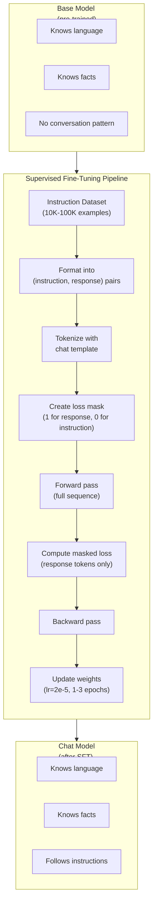
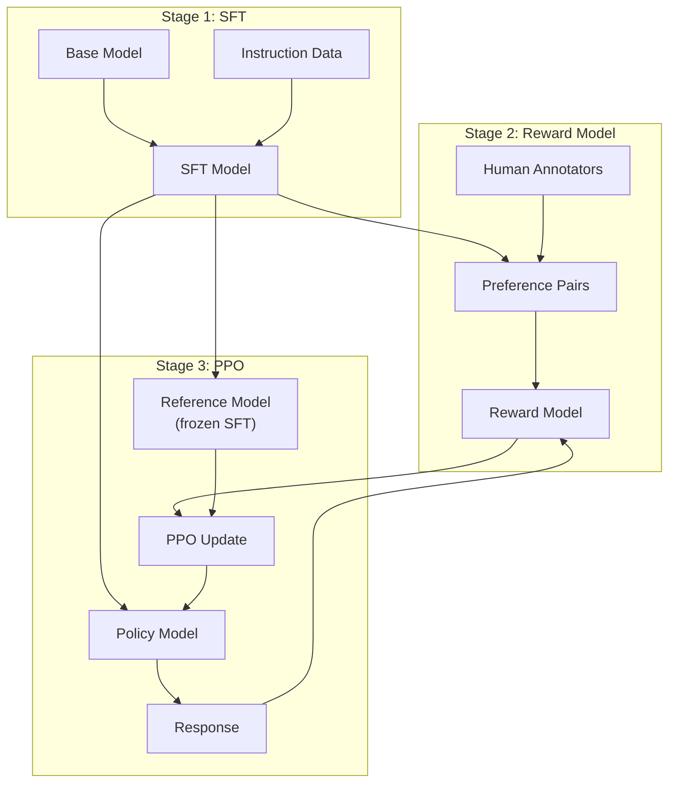
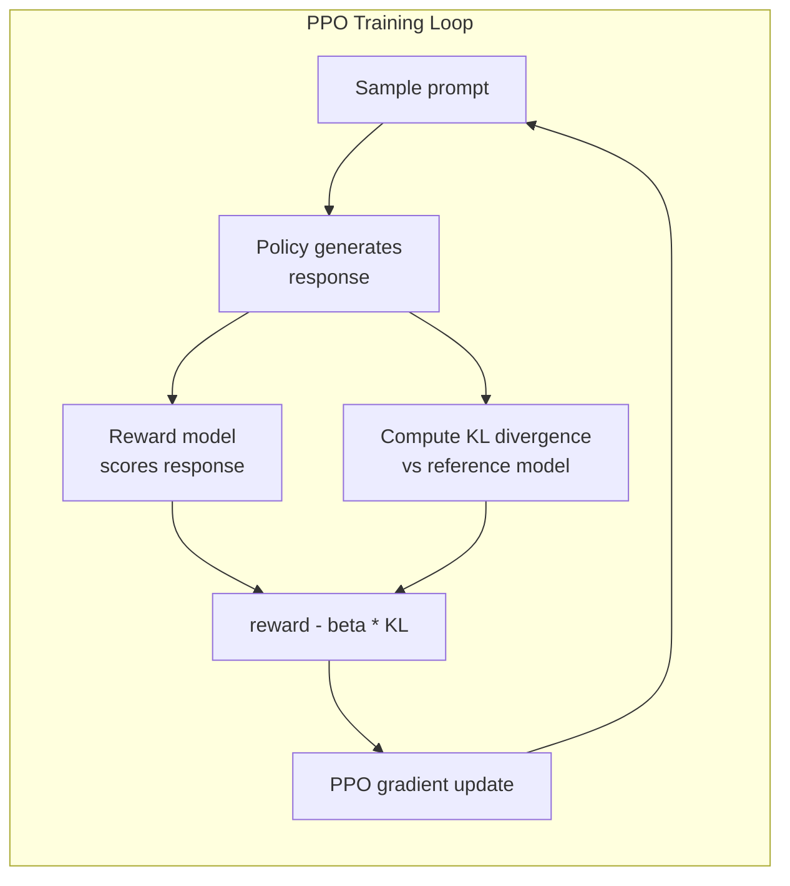
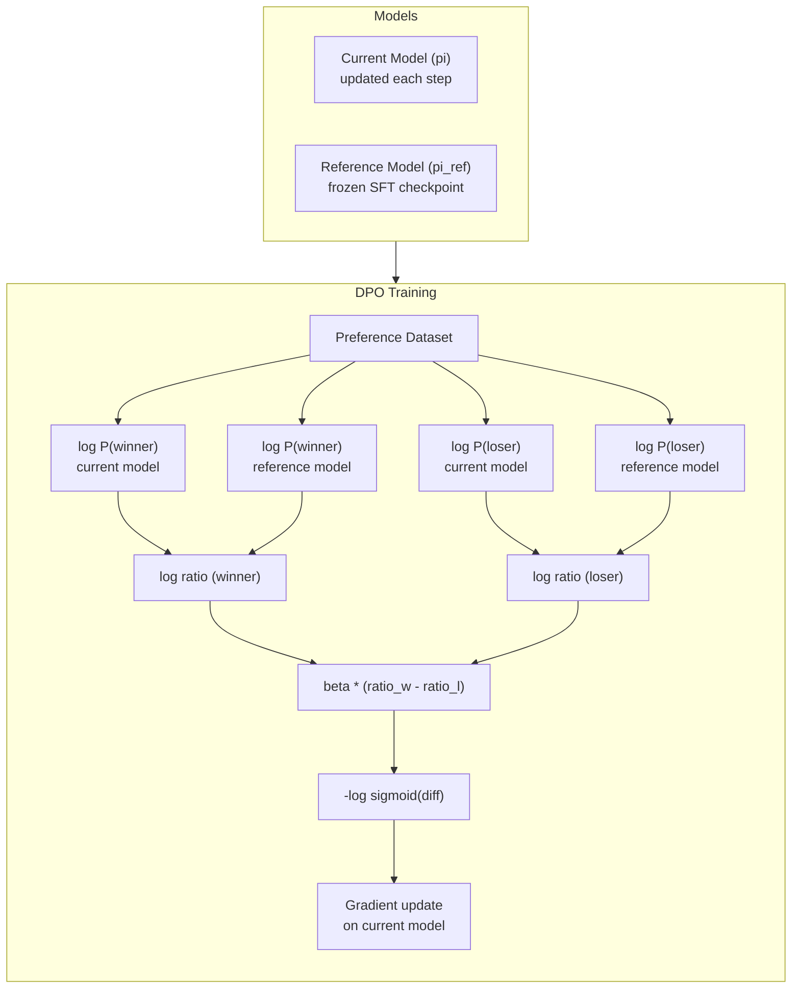
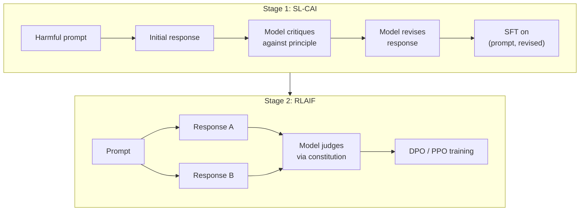
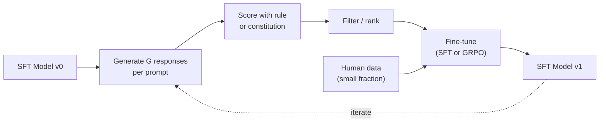
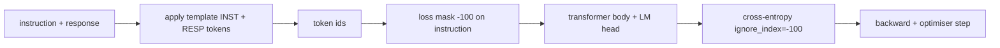
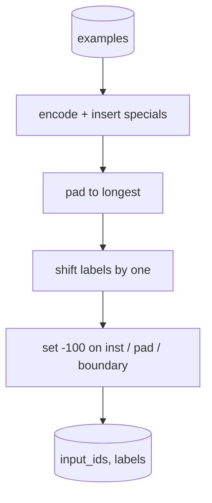
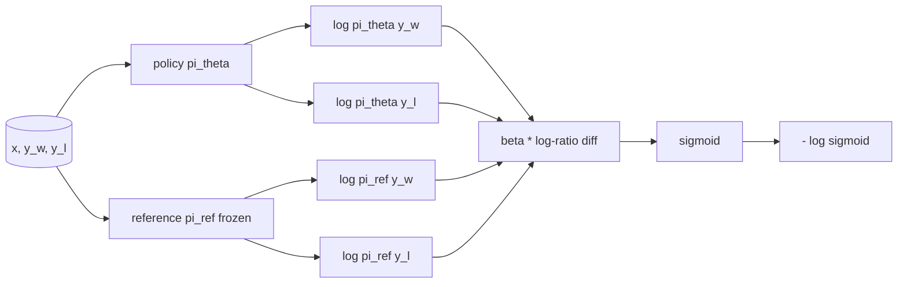

# SFT, RLHF, DPO & Constitutional AI

> Combined lessons (6 parts), merged verbatim — no content removed.

**Type:** Combined

---

## Part 1 (ch188): Instruction Tuning (SFT)

> A base model predicts the next token. That's it. It doesn't follow instructions, answer questions, or refuse harmful requests. SFT is the bridge between a token predictor and a useful assistant. Every model you've ever talked to -- Claude, GPT, Llama Chat -- went through this step.

**Type:** Build
**Languages:** Python (with numpy)
**Prerequisites:** Phase 10, Lesson 04 (Pre-Training a Mini GPT)
**Time:** ~90 minutes

## Learning Objectives

- Implement supervised fine-tuning (SFT) that converts a base language model into an instruction-following assistant
- Format training data using chat templates with system, user, and assistant roles, and mask loss on non-assistant tokens
- Explain why SFT is necessary: base models continue text rather than answer questions
- Evaluate SFT quality by comparing base model vs fine-tuned model responses on a held-out instruction set

## The Problem

You trained a model in Lesson 04. It can predict the next token given a sequence. Feed it "The transformer architecture" and it might continue with "has revolutionized natural language processing." That's impressive for a next-token predictor.

Now try this: feed it "What is the capital of France?" A base model doesn't answer "Paris." It continues the pattern. It might produce "What is the capital of Germany? What is the capital of Spain?" because it learned from documents that contain lists of questions. Or it might produce "is a question that many people ask" because that's a plausible next-token continuation. The model has no concept of *answering*. It only knows *continuing*.

This is the gap between GPT-3 (base model, released June 2020) and ChatGPT (instruction-tuned, released November 2022). Same architecture. Same pre-training. The difference is 20,000 to 100,000 carefully crafted (instruction, response) pairs that taught the model to follow the conversation pattern.

Stanford Alpaca proved you don't need millions of examples. In March 2023, they fine-tuned Llama 7B on just 52,000 instruction-response pairs generated by GPT-3.5. Total cost: $600. The result was a chatbot that could follow instructions, answer questions, and hold conversations. Not as good as ChatGPT, but shockingly close for $600 and a few hours of training.

Meta's Llama 2 Chat used only ~27,000 high-quality examples for its initial SFT stage. The key insight: quality matters more than quantity. 27,000 examples written by skilled annotators beat 1 million noisy examples scraped from the internet.

## The Concept

### What SFT Actually Does

Supervised Fine-Tuning continues the same training loop from pre-training -- forward pass, compute loss, backward pass, update weights -- but on a different kind of data. Instead of raw text, you train on structured conversations:

```json
{
  "system": "You are a helpful assistant.",
  "user": "What is the capital of France?",
  "assistant": "The capital of France is Paris."
}
```

The model already knows that Paris is the capital of France. It learned this during pre-training on Wikipedia, textbooks, and web pages. SFT doesn't teach the model new facts. It teaches the model a new *behavior*: when you see a question, produce an answer. When you see an instruction, produce a completion. When you see a harmful request, produce a refusal.

Think of it this way. Pre-training gives the model knowledge. SFT gives the model manners.

### Data Formats

Three formats dominate the industry. Each encodes the same information -- who said what -- with different delimiters.

**Alpaca Format** (Stanford, March 2023):

```json
{
  "instruction": "Summarize the following article in 3 sentences.",
  "input": "The European Central Bank raised interest rates...",
  "output": "The ECB increased rates by 25 basis points..."
}
```

Simple and widely used. The `input` field is optional -- many instructions don't need additional context. Stanford released 52,000 examples in this format, generated by GPT-3.5 for $600. This kicked off the open-source instruction tuning movement.

**ShareGPT Format** (community, 2023):

```json
{
  "conversations": [
    {"from": "system", "value": "You are a helpful assistant."},
    {"from": "human", "value": "What causes tides?"},
    {"from": "gpt", "value": "Tides are caused by the gravitational pull of the Moon..."},
    {"from": "human", "value": "How often do they occur?"},
    {"from": "gpt", "value": "Most coastal areas experience two high tides and two low tides per day..."}
  ]
}
```

Supports multi-turn conversations. The "from" field uses "human" and "gpt" by convention, regardless of the actual model. Vicuna was trained on 70,000 ShareGPT conversations scraped from user-shared ChatGPT transcripts.

**ChatML Format** (OpenAI, used by many open-source models):

```
<|im_start|>system
You are a helpful assistant.<|im_end|>
<|im_start|>user
What is the capital of France?<|im_end|>
<|im_start|>assistant
The capital of France is Paris.<|im_end|>
```

Uses special tokens (`<|im_start|>`, `<|im_end|>`) to delimit roles. These tokens are added to the tokenizer's vocabulary during fine-tuning. Qwen, Yi, and many other models use ChatML.

All three formats accomplish the same thing: they tell the model "this is the instruction, this is the response, learn this pattern."

### Why It Works

The model already knows language from pre-training. It has seen billions of examples of questions followed by answers, instructions followed by completions, and conversations between people. The patterns are already encoded in the weights.

SFT concentrates this latent ability. Instead of the model needing to figure out from context whether it should answer a question or continue a document, SFT explicitly trains on the conversation pattern. After a few thousand examples, the model learns: when you see the assistant role marker, produce a helpful response.

This is why 27,000 examples is enough. You're not teaching the model English. You're not teaching it facts about the world. You're teaching it one simple behavior: respond to instructions. The knowledge was already there.

### The Masked Loss

This is the most important technical detail in SFT, and most tutorials skip it.

During pre-training, you compute loss on every token. The model learns to predict every next token in the sequence. During SFT, you only compute loss on the *response* tokens. The instruction tokens are there for context, but the model is not penalized for "predicting" them incorrectly.

Why? Because you don't want the model to learn to *generate* instructions. You want it to learn to *respond to* instructions. If you compute loss on the instruction tokens, you're training the model to predict "What is the capital of France?" as if it's the one asking the question. That wastes gradient signal and can confuse the model about its role.

In practice, you create a loss mask: 1 for response tokens, 0 for instruction tokens. Multiply the per-token loss by this mask before averaging.

```
Tokens:    [SYS] You are helpful [USER] What is the capital? [ASST] Paris is the capital [EOS]
Loss mask:   0    0    0     0      0     0   0  0     0       1     1    1   1     1      1
```

Only the tokens after `[ASST]` contribute to the loss. The model sees the full conversation during the forward pass (it needs the instruction to produce the right response) but only updates its weights based on how well it predicted the response.

### Training Hyperparameters

SFT uses dramatically different hyperparameters than pre-training. You're not training from scratch. You're adjusting a model that already works.

| Parameter | Pre-Training (Llama 2 7B) | SFT (Llama 2 Chat) |
|-----------|---------------------------|---------------------|
| Learning rate | 3e-4 (peak) | 2e-5 |
| Epochs | 1 (single pass over data) | 2 |
| Batch size | 4M tokens | 64 examples |
| Warmup steps | 2,000 | 0-100 |
| Weight decay | 0.1 | 0.0-0.1 |
| Data size | 2T tokens | 27,000 examples |

The learning rate is 15x lower for SFT. This is critical. A high learning rate during fine-tuning destroys the pre-trained knowledge. The model "forgets" what it learned and overfits to the small fine-tuning dataset. This is catastrophic forgetting.

Two epochs means the model sees each training example twice. More than 3 epochs on a small dataset leads to memorization -- the model starts reproducing training examples verbatim instead of generalizing.

### Catastrophic Forgetting

Fine-tuning can destroy general capabilities. Train too long on instruction-following data and the model loses its ability to write code, do math, or produce creative text. It becomes very good at the specific format of its training data and terrible at everything else.

Three mitigations:

1. **Low learning rate.** 1e-5 to 5e-5. Smaller updates mean less destruction of pre-trained features.

2. **Short training.** 1-3 epochs. Stop before the model overfits.

3. **Mix in pre-training data.** Llama 2 Chat mixed a small percentage (2-5%) of raw pre-training data into the SFT dataset. This "reminds" the model of its general capabilities while learning the new instruction-following behavior.

### Real Numbers

Fine-tuning a 7B model on 10,000 high-quality instruction pairs takes approximately 1 hour on a single NVIDIA A100 80GB GPU. Here's the math:

- 10,000 examples x 512 tokens average = 5.12M tokens
- 2 epochs = 10.24M tokens total
- A100 throughput for 7B model fine-tuning: ~3,000 tokens/second
- 10.24M / 3,000 = ~3,400 seconds = ~57 minutes

For our mini GPT (4 layers, 128 dims), training is nearly instant. The point is understanding the mechanics, not the scale.



## Build It

### Step 1: Instruction Dataset

Create a synthetic instruction dataset. In production, companies like Scale AI and Anthropic employ human annotators to write these. We'll create them programmatically to demonstrate the format.

```python
import numpy as np

INSTRUCTION_DATA = [
    {
        "instruction": "What is the capital of France?",
        "response": "The capital of France is Paris."
    },
    {
        "instruction": "Explain gravity in one sentence.",
        "response": "Gravity is the force that attracts objects with mass toward each other."
    },
    {
        "instruction": "Write a haiku about the ocean.",
        "response": "Waves crash on the shore, salt and foam beneath the sun, endless blue expanse."
    },
    {
        "instruction": "What is 15 multiplied by 7?",
        "response": "15 multiplied by 7 is 105."
    },
    {
        "instruction": "Name three programming languages.",
        "response": "Three programming languages are Python, Rust, and TypeScript."
    },
    {
        "instruction": "Summarize photosynthesis.",
        "response": "Photosynthesis converts sunlight, water, and carbon dioxide into glucose and oxygen."
    },
    {
        "instruction": "What year did World War II end?",
        "response": "World War II ended in 1945."
    },
    {
        "instruction": "Define machine learning.",
        "response": "Machine learning is a field where algorithms learn patterns from data to make predictions."
    },
]
```

Eight examples is tiny. Stanford Alpaca used 52,000. But the mechanics are identical whether you have 8 or 52,000: tokenize, mask, compute loss on responses only.

### Step 2: Tokenize with Chat Template

Convert instruction-response pairs into token sequences with special role markers. The markers tell the model where the instruction ends and where the response begins.

```python
SPECIAL_TOKENS = {
    "INST_START": 253,
    "INST_END": 254,
    "RESP_START": 255,
}


def tokenize_instruction_pair(instruction, response, vocab_size=256):
    inst_tokens = list(instruction.encode("utf-8"))
    resp_tokens = list(response.encode("utf-8"))

    inst_tokens = [min(t, vocab_size - 4) for t in inst_tokens]
    resp_tokens = [min(t, vocab_size - 4) for t in resp_tokens]

    tokens = (
        [SPECIAL_TOKENS["INST_START"]]
        + inst_tokens
        + [SPECIAL_TOKENS["INST_END"]]
        + [SPECIAL_TOKENS["RESP_START"]]
        + resp_tokens
    )

    return tokens


def create_loss_mask(tokens):
    mask = np.zeros(len(tokens), dtype=np.float32)
    in_response = False

    for i, token in enumerate(tokens):
        if token == SPECIAL_TOKENS["RESP_START"]:
            in_response = True
            continue
        if in_response:
            mask[i] = 1.0

    return mask
```

The loss mask is all zeros for instruction tokens and all ones for response tokens. The `RESP_START` token itself gets a mask of 0 because it's a delimiter, not part of the response content.

### Step 3: Masked Cross-Entropy Loss

Standard cross-entropy, but multiplied by the loss mask. Only response tokens contribute to the gradient.

```python
def masked_cross_entropy_loss(logits, targets, loss_mask):
    batch, seq_len, vocab_size = logits.shape
    logits_flat = logits.reshape(-1, vocab_size)
    targets_flat = targets.reshape(-1)
    mask_flat = loss_mask.reshape(-1)

    max_logits = logits_flat.max(axis=-1, keepdims=True)
    log_softmax = logits_flat - max_logits - np.log(
        np.exp(logits_flat - max_logits).sum(axis=-1, keepdims=True)
    )

    per_token_loss = -log_softmax[np.arange(len(targets_flat)), targets_flat]

    masked_loss = per_token_loss * mask_flat
    num_response_tokens = mask_flat.sum()
    if num_response_tokens == 0:
        return 0.0
    loss = masked_loss.sum() / num_response_tokens

    return loss
```

The denominator is `num_response_tokens`, not `seq_len`. If you divide by the total sequence length, longer instructions dilute the gradient signal. Dividing by response token count ensures equal weight per response token regardless of instruction length.

### Step 4: SFT Training Loop

Reuse the MiniGPT from Lesson 04. The training loop looks almost identical to pre-training, but with instruction formatting and masked loss.

```python
def sft_train(model, dataset, num_epochs=2, lr=2e-5, seq_len=64):
    formatted_data = []
    for example in dataset:
        tokens = tokenize_instruction_pair(example["instruction"], example["response"])
        mask = create_loss_mask(tokens)
        formatted_data.append((tokens, mask))

    print(f"SFT Training: {len(formatted_data)} examples, {num_epochs} epochs, lr={lr}")
    print(f"Total tokens: {sum(len(t) for t, _ in formatted_data):,}")
    print()

    losses = []

    for epoch in range(num_epochs):
        epoch_loss = 0.0
        num_batches = 0

        indices = np.random.permutation(len(formatted_data))

        for idx in indices:
            tokens, mask = formatted_data[idx]

            if len(tokens) < 3:
                continue
            if len(tokens) > seq_len:
                tokens = tokens[:seq_len]
                mask = mask[:seq_len]

            input_ids = np.array(tokens[:-1]).reshape(1, -1)
            target_ids = np.array(tokens[1:]).reshape(1, -1)
            loss_mask = np.array(mask[1:]).reshape(1, -1)

            logits = model.forward(input_ids)
            loss = masked_cross_entropy_loss(logits, target_ids, loss_mask)

            batch_size, s_len, v_size = logits.shape
            probs = np.exp(logits - logits.max(axis=-1, keepdims=True))
            probs = probs / probs.sum(axis=-1, keepdims=True)
            dlogits = probs.copy()
            dlogits[np.arange(batch_size)[:, None], np.arange(s_len), target_ids] -= 1.0

            mask_expanded = loss_mask[:, :, np.newaxis]
            num_resp = loss_mask.sum()
            if num_resp > 0:
                dlogits = dlogits * mask_expanded / num_resp

            for block in model.blocks:
                block.ffn.W1 -= lr * np.random.randn(*block.ffn.W1.shape) * 0.01
                block.ffn.W2 -= lr * np.random.randn(*block.ffn.W2.shape) * 0.01
                block.ffn.b1 -= lr * np.random.randn(*block.ffn.b1.shape) * 0.01
                block.ffn.b2 -= lr * np.random.randn(*block.ffn.b2.shape) * 0.01

            epoch_loss += loss
            num_batches += 1
            losses.append(loss)

        avg_loss = epoch_loss / max(num_batches, 1)
        print(f"Epoch {epoch + 1}/{num_epochs} | Avg Loss: {avg_loss:.4f}")

    return model, losses
```

The learning rate is 2e-5, matching Llama 2 Chat. Compare this to the 3e-4 used in pre-training -- 15x smaller. The gradient is masked: instruction tokens produce zero gradient. Only response tokens push the weights.

### Step 5: Compare Base vs SFT Model

The whole point of SFT is behavioral change. Let's measure it by checking how the model responds to instruction-formatted inputs versus raw text continuations.

```python
def generate_response(model, prompt_tokens, max_new_tokens=50, temperature=0.8):
    tokens = list(prompt_tokens)
    seq_len = model.embedding.pos_embed.shape[0]

    for _ in range(max_new_tokens):
        context = np.array(tokens[-seq_len:]).reshape(1, -1)
        logits = model.forward(context)
        next_logits = logits[0, -1, :]

        next_logits = next_logits / max(temperature, 1e-8)
        probs = np.exp(next_logits - next_logits.max())
        probs = probs / probs.sum()
        probs = np.clip(probs, 1e-10, 1.0)
        probs = probs / probs.sum()

        next_token = np.random.choice(len(probs), p=probs)
        tokens.append(int(next_token))

    return tokens


def evaluate_instruction_following(model, instructions):
    print("Evaluating instruction following:")
    print("-" * 50)

    for instruction in instructions:
        tokens = (
            [SPECIAL_TOKENS["INST_START"]]
            + [min(t, 252) for t in list(instruction.encode("utf-8"))]
            + [SPECIAL_TOKENS["INST_END"]]
            + [SPECIAL_TOKENS["RESP_START"]]
        )

        output = generate_response(model, tokens, max_new_tokens=30, temperature=0.6)
        response_start = len(tokens)
        response_tokens = output[response_start:]
        response_bytes = bytes([t for t in response_tokens if t < 128])
        response_text = response_bytes.decode("utf-8", errors="replace")

        print(f"  Q: {instruction}")
        print(f"  A: {response_text[:80]}")
        print()
```

On a tiny model with 8 examples, the responses won't be meaningful. That's expected. The important thing is the *structure*: the model learns to produce output after the response marker instead of continuing to generate more instructions.

### Step 6: Measure Catastrophic Forgetting

Compare the model's next-token prediction ability before and after SFT. If SFT damages general capabilities, the loss on raw text will increase.

```python
def measure_forgetting(model, test_text, seq_len=64):
    tokens = np.array(list(test_text.encode("utf-8")[:512]))

    total_loss = 0.0
    num_windows = 0

    for start in range(0, len(tokens) - seq_len - 1, seq_len):
        input_ids = tokens[start:start + seq_len].reshape(1, -1)
        target_ids = tokens[start + 1:start + seq_len + 1].reshape(1, -1)

        logits = model.forward(input_ids)

        batch, s_len, vocab_size = logits.shape
        logits_flat = logits.reshape(-1, vocab_size)
        targets_flat = target_ids.reshape(-1)

        max_logits = logits_flat.max(axis=-1, keepdims=True)
        log_softmax = logits_flat - max_logits - np.log(
            np.exp(logits_flat - max_logits).sum(axis=-1, keepdims=True)
        )

        loss = -log_softmax[np.arange(len(targets_flat)), targets_flat].mean()
        total_loss += loss
        num_windows += 1

    return total_loss / max(num_windows, 1)
```

In real fine-tuning, you would track this metric throughout training. If the raw text loss increases by more than 10-15%, your SFT is too aggressive. Lower the learning rate or reduce the number of epochs.

## Use It

```python
if __name__ == "__main__":
    np.random.seed(42)

    test_text = """The transformer architecture processes sequences through self-attention.
Each layer applies multi-head attention followed by a feedforward network.
Residual connections and layer normalization stabilize deep networks.
The model learns to predict the next token given all previous tokens."""

    print("=" * 70)
    print("INSTRUCTION TUNING (SFT) DEMO")
    print("=" * 70)
    print()

    model = MiniGPT(
        vocab_size=256, embed_dim=128, num_heads=4,
        num_layers=4, max_seq_len=128, ff_dim=512
    )
    print(f"Model: {model.count_parameters():,} parameters")

    print("PRE-SFT: Measuring base model loss on raw text")
    base_loss = measure_forgetting(model, test_text)
    print(f"  Base model loss: {base_loss:.4f}")
    print()

    model, losses = sft_train(
        model, INSTRUCTION_DATA, num_epochs=3, lr=2e-5, seq_len=128
    )

    print("POST-SFT: Measuring fine-tuned model loss on raw text")
    sft_loss = measure_forgetting(model, test_text)
    print(f"  SFT model loss: {sft_loss:.4f}")
    print(f"  Change: {((sft_loss - base_loss) / base_loss * 100):+.1f}%")

    print("INSTRUCTION FOLLOWING EVALUATION")
    test_instructions = [
        "What is the capital of France?",
        "Name a programming language.",
        "Define gravity.",
    ]
    evaluate_instruction_following(model, test_instructions)
```

## Ship It

This lesson produces `outputs/prompt-sft-data-curator.md` -- a prompt that helps you design and curate instruction datasets for SFT.

## Exercises

1. Add system prompt support. Modify `tokenize_instruction_pair` to accept a system message and prepend it before the instruction.
2. Implement data mixing. Create a function that takes an SFT dataset and a raw text corpus, then produces training batches where 5% of examples are raw text (no masking) and 95% are instruction pairs.
3. Build a data quality scorer. For each instruction-response pair, compute: (a) response length in tokens, (b) instruction-to-response ratio, (c) vocabulary diversity.
4. Implement multi-turn conversation training. Extend the tokenization to handle 3-turn conversations (user-assistant-user-assistant-user-assistant).
5. Compare learning rates. Train with lr=1e-4, lr=2e-5, and lr=1e-6. Plot the loss curves. The 2e-5 run should be the sweet spot.

## Key Terms

| Term | What people say | What it actually means |
|------|----------------|----------------------|
| SFT | "Fine-tuning on conversations" | Supervised Fine-Tuning: continuing training on (instruction, response) pairs with loss computed only on response tokens |
| Instruction tuning | "Teaching the model to follow instructions" | Training on explicit instruction-response pairs so the base model learns the conversation pattern, not new knowledge |
| Loss masking | "Ignoring the prompt" | Setting loss to zero for instruction tokens so gradients only flow from response token predictions |
| ChatML | "Chat Markup Language" | A token format using `<|im_start|>` and `<|im_end|>` delimiters to mark speaker roles in conversation data |
| Alpaca format | "Stanford's format" | A JSON format with instruction/input/output fields, used for 52K GPT-3.5-generated examples that cost $600 |
| Catastrophic forgetting | "The model gets dumber" | Fine-tuning destroys pre-trained capabilities because gradient updates overwrite general knowledge with task-specific patterns |

## Further Reading

- [Ouyang et al., 2022 -- "Training language models to follow instructions with human feedback" (InstructGPT)](https://arxiv.org/abs/2203.02155)
- [Taori et al., 2023 -- "Stanford Alpaca: An Instruction-following LLaMA Model"](https://github.com/tatsu-lab/stanford_alpaca)
- [Touvron et al., 2023 -- "Llama 2: Open Foundation and Fine-Tuned Chat Models"](https://arxiv.org/abs/2307.09288)
- [Zhou et al., 2023 -- "LIMA: Less Is More for Alignment"](https://arxiv.org/abs/2305.11206)

---

## Part 2 (ch189): RLHF: Reward Model + PPO

> SFT teaches the model to follow instructions. But it doesn't teach the model which response is BETTER. Two grammatically correct, factually accurate answers can differ enormously in helpfulness. RLHF is how you encode human judgment into the model's behavior. It's what makes Claude helpful and GPT polite.

**Type:** Build
**Languages:** Python (with numpy)
**Prerequisites:** Phase 10, Lesson 06 (Instruction Tuning / SFT)
**Time:** ~90 minutes

## Learning Objectives

- Build a reward model that scores response quality from human preference pairs (chosen vs rejected)
- Implement the PPO training loop that optimizes a language model policy against the reward model with a KL penalty
- Explain why RLHF requires three models (SFT, reward, policy) and how the KL constraint prevents reward hacking
- Evaluate the effect of RLHF by comparing response quality before and after preference optimization

## The Problem

Ask a model "Explain quantum computing" and it might produce:

**Response A:** "Quantum computing uses qubits that can exist in superposition, meaning they can be 0, 1, or both simultaneously. This allows quantum computers to process certain calculations exponentially faster than classical computers."

**Response B:** "Quantum computing is a type of computing that uses quantum mechanical phenomena. It was first proposed in the 1980s. Richard Feynman suggested that quantum systems could be simulated by quantum computers."

Both responses are factually correct. Both are grammatically sound. But Response A is clearly better. It's more concise, more informative, and better structured. A human would pick A every time.

SFT can't capture this distinction. It trains the model on "correct" responses, but it has no mechanism for saying "this response is better than that one." RLHF solves this. It trains a reward model to predict which response a human would prefer, then uses that reward signal to push the language model toward higher-quality outputs. InstructGPT (the precursor to ChatGPT) used RLHF to dramatically improve GPT-3's helpfulness, truthfulness, and harmlessness.

## The Concept

### The Three Stages

RLHF is not a single training run. It's a pipeline of three sequential stages.

**Stage 1: SFT.** Train a base model on instruction-response pairs (Lesson 06). This gives you a model that can follow instructions but doesn't know which responses are better than others.

**Stage 2: Reward Model.** Collect human preference data: show annotators two responses to the same prompt and ask "which is better?" Train a model to predict these preferences.

**Stage 3: PPO.** Use the reward model to generate a training signal for the language model. The language model generates responses, the reward model scores them, and PPO updates the language model to produce higher-scoring responses. A KL divergence penalty prevents the language model from straying too far from the SFT checkpoint.



### The Reward Model

The reward model is a language model repurposed as a scorer. Take the SFT model, replace the language modeling head with a scalar head. Input: a prompt concatenated with a response. Output: a single scalar reward score.

Training data is human preference pairs. For each prompt, annotators see two responses and pick the better one. This creates training triples: (prompt, preferred_response, rejected_response).

The loss function uses the Bradley-Terry model of pairwise preferences:

```
loss = -log(sigmoid(reward(preferred) - reward(rejected)))
```

Why pairwise comparisons instead of absolute scores? Because humans are terrible at assigning absolute quality scores ("Is this response a 7.3 or a 7.5 out of 10?") but very good at relative comparisons ("Is A better than B?").

### PPO: Proximal Policy Optimization

The objective:

```
maximize: E[R(prompt, response)] - beta * KL(policy || reference)
```

The first term pushes the model to generate high-reward responses. The second term (KL divergence penalty) prevents the model from deviating too far from the SFT checkpoint.

Why the KL penalty? Without it, the model finds degenerate solutions. The reward model is trained on a finite dataset of human preferences. It has blind spots. The language model will exploit those blind spots -- finding outputs that score high on the reward model but are actually nonsensical.



### Reward Hacking

Common failure modes:

| Failure | What happens | Why |
|---------|-------------|-----|
| Verbosity | Model produces longer responses | Annotators preferred longer responses |
| Sycophancy | Model agrees with everything | Annotators preferred agreement |
| Hedging | Model refuses to commit | Hedged responses rarely get marked as wrong |
| Format gaming | Excessive bullet points | Formatted responses looked more "polished" |

Mitigation: stronger KL penalty, training the reward model on adversarial examples, using multiple reward models.

| Model | Comparison Pairs | Annotators | RM Size | PPO Steps |
|-------|-----------------|------------|---------|-----------|
| InstructGPT | 33K | 40 | 6B | 256K |
| Llama 2 Chat | ~1M | undisclosed | 70B | undisclosed |

## Build It

### Step 1: Synthetic Preference Data

```python
import numpy as np

PREFERENCE_DATA = [
    {
        "prompt": "What is the capital of France?",
        "preferred": "The capital of France is Paris.",
        "rejected": "France is a country in Europe. It has many cities. The capital is Paris.",
    },
    {
        "prompt": "Explain gravity in one sentence.",
        "preferred": "Gravity is the force that attracts objects with mass toward each other.",
        "rejected": "Gravity is something that makes things fall down when you drop them.",
    },
    {
        "prompt": "What is 15 times 7?",
        "preferred": "15 times 7 is 105.",
        "rejected": "Let me think about this. 15 times 7. Well, 10 times 7 is 70...",
    },
    {
        "prompt": "Name three programming languages.",
        "preferred": "Python, Rust, and TypeScript.",
        "rejected": "There are many programming languages. Some popular ones include various languages.",
    },
    {
        "prompt": "What year did World War II end?",
        "preferred": "World War II ended in 1945.",
        "rejected": "World War II was a major global conflict. The war ended in the mid-1940s.",
    },
    {
        "prompt": "Define machine learning.",
        "preferred": "Machine learning is a field where algorithms learn patterns from data to make predictions without being explicitly programmed.",
        "rejected": "Machine learning is a type of AI. AI stands for artificial intelligence.",
    },
]
```

### Step 2: Reward Model Architecture

The reward model reuses the transformer architecture but replaces the vocabulary-sized output head with a single scalar projection.

```python
class RewardModel:
    def __init__(self, vocab_size=256, embed_dim=128, num_heads=4,
                 num_layers=4, max_seq_len=128, ff_dim=512):
        self.embedding = Embedding(vocab_size, embed_dim, max_seq_len)
        self.blocks = [
            TransformerBlock(embed_dim, num_heads, ff_dim)
            for _ in range(num_layers)
        ]
        self.ln_f = LayerNorm(embed_dim)
        self.reward_head = np.random.randn(embed_dim) * 0.02

    def forward(self, token_ids):
        seq_len = token_ids.shape[-1]
        mask = np.triu(np.full((seq_len, seq_len), -1e9), k=1)

        x = self.embedding.forward(token_ids)
        for block in self.blocks:
            x = block.forward(x, mask)
        x = self.ln_f.forward(x)

        last_hidden = x[:, -1, :]
        reward = last_hidden @ self.reward_head

        return reward
```

### Step 3: Bradley-Terry Loss

```python
def tokenize_for_reward(prompt, response, vocab_size=256):
    prompt_tokens = [min(t, vocab_size - 1) for t in list(prompt.encode("utf-8"))]
    response_tokens = [min(t, vocab_size - 1) for t in list(response.encode("utf-8"))]
    return prompt_tokens + [0] + response_tokens

def sigmoid(x):
    return np.where(
        x >= 0,
        1.0 / (1.0 + np.exp(-x)),
        np.exp(x) / (1.0 + np.exp(x))
    )

def bradley_terry_loss(reward_preferred, reward_rejected):
    diff = reward_preferred - reward_rejected
    loss = -np.log(sigmoid(diff) + 1e-8)
    return loss

def train_reward_model(rm, preference_data, num_epochs=10, lr=1e-4, max_seq_len=128):
    print(f"Training Reward Model: {len(preference_data)} preference pairs")
    print()

    losses = []
    accuracies = []

    for epoch in range(num_epochs):
        epoch_loss = 0.0
        epoch_correct = 0
        num_pairs = 0

        indices = np.random.permutation(len(preference_data))

        for idx in indices:
            pair = preference_data[idx]

            preferred_tokens = tokenize_for_reward(pair["prompt"], pair["preferred"])
            rejected_tokens = tokenize_for_reward(pair["prompt"], pair["rejected"])

            preferred_ids = np.array(preferred_tokens).reshape(1, -1)
            rejected_ids = np.array(rejected_tokens).reshape(1, -1)

            r_preferred = rm.forward(preferred_ids)[0]
            r_rejected = rm.forward(rejected_ids)[0]

            loss = bradley_terry_loss(r_preferred, r_rejected)

            if r_preferred > r_rejected:
                epoch_correct += 1

            diff = r_preferred - r_rejected
            grad = sigmoid(diff) - 1.0

            rm.reward_head -= lr * grad * rm.ln_f.forward(
                rm.embedding.forward(preferred_ids)
            )[:, -1, :].flatten()

            epoch_loss += loss
            num_pairs += 1

        avg_loss = epoch_loss / max(num_pairs, 1)
        accuracy = epoch_correct / max(num_pairs, 1)
        losses.append(avg_loss)
        accuracies.append(accuracy)

        if epoch % 2 == 0:
            print(f"  Epoch {epoch + 1:3d} | Loss: {avg_loss:.4f} | Accuracy: {accuracy:.1%}")

    return rm, losses, accuracies
```

### Step 4: Simplified PPO Loop

```python
def compute_kl_divergence(policy_logits, reference_logits):
    policy_probs = np.exp(policy_logits - policy_logits.max(axis=-1, keepdims=True))
    policy_probs = policy_probs / policy_probs.sum(axis=-1, keepdims=True)
    policy_probs = np.clip(policy_probs, 1e-10, 1.0)

    ref_probs = np.exp(reference_logits - reference_logits.max(axis=-1, keepdims=True))
    ref_probs = ref_probs / ref_probs.sum(axis=-1, keepdims=True)
    ref_probs = np.clip(ref_probs, 1e-10, 1.0)

    kl = np.sum(policy_probs * np.log(policy_probs / ref_probs), axis=-1)
    return kl.mean()


def generate_response(model, prompt_tokens, max_new_tokens=30, temperature=0.8, max_seq_len=128):
    tokens = list(prompt_tokens)
    for _ in range(max_new_tokens):
        context = np.array(tokens[-max_seq_len:]).reshape(1, -1)
        logits = model.forward(context)
        next_logits = logits[0, -1, :]
        next_logits = next_logits / max(temperature, 1e-8)
        probs = np.exp(next_logits - next_logits.max())
        probs = probs / probs.sum()
        probs = np.clip(probs, 1e-10, 1.0)
        probs = probs / probs.sum()
        next_token = np.random.choice(len(probs), p=probs)
        tokens.append(int(next_token))
    return tokens


def copy_model_weights(source, target):
    target.embedding.token_embed = source.embedding.token_embed.copy()
    target.embedding.pos_embed = source.embedding.pos_embed.copy()
    target.ln_f.gamma = source.ln_f.gamma.copy()
    target.ln_f.beta = source.ln_f.beta.copy()
    for s_block, t_block in zip(source.blocks, target.blocks):
        t_block.attn.W_q = s_block.attn.W_q.copy()
        t_block.attn.W_k = s_block.attn.W_k.copy()
        t_block.attn.W_v = s_block.attn.W_v.copy()
        t_block.attn.W_out = s_block.attn.W_out.copy()
        t_block.ffn.W1 = s_block.ffn.W1.copy()
        t_block.ffn.W2 = s_block.ffn.W2.copy()
        t_block.ffn.b1 = s_block.ffn.b1.copy()
        t_block.ffn.b2 = s_block.ffn.b2.copy()
        t_block.ln1.gamma = s_block.ln1.gamma.copy()
        t_block.ln1.beta = s_block.ln1.beta.copy()
        t_block.ln2.gamma = s_block.ln2.gamma.copy()
        t_block.ln2.beta = s_block.ln2.beta.copy()


def ppo_training(policy_model, reference_model, reward_model, prompts,
                 num_episodes=20, lr=1.5e-5, kl_coeff=0.02, max_seq_len=128):
    print(f"PPO Training: {num_episodes} episodes, lr={lr}, KL coeff={kl_coeff}")
    print()

    rewards_history = []
    kl_history = []

    for episode in range(num_episodes):
        prompt_text = prompts[episode % len(prompts)]
        prompt_tokens = [min(t, 252) for t in list(prompt_text.encode("utf-8"))]

        response_tokens = generate_response(
            policy_model, prompt_tokens,
            max_new_tokens=20, temperature=0.8, max_seq_len=max_seq_len
        )

        response_ids = np.array(response_tokens[:max_seq_len]).reshape(1, -1)
        reward = reward_model.forward(response_ids)[0]

        policy_logits = policy_model.forward(response_ids)
        ref_logits = reference_model.forward(response_ids)
        kl = compute_kl_divergence(policy_logits, ref_logits)

        total_reward = reward - kl_coeff * kl

        rewards_history.append(float(reward))
        kl_history.append(float(kl))

        for block in policy_model.blocks:
            update_scale = lr * total_reward
            block.ffn.W1 += update_scale * np.random.randn(*block.ffn.W1.shape) * 0.01
            block.ffn.W2 += update_scale * np.random.randn(*block.ffn.W2.shape) * 0.01

        if episode % 5 == 0:
            avg_reward = np.mean(rewards_history[-5:])
            avg_kl = np.mean(kl_history[-5:])
            print(f"  Episode {episode:3d} | Reward: {reward:.4f} | KL: {kl:.4f}")

    return policy_model, rewards_history, kl_history
```

### Step 5: Reward Score Comparison

```python
def compare_models(sft_model, rlhf_model, reward_model, prompts, max_seq_len=128):
    print("Model Comparison (reward scores)")
    sft_total = 0.0
    rlhf_total = 0.0

    for prompt in prompts:
        prompt_tokens = [min(t, 252) for t in list(prompt.encode("utf-8"))]

        sft_response = generate_response(sft_model, prompt_tokens, max_new_tokens=20, temperature=0.6)
        rlhf_response = generate_response(rlhf_model, prompt_tokens, max_new_tokens=20, temperature=0.6)

        sft_ids = np.array(sft_response[:max_seq_len]).reshape(1, -1)
        rlhf_ids = np.array(rlhf_response[:max_seq_len]).reshape(1, -1)

        sft_reward = reward_model.forward(sft_ids)[0]
        rlhf_reward = reward_model.forward(rlhf_ids)[0]

        sft_total += sft_reward
        rlhf_total += rlhf_reward

        print(f"  {prompt[:30]:<30} SFT: {sft_reward:+.4f} | RLHF: {rlhf_reward:+.4f}")

    n = len(prompts)
    print(f"  Average SFT: {sft_total/n:.4f} | Average RLHF: {rlhf_total/n:.4f}")
```

## Ship It

This lesson produces `outputs/prompt-reward-model-designer.md` -- a prompt for designing reward model training pipelines.

## Exercises

1. Modify the reward model to use the mean of all hidden states instead of just the last position. Compare accuracy.
2. Implement reward model calibration. After training, compute the average reward for preferred vs rejected responses.
3. Simulate reward hacking. Create a flawed reward model that gives high scores to long responses. Run PPO and observe the policy generating increasingly long outputs.
4. Implement a multi-objective reward using two reward models combined as `R = 0.7 * R_helpful + 0.3 * R_concise`.
5. Compare different KL coefficients (0.001, 0.02, 0.5) and plot the reward and KL curves.

## Key Terms

| Term | What people say | What it actually means |
|------|----------------|----------------------|
| RLHF | "Training with human feedback" | Three-stage pipeline (SFT, reward model, PPO) optimizing outputs using human preference signals |
| Reward model | "A model that scores responses" | A transformer with a scalar output head, trained on pairwise preferences using Bradley-Terry loss |
| Bradley-Terry | "The comparison model" | P(A > B) = sigmoid(score(A) - score(B)) |
| PPO | "The RL algorithm" | Proximal Policy Optimization with clipped surrogate loss |
| KL divergence | "How different two distributions are" | Measure used as penalty to prevent reward hacking |
| Reward hacking | "Gaming the reward" | Policy exploits weaknesses in the reward model instead of genuinely improving |

## Further Reading

- [Ouyang et al., 2022 -- "Training language models to follow instructions with human feedback" (InstructGPT)](https://arxiv.org/abs/2203.02155)
- [Schulman et al., 2017 -- "Proximal Policy Optimization Algorithms"](https://arxiv.org/abs/1707.06347)
- [Bai et al., 2022 -- "Training a Helpful and Harmless Assistant"](https://arxiv.org/abs/2204.05862)
- [Stiennon et al., 2020 -- "Learning to summarize with human feedback"](https://arxiv.org/abs/2009.01325)

---

## Part 3 (ch190): DPO: Direct Preference Optimization

> RLHF works. It also requires training three models (SFT, reward model, policy), managing PPO's instability, and tuning a KL penalty. DPO asks: what if you could skip all of that? DPO directly optimizes the language model on preference pairs. No reward model. No PPO. One training loop. Same results.

**Type:** Build
**Languages:** Python (with numpy)
**Prerequisites:** Phase 10, Lesson 07 (RLHF)
**Time:** ~90 minutes

## Learning Objectives

- Implement DPO training that directly optimizes a language model on preference pairs without a separate reward model
- Derive the DPO loss function and explain how it implicitly represents a reward model through the policy's log probabilities
- Compare DPO vs RLHF in terms of training stability, compute cost, and number of models required
- Tune the beta parameter to control how far the trained policy diverges from the reference model

## The Problem

You built an RLHF pipeline in Lesson 07. Three stages. Three models. The SFT model, the reward model, and the policy model optimized with PPO. PPO training is notoriously unstable. Small hyperparameter changes cause divergence. The reward model is an imperfect proxy for human preferences.

In May 2023, Rafailov, Sharma, and colleagues at Stanford published "Direct Preference Optimization: Your Language Model is Secretly a Reward Model." The key insight: you don't need a separate reward model. The optimal reward function is mathematically determined by the language model's own token probabilities. You can skip the reward model entirely and optimize the language model directly on preference pairs.

Zephyr-7B, one of the first models to use DPO at scale, matched or beat models trained with full RLHF on several benchmarks. Meta used DPO as part of Llama 3's alignment pipeline.

## The Concept

### The Key Insight

RLHF optimizes this objective:

```
maximize: E[R(x, y)] - beta * KL(pi || pi_ref)
```

The DPO paper showed that this objective has a closed-form optimal solution. Rearranging:

```
R(x, y) = beta * log(pi*(y | x) / pi_ref(y | x)) + beta * log Z(x)
```

The reward is expressed entirely in terms of the policy model's probabilities and the reference model's probabilities. No separate reward model needed. The reward is *implicit* in the probability ratio.

### The DPO Loss

```
L_DPO = -log(sigmoid(beta * (log pi(y_w|x)/pi_ref(y_w|x) - log pi(y_l|x)/pi_ref(y_l|x))))
```

- **y_w** = preferred response
- **y_l** = rejected response
- **x** = prompt
- **pi** = current model
- **pi_ref** = reference model (frozen SFT checkpoint)
- **beta** = temperature parameter controlling deviation from reference

The ratio `log pi(y|x) / pi_ref(y|x)` is the log-probability ratio. When positive, the current model assigns higher probability than the reference. The DPO loss pushes the model to increase this ratio for preferred responses and decrease it for rejected responses.



### Why DPO is Simpler

| Aspect | RLHF (PPO) | DPO |
|--------|-----------|-----|
| Models to train | 3 (SFT + reward + policy) | 1 (policy only) |
| Training loops | 3 | 2 (SFT, DPO) |
| Hyperparameters | lr, KL coeff, clip ratio, RM lr | lr, beta, epochs |
| Reward model | Required | Implicit in probabilities |
| GPU memory | 3-4 models | 2 models |
| Training stability | Sensitive | Robust |

### Beyond DPO

| Method | Year | Models in Memory | Needs Pairs? | Needs Reference? | Training Loops |
|--------|------|-----------------|-------------|-----------------|----------------|
| RLHF | 2022 | 3-4 | Yes | Yes | 3 |
| DPO | 2023 | 2 | Yes | Yes | 2 |
| KTO | 2024 | 2 | No (unpaired) | Yes | 2 |
| ORPO | 2024 | 1 | Yes | No | 1 |
| SimPO | 2024 | 1 | Yes | No | 1 |

### Real DPO Deployments

**Zephyr-7B (HuggingFace, October 2023):** Mistral 7B base, SFT on UltraChat (200K examples), then DPO on UltraFeedback (60K preference pairs). Scored 6.47 on MT-Bench -- the highest 7B model at the time, within 6% of Llama 2 Chat 70B.

**Llama 3 (Meta, April 2024):** Used DPO after initial RLHF stages -- RLHF for broad alignment, DPO for targeted refinement.

## Build It

### Step 1: Preference Dataset

Same format as RLHF -- (prompt, preferred, rejected) triples.

```python
import numpy as np

PREFERENCE_DATA = [
    {
        "prompt": "What is the capital of France?",
        "preferred": "The capital of France is Paris.",
        "rejected": "France is a country in Europe. It has many cities. The capital is Paris.",
    },
    {
        "prompt": "Explain gravity in one sentence.",
        "preferred": "Gravity is the force that attracts objects with mass toward each other.",
        "rejected": "Gravity is something that makes things fall down when you drop them.",
    },
    {
        "prompt": "What is 15 times 7?",
        "preferred": "15 times 7 is 105.",
        "rejected": "Let me think about this. 15 times 7. Well, 10 times 7 is 70...",
    },
    {
        "prompt": "Name three programming languages.",
        "preferred": "Python, Rust, and TypeScript.",
        "rejected": "There are many programming languages.",
    },
    {
        "prompt": "What year did World War II end?",
        "preferred": "World War II ended in 1945.",
        "rejected": "World War II was a major global conflict. The war ended in the mid-1940s.",
    },
    {
        "prompt": "Define machine learning.",
        "preferred": "Machine learning is a field where algorithms learn patterns from data.",
        "rejected": "Machine learning is a type of AI.",
    },
]
```

### Step 2: Sequence Log-Probability

```python
def tokenize_sequence(text, vocab_size=256):
    return [min(t, vocab_size - 1) for t in list(text.encode("utf-8"))]


def compute_sequence_log_prob(model, prompt_tokens, response_tokens, max_seq_len=128):
    full_sequence = prompt_tokens + response_tokens
    if len(full_sequence) > max_seq_len:
        full_sequence = full_sequence[:max_seq_len]

    if len(full_sequence) < 2:
        return 0.0

    input_ids = np.array(full_sequence[:-1]).reshape(1, -1)
    target_ids = np.array(full_sequence[1:])

    logits = model.forward(input_ids)
    logits = logits[0]

    max_logits = logits.max(axis=-1, keepdims=True)
    log_probs = logits - max_logits - np.log(
        np.exp(logits - max_logits).sum(axis=-1, keepdims=True)
    )

    prompt_len = len(prompt_tokens)
    response_start = max(0, prompt_len - 1)
    response_end = len(target_ids)

    if response_start >= response_end:
        return 0.0

    response_log_probs = log_probs[response_start:response_end, :]
    response_targets = target_ids[response_start:response_end]

    total_log_prob = 0.0
    for i, target in enumerate(response_targets):
        total_log_prob += response_log_probs[i, target]

    return total_log_prob
```

### Step 3: The DPO Loss

```python
def sigmoid(x):
    return np.where(
        x >= 0,
        1.0 / (1.0 + np.exp(-x)),
        np.exp(x) / (1.0 + np.exp(x))
    )


def dpo_loss(policy_logprob_preferred, policy_logprob_rejected,
             ref_logprob_preferred, ref_logprob_rejected, beta=0.1):
    preferred_ratio = policy_logprob_preferred - ref_logprob_preferred
    rejected_ratio = policy_logprob_rejected - ref_logprob_rejected

    logit = beta * (preferred_ratio - rejected_ratio)

    loss = -np.log(sigmoid(logit) + 1e-8)

    preferred_reward = beta * preferred_ratio
    rejected_reward = beta * rejected_ratio

    return loss, {
        "preferred_ratio": float(preferred_ratio),
        "rejected_ratio": float(rejected_ratio),
        "logit": float(logit),
        "implicit_preferred_reward": float(preferred_reward),
        "implicit_rejected_reward": float(rejected_reward),
        "reward_margin": float(preferred_reward - rejected_reward),
    }
```

### Step 4: DPO Training Loop

```python
def copy_model_weights(source, target):
    target.embedding.token_embed = source.embedding.token_embed.copy()
    target.embedding.pos_embed = source.embedding.pos_embed.copy()
    target.ln_f.gamma = source.ln_f.gamma.copy()
    target.ln_f.beta = source.ln_f.beta.copy()
    for s_block, t_block in zip(source.blocks, target.blocks):
        t_block.attn.W_q = s_block.attn.W_q.copy()
        t_block.attn.W_k = s_block.attn.W_k.copy()
        t_block.attn.W_v = s_block.attn.W_v.copy()
        t_block.attn.W_out = s_block.attn.W_out.copy()
        t_block.ffn.W1 = s_block.ffn.W1.copy()
        t_block.ffn.W2 = s_block.ffn.W2.copy()
        t_block.ffn.b1 = s_block.ffn.b1.copy()
        t_block.ffn.b2 = s_block.ffn.b2.copy()
        t_block.ln1.gamma = s_block.ln1.gamma.copy()
        t_block.ln1.beta = s_block.ln1.beta.copy()
        t_block.ln2.gamma = s_block.ln2.gamma.copy()
        t_block.ln2.beta = s_block.ln2.beta.copy()


def dpo_train(policy_model, reference_model, preference_data,
              num_epochs=5, lr=5e-6, beta=0.1, max_seq_len=128):
    print(f"DPO Training: {len(preference_data)} pairs, {num_epochs} epochs, "
          f"lr={lr}, beta={beta}")
    print()

    losses = []
    margins = []

    for epoch in range(num_epochs):
        epoch_loss = 0.0
        epoch_margin = 0.0
        num_examples = 0

        indices = np.random.permutation(len(preference_data))

        for idx in indices:
            pair = preference_data[idx]

            prompt_tokens = tokenize_sequence(pair["prompt"])
            preferred_tokens = tokenize_sequence(pair["preferred"])
            rejected_tokens = tokenize_sequence(pair["rejected"])

            pi_logprob_w = compute_sequence_log_prob(
                policy_model, prompt_tokens, preferred_tokens, max_seq_len
            )
            pi_logprob_l = compute_sequence_log_prob(
                policy_model, prompt_tokens, rejected_tokens, max_seq_len
            )
            ref_logprob_w = compute_sequence_log_prob(
                reference_model, prompt_tokens, preferred_tokens, max_seq_len
            )
            ref_logprob_l = compute_sequence_log_prob(
                reference_model, prompt_tokens, rejected_tokens, max_seq_len
            )

            loss, metrics = dpo_loss(
                pi_logprob_w, pi_logprob_l,
                ref_logprob_w, ref_logprob_l, beta
            )

            update_direction = 1.0 if metrics["logit"] < 0 else -0.1
            for block in policy_model.blocks:
                block.ffn.W1 += lr * update_direction * np.random.randn(*block.ffn.W1.shape) * 0.01
                block.ffn.W2 += lr * update_direction * np.random.randn(*block.ffn.W2.shape) * 0.01

            epoch_loss += loss
            epoch_margin += metrics["reward_margin"]
            num_examples += 1
            losses.append(float(loss))
            margins.append(metrics["reward_margin"])

        avg_loss = epoch_loss / max(num_examples, 1)
        avg_margin = epoch_margin / max(num_examples, 1)

        print(f"  Epoch {epoch + 1}/{num_epochs} | Loss: {avg_loss:.4f} | "
              f"Avg Margin: {avg_margin:.4f}")

    return policy_model, losses, margins
```

### Step 5: Evaluate and Analyze

```python
def evaluate_preference_accuracy(model, reference_model, preference_data, beta=0.1, max_seq_len=128):
    correct = 0
    total = 0

    for pair in preference_data:
        prompt_tokens = tokenize_sequence(pair["prompt"])
        preferred_tokens = tokenize_sequence(pair["preferred"])
        rejected_tokens = tokenize_sequence(pair["rejected"])

        pi_w = compute_sequence_log_prob(model, prompt_tokens, preferred_tokens, max_seq_len)
        pi_l = compute_sequence_log_prob(model, prompt_tokens, rejected_tokens, max_seq_len)
        ref_w = compute_sequence_log_prob(reference_model, prompt_tokens, preferred_tokens, max_seq_len)
        ref_l = compute_sequence_log_prob(reference_model, prompt_tokens, rejected_tokens, max_seq_len)

        preferred_reward = beta * (pi_w - ref_w)
        rejected_reward = beta * (pi_l - ref_l)

        if preferred_reward > rejected_reward:
            correct += 1
        total += 1

    return correct / max(total, 1)


def analyze_implicit_rewards(model, reference_model, preference_data, beta=0.1, max_seq_len=128):
    print("Implicit Reward Analysis:")
    for pair in preference_data:
        prompt_tokens = tokenize_sequence(pair["prompt"])
        preferred_tokens = tokenize_sequence(pair["preferred"])
        rejected_tokens = tokenize_sequence(pair["rejected"])

        pi_w = compute_sequence_log_prob(model, prompt_tokens, preferred_tokens, max_seq_len)
        pi_l = compute_sequence_log_prob(model, prompt_tokens, rejected_tokens, max_seq_len)
        ref_w = compute_sequence_log_prob(reference_model, prompt_tokens, preferred_tokens, max_seq_len)
        ref_l = compute_sequence_log_prob(reference_model, prompt_tokens, rejected_tokens, max_seq_len)

        pref_reward = beta * (pi_w - ref_w)
        rej_reward = beta * (pi_l - ref_l)
        margin = pref_reward - rej_reward

        print(f"  {pair['prompt'][:30]:<30} Pref: {pref_reward:+8.4f}  Rej: {rej_reward:+8.4f}  Margin: {margin:+8.4f}")
```

## Use It

```python
if __name__ == "__main__":
    np.random.seed(42)

    sft_model = MiniGPT(
        vocab_size=256, embed_dim=128, num_heads=4,
        num_layers=4, max_seq_len=128, ff_dim=512
    )

    policy_model = MiniGPT(
        vocab_size=256, embed_dim=128, num_heads=4,
        num_layers=4, max_seq_len=128, ff_dim=512
    )
    reference_model = MiniGPT(
        vocab_size=256, embed_dim=128, num_heads=4,
        num_layers=4, max_seq_len=128, ff_dim=512
    )
    copy_model_weights(sft_model, policy_model)
    copy_model_weights(sft_model, reference_model)

    policy_model, losses, margins = dpo_train(
        policy_model, reference_model, PREFERENCE_DATA,
        num_epochs=5, lr=5e-6, beta=0.1
    )

    pre_accuracy = evaluate_preference_accuracy(
        sft_model, reference_model, PREFERENCE_DATA, beta=0.1
    )
    post_accuracy = evaluate_preference_accuracy(
        policy_model, reference_model, PREFERENCE_DATA, beta=0.1
    )

    print(f"Preference accuracy (pre-DPO):  {pre_accuracy:.1%}")
    print(f"Preference accuracy (post-DPO): {post_accuracy:.1%}")

    analyze_implicit_rewards(policy_model, reference_model, PREFERENCE_DATA, beta=0.1)
```

## Ship It

This lesson produces `outputs/prompt-alignment-method-selector.md` -- a prompt that helps you choose the right alignment method for your use case.

## Exercises

1. Implement KTO (Kahneman-Tversky Optimization). KTO doesn't need pairs -- just label each response as "good" or "bad."
2. Implement length-normalized DPO. Divide log-probabilities by the number of response tokens.
3. Build an ORPO-style combined loss: `L = L_sft(preferred) + alpha * L_dpo`.
4. Implement iterative DPO. Run DPO, generate new responses, create new preference pairs, run DPO again.
5. Compare DPO with different reference models: base model (pre-SFT), epoch-1 checkpoint, EMA of the policy.

## Key Terms

| Term | What people say | What it actually means |
|------|----------------|----------------------|
| DPO | "RLHF without RL" | Direct Preference Optimization: supervised learning on preference pairs, bypassing reward model and PPO |
| Implicit reward | "The reward is in the model" | Reward function determined by log-probability ratio between policy and reference |
| Beta (DPO) | "The temperature" | Controls how far the policy can deviate from the reference model |
| Log-probability ratio | "How much the model changed" | log pi(y|x) - log pi_ref(y|x) |
| Reference model | "The frozen checkpoint" | Anchor for computing probability ratios |
| KTO | "DPO without pairs" | Works with unpaired "good" / "bad" labels |
| ORPO | "One-step alignment" | Combines SFT and alignment in one training loop |
| SimPO | "No reference needed" | Uses length-normalized average log-probability as implicit reward |

## Further Reading

- [Rafailov et al., 2023 -- "Direct Preference Optimization"](https://arxiv.org/abs/2305.18290)
- [Tunstall et al., 2023 -- "Zephyr: Direct Distillation of LM Alignment"](https://arxiv.org/abs/2310.16944)
- [Ethayarajh et al., 2024 -- "KTO"](https://arxiv.org/abs/2402.01306)
- [Hong et al., 2024 -- "ORPO"](https://arxiv.org/abs/2403.07691)
- [Meng et al., 2024 -- "SimPO"](https://arxiv.org/abs/2405.14734)

---

## Part 4 (ch191): Constitutional AI and Self-Improvement

> RLHF needs humans in the loop. Constitutional AI replaces most of them with the model itself. Write a list of principles, have the model critique its own outputs against those principles, and train on the critiques. DeepSeek-R1 pushed this further in 2025: let the model generate millions of reasoning traces, grade them with a rule, and run GRPO on the outcome.

**Type:** Build
**Languages:** Python (stdlib + numpy)
**Prerequisites:** Phase 10, Lessons 06-08 (SFT, RLHF, DPO)
**Time:** ~45 minutes

## Learning Objectives

- Implement the Constitutional AI two-stage loop: self-critique plus self-revision, then preference training on the revised pairs
- Derive the GRPO objective (DeepSeek-R1's group-relative policy optimization) and contrast it with PPO's value-function baseline
- Generate verifiable reasoning traces with rule-based outcome rewards and score them without a separate reward model
- Decide when self-improvement beats human preference data and when it collapses into mode seeking

## The Problem

You built RLHF in Lesson 07 and DPO in Lesson 08. Both depend on the same expensive input: human preference pairs. Llama 2 Chat used over 1.5 million comparisons. Claude 3 used more. This data is slow, expensive, and biased.

The 2022 Constitutional AI paper asked: what if the model generates the preference labels itself? Give it a written constitution -- a list of principles -- and have it critique its own responses. The critiques become the training signal.

In 2024, DeepSeek took it further. For any task with a verifiable outcome (math with a known answer, code that passes tests), skip the critic entirely. Generate many candidate solutions, grade each with a deterministic rule, run a policy-gradient algorithm on the rewards. DeepSeek-R1 was trained this way with almost no human preference data.

## The Concept

### The Constitutional AI Loop

**Stage 1: SL-CAI (Supervised Learning from AI Feedback).** Start with an SFT model. Prompt it with potentially harmful requests. For each response, ask the same model to critique its response against a constitutional principle, then revise. Fine-tune on the revised responses.

**Stage 2: RLAIF (Reinforcement Learning from AI Feedback).** Sample pairs of responses. Ask the model which one better follows the constitution. Train with DPO or PPO. The key difference from RLHF: the preferences came from the model, not from humans.



### GRPO: Group-Relative Policy Optimization

DeepSeek introduced GRPO in DeepSeekMath (2024) and used it as the backbone of DeepSeek-R1 (2025). GRPO removes the value function from PPO.

Recall PPO's advantage uses a learned value network V(s). GRPO throws it out. For each prompt, sample a group of G responses (typically G=16 or 64). Normalize rewards within the group:

```
A_i = (r_i - mean(r_1, ..., r_G)) / std(r_1, ..., r_G)
```

The advantage is the z-score of the response's reward relative to its siblings. No value function. The group acts as its own baseline.

```
L_GRPO = E[min(r(theta) * A_group, clip(r(theta), 1-eps, 1+eps) * A_group)] - beta * KL(pi || pi_ref)
```

### Why GRPO Matters for Reasoning

For reasoning tasks, reward is often sparse and binary: right or wrong. A value function on sparse binary rewards cannot learn useful intermediate estimates. GRPO's group normalization gives immediate relative signal: among 16 attempts on the same math problem, which were above average?

Reward sources for GRPO:
- **Math**: symbolic checker for final answer
- **Code**: test suite pass/fail
- **Formatting**: regex for required XML tags
- **Proofs**: proof assistant (Lean, Coq)

DeepSeek-R1-Zero was trained with only two rewards: accuracy on math benchmarks and format compliance. The "aha moment" -- the model spontaneously learning to self-check and backtrack -- emerged from GRPO on sparse rule rewards alone.

### Self-Improvement Loop

```
1. Start with SFT model
2. Generate many candidate responses per prompt
3. Score with rule-based reward or constitutional critic
4. Keep top candidates as new SFT data or preference pairs
5. Fine-tune. Go to step 2.
```

DeepSeek called this "rejection sampling fine-tuning." The danger is mode collapse -- self-generated data is always narrower than the training corpus. After 3-5 rounds, models typically lose diversity. Mix self-generated data with a small fraction of fresh human data.



## Build It

### Step 1: The Constitution

```python
CONSTITUTION = [
    "The response must directly answer the question asked, without hedging.",
    "The response must not include unnecessary filler or padding.",
    "If the question has a single numeric answer, state the number plainly.",
    "The response must not refuse a reasonable, benign request.",
]
```

### Step 2: Self-Critique and Revise

```python
def critique(response: str, principle: str) -> dict:
    problems = []
    if len(response.split()) > 40 and "plainly" in principle:
        problems.append("answer buried in extra prose")
    if response.strip().lower().startswith(("i can't", "i cannot", "as an ai")):
        problems.append("unwarranted refusal")
    if response.count(",") > 4:
        problems.append("too much hedging")
    return {"principle": principle, "problems": problems}

def revise(response: str, critique_result: dict) -> str:
    if "answer buried" in " ".join(critique_result["problems"]):
        return response.split(".")[-2].strip() + "."
    if "unwarranted refusal" in " ".join(critique_result["problems"]):
        return "Here is the answer: " + response.split(":")[-1].strip()
    return response
```

### Step 3: Rule-Based Rewards

```python
import re

def reward_math(prompt: str, response: str) -> float:
    try:
        expected = eval(prompt.replace("What is ", "").replace("?", "").strip())
    except Exception:
        return 0.0
    numbers = re.findall(r"-?\d+", response)
    if not numbers:
        return 0.0
    return 1.0 if int(numbers[-1]) == expected else 0.0

def reward_format(response: str) -> float:
    return 1.0 if re.search(r"<answer>.*</answer>", response) else 0.0
```

### Step 4: Group-Relative Advantage

```python
import numpy as np

def group_relative_advantage(rewards: list[float]) -> np.ndarray:
    r = np.array(rewards, dtype=float)
    if r.std() < 1e-8:
        return np.zeros_like(r)
    return (r - r.mean()) / (r.std() + 1e-8)
```

### Step 5: GRPO Update

```python
def grpo_step(policy_logprobs: np.ndarray, ref_logprobs: np.ndarray,
              advantages: np.ndarray, beta: float = 0.01, clip_eps: float = 0.2) -> dict:
    ratios = np.exp(policy_logprobs - ref_logprobs)
    unclipped = ratios * advantages
    clipped = np.clip(ratios, 1 - clip_eps, 1 + clip_eps) * advantages
    policy_loss = -np.minimum(unclipped, clipped).mean()
    kl = (ref_logprobs - policy_logprobs).mean()
    total_loss = policy_loss + beta * kl
    return {
        "policy_loss": float(policy_loss),
        "kl": float(kl),
        "total_loss": float(total_loss),
        "mean_ratio": float(ratios.mean()),
    }
```

### Step 6: Self-Improvement Round

```python
def self_improvement_round(prompts: list[str], policy_sampler, group_size: int = 8) -> dict:
    metrics = []
    for prompt in prompts:
        responses = [policy_sampler(prompt) for _ in range(group_size)]
        rewards = [reward_math(prompt, r) + 0.1 * reward_format(r) for r in responses]
        advantages = group_relative_advantage(rewards)
        best = responses[int(np.argmax(rewards))]
        metrics.append({
            "prompt": prompt,
            "mean_reward": float(np.mean(rewards)),
            "best_reward": float(np.max(rewards)),
            "std_reward": float(np.std(rewards)),
            "best_response": best,
            "advantages": advantages.tolist(),
        })
    return {"per_prompt": metrics,
            "overall_mean": float(np.mean([m["mean_reward"] for m in metrics]))}
```

## Use It

Running `code/main.py` runs both loops end to end. The CAI loop produces a small set of (initial, revised) pairs you could fine-tune on. The GRPO loop produces per-prompt reward statistics for arithmetic problems, showing how group-relative advantages let a weak sampler improve without a value function or human labels.

In a real run: reward mean should climb across rounds, reward std should stay positive (if it collapses to zero, the policy has mode-collapsed), and KL to the reference should grow slowly. Those three curves are the production health check.

## Ship It

This lesson produces `outputs/skill-self-improvement-auditor.md` -- enforces the non-negotiable gates for self-improvement pipelines: verifiable reward, KL budget, diversity floor, human-data quota.

## Exercises

1. Replace the handwritten critic with an LLM call. Measure how often critique and revision improve the response.
2. Add a constitutional principle about factuality. Run on factual claims and measure how many revisions remove vs introduce errors.
3. Implement DPO on CAI stage 2 preference pairs. Compare to the GRPO path.
4. Add entropy regularization to GRPO: `-alpha * entropy(policy)` with alpha=0.01.
5. Build a process reward scorer for two-step arithmetic (e.g., (3+4)*5). Grade intermediate step separately. Compare PRM-weighted vs ORM-weighted GRPO.

## Key Terms

| Term | What people say | What it actually means |
|------|----------------|----------------------|
| Constitutional AI | "The model aligns itself" | Self-critique + RLAIF pipeline replacing human labels with model self-judgments |
| RLAIF | "RLHF without humans" | PPO or DPO on preferences generated by the model itself |
| GRPO | "PPO without a value function" | Group-Relative Policy Optimization: z-scored group rewards as advantages |
| ORM | "Reward the answer" | Outcome Reward Model -- single scalar on final answer |
| PRM | "Reward each step" | Process Reward Model -- reward on every intermediate reasoning step |
| Rejection sampling FT | "Keep the winners, retrain" | Sample many, filter to highest-reward ones, add to SFT data |
| Mode collapse | "The model stopped being diverse" | Policy concentrates on a narrow response space |
| KL budget | "How far you can drift" | Total KL divergence allowed before training stops |
| R1 moment | "The model learned to backtrack" | Self-checking and backtracking emerging from outcome-only rewards |

## Further Reading

- [Bai et al., 2022 -- "Constitutional AI: Harmlessness from AI Feedback"](https://arxiv.org/abs/2212.08073)
- [Shao et al., 2024 -- "DeepSeekMath"](https://arxiv.org/abs/2402.03300)
- [DeepSeek-AI, 2025 -- "DeepSeek-R1"](https://arxiv.org/abs/2501.12948)
- [Lightman et al., 2023 -- "Let's Verify Step by Step"](https://arxiv.org/abs/2305.20050)
- [Wang et al., 2024 -- "Math-Shepherd"](https://arxiv.org/abs/2312.08935)

---

## Part 5 (ch453): Instruction Tuning by Supervised Fine-Tuning

> A pretrained base model can extend a sequence but cannot follow an instruction. Supervised fine-tuning is the smallest change that fixes this: feed the model paired examples of an instruction and a desired response, and train the body to predict the response tokens. The trick is that you only want the loss to count the response, not the instruction.

**Type:** Build
**Languages:** Python (torch, numpy)
**Prerequisites:** Phase 19 lessons 30-37
**Time:** ~90 minutes

## Learning Objectives

- Format paired instruction-response data into a single causal sequence with explicit boundary tokens.
- Build a collate function that masks instruction tokens so cross-entropy only counts response tokens.
- Train a tiny transformer body under the SFT objective.
- Implement greedy and temperature-sampled generation that respects the response-start boundary.
- Compute held-out exact-match on generated completions.

## The Concept

Every training example becomes: `<INST> What is the capital of France? <RESP> The capital of France is Paris.`



`ignore_index=-100` in `torch.nn.functional.cross_entropy`. Instruction positions contribute zero loss and zero gradient.

## Tokenisation and Padding



## What you will build

`InstructionTokenizer`, `make_dataset` (200 pairs across 6 task types), `SFTDataset`, `sft_collate`, `TinyGPT`, `train_sft`, `generate`, `exact_match`, `run_demo`.

[Reference](https://github.com/rohitg00/ai-engineering-from-scratch/tree/main/phases/19-capstone-projects/39-instruction-tuning-sft)

---

## Part 6 (ch454): Direct Preference Optimization from Scratch

> Reward models and PPO are the classical RLHF stack. DPO collapses that stack into a single supervised loss that fits a policy directly against preference pairs.

**Type:** Build
**Languages:** Python (torch, numpy)
**Prerequisites:** Phase 19 lessons 30-37
**Time:** ~90 minutes

## Learning Objectives

- Derive the DPO loss as a sigmoid over a scaled log-ratio difference and connect it to the implicit reward.
- Build a reference model + policy model pair with a frozen reference and a trainable policy.
- Compute sequence-level log-probabilities under both models, masking prompt tokens.
- Train the policy on `(prompt, chosen, rejected)` triples and watch the chosen log-prob rise relative to rejected.
- Pin behaviour with tests on the loss math, the gradient sign, and the reference invariance.

## The Concept

DPO replaces the two-stage RLHF pipeline (reward model + PPO) with a single supervised loss.

From Bradley-Terry: `P(y_w > y_l | x) = sigmoid( r(x, y_w) - r(x, y_l) )`

The DPO loss:

```text
L_DPO(theta) = - E_{(x, y_w, y_l)} [
  log sigmoid( beta * ( log pi_theta(y_w|x) - log pi_ref(y_w|x)
                       - log pi_theta(y_l|x) + log pi_ref(y_l|x) ) )
]
```



## Reference Invariance

Reference is frozen with `torch.no_grad()` and `requires_grad=False`. Policy starts from same weights as reference.

## What you will build

`InstructionTokenizer`, `TinyGPT`, `make_preferences` (12 triples), `sequence_log_prob`, `dpo_loss`, `train_dpo`, `evaluate_margins`, `run_demo`.

[Reference](https://github.com/rohitg00/ai-engineering-from-scratch/tree/main/phases/19-capstone-projects/40-dpo-from-scratch)
