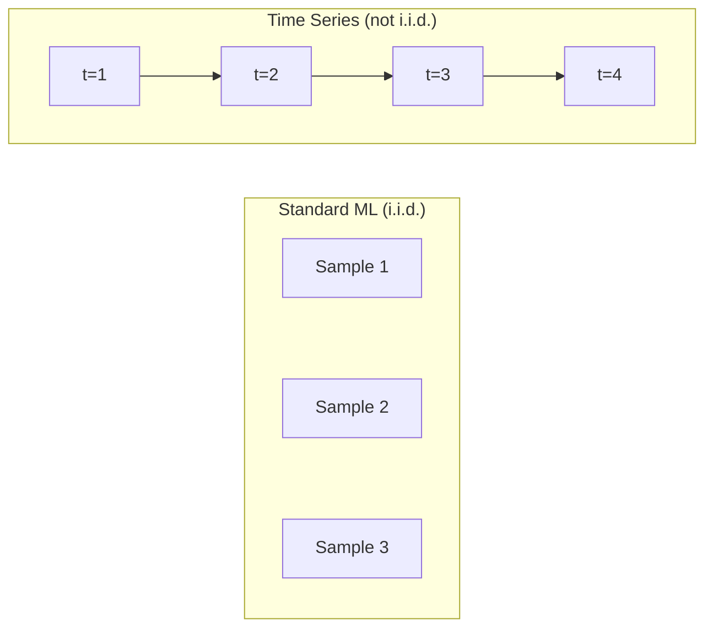
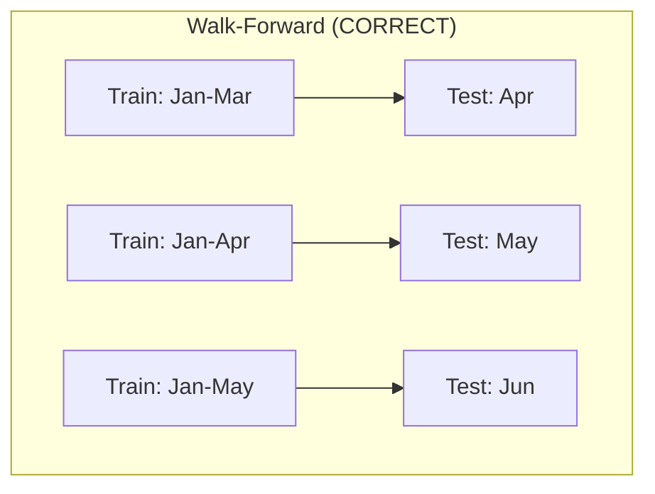

# Time Series Fundamentals

> Past performance does predict future results -- if you check for stationarity first.

**Type:** Build
**Language:** Python
**Prerequisites:** Phase 2, Lessons 01-09
**Time:** ~90 minutes

## Learning Objectives

- Decompose a time series into trend, seasonality, and residual components and test for stationarity
- Implement lag features and rolling statistics to convert a time series into a supervised learning problem
- Build a walk-forward validation framework that prevents future data from leaking into training
- Explain why random train/test splits are invalid for time series and demonstrate the performance gap versus proper temporal splits

## The Problem

You have data ordered by time. Daily sales, hourly temperature, per-minute CPU usage, weekly stock prices. You want to predict the next value, the next week, the next quarter.

You reach for your standard ML toolkit: random train/test split, cross-validation, feature matrix in, prediction out. Every step is wrong.

Time series breaks the assumptions that standard ML relies on. Samples are not independent -- today's temperature depends on yesterday's. Random splits leak future information into the past. A model that gets 95% accuracy with random cross-validation might get 55% with proper time-based evaluation.

## The Concept

### What Makes Time Series Different

Standard ML assumes i.i.d. -- independent and identically distributed. Time series violates both:

- **Not independent.** Today's stock price depends on yesterday's.
- **Not identically distributed.** The distribution shifts over time.



### Components of a Time Series

- **Trend**: The long-term direction. Revenue growing 10% per year.
- **Seasonality**: Repeating patterns at fixed intervals. Retail sales spike in December.
- **Residual**: Whatever is left after removing trend and seasonality.

### Stationarity

A time series is stationary if its statistical properties (mean, variance, autocorrelation) do not change over time. Most forecasting methods assume stationarity.

**How to fix:** Differencing. Instead of modeling the raw values, model the change between consecutive values:

```
diff[t] = value[t] - value[t-1]
```

**Example:**
Original series: [100, 102, 106, 112, 120]
First difference:  [2, 4, 6, 8] (still trending upward)
Second difference:  [2, 2, 2] (constant -- stationary)

### Lag Features: Turning Time Series into Supervised Learning

Take the series [10, 12, 14, 13, 15] and create lag-1 and lag-2 features:

| lag_2 | lag_1 | target |
|-------|-------|--------|
| 10    | 12    | 14     |
| 12    | 14    | 13     |
| 14    | 13    | 15     |

Additional features: rolling statistics, calendar features, differenced values, expanding statistics.

### Walk-Forward Validation



**Expanding window** uses all historical data for training (window grows). **Sliding window** uses a fixed-size training window (window slides).

### When to Use What

| Approach | Best For |
|----------|---------|
| Lag features + ML | Tabular with many external features |
| ARIMA | Single univariate series, short-term |
| Exponential smoothing | Simple trend + seasonality |
| Prophet | Business forecasting, holidays |
| Neural networks | Long sequences, many series |

### Common Mistakes

| Mistake | Fix |
|---------|-----|
| Random train/test split | Use walk-forward or temporal split |
| Using future features | Audit every feature for temporal alignment |
| Overfitting to seasonality | Hold out a full seasonal cycle in the test set |
| Too many lag features | Use ACF to determine relevant lags |

## Build It

### Lag Feature Creator

```python
def make_lag_features(series, n_lags):
    n = len(series)
    X = np.full((n, n_lags), np.nan)
    for lag in range(1, n_lags + 1):
        X[lag:, lag - 1] = series[:-lag]
    valid = ~np.isnan(X).any(axis=1)
    return X[valid], series[valid]
```

### Walk-Forward Cross-Validation

```python
def walk_forward_split(n_samples, n_splits=5, min_train=50):
    assert min_train < n_samples, "min_train must be less than n_samples"
    step = max(1, (n_samples - min_train) // n_splits)
    for i in range(n_splits):
        train_end = min_train + i * step
        test_end = min(train_end + step, n_samples)
        if train_end >= n_samples:
            break
        yield slice(0, train_end), slice(train_end, test_end)
```

### Simple Autoregressive Model

```python
class SimpleAR:
    def __init__(self, n_lags=5):
        self.n_lags = n_lags
        self.weights = None
        self.bias = None

    def fit(self, series):
        X, y = make_lag_features(series, self.n_lags)
        X_b = np.column_stack([np.ones(len(X)), X])
        theta = np.linalg.lstsq(X_b, y, rcond=None)[0]
        self.bias = theta[0]
        self.weights = theta[1:]
        return self
```

### Stationarity Check

```python
def check_stationarity(series, window=50):
    rolling_mean = np.array([
        series[max(0, i - window):i].mean()
        for i in range(1, len(series) + 1)
    ])
    rolling_std = np.array([
        series[max(0, i - window):i].std()
        for i in range(1, len(series) + 1)
    ])
    return rolling_mean, rolling_std
```

### Autocorrelation

```python
def autocorrelation(series, max_lag=20):
    n = len(series)
    mean = series.mean()
    var = series.var()
    acf = np.zeros(max_lag + 1)
    for k in range(max_lag + 1):
        cov = np.mean((series[:n-k] - mean) * (series[k:] - mean))
        acf[k] = cov / var if var > 0 else 0
    return acf
```

## Use It

With sklearn:

```python
from sklearn.linear_model import Ridge
from sklearn.ensemble import GradientBoostingRegressor

X, y = make_lag_features(series, n_lags=10)
for train_idx, test_idx in walk_forward_split(len(X)):
    model = Ridge(alpha=1.0)
    model.fit(X[train_idx], y[train_idx])
    predictions = model.predict(X[test_idx])
```

sklearn's TimeSeriesSplit:

```python
from sklearn.model_selection import TimeSeriesSplit

tscv = TimeSeriesSplit(n_splits=5)
for train_index, test_index in tscv.split(X):
    X_train, X_test = X[train_index], X[test_index]
    y_train, y_test = y[train_index], y[test_index]
    model.fit(X_train, y_train)
```

## Ship It

This lesson produces `outputs/prompt-time-series-advisor.md`.

### Baselines You Must Beat

1. **Last value (persistence).** Predict that tomorrow will be the same as today.
2. **Seasonal naive.** Predict that today will be the same as the same day last week.
3. **Moving average.** Predict the average of the last k values.

## Exercises

1. **Stationarity experiment.** Generate a series with a linear trend. Check stationarity with rolling statistics. Apply first differencing. How many rounds for a quadratic trend?
2. **Lag selection.** Compute ACF on a seasonal series (period=7). Which lags have the highest autocorrelation?
3. **Walk-forward vs random split.** Train a Ridge regression on lag features. Evaluate with random 80/20 split and walk-forward. How much does the random split overestimate performance?
4. **Feature engineering.** Add rolling mean (window=7), rolling std (window=7), and day-of-week features. Compare accuracy with and without these extras.
5. **Multi-step forecasting.** Modify the AR model to predict 5 steps ahead. Compare recursive vs direct strategies.

## Key Terms

| Term | What people say | What it actually means |
|------|----------------|----------------------|
| Stationarity | "The stats don't change over time" | A series whose mean, variance, and autocorrelation are constant over time |
| Differencing | "Subtract consecutive values" | Computing y[t] - y[t-1] to remove trends and achieve stationarity |
| Autocorrelation (ACF) | "How a series correlates with itself" | The correlation between a time series and a lagged copy of itself |
| Lag features | "Past values as inputs" | Using y[t-1], y[t-2], ..., y[t-k] as features to predict y[t] |
| Walk-forward validation | "Time-respecting cross-validation" | Evaluation where training data always precedes test data chronologically |
| ARIMA | "The classic time series model" | AutoRegressive Integrated Moving Average |
| Seasonality | "Repeating calendar patterns" | Regular, predictable cycles tied to calendar periods |
| Trend | "The long-term direction" | A persistent increase or decrease in the series level over time |

## Further Reading

- [Hyndman and Athanasopoulos, Forecasting: Principles and Practice (3rd ed.)](https://otexts.com/fpp3/)
- [scikit-learn Time Series Split](https://scikit-learn.org/stable/modules/generated/sklearn.model_selection.TimeSeriesSplit.html)
- [statsmodels ARIMA docs](https://www.statsmodels.org/stable/generated/statsmodels.tsa.arima.model.ARIMA.html)
- [Makridakis et al., The M5 Competition (2022)](https://www.sciencedirect.com/science/article/pii/S0169207021001874)

[Reference](https://github.com/rohitg00/ai-engineering-from-scratch/tree/main/phases/02-ml-fundamentals/15-time-series)
