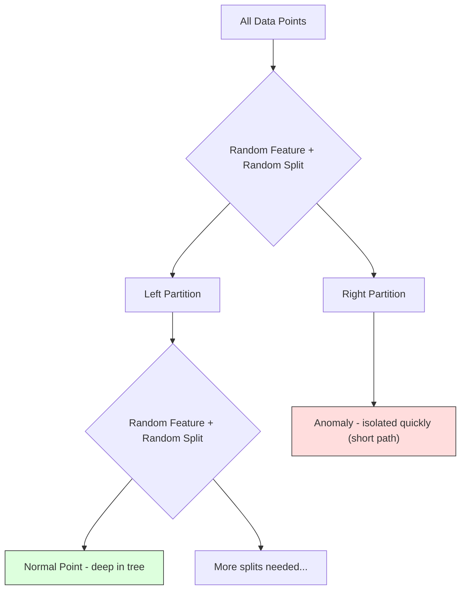

# Anomaly Detection

> Normal is easy to define. Abnormal is whatever doesn't fit.

**Type:** Build
**Language:** Python
**Prerequisites:** Phase 2, Lessons 01-09
**Time:** ~75 minutes

## Learning Objectives

- Implement Z-score, IQR, and Isolation Forest anomaly detection methods from scratch
- Distinguish between point, contextual, and collective anomalies and select the appropriate detection method for each
- Explain why anomaly detection is framed as modeling normal data rather than classifying anomalies
- Compare unsupervised anomaly detection with supervised classification and evaluate the tradeoff between novel anomaly coverage and precision

## The Problem

A credit card is used in New York at 2pm, then in Tokyo at 2:05pm. A factory sensor reads 150 degrees when the normal range is 80-120. A server sends 50,000 requests per second when the daily average is 200.

These are anomalies. Finding them matters. The challenge: you rarely have labeled examples of anomalies. Fraud makes up 0.1% of transactions. Anomaly detection flips the problem. Instead of learning what is abnormal, learn what is normal. Anything that deviates from normal is suspicious.

## The Concept

### Types of Anomalies

- **Point anomalies.** A single data point that is unusual regardless of context. A temperature reading of 500 degrees.
- **Contextual anomalies.** A data point that is unusual given its context. 90 degrees is normal in summer, anomalous in winter.
- **Collective anomalies.** A sequence of data points that is unusual as a group. 50 failed logins in a row is a brute-force attack.

### Comparison of Methods

| Method | Assumptions | Speed | Handles High Dims | Detects Local Anomalies |
|--------|------------|-------|-------------------|------------------------|
| Z-score | Normal distribution | Very fast | Yes (per feature) | No |
| IQR | None (per feature) | Very fast | Yes (per feature) | No |
| Isolation Forest | None | Fast | Yes | Partially |
| LOF | Distance is meaningful | Slow | Poorly | Yes |

### Z-Score Method

```
z_score = (x - mean) / std
anomaly if |z_score| > threshold
```

Default threshold is 3.0 (99.7% of normal data for a Gaussian).

**Strengths:** Simple, fast, interpretable.
**Weaknesses:** Assumes normal distribution, sensitive to outliers in training data.

### IQR Method

```
Q1 = 25th percentile
Q3 = 75th percentile
IQR = Q3 - Q1
lower_bound = Q1 - factor * IQR
upper_bound = Q3 + factor * IQR
anomaly if x < lower_bound or x > upper_bound
```

Default factor is 1.5.

**Strengths:** Robust to outliers, works on skewed distributions.
**Weaknesses:** Univariate only.

### Isolation Forest

The key insight: anomalies are few and different. In a random partitioning of the data, anomalies need fewer random splits to be isolated.



Anomaly score: `score(x) = 2^(-average_path_length(x) / c(n))`. Score near 1 means anomaly. Score near 0.5 means normal.

**Key hyperparameters:** `n_estimators` (100 is usually enough), `max_samples` (256 is default), `contamination` (expected fraction of anomalies).

### Evaluation Challenges

- **Extreme class imbalance.** With 0.1% anomalies, accuracy is useless.
- **Better metrics:** Precision@k, AUPRC, recall at a fixed false positive rate.

## Build It

### Z-Score Detector

```python
def zscore_detect(X, threshold=3.0):
    mean = X.mean(axis=0)
    std = X.std(axis=0)
    std[std == 0] = 1.0
    z = np.abs((X - mean) / std)
    return z.max(axis=1) > threshold
```

### IQR Detector

```python
def iqr_detect(X, factor=1.5):
    q1 = np.percentile(X, 25, axis=0)
    q3 = np.percentile(X, 75, axis=0)
    iqr = q3 - q1
    iqr[iqr == 0] = 1.0
    lower = q1 - factor * iqr
    upper = q3 + factor * iqr
    outside = (X < lower) | (X > upper)
    return outside.any(axis=1)
```

### Isolation Forest from Scratch

```python
class IsolationTree:
    def __init__(self, max_depth):
        self.max_depth = max_depth

    def fit(self, X, depth=0):
        n, p = X.shape
        if depth >= self.max_depth or n <= 1:
            self.is_leaf = True
            self.size = n
            return self
        self.is_leaf = False
        self.feature = np.random.randint(p)
        x_min = X[:, self.feature].min()
        x_max = X[:, self.feature].max()
        if x_min == x_max:
            self.is_leaf = True
            self.size = n
            return self
        self.threshold = np.random.uniform(x_min, x_max)
        left_mask = X[:, self.feature] < self.threshold
        self.left = IsolationTree(self.max_depth).fit(X[left_mask], depth + 1)
        self.right = IsolationTree(self.max_depth).fit(X[~left_mask], depth + 1)
        return self

class IsolationForest:
    def __init__(self, n_estimators=100, max_samples=256, seed=42):
        self.n_estimators = n_estimators
        self.max_samples = max_samples

    def fit(self, X):
        sample_size = min(self.max_samples, X.shape[0])
        max_depth = int(np.ceil(np.log2(sample_size)))
        for _ in range(self.n_estimators):
            idx = rng.choice(X.shape[0], size=sample_size, replace=False)
            tree = IsolationTree(max_depth=max_depth)
            tree.fit(X[idx])
            self.trees.append(tree)

    def anomaly_score(self, X):
        avg_path = average path length across all trees
        scores = 2.0 ** (-avg_path / c(max_samples))
        return scores
```

## Use It

With sklearn:

```python
from sklearn.ensemble import IsolationForest
from sklearn.neighbors import LocalOutlierFactor

iso = IsolationForest(n_estimators=100, contamination=0.05, random_state=42)
iso.fit(X_train)
predictions = iso.predict(X_test)

lof = LocalOutlierFactor(n_neighbors=20, contamination=0.05, novelty=True)
lof.fit(X_train)
predictions = lof.predict(X_test)
```

### One-Class SVM

```python
from sklearn.svm import OneClassSVM

oc_svm = OneClassSVM(kernel="rbf", gamma="auto", nu=0.05)
oc_svm.fit(X_train)
predictions = oc_svm.predict(X_test)
```

### Ensemble Anomaly Detection

Run multiple detectors, normalize each detector's scores to [0, 1], average the normalized scores, flag points above the threshold.

## Ship It

This lesson produces `outputs/skill-anomaly-detector.md`.

## Exercises

1. **Threshold tuning.** Run the Z-score detector with thresholds from 1.0 to 5.0. Plot precision and recall at each threshold.
2. **Multivariate anomalies.** Create 2D data where each feature individually looks normal, but the combination is anomalous. Show that Z-score misses these but Isolation Forest catches them.
3. **LOF from scratch.** Implement Local Outlier Factor using k-nearest neighbors. Compare against sklearn's LocalOutlierFactor.
4. **Streaming anomaly detection.** Modify the Z-score detector to work in a streaming setting using Welford's online algorithm.
5. **Real-world evaluation.** Take a dataset with known anomalies (credit card fraud from Kaggle). Evaluate all four methods using precision@100 and AUPRC.

## Key Terms

| Term | What people say | What it actually means |
|------|----------------|----------------------|
| Anomaly | "Outlier, unusual point" | A data point that deviates significantly from the expected pattern of normal data |
| Point anomaly | "A single weird value" | An individual observation that is unusual regardless of context |
| Contextual anomaly | "Normal value, wrong context" | An observation that is unusual given its context but might be normal in another context |
| Isolation Forest | "Random splits to find outliers" | An ensemble of random trees that isolates anomalies with fewer splits than normal points |
| Local Outlier Factor | "Compare density to neighbors" | A method that flags points whose local density is much lower than their neighbors' density |
| Z-score | "Standard deviations from mean" | (x - mean) / std, measuring how far a point is from the center |
| IQR | "Interquartile range" | Q3 - Q1, measuring the spread of the middle 50% of data |
| Contamination | "Expected fraction of anomalies" | Expected proportion of data that should be flagged as anomalous |
| Precision@k | "Of the top k flags, how many are real" | Precision computed on only the k most suspicious points |
| AUPRC | "Area under precision-recall curve" | A metric that summarizes precision-recall performance across all thresholds |

## Further Reading

- [Liu et al., Isolation Forest (2008)](https://cs.nju.edu.cn/zhouzh/zhouzh.files/publication/icdm08b.pdf)
- [Breunig et al., LOF: Identifying Density-Based Local Outliers (2000)](https://dl.acm.org/doi/10.1145/342009.335388)
- [scikit-learn Outlier Detection docs](https://scikit-learn.org/stable/modules/outlier_detection.html)
- [Chandola et al., Anomaly Detection: A Survey (2009)](https://dl.acm.org/doi/10.1145/1541880.1541882)
- [Goldstein and Uchida, A Comparative Evaluation of Unsupervised Anomaly Detection Algorithms (2016)](https://journals.plos.org/plosone/article?id=10.1371/journal.pone.0152173)

[Reference](https://github.com/rohitg00/ai-engineering-from-scratch/tree/main/phases/02-ml-fundamentals/16-anomaly-detection)
