# LR Schedules, AMP, Checkpoints & Eval Harness

> Combined lessons (8 parts), merged verbatim — no content removed.

**Type:** Combined

---

## Part 1 (ch192): Evaluation: Benchmarks, Evals, LM Harness

> Goodhart's Law: when a measure becomes a target, it ceases to be a good measure. Every frontier lab games benchmarks. MMLU scores go up while models still can't reliably count the number of R's in "strawberry." The only eval that matters is YOUR eval -- on YOUR task, with YOUR data.

**Type:** Build
**Languages:** Python
**Prerequisites:** Phase 10, Lessons 01-05 (LLMs from Scratch)
**Time:** ~90 minutes

## Learning Objectives

- Build a custom evaluation harness that runs multiple-choice and open-ended benchmarks against a language model
- Explain why standard benchmarks (MMLU, HumanEval) saturate and fail to differentiate frontier models
- Implement task-specific evals with proper metrics: exact match, F1, BLEU, and LLM-as-judge scoring
- Design a custom evaluation suite targeting your specific use case rather than relying solely on public leaderboards

## The Problem

MMLU was published in 2020 with 15,908 questions across 57 subjects. Within three years, frontier models saturated it. GPT-4 scored 86.4%. Claude 3 Opus scored 86.8%. Llama 3 405B scored 88.6%. The leaderboard compressed into a 3-point range where differences are statistical noise.

Meanwhile, Claude 3.5 Sonnet, scoring 88.7% on MMLU, initially could not count the letters in "strawberry" -- a task requiring zero world knowledge, just character-level iteration.

The gap between benchmark performance and real-world reliability is the central problem of LLM evaluation. You need custom evals -- not because benchmarks are useless, but because the final evaluation must match your deployment conditions exactly.

## The Concept

### The Eval Landscape

| Category | Cost | Signal | Best for |
|----------|------|--------|----------|
| Benchmarks | Cheap | Low (gameable) | Rough model selection |
| Custom evals | Expensive to build | High | Production prediction |
| Human evals | $0.10-$2.00/judgment | Gold standard | Ambiguous, high-stakes tasks |

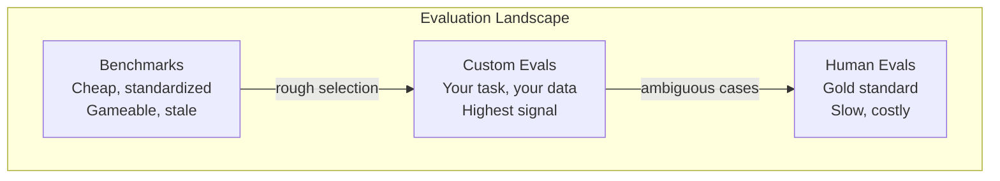

### Why Benchmarks Break

1. **Data contamination.** Training corpora include benchmark questions. Models see answers during training.
2. **Teaching to the test.** Labs optimize training mixtures for benchmark performance.
3. **Saturation.** When every model scores 85-90%, the remaining variance is noise.

### Perplexity

```
PPL = exp(-1/N * sum(log P(token_i | context)))
```

Lower is better. GPT-2: ~30 on WikiText-103. GPT-3: ~20. Llama 3 8B: ~7.

Useful for comparing models on the same test set, but has blind spots: low perplexity doesn't mean good instruction following, reasoning, or factual accuracy.

### LLM-as-Judge

Ask GPT-4o or Claude to rate a response on a 1-5 scale. Costs ~$0.01/judgment with GPT-4o-mini. ~80% agreement with humans.

| Scorer Type | Cost | Human Agreement | Best for |
|-------------|------|----------------|----------|
| Exact match | ~$0 | 100% | Structured output |
| BLEU/ROUGE | ~$0 | ~60% | Translation, summarization |
| LLM-as-judge | ~$0.01 | ~80% | Open-ended generation |
| Human eval | $0.10-$2.00 | N/A (ground truth) | High-stakes tasks |

### ELO Ratings

Chatbot Arena's approach. Pairwise comparisons between models. Same system as chess. Ratings converge with fewer comparisons than scoring every output independently.

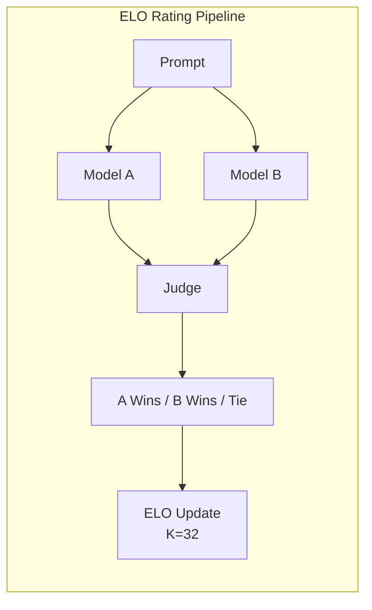

### Custom Evals: The Process

1. **Define the task.** Be precise.
2. **Create test cases.** 50+ for prototype, 200+ for production. Include edge cases.
3. **Define scoring.** Exact match, F1, LLM-as-judge, or combined.
4. **Automate.** One command to run. No manual steps.
5. **Track over time.** Version your eval alongside your prompts.

## Build It

### Step 1: A Minimal Eval Framework

```python
import json
from collections import Counter

class EvalCase:
    def __init__(self, input_text, expected, metadata=None):
        self.input_text = input_text
        self.expected = expected
        self.metadata = metadata or {}

class EvalSuite:
    def __init__(self, name, cases, scorers):
        self.name = name
        self.cases = cases
        self.scorers = scorers

    def run(self, model_fn):
        results = []
        for case in self.cases:
            prediction = model_fn(case.input_text)
            scores = {}
            for scorer_name, scorer_fn in self.scorers.items():
                scores[scorer_name] = scorer_fn(prediction, case.expected)
            results.append({
                "input": case.input_text,
                "expected": case.expected,
                "prediction": prediction,
                "scores": scores,
            })
        return results
```

### Step 2: Scoring Functions

```python
def exact_match(prediction, expected):
    return 1.0 if prediction.strip().lower() == expected.strip().lower() else 0.0

def token_f1(prediction, expected):
    pred_tokens = set(prediction.lower().split())
    exp_tokens = set(expected.lower().split())
    if not pred_tokens or not exp_tokens:
        return 0.0
    common = pred_tokens & exp_tokens
    precision = len(common) / len(pred_tokens)
    recall = len(common) / len(exp_tokens)
    if precision + recall == 0:
        return 0.0
    return 2 * (precision * recall) / (precision + recall)

def llm_judge_simulated(prediction, expected):
    pred_words = set(prediction.lower().split())
    exp_words = set(expected.lower().split())
    if not exp_words:
        return 0.0
    overlap = len(pred_words & exp_words) / len(exp_words)
    length_penalty = min(1.0, len(prediction) / max(len(expected), 1))
    return round(overlap * 0.7 + length_penalty * 0.3, 3)
```

### Step 3: ELO Rating System

```python
class ELOTracker:
    def __init__(self, k=32, initial_rating=1500):
        self.ratings = {}
        self.k = k
        self.initial_rating = initial_rating
        self.history = []

    def _ensure_player(self, name):
        if name not in self.ratings:
            self.ratings[name] = self.initial_rating

    def expected_score(self, rating_a, rating_b):
        return 1 / (1 + 10 ** ((rating_b - rating_a) / 400))

    def record_match(self, player_a, player_b, outcome):
        self._ensure_player(player_a)
        self._ensure_player(player_b)

        ea = self.expected_score(self.ratings[player_a], self.ratings[player_b])
        eb = 1 - ea

        if outcome == "a":
            sa, sb = 1.0, 0.0
        elif outcome == "b":
            sa, sb = 0.0, 1.0
        else:
            sa, sb = 0.5, 0.5

        self.ratings[player_a] += self.k * (sa - ea)
        self.ratings[player_b] += self.k * (sb - eb)

        self.history.append({
            "a": player_a, "b": player_b,
            "outcome": outcome,
            "rating_a": round(self.ratings[player_a], 1),
            "rating_b": round(self.ratings[player_b], 1),
        })

    def leaderboard(self):
        return sorted(self.ratings.items(), key=lambda x: -x[1])
```

### Step 4: Perplexity Calculation

```python
import numpy as np

def perplexity(log_probs):
    if not log_probs:
        return float("inf")
    avg_neg_log_prob = -np.mean(log_probs)
    return float(np.exp(avg_neg_log_prob))

def token_log_probs_simulated(text, model_quality=0.8):
    np.random.seed(hash(text) % 2**31)
    tokens = text.split()
    log_probs = []
    for i, token in enumerate(tokens):
        base_prob = model_quality
        if len(token) > 8:
            base_prob *= 0.6
        if i == 0:
            base_prob *= 0.7
        prob = np.clip(base_prob + np.random.normal(0, 0.1), 0.01, 0.99)
        log_probs.append(float(np.log(prob)))
    return log_probs
```

### Step 5: Aggregate Results

```python
def summarize_results(results, threshold=0.8):
    all_scores = {}
    for r in results:
        for metric, score in r["scores"].items():
            all_scores.setdefault(metric, []).append(score)

    summary = {}
    for metric, scores in all_scores.items():
        arr = np.array(scores)
        summary[metric] = {
            "mean": round(float(np.mean(arr)), 3),
            "median": round(float(np.median(arr)), 3),
            "std": round(float(np.std(arr)), 3),
            "min": round(float(np.min(arr)), 3),
            "max": round(float(np.max(arr)), 3),
            "pass_rate": round(float(np.mean(arr >= threshold)), 3),
            "n": len(scores),
        }
    return summary

def print_summary(summary, suite_name="Eval"):
    print(f"\n{'=' * 60}")
    print(f"  {suite_name} Summary")
    print(f"{'=' * 60}")
    for metric, stats in summary.items():
        print(f"\n  {metric}:")
        print(f"    Mean:      {stats['mean']:.3f}")
        print(f"    Median:    {stats['median']:.3f}")
        print(f"    Std:       {stats['std']:.3f}")
        print(f"    Pass rate: {stats['pass_rate']:.1%}")
```

### Step 6: Run the Full Pipeline

```python
def demo_model_good(prompt):
    responses = {
        "What is the capital of France?": "Paris",
        "What is 2 + 2?": "4",
        "Who wrote Hamlet?": "William Shakespeare",
        "What language is PyTorch written in?": "Python and C++",
        "What is the boiling point of water?": "100 degrees Celsius",
    }
    return responses.get(prompt, "I don't know")

def demo_model_bad(prompt):
    responses = {
        "What is the capital of France?": "Paris is the capital city of France",
        "What is 2 + 2?": "The answer is four",
        "Who wrote Hamlet?": "Shakespeare",
        "What language is PyTorch written in?": "Python",
        "What is the boiling point of water?": "212 Fahrenheit",
    }
    return responses.get(prompt, "Unknown")

cases = [
    EvalCase("What is the capital of France?", "Paris"),
    EvalCase("What is 2 + 2?", "4"),
    EvalCase("Who wrote Hamlet?", "William Shakespeare"),
    EvalCase("What language is PyTorch written in?", "Python and C++"),
    EvalCase("What is the boiling point of water?", "100 degrees Celsius"),
]

suite = EvalSuite(
    name="General Knowledge",
    cases=cases,
    scorers={
        "exact_match": exact_match,
        "token_f1": token_f1,
        "llm_judge": llm_judge_simulated,
    },
)

results_good = suite.run(demo_model_good)
results_bad = suite.run(demo_model_bad)

print_summary(summarize_results(results_good), "Model A (concise)")
print_summary(summarize_results(results_bad), "Model B (verbose)")
```

### Step 7: ELO Tournament

```python
elo = ELOTracker(k=32)

for case in cases:
    pred_a = demo_model_good(case.input_text)
    pred_b = demo_model_bad(case.input_text)

    score_a = token_f1(pred_a, case.expected)
    score_b = token_f1(pred_b, case.expected)

    if score_a > score_b:
        outcome = "a"
    elif score_b > score_a:
        outcome = "b"
    else:
        outcome = "tie"

    elo.record_match("model_a_concise", "model_b_verbose", outcome)

print("\nELO Leaderboard:")
for name, rating in elo.leaderboard():
    print(f"  {name}: {rating:.0f}")
```

### Step 8: Perplexity Comparison

```python
test_text = "The quick brown fox jumps over the lazy dog in the garden"

for quality, label in [(0.9, "Strong model"), (0.7, "Medium model"), (0.4, "Weak model")]:
    log_probs = token_log_probs_simulated(test_text, model_quality=quality)
    ppl = perplexity(log_probs)
    print(f"  {label} (quality={quality}): perplexity = {ppl:.2f}")
```

## Use It

### lm-evaluation-harness

```bash
# pip install lm-eval
# lm_eval --model hf --model_args pretrained=meta-llama/Llama-3.1-8B --tasks mmlu --batch_size 8
```

### promptfoo

```yaml
# promptfoo.yaml
providers:
  - openai:gpt-4o-mini
  - anthropic:claude-3-haiku

prompts:
  - "Answer in one word: {{question}}"

tests:
  - vars:
      question: "What is the capital of France?"
    assert:
      - type: contains
        value: "Paris"
```

## Ship It

This lesson produces `outputs/prompt-eval-designer.md` and `outputs/skill-llm-evaluation.md`.

## Exercises

1. Add a "consistency" scorer that runs the same input 5 times and measures output match percentage.
2. Extend ELO tracker to support multiple judge functions with weights. Compare leaderboards.
3. Build an eval suite for email classification into 5 categories with 100 test cases.
4. Implement contamination detection: check what percentage of eval questions appear in the training corpus.
5. Build a "model diff" tool highlighting which test cases improved, regressed, or stayed the same between versions.

## Key Terms

| Term | What people say | What it actually means |
|------|----------------|----------------------|
| MMLU | "The benchmark" | 15,908 multiple choice questions across 57 subjects |
| HumanEval | "Code eval" | 164 Python function-completion problems |
| SWE-bench | "Real coding eval" | 2,294 GitHub issues from 12 Python repos |
| Perplexity | "How confused the model is" | exp(-avg(log P(token))) |
| ELO rating | "Chess ranking for models" | Relative skill from pairwise comparisons |
| LLM-as-judge | "Using AI to grade AI" | Strong model scores weaker model against rubric |
| Data contamination | "The model saw the test" | Training data includes benchmark questions |
| Eval suite | "A bunch of tests" | Versioned collection of (input, expected, scorer) triples |

## Further Reading

- [Hendrycks et al., 2021 -- "Measuring Massive Multitask Language Understanding"](https://arxiv.org/abs/2009.03300)
- [Chen et al., 2021 -- "Evaluating Large Language Models Trained on Code"](https://arxiv.org/abs/2107.03374)
- [Zheng et al., 2023 -- "Judging LLM-as-a-Judge"](https://arxiv.org/abs/2306.05685)
- [LMSYS Chatbot Arena](https://chat.lmsys.org/)

---

## Part 2 (ch450): Training Loop and Evaluation

> A loop that does not measure is a loop that lies. This lesson builds the training loop that drives the GPT model: AdamW with weight decay split, a warmup plus cosine LR schedule, held out evaluation, qualitative sample generation, and a JSONL log.

**Type:** Build
**Languages:** Python
**Prerequisites:** Phase 19 lessons 30 to 35
**Time:** ~90 minutes

## Learning Objectives

- Build a training loop that computes cross entropy loss for next token prediction.
- Configure AdamW with weight decay applied to weight tensors and not to LayerNorm or bias tensors.
- Implement a learning rate schedule with linear warmup and cosine decay.
- Evaluate on a held out split with `evaluate_model`.
- Generate a qualitative sample every K steps.
- Persist per step loss to JSONL.

## The Concept

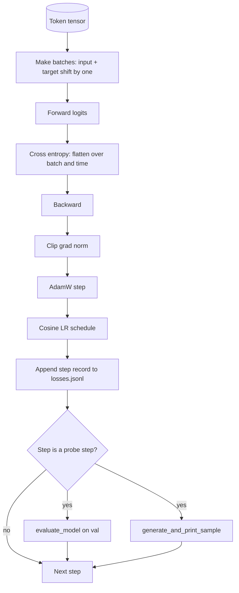

### Loss alignment

Input `[t0, t1, t2, t3]` → target `[t1, t2, t3, t4]`. Cross entropy on flat shape `(batch * seq, vocab)` against flat target `(batch * seq,)`.

### AdamW decay split

Matrix-shaped tensors (linear weights, embedding tables) get decay. Scale/shift tensors do not.

### Warmup plus cosine

Warmup ramps LR from zero to target over a few hundred steps. Cosine decay drops LR toward zero over remaining steps.

## Build It

`code/main.py` implements `make_batches`, `calc_loss_batch`, `evaluate_model`, `generate_and_print_sample`, `build_param_groups`, `cosine_with_warmup`, and `train`. The demo trains a tiny model on synthetic data, writes JSONL, and prints eval loss and samples at probe points.

## Key Terms

| Term | What people say | What it actually means |
|------|-----------------|------------------------|
| Loss alignment | "Shift by one" | Input positions 0..T-1, target positions 1..T |
| Decay split | "Two groups" | AdamW: matrix tensors with decay, scale/bias without |
| Warmup | "Ramp" | LR climbs from zero to target over fixed steps |
| Qualitative probe | "Sample print" | Short generation from fixed prompt every K steps |

[Reference](https://github.com/rohitg00/ai-engineering-from-scratch/tree/main/phases/19-capstone-projects/36-training-loop-eval)

---

## Part 3 (ch455): Full Evaluation Pipeline

> Training is the part you can monitor with loss curves. Evaluation is the part you have to design. This lesson builds a unified eval pipeline that takes any trained language model, runs four heterogeneous evals, aggregates the results into a per-task report, and ships a local mock LLM-as-judge.

**Type:** Build
**Languages:** Python (torch, numpy)
**Prerequisites:** Phase 19 lessons 30-37
**Time:** ~90 minutes

## Learning Objectives

- Compute held-out perplexity with masked-token accounting on a tiny transformer.
- Run an exact-match eval on short-form factual prompts.
- Compute token-level F1 between predicted and reference strings with normalisation.
- Build a local mock LLM-as-judge that scores model outputs on a 1-5 scale.
- Aggregate the four evals into a single weighted report with per-task breakdown.

## The Concept

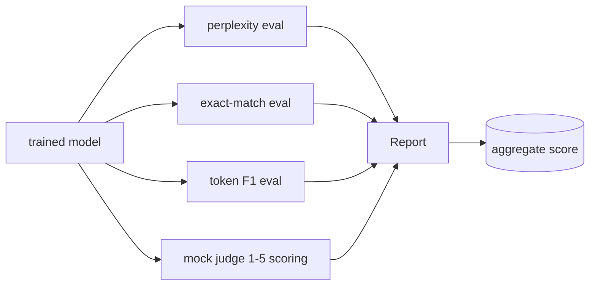

## The Four Evals

**Perplexity**: `exp(mean negative log-likelihood per token)`, excluding padding positions.

**Exact-match**: normalised (lowercase, strip, collapse whitespace, drop trailing punctuation) string comparison.

**Token F1**: precision = intersection / len(pred), recall = intersection / len(ref), F1 = harmonic mean.

**Mock Judge**: deterministic scorer. 5 if normalised prediction equals reference; 4 if token F1 >= 0.8; 3 if F1 in [0.5, 0.8); 2 if F1 in [0.2, 0.5); 1 otherwise.

## Architecture

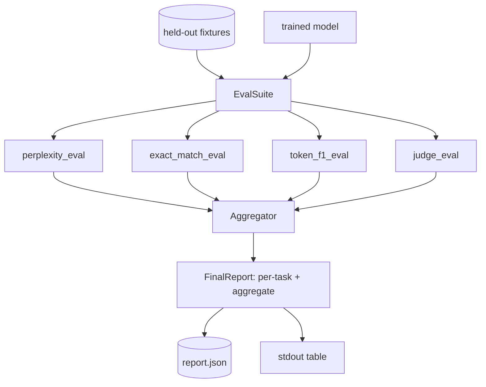

## What you will build

`TinyGPT`, `InstructionTokenizer`, four fixtures (20 examples each), `perplexity_eval`, `exact_match_eval`, `token_f1_eval`, `mock_judge`/`judge_eval`, `Aggregator`, `run_demo`.

[Reference](https://github.com/rohitg00/ai-engineering-from-scratch/tree/main/phases/19-capstone-projects/41-eval-pipeline)

---

## Part 4 (ch463): Language Model Evaluation Harness

> A model that does well on a task you cannot define is a model that does well by accident. The harness is the task definition, the metric, the runner, and the leaderboard, in one shape.

**Type:** Build
**Languages:** Python
**Prerequisites:** Phase 19 lessons 42 to 45
**Time:** ~90 minutes

## Learning Objectives

- Define a task as a JSONL file with prompt, targets, metric, and extras.
- Implement five metrics: exact match, ROUGE-L F1, executable check, multiple choice, substring contains.
- Build a runner that batches examples per task and dispatches to a swappable model adapter.
- Emit a reproducible leaderboard JSON.

## The Concept

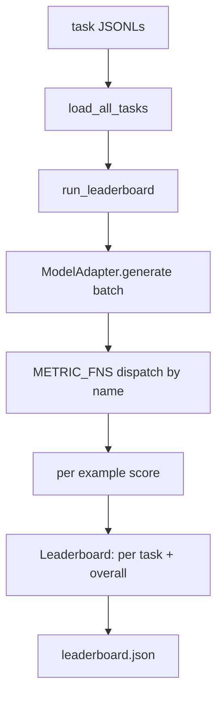

### The five fixture tasks

| Task | Metric |
|------|--------|
| arithmetic | exact_match |
| summary | rouge_l |
| code-exec | code_exec |
| multiple-choice | multiple_choice |
| generation | substring_contains |

## Build It

`code/main.py` implements: `seed_fixture_tasks`, `load_all_tasks`, metrics (exact_match, substring_contains, multiple_choice, rouge_l, code_exec), `ModelAdapter` protocol, `run_leaderboard`, `write_leaderboard`.

Run it:
```bash
python3 code/main.py
```

## Exercises

1. Add a sixth task with a custom metric.
2. Extend code_exec to capture stdout.
3. Add a leaderboard diff command.
4. Cap latency per example with a timeout.
5. Pin task content with a sha256 in the leaderboard.

## Key Terms

| Term | What it actually means |
|------|------------------------|
| Task spec | JSONL file with prompt, targets, metric, extras per example |
| Metric | Function from (prediction, targets, extras) to float in [0, 1] |
| Adapter | Object with generate(prompts) -> list[str] method |
| Leaderboard | JSON with per-task scores, latency, and overall average |
| Code exec metric | Execute prediction in restricted namespace, compare against IO pairs |

[Reference](https://github.com/rohitg00/ai-engineering-from-scratch/tree/main/phases/19-capstone-projects/49-lm-eval-harness)

---

## Part 5 (ch458): Cosine LR with Linear Warmup

> The learning-rate schedule is the second most important decision after the loss function. AdamW with a cosine decay and a linear warmup is the modern default for language-model training.

**Type:** Build
**Languages:** Python
**Prerequisites:** Phase 19 lessons 30-37
**Time:** ~90 minutes

## Learning Objectives

- Implement an AdamW optimizer wired to a cosine learning-rate schedule with linear warmup.
- Compute the schedule's exact value at any step without floating-point drift.
- Log gradient L2 norm side by side with the learning rate so training health is observable.
- Render the schedule to a text plot and a CSV.

## The Problem

The first thousand training updates are the loudest. If the learning rate is at its peak during these updates the model either diverges outright or settles into a loss plateau it never escapes. The cosine-with-warmup schedule has three regions: linear ramp from zero to `lr_max`, cosine decay from `lr_max` to `lr_min`, and a floor pinned at `lr_min` past `total_steps`.

## The Concept

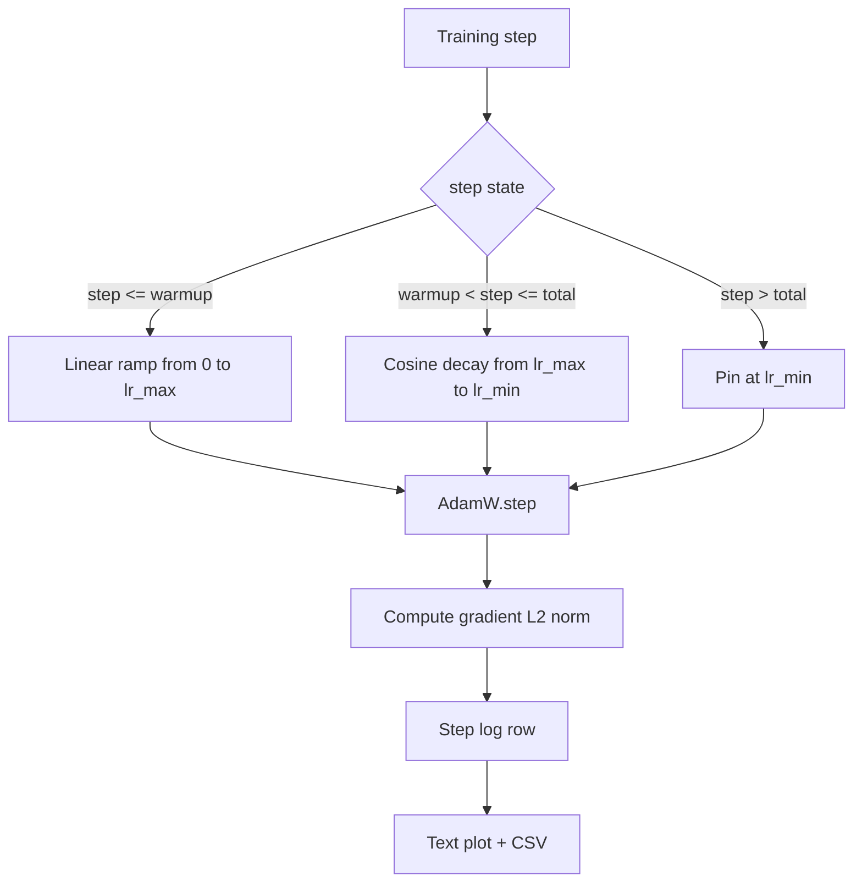

### Warmup formula

For `step` in `[0, warmup_steps]`: `lr = lr_max * step / warmup_steps`. `warmup_steps = 0` means no warmup.

### Cosine formula

For `step` in `(warmup_steps, total_steps]`: `lr = lr_min + 0.5 * (lr_max - lr_min) * (1 + cos(pi * progress))` where `progress = (step - warmup_steps) / max(1, total_steps - warmup_steps)`.

### Floor after total steps

For `step > total_steps`: pinned at `lr_min`.

## Build It

`code/main.py` implements: `CosineWithWarmup`, `TrainState`, `plot_schedule_ascii`, `write_schedule_csv`.

Run it:
```bash
python3 code/main.py
```

## Production Patterns

- Schedule lives in a config, not in code.
- Step counter is monotonic and decoupled from epochs.
- Schedule plot in the run directory.
- Log row schema is fixed.

## Exercises

1. Add an inverse-square-root variant and compare.
2. Add a `--restart` flag with warm restarts.
3. Add a continuity test for the schedule.
4. Wire the schedule into `LambdaLR`.
5. Add a `--plot-png` flag via matplotlib.

## Key Terms

| Term | What it actually means |
|------|------------------------|
| Warmup | Linear ramp from zero to `lr_max` over the first `warmup_steps` updates |
| Cosine decay | Upper-half cosine curve from `lr_max` to `lr_min` |
| Floor | Fixed `lr_min` past `total_steps` |
| Gradient norm | L2 of concatenated gradient vector |
| Global step | Monotonic step counter that survives restarts |

[Reference](https://github.com/rohitg00/ai-engineering-from-scratch/tree/main/phases/19-capstone-projects/44-cosine-lr-warmup)

---

## Part 6 (ch459): Gradient Clipping and Mixed Precision

> The optimizer and schedule assume gradients are sane. They usually are not. A single bad batch can spike the gradient norm by three orders of magnitude. Mixed-precision training amplifies this with FP16 overflow.

**Type:** Build
**Languages:** Python
**Prerequisites:** Phase 19 lessons 30-37
**Time:** ~90 minutes

## Learning Objectives

- Compute the global L2 norm over all parameter gradients and clip in place.
- Wrap a training step in autocast plus a GradScaler.
- Detect NaN and Inf, skip the optimizer step, and log the skip.
- Report the GradScaler's scaling factor every step.

## The Problem

Without clipping, a single batch whose gradient norm is 20x the previous peak resets every learning the model had done in the previous hour. Mixed-precision pushes throughput 2-3x but FP16 has a narrow exponent range. GradScaler multiplies the loss before backward and divides gradients before the step. The right order is: `scaler.scale(loss).backward()`, `scaler.unscale_(optimizer)`, `clip_grad_norm_`, `scaler.step(optimizer)`, `scaler.update()`.

## The Concept

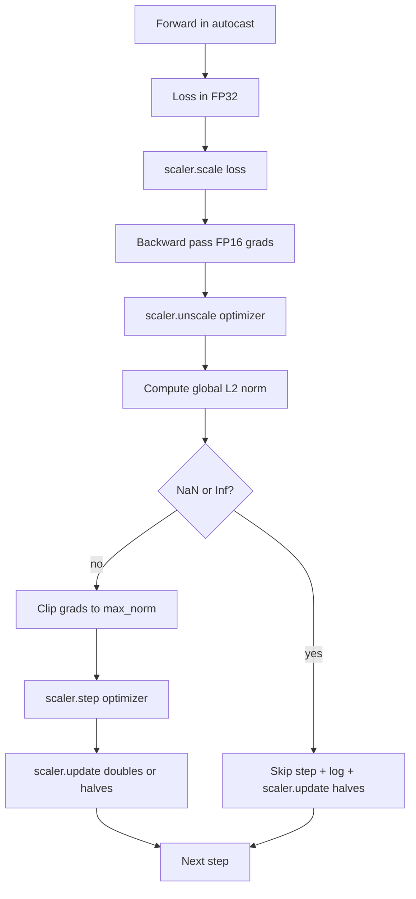

## Build It

`code/main.py` implements: `clip_global_l2_norm`, `has_non_finite_grad`, `AmpTrainState`, `StepLog`, `SkipLog`.

Run it:
```bash
python3 code/main.py
```

## Production Patterns

- Skip counter as an alert, not a log line.
- Clip threshold lives in the config.
- Norm log goes to a CSV with the schedule.
- `scaler.update()` runs every step, even on skip.

## Exercises

1. Replace synthetic Inf injection with a real loss spike.
2. Add a `--bf16` mode.
3. Add a unit test for gradient-clip wrapper.
4. Add a rolling-window skip-rate check.
5. Wire the loop to write the canonical CSV.

## Key Terms

| Term | What it actually means |
|------|------------------------|
| Global L2 norm | Euclidean norm of concatenated gradient vector across all trainable parameters |
| autocast | Selective FP16/BF16 execution of eligible operations |
| GradScaler | Helper that scales the loss before backward and inverse-scales before step |
| Skip | Optimizer step refused due to non-finite gradient or loss |
| Scaling factor | GradScaler's current multiplier |

[Reference](https://github.com/rohitg00/ai-engineering-from-scratch/tree/main/phases/19-capstone-projects/45-gradient-clipping-amp)

---

## Part 7 (ch460): Gradient Accumulation

> Train at an effective batch you cannot afford, one micro-batch at a time. Scale the loss, hold the optimizer step, and let the gradients pile up.

**Type:** Build
**Languages:** Python
**Prerequisites:** Phase 19 lessons 42 to 45
**Time:** ~90 minutes

## Learning Objectives

- Derive the effective batch identity: `effective_batch = micro_batch * accum_steps`.
- Implement loss-per-micro-batch scaling so the accumulated gradient matches a single full-batch backward.
- Skip optimizer synchronization until the last micro-batch.
- Read a throughput vs effective batch curve.

## The Problem

The accelerator holds 32 examples. You want an effective batch of 512. Run 16 backward passes, let the gradients accumulate inside the parameter buffers, and only step the optimizer when the count reaches the target. Without loss scaling, the gradient magnitude is 16x too big.

## The Concept

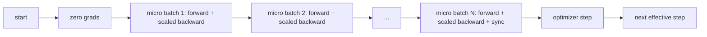

### The equivalence proof

```python
loss = criterion(model(x_full), y_full)
loss.backward()
opt.step()
```

is equivalent to:
```python
for x, y in chunks(x_full, y_full, n):
    scaled = criterion(model(x), y) / n
    scaled.backward()
opt.step()
```

## Build It

`code/main.py` implements: `equivalence_check`, `train_one_optimizer_step`, `sweep_effective_batches`.

Run it:
```bash
python3 code/main.py
```

## Exercises

1. Re-run the sweep and plot samples per second against effective batch.
2. Add a wrong scaling variant and show the parameter diff.
3. Swap SGD for AdamW and confirm optimizer state advances once per effective step.
4. Introduce a real DDP wrapper and route `no_sync_context`.
5. Modify the equivalence check for different micro splits.

## Key Terms

| Term | What it actually means |
|------|------------------------|
| Micro batch | The slice that fits in memory in a single forward pass |
| Accum steps | Number of backwards summed before one optimizer step |
| Effective batch | Micro batch times accum steps times data parallel world size |
| Loss scaling | Per-micro-batch division so summed gradients match full batch |
| Sync on last | Only run the gradient collective on the last backward in the window |

[Reference](https://github.com/rohitg00/ai-engineering-from-scratch/tree/main/phases/19-capstone-projects/46-gradient-accumulation)

---

## Part 8 (ch461): Checkpoint Save and Resume

> Train interrupts kill runs; checkpoints let them continue. Save model, optimizer, scheduler, loss history, step counter, and RNG state, atomically, so a kill at any moment leaves a valid file on disk.

**Type:** Build
**Languages:** Python
**Prerequisites:** Phase 19 lessons 42 to 45
**Time:** ~90 minutes

## Learning Objectives

- Capture the full training state into a single reloadable payload.
- Implement atomic save with write-to-temp then rename.
- Restore the RNG state for Python, NumPy, and PyTorch.
- Build a sharded checkpoint layout with hash-verified shards.

## The Problem

The cluster reboots at hour 11. Without checkpoints you start over. Without RNG restoration the resumed loss curve is a different curve.

## The Concept

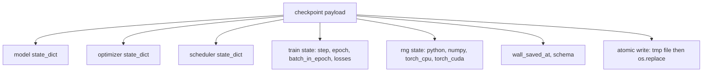

### Atomic save

Write to a temp file in the same directory, then `os.replace` into the final name. POSIX rename is atomic within the same filesystem.

### Sharded checkpoints

Split parameter state into shards, write a small index with sha256 per shard.

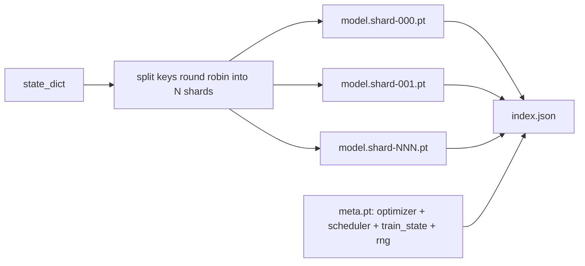

## Build It

`code/main.py` implements: `capture_rng_state`, `restore_rng_state`, `atomic_save`, `save_checkpoint`, `load_checkpoint`, `save_sharded_checkpoint`, `load_sharded_checkpoint`, `run_resume_demo`.

Run it:
```bash
python3 code/main.py
```

## Exercises

1. Replace round-robin with parameter-group sharding.
2. Keep the last K checkpoints and prune older ones.
3. Add a `--ckpt-every-seconds` flag.
4. Add a checksum verification path.
5. Implement a `migrate_v1_to_v2` function.

## Key Terms

| Term | What it actually means |
|------|------------------------|
| Atomic save | Write to temp file then os.replace |
| State dict | Model parameters and buffers keyed by name |
| Sharded checkpoint | Multiple files per shard plus meta and JSON index |
| RNG state | Captured state for python random, numpy, torch CPU/ CUDA |
| Mid-epoch resume | Fast-forward RNG and continue from next batch |

[Reference](https://github.com/rohitg00/ai-engineering-from-scratch/tree/main/phases/19-capstone-projects/47-checkpoint-save-resume)
