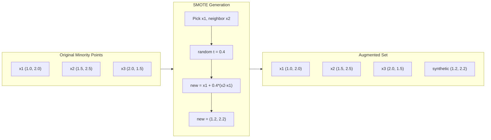

# Handling Imbalanced Data

> When 99% of your data is "normal," accuracy is a lie.

**Type:** Build
**Language:** Python
**Prerequisites:** Phase 2, Lessons 01-09 (especially evaluation metrics)
**Time:** ~90 minutes

## Learning Objectives

- Implement SMOTE from scratch and explain how synthetic oversampling differs from random duplication
- Evaluate imbalanced classifiers using F1, AUPRC, and Matthews Correlation Coefficient instead of accuracy
- Compare class weighting, threshold tuning, and resampling strategies and select the right approach for a given imbalance ratio
- Build a complete imbalanced data pipeline that combines SMOTE, class weights, and threshold optimization

## The Problem

You build a fraud detection model. It gets 99.9% accuracy. Then you realize it predicts "not fraud" for every single transaction.

Accuracy fails because it treats all correct predictions equally. Correctly labeling a legitimate transaction and correctly catching fraud both count as one point of accuracy. But catching fraud is the entire reason the model exists.

## The Concept

### Why Accuracy Fails

Consider a dataset with 1000 samples: 990 negative, 10 positive. A model that always predicts negative gets 99% accuracy but catches zero fraud.

### Better Metrics

**Precision** = TP / (TP + FP). Of everything flagged as positive, how many actually are?

**Recall** = TP / (TP + FN). Of everything actually positive, how many did we catch?

**F1 Score** = 2 * precision * recall / (precision + recall). The harmonic mean.

**Matthews Correlation Coefficient** = (TP * TN - FP * FN) / sqrt((TP+FP)(TP+FN)(TN+FP)(TN+FN)). Balanced even when classes are very different sizes.

### SMOTE: Synthetic Minority Oversampling Technique

SMOTE creates new synthetic minority samples by interpolation:

1. For each minority sample x, find its k nearest neighbors among other minority samples
2. Pick one neighbor at random
3. Create a new sample on the line segment between x and that neighbor

Formula: `new_sample = x + random(0, 1) * (neighbor - x)`



### Sampling Strategies Compared

| Strategy | Data Changed | Risk | When to Use |
|----------|-------------|------|-------------|
| Oversample | Minority duplicated | Overfitting | Small datasets, moderate imbalance |
| Undersample | Majority removed | Information loss | Large datasets, want fast training |
| SMOTE | Synthetic minority added | Boundary noise | Moderate imbalance, enough minority samples |

### Class Weights

Instead of changing the data, change how the model treats errors. Assign higher weight to misclassifying the minority class.

```
weighted_loss = -sum(w_i * [y_i * log(p_i) + (1-y_i) * log(1-p_i)])
```

### Threshold Tuning

The default threshold of 0.5 is arbitrary. When classes are imbalanced, the optimal threshold is usually much lower. Sweep thresholds from 0.0 to 1.0 and pick the one that maximizes F1.

### Decision Flowchart

| Imbalance | Strategy |
|-----------|----------|
| < 70/30 | Mild: try class weights first |
| 70/30 to 95/5 | Moderate: SMOTE + class weights |
| > 95/5 | Severe: combine multiple strategies |

## Build It

### Step 1: SMOTE from scratch

```python
def euclidean_distance(a, b):
    return np.sqrt(np.sum((a - b) ** 2))

def find_k_neighbors(X, idx, k):
    distances = []
    for i in range(len(X)):
        if i == idx:
            continue
        d = euclidean_distance(X[idx], X[i])
        distances.append((i, d))
    distances.sort(key=lambda x: x[1])
    return [d[0] for d in distances[:k]]

def smote(X_minority, k=5, n_synthetic=100, seed=42):
    rng = np.random.RandomState(seed)
    n_samples = len(X_minority)
    k = min(k, n_samples - 1)
    synthetic = []
    for _ in range(n_synthetic):
        idx = rng.randint(0, n_samples)
        neighbors = find_k_neighbors(X_minority, idx, k)
        neighbor_idx = neighbors[rng.randint(0, len(neighbors))]
        t = rng.random()
        new_point = X_minority[idx] + t * (X_minority[neighbor_idx] - X_minority[idx])
        synthetic.append(new_point)
    return np.array(synthetic)
```

### Step 2: Logistic regression with class weights

```python
def logistic_regression_weighted(X, y, weights, lr=0.01, epochs=200):
    n_samples, n_features = X.shape
    w = np.zeros(n_features)
    b = 0.0
    for _ in range(epochs):
        z = X @ w + b
        pred = sigmoid(z)
        error = pred - y
        weighted_error = error * weights
        gradient_w = (X.T @ weighted_error) / n_samples
        gradient_b = np.mean(weighted_error)
        w -= lr * gradient_w
        b -= lr * gradient_b
    return w, b

def compute_class_weights(y):
    classes, counts = np.unique(y, return_counts=True)
    n_samples = len(y)
    n_classes = len(classes)
    weight_map = {}
    for cls, count in zip(classes, counts):
        weight_map[cls] = n_samples / (n_classes * count)
    return np.array([weight_map[yi] for yi in y])
```

### Step 3: Threshold tuning

```python
def find_optimal_threshold(y_true, y_probs, metric="f1"):
    best_threshold = 0.5
    best_score = -1.0
    for threshold in np.arange(0.05, 0.96, 0.01):
        y_pred = (y_probs >= threshold).astype(int)
        tp = np.sum((y_pred == 1) & (y_true == 1))
        fp = np.sum((y_pred == 1) & (y_true == 0))
        fn = np.sum((y_pred == 0) & (y_true == 1))
        if metric == "f1":
            precision = tp / (tp + fp) if (tp + fp) > 0 else 0.0
            recall = tp / (tp + fn) if (tp + fn) > 0 else 0.0
            score = 2 * precision * recall / (precision + recall) if (precision + recall) > 0 else 0.0
        elif metric == "recall":
            score = tp / (tp + fn) if (tp + fn) > 0 else 0.0
        elif metric == "precision":
            score = tp / (tp + fp) if (tp + fp) > 0 else 0.0
        if score > best_score:
            best_score = score
            best_threshold = threshold
    return best_threshold, best_score
```

## Use It

With scikit-learn and imbalanced-learn:

```python
from sklearn.linear_model import LogisticRegression
from sklearn.metrics import classification_report, f1_score
from imblearn.over_sampling import SMOTE
from imblearn.pipeline import Pipeline

model_weighted = LogisticRegression(class_weight="balanced")
model_weighted.fit(X_train, y_train)

smote = SMOTE(random_state=42)
X_resampled, y_resampled = smote.fit_resample(X_train, y_train)

pipeline = Pipeline([
    ("smote", SMOTE()),
    ("model", LogisticRegression(class_weight="balanced")),
])
pipeline.fit(X_train, y_train)
```

## Ship It

This lesson produces `outputs/skill-imbalanced-data.md`.

## Exercises

1. **Borderline-SMOTE**: modify SMOTE to only generate synthetic samples for minority points near the decision boundary. Compare with standard SMOTE.
2. **Cost matrix optimization**: implement cost-sensitive learning where the cost matrix is a parameter. Test with different cost ratios (1:10, 1:100, 1:1000).
3. **Threshold calibration**: implement Platt scaling. Compare the precision-recall curve before and after calibration.
4. **Ensemble with balanced bagging**: train multiple models, each on a balanced bootstrap sample. Average their predictions.
5. **Imbalance ratio experiment**: take a balanced dataset and progressively increase the imbalance ratio. Plot F1 vs imbalance ratio for both approaches.

## Key Terms

| Term | What people say | What it actually means |
|------|----------------|----------------------|
| Class imbalance | "One class has way more samples" | The distribution of classes is significantly skewed, causing models to favor the majority class |
| SMOTE | "Synthetic oversampling" | Creates new minority samples by interpolating between existing minority samples and their k-nearest minority neighbors |
| Class weights | "Making errors on rare classes more expensive" | Multiplying the loss function by class-specific weights so the model penalizes minority misclassification more heavily |
| Threshold tuning | "Moving the decision boundary" | Changing the probability cutoff from the default 0.5 to a value that optimizes the desired metric |
| Precision-recall tradeoff | "You cannot have both" | Lowering the threshold catches more positives but also flags more false positives |
| AUPRC | "Area under the PR curve" | Summarizes the precision-recall curve; more informative than AUC-ROC for imbalanced data |
| Matthews Correlation Coefficient | "The balanced metric" | A correlation between predicted and actual labels that produces a high score only when the model performs well on both classes |
| Cost-sensitive learning | "Different mistakes cost different amounts" | Incorporating real-world misclassification costs into the training objective |
| Random oversampling | "Duplicate the minority" | Repeating minority class samples to balance class counts |

## Further Reading

- [SMOTE: Synthetic Minority Over-sampling Technique (Chawla et al., 2002)](https://arxiv.org/abs/1106.1813)
- [Learning from Imbalanced Data (He & Garcia, 2009)](https://ieeexplore.ieee.org/document/5128907)
- [imbalanced-learn documentation](https://imbalanced-learn.org/stable/)
- [The Precision-Recall Plot Is More Informative than the ROC Plot (Saito & Rehmsmeier, 2015)](https://journals.plos.org/plosone/article?id=10.1371/journal.pone.0118432)

[Reference](https://github.com/rohitg00/ai-engineering-from-scratch/tree/main/phases/02-ml-fundamentals/17-imbalanced-data)
