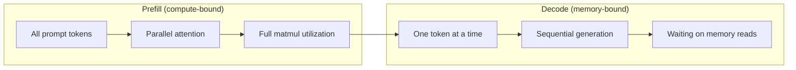
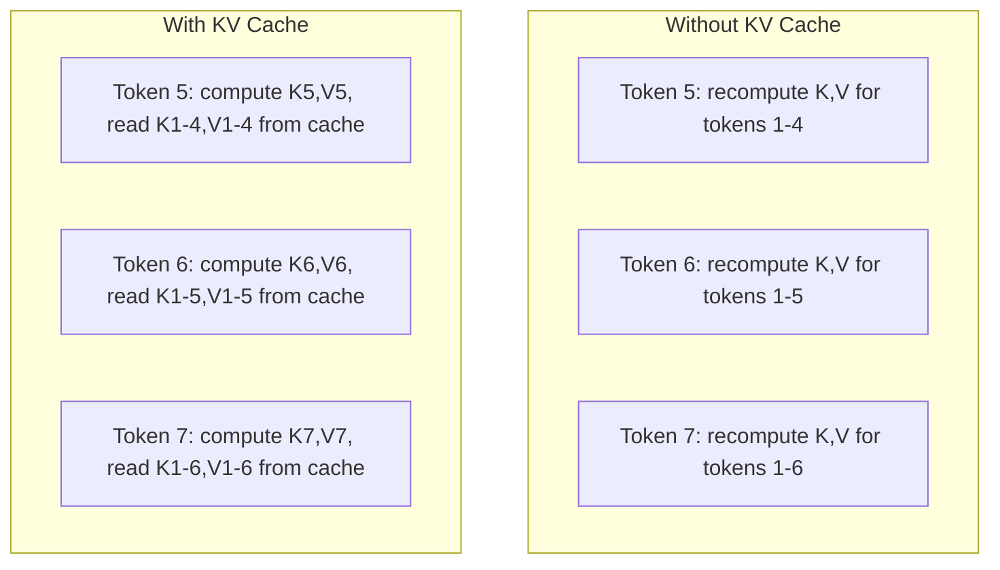
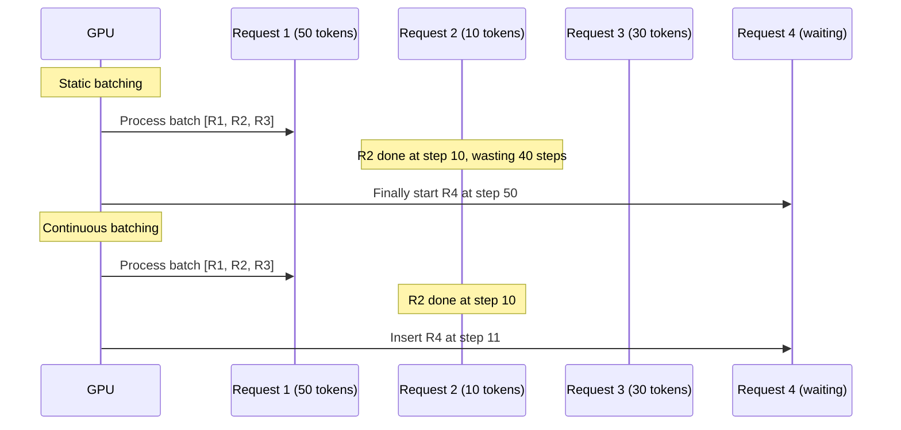
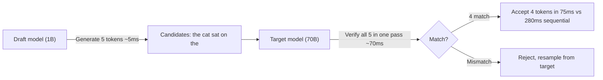
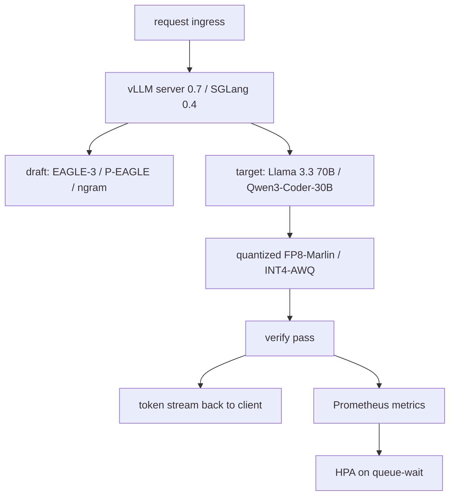

# Quantization, Inference Opt & Spec-Dec Servers

> Combined lessons (6 parts), merged verbatim — no content removed.

**Type:** Combined

---

## Part 1 (ch193): Quantization: Making Models Fit

> A 70B model in FP16 needs 140GB. Two A100s just for weights. Quantize to FP8: one 80GB GPU. INT4: a MacBook.

**Type:** Build
**Languages:** Python (with numpy)
**Prerequisites:** Phase 10, Lessons 01-10 (LLMs from Scratch)
**Time:** ~120 minutes

## Learning Objectives

- Implement symmetric and asymmetric quantization from FP16 to INT8 and INT4, including per-tensor and per-channel scaling
- Calculate the memory savings from quantization and determine which precision fits a given GPU's VRAM
- Explain the difference between post-training quantization (PTQ) and quantization-aware training (QAT)
- Apply GPTQ or AWQ to quantize a real model and measure the accuracy-memory tradeoff on a benchmark

## The Problem

Llama 3 70B has 70 billion parameters. Each parameter is a 16-bit floating point number. That is 140GB. A single A100 has 80GB of VRAM. You cannot even load the weights.

But 16 bits per parameter is wasteful. Most weights in a neural network cluster near zero. The full dynamic range of FP16 is almost entirely unused. 95% of values fall between -0.1 and +0.1. You are burning 16 bits to represent values that could fit in 4.

Quantization replaces high-precision numbers with lower-precision ones. FP16 to INT4 cuts memory to a quarter. That 140GB model becomes 35GB. It fits on a single consumer GPU.

The cost is accuracy. A well-quantized INT4 model retains 95-99% of the original's quality on most benchmarks.

## The Concept

### Number Formats

```
FP32:  [1 sign] [8 exponent] [23 mantissa]  = 32 bits
FP16:  [1 sign] [5 exponent] [10 mantissa]  = 16 bits
BF16:  [1 sign] [8 exponent] [7  mantissa]  = 16 bits
FP8:   [1 sign] [4 exponent] [3  mantissa]  = 8  bits (E4M3)
INT8:  [1 sign] [7 value]                   = 8  bits
INT4:  [1 sign] [3 value]                   = 4  bits (16 levels)
```

- **FP32**: Full precision, used for training accumulation
- **FP16**: Halved bits, needs loss scaling for training
- **BF16**: Same range as FP32, less precision -- modern training default
- **FP8**: H100 native, 30-50% speedup over FP16
- **INT8**: Integer format, faster arithmetic, needs scale factor
- **INT4**: 16 possible values, requires GPTQ/AWQ for quality

### How Quantization Works

```
scale = max(abs(tensor)) / max_int_value
quantized = round(tensor / scale)
reconstructed = quantized * scale
```

**Per-tensor vs per-channel.** Per-tensor uses one scale for the entire matrix. Simple but lossy when values vary across channels. Per-channel uses one scale per output channel -- more overhead but dramatically better quality.

**Asymmetric quantization** adds a zero-point offset for distributions not centered at zero: `quantized = round(tensor / scale) + zero_point`.

### Sensitivity Hierarchy

| Component | Sensitivity | Best Precision |
|-----------|-------------|----------------|
| Weights | Most robust | INT4 works well |
| Activations | Moderate | INT8 with care |
| KV cache | High | FP8 or INT8 |
| Attention logits | Most sensitive | Keep in FP16 |

### PTQ vs QAT

| Aspect | PTQ | QAT |
|--------|-----|-----|
| Cost | Minutes to hours | Full training run |
| Quality at INT8 | Excellent | Excellent |
| Quality at INT4 | Good with GPTQ/AWQ | Better |
| Calibration data | 128-1024 examples | Full training dataset |

### GPTQ, AWQ, GGUF

**GPTQ** quantizes weights one layer at a time using the Hessian to measure weight importance. Weights that matter more get quantized more carefully.

**AWQ** identifies the ~1% of weights that are disproportionately important (those multiplying with large activations) and scales them up before quantization.

**GGUF** is the llama.cpp format supporting mixed quantization across layers.

| Model | Format | Size | Perplexity | MMLU | Tokens/sec |
|-------|--------|------|------------|------|------------|
| Llama 3 70B | FP16 | 140GB | 3.12 | 79.5% | 38 |
| Llama 3 70B | FP8 | 70GB | 3.14 | 79.3% | 55 |
| Llama 3 70B | GPTQ INT4 | 35GB | 4.32 | 77.8% | 72 |

## Build It

### Step 1: Number Format Representations

```python
import numpy as np

def float_to_fp32_bits(value):
    bits = np.float32(value).view(np.uint32)
    sign = (bits >> 31) & 1
    exponent = (bits >> 23) & 0xFF
    mantissa = bits & 0x7FFFFF
    return {"sign": int(sign), "exponent": int(exponent), "mantissa": int(mantissa),
            "exponent_bits": format(int(exponent), '08b'),
            "mantissa_bits": format(int(mantissa), '023b'),
            "value": float(value), "actual_exponent": int(exponent) - 127}

def float_to_fp16_bits(value):
    fp16 = np.float16(value)
    bits = fp16.view(np.uint16)
    sign = (bits >> 15) & 1
    exponent = (bits >> 10) & 0x1F
    mantissa = bits & 0x3FF
    return {"sign": int(sign), "exponent": int(exponent), "mantissa": int(mantissa),
            "exponent_bits": format(int(exponent), '05b'),
            "mantissa_bits": format(int(mantissa), '010b'),
            "value": float(fp16), "actual_exponent": int(exponent) - 15}

def float_to_bf16_bits(value):
    fp32_bits = np.float32(value).view(np.uint32)
    bf16_bits = (fp32_bits >> 16).astype(np.uint16)
    sign = (bf16_bits >> 15) & 1
    exponent = (bf16_bits >> 7) & 0xFF
    mantissa = bf16_bits & 0x7F
    reconstructed = np.uint32(bf16_bits.astype(np.uint32) << 16).view(np.float32)
    return {"sign": int(sign), "exponent": int(exponent), "mantissa": int(mantissa),
            "exponent_bits": format(int(exponent), '08b'),
            "mantissa_bits": format(int(mantissa), '07b'),
            "value": float(reconstructed), "actual_exponent": int(exponent) - 127}
```

### Step 2: Symmetric and Asymmetric Quantization

```python
def quantize_symmetric(tensor, num_bits=8):
    qmin = -(2 ** (num_bits - 1))
    qmax = 2 ** (num_bits - 1) - 1
    abs_max = np.max(np.abs(tensor))
    if abs_max == 0:
        return np.zeros_like(tensor, dtype=np.int32), 1.0
    scale = abs_max / qmax
    quantized = np.clip(np.round(tensor / scale), qmin, qmax).astype(np.int32)
    return quantized, float(scale)

def dequantize_symmetric(quantized, scale):
    return quantized.astype(np.float64) * scale

def quantize_per_channel(tensor, num_bits=8, axis=0):
    qmin = -(2 ** (num_bits - 1))
    qmax = 2 ** (num_bits - 1) - 1
    if axis == 0:
        abs_max = np.max(np.abs(tensor), axis=1, keepdims=True)
    else:
        abs_max = np.max(np.abs(tensor), axis=0, keepdims=True)
    abs_max = np.where(abs_max == 0, 1.0, abs_max)
    scales = abs_max / qmax
    quantized = np.clip(np.round(tensor / scales), qmin, qmax).astype(np.int32)
    return quantized, scales.squeeze()

def dequantize_per_channel(quantized, scales, axis=0):
    if axis == 0:
        return quantized.astype(np.float64) * scales.reshape(-1, 1)
    else:
        return quantized.astype(np.float64) * scales.reshape(1, -1)

def quantize_asymmetric(tensor, num_bits=8):
    qmin, qmax = 0, 2 ** num_bits - 1
    t_min, t_max = np.min(tensor), np.max(tensor)
    if t_max == t_min:
        return np.zeros_like(tensor, dtype=np.int32), 1.0, 0
    scale = (t_max - t_min) / (qmax - qmin)
    zero_point = int(np.round(qmin - t_min / scale))
    zero_point = max(qmin, min(qmax, zero_point))
    quantized = np.clip(np.round(tensor / scale + zero_point), qmin, qmax).astype(np.int32)
    return quantized, float(scale), int(zero_point)

def dequantize_asymmetric(quantized, scale, zero_point):
    return (quantized.astype(np.float64) - zero_point) * scale
```

### Step 3: Quality Measurement

```python
def quantization_error(original, reconstructed):
    diff = original - reconstructed
    mse = float(np.mean(diff ** 2))
    rmse = float(np.sqrt(mse))
    max_error = float(np.max(np.abs(diff)))
    signal_power = float(np.mean(original ** 2))
    snr_db = 10 * np.log10(signal_power / max(mse, 1e-20))
    orig_flat = original.flatten()
    recon_flat = reconstructed.flatten()
    norm_orig = np.linalg.norm(orig_flat)
    norm_recon = np.linalg.norm(recon_flat)
    cosine_sim = float(np.dot(orig_flat, recon_flat) / (norm_orig * norm_recon)) if norm_orig > 0 and norm_recon > 0 else 0.0
    return {"mse": mse, "rmse": rmse, "max_error": max_error,
            "snr_db": float(snr_db), "cosine_similarity": cosine_sim}


def compare_quantization_methods(tensor, num_bits=8):
    q_pt, s_pt = quantize_symmetric(tensor, num_bits)
    recon_pt = dequantize_symmetric(q_pt, s_pt)
    err_pt = quantization_error(tensor, recon_pt)

    q_pc, s_pc = quantize_per_channel(tensor, num_bits, axis=0)
    recon_pc = dequantize_per_channel(q_pc, s_pc, axis=0)
    err_pc = quantization_error(tensor, recon_pc)

    q_asym, s_asym, zp = quantize_asymmetric(tensor, num_bits)
    recon_asym = dequantize_asymmetric(q_asym, s_asym, zp)
    err_asym = quantization_error(tensor, recon_asym)

    print(f"\n  Quantization Comparison ({num_bits}-bit):")
    for name, err in [("Per-tensor sym", err_pt), ("Per-channel sym", err_pc), ("Asymmetric", err_asym)]:
        print(f"  {name:<20} MSE: {err['mse']:.8f}  SNR: {err['snr_db']:.2f}dB  Cos: {err['cosine_similarity']:.6f}")
```

### Step 4: Bit-Width Sweep

```python
def bit_width_sweep(tensor):
    print(f"\n  Bit-Width Sweep:")
    for bits in [2, 3, 4, 8, 16]:
        q, s = quantize_per_channel(tensor, bits, axis=0)
        recon = dequantize_per_channel(q, s, axis=0)
        err = quantization_error(tensor, recon)
        compression = 32.0 / bits
        print(f"  {bits}b -> {2**bits:>4} levels  MSE: {err['mse']:.8f}  SNR: {err['snr_db']:.2f}dB  {compression:.1f}x")
```

### Step 5: Sensitivity Experiment

```python
def simulate_transformer_layer(input_data, weights):
    hidden = input_data @ weights["qkv"]
    d_model = weights["qkv"].shape[1] // 3
    q, k, v = hidden[:, :, :d_model], hidden[:, :, d_model:2*d_model], hidden[:, :, 2*d_model:]
    attn_scores = (q @ k.transpose(0, 2, 1)) / np.sqrt(d_model)
    attn_max = np.max(attn_scores, axis=-1, keepdims=True)
    attn_weights = np.exp(attn_scores - attn_max) / np.sum(np.exp(attn_scores - attn_max), axis=-1, keepdims=True)
    attn_output = attn_weights @ v
    output = attn_output @ weights["out"]
    return output, {"q": q, "k": k, "v": v, "attn_scores": attn_scores}


def sensitivity_experiment(batch_size=2, seq_len=16, d_model=64, num_bits=8):
    np.random.seed(42)
    input_data = np.random.randn(batch_size, seq_len, d_model) * 0.1
    weights = {"qkv": np.random.randn(d_model, 3*d_model) * np.sqrt(2/d_model),
               "out": np.random.randn(d_model, d_model) * np.sqrt(2/d_model)}

    baseline_output, baseline_internals = simulate_transformer_layer(input_data, weights)

    q_qkv, s_qkv = quantize_per_channel(weights["qkv"], num_bits, axis=0)
    q_out, s_out = quantize_per_channel(weights["out"], num_bits, axis=0)
    quant_w = {"qkv": dequantize_per_channel(q_qkv, s_qkv, axis=0),
               "out": dequantize_per_channel(q_out, s_out, axis=0)}
    w_err = quantization_error(baseline_output, simulate_transformer_layer(input_data, quant_w)[0])

    _, fresh = simulate_transformer_layer(input_data, weights)
    q_act, s_act = quantize_per_channel(fresh["attn_output"].reshape(-1, d_model), num_bits, axis=0)
    q_k, s_k = quantize_per_channel(fresh["k"].reshape(-1, d_model), num_bits, axis=0)
    q_v, s_v = quantize_per_channel(fresh["v"].reshape(-1, d_model), num_bits, axis=0)

    print(f"\n  Sensitivity ({num_bits}-bit):")
    for name, err in [("Weights", w_err)]:
        print(f"  {name:<20} MSE: {err['mse']:.8f}  SNR: {err['snr_db']:.2f}dB")
```

### Step 6: Simulated GPTQ

```python
def simulated_gptq(weight_matrix, calibration_inputs, num_bits=4):
    n_in, n_out = weight_matrix.shape
    qmin, qmax = -(2**(num_bits-1)), 2**(num_bits-1) - 1

    H = np.zeros((n_in, n_in))
    for x in calibration_inputs:
        x = x.reshape(-1, 1) if x.ndim == 1 else x
        for row in range(x.shape[0]):
            xi = x[row].reshape(-1, 1)
            H += xi @ xi.T
    H /= len(calibration_inputs)
    H += np.eye(n_in) * 1e-4

    quantized = np.zeros_like(weight_matrix, dtype=np.int32)
    scales = np.zeros(n_out)
    W = weight_matrix.copy()

    for col in range(n_out):
        w_col = W[:, col]
        abs_max = np.max(np.abs(w_col))
        if abs_max == 0:
            scales[col] = 1.0
            continue
        scale = abs_max / qmax
        scales[col] = scale
        q_col = np.clip(np.round(w_col / scale), qmin, qmax).astype(np.int32)
        quantized[:, col] = q_col
        quant_error = w_col - q_col * scale
        if col < n_out - 1:
            for next_col in range(col + 1, min(col + 4, n_out)):
                W[:, next_col] += quant_error * 0.1

    return quantized, scales
```

### Step 7: AWQ Simulation

```python
def simulated_awq(weight_matrix, calibration_inputs, num_bits=4, salient_fraction=0.01):
    n_in, n_out = weight_matrix.shape
    activation_magnitudes = np.zeros(n_in)
    for x in calibration_inputs:
        activation_magnitudes += np.mean(np.abs(x), axis=0) if x.ndim > 1 else np.abs(x)
    activation_magnitudes /= len(calibration_inputs)

    n_salient = max(1, int(n_in * salient_fraction))
    salient_indices = np.argsort(activation_magnitudes)[-n_salient:]

    scale_factors = np.ones(n_in)
    for idx in salient_indices:
        col_max = np.max(np.abs(weight_matrix[idx, :]))
        if col_max > 0:
            scale_factors[idx] = min(4.0, np.mean(np.abs(weight_matrix)) / (col_max + 1e-8))

    scaled_weights = weight_matrix * scale_factors.reshape(-1, 1)
    q, s = quantize_per_channel(scaled_weights, num_bits, axis=0)
    recon = dequantize_per_channel(q, s, axis=0) / scale_factors.reshape(-1, 1)
    return recon, quantization_error(weight_matrix, recon)
```

### Memory Calculator

```python
def memory_calculator(num_params_billions, bits_per_param):
    total_gb = num_params_billions * 1e9 * (bits_per_param / 8) / (1024 ** 3)
    return total_gb

def print_memory_table():
    print("\n  Memory Requirements:")
    for name, params in [("7B", 7), ("13B", 13), ("70B", 70), ("405B", 405)]:
        fp16 = memory_calculator(params, 16)
        int4 = memory_calculator(params, 4)
        print(f"  {name:<8} FP16: {fp16:>6.1f}G  INT4: {int4:>6.1f}G")
```

## Use It

```python
# AutoGPTQ
# model = AutoGPTQForCausalLM.from_pretrained(model_id, quantize_config)

# AutoAWQ
# model = AutoAWQForCausalLM.from_pretrained(model_id)
# model.quantize(tokenizer, quant_config={"zero_point": True, "q_group_size": 128, "w_bit": 4})

# vLLM serving with quantized model
# vllm serve model-awq --quantization awq --dtype half

# GGUF with llama.cpp
# python convert_hf_to_gguf.py model --outtype q4_k_m --outfile model.gguf
```

## Ship It

This lesson produces `outputs/skill-quantization.md` -- a decision framework for choosing the right quantization strategy.

## Exercises

1. Implement group quantization with group sizes of 32, 64, 128, 256.
2. Build a mixed-precision quantizer: first/last layers at INT8, middle layers at INT4.
3. Implement the straight-through estimator (STE) for QAT on a simple network.
4. Build an outlier-aware quantizer (LLM.int8() style): detect outlier channels, keep in FP16.
5. Implement a quantization quality dashboard with weight distribution histogram, error distribution, per-channel scales.

## Key Terms

| Term | What people say | What it actually means |
|------|----------------|----------------------|
| FP16 | "Half precision" | 16-bit float, 5 exponent + 10 mantissa bits, standard inference format |
| BF16 | "Brain float" | 16-bit float, 8 exponent bits (same range as FP32), training default |
| INT8 | "8-bit integer" | 256 uniformly spaced values from -128 to 127 |
| INT4 | "4-bit integer" | 16 levels, requires GPTQ/AWQ for quality |
| GPTQ | "Hessian method" | Post-training quantization using second-order info per layer |
| AWQ | "Activation-aware" | Scales salient weights before quantization |
| PTQ | "Post-training quantization" | Quantize after training, fast but limited at extreme compression |
| QAT | "Quantization-aware training" | Insert fake quantization during training, better at INT4/INT2 |

## Further Reading

- [Frantar et al., 2022 -- "GPTQ"](https://arxiv.org/abs/2210.17323)
- [Lin et al., 2023 -- "AWQ"](https://arxiv.org/abs/2306.00978)
- [Dettmers et al., 2022 -- "LLM.int8()"](https://arxiv.org/abs/2208.07339)
- [Xiao et al., 2023 -- "SmoothQuant"](https://arxiv.org/abs/2211.10438)

---

## Part 2 (ch194): Inference Optimization

> Two phases define LLM inference. Prefill processes your prompt in parallel -- compute-bound. Decode generates tokens one at a time -- memory-bound. Every optimization targets one or both.

**Type:** Build
**Languages:** Python (stdlib, numpy)
**Prerequisites:** Phase 10, Lessons 01-08 (Transformer architecture, attention)
**Time:** ~120 minutes

## Learning Objectives

- Implement KV cache to eliminate redundant computation during autoregressive token generation
- Explain the prefill vs decode phases and why each has different bottlenecks (compute-bound vs memory-bound)
- Implement continuous batching and PagedAttention concepts to maximize GPU utilization
- Compare inference optimization techniques and their throughput/latency tradeoffs

## The Problem

You deploy Llama 3 70B on 4xA100 GPUs. A single user gets ~50 tokens/sec. Then 100 users hit the endpoint simultaneously. Throughput drops to 3 tokens/sec/user. Your $25k/month GPU bill serves responses slower than a human types.

The model does not change between 1 user and 100. Same weights, same math. What changes is how you schedule the work. Naive inference wastes 90%+ of available GPU compute. A user waiting for token 47 holds an entire batch slot open while the GPU memory bus sits idle between matmuls.

This is a scheduling problem. KV caching, continuous batching, PagedAttention, speculative decoding, and prefix caching are what separate a $25k/month inference bill from a $5k/month one.

## The Concept

### Prefill vs Decode

Every LLM inference request has two distinct phases.

**Prefill** processes the entire input prompt. All tokens are known, so attention is parallel across the full sequence. This is a large matrix multiplication -- GPU cores stay busy. The bottleneck is compute. An A100 does 312 TFLOPS (BF16). Prefill for 4,096 tokens on a 70B model takes ~400ms.

**Decode** generates output tokens one at a time. Each new token attends to all previous tokens, but only one token is produced per forward pass. Weight matrices are the same size, but you multiply them by a single vector. GPU cores finish in microseconds, then wait for weights to arrive from memory. The bottleneck is memory bandwidth. An A100 has 2 TB/s bandwidth. A 70B model in FP16 is 140 GB -- reading the full model once takes 70ms.



The **ops:byte ratio** captures this: operations per byte loaded from memory. Prefill at batch 4096: ~4096 ops per byte, compute-bound. Decode at batch 1: ~1 op per byte, memory-bound.

### KV Cache

During attention, each token's query attends to every previous token's key and value vectors. Without caching, generating token N recomputes K and V for all N-1 preceding tokens. Token 1 gets projected when generating token 2, then again for token 3, then again for token 1000 -- 999 redundant projections.

The KV cache stores K and V from all previous tokens. At token N, you compute K,V for token N only, then concatenate with cached K,V from tokens 1 through N-1.



**Memory formula:** `2 * num_layers * num_kv_heads * head_dim * seq_len * bytes_per_param`

For Llama 3 70B (80 layers, 8 KV heads, head_dim=128, BF16): per token = 320 KB. At 4K tokens = 1.28 GB. At 128K tokens = 40 GB. A single 128K conversation consumes half an A100's memory for KV cache alone.

### Continuous Batching

Static batching waits for N requests, processes them together, and waits until all finish. A request needing 10 tokens sits idle while the batch finishes at step 500.

Continuous batching (iteration-level) inserts new requests into the batch as soon as any request finishes. The batch is reevaluated at every decode step.



With variable output lengths (the common case), continuous batching delivers 2-5x higher throughput.

### PagedAttention

The KV cache for each request is typically a contiguous block. As requests arrive and depart, memory fragments. A 4K-token request needs 1.28 GB contiguous. Even with 2 GB free, you might not have 1.28 GB contiguous.

PagedAttention applies OS-style virtual memory. It allocates fixed-size pages (16 tokens each) that can be anywhere in physical memory. A page table maps logical positions to physical pages. Near-zero memory waste (~4% vs 60-80%) and enables copy-on-write for shared prefixes.

### Speculative Decoding

Decode is sequential: one token, feed it back, generate the next. Speculative decoding uses a small draft model to guess K candidate tokens, then the large target model verifies all K in one forward pass (like prefill -- parallel and efficient).



| Method | Draft source | Acceptance rate | Overhead |
|--------|-------------|-----------------|----------|
| Draft-target | Separate small model | 70-85% | Draft model memory |
| EAGLE | Lightweight head on target | 75-90% | ~1% extra params |
| N-gram lookup | Token n-gram table | 40-60% | Negligible |

Speculative decoding is mathematically exact -- the output distribution is identical to the target.

### Ops:Byte Framework

| Scenario | ops:byte | Bound | Optimize with |
|----------|----------|-------|---------------|
| Prefill, batch=1 | ~4,096 | Compute | Kernel fusion, FP8 |
| Decode, batch=1 | ~1 | Memory | Quantization, KV compression |
| Decode, batch=256 | ~256 | Transitioning | Both matter |
| Decode, batch=1024 | ~1,024 | Compute | Kernel fusion, TP |

Crossover on A100: ops:byte = 156 (312 TFLOPS / 2 TB/s). Below that: memory-bound. Above: compute-bound.

## Build It

### Step 1: KV Cache from Scratch

```python
import numpy as np

class KVCache:
    def __init__(self, num_layers, num_heads, head_dim, max_seq_len, dtype=np.float16):
        self.num_layers = num_layers
        self.num_heads = num_heads
        self.head_dim = head_dim
        self.max_seq_len = max_seq_len
        self.dtype = dtype
        self.k_cache = np.zeros((num_layers, num_heads, max_seq_len, head_dim), dtype=dtype)
        self.v_cache = np.zeros((num_layers, num_heads, max_seq_len, head_dim), dtype=dtype)
        self.seq_len = 0

    def update(self, layer_idx, new_keys, new_values):
        num_new = new_keys.shape[1]
        end = self.seq_len + num_new
        self.k_cache[layer_idx, :, self.seq_len:end, :] = new_keys
        self.v_cache[layer_idx, :, self.seq_len:end, :] = new_values
        return self.k_cache[layer_idx, :, :end, :], self.v_cache[layer_idx, :, :end, :]

    def advance(self, num_tokens):
        self.seq_len += num_tokens

    def memory_bytes(self):
        return self.k_cache.nbytes + self.v_cache.nbytes

    def used_bytes(self):
        per_token = 2 * self.num_layers * self.num_heads * self.head_dim * np.dtype(self.dtype).itemsize
        return per_token * self.seq_len
```

### Step 2: Attention with KV Cache

```python
def scaled_dot_product_attention(query, keys, values):
    head_dim = query.shape[-1]
    scores = np.matmul(query, keys.transpose(0, 1, 3, 2)) / np.sqrt(head_dim)
    seq_len_q, seq_len_k = scores.shape[-2], scores.shape[-1]
    if seq_len_q > 1:
        mask = np.triu(np.ones((seq_len_q, seq_len_k)), k=seq_len_k - seq_len_q + 1)
        scores = scores + mask * (-1e9)
    max_scores = np.max(scores, axis=-1, keepdims=True)
    exp_scores = np.exp(scores - max_scores)
    attn_weights = exp_scores / np.sum(exp_scores, axis=-1, keepdims=True)
    return np.matmul(attn_weights, values)

class MultiHeadAttention:
    def __init__(self, d_model, num_heads):
        self.num_heads = num_heads
        self.head_dim = d_model // num_heads
        scale = np.sqrt(2.0 / d_model)
        self.W_q = np.random.randn(d_model, d_model).astype(np.float32) * scale
        self.W_k = np.random.randn(d_model, d_model).astype(np.float32) * scale
        self.W_v = np.random.randn(d_model, d_model).astype(np.float32) * scale
        self.W_o = np.random.randn(d_model, d_model).astype(np.float32) * scale

    def forward(self, x, kv_cache=None, layer_idx=0):
        batch, seq_len, d_model = x.shape
        Q = np.matmul(x, self.W_q).reshape(batch, seq_len, self.num_heads, self.head_dim).transpose(0, 2, 1, 3)
        K = np.matmul(x, self.W_k).reshape(batch, seq_len, self.num_heads, self.head_dim).transpose(0, 2, 1, 3)
        V = np.matmul(x, self.W_v).reshape(batch, seq_len, self.num_heads, self.head_dim).transpose(0, 2, 1, 3)
        if kv_cache is not None:
            K_full, V_full = kv_cache.update(layer_idx, K[0], V[0])
            K, V = K_full[np.newaxis], V_full[np.newaxis]
            if seq_len == 1:
                kv_cache.advance(1)
        attn_out = scaled_dot_product_attention(Q, K, V)
        attn_out = attn_out.transpose(0, 2, 1, 3).reshape(batch, -1, d_model)
        return np.matmul(attn_out, self.W_o)
```

### Step 3: Continuous Batching Simulator

```python
class Request:
    def __init__(self, request_id, prompt_tokens, output_tokens, arrival_step):
        self.request_id = request_id
        self.prompt_tokens = prompt_tokens
        self.output_tokens = output_tokens
        self.arrival_step = arrival_step
        self.tokens_generated = 0
        self.start_step = None
        self.end_step = None
    def is_done(self):
        return self.tokens_generated >= self.output_tokens

def simulate_continuous_batching(requests, batch_size):
    step = 0; completed = []
    queue = sorted(requests, key=lambda r: r.arrival_step)
    queue_idx = 0; active = []; waiting = []
    while queue_idx < len(queue) or active or waiting:
        while queue_idx < len(queue) and queue[queue_idx].arrival_step <= step:
            waiting.append(queue[queue_idx]); queue_idx += 1
        while waiting and len(active) < batch_size:
            r = waiting.pop(0); r.start_step = step; active.append(r)
        if not active:
            step = max(step + 1, queue[queue_idx].arrival_step if queue_idx < len(queue) else step + 1)
            continue
        for r in active: r.tokens_generated += 1
        done = [r for r in active if r.is_done()]
        for r in done: r.end_step = step + 1; completed.append(r)
        active = [r for r in active if not r.is_done()]
        step += 1
    return completed
```

### Step 4: Prefix Cache (Trie)

```python
class TrieNode:
    def __init__(self):
        self.children = {}
        self.kv_data = None
        self.hit_count = 0

class PrefixCache:
    def __init__(self, max_entries=1000):
        self.root = TrieNode()
        self.max_entries = max_entries
        self.total_entries = 0; self.hits = 0; self.misses = 0

    def lookup(self, token_ids):
        node = self.root; depth = 0
        for tid in token_ids:
            if tid not in node.children: break
            node = node.children[tid]; depth += 1
        if depth > 0:
            self.hits += 1
            kv_entries = []
            current = self.root
            for tid in token_ids[:depth]:
                current = current.children[tid]; current.hit_count += 1
                if current.kv_data is not None: kv_entries.append(current.kv_data)
            return depth, kv_entries
        self.misses += 1; return 0, []

    def insert(self, token_ids, kv_per_token):
        node = self.root
        for i, tid in enumerate(token_ids):
            if tid not in node.children:
                if self.total_entries >= self.max_entries: return i
                node.children[tid] = TrieNode(); self.total_entries += 1
            node = node.children[tid]
            if i < len(kv_per_token): node.kv_data = kv_per_token[i]
        return len(token_ids)

    def hit_rate(self):
        total = self.hits + self.misses
        return self.hits / total if total > 0 else 0.0
```

### Step 5: KV Cache Memory Profiler

```python
MODEL_CONFIGS = {
    "Llama-3-8B": {"num_layers": 32, "num_kv_heads": 8, "head_dim": 128, "model_params_b": 8},
    "Llama-3-70B": {"num_layers": 80, "num_kv_heads": 8, "head_dim": 128, "model_params_b": 70},
    "Llama-3-405B": {"num_layers": 126, "num_kv_heads": 8, "head_dim": 128, "model_params_b": 405},
    "Mistral-7B": {"num_layers": 32, "num_kv_heads": 8, "head_dim": 128, "model_params_b": 7},
}

def kv_cache_memory(config, seq_len, dtype_bytes=2):
    per_token = 2 * config["num_layers"] * config["num_kv_heads"] * config["head_dim"] * dtype_bytes
    total = per_token * seq_len
    return {"per_token_bytes": per_token, "per_token_kb": per_token / 1024,
            "total_bytes": total, "total_mb": total / 1024**2, "total_gb": total / 1024**3}

def memory_budget(config, gpu_memory_gb, model_dtype_bytes=2, kv_dtype_bytes=2):
    model_memory_gb = config["model_params_b"] * 1e9 * model_dtype_bytes / 1024**3
    overhead_gb = gpu_memory_gb * 0.1
    available_for_kv = gpu_memory_gb - model_memory_gb - overhead_gb
    if available_for_kv <= 0:
        return {"error": "Model does not fit", "model_memory_gb": model_memory_gb}
    per_token = 2 * config["num_layers"] * config["num_kv_heads"] * config["head_dim"] * kv_dtype_bytes
    max_tokens = int(available_for_kv * 1024**3 / per_token)
    return {"gpu_memory_gb": gpu_memory_gb, "model_memory_gb": round(model_memory_gb, 1),
            "available_for_kv_gb": round(available_for_kv, 1), "max_total_tokens": max_tokens,
            "max_users_at_2k": max_tokens // 2048, "max_users_at_4k": max_tokens // 4096,
            "max_users_at_32k": max_tokens // 32768}
```

## Use It

```python
from vllm import LLM, SamplingParams
llm = LLM(model="meta-llama/Llama-3-70B-Instruct", tensor_parallel_size=4,
          enable_prefix_caching=True, max_model_len=8192, gpu_memory_utilization=0.9)
params = SamplingParams(temperature=0.7, max_tokens=256)
outputs = llm.generate(["Explain inference optimization."], params)
```

## Ship It

This lesson produces `outputs/skill-inference-optimization.md` -- a guide for diagnosing and optimizing LLM inference serving.

## Exercises

1. Modify the KV cache profiler to compare FP16 vs FP8 vs INT4 KV cache quantization and compute max concurrent users on 4xA100-80GB.
2. Extend the continuous batching simulator to track GPU utilization (fraction of batch slots filled per step) over time.
3. Implement grouped-query attention (GQA) KV cache where `num_kv_heads < num_query_heads` and compute memory savings.
4. Build a prefix cache with LRU eviction, set max_entries to 500, and measure hit rate with 60% prefix-shared traffic.
5. Extend the speculative decoding simulator to implement tree-based speculation (EAGLE-2 style) and compare tokens accepted per round vs linear speculation.

## Key Terms

| Term | What it actually means |
|------|----------------------|
| Prefill | Processing all input tokens in parallel -- compute-bound |
| Decode | Producing one token per forward pass -- memory-bound |
| KV cache | Storing K/V projections so they are not recomputed at every decode step |
| Continuous batching | Inserting new requests as soon as any completes |
| PagedAttention | Virtual memory for KV cache -- eliminates fragmentation |
| Speculative decoding | Draft-verify loop that is mathematically exact |
| EAGLE | Speculative decoding variant using target model's own hidden states |
| Prefix caching | Reusing KV cache for shared prefixes (system prompts) |
| Ops:byte ratio | Operations per byte loaded -- determines compute vs memory bound |

## Further Reading

- Kwon et al., "Efficient Memory Management for LLM Serving with PagedAttention" (2023)
- Leviathan et al., "Fast Inference from Transformers via Speculative Decoding" (2023)
- Li et al., "EAGLE: Speculative Sampling Requires Rethinking Feature Uncertainty" (2024)
- Zheng et al., "SGLang: Efficient Execution of Structured Language Model Programs" (2024)

---

## Part 3 (ch197): Speculative Decoding and EAGLE-3

> The Leviathan rejection rule preserves the verifier's distribution exactly. EAGLE-3 turned the draft model into a purpose-built network trained on the verifier's own hidden states. Result: 3x to 6.5x speedup, acceptance rates above 0.9, no distributional tradeoff.

**Type:** Build
**Languages:** Python (stdlib)
**Prerequisites:** Phase 7 · 16 (speculative decoding math), Phase 10 · 12 (inference optimization)
**Time:** ~75 minutes

## Learning Objectives

- State the Leviathan theorem and prove the speculative loop produces identical distributions
- Walk the progression from vanilla spec-decoding through EAGLE-1/2/3 and name each limitation removed
- Compute expected speedup from acceptance rate and cost ratio
- Implement the full speculative loop: draft, verify, reject-sample, KV rollback, bonus token

## The Problem

Autoregressive decoding on a 70B model runs at ~35 tokens/sec on H100. Memory bandwidth is the ceiling: every token loads 70B of weights from HBM. Speculative decoding: a cheap draft proposes N tokens, the verifier runs once on all N, accepting or rejecting each.

The Leviathan theorem: the output distribution is identical to direct sampling from the verifier. Not approximate. Identical.

## The Concept

### The Leviathan Rejection Rule

Let `p(t)` be the draft's distribution, `q(t)` be the verifier's. Sample `d ~ p`. Accept with probability `min(1, q(d) / p(d))`. On reject, sample from `(q - p)_+ / ||(q - p)_+||_1`. Result: exact samples from `q`.

Stack N calls: verifier processes `prefix + d_1 + ... + d_N` in one pass. Walk left to right. On first rejection at position j, sample from residual and stop. On full acceptance, sample bonus token from `q_{N+1}`.

### Speedup Math

Let `α` = expected acceptance rate, `c = cost(draft) / cost(verifier)`. Expected accepted tokens per verifier forward: `(1 - α^(N+1)) / (1 - α)`. Speedup = `E[accepted] / (N*c + 1)`.

For `α = 0.8, c = 0.05`: optimal N ~5-7, speedup 3.2x. For `α = 0.95`: speedup pushes 5x.

### The Progression

| Strategy | Draft type | α | Speedup |
|----------|-----------|-----|---------|
| Vanilla | Separate small LLM | 0.55-0.70 | 1.8-2.3x |
| Medusa | Extra LM heads | 0.65-0.75 | 2-3x |
| EAGLE-1 | 1-layer on hidden states | 0.70-0.80 | 2.5-3x |
| EAGLE-2 | + dynamic draft tree | 0.80-0.88 | 3-4x |
| EAGLE-3 | + training-time test | 0.88-0.92 | 3.5-6.5x |

**EAGLE-1 (2024):** Draft is a tiny transformer taking the verifier's last-layer hidden state as input. Because it sees the verifier's features, distribution is much closer.

**EAGLE-2:** Dynamic draft tree instead of linear chain. Propose a tree of candidates, score all with tree attention in one verifier pass.

**EAGLE-3 (NeurIPS 2025):** Drops feature-prediction loss, trains on direct token prediction. Training-time test (TTT): feed draft's own predictions back during training, aligning train and inference distributions.

### KV Cache Rollback

Verification extends the KV cache by N entries. On rejection at position j, truncate to `prefix_length + j + 1`. Write to scratch buffer and commit on acceptance, or maintain logical length and truncate on reject.

## Build It

### Step 1: Rejection Rule

```python
def accept(q_prob, p_prob, u):
    if p_prob <= 0: return True
    return u < min(1.0, q_prob / p_prob)

def residual(q, p):
    raw = [max(0.0, qi - pi) for qi, pi in zip(q, p)]
    s = sum(raw)
    return [r / s for r in raw] if s > 0 else list(q)
```

### Step 2: Full Speculative Step

Draft N tokens from `p`. Verify all in one parallel `q` evaluation. Walk left to right applying rejection rule. On first rejection, sample correction from residual. If all accept, emit bonus token from `q_{N+1}`.

### Step 3: Leviathan Check

Run 50,000 speculative steps. Compare empirical distribution to 50,000 direct samples from `q`. Chi-square should be well under critical value.

### Step 4: Speedup vs α Sweep

Perturb `p` away from `q` at different amplitudes. Measure α, plot expected tokens per verifier call. EAGLE-3 class quality (α ≈ 0.9) unlocks 4-5 tokens per verifier call.

## Use It

```bash
vllm serve meta-llama/Llama-3.3-70B-Instruct \
  --speculative-config '{"model": "yuhuili/EAGLE3-LLaMA3.3-Instruct-70B",
    "num_speculative_tokens": 5, "method": "eagle3"}'
```

When to reach for it: interactive chat where p50 latency matters. Code generation where α is above 0.9. Long-form generation.

When not: very small models (< 3B). Tiny batch-1 CPU deployments. Very high temperature creative sampling.

## Ship It

This lesson produces `outputs/skill-eagle3-tuner.md` -- recommends spec-decoding strategy and tuning for a given workload.

## Exercises

1. Run the speculative loop and confirm chi-square passes on 50,000 samples.
2. Sweep N from 1 to 10 with α=0.9, c=0.04. Plot expected tokens per verifier call. Find optimal N.
3. Modify to simulate EAGLE-2 tree search with shape [2,2,2]. Compare to linear chain.
4. Implement batched KV rollback for two concurrent sequences.
5. Read EAGLE-3 Section 4 on TTT. Explain in two sentences why naive draft training suffers from exposure bias.

## Further Reading

- Leviathan et al., "Fast Inference from Transformers via Speculative Decoding" (ICML 2023)
- Li et al., "EAGLE: Speculative Sampling Requires Rethinking Feature Uncertainty" (2024)
- Li et al., "EAGLE-2: Faster Inference with Dynamic Draft Trees" (2024)
- Li et al., "EAGLE-3: Scaling up Inference Acceleration via TTT" (NeurIPS 2025)
- Cai et al., "Medusa: Multiple Decoding Heads" (2024)

---

## Part 4 (ch200): Multi-Token Prediction (MTP)

> Every autoregressive LLM trains on one loss per position. DeepSeek-V3 added a second: predict the token after that. The extra parameters got distilled back through gradient flow, and the trained heads were repurposed as speculative-decoding drafters.

**Type:** Build
**Languages:** Python (stdlib)
**Prerequisites:** Phase 10 · 04 (pre-training), Phase 10 · 15 (speculative decoding)
**Time:** ~60 minutes

## Learning Objectives

- State the MTP training objective and derive the joint loss
- Explain the difference between parallel MTP (Gloeckle) and sequential MTP (DeepSeek)
- Compute the parameter and memory overhead of MTP modules
- Implement one MTP module from scratch

## The Problem

Next-token prediction supervises every hidden state to predict exactly one thing. Most of a sequence's information extends beyond one token -- structure, coherence, factuality. The model learns these by accumulating many one-token signals over trillions of tokens.

MTP asks: what if every hidden state were supervised to predict multiple future tokens at once?

Gloeckle et al. (Meta, 2024) put independent output heads on top of the backbone, each predicting a different offset. Parallel, simple, but heads saw the same hidden state without hierarchical refinement, and predictions did not chain causally.

DeepSeek-V3 re-designed MTP as sequential modules preserving the causal chain, making them usable as speculative-decoding drafters.

## The Concept

### The Sequential MTP Recipe

DeepSeek-V3 adds `D` MTP modules. Each module `k` predicts `t_{i+k}` given prefix through position `i`.

Module `k` consists of: transformer block `T_k`, projection `M_k`, shared embedding `E`, shared output head `Out`.

At training for prefix through position `i`:

```
h_i^(0) = main model backbone at position i
h_i^(k) = T_k(M_k · concat(RMSNorm(h_i^(k-1)), RMSNorm(E(t_{i+k}))))   for k >= 1
logits_{i+k} = Out(h_i^(k-1))
L_k = CE(logits_{i+k}, t_{i+k})
L_MTP = (λ / D) · Σ_{k=1..D} L_k
```

`λ` is a small weighting factor: 0.3 for first 10% of training, 0.1 after.

### Why Sequential

Parallel MTP has D heads on the same hidden state, each firing independently. Sequential builds `h_i^(k)` from `h_i^(k-1)` plus the actual next-token embedding, preserving the causal chain. This makes MTP modules directly usable as speculative-decoding drafters.

### Parameter Accounting

For hidden `h` and vocab `V`:

- Shared output head: reuse main model's head. Zero extra.
- Shared embedding: reuse main model's table. Zero extra.
- Per MTP module: projection `M_k` (2h²) + transformer block (~12h²) = ~14h².

DeepSeek-V3 with h=7168, D=1: ~720M paper estimate, 14B reported (MoE in MTP modules too).

### Speculative-Decoding Payoff

- Training: 10% slowdown (more compute, extra loss)
- Inference: free draft with 80%+ acceptance, ~1.8x throughput

The 10% training cost pays back the first time you run inference.

### MTP vs EAGLE

| Dimension | EAGLE-3 | MTP (DeepSeek-V3) |
|-----------|---------|------------------|
| When trained | Post-pre-training | During pre-training |
| Backward-compatible | Yes | No (re-train needed) |
| Accept rate | 0.88-0.92 | 0.80+ |
| Extra benefit | Speedup only | Denser signal + speedup |

## Build It

### Step 1: Shared Embedding

Single `vocab_size x hidden` table used by main model and every MTP module.

### Step 2: Per-Depth Combination

```python
def combine(prev_hidden, next_token_embed, M_k):
    concat = rms_norm(prev_hidden) + rms_norm(next_token_embed)
    projected = matvec(M_k, concat)
    return projected
```

Real DeepSeek-V3 concatenates to [2h] and projects with h x 2h matrix.

### Step 3: Transformer Block at Depth k

Self-attention + MLP. In the toy: one-layer linear attention + SwiGLU MLP.

### Step 4-6: Shared Output Head, Per-Depth Loss, Parameter Accounting

Reuse main model's output projection. Cross-entropy per depth, aggregated with λ/D scaling. Print parameter breakdown.

## Use It

MTP integrated in DeepSeek-V3 and R1 series. vLLM and SGLang have integration paths as of April 2026.

When to use: you control the full pre-training pipeline and want denser training signal + free speculative decoding.

When not: fine-tuning existing pre-trained models (MTP not trained). Research baselines.

## Ship It

This lesson produces `outputs/skill-mtp-planner.md` -- plan for integrating MTP into a pre-training run.

## Exercises

1. Run the implementation and show per-depth loss decreases monotonically.
2. Compute parameter overhead for dense 70B (hidden 8192) with D=1. Compare to DeepSeek-V3's 14B.
3. Implement D=2. Verify joint loss matches DeepSeek equations 19-21.
4. Switch to parallel MTP (Gloeckle-style) and compare losses per depth.
5. Use trained MTP module as EAGLE-style draft and measure acceptance rate.

## Further Reading

- DeepSeek-AI, "DeepSeek-V3 Technical Report" (arXiv:2412.19437)
- Gloeckle et al., "Better & Faster LLMs via Multi-token Prediction" (arXiv:2404.19737)
- Leviathan et al., "Fast Inference via Speculative Decoding" (arXiv:2211.17192)
- Li et al., "EAGLE-3" (arXiv:2503.01840)

---

## Part 5 (ch204): Async and Hogwild! Inference

> Run N instances of the same LLM in parallel against a SHARED key-value cache. Each worker sees every other worker's generated tokens instantly. Modern reasoning models self-coordinate through that shared cache without any fine-tuning.

**Type:** Build
**Languages:** Python (stdlib)
**Prerequisites:** Phase 10 · 12 (inference optimization), Phase 10 · 15 (speculative decoding)
**Time:** ~60 minutes

## Learning Objectives

- Describe three common parallel-LLM topologies and which problems each targets
- State the core Hogwild! setup: multiple workers, one shared KV cache, emergent coordination via self-prompting
- Compute the wall-time speedup as a function of worker count, parallelizable fraction, and coordination overhead
- Implement a two-worker Hogwild! simulator and observe emergent task division

## The Problem

Modern LLMs solve hard problems by producing long chains of reasoning -- 5000 tokens is common, 50k happens on deep math. At 35 tokens/sec on 70B, 50k tokens is 24 minutes. Speculative decoding gets 3-5x but hits the sequential ceiling: each new token depends on every prior token.

Run multiple copies of the same model on the same problem and let them cooperate. Prior work: voting ensembles, tree-of-thought, multi-agent frameworks. All introduce explicit coordination machinery.

Hogwild! Inference: N workers share a single KV cache. Each worker sees every other worker's tokens immediately. Workers figure out how to divide the work -- no training or fine-tuning needed.

## The Concept

### The Setup

Initialize N worker processes, same LLM, ONE shared KV cache. When worker i generates token t_j, it is written into the shared cache. When worker k takes its next step, it reads the current cache (including everything all workers generated).

Workers race to write tokens. Order determined by write arrival time. No per-worker position index.

### Why Coordination Emerges

Shared prompt: "You are one of N instances working together. Each instance reads shared memory and sees what others wrote. Avoid redundant work."

The prompt plus shared cache is enough. Reasoning models read the cache, notice which parts are already attempted, and pivot to unexplored parts. No fine-tuning required.

Reported emergent behaviors: workers formulate plans and communicate via cache, notice errors in other workers and call them out, adapt when plans fail, detect redundancy and pivot.

### The Naming

Riffs on Hogwild! SGD (Recht et al., 2011) -- asynchronous workers write to a shared parameter vector. Hogwild! Inference workers write to a shared KV cache. Both rely on empirical convergence rather than synchronization guarantees.

### RoPE Makes This Tractable

RoPE encodes position via rotation in Q and K vectors. When worker i writes at position p, other workers reading that position can use the cached entry directly -- no re-rotation needed. If positions were absolute, Hogwild! would need cache invalidation on every concurrent write.

### Wall-Time Math

Let `T_serial` = time for one worker alone. `p` = parallelizable fraction. `c` = per-step coordination overhead.

Single-worker: `T_serial`.
N-worker: `T_serial * ((1-p) + p/N) + c * steps_per_worker`.

For a 10k-token reasoning problem with p=0.7, c=200 tokens, N=4:
- Serial: 10000 steps
- Hogwild!: 10000 * (0.3 + 0.7/4) + 200*4 = 5550 steps
- Speedup: 1.8x

### When to Reach for Hogwild!

- Long reasoning problems (thousands of tokens) with parallelizable sub-goals
- Reasoning models trained to think step by step
- Single-node with enough VRAM for shared cache + N workers

### When Not

- Short interactive chat (coordination overhead dominates)
- Non-parallelizable tasks (single linear proof)
- Non-reasoning models (no emergent coordination)
- Multi-node (shared cache needs fast sync)

### Experimental Status (April 2026)

Research method with open-source PyTorch implementation. Not production-ready. Blockers: shared KV cache management across processes is non-trivial, emergent coordination is task-dependent, speedups modest vs speculative decoding.

## Build It

See `code/main.py` for the full simulation.

### Step 1: Shared Cache

A list that both workers append to. Simple locking with `threading.Lock` in real implementation; simulated with a counter.

### Step 2: Worker Loop

Each worker reads current shared cache, decides what category of token to write based on what is there, writes one token.

### Step 3: Coordination Heuristic

If category X already has K tokens in cache and worker intended X, switch to Y. Toy stand-in for "notice this is already covered, do something else."

### Step 4: Measured Speedup

Run N=1 and N=2, same step budget. N=2 should produce roughly 1.5-1.8x more work-tokens.

### Step 5: Stress the Coordination

Reduce heuristic sensitivity. N=2 redundantly produces same tokens and speedup drops below 1. Matches the paper: trick only works if workers have reasoning capacity to self-coordinate.

## Use It

Pragmatic adoption path:
1. Profile reasoning workload. Measure exploratory vs linear tokens.
2. If exploration dominates, run two-worker Hogwild! experiment.
3. If improvement < 1.3x, revert to single.
4. If > 1.5x, push to N=4. Diminishing returns at N=4-8.

Combine with speculative decoding: each Hogwild! worker uses spec decode independently. Speedups multiply (roughly).

## Ship It

This lesson produces `outputs/skill-parallel-inference-router.md` -- routes between voting, tree-of-thought, multi-agent, Hogwild!, and speculative decoding strategies based on workload profile.

## Exercises

1. Run the simulator with default settings. Confirm N=2 produces more work-tokens than N=1.
2. Reduce coordination heuristic strength (`coordination_weight=0.1`). Show speedup collapses.
3. Compute expected Hogwild! speedup for 50k-token task (p=0.8, c=500, N=4) vs 1k chat (p=0.3, c=200, N=4).
4. Read Hogwild! paper Section 4. Identify two failure modes and how better prompts might mitigate.
5. Combine Hogwild! with speculative decoding: each worker uses 2-token spec-decode. Report multiplicative speedup.

## Key Terms

| Term | What it actually means |
|------|------------------------|
| Hogwild! | N LLM instances, one shared KV cache, emergent coordination via self-prompting |
| Shared KV cache | Single growing KV buffer all workers read and write |
| Emergent coordination | Reasoning models divide work without fine-tuning or explicit protocol |
| Coordination overhead (c) | Per-worker cost of reading extended cache and deciding what to do |
| Parallelizable fraction (p) | Fraction of work not intrinsically sequential |
| RoPE enables Hogwild! | Rotary positions are shift-invariant, no recompute needed on shared writes |
| Voting ensemble | Run N models, pick majority answer |
| Tree of thought | Branch reasoning paths, prune and recombine |
| Multi-agent framework | Each agent has a role, coordinator orchestrates |

## Further Reading

- Rodionov et al., "Hogwild! Inference: Parallel LLM Generation via Concurrent Attention" (arXiv:2504.06261)
- Recht et al., "Hogwild!: A Lock-Free Approach to Parallelizing SGD" (NeurIPS 2011)
- Su et al., "RoFormer: Enhanced Transformer with RoPE" (arXiv:2104.09864)
- Yao et al., "Tree of Thoughts" (arXiv:2305.10601)
- Leviathan et al., "Fast Inference via Speculative Decoding" (arXiv:2211.17192)
- Hogwild! reference PyTorch implementation: github.com/eqimp/hogwild_llm

---

## Part 6 (ch430): Speculative-Decoding Inference Server

> EAGLE-3 in vLLM 0.7 ships 2.5-3x throughput on real traffic. P-EAGLE (AWS 2026) pushed parallel speculation even further. SGLang's SpecForge trained draft heads at scale. Red Hat's Speculators hub published aligned drafts for common open models. TensorRT-LLM made speculative decoding first-class on NVIDIA. The 2026 production serving stack is vLLM or SGLang with EAGLE-family drafts, FP8 or INT4 quantization, and HPA on queue-wait. This capstone is to serve two open models at 2.5x+ baseline throughput with a full tail-latency report.

**Type:** Capstone
**Languages:** Python (serving), C++ / CUDA (kernel inspection), YAML (configs)
**Prerequisites:** Phase 3 (deep learning), Phase 7 (transformers), Phase 10 (LLMs from scratch), Phase 17 (infrastructure)
**Time:** 30 hours

## Problem

Speculative decoding became a commodity in 2026. EAGLE-3 draft heads train on the target model's hidden states and predict N tokens ahead; the target model verifies in a single pass. Acceptance rates of 60-80% translate to 2-3x end-to-end throughput. vLLM 0.7 integrates this natively. SGLang + SpecForge gives you the training pipeline. Red Hat's Speculators publishes aligned drafts for Llama 3.3 70B, Qwen3-Coder-30B MoE, GPT-OSS-120B.

The craft is in the serving operations, not the model. Acceptance rate drifts with the traffic distribution (ShareGPT vs code vs domain data). Tail latency under rejection is worse than without speculation — you must report p99 at multiple batch sizes, not just steady-state tokens/sec. Cost per 1M tokens vs Anthropic / OpenAI API is the credibility lever.

## Concept

Speculative decoding has two layers. A **draft** model (EAGLE-3 head, ngram, or smaller target-aligned model) proposes k candidate tokens per step. The **target** model verifies all k in one pass; any prefix accepted replaces the greedy path. Acceptance rate depends on draft-target alignment and the input distribution.

EAGLE-3 beats ngram drafts on most traffic. P-EAGLE runs parallel speculation for deeper draft trees. The trade-off: P99 latency on rejection is higher because the verify pass is larger. The serving config must report batch-size-bucketed latency to surface this.

Deployment is Kubernetes. vLLM 0.7 runs one replica per GPU or tensor-parallel shard. HPA autoscales on queue-wait rather than CPU. FP8 (Marlin) and INT4 (AWQ) quants keep GPU memory inside an H100 / H200 envelope. The end-to-end report is throughput, acceptance rate, p50/p99 at batch 1/8/32, and $/1M tokens.

## Architecture



## Stack

- Serving: vLLM 0.7 or SGLang 0.4
- Speculative methods: EAGLE-3 draft heads, P-EAGLE parallel speculation, ngram fallback
- Draft training: SpecForge (SGLang) or Red Hat Speculators
- Target models: Llama 3.3 70B, Qwen3-Coder-30B MoE, GPT-OSS-120B
- Quantization: FP8 (Marlin), INT4 AWQ
- Deployment: Kubernetes + NVIDIA device plugin; HPA on queue-wait metric
- Eval: ShareGPT, MT-Bench-v2, GSM8K, HumanEval for domain-spread acceptance measurement
- Reference: TensorRT-LLM speculative decoding for a vendor baseline

## Build It

1. **Target model prep.** Pick Llama 3.3 70B. Quantize to FP8 via Marlin. Deploy under vLLM 0.7 on 1xH100 (or 2x tensor-parallel).

2. **Draft source.** Pull an aligned EAGLE-3 draft head from Red Hat Speculators (or train one via SpecForge). Load into vLLM's speculative-decoding config.

3. **Baseline numbers.** Before speculation: tokens/s at batch 1/8/32, p50/p99 latency, GPU utilization. Publish.

4. **Enable EAGLE-3.** Flip config; rerun the same benchmark. Report speedup, acceptance rate, p99 tail-latency delta.

5. **P-EAGLE.** Enable parallel speculation; measure deeper draft tree vs serial EAGLE-3. Report the inflection where P-EAGLE helps vs hurts.

6. **Domain traffic.** Run ShareGPT vs HumanEval vs domain-specific traffic through the same server. Measure acceptance rate per distribution. Identify when drafts drift.

7. **Second target model.** Run the same pipeline on Qwen3-Coder-30B MoE. Draft is trickier (MoE routing noise). Report.

8. **K8s HPA.** Deploy under K8s with HPA tracking `queue_wait_ms`. Demonstrate scale-out when load triples.

9. **Cost comparison.** Compute $/1M tokens vs Anthropic Claude Sonnet 4.7 and OpenAI GPT-5.4 on the same eval. Publish.

## Use It

```console
$ curl https://infer.example.com/v1/chat/completions -d '{"messages":[...]}'
[serve]     vLLM 0.7, Llama 3.3 70B FP8, EAGLE-3 active
[decode]    bs=8, accepted_tokens_per_step=3.2, acceptance_rate=0.76
[latency]   first-token 42ms, full-response 980ms (620 tokens)
[cost]      $0.34 per 1M output tokens at sustained throughput
```

## Ship It

`outputs/skill-inference-server.md` describes the deliverable. A measured serving stack with speculative decoding, a full benchmark report, and a K8s deployment.

| Weight | Criterion | How it is measured |
|:-:|---|---|
| 25 | Measured speedup vs baseline | 2.5x+ throughput at matched quality on two models |
| 20 | Acceptance rate on realistic traffic | Per-distribution acceptance-rate report |
| 20 | P99 tail-latency discipline | p99 at batch 1/8/32 with and without speculation |
| 20 | Ops | K8s deploy, HPA on queue-wait, rollout smooth |
| 15 | Write-up and methodology | Clear explanation of what changed and why |
| **100** | | |

## Exercises

1. Measure acceptance-rate degradation when the draft is one version behind the target (e.g., Llama 3.3 -> 3.4 drift). Build a monitoring alert.

2. Implement ngram-fallback: if EAGLE-3 acceptance drops below a threshold, switch to ngram drafts. Report reliability improvement.

3. Run a controlled MoE experiment: same Qwen3-Coder-30B with routing noise injected vs without. Measure draft acceptance sensitivity.

4. Extend to H200 (141 GB). Report the model-size-per-replica headroom gained and whether you can serve an unquantized Llama 3.3 70B.

5. Benchmark TensorRT-LLM speculative decoding on the same H100 hardware. Report where it wins vs vLLM.

## Key Terms

| Term | What people say | What it actually means |
|------|-----------------|------------------------|
| Draft model | "Speculator" | Small model that proposes N tokens for the target to verify |
| EAGLE-3 | "2026 draft architecture" | Draft head trained on target hidden states; ~75% acceptance |
| P-EAGLE | "Parallel speculation" | Tree of draft branches verified in one target pass |
| Acceptance rate | "Hit rate" | Fraction of drafted tokens accepted without resampling |
| Quantization | "FP8 / INT4" | Lower-precision weights to fit more model in GPU memory |
| Queue wait | "HPA metric" | Time a request waits in the pending queue before inference starts |
| Speculators hub | "Aligned drafts" | Red Hat Neural Magic hub of EAGLE drafts for common open models |

## Further Reading

- [vLLM EAGLE and P-EAGLE documentation](https://docs.vllm.ai)
- [P-EAGLE (AWS 2026)](https://aws.amazon.com/blogs/machine-learning/p-eagle-faster-llm-inference-with-parallel-speculative-decoding-in-vllm/)
- [SGLang SpecForge](https://github.com/sgl-project/SpecForge)
- [Red Hat Speculators](https://github.com/neuralmagic/speculators)
- [TensorRT-LLM speculative decoding](https://nvidia.github.io/TensorRT-LLM/)
- [Fireworks.ai serving architecture](https://fireworks.ai/blog)
- [EAGLE-3 paper (arXiv:2503.01840)](https://arxiv.org/abs/2503.01840)
- [vLLM repository](https://github.com/vllm-project/vllm)

[Reference](https://github.com/rohitg00/ai-engineering-from-scratch/tree/main/phases/19-capstone-projects/14-speculative-decoding-server)
