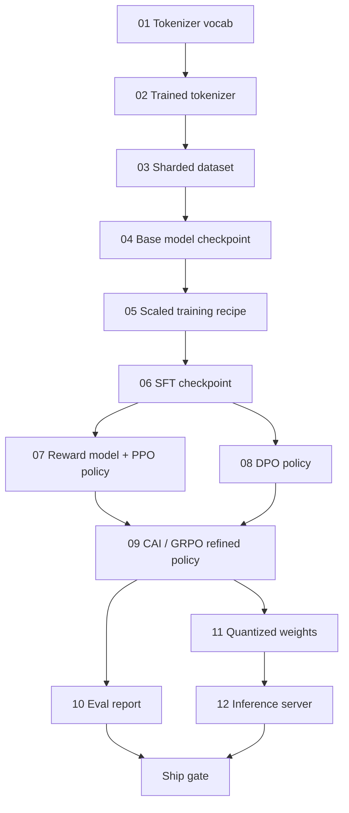
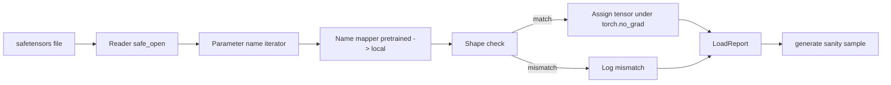
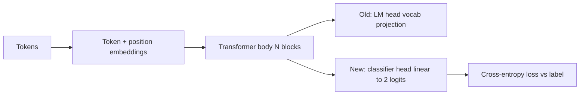
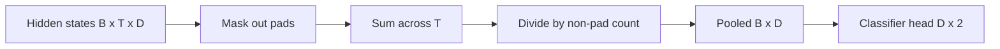

# Complete LLM Pipeline, Open Models & Fine-Tuning

> Combined lessons (5 parts), merged verbatim — no content removed.

**Type:** Combined

---

## Part 1 (ch195): Building a Complete LLM Pipeline

> Everything from Lessons 01 to 12 is one stage of one pipeline. This lesson is the scaffold that turns those stages into a single end-to-end run: tokenize, pre-train, scale, SFT, align, evaluate, quantize, serve.

**Type:** Build
**Languages:** Python (stdlib)
**Prerequisites:** All Phase 10 lessons 01-12
**Time:** ~120 minutes

## Learning Objectives

- Compose the eleven prior lessons into a single reproducible pipeline spec
- Define the artifact contract between stages
- Build an orchestrator that tracks experiments, hashes artifacts, and gates ship decisions on eval thresholds
- Design the rollback plan: cheap vs expensive stages

## The Problem

The previous lessons each work. Tokenizer trained. Tiny GPT pre-trained. SFT dataset assembled. Each is a notebook with its own conventions, output paths, and seeds.

A frontier training run is not a notebook. Llama 3 405B took 30 million H100 hours. DeepSeek-V3 used 2.8 million H800 hours. One corrupted checkpoint, one data contamination, one eval regression can cost a week of wall-clock and a month of GPU budget. Pipeline hygiene saves this: every stage has a deterministic input, a deterministic output, a manifest, a hash, and a gate.

You will not run the pipeline end-to-end on a laptop. You will write the orchestrator, the manifest, the verifier, and the replay plan.

## The Concept

### The Twelve Stages



### The Manifest

A single file describing a run completely enough to replay it. Nothing depends on state outside the manifest.

```
pipeline_version: 1.2.3
seed: 42
git_commit: a1b2c3d4
stages:
  01_tokenizer:
    recipe: bpe_32k
    input_hash: sha256:...
    output_hash: sha256:...
    wall_clock_sec: 3600
    cost_usd: 12
```

Output hash of stage N is the input hash of stage N+1. Any deviation halts the pipeline.

### Artifact Typing

| Stage | Artifact Type | Key Fields |
|-------|--------------|-----------|
| 01-02 | Tokenizer | vocab.json, merges.txt, hash |
| 03 | Dataset | shards[], row count, dedup stats |
| 04-05 | Checkpoint | weights.safetensors, config.json, step count |
| 06 | SFT Model | checkpoint + SFT recipe + data mix |
| 07 | Reward Model | RM checkpoint + preference data hash |
| 08-09 | Policy | checkpoint + KL budget consumed |
| 10 | Eval Report | benchmark scores + regression diffs |
| 11 | Quantized Model | quantized weights + accuracy delta vs FP16 |
| 12 | Server Spec | endpoint + model hash + observability hooks |

### The Eval Gate

```
gates:
  mmlu:      >= baseline + 0.5
  humaneval: >= baseline + 1.0
  truthfulqa: >= baseline
  safety_refusal_rate: <= 0.05
  kl_from_reference: <= 25.0
  cost_total_usd: <= 50000
```

Every gate is a numeric threshold. No subjective sign-offs.

### The Orchestrator

Resolves the DAG from the manifest, dispatches stages, tracks artifacts, halts on any contract violation. ~200 lines of Python.

1. Resolve the DAG
2. Check if output already exists at correct hash (skip)
3. Run stage, capture stdout/stderr, measure wall clock and cost
4. Verify output hash against downstream's expected input hash
5. On failure, exit nonzero with partial manifest

### Reproducibility vs Determinism

Modern LLM training is reproducible but not deterministic. GPU kernel non-determinism produces floats differing at 1e-5 between runs. If headline metrics match, the run is reproduced.

### Rollback Plan

- **Cheap** (hours): tokenizer, eval, quantization, inference server
- **Medium** (days): SFT, DPO, CAI -- keep base model, re-run alignment
- **Expensive** (weeks and millions): pre-training -- use last good checkpoint

## Build It

The code implements an orchestrator with `Manifest`, `Stage`, and `EvalGate` dataclasses. Each stage is a placeholder producing the correct artifact shape. Running end-to-end proves the plumbing before burning GPU money.

- `Manifest`: pipeline version, seed, git commit, stages, gates
- `Stage`: name, type, inputs (hashes), output (hash), wall clock, cost
- `Orchestrator.run()`: resolves DAG, dispatches stages, verifies hashes
- `EvalGate.check()`: reads thresholds, compares against eval report
- `CostTracker`: per-stage and cumulative, halts when cap exceeded

## Use It

```
python main.py plan    # validate manifest, compute cost estimate
python main.py run     # execute stages, write manifest.out.yaml
python main.py gate    # read manifest, apply eval gates, ship-or-hold
```

Running `plan` is free. Running `run` is expensive. Catch bugs on the cheap side.

## Ship It

This lesson produces `outputs/skill-llm-pipeline-reviewer.md` -- checks pipeline manifests for contract violations.

## Exercises

1. Extend the orchestrator to support parallel execution of stages 07 and 08 using `concurrent.futures`.
2. Add a contamination check gate that computes overlap between eval and training datasets (13-gram match).
3. Implement cost estimator: FLOPs = 6 x params x tokens, 40% MFU on H100 at $2.50/GPU-hour.
4. Build partial rollback: simulate failure at stage 09, re-run stages 09-12 with 01-08 cached.
5. Add OpenTelemetry spans for each stage with params, tokens, loss, and cost attributes.

## Further Reading

- Dubey et al., "The Llama 3 Herd of Models" (2024)
- DeepSeek-AI, "DeepSeek-V3 Technical Report" (2024)
- Kaplan et al., "Scaling Laws for Neural Language Models" (2020)
- Hoffmann et al., "Training Compute-Optimal LLMs (Chinchilla)" (2022)

---

## Part 2 (ch196): Open Models: Architecture Walkthroughs

> You built a GPT-2 Small from scratch. Frontier open models are the same family with five or six concrete changes. The math you already know covers 95% of them.

**Type:** Learn
**Languages:** Python (stdlib)
**Prerequisites:** Phase 10, Lessons 04, 05, 12
**Time:** ~45 minutes

## Learning Objectives

- Read any model's config.json and explain every field
- Name the specific architectural change each model made vs GPT-2 and why
- Compute parameter count, KV cache size, and activation memory from config alone
- Pick the right model for a deployment target

## The Problem

You wrote 350 lines of numpy and had a GPT-2-shaped model. Llama 3 405B has a 200-page report. The skeleton -- embedding, transformer blocks, attention, MLP, norm, head -- is unchanged. A diff. This lesson shows exactly what changed from GPT-2, why, and what it cost.

## The Concept

### The Invariant Core

All autoregressive open models share: token embedding matrix, stack of N decoder blocks, final norm and linear head, causal mask, next-token cross-entropy loss.

### The Six Knobs

1. **RMSNorm.** LayerNorm subtracts mean and divides by std. RMSNorm keeps only the scale: `x / sqrt(mean(x^2) + eps) * gamma`. ~10% faster, matches quality. Every modern open model uses it.

2. **RoPE.** Learned position embeddings cannot extrapolate beyond training length. Rotary Position Embedding rotates Q and K vectors by an angle that is a deterministic function of position. With NTK/YaRN scaling, 8k-trained models stretch to 128k at inference.

3. **SwiGLU.** GPT-2's `gelu(xW1)W2` becomes `(xW1) * sigmoid(xW1) * xV`. Two parallel projections gated by Swish. Stronger perplexity per parameter. MLP hidden size adjusted to `8/3 * hidden`.

4. **Attention Head Sharing.** MHA -> GQA -> MQA -> MLA. GQA (Grouped-Query Attention) shares K,V across groups of Q heads. Llama 3 8B uses 32 Q heads, 8 KV heads (4x KV cache reduction). MLA (DeepSeek) compresses to a low-rank latent.

5. **Mixture of Experts.** K experts per block, router picks top-k per token. More total params, same active params. Mixtral 8x7B: 47B total, 13B active. DeepSeek-V3: 671B total, 37B active.

6. **Pre-norm.** Norm before each sublayer, not after. Strictly easier to train at depth.

### Model-by-Model Diff

| Model | Params | Active | Norm | Activation | Position | Attention | MoE |
|-------|--------|--------|------|-----------|----------|-----------|-----|
| GPT-2 Small | 124M | 124M | LayerNorm | GELU | Learned | MHA 12 | no |
| Llama 3 8B | 8B | 8B | RMSNorm | SwiGLU | RoPE | GQA 32/8 | no |
| Llama 3 70B | 70B | 70B | RMSNorm | SwiGLU | RoPE | GQA 64/8 | no |
| Mistral 7B | 7.2B | 7.2B | RMSNorm | SwiGLU | RoPE | GQA | no |
| Mixtral 8x7B | 47B | 13B | RMSNorm | SwiGLU | RoPE | GQA | 8 top-2 |
| Gemma 2 9B | 9B | 9B | RMSNorm | GeGLU | RoPE+slide | GQA | no |
| DeepSeek V3 | 671B | 37B | RMSNorm | SwiGLU | RoPE | MLA | 256 top-8 |

### Reading a config.json

```json
{
  "hidden_size": 4096,
  "intermediate_size": 14336,
  "num_hidden_layers": 32,
  "num_attention_heads": 32,
  "num_key_value_heads": 8,
  "max_position_embeddings": 131072,
  "rope_theta": 500000.0,
  "rms_norm_eps": 1e-5,
  "vocab_size": 128256
}
```

`hidden_size`: embedding dim. `intermediate_size`: MLP hidden (SwiGLU: ~3.5x hidden). `num_key_value_heads`: KV heads for GQA. `rope_theta`: RoPE base frequency (500k for long-context).

### Memory Budget

KV cache at max context: `2 * num_layers * num_kv_heads * head_dim * seq_len * 2` (BF16). Llama 3 8B at 128k: 17.2 GB -- larger than the 16 GB weights.

### When Each Model Wins

- Single 80GB GPU: Llama 3 8B, Mistral 7B
- Single node big capacity: Llama 3 70B, Qwen 2.5 72B
- Biggest open capability: DeepSeek V3
- Long-context: Llama 3, DeepSeek (MLA advantage)

## Build It

The code is a parameter calculator. Given any config.json, it prints parameter count by component, KV cache at max context, SwiGLU MLP ratio, and architecture verdict.

## Use It

Run on Llama 3 8B, Mistral 7B, Mixtral 8x7B, DeepSeek V3 configs. Compare breakdowns. Notice MoE models have total params dwarfing dense but active params often smaller.

## Ship It

This lesson produces `outputs/skill-open-model-picker.md` -- recommends model + quantization + inference stack for a deployment target.

## Exercises

1. Read Qwen 2.5 72B config from HuggingFace, compute total parameters, compare to HF-reported value.
2. Compute KV cache for Llama 3 405B at 128k in FP8 and BF16; calculate concurrent sequences on 8xH100.
3. Gemma 2 alternates full and sliding-window attention. Write KV cache math when half the layers use sliding window.
4. Find a recent frontier open model released after this lesson. Identify which knobs it picked.

## Further Reading

- Dubey et al., "The Llama 3 Herd of Models" (2024)
- DeepSeek-AI, "DeepSeek-V3 Technical Report" (2024)
- Su et al., "RoFormer: Enhanced Transformer with RoPE" (2021)
- Shazeer, "GLU Variants Improve Transformer" (2020)
- Ainslie et al., "GQA: Training Generalized Multi-Query Transformer Models" (2023)

---

## Part 3 (ch451): Loading Pretrained Weights

> Training a 124M parameter model from scratch is a budget decision; loading a published checkpoint is a Tuesday. This lesson loads pretrained GPT-2 style weights from a safetensors file into the exact architecture from lesson 35, walks the parameter name mapping, and sanity generates a continuation to prove the load worked.

**Type:** Build
**Languages:** Python
**Prerequisites:** Phase 19 lessons 30 to 36
**Time:** ~90 minutes

## Learning Objectives

- Read a safetensors file with the `safetensors` Python library.
- Map each pretrained parameter name onto a parameter inside the lesson 35 GPT model.
- Handle name conventions that differ between published GPT-2 weights and the local model.
- Detect and refuse a shape mismatch before any weight assignment.
- Generate a continuation with loaded weights and confirm the tokens come from the loaded distribution.

## The Problem

Published weights carry the names the original implementation used. `transformer.h.0.attn.c_attn.weight` of shape `(2304, 768)` vs `blocks.0.attn.qkv.weight`. The same parameter with three subtly different identities (name, shape, byte layout).

## The Concept



The `c_attn`/`c_proj`/`c_fc` linears are stored with the matrix transposed relative to `nn.Linear.weight`. The loader transposes during assignment.

## Build It

`code/main.py` implements a small replica of `GPTModel`, a `NAME_MAP` dictionary, `load_safetensors` returning a `LoadReport`, `make_stub_safetensors`, and a demo that shows pre-load and post-load continuations.

## Key Terms

| Term | What people say | What it actually means |
|------|-----------------|------------------------|
| Name map | "Key remapping" | Function from pretrained tensor names to local parameter names |
| Shape mismatch | "Bad shape" | Tensor exists under mapped name but dimensions disagree |
| Transpose-on-load | "Conv1d layout" | Published GPT-2 stores projections transposed |
| Weight tying alias | "Shared LM head" | `model.lm_head.weight = model.tok_embed.weight` |
| Load report | "Coverage summary" | Tracks loaded, missing, unexpected, shape_mismatch lists |

[Reference](https://github.com/rohitg00/ai-engineering-from-scratch/tree/main/phases/19-capstone-projects/37-loading-pretrained-weights)

---

## Part 4 (ch452): Classifier Fine-Tuning by Head Swap

> Track B's first capstone. A pretrained language model is a stack of self-attention blocks ending in a token-prediction head. This lesson rips the head off, glues a two-class linear layer onto the pooled representation, and trains the classifier two different ways: final-layer only and full fine-tuning.

**Type:** Build
**Languages:** Python (torch, numpy)
**Prerequisites:** Phase 19 lessons 30-37
**Time:** ~90 minutes

## Learning Objectives

- Replace a language-model head with a classification head without re-initialising the body.
- Implement two training regimes: frozen body (head-only) and full fine-tuning, sharing one training loop.
- Build a tokeniser-aware data pipeline that pads, masks padding, and pools attention output.
- Compute precision, recall, F1, and a confusion matrix from raw logits.
- Reason about the trade-off between parameter count, training time, and head-room.

## The Concept



Head-only training: set `requires_grad=False` on body parameters. Full fine-tuning: let gradients flow through the whole stack.

## The Pooling Question

Mean pool: average hidden states across the sequence, weighted by the attention mask. CLS pool: use only the first token's output. Last-token pool: use the last non-padding token.



## What you will build

`ByteTokenizer`, `Block`, `LMBody`, `MeanPool`, `Classifier`, `freeze_body`/`unfreeze_body`, `train_classifier`, `evaluate`. The demo pretrains briefly, then trains and evaluates head-only then full, prints both reports.

[Reference](https://github.com/rohitg00/ai-engineering-from-scratch/tree/main/phases/19-capstone-projects/38-classifier-finetuning)

---

## Part 5 (ch423): End-to-End Fine-Tuning Pipeline (Data to SFT to DPO to Serve)

> An 8B model trained on your own data, DPO-aligned on your own preferences, quantized, speculative-decoded, and served at measurable $/1M tokens. The 2026 open stack is Axolotl v0.8, TRL 0.15, Unsloth for iteration, GPTQ/AWQ/GGUF for quantization, vLLM 0.7 with EAGLE-3 for serving. The capstone is to run the whole pipeline reproducibly — YAML in, served endpoint out — and publish a model card under the 2026 Model Openness Framework.

**Type:** Capstone
**Languages:** Python (pipeline), YAML (configs), Bash (scripts)
**Prerequisites:** Phase 2 (ML), Phase 3 (DL), Phase 7 (transformers), Phase 10 (LLMs from scratch), Phase 11 (LLM engineering), Phase 17 (infrastructure), Phase 18 (safety)
**Time:** 35 hours

## Problem

Every serious AI team in 2026 keeps a fine-tuning pipeline on tap. Not because they ship a frontier base model, but because downstream adaptation — domain SFT, DPO against labeled preferences, distilled drafts for speculative decoding, serving with EAGLE-3 — is where the measurable wins live. Axolotl v0.8 handles multi-GPU SFT configs. TRL 0.15 handles DPO and GRPO. Unsloth gets you fast single-GPU iteration. vLLM 0.7 with EAGLE-3 pushes decode throughput 2-3x without quality loss. The tooling works; the craft is in the YAMLs, the data hygiene, and the eval discipline.

You will run an 8B base (Llama 3.3, Qwen3, or Gemma 3) through SFT then DPO on task-specific data, quantize for serving, and measure gains against lm-evaluation-harness, RewardBench-2, MT-Bench-v2, and MMLU-Pro. You will produce a model card under the 2026 Model Openness Framework. The point is reproducibility — one command reruns the whole pipeline end to end.

## Concept

The pipeline has five stages. **Data**: dedup (MinHash / Datatrove), quality filter (Nemotron-CC style classifier), PII scrub, split-hygiene check against public benchmark contamination. **SFT**: Axolotl YAML, ZeRO-3 on 8xH100, cosine schedule, packed sequences, 2-3 epochs. **DPO or GRPO**: TRL config, 1 epoch, preference pairs either human-labeled or model-judged, beta tuning. **Quantize**: GPTQ + AWQ + GGUF for deployment flexibility. **Serve**: vLLM 0.7 with EAGLE-3 speculative heads (or SGLang with SpecForge), K8s deployment, HPA on queue-wait.

Ablations are the deliverable: SFT-only vs SFT+DPO vs SFT+GRPO on three task-specific benchmarks. Serving metrics: tokens/s at batch 1 / 8 / 32, EAGLE-3 acceptance rate, $/1M tokens. Safety eval: Llama Guard 4 pass rate. Model card: bias evaluations, reproducibility seeds, data licensing.

## Architecture

```mermaid
graph TD
    data[raw data] --> dedup[Datatrove dedup + Nemotron-CC quality filter + PII scrub]
    dedup --> hygiene[split hygiene (MMLU-Pro contamination check)]
    hygiene --> sft[Axolotl SFT config -> 8xH100, ZeRO-3]
    sft --> dpo[TRL DPO / GRPO -> 4xH100]
    dpo --> quant[GPTQ + AWQ + GGUF]
    quant --> serve[vLLM 0.7 + EAGLE-3]
    serve --> k8s[K8s deployment, HPA on queue-wait]
    k8s --> eval[lm-eval + RewardBench-2 + MT-Bench-v2 + MMLU-Pro]
    eval --> card[model card + safety eval]
```

## Stack

- Data: Datatrove for dedup, Nemotron-CC classifier for quality, Presidio for PII
- Base: Llama 3.3 8B, Qwen3 14B, or Gemma 3 12B
- SFT: Axolotl v0.8 with ZeRO-3, Flash Attention 3, packed sequences
- Preference tuning: TRL 0.15 for DPO or GRPO; Unsloth for single-GPU iteration
- Quantization: GPTQ (Marlin), AWQ, GGUF via llama.cpp
- Serving: vLLM 0.7 with EAGLE-3 speculative decoding (or SGLang 0.4 + SpecForge)
- Eval: lm-evaluation-harness, RewardBench-2, MT-Bench-v2, MMLU-Pro
- Safety eval: Llama Guard 4, ShieldGemma-2
- Infrastructure: Kubernetes + NVIDIA device plugin, HPA on queue-wait metric
- Observability: W&B for training, Langfuse for inference

## Build It

1. **Data pipeline.** Run Datatrove dedup on raw corpus. Apply Nemotron-CC-style quality classifier. Presidio scrubs PII. Write train/val splits with explicit seed.

2. **Contamination check.** For every validation split, compute MinHash against MMLU-Pro, MT-Bench-v2, RewardBench-2 test sets. Reject any overlap.

3. **Axolotl SFT.** YAML with ZeRO-3, FA3, sequence packing. 2-3 epochs on 8xH100. Log to W&B.

4. **TRL DPO / GRPO.** Take the SFT checkpoint, run one epoch of DPO on preference pairs (or GRPO with a verifiable reward on math/code). Sweep beta.

5. **Quantize.** Produce three quants: GPTQ-INT4-Marlin, AWQ-INT4, GGUF-Q4_K_M for llama.cpp. Record size and nominal throughput.

6. **Serve with speculative decoding.** vLLM 0.7 config with EAGLE-3 draft heads trained via Red Hat Speculators. Measure acceptance rate and tail latency at batch 1 / 8 / 32. Report $/1M tokens vs Anthropic / OpenAI on the same eval.

7. **Eval matrix.** Run lm-eval-harness, RewardBench-2, MT-Bench-v2, MMLU-Pro on base, SFT-only, SFT+DPO, SFT+GRPO. Produce a table.

8. **Safety eval.** Llama Guard 4 pass rate on the dev set. ShieldGemma-2 output filter.

9. **Model card.** MOF 2026 template: data, training, eval, safety, license, reproducibility section with YAMLs and commit SHAs.

## Use It

```console
$ ./pipeline.sh config/llama3.3-8b-domainX.yaml
[data]    300k deduped, 12k filtered, 280k accepted (seed=7)
[SFT]     3 epochs, 8xH100, 6h12m, val loss 1.42 -> 1.03
[DPO]     1 epoch, beta=0.08, 4xH100, 1h40m
[quant]   GPTQ-INT4 4.6 GB, AWQ-INT4 4.8 GB, GGUF-Q4_K_M 5.1 GB
[serve]   vLLM 0.7, EAGLE-3 acceptance 0.74, p99 126ms @ bs=8
[eval]    MMLU-Pro +3.2, MT-Bench-v2 +0.41, RewardBench-2 +0.08
[card]    model-card.md generated under 2026 MOF
```

## Ship It

`outputs/skill-finetuning-pipeline.md` describes the deliverable. A single command runs data through SFT through DPO through quant through serve through eval, and emits a model card + the served endpoint.

| Weight | Criterion | How it is measured |
|:-:|---|---|
| 25 | Eval delta vs base | Measured gain on target tasks (MMLU-Pro, MT-Bench-v2, task-specific) |
| 20 | Pipeline reproducibility | One command reruns end to end with identical seeds |
| 20 | Data hygiene | Dedup rate, PII scrub coverage, contamination check green |
| 20 | Serving efficiency | tokens/s at bs=1/8/32, EAGLE-3 acceptance rate, $/1M tokens |
| 15 | Model card + safety eval | 2026 MOF completeness + Llama Guard 4 pass rate |
| **100** | | |

## Exercises

1. Run SFT-only vs SFT+DPO vs SFT+GRPO on the same task-specific benchmark. Report which preference method wins and by how much.

2. Swap Llama 3.3 8B for Qwen3 14B. Measure the $/1M tokens at matched quality.

3. Measure EAGLE-3 acceptance rate on domain data vs generic ShareGPT. Report the delta and what it means for latency budgets.

4. Inject 1% of contamination (leak MMLU-Pro answers into training data) and rerun eval. Watch MMLU-Pro accuracy jump unrealistically. Build a contamination-check CI gate that catches this.

5. Add LoRA SFT as an alternative to full fine-tune. Measure the quality gap at 10x lower memory.

## Key Terms

| Term | What people say | What it actually means |
|------|-----------------|------------------------|
| Axolotl | "SFT trainer" | Unified YAML-driven trainer for SFT, DPO, and distillation |
| TRL | "Preference tuner" | Hugging Face library for DPO, GRPO, PPO on LLMs |
| GRPO | "Group-relative policy optimization" | DeepSeek R1's RL recipe with verifiable rewards |
| EAGLE-3 | "Speculative decoding draft" | Draft heads that predict N tokens ahead; vLLM verifies with target model |
| MOF | "Model Openness Framework" | 2026 standard for grading model releases on data, code, license |
| Contamination check | "Split hygiene" | MinHash-based detection of test-set leakage into training |
| Acceptance rate | "EAGLE / MTP metric" | Fraction of drafted tokens the target model accepts |

## Further Reading

- [Axolotl documentation](https://axolotl-ai-cloud.github.io/axolotl/)
- [TRL documentation](https://huggingface.co/docs/trl)
- [Unsloth](https://github.com/unslothai/unsloth)
- [DeepSeek R1 paper (arXiv:2501.12948)](https://arxiv.org/abs/2501.12948)
- [vLLM + EAGLE-3 documentation](https://docs.vllm.ai)
- [SGLang SpecForge](https://github.com/sgl-project/SpecForge)
- [Model Openness Framework 2026](https://isocpp.org/)
- [lm-evaluation-harness](https://github.com/EleutherAI/lm-evaluation-harness)

[Reference](https://github.com/rohitg00/ai-engineering-from-scratch/tree/main/phases/19-capstone-projects/07-end-to-end-fine-tuning-pipeline)
