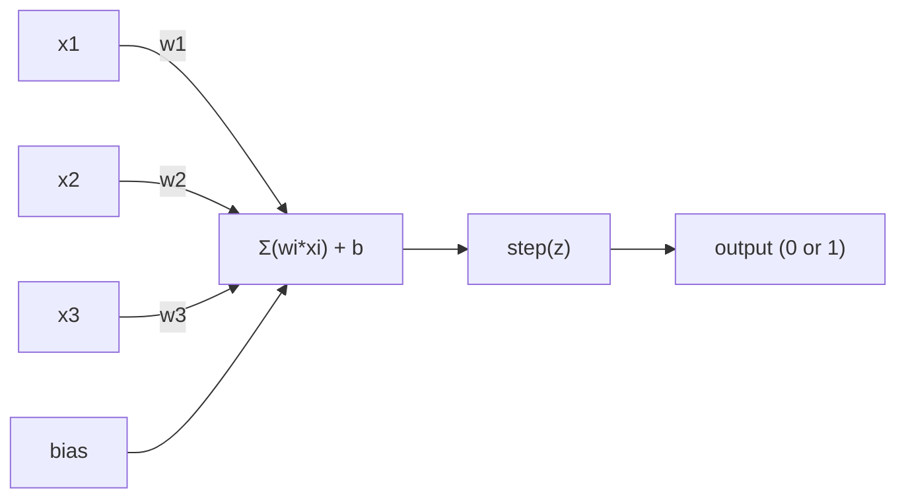
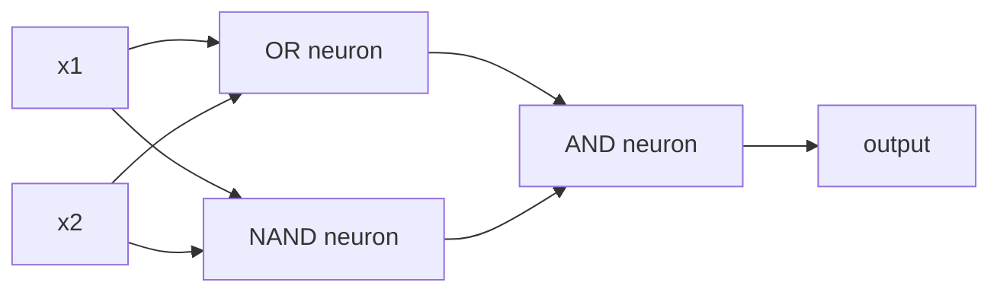

# The Perceptron

> The perceptron is the atom of neural networks. Split it open and you find weights, a bias, and a decision.

**Type:** Build
**Languages:** Python
**Prerequisites:** Phase 1 (Linear Algebra Intuition)
**Time:** ~60 minutes

## Learning Objectives

- Implement a perceptron from scratch in Python, including the weight update rule and step activation function
- Explain why a single perceptron can only solve linearly separable problems and demonstrate the XOR failure case
- Construct a multi-layer perceptron by composing OR, NAND, and AND gates to solve XOR
- Train a two-layer network with sigmoid activation and backpropagation to learn XOR automatically

## The Problem

You know vectors and dot products. You know that a matrix transforms inputs into outputs. But how does a machine *learn* which transformation to use?

The perceptron answers this. It's the simplest possible learning machine: take some inputs, multiply by weights, add a bias, and make a binary decision. Then adjust. That's it. Every neural network ever built is layers of this idea stacked together.

## The Concept

### One Neuron, One Decision

A perceptron takes n inputs, multiplies each by a weight, sums them up, adds a bias, and passes the result through an activation function.



The step function is brutal: if the weighted sum plus bias is >= 0, output 1. Otherwise, output 0.

```
step(z) = 1  if z >= 0
           0  if z < 0
```

This is a linear classifier. The weights and bias define a line (or hyperplane in higher dimensions) that splits the input space into two regions.

### The Decision Boundary

For two inputs, the perceptron draws a line through 2D space. Everything on one side of the line outputs 0. Everything on the other side outputs 1. Training moves this line until it correctly separates the classes.

### The Learning Rule

The perceptron learning rule is simple:

```
For each training example (x, y_true):
    y_pred = predict(x)
    error = y_true - y_pred
    For each weight:
        w_i = w_i + learning_rate * error * x_i
    bias = bias + learning_rate * error
```

If the prediction is correct, error = 0, nothing changes. If it predicts 0 but should be 1, weights increase. If it predicts 1 but should be 0, weights decrease. The learning rate controls how big each adjustment is.

### The XOR Problem

Here's where it breaks. Look at these logic gates:

```
AND gate:           OR gate:            XOR gate:
x1  x2  out         x1  x2  out         x1  x2  out
0   0   0           0   0   0           0   0   0
0   1   0           0   1   1           0   1   1
1   0   0           1   0   1           1   0   1
1   1   1           1   1   1           1   1   0
```

AND and OR are linearly separable: you can draw a single line to separate the 0s from the 1s. XOR is not. No single line can separate [0,1] and [1,0] from [0,0] and [1,1].

This is a fundamental limit. A single perceptron can only solve linearly separable problems. Minsky and Papert proved this in 1969 and it nearly killed neural network research for a decade.

The fix: stack perceptrons into layers. A multi-layer perceptron can solve XOR by combining two linear decisions into a nonlinear one.

## Build It

### Step 1: The Perceptron Class

```python
class Perceptron:
    def __init__(self, n_inputs, learning_rate=0.1):
        self.weights = [0.0] * n_inputs
        self.bias = 0.0
        self.lr = learning_rate

    def predict(self, inputs):
        total = sum(w * x for w, x in zip(self.weights, inputs))
        total += self.bias
        return 1 if total >= 0 else 0

    def train(self, training_data, epochs=100):
        for epoch in range(epochs):
            errors = 0
            for inputs, target in training_data:
                prediction = self.predict(inputs)
                error = target - prediction
                if error != 0:
                    errors += 1
                    for i in range(len(self.weights)):
                        self.weights[i] += self.lr * error * inputs[i]
                    self.bias += self.lr * error
            if errors == 0:
                print(f"Converged at epoch {epoch + 1}")
                return
```

### Step 2: Train on Logic Gates

```python
and_data = [([0, 0], 0), ([0, 1], 0), ([1, 0], 0), ([1, 1], 1)]
or_data  = [([0, 0], 0), ([0, 1], 1), ([1, 0], 1), ([1, 1], 1)]
not_data = [([0], 1), ([1], 0)]

p_and = Perceptron(2)
p_and.train(and_data)
for inputs, _ in and_data:
    print(f"  {inputs} -> {p_and.predict(inputs)}")
```

### Step 3: Watch XOR Fail

```python
xor_data = [([0, 0], 0), ([0, 1], 1), ([1, 0], 1), ([1, 1], 0)]

p_xor = Perceptron(2)
p_xor.train(xor_data, epochs=1000)
```

It will never converge. This is the hard proof that a single perceptron cannot learn XOR.

### Step 4: Solve XOR with Two Layers

The trick: XOR = (x1 OR x2) AND NOT (x1 AND x2). Combine three perceptrons:



```python
def xor_network(x1, x2):
    or_neuron = Perceptron(2)
    or_neuron.weights = [1.0, 1.0]; or_neuron.bias = -0.5
    nand_neuron = Perceptron(2)
    nand_neuron.weights = [-1.0, -1.0]; nand_neuron.bias = 1.5
    and_neuron = Perceptron(2)
    and_neuron.weights = [1.0, 1.0]; and_neuron.bias = -1.5
    hidden1 = or_neuron.predict([x1, x2])
    hidden2 = nand_neuron.predict([x1, x2])
    return and_neuron.predict([hidden1, hidden2])
```

All four cases correct. Stacking perceptrons into layers creates decision boundaries that no single perceptron can produce.

### Step 5: Train a Two-Layer Network

Replace the step function with sigmoid and learn the weights automatically through backpropagation:

```python
class TwoLayerNetwork:
    def __init__(self, learning_rate=0.5):
        import random
        random.seed(0)
        self.w_hidden = [[random.uniform(-1, 1) for _ in range(2)] for _ in range(2)]
        self.b_hidden = [random.uniform(-1, 1), random.uniform(-1, 1)]
        self.w_output = [random.uniform(-1, 1), random.uniform(-1, 1)]
        self.b_output = random.uniform(-1, 1)
        self.lr = learning_rate

    def sigmoid(self, x):
        import math
        x = max(-500, min(500, x))
        return 1.0 / (1.0 + math.exp(-x))

    def forward(self, inputs):
        self.inputs = inputs
        self.hidden_outputs = []
        for i in range(2):
            z = sum(w * x for w, x in zip(self.w_hidden[i], inputs)) + self.b_hidden[i]
            self.hidden_outputs.append(self.sigmoid(z))
        z_out = sum(w * h for w, h in zip(self.w_output, self.hidden_outputs)) + self.b_output
        self.output = self.sigmoid(z_out)
        return self.output

    def train(self, training_data, epochs=10000):
        for epoch in range(epochs):
            total_error = 0
            for inputs, target in training_data:
                output = self.forward(inputs)
                error = target - output
                d_output = error * output * (1 - output)
                saved_w_output = self.w_output[:]
                hidden_deltas = []
                for i in range(2):
                    h = self.hidden_outputs[i]
                    hd = d_output * saved_w_output[i] * h * (1 - h)
                    hidden_deltas.append(hd)
                for i in range(2):
                    self.w_output[i] += self.lr * d_output * self.hidden_outputs[i]
                self.b_output += self.lr * d_output
                for i in range(2):
                    for j in range(len(inputs)):
                        self.w_hidden[i][j] += self.lr * hidden_deltas[i] * inputs[j]
                    self.b_hidden[i] += self.lr * hidden_deltas[i]

net = TwoLayerNetwork(learning_rate=2.0)
net.train(xor_data, epochs=10000)
```

Two key differences: sigmoid replaces the step function (it's smooth, so gradients exist), and the train method propagates error backward from output to hidden layer.

## Use It

Everything you just built from scratch exists in sklearn:

```python
from sklearn.linear_model import Perceptron as SkPerceptron
import numpy as np

X = np.array([[0,0],[0,1],[1,0],[1,1]])
y = np.array([0, 0, 0, 1])

clf = SkPerceptron(max_iter=100, tol=1e-3)
clf.fit(X, y)
```

What changes in production networks: the step function becomes sigmoid, ReLU, or other smooth activations; weights are learned automatically via backpropagation; layers get deeper.

## Key Terms

| Term | What people say | What it actually means |
|------|----------------|----------------------|
| Perceptron | "A fake neuron" | A linear classifier: dot product of inputs and weights, plus bias, through a step function |
| Weight | "How important an input is" | A multiplier that scales each input's contribution to the decision |
| Bias | "The threshold" | A constant that shifts the decision boundary |
| Activation function | "The thing that squishes values" | A function applied after the weighted sum |
| Linearly separable | "You can draw a line between them" | A dataset where a single hyperplane can perfectly separate the classes |
| XOR problem | "The thing perceptrons can't do" | Proof that single-layer networks cannot learn non-linearly-separable functions |
| Decision boundary | "Where the classifier switches" | The hyperplane w*x + b = 0 that divides input space |
| Multi-layer perceptron | "A real neural network" | Perceptrons stacked in layers, where each layer's output feeds the next |

## Exercises

1. Train a perceptron on a NAND gate. Verify its weights and bias form a valid decision boundary.
2. Modify the Perceptron class to track the decision boundary at each epoch. Print how the line shifts during training on the AND gate.
3. Build a 3-input perceptron that outputs 1 only when at least 2 of the 3 inputs are 1 (majority vote). Is this linearly separable?

## Further Reading

- Frank Rosenblatt, "The Perceptron: A Probabilistic Model for Information Storage and Organization in the Brain" (1958)
- Minsky & Papert, "Perceptrons" (1969) -- the book that proved XOR was unsolvable by single-layer networks
- Michael Nielsen, "Neural Networks and Deep Learning", Chapter 1 (http://neuralnetworksanddeeplearning.com/)

[Reference](https://github.com/rohitg00/ai-engineering-from-scratch/tree/main/phases/03-deep-learning-core/01-the-perceptron)
